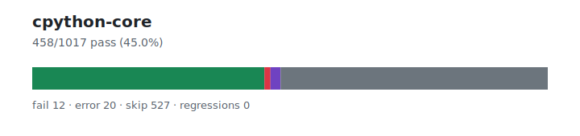

# cpython-core — `1.3.5+20260626.bfb28f6`

- Image digest: `c8be44d98f1f086fee340d19c5e6d66e4c88f5d593213d47783361b87bcaf657`
- Suite version: `7c999be49dee7f12703e4b2e07e990544fabd40e`
- Ran: 2026-06-27T17:14:00.269Z → 2026-06-27T17:14:11.514Z

## Summary

**Pass rate: 458/1017 (45.03%)**

| pass | fail | error | skip | regressions | new passes |
|---:|---:|---:|---:|---:|---:|
| 458 | 12 | 20 | 527 | 0 | 0 |

## Observed cases (490)

- `test_builtin` — error — AttributeError("module '_asyncio' has no attribute 'Future'")
- `test_re.ExternalTests.test_re_benchmarks` — pass
- `test_re.ExternalTests.test_re_tests` — pass
- `test_re.ImplementationTest.test_deprecated_modules` — pass
- `test_re.ImplementationTest.test_overlap_table` — pass
- `test_re.ImplementationTest.test_signedness` — pass
- `test_re.PatternReprTests.test_bytes` — pass
- `test_re.PatternReprTests.test_flags_repr` — pass
- `test_re.PatternReprTests.test_inline_flags` — pass
- `test_re.PatternReprTests.test_locale` — pass
- `test_re.PatternReprTests.test_long_pattern` — pass
- `test_re.PatternReprTests.test_multiple_flags` — pass
- `test_re.PatternReprTests.test_quotes` — pass
- `test_re.PatternReprTests.test_single_flag` — pass
- `test_re.PatternReprTests.test_unicode_flag` — pass
- `test_re.PatternReprTests.test_unknown_flags` — pass
- `test_re.PatternReprTests.test_without_flags` — pass
- `test_re.ReTests.test_ASSERT_NOT_mark_bug` — pass
- `test_re.ReTests.test_MARK_PUSH_macro_bug` — pass
- `test_re.ReTests.test_MIN_REPEAT_ONE_mark_bug` — pass
- `test_re.ReTests.test_MIN_UNTIL_mark_bug` — pass
- `test_re.ReTests.test_REPEAT_ONE_mark_bug` — pass
- `test_re.ReTests.test_anyall` — pass
- `test_re.ReTests.test_ascii_and_unicode_flag` — pass
- `test_re.ReTests.test_atomic_grouping` — pass
- `test_re.ReTests.test_backref_group_name_in_exception` — pass
- `test_re.ReTests.test_basic_re_sub` — pass
- `test_re.ReTests.test_big_codesize` — pass
- `test_re.ReTests.test_bigcharset` — pass
- `test_re.ReTests.test_branching` — pass
- `test_re.ReTests.test_bug_113254` — pass
- `test_re.ReTests.test_bug_114660` — pass
- `test_re.ReTests.test_bug_117612` — pass
- `test_re.ReTests.test_bug_1661` — pass
- `test_re.ReTests.test_bug_16688` — pass
- `test_re.ReTests.test_bug_20998` — pass
- `test_re.ReTests.test_bug_2537` — pass
- `test_re.ReTests.test_bug_29444` — pass
- `test_re.ReTests.test_bug_34294` — pass
- `test_re.ReTests.test_bug_3629` — pass
- `test_re.ReTests.test_bug_40736` — fail — Traceback (most recent call last):
  File "/work/suites/cpython/Lib/test/test_re.py", line 2405, in test_bug_40736
    with self.assertRaisesRegex(TypeError, "got 'int'"):
AssertionError: "got 'int'" does not match "object of type 'int' has no len()"

- `test_re.ReTests.test_bug_418626` — pass
- `test_re.ReTests.test_bug_448951` — pass
- `test_re.ReTests.test_bug_449000` — pass
- `test_re.ReTests.test_bug_449964` — pass
- `test_re.ReTests.test_bug_527371` — pass
- `test_re.ReTests.test_bug_581080` — pass
- `test_re.ReTests.test_bug_612074` — pass
- `test_re.ReTests.test_bug_6509` — pass
- `test_re.ReTests.test_bug_6561` — pass
- `test_re.ReTests.test_bug_725106` — pass
- `test_re.ReTests.test_bug_725149` — pass
- `test_re.ReTests.test_bug_764548` — pass
- `test_re.ReTests.test_bug_817234` — pass
- `test_re.ReTests.test_bug_926075` — pass
- `test_re.ReTests.test_bug_931848` — pass
- `test_re.ReTests.test_bug_gh101955` — pass
- `test_re.ReTests.test_bug_gh106052` — pass
- `test_re.ReTests.test_bug_gh91616` — pass
- `test_re.ReTests.test_bytes_str_mixing` — pass
- `test_re.ReTests.test_category` — pass
- `test_re.ReTests.test_character_set_any` — pass
- `test_re.ReTests.test_character_set_errors` — pass
- `test_re.ReTests.test_character_set_none` — pass
- `test_re.ReTests.test_comments` — pass
- `test_re.ReTests.test_compile` — pass
- `test_re.ReTests.test_constants` — pass
- `test_re.ReTests.test_copying` — pass
- `test_re.ReTests.test_dollar_matches_twice` — pass
- `test_re.ReTests.test_empty_array` — pass
- `test_re.ReTests.test_enum` — pass
- `test_re.ReTests.test_error` — pass
- `test_re.ReTests.test_expand` — pass
- `test_re.ReTests.test_fail` — pass
- `test_re.ReTests.test_findall_atomic_grouping` — pass
- `test_re.ReTests.test_findall_possessive_quantifiers` — pass
- `test_re.ReTests.test_finditer` — pass
- `test_re.ReTests.test_flags` — pass
- `test_re.ReTests.test_fullmatch_atomic_grouping` — pass
- `test_re.ReTests.test_fullmatch_possessive_quantifiers` — pass
- `test_re.ReTests.test_getattr` — pass
- `test_re.ReTests.test_group` — pass
- `test_re.ReTests.test_group_name_in_exception` — pass
- `test_re.ReTests.test_groupdict` — pass
- `test_re.ReTests.test_ignore_case` — pass
- `test_re.ReTests.test_ignore_case_range` — pass
- `test_re.ReTests.test_ignore_case_set` — pass
- `test_re.ReTests.test_ignore_spaces` — pass
- `test_re.ReTests.test_inline_flags` — pass
- `test_re.ReTests.test_issue17998` — pass
- `test_re.ReTests.test_keep_buffer` — fail — Traceback (most recent call last):
  File "/work/suites/cpython/Lib/test/test_re.py", line 71, in test_keep_buffer
    with self.assertRaises(BufferError):
AssertionError: BufferError not raised

- `test_re.ReTests.test_keyword_parameters` — pass
- `test_re.ReTests.test_large_search` — pass
- `test_re.ReTests.test_large_subn` — pass
- `test_re.ReTests.test_locale_caching` — fail — Traceback (most recent call last):
  File "/work/suites/cpython/Lib/test/test_re.py", line 2130, in test_locale_caching
    self.check_en_US_iso88591()
  File "/work/suites/cpython/Lib/test/test_re.py", line 2139, in check_en_US_iso88591
    self.assertTrue(re.match(b'\xc5', b'\xe5', re.L|re.I))
AssertionError: None is not true

- `test_re.ReTests.test_locale_compiled` — fail — Traceback (most recent call last):
  File "/work/suites/cpython/Lib/test/test_re.py", line 2175, in test_locale_compiled
    self.assertTrue(p.match(b'\xe5\xe5'))
AssertionError: None is not true

- `test_re.ReTests.test_locale_flag` — pass
- `test_re.ReTests.test_lookahead` — pass
- `test_re.ReTests.test_lookbehind` — pass
- `test_re.ReTests.test_match_getitem` — pass
- `test_re.ReTests.test_match_repr` — pass
- `test_re.ReTests.test_misc_errors` — pass
- `test_re.ReTests.test_multiple_repeat` — pass
- `test_re.ReTests.test_named_unicode_escapes` — pass
- `test_re.ReTests.test_not_literal` — pass
- `test_re.ReTests.test_nothing_to_repeat` — pass
- `test_re.ReTests.test_other_escapes` — pass
- `test_re.ReTests.test_pattern_compare` — pass
- `test_re.ReTests.test_pattern_compare_bytes` — pass
- `test_re.ReTests.test_pickling` — pass
- `test_re.ReTests.test_possessive_quantifiers` — pass
- `test_re.ReTests.test_possible_set_operations` — fail — Traceback (most recent call last):
  File "/work/suites/cpython/Lib/test/test_re.py", line 1216, in test_possible_set_operations
    with self.assertWarnsRegex(FutureWarning, 'Possible set difference') as w:
AssertionError: FutureWarning not triggered

- `test_re.ReTests.test_qualified_re_split` — pass
- `test_re.ReTests.test_qualified_re_sub` — pass
- `test_re.ReTests.test_re_escape` — pass
- `test_re.ReTests.test_re_escape_bytes` — pass
- `test_re.ReTests.test_re_escape_non_ascii` — pass
- `test_re.ReTests.test_re_escape_non_ascii_bytes` — pass
- `test_re.ReTests.test_re_findall` — pass
- `test_re.ReTests.test_re_fullmatch` — pass
- `test_re.ReTests.test_re_groupref` — pass
- `test_re.ReTests.test_re_groupref_exists` — pass
- `test_re.ReTests.test_re_groupref_exists_errors` — pass
- `test_re.ReTests.test_re_groupref_exists_validation_bug` — pass
- `test_re.ReTests.test_re_groupref_overflow` — pass
- `test_re.ReTests.test_re_match` — pass
- `test_re.ReTests.test_re_split` — pass
- `test_re.ReTests.test_re_subn` — pass
- `test_re.ReTests.test_regression_gh94675` — error — Traceback (most recent call last):
  File "/work/suites/cpython/Lib/test/test_re.py", line 2621, in test_regression_gh94675
    p.start()
  File "/work/suites/cpython/Lib/multiprocessing/process.py", line 121, in start
    self._popen = self._Popen(self)
                  ^^^^^^^^^^^^^^^^^
  File "/work/suites/cpython/Lib/multiprocessing/context.py", line 224, in _Popen
    return _default_context.get_context().Process._Popen(process_obj)
           ^^^^^^^^^^^^^^^^^^^^^^^^^^^^^^^^^^^^^^^^^^^^^^^^^^^^^^^^^^
  File "/work/suites/cpython/Lib/multiprocessing/context.py", line 282, in _Popen
    return Popen(process_obj)
           ^^^^^^^^^^^^^^^^^^
  File "/work/suites/cpython/Lib/multiprocessing/popen_fork.py", line 19, in __init__
    self._launch(process_obj)
  File "/work/suites/cpython/Lib/multiprocessing/popen_fork.py", line 66, in _launch
    self.pid = os.fork()
               ^^^^^^^^^
AttributeError: module 'os' has no attribute 'fork'

- `test_re.ReTests.test_repeat_minmax` — pass
- `test_re.ReTests.test_repeat_minmax_overflow` — fail — Traceback (most recent call last):
  File "/work/suites/cpython/Lib/test/test_re.py", line 1987, in test_repeat_minmax_overflow
    self.assertRaises(OverflowError, re.compile, r".{%d}" % 2**128)
AssertionError: OverflowError not raised by compile

- `test_re.ReTests.test_scanner` — pass
- `test_re.ReTests.test_scoped_flags` — pass
- `test_re.ReTests.test_search_anchor_at_beginning` — pass
- `test_re.ReTests.test_search_coverage` — pass
- `test_re.ReTests.test_search_dot_unicode` — pass
- `test_re.ReTests.test_search_star_plus` — pass
- `test_re.ReTests.test_special_escapes` — pass
- `test_re.ReTests.test_sre_byte_class_literals` — pass
- `test_re.ReTests.test_sre_byte_literals` — pass
- `test_re.ReTests.test_sre_character_class_literals` — pass
- `test_re.ReTests.test_sre_character_literals` — pass
- `test_re.ReTests.test_stack_overflow` — pass
- `test_re.ReTests.test_sub_template_numeric_escape` — pass
- `test_re.ReTests.test_symbolic_groups` — pass
- `test_re.ReTests.test_symbolic_groups_errors` — fail — Traceback (most recent call last):
  File "/work/suites/cpython/Lib/test/test_re.py", line 287, in test_symbolic_groups_errors
    self.checkPatternError(b'(?P<\xc2\xb5>x)',
  File "/work/suites/cpython/Lib/test/test_re.py", line 50, in checkPatternError
    with self.assertRaises(re.error) as cm:
AssertionError: error not raised

- `test_re.ReTests.test_symbolic_refs` — pass
- `test_re.ReTests.test_symbolic_refs_errors` — pass
- `test_re.ReTests.test_template_function_and_flag_is_deprecated` — pass
- `test_re.ReTests.test_unlimited_zero_width_repeat` — pass
- `test_re.ReTests.test_weakref` — pass
- `test_re.ReTests.test_word_boundaries` — pass
- `test_re.ReTests.test_zerowidth` — pass
- `json` — pass
- `json.encoder.JSONEncoder.encode` — pass
- `test_json.TestPyTest.test_pyjson` — pass
- `test_json.TestCTest.test_cjson` — pass
- `json` — pass
- `json.encoder.JSONEncoder.encode` — pass
- `test_json.TestPyTest.test_pyjson` — pass
- `test_json.TestCTest.test_cjson` — pass
- `test_json.test_decode.TestCDecode.test_bytes` — pass
- `test_json.test_decode.TestCDecode.test_constant_invalid_case` — pass
- `test_json.test_decode.TestCDecode.test_decimal` — pass
- `test_json.test_decode.TestCDecode.test_decoder_optimizations` — pass
- `test_json.test_decode.TestCDecode.test_empty_objects` — pass
- `test_json.test_decode.TestCDecode.test_extra_data` — pass
- `test_json.test_decode.TestCDecode.test_float` — pass
- `test_json.test_decode.TestCDecode.test_invalid_escape` — pass
- `test_json.test_decode.TestCDecode.test_invalid_input_type` — pass
- `test_json.test_decode.TestCDecode.test_keys_reuse` — pass
- `test_json.test_decode.TestCDecode.test_limit_int` — pass
- `test_json.test_decode.TestCDecode.test_negative_index` — pass
- `test_json.test_decode.TestCDecode.test_nonascii_digits_rejected` — pass
- `test_json.test_decode.TestCDecode.test_object_pairs_hook` — pass
- `test_json.test_decode.TestCDecode.test_parse_constant` — pass
- `test_json.test_decode.TestCDecode.test_string_with_utf8_bom` — pass
- `test_json.test_decode.TestPyDecode.test_bytes` — pass
- `test_json.test_decode.TestPyDecode.test_constant_invalid_case` — pass
- `test_json.test_decode.TestPyDecode.test_decimal` — pass
- `test_json.test_decode.TestPyDecode.test_decoder_optimizations` — pass
- `test_json.test_decode.TestPyDecode.test_empty_objects` — pass
- `test_json.test_decode.TestPyDecode.test_extra_data` — pass
- `test_json.test_decode.TestPyDecode.test_float` — pass
- `test_json.test_decode.TestPyDecode.test_invalid_escape` — pass
- `test_json.test_decode.TestPyDecode.test_invalid_input_type` — pass
- `test_json.test_decode.TestPyDecode.test_keys_reuse` — pass
- `test_json.test_decode.TestPyDecode.test_limit_int` — pass
- `test_json.test_decode.TestPyDecode.test_negative_index` — pass
- `test_json.test_decode.TestPyDecode.test_nonascii_digits_rejected` — pass
- `test_json.test_decode.TestPyDecode.test_object_pairs_hook` — pass
- `test_json.test_decode.TestPyDecode.test_parse_constant` — pass
- `test_json.test_decode.TestPyDecode.test_string_with_utf8_bom` — pass
- `test_json.test_default.TestCDefault.test_default` — pass
- `test_json.test_default.TestCDefault.test_ordereddict` — pass
- `test_json.test_default.TestPyDefault.test_default` — pass
- `test_json.test_default.TestPyDefault.test_ordereddict` — pass
- `test_json.test_dump.TestCDump.test_dump` — pass
- `test_json.test_dump.TestCDump.test_dump_skipkeys` — pass
- `test_json.test_dump.TestCDump.test_dumps` — pass
- …and 290 more
