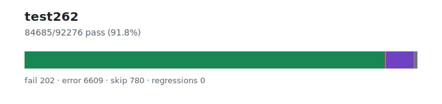

# test262 — `1.3.5+20260626.bfb28f6`

- Image digest: `c8be44d98f1f086fee340d19c5e6d66e4c88f5d593213d47783361b87bcaf657`
- Suite version: `de8e621cdba4f40cff3cf244e6cfb8cb48746b4a`
- Ran: 2026-06-27T18:44:42.911Z → 2026-06-27T18:56:48.919Z

## Summary

**Pass rate: 84685/92276 (91.77%)**

| pass | fail | error | skip | regressions | new passes |
|---:|---:|---:|---:|---:|---:|
| 84685 | 202 | 6609 | 780 | 0 | 0 |
