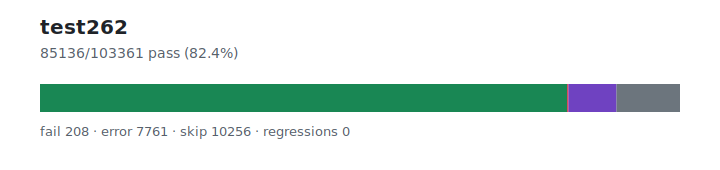

# test262 — `1.3.5+20260628.3b80cf3`

- Image digest: `3583aceded8e8e4cab8248f08f245aa6859ce893f81e9de5c52097863c70b4cb`
- Suite version: `de8e621cdba4f40cff3cf244e6cfb8cb48746b4a`
- Ran: 2026-06-28T03:50:18.910Z → 2026-06-28T04:01:17.235Z

## Summary

**Pass rate: 84685/92276 (91.77%)**

| pass | fail | error | skip | regressions | new passes |
|---:|---:|---:|---:|---:|---:|
| 84685 | 202 | 6609 | 780 | 0 | 0 |
