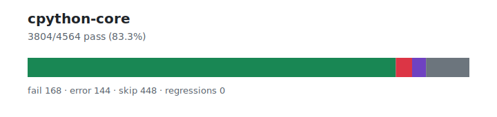

# cpython-core — `1.3.5+20260628.3b80cf3`

- Image digest: `c8be44d98f1f086fee340d19c5e6d66e4c88f5d593213d47783361b87bcaf657`
- Suite version: `7c999be49dee7f12703e4b2e07e990544fabd40e`
- Ran: 2026-06-28T02:07:44.084Z → 2026-06-28T02:08:18.298Z

## Summary

**Pass rate: 3804/4564 (83.35%)**

| pass | fail | error | skip | regressions | new passes |
|---:|---:|---:|---:|---:|---:|
| 3804 | 168 | 144 | 448 | 0 | 0 |

## Observed cases (4116)

- `test_scope.ScopeTests.testBoundAndFree` — pass
- `test_scope.ScopeTests.testCellIsArgAndEscapes` — pass
- `test_scope.ScopeTests.testCellIsKwonlyArg` — pass
- `test_scope.ScopeTests.testCellIsLocalAndEscapes` — pass
- `test_scope.ScopeTests.testClassAndGlobal` — pass
- `test_scope.ScopeTests.testClassNamespaceOverridesClosure` — pass
- `test_scope.ScopeTests.testComplexDefinitions` — pass
- `test_scope.ScopeTests.testEvalExecFreeVars` — pass
- `test_scope.ScopeTests.testEvalFreeVars` — pass
- `test_scope.ScopeTests.testExtraNesting` — pass
- `test_scope.ScopeTests.testFreeVarInMethod` — pass
- `test_scope.ScopeTests.testFreeingCell` — pass
- `test_scope.ScopeTests.testGlobalInParallelNestedFunctions` — pass
- `test_scope.ScopeTests.testLambdas` — pass
- `test_scope.ScopeTests.testLeaks` — fail — Traceback (most recent call last):
  File "/work/suites/cpython/Lib/test/test_scope.py", line 478, in testLeaks
    self.assertEqual(Foo.count, 0)
AssertionError: 100 != 0

- `test_scope.ScopeTests.testListCompLocalVars` — pass
- `test_scope.ScopeTests.testLocalsClass` — pass
- `test_scope.ScopeTests.testLocalsFunction` — pass
- `test_scope.ScopeTests.testMixedFreevarsAndCellvars` — pass
- `test_scope.ScopeTests.testNearestEnclosingScope` — pass
- `test_scope.ScopeTests.testNestedNonLocal` — pass
- `test_scope.ScopeTests.testNestingGlobalNoFree` — pass
- `test_scope.ScopeTests.testNestingPlusFreeRefToGlobal` — pass
- `test_scope.ScopeTests.testNestingThroughClass` — pass
- `test_scope.ScopeTests.testNonLocalClass` — pass
- `test_scope.ScopeTests.testNonLocalFunction` — pass
- `test_scope.ScopeTests.testNonLocalGenerator` — pass
- `test_scope.ScopeTests.testNonLocalMethod` — pass
- `test_scope.ScopeTests.testRecursion` — pass
- `test_scope.ScopeTests.testScopeOfGlobalStmt` — pass
- `test_scope.ScopeTests.testSimpleAndRebinding` — pass
- `test_scope.ScopeTests.testSimpleNesting` — pass
- `test_scope.ScopeTests.testTopIsNotSignificant` — pass
- `test_scope.ScopeTests.testUnboundLocal` — pass
- `test_scope.ScopeTests.testUnboundLocal_AfterDel` — pass
- `test_scope.ScopeTests.testUnboundLocal_AugAssign` — pass
- `test_scope.ScopeTests.testUnoptimizedNamespaces` — pass
- `test_scope.ScopeTests.test_multiple_nesting` — pass
- `test_slice.SliceTest.test_cmp` — pass
- `test_slice.SliceTest.test_constructor` — pass
- `test_slice.SliceTest.test_copy` — pass
- `test_class.ClassTests.testBadTypeReturned` — pass
- `test_class.ClassTests.testBinaryOps` — pass
- `test_class.ClassTests.testClassWithExtCall` — pass
- `test_class.ClassTests.testConstructorErrorMessages` — pass
- `test_range.RangeTest.test_attributes` — pass
- `test_range.RangeTest.test_comparison` — pass
- `test_range.RangeTest.test_contains` — pass
- `test_range.RangeTest.test_count` — pass
- `test_range.RangeTest.test_empty` — pass
- `test_range.RangeTest.test_exhausted_iterator_pickling` — pass
- `test_range.RangeTest.test_index` — pass
- `test_range.RangeTest.test_invalid_invocation` — pass
- `test_range.RangeTest.test_issue11845` — pass
- `test_copy.TestCopy.test_copy_atomic` — pass
- `test_copy.TestCopy.test_copy_basic` — pass
- `test_copy.TestCopy.test_copy_bytearray` — pass
- `test_copy.TestCopy.test_copy_cant` — pass
- `test_defaultdict.TestDefaultDict.test_basic` — pass
- `test_defaultdict.TestDefaultDict.test_callable_arg` — pass
- `test_defaultdict.TestDefaultDict.test_copy` — pass
- `test_defaultdict.TestDefaultDict.test_deep_copy` — pass
- `test_defaultdict.TestDefaultDict.test_keyerror_without_factory` — pass
- `test_defaultdict.TestDefaultDict.test_missing` — pass
- `test_defaultdict.TestDefaultDict.test_pickling` — pass
- `test_copy.TestCopy.test_copy_copy` — pass
- `test_copy.TestCopy.test_copy_dict` — pass
- `test_copy.TestCopy.test_copy_frozenset` — pass
- `test_copy.TestCopy.test_copy_function` — pass
- `test_copy.TestCopy.test_copy_inst_copy` — pass
- `test_copy.TestCopy.test_copy_inst_getinitargs` — pass
- `test_copy.TestCopy.test_copy_inst_getnewargs` — pass
- `test_copy.TestCopy.test_copy_inst_getnewargs_ex` — pass
- `test_copy.TestCopy.test_copy_inst_getstate` — pass
- `test_copy.TestCopy.test_copy_inst_getstate_setstate` — pass
- `test_copy.TestCopy.test_copy_inst_setstate` — pass
- `test_copy.TestCopy.test_copy_inst_vanilla` — pass
- `test_copy.TestCopy.test_copy_list` — pass
- `test_copy.TestCopy.test_copy_list_subclass` — pass
- `test_copy.TestCopy.test_copy_reduce` — pass
- `test_copy.TestCopy.test_copy_reduce_ex` — pass
- `test_copy.TestCopy.test_copy_registry` — pass
- `test_copy.TestCopy.test_copy_set` — pass
- `test_copy.TestCopy.test_copy_slots` — pass
- `test_copy.TestCopy.test_copy_tuple` — pass
- `test_copy.TestCopy.test_copy_tuple_subclass` — pass
- `test_re.ExternalTests.test_re_benchmarks` — pass
- `test_class.ClassTests.testDel` — fail — Traceback (most recent call last):
  File "/work/suites/cpython/Lib/test/test_class.py", line 472, in testDel
    self.assertEqual(["crab people, crab people"], x)
AssertionError: Lists differ: ['crab people, crab people'] != []

First list contains 1 additional elements.
First extra element 0:
'crab people, crab people'

- ['crab people, crab people']
+ []

- `test_class.ClassTests.testForExceptionsRaisedInInstanceGetattr2` — pass
- `test_class.ClassTests.testGetSetAndDel` — pass
- `test_range.RangeTest.test_iterator_pickling` — pass
- `test_range.RangeTest.test_iterator_pickling_overflowing_index` — pass
- `test_range.RangeTest.test_iterator_setstate` — pass
- `test_range.RangeTest.test_iterator_unpickle_compat` — pass
- `test_range.RangeTest.test_large_exhausted_iterator_pickling` — pass
- `test_range.RangeTest.test_large_operands` — pass
- `test_range.RangeTest.test_large_range` — pass
- `test_range.RangeTest.test_odd_bug` — pass
- `test_range.RangeTest.test_pickling` — pass
- `test_range.RangeTest.test_range` — pass
- `test_range.RangeTest.test_range_constructor_error_messages` — fail — Traceback (most recent call last):
  File "/work/suites/cpython/Lib/test/test_range.py", line 95, in test_range_constructor_error_messages
    with self.assertRaisesRegex(
AssertionError: "range expected at least 1 argument, got 0" does not match "range() missing 1 required positional argument: 'a'"

- `test_call.FastCallTests.test_fastcall_clearing_dict` — pass
- `test_super` — error — AttributeError("module '_asyncio' has no attribute 'Future'")
- `test_list.ListTest.test_addmul` — pass
- `test_list.ListTest.test_append` — pass
- `test_slice.SliceTest.test_cycle` — pass
- `test_slice.SliceTest.test_deepcopy` — pass
- `test_slice.SliceTest.test_hash` — pass
- `test_collections.TestChainMap.test_basics` — pass
- `test_collections.TestChainMap.test_bool` — pass
- `test_collections.TestChainMap.test_constructor` — pass
- `test_collections.TestChainMap.test_dict_coercion` — pass
- `test_collections.TestChainMap.test_iter_not_calling_getitem_on_maps` — pass
- `test_collections.TestChainMap.test_missing` — pass
- `test_collections.TestChainMap.test_new_child` — pass
- `test_collections.TestChainMap.test_order_preservation` — pass
- `test_collections.TestChainMap.test_ordering` — pass
- `test_defaultdict.TestDefaultDict.test_recursive_repr` — error — Traceback (most recent call last):
  File "/work/suites/cpython/Lib/test/test_defaultdict.py", line 136, in test_recursive_repr
    self.assertRegex(repr(d),
                     ^^^^^^^
RecursionError: maximum recursion depth exceeded

- `test_defaultdict.TestDefaultDict.test_repr` — pass
- `test_defaultdict.TestDefaultDict.test_shallow_copy` — pass
- `test_collections.TestChainMap.test_union_operators` — pass
- `test_defaultdict.TestDefaultDict.test_union` — pass
- `test_collections.TestCollectionABCs.test_Buffer` — fail — Traceback (most recent call last):
  File "/work/suites/cpython/Lib/test/test_collections.py", line 1965, in test_Buffer
    self.assertIsInstance(sample(b"x"), Buffer)
AssertionError: b'x' is not an instance of <class 'collections.abc.Buffer'>

- `test_collections.TestCollectionABCs.test_ByteString` — pass
- `test_collections.TestCollectionABCs.test_Mapping` — pass
- `test_collections.TestCollectionABCs.test_MutableMapping` — pass
- `test_collections.TestCollectionABCs.test_MutableMapping_subclass` — pass
- `test_collections.TestCollectionABCs.test_MutableSequence` — pass
- `test_collections.TestCollectionABCs.test_MutableSequence_mixins` — pass
- `test_call.FunctionCalls.test_frames_are_popped_after_failed_calls` — pass
- `test_call.FunctionCalls.test_kwargs_order` — pass
- `test_call.TestCallingConventions.test_fastcall` — pass
- `test_call.TestCallingConventions.test_fastcall_error_kw` — fail — Traceback (most recent call last):
  File "/work/suites/cpython/Lib/test/test_call.py", line 361, in test_fastcall_error_kw
    self.assertRaisesRegex(
AssertionError: "meth_fastcall\(\) takes no keyword arguments" does not match "meth_fastcall() got an unexpected keyword argument 'k'"

- `test_call.TestCallingConventions.test_fastcall_ext` — pass
- `test_call.TestCallingConventions.test_fastcall_keywords` — pass
- `test_call.TestCallingConventions.test_fastcall_keywords_ext` — pass
- `test_call.TestCallingConventions.test_noargs` — pass
- `test_call.TestCallingConventions.test_noargs_error_arg` — fail — Traceback (most recent call last):
  File "/work/suites/cpython/Lib/test/test_call.py", line 325, in test_noargs_error_arg
    self.assertRaisesRegex(
AssertionError: "meth_noargs\(\) takes no arguments \(1 given\)" does not match "meth_noargs() takes 0 positional arguments but 1 was given"

- `test_call.TestCallingConventions.test_noargs_error_arg2` — fail — Traceback (most recent call last):
  File "/work/suites/cpython/Lib/test/test_call.py", line 331, in test_noargs_error_arg2
    self.assertRaisesRegex(
AssertionError: "meth_noargs\(\) takes no arguments \(2 given\)" does not match "meth_noargs() takes 0 positional arguments but 2 were given"

- `test_call.TestCallingConventions.test_noargs_error_ext` — fail — Traceback (most recent call last):
  File "/work/suites/cpython/Lib/test/test_call.py", line 337, in test_noargs_error_ext
    self.assertRaisesRegex(
AssertionError: "meth_noargs\(\) takes no arguments \(3 given\)" does not match "meth_noargs() takes 0 positional arguments but 3 were given"

- `test_call.TestCallingConventions.test_noargs_error_kw` — fail — Traceback (most recent call last):
  File "/work/suites/cpython/Lib/test/test_call.py", line 343, in test_noargs_error_kw
    self.assertRaisesRegex(
AssertionError: "meth_noargs\(\) takes no keyword arguments" does not match "meth_noargs() got an unexpected keyword argument 'k'"

- `test_call.TestCallingConventions.test_noargs_ext` — pass
- `test_call.TestCallingConventions.test_o` — pass
- `test_call.TestCallingConventions.test_o_error_arg_kw` — fail — Traceback (most recent call last):
  File "/work/suites/cpython/Lib/test/test_call.py", line 313, in test_o_error_arg_kw
    self.assertRaisesRegex(
AssertionError: "meth_o\(\) takes no keyword arguments" does not match "meth_o() got an unexpected keyword argument 'k'"

- `test_call.TestCallingConventions.test_o_error_ext` — fail — Traceback (most recent call last):
  File "/work/suites/cpython/Lib/test/test_call.py", line 301, in test_o_error_ext
    self.assertRaisesRegex(
AssertionError: "meth_o\(\) takes exactly one argument \(3 given\)" does not match "meth_o() takes 1 positional argument but 3 were given"

- `test_call.TestCallingConventions.test_o_error_kw` — fail — Traceback (most recent call last):
  File "/work/suites/cpython/Lib/test/test_call.py", line 307, in test_o_error_kw
    self.assertRaisesRegex(
AssertionError: "meth_o\(\) takes no keyword arguments" does not match "meth_o() got an unexpected keyword argument 'k'"

- `test_call.TestCallingConventions.test_o_error_no_arg` — fail — Traceback (most recent call last):
  File "/work/suites/cpython/Lib/test/test_call.py", line 291, in test_o_error_no_arg
    self.assertRaisesRegex(TypeError, msg, self.obj.meth_o)
AssertionError: "meth_o\(\) takes exactly one argument \(0 given\)" does not match "meth_o() missing 1 required positional argument: 'arg'"

- `test_call.TestCallingConventions.test_o_error_two_args` — fail — Traceback (most recent call last):
  File "/work/suites/cpython/Lib/test/test_call.py", line 295, in test_o_error_two_args
    self.assertRaisesRegex(
AssertionError: "meth_o\(\) takes exactly one argument \(2 given\)" does not match "meth_o() takes 1 positional argument but 2 were given"

- `test_call.TestCallingConventions.test_o_ext` — pass
- `test_call.TestCallingConventions.test_varargs` — pass
- `test_call.TestCallingConventions.test_varargs_error_kw` — fail — Traceback (most recent call last):
  File "/work/suites/cpython/Lib/test/test_call.py", line 267, in test_varargs_error_kw
    self.assertRaisesRegex(
AssertionError: "meth_varargs\(\) takes no keyword arguments" does not match "meth_varargs() got an unexpected keyword argument 'k'"

- `test_call.TestCallingConventions.test_varargs_ext` — pass
- `test_call.TestCallingConventions.test_varargs_keywords` — pass
- `test_call.TestCallingConventions.test_varargs_keywords_ext` — pass
- `test_call.TestCallingConventionsClass.test_fastcall` — pass
- `test_call.TestCallingConventionsClass.test_fastcall_error_kw` — fail — Traceback (most recent call last):
  File "/work/suites/cpython/Lib/test/test_call.py", line 361, in test_fastcall_error_kw
    self.assertRaisesRegex(
AssertionError: "meth_fastcall\(\) takes no keyword arguments" does not match "MethClass.meth_fastcall() got an unexpected keyword argument 'k'"

- `test_call.TestCallingConventionsClass.test_fastcall_ext` — pass
- `test_call.TestCallingConventionsClass.test_fastcall_keywords` — pass
- `test_call.TestCallingConventionsClass.test_fastcall_keywords_ext` — pass
- `test_call.TestCallingConventionsClass.test_noargs` — pass
- `test_call.TestCallingConventionsClass.test_noargs_error_arg` — fail — Traceback (most recent call last):
  File "/work/suites/cpython/Lib/test/test_call.py", line 325, in test_noargs_error_arg
    self.assertRaisesRegex(
AssertionError: "meth_noargs\(\) takes no arguments \(1 given\)" does not match "MethClass.meth_noargs() takes 1 positional argument but 2 were given"

- `test_call.TestCallingConventionsClass.test_noargs_error_arg2` — fail — Traceback (most recent call last):
  File "/work/suites/cpython/Lib/test/test_call.py", line 331, in test_noargs_error_arg2
    self.assertRaisesRegex(
AssertionError: "meth_noargs\(\) takes no arguments \(2 given\)" does not match "MethClass.meth_noargs() takes 1 positional argument but 3 were given"

- `test_call.TestCallingConventionsClass.test_noargs_error_ext` — fail — Traceback (most recent call last):
  File "/work/suites/cpython/Lib/test/test_call.py", line 337, in test_noargs_error_ext
    self.assertRaisesRegex(
AssertionError: "meth_noargs\(\) takes no arguments \(3 given\)" does not match "MethClass.meth_noargs() takes 1 positional argument but 4 were given"

- `test_call.TestCallingConventionsClass.test_noargs_error_kw` — fail — Traceback (most recent call last):
  File "/work/suites/cpython/Lib/test/test_call.py", line 343, in test_noargs_error_kw
    self.assertRaisesRegex(
AssertionError: "meth_noargs\(\) takes no keyword arguments" does not match "MethClass.meth_noargs() got an unexpected keyword argument 'k'"

- `test_call.TestCallingConventionsClass.test_noargs_ext` — pass
- `test_call.TestCallingConventionsClass.test_o` — pass
- `test_call.TestCallingConventionsClass.test_o_error_arg_kw` — fail — Traceback (most recent call last):
  File "/work/suites/cpython/Lib/test/test_call.py", line 313, in test_o_error_arg_kw
    self.assertRaisesRegex(
AssertionError: "meth_o\(\) takes no keyword arguments" does not match "MethClass.meth_o() got an unexpected keyword argument 'k'"

- `test_call.TestCallingConventionsClass.test_o_error_ext` — fail — Traceback (most recent call last):
  File "/work/suites/cpython/Lib/test/test_call.py", line 301, in test_o_error_ext
    self.assertRaisesRegex(
AssertionError: "meth_o\(\) takes exactly one argument \(3 given\)" does not match "MethClass.meth_o() takes 2 positional arguments but 4 were given"

- `test_call.TestCallingConventionsClass.test_o_error_kw` — fail — Traceback (most recent call last):
  File "/work/suites/cpython/Lib/test/test_call.py", line 307, in test_o_error_kw
    self.assertRaisesRegex(
AssertionError: "meth_o\(\) takes no keyword arguments" does not match "MethClass.meth_o() got an unexpected keyword argument 'k'"

- `test_call.TestCallingConventionsClass.test_o_error_no_arg` — fail — Traceback (most recent call last):
  File "/work/suites/cpython/Lib/test/test_call.py", line 291, in test_o_error_no_arg
    self.assertRaisesRegex(TypeError, msg, self.obj.meth_o)
AssertionError: "meth_o\(\) takes exactly one argument \(0 given\)" does not match "MethClass.meth_o() missing 1 required positional argument: 'arg'"

- `test_call.TestCallingConventionsClass.test_o_error_two_args` — fail — Traceback (most recent call last):
  File "/work/suites/cpython/Lib/test/test_call.py", line 295, in test_o_error_two_args
    self.assertRaisesRegex(
AssertionError: "meth_o\(\) takes exactly one argument \(2 given\)" does not match "MethClass.meth_o() takes 2 positional arguments but 3 were given"

- `test_call.TestCallingConventionsClass.test_o_ext` — pass
- `test_call.TestCallingConventionsClass.test_varargs` — pass
- `test_call.TestCallingConventionsClass.test_varargs_error_kw` — fail — Traceback (most recent call last):
  File "/work/suites/cpython/Lib/test/test_call.py", line 267, in test_varargs_error_kw
    self.assertRaisesRegex(
AssertionError: "meth_varargs\(\) takes no keyword arguments" does not match "MethClass.meth_varargs() got an unexpected keyword argument 'k'"

- `test_call.TestCallingConventionsClass.test_varargs_ext` — pass
- `test_call.TestCallingConventionsClass.test_varargs_keywords` — pass
- `test_call.TestCallingConventionsClass.test_varargs_keywords_ext` — pass
- `test_call.TestCallingConventionsClassInstance.test_fastcall` — pass
- `test_call.TestCallingConventionsClassInstance.test_fastcall_error_kw` — fail — Traceback (most recent call last):
  File "/work/suites/cpython/Lib/test/test_call.py", line 361, in test_fastcall_error_kw
    self.assertRaisesRegex(
AssertionError: "meth_fastcall\(\) takes no keyword arguments" does not match "MethClass.meth_fastcall() got an unexpected keyword argument 'k'"

- `test_call.TestCallingConventionsClassInstance.test_fastcall_ext` — pass
- `test_call.TestCallingConventionsClassInstance.test_fastcall_keywords` — pass
- `test_call.TestCallingConventionsClassInstance.test_fastcall_keywords_ext` — pass
- `test_call.TestCallingConventionsClassInstance.test_noargs` — pass
- `test_call.TestCallingConventionsClassInstance.test_noargs_error_arg` — fail — Traceback (most recent call last):
  File "/work/suites/cpython/Lib/test/test_call.py", line 325, in test_noargs_error_arg
    self.assertRaisesRegex(
AssertionError: "meth_noargs\(\) takes no arguments \(1 given\)" does not match "MethClass.meth_noargs() takes 1 positional argument but 2 were given"

- `test_call.TestCallingConventionsClassInstance.test_noargs_error_arg2` — fail — Traceback (most recent call last):
  File "/work/suites/cpython/Lib/test/test_call.py", line 331, in test_noargs_error_arg2
    self.assertRaisesRegex(
AssertionError: "meth_noargs\(\) takes no arguments \(2 given\)" does not match "MethClass.meth_noargs() takes 1 positional argument but 3 were given"

- `test_call.TestCallingConventionsClassInstance.test_noargs_error_ext` — fail — Traceback (most recent call last):
  File "/work/suites/cpython/Lib/test/test_call.py", line 337, in test_noargs_error_ext
    self.assertRaisesRegex(
AssertionError: "meth_noargs\(\) takes no arguments \(3 given\)" does not match "MethClass.meth_noargs() takes 1 positional argument but 4 were given"

- `test_call.TestCallingConventionsClassInstance.test_noargs_error_kw` — fail — Traceback (most recent call last):
  File "/work/suites/cpython/Lib/test/test_call.py", line 343, in test_noargs_error_kw
    self.assertRaisesRegex(
AssertionError: "meth_noargs\(\) takes no keyword arguments" does not match "MethClass.meth_noargs() got an unexpected keyword argument 'k'"

- `test_call.TestCallingConventionsClassInstance.test_noargs_ext` — pass
- `test_call.TestCallingConventionsClassInstance.test_o` — pass
- `test_call.TestCallingConventionsClassInstance.test_o_error_arg_kw` — fail — Traceback (most recent call last):
  File "/work/suites/cpython/Lib/test/test_call.py", line 313, in test_o_error_arg_kw
    self.assertRaisesRegex(
AssertionError: "meth_o\(\) takes no keyword arguments" does not match "MethClass.meth_o() got an unexpected keyword argument 'k'"

- `test_call.TestCallingConventionsClassInstance.test_o_error_ext` — fail — Traceback (most recent call last):
  File "/work/suites/cpython/Lib/test/test_call.py", line 301, in test_o_error_ext
    self.assertRaisesRegex(
AssertionError: "meth_o\(\) takes exactly one argument \(3 given\)" does not match "MethClass.meth_o() takes 2 positional arguments but 4 were given"

- `test_call.TestCallingConventionsClassInstance.test_o_error_kw` — fail — Traceback (most recent call last):
  File "/work/suites/cpython/Lib/test/test_call.py", line 307, in test_o_error_kw
    self.assertRaisesRegex(
AssertionError: "meth_o\(\) takes no keyword arguments" does not match "MethClass.meth_o() got an unexpected keyword argument 'k'"

- `test_call.TestCallingConventionsClassInstance.test_o_error_no_arg` — fail — Traceback (most recent call last):
  File "/work/suites/cpython/Lib/test/test_call.py", line 291, in test_o_error_no_arg
    self.assertRaisesRegex(TypeError, msg, self.obj.meth_o)
AssertionError: "meth_o\(\) takes exactly one argument \(0 given\)" does not match "MethClass.meth_o() missing 1 required positional argument: 'arg'"

- `test_call.TestCallingConventionsClassInstance.test_o_error_two_args` — fail — Traceback (most recent call last):
  File "/work/suites/cpython/Lib/test/test_call.py", line 295, in test_o_error_two_args
    self.assertRaisesRegex(
AssertionError: "meth_o\(\) takes exactly one argument \(2 given\)" does not match "MethClass.meth_o() takes 2 positional arguments but 3 were given"

- `test_call.TestCallingConventionsClassInstance.test_o_ext` — pass
- `test_call.TestCallingConventionsClassInstance.test_varargs` — pass
- `test_call.TestCallingConventionsClassInstance.test_varargs_error_kw` — fail — Traceback (most recent call last):
  File "/work/suites/cpython/Lib/test/test_call.py", line 267, in test_varargs_error_kw
    self.assertRaisesRegex(
AssertionError: "meth_varargs\(\) takes no keyword arguments" does not match "MethClass.meth_varargs() got an unexpected keyword argument 'k'"

- `test_call.TestCallingConventionsClassInstance.test_varargs_ext` — pass
- `test_call.TestCallingConventionsClassInstance.test_varargs_keywords` — pass
- `test_call.TestCallingConventionsClassInstance.test_varargs_keywords_ext` — pass
- …and 3916 more
