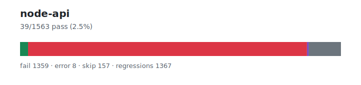

# node-api — `1.3.6+20260628.e4591fc`

- Image digest: `3d3ea83ed6403be11d119eb0234efa699809d81a801986659790996c18306a06`
- Suite version: `ed33ae74ad100a38df41edf56f6935c78821e779`
- Ran: 2026-06-28T23:56:29.725Z → 2026-06-28T23:57:42.981Z

## Summary

**Pass rate: 39/1563 (2.50%)**

| pass | fail | error | skip | regressions | new passes |
|---:|---:|---:|---:|---:|---:|
| 39 | 1359 | 8 | 157 | 1367 | 0 |

## Observed cases (1406)

- `test/parallel/test-assert-async.js` — fail — ╭─ Script Error ──────────────────────────────────────────────────────────────╮
│java.lang.UnsupportedOperationException: util.inspect() is not yet           │
│implemented                                                                  │
│                                                                             │
│ In file test/parallel/test-assert-async.js                                  │
│─ Stack Trace ───────────────────────────────────────────────────────────────│
│                                                                             │
│ ╭─ [js] _mustCallInner                                            <unknown> │
│ │─ [js] mustCallAtLeast                       test/common/index.js:543:10-4 │
│ │                                                                           │
│ · elide run test/parallel/test-assert-async.j                               │
│                                                                             │
│─ Advice ────────────────────────────────────────────────────────────────────│
│                                                                             │
│ An error occurred while executing your code.                                │
│                                                                             │
╰─────────────────────────────────────────────────────────────────────────────╯
- `test/parallel/test-assert-checktag.js` — fail — ╭─ Script Error ──────────────────────────────────────────────────────────────╮
│TypeError: Cannot load module: 'node:test'                                   │
│                                                                             │
│ In file test/parallel/test-assert-checktag.js:3:18:                         │
│    ╭─                                                                       │
│  2 │ const { hasCrypto, hasLocalStorage } = require('../common');           │
│→ 3 │ const { test } = require('node:test');                                 │
│  4 │ const assert = require('assert');                                      │
│  5 │                                                                        │
│  6 │ // Turn off no-restricted-properties because we are testing deepEqual! │
│  · │                                                                        │
│─ Stack Trace ───────────────────────────────────────────────────────────────│
│                                                                             │
│ ╭─ [js] :program                               test-assert-checktag.js:3:18 │
│ │                                                                           │
│ · elide run test/parallel/test-assert-checktag                              │
│                                                                             │
│─ Advice ────────────────────────────────────────────────────────────────────│
│                                                                             │
│ An error occurred while executing your code.                                │
│                                                                             │
╰─────────────────────────────────────────────────────────────────────────────╯
- `test/parallel/test-assert-if-error.js` — fail — ╭─ Script Error ──────────────────────────────────────────────────────────────╮
│TypeError: Cannot load module: 'node:test'                                   │
│                                                                             │
│ In file test/parallel/test-assert-if-error.js:5:18:                         │
│    ╭─                                                                       │
│  4 │ const assert = require('assert');                                      │
│→ 5 │ const { test } = require('node:test');                                 │
│  6 │                                                                        │
│  7 │ test('Test that assert.ifError has the correct stack trace of both stac│
│  8 │   let err;                                                             │
│  · │                                                                        │
│─ Stack Trace ───────────────────────────────────────────────────────────────│
│                                                                             │
│ ╭─ [js] :program                               test-assert-if-error.js:5:18 │
│ │                                                                           │
│ · elide run test/parallel/test-assert-if-error                              │
│                                                                             │
│─ Advice ────────────────────────────────────────────────────────────────────│
│                                                                             │
│ An error occurred while executing your code.                                │
│                                                                             │
╰─────────────────────────────────────────────────────────────────────────────╯
- `test/parallel/test-async-hooks-execution-async-resource-await.js` — fail — ╭─ Script Error ──────────────────────────────────────────────────────────────╮
│java.lang.UnsupportedOperationException: util.promisify() is not yet         │
│implemented                                                                  │
│                                                                             │
│ In file test/parallel/test-async-hooks-execution-async-resource-await.js    │
│─ Stack Trace ───────────────────────────────────────────────────────────────│
│                                                                             │
│ ╭─ [js] :program                                                    <unknow │
│ │                                                                           │
│ · elide run test/parallel/test-async-hooks-execution-async-resource         │
│                                                                             │
│─ Advice ────────────────────────────────────────────────────────────────────│
│                                                                             │
│ An error occurred while executing your code.                                │
│                                                                             │
╰─────────────────────────────────────────────────────────────────────────────╯
- `test/parallel/test-assert-typedarray-deepequal.js` — fail — ╭─ Script Error ──────────────────────────────────────────────────────────────╮
│TypeError: Cannot load module: 'node:test'                                   │
│                                                                             │
│ In file test/parallel/test-assert-typedarray-deepequal.js:5:25:             │
│    ╭─                                                                       │
│  4 │ const assert = require('assert');                                      │
│→ 5 │ const { test, suite } = require('node:test');                          │
│  6 │                                                                        │
│  7 │ function makeBlock(f) {                                                │
│  8 │   const args = Array.prototype.slice.call(arguments, 1);               │
│  · │                                                                        │
│─ Stack Trace ───────────────────────────────────────────────────────────────│
│                                                                             │
│ ╭─ [js] :program                             test-assert-typedarray-deepequ │
│ │                                                                           │
│ · elide run test/parallel/test-assert-typeda                                │
│                                                                             │
│─ Advice ────────────────────────────────────────────────────────────────────│
│                                                                             │
│ An error occurred while executing your code.                                │
│                                                                             │
╰─────────────────────────────────────────────────────────────────────────────╯
- `test/parallel/test-async-hooks-constructor.js` — fail — ╭─ Script Error ──────────────────────────────────────────────────────────────╮
│TypeError: Cannot load module: 'async_hooks'                                 │
│                                                                             │
│ In file test/parallel/test-async-hooks-constructor.js:7:21:                 │
│    ╭─                                                                       │
│   6 │ const assert = require('assert');                                     │
│→  7 │ const async_hooks = require('async_hooks');                           │
│   8 │ const nonFunctionArray = [null, -1, 1, {}, []];                       │
│   9 │                                                                       │
│  10 │ ['init', 'before', 'after', 'destroy', 'promiseResolve'].forEach(     │
│   · │                                                                       │
│─ Stack Trace ───────────────────────────────────────────────────────────────│
│                                                                             │
│ ╭─ [js] :program                             test-async-hooks-constructor.j │
│ │                                                                           │
│ · elide run test/parallel/test-async-hooks-c                                │
│                                                                             │
│─ Advice ────────────────────────────────────────────────────────────────────│
│                                                                             │
│ An error occurred while executing your code.                                │
│                                                                             │
╰─────────────────────────────────────────────────────────────────────────────╯
- `test/parallel/test-assert-esm-cjs-message-verify.js` — fail — ╭─ Script Error ──────────────────────────────────────────────────────────────╮
│TypeError: Cannot load module: 'node:test'                                   │
│                                                                             │
│ In file test/parallel/test-assert-esm-cjs-message-verify.js:5:26:           │
│    ╭─                                                                       │
│  4 │ const assert = require('node:assert');                                 │
│→ 5 │ const { describe, it } = require('node:test');                         │
│  6 │                                                                        │
│  7 │ const fileImports = {                                                  │
│  8 │   commonjs: 'const assert = require("assert");',                       │
│  · │                                                                        │
│─ Stack Trace ───────────────────────────────────────────────────────────────│
│                                                                             │
│ ╭─ [js] :program                             test-assert-esm-cjs-message-ve │
│ │                                                                           │
│ · elide run test/parallel/test-assert-esm-cj                                │
│                                                                             │
│─ Advice ────────────────────────────────────────────────────────────────────│
│                                                                             │
│ An error occurred while executing your code.                                │
│                                                                             │
╰─────────────────────────────────────────────────────────────────────────────╯
- `test/parallel/test-async-hooks-enable-before-promise-resolve.js` — fail — ╭─ Script Error ──────────────────────────────────────────────────────────────╮
│TypeError: Cannot load module: 'async_hooks'                                 │
│                                                                             │
│ In file test/parallel/test-async-hooks-enable-before-promise-resolve.js:4:21│
│    ╭─                                                                       │
│  3 │ const assert = require('assert');                                      │
│→ 4 │ const async_hooks = require('async_hooks');                            │
│  5 │                                                                        │
│  6 │ // This test ensures that fast-path PromiseHook assigns async ids      │
│  7 │ // to already created promises when the native hook function is        │
│  · │                                                                        │
│─ Stack Trace ───────────────────────────────────────────────────────────────│
│                                                                             │
│ ╭─ [js] :program                            test-async-hooks-enable-before- │
│ │                                                                           │
│ · elide run test/parallel/test-async-hooks-                                 │
│                                                                             │
│─ Advice ────────────────────────────────────────────────────────────────────│
│                                                                             │
│ An error occurred while executing your code.                                │
│                                                                             │
╰─────────────────────────────────────────────────────────────────────────────╯
- `test/parallel/test-assert-deep-with-error.js` — fail — ╭─ Script Error ──────────────────────────────────────────────────────────────╮
│TypeError: Cannot load module: 'node:test'                                   │
│                                                                             │
│ In file test/parallel/test-assert-deep-with-error.js:4:18:                  │
│    ╭─                                                                       │
│  3 │ const assert = require('assert');                                      │
│→ 4 │ const { test } = require('node:test');                                 │
│  5 │                                                                        │
│  6 │ // Disable colored output to prevent color codes from breaking assertio│
│  7 │ // message comparisons. This should only be an issue when process.stdou│
│  · │                                                                        │
│─ Stack Trace ───────────────────────────────────────────────────────────────│
│                                                                             │
│ ╭─ [js] :program                              test-assert-deep-with-error.j │
│ │                                                                           │
│ · elide run test/parallel/test-assert-deep-wi                               │
│                                                                             │
│─ Advice ────────────────────────────────────────────────────────────────────│
│                                                                             │
│ An error occurred while executing your code.                                │
│                                                                             │
╰─────────────────────────────────────────────────────────────────────────────╯
- `test/parallel/test-assert-myers-diff.js` — fail — ╭─ Script Error ──────────────────────────────────────────────────────────────╮
│TypeError: Cannot load module: 'internal/assert/myers_diff'                  │
│                                                                             │
│ In file test/parallel/test-assert-myers-diff.js:7:23:                       │
│    ╭─                                                                       │
│   6 │                                                                       │
│→  7 │ const { myersDiff } = require('internal/assert/myers_diff');          │
│   8 │                                                                       │
│   9 │ {                                                                     │
│  10 │   const arr1 = { length: 2 ** 31 - 1 };                               │
│   · │                                                                       │
│─ Stack Trace ───────────────────────────────────────────────────────────────│
│                                                                             │
│ ╭─ [js] :program                              test-assert-myers-diff.js:7:2 │
│ │                                                                           │
│ · elide run test/parallel/test-assert-myers-d                               │
│                                                                             │
│─ Advice ────────────────────────────────────────────────────────────────────│
│                                                                             │
│ An error occurred while executing your code.                                │
│                                                                             │
╰─────────────────────────────────────────────────────────────────────────────╯
- `test/parallel/test-async-hooks-enable-recursive.js` — fail — ╭─ Script Error ──────────────────────────────────────────────────────────────╮
│TypeError: Cannot load module: 'async_hooks'                                 │
│                                                                             │
│ In file test/parallel/test-async-hooks-enable-recursive.js:4:21:            │
│    ╭─                                                                       │
│  3 │ const common = require('../common');                                   │
│→ 4 │ const async_hooks = require('async_hooks');                            │
│  5 │ const fs = require('fs');                                              │
│  6 │                                                                        │
│  7 │ const nestedHook = async_hooks.createHook({                            │
│  · │                                                                        │
│─ Stack Trace ───────────────────────────────────────────────────────────────│
│                                                                             │
│ ╭─ [js] :program                             test-async-hooks-enable-recurs │
│ │                                                                           │
│ · elide run test/parallel/test-async-hooks-e                                │
│                                                                             │
│─ Advice ────────────────────────────────────────────────────────────────────│
│                                                                             │
│ An error occurred while executing your code.                                │
│                                                                             │
╰─────────────────────────────────────────────────────────────────────────────╯
- `test/parallel/test-async-hooks-enabledhooksexits.js` — fail — ╭─ Script Error ──────────────────────────────────────────────────────────────╮
│TypeError: Cannot load module: 'async_hooks'                                 │
│                                                                             │
│ In file test/parallel/test-async-hooks-enabledhooksexits.js:6:24:           │
│    ╭─                                                                       │
│  5 │ const assert = require('assert');                                      │
│→ 6 │ const { createHook } = require('async_hooks');                         │
│  7 │ const { enabledHooksExist } = require('internal/async_hooks');         │
│  8 │                                                                        │
│  9 │ assert.strictEqual(enabledHooksExist(), false);                        │
│  · │                                                                        │
│─ Stack Trace ───────────────────────────────────────────────────────────────│
│                                                                             │
│ ╭─ [js] :program                             test-async-hooks-enabledhookse │
│ │                                                                           │
│ · elide run test/parallel/test-async-hooks-e                                │
│                                                                             │
│─ Advice ────────────────────────────────────────────────────────────────────│
│                                                                             │
│ An error occurred while executing your code.                                │
│                                                                             │
╰─────────────────────────────────────────────────────────────────────────────╯
- `test/parallel/test-async-hooks-destroy-on-gc.js` — fail — ╭─ Script Error ──────────────────────────────────────────────────────────────╮
│TypeError: Cannot load module: 'async_hooks'                                 │
│                                                                             │
│ In file test/parallel/test-async-hooks-destroy-on-gc.js:9:21:               │
│    ╭─                                                                       │
│   8 │ const assert = require('assert');                                     │
│→  9 │ const async_hooks = require('async_hooks');                           │
│  10 │                                                                       │
│  11 │ const destroyedIds = new Set();                                       │
│  12 │ async_hooks.createHook({                                              │
│   · │                                                                       │
│─ Stack Trace ───────────────────────────────────────────────────────────────│
│                                                                             │
│ ╭─ [js] :program                             test-async-hooks-destroy-on-gc │
│ │                                                                           │
│ · elide run test/parallel/test-async-hooks-d                                │
│                                                                             │
│─ Advice ────────────────────────────────────────────────────────────────────│
│                                                                             │
│ An error occurred while executing your code.                                │
│                                                                             │
╰─────────────────────────────────────────────────────────────────────────────╯
- `test/parallel/test-async-hooks-close-during-destroy.js` — fail — ╭─ Script Error ──────────────────────────────────────────────────────────────╮
│TypeError: Cannot load module: 'async_hooks'                                 │
│                                                                             │
│ In file test/parallel/test-async-hooks-close-during-destroy.js:7:21:        │
│    ╭─                                                                       │
│   6 │ const assert = require('assert');                                     │
│→  7 │ const async_hooks = require('async_hooks');                           │
│   8 │                                                                       │
│   9 │ const initCalls = new Set();                                          │
│  10 │ let destroyResCallCount = 0;                                          │
│   · │                                                                       │
│─ Stack Trace ───────────────────────────────────────────────────────────────│
│                                                                             │
│ ╭─ [js] :program                            test-async-hooks-close-during-d │
│ │                                                                           │
│ · elide run test/parallel/test-async-hooks-                                 │
│                                                                             │
│─ Advice ────────────────────────────────────────────────────────────────────│
│                                                                             │
│ An error occurred while executing your code.                                │
│                                                                             │
╰─────────────────────────────────────────────────────────────────────────────╯
- `test/parallel/test-async-hooks-enable-disable-enable.js` — fail — ╭─ Script Error ──────────────────────────────────────────────────────────────╮
│TypeError: Cannot load module: 'async_hooks'                                 │
│                                                                             │
│ In file test/parallel/test-async-hooks-enable-disable-enable.js:4:21:       │
│    ╭─                                                                       │
│  3 │ const assert = require('assert');                                      │
│→ 4 │ const async_hooks = require('async_hooks');                            │
│  5 │                                                                        │
│  6 │ // Regression test for https://github.com/nodejs/node/issues/27585.    │
│  7 │                                                                        │
│  · │                                                                        │
│─ Stack Trace ───────────────────────────────────────────────────────────────│
│                                                                             │
│ ╭─ [js] :program                            test-async-hooks-enable-disable │
│ │                                                                           │
│ · elide run test/parallel/test-async-hooks-                                 │
│                                                                             │
│─ Advice ────────────────────────────────────────────────────────────────────│
│                                                                             │
│ An error occurred while executing your code.                                │
│                                                                             │
╰─────────────────────────────────────────────────────────────────────────────╯
- `test/parallel/test-assert-class-destructuring.js` — fail — ╭─ Script Error ──────────────────────────────────────────────────────────────╮
│TypeError: Cannot load module: 'node:test'                                   │
│                                                                             │
│ In file test/parallel/test-assert-class-destructuring.js:7:18:              │
│    ╭─                                                                       │
│   6 │ const { Assert } = require('assert');                                 │
│→  7 │ const { test } = require('node:test');                                │
│   8 │                                                                       │
│   9 │ // Disable colored output to prevent color codes from breaking asserti│
│  10 │ // message comparisons. This should only be an issue when process.stdo│
│   · │                                                                       │
│─ Stack Trace ───────────────────────────────────────────────────────────────│
│                                                                             │
│ ╭─ [js] :program                             test-assert-class-destructurin │
│ │                                                                           │
│ · elide run test/parallel/test-assert-class-                                │
│                                                                             │
│─ Advice ────────────────────────────────────────────────────────────────────│
│                                                                             │
│ An error occurred while executing your code.                                │
│                                                                             │
╰─────────────────────────────────────────────────────────────────────────────╯
- `test/parallel/test-assert-first-line.js` — fail — ╭─ Script Error ──────────────────────────────────────────────────────────────╮
│TypeError: Cannot load module: 'node:test'                                   │
│                                                                             │
│ In file test/parallel/test-assert-first-line.js:7:18:                       │
│    ╭─                                                                       │
│   6 │ const assert = require('assert');                                     │
│→  7 │ const { test } = require('node:test');                                │
│   8 │ const fixtures = require('../common/fixtures');                       │
│   9 │                                                                       │
│  10 │ test('Verify that asserting in the very first line produces the expect│
│   · │                                                                       │
│─ Stack Trace ───────────────────────────────────────────────────────────────│
│                                                                             │
│ ╭─ [js] :program                              test-assert-first-line.js:7:1 │
│ │                                                                           │
│ · elide run test/parallel/test-assert-first-l                               │
│                                                                             │
│─ Advice ────────────────────────────────────────────────────────────────────│
│                                                                             │
│ An error occurred while executing your code.                                │
│                                                                             │
╰─────────────────────────────────────────────────────────────────────────────╯
- `test/parallel/test-async-hooks-disable-during-promise.js` — fail — ╭─ Script Error ──────────────────────────────────────────────────────────────╮
│TypeError: Cannot load module: 'async_hooks'                                 │
│                                                                             │
│ In file test/parallel/test-async-hooks-disable-during-promise.js:3:21:      │
│    ╭─                                                                       │
│  2 │ const common = require('../common');                                   │
│→ 3 │ const async_hooks = require('async_hooks');                            │
│  4 │ const { isMainThread } = require('worker_threads');                    │
│  5 │                                                                        │
│  6 │ if (!isMainThread) {                                                   │
│  · │                                                                        │
│─ Stack Trace ───────────────────────────────────────────────────────────────│
│                                                                             │
│ ╭─ [js] :program                            test-async-hooks-disable-during │
│ │                                                                           │
│ · elide run test/parallel/test-async-hooks-                                 │
│                                                                             │
│─ Advice ────────────────────────────────────────────────────────────────────│
│                                                                             │
│ An error occurred while executing your code.                                │
│                                                                             │
╰─────────────────────────────────────────────────────────────────────────────╯
- `test/parallel/test-async-hooks-execution-async-resource.js` — fail — ╭─ Script Error ──────────────────────────────────────────────────────────────╮
│TypeError: Cannot load module: 'async_hooks'                                 │
│                                                                             │
│ In file test/parallel/test-async-hooks-execution-async-resource.js:5:48:    │
│    ╭─                                                                       │
│  4 │ const assert = require('assert');                                      │
│→ 5 │ const { executionAsyncResource, createHook } = require('async_hooks'); │
│  6 │ const { createServer, get } = require('http');                         │
│  7 │ const sym = Symbol('cls');                                             │
│  8 │                                                                        │
│  · │                                                                        │
│─ Stack Trace ───────────────────────────────────────────────────────────────│
│                                                                             │
│ ╭─ [js] :program                            test-async-hooks-execution-asyn │
│ │                                                                           │
│ · elide run test/parallel/test-async-hooks-                                 │
│                                                                             │
│─ Advice ────────────────────────────────────────────────────────────────────│
│                                                                             │
│ An error occurred while executing your code.                                │
│                                                                             │
╰─────────────────────────────────────────────────────────────────────────────╯
- `test/parallel/test-async-hooks-http-agent.js` — fail — ╭─ Script Error ──────────────────────────────────────────────────────────────╮
│TypeError: Cannot load module: 'internal/async_hooks'                        │
│                                                                             │
│ In file test/parallel/test-async-hooks-http-agent.js:5:29:                  │
│    ╭─                                                                       │
│  4 │ const assert = require('assert');                                      │
│→ 5 │ const { async_id_symbol } = require('internal/async_hooks').symbols;   │
│  6 │ const http = require('http');                                          │
│  7 │                                                                        │
│  8 │ // Regression test for https://github.com/nodejs/node/issues/13325     │
│  · │                                                                        │
│─ Stack Trace ───────────────────────────────────────────────────────────────│
│                                                                             │
│ ╭─ [js] :program                              test-async-hooks-http-agent.j │
│ │                                                                           │
│ · elide run test/parallel/test-async-hooks-ht                               │
│                                                                             │
│─ Advice ────────────────────────────────────────────────────────────────────│
│                                                                             │
│ An error occurred while executing your code.                                │
│                                                                             │
╰─────────────────────────────────────────────────────────────────────────────╯
- `test/parallel/test-assert-class.js` — fail — ╭─ Script Error ──────────────────────────────────────────────────────────────╮
│TypeError: Cannot load module: 'node:test'                                   │
│                                                                             │
│ In file test/parallel/test-assert-class.js:8:18:                            │
│    ╭─                                                                       │
│   7 │ const { inspect } = require('util');                                  │
│→  8 │ const { test } = require('node:test');                                │
│   9 │                                                                       │
│  10 │ // Disable colored output to prevent color codes from breaking asserti│
│  11 │ // message comparisons. This should only be an issue when process.stdo│
│   · │                                                                       │
│─ Stack Trace ───────────────────────────────────────────────────────────────│
│                                                                             │
│ ╭─ [js] :program                               test-assert-class.js:8:18-37 │
│ │                                                                           │
│ · elide run test/parallel/test-assert-class.js                              │
│                                                                             │
│─ Advice ────────────────────────────────────────────────────────────────────│
│                                                                             │
│ An error occurred while executing your code.                                │
│                                                                             │
╰─────────────────────────────────────────────────────────────────────────────╯
- `test/parallel/test-assert-fail.js` — fail — ╭─ Script Error ──────────────────────────────────────────────────────────────╮
│TypeError: Cannot load module: 'node:test'                                   │
│                                                                             │
│ In file test/parallel/test-assert-fail.js:5:18:                             │
│    ╭─                                                                       │
│  4 │ const assert = require('assert');                                      │
│→ 5 │ const { test } = require('node:test');                                 │
│  6 │                                                                        │
│  7 │ test('No args', () => {                                                │
│  8 │   assert.throws(                                                       │
│  · │                                                                        │
│─ Stack Trace ───────────────────────────────────────────────────────────────│
│                                                                             │
│ ╭─ [js] :program                              test-assert-fail.js:5:18-37   │
│ │                                                                           │
│ · elide run test/parallel/test-assert-fail.js                               │
│                                                                             │
│─ Advice ────────────────────────────────────────────────────────────────────│
│                                                                             │
│ An error occurred while executing your code.                                │
│                                                                             │
╰─────────────────────────────────────────────────────────────────────────────╯
- `test/parallel/test-async-hooks-async-await.js` — fail — ╭─ Script Error ──────────────────────────────────────────────────────────────╮
│TypeError: Cannot load module: 'async_hooks'                                 │
│                                                                             │
│ In file test/parallel/test-async-hooks-async-await.js:6:21:                 │
│    ╭─                                                                       │
│  5 │ const common = require('../common');                                   │
│→ 6 │ const async_hooks = require('async_hooks');                            │
│  7 │ const assert = require('assert');                                      │
│  8 │                                                                        │
│  9 │ const asyncIds = [];                                                   │
│  · │                                                                        │
│─ Stack Trace ───────────────────────────────────────────────────────────────│
│                                                                             │
│ ╭─ [js] :program                             test-async-hooks-async-await.j │
│ │                                                                           │
│ · elide run test/parallel/test-async-hooks-a                                │
│                                                                             │
│─ Advice ────────────────────────────────────────────────────────────────────│
│                                                                             │
│ An error occurred while executing your code.                                │
│                                                                             │
╰─────────────────────────────────────────────────────────────────────────────╯
- `test/parallel/test-async-hooks-enable-disable.js` — fail — ╭─ Script Error ──────────────────────────────────────────────────────────────╮
│TypeError: Cannot load module: 'async_hooks'                                 │
│                                                                             │
│ In file test/parallel/test-async-hooks-enable-disable.js:4:21:              │
│    ╭─                                                                       │
│  3 │ const assert = require('assert');                                      │
│→ 4 │ const async_hooks = require('async_hooks');                            │
│  5 │                                                                        │
│  6 │ const hook = async_hooks.createHook({                                  │
│  7 │   init: common.mustCall(1),                                            │
│  · │                                                                        │
│─ Stack Trace ───────────────────────────────────────────────────────────────│
│                                                                             │
│ ╭─ [js] :program                             test-async-hooks-enable-disabl │
│ │                                                                           │
│ · elide run test/parallel/test-async-hooks-e                                │
│                                                                             │
│─ Advice ────────────────────────────────────────────────────────────────────│
│                                                                             │
│ An error occurred while executing your code.                                │
│                                                                             │
╰─────────────────────────────────────────────────────────────────────────────╯
- `test/parallel/test-async-hooks-disable-gc-tracking.js` — fail — ╭─ Script Error ──────────────────────────────────────────────────────────────╮
│TypeError: Cannot load module: 'async_hooks'                                 │
│                                                                             │
│ In file test/parallel/test-async-hooks-disable-gc-tracking.js:8:21:         │
│    ╭─                                                                       │
│   7 │ const common = require('../common');                                  │
│→  8 │ const async_hooks = require('async_hooks');                           │
│   9 │                                                                       │
│  10 │ const hook = async_hooks.createHook({                                 │
│  11 │   destroy: common.mustCallAtLeast(1) // only 1 immediate is destroyed │
│   · │                                                                       │
│─ Stack Trace ───────────────────────────────────────────────────────────────│
│                                                                             │
│ ╭─ [js] :program                            test-async-hooks-disable-gc-tra │
│ │                                                                           │
│ · elide run test/parallel/test-async-hooks-                                 │
│                                                                             │
│─ Advice ────────────────────────────────────────────────────────────────────│
│                                                                             │
│ An error occurred while executing your code.                                │
│                                                                             │
╰─────────────────────────────────────────────────────────────────────────────╯
- `test/parallel/test-assert-partial-deep-equal.js` — fail — ╭─ Script Error ──────────────────────────────────────────────────────────────╮
│TypeError: Cannot load module: 'node:vm'                                     │
│                                                                             │
│ In file test/parallel/test-assert-partial-deep-equal.js:4:12:               │
│    ╭─                                                                       │
│  3 │ const common = require('../common');                                   │
│→ 4 │ const vm = require('node:vm');                                         │
│  5 │ const assert = require('node:assert');                                 │
│  6 │ const { describe, it } = require('node:test');                         │
│  7 │                                                                        │
│  · │                                                                        │
│─ Stack Trace ───────────────────────────────────────────────────────────────│
│                                                                             │
│ ╭─ [js] :program                             test-assert-partial-deep-equal │
│ │                                                                           │
│ · elide run test/parallel/test-assert-partia                                │
│                                                                             │
│─ Advice ────────────────────────────────────────────────────────────────────│
│                                                                             │
│ An error occurred while executing your code.                                │
│                                                                             │
╰─────────────────────────────────────────────────────────────────────────────╯
- `test/parallel/test-async-hooks-enable-during-promise.js` — fail — ╭─ Script Error ──────────────────────────────────────────────────────────────╮
│TypeError: Cannot load module: 'async_hooks'                                 │
│                                                                             │
│ In file test/parallel/test-async-hooks-enable-during-promise.js:3:21:       │
│    ╭─                                                                       │
│  2 │ const common = require('../common');                                   │
│→ 3 │ const async_hooks = require('async_hooks');                            │
│  4 │                                                                        │
│  5 │ Promise.resolve(1).then(common.mustCall(() => {                        │
│  6 │   async_hooks.createHook({                                             │
│  · │                                                                        │
│─ Stack Trace ───────────────────────────────────────────────────────────────│
│                                                                             │
│ ╭─ [js] :program                            test-async-hooks-enable-during- │
│ │                                                                           │
│ · elide run test/parallel/test-async-hooks-                                 │
│                                                                             │
│─ Advice ────────────────────────────────────────────────────────────────────│
│                                                                             │
│ An error occurred while executing your code.                                │
│                                                                             │
╰─────────────────────────────────────────────────────────────────────────────╯
- `test/parallel/test-async-hooks-correctly-switch-promise-hook.js` — fail — ╭─ Script Error ──────────────────────────────────────────────────────────────╮
│TypeError: Cannot load module: 'async_hooks'                                 │
│                                                                             │
│ In file test/parallel/test-async-hooks-correctly-switch-promise-hook.js:4:21│
│    ╭─                                                                       │
│  3 │ const assert = require('assert');                                      │
│→ 4 │ const async_hooks = require('async_hooks');                            │
│  5 │                                                                        │
│  6 │ // Regression test for:                                                │
│  7 │ // - https://github.com/nodejs/node/issues/38814                       │
│  · │                                                                        │
│─ Stack Trace ───────────────────────────────────────────────────────────────│
│                                                                             │
│ ╭─ [js] :program                            test-async-hooks-correctly-swit │
│ │                                                                           │
│ · elide run test/parallel/test-async-hooks-                                 │
│                                                                             │
│─ Advice ────────────────────────────────────────────────────────────────────│
│                                                                             │
│ An error occurred while executing your code.                                │
│                                                                             │
╰─────────────────────────────────────────────────────────────────────────────╯
- `test/parallel/test-assert-deep.js` — fail — ╭─ Script Error ──────────────────────────────────────────────────────────────╮
│TypeError: Cannot load module: 'node:test'                                   │
│                                                                             │
│ In file test/parallel/test-assert-deep.js:6:18:                             │
│    ╭─                                                                       │
│  5 │ const util = require('util');                                          │
│→ 6 │ const { test } = require('node:test');                                 │
│  7 │ const { AssertionError } = assert;                                     │
│  8 │ const defaultMsgStart = 'Expected values to be strictly deep-equal:\n';│
│  9 │ const defaultMsgStartFull = `${defaultMsgStart}+ actual - expected`;   │
│  · │                                                                        │
│─ Stack Trace ───────────────────────────────────────────────────────────────│
│                                                                             │
│ ╭─ [js] :program                              test-assert-deep.js:6:18-37   │
│ │                                                                           │
│ · elide run test/parallel/test-assert-deep.js                               │
│                                                                             │
│─ Advice ────────────────────────────────────────────────────────────────────│
│                                                                             │
│ An error occurred while executing your code.                                │
│                                                                             │
╰─────────────────────────────────────────────────────────────────────────────╯
- `test/parallel/test-async-hooks-fatal-error.js` — fail — ╭─ Script Error ──────────────────────────────────────────────────────────────╮
│TypeError: Cannot load module: 'child_process'                               │
│                                                                             │
│ In file test/parallel/test-async-hooks-fatal-error.js:4:22:                 │
│    ╭─                                                                       │
│  3 │ const assert = require('assert');                                      │
│→ 4 │ const childProcess = require('child_process');                         │
│  5 │ const os = require('os');                                              │
│  6 │                                                                        │
│  7 │ if (process.argv[2] === 'child') {                                     │
│  · │                                                                        │
│─ Stack Trace ───────────────────────────────────────────────────────────────│
│                                                                             │
│ ╭─ [js] :program                             test-async-hooks-fatal-error.j │
│ │                                                                           │
│ · elide run test/parallel/test-async-hooks-f                                │
│                                                                             │
│─ Advice ────────────────────────────────────────────────────────────────────│
│                                                                             │
│ An error occurred while executing your code.                                │
│                                                                             │
╰─────────────────────────────────────────────────────────────────────────────╯
- `test/parallel/test-async-hooks-asyncresource-constructor.js` — fail — ╭─ Script Error ──────────────────────────────────────────────────────────────╮
│TypeError: Cannot load module: 'async_hooks'                                 │
│                                                                             │
│ In file test/parallel/test-async-hooks-asyncresource-constructor.js:7:21:   │
│    ╭─                                                                       │
│   6 │ const assert = require('assert');                                     │
│→  7 │ const async_hooks = require('async_hooks');                           │
│   8 │ const { AsyncResource } = async_hooks;                                │
│   9 │                                                                       │
│  10 │ // Setup init hook such parameters are validated                      │
│   · │                                                                       │
│─ Stack Trace ───────────────────────────────────────────────────────────────│
│                                                                             │
│ ╭─ [js] :program                            test-async-hooks-asyncresource- │
│ │                                                                           │
│ · elide run test/parallel/test-async-hooks-                                 │
│                                                                             │
│─ Advice ────────────────────────────────────────────────────────────────────│
│                                                                             │
│ An error occurred while executing your code.                                │
│                                                                             │
╰─────────────────────────────────────────────────────────────────────────────╯
- `test/parallel/test-async-hooks-http-parser-destroy.js` — fail — ╭─ Script Error ──────────────────────────────────────────────────────────────╮
│TypeError: Cannot load module: 'async_hooks'                                 │
│                                                                             │
│ In file test/parallel/test-async-hooks-http-parser-destroy.js:4:21:         │
│    ╭─                                                                       │
│  3 │ const assert = require('assert');                                      │
│→ 4 │ const async_hooks = require('async_hooks');                            │
│  5 │ const http = require('http');                                          │
│  6 │                                                                        │
│  7 │ // Regression test for https://github.com/nodejs/node/issues/19859.    │
│  · │                                                                        │
│─ Stack Trace ───────────────────────────────────────────────────────────────│
│                                                                             │
│ ╭─ [js] :program                            test-async-hooks-http-parser-de │
│ │                                                                           │
│ · elide run test/parallel/test-async-hooks-                                 │
│                                                                             │
│─ Advice ────────────────────────────────────────────────────────────────────│
│                                                                             │
│ An error occurred while executing your code.                                │
│                                                                             │
╰─────────────────────────────────────────────────────────────────────────────╯
- `test/parallel/test-assert.js` — fail — ╭─ Script Error ──────────────────────────────────────────────────────────────╮
│TypeError: Cannot load module: 'node:test'                                   │
│                                                                             │
│ In file test/parallel/test-assert.js:27:18:                                 │
│    ╭─                                                                       │
│  26 │ const { inspect } = require('util');                                  │
│→ 27 │ const { test } = require('node:test');                                │
│  28 │ const vm = require('vm');                                             │
│  29 │                                                                       │
│  30 │ // Disable colored output to prevent color codes from breaking asserti│
│   · │                                                                       │
│─ Stack Trace ───────────────────────────────────────────────────────────────│
│                                                                             │
│ ╭─ [js] :program                         test-assert.js:27:18-37            │
│ │                                                                           │
│ · elide run test/parallel/test-assert.js                                    │
│                                                                             │
│─ Advice ────────────────────────────────────────────────────────────────────│
│                                                                             │
│ An error occurred while executing your code.                                │
│                                                                             │
╰─────────────────────────────────────────────────────────────────────────────╯
- `test/parallel/test-async-hooks-recursive-stack-runInAsyncScope.js` — fail — ╭─ Script Error ──────────────────────────────────────────────────────────────╮
│TypeError: Cannot load module: 'async_hooks'                                 │
│                                                                             │
│ In file test/parallel/test-async-hooks-recursive-stack-runInAsyncScope.js:4:│
│    ╭─                                                                       │
│  3 │ const assert = require('assert');                                      │
│→ 4 │ const async_hooks = require('async_hooks');                            │
│  5 │                                                                        │
│  6 │ // This test verifies that the async ID stack can grow indefinitely.   │
│  7 │                                                                        │
│  · │                                                                        │
│─ Stack Trace ───────────────────────────────────────────────────────────────│
│                                                                             │
│ ╭─ [js] :program                           test-async-hooks-recursive-stack │
│ │                                                                           │
│ · elide run test/parallel/test-async-hooks                                  │
│                                                                             │
│─ Advice ────────────────────────────────────────────────────────────────────│
│                                                                             │
│ An error occurred while executing your code.                                │
│                                                                             │
╰─────────────────────────────────────────────────────────────────────────────╯
- `test/parallel/test-async-hooks-promise.js` — fail — ╭─ Script Error ──────────────────────────────────────────────────────────────╮
│TypeError: Cannot load module: 'async_hooks'                                 │
│                                                                             │
│ In file test/parallel/test-async-hooks-promise.js:4:21:                     │
│    ╭─                                                                       │
│  3 │ const assert = require('assert');                                      │
│→ 4 │ const async_hooks = require('async_hooks');                            │
│  5 │ const { isMainThread } = require('worker_threads');                    │
│  6 │                                                                        │
│  7 │ if (!isMainThread) {                                                   │
│  · │                                                                        │
│─ Stack Trace ───────────────────────────────────────────────────────────────│
│                                                                             │
│ ╭─ [js] :program                              test-async-hooks-promise.js:4 │
│ │                                                                           │
│ · elide run test/parallel/test-async-hooks-pr                               │
│                                                                             │
│─ Advice ────────────────────────────────────────────────────────────────────│
│                                                                             │
│ An error occurred while executing your code.                                │
│                                                                             │
╰─────────────────────────────────────────────────────────────────────────────╯
- `test/parallel/test-async-hooks-promise-enable-disable.js` — fail — ╭─ Script Error ──────────────────────────────────────────────────────────────╮
│TypeError: Cannot load module: 'async_hooks'                                 │
│                                                                             │
│ In file test/parallel/test-async-hooks-promise-enable-disable.js:5:21:      │
│    ╭─                                                                       │
│  4 │ const assert = require('assert');                                      │
│→ 5 │ const async_hooks = require('async_hooks');                            │
│  6 │ const EXPECTED_INITS = 2;                                              │
│  7 │ let p_er = null;                                                       │
│  8 │ let p_inits = 0;                                                       │
│  · │                                                                        │
│─ Stack Trace ───────────────────────────────────────────────────────────────│
│                                                                             │
│ ╭─ [js] :program                            test-async-hooks-promise-enable │
│ │                                                                           │
│ · elide run test/parallel/test-async-hooks-                                 │
│                                                                             │
│─ Advice ────────────────────────────────────────────────────────────────────│
│                                                                             │
│ An error occurred while executing your code.                                │
│                                                                             │
╰─────────────────────────────────────────────────────────────────────────────╯
- `test/parallel/test-async-hooks-prevent-double-destroy.js` — fail — ╭─ Script Error ──────────────────────────────────────────────────────────────╮
│TypeError: Cannot load module: 'async_hooks'                                 │
│                                                                             │
│ In file test/parallel/test-async-hooks-prevent-double-destroy.js:8:21:      │
│    ╭─                                                                       │
│   7 │ const common = require('../common');                                  │
│→  8 │ const async_hooks = require('async_hooks');                           │
│   9 │                                                                       │
│  10 │ const hook = async_hooks.createHook({                                 │
│  11 │   destroy: common.mustCallAtLeast(2) // 1 immediate + manual destroy  │
│   · │                                                                       │
│─ Stack Trace ───────────────────────────────────────────────────────────────│
│                                                                             │
│ ╭─ [js] :program                            test-async-hooks-prevent-double │
│ │                                                                           │
│ · elide run test/parallel/test-async-hooks-                                 │
│                                                                             │
│─ Advice ────────────────────────────────────────────────────────────────────│
│                                                                             │
│ An error occurred while executing your code.                                │
│                                                                             │
╰─────────────────────────────────────────────────────────────────────────────╯
- `test/parallel/test-async-hooks-http-agent-destroy.js` — fail — ╭─ Script Error ──────────────────────────────────────────────────────────────╮
│TypeError: Cannot load module: 'internal/async_hooks'                        │
│                                                                             │
│ In file test/parallel/test-async-hooks-http-agent-destroy.js:5:29:          │
│    ╭─                                                                       │
│  4 │ const assert = require('assert');                                      │
│→ 5 │ const { async_id_symbol } = require('internal/async_hooks').symbols;   │
│  6 │ const async_hooks = require('async_hooks');                            │
│  7 │ const http = require('http');                                          │
│  8 │                                                                        │
│  · │                                                                        │
│─ Stack Trace ───────────────────────────────────────────────────────────────│
│                                                                             │
│ ╭─ [js] :program                             test-async-hooks-http-agent-de │
│ │                                                                           │
│ · elide run test/parallel/test-async-hooks-h                                │
│                                                                             │
│─ Advice ────────────────────────────────────────────────────────────────────│
│                                                                             │
│ An error occurred while executing your code.                                │
│                                                                             │
╰─────────────────────────────────────────────────────────────────────────────╯
- `test/parallel/test-async-hooks-run-in-async-scope-caught-exception.js` — fail — ╭─ Script Error ──────────────────────────────────────────────────────────────╮
│TypeError: Cannot load module: 'async_hooks'                                 │
│                                                                             │
│ In file test/parallel/test-async-hooks-run-in-async-scope-caught-exception.j│
│    ╭─                                                                       │
│  3 │ require('../common');                                                  │
│→ 4 │ const { AsyncResource } = require('async_hooks');                      │
│  5 │                                                                        │
│  6 │ try {                                                                  │
│  7 │   new AsyncResource('foo').runInAsyncScope(() => { throw new Error('bar│
│  · │                                                                        │
│─ Stack Trace ───────────────────────────────────────────────────────────────│
│                                                                             │
│ ╭─ [js] :program                           test-async-hooks-run-in-async-sc │
│ │                                                                           │
│ · elide run test/parallel/test-async-hooks                                  │
│                                                                             │
│─ Advice ────────────────────────────────────────────────────────────────────│
│                                                                             │
│ An error occurred while executing your code.                                │
│                                                                             │
╰─────────────────────────────────────────────────────────────────────────────╯
- `test/parallel/test-async-hooks-run-in-async-scope-this-arg.js` — fail — ╭─ Script Error ──────────────────────────────────────────────────────────────╮
│TypeError: Cannot load module: 'async_hooks'                                 │
│                                                                             │
│ In file test/parallel/test-async-hooks-run-in-async-scope-this-arg.js:7:27: │
│    ╭─                                                                       │
│   6 │ const assert = require('assert');                                     │
│→  7 │ const { AsyncResource } = require('async_hooks');                     │
│   8 │                                                                       │
│   9 │ const thisArg = {};                                                   │
│  10 │                                                                       │
│   · │                                                                       │
│─ Stack Trace ───────────────────────────────────────────────────────────────│
│                                                                             │
│ ╭─ [js] :program                            test-async-hooks-run-in-async-s │
│ │                                                                           │
│ · elide run test/parallel/test-async-hooks-                                 │
│                                                                             │
│─ Advice ────────────────────────────────────────────────────────────────────│
│                                                                             │
│ An error occurred while executing your code.                                │
│                                                                             │
╰─────────────────────────────────────────────────────────────────────────────╯
- `test/parallel/test-async-hooks-promise-triggerid.js` — fail — ╭─ Script Error ──────────────────────────────────────────────────────────────╮
│TypeError: Cannot load module: 'async_hooks'                                 │
│                                                                             │
│ In file test/parallel/test-async-hooks-promise-triggerid.js:4:21:           │
│    ╭─                                                                       │
│  3 │ const assert = require('assert');                                      │
│→ 4 │ const async_hooks = require('async_hooks');                            │
│  5 │ const { isMainThread } = require('worker_threads');                    │
│  6 │                                                                        │
│  7 │ if (!isMainThread) {                                                   │
│  · │                                                                        │
│─ Stack Trace ───────────────────────────────────────────────────────────────│
│                                                                             │
│ ╭─ [js] :program                             test-async-hooks-promise-trigg │
│ │                                                                           │
│ · elide run test/parallel/test-async-hooks-p                                │
│                                                                             │
│─ Advice ────────────────────────────────────────────────────────────────────│
│                                                                             │
│ An error occurred while executing your code.                                │
│                                                                             │
╰─────────────────────────────────────────────────────────────────────────────╯
- `test/parallel/test-async-hooks-stack-overflow-nested-async.js` — fail — ╭─ Script Error ──────────────────────────────────────────────────────────────╮
│TypeError: Cannot load module: 'child_process'                               │
│                                                                             │
│ In file test/parallel/test-async-hooks-stack-overflow-nested-async.js:10:23:│
│    ╭─                                                                       │
│   9 │ const assert = require('assert');                                     │
│→ 10 │ const { spawnSync } = require('child_process');                       │
│  11 │                                                                       │
│  12 │ if (process.argv[2] === 'child') {                                    │
│  13 │   const { createHook } = require('async_hooks');                      │
│   · │                                                                       │
│─ Stack Trace ───────────────────────────────────────────────────────────────│
│                                                                             │
│ ╭─ [js] :program                           test-async-hooks-stack-overflow- │
│ │                                                                           │
│ · elide run test/parallel/test-async-hooks                                  │
│                                                                             │
│─ Advice ────────────────────────────────────────────────────────────────────│
│                                                                             │
│ An error occurred while executing your code.                                │
│                                                                             │
╰─────────────────────────────────────────────────────────────────────────────╯
- `test/parallel/test-async-hooks-top-level-clearimmediate.js` — fail — ╭─ Script Error ──────────────────────────────────────────────────────────────╮
│TypeError: Cannot load module: 'async_hooks'                                 │
│                                                                             │
│ In file test/parallel/test-async-hooks-top-level-clearimmediate.js:7:21:    │
│    ╭─                                                                       │
│   6 │ const assert = require('assert');                                     │
│→  7 │ const async_hooks = require('async_hooks');                           │
│   8 │ const { isMainThread } = require('worker_threads');                   │
│   9 │                                                                       │
│  10 │ if (!isMainThread) {                                                  │
│   · │                                                                       │
│─ Stack Trace ───────────────────────────────────────────────────────────────│
│                                                                             │
│ ╭─ [js] :program                            test-async-hooks-top-level-clea │
│ │                                                                           │
│ · elide run test/parallel/test-async-hooks-                                 │
│                                                                             │
│─ Advice ────────────────────────────────────────────────────────────────────│
│                                                                             │
│ An error occurred while executing your code.                                │
│                                                                             │
╰─────────────────────────────────────────────────────────────────────────────╯
- `test/parallel/test-async-hooks-stack-overflow-try-catch.js` — fail — ╭─ Script Error ──────────────────────────────────────────────────────────────╮
│TypeError: Cannot load module: 'child_process'                               │
│                                                                             │
│ In file test/parallel/test-async-hooks-stack-overflow-try-catch.js:8:23:    │
│    ╭─                                                                       │
│   7 │ const assert = require('assert');                                     │
│→  8 │ const { spawnSync } = require('child_process');                       │
│   9 │                                                                       │
│  10 │ if (process.argv[2] === 'child') {                                    │
│  11 │   const { createHook } = require('async_hooks');                      │
│   · │                                                                       │
│─ Stack Trace ───────────────────────────────────────────────────────────────│
│                                                                             │
│ ╭─ [js] :program                            test-async-hooks-stack-overflow │
│ │                                                                           │
│ · elide run test/parallel/test-async-hooks-                                 │
│                                                                             │
│─ Advice ────────────────────────────────────────────────────────────────────│
│                                                                             │
│ An error occurred while executing your code.                                │
│                                                                             │
╰─────────────────────────────────────────────────────────────────────────────╯
- `test/parallel/test-async-hooks-stack-overflow.js` — fail — ╭─ Script Error ──────────────────────────────────────────────────────────────╮
│TypeError: Cannot load module: 'child_process'                               │
│                                                                             │
│ In file test/parallel/test-async-hooks-stack-overflow.js:9:23:              │
│    ╭─                                                                       │
│   8 │ const assert = require('assert');                                     │
│→  9 │ const { spawnSync } = require('child_process');                       │
│  10 │                                                                       │
│  11 │ if (process.argv[2] === 'child') {                                    │
│  12 │   const { createHook } = require('async_hooks');                      │
│   · │                                                                       │
│─ Stack Trace ───────────────────────────────────────────────────────────────│
│                                                                             │
│ ╭─ [js] :program                             test-async-hooks-stack-overflo │
│ │                                                                           │
│ · elide run test/parallel/test-async-hooks-s                                │
│                                                                             │
│─ Advice ────────────────────────────────────────────────────────────────────│
│                                                                             │
│ An error occurred while executing your code.                                │
│                                                                             │
╰─────────────────────────────────────────────────────────────────────────────╯
- `test/parallel/test-async-hooks-worker-asyncfn-terminate-1.js` — fail — ╭─ Script Error ──────────────────────────────────────────────────────────────╮
│TypeError: Cannot load module: 'worker_threads'                              │
│                                                                             │
│ In file test/parallel/test-async-hooks-worker-asyncfn-terminate-1.js:3:20:  │
│    ╭─                                                                       │
│  2 │ const common = require('../common');                                   │
│→ 3 │ const { Worker } = require('worker_threads');                          │
│  4 │                                                                        │
│  5 │ const w = new Worker(`                                                 │
│  6 │ const { createHook } = require('async_hooks');                         │
│  · │                                                                        │
│─ Stack Trace ───────────────────────────────────────────────────────────────│
│                                                                             │
│ ╭─ [js] :program                            test-async-hooks-worker-asyncfn │
│ │                                                                           │
│ · elide run test/parallel/test-async-hooks-                                 │
│                                                                             │
│─ Advice ────────────────────────────────────────────────────────────────────│
│                                                                             │
│ An error occurred while executing your code.                                │
│                                                                             │
╰─────────────────────────────────────────────────────────────────────────────╯
- `test/parallel/test-async-hooks-worker-asyncfn-terminate-2.js` — fail — ╭─ Script Error ──────────────────────────────────────────────────────────────╮
│TypeError: Cannot load module: 'worker_threads'                              │
│                                                                             │
│ In file test/parallel/test-async-hooks-worker-asyncfn-terminate-2.js:3:20:  │
│    ╭─                                                                       │
│  2 │ const common = require('../common');                                   │
│→ 3 │ const { Worker } = require('worker_threads');                          │
│  4 │                                                                        │
│  5 │ // Like test-async-hooks-worker-promise.js but with the `await` and `cr│
│  6 │ // lines switched, because that resulted in different assertion failure│
│  · │                                                                        │
│─ Stack Trace ───────────────────────────────────────────────────────────────│
│                                                                             │
│ ╭─ [js] :program                            test-async-hooks-worker-asyncfn │
│ │                                                                           │
│ · elide run test/parallel/test-async-hooks-                                 │
│                                                                             │
│─ Advice ────────────────────────────────────────────────────────────────────│
│                                                                             │
│ An error occurred while executing your code.                                │
│                                                                             │
╰─────────────────────────────────────────────────────────────────────────────╯
- `test/parallel/test-async-hooks-worker-asyncfn-terminate-3.js` — fail — ╭─ Script Error ──────────────────────────────────────────────────────────────╮
│TypeError: Cannot load module: 'worker_threads'                              │
│                                                                             │
│ In file test/parallel/test-async-hooks-worker-asyncfn-terminate-3.js:3:20:  │
│    ╭─                                                                       │
│  2 │ const common = require('../common');                                   │
│→ 3 │ const { Worker } = require('worker_threads');                          │
│  4 │                                                                        │
│  5 │ // Like test-async-hooks-worker-promise.js but with an additional state│
│  6 │ // after the `process.exit()` call, that shouldn’t really make a differ│
│  · │                                                                        │
│─ Stack Trace ───────────────────────────────────────────────────────────────│
│                                                                             │
│ ╭─ [js] :program                            test-async-hooks-worker-asyncfn │
│ │                                                                           │
│ · elide run test/parallel/test-async-hooks-                                 │
│                                                                             │
│─ Advice ────────────────────────────────────────────────────────────────────│
│                                                                             │
│ An error occurred while executing your code.                                │
│                                                                             │
╰─────────────────────────────────────────────────────────────────────────────╯
- `test/parallel/test-async-local-storage-contexts.js` — fail — ╭─ Script Error ──────────────────────────────────────────────────────────────╮
│TypeError: Cannot load module: 'vm'                                          │
│                                                                             │
│ In file test/parallel/test-async-local-storage-contexts.js:5:12:            │
│    ╭─                                                                       │
│  4 │ const assert = require('assert');                                      │
│→ 5 │ const vm = require('vm');                                              │
│  6 │ const { AsyncLocalStorage } = require('async_hooks');                  │
│  7 │                                                                        │
│  8 │ // Regression test for https://github.com/nodejs/node/issues/38781     │
│  · │                                                                        │
│─ Stack Trace ───────────────────────────────────────────────────────────────│
│                                                                             │
│ ╭─ [js] :program                             test-async-local-storage-conte │
│ │                                                                           │
│ · elide run test/parallel/test-async-local-s                                │
│                                                                             │
│─ Advice ────────────────────────────────────────────────────────────────────│
│                                                                             │
│ An error occurred while executing your code.                                │
│                                                                             │
╰─────────────────────────────────────────────────────────────────────────────╯
- `test/parallel/test-async-local-storage-enter-with.js` — fail — ╭─ Script Error ──────────────────────────────────────────────────────────────╮
│TypeError: Cannot load module: 'async_hooks'                                 │
│                                                                             │
│ In file test/parallel/test-async-local-storage-enter-with.js:4:31:          │
│    ╭─                                                                       │
│  3 │ const assert = require('assert');                                      │
│→ 4 │ const { AsyncLocalStorage } = require('async_hooks');                  │
│  5 │                                                                        │
│  6 │ // Verify that `enterWith()` does not leak the store to the parent cont│
│  7 │                                                                        │
│  · │                                                                        │
│─ Stack Trace ───────────────────────────────────────────────────────────────│
│                                                                             │
│ ╭─ [js] :program                             test-async-local-storage-enter │
│ │                                                                           │
│ · elide run test/parallel/test-async-local-s                                │
│                                                                             │
│─ Advice ────────────────────────────────────────────────────────────────────│
│                                                                             │
│ An error occurred while executing your code.                                │
│                                                                             │
╰─────────────────────────────────────────────────────────────────────────────╯
- `test/parallel/test-async-hooks-worker-asyncfn-terminate-4.js` — fail — ╭─ Script Error ──────────────────────────────────────────────────────────────╮
│TypeError: Cannot load module: 'worker_threads'                              │
│                                                                             │
│ In file test/parallel/test-async-hooks-worker-asyncfn-terminate-4.js:4:20:  │
│    ╭─                                                                       │
│  3 │ const assert = require('assert');                                      │
│→ 4 │ const { Worker } = require('worker_threads');                          │
│  5 │                                                                        │
│  6 │ // Like test-async-hooks-worker-promise.js but doing a trivial counter │
│  7 │ // after process.exit(). This should not make a difference, but apparen│
│  · │                                                                        │
│─ Stack Trace ───────────────────────────────────────────────────────────────│
│                                                                             │
│ ╭─ [js] :program                            test-async-hooks-worker-asyncfn │
│ │                                                                           │
│ · elide run test/parallel/test-async-hooks-                                 │
│                                                                             │
│─ Advice ────────────────────────────────────────────────────────────────────│
│                                                                             │
│ An error occurred while executing your code.                                │
│                                                                             │
╰─────────────────────────────────────────────────────────────────────────────╯
- `test/parallel/test-async-hooks-vm-gc.js` — fail — ╭─ Script Error ──────────────────────────────────────────────────────────────╮
│TypeError: Cannot load module: 'async_hooks'                                 │
│                                                                             │
│ In file test/parallel/test-async-hooks-vm-gc.js:5:20:                       │
│    ╭─                                                                       │
│  4 │ require('../common');                                                  │
│→ 5 │ const asyncHooks = require('async_hooks');                             │
│  6 │ const vm = require('vm');                                              │
│  7 │                                                                        │
│  8 │ // This is a regression test for https://github.com/nodejs/node/issues/│
│  · │                                                                        │
│─ Stack Trace ───────────────────────────────────────────────────────────────│
│                                                                             │
│ ╭─ [js] :program                              test-async-hooks-vm-gc.js:5:2 │
│ │                                                                           │
│ · elide run test/parallel/test-async-hooks-vm                               │
│                                                                             │
│─ Advice ────────────────────────────────────────────────────────────────────│
│                                                                             │
│ An error occurred while executing your code.                                │
│                                                                             │
╰─────────────────────────────────────────────────────────────────────────────╯
- `test/parallel/test-async-local-storage-run-scope.js` — fail — ╭─ Script Error ──────────────────────────────────────────────────────────────╮
│SyntaxError: test-async-local-storage-run-scope.js:14:10 Expected ; but found│
│scope using scope = storage.withScope('test'); ^                             │
│test-async-local-storage-run-scope.js:16:2 Expected eof but found } } ^      │
│                                                                             │
│ In file test/parallel/test-async-local-storage-run-scope.js:14:11:          │
│    ╭─                                                                       │
│  13 │   {                                                                   │
│→ 14 │     using scope = storage.withScope('test');                          │
│  15 │     assert.strictEqual(storage.getStore(), 'test');                   │
│  16 │   }                                                                   │
│  17 │                                                                       │
│   · │                                                                       │
│─ Advice ────────────────────────────────────────────────────────────────────│
│                                                                             │
│ Somewhere, Elide failed to parse your code. Please check syntax.            │
│                                                                             │
╰─────────────────────────────────────────────────────────────────────────────╯
- `test/parallel/test-async-local-storage-isolation.js` — fail — ╭─ Script Error ──────────────────────────────────────────────────────────────╮
│TypeError: Cannot load module: 'node:async_hooks'                            │
│                                                                             │
│ In file test/parallel/test-async-local-storage-isolation.js:3:31:           │
│    ╭─                                                                       │
│  2 │ const common = require('../common');                                   │
│→ 3 │ const { AsyncLocalStorage } = require('node:async_hooks');             │
│  4 │ const assert = require('node:assert');                                 │
│  5 │                                                                        │
│  6 │ // Verify that ALS instances are independent of each other.            │
│  · │                                                                        │
│─ Stack Trace ───────────────────────────────────────────────────────────────│
│                                                                             │
│ ╭─ [js] :program                             test-async-local-storage-isola │
│ │                                                                           │
│ · elide run test/parallel/test-async-local-s                                │
│                                                                             │
│─ Advice ────────────────────────────────────────────────────────────────────│
│                                                                             │
│ An error occurred while executing your code.                                │
│                                                                             │
╰─────────────────────────────────────────────────────────────────────────────╯
- `test/parallel/test-async-local-storage-deep-stack.js` — fail — ╭─ Script Error ──────────────────────────────────────────────────────────────╮
│TypeError: Cannot load module: 'async_hooks'                                 │
│                                                                             │
│ In file test/parallel/test-async-local-storage-deep-stack.js:3:31:          │
│    ╭─                                                                       │
│  2 │ const common = require('../common');                                   │
│→ 3 │ const { AsyncLocalStorage } = require('async_hooks');                  │
│  4 │                                                                        │
│  5 │ // Regression test for: https://github.com/nodejs/node/issues/34556    │
│  6 │                                                                        │
│  · │                                                                        │
│─ Stack Trace ───────────────────────────────────────────────────────────────│
│                                                                             │
│ ╭─ [js] :program                             test-async-local-storage-deep- │
│ │                                                                           │
│ · elide run test/parallel/test-async-local-s                                │
│                                                                             │
│─ Advice ────────────────────────────────────────────────────────────────────│
│                                                                             │
│ An error occurred while executing your code.                                │
│                                                                             │
╰─────────────────────────────────────────────────────────────────────────────╯
- `test/parallel/test-async-local-storage-http-agent.js` — fail — ╭─ Script Error ──────────────────────────────────────────────────────────────╮
│TypeError: Cannot load module: 'node:async_hooks'                            │
│                                                                             │
│ In file test/parallel/test-async-local-storage-http-agent.js:4:31:          │
│    ╭─                                                                       │
│  3 │ const assert = require('node:assert');                                 │
│→ 4 │ const { AsyncLocalStorage } = require('node:async_hooks');             │
│  5 │ const http = require('node:http');                                     │
│  6 │                                                                        │
│  7 │ // Similar as test-async-hooks-http-agent added via                    │
│  · │                                                                        │
│─ Stack Trace ───────────────────────────────────────────────────────────────│
│                                                                             │
│ ╭─ [js] :program                             test-async-local-storage-http- │
│ │                                                                           │
│ · elide run test/parallel/test-async-local-s                                │
│                                                                             │
│─ Advice ────────────────────────────────────────────────────────────────────│
│                                                                             │
│ An error occurred while executing your code.                                │
│                                                                             │
╰─────────────────────────────────────────────────────────────────────────────╯
- `test/parallel/test-buffer-ascii.js` — pass
- `test/parallel/test-async-local-storage-bind.js` — fail — ╭─ Script Error ──────────────────────────────────────────────────────────────╮
│TypeError: Cannot load module: 'async_hooks'                                 │
│                                                                             │
│ In file test/parallel/test-async-local-storage-bind.js:5:31:                │
│    ╭─                                                                       │
│  4 │ const assert = require('assert');                                      │
│→ 5 │ const { AsyncLocalStorage } = require('async_hooks');                  │
│  6 │                                                                        │
│  7 │ [1, false, '', {}, []].forEach((i) => {                                │
│  8 │   assert.throws(() => AsyncLocalStorage.bind(i), {                     │
│  · │                                                                        │
│─ Stack Trace ───────────────────────────────────────────────────────────────│
│                                                                             │
│ ╭─ [js] :program                             test-async-local-storage-bind. │
│ │                                                                           │
│ · elide run test/parallel/test-async-local-s                                │
│                                                                             │
│─ Advice ────────────────────────────────────────────────────────────────────│
│                                                                             │
│ An error occurred while executing your code.                                │
│                                                                             │
╰─────────────────────────────────────────────────────────────────────────────╯
- `test/parallel/test-async-local-storage-http-multiclients.js` — fail — ╭─ Script Error ──────────────────────────────────────────────────────────────╮
│TypeError: Cannot load module: 'async_hooks'                                 │
│                                                                             │
│ In file test/parallel/test-async-local-storage-http-multiclients.js:5:31:   │
│    ╭─                                                                       │
│  4 │ const assert = require('assert');                                      │
│→ 5 │ const { AsyncLocalStorage } = require('async_hooks');                  │
│  6 │ const http = require('http');                                          │
│  7 │ const cls = new AsyncLocalStorage();                                   │
│  8 │ const NUM_CLIENTS = 10;                                                │
│  · │                                                                        │
│─ Stack Trace ───────────────────────────────────────────────────────────────│
│                                                                             │
│ ╭─ [js] :program                            test-async-local-storage-http-m │
│ │                                                                           │
│ · elide run test/parallel/test-async-local-                                 │
│                                                                             │
│─ Advice ────────────────────────────────────────────────────────────────────│
│                                                                             │
│ An error occurred while executing your code.                                │
│                                                                             │
╰─────────────────────────────────────────────────────────────────────────────╯
- `test/parallel/test-async-local-storage-exit-does-not-leak.js` — fail — ╭─ Script Error ──────────────────────────────────────────────────────────────╮
│TypeError: Cannot load module: 'async_hooks'                                 │
│                                                                             │
│ In file test/parallel/test-async-local-storage-exit-does-not-leak.js:4:31:  │
│    ╭─                                                                       │
│  3 │ const assert = require('assert');                                      │
│→ 4 │ const { AsyncLocalStorage } = require('async_hooks');                  │
│  5 │                                                                        │
│  6 │ const als = new AsyncLocalStorage();                                   │
│  7 │                                                                        │
│  · │                                                                        │
│─ Stack Trace ───────────────────────────────────────────────────────────────│
│                                                                             │
│ ╭─ [js] :program                            test-async-local-storage-exit-d │
│ │                                                                           │
│ · elide run test/parallel/test-async-local-                                 │
│                                                                             │
│─ Advice ────────────────────────────────────────────────────────────────────│
│                                                                             │
│ An error occurred while executing your code.                                │
│                                                                             │
╰─────────────────────────────────────────────────────────────────────────────╯
- `test/parallel/test-buffer-badhex.js` — fail — ╭─ Script Error ──────────────────────────────────────────────────────────────╮
│AssertionError: 0 === 2                                                      │
│                                                                             │
│ In file test/parallel/test-buffer-badhex.js:10:3:                           │
│    ╭─                                                                       │
│   9 │   assert.deepStrictEqual(buf, Buffer.from([0, 0, 0, 0]));             │
│→ 10 │   assert.strictEqual(buf.write('abcdxx', 0, 'hex'), 2);               │
│  11 │   assert.deepStrictEqual(buf, Buffer.from([0xab, 0xcd, 0x00, 0x00])); │
│  12 │   assert.strictEqual(buf.toString('hex'), 'abcd0000');                │
│  13 │   assert.strictEqual(buf.write('abcdef01', 0, 'hex'), 4);             │
│   · │                                                                       │
│─ Stack Trace ───────────────────────────────────────────────────────────────│
│                                                                             │
│ ╭─ [js] :program                               test-buffer-badhex.js:10:3-5 │
│ │                                                                           │
│ · elide run test/parallel/test-buffer-badhex.j                              │
│                                                                             │
│─ Advice ────────────────────────────────────────────────────────────────────│
│                                                                             │
│ An error occurred while executing your code.                                │
│                                                                             │
╰─────────────────────────────────────────────────────────────────────────────╯
- `test/parallel/test-buffer-arraybuffer.js` — fail — ╭─ Script Error ──────────────────────────────────────────────────────────────╮
│AssertionError: undefined === [B@8d54430                                     │
│                                                                             │
│ In file test/parallel/test-buffer-arraybuffer.js:15:1:                      │
│    ╭─                                                                       │
│  14 │ assert.ok(buf instanceof Buffer);                                     │
│→ 15 │ assert.strictEqual(buf.parent, buf.buffer);                           │
│  16 │ assert.strictEqual(buf.buffer, ab);                                   │
│  17 │ assert.strictEqual(buf.length, ab.byteLength);                        │
│  18 │                                                                       │
│   · │                                                                       │
│─ Stack Trace ───────────────────────────────────────────────────────────────│
│                                                                             │
│ ╭─ [js] :program                              test-buffer-arraybuffer.js:15 │
│ │                                                                           │
│ · elide run test/parallel/test-buffer-arraybu                               │
│                                                                             │
│─ Advice ────────────────────────────────────────────────────────────────────│
│                                                                             │
│ An error occurred while executing your code.                                │
│                                                                             │
╰─────────────────────────────────────────────────────────────────────────────╯
- `test/parallel/test-buffer-alloc.js` — fail — ╭─ Script Error ──────────────────────────────────────────────────────────────╮
│SyntaxError: Variable "Buffer" has already been declared                     │
│                                                                             │
│ In file test/parallel/test-buffer-alloc.js:1:1:                             │
│    ╭─                                                                       │
│→ 1 │ 'use strict';                                                          │
│  2 │ const common = require('../common');                                   │
│  3 │                                                                        │
│  4 │ const assert = require('assert');                                      │
│  5 │ const vm = require('vm');                                              │
│  · │                                                                        │
│─ Stack Trace ───────────────────────────────────────────────────────────────│
│                                                                             │
│ ╭─ [js] :program                               test-buffer-alloc.js:1:1-4   │
│ │                                                                           │
│ · elide run test/parallel/test-buffer-alloc.js                              │
│                                                                             │
│─ Advice ────────────────────────────────────────────────────────────────────│
│                                                                             │
│ Somewhere, Elide failed to parse your code. Please check syntax.            │
│                                                                             │
╰─────────────────────────────────────────────────────────────────────────────╯
- `test/parallel/test-async-local-storage-snapshot.js` — fail — ╭─ Script Error ──────────────────────────────────────────────────────────────╮
│TypeError: Cannot load module: 'async_hooks'                                 │
│                                                                             │
│ In file test/parallel/test-async-local-storage-snapshot.js:5:31:            │
│    ╭─                                                                       │
│  4 │ const assert = require('assert');                                      │
│→ 5 │ const { AsyncLocalStorage } = require('async_hooks');                  │
│  6 │                                                                        │
│  7 │ const asyncLocalStorage = new AsyncLocalStorage();                     │
│  8 │ const runInAsyncScope =                                                │
│  · │                                                                        │
│─ Stack Trace ───────────────────────────────────────────────────────────────│
│                                                                             │
│ ╭─ [js] :program                             test-async-local-storage-snaps │
│ │                                                                           │
│ · elide run test/parallel/test-async-local-s                                │
│                                                                             │
│─ Advice ────────────────────────────────────────────────────────────────────│
│                                                                             │
│ An error occurred while executing your code.                                │
│                                                                             │
╰─────────────────────────────────────────────────────────────────────────────╯
- `test/parallel/test-async-local-storage-http-parser-leak.js` — fail — ╭─ Script Error ──────────────────────────────────────────────────────────────╮
│TypeError: Cannot load module: 'timers/promises'                             │
│                                                                             │
│ In file test/parallel/test-async-local-storage-http-parser-leak.js:3:14:    │
│    ╭─                                                                       │
│  2 │ 'use strict';                                                          │
│→ 3 │                                                                        │
│  4 │ const common = require('../common');                                   │
│  5 │ const { onGC } = require('../common/gc');                              │
│  6 │ const assert = require('node:assert');                                 │
│  · │                                                                        │
│─ Stack Trace ───────────────────────────────────────────────────────────────│
│                                                                             │
│ ╭─ [js] :anonymous                                      test/common/gc.js:3 │
│ │                                                                           │
│ · elide run test/parallel/test-async-local-storage-http                     │
│                                                                             │
│─ Advice ────────────────────────────────────────────────────────────────────│
│                                                                             │
│ An error occurred while executing your code.                                │
│                                                                             │
╰─────────────────────────────────────────────────────────────────────────────╯
- `test/parallel/test-buffer-bytelength.js` — fail — ╭─ Script Error ──────────────────────────────────────────────────────────────╮
│SyntaxError: Variable "Buffer" has already been declared                     │
│                                                                             │
│ In file test/parallel/test-buffer-bytelength.js:1:1:                        │
│    ╭─                                                                       │
│→ 1 │ 'use strict';                                                          │
│  2 │                                                                        │
│  3 │ const common = require('../common');                                   │
│  4 │ const assert = require('assert');                                      │
│  5 │ const { Buffer } = require('buffer');                                  │
│  · │                                                                        │
│─ Stack Trace ───────────────────────────────────────────────────────────────│
│                                                                             │
│ ╭─ [js] :program                                test-buffer-bytelength.js:1 │
│ │                                                                           │
│ · elide run test/parallel/test-buffer-bytelengt                             │
│                                                                             │
│─ Advice ────────────────────────────────────────────────────────────────────│
│                                                                             │
│ Somewhere, Elide failed to parse your code. Please check syntax.            │
│                                                                             │
╰─────────────────────────────────────────────────────────────────────────────╯
- `test/parallel/test-async-local-storage-weak-asyncwrap-leak.js` — fail — ╭─ Script Error ──────────────────────────────────────────────────────────────╮
│TypeError: Cannot load module: 'node:zlib'                                   │
│                                                                             │
│ In file test/parallel/test-async-local-storage-weak-asyncwrap-leak.js:5:14: │
│    ╭─                                                                       │
│  4 │ const assert = require('node:assert');                                 │
│→ 5 │ const zlib = require('node:zlib');                                     │
│  6 │ const v8 = require('node:v8');                                         │
│  7 │ const { AsyncLocalStorage } = require('node:async_hooks');             │
│  8 │                                                                        │
│  · │                                                                        │
│─ Stack Trace ───────────────────────────────────────────────────────────────│
│                                                                             │
│ ╭─ [js] :program                            test-async-local-storage-weak-a │
│ │                                                                           │
│ · elide run test/parallel/test-async-local-                                 │
│                                                                             │
│─ Advice ────────────────────────────────────────────────────────────────────│
│                                                                             │
│ An error occurred while executing your code.                                │
│                                                                             │
╰─────────────────────────────────────────────────────────────────────────────╯
- `test/parallel/test-buffer-compare-offset.js` — fail — ╭─ Script Error ──────────────────────────────────────────────────────────────╮
│TypeError: a.compare is not a function                                       │
│                                                                             │
│ In file test/parallel/test-buffer-compare-offset.js:9:20:                   │
│    ╭─                                                                       │
│   8 │                                                                       │
│→  9 │ assert.strictEqual(a.compare(b), -1);                                 │
│  10 │                                                                       │
│  11 │ // Equivalent to a.compare(b).                                        │
│  12 │ assert.strictEqual(a.compare(b, 0), -1);                              │
│   · │                                                                       │
│─ Stack Trace ───────────────────────────────────────────────────────────────│
│                                                                             │
│ ╭─ [js] :program                              test-buffer-compare-offset.js │
│ │                                                                           │
│ · elide run test/parallel/test-buffer-compare                               │
│                                                                             │
│─ Advice ────────────────────────────────────────────────────────────────────│
│                                                                             │
│ An error occurred while executing your code.                                │
│                                                                             │
╰─────────────────────────────────────────────────────────────────────────────╯
- `test/parallel/test-buffer-compare.js` — fail — ╭─ Script Error ──────────────────────────────────────────────────────────────╮
│TypeError: b.compare is not a function                                       │
│                                                                             │
│ In file test/parallel/test-buffer-compare.js:11:20:                         │
│    ╭─                                                                       │
│  10 │                                                                       │
│→ 11 │ assert.strictEqual(b.compare(c), -1);                                 │
│  12 │ assert.strictEqual(c.compare(d), 1);                                  │
│  13 │ assert.strictEqual(d.compare(b), 1);                                  │
│  14 │ assert.strictEqual(d.compare(e), 0);                                  │
│   · │                                                                       │
│─ Stack Trace ───────────────────────────────────────────────────────────────│
│                                                                             │
│ ╭─ [js] :program                              test-buffer-compare.js:11:20- │
│ │                                                                           │
│ · elide run test/parallel/test-buffer-compare                               │
│                                                                             │
│─ Advice ────────────────────────────────────────────────────────────────────│
│                                                                             │
│ An error occurred while executing your code.                                │
│                                                                             │
╰─────────────────────────────────────────────────────────────────────────────╯
- `test/parallel/test-buffer-bigint64.js` — fail — ╭─ Script Error ──────────────────────────────────────────────────────────────╮
│TypeError: buf[(("writeBigInt64" + (intermediate value)) + "")] is not a     │
│function                                                                     │
│                                                                             │
│ In file test/parallel/test-buffer-bigint64.js:10:3:                         │
│    ╭─                                                                       │
│   9 │   let val = 123456789n;                                               │
│→ 10 │   buf[`writeBigInt64${endianness}`](val, 0);                          │
│  11 │   let rtn = buf[`readBigInt64${endianness}`](0);                      │
│  12 │   assert.strictEqual(rtn, val);                                       │
│  13 │                                                                       │
│   · │                                                                       │
│─ Stack Trace ───────────────────────────────────────────────────────────────│
│                                                                             │
│ ╭─ [js] :anonymous                             test-buffer-bigint64.js:10:3 │
│ │                                                                           │
│ · elide run test/parallel/test-buffer-bigint64                              │
│                                                                             │
│─ Advice ────────────────────────────────────────────────────────────────────│
│                                                                             │
│ An error occurred while executing your code.                                │
│                                                                             │
╰─────────────────────────────────────────────────────────────────────────────╯
- `test/parallel/test-buffer-constructor-deprecation-error.js` — fail — ╭─ Script Error ──────────────────────────────────────────────────────────────╮
│TypeError: process.on is not a function                                      │
│                                                                             │
│ In file test/parallel/test-buffer-constructor-deprecation-error.js:775:5:   │
│   ╭─                                                                        │
│─ Stack Trace ───────────────────────────────────────────────────────────────│
│                                                                             │
│ ╭─ [js] expectWarning                                 test/common/index.js: │
│ │                                                                           │
│ · elide run test/parallel/test-buffer-constructor-dep                       │
│                                                                             │
│─ Advice ────────────────────────────────────────────────────────────────────│
│                                                                             │
│ An error occurred while executing your code.                                │
│                                                                             │
╰─────────────────────────────────────────────────────────────────────────────╯
- `test/parallel/test-buffer-concat.js` — fail — ╭─ Script Error ──────────────────────────────────────────────────────────────╮
│AssertionError: Got unwanted exception: {}                                   │
│                                                                             │
│ In file test/parallel/test-buffer-concat.js:49:3:                           │
│    ╭─                                                                       │
│  48 │ [undefined, null, Buffer.from('hello')].forEach((value) => {          │
│→ 49 │   assert.throws(() => {                                               │
│  50 │     Buffer.concat(value);                                             │
│  51 │   }, {                                                                │
│  52 │     code: 'ERR_INVALID_ARG_TYPE',                                     │
│   · │                                                                       │
│─ Stack Trace ───────────────────────────────────────────────────────────────│
│                                                                             │
│ ╭─ [js] :=>                                     test-buffer-concat.js:49:3- │
│ │                                                                           │
│ · elide run test/parallel/test-buffer-concat.js                             │
│                                                                             │
│─ Advice ────────────────────────────────────────────────────────────────────│
│                                                                             │
│ An error occurred while executing your code.                                │
│                                                                             │
╰─────────────────────────────────────────────────────────────────────────────╯
- `test/parallel/test-buffer-failed-alloc-typed-arrays.js` — fail — ╭─ Script Error ──────────────────────────────────────────────────────────────╮
│SyntaxError: Variable "Buffer" has already been declared                     │
│                                                                             │
│ In file test/parallel/test-buffer-failed-alloc-typed-arrays.js:1:1:         │
│    ╭─                                                                       │
│→ 1 │ 'use strict';                                                          │
│  2 │                                                                        │
│  3 │ require('../common');                                                  │
│  4 │ const assert = require('assert');                                      │
│  5 │ const { Buffer } = require('buffer');                                  │
│  · │                                                                        │
│─ Stack Trace ───────────────────────────────────────────────────────────────│
│                                                                             │
│ ╭─ [js] :program                             test-buffer-failed-alloc-typed │
│ │                                                                           │
│ · elide run test/parallel/test-buffer-failed                                │
│                                                                             │
│─ Advice ────────────────────────────────────────────────────────────────────│
│                                                                             │
│ Somewhere, Elide failed to parse your code. Please check syntax.            │
│                                                                             │
╰─────────────────────────────────────────────────────────────────────────────╯
- `test/parallel/test-buffer-constants.js` — fail — ╭─ Script Error ──────────────────────────────────────────────────────────────╮
│AssertionError: 'undefined' === 'number'                                     │
│                                                                             │
│ In file test/parallel/test-buffer-constants.js:8:1:                         │
│    ╭─                                                                       │
│   7 │                                                                       │
│→  8 │ assert.strictEqual(typeof MAX_LENGTH, 'number');                      │
│   9 │ assert.strictEqual(typeof MAX_STRING_LENGTH, 'number');               │
│  10 │ assert(MAX_STRING_LENGTH <= MAX_LENGTH);                              │
│  11 │ assert.throws(() => ' '.repeat(MAX_STRING_LENGTH + 1),                │
│   · │                                                                       │
│─ Stack Trace ───────────────────────────────────────────────────────────────│
│                                                                             │
│ ╭─ [js] :program                               test-buffer-constants.js:8:1 │
│ │                                                                           │
│ · elide run test/parallel/test-buffer-constant                              │
│                                                                             │
│─ Advice ────────────────────────────────────────────────────────────────────│
│                                                                             │
│ An error occurred while executing your code.                                │
│                                                                             │
╰─────────────────────────────────────────────────────────────────────────────╯
- `test/parallel/test-buffer-fakes.js` — pass
- `test/parallel/test-buffer-constructor-outside-node-modules.js` — fail — ╭─ Script Error ──────────────────────────────────────────────────────────────╮
│TypeError: Cannot load module: 'vm'                                          │
│                                                                             │
│ In file test/parallel/test-buffer-constructor-outside-node-modules.js:5:12: │
│    ╭─                                                                       │
│  4 │ const common = require('../common');                                   │
│→ 5 │ const vm = require('vm');                                              │
│  6 │ const assert = require('assert');                                      │
│  7 │                                                                        │
│  8 │ if (new Error().stack.includes('node_modules'))                        │
│  · │                                                                        │
│─ Stack Trace ───────────────────────────────────────────────────────────────│
│                                                                             │
│ ╭─ [js] :program                            test-buffer-constructor-outside │
│ │                                                                           │
│ · elide run test/parallel/test-buffer-const                                 │
│                                                                             │
│─ Advice ────────────────────────────────────────────────────────────────────│
│                                                                             │
│ An error occurred while executing your code.                                │
│                                                                             │
╰─────────────────────────────────────────────────────────────────────────────╯
- `test/parallel/test-buffer-constructor-node-modules-paths.js` — fail — ╭─ Script Error ──────────────────────────────────────────────────────────────╮
│TypeError: Cannot load module: 'child_process'                               │
│                                                                             │
│ In file test/parallel/test-buffer-constructor-node-modules-paths.js:4:23:   │
│    ╭─                                                                       │
│  3 │ const common = require('../common');                                   │
│→ 4 │ const child_process = require('child_process');                        │
│  5 │ const assert = require('assert');                                      │
│  6 │                                                                        │
│  7 │ if (process.env.NODE_PENDING_DEPRECATION)                              │
│  · │                                                                        │
│─ Stack Trace ───────────────────────────────────────────────────────────────│
│                                                                             │
│ ╭─ [js] :program                            test-buffer-constructor-node-mo │
│ │                                                                           │
│ · elide run test/parallel/test-buffer-const                                 │
│                                                                             │
│─ Advice ────────────────────────────────────────────────────────────────────│
│                                                                             │
│ An error occurred while executing your code.                                │
│                                                                             │
╰─────────────────────────────────────────────────────────────────────────────╯
- `test/parallel/test-buffer-backing-arraybuffer.js` — fail — ╭─ Script Error ──────────────────────────────────────────────────────────────╮
│TypeError: Cannot load module: 'internal/test/binding'                       │
│                                                                             │
│ In file test/parallel/test-buffer-backing-arraybuffer.js:5:29:              │
│    ╭─                                                                       │
│  4 │ const assert = require('assert');                                      │
│→ 5 │ const { internalBinding } = require('internal/test/binding');          │
│  6 │ const { arrayBufferViewHasBuffer } = internalBinding('util');          │
│  7 │                                                                        │
│  8 │ const tests = [                                                        │
│  · │                                                                        │
│─ Stack Trace ───────────────────────────────────────────────────────────────│
│                                                                             │
│ ╭─ [js] :program                             test-buffer-backing-arraybuffe │
│ │                                                                           │
│ · elide run test/parallel/test-buffer-backin                                │
│                                                                             │
│─ Advice ────────────────────────────────────────────────────────────────────│
│                                                                             │
│ An error occurred while executing your code.                                │
│                                                                             │
╰─────────────────────────────────────────────────────────────────────────────╯
- `test/parallel/test-buffer-isascii.js` — fail — ╭─ Script Error ──────────────────────────────────────────────────────────────╮
│SyntaxError: Variable "Buffer" has already been declared                     │
│                                                                             │
│ In file test/parallel/test-buffer-isascii.js:1:1:                           │
│    ╭─                                                                       │
│→ 1 │ 'use strict';                                                          │
│  2 │                                                                        │
│  3 │ require('../common');                                                  │
│  4 │ const assert = require('assert');                                      │
│  5 │ const { isAscii, Buffer } = require('buffer');                         │
│  · │                                                                        │
│─ Stack Trace ───────────────────────────────────────────────────────────────│
│                                                                             │
│ ╭─ [js] :program                                test-buffer-isascii.js:1:1- │
│ │                                                                           │
│ · elide run test/parallel/test-buffer-isascii.j                             │
│                                                                             │
│─ Advice ────────────────────────────────────────────────────────────────────│
│                                                                             │
│ Somewhere, Elide failed to parse your code. Please check syntax.            │
│                                                                             │
╰─────────────────────────────────────────────────────────────────────────────╯
- `test/parallel/test-buffer-inspect.js` — fail — ╭─ Script Error ──────────────────────────────────────────────────────────────╮
│java.lang.UnsupportedOperationException: util.inspect() is not yet           │
│implemented                                                                  │
│                                                                             │
│ In file test/parallel/test-buffer-inspect.js                                │
│─ Stack Trace ───────────────────────────────────────────────────────────────│
│                                                                             │
│ ╭─ [js] :program                                 <unknown>                  │
│ │                                                                           │
│ · elide run test/parallel/test-buffer-inspect.js                            │
│                                                                             │
│─ Advice ────────────────────────────────────────────────────────────────────│
│                                                                             │
│ An error occurred while executing your code.                                │
│                                                                             │
╰─────────────────────────────────────────────────────────────────────────────╯
- `test/parallel/test-buffer-isutf8.js` — fail — ╭─ Script Error ──────────────────────────────────────────────────────────────╮
│SyntaxError: Variable "Buffer" has already been declared                     │
│                                                                             │
│ In file test/parallel/test-buffer-isutf8.js:1:1:                            │
│    ╭─                                                                       │
│→ 1 │ 'use strict';                                                          │
│  2 │                                                                        │
│  3 │ require('../common');                                                  │
│  4 │ const assert = require('assert');                                      │
│  5 │ const { isUtf8, Buffer } = require('buffer');                          │
│  · │                                                                        │
│─ Stack Trace ───────────────────────────────────────────────────────────────│
│                                                                             │
│ ╭─ [js] :program                                test-buffer-isutf8.js:1:1-2 │
│ │                                                                           │
│ · elide run test/parallel/test-buffer-isutf8.js                             │
│                                                                             │
│─ Advice ────────────────────────────────────────────────────────────────────│
│                                                                             │
│ Somewhere, Elide failed to parse your code. Please check syntax.            │
│                                                                             │
╰─────────────────────────────────────────────────────────────────────────────╯
- `test/parallel/test-buffer-constructor-node-modules.js` — fail — ╭─ Script Error ──────────────────────────────────────────────────────────────╮
│TypeError: Cannot load module: 'child_process'                               │
│                                                                             │
│ In file test/parallel/test-buffer-constructor-node-modules.js:4:37:         │
│    ╭─                                                                       │
│  3 │ const common = require('../common');                                   │
│→ 4 │ const fixtures = require('../common/fixtures');                        │
│  5 │ const { spawnSyncAndAssert } = require('../common/child_process');     │
│  6 │                                                                        │
│  7 │ if (process.env.NODE_PENDING_DEPRECATION)                              │
│  · │                                                                        │
│─ Stack Trace ───────────────────────────────────────────────────────────────│
│                                                                             │
│ ╭─ [js] :anonymous                               test/common/child_process. │
│ │                                                                           │
│ · elide run test/parallel/test-buffer-constructo                            │
│                                                                             │
│─ Advice ────────────────────────────────────────────────────────────────────│
│                                                                             │
│ An error occurred while executing your code.                                │
│                                                                             │
╰─────────────────────────────────────────────────────────────────────────────╯
- `test/parallel/test-buffer-isencoding.js` — pass
- `test/parallel/test-buffer-equals.js` — fail — ╭─ Script Error ──────────────────────────────────────────────────────────────╮
│AssertionError: false == true                                                │
│                                                                             │
│ In file test/parallel/test-buffer-equals.js:15:1:                           │
│    ╭─                                                                       │
│  14 │ assert.ok(d.equals(d));                                               │
│→ 15 │ assert.ok(d.equals(new Uint8Array([0x61, 0x62, 0x63, 0x64, 0x65])));  │
│  16 │                                                                       │
│  17 │ assert.throws(                                                        │
│  18 │   () => Buffer.alloc(1).equals('abc'),                                │
│   · │                                                                       │
│─ Stack Trace ───────────────────────────────────────────────────────────────│
│                                                                             │
│ ╭─ [js] :program                               test-buffer-equals.js:15:1-6 │
│ │                                                                           │
│ · elide run test/parallel/test-buffer-equals.j                              │
│                                                                             │
│─ Advice ────────────────────────────────────────────────────────────────────│
│                                                                             │
│ An error occurred while executing your code.                                │
│                                                                             │
╰─────────────────────────────────────────────────────────────────────────────╯
- `test/parallel/test-buffer-copy.js` — fail — ╭─ Script Error ──────────────────────────────────────────────────────────────╮
│AssertionError: undefined === 20                                             │
│                                                                             │
│ In file test/parallel/test-buffer-copy.js:120:5:                            │
│    ╭─                                                                       │
│  119 │   for (let i = 0; i < b.length; i++) {                               │
│→ 120 │     assert.strictEqual(b[i], cntr);                                  │
│  121 │   }                                                                  │
│  122 │ }                                                                    │
│  123 │                                                                      │
│    · │                                                                      │
│─ Stack Trace ───────────────────────────────────────────────────────────────│
│                                                                             │
│ ╭─ [js] :program                              test-buffer-copy.js:120:5-34  │
│ │                                                                           │
│ · elide run test/parallel/test-buffer-copy.js                               │
│                                                                             │
│─ Advice ────────────────────────────────────────────────────────────────────│
│                                                                             │
│ An error occurred while executing your code.                                │
│                                                                             │
╰─────────────────────────────────────────────────────────────────────────────╯
- `test/parallel/test-buffer-nopendingdep-map.js` — fail — ╭─ Script Error ──────────────────────────────────────────────────────────────╮
│java.lang.UnsupportedOperationException: util.getCallSites() is not yet      │
│implemented                                                                  │
│                                                                             │
│ In file test/parallel/test-buffer-nopendingdep-map.js                       │
│─ Stack Trace ───────────────────────────────────────────────────────────────│
│                                                                             │
│ ╭─ [js] mustNotCall                                       <unknown>         │
│ │                                                                           │
│ · elide run test/parallel/test-buffer-nopendingdep-map.js                   │
│                                                                             │
│─ Advice ────────────────────────────────────────────────────────────────────│
│                                                                             │
│ An error occurred while executing your code.                                │
│                                                                             │
╰─────────────────────────────────────────────────────────────────────────────╯
- `test/parallel/test-buffer-inheritance.js` — fail — ╭─ Script Error ──────────────────────────────────────────────────────────────╮
│TypeError: receiver is not a Buffer                                          │
│                                                                             │
│ In file test/parallel/test-buffer-inheritance.js:31:3:                      │
│    ╭─                                                                       │
│  30 │                                                                       │
│→ 31 │   t.fill(5);                                                          │
│  32 │   let cntr = 0;                                                       │
│  33 │   for (let i = 0; i < t.length; i++)                                  │
│  34 │     cntr += t[i];                                                     │
│   · │                                                                       │
│─ Stack Trace ───────────────────────────────────────────────────────────────│
│                                                                             │
│ ╭─ [js] :anonymous                            test-buffer-inheritance.js:31 │
│ │                                                                           │
│ · elide run test/parallel/test-buffer-inherit                               │
│                                                                             │
│─ Advice ────────────────────────────────────────────────────────────────────│
│                                                                             │
│ An error occurred while executing your code.                                │
│                                                                             │
╰─────────────────────────────────────────────────────────────────────────────╯
- `test/parallel/test-buffer-of-no-deprecation.js` — fail — ╭─ Script Error ──────────────────────────────────────────────────────────────╮
│java.lang.UnsupportedOperationException: util.getCallSites() is not yet      │
│implemented                                                                  │
│                                                                             │
│ In file test/parallel/test-buffer-of-no-deprecation.js                      │
│─ Stack Trace ───────────────────────────────────────────────────────────────│
│                                                                             │
│ ╭─ [js] mustNotCall                                        <unknown>        │
│ │                                                                           │
│ · elide run test/parallel/test-buffer-of-no-deprecation.js                  │
│                                                                             │
│─ Advice ────────────────────────────────────────────────────────────────────│
│                                                                             │
│ An error occurred while executing your code.                                │
│                                                                             │
╰─────────────────────────────────────────────────────────────────────────────╯
- `test/parallel/test-buffer-pool-untransferable.js` — fail — ╭─ Script Error ──────────────────────────────────────────────────────────────╮
│SyntaxError: Variable "MessageChannel" has already been declared             │
│                                                                             │
│ In file test/parallel/test-buffer-pool-untransferable.js:1:1:               │
│    ╭─                                                                       │
│→ 1 │ 'use strict';                                                          │
│  2 │ require('../common');                                                  │
│  3 │ const assert = require('assert');                                      │
│  4 │ const { MessageChannel } = require('worker_threads');                  │
│  5 │                                                                        │
│  · │                                                                        │
│─ Stack Trace ───────────────────────────────────────────────────────────────│
│                                                                             │
│ ╭─ [js] :program                             test-buffer-pool-untransferabl │
│ │                                                                           │
│ · elide run test/parallel/test-buffer-pool-u                                │
│                                                                             │
│─ Advice ────────────────────────────────────────────────────────────────────│
│                                                                             │
│ Somewhere, Elide failed to parse your code. Please check syntax.            │
│                                                                             │
╰─────────────────────────────────────────────────────────────────────────────╯
- `test/parallel/test-buffer-includes.js` — fail — ╭─ Script Error ──────────────────────────────────────────────────────────────╮
│TypeError: assert is not a function                                          │
│                                                                             │
│ In file test/parallel/test-buffer-includes.js:12:1:                         │
│    ╭─                                                                       │
│  11 │                                                                       │
│→ 12 │ assert(b.includes('a'));                                              │
│  13 │ assert(!b.includes('a', 1));                                          │
│  14 │ assert(!b.includes('a', -1));                                         │
│  15 │ assert(!b.includes('a', -4));                                         │
│   · │                                                                       │
│─ Stack Trace ───────────────────────────────────────────────────────────────│
│                                                                             │
│ ╭─ [js] :program                               test-buffer-includes.js:12:1 │
│ │                                                                           │
│ · elide run test/parallel/test-buffer-includes                              │
│                                                                             │
│─ Advice ────────────────────────────────────────────────────────────────────│
│                                                                             │
│ An error occurred while executing your code.                                │
│                                                                             │
╰─────────────────────────────────────────────────────────────────────────────╯
- `test/parallel/test-buffer-resizable.js` — fail — ╭─ Script Error ──────────────────────────────────────────────────────────────╮
│SyntaxError: Variable "Buffer" has already been declared                     │
│                                                                             │
│ In file test/parallel/test-buffer-resizable.js:1:1:                         │
│    ╭─                                                                       │
│→ 1 │ // Flags: --no-warnings                                                │
│  2 │ 'use strict';                                                          │
│  3 │                                                                        │
│  4 │ require('../common');                                                  │
│  5 │ const { Buffer } = require('node:buffer');                             │
│  · │                                                                        │
│─ Stack Trace ───────────────────────────────────────────────────────────────│
│                                                                             │
│ ╭─ [js] :program                                test-buffer-resizable.js:1: │
│ │                                                                           │
│ · elide run test/parallel/test-buffer-resizable                             │
│                                                                             │
│─ Advice ────────────────────────────────────────────────────────────────────│
│                                                                             │
│ Somewhere, Elide failed to parse your code. Please check syntax.            │
│                                                                             │
╰─────────────────────────────────────────────────────────────────────────────╯
- `test/parallel/test-buffer-iterator.js` — fail — ╭─ Script Error ──────────────────────────────────────────────────────────────╮
│TypeError: Object{} is not iterable                                          │
│                                                                             │
│ In file test/parallel/test-buffer-iterator.js:13:1:                         │
│    ╭─                                                                       │
│  12 │                                                                       │
│→ 13 │ for (b of buffer)                                                     │
│  14 │   arr.push(b);                                                        │
│  15 │                                                                       │
│  16 │ assert.deepStrictEqual(arr, [1, 2, 3, 4, 5]);                         │
│   · │                                                                       │
│─ Stack Trace ───────────────────────────────────────────────────────────────│
│                                                                             │
│ ╭─ [js] :program                               test-buffer-iterator.js:13:1 │
│ │                                                                           │
│ · elide run test/parallel/test-buffer-iterator                              │
│                                                                             │
│─ Advice ────────────────────────────────────────────────────────────────────│
│                                                                             │
│ An error occurred while executing your code.                                │
│                                                                             │
╰─────────────────────────────────────────────────────────────────────────────╯
- `test/parallel/test-buffer-no-negative-allocation.js` — fail — ╭─ Script Error ──────────────────────────────────────────────────────────────╮
│AssertionError: Got unwanted exception: {}                                   │
│                                                                             │
│ In file test/parallel/test-buffer-no-negative-allocation.js:13:1:           │
│    ╭─                                                                       │
│  12 │                                                                       │
│→ 13 │ assert.throws(() => Buffer(-Buffer.poolSize), msg);                   │
│  14 │ assert.throws(() => Buffer(-100), msg);                               │
│  15 │ assert.throws(() => Buffer(-1), msg);                                 │
│  16 │ assert.throws(() => Buffer(NaN), msg);                                │
│   · │                                                                       │
│─ Stack Trace ───────────────────────────────────────────────────────────────│
│                                                                             │
│ ╭─ [js] :program                             test-buffer-no-negative-alloca │
│ │                                                                           │
│ · elide run test/parallel/test-buffer-no-neg                                │
│                                                                             │
│─ Advice ────────────────────────────────────────────────────────────────────│
│                                                                             │
│ An error occurred while executing your code.                                │
│                                                                             │
╰─────────────────────────────────────────────────────────────────────────────╯
- `test/parallel/test-buffer-generic-methods.js` — fail — ╭─ Script Error ──────────────────────────────────────────────────────────────╮
│TypeError: receiver is not a Buffer                                          │
│                                                                             │
│ In file test/parallel/test-buffer-generic-methods.js:101:37:                │
│    ╭─                                                                       │
│  100 │                                                                      │
│→ 101 │ const isMethod = (method) => typeof Buffer.prototype[method] === 'fun│
│  102 │ const addUnique = (names, newName) => {                              │
│  103 │   const nameMatches = (name) => name.toLowerCase() === newName.toLowe│
│  104 │   if (!names.some(nameMatches)) names.push(newName);                 │
│    · │                                                                      │
│─ Stack Trace ───────────────────────────────────────────────────────────────│
│                                                                             │
│ ╭─ [js] isMethod                             test-buffer-generic-methods.js │
│ │                                                                           │
│ · elide run test/parallel/test-buffer-generi                                │
│                                                                             │
│─ Advice ────────────────────────────────────────────────────────────────────│
│                                                                             │
│ An error occurred while executing your code.                                │
│                                                                             │
╰─────────────────────────────────────────────────────────────────────────────╯
- `test/parallel/test-buffer-pending-deprecation.js` — fail — ╭─ Script Error ──────────────────────────────────────────────────────────────╮
│TypeError: process.on is not a function                                      │
│                                                                             │
│ In file test/parallel/test-buffer-pending-deprecation.js:775:5:             │
│   ╭─                                                                        │
│─ Stack Trace ───────────────────────────────────────────────────────────────│
│                                                                             │
│ ╭─ [js] expectWarning                               test/common/index.js:77 │
│ │                                                                           │
│ · elide run test/parallel/test-buffer-pending-depre                         │
│                                                                             │
│─ Advice ────────────────────────────────────────────────────────────────────│
│                                                                             │
│ An error occurred while executing your code.                                │
│                                                                             │
╰─────────────────────────────────────────────────────────────────────────────╯
- `test/parallel/test-buffer-prototype-inspect.js` — fail — ╭─ Script Error ──────────────────────────────────────────────────────────────╮
│java.lang.UnsupportedOperationException: util.inspect() is not yet           │
│implemented                                                                  │
│                                                                             │
│ In file test/parallel/test-buffer-prototype-inspect.js                      │
│─ Stack Trace ───────────────────────────────────────────────────────────────│
│                                                                             │
│ ╭─ [js] :program                                           <unknown>        │
│ │                                                                           │
│ · elide run test/parallel/test-buffer-prototype-inspect.js                  │
│                                                                             │
│─ Advice ────────────────────────────────────────────────────────────────────│
│                                                                             │
│ An error occurred while executing your code.                                │
│                                                                             │
╰─────────────────────────────────────────────────────────────────────────────╯
- `test/parallel/test-buffer-new.js` — fail — ╭─ Script Error ──────────────────────────────────────────────────────────────╮
│AssertionError: Got unwanted exception: {}                                   │
│                                                                             │
│ In file test/parallel/test-buffer-new.js:6:1:                               │
│    ╭─                                                                       │
│  5 │                                                                        │
│→ 6 │ assert.throws(() => new Buffer(42, 'utf8'), {                          │
│  7 │   code: 'ERR_INVALID_ARG_TYPE',                                        │
│  8 │   name: 'TypeError',                                                   │
│  9 │   message: 'The "string" argument must be of type string. Received type│
│  · │                                                                        │
│─ Stack Trace ───────────────────────────────────────────────────────────────│
│                                                                             │
│ ╭─ [js] :program                             test-buffer-new.js:6:1-2       │
│ │                                                                           │
│ · elide run test/parallel/test-buffer-new.js                                │
│                                                                             │
│─ Advice ────────────────────────────────────────────────────────────────────│
│                                                                             │
│ An error occurred while executing your code.                                │
│                                                                             │
╰─────────────────────────────────────────────────────────────────────────────╯
- `test/parallel/test-buffer-over-max-length.js` — fail — ╭─ Script Error ──────────────────────────────────────────────────────────────╮
│AssertionError: Got unwanted exception: {}                                   │
│                                                                             │
│ In file test/parallel/test-buffer-over-max-length.js:14:1:                  │
│    ╭─                                                                       │
│  13 │                                                                       │
│→ 14 │ assert.throws(() => Buffer(kMaxLength + 1), bufferMaxSizeMsg);        │
│  15 │ assert.throws(() => Buffer.alloc(kMaxLength + 1), bufferMaxSizeMsg);  │
│  16 │ assert.throws(() => Buffer.allocUnsafe(kMaxLength + 1), bufferMaxSizeM│
│  17 │ assert.throws(() => Buffer.allocUnsafeSlow(kMaxLength + 1), bufferMaxS│
│   · │                                                                       │
│─ Stack Trace ───────────────────────────────────────────────────────────────│
│                                                                             │
│ ╭─ [js] :program                              test-buffer-over-max-length.j │
│ │                                                                           │
│ · elide run test/parallel/test-buffer-over-ma                               │
│                                                                             │
│─ Advice ────────────────────────────────────────────────────────────────────│
│                                                                             │
│ An error occurred while executing your code.                                │
│                                                                             │
╰─────────────────────────────────────────────────────────────────────────────╯
- `test/parallel/test-buffer-parent-property.js` — fail — ╭─ Script Error ──────────────────────────────────────────────────────────────╮
│TypeError: Creating Buffer instances is not allowed                          │
│                                                                             │
│ In file test/parallel/test-buffer-parent-property.js:11:8:                  │
│    ╭─                                                                       │
│  10 │ // If the length of the buffer object is zero                         │
│→ 11 │ assert((new Buffer(0)).parent instanceof ArrayBuffer);                │
│  12 │                                                                       │
│  13 │ // If the length of the buffer object is equal to the underlying Array│
│  14 │ assert((new Buffer(Buffer.poolSize)).parent instanceof ArrayBuffer);  │
│   · │                                                                       │
│─ Stack Trace ───────────────────────────────────────────────────────────────│
│                                                                             │
│ ╭─ [js] :program                              test-buffer-parent-property.j │
│ │                                                                           │
│ · elide run test/parallel/test-buffer-parent-                               │
│                                                                             │
│─ Advice ────────────────────────────────────────────────────────────────────│
│                                                                             │
│ An error occurred while executing your code.                                │
│                                                                             │
╰─────────────────────────────────────────────────────────────────────────────╯
- `test/parallel/test-buffer-fill.js` — fail — ╭─ Script Error ──────────────────────────────────────────────────────────────╮
│TypeError: Cannot load module: 'internal/errors'                             │
│                                                                             │
│ In file test/parallel/test-buffer-fill.js:5:41:                             │
│    ╭─                                                                       │
│  4 │ const assert = require('assert');                                      │
│→ 5 │ const { codes: { ERR_OUT_OF_RANGE } } = require('internal/errors');    │
│  6 │ const { internalBinding } = require('internal/test/binding');          │
│  7 │ const SIZE = 28;                                                       │
│  8 │                                                                        │
│  · │                                                                        │
│─ Stack Trace ───────────────────────────────────────────────────────────────│
│                                                                             │
│ ╭─ [js] :program                              test-buffer-fill.js:5:41-66   │
│ │                                                                           │
│ · elide run test/parallel/test-buffer-fill.js                               │
│                                                                             │
│─ Advice ────────────────────────────────────────────────────────────────────│
│                                                                             │
│ An error occurred while executing your code.                                │
│                                                                             │
╰─────────────────────────────────────────────────────────────────────────────╯
- `test/parallel/test-buffer-from.js` — fail — ╭─ Script Error ──────────────────────────────────────────────────────────────╮
│TypeError: Cannot load module: 'vm'                                          │
│                                                                             │
│ In file test/parallel/test-buffer-from.js:5:29:                             │
│    ╭─                                                                       │
│  4 │ const assert = require('assert');                                      │
│→ 5 │ const { runInNewContext } = require('vm');                             │
│  6 │                                                                        │
│  7 │ const checkString = 'test';                                            │
│  8 │                                                                        │
│  · │                                                                        │
│─ Stack Trace ───────────────────────────────────────────────────────────────│
│                                                                             │
│ ╭─ [js] :program                              test-buffer-from.js:5:29-41   │
│ │                                                                           │
│ · elide run test/parallel/test-buffer-from.js                               │
│                                                                             │
│─ Advice ────────────────────────────────────────────────────────────────────│
│                                                                             │
│ An error occurred while executing your code.                                │
│                                                                             │
╰─────────────────────────────────────────────────────────────────────────────╯
- `test/parallel/test-buffer-indexof.js` — fail — ╭─ Script Error ──────────────────────────────────────────────────────────────╮
│AssertionError: 0 === -1                                                     │
│                                                                             │
│ In file test/parallel/test-buffer-indexof.js:16:1:                          │
│    ╭─                                                                       │
│  15 │ assert.strictEqual(b.indexOf('a', 1), -1);                            │
│→ 16 │ assert.strictEqual(b.indexOf('a', -1), -1);                           │
│  17 │ assert.strictEqual(b.indexOf('a', -4), -1);                           │
│  18 │ assert.strictEqual(b.indexOf('a', -b.length), 0);                     │
│  19 │ assert.strictEqual(b.indexOf('a', NaN), 0);                           │
│   · │                                                                       │
│─ Stack Trace ───────────────────────────────────────────────────────────────│
│                                                                             │
│ ╭─ [js] :program                               test-buffer-indexof.js:16:1- │
│ │                                                                           │
│ · elide run test/parallel/test-buffer-indexof.                              │
│                                                                             │
│─ Advice ────────────────────────────────────────────────────────────────────│
│                                                                             │
│ An error occurred while executing your code.                                │
│                                                                             │
╰─────────────────────────────────────────────────────────────────────────────╯
- `test/parallel/test-buffer-readfloat.js` — fail — ╭─ Script Error ──────────────────────────────────────────────────────────────╮
│AssertionError: 0.0 === 4.600602988224807E-41                                │
│                                                                             │
│ In file test/parallel/test-buffer-readfloat.js:13:1:                        │
│    ╭─                                                                       │
│  12 │ buffer[3] = 0x3f;                                                     │
│→ 13 │ assert.strictEqual(buffer.readFloatBE(0), 4.600602988224807e-41);     │
│  14 │ assert.strictEqual(buffer.readFloatLE(0), 1);                         │
│  15 │                                                                       │
│  16 │ buffer[0] = 0;                                                        │
│   · │                                                                       │
│─ Stack Trace ───────────────────────────────────────────────────────────────│
│                                                                             │
│ ╭─ [js] :program                               test-buffer-readfloat.js:13: │
│ │                                                                           │
│ · elide run test/parallel/test-buffer-readfloa                              │
│                                                                             │
│─ Advice ────────────────────────────────────────────────────────────────────│
│                                                                             │
│ An error occurred while executing your code.                                │
│                                                                             │
╰─────────────────────────────────────────────────────────────────────────────╯
- `test/parallel/test-buffer-readint.js` — fail — ╭─ Script Error ──────────────────────────────────────────────────────────────╮
│AssertionError: Missing expected exception                                   │
│                                                                             │
│ In file test/parallel/test-buffer-readint.js:17:7:                          │
│    ╭─                                                                       │
│  16 │     ['', '0', null, {}, [], () => {}, true, false].forEach((o) => {   │
│→ 17 │       assert.throws(                                                  │
│  18 │         () => buffer[`read${fn}`](o),                                 │
│  19 │         {                                                             │
│  20 │           code: 'ERR_INVALID_ARG_TYPE',                               │
│   · │                                                                       │
│─ Stack Trace ───────────────────────────────────────────────────────────────│
│                                                                             │
│ ╭─ [js] :=>                                    test-buffer-readint.js:17:7- │
│ │─ [js] :=>                                    test-buffer-readint.js:16:5- │
│ │                                                                           │
│ · elide run test/parallel/test-buffer-readint.                              │
│                                                                             │
│─ Advice ────────────────────────────────────────────────────────────────────│
│                                                                             │
│ An error occurred while executing your code.                                │
│                                                                             │
╰─────────────────────────────────────────────────────────────────────────────╯
- `test/parallel/test-buffer-slow.js` — fail — ╭─ Script Error ──────────────────────────────────────────────────────────────╮
│SyntaxError: Variable "Buffer" has already been declared                     │
│                                                                             │
│ In file test/parallel/test-buffer-slow.js:1:1:                              │
│    ╭─                                                                       │
│→ 1 │ 'use strict';                                                          │
│  2 │                                                                        │
│  3 │ require('../common');                                                  │
│  4 │ const assert = require('assert');                                      │
│  5 │ const { Buffer, kMaxLength } = require('buffer');                      │
│  · │                                                                        │
│─ Stack Trace ───────────────────────────────────────────────────────────────│
│                                                                             │
│ ╭─ [js] :program                              test-buffer-slow.js:1:1-79    │
│ │                                                                           │
│ · elide run test/parallel/test-buffer-slow.js                               │
│                                                                             │
│─ Advice ────────────────────────────────────────────────────────────────────│
│                                                                             │
│ Somewhere, Elide failed to parse your code. Please check syntax.            │
│                                                                             │
╰─────────────────────────────────────────────────────────────────────────────╯
- `test/parallel/test-buffer-set-inspect-max-bytes.js` — fail — ╭─ Script Error ──────────────────────────────────────────────────────────────╮
│AssertionError: Missing expected exception                                   │
│                                                                             │
│ In file test/parallel/test-buffer-set-inspect-max-bytes.js:11:3:            │
│    ╭─                                                                       │
│  10 │ for (const obj of rangeErrorObjs) {                                   │
│→ 11 │   assert.throws(                                                      │
│  12 │     () => buffer.INSPECT_MAX_BYTES = obj,                             │
│  13 │     {                                                                 │
│  14 │       code: 'ERR_OUT_OF_RANGE',                                       │
│   · │                                                                       │
│─ Stack Trace ───────────────────────────────────────────────────────────────│
│                                                                             │
│ ╭─ [js] :program                             test-buffer-set-inspect-max-by │
│ │                                                                           │
│ · elide run test/parallel/test-buffer-set-in                                │
│                                                                             │
│─ Advice ────────────────────────────────────────────────────────────────────│
│                                                                             │
│ An error occurred while executing your code.                                │
│                                                                             │
╰─────────────────────────────────────────────────────────────────────────────╯
- `test/parallel/test-buffer-tostring-rangeerror.js` — fail — ╭─ Script Error ──────────────────────────────────────────────────────────────╮
│SyntaxError: Variable "Buffer" has already been declared                     │
│                                                                             │
│ In file test/parallel/test-buffer-tostring-rangeerror.js:1:1:               │
│    ╭─                                                                       │
│→ 1 │ 'use strict';                                                          │
│  2 │                                                                        │
│  3 │ const common = require('../common');                                   │
│  4 │                                                                        │
│  5 │ // This test ensures that Node.js throws an Error when trying to conver│
│  · │                                                                        │
│─ Stack Trace ───────────────────────────────────────────────────────────────│
│                                                                             │
│ ╭─ [js] :program                             test-buffer-tostring-rangeerro │
│ │                                                                           │
│ · elide run test/parallel/test-buffer-tostri                                │
│                                                                             │
│─ Advice ────────────────────────────────────────────────────────────────────│
│                                                                             │
│ Somewhere, Elide failed to parse your code. Please check syntax.            │
│                                                                             │
╰─────────────────────────────────────────────────────────────────────────────╯
- `test/parallel/test-buffer-readuint.js` — fail — ╭─ Script Error ──────────────────────────────────────────────────────────────╮
│AssertionError: Missing expected exception                                   │
│                                                                             │
│ In file test/parallel/test-buffer-readuint.js:17:7:                         │
│    ╭─                                                                       │
│  16 │     ['', '0', null, {}, [], () => {}, true, false].forEach((o) => {   │
│→ 17 │       assert.throws(                                                  │
│  18 │         () => buffer[`read${fn}`](o),                                 │
│  19 │         {                                                             │
│  20 │           code: 'ERR_INVALID_ARG_TYPE',                               │
│   · │                                                                       │
│─ Stack Trace ───────────────────────────────────────────────────────────────│
│                                                                             │
│ ╭─ [js] :=>                                    test-buffer-readuint.js:17:7 │
│ │─ [js] :=>                                    test-buffer-readuint.js:16:5 │
│ │                                                                           │
│ · elide run test/parallel/test-buffer-readuint                              │
│                                                                             │
│─ Advice ────────────────────────────────────────────────────────────────────│
│                                                                             │
│ An error occurred while executing your code.                                │
│                                                                             │
╰─────────────────────────────────────────────────────────────────────────────╯
- `test/parallel/test-buffer-read.js` — fail — ╭─ Script Error ──────────────────────────────────────────────────────────────╮
│AssertionError: Got unwanted exception: {}                                   │
│                                                                             │
│ In file test/parallel/test-buffer-read.js:10:3:                             │
│    ╭─                                                                       │
│   9 │   assert.strictEqual(buff[funx](...args), expected);                  │
│→ 10 │   assert.throws(                                                      │
│  11 │     () => buff[funx](-1, args[1]),                                    │
│  12 │     { code: 'ERR_OUT_OF_RANGE' }                                      │
│  13 │   );                                                                  │
│   · │                                                                       │
│─ Stack Trace ───────────────────────────────────────────────────────────────│
│                                                                             │
│ ╭─ [js] read                                  test-buffer-read.js:10:3-3    │
│ │                                                                           │
│ · elide run test/parallel/test-buffer-read.js                               │
│                                                                             │
│─ Advice ────────────────────────────────────────────────────────────────────│
│                                                                             │
│ An error occurred while executing your code.                                │
│                                                                             │
╰─────────────────────────────────────────────────────────────────────────────╯
- `test/parallel/test-buffer-safe-unsafe.js` — fail — ╭─ Script Error ──────────────────────────────────────────────────────────────╮
│TypeError: assert is not a function                                          │
│                                                                             │
│ In file test/parallel/test-buffer-safe-unsafe.js:14:1:                      │
│    ╭─                                                                       │
│  13 │                                                                       │
│→ 14 │ assert(isZeroFilled(safe));                                           │
│  15 │                                                                       │
│  16 │ // Test that unsafe allocations doesn't affect subsequent safe allocat│
│  17 │ Buffer.allocUnsafe(10);                                               │
│   · │                                                                       │
│─ Stack Trace ───────────────────────────────────────────────────────────────│
│                                                                             │
│ ╭─ [js] :program                              test-buffer-safe-unsafe.js:14 │
│ │                                                                           │
│ · elide run test/parallel/test-buffer-safe-un                               │
│                                                                             │
│─ Advice ────────────────────────────────────────────────────────────────────│
│                                                                             │
│ An error occurred while executing your code.                                │
│                                                                             │
╰─────────────────────────────────────────────────────────────────────────────╯
- `test/parallel/test-buffer-readdouble.js` — fail — ╭─ Script Error ──────────────────────────────────────────────────────────────╮
│AssertionError: 0.0 === 1.1945305291680097E103                               │
│                                                                             │
│ In file test/parallel/test-buffer-readdouble.js:17:1:                       │
│    ╭─                                                                       │
│  16 │ buffer[7] = 0x3f;                                                     │
│→ 17 │ assert.strictEqual(buffer.readDoubleBE(0), 1.1945305291680097e+103);  │
│  18 │ assert.strictEqual(buffer.readDoubleLE(0), 0.3333333333333333);       │
│  19 │                                                                       │
│  20 │ buffer[0] = 1;                                                        │
│   · │                                                                       │
│─ Stack Trace ───────────────────────────────────────────────────────────────│
│                                                                             │
│ ╭─ [js] :program                              test-buffer-readdouble.js:17: │
│ │                                                                           │
│ · elide run test/parallel/test-buffer-readdou                               │
│                                                                             │
│─ Advice ────────────────────────────────────────────────────────────────────│
│                                                                             │
│ An error occurred while executing your code.                                │
│                                                                             │
╰─────────────────────────────────────────────────────────────────────────────╯
- `test/parallel/test-buffer-tostring-4gb.js` — pass
- `test/parallel/test-buffer-zero-fill-cli.js` — fail — ╭─ Script Error ──────────────────────────────────────────────────────────────╮
│SyntaxError: Variable "Buffer" has already been declared                     │
│                                                                             │
│ In file test/parallel/test-buffer-zero-fill-cli.js:1:1:                     │
│    ╭─                                                                       │
│→ 1 │ 'use strict';                                                          │
│  2 │ // Flags: --zero-fill-buffers                                          │
│  3 │                                                                        │
│  4 │ // when using --zero-fill-buffers, every Buffer                        │
│  5 │ // instance must be zero filled upon creation                          │
│  · │                                                                        │
│─ Stack Trace ───────────────────────────────────────────────────────────────│
│                                                                             │
│ ╭─ [js] :program                               test-buffer-zero-fill-cli.js │
│ │                                                                           │
│ · elide run test/parallel/test-buffer-zero-fil                              │
│                                                                             │
│─ Advice ────────────────────────────────────────────────────────────────────│
│                                                                             │
│ Somewhere, Elide failed to parse your code. Please check syntax.            │
│                                                                             │
╰─────────────────────────────────────────────────────────────────────────────╯
- `test/parallel/test-buffer-tostring.js` — fail — ╭─ Script Error ──────────────────────────────────────────────────────────────╮
│java.lang.UnsupportedOperationException: util.inspect() is not yet           │
│implemented                                                                  │
│                                                                             │
│ In file test/parallel/test-buffer-tostring.js                               │
│─ Stack Trace ───────────────────────────────────────────────────────────────│
│                                                                             │
│ ╭─ [js] _mustCallInner                                            <unknown> │
│ │─ [js] mustCall                               test/common/index.js:531:10- │
│ │─ [js] expectsError                           test/common/index.js:796:10- │
│ │                                                                           │
│ · elide run test/parallel/test-buffer-tostring                              │
│                                                                             │
│─ Advice ────────────────────────────────────────────────────────────────────│
│                                                                             │
│ An error occurred while executing your code.                                │
│                                                                             │
╰─────────────────────────────────────────────────────────────────────────────╯
- `test/parallel/test-buffer-sharedarraybuffer.js` — fail — ╭─ Script Error ──────────────────────────────────────────────────────────────╮
│TypeError: Buffer.from: unsupported input type                               │
│                                                                             │
│ In file test/parallel/test-buffer-sharedarraybuffer.js:27:1:                │
│    ╭─                                                                       │
│  26 │                                                                       │
│→ 27 │ Buffer.from({ buffer: sab }); // Should not throw.                    │
│─ Stack Trace ───────────────────────────────────────────────────────────────│
│                                                                             │
│ ╭─ [js] :program                             test-buffer-sharedarraybuffer. │
│ │                                                                           │
│ · elide run test/parallel/test-buffer-shared                                │
│                                                                             │
│─ Advice ────────────────────────────────────────────────────────────────────│
│                                                                             │
│ An error occurred while executing your code.                                │
│                                                                             │
╰─────────────────────────────────────────────────────────────────────────────╯
- `test/parallel/test-buffer-slice.js` — fail — ╭─ Script Error ──────────────────────────────────────────────────────────────╮
│TypeError: Creating Buffer instances is not allowed                          │
│                                                                             │
│ In file test/parallel/test-buffer-slice.js:28:20:                           │
│    ╭─                                                                       │
│  27 │ assert.strictEqual(Buffer.from('hello', 'utf8').slice(0, 0).length, 0)│
│→ 28 │ assert.strictEqual(Buffer('hello', 'utf8').slice(0, 0).length, 0);    │
│  29 │                                                                       │
│  30 │ const buf = Buffer.from('0123456789', 'utf8');                        │
│  31 │ const expectedSameBufs = [                                            │
│   · │                                                                       │
│─ Stack Trace ───────────────────────────────────────────────────────────────│
│                                                                             │
│ ╭─ [js] :program                               test-buffer-slice.js:28:20-4 │
│ │                                                                           │
│ · elide run test/parallel/test-buffer-slice.js                              │
│                                                                             │
│─ Advice ────────────────────────────────────────────────────────────────────│
│                                                                             │
│ An error occurred while executing your code.                                │
│                                                                             │
╰─────────────────────────────────────────────────────────────────────────────╯
- `test/parallel/test-buffer-zero-fill-reset.js` — pass
- `test/parallel/test-buffer-swap-fast.js` — fail — ╭─ Script Error ──────────────────────────────────────────────────────────────╮
│SyntaxError: <eval>:1:0 Expected an operand but found %                      │
│%PrepareFunctionForOptimization(Buffer.prototype.swap16) ^                   │
│                                                                             │
│ In file test/parallel/test-buffer-swap-fast.js:34:1:                        │
│    ╭─                                                                       │
│  33 │                                                                       │
│→ 34 │ eval('%PrepareFunctionForOptimization(Buffer.prototype.swap16)');     │
│  35 │ testFastSwap16();                                                     │
│  36 │ eval('%OptimizeFunctionOnNextCall(Buffer.prototype.swap16)');         │
│  37 │ testFastSwap16();                                                     │
│   · │                                                                       │
│─ Stack Trace ───────────────────────────────────────────────────────────────│
│                                                                             │
│ ╭─ [js] :program                               test-buffer-swap-fast.js:34: │
│ │                                                                           │
│ · elide run test/parallel/test-buffer-swap-fas                              │
│                                                                             │
│─ Advice ────────────────────────────────────────────────────────────────────│
│                                                                             │
│ Somewhere, Elide failed to parse your code. Please check syntax.            │
│                                                                             │
╰─────────────────────────────────────────────────────────────────────────────╯
- `test/parallel/test-console-assign-undefined.js` — pass
- `test/parallel/test-buffer-swap.js` — fail — ╭─ Script Error ──────────────────────────────────────────────────────────────╮
│AssertionError: Got unwanted exception: {}                                   │
│                                                                             │
│ In file test/parallel/test-buffer-swap.js:42:3:                             │
│    ╭─                                                                       │
│  41 │                                                                       │
│→ 42 │   assert.throws(() => Buffer.from(buf).swap16(), re16);               │
│  43 │   assert.throws(() => Buffer.alloc(1025).swap16(), re16);             │
│  44 │   assert.throws(() => Buffer.from(buf).swap32(), re32);               │
│  45 │   assert.throws(() => buf.slice(1, 3).swap32(), re32);                │
│   · │                                                                       │
│─ Stack Trace ───────────────────────────────────────────────────────────────│
│                                                                             │
│ ╭─ [js] :program                              test-buffer-swap.js:42:3-54   │
│ │                                                                           │
│ · elide run test/parallel/test-buffer-swap.js                               │
│                                                                             │
│─ Advice ────────────────────────────────────────────────────────────────────│
│                                                                             │
│ An error occurred while executing your code.                                │
│                                                                             │
╰─────────────────────────────────────────────────────────────────────────────╯
- `test/parallel/test-console-async-write-error.js` — fail — ╭─ Script Error ──────────────────────────────────────────────────────────────╮
│java.lang.UnsupportedOperationException: util.inspect() is not yet           │
│implemented                                                                  │
│                                                                             │
│ In file test/parallel/test-console-async-write-error.js                     │
│─ Stack Trace ───────────────────────────────────────────────────────────────│
│                                                                             │
│ ╭─ [js] _mustCallInner                                            <unknown> │
│ │─ [js] mustCall                                   test/common/index.js:531 │
│ │                                                                           │
│ · elide run test/parallel/test-console-async-write                          │
│                                                                             │
│─ Advice ────────────────────────────────────────────────────────────────────│
│                                                                             │
│ An error occurred while executing your code.                                │
│                                                                             │
╰─────────────────────────────────────────────────────────────────────────────╯
- `test/parallel/test-buffer-tojson.js` — fail — ╭─ Script Error ──────────────────────────────────────────────────────────────╮
│TypeError: Buffer.from: unsupported input type                               │
│                                                                             │
│ In file test/parallel/test-buffer-tojson.js:18:16:                          │
│    ╭─                                                                       │
│  17 │   const obj = JSON.parse(json);                                       │
│→ 18 │   const copy = Buffer.from(obj);                                      │
│  19 │                                                                       │
│  20 │   assert.deepStrictEqual(buf, copy);                                  │
│  21 │ }                                                                     │
│   · │                                                                       │
│─ Stack Trace ───────────────────────────────────────────────────────────────│
│                                                                             │
│ ╭─ [js] :program                               test-buffer-tojson.js:18:16- │
│ │                                                                           │
│ · elide run test/parallel/test-buffer-tojson.j                              │
│                                                                             │
│─ Advice ────────────────────────────────────────────────────────────────────│
│                                                                             │
│ An error occurred while executing your code.                                │
│                                                                             │
╰─────────────────────────────────────────────────────────────────────────────╯
- `test/parallel/test-buffer-tostring-range.js` — fail — ╭─ Script Error ──────────────────────────────────────────────────────────────╮
│AssertionError: 'abc' === ''                                                 │
│                                                                             │
│ In file test/parallel/test-buffer-tostring-range.js:10:1:                   │
│    ╭─                                                                       │
│   9 │ assert.strictEqual(rangeBuffer.toString('ascii', 3), '');             │
│→ 10 │ assert.strictEqual(rangeBuffer.toString('ascii', +Infinity), '');     │
│  11 │ assert.strictEqual(rangeBuffer.toString('ascii', 3.14, 3), '');       │
│  12 │ assert.strictEqual(rangeBuffer.toString('ascii', 'Infinity', 3), ''); │
│  13 │                                                                       │
│   · │                                                                       │
│─ Stack Trace ───────────────────────────────────────────────────────────────│
│                                                                             │
│ ╭─ [js] :program                              test-buffer-tostring-range.js │
│ │                                                                           │
│ · elide run test/parallel/test-buffer-tostrin                               │
│                                                                             │
│─ Advice ────────────────────────────────────────────────────────────────────│
│                                                                             │
│ An error occurred while executing your code.                                │
│                                                                             │
╰─────────────────────────────────────────────────────────────────────────────╯
- `test/parallel/test-buffer-write.js` — fail — ╭─ Script Error ──────────────────────────────────────────────────────────────╮
│AssertionError: Got unwanted exception: {}                                   │
│                                                                             │
│ In file test/parallel/test-buffer-write.js:7:3:                             │
│    ╭─                                                                       │
│   6 │ [-1, 10].forEach((offset) => {                                        │
│→  7 │   assert.throws(                                                      │
│   8 │     () => Buffer.alloc(9).write('foo', offset),                       │
│   9 │     {                                                                 │
│  10 │       code: 'ERR_OUT_OF_RANGE',                                       │
│   · │                                                                       │
│─ Stack Trace ───────────────────────────────────────────────────────────────│
│                                                                             │
│ ╭─ [js] :=>                                    test-buffer-write.js:7:3-3   │
│ │                                                                           │
│ · elide run test/parallel/test-buffer-write.js                              │
│                                                                             │
│─ Advice ────────────────────────────────────────────────────────────────────│
│                                                                             │
│ An error occurred while executing your code.                                │
│                                                                             │
╰─────────────────────────────────────────────────────────────────────────────╯
- `test/parallel/test-buffer-writefloat.js` — fail — ╭─ Script Error ──────────────────────────────────────────────────────────────╮
│AssertionError: false == true                                                │
│                                                                             │
│ In file test/parallel/test-buffer-writefloat.js:12:1:                       │
│    ╭─                                                                       │
│  11 │ buffer.writeFloatLE(1, 4);                                            │
│→ 12 │ assert.ok(buffer.equals(                                              │
│  13 │   new Uint8Array([ 0x3f, 0x80, 0x00, 0x00, 0x00, 0x00, 0x80, 0x3f ])))│
│  14 │                                                                       │
│  15 │ buffer.writeFloatBE(1 / 3, 0);                                        │
│   · │                                                                       │
│─ Stack Trace ───────────────────────────────────────────────────────────────│
│                                                                             │
│ ╭─ [js] :program                              test-buffer-writefloat.js:12: │
│ │                                                                           │
│ · elide run test/parallel/test-buffer-writefl                               │
│                                                                             │
│─ Advice ────────────────────────────────────────────────────────────────────│
│                                                                             │
│ An error occurred while executing your code.                                │
│                                                                             │
╰─────────────────────────────────────────────────────────────────────────────╯
- `test/parallel/test-console-clear.js` — fail — ╭─ Script Error ──────────────────────────────────────────────────────────────╮
│java.lang.UnsupportedOperationException: process.stdout is not yet           │
│implemented                                                                  │
│                                                                             │
│ In file test/parallel/test-console-clear.js                                 │
│─ Stack Trace ───────────────────────────────────────────────────────────────│
│                                                                             │
│ ╭─ [js] :program                                <unknown>                   │
│ │                                                                           │
│ · elide run test/parallel/test-console-clear.js                             │
│                                                                             │
│─ Advice ────────────────────────────────────────────────────────────────────│
│                                                                             │
│ An error occurred while executing your code.                                │
│                                                                             │
╰─────────────────────────────────────────────────────────────────────────────╯
- `test/parallel/test-console-group.js` — fail — ╭─ Script Error ──────────────────────────────────────────────────────────────╮
│java.lang.UnsupportedOperationException: process.stdout is not yet           │
│implemented                                                                  │
│                                                                             │
│ In file test/parallel/test-console-group.js                                 │
│─ Stack Trace ───────────────────────────────────────────────────────────────│
│                                                                             │
│ ╭─ [js] hijackStdWritable                                         <unknown> │
│ │─ [js] setup                                   test-console-group.js:17:3- │
│ │                                                                           │
│ · elide run test/parallel/test-console-group.js                             │
│                                                                             │
│─ Advice ────────────────────────────────────────────────────────────────────│
│                                                                             │
│ An error occurred while executing your code.                                │
│                                                                             │
╰─────────────────────────────────────────────────────────────────────────────╯
- `test/parallel/test-buffer-writeuint.js` — fail — ╭─ Script Error ──────────────────────────────────────────────────────────────╮
│AssertionError: Missing expected exception                                   │
│                                                                             │
│ In file test/parallel/test-buffer-writeuint.js:21:7:                        │
│    ╭─                                                                       │
│  20 │     ['', '0', null, {}, [], () => {}, true, false].forEach((o) => {   │
│→ 21 │       assert.throws(                                                  │
│  22 │         () => data[`write${fn}`](23, o),                              │
│  23 │         { code: 'ERR_INVALID_ARG_TYPE' });                            │
│  24 │     });                                                               │
│   · │                                                                       │
│─ Stack Trace ───────────────────────────────────────────────────────────────│
│                                                                             │
│ ╭─ [js] :=>                                    test-buffer-writeuint.js:21: │
│ │─ [js] :=>                                    test-buffer-writeuint.js:20: │
│ │                                                                           │
│ · elide run test/parallel/test-buffer-writeuin                              │
│                                                                             │
│─ Advice ────────────────────────────────────────────────────────────────────│
│                                                                             │
│ An error occurred while executing your code.                                │
│                                                                             │
╰─────────────────────────────────────────────────────────────────────────────╯
- `test/parallel/test-buffer-writeint.js` — fail — ╭─ Script Error ──────────────────────────────────────────────────────────────╮
│AssertionError: false == true                                                │
│                                                                             │
│ In file test/parallel/test-buffer-writeint.js:20:3:                         │
│    ╭─                                                                       │
│  19 │   buffer.writeInt8(-5, 1);                                            │
│→ 20 │   assert.ok(buffer.equals(new Uint8Array([ 0x23, 0xfb ])));           │
│  21 │                                                                       │
│  22 │   /* Make sure we handle min/max correctly */                         │
│  23 │   buffer.writeInt8(0x7f, 0);                                          │
│   · │                                                                       │
│─ Stack Trace ───────────────────────────────────────────────────────────────│
│                                                                             │
│ ╭─ [js] :program                               test-buffer-writeint.js:20:3 │
│ │                                                                           │
│ · elide run test/parallel/test-buffer-writeint                              │
│                                                                             │
│─ Advice ────────────────────────────────────────────────────────────────────│
│                                                                             │
│ An error occurred while executing your code.                                │
│                                                                             │
╰─────────────────────────────────────────────────────────────────────────────╯
- `test/parallel/test-buffer-write-fast.js` — fail — ╭─ Script Error ──────────────────────────────────────────────────────────────╮
│TypeError: Cannot load module: 'internal/test/binding'                       │
│                                                                             │
│ In file test/parallel/test-buffer-write-fast.js:7:29:                       │
│    ╭─                                                                       │
│   6 │                                                                       │
│→  7 │ const { internalBinding } = require('internal/test/binding');         │
│   8 │                                                                       │
│   9 │ // eslint-disable-next-line no-unused-vars                            │
│  10 │ const { utf8Write } = require('internal/buffer');                     │
│   · │                                                                       │
│─ Stack Trace ───────────────────────────────────────────────────────────────│
│                                                                             │
│ ╭─ [js] :program                              test-buffer-write-fast.js:7:2 │
│ │                                                                           │
│ · elide run test/parallel/test-buffer-write-f                               │
│                                                                             │
│─ Advice ────────────────────────────────────────────────────────────────────│
│                                                                             │
│ An error occurred while executing your code.                                │
│                                                                             │
╰─────────────────────────────────────────────────────────────────────────────╯
- `test/parallel/test-console-no-swallow-stack-overflow.js` — fail — ╭─ Script Error ──────────────────────────────────────────────────────────────╮
│java.lang.UnsupportedOperationException: util.inspect() is not yet           │
│implemented                                                                  │
│                                                                             │
│ In file test/parallel/test-console-no-swallow-stack-overflow.js             │
│─ Stack Trace ───────────────────────────────────────────────────────────────│
│                                                                             │
│ ╭─ [js] _mustCallInner                                            <unknown> │
│ │─ [js] mustCall                             test/common/index.js:531:10-43 │
│ │─ [js] :=>                                 test-console-no-swallow-stack-o │
│ │                                                                           │
│ · elide run test/parallel/test-console-no-s                                 │
│                                                                             │
│─ Advice ────────────────────────────────────────────────────────────────────│
│                                                                             │
│ An error occurred while executing your code.                                │
│                                                                             │
╰─────────────────────────────────────────────────────────────────────────────╯
- `test/parallel/test-console-formatTime.js` — fail — ╭─ Script Error ──────────────────────────────────────────────────────────────╮
│TypeError: Cannot load module: 'internal/util/debuglog'                      │
│                                                                             │
│ In file test/parallel/test-console-formatTime.js:4:24:                      │
│    ╭─                                                                       │
│  3 │ require('../common');                                                  │
│→ 4 │ const { formatTime } = require('internal/util/debuglog');              │
│  5 │ const assert = require('assert');                                      │
│  6 │                                                                        │
│  7 │ assert.strictEqual(formatTime(100.0096), '100.01ms');                  │
│  · │                                                                        │
│─ Stack Trace ───────────────────────────────────────────────────────────────│
│                                                                             │
│ ╭─ [js] :program                              test-console-formatTime.js:4: │
│ │                                                                           │
│ · elide run test/parallel/test-console-format                               │
│                                                                             │
│─ Advice ────────────────────────────────────────────────────────────────────│
│                                                                             │
│ An error occurred while executing your code.                                │
│                                                                             │
╰─────────────────────────────────────────────────────────────────────────────╯
- `test/parallel/test-console-count.js` — fail — ╭─ Script Error ──────────────────────────────────────────────────────────────╮
│java.lang.UnsupportedOperationException: process.stdout is not yet           │
│implemented                                                                  │
│                                                                             │
│ In file test/parallel/test-console-count.js                                 │
│─ Stack Trace ───────────────────────────────────────────────────────────────│
│                                                                             │
│ ╭─ [js] :program                                <unknown>                   │
│ │                                                                           │
│ · elide run test/parallel/test-console-count.js                             │
│                                                                             │
│─ Advice ────────────────────────────────────────────────────────────────────│
│                                                                             │
│ An error occurred while executing your code.                                │
│                                                                             │
╰─────────────────────────────────────────────────────────────────────────────╯
- `test/parallel/test-console-self-assign.js` — pass
- `test/parallel/test-console-stdio-setters.js` — fail — ╭─ Script Error ──────────────────────────────────────────────────────────────╮
│java.lang.UnsupportedOperationException: util.inspect() is not yet           │
│implemented                                                                  │
│                                                                             │
│ In file test/parallel/test-console-stdio-setters.js                         │
│─ Stack Trace ───────────────────────────────────────────────────────────────│
│                                                                             │
│ ╭─ [js] _mustCallInner                                            <unknown> │
│ │─ [js] mustCall                                 test/common/index.js:531:1 │
│ │                                                                           │
│ · elide run test/parallel/test-console-stdio-set                            │
│                                                                             │
│─ Advice ────────────────────────────────────────────────────────────────────│
│                                                                             │
│ An error occurred while executing your code.                                │
│                                                                             │
╰─────────────────────────────────────────────────────────────────────────────╯
- `test/parallel/test-buffer-writedouble.js` — fail — ╭─ Script Error ──────────────────────────────────────────────────────────────╮
│AssertionError: false == true                                                │
│                                                                             │
│ In file test/parallel/test-buffer-writedouble.js:12:1:                      │
│    ╭─                                                                       │
│  11 │ buffer.writeDoubleLE(2.225073858507201e-308, 8);                      │
│→ 12 │ assert.ok(buffer.equals(new Uint8Array([                              │
│  13 │   0x00, 0x0f, 0xff, 0xff, 0xff, 0xff, 0xff, 0xff,                     │
│  14 │   0xff, 0xff, 0xff, 0xff, 0xff, 0xff, 0x0f, 0x00,                     │
│  15 │ ])));                                                                 │
│   · │                                                                       │
│─ Stack Trace ───────────────────────────────────────────────────────────────│
│                                                                             │
│ ╭─ [js] :program                               test-buffer-writedouble.js:1 │
│ │                                                                           │
│ · elide run test/parallel/test-buffer-writedou                              │
│                                                                             │
│─ Advice ────────────────────────────────────────────────────────────────────│
│                                                                             │
│ An error occurred while executing your code.                                │
│                                                                             │
╰─────────────────────────────────────────────────────────────────────────────╯
- `test/parallel/test-console-not-call-toString.js` — fail — ╭─ Script Error ──────────────────────────────────────────────────────────────╮
│java.lang.UnsupportedOperationException: util.inspect() is not yet           │
│implemented                                                                  │
│                                                                             │
│ In file test/parallel/test-console-not-call-toString.js                     │
│─ Stack Trace ───────────────────────────────────────────────────────────────│
│                                                                             │
│ ╭─ [js] :program                                            <unknown>       │
│ │                                                                           │
│ · elide run test/parallel/test-console-not-call-toString.js                 │
│                                                                             │
│─ Advice ────────────────────────────────────────────────────────────────────│
│                                                                             │
│ An error occurred while executing your code.                                │
│                                                                             │
╰─────────────────────────────────────────────────────────────────────────────╯
- `test/parallel/test-buffer-zero-fill.js` — fail — ╭─ Script Error ──────────────────────────────────────────────────────────────╮
│TypeError: Creating Buffer instances is not allowed                          │
│                                                                             │
│ In file test/parallel/test-buffer-zero-fill.js:7:14:                        │
│    ╭─                                                                       │
│   6 │ // Tests deprecated Buffer API on purpose                             │
│→  7 │ const buf1 = Buffer(100);                                             │
│   8 │ const buf2 = new Buffer(100);                                         │
│   9 │                                                                       │
│  10 │ for (let n = 0; n < buf1.length; n++)                                 │
│   · │                                                                       │
│─ Stack Trace ───────────────────────────────────────────────────────────────│
│                                                                             │
│ ╭─ [js] :program                               test-buffer-zero-fill.js:7:1 │
│ │                                                                           │
│ · elide run test/parallel/test-buffer-zero-fil                              │
│                                                                             │
│─ Advice ────────────────────────────────────────────────────────────────────│
│                                                                             │
│ An error occurred while executing your code.                                │
│                                                                             │
╰─────────────────────────────────────────────────────────────────────────────╯
- `test/parallel/test-console-methods.js` — fail — ╭─ Script Error ──────────────────────────────────────────────────────────────╮
│java.lang.UnsupportedOperationException: process.stdout is not yet           │
│implemented                                                                  │
│                                                                             │
│ In file test/parallel/test-console-methods.js                               │
│─ Stack Trace ───────────────────────────────────────────────────────────────│
│                                                                             │
│ ╭─ [js] :program                                  <unknown>                 │
│ │                                                                           │
│ · elide run test/parallel/test-console-methods.js                           │
│                                                                             │
│─ Advice ────────────────────────────────────────────────────────────────────│
│                                                                             │
│ An error occurred while executing your code.                                │
│                                                                             │
╰─────────────────────────────────────────────────────────────────────────────╯
- `test/parallel/test-console-table.js` — fail — ╭─ Script Error ──────────────────────────────────────────────────────────────╮
│java.lang.UnsupportedOperationException: process.stderr is not yet           │
│implemented                                                                  │
│                                                                             │
│ In file test/parallel/test-console-table.js                                 │
│─ Stack Trace ───────────────────────────────────────────────────────────────│
│                                                                             │
│ ╭─ [js] :program                                <unknown>                   │
│ │                                                                           │
│ · elide run test/parallel/test-console-table.js                             │
│                                                                             │
│─ Advice ────────────────────────────────────────────────────────────────────│
│                                                                             │
│ An error occurred while executing your code.                                │
│                                                                             │
╰─────────────────────────────────────────────────────────────────────────────╯
- `test/parallel/test-console-issue-43095.js` — fail — [object Object]
╭─ Script Error ──────────────────────────────────────────────────────────────╮
│TypeError: Cannot perform 'get' on a proxy that has been revoked             │
│                                                                             │
│ In file test/parallel/test-console-issue-43095.js:10:1:                     │
│    ╭─                                                                       │
│   9 │ console.dir(r);                                                       │
│→ 10 │ console.dir(r.proxy);                                                 │
│  11 │ console.log(r.proxy);                                                 │
│  12 │ console.log(inspect(r.proxy, { showProxy: true }));                   │
│─ Stack Trace ───────────────────────────────────────────────────────────────│
│                                                                             │
│ ╭─ [js] :program                              test-console-issue-43095.js:1 │
│ │                                                                           │
│ · elide run test/parallel/test-console-issue-                               │
│                                                                             │
│─ Advice ────────────────────────────────────────────────────────────────────│
│                                                                             │
│ An error occurred while executing your code.                                │
│                                                                             │
╰─────────────────────────────────────────────────────────────────────────────╯
- `test/parallel/test-console-diagnostics-channels.js` — fail — ╭─ Script Error ──────────────────────────────────────────────────────────────╮
│TypeError: Cannot load module: 'diagnostics_channel'                         │
│                                                                             │
│ In file test/parallel/test-console-diagnostics-channels.js:6:21:            │
│    ╭─                                                                       │
│  5 │                                                                        │
│→ 6 │ const { channel } = require('diagnostics_channel');                    │
│  7 │                                                                        │
│  8 │ const {                                                                │
│  9 │   hijackStdout,                                                        │
│  · │                                                                        │
│─ Stack Trace ───────────────────────────────────────────────────────────────│
│                                                                             │
│ ╭─ [js] :program                             test-console-diagnostics-chann │
│ │                                                                           │
│ · elide run test/parallel/test-console-diagn                                │
│                                                                             │
│─ Advice ────────────────────────────────────────────────────────────────────│
│                                                                             │
│ An error occurred while executing your code.                                │
│                                                                             │
╰─────────────────────────────────────────────────────────────────────────────╯
- `test/parallel/test-console-sync-write-error.js` — fail — ╭─ Script Error ──────────────────────────────────────────────────────────────╮
│java.lang.UnsupportedOperationException: util.inspect() is not yet           │
│implemented                                                                  │
│                                                                             │
│ In file test/parallel/test-console-sync-write-error.js                      │
│─ Stack Trace ───────────────────────────────────────────────────────────────│
│                                                                             │
│ ╭─ [js] _mustCallInner                                            <unknown> │
│ │─ [js] mustCall                                  test/common/index.js:531: │
│ │                                                                           │
│ · elide run test/parallel/test-console-sync-write                           │
│                                                                             │
│─ Advice ────────────────────────────────────────────────────────────────────│
│                                                                             │
│ An error occurred while executing your code.                                │
│                                                                             │
╰─────────────────────────────────────────────────────────────────────────────╯
- `test/parallel/test-crypto-aes-wrap.js` — fail — ╭─ Script Error ──────────────────────────────────────────────────────────────╮
│SyntaxError: Variable "crypto" has already been declared                     │
│                                                                             │
│ In file test/parallel/test-crypto-aes-wrap.js:1:1:                          │
│    ╭─                                                                       │
│→ 1 │ 'use strict';                                                          │
│  2 │ const common = require('../common');                                   │
│  3 │ if (!common.hasCrypto) {                                               │
│  4 │   common.skip('missing crypto');                                       │
│  5 │ }                                                                      │
│  · │                                                                        │
│─ Stack Trace ───────────────────────────────────────────────────────────────│
│                                                                             │
│ ╭─ [js] :program                                test-crypto-aes-wrap.js:1:1 │
│ │                                                                           │
│ · elide run test/parallel/test-crypto-aes-wrap.                             │
│                                                                             │
│─ Advice ────────────────────────────────────────────────────────────────────│
│                                                                             │
│ Somewhere, Elide failed to parse your code. Please check syntax.            │
│                                                                             │
╰─────────────────────────────────────────────────────────────────────────────╯
- `test/parallel/test-console-log-throw-primitive.js` — fail — ╭─ Script Error ──────────────────────────────────────────────────────────────╮
│TypeError: Console is not a constructor                                      │
│                                                                             │
│ In file test/parallel/test-console-log-throw-primitive.js:12:17:            │
│    ╭─                                                                       │
│  11 │                                                                       │
│→ 12 │ const console = new Console({ stdout: stream });                      │
│  13 │                                                                       │
│  14 │ console.log('test'); // Should not throw                              │
│─ Stack Trace ───────────────────────────────────────────────────────────────│
│                                                                             │
│ ╭─ [js] :program                            test-console-log-throw-primitiv │
│ │                                                                           │
│ · elide run test/parallel/test-console-log-                                 │
│                                                                             │
│─ Advice ────────────────────────────────────────────────────────────────────│
│                                                                             │
│ An error occurred while executing your code.                                │
│                                                                             │
╰─────────────────────────────────────────────────────────────────────────────╯
- `test/parallel/test-console-with-frozen-intrinsics.js` — pass
- `test/parallel/test-console-tty-colors.js` — fail — ╭─ Script Error ──────────────────────────────────────────────────────────────╮
│java.lang.UnsupportedOperationException: util.inspect() is not yet           │
│implemented                                                                  │
│                                                                             │
│ In file test/parallel/test-console-tty-colors.js                            │
│─ Stack Trace ───────────────────────────────────────────────────────────────│
│                                                                             │
│ ╭─ [js] _mustCallInner                                            <unknown> │
│ │─ [js] mustCall                              test/common/index.js:531:10-4 │
│ │─ [js] check                                 test-console-tty-colors.js:18 │
│ │                                                                           │
│ · elide run test/parallel/test-console-tty-co                               │
│                                                                             │
│─ Advice ────────────────────────────────────────────────────────────────────│
│                                                                             │
│ An error occurred while executing your code.                                │
│                                                                             │
╰─────────────────────────────────────────────────────────────────────────────╯
- `test/parallel/test-console-log-stdio-broken-dest.js` — fail — ╭─ Script Error ──────────────────────────────────────────────────────────────╮
│TypeError: Console is not a constructor                                      │
│                                                                             │
│ In file test/parallel/test-console-log-stdio-broken-dest.js:16:19:          │
│    ╭─                                                                       │
│  15 │ });                                                                   │
│→ 16 │ const myConsole = new Console(stream, stream);                        │
│  17 │                                                                       │
│  18 │ process.on('warning', common.mustNotCall());                          │
│  19 │                                                                       │
│   · │                                                                       │
│─ Stack Trace ───────────────────────────────────────────────────────────────│
│                                                                             │
│ ╭─ [js] :program                            test-console-log-stdio-broken-d │
│ │                                                                           │
│ · elide run test/parallel/test-console-log-                                 │
│                                                                             │
│─ Advice ────────────────────────────────────────────────────────────────────│
│                                                                             │
│ An error occurred while executing your code.                                │
│                                                                             │
╰─────────────────────────────────────────────────────────────────────────────╯
- `test/parallel/test-console-instance.js` — fail — ╭─ Script Error ──────────────────────────────────────────────────────────────╮
│TypeError: Stream is not a constructor                                       │
│                                                                             │
│ In file test/parallel/test-console-instance.js:29:13:                       │
│    ╭─                                                                       │
│  28 │                                                                       │
│→ 29 │ const out = new Stream();                                             │
│  30 │ const err = new Stream();                                             │
│  31 │                                                                       │
│  32 │ // Ensure the Console instance doesn't write to the                   │
│   · │                                                                       │
│─ Stack Trace ───────────────────────────────────────────────────────────────│
│                                                                             │
│ ╭─ [js] :program                              test-console-instance.js:29:1 │
│ │                                                                           │
│ · elide run test/parallel/test-console-instan                               │
│                                                                             │
│─ Advice ────────────────────────────────────────────────────────────────────│
│                                                                             │
│ An error occurred while executing your code.                                │
│                                                                             │
╰─────────────────────────────────────────────────────────────────────────────╯
- `test/parallel/test-console-tty-colors-per-stream.js` — fail — ╭─ Script Error ──────────────────────────────────────────────────────────────╮
│TypeError: Console is not a constructor                                      │
│                                                                             │
│ In file test/parallel/test-console-tty-colors-per-stream.js:10:17:          │
│    ╭─                                                                       │
│   9 │                                                                       │
│→ 10 │ const console = new Console({                                         │
│  11 │   stdout,                                                             │
│  12 │   stderr,                                                             │
│  13 │   inspectOptions: new Map([                                           │
│   · │                                                                       │
│─ Stack Trace ───────────────────────────────────────────────────────────────│
│                                                                             │
│ ╭─ [js] :program                             test-console-tty-colors-per-st │
│ │                                                                           │
│ · elide run test/parallel/test-console-tty-c                                │
│                                                                             │
│─ Advice ────────────────────────────────────────────────────────────────────│
│                                                                             │
│ An error occurred while executing your code.                                │
│                                                                             │
╰─────────────────────────────────────────────────────────────────────────────╯
- `test/parallel/test-crypto-argon2-unsupported.js` — fail — ╭─ Script Error ──────────────────────────────────────────────────────────────╮
│SyntaxError: Variable "crypto" has already been declared                     │
│                                                                             │
│ In file test/parallel/test-crypto-argon2-unsupported.js:1:1:                │
│    ╭─                                                                       │
│→ 1 │ 'use strict';                                                          │
│  2 │ const common = require('../common');                                   │
│  3 │ if (!common.hasCrypto)                                                 │
│  4 │   common.skip('missing crypto');                                       │
│  5 │                                                                        │
│  · │                                                                        │
│─ Stack Trace ───────────────────────────────────────────────────────────────│
│                                                                             │
│ ╭─ [js] :program                              test-crypto-argon2-unsupporte │
│ │                                                                           │
│ · elide run test/parallel/test-crypto-argon2-                               │
│                                                                             │
│─ Advice ────────────────────────────────────────────────────────────────────│
│                                                                             │
│ Somewhere, Elide failed to parse your code. Please check syntax.            │
│                                                                             │
╰─────────────────────────────────────────────────────────────────────────────╯
- `test/parallel/test-crypto-async-sign-verify.js` — fail — ╭─ Script Error ──────────────────────────────────────────────────────────────╮
│SyntaxError: Variable "crypto" has already been declared                     │
│                                                                             │
│ In file test/parallel/test-crypto-async-sign-verify.js:1:1:                 │
│    ╭─                                                                       │
│→ 1 │ 'use strict';                                                          │
│  2 │ const common = require('../common');                                   │
│  3 │ if (!common.hasCrypto)                                                 │
│  4 │   common.skip('missing crypto');                                       │
│  5 │                                                                        │
│  · │                                                                        │
│─ Stack Trace ───────────────────────────────────────────────────────────────│
│                                                                             │
│ ╭─ [js] :program                              test-crypto-async-sign-verify │
│ │                                                                           │
│ · elide run test/parallel/test-crypto-async-s                               │
│                                                                             │
│─ Advice ────────────────────────────────────────────────────────────────────│
│                                                                             │
│ Somewhere, Elide failed to parse your code. Please check syntax.            │
│                                                                             │
╰─────────────────────────────────────────────────────────────────────────────╯
- `test/parallel/test-crypto-argon2.js` — fail — ╭─ Script Error ──────────────────────────────────────────────────────────────╮
│SyntaxError: Variable "crypto" has already been declared                     │
│                                                                             │
│ In file test/parallel/test-crypto-argon2.js:1:1:                            │
│    ╭─                                                                       │
│→ 1 │ 'use strict';                                                          │
│  2 │ const common = require('../common');                                   │
│  3 │ if (!common.hasCrypto)                                                 │
│  4 │   common.skip('missing crypto');                                       │
│  5 │                                                                        │
│  · │                                                                        │
│─ Stack Trace ───────────────────────────────────────────────────────────────│
│                                                                             │
│ ╭─ [js] :program                                test-crypto-argon2.js:1:1-2 │
│ │                                                                           │
│ · elide run test/parallel/test-crypto-argon2.js                             │
│                                                                             │
│─ Advice ────────────────────────────────────────────────────────────────────│
│                                                                             │
│ Somewhere, Elide failed to parse your code. Please check syntax.            │
│                                                                             │
╰─────────────────────────────────────────────────────────────────────────────╯
- `test/parallel/test-crypto-authenticated-stream.js` — fail — ╭─ Script Error ──────────────────────────────────────────────────────────────╮
│SyntaxError: Variable "crypto" has already been declared                     │
│                                                                             │
│ In file test/parallel/test-crypto-authenticated-stream.js:1:1:              │
│    ╭─                                                                       │
│→ 1 │ 'use strict';                                                          │
│  2 │ // Refs: https://github.com/nodejs/node/issues/31733                   │
│  3 │ const common = require('../common');                                   │
│  4 │ if (!common.hasCrypto)                                                 │
│  5 │   common.skip('missing crypto');                                       │
│  · │                                                                        │
│─ Stack Trace ───────────────────────────────────────────────────────────────│
│                                                                             │
│ ╭─ [js] :program                              test-crypto-authenticated-str │
│ │                                                                           │
│ · elide run test/parallel/test-crypto-authent                               │
│                                                                             │
│─ Advice ────────────────────────────────────────────────────────────────────│
│                                                                             │
│ Somewhere, Elide failed to parse your code. Please check syntax.            │
│                                                                             │
╰─────────────────────────────────────────────────────────────────────────────╯
- `test/parallel/test-crypto-certificate.js` — fail — ╭─ Script Error ──────────────────────────────────────────────────────────────╮
│SyntaxError: Variable "crypto" has already been declared                     │
│                                                                             │
│ In file test/parallel/test-crypto-certificate.js:1:1:                       │
│    ╭─                                                                       │
│→ 1 │ // Copyright Joyent, Inc. and other Node contributors.                 │
│  2 │ //                                                                     │
│  3 │ // Permission is hereby granted, free of charge, to any person obtainin│
│  4 │ // copy of this software and associated documentation files (the       │
│  5 │ // "Software"), to deal in the Software without restriction, including │
│  · │                                                                        │
│─ Stack Trace ───────────────────────────────────────────────────────────────│
│                                                                             │
│ ╭─ [js] :program                               test-crypto-certificate.js:1 │
│ │                                                                           │
│ · elide run test/parallel/test-crypto-certific                              │
│                                                                             │
│─ Advice ────────────────────────────────────────────────────────────────────│
│                                                                             │
│ Somewhere, Elide failed to parse your code. Please check syntax.            │
│                                                                             │
╰─────────────────────────────────────────────────────────────────────────────╯
- `test/parallel/test-crypto-dep0203.js` — fail — ╭─ Script Error ──────────────────────────────────────────────────────────────╮
│SyntaxError: Variable "crypto" has already been declared                     │
│                                                                             │
│ In file test/parallel/test-crypto-dep0203.js:1:1:                           │
│    ╭─                                                                       │
│→ 1 │ 'use strict';                                                          │
│  2 │                                                                        │
│  3 │ const common = require('../common');                                   │
│  4 │ if (!common.hasCrypto)                                                 │
│  5 │   common.skip('missing crypto');                                       │
│  · │                                                                        │
│─ Stack Trace ───────────────────────────────────────────────────────────────│
│                                                                             │
│ ╭─ [js] :program                                test-crypto-dep0203.js:1:1- │
│ │                                                                           │
│ · elide run test/parallel/test-crypto-dep0203.j                             │
│                                                                             │
│─ Advice ────────────────────────────────────────────────────────────────────│
│                                                                             │
│ Somewhere, Elide failed to parse your code. Please check syntax.            │
│                                                                             │
╰─────────────────────────────────────────────────────────────────────────────╯
- `test/parallel/test-crypto-cipheriv-decipheriv.js` — fail — ╭─ Script Error ──────────────────────────────────────────────────────────────╮
│SyntaxError: Variable "crypto" has already been declared                     │
│                                                                             │
│ In file test/parallel/test-crypto-cipheriv-decipheriv.js:1:1:               │
│    ╭─                                                                       │
│→ 1 │ 'use strict';                                                          │
│  2 │ const common = require('../common');                                   │
│  3 │ if (!common.hasCrypto)                                                 │
│  4 │   common.skip('missing crypto');                                       │
│  5 │                                                                        │
│  · │                                                                        │
│─ Stack Trace ───────────────────────────────────────────────────────────────│
│                                                                             │
│ ╭─ [js] :program                              test-crypto-cipheriv-decipher │
│ │                                                                           │
│ · elide run test/parallel/test-crypto-cipheri                               │
│                                                                             │
│─ Advice ────────────────────────────────────────────────────────────────────│
│                                                                             │
│ Somewhere, Elide failed to parse your code. Please check syntax.            │
│                                                                             │
╰─────────────────────────────────────────────────────────────────────────────╯
- `test/parallel/test-crypto-dep0183.js` — fail — ╭─ Script Error ──────────────────────────────────────────────────────────────╮
│SyntaxError: Variable "crypto" has already been declared                     │
│                                                                             │
│ In file test/parallel/test-crypto-dep0183.js:1:1:                           │
│    ╭─                                                                       │
│→ 1 │ 'use strict';                                                          │
│  2 │                                                                        │
│  3 │ const common = require('../common');                                   │
│  4 │ if (!common.hasCrypto)                                                 │
│  5 │   common.skip('missing crypto');                                       │
│  · │                                                                        │
│─ Stack Trace ───────────────────────────────────────────────────────────────│
│                                                                             │
│ ╭─ [js] :program                                test-crypto-dep0183.js:1:1- │
│ │                                                                           │
│ · elide run test/parallel/test-crypto-dep0183.j                             │
│                                                                             │
│─ Advice ────────────────────────────────────────────────────────────────────│
│                                                                             │
│ Somewhere, Elide failed to parse your code. Please check syntax.            │
│                                                                             │
╰─────────────────────────────────────────────────────────────────────────────╯
- `test/parallel/test-crypto-classes.js` — fail — ╭─ Script Error ──────────────────────────────────────────────────────────────╮
│SyntaxError: Variable "crypto" has already been declared                     │
│                                                                             │
│ In file test/parallel/test-crypto-classes.js:1:1:                           │
│    ╭─                                                                       │
│→ 1 │ 'use strict';                                                          │
│  2 │ const common = require('../common');                                   │
│  3 │ const assert = require('assert');                                      │
│  4 │                                                                        │
│  5 │ if (!common.hasCrypto) {                                               │
│  · │                                                                        │
│─ Stack Trace ───────────────────────────────────────────────────────────────│
│                                                                             │
│ ╭─ [js] :program                                test-crypto-classes.js:1:1- │
│ │                                                                           │
│ · elide run test/parallel/test-crypto-classes.j                             │
│                                                                             │
│─ Advice ────────────────────────────────────────────────────────────────────│
│                                                                             │
│ Somewhere, Elide failed to parse your code. Please check syntax.            │
│                                                                             │
╰─────────────────────────────────────────────────────────────────────────────╯
- `test/parallel/test-crypto-dep0181.js` — fail — ╭─ Script Error ──────────────────────────────────────────────────────────────╮
│SyntaxError: Variable "crypto" has already been declared                     │
│                                                                             │
│ In file test/parallel/test-crypto-dep0181.js:1:1:                           │
│    ╭─                                                                       │
│→ 1 │ 'use strict';                                                          │
│  2 │                                                                        │
│  3 │ const common = require('../common');                                   │
│  4 │ if (!common.hasCrypto)                                                 │
│  5 │   common.skip('missing crypto');                                       │
│  · │                                                                        │
│─ Stack Trace ───────────────────────────────────────────────────────────────│
│                                                                             │
│ ╭─ [js] :program                                test-crypto-dep0181.js:1:1- │
│ │                                                                           │
│ · elide run test/parallel/test-crypto-dep0181.j                             │
│                                                                             │
│─ Advice ────────────────────────────────────────────────────────────────────│
│                                                                             │
│ Somewhere, Elide failed to parse your code. Please check syntax.            │
│                                                                             │
╰─────────────────────────────────────────────────────────────────────────────╯
- `test/parallel/test-crypto-dep0206.js` — fail — ╭─ Script Error ──────────────────────────────────────────────────────────────╮
│SyntaxError: Variable "crypto" has already been declared                     │
│                                                                             │
│ In file test/parallel/test-crypto-dep0206.js:1:1:                           │
│    ╭─                                                                       │
│→ 1 │ 'use strict';                                                          │
│  2 │                                                                        │
│  3 │ const common = require('../common');                                   │
│  4 │ if (!common.hasCrypto)                                                 │
│  5 │   common.skip('missing crypto');                                       │
│  · │                                                                        │
│─ Stack Trace ───────────────────────────────────────────────────────────────│
│                                                                             │
│ ╭─ [js] :program                                test-crypto-dep0206.js:1:1- │
│ │                                                                           │
│ · elide run test/parallel/test-crypto-dep0206.j                             │
│                                                                             │
│─ Advice ────────────────────────────────────────────────────────────────────│
│                                                                             │
│ Somewhere, Elide failed to parse your code. Please check syntax.            │
│                                                                             │
╰─────────────────────────────────────────────────────────────────────────────╯
- `test/parallel/test-crypto-authenticated.js` — fail — ╭─ Script Error ──────────────────────────────────────────────────────────────╮
│SyntaxError: Variable "crypto" has already been declared                     │
│                                                                             │
│ In file test/parallel/test-crypto-authenticated.js:1:1:                     │
│    ╭─                                                                       │
│→ 1 │ // Copyright Joyent, Inc. and other Node contributors.                 │
│  2 │ //                                                                     │
│  3 │ // Permission is hereby granted, free of charge, to any person obtainin│
│  4 │ // copy of this software and associated documentation files (the       │
│  5 │ // "Software"), to deal in the Software without restriction, including │
│  · │                                                                        │
│─ Stack Trace ───────────────────────────────────────────────────────────────│
│                                                                             │
│ ╭─ [js] :program                               test-crypto-authenticated.js │
│ │                                                                           │
│ · elide run test/parallel/test-crypto-authenti                              │
│                                                                             │
│─ Advice ────────────────────────────────────────────────────────────────────│
│                                                                             │
│ Somewhere, Elide failed to parse your code. Please check syntax.            │
│                                                                             │
╰─────────────────────────────────────────────────────────────────────────────╯
- `test/parallel/test-crypto-des3-wrap.js` — fail — ╭─ Script Error ──────────────────────────────────────────────────────────────╮
│SyntaxError: Variable "crypto" has already been declared                     │
│                                                                             │
│ In file test/parallel/test-crypto-des3-wrap.js:1:1:                         │
│    ╭─                                                                       │
│→ 1 │ 'use strict';                                                          │
│  2 │ const common = require('../common');                                   │
│  3 │ if (!common.hasCrypto)                                                 │
│  4 │   common.skip('missing crypto');                                       │
│  5 │                                                                        │
│  · │                                                                        │
│─ Stack Trace ───────────────────────────────────────────────────────────────│
│                                                                             │
│ ╭─ [js] :program                               test-crypto-des3-wrap.js:1:1 │
│ │                                                                           │
│ · elide run test/parallel/test-crypto-des3-wra                              │
│                                                                             │
│─ Advice ────────────────────────────────────────────────────────────────────│
│                                                                             │
│ Somewhere, Elide failed to parse your code. Please check syntax.            │
│                                                                             │
╰─────────────────────────────────────────────────────────────────────────────╯
- `test/parallel/test-crypto-dh-constructor.js` — fail — ╭─ Script Error ──────────────────────────────────────────────────────────────╮
│SyntaxError: Variable "crypto" has already been declared                     │
│                                                                             │
│ In file test/parallel/test-crypto-dh-constructor.js:1:1:                    │
│    ╭─                                                                       │
│→ 1 │ 'use strict';                                                          │
│  2 │ const common = require('../common');                                   │
│  3 │ if (!common.hasCrypto)                                                 │
│  4 │   common.skip('missing crypto');                                       │
│  5 │                                                                        │
│  · │                                                                        │
│─ Stack Trace ───────────────────────────────────────────────────────────────│
│                                                                             │
│ ╭─ [js] :program                               test-crypto-dh-constructor.j │
│ │                                                                           │
│ · elide run test/parallel/test-crypto-dh-const                              │
│                                                                             │
│─ Advice ────────────────────────────────────────────────────────────────────│
│                                                                             │
│ Somewhere, Elide failed to parse your code. Please check syntax.            │
│                                                                             │
╰─────────────────────────────────────────────────────────────────────────────╯
- `test/parallel/test-crypto-dh-group-setters.js` — fail — ╭─ Script Error ──────────────────────────────────────────────────────────────╮
│SyntaxError: Variable "crypto" has already been declared                     │
│                                                                             │
│ In file test/parallel/test-crypto-dh-group-setters.js:1:1:                  │
│    ╭─                                                                       │
│→ 1 │ 'use strict';                                                          │
│  2 │ const common = require('../common');                                   │
│  3 │ if (!common.hasCrypto)                                                 │
│  4 │   common.skip('missing crypto');                                       │
│  5 │                                                                        │
│  · │                                                                        │
│─ Stack Trace ───────────────────────────────────────────────────────────────│
│                                                                             │
│ ╭─ [js] :program                              test-crypto-dh-group-setters. │
│ │                                                                           │
│ · elide run test/parallel/test-crypto-dh-grou                               │
│                                                                             │
│─ Advice ────────────────────────────────────────────────────────────────────│
│                                                                             │
│ Somewhere, Elide failed to parse your code. Please check syntax.            │
│                                                                             │
╰─────────────────────────────────────────────────────────────────────────────╯
- `test/parallel/test-crypto-dh-errors.js` — fail — ╭─ Script Error ──────────────────────────────────────────────────────────────╮
│SyntaxError: Variable "crypto" has already been declared                     │
│                                                                             │
│ In file test/parallel/test-crypto-dh-errors.js:1:1:                         │
│    ╭─                                                                       │
│→ 1 │ 'use strict';                                                          │
│  2 │ const common = require('../common');                                   │
│  3 │ if (!common.hasCrypto)                                                 │
│  4 │   common.skip('missing crypto');                                       │
│  5 │                                                                        │
│  · │                                                                        │
│─ Stack Trace ───────────────────────────────────────────────────────────────│
│                                                                             │
│ ╭─ [js] :program                                test-crypto-dh-errors.js:1: │
│ │                                                                           │
│ · elide run test/parallel/test-crypto-dh-errors                             │
│                                                                             │
│─ Advice ────────────────────────────────────────────────────────────────────│
│                                                                             │
│ Somewhere, Elide failed to parse your code. Please check syntax.            │
│                                                                             │
╰─────────────────────────────────────────────────────────────────────────────╯
- `test/parallel/test-crypto-dh-generate-keys.js` — fail — ╭─ Script Error ──────────────────────────────────────────────────────────────╮
│SyntaxError: Variable "crypto" has already been declared                     │
│                                                                             │
│ In file test/parallel/test-crypto-dh-generate-keys.js:1:1:                  │
│    ╭─                                                                       │
│→ 1 │ 'use strict';                                                          │
│  2 │                                                                        │
│  3 │ const common = require('../common');                                   │
│  4 │ if (!common.hasCrypto)                                                 │
│  5 │   common.skip('missing crypto');                                       │
│  · │                                                                        │
│─ Stack Trace ───────────────────────────────────────────────────────────────│
│                                                                             │
│ ╭─ [js] :program                              test-crypto-dh-generate-keys. │
│ │                                                                           │
│ · elide run test/parallel/test-crypto-dh-gene                               │
│                                                                             │
│─ Advice ────────────────────────────────────────────────────────────────────│
│                                                                             │
│ Somewhere, Elide failed to parse your code. Please check syntax.            │
│                                                                             │
╰─────────────────────────────────────────────────────────────────────────────╯
- `test/parallel/test-console.js` — fail — ╭─ Script Error ──────────────────────────────────────────────────────────────╮
│TypeError: Cannot load module: 'worker_threads'                              │
│                                                                             │
│ In file test/parallel/test-console.js:34:26:                                │
│    ╭─                                                                       │
│  33 │                                                                       │
│→ 34 │ const { isMainThread } = require('worker_threads');                   │
│  35 │                                                                       │
│  36 │ assert.ok(process.stdout.writable);                                   │
│  37 │ assert.ok(process.stderr.writable);                                   │
│   · │                                                                       │
│─ Stack Trace ───────────────────────────────────────────────────────────────│
│                                                                             │
│ ╭─ [js] :program                          test-console.js:34:26-50          │
│ │                                                                           │
│ · elide run test/parallel/test-console.js                                   │
│                                                                             │
│─ Advice ────────────────────────────────────────────────────────────────────│
│                                                                             │
│ An error occurred while executing your code.                                │
│                                                                             │
╰─────────────────────────────────────────────────────────────────────────────╯
- `test/parallel/test-crypto-dh-curves.js` — fail — ╭─ Script Error ──────────────────────────────────────────────────────────────╮
│SyntaxError: Variable "crypto" has already been declared                     │
│                                                                             │
│ In file test/parallel/test-crypto-dh-curves.js:1:1:                         │
│    ╭─                                                                       │
│→ 1 │ 'use strict';                                                          │
│  2 │ const common = require('../common');                                   │
│  3 │ if (!common.hasCrypto)                                                 │
│  4 │   common.skip('missing crypto');                                       │
│  5 │                                                                        │
│  · │                                                                        │
│─ Stack Trace ───────────────────────────────────────────────────────────────│
│                                                                             │
│ ╭─ [js] :program                                test-crypto-dh-curves.js:1: │
│ │                                                                           │
│ · elide run test/parallel/test-crypto-dh-curves                             │
│                                                                             │
│─ Advice ────────────────────────────────────────────────────────────────────│
│                                                                             │
│ Somewhere, Elide failed to parse your code. Please check syntax.            │
│                                                                             │
╰─────────────────────────────────────────────────────────────────────────────╯
- `test/parallel/test-crypto-dh-leak.js` — fail — ╭─ Script Error ──────────────────────────────────────────────────────────────╮
│SyntaxError: Variable "crypto" has already been declared                     │
│                                                                             │
│ In file test/parallel/test-crypto-dh-leak.js:1:1:                           │
│    ╭─                                                                       │
│→ 1 │ // Flags: --expose-gc --noconcurrent_recompilation                     │
│  2 │ 'use strict';                                                          │
│  3 │                                                                        │
│  4 │ const common = require('../common');                                   │
│  5 │ if (!common.hasCrypto)                                                 │
│  · │                                                                        │
│─ Stack Trace ───────────────────────────────────────────────────────────────│
│                                                                             │
│ ╭─ [js] :program                                test-crypto-dh-leak.js:1:1- │
│ │                                                                           │
│ · elide run test/parallel/test-crypto-dh-leak.j                             │
│                                                                             │
│─ Advice ────────────────────────────────────────────────────────────────────│
│                                                                             │
│ Somewhere, Elide failed to parse your code. Please check syntax.            │
│                                                                             │
╰─────────────────────────────────────────────────────────────────────────────╯
- `test/parallel/test-crypto-dh-modp2-views.js` — fail — ╭─ Script Error ──────────────────────────────────────────────────────────────╮
│SyntaxError: Variable "crypto" has already been declared                     │
│                                                                             │
│ In file test/parallel/test-crypto-dh-modp2-views.js:1:1:                    │
│    ╭─                                                                       │
│→ 1 │ 'use strict';                                                          │
│  2 │ const common = require('../common');                                   │
│  3 │ if (!common.hasCrypto)                                                 │
│  4 │   common.skip('missing crypto');                                       │
│  5 │                                                                        │
│  · │                                                                        │
│─ Stack Trace ───────────────────────────────────────────────────────────────│
│                                                                             │
│ ╭─ [js] :program                               test-crypto-dh-modp2-views.j │
│ │                                                                           │
│ · elide run test/parallel/test-crypto-dh-modp2                              │
│                                                                             │
│─ Advice ────────────────────────────────────────────────────────────────────│
│                                                                             │
│ Somewhere, Elide failed to parse your code. Please check syntax.            │
│                                                                             │
╰─────────────────────────────────────────────────────────────────────────────╯
- `test/parallel/test-crypto-dh-padding.js` — fail — ╭─ Script Error ──────────────────────────────────────────────────────────────╮
│SyntaxError: Variable "crypto" has already been declared                     │
│                                                                             │
│ In file test/parallel/test-crypto-dh-padding.js:1:1:                        │
│    ╭─                                                                       │
│→ 1 │ // Copyright Joyent, Inc. and other Node contributors.                 │
│  2 │ //                                                                     │
│  3 │ // Permission is hereby granted, free of charge, to any person obtainin│
│  4 │ // copy of this software and associated documentation files (the       │
│  5 │ // "Software"), to deal in the Software without restriction, including │
│  · │                                                                        │
│─ Stack Trace ───────────────────────────────────────────────────────────────│
│                                                                             │
│ ╭─ [js] :program                                test-crypto-dh-padding.js:1 │
│ │                                                                           │
│ · elide run test/parallel/test-crypto-dh-paddin                             │
│                                                                             │
│─ Advice ────────────────────────────────────────────────────────────────────│
│                                                                             │
│ Somewhere, Elide failed to parse your code. Please check syntax.            │
│                                                                             │
╰─────────────────────────────────────────────────────────────────────────────╯
- `test/parallel/test-crypto-dh-odd-key.js` — fail — ╭─ Script Error ──────────────────────────────────────────────────────────────╮
│SyntaxError: Variable "crypto" has already been declared                     │
│                                                                             │
│ In file test/parallel/test-crypto-dh-odd-key.js:1:1:                        │
│    ╭─                                                                       │
│→ 1 │ // Copyright Joyent, Inc. and other Node contributors.                 │
│  2 │ //                                                                     │
│  3 │ // Permission is hereby granted, free of charge, to any person obtainin│
│  4 │ // copy of this software and associated documentation files (the       │
│  5 │ // "Software"), to deal in the Software without restriction, including │
│  · │                                                                        │
│─ Stack Trace ───────────────────────────────────────────────────────────────│
│                                                                             │
│ ╭─ [js] :program                                test-crypto-dh-odd-key.js:1 │
│ │                                                                           │
│ · elide run test/parallel/test-crypto-dh-odd-ke                             │
│                                                                             │
│─ Advice ────────────────────────────────────────────────────────────────────│
│                                                                             │
│ Somewhere, Elide failed to parse your code. Please check syntax.            │
│                                                                             │
╰─────────────────────────────────────────────────────────────────────────────╯
- `test/parallel/test-crypto-dh-modp2.js` — fail — ╭─ Script Error ──────────────────────────────────────────────────────────────╮
│SyntaxError: Variable "crypto" has already been declared                     │
│                                                                             │
│ In file test/parallel/test-crypto-dh-modp2.js:1:1:                          │
│    ╭─                                                                       │
│→ 1 │ 'use strict';                                                          │
│  2 │ const common = require('../common');                                   │
│  3 │ if (!common.hasCrypto)                                                 │
│  4 │   common.skip('missing crypto');                                       │
│  5 │                                                                        │
│  · │                                                                        │
│─ Stack Trace ───────────────────────────────────────────────────────────────│
│                                                                             │
│ ╭─ [js] :program                                test-crypto-dh-modp2.js:1:1 │
│ │                                                                           │
│ · elide run test/parallel/test-crypto-dh-modp2.                             │
│                                                                             │
│─ Advice ────────────────────────────────────────────────────────────────────│
│                                                                             │
│ Somewhere, Elide failed to parse your code. Please check syntax.            │
│                                                                             │
╰─────────────────────────────────────────────────────────────────────────────╯
- `test/parallel/test-crypto-dh.js` — fail — ╭─ Script Error ──────────────────────────────────────────────────────────────╮
│SyntaxError: Variable "crypto" has already been declared                     │
│                                                                             │
│ In file test/parallel/test-crypto-dh.js:1:1:                                │
│    ╭─                                                                       │
│→ 1 │ 'use strict';                                                          │
│  2 │ const common = require('../common');                                   │
│  3 │ if (!common.hasCrypto) {                                               │
│  4 │   common.skip('missing crypto');                                       │
│  5 │ }                                                                      │
│  · │                                                                        │
│─ Stack Trace ───────────────────────────────────────────────────────────────│
│                                                                             │
│ ╭─ [js] :program                            test-crypto-dh.js:1:1-2         │
│ │                                                                           │
│ · elide run test/parallel/test-crypto-dh.js                                 │
│                                                                             │
│─ Advice ────────────────────────────────────────────────────────────────────│
│                                                                             │
│ Somewhere, Elide failed to parse your code. Please check syntax.            │
│                                                                             │
╰─────────────────────────────────────────────────────────────────────────────╯
- `test/parallel/test-crypto-domains.js` — fail — ╭─ Script Error ──────────────────────────────────────────────────────────────╮
│SyntaxError: Variable "crypto" has already been declared                     │
│                                                                             │
│ In file test/parallel/test-crypto-domains.js:1:1:                           │
│    ╭─                                                                       │
│→ 1 │ // Copyright Joyent, Inc. and other Node contributors.                 │
│  2 │ //                                                                     │
│  3 │ // Permission is hereby granted, free of charge, to any person obtainin│
│  4 │ // copy of this software and associated documentation files (the       │
│  5 │ // "Software"), to deal in the Software without restriction, including │
│  · │                                                                        │
│─ Stack Trace ───────────────────────────────────────────────────────────────│
│                                                                             │
│ ╭─ [js] :program                                test-crypto-domains.js:1:1- │
│ │                                                                           │
│ · elide run test/parallel/test-crypto-domains.j                             │
│                                                                             │
│─ Advice ────────────────────────────────────────────────────────────────────│
│                                                                             │
│ Somewhere, Elide failed to parse your code. Please check syntax.            │
│                                                                             │
╰─────────────────────────────────────────────────────────────────────────────╯
- `test/parallel/test-crypto-domain.js` — fail — ╭─ Script Error ──────────────────────────────────────────────────────────────╮
│SyntaxError: Variable "crypto" has already been declared                     │
│                                                                             │
│ In file test/parallel/test-crypto-domain.js:1:1:                            │
│    ╭─                                                                       │
│→ 1 │ // Copyright Joyent, Inc. and other Node contributors.                 │
│  2 │ //                                                                     │
│  3 │ // Permission is hereby granted, free of charge, to any person obtainin│
│  4 │ // copy of this software and associated documentation files (the       │
│  5 │ // "Software"), to deal in the Software without restriction, including │
│  · │                                                                        │
│─ Stack Trace ───────────────────────────────────────────────────────────────│
│                                                                             │
│ ╭─ [js] :program                                test-crypto-domain.js:1:1-4 │
│ │                                                                           │
│ · elide run test/parallel/test-crypto-domain.js                             │
│                                                                             │
│─ Advice ────────────────────────────────────────────────────────────────────│
│                                                                             │
│ Somewhere, Elide failed to parse your code. Please check syntax.            │
│                                                                             │
╰─────────────────────────────────────────────────────────────────────────────╯
- `test/parallel/test-crypto-ecb.js` — fail — ╭─ Script Error ──────────────────────────────────────────────────────────────╮
│SyntaxError: Variable "crypto" has already been declared                     │
│                                                                             │
│ In file test/parallel/test-crypto-ecb.js:1:1:                               │
│    ╭─                                                                       │
│→ 1 │ // Copyright Joyent, Inc. and other Node contributors.                 │
│  2 │ //                                                                     │
│  3 │ // Permission is hereby granted, free of charge, to any person obtainin│
│  4 │ // copy of this software and associated documentation files (the       │
│  5 │ // "Software"), to deal in the Software without restriction, including │
│  · │                                                                        │
│─ Stack Trace ───────────────────────────────────────────────────────────────│
│                                                                             │
│ ╭─ [js] :program                             test-crypto-ecb.js:1:1-2       │
│ │                                                                           │
│ · elide run test/parallel/test-crypto-ecb.js                                │
│                                                                             │
│─ Advice ────────────────────────────────────────────────────────────────────│
│                                                                             │
│ Somewhere, Elide failed to parse your code. Please check syntax.            │
│                                                                             │
╰─────────────────────────────────────────────────────────────────────────────╯
- `test/parallel/test-crypto-ecdh-setpublickey-deprecation.js` — fail — ╭─ Script Error ──────────────────────────────────────────────────────────────╮
│SyntaxError: Variable "crypto" has already been declared                     │
│                                                                             │
│ In file test/parallel/test-crypto-ecdh-setpublickey-deprecation.js:1:1:     │
│    ╭─                                                                       │
│→ 1 │ // Flags: --no-warnings                                                │
│  2 │ 'use strict';                                                          │
│  3 │                                                                        │
│  4 │ const common = require('../common');                                   │
│  5 │                                                                        │
│  · │                                                                        │
│─ Stack Trace ───────────────────────────────────────────────────────────────│
│                                                                             │
│ ╭─ [js] :program                             test-crypto-ecdh-setpublickey- │
│ │                                                                           │
│ · elide run test/parallel/test-crypto-ecdh-s                                │
│                                                                             │
│─ Advice ────────────────────────────────────────────────────────────────────│
│                                                                             │
│ Somewhere, Elide failed to parse your code. Please check syntax.            │
│                                                                             │
╰─────────────────────────────────────────────────────────────────────────────╯
- `test/parallel/test-crypto-dh-shared.js` — fail — ╭─ Script Error ──────────────────────────────────────────────────────────────╮
│SyntaxError: Variable "crypto" has already been declared                     │
│                                                                             │
│ In file test/parallel/test-crypto-dh-shared.js:1:1:                         │
│    ╭─                                                                       │
│→ 1 │ 'use strict';                                                          │
│  2 │ const common = require('../common');                                   │
│  3 │ if (!common.hasCrypto)                                                 │
│  4 │   common.skip('missing crypto');                                       │
│  5 │                                                                        │
│  · │                                                                        │
│─ Stack Trace ───────────────────────────────────────────────────────────────│
│                                                                             │
│ ╭─ [js] :program                               test-crypto-dh-shared.js:1:1 │
│ │                                                                           │
│ · elide run test/parallel/test-crypto-dh-share                              │
│                                                                             │
│─ Advice ────────────────────────────────────────────────────────────────────│
│                                                                             │
│ Somewhere, Elide failed to parse your code. Please check syntax.            │
│                                                                             │
╰─────────────────────────────────────────────────────────────────────────────╯
- `test/parallel/test-crypto-encap-decap.js` — fail — ╭─ Script Error ──────────────────────────────────────────────────────────────╮
│SyntaxError: test-crypto-encap-decap.js:16:2 Invalid return statement return;│
│^ test-crypto-encap-decap.js:17:0 Expected eof but found } } ^               │
│                                                                             │
│ In file test/parallel/test-crypto-encap-decap.js:16:3:                      │
│    ╭─                                                                       │
│  15 │   assert.throws(() => crypto.encapsulate(), { code: 'ERR_CRYPTO_KEM_NO│
│→ 16 │   return;                                                             │
│  17 │ }                                                                     │
│  18 │                                                                       │
│  19 │ assert.throws(() => crypto.encapsulate(), { code: 'ERR_INVALID_ARG_TYP│
│   · │                                                                       │
│─ Advice ────────────────────────────────────────────────────────────────────│
│                                                                             │
│ Somewhere, Elide failed to parse your code. Please check syntax.            │
│                                                                             │
╰─────────────────────────────────────────────────────────────────────────────╯
- `test/parallel/test-crypto-hash-stream-error.js` — fail — ╭─ Script Error ──────────────────────────────────────────────────────────────╮
│SyntaxError: Variable "crypto" has already been declared                     │
│                                                                             │
│ In file test/parallel/test-crypto-hash-stream-error.js:1:1:                 │
│    ╭─                                                                       │
│→ 1 │ 'use strict';                                                          │
│  2 │                                                                        │
│  3 │ // Flags: --expose-internals                                           │
│  4 │                                                                        │
│  5 │ const common = require('../common');                                   │
│  · │                                                                        │
│─ Stack Trace ───────────────────────────────────────────────────────────────│
│                                                                             │
│ ╭─ [js] :program                              test-crypto-hash-stream-error │
│ │                                                                           │
│ · elide run test/parallel/test-crypto-hash-st                               │
│                                                                             │
│─ Advice ────────────────────────────────────────────────────────────────────│
│                                                                             │
│ Somewhere, Elide failed to parse your code. Please check syntax.            │
│                                                                             │
╰─────────────────────────────────────────────────────────────────────────────╯
- `test/parallel/test-crypto-from-binary.js` — fail — ╭─ Script Error ──────────────────────────────────────────────────────────────╮
│SyntaxError: Variable "crypto" has already been declared                     │
│                                                                             │
│ In file test/parallel/test-crypto-from-binary.js:1:1:                       │
│    ╭─                                                                       │
│→ 1 │ // Copyright Joyent, Inc. and other Node contributors.                 │
│  2 │ //                                                                     │
│  3 │ // Permission is hereby granted, free of charge, to any person obtainin│
│  4 │ // copy of this software and associated documentation files (the       │
│  5 │ // "Software"), to deal in the Software without restriction, including │
│  · │                                                                        │
│─ Stack Trace ───────────────────────────────────────────────────────────────│
│                                                                             │
│ ╭─ [js] :program                               test-crypto-from-binary.js:1 │
│ │                                                                           │
│ · elide run test/parallel/test-crypto-from-bin                              │
│                                                                             │
│─ Advice ────────────────────────────────────────────────────────────────────│
│                                                                             │
│ Somewhere, Elide failed to parse your code. Please check syntax.            │
│                                                                             │
╰─────────────────────────────────────────────────────────────────────────────╯
- `test/parallel/test-crypto-hash-stream-pipe.js` — fail — ╭─ Script Error ──────────────────────────────────────────────────────────────╮
│SyntaxError: Variable "crypto" has already been declared                     │
│                                                                             │
│ In file test/parallel/test-crypto-hash-stream-pipe.js:1:1:                  │
│    ╭─                                                                       │
│→ 1 │ // Copyright Joyent, Inc. and other Node contributors.                 │
│  2 │ //                                                                     │
│  3 │ // Permission is hereby granted, free of charge, to any person obtainin│
│  4 │ // copy of this software and associated documentation files (the       │
│  5 │ // "Software"), to deal in the Software without restriction, including │
│  · │                                                                        │
│─ Stack Trace ───────────────────────────────────────────────────────────────│
│                                                                             │
│ ╭─ [js] :program                              test-crypto-hash-stream-pipe. │
│ │                                                                           │
│ · elide run test/parallel/test-crypto-hash-st                               │
│                                                                             │
│─ Advice ────────────────────────────────────────────────────────────────────│
│                                                                             │
│ Somewhere, Elide failed to parse your code. Please check syntax.            │
│                                                                             │
╰─────────────────────────────────────────────────────────────────────────────╯
- `test/parallel/test-crypto-hash.js` — fail — ╭─ Script Error ──────────────────────────────────────────────────────────────╮
│SyntaxError: Variable "crypto" has already been declared                     │
│                                                                             │
│ In file test/parallel/test-crypto-hash.js:1:1:                              │
│    ╭─                                                                       │
│→ 1 │ 'use strict';                                                          │
│  2 │ const common = require('../common');                                   │
│  3 │ if (!common.hasCrypto) {                                               │
│  4 │   common.skip('missing crypto');                                       │
│  5 │ }                                                                      │
│  · │                                                                        │
│─ Stack Trace ───────────────────────────────────────────────────────────────│
│                                                                             │
│ ╭─ [js] :program                              test-crypto-hash.js:1:1-2     │
│ │                                                                           │
│ · elide run test/parallel/test-crypto-hash.js                               │
│                                                                             │
│─ Advice ────────────────────────────────────────────────────────────────────│
│                                                                             │
│ Somewhere, Elide failed to parse your code. Please check syntax.            │
│                                                                             │
╰─────────────────────────────────────────────────────────────────────────────╯
- `test/parallel/test-crypto-dh-stateless.js` — fail — ╭─ Script Error ──────────────────────────────────────────────────────────────╮
│SyntaxError: Variable "crypto" has already been declared                     │
│                                                                             │
│ In file test/parallel/test-crypto-dh-stateless.js:1:1:                      │
│    ╭─                                                                       │
│→ 1 │ 'use strict';                                                          │
│  2 │ const common = require('../common');                                   │
│  3 │ if (!common.hasCrypto)                                                 │
│  4 │   common.skip('missing crypto');                                       │
│  5 │                                                                        │
│  · │                                                                        │
│─ Stack Trace ───────────────────────────────────────────────────────────────│
│                                                                             │
│ ╭─ [js] :program                               test-crypto-dh-stateless.js: │
│ │                                                                           │
│ · elide run test/parallel/test-crypto-dh-state                              │
│                                                                             │
│─ Advice ────────────────────────────────────────────────────────────────────│
│                                                                             │
│ Somewhere, Elide failed to parse your code. Please check syntax.            │
│                                                                             │
╰─────────────────────────────────────────────────────────────────────────────╯
- `test/parallel/test-crypto-key-objects-messageport.js` — fail — ╭─ Script Error ──────────────────────────────────────────────────────────────╮
│SyntaxError: test-crypto-key-objects-messageport.js:36:2 Invalid return      │
│statement return parentPort.once('message', ({ key }) => { ^                 │
│test-crypto-key-objects-messageport.js:36:44 Expected ; but found ) return   │
│parentPort.once('message', ({ key }) => { ^                                  │
│test-crypto-key-objects-messageport.js:38:2 Expected eof but found } }); ^   │
│                                                                             │
│ In file test/parallel/test-crypto-key-objects-messageport.js:36:3:          │
│    ╭─                                                                       │
│  35 │ if (process.env.HAS_STARTED_WORKER) {                                 │
│→ 36 │   return parentPort.once('message', ({ key }) => {                    │
│  37 │     parentPort.postMessage(keyToString(key));                         │
│  38 │   });                                                                 │
│  39 │ }                                                                     │
│   · │                                                                       │
│─ Advice ────────────────────────────────────────────────────────────────────│
│                                                                             │
│ Somewhere, Elide failed to parse your code. Please check syntax.            │
│                                                                             │
╰─────────────────────────────────────────────────────────────────────────────╯
- `test/parallel/test-crypto-job-error-parity.js` — fail — ╭─ Script Error ──────────────────────────────────────────────────────────────╮
│SyntaxError: Variable "crypto" has already been declared                     │
│                                                                             │
│ In file test/parallel/test-crypto-job-error-parity.js:1:1:                  │
│    ╭─                                                                       │
│→ 1 │ 'use strict';                                                          │
│  2 │                                                                        │
│  3 │ // Tests that sync and async crypto operations produce errors with matc│
│  4 │ // properties. This validates that both code paths go through the same │
│  5 │ // CryptoErrorStore-based error creation rather than diverging.        │
│  · │                                                                        │
│─ Stack Trace ───────────────────────────────────────────────────────────────│
│                                                                             │
│ ╭─ [js] :program                              test-crypto-job-error-parity. │
│ │                                                                           │
│ · elide run test/parallel/test-crypto-job-err                               │
│                                                                             │
│─ Advice ────────────────────────────────────────────────────────────────────│
│                                                                             │
│ Somewhere, Elide failed to parse your code. Please check syntax.            │
│                                                                             │
╰─────────────────────────────────────────────────────────────────────────────╯
- `test/parallel/test-crypto-hmac.js` — fail — ╭─ Script Error ──────────────────────────────────────────────────────────────╮
│SyntaxError: Variable "crypto" has already been declared                     │
│                                                                             │
│ In file test/parallel/test-crypto-hmac.js:1:1:                              │
│    ╭─                                                                       │
│→ 1 │ 'use strict';                                                          │
│  2 │ const common = require('../common');                                   │
│  3 │ if (!common.hasCrypto) {                                               │
│  4 │   common.skip('missing crypto');                                       │
│  5 │ }                                                                      │
│  · │                                                                        │
│─ Stack Trace ───────────────────────────────────────────────────────────────│
│                                                                             │
│ ╭─ [js] :program                              test-crypto-hmac.js:1:1-2     │
│ │                                                                           │
│ · elide run test/parallel/test-crypto-hmac.js                               │
│                                                                             │
│─ Advice ────────────────────────────────────────────────────────────────────│
│                                                                             │
│ Somewhere, Elide failed to parse your code. Please check syntax.            │
│                                                                             │
╰─────────────────────────────────────────────────────────────────────────────╯
- `test/parallel/test-crypto-key-objects-raw.js` — fail — ╭─ Script Error ──────────────────────────────────────────────────────────────╮
│SyntaxError: Variable "crypto" has already been declared                     │
│                                                                             │
│ In file test/parallel/test-crypto-key-objects-raw.js:1:1:                   │
│    ╭─                                                                       │
│→ 1 │ 'use strict';                                                          │
│  2 │                                                                        │
│  3 │ const common = require('../common');                                   │
│  4 │ if (!common.hasCrypto)                                                 │
│  5 │   common.skip('missing crypto');                                       │
│  · │                                                                        │
│─ Stack Trace ───────────────────────────────────────────────────────────────│
│                                                                             │
│ ╭─ [js] :program                               test-crypto-key-objects-raw. │
│ │                                                                           │
│ · elide run test/parallel/test-crypto-key-obje                              │
│                                                                             │
│─ Advice ────────────────────────────────────────────────────────────────────│
│                                                                             │
│ Somewhere, Elide failed to parse your code. Please check syntax.            │
│                                                                             │
╰─────────────────────────────────────────────────────────────────────────────╯
- `test/parallel/test-crypto-eddsa-variants.js` — fail — ╭─ Script Error ──────────────────────────────────────────────────────────────╮
│SyntaxError: Variable "crypto" has already been declared                     │
│                                                                             │
│ In file test/parallel/test-crypto-eddsa-variants.js:1:1:                    │
│    ╭─                                                                       │
│→ 1 │ 'use strict';                                                          │
│  2 │ const common = require('../common');                                   │
│  3 │ if (!common.hasCrypto)                                                 │
│  4 │   common.skip('missing crypto');                                       │
│  5 │                                                                        │
│  · │                                                                        │
│─ Stack Trace ───────────────────────────────────────────────────────────────│
│                                                                             │
│ ╭─ [js] :program                               test-crypto-eddsa-variants.j │
│ │                                                                           │
│ · elide run test/parallel/test-crypto-eddsa-va                              │
│                                                                             │
│─ Advice ────────────────────────────────────────────────────────────────────│
│                                                                             │
│ Somewhere, Elide failed to parse your code. Please check syntax.            │
│                                                                             │
╰─────────────────────────────────────────────────────────────────────────────╯
- `test/parallel/test-crypto-keyobject-clone-transfer.js` — fail — ╭─ Script Error ──────────────────────────────────────────────────────────────╮
│SyntaxError: Variable "MessageChannel" has already been declared             │
│                                                                             │
│ In file test/parallel/test-crypto-keyobject-clone-transfer.js:1:1:          │
│    ╭─                                                                       │
│→ 1 │ 'use strict';                                                          │
│  2 │                                                                        │
│  3 │ // KeyObject instances must survive structured cloning with their      │
│  4 │ // native backing data and hidden JS slot semantics preserved.         │
│  5 │                                                                        │
│  · │                                                                        │
│─ Stack Trace ───────────────────────────────────────────────────────────────│
│                                                                             │
│ ╭─ [js] :program                             test-crypto-keyobject-clone-tr │
│ │                                                                           │
│ · elide run test/parallel/test-crypto-keyobj                                │
│                                                                             │
│─ Advice ────────────────────────────────────────────────────────────────────│
│                                                                             │
│ Somewhere, Elide failed to parse your code. Please check syntax.            │
│                                                                             │
╰─────────────────────────────────────────────────────────────────────────────╯
- `test/parallel/test-crypto-lazy-transform-writable.js` — fail — ╭─ Script Error ──────────────────────────────────────────────────────────────╮
│SyntaxError: Variable "crypto" has already been declared                     │
│                                                                             │
│ In file test/parallel/test-crypto-lazy-transform-writable.js:1:1:           │
│    ╭─                                                                       │
│→ 1 │ 'use strict';                                                          │
│  2 │                                                                        │
│  3 │ const common = require('../common');                                   │
│  4 │ if (!common.hasCrypto)                                                 │
│  5 │   common.skip('missing crypto');                                       │
│  · │                                                                        │
│─ Stack Trace ───────────────────────────────────────────────────────────────│
│                                                                             │
│ ╭─ [js] :program                             test-crypto-lazy-transform-wri │
│ │                                                                           │
│ · elide run test/parallel/test-crypto-lazy-t                                │
│                                                                             │
│─ Advice ────────────────────────────────────────────────────────────────────│
│                                                                             │
│ Somewhere, Elide failed to parse your code. Please check syntax.            │
│                                                                             │
╰─────────────────────────────────────────────────────────────────────────────╯
- `test/parallel/test-crypto-negative-zero.js` — fail — ╭─ Script Error ──────────────────────────────────────────────────────────────╮
│SyntaxError: Variable "crypto" has already been declared                     │
│                                                                             │
│ In file test/parallel/test-crypto-negative-zero.js:1:1:                     │
│    ╭─                                                                       │
│→ 1 │ 'use strict';                                                          │
│  2 │                                                                        │
│  3 │ const common = require('../common');                                   │
│  4 │ if (!common.hasCrypto)                                                 │
│  5 │   common.skip('missing crypto');                                       │
│  · │                                                                        │
│─ Stack Trace ───────────────────────────────────────────────────────────────│
│                                                                             │
│ ╭─ [js] :program                               test-crypto-negative-zero.js │
│ │                                                                           │
│ · elide run test/parallel/test-crypto-negative                              │
│                                                                             │
│─ Advice ────────────────────────────────────────────────────────────────────│
│                                                                             │
│ Somewhere, Elide failed to parse your code. Please check syntax.            │
│                                                                             │
╰─────────────────────────────────────────────────────────────────────────────╯
- `test/parallel/test-crypto-oneshot-hash-xof.js` — fail — ╭─ Script Error ──────────────────────────────────────────────────────────────╮
│SyntaxError: Variable "crypto" has already been declared                     │
│                                                                             │
│ In file test/parallel/test-crypto-oneshot-hash-xof.js:1:1:                  │
│    ╭─                                                                       │
│→ 1 │ 'use strict';                                                          │
│  2 │ // This tests crypto.hash() works.                                     │
│  3 │ const common = require('../common');                                   │
│  4 │                                                                        │
│  5 │ if (!common.hasCrypto) common.skip('missing crypto');                  │
│  · │                                                                        │
│─ Stack Trace ───────────────────────────────────────────────────────────────│
│                                                                             │
│ ╭─ [js] :program                              test-crypto-oneshot-hash-xof. │
│ │                                                                           │
│ · elide run test/parallel/test-crypto-oneshot                               │
│                                                                             │
│─ Advice ────────────────────────────────────────────────────────────────────│
│                                                                             │
│ Somewhere, Elide failed to parse your code. Please check syntax.            │
│                                                                             │
╰─────────────────────────────────────────────────────────────────────────────╯
- `test/parallel/test-crypto-oneshot-hash.js` — fail — ╭─ Script Error ──────────────────────────────────────────────────────────────╮
│SyntaxError: Variable "crypto" has already been declared                     │
│                                                                             │
│ In file test/parallel/test-crypto-oneshot-hash.js:1:1:                      │
│    ╭─                                                                       │
│→ 1 │ 'use strict';                                                          │
│  2 │ // This tests crypto.hash() works.                                     │
│  3 │ const common = require('../common');                                   │
│  4 │                                                                        │
│  5 │ if (!common.hasCrypto)                                                 │
│  · │                                                                        │
│─ Stack Trace ───────────────────────────────────────────────────────────────│
│                                                                             │
│ ╭─ [js] :program                               test-crypto-oneshot-hash.js: │
│ │                                                                           │
│ · elide run test/parallel/test-crypto-oneshot-                              │
│                                                                             │
│─ Advice ────────────────────────────────────────────────────────────────────│
│                                                                             │
│ Somewhere, Elide failed to parse your code. Please check syntax.            │
│                                                                             │
╰─────────────────────────────────────────────────────────────────────────────╯
- `test/parallel/test-crypto-oaep-zero-length.js` — fail — ╭─ Script Error ──────────────────────────────────────────────────────────────╮
│SyntaxError: Variable "crypto" has already been declared                     │
│                                                                             │
│ In file test/parallel/test-crypto-oaep-zero-length.js:1:1:                  │
│    ╭─                                                                       │
│→ 1 │ 'use strict';                                                          │
│  2 │ const common = require('../common');                                   │
│  3 │                                                                        │
│  4 │ if (!common.hasCrypto)                                                 │
│  5 │   common.skip('missing crypto');                                       │
│  · │                                                                        │
│─ Stack Trace ───────────────────────────────────────────────────────────────│
│                                                                             │
│ ╭─ [js] :program                              test-crypto-oaep-zero-length. │
│ │                                                                           │
│ · elide run test/parallel/test-crypto-oaep-ze                               │
│                                                                             │
│─ Advice ────────────────────────────────────────────────────────────────────│
│                                                                             │
│ Somewhere, Elide failed to parse your code. Please check syntax.            │
│                                                                             │
╰─────────────────────────────────────────────────────────────────────────────╯
- `test/parallel/test-crypto-padding.js` — fail — ╭─ Script Error ──────────────────────────────────────────────────────────────╮
│SyntaxError: Variable "crypto" has already been declared                     │
│                                                                             │
│ In file test/parallel/test-crypto-padding.js:1:1:                           │
│    ╭─                                                                       │
│→ 1 │ // Copyright Joyent, Inc. and other Node contributors.                 │
│  2 │ //                                                                     │
│  3 │ // Permission is hereby granted, free of charge, to any person obtainin│
│  4 │ // copy of this software and associated documentation files (the       │
│  5 │ // "Software"), to deal in the Software without restriction, including │
│  · │                                                                        │
│─ Stack Trace ───────────────────────────────────────────────────────────────│
│                                                                             │
│ ╭─ [js] :program                                test-crypto-padding.js:1:1- │
│ │                                                                           │
│ · elide run test/parallel/test-crypto-padding.j                             │
│                                                                             │
│─ Advice ────────────────────────────────────────────────────────────────────│
│                                                                             │
│ Somewhere, Elide failed to parse your code. Please check syntax.            │
│                                                                             │
╰─────────────────────────────────────────────────────────────────────────────╯
- `test/parallel/test-crypto-padding-aes256.js` — fail — ╭─ Script Error ──────────────────────────────────────────────────────────────╮
│SyntaxError: Variable "crypto" has already been declared                     │
│                                                                             │
│ In file test/parallel/test-crypto-padding-aes256.js:1:1:                    │
│    ╭─                                                                       │
│→ 1 │ // Copyright Joyent, Inc. and other Node contributors.                 │
│  2 │ //                                                                     │
│  3 │ // Permission is hereby granted, free of charge, to any person obtainin│
│  4 │ // copy of this software and associated documentation files (the       │
│  5 │ // "Software"), to deal in the Software without restriction, including │
│  · │                                                                        │
│─ Stack Trace ───────────────────────────────────────────────────────────────│
│                                                                             │
│ ╭─ [js] :program                              test-crypto-padding-aes256.js │
│ │                                                                           │
│ · elide run test/parallel/test-crypto-padding                               │
│                                                                             │
│─ Advice ────────────────────────────────────────────────────────────────────│
│                                                                             │
│ Somewhere, Elide failed to parse your code. Please check syntax.            │
│                                                                             │
╰─────────────────────────────────────────────────────────────────────────────╯
- `test/parallel/test-crypto-no-algorithm.js` — fail — ╭─ Script Error ──────────────────────────────────────────────────────────────╮
│SyntaxError: Variable "crypto" has already been declared                     │
│                                                                             │
│ In file test/parallel/test-crypto-no-algorithm.js:1:1:                      │
│    ╭─                                                                       │
│→ 1 │ 'use strict';                                                          │
│  2 │                                                                        │
│  3 │ const common = require('../common');                                   │
│  4 │ if (!common.hasCrypto)                                                 │
│  5 │   common.skip('missing crypto');                                       │
│  · │                                                                        │
│─ Stack Trace ───────────────────────────────────────────────────────────────│
│                                                                             │
│ ╭─ [js] :program                               test-crypto-no-algorithm.js: │
│ │                                                                           │
│ · elide run test/parallel/test-crypto-no-algor                              │
│                                                                             │
│─ Advice ────────────────────────────────────────────────────────────────────│
│                                                                             │
│ Somewhere, Elide failed to parse your code. Please check syntax.            │
│                                                                             │
╰─────────────────────────────────────────────────────────────────────────────╯
- …and 1206 more

## ❌ Regressions (1367)

- `test/parallel/test-assert-async.js` — ╭─ Script Error ──────────────────────────────────────────────────────────────╮
│java.lang.UnsupportedOperationException: util.inspect() is not yet           │
│implemented                                                                  │
│                                                                             │
│ In file test/parallel/test-assert-async.js                                  │
│─ Stack Trace ───────────────────────────────────────────────────────────────│
│                                                                             │
│ ╭─ [js] _mustCallInner                                            <unknown> │
│ │─ [js] mustCallAtLeast                       test/common/index.js:543:10-4 │
│ │                                                                           │
│ · elide run test/parallel/test-assert-async.j                               │
│                                                                             │
│─ Advice ────────────────────────────────────────────────────────────────────│
│                                                                             │
│ An error occurred while executing your code.                                │
│                                                                             │
╰─────────────────────────────────────────────────────────────────────────────╯
- `test/parallel/test-assert-checktag.js` — ╭─ Script Error ──────────────────────────────────────────────────────────────╮
│TypeError: Cannot load module: 'node:test'                                   │
│                                                                             │
│ In file test/parallel/test-assert-checktag.js:3:18:                         │
│    ╭─                                                                       │
│  2 │ const { hasCrypto, hasLocalStorage } = require('../common');           │
│→ 3 │ const { test } = require('node:test');                                 │
│  4 │ const assert = require('assert');                                      │
│  5 │                                                                        │
│  6 │ // Turn off no-restricted-properties because we are testing deepEqual! │
│  · │                                                                        │
│─ Stack Trace ───────────────────────────────────────────────────────────────│
│                                                                             │
│ ╭─ [js] :program                               test-assert-checktag.js:3:18 │
│ │                                                                           │
│ · elide run test/parallel/test-assert-checktag                              │
│                                                                             │
│─ Advice ────────────────────────────────────────────────────────────────────│
│                                                                             │
│ An error occurred while executing your code.                                │
│                                                                             │
╰─────────────────────────────────────────────────────────────────────────────╯
- `test/parallel/test-assert-if-error.js` — ╭─ Script Error ──────────────────────────────────────────────────────────────╮
│TypeError: Cannot load module: 'node:test'                                   │
│                                                                             │
│ In file test/parallel/test-assert-if-error.js:5:18:                         │
│    ╭─                                                                       │
│  4 │ const assert = require('assert');                                      │
│→ 5 │ const { test } = require('node:test');                                 │
│  6 │                                                                        │
│  7 │ test('Test that assert.ifError has the correct stack trace of both stac│
│  8 │   let err;                                                             │
│  · │                                                                        │
│─ Stack Trace ───────────────────────────────────────────────────────────────│
│                                                                             │
│ ╭─ [js] :program                               test-assert-if-error.js:5:18 │
│ │                                                                           │
│ · elide run test/parallel/test-assert-if-error                              │
│                                                                             │
│─ Advice ────────────────────────────────────────────────────────────────────│
│                                                                             │
│ An error occurred while executing your code.                                │
│                                                                             │
╰─────────────────────────────────────────────────────────────────────────────╯
- `test/parallel/test-async-hooks-execution-async-resource-await.js` — ╭─ Script Error ──────────────────────────────────────────────────────────────╮
│java.lang.UnsupportedOperationException: util.promisify() is not yet         │
│implemented                                                                  │
│                                                                             │
│ In file test/parallel/test-async-hooks-execution-async-resource-await.js    │
│─ Stack Trace ───────────────────────────────────────────────────────────────│
│                                                                             │
│ ╭─ [js] :program                                                    <unknow │
│ │                                                                           │
│ · elide run test/parallel/test-async-hooks-execution-async-resource         │
│                                                                             │
│─ Advice ────────────────────────────────────────────────────────────────────│
│                                                                             │
│ An error occurred while executing your code.                                │
│                                                                             │
╰─────────────────────────────────────────────────────────────────────────────╯
- `test/parallel/test-assert-typedarray-deepequal.js` — ╭─ Script Error ──────────────────────────────────────────────────────────────╮
│TypeError: Cannot load module: 'node:test'                                   │
│                                                                             │
│ In file test/parallel/test-assert-typedarray-deepequal.js:5:25:             │
│    ╭─                                                                       │
│  4 │ const assert = require('assert');                                      │
│→ 5 │ const { test, suite } = require('node:test');                          │
│  6 │                                                                        │
│  7 │ function makeBlock(f) {                                                │
│  8 │   const args = Array.prototype.slice.call(arguments, 1);               │
│  · │                                                                        │
│─ Stack Trace ───────────────────────────────────────────────────────────────│
│                                                                             │
│ ╭─ [js] :program                             test-assert-typedarray-deepequ │
│ │                                                                           │
│ · elide run test/parallel/test-assert-typeda                                │
│                                                                             │
│─ Advice ────────────────────────────────────────────────────────────────────│
│                                                                             │
│ An error occurred while executing your code.                                │
│                                                                             │
╰─────────────────────────────────────────────────────────────────────────────╯
- `test/parallel/test-async-hooks-constructor.js` — ╭─ Script Error ──────────────────────────────────────────────────────────────╮
│TypeError: Cannot load module: 'async_hooks'                                 │
│                                                                             │
│ In file test/parallel/test-async-hooks-constructor.js:7:21:                 │
│    ╭─                                                                       │
│   6 │ const assert = require('assert');                                     │
│→  7 │ const async_hooks = require('async_hooks');                           │
│   8 │ const nonFunctionArray = [null, -1, 1, {}, []];                       │
│   9 │                                                                       │
│  10 │ ['init', 'before', 'after', 'destroy', 'promiseResolve'].forEach(     │
│   · │                                                                       │
│─ Stack Trace ───────────────────────────────────────────────────────────────│
│                                                                             │
│ ╭─ [js] :program                             test-async-hooks-constructor.j │
│ │                                                                           │
│ · elide run test/parallel/test-async-hooks-c                                │
│                                                                             │
│─ Advice ────────────────────────────────────────────────────────────────────│
│                                                                             │
│ An error occurred while executing your code.                                │
│                                                                             │
╰─────────────────────────────────────────────────────────────────────────────╯
- `test/parallel/test-assert-esm-cjs-message-verify.js` — ╭─ Script Error ──────────────────────────────────────────────────────────────╮
│TypeError: Cannot load module: 'node:test'                                   │
│                                                                             │
│ In file test/parallel/test-assert-esm-cjs-message-verify.js:5:26:           │
│    ╭─                                                                       │
│  4 │ const assert = require('node:assert');                                 │
│→ 5 │ const { describe, it } = require('node:test');                         │
│  6 │                                                                        │
│  7 │ const fileImports = {                                                  │
│  8 │   commonjs: 'const assert = require("assert");',                       │
│  · │                                                                        │
│─ Stack Trace ───────────────────────────────────────────────────────────────│
│                                                                             │
│ ╭─ [js] :program                             test-assert-esm-cjs-message-ve │
│ │                                                                           │
│ · elide run test/parallel/test-assert-esm-cj                                │
│                                                                             │
│─ Advice ────────────────────────────────────────────────────────────────────│
│                                                                             │
│ An error occurred while executing your code.                                │
│                                                                             │
╰─────────────────────────────────────────────────────────────────────────────╯
- `test/parallel/test-async-hooks-enable-before-promise-resolve.js` — ╭─ Script Error ──────────────────────────────────────────────────────────────╮
│TypeError: Cannot load module: 'async_hooks'                                 │
│                                                                             │
│ In file test/parallel/test-async-hooks-enable-before-promise-resolve.js:4:21│
│    ╭─                                                                       │
│  3 │ const assert = require('assert');                                      │
│→ 4 │ const async_hooks = require('async_hooks');                            │
│  5 │                                                                        │
│  6 │ // This test ensures that fast-path PromiseHook assigns async ids      │
│  7 │ // to already created promises when the native hook function is        │
│  · │                                                                        │
│─ Stack Trace ───────────────────────────────────────────────────────────────│
│                                                                             │
│ ╭─ [js] :program                            test-async-hooks-enable-before- │
│ │                                                                           │
│ · elide run test/parallel/test-async-hooks-                                 │
│                                                                             │
│─ Advice ────────────────────────────────────────────────────────────────────│
│                                                                             │
│ An error occurred while executing your code.                                │
│                                                                             │
╰─────────────────────────────────────────────────────────────────────────────╯
- `test/parallel/test-assert-deep-with-error.js` — ╭─ Script Error ──────────────────────────────────────────────────────────────╮
│TypeError: Cannot load module: 'node:test'                                   │
│                                                                             │
│ In file test/parallel/test-assert-deep-with-error.js:4:18:                  │
│    ╭─                                                                       │
│  3 │ const assert = require('assert');                                      │
│→ 4 │ const { test } = require('node:test');                                 │
│  5 │                                                                        │
│  6 │ // Disable colored output to prevent color codes from breaking assertio│
│  7 │ // message comparisons. This should only be an issue when process.stdou│
│  · │                                                                        │
│─ Stack Trace ───────────────────────────────────────────────────────────────│
│                                                                             │
│ ╭─ [js] :program                              test-assert-deep-with-error.j │
│ │                                                                           │
│ · elide run test/parallel/test-assert-deep-wi                               │
│                                                                             │
│─ Advice ────────────────────────────────────────────────────────────────────│
│                                                                             │
│ An error occurred while executing your code.                                │
│                                                                             │
╰─────────────────────────────────────────────────────────────────────────────╯
- `test/parallel/test-assert-myers-diff.js` — ╭─ Script Error ──────────────────────────────────────────────────────────────╮
│TypeError: Cannot load module: 'internal/assert/myers_diff'                  │
│                                                                             │
│ In file test/parallel/test-assert-myers-diff.js:7:23:                       │
│    ╭─                                                                       │
│   6 │                                                                       │
│→  7 │ const { myersDiff } = require('internal/assert/myers_diff');          │
│   8 │                                                                       │
│   9 │ {                                                                     │
│  10 │   const arr1 = { length: 2 ** 31 - 1 };                               │
│   · │                                                                       │
│─ Stack Trace ───────────────────────────────────────────────────────────────│
│                                                                             │
│ ╭─ [js] :program                              test-assert-myers-diff.js:7:2 │
│ │                                                                           │
│ · elide run test/parallel/test-assert-myers-d                               │
│                                                                             │
│─ Advice ────────────────────────────────────────────────────────────────────│
│                                                                             │
│ An error occurred while executing your code.                                │
│                                                                             │
╰─────────────────────────────────────────────────────────────────────────────╯
- `test/parallel/test-async-hooks-enable-recursive.js` — ╭─ Script Error ──────────────────────────────────────────────────────────────╮
│TypeError: Cannot load module: 'async_hooks'                                 │
│                                                                             │
│ In file test/parallel/test-async-hooks-enable-recursive.js:4:21:            │
│    ╭─                                                                       │
│  3 │ const common = require('../common');                                   │
│→ 4 │ const async_hooks = require('async_hooks');                            │
│  5 │ const fs = require('fs');                                              │
│  6 │                                                                        │
│  7 │ const nestedHook = async_hooks.createHook({                            │
│  · │                                                                        │
│─ Stack Trace ───────────────────────────────────────────────────────────────│
│                                                                             │
│ ╭─ [js] :program                             test-async-hooks-enable-recurs │
│ │                                                                           │
│ · elide run test/parallel/test-async-hooks-e                                │
│                                                                             │
│─ Advice ────────────────────────────────────────────────────────────────────│
│                                                                             │
│ An error occurred while executing your code.                                │
│                                                                             │
╰─────────────────────────────────────────────────────────────────────────────╯
- `test/parallel/test-async-hooks-enabledhooksexits.js` — ╭─ Script Error ──────────────────────────────────────────────────────────────╮
│TypeError: Cannot load module: 'async_hooks'                                 │
│                                                                             │
│ In file test/parallel/test-async-hooks-enabledhooksexits.js:6:24:           │
│    ╭─                                                                       │
│  5 │ const assert = require('assert');                                      │
│→ 6 │ const { createHook } = require('async_hooks');                         │
│  7 │ const { enabledHooksExist } = require('internal/async_hooks');         │
│  8 │                                                                        │
│  9 │ assert.strictEqual(enabledHooksExist(), false);                        │
│  · │                                                                        │
│─ Stack Trace ───────────────────────────────────────────────────────────────│
│                                                                             │
│ ╭─ [js] :program                             test-async-hooks-enabledhookse │
│ │                                                                           │
│ · elide run test/parallel/test-async-hooks-e                                │
│                                                                             │
│─ Advice ────────────────────────────────────────────────────────────────────│
│                                                                             │
│ An error occurred while executing your code.                                │
│                                                                             │
╰─────────────────────────────────────────────────────────────────────────────╯
- `test/parallel/test-async-hooks-destroy-on-gc.js` — ╭─ Script Error ──────────────────────────────────────────────────────────────╮
│TypeError: Cannot load module: 'async_hooks'                                 │
│                                                                             │
│ In file test/parallel/test-async-hooks-destroy-on-gc.js:9:21:               │
│    ╭─                                                                       │
│   8 │ const assert = require('assert');                                     │
│→  9 │ const async_hooks = require('async_hooks');                           │
│  10 │                                                                       │
│  11 │ const destroyedIds = new Set();                                       │
│  12 │ async_hooks.createHook({                                              │
│   · │                                                                       │
│─ Stack Trace ───────────────────────────────────────────────────────────────│
│                                                                             │
│ ╭─ [js] :program                             test-async-hooks-destroy-on-gc │
│ │                                                                           │
│ · elide run test/parallel/test-async-hooks-d                                │
│                                                                             │
│─ Advice ────────────────────────────────────────────────────────────────────│
│                                                                             │
│ An error occurred while executing your code.                                │
│                                                                             │
╰─────────────────────────────────────────────────────────────────────────────╯
- `test/parallel/test-async-hooks-close-during-destroy.js` — ╭─ Script Error ──────────────────────────────────────────────────────────────╮
│TypeError: Cannot load module: 'async_hooks'                                 │
│                                                                             │
│ In file test/parallel/test-async-hooks-close-during-destroy.js:7:21:        │
│    ╭─                                                                       │
│   6 │ const assert = require('assert');                                     │
│→  7 │ const async_hooks = require('async_hooks');                           │
│   8 │                                                                       │
│   9 │ const initCalls = new Set();                                          │
│  10 │ let destroyResCallCount = 0;                                          │
│   · │                                                                       │
│─ Stack Trace ───────────────────────────────────────────────────────────────│
│                                                                             │
│ ╭─ [js] :program                            test-async-hooks-close-during-d │
│ │                                                                           │
│ · elide run test/parallel/test-async-hooks-                                 │
│                                                                             │
│─ Advice ────────────────────────────────────────────────────────────────────│
│                                                                             │
│ An error occurred while executing your code.                                │
│                                                                             │
╰─────────────────────────────────────────────────────────────────────────────╯
- `test/parallel/test-async-hooks-enable-disable-enable.js` — ╭─ Script Error ──────────────────────────────────────────────────────────────╮
│TypeError: Cannot load module: 'async_hooks'                                 │
│                                                                             │
│ In file test/parallel/test-async-hooks-enable-disable-enable.js:4:21:       │
│    ╭─                                                                       │
│  3 │ const assert = require('assert');                                      │
│→ 4 │ const async_hooks = require('async_hooks');                            │
│  5 │                                                                        │
│  6 │ // Regression test for https://github.com/nodejs/node/issues/27585.    │
│  7 │                                                                        │
│  · │                                                                        │
│─ Stack Trace ───────────────────────────────────────────────────────────────│
│                                                                             │
│ ╭─ [js] :program                            test-async-hooks-enable-disable │
│ │                                                                           │
│ · elide run test/parallel/test-async-hooks-                                 │
│                                                                             │
│─ Advice ────────────────────────────────────────────────────────────────────│
│                                                                             │
│ An error occurred while executing your code.                                │
│                                                                             │
╰─────────────────────────────────────────────────────────────────────────────╯
- `test/parallel/test-assert-class-destructuring.js` — ╭─ Script Error ──────────────────────────────────────────────────────────────╮
│TypeError: Cannot load module: 'node:test'                                   │
│                                                                             │
│ In file test/parallel/test-assert-class-destructuring.js:7:18:              │
│    ╭─                                                                       │
│   6 │ const { Assert } = require('assert');                                 │
│→  7 │ const { test } = require('node:test');                                │
│   8 │                                                                       │
│   9 │ // Disable colored output to prevent color codes from breaking asserti│
│  10 │ // message comparisons. This should only be an issue when process.stdo│
│   · │                                                                       │
│─ Stack Trace ───────────────────────────────────────────────────────────────│
│                                                                             │
│ ╭─ [js] :program                             test-assert-class-destructurin │
│ │                                                                           │
│ · elide run test/parallel/test-assert-class-                                │
│                                                                             │
│─ Advice ────────────────────────────────────────────────────────────────────│
│                                                                             │
│ An error occurred while executing your code.                                │
│                                                                             │
╰─────────────────────────────────────────────────────────────────────────────╯
- `test/parallel/test-assert-first-line.js` — ╭─ Script Error ──────────────────────────────────────────────────────────────╮
│TypeError: Cannot load module: 'node:test'                                   │
│                                                                             │
│ In file test/parallel/test-assert-first-line.js:7:18:                       │
│    ╭─                                                                       │
│   6 │ const assert = require('assert');                                     │
│→  7 │ const { test } = require('node:test');                                │
│   8 │ const fixtures = require('../common/fixtures');                       │
│   9 │                                                                       │
│  10 │ test('Verify that asserting in the very first line produces the expect│
│   · │                                                                       │
│─ Stack Trace ───────────────────────────────────────────────────────────────│
│                                                                             │
│ ╭─ [js] :program                              test-assert-first-line.js:7:1 │
│ │                                                                           │
│ · elide run test/parallel/test-assert-first-l                               │
│                                                                             │
│─ Advice ────────────────────────────────────────────────────────────────────│
│                                                                             │
│ An error occurred while executing your code.                                │
│                                                                             │
╰─────────────────────────────────────────────────────────────────────────────╯
- `test/parallel/test-async-hooks-disable-during-promise.js` — ╭─ Script Error ──────────────────────────────────────────────────────────────╮
│TypeError: Cannot load module: 'async_hooks'                                 │
│                                                                             │
│ In file test/parallel/test-async-hooks-disable-during-promise.js:3:21:      │
│    ╭─                                                                       │
│  2 │ const common = require('../common');                                   │
│→ 3 │ const async_hooks = require('async_hooks');                            │
│  4 │ const { isMainThread } = require('worker_threads');                    │
│  5 │                                                                        │
│  6 │ if (!isMainThread) {                                                   │
│  · │                                                                        │
│─ Stack Trace ───────────────────────────────────────────────────────────────│
│                                                                             │
│ ╭─ [js] :program                            test-async-hooks-disable-during │
│ │                                                                           │
│ · elide run test/parallel/test-async-hooks-                                 │
│                                                                             │
│─ Advice ────────────────────────────────────────────────────────────────────│
│                                                                             │
│ An error occurred while executing your code.                                │
│                                                                             │
╰─────────────────────────────────────────────────────────────────────────────╯
- `test/parallel/test-async-hooks-execution-async-resource.js` — ╭─ Script Error ──────────────────────────────────────────────────────────────╮
│TypeError: Cannot load module: 'async_hooks'                                 │
│                                                                             │
│ In file test/parallel/test-async-hooks-execution-async-resource.js:5:48:    │
│    ╭─                                                                       │
│  4 │ const assert = require('assert');                                      │
│→ 5 │ const { executionAsyncResource, createHook } = require('async_hooks'); │
│  6 │ const { createServer, get } = require('http');                         │
│  7 │ const sym = Symbol('cls');                                             │
│  8 │                                                                        │
│  · │                                                                        │
│─ Stack Trace ───────────────────────────────────────────────────────────────│
│                                                                             │
│ ╭─ [js] :program                            test-async-hooks-execution-asyn │
│ │                                                                           │
│ · elide run test/parallel/test-async-hooks-                                 │
│                                                                             │
│─ Advice ────────────────────────────────────────────────────────────────────│
│                                                                             │
│ An error occurred while executing your code.                                │
│                                                                             │
╰─────────────────────────────────────────────────────────────────────────────╯
- `test/parallel/test-async-hooks-http-agent.js` — ╭─ Script Error ──────────────────────────────────────────────────────────────╮
│TypeError: Cannot load module: 'internal/async_hooks'                        │
│                                                                             │
│ In file test/parallel/test-async-hooks-http-agent.js:5:29:                  │
│    ╭─                                                                       │
│  4 │ const assert = require('assert');                                      │
│→ 5 │ const { async_id_symbol } = require('internal/async_hooks').symbols;   │
│  6 │ const http = require('http');                                          │
│  7 │                                                                        │
│  8 │ // Regression test for https://github.com/nodejs/node/issues/13325     │
│  · │                                                                        │
│─ Stack Trace ───────────────────────────────────────────────────────────────│
│                                                                             │
│ ╭─ [js] :program                              test-async-hooks-http-agent.j │
│ │                                                                           │
│ · elide run test/parallel/test-async-hooks-ht                               │
│                                                                             │
│─ Advice ────────────────────────────────────────────────────────────────────│
│                                                                             │
│ An error occurred while executing your code.                                │
│                                                                             │
╰─────────────────────────────────────────────────────────────────────────────╯
- `test/parallel/test-assert-class.js` — ╭─ Script Error ──────────────────────────────────────────────────────────────╮
│TypeError: Cannot load module: 'node:test'                                   │
│                                                                             │
│ In file test/parallel/test-assert-class.js:8:18:                            │
│    ╭─                                                                       │
│   7 │ const { inspect } = require('util');                                  │
│→  8 │ const { test } = require('node:test');                                │
│   9 │                                                                       │
│  10 │ // Disable colored output to prevent color codes from breaking asserti│
│  11 │ // message comparisons. This should only be an issue when process.stdo│
│   · │                                                                       │
│─ Stack Trace ───────────────────────────────────────────────────────────────│
│                                                                             │
│ ╭─ [js] :program                               test-assert-class.js:8:18-37 │
│ │                                                                           │
│ · elide run test/parallel/test-assert-class.js                              │
│                                                                             │
│─ Advice ────────────────────────────────────────────────────────────────────│
│                                                                             │
│ An error occurred while executing your code.                                │
│                                                                             │
╰─────────────────────────────────────────────────────────────────────────────╯
- `test/parallel/test-assert-fail.js` — ╭─ Script Error ──────────────────────────────────────────────────────────────╮
│TypeError: Cannot load module: 'node:test'                                   │
│                                                                             │
│ In file test/parallel/test-assert-fail.js:5:18:                             │
│    ╭─                                                                       │
│  4 │ const assert = require('assert');                                      │
│→ 5 │ const { test } = require('node:test');                                 │
│  6 │                                                                        │
│  7 │ test('No args', () => {                                                │
│  8 │   assert.throws(                                                       │
│  · │                                                                        │
│─ Stack Trace ───────────────────────────────────────────────────────────────│
│                                                                             │
│ ╭─ [js] :program                              test-assert-fail.js:5:18-37   │
│ │                                                                           │
│ · elide run test/parallel/test-assert-fail.js                               │
│                                                                             │
│─ Advice ────────────────────────────────────────────────────────────────────│
│                                                                             │
│ An error occurred while executing your code.                                │
│                                                                             │
╰─────────────────────────────────────────────────────────────────────────────╯
- `test/parallel/test-async-hooks-async-await.js` — ╭─ Script Error ──────────────────────────────────────────────────────────────╮
│TypeError: Cannot load module: 'async_hooks'                                 │
│                                                                             │
│ In file test/parallel/test-async-hooks-async-await.js:6:21:                 │
│    ╭─                                                                       │
│  5 │ const common = require('../common');                                   │
│→ 6 │ const async_hooks = require('async_hooks');                            │
│  7 │ const assert = require('assert');                                      │
│  8 │                                                                        │
│  9 │ const asyncIds = [];                                                   │
│  · │                                                                        │
│─ Stack Trace ───────────────────────────────────────────────────────────────│
│                                                                             │
│ ╭─ [js] :program                             test-async-hooks-async-await.j │
│ │                                                                           │
│ · elide run test/parallel/test-async-hooks-a                                │
│                                                                             │
│─ Advice ────────────────────────────────────────────────────────────────────│
│                                                                             │
│ An error occurred while executing your code.                                │
│                                                                             │
╰─────────────────────────────────────────────────────────────────────────────╯
- `test/parallel/test-async-hooks-enable-disable.js` — ╭─ Script Error ──────────────────────────────────────────────────────────────╮
│TypeError: Cannot load module: 'async_hooks'                                 │
│                                                                             │
│ In file test/parallel/test-async-hooks-enable-disable.js:4:21:              │
│    ╭─                                                                       │
│  3 │ const assert = require('assert');                                      │
│→ 4 │ const async_hooks = require('async_hooks');                            │
│  5 │                                                                        │
│  6 │ const hook = async_hooks.createHook({                                  │
│  7 │   init: common.mustCall(1),                                            │
│  · │                                                                        │
│─ Stack Trace ───────────────────────────────────────────────────────────────│
│                                                                             │
│ ╭─ [js] :program                             test-async-hooks-enable-disabl │
│ │                                                                           │
│ · elide run test/parallel/test-async-hooks-e                                │
│                                                                             │
│─ Advice ────────────────────────────────────────────────────────────────────│
│                                                                             │
│ An error occurred while executing your code.                                │
│                                                                             │
╰─────────────────────────────────────────────────────────────────────────────╯
- `test/parallel/test-async-hooks-disable-gc-tracking.js` — ╭─ Script Error ──────────────────────────────────────────────────────────────╮
│TypeError: Cannot load module: 'async_hooks'                                 │
│                                                                             │
│ In file test/parallel/test-async-hooks-disable-gc-tracking.js:8:21:         │
│    ╭─                                                                       │
│   7 │ const common = require('../common');                                  │
│→  8 │ const async_hooks = require('async_hooks');                           │
│   9 │                                                                       │
│  10 │ const hook = async_hooks.createHook({                                 │
│  11 │   destroy: common.mustCallAtLeast(1) // only 1 immediate is destroyed │
│   · │                                                                       │
│─ Stack Trace ───────────────────────────────────────────────────────────────│
│                                                                             │
│ ╭─ [js] :program                            test-async-hooks-disable-gc-tra │
│ │                                                                           │
│ · elide run test/parallel/test-async-hooks-                                 │
│                                                                             │
│─ Advice ────────────────────────────────────────────────────────────────────│
│                                                                             │
│ An error occurred while executing your code.                                │
│                                                                             │
╰─────────────────────────────────────────────────────────────────────────────╯
- `test/parallel/test-assert-partial-deep-equal.js` — ╭─ Script Error ──────────────────────────────────────────────────────────────╮
│TypeError: Cannot load module: 'node:vm'                                     │
│                                                                             │
│ In file test/parallel/test-assert-partial-deep-equal.js:4:12:               │
│    ╭─                                                                       │
│  3 │ const common = require('../common');                                   │
│→ 4 │ const vm = require('node:vm');                                         │
│  5 │ const assert = require('node:assert');                                 │
│  6 │ const { describe, it } = require('node:test');                         │
│  7 │                                                                        │
│  · │                                                                        │
│─ Stack Trace ───────────────────────────────────────────────────────────────│
│                                                                             │
│ ╭─ [js] :program                             test-assert-partial-deep-equal │
│ │                                                                           │
│ · elide run test/parallel/test-assert-partia                                │
│                                                                             │
│─ Advice ────────────────────────────────────────────────────────────────────│
│                                                                             │
│ An error occurred while executing your code.                                │
│                                                                             │
╰─────────────────────────────────────────────────────────────────────────────╯
- `test/parallel/test-async-hooks-enable-during-promise.js` — ╭─ Script Error ──────────────────────────────────────────────────────────────╮
│TypeError: Cannot load module: 'async_hooks'                                 │
│                                                                             │
│ In file test/parallel/test-async-hooks-enable-during-promise.js:3:21:       │
│    ╭─                                                                       │
│  2 │ const common = require('../common');                                   │
│→ 3 │ const async_hooks = require('async_hooks');                            │
│  4 │                                                                        │
│  5 │ Promise.resolve(1).then(common.mustCall(() => {                        │
│  6 │   async_hooks.createHook({                                             │
│  · │                                                                        │
│─ Stack Trace ───────────────────────────────────────────────────────────────│
│                                                                             │
│ ╭─ [js] :program                            test-async-hooks-enable-during- │
│ │                                                                           │
│ · elide run test/parallel/test-async-hooks-                                 │
│                                                                             │
│─ Advice ────────────────────────────────────────────────────────────────────│
│                                                                             │
│ An error occurred while executing your code.                                │
│                                                                             │
╰─────────────────────────────────────────────────────────────────────────────╯
- `test/parallel/test-async-hooks-correctly-switch-promise-hook.js` — ╭─ Script Error ──────────────────────────────────────────────────────────────╮
│TypeError: Cannot load module: 'async_hooks'                                 │
│                                                                             │
│ In file test/parallel/test-async-hooks-correctly-switch-promise-hook.js:4:21│
│    ╭─                                                                       │
│  3 │ const assert = require('assert');                                      │
│→ 4 │ const async_hooks = require('async_hooks');                            │
│  5 │                                                                        │
│  6 │ // Regression test for:                                                │
│  7 │ // - https://github.com/nodejs/node/issues/38814                       │
│  · │                                                                        │
│─ Stack Trace ───────────────────────────────────────────────────────────────│
│                                                                             │
│ ╭─ [js] :program                            test-async-hooks-correctly-swit │
│ │                                                                           │
│ · elide run test/parallel/test-async-hooks-                                 │
│                                                                             │
│─ Advice ────────────────────────────────────────────────────────────────────│
│                                                                             │
│ An error occurred while executing your code.                                │
│                                                                             │
╰─────────────────────────────────────────────────────────────────────────────╯
- `test/parallel/test-assert-deep.js` — ╭─ Script Error ──────────────────────────────────────────────────────────────╮
│TypeError: Cannot load module: 'node:test'                                   │
│                                                                             │
│ In file test/parallel/test-assert-deep.js:6:18:                             │
│    ╭─                                                                       │
│  5 │ const util = require('util');                                          │
│→ 6 │ const { test } = require('node:test');                                 │
│  7 │ const { AssertionError } = assert;                                     │
│  8 │ const defaultMsgStart = 'Expected values to be strictly deep-equal:\n';│
│  9 │ const defaultMsgStartFull = `${defaultMsgStart}+ actual - expected`;   │
│  · │                                                                        │
│─ Stack Trace ───────────────────────────────────────────────────────────────│
│                                                                             │
│ ╭─ [js] :program                              test-assert-deep.js:6:18-37   │
│ │                                                                           │
│ · elide run test/parallel/test-assert-deep.js                               │
│                                                                             │
│─ Advice ────────────────────────────────────────────────────────────────────│
│                                                                             │
│ An error occurred while executing your code.                                │
│                                                                             │
╰─────────────────────────────────────────────────────────────────────────────╯
- `test/parallel/test-async-hooks-fatal-error.js` — ╭─ Script Error ──────────────────────────────────────────────────────────────╮
│TypeError: Cannot load module: 'child_process'                               │
│                                                                             │
│ In file test/parallel/test-async-hooks-fatal-error.js:4:22:                 │
│    ╭─                                                                       │
│  3 │ const assert = require('assert');                                      │
│→ 4 │ const childProcess = require('child_process');                         │
│  5 │ const os = require('os');                                              │
│  6 │                                                                        │
│  7 │ if (process.argv[2] === 'child') {                                     │
│  · │                                                                        │
│─ Stack Trace ───────────────────────────────────────────────────────────────│
│                                                                             │
│ ╭─ [js] :program                             test-async-hooks-fatal-error.j │
│ │                                                                           │
│ · elide run test/parallel/test-async-hooks-f                                │
│                                                                             │
│─ Advice ────────────────────────────────────────────────────────────────────│
│                                                                             │
│ An error occurred while executing your code.                                │
│                                                                             │
╰─────────────────────────────────────────────────────────────────────────────╯
- `test/parallel/test-async-hooks-asyncresource-constructor.js` — ╭─ Script Error ──────────────────────────────────────────────────────────────╮
│TypeError: Cannot load module: 'async_hooks'                                 │
│                                                                             │
│ In file test/parallel/test-async-hooks-asyncresource-constructor.js:7:21:   │
│    ╭─                                                                       │
│   6 │ const assert = require('assert');                                     │
│→  7 │ const async_hooks = require('async_hooks');                           │
│   8 │ const { AsyncResource } = async_hooks;                                │
│   9 │                                                                       │
│  10 │ // Setup init hook such parameters are validated                      │
│   · │                                                                       │
│─ Stack Trace ───────────────────────────────────────────────────────────────│
│                                                                             │
│ ╭─ [js] :program                            test-async-hooks-asyncresource- │
│ │                                                                           │
│ · elide run test/parallel/test-async-hooks-                                 │
│                                                                             │
│─ Advice ────────────────────────────────────────────────────────────────────│
│                                                                             │
│ An error occurred while executing your code.                                │
│                                                                             │
╰─────────────────────────────────────────────────────────────────────────────╯
- `test/parallel/test-async-hooks-http-parser-destroy.js` — ╭─ Script Error ──────────────────────────────────────────────────────────────╮
│TypeError: Cannot load module: 'async_hooks'                                 │
│                                                                             │
│ In file test/parallel/test-async-hooks-http-parser-destroy.js:4:21:         │
│    ╭─                                                                       │
│  3 │ const assert = require('assert');                                      │
│→ 4 │ const async_hooks = require('async_hooks');                            │
│  5 │ const http = require('http');                                          │
│  6 │                                                                        │
│  7 │ // Regression test for https://github.com/nodejs/node/issues/19859.    │
│  · │                                                                        │
│─ Stack Trace ───────────────────────────────────────────────────────────────│
│                                                                             │
│ ╭─ [js] :program                            test-async-hooks-http-parser-de │
│ │                                                                           │
│ · elide run test/parallel/test-async-hooks-                                 │
│                                                                             │
│─ Advice ────────────────────────────────────────────────────────────────────│
│                                                                             │
│ An error occurred while executing your code.                                │
│                                                                             │
╰─────────────────────────────────────────────────────────────────────────────╯
- `test/parallel/test-assert.js` — ╭─ Script Error ──────────────────────────────────────────────────────────────╮
│TypeError: Cannot load module: 'node:test'                                   │
│                                                                             │
│ In file test/parallel/test-assert.js:27:18:                                 │
│    ╭─                                                                       │
│  26 │ const { inspect } = require('util');                                  │
│→ 27 │ const { test } = require('node:test');                                │
│  28 │ const vm = require('vm');                                             │
│  29 │                                                                       │
│  30 │ // Disable colored output to prevent color codes from breaking asserti│
│   · │                                                                       │
│─ Stack Trace ───────────────────────────────────────────────────────────────│
│                                                                             │
│ ╭─ [js] :program                         test-assert.js:27:18-37            │
│ │                                                                           │
│ · elide run test/parallel/test-assert.js                                    │
│                                                                             │
│─ Advice ────────────────────────────────────────────────────────────────────│
│                                                                             │
│ An error occurred while executing your code.                                │
│                                                                             │
╰─────────────────────────────────────────────────────────────────────────────╯
- `test/parallel/test-async-hooks-recursive-stack-runInAsyncScope.js` — ╭─ Script Error ──────────────────────────────────────────────────────────────╮
│TypeError: Cannot load module: 'async_hooks'                                 │
│                                                                             │
│ In file test/parallel/test-async-hooks-recursive-stack-runInAsyncScope.js:4:│
│    ╭─                                                                       │
│  3 │ const assert = require('assert');                                      │
│→ 4 │ const async_hooks = require('async_hooks');                            │
│  5 │                                                                        │
│  6 │ // This test verifies that the async ID stack can grow indefinitely.   │
│  7 │                                                                        │
│  · │                                                                        │
│─ Stack Trace ───────────────────────────────────────────────────────────────│
│                                                                             │
│ ╭─ [js] :program                           test-async-hooks-recursive-stack │
│ │                                                                           │
│ · elide run test/parallel/test-async-hooks                                  │
│                                                                             │
│─ Advice ────────────────────────────────────────────────────────────────────│
│                                                                             │
│ An error occurred while executing your code.                                │
│                                                                             │
╰─────────────────────────────────────────────────────────────────────────────╯
- `test/parallel/test-async-hooks-promise.js` — ╭─ Script Error ──────────────────────────────────────────────────────────────╮
│TypeError: Cannot load module: 'async_hooks'                                 │
│                                                                             │
│ In file test/parallel/test-async-hooks-promise.js:4:21:                     │
│    ╭─                                                                       │
│  3 │ const assert = require('assert');                                      │
│→ 4 │ const async_hooks = require('async_hooks');                            │
│  5 │ const { isMainThread } = require('worker_threads');                    │
│  6 │                                                                        │
│  7 │ if (!isMainThread) {                                                   │
│  · │                                                                        │
│─ Stack Trace ───────────────────────────────────────────────────────────────│
│                                                                             │
│ ╭─ [js] :program                              test-async-hooks-promise.js:4 │
│ │                                                                           │
│ · elide run test/parallel/test-async-hooks-pr                               │
│                                                                             │
│─ Advice ────────────────────────────────────────────────────────────────────│
│                                                                             │
│ An error occurred while executing your code.                                │
│                                                                             │
╰─────────────────────────────────────────────────────────────────────────────╯
- `test/parallel/test-async-hooks-promise-enable-disable.js` — ╭─ Script Error ──────────────────────────────────────────────────────────────╮
│TypeError: Cannot load module: 'async_hooks'                                 │
│                                                                             │
│ In file test/parallel/test-async-hooks-promise-enable-disable.js:5:21:      │
│    ╭─                                                                       │
│  4 │ const assert = require('assert');                                      │
│→ 5 │ const async_hooks = require('async_hooks');                            │
│  6 │ const EXPECTED_INITS = 2;                                              │
│  7 │ let p_er = null;                                                       │
│  8 │ let p_inits = 0;                                                       │
│  · │                                                                        │
│─ Stack Trace ───────────────────────────────────────────────────────────────│
│                                                                             │
│ ╭─ [js] :program                            test-async-hooks-promise-enable │
│ │                                                                           │
│ · elide run test/parallel/test-async-hooks-                                 │
│                                                                             │
│─ Advice ────────────────────────────────────────────────────────────────────│
│                                                                             │
│ An error occurred while executing your code.                                │
│                                                                             │
╰─────────────────────────────────────────────────────────────────────────────╯
- `test/parallel/test-async-hooks-prevent-double-destroy.js` — ╭─ Script Error ──────────────────────────────────────────────────────────────╮
│TypeError: Cannot load module: 'async_hooks'                                 │
│                                                                             │
│ In file test/parallel/test-async-hooks-prevent-double-destroy.js:8:21:      │
│    ╭─                                                                       │
│   7 │ const common = require('../common');                                  │
│→  8 │ const async_hooks = require('async_hooks');                           │
│   9 │                                                                       │
│  10 │ const hook = async_hooks.createHook({                                 │
│  11 │   destroy: common.mustCallAtLeast(2) // 1 immediate + manual destroy  │
│   · │                                                                       │
│─ Stack Trace ───────────────────────────────────────────────────────────────│
│                                                                             │
│ ╭─ [js] :program                            test-async-hooks-prevent-double │
│ │                                                                           │
│ · elide run test/parallel/test-async-hooks-                                 │
│                                                                             │
│─ Advice ────────────────────────────────────────────────────────────────────│
│                                                                             │
│ An error occurred while executing your code.                                │
│                                                                             │
╰─────────────────────────────────────────────────────────────────────────────╯
- `test/parallel/test-async-hooks-http-agent-destroy.js` — ╭─ Script Error ──────────────────────────────────────────────────────────────╮
│TypeError: Cannot load module: 'internal/async_hooks'                        │
│                                                                             │
│ In file test/parallel/test-async-hooks-http-agent-destroy.js:5:29:          │
│    ╭─                                                                       │
│  4 │ const assert = require('assert');                                      │
│→ 5 │ const { async_id_symbol } = require('internal/async_hooks').symbols;   │
│  6 │ const async_hooks = require('async_hooks');                            │
│  7 │ const http = require('http');                                          │
│  8 │                                                                        │
│  · │                                                                        │
│─ Stack Trace ───────────────────────────────────────────────────────────────│
│                                                                             │
│ ╭─ [js] :program                             test-async-hooks-http-agent-de │
│ │                                                                           │
│ · elide run test/parallel/test-async-hooks-h                                │
│                                                                             │
│─ Advice ────────────────────────────────────────────────────────────────────│
│                                                                             │
│ An error occurred while executing your code.                                │
│                                                                             │
╰─────────────────────────────────────────────────────────────────────────────╯
- `test/parallel/test-async-hooks-run-in-async-scope-caught-exception.js` — ╭─ Script Error ──────────────────────────────────────────────────────────────╮
│TypeError: Cannot load module: 'async_hooks'                                 │
│                                                                             │
│ In file test/parallel/test-async-hooks-run-in-async-scope-caught-exception.j│
│    ╭─                                                                       │
│  3 │ require('../common');                                                  │
│→ 4 │ const { AsyncResource } = require('async_hooks');                      │
│  5 │                                                                        │
│  6 │ try {                                                                  │
│  7 │   new AsyncResource('foo').runInAsyncScope(() => { throw new Error('bar│
│  · │                                                                        │
│─ Stack Trace ───────────────────────────────────────────────────────────────│
│                                                                             │
│ ╭─ [js] :program                           test-async-hooks-run-in-async-sc │
│ │                                                                           │
│ · elide run test/parallel/test-async-hooks                                  │
│                                                                             │
│─ Advice ────────────────────────────────────────────────────────────────────│
│                                                                             │
│ An error occurred while executing your code.                                │
│                                                                             │
╰─────────────────────────────────────────────────────────────────────────────╯
- `test/parallel/test-async-hooks-run-in-async-scope-this-arg.js` — ╭─ Script Error ──────────────────────────────────────────────────────────────╮
│TypeError: Cannot load module: 'async_hooks'                                 │
│                                                                             │
│ In file test/parallel/test-async-hooks-run-in-async-scope-this-arg.js:7:27: │
│    ╭─                                                                       │
│   6 │ const assert = require('assert');                                     │
│→  7 │ const { AsyncResource } = require('async_hooks');                     │
│   8 │                                                                       │
│   9 │ const thisArg = {};                                                   │
│  10 │                                                                       │
│   · │                                                                       │
│─ Stack Trace ───────────────────────────────────────────────────────────────│
│                                                                             │
│ ╭─ [js] :program                            test-async-hooks-run-in-async-s │
│ │                                                                           │
│ · elide run test/parallel/test-async-hooks-                                 │
│                                                                             │
│─ Advice ────────────────────────────────────────────────────────────────────│
│                                                                             │
│ An error occurred while executing your code.                                │
│                                                                             │
╰─────────────────────────────────────────────────────────────────────────────╯
- `test/parallel/test-async-hooks-promise-triggerid.js` — ╭─ Script Error ──────────────────────────────────────────────────────────────╮
│TypeError: Cannot load module: 'async_hooks'                                 │
│                                                                             │
│ In file test/parallel/test-async-hooks-promise-triggerid.js:4:21:           │
│    ╭─                                                                       │
│  3 │ const assert = require('assert');                                      │
│→ 4 │ const async_hooks = require('async_hooks');                            │
│  5 │ const { isMainThread } = require('worker_threads');                    │
│  6 │                                                                        │
│  7 │ if (!isMainThread) {                                                   │
│  · │                                                                        │
│─ Stack Trace ───────────────────────────────────────────────────────────────│
│                                                                             │
│ ╭─ [js] :program                             test-async-hooks-promise-trigg │
│ │                                                                           │
│ · elide run test/parallel/test-async-hooks-p                                │
│                                                                             │
│─ Advice ────────────────────────────────────────────────────────────────────│
│                                                                             │
│ An error occurred while executing your code.                                │
│                                                                             │
╰─────────────────────────────────────────────────────────────────────────────╯
- `test/parallel/test-async-hooks-stack-overflow-nested-async.js` — ╭─ Script Error ──────────────────────────────────────────────────────────────╮
│TypeError: Cannot load module: 'child_process'                               │
│                                                                             │
│ In file test/parallel/test-async-hooks-stack-overflow-nested-async.js:10:23:│
│    ╭─                                                                       │
│   9 │ const assert = require('assert');                                     │
│→ 10 │ const { spawnSync } = require('child_process');                       │
│  11 │                                                                       │
│  12 │ if (process.argv[2] === 'child') {                                    │
│  13 │   const { createHook } = require('async_hooks');                      │
│   · │                                                                       │
│─ Stack Trace ───────────────────────────────────────────────────────────────│
│                                                                             │
│ ╭─ [js] :program                           test-async-hooks-stack-overflow- │
│ │                                                                           │
│ · elide run test/parallel/test-async-hooks                                  │
│                                                                             │
│─ Advice ────────────────────────────────────────────────────────────────────│
│                                                                             │
│ An error occurred while executing your code.                                │
│                                                                             │
╰─────────────────────────────────────────────────────────────────────────────╯
- `test/parallel/test-async-hooks-top-level-clearimmediate.js` — ╭─ Script Error ──────────────────────────────────────────────────────────────╮
│TypeError: Cannot load module: 'async_hooks'                                 │
│                                                                             │
│ In file test/parallel/test-async-hooks-top-level-clearimmediate.js:7:21:    │
│    ╭─                                                                       │
│   6 │ const assert = require('assert');                                     │
│→  7 │ const async_hooks = require('async_hooks');                           │
│   8 │ const { isMainThread } = require('worker_threads');                   │
│   9 │                                                                       │
│  10 │ if (!isMainThread) {                                                  │
│   · │                                                                       │
│─ Stack Trace ───────────────────────────────────────────────────────────────│
│                                                                             │
│ ╭─ [js] :program                            test-async-hooks-top-level-clea │
│ │                                                                           │
│ · elide run test/parallel/test-async-hooks-                                 │
│                                                                             │
│─ Advice ────────────────────────────────────────────────────────────────────│
│                                                                             │
│ An error occurred while executing your code.                                │
│                                                                             │
╰─────────────────────────────────────────────────────────────────────────────╯
- `test/parallel/test-async-hooks-stack-overflow-try-catch.js` — ╭─ Script Error ──────────────────────────────────────────────────────────────╮
│TypeError: Cannot load module: 'child_process'                               │
│                                                                             │
│ In file test/parallel/test-async-hooks-stack-overflow-try-catch.js:8:23:    │
│    ╭─                                                                       │
│   7 │ const assert = require('assert');                                     │
│→  8 │ const { spawnSync } = require('child_process');                       │
│   9 │                                                                       │
│  10 │ if (process.argv[2] === 'child') {                                    │
│  11 │   const { createHook } = require('async_hooks');                      │
│   · │                                                                       │
│─ Stack Trace ───────────────────────────────────────────────────────────────│
│                                                                             │
│ ╭─ [js] :program                            test-async-hooks-stack-overflow │
│ │                                                                           │
│ · elide run test/parallel/test-async-hooks-                                 │
│                                                                             │
│─ Advice ────────────────────────────────────────────────────────────────────│
│                                                                             │
│ An error occurred while executing your code.                                │
│                                                                             │
╰─────────────────────────────────────────────────────────────────────────────╯
- `test/parallel/test-async-hooks-stack-overflow.js` — ╭─ Script Error ──────────────────────────────────────────────────────────────╮
│TypeError: Cannot load module: 'child_process'                               │
│                                                                             │
│ In file test/parallel/test-async-hooks-stack-overflow.js:9:23:              │
│    ╭─                                                                       │
│   8 │ const assert = require('assert');                                     │
│→  9 │ const { spawnSync } = require('child_process');                       │
│  10 │                                                                       │
│  11 │ if (process.argv[2] === 'child') {                                    │
│  12 │   const { createHook } = require('async_hooks');                      │
│   · │                                                                       │
│─ Stack Trace ───────────────────────────────────────────────────────────────│
│                                                                             │
│ ╭─ [js] :program                             test-async-hooks-stack-overflo │
│ │                                                                           │
│ · elide run test/parallel/test-async-hooks-s                                │
│                                                                             │
│─ Advice ────────────────────────────────────────────────────────────────────│
│                                                                             │
│ An error occurred while executing your code.                                │
│                                                                             │
╰─────────────────────────────────────────────────────────────────────────────╯
- `test/parallel/test-async-hooks-worker-asyncfn-terminate-1.js` — ╭─ Script Error ──────────────────────────────────────────────────────────────╮
│TypeError: Cannot load module: 'worker_threads'                              │
│                                                                             │
│ In file test/parallel/test-async-hooks-worker-asyncfn-terminate-1.js:3:20:  │
│    ╭─                                                                       │
│  2 │ const common = require('../common');                                   │
│→ 3 │ const { Worker } = require('worker_threads');                          │
│  4 │                                                                        │
│  5 │ const w = new Worker(`                                                 │
│  6 │ const { createHook } = require('async_hooks');                         │
│  · │                                                                        │
│─ Stack Trace ───────────────────────────────────────────────────────────────│
│                                                                             │
│ ╭─ [js] :program                            test-async-hooks-worker-asyncfn │
│ │                                                                           │
│ · elide run test/parallel/test-async-hooks-                                 │
│                                                                             │
│─ Advice ────────────────────────────────────────────────────────────────────│
│                                                                             │
│ An error occurred while executing your code.                                │
│                                                                             │
╰─────────────────────────────────────────────────────────────────────────────╯
- `test/parallel/test-async-hooks-worker-asyncfn-terminate-2.js` — ╭─ Script Error ──────────────────────────────────────────────────────────────╮
│TypeError: Cannot load module: 'worker_threads'                              │
│                                                                             │
│ In file test/parallel/test-async-hooks-worker-asyncfn-terminate-2.js:3:20:  │
│    ╭─                                                                       │
│  2 │ const common = require('../common');                                   │
│→ 3 │ const { Worker } = require('worker_threads');                          │
│  4 │                                                                        │
│  5 │ // Like test-async-hooks-worker-promise.js but with the `await` and `cr│
│  6 │ // lines switched, because that resulted in different assertion failure│
│  · │                                                                        │
│─ Stack Trace ───────────────────────────────────────────────────────────────│
│                                                                             │
│ ╭─ [js] :program                            test-async-hooks-worker-asyncfn │
│ │                                                                           │
│ · elide run test/parallel/test-async-hooks-                                 │
│                                                                             │
│─ Advice ────────────────────────────────────────────────────────────────────│
│                                                                             │
│ An error occurred while executing your code.                                │
│                                                                             │
╰─────────────────────────────────────────────────────────────────────────────╯
- `test/parallel/test-async-hooks-worker-asyncfn-terminate-3.js` — ╭─ Script Error ──────────────────────────────────────────────────────────────╮
│TypeError: Cannot load module: 'worker_threads'                              │
│                                                                             │
│ In file test/parallel/test-async-hooks-worker-asyncfn-terminate-3.js:3:20:  │
│    ╭─                                                                       │
│  2 │ const common = require('../common');                                   │
│→ 3 │ const { Worker } = require('worker_threads');                          │
│  4 │                                                                        │
│  5 │ // Like test-async-hooks-worker-promise.js but with an additional state│
│  6 │ // after the `process.exit()` call, that shouldn’t really make a differ│
│  · │                                                                        │
│─ Stack Trace ───────────────────────────────────────────────────────────────│
│                                                                             │
│ ╭─ [js] :program                            test-async-hooks-worker-asyncfn │
│ │                                                                           │
│ · elide run test/parallel/test-async-hooks-                                 │
│                                                                             │
│─ Advice ────────────────────────────────────────────────────────────────────│
│                                                                             │
│ An error occurred while executing your code.                                │
│                                                                             │
╰─────────────────────────────────────────────────────────────────────────────╯
- `test/parallel/test-async-local-storage-contexts.js` — ╭─ Script Error ──────────────────────────────────────────────────────────────╮
│TypeError: Cannot load module: 'vm'                                          │
│                                                                             │
│ In file test/parallel/test-async-local-storage-contexts.js:5:12:            │
│    ╭─                                                                       │
│  4 │ const assert = require('assert');                                      │
│→ 5 │ const vm = require('vm');                                              │
│  6 │ const { AsyncLocalStorage } = require('async_hooks');                  │
│  7 │                                                                        │
│  8 │ // Regression test for https://github.com/nodejs/node/issues/38781     │
│  · │                                                                        │
│─ Stack Trace ───────────────────────────────────────────────────────────────│
│                                                                             │
│ ╭─ [js] :program                             test-async-local-storage-conte │
│ │                                                                           │
│ · elide run test/parallel/test-async-local-s                                │
│                                                                             │
│─ Advice ────────────────────────────────────────────────────────────────────│
│                                                                             │
│ An error occurred while executing your code.                                │
│                                                                             │
╰─────────────────────────────────────────────────────────────────────────────╯
- `test/parallel/test-async-local-storage-enter-with.js` — ╭─ Script Error ──────────────────────────────────────────────────────────────╮
│TypeError: Cannot load module: 'async_hooks'                                 │
│                                                                             │
│ In file test/parallel/test-async-local-storage-enter-with.js:4:31:          │
│    ╭─                                                                       │
│  3 │ const assert = require('assert');                                      │
│→ 4 │ const { AsyncLocalStorage } = require('async_hooks');                  │
│  5 │                                                                        │
│  6 │ // Verify that `enterWith()` does not leak the store to the parent cont│
│  7 │                                                                        │
│  · │                                                                        │
│─ Stack Trace ───────────────────────────────────────────────────────────────│
│                                                                             │
│ ╭─ [js] :program                             test-async-local-storage-enter │
│ │                                                                           │
│ · elide run test/parallel/test-async-local-s                                │
│                                                                             │
│─ Advice ────────────────────────────────────────────────────────────────────│
│                                                                             │
│ An error occurred while executing your code.                                │
│                                                                             │
╰─────────────────────────────────────────────────────────────────────────────╯
- `test/parallel/test-async-hooks-worker-asyncfn-terminate-4.js` — ╭─ Script Error ──────────────────────────────────────────────────────────────╮
│TypeError: Cannot load module: 'worker_threads'                              │
│                                                                             │
│ In file test/parallel/test-async-hooks-worker-asyncfn-terminate-4.js:4:20:  │
│    ╭─                                                                       │
│  3 │ const assert = require('assert');                                      │
│→ 4 │ const { Worker } = require('worker_threads');                          │
│  5 │                                                                        │
│  6 │ // Like test-async-hooks-worker-promise.js but doing a trivial counter │
│  7 │ // after process.exit(). This should not make a difference, but apparen│
│  · │                                                                        │
│─ Stack Trace ───────────────────────────────────────────────────────────────│
│                                                                             │
│ ╭─ [js] :program                            test-async-hooks-worker-asyncfn │
│ │                                                                           │
│ · elide run test/parallel/test-async-hooks-                                 │
│                                                                             │
│─ Advice ────────────────────────────────────────────────────────────────────│
│                                                                             │
│ An error occurred while executing your code.                                │
│                                                                             │
╰─────────────────────────────────────────────────────────────────────────────╯
- `test/parallel/test-async-hooks-vm-gc.js` — ╭─ Script Error ──────────────────────────────────────────────────────────────╮
│TypeError: Cannot load module: 'async_hooks'                                 │
│                                                                             │
│ In file test/parallel/test-async-hooks-vm-gc.js:5:20:                       │
│    ╭─                                                                       │
│  4 │ require('../common');                                                  │
│→ 5 │ const asyncHooks = require('async_hooks');                             │
│  6 │ const vm = require('vm');                                              │
│  7 │                                                                        │
│  8 │ // This is a regression test for https://github.com/nodejs/node/issues/│
│  · │                                                                        │
│─ Stack Trace ───────────────────────────────────────────────────────────────│
│                                                                             │
│ ╭─ [js] :program                              test-async-hooks-vm-gc.js:5:2 │
│ │                                                                           │
│ · elide run test/parallel/test-async-hooks-vm                               │
│                                                                             │
│─ Advice ────────────────────────────────────────────────────────────────────│
│                                                                             │
│ An error occurred while executing your code.                                │
│                                                                             │
╰─────────────────────────────────────────────────────────────────────────────╯
- `test/parallel/test-async-local-storage-run-scope.js` — ╭─ Script Error ──────────────────────────────────────────────────────────────╮
│SyntaxError: test-async-local-storage-run-scope.js:14:10 Expected ; but found│
│scope using scope = storage.withScope('test'); ^                             │
│test-async-local-storage-run-scope.js:16:2 Expected eof but found } } ^      │
│                                                                             │
│ In file test/parallel/test-async-local-storage-run-scope.js:14:11:          │
│    ╭─                                                                       │
│  13 │   {                                                                   │
│→ 14 │     using scope = storage.withScope('test');                          │
│  15 │     assert.strictEqual(storage.getStore(), 'test');                   │
│  16 │   }                                                                   │
│  17 │                                                                       │
│   · │                                                                       │
│─ Advice ────────────────────────────────────────────────────────────────────│
│                                                                             │
│ Somewhere, Elide failed to parse your code. Please check syntax.            │
│                                                                             │
╰─────────────────────────────────────────────────────────────────────────────╯
- `test/parallel/test-async-local-storage-isolation.js` — ╭─ Script Error ──────────────────────────────────────────────────────────────╮
│TypeError: Cannot load module: 'node:async_hooks'                            │
│                                                                             │
│ In file test/parallel/test-async-local-storage-isolation.js:3:31:           │
│    ╭─                                                                       │
│  2 │ const common = require('../common');                                   │
│→ 3 │ const { AsyncLocalStorage } = require('node:async_hooks');             │
│  4 │ const assert = require('node:assert');                                 │
│  5 │                                                                        │
│  6 │ // Verify that ALS instances are independent of each other.            │
│  · │                                                                        │
│─ Stack Trace ───────────────────────────────────────────────────────────────│
│                                                                             │
│ ╭─ [js] :program                             test-async-local-storage-isola │
│ │                                                                           │
│ · elide run test/parallel/test-async-local-s                                │
│                                                                             │
│─ Advice ────────────────────────────────────────────────────────────────────│
│                                                                             │
│ An error occurred while executing your code.                                │
│                                                                             │
╰─────────────────────────────────────────────────────────────────────────────╯
- `test/parallel/test-async-local-storage-deep-stack.js` — ╭─ Script Error ──────────────────────────────────────────────────────────────╮
│TypeError: Cannot load module: 'async_hooks'                                 │
│                                                                             │
│ In file test/parallel/test-async-local-storage-deep-stack.js:3:31:          │
│    ╭─                                                                       │
│  2 │ const common = require('../common');                                   │
│→ 3 │ const { AsyncLocalStorage } = require('async_hooks');                  │
│  4 │                                                                        │
│  5 │ // Regression test for: https://github.com/nodejs/node/issues/34556    │
│  6 │                                                                        │
│  · │                                                                        │
│─ Stack Trace ───────────────────────────────────────────────────────────────│
│                                                                             │
│ ╭─ [js] :program                             test-async-local-storage-deep- │
│ │                                                                           │
│ · elide run test/parallel/test-async-local-s                                │
│                                                                             │
│─ Advice ────────────────────────────────────────────────────────────────────│
│                                                                             │
│ An error occurred while executing your code.                                │
│                                                                             │
╰─────────────────────────────────────────────────────────────────────────────╯
- `test/parallel/test-async-local-storage-http-agent.js` — ╭─ Script Error ──────────────────────────────────────────────────────────────╮
│TypeError: Cannot load module: 'node:async_hooks'                            │
│                                                                             │
│ In file test/parallel/test-async-local-storage-http-agent.js:4:31:          │
│    ╭─                                                                       │
│  3 │ const assert = require('node:assert');                                 │
│→ 4 │ const { AsyncLocalStorage } = require('node:async_hooks');             │
│  5 │ const http = require('node:http');                                     │
│  6 │                                                                        │
│  7 │ // Similar as test-async-hooks-http-agent added via                    │
│  · │                                                                        │
│─ Stack Trace ───────────────────────────────────────────────────────────────│
│                                                                             │
│ ╭─ [js] :program                             test-async-local-storage-http- │
│ │                                                                           │
│ · elide run test/parallel/test-async-local-s                                │
│                                                                             │
│─ Advice ────────────────────────────────────────────────────────────────────│
│                                                                             │
│ An error occurred while executing your code.                                │
│                                                                             │
╰─────────────────────────────────────────────────────────────────────────────╯
- `test/parallel/test-async-local-storage-bind.js` — ╭─ Script Error ──────────────────────────────────────────────────────────────╮
│TypeError: Cannot load module: 'async_hooks'                                 │
│                                                                             │
│ In file test/parallel/test-async-local-storage-bind.js:5:31:                │
│    ╭─                                                                       │
│  4 │ const assert = require('assert');                                      │
│→ 5 │ const { AsyncLocalStorage } = require('async_hooks');                  │
│  6 │                                                                        │
│  7 │ [1, false, '', {}, []].forEach((i) => {                                │
│  8 │   assert.throws(() => AsyncLocalStorage.bind(i), {                     │
│  · │                                                                        │
│─ Stack Trace ───────────────────────────────────────────────────────────────│
│                                                                             │
│ ╭─ [js] :program                             test-async-local-storage-bind. │
│ │                                                                           │
│ · elide run test/parallel/test-async-local-s                                │
│                                                                             │
│─ Advice ────────────────────────────────────────────────────────────────────│
│                                                                             │
│ An error occurred while executing your code.                                │
│                                                                             │
╰─────────────────────────────────────────────────────────────────────────────╯
- `test/parallel/test-async-local-storage-http-multiclients.js` — ╭─ Script Error ──────────────────────────────────────────────────────────────╮
│TypeError: Cannot load module: 'async_hooks'                                 │
│                                                                             │
│ In file test/parallel/test-async-local-storage-http-multiclients.js:5:31:   │
│    ╭─                                                                       │
│  4 │ const assert = require('assert');                                      │
│→ 5 │ const { AsyncLocalStorage } = require('async_hooks');                  │
│  6 │ const http = require('http');                                          │
│  7 │ const cls = new AsyncLocalStorage();                                   │
│  8 │ const NUM_CLIENTS = 10;                                                │
│  · │                                                                        │
│─ Stack Trace ───────────────────────────────────────────────────────────────│
│                                                                             │
│ ╭─ [js] :program                            test-async-local-storage-http-m │
│ │                                                                           │
│ · elide run test/parallel/test-async-local-                                 │
│                                                                             │
│─ Advice ────────────────────────────────────────────────────────────────────│
│                                                                             │
│ An error occurred while executing your code.                                │
│                                                                             │
╰─────────────────────────────────────────────────────────────────────────────╯
- `test/parallel/test-async-local-storage-exit-does-not-leak.js` — ╭─ Script Error ──────────────────────────────────────────────────────────────╮
│TypeError: Cannot load module: 'async_hooks'                                 │
│                                                                             │
│ In file test/parallel/test-async-local-storage-exit-does-not-leak.js:4:31:  │
│    ╭─                                                                       │
│  3 │ const assert = require('assert');                                      │
│→ 4 │ const { AsyncLocalStorage } = require('async_hooks');                  │
│  5 │                                                                        │
│  6 │ const als = new AsyncLocalStorage();                                   │
│  7 │                                                                        │
│  · │                                                                        │
│─ Stack Trace ───────────────────────────────────────────────────────────────│
│                                                                             │
│ ╭─ [js] :program                            test-async-local-storage-exit-d │
│ │                                                                           │
│ · elide run test/parallel/test-async-local-                                 │
│                                                                             │
│─ Advice ────────────────────────────────────────────────────────────────────│
│                                                                             │
│ An error occurred while executing your code.                                │
│                                                                             │
╰─────────────────────────────────────────────────────────────────────────────╯
- `test/parallel/test-buffer-badhex.js` — ╭─ Script Error ──────────────────────────────────────────────────────────────╮
│AssertionError: 0 === 2                                                      │
│                                                                             │
│ In file test/parallel/test-buffer-badhex.js:10:3:                           │
│    ╭─                                                                       │
│   9 │   assert.deepStrictEqual(buf, Buffer.from([0, 0, 0, 0]));             │
│→ 10 │   assert.strictEqual(buf.write('abcdxx', 0, 'hex'), 2);               │
│  11 │   assert.deepStrictEqual(buf, Buffer.from([0xab, 0xcd, 0x00, 0x00])); │
│  12 │   assert.strictEqual(buf.toString('hex'), 'abcd0000');                │
│  13 │   assert.strictEqual(buf.write('abcdef01', 0, 'hex'), 4);             │
│   · │                                                                       │
│─ Stack Trace ───────────────────────────────────────────────────────────────│
│                                                                             │
│ ╭─ [js] :program                               test-buffer-badhex.js:10:3-5 │
│ │                                                                           │
│ · elide run test/parallel/test-buffer-badhex.j                              │
│                                                                             │
│─ Advice ────────────────────────────────────────────────────────────────────│
│                                                                             │
│ An error occurred while executing your code.                                │
│                                                                             │
╰─────────────────────────────────────────────────────────────────────────────╯
- `test/parallel/test-buffer-arraybuffer.js` — ╭─ Script Error ──────────────────────────────────────────────────────────────╮
│AssertionError: undefined === [B@8d54430                                     │
│                                                                             │
│ In file test/parallel/test-buffer-arraybuffer.js:15:1:                      │
│    ╭─                                                                       │
│  14 │ assert.ok(buf instanceof Buffer);                                     │
│→ 15 │ assert.strictEqual(buf.parent, buf.buffer);                           │
│  16 │ assert.strictEqual(buf.buffer, ab);                                   │
│  17 │ assert.strictEqual(buf.length, ab.byteLength);                        │
│  18 │                                                                       │
│   · │                                                                       │
│─ Stack Trace ───────────────────────────────────────────────────────────────│
│                                                                             │
│ ╭─ [js] :program                              test-buffer-arraybuffer.js:15 │
│ │                                                                           │
│ · elide run test/parallel/test-buffer-arraybu                               │
│                                                                             │
│─ Advice ────────────────────────────────────────────────────────────────────│
│                                                                             │
│ An error occurred while executing your code.                                │
│                                                                             │
╰─────────────────────────────────────────────────────────────────────────────╯
- `test/parallel/test-buffer-alloc.js` — ╭─ Script Error ──────────────────────────────────────────────────────────────╮
│SyntaxError: Variable "Buffer" has already been declared                     │
│                                                                             │
│ In file test/parallel/test-buffer-alloc.js:1:1:                             │
│    ╭─                                                                       │
│→ 1 │ 'use strict';                                                          │
│  2 │ const common = require('../common');                                   │
│  3 │                                                                        │
│  4 │ const assert = require('assert');                                      │
│  5 │ const vm = require('vm');                                              │
│  · │                                                                        │
│─ Stack Trace ───────────────────────────────────────────────────────────────│
│                                                                             │
│ ╭─ [js] :program                               test-buffer-alloc.js:1:1-4   │
│ │                                                                           │
│ · elide run test/parallel/test-buffer-alloc.js                              │
│                                                                             │
│─ Advice ────────────────────────────────────────────────────────────────────│
│                                                                             │
│ Somewhere, Elide failed to parse your code. Please check syntax.            │
│                                                                             │
╰─────────────────────────────────────────────────────────────────────────────╯
- `test/parallel/test-async-local-storage-snapshot.js` — ╭─ Script Error ──────────────────────────────────────────────────────────────╮
│TypeError: Cannot load module: 'async_hooks'                                 │
│                                                                             │
│ In file test/parallel/test-async-local-storage-snapshot.js:5:31:            │
│    ╭─                                                                       │
│  4 │ const assert = require('assert');                                      │
│→ 5 │ const { AsyncLocalStorage } = require('async_hooks');                  │
│  6 │                                                                        │
│  7 │ const asyncLocalStorage = new AsyncLocalStorage();                     │
│  8 │ const runInAsyncScope =                                                │
│  · │                                                                        │
│─ Stack Trace ───────────────────────────────────────────────────────────────│
│                                                                             │
│ ╭─ [js] :program                             test-async-local-storage-snaps │
│ │                                                                           │
│ · elide run test/parallel/test-async-local-s                                │
│                                                                             │
│─ Advice ────────────────────────────────────────────────────────────────────│
│                                                                             │
│ An error occurred while executing your code.                                │
│                                                                             │
╰─────────────────────────────────────────────────────────────────────────────╯
- `test/parallel/test-async-local-storage-http-parser-leak.js` — ╭─ Script Error ──────────────────────────────────────────────────────────────╮
│TypeError: Cannot load module: 'timers/promises'                             │
│                                                                             │
│ In file test/parallel/test-async-local-storage-http-parser-leak.js:3:14:    │
│    ╭─                                                                       │
│  2 │ 'use strict';                                                          │
│→ 3 │                                                                        │
│  4 │ const common = require('../common');                                   │
│  5 │ const { onGC } = require('../common/gc');                              │
│  6 │ const assert = require('node:assert');                                 │
│  · │                                                                        │
│─ Stack Trace ───────────────────────────────────────────────────────────────│
│                                                                             │
│ ╭─ [js] :anonymous                                      test/common/gc.js:3 │
│ │                                                                           │
│ · elide run test/parallel/test-async-local-storage-http                     │
│                                                                             │
│─ Advice ────────────────────────────────────────────────────────────────────│
│                                                                             │
│ An error occurred while executing your code.                                │
│                                                                             │
╰─────────────────────────────────────────────────────────────────────────────╯
- `test/parallel/test-buffer-bytelength.js` — ╭─ Script Error ──────────────────────────────────────────────────────────────╮
│SyntaxError: Variable "Buffer" has already been declared                     │
│                                                                             │
│ In file test/parallel/test-buffer-bytelength.js:1:1:                        │
│    ╭─                                                                       │
│→ 1 │ 'use strict';                                                          │
│  2 │                                                                        │
│  3 │ const common = require('../common');                                   │
│  4 │ const assert = require('assert');                                      │
│  5 │ const { Buffer } = require('buffer');                                  │
│  · │                                                                        │
│─ Stack Trace ───────────────────────────────────────────────────────────────│
│                                                                             │
│ ╭─ [js] :program                                test-buffer-bytelength.js:1 │
│ │                                                                           │
│ · elide run test/parallel/test-buffer-bytelengt                             │
│                                                                             │
│─ Advice ────────────────────────────────────────────────────────────────────│
│                                                                             │
│ Somewhere, Elide failed to parse your code. Please check syntax.            │
│                                                                             │
╰─────────────────────────────────────────────────────────────────────────────╯
- `test/parallel/test-async-local-storage-weak-asyncwrap-leak.js` — ╭─ Script Error ──────────────────────────────────────────────────────────────╮
│TypeError: Cannot load module: 'node:zlib'                                   │
│                                                                             │
│ In file test/parallel/test-async-local-storage-weak-asyncwrap-leak.js:5:14: │
│    ╭─                                                                       │
│  4 │ const assert = require('node:assert');                                 │
│→ 5 │ const zlib = require('node:zlib');                                     │
│  6 │ const v8 = require('node:v8');                                         │
│  7 │ const { AsyncLocalStorage } = require('node:async_hooks');             │
│  8 │                                                                        │
│  · │                                                                        │
│─ Stack Trace ───────────────────────────────────────────────────────────────│
│                                                                             │
│ ╭─ [js] :program                            test-async-local-storage-weak-a │
│ │                                                                           │
│ · elide run test/parallel/test-async-local-                                 │
│                                                                             │
│─ Advice ────────────────────────────────────────────────────────────────────│
│                                                                             │
│ An error occurred while executing your code.                                │
│                                                                             │
╰─────────────────────────────────────────────────────────────────────────────╯
- `test/parallel/test-buffer-compare-offset.js` — ╭─ Script Error ──────────────────────────────────────────────────────────────╮
│TypeError: a.compare is not a function                                       │
│                                                                             │
│ In file test/parallel/test-buffer-compare-offset.js:9:20:                   │
│    ╭─                                                                       │
│   8 │                                                                       │
│→  9 │ assert.strictEqual(a.compare(b), -1);                                 │
│  10 │                                                                       │
│  11 │ // Equivalent to a.compare(b).                                        │
│  12 │ assert.strictEqual(a.compare(b, 0), -1);                              │
│   · │                                                                       │
│─ Stack Trace ───────────────────────────────────────────────────────────────│
│                                                                             │
│ ╭─ [js] :program                              test-buffer-compare-offset.js │
│ │                                                                           │
│ · elide run test/parallel/test-buffer-compare                               │
│                                                                             │
│─ Advice ────────────────────────────────────────────────────────────────────│
│                                                                             │
│ An error occurred while executing your code.                                │
│                                                                             │
╰─────────────────────────────────────────────────────────────────────────────╯
- `test/parallel/test-buffer-compare.js` — ╭─ Script Error ──────────────────────────────────────────────────────────────╮
│TypeError: b.compare is not a function                                       │
│                                                                             │
│ In file test/parallel/test-buffer-compare.js:11:20:                         │
│    ╭─                                                                       │
│  10 │                                                                       │
│→ 11 │ assert.strictEqual(b.compare(c), -1);                                 │
│  12 │ assert.strictEqual(c.compare(d), 1);                                  │
│  13 │ assert.strictEqual(d.compare(b), 1);                                  │
│  14 │ assert.strictEqual(d.compare(e), 0);                                  │
│   · │                                                                       │
│─ Stack Trace ───────────────────────────────────────────────────────────────│
│                                                                             │
│ ╭─ [js] :program                              test-buffer-compare.js:11:20- │
│ │                                                                           │
│ · elide run test/parallel/test-buffer-compare                               │
│                                                                             │
│─ Advice ────────────────────────────────────────────────────────────────────│
│                                                                             │
│ An error occurred while executing your code.                                │
│                                                                             │
╰─────────────────────────────────────────────────────────────────────────────╯
- `test/parallel/test-buffer-bigint64.js` — ╭─ Script Error ──────────────────────────────────────────────────────────────╮
│TypeError: buf[(("writeBigInt64" + (intermediate value)) + "")] is not a     │
│function                                                                     │
│                                                                             │
│ In file test/parallel/test-buffer-bigint64.js:10:3:                         │
│    ╭─                                                                       │
│   9 │   let val = 123456789n;                                               │
│→ 10 │   buf[`writeBigInt64${endianness}`](val, 0);                          │
│  11 │   let rtn = buf[`readBigInt64${endianness}`](0);                      │
│  12 │   assert.strictEqual(rtn, val);                                       │
│  13 │                                                                       │
│   · │                                                                       │
│─ Stack Trace ───────────────────────────────────────────────────────────────│
│                                                                             │
│ ╭─ [js] :anonymous                             test-buffer-bigint64.js:10:3 │
│ │                                                                           │
│ · elide run test/parallel/test-buffer-bigint64                              │
│                                                                             │
│─ Advice ────────────────────────────────────────────────────────────────────│
│                                                                             │
│ An error occurred while executing your code.                                │
│                                                                             │
╰─────────────────────────────────────────────────────────────────────────────╯
- `test/parallel/test-buffer-constructor-deprecation-error.js` — ╭─ Script Error ──────────────────────────────────────────────────────────────╮
│TypeError: process.on is not a function                                      │
│                                                                             │
│ In file test/parallel/test-buffer-constructor-deprecation-error.js:775:5:   │
│   ╭─                                                                        │
│─ Stack Trace ───────────────────────────────────────────────────────────────│
│                                                                             │
│ ╭─ [js] expectWarning                                 test/common/index.js: │
│ │                                                                           │
│ · elide run test/parallel/test-buffer-constructor-dep                       │
│                                                                             │
│─ Advice ────────────────────────────────────────────────────────────────────│
│                                                                             │
│ An error occurred while executing your code.                                │
│                                                                             │
╰─────────────────────────────────────────────────────────────────────────────╯
- `test/parallel/test-buffer-concat.js` — ╭─ Script Error ──────────────────────────────────────────────────────────────╮
│AssertionError: Got unwanted exception: {}                                   │
│                                                                             │
│ In file test/parallel/test-buffer-concat.js:49:3:                           │
│    ╭─                                                                       │
│  48 │ [undefined, null, Buffer.from('hello')].forEach((value) => {          │
│→ 49 │   assert.throws(() => {                                               │
│  50 │     Buffer.concat(value);                                             │
│  51 │   }, {                                                                │
│  52 │     code: 'ERR_INVALID_ARG_TYPE',                                     │
│   · │                                                                       │
│─ Stack Trace ───────────────────────────────────────────────────────────────│
│                                                                             │
│ ╭─ [js] :=>                                     test-buffer-concat.js:49:3- │
│ │                                                                           │
│ · elide run test/parallel/test-buffer-concat.js                             │
│                                                                             │
│─ Advice ────────────────────────────────────────────────────────────────────│
│                                                                             │
│ An error occurred while executing your code.                                │
│                                                                             │
╰─────────────────────────────────────────────────────────────────────────────╯
- `test/parallel/test-buffer-failed-alloc-typed-arrays.js` — ╭─ Script Error ──────────────────────────────────────────────────────────────╮
│SyntaxError: Variable "Buffer" has already been declared                     │
│                                                                             │
│ In file test/parallel/test-buffer-failed-alloc-typed-arrays.js:1:1:         │
│    ╭─                                                                       │
│→ 1 │ 'use strict';                                                          │
│  2 │                                                                        │
│  3 │ require('../common');                                                  │
│  4 │ const assert = require('assert');                                      │
│  5 │ const { Buffer } = require('buffer');                                  │
│  · │                                                                        │
│─ Stack Trace ───────────────────────────────────────────────────────────────│
│                                                                             │
│ ╭─ [js] :program                             test-buffer-failed-alloc-typed │
│ │                                                                           │
│ · elide run test/parallel/test-buffer-failed                                │
│                                                                             │
│─ Advice ────────────────────────────────────────────────────────────────────│
│                                                                             │
│ Somewhere, Elide failed to parse your code. Please check syntax.            │
│                                                                             │
╰─────────────────────────────────────────────────────────────────────────────╯
- `test/parallel/test-buffer-constants.js` — ╭─ Script Error ──────────────────────────────────────────────────────────────╮
│AssertionError: 'undefined' === 'number'                                     │
│                                                                             │
│ In file test/parallel/test-buffer-constants.js:8:1:                         │
│    ╭─                                                                       │
│   7 │                                                                       │
│→  8 │ assert.strictEqual(typeof MAX_LENGTH, 'number');                      │
│   9 │ assert.strictEqual(typeof MAX_STRING_LENGTH, 'number');               │
│  10 │ assert(MAX_STRING_LENGTH <= MAX_LENGTH);                              │
│  11 │ assert.throws(() => ' '.repeat(MAX_STRING_LENGTH + 1),                │
│   · │                                                                       │
│─ Stack Trace ───────────────────────────────────────────────────────────────│
│                                                                             │
│ ╭─ [js] :program                               test-buffer-constants.js:8:1 │
│ │                                                                           │
│ · elide run test/parallel/test-buffer-constant                              │
│                                                                             │
│─ Advice ────────────────────────────────────────────────────────────────────│
│                                                                             │
│ An error occurred while executing your code.                                │
│                                                                             │
╰─────────────────────────────────────────────────────────────────────────────╯
- `test/parallel/test-buffer-constructor-outside-node-modules.js` — ╭─ Script Error ──────────────────────────────────────────────────────────────╮
│TypeError: Cannot load module: 'vm'                                          │
│                                                                             │
│ In file test/parallel/test-buffer-constructor-outside-node-modules.js:5:12: │
│    ╭─                                                                       │
│  4 │ const common = require('../common');                                   │
│→ 5 │ const vm = require('vm');                                              │
│  6 │ const assert = require('assert');                                      │
│  7 │                                                                        │
│  8 │ if (new Error().stack.includes('node_modules'))                        │
│  · │                                                                        │
│─ Stack Trace ───────────────────────────────────────────────────────────────│
│                                                                             │
│ ╭─ [js] :program                            test-buffer-constructor-outside │
│ │                                                                           │
│ · elide run test/parallel/test-buffer-const                                 │
│                                                                             │
│─ Advice ────────────────────────────────────────────────────────────────────│
│                                                                             │
│ An error occurred while executing your code.                                │
│                                                                             │
╰─────────────────────────────────────────────────────────────────────────────╯
- `test/parallel/test-buffer-constructor-node-modules-paths.js` — ╭─ Script Error ──────────────────────────────────────────────────────────────╮
│TypeError: Cannot load module: 'child_process'                               │
│                                                                             │
│ In file test/parallel/test-buffer-constructor-node-modules-paths.js:4:23:   │
│    ╭─                                                                       │
│  3 │ const common = require('../common');                                   │
│→ 4 │ const child_process = require('child_process');                        │
│  5 │ const assert = require('assert');                                      │
│  6 │                                                                        │
│  7 │ if (process.env.NODE_PENDING_DEPRECATION)                              │
│  · │                                                                        │
│─ Stack Trace ───────────────────────────────────────────────────────────────│
│                                                                             │
│ ╭─ [js] :program                            test-buffer-constructor-node-mo │
│ │                                                                           │
│ · elide run test/parallel/test-buffer-const                                 │
│                                                                             │
│─ Advice ────────────────────────────────────────────────────────────────────│
│                                                                             │
│ An error occurred while executing your code.                                │
│                                                                             │
╰─────────────────────────────────────────────────────────────────────────────╯
- `test/parallel/test-buffer-backing-arraybuffer.js` — ╭─ Script Error ──────────────────────────────────────────────────────────────╮
│TypeError: Cannot load module: 'internal/test/binding'                       │
│                                                                             │
│ In file test/parallel/test-buffer-backing-arraybuffer.js:5:29:              │
│    ╭─                                                                       │
│  4 │ const assert = require('assert');                                      │
│→ 5 │ const { internalBinding } = require('internal/test/binding');          │
│  6 │ const { arrayBufferViewHasBuffer } = internalBinding('util');          │
│  7 │                                                                        │
│  8 │ const tests = [                                                        │
│  · │                                                                        │
│─ Stack Trace ───────────────────────────────────────────────────────────────│
│                                                                             │
│ ╭─ [js] :program                             test-buffer-backing-arraybuffe │
│ │                                                                           │
│ · elide run test/parallel/test-buffer-backin                                │
│                                                                             │
│─ Advice ────────────────────────────────────────────────────────────────────│
│                                                                             │
│ An error occurred while executing your code.                                │
│                                                                             │
╰─────────────────────────────────────────────────────────────────────────────╯
- `test/parallel/test-buffer-isascii.js` — ╭─ Script Error ──────────────────────────────────────────────────────────────╮
│SyntaxError: Variable "Buffer" has already been declared                     │
│                                                                             │
│ In file test/parallel/test-buffer-isascii.js:1:1:                           │
│    ╭─                                                                       │
│→ 1 │ 'use strict';                                                          │
│  2 │                                                                        │
│  3 │ require('../common');                                                  │
│  4 │ const assert = require('assert');                                      │
│  5 │ const { isAscii, Buffer } = require('buffer');                         │
│  · │                                                                        │
│─ Stack Trace ───────────────────────────────────────────────────────────────│
│                                                                             │
│ ╭─ [js] :program                                test-buffer-isascii.js:1:1- │
│ │                                                                           │
│ · elide run test/parallel/test-buffer-isascii.j                             │
│                                                                             │
│─ Advice ────────────────────────────────────────────────────────────────────│
│                                                                             │
│ Somewhere, Elide failed to parse your code. Please check syntax.            │
│                                                                             │
╰─────────────────────────────────────────────────────────────────────────────╯
- `test/parallel/test-buffer-inspect.js` — ╭─ Script Error ──────────────────────────────────────────────────────────────╮
│java.lang.UnsupportedOperationException: util.inspect() is not yet           │
│implemented                                                                  │
│                                                                             │
│ In file test/parallel/test-buffer-inspect.js                                │
│─ Stack Trace ───────────────────────────────────────────────────────────────│
│                                                                             │
│ ╭─ [js] :program                                 <unknown>                  │
│ │                                                                           │
│ · elide run test/parallel/test-buffer-inspect.js                            │
│                                                                             │
│─ Advice ────────────────────────────────────────────────────────────────────│
│                                                                             │
│ An error occurred while executing your code.                                │
│                                                                             │
╰─────────────────────────────────────────────────────────────────────────────╯
- `test/parallel/test-buffer-isutf8.js` — ╭─ Script Error ──────────────────────────────────────────────────────────────╮
│SyntaxError: Variable "Buffer" has already been declared                     │
│                                                                             │
│ In file test/parallel/test-buffer-isutf8.js:1:1:                            │
│    ╭─                                                                       │
│→ 1 │ 'use strict';                                                          │
│  2 │                                                                        │
│  3 │ require('../common');                                                  │
│  4 │ const assert = require('assert');                                      │
│  5 │ const { isUtf8, Buffer } = require('buffer');                          │
│  · │                                                                        │
│─ Stack Trace ───────────────────────────────────────────────────────────────│
│                                                                             │
│ ╭─ [js] :program                                test-buffer-isutf8.js:1:1-2 │
│ │                                                                           │
│ · elide run test/parallel/test-buffer-isutf8.js                             │
│                                                                             │
│─ Advice ────────────────────────────────────────────────────────────────────│
│                                                                             │
│ Somewhere, Elide failed to parse your code. Please check syntax.            │
│                                                                             │
╰─────────────────────────────────────────────────────────────────────────────╯
- `test/parallel/test-buffer-constructor-node-modules.js` — ╭─ Script Error ──────────────────────────────────────────────────────────────╮
│TypeError: Cannot load module: 'child_process'                               │
│                                                                             │
│ In file test/parallel/test-buffer-constructor-node-modules.js:4:37:         │
│    ╭─                                                                       │
│  3 │ const common = require('../common');                                   │
│→ 4 │ const fixtures = require('../common/fixtures');                        │
│  5 │ const { spawnSyncAndAssert } = require('../common/child_process');     │
│  6 │                                                                        │
│  7 │ if (process.env.NODE_PENDING_DEPRECATION)                              │
│  · │                                                                        │
│─ Stack Trace ───────────────────────────────────────────────────────────────│
│                                                                             │
│ ╭─ [js] :anonymous                               test/common/child_process. │
│ │                                                                           │
│ · elide run test/parallel/test-buffer-constructo                            │
│                                                                             │
│─ Advice ────────────────────────────────────────────────────────────────────│
│                                                                             │
│ An error occurred while executing your code.                                │
│                                                                             │
╰─────────────────────────────────────────────────────────────────────────────╯
- `test/parallel/test-buffer-equals.js` — ╭─ Script Error ──────────────────────────────────────────────────────────────╮
│AssertionError: false == true                                                │
│                                                                             │
│ In file test/parallel/test-buffer-equals.js:15:1:                           │
│    ╭─                                                                       │
│  14 │ assert.ok(d.equals(d));                                               │
│→ 15 │ assert.ok(d.equals(new Uint8Array([0x61, 0x62, 0x63, 0x64, 0x65])));  │
│  16 │                                                                       │
│  17 │ assert.throws(                                                        │
│  18 │   () => Buffer.alloc(1).equals('abc'),                                │
│   · │                                                                       │
│─ Stack Trace ───────────────────────────────────────────────────────────────│
│                                                                             │
│ ╭─ [js] :program                               test-buffer-equals.js:15:1-6 │
│ │                                                                           │
│ · elide run test/parallel/test-buffer-equals.j                              │
│                                                                             │
│─ Advice ────────────────────────────────────────────────────────────────────│
│                                                                             │
│ An error occurred while executing your code.                                │
│                                                                             │
╰─────────────────────────────────────────────────────────────────────────────╯
- `test/parallel/test-buffer-copy.js` — ╭─ Script Error ──────────────────────────────────────────────────────────────╮
│AssertionError: undefined === 20                                             │
│                                                                             │
│ In file test/parallel/test-buffer-copy.js:120:5:                            │
│    ╭─                                                                       │
│  119 │   for (let i = 0; i < b.length; i++) {                               │
│→ 120 │     assert.strictEqual(b[i], cntr);                                  │
│  121 │   }                                                                  │
│  122 │ }                                                                    │
│  123 │                                                                      │
│    · │                                                                      │
│─ Stack Trace ───────────────────────────────────────────────────────────────│
│                                                                             │
│ ╭─ [js] :program                              test-buffer-copy.js:120:5-34  │
│ │                                                                           │
│ · elide run test/parallel/test-buffer-copy.js                               │
│                                                                             │
│─ Advice ────────────────────────────────────────────────────────────────────│
│                                                                             │
│ An error occurred while executing your code.                                │
│                                                                             │
╰─────────────────────────────────────────────────────────────────────────────╯
- `test/parallel/test-buffer-nopendingdep-map.js` — ╭─ Script Error ──────────────────────────────────────────────────────────────╮
│java.lang.UnsupportedOperationException: util.getCallSites() is not yet      │
│implemented                                                                  │
│                                                                             │
│ In file test/parallel/test-buffer-nopendingdep-map.js                       │
│─ Stack Trace ───────────────────────────────────────────────────────────────│
│                                                                             │
│ ╭─ [js] mustNotCall                                       <unknown>         │
│ │                                                                           │
│ · elide run test/parallel/test-buffer-nopendingdep-map.js                   │
│                                                                             │
│─ Advice ────────────────────────────────────────────────────────────────────│
│                                                                             │
│ An error occurred while executing your code.                                │
│                                                                             │
╰─────────────────────────────────────────────────────────────────────────────╯
- `test/parallel/test-buffer-inheritance.js` — ╭─ Script Error ──────────────────────────────────────────────────────────────╮
│TypeError: receiver is not a Buffer                                          │
│                                                                             │
│ In file test/parallel/test-buffer-inheritance.js:31:3:                      │
│    ╭─                                                                       │
│  30 │                                                                       │
│→ 31 │   t.fill(5);                                                          │
│  32 │   let cntr = 0;                                                       │
│  33 │   for (let i = 0; i < t.length; i++)                                  │
│  34 │     cntr += t[i];                                                     │
│   · │                                                                       │
│─ Stack Trace ───────────────────────────────────────────────────────────────│
│                                                                             │
│ ╭─ [js] :anonymous                            test-buffer-inheritance.js:31 │
│ │                                                                           │
│ · elide run test/parallel/test-buffer-inherit                               │
│                                                                             │
│─ Advice ────────────────────────────────────────────────────────────────────│
│                                                                             │
│ An error occurred while executing your code.                                │
│                                                                             │
╰─────────────────────────────────────────────────────────────────────────────╯
- `test/parallel/test-buffer-of-no-deprecation.js` — ╭─ Script Error ──────────────────────────────────────────────────────────────╮
│java.lang.UnsupportedOperationException: util.getCallSites() is not yet      │
│implemented                                                                  │
│                                                                             │
│ In file test/parallel/test-buffer-of-no-deprecation.js                      │
│─ Stack Trace ───────────────────────────────────────────────────────────────│
│                                                                             │
│ ╭─ [js] mustNotCall                                        <unknown>        │
│ │                                                                           │
│ · elide run test/parallel/test-buffer-of-no-deprecation.js                  │
│                                                                             │
│─ Advice ────────────────────────────────────────────────────────────────────│
│                                                                             │
│ An error occurred while executing your code.                                │
│                                                                             │
╰─────────────────────────────────────────────────────────────────────────────╯
- `test/parallel/test-buffer-pool-untransferable.js` — ╭─ Script Error ──────────────────────────────────────────────────────────────╮
│SyntaxError: Variable "MessageChannel" has already been declared             │
│                                                                             │
│ In file test/parallel/test-buffer-pool-untransferable.js:1:1:               │
│    ╭─                                                                       │
│→ 1 │ 'use strict';                                                          │
│  2 │ require('../common');                                                  │
│  3 │ const assert = require('assert');                                      │
│  4 │ const { MessageChannel } = require('worker_threads');                  │
│  5 │                                                                        │
│  · │                                                                        │
│─ Stack Trace ───────────────────────────────────────────────────────────────│
│                                                                             │
│ ╭─ [js] :program                             test-buffer-pool-untransferabl │
│ │                                                                           │
│ · elide run test/parallel/test-buffer-pool-u                                │
│                                                                             │
│─ Advice ────────────────────────────────────────────────────────────────────│
│                                                                             │
│ Somewhere, Elide failed to parse your code. Please check syntax.            │
│                                                                             │
╰─────────────────────────────────────────────────────────────────────────────╯
- `test/parallel/test-buffer-includes.js` — ╭─ Script Error ──────────────────────────────────────────────────────────────╮
│TypeError: assert is not a function                                          │
│                                                                             │
│ In file test/parallel/test-buffer-includes.js:12:1:                         │
│    ╭─                                                                       │
│  11 │                                                                       │
│→ 12 │ assert(b.includes('a'));                                              │
│  13 │ assert(!b.includes('a', 1));                                          │
│  14 │ assert(!b.includes('a', -1));                                         │
│  15 │ assert(!b.includes('a', -4));                                         │
│   · │                                                                       │
│─ Stack Trace ───────────────────────────────────────────────────────────────│
│                                                                             │
│ ╭─ [js] :program                               test-buffer-includes.js:12:1 │
│ │                                                                           │
│ · elide run test/parallel/test-buffer-includes                              │
│                                                                             │
│─ Advice ────────────────────────────────────────────────────────────────────│
│                                                                             │
│ An error occurred while executing your code.                                │
│                                                                             │
╰─────────────────────────────────────────────────────────────────────────────╯
- `test/parallel/test-buffer-resizable.js` — ╭─ Script Error ──────────────────────────────────────────────────────────────╮
│SyntaxError: Variable "Buffer" has already been declared                     │
│                                                                             │
│ In file test/parallel/test-buffer-resizable.js:1:1:                         │
│    ╭─                                                                       │
│→ 1 │ // Flags: --no-warnings                                                │
│  2 │ 'use strict';                                                          │
│  3 │                                                                        │
│  4 │ require('../common');                                                  │
│  5 │ const { Buffer } = require('node:buffer');                             │
│  · │                                                                        │
│─ Stack Trace ───────────────────────────────────────────────────────────────│
│                                                                             │
│ ╭─ [js] :program                                test-buffer-resizable.js:1: │
│ │                                                                           │
│ · elide run test/parallel/test-buffer-resizable                             │
│                                                                             │
│─ Advice ────────────────────────────────────────────────────────────────────│
│                                                                             │
│ Somewhere, Elide failed to parse your code. Please check syntax.            │
│                                                                             │
╰─────────────────────────────────────────────────────────────────────────────╯
- `test/parallel/test-buffer-iterator.js` — ╭─ Script Error ──────────────────────────────────────────────────────────────╮
│TypeError: Object{} is not iterable                                          │
│                                                                             │
│ In file test/parallel/test-buffer-iterator.js:13:1:                         │
│    ╭─                                                                       │
│  12 │                                                                       │
│→ 13 │ for (b of buffer)                                                     │
│  14 │   arr.push(b);                                                        │
│  15 │                                                                       │
│  16 │ assert.deepStrictEqual(arr, [1, 2, 3, 4, 5]);                         │
│   · │                                                                       │
│─ Stack Trace ───────────────────────────────────────────────────────────────│
│                                                                             │
│ ╭─ [js] :program                               test-buffer-iterator.js:13:1 │
│ │                                                                           │
│ · elide run test/parallel/test-buffer-iterator                              │
│                                                                             │
│─ Advice ────────────────────────────────────────────────────────────────────│
│                                                                             │
│ An error occurred while executing your code.                                │
│                                                                             │
╰─────────────────────────────────────────────────────────────────────────────╯
- `test/parallel/test-buffer-no-negative-allocation.js` — ╭─ Script Error ──────────────────────────────────────────────────────────────╮
│AssertionError: Got unwanted exception: {}                                   │
│                                                                             │
│ In file test/parallel/test-buffer-no-negative-allocation.js:13:1:           │
│    ╭─                                                                       │
│  12 │                                                                       │
│→ 13 │ assert.throws(() => Buffer(-Buffer.poolSize), msg);                   │
│  14 │ assert.throws(() => Buffer(-100), msg);                               │
│  15 │ assert.throws(() => Buffer(-1), msg);                                 │
│  16 │ assert.throws(() => Buffer(NaN), msg);                                │
│   · │                                                                       │
│─ Stack Trace ───────────────────────────────────────────────────────────────│
│                                                                             │
│ ╭─ [js] :program                             test-buffer-no-negative-alloca │
│ │                                                                           │
│ · elide run test/parallel/test-buffer-no-neg                                │
│                                                                             │
│─ Advice ────────────────────────────────────────────────────────────────────│
│                                                                             │
│ An error occurred while executing your code.                                │
│                                                                             │
╰─────────────────────────────────────────────────────────────────────────────╯
- `test/parallel/test-buffer-generic-methods.js` — ╭─ Script Error ──────────────────────────────────────────────────────────────╮
│TypeError: receiver is not a Buffer                                          │
│                                                                             │
│ In file test/parallel/test-buffer-generic-methods.js:101:37:                │
│    ╭─                                                                       │
│  100 │                                                                      │
│→ 101 │ const isMethod = (method) => typeof Buffer.prototype[method] === 'fun│
│  102 │ const addUnique = (names, newName) => {                              │
│  103 │   const nameMatches = (name) => name.toLowerCase() === newName.toLowe│
│  104 │   if (!names.some(nameMatches)) names.push(newName);                 │
│    · │                                                                      │
│─ Stack Trace ───────────────────────────────────────────────────────────────│
│                                                                             │
│ ╭─ [js] isMethod                             test-buffer-generic-methods.js │
│ │                                                                           │
│ · elide run test/parallel/test-buffer-generi                                │
│                                                                             │
│─ Advice ────────────────────────────────────────────────────────────────────│
│                                                                             │
│ An error occurred while executing your code.                                │
│                                                                             │
╰─────────────────────────────────────────────────────────────────────────────╯
- `test/parallel/test-buffer-pending-deprecation.js` — ╭─ Script Error ──────────────────────────────────────────────────────────────╮
│TypeError: process.on is not a function                                      │
│                                                                             │
│ In file test/parallel/test-buffer-pending-deprecation.js:775:5:             │
│   ╭─                                                                        │
│─ Stack Trace ───────────────────────────────────────────────────────────────│
│                                                                             │
│ ╭─ [js] expectWarning                               test/common/index.js:77 │
│ │                                                                           │
│ · elide run test/parallel/test-buffer-pending-depre                         │
│                                                                             │
│─ Advice ────────────────────────────────────────────────────────────────────│
│                                                                             │
│ An error occurred while executing your code.                                │
│                                                                             │
╰─────────────────────────────────────────────────────────────────────────────╯
- `test/parallel/test-buffer-prototype-inspect.js` — ╭─ Script Error ──────────────────────────────────────────────────────────────╮
│java.lang.UnsupportedOperationException: util.inspect() is not yet           │
│implemented                                                                  │
│                                                                             │
│ In file test/parallel/test-buffer-prototype-inspect.js                      │
│─ Stack Trace ───────────────────────────────────────────────────────────────│
│                                                                             │
│ ╭─ [js] :program                                           <unknown>        │
│ │                                                                           │
│ · elide run test/parallel/test-buffer-prototype-inspect.js                  │
│                                                                             │
│─ Advice ────────────────────────────────────────────────────────────────────│
│                                                                             │
│ An error occurred while executing your code.                                │
│                                                                             │
╰─────────────────────────────────────────────────────────────────────────────╯
- `test/parallel/test-buffer-new.js` — ╭─ Script Error ──────────────────────────────────────────────────────────────╮
│AssertionError: Got unwanted exception: {}                                   │
│                                                                             │
│ In file test/parallel/test-buffer-new.js:6:1:                               │
│    ╭─                                                                       │
│  5 │                                                                        │
│→ 6 │ assert.throws(() => new Buffer(42, 'utf8'), {                          │
│  7 │   code: 'ERR_INVALID_ARG_TYPE',                                        │
│  8 │   name: 'TypeError',                                                   │
│  9 │   message: 'The "string" argument must be of type string. Received type│
│  · │                                                                        │
│─ Stack Trace ───────────────────────────────────────────────────────────────│
│                                                                             │
│ ╭─ [js] :program                             test-buffer-new.js:6:1-2       │
│ │                                                                           │
│ · elide run test/parallel/test-buffer-new.js                                │
│                                                                             │
│─ Advice ────────────────────────────────────────────────────────────────────│
│                                                                             │
│ An error occurred while executing your code.                                │
│                                                                             │
╰─────────────────────────────────────────────────────────────────────────────╯
- `test/parallel/test-buffer-over-max-length.js` — ╭─ Script Error ──────────────────────────────────────────────────────────────╮
│AssertionError: Got unwanted exception: {}                                   │
│                                                                             │
│ In file test/parallel/test-buffer-over-max-length.js:14:1:                  │
│    ╭─                                                                       │
│  13 │                                                                       │
│→ 14 │ assert.throws(() => Buffer(kMaxLength + 1), bufferMaxSizeMsg);        │
│  15 │ assert.throws(() => Buffer.alloc(kMaxLength + 1), bufferMaxSizeMsg);  │
│  16 │ assert.throws(() => Buffer.allocUnsafe(kMaxLength + 1), bufferMaxSizeM│
│  17 │ assert.throws(() => Buffer.allocUnsafeSlow(kMaxLength + 1), bufferMaxS│
│   · │                                                                       │
│─ Stack Trace ───────────────────────────────────────────────────────────────│
│                                                                             │
│ ╭─ [js] :program                              test-buffer-over-max-length.j │
│ │                                                                           │
│ · elide run test/parallel/test-buffer-over-ma                               │
│                                                                             │
│─ Advice ────────────────────────────────────────────────────────────────────│
│                                                                             │
│ An error occurred while executing your code.                                │
│                                                                             │
╰─────────────────────────────────────────────────────────────────────────────╯
- `test/parallel/test-buffer-parent-property.js` — ╭─ Script Error ──────────────────────────────────────────────────────────────╮
│TypeError: Creating Buffer instances is not allowed                          │
│                                                                             │
│ In file test/parallel/test-buffer-parent-property.js:11:8:                  │
│    ╭─                                                                       │
│  10 │ // If the length of the buffer object is zero                         │
│→ 11 │ assert((new Buffer(0)).parent instanceof ArrayBuffer);                │
│  12 │                                                                       │
│  13 │ // If the length of the buffer object is equal to the underlying Array│
│  14 │ assert((new Buffer(Buffer.poolSize)).parent instanceof ArrayBuffer);  │
│   · │                                                                       │
│─ Stack Trace ───────────────────────────────────────────────────────────────│
│                                                                             │
│ ╭─ [js] :program                              test-buffer-parent-property.j │
│ │                                                                           │
│ · elide run test/parallel/test-buffer-parent-                               │
│                                                                             │
│─ Advice ────────────────────────────────────────────────────────────────────│
│                                                                             │
│ An error occurred while executing your code.                                │
│                                                                             │
╰─────────────────────────────────────────────────────────────────────────────╯
- `test/parallel/test-buffer-fill.js` — ╭─ Script Error ──────────────────────────────────────────────────────────────╮
│TypeError: Cannot load module: 'internal/errors'                             │
│                                                                             │
│ In file test/parallel/test-buffer-fill.js:5:41:                             │
│    ╭─                                                                       │
│  4 │ const assert = require('assert');                                      │
│→ 5 │ const { codes: { ERR_OUT_OF_RANGE } } = require('internal/errors');    │
│  6 │ const { internalBinding } = require('internal/test/binding');          │
│  7 │ const SIZE = 28;                                                       │
│  8 │                                                                        │
│  · │                                                                        │
│─ Stack Trace ───────────────────────────────────────────────────────────────│
│                                                                             │
│ ╭─ [js] :program                              test-buffer-fill.js:5:41-66   │
│ │                                                                           │
│ · elide run test/parallel/test-buffer-fill.js                               │
│                                                                             │
│─ Advice ────────────────────────────────────────────────────────────────────│
│                                                                             │
│ An error occurred while executing your code.                                │
│                                                                             │
╰─────────────────────────────────────────────────────────────────────────────╯
- `test/parallel/test-buffer-from.js` — ╭─ Script Error ──────────────────────────────────────────────────────────────╮
│TypeError: Cannot load module: 'vm'                                          │
│                                                                             │
│ In file test/parallel/test-buffer-from.js:5:29:                             │
│    ╭─                                                                       │
│  4 │ const assert = require('assert');                                      │
│→ 5 │ const { runInNewContext } = require('vm');                             │
│  6 │                                                                        │
│  7 │ const checkString = 'test';                                            │
│  8 │                                                                        │
│  · │                                                                        │
│─ Stack Trace ───────────────────────────────────────────────────────────────│
│                                                                             │
│ ╭─ [js] :program                              test-buffer-from.js:5:29-41   │
│ │                                                                           │
│ · elide run test/parallel/test-buffer-from.js                               │
│                                                                             │
│─ Advice ────────────────────────────────────────────────────────────────────│
│                                                                             │
│ An error occurred while executing your code.                                │
│                                                                             │
╰─────────────────────────────────────────────────────────────────────────────╯
- `test/parallel/test-buffer-indexof.js` — ╭─ Script Error ──────────────────────────────────────────────────────────────╮
│AssertionError: 0 === -1                                                     │
│                                                                             │
│ In file test/parallel/test-buffer-indexof.js:16:1:                          │
│    ╭─                                                                       │
│  15 │ assert.strictEqual(b.indexOf('a', 1), -1);                            │
│→ 16 │ assert.strictEqual(b.indexOf('a', -1), -1);                           │
│  17 │ assert.strictEqual(b.indexOf('a', -4), -1);                           │
│  18 │ assert.strictEqual(b.indexOf('a', -b.length), 0);                     │
│  19 │ assert.strictEqual(b.indexOf('a', NaN), 0);                           │
│   · │                                                                       │
│─ Stack Trace ───────────────────────────────────────────────────────────────│
│                                                                             │
│ ╭─ [js] :program                               test-buffer-indexof.js:16:1- │
│ │                                                                           │
│ · elide run test/parallel/test-buffer-indexof.                              │
│                                                                             │
│─ Advice ────────────────────────────────────────────────────────────────────│
│                                                                             │
│ An error occurred while executing your code.                                │
│                                                                             │
╰─────────────────────────────────────────────────────────────────────────────╯
- `test/parallel/test-buffer-readfloat.js` — ╭─ Script Error ──────────────────────────────────────────────────────────────╮
│AssertionError: 0.0 === 4.600602988224807E-41                                │
│                                                                             │
│ In file test/parallel/test-buffer-readfloat.js:13:1:                        │
│    ╭─                                                                       │
│  12 │ buffer[3] = 0x3f;                                                     │
│→ 13 │ assert.strictEqual(buffer.readFloatBE(0), 4.600602988224807e-41);     │
│  14 │ assert.strictEqual(buffer.readFloatLE(0), 1);                         │
│  15 │                                                                       │
│  16 │ buffer[0] = 0;                                                        │
│   · │                                                                       │
│─ Stack Trace ───────────────────────────────────────────────────────────────│
│                                                                             │
│ ╭─ [js] :program                               test-buffer-readfloat.js:13: │
│ │                                                                           │
│ · elide run test/parallel/test-buffer-readfloa                              │
│                                                                             │
│─ Advice ────────────────────────────────────────────────────────────────────│
│                                                                             │
│ An error occurred while executing your code.                                │
│                                                                             │
╰─────────────────────────────────────────────────────────────────────────────╯
- `test/parallel/test-buffer-readint.js` — ╭─ Script Error ──────────────────────────────────────────────────────────────╮
│AssertionError: Missing expected exception                                   │
│                                                                             │
│ In file test/parallel/test-buffer-readint.js:17:7:                          │
│    ╭─                                                                       │
│  16 │     ['', '0', null, {}, [], () => {}, true, false].forEach((o) => {   │
│→ 17 │       assert.throws(                                                  │
│  18 │         () => buffer[`read${fn}`](o),                                 │
│  19 │         {                                                             │
│  20 │           code: 'ERR_INVALID_ARG_TYPE',                               │
│   · │                                                                       │
│─ Stack Trace ───────────────────────────────────────────────────────────────│
│                                                                             │
│ ╭─ [js] :=>                                    test-buffer-readint.js:17:7- │
│ │─ [js] :=>                                    test-buffer-readint.js:16:5- │
│ │                                                                           │
│ · elide run test/parallel/test-buffer-readint.                              │
│                                                                             │
│─ Advice ────────────────────────────────────────────────────────────────────│
│                                                                             │
│ An error occurred while executing your code.                                │
│                                                                             │
╰─────────────────────────────────────────────────────────────────────────────╯
- `test/parallel/test-buffer-slow.js` — ╭─ Script Error ──────────────────────────────────────────────────────────────╮
│SyntaxError: Variable "Buffer" has already been declared                     │
│                                                                             │
│ In file test/parallel/test-buffer-slow.js:1:1:                              │
│    ╭─                                                                       │
│→ 1 │ 'use strict';                                                          │
│  2 │                                                                        │
│  3 │ require('../common');                                                  │
│  4 │ const assert = require('assert');                                      │
│  5 │ const { Buffer, kMaxLength } = require('buffer');                      │
│  · │                                                                        │
│─ Stack Trace ───────────────────────────────────────────────────────────────│
│                                                                             │
│ ╭─ [js] :program                              test-buffer-slow.js:1:1-79    │
│ │                                                                           │
│ · elide run test/parallel/test-buffer-slow.js                               │
│                                                                             │
│─ Advice ────────────────────────────────────────────────────────────────────│
│                                                                             │
│ Somewhere, Elide failed to parse your code. Please check syntax.            │
│                                                                             │
╰─────────────────────────────────────────────────────────────────────────────╯
- `test/parallel/test-buffer-set-inspect-max-bytes.js` — ╭─ Script Error ──────────────────────────────────────────────────────────────╮
│AssertionError: Missing expected exception                                   │
│                                                                             │
│ In file test/parallel/test-buffer-set-inspect-max-bytes.js:11:3:            │
│    ╭─                                                                       │
│  10 │ for (const obj of rangeErrorObjs) {                                   │
│→ 11 │   assert.throws(                                                      │
│  12 │     () => buffer.INSPECT_MAX_BYTES = obj,                             │
│  13 │     {                                                                 │
│  14 │       code: 'ERR_OUT_OF_RANGE',                                       │
│   · │                                                                       │
│─ Stack Trace ───────────────────────────────────────────────────────────────│
│                                                                             │
│ ╭─ [js] :program                             test-buffer-set-inspect-max-by │
│ │                                                                           │
│ · elide run test/parallel/test-buffer-set-in                                │
│                                                                             │
│─ Advice ────────────────────────────────────────────────────────────────────│
│                                                                             │
│ An error occurred while executing your code.                                │
│                                                                             │
╰─────────────────────────────────────────────────────────────────────────────╯
- `test/parallel/test-buffer-tostring-rangeerror.js` — ╭─ Script Error ──────────────────────────────────────────────────────────────╮
│SyntaxError: Variable "Buffer" has already been declared                     │
│                                                                             │
│ In file test/parallel/test-buffer-tostring-rangeerror.js:1:1:               │
│    ╭─                                                                       │
│→ 1 │ 'use strict';                                                          │
│  2 │                                                                        │
│  3 │ const common = require('../common');                                   │
│  4 │                                                                        │
│  5 │ // This test ensures that Node.js throws an Error when trying to conver│
│  · │                                                                        │
│─ Stack Trace ───────────────────────────────────────────────────────────────│
│                                                                             │
│ ╭─ [js] :program                             test-buffer-tostring-rangeerro │
│ │                                                                           │
│ · elide run test/parallel/test-buffer-tostri                                │
│                                                                             │
│─ Advice ────────────────────────────────────────────────────────────────────│
│                                                                             │
│ Somewhere, Elide failed to parse your code. Please check syntax.            │
│                                                                             │
╰─────────────────────────────────────────────────────────────────────────────╯
- `test/parallel/test-buffer-readuint.js` — ╭─ Script Error ──────────────────────────────────────────────────────────────╮
│AssertionError: Missing expected exception                                   │
│                                                                             │
│ In file test/parallel/test-buffer-readuint.js:17:7:                         │
│    ╭─                                                                       │
│  16 │     ['', '0', null, {}, [], () => {}, true, false].forEach((o) => {   │
│→ 17 │       assert.throws(                                                  │
│  18 │         () => buffer[`read${fn}`](o),                                 │
│  19 │         {                                                             │
│  20 │           code: 'ERR_INVALID_ARG_TYPE',                               │
│   · │                                                                       │
│─ Stack Trace ───────────────────────────────────────────────────────────────│
│                                                                             │
│ ╭─ [js] :=>                                    test-buffer-readuint.js:17:7 │
│ │─ [js] :=>                                    test-buffer-readuint.js:16:5 │
│ │                                                                           │
│ · elide run test/parallel/test-buffer-readuint                              │
│                                                                             │
│─ Advice ────────────────────────────────────────────────────────────────────│
│                                                                             │
│ An error occurred while executing your code.                                │
│                                                                             │
╰─────────────────────────────────────────────────────────────────────────────╯
- `test/parallel/test-buffer-read.js` — ╭─ Script Error ──────────────────────────────────────────────────────────────╮
│AssertionError: Got unwanted exception: {}                                   │
│                                                                             │
│ In file test/parallel/test-buffer-read.js:10:3:                             │
│    ╭─                                                                       │
│   9 │   assert.strictEqual(buff[funx](...args), expected);                  │
│→ 10 │   assert.throws(                                                      │
│  11 │     () => buff[funx](-1, args[1]),                                    │
│  12 │     { code: 'ERR_OUT_OF_RANGE' }                                      │
│  13 │   );                                                                  │
│   · │                                                                       │
│─ Stack Trace ───────────────────────────────────────────────────────────────│
│                                                                             │
│ ╭─ [js] read                                  test-buffer-read.js:10:3-3    │
│ │                                                                           │
│ · elide run test/parallel/test-buffer-read.js                               │
│                                                                             │
│─ Advice ────────────────────────────────────────────────────────────────────│
│                                                                             │
│ An error occurred while executing your code.                                │
│                                                                             │
╰─────────────────────────────────────────────────────────────────────────────╯
- `test/parallel/test-buffer-safe-unsafe.js` — ╭─ Script Error ──────────────────────────────────────────────────────────────╮
│TypeError: assert is not a function                                          │
│                                                                             │
│ In file test/parallel/test-buffer-safe-unsafe.js:14:1:                      │
│    ╭─                                                                       │
│  13 │                                                                       │
│→ 14 │ assert(isZeroFilled(safe));                                           │
│  15 │                                                                       │
│  16 │ // Test that unsafe allocations doesn't affect subsequent safe allocat│
│  17 │ Buffer.allocUnsafe(10);                                               │
│   · │                                                                       │
│─ Stack Trace ───────────────────────────────────────────────────────────────│
│                                                                             │
│ ╭─ [js] :program                              test-buffer-safe-unsafe.js:14 │
│ │                                                                           │
│ · elide run test/parallel/test-buffer-safe-un                               │
│                                                                             │
│─ Advice ────────────────────────────────────────────────────────────────────│
│                                                                             │
│ An error occurred while executing your code.                                │
│                                                                             │
╰─────────────────────────────────────────────────────────────────────────────╯
- `test/parallel/test-buffer-readdouble.js` — ╭─ Script Error ──────────────────────────────────────────────────────────────╮
│AssertionError: 0.0 === 1.1945305291680097E103                               │
│                                                                             │
│ In file test/parallel/test-buffer-readdouble.js:17:1:                       │
│    ╭─                                                                       │
│  16 │ buffer[7] = 0x3f;                                                     │
│→ 17 │ assert.strictEqual(buffer.readDoubleBE(0), 1.1945305291680097e+103);  │
│  18 │ assert.strictEqual(buffer.readDoubleLE(0), 0.3333333333333333);       │
│  19 │                                                                       │
│  20 │ buffer[0] = 1;                                                        │
│   · │                                                                       │
│─ Stack Trace ───────────────────────────────────────────────────────────────│
│                                                                             │
│ ╭─ [js] :program                              test-buffer-readdouble.js:17: │
│ │                                                                           │
│ · elide run test/parallel/test-buffer-readdou                               │
│                                                                             │
│─ Advice ────────────────────────────────────────────────────────────────────│
│                                                                             │
│ An error occurred while executing your code.                                │
│                                                                             │
╰─────────────────────────────────────────────────────────────────────────────╯
- `test/parallel/test-buffer-zero-fill-cli.js` — ╭─ Script Error ──────────────────────────────────────────────────────────────╮
│SyntaxError: Variable "Buffer" has already been declared                     │
│                                                                             │
│ In file test/parallel/test-buffer-zero-fill-cli.js:1:1:                     │
│    ╭─                                                                       │
│→ 1 │ 'use strict';                                                          │
│  2 │ // Flags: --zero-fill-buffers                                          │
│  3 │                                                                        │
│  4 │ // when using --zero-fill-buffers, every Buffer                        │
│  5 │ // instance must be zero filled upon creation                          │
│  · │                                                                        │
│─ Stack Trace ───────────────────────────────────────────────────────────────│
│                                                                             │
│ ╭─ [js] :program                               test-buffer-zero-fill-cli.js │
│ │                                                                           │
│ · elide run test/parallel/test-buffer-zero-fil                              │
│                                                                             │
│─ Advice ────────────────────────────────────────────────────────────────────│
│                                                                             │
│ Somewhere, Elide failed to parse your code. Please check syntax.            │
│                                                                             │
╰─────────────────────────────────────────────────────────────────────────────╯
- `test/parallel/test-buffer-tostring.js` — ╭─ Script Error ──────────────────────────────────────────────────────────────╮
│java.lang.UnsupportedOperationException: util.inspect() is not yet           │
│implemented                                                                  │
│                                                                             │
│ In file test/parallel/test-buffer-tostring.js                               │
│─ Stack Trace ───────────────────────────────────────────────────────────────│
│                                                                             │
│ ╭─ [js] _mustCallInner                                            <unknown> │
│ │─ [js] mustCall                               test/common/index.js:531:10- │
│ │─ [js] expectsError                           test/common/index.js:796:10- │
│ │                                                                           │
│ · elide run test/parallel/test-buffer-tostring                              │
│                                                                             │
│─ Advice ────────────────────────────────────────────────────────────────────│
│                                                                             │
│ An error occurred while executing your code.                                │
│                                                                             │
╰─────────────────────────────────────────────────────────────────────────────╯
- `test/parallel/test-buffer-sharedarraybuffer.js` — ╭─ Script Error ──────────────────────────────────────────────────────────────╮
│TypeError: Buffer.from: unsupported input type                               │
│                                                                             │
│ In file test/parallel/test-buffer-sharedarraybuffer.js:27:1:                │
│    ╭─                                                                       │
│  26 │                                                                       │
│→ 27 │ Buffer.from({ buffer: sab }); // Should not throw.                    │
│─ Stack Trace ───────────────────────────────────────────────────────────────│
│                                                                             │
│ ╭─ [js] :program                             test-buffer-sharedarraybuffer. │
│ │                                                                           │
│ · elide run test/parallel/test-buffer-shared                                │
│                                                                             │
│─ Advice ────────────────────────────────────────────────────────────────────│
│                                                                             │
│ An error occurred while executing your code.                                │
│                                                                             │
╰─────────────────────────────────────────────────────────────────────────────╯
- `test/parallel/test-buffer-slice.js` — ╭─ Script Error ──────────────────────────────────────────────────────────────╮
│TypeError: Creating Buffer instances is not allowed                          │
│                                                                             │
│ In file test/parallel/test-buffer-slice.js:28:20:                           │
│    ╭─                                                                       │
│  27 │ assert.strictEqual(Buffer.from('hello', 'utf8').slice(0, 0).length, 0)│
│→ 28 │ assert.strictEqual(Buffer('hello', 'utf8').slice(0, 0).length, 0);    │
│  29 │                                                                       │
│  30 │ const buf = Buffer.from('0123456789', 'utf8');                        │
│  31 │ const expectedSameBufs = [                                            │
│   · │                                                                       │
│─ Stack Trace ───────────────────────────────────────────────────────────────│
│                                                                             │
│ ╭─ [js] :program                               test-buffer-slice.js:28:20-4 │
│ │                                                                           │
│ · elide run test/parallel/test-buffer-slice.js                              │
│                                                                             │
│─ Advice ────────────────────────────────────────────────────────────────────│
│                                                                             │
│ An error occurred while executing your code.                                │
│                                                                             │
╰─────────────────────────────────────────────────────────────────────────────╯
- `test/parallel/test-buffer-swap-fast.js` — ╭─ Script Error ──────────────────────────────────────────────────────────────╮
│SyntaxError: <eval>:1:0 Expected an operand but found %                      │
│%PrepareFunctionForOptimization(Buffer.prototype.swap16) ^                   │
│                                                                             │
│ In file test/parallel/test-buffer-swap-fast.js:34:1:                        │
│    ╭─                                                                       │
│  33 │                                                                       │
│→ 34 │ eval('%PrepareFunctionForOptimization(Buffer.prototype.swap16)');     │
│  35 │ testFastSwap16();                                                     │
│  36 │ eval('%OptimizeFunctionOnNextCall(Buffer.prototype.swap16)');         │
│  37 │ testFastSwap16();                                                     │
│   · │                                                                       │
│─ Stack Trace ───────────────────────────────────────────────────────────────│
│                                                                             │
│ ╭─ [js] :program                               test-buffer-swap-fast.js:34: │
│ │                                                                           │
│ · elide run test/parallel/test-buffer-swap-fas                              │
│                                                                             │
│─ Advice ────────────────────────────────────────────────────────────────────│
│                                                                             │
│ Somewhere, Elide failed to parse your code. Please check syntax.            │
│                                                                             │
╰─────────────────────────────────────────────────────────────────────────────╯
- `test/parallel/test-buffer-swap.js` — ╭─ Script Error ──────────────────────────────────────────────────────────────╮
│AssertionError: Got unwanted exception: {}                                   │
│                                                                             │
│ In file test/parallel/test-buffer-swap.js:42:3:                             │
│    ╭─                                                                       │
│  41 │                                                                       │
│→ 42 │   assert.throws(() => Buffer.from(buf).swap16(), re16);               │
│  43 │   assert.throws(() => Buffer.alloc(1025).swap16(), re16);             │
│  44 │   assert.throws(() => Buffer.from(buf).swap32(), re32);               │
│  45 │   assert.throws(() => buf.slice(1, 3).swap32(), re32);                │
│   · │                                                                       │
│─ Stack Trace ───────────────────────────────────────────────────────────────│
│                                                                             │
│ ╭─ [js] :program                              test-buffer-swap.js:42:3-54   │
│ │                                                                           │
│ · elide run test/parallel/test-buffer-swap.js                               │
│                                                                             │
│─ Advice ────────────────────────────────────────────────────────────────────│
│                                                                             │
│ An error occurred while executing your code.                                │
│                                                                             │
╰─────────────────────────────────────────────────────────────────────────────╯
- `test/parallel/test-console-async-write-error.js` — ╭─ Script Error ──────────────────────────────────────────────────────────────╮
│java.lang.UnsupportedOperationException: util.inspect() is not yet           │
│implemented                                                                  │
│                                                                             │
│ In file test/parallel/test-console-async-write-error.js                     │
│─ Stack Trace ───────────────────────────────────────────────────────────────│
│                                                                             │
│ ╭─ [js] _mustCallInner                                            <unknown> │
│ │─ [js] mustCall                                   test/common/index.js:531 │
│ │                                                                           │
│ · elide run test/parallel/test-console-async-write                          │
│                                                                             │
│─ Advice ────────────────────────────────────────────────────────────────────│
│                                                                             │
│ An error occurred while executing your code.                                │
│                                                                             │
╰─────────────────────────────────────────────────────────────────────────────╯
- `test/parallel/test-buffer-tojson.js` — ╭─ Script Error ──────────────────────────────────────────────────────────────╮
│TypeError: Buffer.from: unsupported input type                               │
│                                                                             │
│ In file test/parallel/test-buffer-tojson.js:18:16:                          │
│    ╭─                                                                       │
│  17 │   const obj = JSON.parse(json);                                       │
│→ 18 │   const copy = Buffer.from(obj);                                      │
│  19 │                                                                       │
│  20 │   assert.deepStrictEqual(buf, copy);                                  │
│  21 │ }                                                                     │
│   · │                                                                       │
│─ Stack Trace ───────────────────────────────────────────────────────────────│
│                                                                             │
│ ╭─ [js] :program                               test-buffer-tojson.js:18:16- │
│ │                                                                           │
│ · elide run test/parallel/test-buffer-tojson.j                              │
│                                                                             │
│─ Advice ────────────────────────────────────────────────────────────────────│
│                                                                             │
│ An error occurred while executing your code.                                │
│                                                                             │
╰─────────────────────────────────────────────────────────────────────────────╯
- `test/parallel/test-buffer-tostring-range.js` — ╭─ Script Error ──────────────────────────────────────────────────────────────╮
│AssertionError: 'abc' === ''                                                 │
│                                                                             │
│ In file test/parallel/test-buffer-tostring-range.js:10:1:                   │
│    ╭─                                                                       │
│   9 │ assert.strictEqual(rangeBuffer.toString('ascii', 3), '');             │
│→ 10 │ assert.strictEqual(rangeBuffer.toString('ascii', +Infinity), '');     │
│  11 │ assert.strictEqual(rangeBuffer.toString('ascii', 3.14, 3), '');       │
│  12 │ assert.strictEqual(rangeBuffer.toString('ascii', 'Infinity', 3), ''); │
│  13 │                                                                       │
│   · │                                                                       │
│─ Stack Trace ───────────────────────────────────────────────────────────────│
│                                                                             │
│ ╭─ [js] :program                              test-buffer-tostring-range.js │
│ │                                                                           │
│ · elide run test/parallel/test-buffer-tostrin                               │
│                                                                             │
│─ Advice ────────────────────────────────────────────────────────────────────│
│                                                                             │
│ An error occurred while executing your code.                                │
│                                                                             │
╰─────────────────────────────────────────────────────────────────────────────╯
- `test/parallel/test-buffer-write.js` — ╭─ Script Error ──────────────────────────────────────────────────────────────╮
│AssertionError: Got unwanted exception: {}                                   │
│                                                                             │
│ In file test/parallel/test-buffer-write.js:7:3:                             │
│    ╭─                                                                       │
│   6 │ [-1, 10].forEach((offset) => {                                        │
│→  7 │   assert.throws(                                                      │
│   8 │     () => Buffer.alloc(9).write('foo', offset),                       │
│   9 │     {                                                                 │
│  10 │       code: 'ERR_OUT_OF_RANGE',                                       │
│   · │                                                                       │
│─ Stack Trace ───────────────────────────────────────────────────────────────│
│                                                                             │
│ ╭─ [js] :=>                                    test-buffer-write.js:7:3-3   │
│ │                                                                           │
│ · elide run test/parallel/test-buffer-write.js                              │
│                                                                             │
│─ Advice ────────────────────────────────────────────────────────────────────│
│                                                                             │
│ An error occurred while executing your code.                                │
│                                                                             │
╰─────────────────────────────────────────────────────────────────────────────╯
- `test/parallel/test-buffer-writefloat.js` — ╭─ Script Error ──────────────────────────────────────────────────────────────╮
│AssertionError: false == true                                                │
│                                                                             │
│ In file test/parallel/test-buffer-writefloat.js:12:1:                       │
│    ╭─                                                                       │
│  11 │ buffer.writeFloatLE(1, 4);                                            │
│→ 12 │ assert.ok(buffer.equals(                                              │
│  13 │   new Uint8Array([ 0x3f, 0x80, 0x00, 0x00, 0x00, 0x00, 0x80, 0x3f ])))│
│  14 │                                                                       │
│  15 │ buffer.writeFloatBE(1 / 3, 0);                                        │
│   · │                                                                       │
│─ Stack Trace ───────────────────────────────────────────────────────────────│
│                                                                             │
│ ╭─ [js] :program                              test-buffer-writefloat.js:12: │
│ │                                                                           │
│ · elide run test/parallel/test-buffer-writefl                               │
│                                                                             │
│─ Advice ────────────────────────────────────────────────────────────────────│
│                                                                             │
│ An error occurred while executing your code.                                │
│                                                                             │
╰─────────────────────────────────────────────────────────────────────────────╯
- `test/parallel/test-console-clear.js` — ╭─ Script Error ──────────────────────────────────────────────────────────────╮
│java.lang.UnsupportedOperationException: process.stdout is not yet           │
│implemented                                                                  │
│                                                                             │
│ In file test/parallel/test-console-clear.js                                 │
│─ Stack Trace ───────────────────────────────────────────────────────────────│
│                                                                             │
│ ╭─ [js] :program                                <unknown>                   │
│ │                                                                           │
│ · elide run test/parallel/test-console-clear.js                             │
│                                                                             │
│─ Advice ────────────────────────────────────────────────────────────────────│
│                                                                             │
│ An error occurred while executing your code.                                │
│                                                                             │
╰─────────────────────────────────────────────────────────────────────────────╯
- `test/parallel/test-console-group.js` — ╭─ Script Error ──────────────────────────────────────────────────────────────╮
│java.lang.UnsupportedOperationException: process.stdout is not yet           │
│implemented                                                                  │
│                                                                             │
│ In file test/parallel/test-console-group.js                                 │
│─ Stack Trace ───────────────────────────────────────────────────────────────│
│                                                                             │
│ ╭─ [js] hijackStdWritable                                         <unknown> │
│ │─ [js] setup                                   test-console-group.js:17:3- │
│ │                                                                           │
│ · elide run test/parallel/test-console-group.js                             │
│                                                                             │
│─ Advice ────────────────────────────────────────────────────────────────────│
│                                                                             │
│ An error occurred while executing your code.                                │
│                                                                             │
╰─────────────────────────────────────────────────────────────────────────────╯
- `test/parallel/test-buffer-writeuint.js` — ╭─ Script Error ──────────────────────────────────────────────────────────────╮
│AssertionError: Missing expected exception                                   │
│                                                                             │
│ In file test/parallel/test-buffer-writeuint.js:21:7:                        │
│    ╭─                                                                       │
│  20 │     ['', '0', null, {}, [], () => {}, true, false].forEach((o) => {   │
│→ 21 │       assert.throws(                                                  │
│  22 │         () => data[`write${fn}`](23, o),                              │
│  23 │         { code: 'ERR_INVALID_ARG_TYPE' });                            │
│  24 │     });                                                               │
│   · │                                                                       │
│─ Stack Trace ───────────────────────────────────────────────────────────────│
│                                                                             │
│ ╭─ [js] :=>                                    test-buffer-writeuint.js:21: │
│ │─ [js] :=>                                    test-buffer-writeuint.js:20: │
│ │                                                                           │
│ · elide run test/parallel/test-buffer-writeuin                              │
│                                                                             │
│─ Advice ────────────────────────────────────────────────────────────────────│
│                                                                             │
│ An error occurred while executing your code.                                │
│                                                                             │
╰─────────────────────────────────────────────────────────────────────────────╯
- `test/parallel/test-buffer-writeint.js` — ╭─ Script Error ──────────────────────────────────────────────────────────────╮
│AssertionError: false == true                                                │
│                                                                             │
│ In file test/parallel/test-buffer-writeint.js:20:3:                         │
│    ╭─                                                                       │
│  19 │   buffer.writeInt8(-5, 1);                                            │
│→ 20 │   assert.ok(buffer.equals(new Uint8Array([ 0x23, 0xfb ])));           │
│  21 │                                                                       │
│  22 │   /* Make sure we handle min/max correctly */                         │
│  23 │   buffer.writeInt8(0x7f, 0);                                          │
│   · │                                                                       │
│─ Stack Trace ───────────────────────────────────────────────────────────────│
│                                                                             │
│ ╭─ [js] :program                               test-buffer-writeint.js:20:3 │
│ │                                                                           │
│ · elide run test/parallel/test-buffer-writeint                              │
│                                                                             │
│─ Advice ────────────────────────────────────────────────────────────────────│
│                                                                             │
│ An error occurred while executing your code.                                │
│                                                                             │
╰─────────────────────────────────────────────────────────────────────────────╯
- `test/parallel/test-buffer-write-fast.js` — ╭─ Script Error ──────────────────────────────────────────────────────────────╮
│TypeError: Cannot load module: 'internal/test/binding'                       │
│                                                                             │
│ In file test/parallel/test-buffer-write-fast.js:7:29:                       │
│    ╭─                                                                       │
│   6 │                                                                       │
│→  7 │ const { internalBinding } = require('internal/test/binding');         │
│   8 │                                                                       │
│   9 │ // eslint-disable-next-line no-unused-vars                            │
│  10 │ const { utf8Write } = require('internal/buffer');                     │
│   · │                                                                       │
│─ Stack Trace ───────────────────────────────────────────────────────────────│
│                                                                             │
│ ╭─ [js] :program                              test-buffer-write-fast.js:7:2 │
│ │                                                                           │
│ · elide run test/parallel/test-buffer-write-f                               │
│                                                                             │
│─ Advice ────────────────────────────────────────────────────────────────────│
│                                                                             │
│ An error occurred while executing your code.                                │
│                                                                             │
╰─────────────────────────────────────────────────────────────────────────────╯
- `test/parallel/test-console-no-swallow-stack-overflow.js` — ╭─ Script Error ──────────────────────────────────────────────────────────────╮
│java.lang.UnsupportedOperationException: util.inspect() is not yet           │
│implemented                                                                  │
│                                                                             │
│ In file test/parallel/test-console-no-swallow-stack-overflow.js             │
│─ Stack Trace ───────────────────────────────────────────────────────────────│
│                                                                             │
│ ╭─ [js] _mustCallInner                                            <unknown> │
│ │─ [js] mustCall                             test/common/index.js:531:10-43 │
│ │─ [js] :=>                                 test-console-no-swallow-stack-o │
│ │                                                                           │
│ · elide run test/parallel/test-console-no-s                                 │
│                                                                             │
│─ Advice ────────────────────────────────────────────────────────────────────│
│                                                                             │
│ An error occurred while executing your code.                                │
│                                                                             │
╰─────────────────────────────────────────────────────────────────────────────╯
- `test/parallel/test-console-formatTime.js` — ╭─ Script Error ──────────────────────────────────────────────────────────────╮
│TypeError: Cannot load module: 'internal/util/debuglog'                      │
│                                                                             │
│ In file test/parallel/test-console-formatTime.js:4:24:                      │
│    ╭─                                                                       │
│  3 │ require('../common');                                                  │
│→ 4 │ const { formatTime } = require('internal/util/debuglog');              │
│  5 │ const assert = require('assert');                                      │
│  6 │                                                                        │
│  7 │ assert.strictEqual(formatTime(100.0096), '100.01ms');                  │
│  · │                                                                        │
│─ Stack Trace ───────────────────────────────────────────────────────────────│
│                                                                             │
│ ╭─ [js] :program                              test-console-formatTime.js:4: │
│ │                                                                           │
│ · elide run test/parallel/test-console-format                               │
│                                                                             │
│─ Advice ────────────────────────────────────────────────────────────────────│
│                                                                             │
│ An error occurred while executing your code.                                │
│                                                                             │
╰─────────────────────────────────────────────────────────────────────────────╯
- `test/parallel/test-console-count.js` — ╭─ Script Error ──────────────────────────────────────────────────────────────╮
│java.lang.UnsupportedOperationException: process.stdout is not yet           │
│implemented                                                                  │
│                                                                             │
│ In file test/parallel/test-console-count.js                                 │
│─ Stack Trace ───────────────────────────────────────────────────────────────│
│                                                                             │
│ ╭─ [js] :program                                <unknown>                   │
│ │                                                                           │
│ · elide run test/parallel/test-console-count.js                             │
│                                                                             │
│─ Advice ────────────────────────────────────────────────────────────────────│
│                                                                             │
│ An error occurred while executing your code.                                │
│                                                                             │
╰─────────────────────────────────────────────────────────────────────────────╯
- `test/parallel/test-console-stdio-setters.js` — ╭─ Script Error ──────────────────────────────────────────────────────────────╮
│java.lang.UnsupportedOperationException: util.inspect() is not yet           │
│implemented                                                                  │
│                                                                             │
│ In file test/parallel/test-console-stdio-setters.js                         │
│─ Stack Trace ───────────────────────────────────────────────────────────────│
│                                                                             │
│ ╭─ [js] _mustCallInner                                            <unknown> │
│ │─ [js] mustCall                                 test/common/index.js:531:1 │
│ │                                                                           │
│ · elide run test/parallel/test-console-stdio-set                            │
│                                                                             │
│─ Advice ────────────────────────────────────────────────────────────────────│
│                                                                             │
│ An error occurred while executing your code.                                │
│                                                                             │
╰─────────────────────────────────────────────────────────────────────────────╯
- `test/parallel/test-buffer-writedouble.js` — ╭─ Script Error ──────────────────────────────────────────────────────────────╮
│AssertionError: false == true                                                │
│                                                                             │
│ In file test/parallel/test-buffer-writedouble.js:12:1:                      │
│    ╭─                                                                       │
│  11 │ buffer.writeDoubleLE(2.225073858507201e-308, 8);                      │
│→ 12 │ assert.ok(buffer.equals(new Uint8Array([                              │
│  13 │   0x00, 0x0f, 0xff, 0xff, 0xff, 0xff, 0xff, 0xff,                     │
│  14 │   0xff, 0xff, 0xff, 0xff, 0xff, 0xff, 0x0f, 0x00,                     │
│  15 │ ])));                                                                 │
│   · │                                                                       │
│─ Stack Trace ───────────────────────────────────────────────────────────────│
│                                                                             │
│ ╭─ [js] :program                               test-buffer-writedouble.js:1 │
│ │                                                                           │
│ · elide run test/parallel/test-buffer-writedou                              │
│                                                                             │
│─ Advice ────────────────────────────────────────────────────────────────────│
│                                                                             │
│ An error occurred while executing your code.                                │
│                                                                             │
╰─────────────────────────────────────────────────────────────────────────────╯
- `test/parallel/test-console-not-call-toString.js` — ╭─ Script Error ──────────────────────────────────────────────────────────────╮
│java.lang.UnsupportedOperationException: util.inspect() is not yet           │
│implemented                                                                  │
│                                                                             │
│ In file test/parallel/test-console-not-call-toString.js                     │
│─ Stack Trace ───────────────────────────────────────────────────────────────│
│                                                                             │
│ ╭─ [js] :program                                            <unknown>       │
│ │                                                                           │
│ · elide run test/parallel/test-console-not-call-toString.js                 │
│                                                                             │
│─ Advice ────────────────────────────────────────────────────────────────────│
│                                                                             │
│ An error occurred while executing your code.                                │
│                                                                             │
╰─────────────────────────────────────────────────────────────────────────────╯
- `test/parallel/test-buffer-zero-fill.js` — ╭─ Script Error ──────────────────────────────────────────────────────────────╮
│TypeError: Creating Buffer instances is not allowed                          │
│                                                                             │
│ In file test/parallel/test-buffer-zero-fill.js:7:14:                        │
│    ╭─                                                                       │
│   6 │ // Tests deprecated Buffer API on purpose                             │
│→  7 │ const buf1 = Buffer(100);                                             │
│   8 │ const buf2 = new Buffer(100);                                         │
│   9 │                                                                       │
│  10 │ for (let n = 0; n < buf1.length; n++)                                 │
│   · │                                                                       │
│─ Stack Trace ───────────────────────────────────────────────────────────────│
│                                                                             │
│ ╭─ [js] :program                               test-buffer-zero-fill.js:7:1 │
│ │                                                                           │
│ · elide run test/parallel/test-buffer-zero-fil                              │
│                                                                             │
│─ Advice ────────────────────────────────────────────────────────────────────│
│                                                                             │
│ An error occurred while executing your code.                                │
│                                                                             │
╰─────────────────────────────────────────────────────────────────────────────╯
- `test/parallel/test-console-methods.js` — ╭─ Script Error ──────────────────────────────────────────────────────────────╮
│java.lang.UnsupportedOperationException: process.stdout is not yet           │
│implemented                                                                  │
│                                                                             │
│ In file test/parallel/test-console-methods.js                               │
│─ Stack Trace ───────────────────────────────────────────────────────────────│
│                                                                             │
│ ╭─ [js] :program                                  <unknown>                 │
│ │                                                                           │
│ · elide run test/parallel/test-console-methods.js                           │
│                                                                             │
│─ Advice ────────────────────────────────────────────────────────────────────│
│                                                                             │
│ An error occurred while executing your code.                                │
│                                                                             │
╰─────────────────────────────────────────────────────────────────────────────╯
- `test/parallel/test-console-table.js` — ╭─ Script Error ──────────────────────────────────────────────────────────────╮
│java.lang.UnsupportedOperationException: process.stderr is not yet           │
│implemented                                                                  │
│                                                                             │
│ In file test/parallel/test-console-table.js                                 │
│─ Stack Trace ───────────────────────────────────────────────────────────────│
│                                                                             │
│ ╭─ [js] :program                                <unknown>                   │
│ │                                                                           │
│ · elide run test/parallel/test-console-table.js                             │
│                                                                             │
│─ Advice ────────────────────────────────────────────────────────────────────│
│                                                                             │
│ An error occurred while executing your code.                                │
│                                                                             │
╰─────────────────────────────────────────────────────────────────────────────╯
- `test/parallel/test-console-issue-43095.js` — [object Object]
╭─ Script Error ──────────────────────────────────────────────────────────────╮
│TypeError: Cannot perform 'get' on a proxy that has been revoked             │
│                                                                             │
│ In file test/parallel/test-console-issue-43095.js:10:1:                     │
│    ╭─                                                                       │
│   9 │ console.dir(r);                                                       │
│→ 10 │ console.dir(r.proxy);                                                 │
│  11 │ console.log(r.proxy);                                                 │
│  12 │ console.log(inspect(r.proxy, { showProxy: true }));                   │
│─ Stack Trace ───────────────────────────────────────────────────────────────│
│                                                                             │
│ ╭─ [js] :program                              test-console-issue-43095.js:1 │
│ │                                                                           │
│ · elide run test/parallel/test-console-issue-                               │
│                                                                             │
│─ Advice ────────────────────────────────────────────────────────────────────│
│                                                                             │
│ An error occurred while executing your code.                                │
│                                                                             │
╰─────────────────────────────────────────────────────────────────────────────╯
- `test/parallel/test-console-diagnostics-channels.js` — ╭─ Script Error ──────────────────────────────────────────────────────────────╮
│TypeError: Cannot load module: 'diagnostics_channel'                         │
│                                                                             │
│ In file test/parallel/test-console-diagnostics-channels.js:6:21:            │
│    ╭─                                                                       │
│  5 │                                                                        │
│→ 6 │ const { channel } = require('diagnostics_channel');                    │
│  7 │                                                                        │
│  8 │ const {                                                                │
│  9 │   hijackStdout,                                                        │
│  · │                                                                        │
│─ Stack Trace ───────────────────────────────────────────────────────────────│
│                                                                             │
│ ╭─ [js] :program                             test-console-diagnostics-chann │
│ │                                                                           │
│ · elide run test/parallel/test-console-diagn                                │
│                                                                             │
│─ Advice ────────────────────────────────────────────────────────────────────│
│                                                                             │
│ An error occurred while executing your code.                                │
│                                                                             │
╰─────────────────────────────────────────────────────────────────────────────╯
- `test/parallel/test-console-sync-write-error.js` — ╭─ Script Error ──────────────────────────────────────────────────────────────╮
│java.lang.UnsupportedOperationException: util.inspect() is not yet           │
│implemented                                                                  │
│                                                                             │
│ In file test/parallel/test-console-sync-write-error.js                      │
│─ Stack Trace ───────────────────────────────────────────────────────────────│
│                                                                             │
│ ╭─ [js] _mustCallInner                                            <unknown> │
│ │─ [js] mustCall                                  test/common/index.js:531: │
│ │                                                                           │
│ · elide run test/parallel/test-console-sync-write                           │
│                                                                             │
│─ Advice ────────────────────────────────────────────────────────────────────│
│                                                                             │
│ An error occurred while executing your code.                                │
│                                                                             │
╰─────────────────────────────────────────────────────────────────────────────╯
- `test/parallel/test-crypto-aes-wrap.js` — ╭─ Script Error ──────────────────────────────────────────────────────────────╮
│SyntaxError: Variable "crypto" has already been declared                     │
│                                                                             │
│ In file test/parallel/test-crypto-aes-wrap.js:1:1:                          │
│    ╭─                                                                       │
│→ 1 │ 'use strict';                                                          │
│  2 │ const common = require('../common');                                   │
│  3 │ if (!common.hasCrypto) {                                               │
│  4 │   common.skip('missing crypto');                                       │
│  5 │ }                                                                      │
│  · │                                                                        │
│─ Stack Trace ───────────────────────────────────────────────────────────────│
│                                                                             │
│ ╭─ [js] :program                                test-crypto-aes-wrap.js:1:1 │
│ │                                                                           │
│ · elide run test/parallel/test-crypto-aes-wrap.                             │
│                                                                             │
│─ Advice ────────────────────────────────────────────────────────────────────│
│                                                                             │
│ Somewhere, Elide failed to parse your code. Please check syntax.            │
│                                                                             │
╰─────────────────────────────────────────────────────────────────────────────╯
- `test/parallel/test-console-log-throw-primitive.js` — ╭─ Script Error ──────────────────────────────────────────────────────────────╮
│TypeError: Console is not a constructor                                      │
│                                                                             │
│ In file test/parallel/test-console-log-throw-primitive.js:12:17:            │
│    ╭─                                                                       │
│  11 │                                                                       │
│→ 12 │ const console = new Console({ stdout: stream });                      │
│  13 │                                                                       │
│  14 │ console.log('test'); // Should not throw                              │
│─ Stack Trace ───────────────────────────────────────────────────────────────│
│                                                                             │
│ ╭─ [js] :program                            test-console-log-throw-primitiv │
│ │                                                                           │
│ · elide run test/parallel/test-console-log-                                 │
│                                                                             │
│─ Advice ────────────────────────────────────────────────────────────────────│
│                                                                             │
│ An error occurred while executing your code.                                │
│                                                                             │
╰─────────────────────────────────────────────────────────────────────────────╯
- `test/parallel/test-console-tty-colors.js` — ╭─ Script Error ──────────────────────────────────────────────────────────────╮
│java.lang.UnsupportedOperationException: util.inspect() is not yet           │
│implemented                                                                  │
│                                                                             │
│ In file test/parallel/test-console-tty-colors.js                            │
│─ Stack Trace ───────────────────────────────────────────────────────────────│
│                                                                             │
│ ╭─ [js] _mustCallInner                                            <unknown> │
│ │─ [js] mustCall                              test/common/index.js:531:10-4 │
│ │─ [js] check                                 test-console-tty-colors.js:18 │
│ │                                                                           │
│ · elide run test/parallel/test-console-tty-co                               │
│                                                                             │
│─ Advice ────────────────────────────────────────────────────────────────────│
│                                                                             │
│ An error occurred while executing your code.                                │
│                                                                             │
╰─────────────────────────────────────────────────────────────────────────────╯
- `test/parallel/test-console-log-stdio-broken-dest.js` — ╭─ Script Error ──────────────────────────────────────────────────────────────╮
│TypeError: Console is not a constructor                                      │
│                                                                             │
│ In file test/parallel/test-console-log-stdio-broken-dest.js:16:19:          │
│    ╭─                                                                       │
│  15 │ });                                                                   │
│→ 16 │ const myConsole = new Console(stream, stream);                        │
│  17 │                                                                       │
│  18 │ process.on('warning', common.mustNotCall());                          │
│  19 │                                                                       │
│   · │                                                                       │
│─ Stack Trace ───────────────────────────────────────────────────────────────│
│                                                                             │
│ ╭─ [js] :program                            test-console-log-stdio-broken-d │
│ │                                                                           │
│ · elide run test/parallel/test-console-log-                                 │
│                                                                             │
│─ Advice ────────────────────────────────────────────────────────────────────│
│                                                                             │
│ An error occurred while executing your code.                                │
│                                                                             │
╰─────────────────────────────────────────────────────────────────────────────╯
- `test/parallel/test-console-instance.js` — ╭─ Script Error ──────────────────────────────────────────────────────────────╮
│TypeError: Stream is not a constructor                                       │
│                                                                             │
│ In file test/parallel/test-console-instance.js:29:13:                       │
│    ╭─                                                                       │
│  28 │                                                                       │
│→ 29 │ const out = new Stream();                                             │
│  30 │ const err = new Stream();                                             │
│  31 │                                                                       │
│  32 │ // Ensure the Console instance doesn't write to the                   │
│   · │                                                                       │
│─ Stack Trace ───────────────────────────────────────────────────────────────│
│                                                                             │
│ ╭─ [js] :program                              test-console-instance.js:29:1 │
│ │                                                                           │
│ · elide run test/parallel/test-console-instan                               │
│                                                                             │
│─ Advice ────────────────────────────────────────────────────────────────────│
│                                                                             │
│ An error occurred while executing your code.                                │
│                                                                             │
╰─────────────────────────────────────────────────────────────────────────────╯
- `test/parallel/test-console-tty-colors-per-stream.js` — ╭─ Script Error ──────────────────────────────────────────────────────────────╮
│TypeError: Console is not a constructor                                      │
│                                                                             │
│ In file test/parallel/test-console-tty-colors-per-stream.js:10:17:          │
│    ╭─                                                                       │
│   9 │                                                                       │
│→ 10 │ const console = new Console({                                         │
│  11 │   stdout,                                                             │
│  12 │   stderr,                                                             │
│  13 │   inspectOptions: new Map([                                           │
│   · │                                                                       │
│─ Stack Trace ───────────────────────────────────────────────────────────────│
│                                                                             │
│ ╭─ [js] :program                             test-console-tty-colors-per-st │
│ │                                                                           │
│ · elide run test/parallel/test-console-tty-c                                │
│                                                                             │
│─ Advice ────────────────────────────────────────────────────────────────────│
│                                                                             │
│ An error occurred while executing your code.                                │
│                                                                             │
╰─────────────────────────────────────────────────────────────────────────────╯
- `test/parallel/test-crypto-argon2-unsupported.js` — ╭─ Script Error ──────────────────────────────────────────────────────────────╮
│SyntaxError: Variable "crypto" has already been declared                     │
│                                                                             │
│ In file test/parallel/test-crypto-argon2-unsupported.js:1:1:                │
│    ╭─                                                                       │
│→ 1 │ 'use strict';                                                          │
│  2 │ const common = require('../common');                                   │
│  3 │ if (!common.hasCrypto)                                                 │
│  4 │   common.skip('missing crypto');                                       │
│  5 │                                                                        │
│  · │                                                                        │
│─ Stack Trace ───────────────────────────────────────────────────────────────│
│                                                                             │
│ ╭─ [js] :program                              test-crypto-argon2-unsupporte │
│ │                                                                           │
│ · elide run test/parallel/test-crypto-argon2-                               │
│                                                                             │
│─ Advice ────────────────────────────────────────────────────────────────────│
│                                                                             │
│ Somewhere, Elide failed to parse your code. Please check syntax.            │
│                                                                             │
╰─────────────────────────────────────────────────────────────────────────────╯
- `test/parallel/test-crypto-async-sign-verify.js` — ╭─ Script Error ──────────────────────────────────────────────────────────────╮
│SyntaxError: Variable "crypto" has already been declared                     │
│                                                                             │
│ In file test/parallel/test-crypto-async-sign-verify.js:1:1:                 │
│    ╭─                                                                       │
│→ 1 │ 'use strict';                                                          │
│  2 │ const common = require('../common');                                   │
│  3 │ if (!common.hasCrypto)                                                 │
│  4 │   common.skip('missing crypto');                                       │
│  5 │                                                                        │
│  · │                                                                        │
│─ Stack Trace ───────────────────────────────────────────────────────────────│
│                                                                             │
│ ╭─ [js] :program                              test-crypto-async-sign-verify │
│ │                                                                           │
│ · elide run test/parallel/test-crypto-async-s                               │
│                                                                             │
│─ Advice ────────────────────────────────────────────────────────────────────│
│                                                                             │
│ Somewhere, Elide failed to parse your code. Please check syntax.            │
│                                                                             │
╰─────────────────────────────────────────────────────────────────────────────╯
- `test/parallel/test-crypto-argon2.js` — ╭─ Script Error ──────────────────────────────────────────────────────────────╮
│SyntaxError: Variable "crypto" has already been declared                     │
│                                                                             │
│ In file test/parallel/test-crypto-argon2.js:1:1:                            │
│    ╭─                                                                       │
│→ 1 │ 'use strict';                                                          │
│  2 │ const common = require('../common');                                   │
│  3 │ if (!common.hasCrypto)                                                 │
│  4 │   common.skip('missing crypto');                                       │
│  5 │                                                                        │
│  · │                                                                        │
│─ Stack Trace ───────────────────────────────────────────────────────────────│
│                                                                             │
│ ╭─ [js] :program                                test-crypto-argon2.js:1:1-2 │
│ │                                                                           │
│ · elide run test/parallel/test-crypto-argon2.js                             │
│                                                                             │
│─ Advice ────────────────────────────────────────────────────────────────────│
│                                                                             │
│ Somewhere, Elide failed to parse your code. Please check syntax.            │
│                                                                             │
╰─────────────────────────────────────────────────────────────────────────────╯
- `test/parallel/test-crypto-authenticated-stream.js` — ╭─ Script Error ──────────────────────────────────────────────────────────────╮
│SyntaxError: Variable "crypto" has already been declared                     │
│                                                                             │
│ In file test/parallel/test-crypto-authenticated-stream.js:1:1:              │
│    ╭─                                                                       │
│→ 1 │ 'use strict';                                                          │
│  2 │ // Refs: https://github.com/nodejs/node/issues/31733                   │
│  3 │ const common = require('../common');                                   │
│  4 │ if (!common.hasCrypto)                                                 │
│  5 │   common.skip('missing crypto');                                       │
│  · │                                                                        │
│─ Stack Trace ───────────────────────────────────────────────────────────────│
│                                                                             │
│ ╭─ [js] :program                              test-crypto-authenticated-str │
│ │                                                                           │
│ · elide run test/parallel/test-crypto-authent                               │
│                                                                             │
│─ Advice ────────────────────────────────────────────────────────────────────│
│                                                                             │
│ Somewhere, Elide failed to parse your code. Please check syntax.            │
│                                                                             │
╰─────────────────────────────────────────────────────────────────────────────╯
- `test/parallel/test-crypto-certificate.js` — ╭─ Script Error ──────────────────────────────────────────────────────────────╮
│SyntaxError: Variable "crypto" has already been declared                     │
│                                                                             │
│ In file test/parallel/test-crypto-certificate.js:1:1:                       │
│    ╭─                                                                       │
│→ 1 │ // Copyright Joyent, Inc. and other Node contributors.                 │
│  2 │ //                                                                     │
│  3 │ // Permission is hereby granted, free of charge, to any person obtainin│
│  4 │ // copy of this software and associated documentation files (the       │
│  5 │ // "Software"), to deal in the Software without restriction, including │
│  · │                                                                        │
│─ Stack Trace ───────────────────────────────────────────────────────────────│
│                                                                             │
│ ╭─ [js] :program                               test-crypto-certificate.js:1 │
│ │                                                                           │
│ · elide run test/parallel/test-crypto-certific                              │
│                                                                             │
│─ Advice ────────────────────────────────────────────────────────────────────│
│                                                                             │
│ Somewhere, Elide failed to parse your code. Please check syntax.            │
│                                                                             │
╰─────────────────────────────────────────────────────────────────────────────╯
- `test/parallel/test-crypto-dep0203.js` — ╭─ Script Error ──────────────────────────────────────────────────────────────╮
│SyntaxError: Variable "crypto" has already been declared                     │
│                                                                             │
│ In file test/parallel/test-crypto-dep0203.js:1:1:                           │
│    ╭─                                                                       │
│→ 1 │ 'use strict';                                                          │
│  2 │                                                                        │
│  3 │ const common = require('../common');                                   │
│  4 │ if (!common.hasCrypto)                                                 │
│  5 │   common.skip('missing crypto');                                       │
│  · │                                                                        │
│─ Stack Trace ───────────────────────────────────────────────────────────────│
│                                                                             │
│ ╭─ [js] :program                                test-crypto-dep0203.js:1:1- │
│ │                                                                           │
│ · elide run test/parallel/test-crypto-dep0203.j                             │
│                                                                             │
│─ Advice ────────────────────────────────────────────────────────────────────│
│                                                                             │
│ Somewhere, Elide failed to parse your code. Please check syntax.            │
│                                                                             │
╰─────────────────────────────────────────────────────────────────────────────╯
- `test/parallel/test-crypto-cipheriv-decipheriv.js` — ╭─ Script Error ──────────────────────────────────────────────────────────────╮
│SyntaxError: Variable "crypto" has already been declared                     │
│                                                                             │
│ In file test/parallel/test-crypto-cipheriv-decipheriv.js:1:1:               │
│    ╭─                                                                       │
│→ 1 │ 'use strict';                                                          │
│  2 │ const common = require('../common');                                   │
│  3 │ if (!common.hasCrypto)                                                 │
│  4 │   common.skip('missing crypto');                                       │
│  5 │                                                                        │
│  · │                                                                        │
│─ Stack Trace ───────────────────────────────────────────────────────────────│
│                                                                             │
│ ╭─ [js] :program                              test-crypto-cipheriv-decipher │
│ │                                                                           │
│ · elide run test/parallel/test-crypto-cipheri                               │
│                                                                             │
│─ Advice ────────────────────────────────────────────────────────────────────│
│                                                                             │
│ Somewhere, Elide failed to parse your code. Please check syntax.            │
│                                                                             │
╰─────────────────────────────────────────────────────────────────────────────╯
- `test/parallel/test-crypto-dep0183.js` — ╭─ Script Error ──────────────────────────────────────────────────────────────╮
│SyntaxError: Variable "crypto" has already been declared                     │
│                                                                             │
│ In file test/parallel/test-crypto-dep0183.js:1:1:                           │
│    ╭─                                                                       │
│→ 1 │ 'use strict';                                                          │
│  2 │                                                                        │
│  3 │ const common = require('../common');                                   │
│  4 │ if (!common.hasCrypto)                                                 │
│  5 │   common.skip('missing crypto');                                       │
│  · │                                                                        │
│─ Stack Trace ───────────────────────────────────────────────────────────────│
│                                                                             │
│ ╭─ [js] :program                                test-crypto-dep0183.js:1:1- │
│ │                                                                           │
│ · elide run test/parallel/test-crypto-dep0183.j                             │
│                                                                             │
│─ Advice ────────────────────────────────────────────────────────────────────│
│                                                                             │
│ Somewhere, Elide failed to parse your code. Please check syntax.            │
│                                                                             │
╰─────────────────────────────────────────────────────────────────────────────╯
- `test/parallel/test-crypto-classes.js` — ╭─ Script Error ──────────────────────────────────────────────────────────────╮
│SyntaxError: Variable "crypto" has already been declared                     │
│                                                                             │
│ In file test/parallel/test-crypto-classes.js:1:1:                           │
│    ╭─                                                                       │
│→ 1 │ 'use strict';                                                          │
│  2 │ const common = require('../common');                                   │
│  3 │ const assert = require('assert');                                      │
│  4 │                                                                        │
│  5 │ if (!common.hasCrypto) {                                               │
│  · │                                                                        │
│─ Stack Trace ───────────────────────────────────────────────────────────────│
│                                                                             │
│ ╭─ [js] :program                                test-crypto-classes.js:1:1- │
│ │                                                                           │
│ · elide run test/parallel/test-crypto-classes.j                             │
│                                                                             │
│─ Advice ────────────────────────────────────────────────────────────────────│
│                                                                             │
│ Somewhere, Elide failed to parse your code. Please check syntax.            │
│                                                                             │
╰─────────────────────────────────────────────────────────────────────────────╯
- `test/parallel/test-crypto-dep0181.js` — ╭─ Script Error ──────────────────────────────────────────────────────────────╮
│SyntaxError: Variable "crypto" has already been declared                     │
│                                                                             │
│ In file test/parallel/test-crypto-dep0181.js:1:1:                           │
│    ╭─                                                                       │
│→ 1 │ 'use strict';                                                          │
│  2 │                                                                        │
│  3 │ const common = require('../common');                                   │
│  4 │ if (!common.hasCrypto)                                                 │
│  5 │   common.skip('missing crypto');                                       │
│  · │                                                                        │
│─ Stack Trace ───────────────────────────────────────────────────────────────│
│                                                                             │
│ ╭─ [js] :program                                test-crypto-dep0181.js:1:1- │
│ │                                                                           │
│ · elide run test/parallel/test-crypto-dep0181.j                             │
│                                                                             │
│─ Advice ────────────────────────────────────────────────────────────────────│
│                                                                             │
│ Somewhere, Elide failed to parse your code. Please check syntax.            │
│                                                                             │
╰─────────────────────────────────────────────────────────────────────────────╯
- `test/parallel/test-crypto-dep0206.js` — ╭─ Script Error ──────────────────────────────────────────────────────────────╮
│SyntaxError: Variable "crypto" has already been declared                     │
│                                                                             │
│ In file test/parallel/test-crypto-dep0206.js:1:1:                           │
│    ╭─                                                                       │
│→ 1 │ 'use strict';                                                          │
│  2 │                                                                        │
│  3 │ const common = require('../common');                                   │
│  4 │ if (!common.hasCrypto)                                                 │
│  5 │   common.skip('missing crypto');                                       │
│  · │                                                                        │
│─ Stack Trace ───────────────────────────────────────────────────────────────│
│                                                                             │
│ ╭─ [js] :program                                test-crypto-dep0206.js:1:1- │
│ │                                                                           │
│ · elide run test/parallel/test-crypto-dep0206.j                             │
│                                                                             │
│─ Advice ────────────────────────────────────────────────────────────────────│
│                                                                             │
│ Somewhere, Elide failed to parse your code. Please check syntax.            │
│                                                                             │
╰─────────────────────────────────────────────────────────────────────────────╯
- `test/parallel/test-crypto-authenticated.js` — ╭─ Script Error ──────────────────────────────────────────────────────────────╮
│SyntaxError: Variable "crypto" has already been declared                     │
│                                                                             │
│ In file test/parallel/test-crypto-authenticated.js:1:1:                     │
│    ╭─                                                                       │
│→ 1 │ // Copyright Joyent, Inc. and other Node contributors.                 │
│  2 │ //                                                                     │
│  3 │ // Permission is hereby granted, free of charge, to any person obtainin│
│  4 │ // copy of this software and associated documentation files (the       │
│  5 │ // "Software"), to deal in the Software without restriction, including │
│  · │                                                                        │
│─ Stack Trace ───────────────────────────────────────────────────────────────│
│                                                                             │
│ ╭─ [js] :program                               test-crypto-authenticated.js │
│ │                                                                           │
│ · elide run test/parallel/test-crypto-authenti                              │
│                                                                             │
│─ Advice ────────────────────────────────────────────────────────────────────│
│                                                                             │
│ Somewhere, Elide failed to parse your code. Please check syntax.            │
│                                                                             │
╰─────────────────────────────────────────────────────────────────────────────╯
- `test/parallel/test-crypto-des3-wrap.js` — ╭─ Script Error ──────────────────────────────────────────────────────────────╮
│SyntaxError: Variable "crypto" has already been declared                     │
│                                                                             │
│ In file test/parallel/test-crypto-des3-wrap.js:1:1:                         │
│    ╭─                                                                       │
│→ 1 │ 'use strict';                                                          │
│  2 │ const common = require('../common');                                   │
│  3 │ if (!common.hasCrypto)                                                 │
│  4 │   common.skip('missing crypto');                                       │
│  5 │                                                                        │
│  · │                                                                        │
│─ Stack Trace ───────────────────────────────────────────────────────────────│
│                                                                             │
│ ╭─ [js] :program                               test-crypto-des3-wrap.js:1:1 │
│ │                                                                           │
│ · elide run test/parallel/test-crypto-des3-wra                              │
│                                                                             │
│─ Advice ────────────────────────────────────────────────────────────────────│
│                                                                             │
│ Somewhere, Elide failed to parse your code. Please check syntax.            │
│                                                                             │
╰─────────────────────────────────────────────────────────────────────────────╯
- `test/parallel/test-crypto-dh-constructor.js` — ╭─ Script Error ──────────────────────────────────────────────────────────────╮
│SyntaxError: Variable "crypto" has already been declared                     │
│                                                                             │
│ In file test/parallel/test-crypto-dh-constructor.js:1:1:                    │
│    ╭─                                                                       │
│→ 1 │ 'use strict';                                                          │
│  2 │ const common = require('../common');                                   │
│  3 │ if (!common.hasCrypto)                                                 │
│  4 │   common.skip('missing crypto');                                       │
│  5 │                                                                        │
│  · │                                                                        │
│─ Stack Trace ───────────────────────────────────────────────────────────────│
│                                                                             │
│ ╭─ [js] :program                               test-crypto-dh-constructor.j │
│ │                                                                           │
│ · elide run test/parallel/test-crypto-dh-const                              │
│                                                                             │
│─ Advice ────────────────────────────────────────────────────────────────────│
│                                                                             │
│ Somewhere, Elide failed to parse your code. Please check syntax.            │
│                                                                             │
╰─────────────────────────────────────────────────────────────────────────────╯
- `test/parallel/test-crypto-dh-group-setters.js` — ╭─ Script Error ──────────────────────────────────────────────────────────────╮
│SyntaxError: Variable "crypto" has already been declared                     │
│                                                                             │
│ In file test/parallel/test-crypto-dh-group-setters.js:1:1:                  │
│    ╭─                                                                       │
│→ 1 │ 'use strict';                                                          │
│  2 │ const common = require('../common');                                   │
│  3 │ if (!common.hasCrypto)                                                 │
│  4 │   common.skip('missing crypto');                                       │
│  5 │                                                                        │
│  · │                                                                        │
│─ Stack Trace ───────────────────────────────────────────────────────────────│
│                                                                             │
│ ╭─ [js] :program                              test-crypto-dh-group-setters. │
│ │                                                                           │
│ · elide run test/parallel/test-crypto-dh-grou                               │
│                                                                             │
│─ Advice ────────────────────────────────────────────────────────────────────│
│                                                                             │
│ Somewhere, Elide failed to parse your code. Please check syntax.            │
│                                                                             │
╰─────────────────────────────────────────────────────────────────────────────╯
- `test/parallel/test-crypto-dh-errors.js` — ╭─ Script Error ──────────────────────────────────────────────────────────────╮
│SyntaxError: Variable "crypto" has already been declared                     │
│                                                                             │
│ In file test/parallel/test-crypto-dh-errors.js:1:1:                         │
│    ╭─                                                                       │
│→ 1 │ 'use strict';                                                          │
│  2 │ const common = require('../common');                                   │
│  3 │ if (!common.hasCrypto)                                                 │
│  4 │   common.skip('missing crypto');                                       │
│  5 │                                                                        │
│  · │                                                                        │
│─ Stack Trace ───────────────────────────────────────────────────────────────│
│                                                                             │
│ ╭─ [js] :program                                test-crypto-dh-errors.js:1: │
│ │                                                                           │
│ · elide run test/parallel/test-crypto-dh-errors                             │
│                                                                             │
│─ Advice ────────────────────────────────────────────────────────────────────│
│                                                                             │
│ Somewhere, Elide failed to parse your code. Please check syntax.            │
│                                                                             │
╰─────────────────────────────────────────────────────────────────────────────╯
- `test/parallel/test-crypto-dh-generate-keys.js` — ╭─ Script Error ──────────────────────────────────────────────────────────────╮
│SyntaxError: Variable "crypto" has already been declared                     │
│                                                                             │
│ In file test/parallel/test-crypto-dh-generate-keys.js:1:1:                  │
│    ╭─                                                                       │
│→ 1 │ 'use strict';                                                          │
│  2 │                                                                        │
│  3 │ const common = require('../common');                                   │
│  4 │ if (!common.hasCrypto)                                                 │
│  5 │   common.skip('missing crypto');                                       │
│  · │                                                                        │
│─ Stack Trace ───────────────────────────────────────────────────────────────│
│                                                                             │
│ ╭─ [js] :program                              test-crypto-dh-generate-keys. │
│ │                                                                           │
│ · elide run test/parallel/test-crypto-dh-gene                               │
│                                                                             │
│─ Advice ────────────────────────────────────────────────────────────────────│
│                                                                             │
│ Somewhere, Elide failed to parse your code. Please check syntax.            │
│                                                                             │
╰─────────────────────────────────────────────────────────────────────────────╯
- `test/parallel/test-console.js` — ╭─ Script Error ──────────────────────────────────────────────────────────────╮
│TypeError: Cannot load module: 'worker_threads'                              │
│                                                                             │
│ In file test/parallel/test-console.js:34:26:                                │
│    ╭─                                                                       │
│  33 │                                                                       │
│→ 34 │ const { isMainThread } = require('worker_threads');                   │
│  35 │                                                                       │
│  36 │ assert.ok(process.stdout.writable);                                   │
│  37 │ assert.ok(process.stderr.writable);                                   │
│   · │                                                                       │
│─ Stack Trace ───────────────────────────────────────────────────────────────│
│                                                                             │
│ ╭─ [js] :program                          test-console.js:34:26-50          │
│ │                                                                           │
│ · elide run test/parallel/test-console.js                                   │
│                                                                             │
│─ Advice ────────────────────────────────────────────────────────────────────│
│                                                                             │
│ An error occurred while executing your code.                                │
│                                                                             │
╰─────────────────────────────────────────────────────────────────────────────╯
- `test/parallel/test-crypto-dh-curves.js` — ╭─ Script Error ──────────────────────────────────────────────────────────────╮
│SyntaxError: Variable "crypto" has already been declared                     │
│                                                                             │
│ In file test/parallel/test-crypto-dh-curves.js:1:1:                         │
│    ╭─                                                                       │
│→ 1 │ 'use strict';                                                          │
│  2 │ const common = require('../common');                                   │
│  3 │ if (!common.hasCrypto)                                                 │
│  4 │   common.skip('missing crypto');                                       │
│  5 │                                                                        │
│  · │                                                                        │
│─ Stack Trace ───────────────────────────────────────────────────────────────│
│                                                                             │
│ ╭─ [js] :program                                test-crypto-dh-curves.js:1: │
│ │                                                                           │
│ · elide run test/parallel/test-crypto-dh-curves                             │
│                                                                             │
│─ Advice ────────────────────────────────────────────────────────────────────│
│                                                                             │
│ Somewhere, Elide failed to parse your code. Please check syntax.            │
│                                                                             │
╰─────────────────────────────────────────────────────────────────────────────╯
- `test/parallel/test-crypto-dh-leak.js` — ╭─ Script Error ──────────────────────────────────────────────────────────────╮
│SyntaxError: Variable "crypto" has already been declared                     │
│                                                                             │
│ In file test/parallel/test-crypto-dh-leak.js:1:1:                           │
│    ╭─                                                                       │
│→ 1 │ // Flags: --expose-gc --noconcurrent_recompilation                     │
│  2 │ 'use strict';                                                          │
│  3 │                                                                        │
│  4 │ const common = require('../common');                                   │
│  5 │ if (!common.hasCrypto)                                                 │
│  · │                                                                        │
│─ Stack Trace ───────────────────────────────────────────────────────────────│
│                                                                             │
│ ╭─ [js] :program                                test-crypto-dh-leak.js:1:1- │
│ │                                                                           │
│ · elide run test/parallel/test-crypto-dh-leak.j                             │
│                                                                             │
│─ Advice ────────────────────────────────────────────────────────────────────│
│                                                                             │
│ Somewhere, Elide failed to parse your code. Please check syntax.            │
│                                                                             │
╰─────────────────────────────────────────────────────────────────────────────╯
- `test/parallel/test-crypto-dh-modp2-views.js` — ╭─ Script Error ──────────────────────────────────────────────────────────────╮
│SyntaxError: Variable "crypto" has already been declared                     │
│                                                                             │
│ In file test/parallel/test-crypto-dh-modp2-views.js:1:1:                    │
│    ╭─                                                                       │
│→ 1 │ 'use strict';                                                          │
│  2 │ const common = require('../common');                                   │
│  3 │ if (!common.hasCrypto)                                                 │
│  4 │   common.skip('missing crypto');                                       │
│  5 │                                                                        │
│  · │                                                                        │
│─ Stack Trace ───────────────────────────────────────────────────────────────│
│                                                                             │
│ ╭─ [js] :program                               test-crypto-dh-modp2-views.j │
│ │                                                                           │
│ · elide run test/parallel/test-crypto-dh-modp2                              │
│                                                                             │
│─ Advice ────────────────────────────────────────────────────────────────────│
│                                                                             │
│ Somewhere, Elide failed to parse your code. Please check syntax.            │
│                                                                             │
╰─────────────────────────────────────────────────────────────────────────────╯
- `test/parallel/test-crypto-dh-padding.js` — ╭─ Script Error ──────────────────────────────────────────────────────────────╮
│SyntaxError: Variable "crypto" has already been declared                     │
│                                                                             │
│ In file test/parallel/test-crypto-dh-padding.js:1:1:                        │
│    ╭─                                                                       │
│→ 1 │ // Copyright Joyent, Inc. and other Node contributors.                 │
│  2 │ //                                                                     │
│  3 │ // Permission is hereby granted, free of charge, to any person obtainin│
│  4 │ // copy of this software and associated documentation files (the       │
│  5 │ // "Software"), to deal in the Software without restriction, including │
│  · │                                                                        │
│─ Stack Trace ───────────────────────────────────────────────────────────────│
│                                                                             │
│ ╭─ [js] :program                                test-crypto-dh-padding.js:1 │
│ │                                                                           │
│ · elide run test/parallel/test-crypto-dh-paddin                             │
│                                                                             │
│─ Advice ────────────────────────────────────────────────────────────────────│
│                                                                             │
│ Somewhere, Elide failed to parse your code. Please check syntax.            │
│                                                                             │
╰─────────────────────────────────────────────────────────────────────────────╯
- `test/parallel/test-crypto-dh-odd-key.js` — ╭─ Script Error ──────────────────────────────────────────────────────────────╮
│SyntaxError: Variable "crypto" has already been declared                     │
│                                                                             │
│ In file test/parallel/test-crypto-dh-odd-key.js:1:1:                        │
│    ╭─                                                                       │
│→ 1 │ // Copyright Joyent, Inc. and other Node contributors.                 │
│  2 │ //                                                                     │
│  3 │ // Permission is hereby granted, free of charge, to any person obtainin│
│  4 │ // copy of this software and associated documentation files (the       │
│  5 │ // "Software"), to deal in the Software without restriction, including │
│  · │                                                                        │
│─ Stack Trace ───────────────────────────────────────────────────────────────│
│                                                                             │
│ ╭─ [js] :program                                test-crypto-dh-odd-key.js:1 │
│ │                                                                           │
│ · elide run test/parallel/test-crypto-dh-odd-ke                             │
│                                                                             │
│─ Advice ────────────────────────────────────────────────────────────────────│
│                                                                             │
│ Somewhere, Elide failed to parse your code. Please check syntax.            │
│                                                                             │
╰─────────────────────────────────────────────────────────────────────────────╯
- `test/parallel/test-crypto-dh-modp2.js` — ╭─ Script Error ──────────────────────────────────────────────────────────────╮
│SyntaxError: Variable "crypto" has already been declared                     │
│                                                                             │
│ In file test/parallel/test-crypto-dh-modp2.js:1:1:                          │
│    ╭─                                                                       │
│→ 1 │ 'use strict';                                                          │
│  2 │ const common = require('../common');                                   │
│  3 │ if (!common.hasCrypto)                                                 │
│  4 │   common.skip('missing crypto');                                       │
│  5 │                                                                        │
│  · │                                                                        │
│─ Stack Trace ───────────────────────────────────────────────────────────────│
│                                                                             │
│ ╭─ [js] :program                                test-crypto-dh-modp2.js:1:1 │
│ │                                                                           │
│ · elide run test/parallel/test-crypto-dh-modp2.                             │
│                                                                             │
│─ Advice ────────────────────────────────────────────────────────────────────│
│                                                                             │
│ Somewhere, Elide failed to parse your code. Please check syntax.            │
│                                                                             │
╰─────────────────────────────────────────────────────────────────────────────╯
- `test/parallel/test-crypto-dh.js` — ╭─ Script Error ──────────────────────────────────────────────────────────────╮
│SyntaxError: Variable "crypto" has already been declared                     │
│                                                                             │
│ In file test/parallel/test-crypto-dh.js:1:1:                                │
│    ╭─                                                                       │
│→ 1 │ 'use strict';                                                          │
│  2 │ const common = require('../common');                                   │
│  3 │ if (!common.hasCrypto) {                                               │
│  4 │   common.skip('missing crypto');                                       │
│  5 │ }                                                                      │
│  · │                                                                        │
│─ Stack Trace ───────────────────────────────────────────────────────────────│
│                                                                             │
│ ╭─ [js] :program                            test-crypto-dh.js:1:1-2         │
│ │                                                                           │
│ · elide run test/parallel/test-crypto-dh.js                                 │
│                                                                             │
│─ Advice ────────────────────────────────────────────────────────────────────│
│                                                                             │
│ Somewhere, Elide failed to parse your code. Please check syntax.            │
│                                                                             │
╰─────────────────────────────────────────────────────────────────────────────╯
- `test/parallel/test-crypto-domains.js` — ╭─ Script Error ──────────────────────────────────────────────────────────────╮
│SyntaxError: Variable "crypto" has already been declared                     │
│                                                                             │
│ In file test/parallel/test-crypto-domains.js:1:1:                           │
│    ╭─                                                                       │
│→ 1 │ // Copyright Joyent, Inc. and other Node contributors.                 │
│  2 │ //                                                                     │
│  3 │ // Permission is hereby granted, free of charge, to any person obtainin│
│  4 │ // copy of this software and associated documentation files (the       │
│  5 │ // "Software"), to deal in the Software without restriction, including │
│  · │                                                                        │
│─ Stack Trace ───────────────────────────────────────────────────────────────│
│                                                                             │
│ ╭─ [js] :program                                test-crypto-domains.js:1:1- │
│ │                                                                           │
│ · elide run test/parallel/test-crypto-domains.j                             │
│                                                                             │
│─ Advice ────────────────────────────────────────────────────────────────────│
│                                                                             │
│ Somewhere, Elide failed to parse your code. Please check syntax.            │
│                                                                             │
╰─────────────────────────────────────────────────────────────────────────────╯
- `test/parallel/test-crypto-domain.js` — ╭─ Script Error ──────────────────────────────────────────────────────────────╮
│SyntaxError: Variable "crypto" has already been declared                     │
│                                                                             │
│ In file test/parallel/test-crypto-domain.js:1:1:                            │
│    ╭─                                                                       │
│→ 1 │ // Copyright Joyent, Inc. and other Node contributors.                 │
│  2 │ //                                                                     │
│  3 │ // Permission is hereby granted, free of charge, to any person obtainin│
│  4 │ // copy of this software and associated documentation files (the       │
│  5 │ // "Software"), to deal in the Software without restriction, including │
│  · │                                                                        │
│─ Stack Trace ───────────────────────────────────────────────────────────────│
│                                                                             │
│ ╭─ [js] :program                                test-crypto-domain.js:1:1-4 │
│ │                                                                           │
│ · elide run test/parallel/test-crypto-domain.js                             │
│                                                                             │
│─ Advice ────────────────────────────────────────────────────────────────────│
│                                                                             │
│ Somewhere, Elide failed to parse your code. Please check syntax.            │
│                                                                             │
╰─────────────────────────────────────────────────────────────────────────────╯
- `test/parallel/test-crypto-ecb.js` — ╭─ Script Error ──────────────────────────────────────────────────────────────╮
│SyntaxError: Variable "crypto" has already been declared                     │
│                                                                             │
│ In file test/parallel/test-crypto-ecb.js:1:1:                               │
│    ╭─                                                                       │
│→ 1 │ // Copyright Joyent, Inc. and other Node contributors.                 │
│  2 │ //                                                                     │
│  3 │ // Permission is hereby granted, free of charge, to any person obtainin│
│  4 │ // copy of this software and associated documentation files (the       │
│  5 │ // "Software"), to deal in the Software without restriction, including │
│  · │                                                                        │
│─ Stack Trace ───────────────────────────────────────────────────────────────│
│                                                                             │
│ ╭─ [js] :program                             test-crypto-ecb.js:1:1-2       │
│ │                                                                           │
│ · elide run test/parallel/test-crypto-ecb.js                                │
│                                                                             │
│─ Advice ────────────────────────────────────────────────────────────────────│
│                                                                             │
│ Somewhere, Elide failed to parse your code. Please check syntax.            │
│                                                                             │
╰─────────────────────────────────────────────────────────────────────────────╯
- `test/parallel/test-crypto-ecdh-setpublickey-deprecation.js` — ╭─ Script Error ──────────────────────────────────────────────────────────────╮
│SyntaxError: Variable "crypto" has already been declared                     │
│                                                                             │
│ In file test/parallel/test-crypto-ecdh-setpublickey-deprecation.js:1:1:     │
│    ╭─                                                                       │
│→ 1 │ // Flags: --no-warnings                                                │
│  2 │ 'use strict';                                                          │
│  3 │                                                                        │
│  4 │ const common = require('../common');                                   │
│  5 │                                                                        │
│  · │                                                                        │
│─ Stack Trace ───────────────────────────────────────────────────────────────│
│                                                                             │
│ ╭─ [js] :program                             test-crypto-ecdh-setpublickey- │
│ │                                                                           │
│ · elide run test/parallel/test-crypto-ecdh-s                                │
│                                                                             │
│─ Advice ────────────────────────────────────────────────────────────────────│
│                                                                             │
│ Somewhere, Elide failed to parse your code. Please check syntax.            │
│                                                                             │
╰─────────────────────────────────────────────────────────────────────────────╯
- `test/parallel/test-crypto-dh-shared.js` — ╭─ Script Error ──────────────────────────────────────────────────────────────╮
│SyntaxError: Variable "crypto" has already been declared                     │
│                                                                             │
│ In file test/parallel/test-crypto-dh-shared.js:1:1:                         │
│    ╭─                                                                       │
│→ 1 │ 'use strict';                                                          │
│  2 │ const common = require('../common');                                   │
│  3 │ if (!common.hasCrypto)                                                 │
│  4 │   common.skip('missing crypto');                                       │
│  5 │                                                                        │
│  · │                                                                        │
│─ Stack Trace ───────────────────────────────────────────────────────────────│
│                                                                             │
│ ╭─ [js] :program                               test-crypto-dh-shared.js:1:1 │
│ │                                                                           │
│ · elide run test/parallel/test-crypto-dh-share                              │
│                                                                             │
│─ Advice ────────────────────────────────────────────────────────────────────│
│                                                                             │
│ Somewhere, Elide failed to parse your code. Please check syntax.            │
│                                                                             │
╰─────────────────────────────────────────────────────────────────────────────╯
- `test/parallel/test-crypto-encap-decap.js` — ╭─ Script Error ──────────────────────────────────────────────────────────────╮
│SyntaxError: test-crypto-encap-decap.js:16:2 Invalid return statement return;│
│^ test-crypto-encap-decap.js:17:0 Expected eof but found } } ^               │
│                                                                             │
│ In file test/parallel/test-crypto-encap-decap.js:16:3:                      │
│    ╭─                                                                       │
│  15 │   assert.throws(() => crypto.encapsulate(), { code: 'ERR_CRYPTO_KEM_NO│
│→ 16 │   return;                                                             │
│  17 │ }                                                                     │
│  18 │                                                                       │
│  19 │ assert.throws(() => crypto.encapsulate(), { code: 'ERR_INVALID_ARG_TYP│
│   · │                                                                       │
│─ Advice ────────────────────────────────────────────────────────────────────│
│                                                                             │
│ Somewhere, Elide failed to parse your code. Please check syntax.            │
│                                                                             │
╰─────────────────────────────────────────────────────────────────────────────╯
- `test/parallel/test-crypto-hash-stream-error.js` — ╭─ Script Error ──────────────────────────────────────────────────────────────╮
│SyntaxError: Variable "crypto" has already been declared                     │
│                                                                             │
│ In file test/parallel/test-crypto-hash-stream-error.js:1:1:                 │
│    ╭─                                                                       │
│→ 1 │ 'use strict';                                                          │
│  2 │                                                                        │
│  3 │ // Flags: --expose-internals                                           │
│  4 │                                                                        │
│  5 │ const common = require('../common');                                   │
│  · │                                                                        │
│─ Stack Trace ───────────────────────────────────────────────────────────────│
│                                                                             │
│ ╭─ [js] :program                              test-crypto-hash-stream-error │
│ │                                                                           │
│ · elide run test/parallel/test-crypto-hash-st                               │
│                                                                             │
│─ Advice ────────────────────────────────────────────────────────────────────│
│                                                                             │
│ Somewhere, Elide failed to parse your code. Please check syntax.            │
│                                                                             │
╰─────────────────────────────────────────────────────────────────────────────╯
- `test/parallel/test-crypto-from-binary.js` — ╭─ Script Error ──────────────────────────────────────────────────────────────╮
│SyntaxError: Variable "crypto" has already been declared                     │
│                                                                             │
│ In file test/parallel/test-crypto-from-binary.js:1:1:                       │
│    ╭─                                                                       │
│→ 1 │ // Copyright Joyent, Inc. and other Node contributors.                 │
│  2 │ //                                                                     │
│  3 │ // Permission is hereby granted, free of charge, to any person obtainin│
│  4 │ // copy of this software and associated documentation files (the       │
│  5 │ // "Software"), to deal in the Software without restriction, including │
│  · │                                                                        │
│─ Stack Trace ───────────────────────────────────────────────────────────────│
│                                                                             │
│ ╭─ [js] :program                               test-crypto-from-binary.js:1 │
│ │                                                                           │
│ · elide run test/parallel/test-crypto-from-bin                              │
│                                                                             │
│─ Advice ────────────────────────────────────────────────────────────────────│
│                                                                             │
│ Somewhere, Elide failed to parse your code. Please check syntax.            │
│                                                                             │
╰─────────────────────────────────────────────────────────────────────────────╯
- `test/parallel/test-crypto-hash-stream-pipe.js` — ╭─ Script Error ──────────────────────────────────────────────────────────────╮
│SyntaxError: Variable "crypto" has already been declared                     │
│                                                                             │
│ In file test/parallel/test-crypto-hash-stream-pipe.js:1:1:                  │
│    ╭─                                                                       │
│→ 1 │ // Copyright Joyent, Inc. and other Node contributors.                 │
│  2 │ //                                                                     │
│  3 │ // Permission is hereby granted, free of charge, to any person obtainin│
│  4 │ // copy of this software and associated documentation files (the       │
│  5 │ // "Software"), to deal in the Software without restriction, including │
│  · │                                                                        │
│─ Stack Trace ───────────────────────────────────────────────────────────────│
│                                                                             │
│ ╭─ [js] :program                              test-crypto-hash-stream-pipe. │
│ │                                                                           │
│ · elide run test/parallel/test-crypto-hash-st                               │
│                                                                             │
│─ Advice ────────────────────────────────────────────────────────────────────│
│                                                                             │
│ Somewhere, Elide failed to parse your code. Please check syntax.            │
│                                                                             │
╰─────────────────────────────────────────────────────────────────────────────╯
- `test/parallel/test-crypto-hash.js` — ╭─ Script Error ──────────────────────────────────────────────────────────────╮
│SyntaxError: Variable "crypto" has already been declared                     │
│                                                                             │
│ In file test/parallel/test-crypto-hash.js:1:1:                              │
│    ╭─                                                                       │
│→ 1 │ 'use strict';                                                          │
│  2 │ const common = require('../common');                                   │
│  3 │ if (!common.hasCrypto) {                                               │
│  4 │   common.skip('missing crypto');                                       │
│  5 │ }                                                                      │
│  · │                                                                        │
│─ Stack Trace ───────────────────────────────────────────────────────────────│
│                                                                             │
│ ╭─ [js] :program                              test-crypto-hash.js:1:1-2     │
│ │                                                                           │
│ · elide run test/parallel/test-crypto-hash.js                               │
│                                                                             │
│─ Advice ────────────────────────────────────────────────────────────────────│
│                                                                             │
│ Somewhere, Elide failed to parse your code. Please check syntax.            │
│                                                                             │
╰─────────────────────────────────────────────────────────────────────────────╯
- `test/parallel/test-crypto-dh-stateless.js` — ╭─ Script Error ──────────────────────────────────────────────────────────────╮
│SyntaxError: Variable "crypto" has already been declared                     │
│                                                                             │
│ In file test/parallel/test-crypto-dh-stateless.js:1:1:                      │
│    ╭─                                                                       │
│→ 1 │ 'use strict';                                                          │
│  2 │ const common = require('../common');                                   │
│  3 │ if (!common.hasCrypto)                                                 │
│  4 │   common.skip('missing crypto');                                       │
│  5 │                                                                        │
│  · │                                                                        │
│─ Stack Trace ───────────────────────────────────────────────────────────────│
│                                                                             │
│ ╭─ [js] :program                               test-crypto-dh-stateless.js: │
│ │                                                                           │
│ · elide run test/parallel/test-crypto-dh-state                              │
│                                                                             │
│─ Advice ────────────────────────────────────────────────────────────────────│
│                                                                             │
│ Somewhere, Elide failed to parse your code. Please check syntax.            │
│                                                                             │
╰─────────────────────────────────────────────────────────────────────────────╯
- `test/parallel/test-crypto-key-objects-messageport.js` — ╭─ Script Error ──────────────────────────────────────────────────────────────╮
│SyntaxError: test-crypto-key-objects-messageport.js:36:2 Invalid return      │
│statement return parentPort.once('message', ({ key }) => { ^                 │
│test-crypto-key-objects-messageport.js:36:44 Expected ; but found ) return   │
│parentPort.once('message', ({ key }) => { ^                                  │
│test-crypto-key-objects-messageport.js:38:2 Expected eof but found } }); ^   │
│                                                                             │
│ In file test/parallel/test-crypto-key-objects-messageport.js:36:3:          │
│    ╭─                                                                       │
│  35 │ if (process.env.HAS_STARTED_WORKER) {                                 │
│→ 36 │   return parentPort.once('message', ({ key }) => {                    │
│  37 │     parentPort.postMessage(keyToString(key));                         │
│  38 │   });                                                                 │
│  39 │ }                                                                     │
│   · │                                                                       │
│─ Advice ────────────────────────────────────────────────────────────────────│
│                                                                             │
│ Somewhere, Elide failed to parse your code. Please check syntax.            │
│                                                                             │
╰─────────────────────────────────────────────────────────────────────────────╯
- `test/parallel/test-crypto-job-error-parity.js` — ╭─ Script Error ──────────────────────────────────────────────────────────────╮
│SyntaxError: Variable "crypto" has already been declared                     │
│                                                                             │
│ In file test/parallel/test-crypto-job-error-parity.js:1:1:                  │
│    ╭─                                                                       │
│→ 1 │ 'use strict';                                                          │
│  2 │                                                                        │
│  3 │ // Tests that sync and async crypto operations produce errors with matc│
│  4 │ // properties. This validates that both code paths go through the same │
│  5 │ // CryptoErrorStore-based error creation rather than diverging.        │
│  · │                                                                        │
│─ Stack Trace ───────────────────────────────────────────────────────────────│
│                                                                             │
│ ╭─ [js] :program                              test-crypto-job-error-parity. │
│ │                                                                           │
│ · elide run test/parallel/test-crypto-job-err                               │
│                                                                             │
│─ Advice ────────────────────────────────────────────────────────────────────│
│                                                                             │
│ Somewhere, Elide failed to parse your code. Please check syntax.            │
│                                                                             │
╰─────────────────────────────────────────────────────────────────────────────╯
- `test/parallel/test-crypto-hmac.js` — ╭─ Script Error ──────────────────────────────────────────────────────────────╮
│SyntaxError: Variable "crypto" has already been declared                     │
│                                                                             │
│ In file test/parallel/test-crypto-hmac.js:1:1:                              │
│    ╭─                                                                       │
│→ 1 │ 'use strict';                                                          │
│  2 │ const common = require('../common');                                   │
│  3 │ if (!common.hasCrypto) {                                               │
│  4 │   common.skip('missing crypto');                                       │
│  5 │ }                                                                      │
│  · │                                                                        │
│─ Stack Trace ───────────────────────────────────────────────────────────────│
│                                                                             │
│ ╭─ [js] :program                              test-crypto-hmac.js:1:1-2     │
│ │                                                                           │
│ · elide run test/parallel/test-crypto-hmac.js                               │
│                                                                             │
│─ Advice ────────────────────────────────────────────────────────────────────│
│                                                                             │
│ Somewhere, Elide failed to parse your code. Please check syntax.            │
│                                                                             │
╰─────────────────────────────────────────────────────────────────────────────╯
- `test/parallel/test-crypto-key-objects-raw.js` — ╭─ Script Error ──────────────────────────────────────────────────────────────╮
│SyntaxError: Variable "crypto" has already been declared                     │
│                                                                             │
│ In file test/parallel/test-crypto-key-objects-raw.js:1:1:                   │
│    ╭─                                                                       │
│→ 1 │ 'use strict';                                                          │
│  2 │                                                                        │
│  3 │ const common = require('../common');                                   │
│  4 │ if (!common.hasCrypto)                                                 │
│  5 │   common.skip('missing crypto');                                       │
│  · │                                                                        │
│─ Stack Trace ───────────────────────────────────────────────────────────────│
│                                                                             │
│ ╭─ [js] :program                               test-crypto-key-objects-raw. │
│ │                                                                           │
│ · elide run test/parallel/test-crypto-key-obje                              │
│                                                                             │
│─ Advice ────────────────────────────────────────────────────────────────────│
│                                                                             │
│ Somewhere, Elide failed to parse your code. Please check syntax.            │
│                                                                             │
╰─────────────────────────────────────────────────────────────────────────────╯
- `test/parallel/test-crypto-eddsa-variants.js` — ╭─ Script Error ──────────────────────────────────────────────────────────────╮
│SyntaxError: Variable "crypto" has already been declared                     │
│                                                                             │
│ In file test/parallel/test-crypto-eddsa-variants.js:1:1:                    │
│    ╭─                                                                       │
│→ 1 │ 'use strict';                                                          │
│  2 │ const common = require('../common');                                   │
│  3 │ if (!common.hasCrypto)                                                 │
│  4 │   common.skip('missing crypto');                                       │
│  5 │                                                                        │
│  · │                                                                        │
│─ Stack Trace ───────────────────────────────────────────────────────────────│
│                                                                             │
│ ╭─ [js] :program                               test-crypto-eddsa-variants.j │
│ │                                                                           │
│ · elide run test/parallel/test-crypto-eddsa-va                              │
│                                                                             │
│─ Advice ────────────────────────────────────────────────────────────────────│
│                                                                             │
│ Somewhere, Elide failed to parse your code. Please check syntax.            │
│                                                                             │
╰─────────────────────────────────────────────────────────────────────────────╯
- `test/parallel/test-crypto-keyobject-clone-transfer.js` — ╭─ Script Error ──────────────────────────────────────────────────────────────╮
│SyntaxError: Variable "MessageChannel" has already been declared             │
│                                                                             │
│ In file test/parallel/test-crypto-keyobject-clone-transfer.js:1:1:          │
│    ╭─                                                                       │
│→ 1 │ 'use strict';                                                          │
│  2 │                                                                        │
│  3 │ // KeyObject instances must survive structured cloning with their      │
│  4 │ // native backing data and hidden JS slot semantics preserved.         │
│  5 │                                                                        │
│  · │                                                                        │
│─ Stack Trace ───────────────────────────────────────────────────────────────│
│                                                                             │
│ ╭─ [js] :program                             test-crypto-keyobject-clone-tr │
│ │                                                                           │
│ · elide run test/parallel/test-crypto-keyobj                                │
│                                                                             │
│─ Advice ────────────────────────────────────────────────────────────────────│
│                                                                             │
│ Somewhere, Elide failed to parse your code. Please check syntax.            │
│                                                                             │
╰─────────────────────────────────────────────────────────────────────────────╯
- `test/parallel/test-crypto-lazy-transform-writable.js` — ╭─ Script Error ──────────────────────────────────────────────────────────────╮
│SyntaxError: Variable "crypto" has already been declared                     │
│                                                                             │
│ In file test/parallel/test-crypto-lazy-transform-writable.js:1:1:           │
│    ╭─                                                                       │
│→ 1 │ 'use strict';                                                          │
│  2 │                                                                        │
│  3 │ const common = require('../common');                                   │
│  4 │ if (!common.hasCrypto)                                                 │
│  5 │   common.skip('missing crypto');                                       │
│  · │                                                                        │
│─ Stack Trace ───────────────────────────────────────────────────────────────│
│                                                                             │
│ ╭─ [js] :program                             test-crypto-lazy-transform-wri │
│ │                                                                           │
│ · elide run test/parallel/test-crypto-lazy-t                                │
│                                                                             │
│─ Advice ────────────────────────────────────────────────────────────────────│
│                                                                             │
│ Somewhere, Elide failed to parse your code. Please check syntax.            │
│                                                                             │
╰─────────────────────────────────────────────────────────────────────────────╯
- `test/parallel/test-crypto-negative-zero.js` — ╭─ Script Error ──────────────────────────────────────────────────────────────╮
│SyntaxError: Variable "crypto" has already been declared                     │
│                                                                             │
│ In file test/parallel/test-crypto-negative-zero.js:1:1:                     │
│    ╭─                                                                       │
│→ 1 │ 'use strict';                                                          │
│  2 │                                                                        │
│  3 │ const common = require('../common');                                   │
│  4 │ if (!common.hasCrypto)                                                 │
│  5 │   common.skip('missing crypto');                                       │
│  · │                                                                        │
│─ Stack Trace ───────────────────────────────────────────────────────────────│
│                                                                             │
│ ╭─ [js] :program                               test-crypto-negative-zero.js │
│ │                                                                           │
│ · elide run test/parallel/test-crypto-negative                              │
│                                                                             │
│─ Advice ────────────────────────────────────────────────────────────────────│
│                                                                             │
│ Somewhere, Elide failed to parse your code. Please check syntax.            │
│                                                                             │
╰─────────────────────────────────────────────────────────────────────────────╯
- `test/parallel/test-crypto-oneshot-hash-xof.js` — ╭─ Script Error ──────────────────────────────────────────────────────────────╮
│SyntaxError: Variable "crypto" has already been declared                     │
│                                                                             │
│ In file test/parallel/test-crypto-oneshot-hash-xof.js:1:1:                  │
│    ╭─                                                                       │
│→ 1 │ 'use strict';                                                          │
│  2 │ // This tests crypto.hash() works.                                     │
│  3 │ const common = require('../common');                                   │
│  4 │                                                                        │
│  5 │ if (!common.hasCrypto) common.skip('missing crypto');                  │
│  · │                                                                        │
│─ Stack Trace ───────────────────────────────────────────────────────────────│
│                                                                             │
│ ╭─ [js] :program                              test-crypto-oneshot-hash-xof. │
│ │                                                                           │
│ · elide run test/parallel/test-crypto-oneshot                               │
│                                                                             │
│─ Advice ────────────────────────────────────────────────────────────────────│
│                                                                             │
│ Somewhere, Elide failed to parse your code. Please check syntax.            │
│                                                                             │
╰─────────────────────────────────────────────────────────────────────────────╯
- `test/parallel/test-crypto-oneshot-hash.js` — ╭─ Script Error ──────────────────────────────────────────────────────────────╮
│SyntaxError: Variable "crypto" has already been declared                     │
│                                                                             │
│ In file test/parallel/test-crypto-oneshot-hash.js:1:1:                      │
│    ╭─                                                                       │
│→ 1 │ 'use strict';                                                          │
│  2 │ // This tests crypto.hash() works.                                     │
│  3 │ const common = require('../common');                                   │
│  4 │                                                                        │
│  5 │ if (!common.hasCrypto)                                                 │
│  · │                                                                        │
│─ Stack Trace ───────────────────────────────────────────────────────────────│
│                                                                             │
│ ╭─ [js] :program                               test-crypto-oneshot-hash.js: │
│ │                                                                           │
│ · elide run test/parallel/test-crypto-oneshot-                              │
│                                                                             │
│─ Advice ────────────────────────────────────────────────────────────────────│
│                                                                             │
│ Somewhere, Elide failed to parse your code. Please check syntax.            │
│                                                                             │
╰─────────────────────────────────────────────────────────────────────────────╯
- `test/parallel/test-crypto-oaep-zero-length.js` — ╭─ Script Error ──────────────────────────────────────────────────────────────╮
│SyntaxError: Variable "crypto" has already been declared                     │
│                                                                             │
│ In file test/parallel/test-crypto-oaep-zero-length.js:1:1:                  │
│    ╭─                                                                       │
│→ 1 │ 'use strict';                                                          │
│  2 │ const common = require('../common');                                   │
│  3 │                                                                        │
│  4 │ if (!common.hasCrypto)                                                 │
│  5 │   common.skip('missing crypto');                                       │
│  · │                                                                        │
│─ Stack Trace ───────────────────────────────────────────────────────────────│
│                                                                             │
│ ╭─ [js] :program                              test-crypto-oaep-zero-length. │
│ │                                                                           │
│ · elide run test/parallel/test-crypto-oaep-ze                               │
│                                                                             │
│─ Advice ────────────────────────────────────────────────────────────────────│
│                                                                             │
│ Somewhere, Elide failed to parse your code. Please check syntax.            │
│                                                                             │
╰─────────────────────────────────────────────────────────────────────────────╯
- `test/parallel/test-crypto-padding.js` — ╭─ Script Error ──────────────────────────────────────────────────────────────╮
│SyntaxError: Variable "crypto" has already been declared                     │
│                                                                             │
│ In file test/parallel/test-crypto-padding.js:1:1:                           │
│    ╭─                                                                       │
│→ 1 │ // Copyright Joyent, Inc. and other Node contributors.                 │
│  2 │ //                                                                     │
│  3 │ // Permission is hereby granted, free of charge, to any person obtainin│
│  4 │ // copy of this software and associated documentation files (the       │
│  5 │ // "Software"), to deal in the Software without restriction, including │
│  · │                                                                        │
│─ Stack Trace ───────────────────────────────────────────────────────────────│
│                                                                             │
│ ╭─ [js] :program                                test-crypto-padding.js:1:1- │
│ │                                                                           │
│ · elide run test/parallel/test-crypto-padding.j                             │
│                                                                             │
│─ Advice ────────────────────────────────────────────────────────────────────│
│                                                                             │
│ Somewhere, Elide failed to parse your code. Please check syntax.            │
│                                                                             │
╰─────────────────────────────────────────────────────────────────────────────╯
- `test/parallel/test-crypto-padding-aes256.js` — ╭─ Script Error ──────────────────────────────────────────────────────────────╮
│SyntaxError: Variable "crypto" has already been declared                     │
│                                                                             │
│ In file test/parallel/test-crypto-padding-aes256.js:1:1:                    │
│    ╭─                                                                       │
│→ 1 │ // Copyright Joyent, Inc. and other Node contributors.                 │
│  2 │ //                                                                     │
│  3 │ // Permission is hereby granted, free of charge, to any person obtainin│
│  4 │ // copy of this software and associated documentation files (the       │
│  5 │ // "Software"), to deal in the Software without restriction, including │
│  · │                                                                        │
│─ Stack Trace ───────────────────────────────────────────────────────────────│
│                                                                             │
│ ╭─ [js] :program                              test-crypto-padding-aes256.js │
│ │                                                                           │
│ · elide run test/parallel/test-crypto-padding                               │
│                                                                             │
│─ Advice ────────────────────────────────────────────────────────────────────│
│                                                                             │
│ Somewhere, Elide failed to parse your code. Please check syntax.            │
│                                                                             │
╰─────────────────────────────────────────────────────────────────────────────╯
- `test/parallel/test-crypto-no-algorithm.js` — ╭─ Script Error ──────────────────────────────────────────────────────────────╮
│SyntaxError: Variable "crypto" has already been declared                     │
│                                                                             │
│ In file test/parallel/test-crypto-no-algorithm.js:1:1:                      │
│    ╭─                                                                       │
│→ 1 │ 'use strict';                                                          │
│  2 │                                                                        │
│  3 │ const common = require('../common');                                   │
│  4 │ if (!common.hasCrypto)                                                 │
│  5 │   common.skip('missing crypto');                                       │
│  · │                                                                        │
│─ Stack Trace ───────────────────────────────────────────────────────────────│
│                                                                             │
│ ╭─ [js] :program                               test-crypto-no-algorithm.js: │
│ │                                                                           │
│ · elide run test/parallel/test-crypto-no-algor                              │
│                                                                             │
│─ Advice ────────────────────────────────────────────────────────────────────│
│                                                                             │
│ Somewhere, Elide failed to parse your code. Please check syntax.            │
│                                                                             │
╰─────────────────────────────────────────────────────────────────────────────╯
- `test/parallel/test-crypto-pbkdf2.js` — ╭─ Script Error ──────────────────────────────────────────────────────────────╮
│SyntaxError: Variable "crypto" has already been declared                     │
│                                                                             │
│ In file test/parallel/test-crypto-pbkdf2.js:1:1:                            │
│    ╭─                                                                       │
│→ 1 │ 'use strict';                                                          │
│  2 │ const common = require('../common');                                   │
│  3 │ if (!common.hasCrypto)                                                 │
│  4 │   common.skip('missing crypto');                                       │
│  5 │                                                                        │
│  · │                                                                        │
│─ Stack Trace ───────────────────────────────────────────────────────────────│
│                                                                             │
│ ╭─ [js] :program                                test-crypto-pbkdf2.js:1:1-2 │
│ │                                                                           │
│ · elide run test/parallel/test-crypto-pbkdf2.js                             │
│                                                                             │
│─ Advice ────────────────────────────────────────────────────────────────────│
│                                                                             │
│ Somewhere, Elide failed to parse your code. Please check syntax.            │
│                                                                             │
╰─────────────────────────────────────────────────────────────────────────────╯
- `test/parallel/test-crypto-psychic-signatures.js` — ╭─ Script Error ──────────────────────────────────────────────────────────────╮
│SyntaxError: Variable "crypto" has already been declared                     │
│                                                                             │
│ In file test/parallel/test-crypto-psychic-signatures.js:1:1:                │
│    ╭─                                                                       │
│→ 1 │ 'use strict';                                                          │
│  2 │ const common = require('../common');                                   │
│  3 │ if (!common.hasCrypto)                                                 │
│  4 │   common.skip('missing crypto');                                       │
│  5 │                                                                        │
│  · │                                                                        │
│─ Stack Trace ───────────────────────────────────────────────────────────────│
│                                                                             │
│ ╭─ [js] :program                              test-crypto-psychic-signature │
│ │                                                                           │
│ · elide run test/parallel/test-crypto-psychic                               │
│                                                                             │
│─ Advice ────────────────────────────────────────────────────────────────────│
│                                                                             │
│ Somewhere, Elide failed to parse your code. Please check syntax.            │
│                                                                             │
╰─────────────────────────────────────────────────────────────────────────────╯
- `test/parallel/test-crypto-publicDecrypt-fails-first-time.js` — ╭─ Script Error ──────────────────────────────────────────────────────────────╮
│SyntaxError: Variable "crypto" has already been declared                     │
│                                                                             │
│ In file test/parallel/test-crypto-publicDecrypt-fails-first-time.js:1:1:    │
│    ╭─                                                                       │
│→ 1 │ 'use strict';                                                          │
│  2 │ const common = require('../common');                                   │
│  3 │                                                                        │
│  4 │ // Test for https://github.com/nodejs/node/issues/40814                │
│  5 │                                                                        │
│  · │                                                                        │
│─ Stack Trace ───────────────────────────────────────────────────────────────│
│                                                                             │
│ ╭─ [js] :program                            test-crypto-publicDecrypt-fails │
│ │                                                                           │
│ · elide run test/parallel/test-crypto-publi                                 │
│                                                                             │
│─ Advice ────────────────────────────────────────────────────────────────────│
│                                                                             │
│ Somewhere, Elide failed to parse your code. Please check syntax.            │
│                                                                             │
╰─────────────────────────────────────────────────────────────────────────────╯
- `test/parallel/test-crypto-rsa-pss-default-salt-length.js` — ╭─ Script Error ──────────────────────────────────────────────────────────────╮
│SyntaxError: Variable "crypto" has already been declared                     │
│                                                                             │
│ In file test/parallel/test-crypto-rsa-pss-default-salt-length.js:1:1:       │
│    ╭─                                                                       │
│→ 1 │ 'use strict';                                                          │
│  2 │ const common = require('../common');                                   │
│  3 │ if (!common.hasCrypto)                                                 │
│  4 │   common.skip('missing crypto');                                       │
│  5 │                                                                        │
│  · │                                                                        │
│─ Stack Trace ───────────────────────────────────────────────────────────────│
│                                                                             │
│ ╭─ [js] :program                             test-crypto-rsa-pss-default-sa │
│ │                                                                           │
│ · elide run test/parallel/test-crypto-rsa-ps                                │
│                                                                             │
│─ Advice ────────────────────────────────────────────────────────────────────│
│                                                                             │
│ Somewhere, Elide failed to parse your code. Please check syntax.            │
│                                                                             │
╰─────────────────────────────────────────────────────────────────────────────╯
- `test/parallel/test-crypto-secure-heap.js` — ╭─ Script Error ──────────────────────────────────────────────────────────────╮
│SyntaxError: test-crypto-secure-heap.js:60:2 Invalid return statement return;│
│^ test-crypto-secure-heap.js:61:0 Expected eof but found } } ^               │
│                                                                             │
│ In file test/parallel/test-crypto-secure-heap.js:60:3:                      │
│    ╭─                                                                       │
│  59 │                                                                       │
│→ 60 │   return;                                                             │
│  61 │ }                                                                     │
│  62 │                                                                       │
│  63 │ const child = fork(                                                   │
│   · │                                                                       │
│─ Advice ────────────────────────────────────────────────────────────────────│
│                                                                             │
│ Somewhere, Elide failed to parse your code. Please check syntax.            │
│                                                                             │
╰─────────────────────────────────────────────────────────────────────────────╯
- `test/parallel/test-crypto-random.js` — ╭─ Script Error ──────────────────────────────────────────────────────────────╮
│SyntaxError: Variable "crypto" has already been declared                     │
│                                                                             │
│ In file test/parallel/test-crypto-random.js:1:1:                            │
│    ╭─                                                                       │
│→ 1 │ // Copyright Joyent, Inc. and other Node contributors.                 │
│  2 │ //                                                                     │
│  3 │ // Permission is hereby granted, free of charge, to any person obtainin│
│  4 │ // copy of this software and associated documentation files (the       │
│  5 │ // "Software"), to deal in the Software without restriction, including │
│  · │                                                                        │
│─ Stack Trace ───────────────────────────────────────────────────────────────│
│                                                                             │
│ ╭─ [js] :program                                test-crypto-random.js:1:1-2 │
│ │                                                                           │
│ · elide run test/parallel/test-crypto-random.js                             │
│                                                                             │
│─ Advice ────────────────────────────────────────────────────────────────────│
│                                                                             │
│ Somewhere, Elide failed to parse your code. Please check syntax.            │
│                                                                             │
╰─────────────────────────────────────────────────────────────────────────────╯
- `test/parallel/test-crypto-stream.js` — ╭─ Script Error ──────────────────────────────────────────────────────────────╮
│SyntaxError: Variable "crypto" has already been declared                     │
│                                                                             │
│ In file test/parallel/test-crypto-stream.js:1:1:                            │
│    ╭─                                                                       │
│→ 1 │ // Copyright Joyent, Inc. and other Node contributors.                 │
│  2 │ //                                                                     │
│  3 │ // Permission is hereby granted, free of charge, to any person obtainin│
│  4 │ // copy of this software and associated documentation files (the       │
│  5 │ // "Software"), to deal in the Software without restriction, including │
│  · │                                                                        │
│─ Stack Trace ───────────────────────────────────────────────────────────────│
│                                                                             │
│ ╭─ [js] :program                                test-crypto-stream.js:1:1-6 │
│ │                                                                           │
│ · elide run test/parallel/test-crypto-stream.js                             │
│                                                                             │
│─ Advice ────────────────────────────────────────────────────────────────────│
│                                                                             │
│ Somewhere, Elide failed to parse your code. Please check syntax.            │
│                                                                             │
╰─────────────────────────────────────────────────────────────────────────────╯
- `test/parallel/test-crypto-scrypt.js` — ╭─ Script Error ──────────────────────────────────────────────────────────────╮
│SyntaxError: Variable "crypto" has already been declared                     │
│                                                                             │
│ In file test/parallel/test-crypto-scrypt.js:1:1:                            │
│    ╭─                                                                       │
│→ 1 │ 'use strict';                                                          │
│  2 │ const common = require('../common');                                   │
│  3 │ if (!common.hasCrypto)                                                 │
│  4 │   common.skip('missing crypto');                                       │
│  5 │                                                                        │
│  · │                                                                        │
│─ Stack Trace ───────────────────────────────────────────────────────────────│
│                                                                             │
│ ╭─ [js] :program                                test-crypto-scrypt.js:1:1-2 │
│ │                                                                           │
│ · elide run test/parallel/test-crypto-scrypt.js                             │
│                                                                             │
│─ Advice ────────────────────────────────────────────────────────────────────│
│                                                                             │
│ Somewhere, Elide failed to parse your code. Please check syntax.            │
│                                                                             │
╰─────────────────────────────────────────────────────────────────────────────╯
- …and 1167 more
