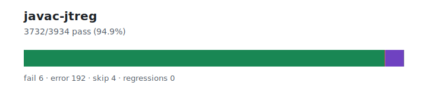

# javac-jtreg — `1.3.6+20260629.e4591fc`

- Image digest: `3d3ea83ed6403be11d119eb0234efa699809d81a801986659790996c18306a06`
- Suite version: `6c48f4ed707bf0b15f9b6098de30db8aae6fa40f`
- Ran: 2026-06-29T19:54:29.718Z → 2026-06-29T20:04:28.512Z

## Summary

**Pass rate: 3654/3934 (98.70%)**

| pass | fail | error | skip | regressions | new passes |
|---:|---:|---:|---:|---:|---:|
| 3654 | 6 | 42 | 232 | 0 | 0 |

## Observed cases (3702)

- `tools/javac/4241573/T4241573.java` — pass
- `tools/javac/4846262/CheckEBCDICLocaleTest.java` — pass
- `tools/javac/4880220/T4880220.java` — pass
- `tools/javac/4917091/Test255.java` — pass
- `tools/javac/4917091/Test256a.java` — pass
- `tools/javac/4917091/Test256b.java` — pass
- `tools/javac/4980495/static/Test.java` — pass
- `tools/javac/4980495/std/NonStatic2StaticImportClash.java` — pass
- `tools/javac/4980495/std/Static2NonStaticImportClash.java` — pass
- `tools/javac/4980495/std/Test.java` — pass
- `tools/javac/5017953/T5017953.java` — pass
- `tools/javac/5045412/Bar.java` — pass
- `tools/javac/5045412/Foo.java` — pass
- `tools/javac/6199662/Tree.java` — pass
- `tools/javac/6257443/T6257443.java` — pass
- `tools/javac/6302184/HiddenOptionsShouldUseGivenEncodingTest.java` — pass
- `tools/javac/6304921/T6304921.java` — pass
- `tools/javac/6304921/TestLog.java` — pass
- `tools/javac/6330920/T6330920.java` — pass
- `tools/javac/6330997/T6330997.java` — pass
- `tools/javac/6341866/T6341866.java` — pass
- `tools/javac/6342411/T6342411.java` — pass
- `tools/javac/6360970/T6360970.java` — pass
- `tools/javac/6390045/T6390045a.java` — pass
- `tools/javac/6390045/T6390045b.java` — pass
- `tools/javac/6394683/T6394683.java` — pass
- `tools/javac/6400383/T6400383.java` — pass
- `tools/javac/6400872/T6400872.java` — pass
- `tools/javac/6402516/CheckClass.java` — pass
- `tools/javac/6402516/CheckIsAccessible.java` — pass
- `tools/javac/6402516/CheckLocalElements.java` — pass
- `tools/javac/6402516/CheckMethod.java` — pass
- `tools/javac/6403424/T6403424.java` — pass
- `tools/javac/6440583/T6440583.java` — pass
- `tools/javac/6457284/T6457284.java` — pass
- `tools/javac/6491592/T6491592.java` — pass
- `tools/javac/6508981/TestInferBinaryName.java` — pass
- `tools/javac/6520152/T6520152.java` — pass
- `tools/javac/6521805/T6521805b.java` — pass
- `tools/javac/6521805/T6521805c.java` — pass
- `tools/javac/6521805/T6521805d.java` — pass
- `tools/javac/6521805/T6521805e.java` — pass
- `tools/javac/6547131/T.java` — pass
- `tools/javac/6558548/T6558548.java` — pass
- `tools/javac/6563143/EqualsHashCodeWarningTest.java` — pass
- `tools/javac/6563143/InvalidAnonymous.java` — pass
- `tools/javac/6567415/T6567415.java` — pass
- `tools/javac/6589361/T6589361.java` — pass
- `tools/javac/6627362/T6627362.java` — pass
- `tools/javac/6668794/badClass/Test.java` — pass
- `tools/javac/6668794/badSource/Test.java` — pass
- `tools/javac/6717241/T6717241a.java` — pass
- `tools/javac/6717241/T6717241b.java` — pass
- `tools/javac/6734819/T6734819a.java` — pass
- `tools/javac/6734819/T6734819b.java` — pass
- `tools/javac/6734819/T6734819c.java` — pass
- `tools/javac/6758789/T6758789a.java` — pass
- `tools/javac/6758789/T6758789b.java` — pass
- `tools/javac/6835430/T6835430.java` — pass
- `tools/javac/6840059/T6840059.java` — pass
- `tools/javac/6857948/T6857948.java` — pass
- `tools/javac/6863465/T6863465a.java` — pass
- `tools/javac/6863465/T6863465b.java` — pass
- `tools/javac/6863465/T6863465c.java` — pass
- `tools/javac/6863465/T6863465d.java` — pass
- `tools/javac/6863465/TestCircularClassfile.java` — pass
- `tools/javac/6889255/T6889255.java` — pass
- `tools/javac/6902720/Test.java` — pass
- `tools/javac/6917288/GraphicalInstallerTest.java` — pass
- `tools/javac/6917288/T6917288.java` — pass
- `tools/javac/6948381/T6948381.java` — pass
- `tools/javac/6979683/TestCast6979683_BAD34.java` — pass
- `tools/javac/6979683/TestCast6979683_BAD35.java` — pass
- `tools/javac/6979683/TestCast6979683_BAD36.java` — pass
- `tools/javac/6979683/TestCast6979683_BAD37.java` — pass
- `tools/javac/6979683/TestCast6979683_BAD38.java` — pass
- `tools/javac/6979683/TestCast6979683_BAD39.java` — pass
- `tools/javac/6979683/TestCast6979683_GOOD.java` — pass
- `tools/javac/6996626/Main.java` — pass
- `tools/javac/7003595/T7003595.java` — pass
- `tools/javac/7003595/T7003595b.java` — pass
- `tools/javac/7023703/T7023703neg.java` — pass
- `tools/javac/7023703/T7023703pos.java` — pass
- `tools/javac/7024568/T7024568.java` — pass
- `tools/javac/7079713/TestCircularClassfile.java` — pass
- `tools/javac/7085024/T7085024.java` — pass
- `tools/javac/7086595/T7086595.java` — pass
- `tools/javac/7102515/T7102515.java` — pass
- `tools/javac/7118412/ShadowingTest.java` — pass
- `tools/javac/7129225/TestImportStar.java` — error — system error (exit code 3)
- `tools/javac/7132880/T7132880.java` — pass
- `tools/javac/7142086/T7142086.java#id0` — pass
- `tools/javac/7144981/IgnoreIgnorableCharactersInInput.java` — pass
- `tools/javac/7153958/CPoolRefClassContainingInlinedCts.java` — pass
- `tools/javac/7166455/CheckACC_STRICTFlagOnclinitTest.java` — pass
- `tools/javac/7167125/DiffResultAfterSameOperationInnerClasses.java` — pass
- `tools/javac/7182350/T7182350.java` — pass
- `tools/javac/8000518/DuplicateConstantPoolEntry.java` — pass
- `tools/javac/8002286/T8002286.java` — pass
- `tools/javac/8005931/CheckACC_STRICTFlagOnPkgAccessClassTest.java` — pass
- `tools/javac/8009170/RedundantByteCodeInArrayTest.java` — pass
- `tools/javac/8052070/DuplicateTypeParameter.java` — pass
- `tools/javac/8062359/UnresolvableClassNPEInAttrTest.java` — pass
- `tools/javac/8074306/TestSyntheticNullChecks.java` — pass
- `tools/javac/8133247/T8133247.java` — pass
- `tools/javac/8138840/T8138840.java` — pass
- `tools/javac/8138840/T8139243.java` — pass
- `tools/javac/8138840/T8139249.java` — pass
- `tools/javac/8161985/T8161985a.java` — pass
- `tools/javac/8161985/T8161985b.java` — pass
- `tools/javac/8167000/T8167000.java` — pass
- `tools/javac/8167000/T8167000b.java` — pass
- `tools/javac/8167000/T8167000c.java` — pass
- `tools/javac/8169345/T8169345a.java` — pass
- `tools/javac/8169345/T8169345b.java` — pass
- `tools/javac/8169345/T8169345c.java` — pass
- `tools/javac/8194932/T8194932.java` — pass
- `tools/javac/8203436/T8203436a.java` — pass
- `tools/javac/8203436/T8203436b.java` — pass
- `tools/javac/8230827/T8230827.java` — pass
- `tools/javac/8236697/T8236697.java` — pass
- `tools/javac/8238735/T8238735.java` — pass
- `tools/javac/8245153/T8245153.java` — pass
- `tools/javac/8264258/MisleadingNonExistentPathError.java` — pass
- `tools/javac/8278078/InvalidThisAndSuperInConstructorArgTest.java` — pass
- `tools/javac/8278078/ValidThisAndSuperInConstructorArgTest.java` — pass
- `tools/javac/8351232/TypeAnnotationSymNullTest.java` — pass
- `tools/javac/AbstractOverride.java` — pass
- `tools/javac/AccessMethods/AccessMethodsLHS.java` — pass
- `tools/javac/AccessMethods/BitwiseAssignment.java` — pass
- `tools/javac/AccessMethods/ChainedAssignment.java` — pass
- `tools/javac/AccessMethods/ConstructorAccess.java` — pass
- `tools/javac/AccessMethods/InternalHandshake.java` — pass
- `tools/javac/AccessMethods/LateAddition.java` — pass
- `tools/javac/AccessMethods/UplevelPrivateConstants.java` — pass
- `tools/javac/AddReferenceThis.java` — pass
- `tools/javac/Ambig3.java` — pass
- `tools/javac/AnonClsInIntf.java` — pass
- `tools/javac/AnonInnerException_1.java` — pass
- `tools/javac/AnonInnerException_2.java` — pass
- `tools/javac/AnonInnerException_3.java` — pass
- `tools/javac/AnonStaticMember_1.java` — pass
- `tools/javac/AnonStaticMember_2.java` — pass
- `tools/javac/AnonStaticMember_3.java` — pass
- `tools/javac/AnonymousClass/AnonymousClassFlags.java` — pass
- `tools/javac/AnonymousClass/AnonymousCtorExceptionTest.java` — pass
- `tools/javac/AnonymousClass/AnonymousInSuperCallNegTest.java` — pass
- `tools/javac/AnonymousClass/AnonymousInSuperCallTest.java` — pass
- `tools/javac/AnonymousClass/CtorAccessBypassTest.java` — pass
- `tools/javac/AnonymousConstructorExceptions.java` — pass
- `tools/javac/AnonymousNull.java` — pass
- `tools/javac/AnonymousProtect/AnonymousProtect.java` — pass
- `tools/javac/AnonymousSubclassTest.java` — pass
- `tools/javac/AnonymousType.java` — pass
- `tools/javac/ArrayCast.java` — pass
- `tools/javac/AvoidNPEAtClassReader/AvoidNPEAtClassReaderTest.java` — pass
- `tools/javac/BadAnnotation.java` — pass
- `tools/javac/BadBreak.java` — pass
- `tools/javac/BadCovar.java` — pass
- `tools/javac/BadHexConstant.java` — pass
- `tools/javac/BadOptimization/DeadCode1.java` — pass
- `tools/javac/BadOptimization/DeadCode2.java` — pass
- `tools/javac/BadOptimization/DeadCode3.java` — pass
- `tools/javac/BadOptimization/DeadCode4.java` — pass
- `tools/javac/BadOptimization/DeadCode5.java` — pass
- `tools/javac/BadOptimization/DeadCode6.java` — pass
- `tools/javac/BadOptimization/Switch1.java` — pass
- `tools/javac/BadOptimization/Switch2.java` — pass
- `tools/javac/BoolArray.java` — pass
- `tools/javac/BoundClassError.java` — pass
- `tools/javac/BreakAcrossClass.java` — pass
- `tools/javac/CaptureInSubtype.java` — pass
- `tools/javac/CascadedInnerNewInstance.java` — pass
- `tools/javac/CastInterface2Array.java` — pass
- `tools/javac/CheckNoClassCastException.java` — pass
- `tools/javac/ClassCycle/ClassCycle1a.java` — pass
- `tools/javac/ClassCycle/ClassCycle2a.java` — pass
- `tools/javac/ClassCycle/ClassCycle3a.java` — pass
- `tools/javac/ClassCycle/ClassCycle4.java` — pass
- `tools/javac/ClassFileModifiers/ClassModifiers.java` — pass
- `tools/javac/ClassFileModifiers/MemberModifiers.java` — pass
- `tools/javac/ClassIsAbstract.java` — pass
- `tools/javac/ClassLit.java` — pass
- `tools/javac/ClassLiterals/ClassLiteralHelperContext.java` — pass
- `tools/javac/ClassLiterals/InitializeOuter.java` — pass
- `tools/javac/ClassLiterals/InitializeTarget.java` — pass
- `tools/javac/ClassLiterals/evalinit/ClassLiteralEvalInit.java` — pass
- `tools/javac/ClassModifiers/InterfaceAndInnerClsCtor.java` — pass
- `tools/javac/ClassPathTest/ClassPathTest.java` — pass
- `tools/javac/ClassToTypeParm.java` — pass
- `tools/javac/CloneableProblem.java` — pass
- `tools/javac/Closure1.java` — pass
- `tools/javac/Closure2.java` — pass
- `tools/javac/Closure3.java` — pass
- `tools/javac/Closure4.java` — pass
- `tools/javac/Closure5.java` — pass
- `tools/javac/Closure6.java` — pass
- `tools/javac/CompoundBox.java` — pass
- `tools/javac/ConditionalArgTypes_1.java` — pass
- `tools/javac/ConditionalArgTypes_2.java` — pass
- …and 3502 more
