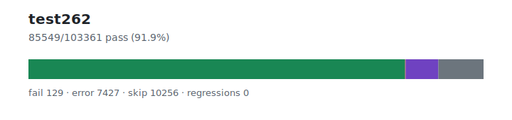

# test262 — `1.3.6+20260701.7e20640`

- Image digest: `unknown`
- Suite version: `de8e621cdba4f40cff3cf244e6cfb8cb48746b4a`
- Ran: 2026-07-01T11:22:23.911Z → 2026-07-01T11:39:23.192Z

## Summary

**Pass rate: 85549/103361 (91.88%)**

| pass | fail | error | skip | regressions | new passes |
|---:|---:|---:|---:|---:|---:|
| 85549 | 129 | 7427 | 10256 | 0 | 0 |
