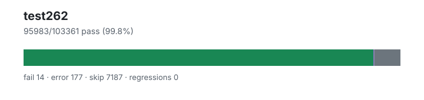

# test262 — `1.4.0+1dd82c7d1`

- Image digest: `89f18cc38a8a0b239af7284c1b87ea6ce4d50d974a5395c5a621573f6a1e4087`
- Suite version: `de8e621cdba4f40cff3cf244e6cfb8cb48746b4a`
- Ran: 2026-07-06T22:26:39.861Z → 2026-07-06T22:41:38.153Z

## Summary

**Pass rate: 95983/103361 (99.80%)**

| pass | fail | error | skip | regressions | new passes |
|---:|---:|---:|---:|---:|---:|
| 95983 | 14 | 177 | 7187 | 0 | 0 |
