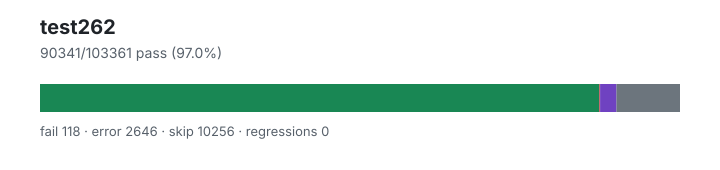

# test262 — `1.4.0+48fa1f4f6`

- Image digest: `019e3f7a34bba4955e5ad73f225035de389e3893d2e949feaa5c190095790af0`
- Suite version: `de8e621cdba4f40cff3cf244e6cfb8cb48746b4a`
- Ran: 2026-07-03T01:22:25.767Z → 2026-07-03T01:35:18.766Z

## Summary

**Pass rate: 90341/103361 (97.03%)**

| pass | fail | error | skip | regressions | new passes |
|---:|---:|---:|---:|---:|---:|
| 90341 | 118 | 2646 | 10256 | 0 | 0 |
