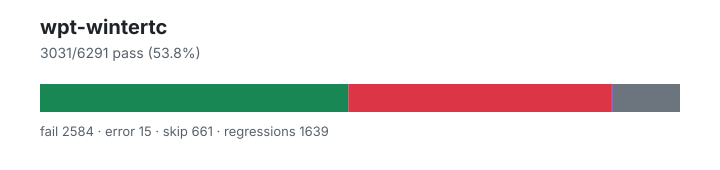

# wpt-wintertc — `1.4.0+48fa1f4f6`

- Image digest: `019e3f7a34bba4955e5ad73f225035de389e3893d2e949feaa5c190095790af0`
- Suite version: `1eb456f600fedad07c8cd6439796fb81db54faff`
- Ran: 2026-07-03T02:02:37.169Z → 2026-07-03T02:02:38.828Z

## Summary

**Pass rate: 3031/6291 (53.84%)**

| pass | fail | error | skip | regressions | new passes |
|---:|---:|---:|---:|---:|---:|
| 3031 | 2584 | 15 | 661 | 1639 | 219 |

## Observed cases (5630)

- `encoding/api-surrogates-utf8.any.js :: Invalid surrogates encoded into UTF-8: Sanity check` — pass
- `encoding/api-surrogates-utf8.any.js :: Invalid surrogates encoded into UTF-8: Surrogate half (low)` — pass
- `encoding/api-surrogates-utf8.any.js :: Invalid surrogates encoded into UTF-8: Surrogate half (high)` — pass
- `encoding/api-surrogates-utf8.any.js :: Invalid surrogates encoded into UTF-8: Surrogate half (low), in a string` — pass
- `encoding/api-surrogates-utf8.any.js :: Invalid surrogates encoded into UTF-8: Surrogate half (high), in a string` — pass
- `encoding/api-surrogates-utf8.any.js :: Invalid surrogates encoded into UTF-8: Wrong order` — pass
- `encoding/streams/decode-incomplete-input.any.js :: incomplete input with error mode "replacement" should end with a replacement character` — fail — promise_test: Unhandled rejection with value: object "ReferenceError: TextDecoderStream is not defined"
- `encoding/streams/decode-incomplete-input.any.js :: incomplete input with error mode "fatal" should error the stream` — fail — promise_test: Unhandled rejection with value: object "ReferenceError: TextDecoderStream is not defined"
- `encoding/api-basics.any.js :: Default encodings` — pass
- `encoding/api-basics.any.js :: Default inputs` — pass
- `encoding/api-basics.any.js :: Encode/decode round trip: utf-8` — pass
- `encoding/api-basics.any.js :: Decode sample: utf-16le` — pass
- `encoding/api-basics.any.js :: Decode sample: utf-16be` — pass
- `encoding/api-basics.any.js :: Decode sample: utf-16` — pass
- `encoding/streams/decode-ignore-bom.any.js :: ignoreBOM should work for encoding utf-8, split at character 0` — fail — promise_test: Unhandled rejection with value: object "ReferenceError: TextDecoderStream is not defined"
- `encoding/streams/decode-ignore-bom.any.js :: ignoreBOM should work for encoding utf-8, split at character 1` — fail — promise_test: Unhandled rejection with value: object "ReferenceError: TextDecoderStream is not defined"
- `encoding/streams/decode-ignore-bom.any.js :: ignoreBOM should work for encoding utf-8, split at character 2` — fail — promise_test: Unhandled rejection with value: object "ReferenceError: TextDecoderStream is not defined"
- `encoding/streams/decode-ignore-bom.any.js :: ignoreBOM should work for encoding utf-8, split at character 3` — fail — promise_test: Unhandled rejection with value: object "ReferenceError: TextDecoderStream is not defined"
- `encoding/streams/decode-ignore-bom.any.js :: ignoreBOM should work for encoding utf-16le, split at character 0` — fail — promise_test: Unhandled rejection with value: object "ReferenceError: TextDecoderStream is not defined"
- `encoding/streams/decode-ignore-bom.any.js :: ignoreBOM should work for encoding utf-16le, split at character 1` — fail — promise_test: Unhandled rejection with value: object "ReferenceError: TextDecoderStream is not defined"
- `encoding/streams/decode-ignore-bom.any.js :: ignoreBOM should work for encoding utf-16le, split at character 2` — fail — promise_test: Unhandled rejection with value: object "ReferenceError: TextDecoderStream is not defined"
- `encoding/streams/decode-ignore-bom.any.js :: ignoreBOM should work for encoding utf-16le, split at character 3` — fail — promise_test: Unhandled rejection with value: object "ReferenceError: TextDecoderStream is not defined"
- `encoding/streams/decode-ignore-bom.any.js :: ignoreBOM should work for encoding utf-16be, split at character 0` — fail — promise_test: Unhandled rejection with value: object "ReferenceError: TextDecoderStream is not defined"
- `encoding/streams/decode-ignore-bom.any.js :: ignoreBOM should work for encoding utf-16be, split at character 1` — fail — promise_test: Unhandled rejection with value: object "ReferenceError: TextDecoderStream is not defined"
- `encoding/streams/decode-ignore-bom.any.js :: ignoreBOM should work for encoding utf-16be, split at character 2` — fail — promise_test: Unhandled rejection with value: object "ReferenceError: TextDecoderStream is not defined"
- `encoding/streams/decode-ignore-bom.any.js :: ignoreBOM should work for encoding utf-16be, split at character 3` — fail — promise_test: Unhandled rejection with value: object "ReferenceError: TextDecoderStream is not defined"
- `encoding/streams/decode-non-utf8.any.js :: TextDecoderStream should be able to decode UTF-16BE` — fail — promise_test: Unhandled rejection with value: object "ReferenceError: TextDecoderStream is not defined"
- `encoding/streams/decode-non-utf8.any.js :: TextDecoderStream should be able to decode invalid sequences in UTF-16BE` — fail — promise_test: Unhandled rejection with value: object "ReferenceError: TextDecoderStream is not defined"
- `encoding/streams/decode-non-utf8.any.js :: TextDecoderStream should be able to reject invalid sequences in UTF-16BE` — fail — promise_test: Unhandled rejection with value: object "ReferenceError: TextDecoderStream is not defined"
- `encoding/streams/decode-non-utf8.any.js :: TextDecoderStream should be able to decode UTF-16LE` — fail — promise_test: Unhandled rejection with value: object "ReferenceError: TextDecoderStream is not defined"
- `encoding/streams/decode-non-utf8.any.js :: TextDecoderStream should be able to decode invalid sequences in UTF-16LE` — fail — promise_test: Unhandled rejection with value: object "ReferenceError: TextDecoderStream is not defined"
- `encoding/streams/decode-non-utf8.any.js :: TextDecoderStream should be able to reject invalid sequences in UTF-16LE` — fail — promise_test: Unhandled rejection with value: object "ReferenceError: TextDecoderStream is not defined"
- `encoding/streams/decode-non-utf8.any.js :: TextDecoderStream should be able to decode Shift_JIS` — fail — promise_test: Unhandled rejection with value: object "ReferenceError: TextDecoderStream is not defined"
- `encoding/streams/decode-non-utf8.any.js :: TextDecoderStream should be able to decode invalid sequences in Shift_JIS` — fail — promise_test: Unhandled rejection with value: object "ReferenceError: TextDecoderStream is not defined"
- `encoding/streams/decode-non-utf8.any.js :: TextDecoderStream should be able to reject invalid sequences in Shift_JIS` — fail — promise_test: Unhandled rejection with value: object "ReferenceError: TextDecoderStream is not defined"
- `encoding/streams/decode-non-utf8.any.js :: TextDecoderStream should be able to decode ISO-2022-JP` — fail — promise_test: Unhandled rejection with value: object "ReferenceError: TextDecoderStream is not defined"
- `encoding/streams/decode-non-utf8.any.js :: TextDecoderStream should be able to decode invalid sequences in ISO-2022-JP` — fail — promise_test: Unhandled rejection with value: object "ReferenceError: TextDecoderStream is not defined"
- `encoding/streams/decode-non-utf8.any.js :: TextDecoderStream should be able to reject invalid sequences in ISO-2022-JP` — fail — promise_test: Unhandled rejection with value: object "ReferenceError: TextDecoderStream is not defined"
- `encoding/streams/decode-non-utf8.any.js :: TextDecoderStream should be able to decode ISO-8859-14` — fail — promise_test: Unhandled rejection with value: object "ReferenceError: TextDecoderStream is not defined"
- `encoding/streams/decode-bad-chunks.any.js :: chunk of type undefined should error the stream` — fail — promise_test: Unhandled rejection with value: object "ReferenceError: TextDecoderStream is not defined"
- `encoding/streams/decode-bad-chunks.any.js :: chunk of type null should error the stream` — fail — promise_test: Unhandled rejection with value: object "ReferenceError: TextDecoderStream is not defined"
- `encoding/streams/decode-bad-chunks.any.js :: chunk of type numeric should error the stream` — fail — promise_test: Unhandled rejection with value: object "ReferenceError: TextDecoderStream is not defined"
- `encoding/streams/decode-bad-chunks.any.js :: chunk of type object, not BufferSource should error the stream` — fail — promise_test: Unhandled rejection with value: object "ReferenceError: TextDecoderStream is not defined"
- `encoding/streams/decode-bad-chunks.any.js :: chunk of type array should error the stream` — fail — promise_test: Unhandled rejection with value: object "ReferenceError: TextDecoderStream is not defined"
- `encoding/api-replacement-encodings.any.js :: Label for "replacement" should be rejected by API: csiso2022kr` — pass
- `encoding/api-replacement-encodings.any.js :: Label for "replacement" should be rejected by API: hz-gb-2312` — pass
- `encoding/api-replacement-encodings.any.js :: Label for "replacement" should be rejected by API: iso-2022-cn` — pass
- `encoding/api-replacement-encodings.any.js :: Label for "replacement" should be rejected by API: iso-2022-cn-ext` — pass
- `encoding/api-replacement-encodings.any.js :: Label for "replacement" should be rejected by API: iso-2022-kr` — pass
- `encoding/api-replacement-encodings.any.js :: Label for "replacement" should be rejected by API: replacement` — pass
- `encoding/iso-2022-jp-decoder.any.js :: iso-2022-jp decoder: Error ESC` — fail — assert_equals: expected "\ufffd$" but got "\ufffd"
- `encoding/iso-2022-jp-decoder.any.js :: iso-2022-jp decoder: Error ESC, character` — fail — assert_equals: expected "\ufffd$P" but got "\ufffd"
- `encoding/iso-2022-jp-decoder.any.js :: iso-2022-jp decoder: ASCII ESC, character` — pass
- `encoding/iso-2022-jp-decoder.any.js :: iso-2022-jp decoder: Double ASCII ESC, character` — fail — assert_equals: expected "\ufffdP" but got "P"
- `encoding/iso-2022-jp-decoder.any.js :: iso-2022-jp decoder: character, ASCII ESC, character` — pass
- `encoding/iso-2022-jp-decoder.any.js :: iso-2022-jp decoder: characters` — pass
- `encoding/iso-2022-jp-decoder.any.js :: iso-2022-jp decoder: SO / SI` — fail — assert_equals: expected "\r\ufffd\ufffd\x10" but got "\r\x10"
- `encoding/iso-2022-jp-decoder.any.js :: iso-2022-jp decoder: Roman ESC, characters` — pass
- `encoding/iso-2022-jp-decoder.any.js :: iso-2022-jp decoder: Roman ESC, SO / SI` — fail — assert_equals: expected "\r\ufffd\ufffd\x10" but got "\r\x10"
- `encoding/iso-2022-jp-decoder.any.js :: iso-2022-jp decoder: Roman ESC, error ESC, Katakana ESC` — fail — assert_equals: expected "\ufffdﾐ" but got "\ufffd(IP"
- `encoding/iso-2022-jp-decoder.any.js :: iso-2022-jp decoder: Katakana ESC, character` — pass
- `encoding/iso-2022-jp-decoder.any.js :: iso-2022-jp decoder: Katakana ESC, multibyte ESC, character` — fail — assert_equals: expected "\ufffd佩" but got "佩"
- `encoding/iso-2022-jp-decoder.any.js :: iso-2022-jp decoder: Katakana ESC, error ESC, character` — fail — assert_equals: expected "\ufffdﾐ" but got "\ufffd"
- `encoding/iso-2022-jp-decoder.any.js :: iso-2022-jp decoder: Katakana ESC, error ESC #2, character` — fail — assert_equals: expected "\ufffd､ﾐ" but got "\ufffd"
- `encoding/iso-2022-jp-decoder.any.js :: iso-2022-jp decoder: Katakana ESC, character, Katakana ESC, character` — pass
- `encoding/iso-2022-jp-decoder.any.js :: iso-2022-jp decoder: Katakana ESC, SO / SI` — fail — assert_equals: expected "\ufffd\ufffd\ufffd\ufffd" but got "ｍｐ"
- `encoding/iso-2022-jp-decoder.any.js :: iso-2022-jp decoder: Multibyte ESC, character` — pass
- `encoding/iso-2022-jp-decoder.any.js :: iso-2022-jp decoder: Multibyte ESC #2, character` — pass
- `encoding/iso-2022-jp-decoder.any.js :: iso-2022-jp decoder: Multibyte ESC, error ESC, character` — fail — assert_equals: expected "\ufffd佩" but got "\ufffd\ufffd"
- `encoding/iso-2022-jp-decoder.any.js :: iso-2022-jp decoder: Double multibyte ESC` — fail — assert_equals: expected "\ufffd" but got ""
- `encoding/iso-2022-jp-decoder.any.js :: iso-2022-jp decoder: Double multibyte ESC, character` — fail — assert_equals: expected "\ufffd佩" but got "佩"
- `encoding/iso-2022-jp-decoder.any.js :: iso-2022-jp decoder: Double multibyte ESC #2, character` — fail — assert_equals: expected "\ufffd佩" but got "佩"
- `encoding/iso-2022-jp-decoder.any.js :: iso-2022-jp decoder: Multibyte ESC, error ESC #2, character` — fail — assert_equals: expected "\ufffdば\ufffd" but got "\ufffd\ufffd"
- `encoding/iso-2022-jp-decoder.any.js :: iso-2022-jp decoder: Multibyte ESC, single byte, multibyte ESC, character` — fail — assert_equals: expected "\ufffd佩" but got "\ufffdだ佩"
- `encoding/iso-2022-jp-decoder.any.js :: iso-2022-jp decoder: Multibyte ESC, lead error byte` — fail — assert_equals: expected "\ufffd\ufffd" but got "\ufffd"
- `encoding/iso-2022-jp-decoder.any.js :: iso-2022-jp decoder: Multibyte ESC, trail error byte` — pass
- `encoding/iso-2022-jp-decoder.any.js :: iso-2022-jp decoder: character, error ESC` — pass
- `encoding/iso-2022-jp-decoder.any.js :: iso-2022-jp decoder: character, error ESC #2` — fail — assert_equals: expected "P\ufffd$" but got "P\ufffd"
- `encoding/iso-2022-jp-decoder.any.js :: iso-2022-jp decoder: character, error ESC #3` — fail — assert_equals: expected "P\ufffdP" but got "P\ufffd"
- `encoding/iso-2022-jp-decoder.any.js :: iso-2022-jp decoder: character, ASCII ESC` — pass
- `encoding/iso-2022-jp-decoder.any.js :: iso-2022-jp decoder: character, Roman ESC` — pass
- `encoding/iso-2022-jp-decoder.any.js :: iso-2022-jp decoder: character, Katakana ESC` — pass
- `encoding/iso-2022-jp-decoder.any.js :: iso-2022-jp decoder: character, Multibyte ESC` — pass
- `encoding/iso-2022-jp-decoder.any.js :: iso-2022-jp decoder: character, Multibyte ESC #2` — pass
- `encoding/replacement-encodings.any.js :: csiso2022kr - non-empty input decodes to one replacement character.` — fail — promise_test: Unhandled rejection with value: object "ReferenceError: XMLHttpRequest is not defined"
- `encoding/replacement-encodings.any.js :: csiso2022kr - empty input decodes to empty output.` — fail — promise_test: Unhandled rejection with value: object "ReferenceError: XMLHttpRequest is not defined"
- `encoding/replacement-encodings.any.js :: hz-gb-2312 - non-empty input decodes to one replacement character.` — fail — promise_test: Unhandled rejection with value: object "ReferenceError: XMLHttpRequest is not defined"
- `encoding/replacement-encodings.any.js :: hz-gb-2312 - empty input decodes to empty output.` — fail — promise_test: Unhandled rejection with value: object "ReferenceError: XMLHttpRequest is not defined"
- `encoding/replacement-encodings.any.js :: iso-2022-cn - non-empty input decodes to one replacement character.` — fail — promise_test: Unhandled rejection with value: object "ReferenceError: XMLHttpRequest is not defined"
- `encoding/replacement-encodings.any.js :: iso-2022-cn - empty input decodes to empty output.` — fail — promise_test: Unhandled rejection with value: object "ReferenceError: XMLHttpRequest is not defined"
- `encoding/replacement-encodings.any.js :: iso-2022-cn-ext - non-empty input decodes to one replacement character.` — fail — promise_test: Unhandled rejection with value: object "ReferenceError: XMLHttpRequest is not defined"
- `encoding/replacement-encodings.any.js :: iso-2022-cn-ext - empty input decodes to empty output.` — fail — promise_test: Unhandled rejection with value: object "ReferenceError: XMLHttpRequest is not defined"
- `encoding/replacement-encodings.any.js :: iso-2022-kr - non-empty input decodes to one replacement character.` — fail — promise_test: Unhandled rejection with value: object "ReferenceError: XMLHttpRequest is not defined"
- `encoding/replacement-encodings.any.js :: iso-2022-kr - empty input decodes to empty output.` — fail — promise_test: Unhandled rejection with value: object "ReferenceError: XMLHttpRequest is not defined"
- `encoding/replacement-encodings.any.js :: replacement - non-empty input decodes to one replacement character.` — fail — promise_test: Unhandled rejection with value: object "ReferenceError: XMLHttpRequest is not defined"
- `encoding/replacement-encodings.any.js :: replacement - empty input decodes to empty output.` — fail — promise_test: Unhandled rejection with value: object "ReferenceError: XMLHttpRequest is not defined"
- `encoding/streams/backpressure.any.js :: write() should not complete until read relieves backpressure for TextDecoderStream` — fail — promise_test: Unhandled rejection with value: object "TypeError: (intermediate value)[streamClass.name] is not a constructor"
- `encoding/streams/backpressure.any.js :: additional writes should wait for backpressure to be relieved for class TextDecoderStream` — fail — promise_test: Unhandled rejection with value: object "TypeError: (intermediate value)[streamClass.name] is not a constructor"
- `encoding/streams/backpressure.any.js :: write() should not complete until read relieves backpressure for TextEncoderStream` — fail — promise_test: Unhandled rejection with value: object "TypeError: (intermediate value)[streamClass.name] is not a constructor"
- `encoding/streams/backpressure.any.js :: additional writes should wait for backpressure to be relieved for class TextEncoderStream` — fail — promise_test: Unhandled rejection with value: object "TypeError: (intermediate value)[streamClass.name] is not a constructor"
- `encoding/streams/decode-attributes.any.js :: encoding attribute should have correct value for 'unicode-1-1-utf-8'` — fail — TextDecoderStream is not defined
- `encoding/streams/decode-attributes.any.js :: encoding attribute should have correct value for 'iso-8859-2'` — fail — TextDecoderStream is not defined
- `encoding/streams/decode-attributes.any.js :: encoding attribute should have correct value for 'ascii'` — fail — TextDecoderStream is not defined
- `encoding/streams/decode-attributes.any.js :: encoding attribute should have correct value for 'utf-16'` — fail — TextDecoderStream is not defined
- `encoding/streams/decode-attributes.any.js :: setting fatal to 'false' should set the attribute to false` — fail — TextDecoderStream is not defined
- `encoding/streams/decode-attributes.any.js :: setting ignoreBOM to 'false' should set the attribute to false` — fail — TextDecoderStream is not defined
- `encoding/streams/decode-attributes.any.js :: setting fatal to '0' should set the attribute to false` — fail — TextDecoderStream is not defined
- `encoding/streams/decode-attributes.any.js :: setting ignoreBOM to '0' should set the attribute to false` — fail — TextDecoderStream is not defined
- `encoding/streams/decode-attributes.any.js :: setting fatal to '' should set the attribute to false` — fail — TextDecoderStream is not defined
- `encoding/streams/decode-attributes.any.js :: setting ignoreBOM to '' should set the attribute to false` — fail — TextDecoderStream is not defined
- `encoding/streams/decode-attributes.any.js :: setting fatal to 'undefined' should set the attribute to false` — fail — TextDecoderStream is not defined
- `encoding/streams/decode-attributes.any.js :: setting ignoreBOM to 'undefined' should set the attribute to false` — fail — TextDecoderStream is not defined
- `encoding/streams/decode-attributes.any.js :: setting fatal to 'null' should set the attribute to false` — fail — TextDecoderStream is not defined
- `encoding/streams/decode-attributes.any.js :: setting ignoreBOM to 'null' should set the attribute to false` — fail — TextDecoderStream is not defined
- `encoding/streams/decode-attributes.any.js :: setting fatal to 'true' should set the attribute to true` — fail — TextDecoderStream is not defined
- `encoding/streams/decode-attributes.any.js :: setting ignoreBOM to 'true' should set the attribute to true` — fail — TextDecoderStream is not defined
- `encoding/streams/decode-attributes.any.js :: setting fatal to '1' should set the attribute to true` — fail — TextDecoderStream is not defined
- `encoding/streams/decode-attributes.any.js :: setting ignoreBOM to '1' should set the attribute to true` — fail — TextDecoderStream is not defined
- `encoding/streams/decode-attributes.any.js :: setting fatal to '[object Object]' should set the attribute to true` — fail — TextDecoderStream is not defined
- `encoding/streams/decode-attributes.any.js :: setting ignoreBOM to '[object Object]' should set the attribute to true` — fail — TextDecoderStream is not defined
- `encoding/streams/decode-attributes.any.js :: setting fatal to '' should set the attribute to true` — fail — TextDecoderStream is not defined
- `encoding/streams/decode-attributes.any.js :: setting ignoreBOM to '' should set the attribute to true` — fail — TextDecoderStream is not defined
- `encoding/streams/decode-attributes.any.js :: setting fatal to 'yes' should set the attribute to true` — fail — TextDecoderStream is not defined
- `encoding/streams/decode-attributes.any.js :: setting ignoreBOM to 'yes' should set the attribute to true` — fail — TextDecoderStream is not defined
- `encoding/streams/decode-attributes.any.js :: constructing with an invalid encoding should throw` — fail — assert_throws_js: the constructor should throw function "() => new TextDecoderStream('')" threw object "ReferenceError: TextDecoderStream is not defined" ("ReferenceError") expected instance of function "function RangeError() { [native code] }" ("RangeError")
- `encoding/streams/decode-attributes.any.js :: constructing with a non-stringifiable encoding should throw` — fail — assert_throws_js: the constructor should throw function "() => new TextDecoderStream({
    toString() { return {}; }
  })" threw object "ReferenceError: TextDecoderStream is not defined" ("ReferenceError") expected instance of function "function TypeError() { [native code] }" ("TypeError")
- `encoding/streams/decode-attributes.any.js :: a throwing fatal member should cause the constructor to throw` — fail — assert_throws_js: the constructor should throw function "() => new TextDecoderStream('utf-8', {
                     get fatal() { throw new Error(); }
                   })" threw object "ReferenceError: TextDecoderStream is not defined" ("ReferenceError") expected instance of function "function Error() { [native code] }" ("Error")
- `encoding/streams/decode-attributes.any.js :: a throwing ignoreBOM member should cause the constructor to throw` — fail — assert_throws_js: the constructor should throw function "() => new TextDecoderStream('utf-8', {
                     get ignoreBOM() { throw new Error(); }
                   })" threw object "ReferenceError: TextDecoderStream is not defined" ("ReferenceError") expected instance of function "function Error() { [native code] }" ("Error")
- `encoding/idlharness.any.js :: idl_test setup` — fail — promise_test: Unhandled rejection with value: object "TypeError: Failed to parse URL: /interfaces/encoding.idl"
- `encoding/single-byte-decoder.window.js :: IBM866: 866 (XMLHttpRequest)` — fail — XMLHttpRequest is not defined
- `encoding/single-byte-decoder.window.js :: IBM866: 866 (TextDecoder)` — pass
- `encoding/single-byte-decoder.window.js :: IBM866: 866 (document.characterSet and document.inputEncoding)` — fail — Cannot read property 'appendChild' of undefined
- `encoding/encodeInto.any.js :: encodeInto() into ArrayBuffer with Hi and destination length 0, offset 0, filler 0` — pass
- `encoding/encodeInto.any.js :: encodeInto() into SharedArrayBuffer with Hi and destination length 0, offset 0, filler 0` — fail — sabConstructor is not a constructor
- `encoding/encodeInto.any.js :: encodeInto() into ArrayBuffer with Hi and destination length 0, offset 4, filler 0` — pass
- `encoding/encodeInto.any.js :: encodeInto() into SharedArrayBuffer with Hi and destination length 0, offset 4, filler 0` — fail — sabConstructor is not a constructor
- `encoding/encodeInto.any.js :: encodeInto() into ArrayBuffer with Hi and destination length 0, offset 0, filler 128` — pass
- `encoding/encodeInto.any.js :: encodeInto() into SharedArrayBuffer with Hi and destination length 0, offset 0, filler 128` — fail — sabConstructor is not a constructor
- `encoding/encodeInto.any.js :: encodeInto() into ArrayBuffer with Hi and destination length 0, offset 4, filler 128` — pass
- `encoding/encodeInto.any.js :: encodeInto() into SharedArrayBuffer with Hi and destination length 0, offset 4, filler 128` — fail — sabConstructor is not a constructor
- `encoding/encodeInto.any.js :: encodeInto() into ArrayBuffer with Hi and destination length 0, offset 0, filler random` — pass
- `encoding/encodeInto.any.js :: encodeInto() into SharedArrayBuffer with Hi and destination length 0, offset 0, filler random` — fail — sabConstructor is not a constructor
- `encoding/encodeInto.any.js :: encodeInto() into ArrayBuffer with Hi and destination length 0, offset 4, filler random` — pass
- `encoding/encodeInto.any.js :: encodeInto() into SharedArrayBuffer with Hi and destination length 0, offset 4, filler random` — fail — sabConstructor is not a constructor
- `encoding/encodeInto.any.js :: encodeInto() into ArrayBuffer with A and destination length 10, offset 0, filler 0` — pass
- `encoding/encodeInto.any.js :: encodeInto() into SharedArrayBuffer with A and destination length 10, offset 0, filler 0` — fail — sabConstructor is not a constructor
- `encoding/encodeInto.any.js :: encodeInto() into ArrayBuffer with A and destination length 10, offset 4, filler 0` — pass
- `encoding/encodeInto.any.js :: encodeInto() into SharedArrayBuffer with A and destination length 10, offset 4, filler 0` — fail — sabConstructor is not a constructor
- `encoding/encodeInto.any.js :: encodeInto() into ArrayBuffer with A and destination length 10, offset 0, filler 128` — pass
- `encoding/encodeInto.any.js :: encodeInto() into SharedArrayBuffer with A and destination length 10, offset 0, filler 128` — fail — sabConstructor is not a constructor
- `encoding/encodeInto.any.js :: encodeInto() into ArrayBuffer with A and destination length 10, offset 4, filler 128` — pass
- `encoding/encodeInto.any.js :: encodeInto() into SharedArrayBuffer with A and destination length 10, offset 4, filler 128` — fail — sabConstructor is not a constructor
- `encoding/encodeInto.any.js :: encodeInto() into ArrayBuffer with A and destination length 10, offset 0, filler random` — pass
- `encoding/encodeInto.any.js :: encodeInto() into SharedArrayBuffer with A and destination length 10, offset 0, filler random` — fail — sabConstructor is not a constructor
- `encoding/encodeInto.any.js :: encodeInto() into ArrayBuffer with A and destination length 10, offset 4, filler random` — pass
- `encoding/encodeInto.any.js :: encodeInto() into SharedArrayBuffer with A and destination length 10, offset 4, filler random` — fail — sabConstructor is not a constructor
- `encoding/encodeInto.any.js :: encodeInto() into ArrayBuffer with 𝌆 and destination length 4, offset 0, filler 0` — pass
- `encoding/encodeInto.any.js :: encodeInto() into SharedArrayBuffer with 𝌆 and destination length 4, offset 0, filler 0` — fail — sabConstructor is not a constructor
- `encoding/encodeInto.any.js :: encodeInto() into ArrayBuffer with 𝌆 and destination length 4, offset 4, filler 0` — pass
- `encoding/encodeInto.any.js :: encodeInto() into SharedArrayBuffer with 𝌆 and destination length 4, offset 4, filler 0` — fail — sabConstructor is not a constructor
- `encoding/encodeInto.any.js :: encodeInto() into ArrayBuffer with 𝌆 and destination length 4, offset 0, filler 128` — pass
- `encoding/encodeInto.any.js :: encodeInto() into SharedArrayBuffer with 𝌆 and destination length 4, offset 0, filler 128` — fail — sabConstructor is not a constructor
- `encoding/encodeInto.any.js :: encodeInto() into ArrayBuffer with 𝌆 and destination length 4, offset 4, filler 128` — pass
- `encoding/encodeInto.any.js :: encodeInto() into SharedArrayBuffer with 𝌆 and destination length 4, offset 4, filler 128` — fail — sabConstructor is not a constructor
- `encoding/encodeInto.any.js :: encodeInto() into ArrayBuffer with 𝌆 and destination length 4, offset 0, filler random` — pass
- `encoding/encodeInto.any.js :: encodeInto() into SharedArrayBuffer with 𝌆 and destination length 4, offset 0, filler random` — fail — sabConstructor is not a constructor
- `encoding/encodeInto.any.js :: encodeInto() into ArrayBuffer with 𝌆 and destination length 4, offset 4, filler random` — pass
- `encoding/encodeInto.any.js :: encodeInto() into SharedArrayBuffer with 𝌆 and destination length 4, offset 4, filler random` — fail — sabConstructor is not a constructor
- `encoding/encodeInto.any.js :: encodeInto() into ArrayBuffer with 𝌆A and destination length 3, offset 0, filler 0` — pass
- `encoding/encodeInto.any.js :: encodeInto() into SharedArrayBuffer with 𝌆A and destination length 3, offset 0, filler 0` — fail — sabConstructor is not a constructor
- `encoding/encodeInto.any.js :: encodeInto() into ArrayBuffer with 𝌆A and destination length 3, offset 4, filler 0` — pass
- `encoding/encodeInto.any.js :: encodeInto() into SharedArrayBuffer with 𝌆A and destination length 3, offset 4, filler 0` — fail — sabConstructor is not a constructor
- `encoding/encodeInto.any.js :: encodeInto() into ArrayBuffer with 𝌆A and destination length 3, offset 0, filler 128` — pass
- `encoding/encodeInto.any.js :: encodeInto() into SharedArrayBuffer with 𝌆A and destination length 3, offset 0, filler 128` — fail — sabConstructor is not a constructor
- `encoding/encodeInto.any.js :: encodeInto() into ArrayBuffer with 𝌆A and destination length 3, offset 4, filler 128` — pass
- `encoding/encodeInto.any.js :: encodeInto() into SharedArrayBuffer with 𝌆A and destination length 3, offset 4, filler 128` — fail — sabConstructor is not a constructor
- `encoding/encodeInto.any.js :: encodeInto() into ArrayBuffer with 𝌆A and destination length 3, offset 0, filler random` — pass
- `encoding/encodeInto.any.js :: encodeInto() into SharedArrayBuffer with 𝌆A and destination length 3, offset 0, filler random` — fail — sabConstructor is not a constructor
- `encoding/encodeInto.any.js :: encodeInto() into ArrayBuffer with 𝌆A and destination length 3, offset 4, filler random` — pass
- `encoding/encodeInto.any.js :: encodeInto() into SharedArrayBuffer with 𝌆A and destination length 3, offset 4, filler random` — fail — sabConstructor is not a constructor
- `encoding/encodeInto.any.js :: encodeInto() into ArrayBuffer with U+d834AU+df06A¥Hi and destination length 10, offset 0, filler 0` — pass
- `encoding/encodeInto.any.js :: encodeInto() into SharedArrayBuffer with U+d834AU+df06A¥Hi and destination length 10, offset 0, filler 0` — fail — sabConstructor is not a constructor
- `encoding/encodeInto.any.js :: encodeInto() into ArrayBuffer with U+d834AU+df06A¥Hi and destination length 10, offset 4, filler 0` — pass
- `encoding/encodeInto.any.js :: encodeInto() into SharedArrayBuffer with U+d834AU+df06A¥Hi and destination length 10, offset 4, filler 0` — fail — sabConstructor is not a constructor
- `encoding/encodeInto.any.js :: encodeInto() into ArrayBuffer with U+d834AU+df06A¥Hi and destination length 10, offset 0, filler 128` — pass
- `encoding/encodeInto.any.js :: encodeInto() into SharedArrayBuffer with U+d834AU+df06A¥Hi and destination length 10, offset 0, filler 128` — fail — sabConstructor is not a constructor
- `encoding/encodeInto.any.js :: encodeInto() into ArrayBuffer with U+d834AU+df06A¥Hi and destination length 10, offset 4, filler 128` — pass
- `encoding/encodeInto.any.js :: encodeInto() into SharedArrayBuffer with U+d834AU+df06A¥Hi and destination length 10, offset 4, filler 128` — fail — sabConstructor is not a constructor
- `encoding/encodeInto.any.js :: encodeInto() into ArrayBuffer with U+d834AU+df06A¥Hi and destination length 10, offset 0, filler random` — pass
- `encoding/encodeInto.any.js :: encodeInto() into SharedArrayBuffer with U+d834AU+df06A¥Hi and destination length 10, offset 0, filler random` — fail — sabConstructor is not a constructor
- `encoding/encodeInto.any.js :: encodeInto() into ArrayBuffer with U+d834AU+df06A¥Hi and destination length 10, offset 4, filler random` — pass
- `encoding/encodeInto.any.js :: encodeInto() into SharedArrayBuffer with U+d834AU+df06A¥Hi and destination length 10, offset 4, filler random` — fail — sabConstructor is not a constructor
- `encoding/encodeInto.any.js :: encodeInto() into ArrayBuffer with AU+df06 and destination length 4, offset 0, filler 0` — pass
- `encoding/encodeInto.any.js :: encodeInto() into SharedArrayBuffer with AU+df06 and destination length 4, offset 0, filler 0` — fail — sabConstructor is not a constructor
- `encoding/encodeInto.any.js :: encodeInto() into ArrayBuffer with AU+df06 and destination length 4, offset 4, filler 0` — pass
- `encoding/encodeInto.any.js :: encodeInto() into SharedArrayBuffer with AU+df06 and destination length 4, offset 4, filler 0` — fail — sabConstructor is not a constructor
- `encoding/encodeInto.any.js :: encodeInto() into ArrayBuffer with AU+df06 and destination length 4, offset 0, filler 128` — pass
- `encoding/encodeInto.any.js :: encodeInto() into SharedArrayBuffer with AU+df06 and destination length 4, offset 0, filler 128` — fail — sabConstructor is not a constructor
- `encoding/encodeInto.any.js :: encodeInto() into ArrayBuffer with AU+df06 and destination length 4, offset 4, filler 128` — pass
- `encoding/encodeInto.any.js :: encodeInto() into SharedArrayBuffer with AU+df06 and destination length 4, offset 4, filler 128` — fail — sabConstructor is not a constructor
- …and 5430 more

## ❌ Regressions (1639)

- `encoding/replacement-encodings.any.js :: csiso2022kr - non-empty input decodes to one replacement character.` — promise_test: Unhandled rejection with value: object "ReferenceError: XMLHttpRequest is not defined"
- `encoding/replacement-encodings.any.js :: csiso2022kr - empty input decodes to empty output.` — promise_test: Unhandled rejection with value: object "ReferenceError: XMLHttpRequest is not defined"
- `encoding/replacement-encodings.any.js :: hz-gb-2312 - non-empty input decodes to one replacement character.` — promise_test: Unhandled rejection with value: object "ReferenceError: XMLHttpRequest is not defined"
- `encoding/replacement-encodings.any.js :: hz-gb-2312 - empty input decodes to empty output.` — promise_test: Unhandled rejection with value: object "ReferenceError: XMLHttpRequest is not defined"
- `encoding/replacement-encodings.any.js :: iso-2022-cn - non-empty input decodes to one replacement character.` — promise_test: Unhandled rejection with value: object "ReferenceError: XMLHttpRequest is not defined"
- `encoding/replacement-encodings.any.js :: iso-2022-cn - empty input decodes to empty output.` — promise_test: Unhandled rejection with value: object "ReferenceError: XMLHttpRequest is not defined"
- `encoding/replacement-encodings.any.js :: iso-2022-cn-ext - non-empty input decodes to one replacement character.` — promise_test: Unhandled rejection with value: object "ReferenceError: XMLHttpRequest is not defined"
- `encoding/replacement-encodings.any.js :: iso-2022-cn-ext - empty input decodes to empty output.` — promise_test: Unhandled rejection with value: object "ReferenceError: XMLHttpRequest is not defined"
- `encoding/replacement-encodings.any.js :: iso-2022-kr - non-empty input decodes to one replacement character.` — promise_test: Unhandled rejection with value: object "ReferenceError: XMLHttpRequest is not defined"
- `encoding/replacement-encodings.any.js :: iso-2022-kr - empty input decodes to empty output.` — promise_test: Unhandled rejection with value: object "ReferenceError: XMLHttpRequest is not defined"
- `encoding/replacement-encodings.any.js :: replacement - non-empty input decodes to one replacement character.` — promise_test: Unhandled rejection with value: object "ReferenceError: XMLHttpRequest is not defined"
- `encoding/replacement-encodings.any.js :: replacement - empty input decodes to empty output.` — promise_test: Unhandled rejection with value: object "ReferenceError: XMLHttpRequest is not defined"
- `encoding/idlharness.any.js :: idl_test setup` — promise_test: Unhandled rejection with value: object "TypeError: Failed to parse URL: /interfaces/encoding.idl"
- `encoding/single-byte-decoder.window.js :: IBM866: 866 (XMLHttpRequest)` — XMLHttpRequest is not defined
- `encoding/single-byte-decoder.window.js :: IBM866: 866 (document.characterSet and document.inputEncoding)` — Cannot read property 'appendChild' of undefined
- `encoding/textencoder-constructor-non-utf.any.js :: Encoding argument supported for decode: ISO-8859-8-I` — TextDecoder: encoding ISO-8859-8-I not available on this JVM
- `encoding/textencoder-constructor-non-utf.any.js :: Encoding argument supported for decode: ISO-8859-10` — TextDecoder: encoding ISO-8859-10 not available on this JVM
- `encoding/textencoder-constructor-non-utf.any.js :: Encoding argument supported for decode: ISO-8859-14` — TextDecoder: encoding ISO-8859-14 not available on this JVM
- `encoding/textencoder-constructor-non-utf.any.js :: Encoding argument supported for decode: macintosh` — TextDecoder: encoding macintosh not available on this JVM
- `encoding/textencoder-constructor-non-utf.any.js :: Encoding argument supported for decode: x-mac-cyrillic` — TextDecoder: encoding x-mac-cyrillic not available on this JVM
- `encoding/textencoder-constructor-non-utf.any.js :: Encoding argument supported for decode: x-user-defined` — TextDecoder: unsupported encoding label: x-user-defined
- `encoding/legacy-mb-schinese/gb18030/gb18030-decoder.any.js :: gb18030 decoder: euro` — assert_equals: expected "€" but got "\ufffd"
- `encoding/legacy-mb-schinese/gb18030/gb18030-decoder.any.js :: gb18030 decoder: two bytes 0x81 0x7f` — assert_equals: expected "\ufffd" but got "\ufffd"
- `encoding/legacy-mb-schinese/gb18030/gb18030-decoder.any.js :: gb18030 decoder: two bytes 0x81 0x30` — assert_equals: expected "\ufffd" but got "\ufffd0"
- `encoding/legacy-mb-schinese/gb18030/gb18030-decoder.any.js :: gb18030 decoder: three bytes 0x81 0x30 0xFE` — assert_equals: expected "\ufffd" but got "\ufffd0\ufffd"
- `encoding/legacy-mb-schinese/gb18030/gb18030-decoder.any.js :: gb18030 decoder: three bytes 0x81 0x30 0xFF` — assert_equals: expected "\ufffd0\ufffd" but got "\ufffd"
- `encoding/legacy-mb-schinese/gb18030/gb18030-decoder.any.js :: gb18030 decoder: four bytes 0x81 0x30 0xFE 0x29` — assert_equals: expected "\ufffd0\ufffd)" but got "\ufffd"
- `encoding/legacy-mb-schinese/gb18030/gb18030-decoder.any.js :: gb18030 decoder: four bytes 0xFE 0x39 0xFE 0x39` — assert_equals: expected "\ufffd" but got "\ufffd9\ufffd9"
- `encoding/legacy-mb-schinese/gb18030/gb18030-decoder.any.js :: gb18030 decoder: pointer 7458` — assert_equals: expected "Ḿ" but got "\ufffd5\ufffd6"
- `encoding/legacy-mb-schinese/gb18030/gb18030-decoder.any.js :: gb18030 decoder: pointer 7457` — assert_equals: expected "" but got "\ufffd5\ufffd7"
- `encoding/legacy-mb-schinese/gb18030/gb18030-decoder.any.js :: gb18030 decoder: pointer 7459` — assert_equals: expected "Ṁ" but got "\ufffd5\ufffd8"
- `encoding/legacy-mb-schinese/gb18030/gb18030-decoder.any.js :: gb18030 decoder: pointer 39419` — assert_equals: expected "\uffff" but got "\ufffd1\ufffd9"
- `encoding/legacy-mb-schinese/gb18030/gb18030-decoder.any.js :: gb18030 decoder: pointer 39420` — assert_equals: expected "\ufffd" but got "\ufffd1\ufffd0"
- `encoding/legacy-mb-schinese/gb18030/gb18030-decoder.any.js :: gb18030 decoder: pointer 189999` — assert_equals: expected "\ufffd" but got "\ufffd9\ufffd9"
- `encoding/legacy-mb-schinese/gb18030/gb18030-decoder.any.js :: gb18030 decoder: pointer 189000` — assert_equals: expected "𐀀" but got "\ufffd0\ufffd0"
- `encoding/legacy-mb-schinese/gb18030/gb18030-decoder.any.js :: gb18030 decoder: pointer 1237575` — assert_equals: expected "􏿿" but got "\ufffd2\ufffd5"
- `encoding/legacy-mb-schinese/gb18030/gb18030-decoder.any.js :: gb18030 decoder: pointer 1237576` — assert_equals: expected "\ufffd" but got "\ufffd2\ufffd6"
- `encoding/legacy-mb-schinese/gb18030/gb18030-decoder.any.js :: gb18030 decoder: legacy ICU special case 1` — assert_equals: expected "" but got "\ufffd6\ufffd0"
- `encoding/legacy-mb-schinese/gb18030/gb18030-decoder.any.js :: gb18030 decoder: undefined` — assert_equals: expected "　" but got ""
- `encoding/legacy-mb-schinese/gb18030/gb18030-decoder.any.js :: gb18030 decoder: GB18030-2022 1` — assert_equals: expected "︐" but got ""
- `encoding/legacy-mb-schinese/gb18030/gb18030-decoder.any.js :: gb18030 decoder: GB18030-2022 2` — assert_equals: expected "︒" but got ""
- `encoding/legacy-mb-schinese/gb18030/gb18030-decoder.any.js :: gb18030 decoder: GB18030-2022 3` — assert_equals: expected "︑" but got ""
- `encoding/legacy-mb-schinese/gb18030/gb18030-decoder.any.js :: gb18030 decoder: GB18030-2022 4` — assert_equals: expected "︓" but got ""
- `encoding/legacy-mb-schinese/gb18030/gb18030-decoder.any.js :: gb18030 decoder: GB18030-2022 5` — assert_equals: expected "︔" but got ""
- `encoding/legacy-mb-schinese/gb18030/gb18030-decoder.any.js :: gb18030 decoder: GB18030-2022 6` — assert_equals: expected "︕" but got ""
- `encoding/legacy-mb-schinese/gb18030/gb18030-decoder.any.js :: gb18030 decoder: GB18030-2022 7` — assert_equals: expected "︖" but got ""
- `encoding/legacy-mb-schinese/gb18030/gb18030-decoder.any.js :: gb18030 decoder: GB18030-2022 8` — assert_equals: expected "︗" but got ""
- `encoding/legacy-mb-schinese/gb18030/gb18030-decoder.any.js :: gb18030 decoder: GB18030-2022 9` — assert_equals: expected "︘" but got ""
- `encoding/legacy-mb-schinese/gb18030/gb18030-decoder.any.js :: gb18030 decoder: GB18030-2022 10` — assert_equals: expected "︙" but got ""
- `encoding/legacy-mb-schinese/gb18030/gb18030-decoder.any.js :: gb18030 decoder: GB18030-2022 11` — assert_equals: expected "龴" but got ""
- `encoding/legacy-mb-schinese/gb18030/gb18030-decoder.any.js :: gb18030 decoder: GB18030-2022 12` — assert_equals: expected "龵" but got ""
- `encoding/legacy-mb-schinese/gb18030/gb18030-decoder.any.js :: gb18030 decoder: GB18030-2022 13` — assert_equals: expected "龶" but got ""
- `encoding/legacy-mb-schinese/gb18030/gb18030-decoder.any.js :: gb18030 decoder: GB18030-2022 14` — assert_equals: expected "龷" but got ""
- `encoding/legacy-mb-schinese/gb18030/gb18030-decoder.any.js :: gb18030 decoder: GB18030-2022 15` — assert_equals: expected "龸" but got ""
- `encoding/legacy-mb-schinese/gb18030/gb18030-decoder.any.js :: gb18030 decoder: GB18030-2022 16` — assert_equals: expected "龹" but got ""
- `encoding/legacy-mb-schinese/gb18030/gb18030-decoder.any.js :: gb18030 decoder: GB18030-2022 17` — assert_equals: expected "龺" but got ""
- `encoding/legacy-mb-schinese/gb18030/gb18030-decoder.any.js :: gb18030 decoder: GB18030-2022 18` — assert_equals: expected "龻" but got ""
- `encoding/legacy-mb-schinese/gb18030/gb18030-decoder.any.js :: gb18030 decoder: GB18030-2022 19` — assert_equals: expected "龴" but got ""
- `encoding/legacy-mb-schinese/gb18030/gb18030-decoder.any.js :: gb18030 decoder: GB18030-2022 20` — assert_equals: expected "龵" but got ""
- `encoding/legacy-mb-schinese/gb18030/gb18030-decoder.any.js :: gb18030 decoder: GB18030-2022 21` — assert_equals: expected "龶" but got ""
- `encoding/legacy-mb-schinese/gb18030/gb18030-decoder.any.js :: gb18030 decoder: GB18030-2022 22` — assert_equals: expected "龷" but got ""
- `encoding/legacy-mb-schinese/gb18030/gb18030-decoder.any.js :: gb18030 decoder: GB18030-2022 23` — assert_equals: expected "龸" but got ""
- `encoding/legacy-mb-schinese/gb18030/gb18030-decoder.any.js :: gb18030 decoder: GB18030-2022 24` — assert_equals: expected "龹" but got ""
- `encoding/legacy-mb-schinese/gb18030/gb18030-decoder.any.js :: gb18030 decoder: GB18030-2022 25` — assert_equals: expected "龺" but got ""
- `encoding/legacy-mb-schinese/gb18030/gb18030-decoder.any.js :: gb18030 decoder: GB18030-2022 26` — assert_equals: expected "龻" but got ""
- `encoding/legacy-mb-schinese/gb18030/gb18030-decoder.any.js :: gb18030 decoder: GB18030-2022 27` — assert_equals: expected "︐" but got ""
- `encoding/legacy-mb-schinese/gb18030/gb18030-decoder.any.js :: gb18030 decoder: GB18030-2022 28` — assert_equals: expected "︑" but got ""
- `encoding/legacy-mb-schinese/gb18030/gb18030-decoder.any.js :: gb18030 decoder: GB18030-2022 29` — assert_equals: expected "︒" but got ""
- `encoding/legacy-mb-schinese/gb18030/gb18030-decoder.any.js :: gb18030 decoder: GB18030-2022 30` — assert_equals: expected "︓" but got ""
- `encoding/legacy-mb-schinese/gb18030/gb18030-decoder.any.js :: gb18030 decoder: GB18030-2022 31` — assert_equals: expected "︔" but got ""
- `encoding/legacy-mb-schinese/gb18030/gb18030-decoder.any.js :: gb18030 decoder: GB18030-2022 32` — assert_equals: expected "︕" but got ""
- `encoding/legacy-mb-schinese/gb18030/gb18030-decoder.any.js :: gb18030 decoder: GB18030-2022 33` — assert_equals: expected "︖" but got ""
- `encoding/legacy-mb-schinese/gb18030/gb18030-decoder.any.js :: gb18030 decoder: GB18030-2022 34` — assert_equals: expected "︗" but got ""
- `encoding/legacy-mb-schinese/gb18030/gb18030-decoder.any.js :: gb18030 decoder: GB18030-2022 35` — assert_equals: expected "︘" but got ""
- `encoding/legacy-mb-schinese/gb18030/gb18030-decoder.any.js :: gb18030 decoder: GB18030-2022 36` — assert_equals: expected "︙" but got ""
- `encoding/legacy-mb-schinese/gb18030/gb18030-decoder.any.js :: gb18030 decoder: range 0` — assert_equals: expected "€" but got "\ufffd0\ufffd0"
- `encoding/legacy-mb-schinese/gb18030/gb18030-decoder.any.js :: gb18030 decoder: range 1` — assert_equals: expected "¥" but got "\ufffd0\ufffd6"
- `encoding/legacy-mb-schinese/gb18030/gb18030-decoder.any.js :: gb18030 decoder: range 2` — assert_equals: expected "©" but got "\ufffd0\ufffd8"
- `encoding/legacy-mb-schinese/gb18030/gb18030-decoder.any.js :: gb18030 decoder: range 3` — assert_equals: expected "²" but got "\ufffd0\ufffd5"
- `encoding/legacy-mb-schinese/gb18030/gb18030-decoder.any.js :: gb18030 decoder: range 4` — assert_equals: expected "¸" but got "\ufffd0\ufffd0"
- `encoding/legacy-mb-schinese/gb18030/gb18030-decoder.any.js :: gb18030 decoder: range 5` — assert_equals: expected "Ø" but got "\ufffd0\ufffd1"
- `encoding/legacy-mb-schinese/gb18030/gb18030-decoder.any.js :: gb18030 decoder: range 6` — assert_equals: expected "â" but got "\ufffd0\ufffd9"
- `encoding/legacy-mb-schinese/gb18030/gb18030-decoder.any.js :: gb18030 decoder: range 7` — assert_equals: expected "ë" but got "\ufffd0\ufffd5"
- `encoding/legacy-mb-schinese/gb18030/gb18030-decoder.any.js :: gb18030 decoder: range 8` — assert_equals: expected "î" but got "\ufffd0\ufffd6"
- `encoding/legacy-mb-schinese/gb18030/gb18030-decoder.any.js :: gb18030 decoder: range 9` — assert_equals: expected "ô" but got "\ufffd0\ufffd0"
- `encoding/legacy-mb-schinese/gb18030/gb18030-decoder.any.js :: gb18030 decoder: range 10` — assert_equals: expected "ø" but got "\ufffd0\ufffd3"
- `encoding/legacy-mb-schinese/gb18030/gb18030-decoder.any.js :: gb18030 decoder: range 11` — assert_equals: expected "û" but got "\ufffd0\ufffd4"
- `encoding/legacy-mb-schinese/gb18030/gb18030-decoder.any.js :: gb18030 decoder: range 12` — assert_equals: expected "ý" but got "\ufffd0\ufffd5"
- `encoding/legacy-mb-schinese/gb18030/gb18030-decoder.any.js :: gb18030 decoder: range 13` — assert_equals: expected "Ă" but got "\ufffd0\ufffd9"
- `encoding/legacy-mb-schinese/gb18030/gb18030-decoder.any.js :: gb18030 decoder: range 14` — assert_equals: expected "Ĕ" but got "\ufffd0\ufffd6"
- `encoding/legacy-mb-schinese/gb18030/gb18030-decoder.any.js :: gb18030 decoder: range 15` — assert_equals: expected "Ĝ" but got "\ufffd0\ufffd3"
- `encoding/legacy-mb-schinese/gb18030/gb18030-decoder.any.js :: gb18030 decoder: range 16` — assert_equals: expected "Ĭ" but got "\ufffd0\ufffd8"
- `encoding/legacy-mb-schinese/gb18030/gb18030-decoder.any.js :: gb18030 decoder: range 17` — assert_equals: expected "Ņ" but got "\ufffd0\ufffd2"
- `encoding/legacy-mb-schinese/gb18030/gb18030-decoder.any.js :: gb18030 decoder: range 18` — assert_equals: expected "ʼn" but got "\ufffd0\ufffd5"
- `encoding/legacy-mb-schinese/gb18030/gb18030-decoder.any.js :: gb18030 decoder: range 19` — assert_equals: expected "Ŏ" but got "\ufffd0\ufffd9"
- `encoding/legacy-mb-schinese/gb18030/gb18030-decoder.any.js :: gb18030 decoder: range 20` — assert_equals: expected "Ŭ" but got "\ufffd0\ufffd8"
- `encoding/legacy-mb-schinese/gb18030/gb18030-decoder.any.js :: gb18030 decoder: range 21` — assert_equals: expected "Ǐ" but got "\ufffd0\ufffd6"
- `encoding/legacy-mb-schinese/gb18030/gb18030-decoder.any.js :: gb18030 decoder: range 22` — assert_equals: expected "Ǒ" but got "\ufffd0\ufffd7"
- `encoding/legacy-mb-schinese/gb18030/gb18030-decoder.any.js :: gb18030 decoder: range 23` — assert_equals: expected "Ǔ" but got "\ufffd0\ufffd8"
- `encoding/legacy-mb-schinese/gb18030/gb18030-decoder.any.js :: gb18030 decoder: range 24` — assert_equals: expected "Ǖ" but got "\ufffd0\ufffd9"
- `encoding/legacy-mb-schinese/gb18030/gb18030-decoder.any.js :: gb18030 decoder: range 25` — assert_equals: expected "Ǘ" but got "\ufffd0\ufffd0"
- `encoding/legacy-mb-schinese/gb18030/gb18030-decoder.any.js :: gb18030 decoder: range 26` — assert_equals: expected "Ǚ" but got "\ufffd0\ufffd1"
- `encoding/legacy-mb-schinese/gb18030/gb18030-decoder.any.js :: gb18030 decoder: range 27` — assert_equals: expected "Ǜ" but got "\ufffd0\ufffd2"
- `encoding/legacy-mb-schinese/gb18030/gb18030-decoder.any.js :: gb18030 decoder: range 28` — assert_equals: expected "ǝ" but got "\ufffd0\ufffd3"
- `encoding/legacy-mb-schinese/gb18030/gb18030-decoder.any.js :: gb18030 decoder: range 29` — assert_equals: expected "Ǻ" but got "\ufffd0\ufffd1"
- `encoding/legacy-mb-schinese/gb18030/gb18030-decoder.any.js :: gb18030 decoder: range 30` — assert_equals: expected "ɒ" but got "\ufffd0\ufffd8"
- `encoding/legacy-mb-schinese/gb18030/gb18030-decoder.any.js :: gb18030 decoder: range 31` — assert_equals: expected "ɢ" but got "\ufffd0\ufffd3"
- `encoding/legacy-mb-schinese/gb18030/gb18030-decoder.any.js :: gb18030 decoder: range 32` — assert_equals: expected "ˈ" but got "\ufffd0\ufffd4"
- `encoding/legacy-mb-schinese/gb18030/gb18030-decoder.any.js :: gb18030 decoder: range 33` — assert_equals: expected "ˌ" but got "\ufffd0\ufffd5"
- `encoding/legacy-mb-schinese/gb18030/gb18030-decoder.any.js :: gb18030 decoder: range 34` — assert_equals: expected "˚" but got "\ufffd0\ufffd8"
- `encoding/legacy-mb-schinese/gb18030/gb18030-decoder.any.js :: gb18030 decoder: range 35` — assert_equals: expected "΢" but got "\ufffd0\ufffd1"
- `encoding/legacy-mb-schinese/gb18030/gb18030-decoder.any.js :: gb18030 decoder: range 36` — assert_equals: expected "Ϊ" but got "\ufffd0\ufffd2"
- `encoding/legacy-mb-schinese/gb18030/gb18030-decoder.any.js :: gb18030 decoder: range 37` — assert_equals: expected "ς" but got "\ufffd0\ufffd9"
- `encoding/legacy-mb-schinese/gb18030/gb18030-decoder.any.js :: gb18030 decoder: range 38` — assert_equals: expected "ϊ" but got "\ufffd0\ufffd0"
- `encoding/legacy-mb-schinese/gb18030/gb18030-decoder.any.js :: gb18030 decoder: range 39` — assert_equals: expected "Ђ" but got "\ufffd0\ufffd5"
- `encoding/legacy-mb-schinese/gb18030/gb18030-decoder.any.js :: gb18030 decoder: range 40` — assert_equals: expected "ѐ" but got "\ufffd0\ufffd9"
- `encoding/legacy-mb-schinese/gb18030/gb18030-decoder.any.js :: gb18030 decoder: range 41` — assert_equals: expected "ђ" but got "\ufffd0\ufffd0"
- `encoding/legacy-mb-schinese/gb18030/gb18030-decoder.any.js :: gb18030 decoder: range 42` — assert_equals: expected "‑" but got "\ufffd6\ufffd2"
- `encoding/legacy-mb-schinese/gb18030/gb18030-decoder.any.js :: gb18030 decoder: range 43` — assert_equals: expected "‗" but got "\ufffd6\ufffd4"
- `encoding/legacy-mb-schinese/gb18030/gb18030-decoder.any.js :: gb18030 decoder: range 44` — assert_equals: expected "‚" but got "\ufffd6\ufffd5"
- `encoding/legacy-mb-schinese/gb18030/gb18030-decoder.any.js :: gb18030 decoder: range 45` — assert_equals: expected "„" but got "\ufffd6\ufffd7"
- `encoding/legacy-mb-schinese/gb18030/gb18030-decoder.any.js :: gb18030 decoder: range 46` — assert_equals: expected "‧" but got "\ufffd6\ufffd4"
- `encoding/legacy-mb-schinese/gb18030/gb18030-decoder.any.js :: gb18030 decoder: range 47` — assert_equals: expected "‱" but got "\ufffd6\ufffd3"
- `encoding/legacy-mb-schinese/gb18030/gb18030-decoder.any.js :: gb18030 decoder: range 48` — assert_equals: expected "‴" but got "\ufffd6\ufffd4"
- `encoding/legacy-mb-schinese/gb18030/gb18030-decoder.any.js :: gb18030 decoder: range 49` — assert_equals: expected "‶" but got "\ufffd6\ufffd5"
- `encoding/legacy-mb-schinese/gb18030/gb18030-decoder.any.js :: gb18030 decoder: range 50` — assert_equals: expected "‼" but got "\ufffd6\ufffd0"
- `encoding/legacy-mb-schinese/gb18030/gb18030-decoder.any.js :: gb18030 decoder: range 51` — assert_equals: expected "₭" but got "\ufffd6\ufffd2"
- `encoding/legacy-mb-schinese/gb18030/gb18030-decoder.any.js :: gb18030 decoder: range 52` — assert_equals: expected "℄" but got "\ufffd6\ufffd8"
- `encoding/legacy-mb-schinese/gb18030/gb18030-decoder.any.js :: gb18030 decoder: range 53` — assert_equals: expected "℆" but got "\ufffd6\ufffd9"
- `encoding/legacy-mb-schinese/gb18030/gb18030-decoder.any.js :: gb18030 decoder: range 54` — assert_equals: expected "ℊ" but got "\ufffd6\ufffd2"
- `encoding/legacy-mb-schinese/gb18030/gb18030-decoder.any.js :: gb18030 decoder: range 55` — assert_equals: expected "℗" but got "\ufffd6\ufffd4"
- `encoding/legacy-mb-schinese/gb18030/gb18030-decoder.any.js :: gb18030 decoder: range 56` — assert_equals: expected "™" but got "\ufffd6\ufffd4"
- `encoding/legacy-mb-schinese/gb18030/gb18030-decoder.any.js :: gb18030 decoder: range 57` — assert_equals: expected "Ⅼ" but got "\ufffd6\ufffd6"
- `encoding/legacy-mb-schinese/gb18030/gb18030-decoder.any.js :: gb18030 decoder: range 58` — assert_equals: expected "ⅺ" but got "\ufffd6\ufffd0"
- `encoding/legacy-mb-schinese/gb18030/gb18030-decoder.any.js :: gb18030 decoder: range 59` — assert_equals: expected "↔" but got "\ufffd6\ufffd2"
- `encoding/legacy-mb-schinese/gb18030/gb18030-decoder.any.js :: gb18030 decoder: range 60` — assert_equals: expected "↚" but got "\ufffd6\ufffd4"
- `encoding/legacy-mb-schinese/gb18030/gb18030-decoder.any.js :: gb18030 decoder: range 61` — assert_equals: expected "∉" but got "\ufffd6\ufffd4"
- `encoding/legacy-mb-schinese/gb18030/gb18030-decoder.any.js :: gb18030 decoder: range 62` — assert_equals: expected "∐" but got "\ufffd6\ufffd0"
- `encoding/legacy-mb-schinese/gb18030/gb18030-decoder.any.js :: gb18030 decoder: range 63` — assert_equals: expected "−" but got "\ufffd6\ufffd1"
- `encoding/legacy-mb-schinese/gb18030/gb18030-decoder.any.js :: gb18030 decoder: range 64` — assert_equals: expected "∖" but got "\ufffd6\ufffd4"
- `encoding/legacy-mb-schinese/gb18030/gb18030-decoder.any.js :: gb18030 decoder: range 65` — assert_equals: expected "∛" but got "\ufffd6\ufffd8"
- `encoding/legacy-mb-schinese/gb18030/gb18030-decoder.any.js :: gb18030 decoder: range 66` — assert_equals: expected "∡" but got "\ufffd6\ufffd0"
- `encoding/legacy-mb-schinese/gb18030/gb18030-decoder.any.js :: gb18030 decoder: range 67` — assert_equals: expected "∤" but got "\ufffd6\ufffd2"
- `encoding/legacy-mb-schinese/gb18030/gb18030-decoder.any.js :: gb18030 decoder: range 68` — assert_equals: expected "∦" but got "\ufffd6\ufffd3"
- `encoding/legacy-mb-schinese/gb18030/gb18030-decoder.any.js :: gb18030 decoder: range 69` — assert_equals: expected "∬" but got "\ufffd6\ufffd4"
- `encoding/legacy-mb-schinese/gb18030/gb18030-decoder.any.js :: gb18030 decoder: range 70` — assert_equals: expected "∯" but got "\ufffd6\ufffd6"
- `encoding/legacy-mb-schinese/gb18030/gb18030-decoder.any.js :: gb18030 decoder: range 71` — assert_equals: expected "∸" but got "\ufffd6\ufffd1"
- `encoding/legacy-mb-schinese/gb18030/gb18030-decoder.any.js :: gb18030 decoder: range 72` — assert_equals: expected "∾" but got "\ufffd6\ufffd6"
- `encoding/legacy-mb-schinese/gb18030/gb18030-decoder.any.js :: gb18030 decoder: range 73` — assert_equals: expected "≉" but got "\ufffd6\ufffd6"
- `encoding/legacy-mb-schinese/gb18030/gb18030-decoder.any.js :: gb18030 decoder: range 74` — assert_equals: expected "≍" but got "\ufffd6\ufffd9"
- `encoding/legacy-mb-schinese/gb18030/gb18030-decoder.any.js :: gb18030 decoder: range 75` — assert_equals: expected "≓" but got "\ufffd6\ufffd4"
- `encoding/legacy-mb-schinese/gb18030/gb18030-decoder.any.js :: gb18030 decoder: range 76` — assert_equals: expected "≢" but got "\ufffd6\ufffd7"
- `encoding/legacy-mb-schinese/gb18030/gb18030-decoder.any.js :: gb18030 decoder: range 77` — assert_equals: expected "≨" but got "\ufffd6\ufffd9"
- `encoding/legacy-mb-schinese/gb18030/gb18030-decoder.any.js :: gb18030 decoder: range 78` — assert_equals: expected "≰" but got "\ufffd6\ufffd5"
- `encoding/legacy-mb-schinese/gb18030/gb18030-decoder.any.js :: gb18030 decoder: range 79` — assert_equals: expected "⊖" but got "\ufffd6\ufffd2"
- `encoding/legacy-mb-schinese/gb18030/gb18030-decoder.any.js :: gb18030 decoder: range 80` — assert_equals: expected "⊚" but got "\ufffd6\ufffd5"
- `encoding/legacy-mb-schinese/gb18030/gb18030-decoder.any.js :: gb18030 decoder: range 81` — assert_equals: expected "⊦" but got "\ufffd6\ufffd6"
- `encoding/legacy-mb-schinese/gb18030/gb18030-decoder.any.js :: gb18030 decoder: range 82` — assert_equals: expected "⋀" but got "\ufffd6\ufffd1"
- `encoding/legacy-mb-schinese/gb18030/gb18030-decoder.any.js :: gb18030 decoder: range 83` — assert_equals: expected "⌓" but got "\ufffd6\ufffd3"
- `encoding/legacy-mb-schinese/gb18030/gb18030-decoder.any.js :: gb18030 decoder: range 84` — assert_equals: expected "⑪" but got "\ufffd7\ufffd6"
- `encoding/legacy-mb-schinese/gb18030/gb18030-decoder.any.js :: gb18030 decoder: range 85` — assert_equals: expected "⒜" but got "\ufffd7\ufffd6"
- `encoding/legacy-mb-schinese/gb18030/gb18030-decoder.any.js :: gb18030 decoder: range 86` — assert_equals: expected "╌" but got "\ufffd7\ufffd6"
- `encoding/legacy-mb-schinese/gb18030/gb18030-decoder.any.js :: gb18030 decoder: range 87` — assert_equals: expected "╴" but got "\ufffd7\ufffd0"
- `encoding/legacy-mb-schinese/gb18030/gb18030-decoder.any.js :: gb18030 decoder: range 88` — assert_equals: expected "▐" but got "\ufffd7\ufffd3"
- `encoding/legacy-mb-schinese/gb18030/gb18030-decoder.any.js :: gb18030 decoder: range 89` — assert_equals: expected "▖" but got "\ufffd7\ufffd6"
- `encoding/legacy-mb-schinese/gb18030/gb18030-decoder.any.js :: gb18030 decoder: range 90` — assert_equals: expected "▢" but got "\ufffd7\ufffd6"
- `encoding/legacy-mb-schinese/gb18030/gb18030-decoder.any.js :: gb18030 decoder: range 91` — assert_equals: expected "▴" but got "\ufffd7\ufffd2"
- `encoding/legacy-mb-schinese/gb18030/gb18030-decoder.any.js :: gb18030 decoder: range 92` — assert_equals: expected "▾" but got "\ufffd7\ufffd0"
- `encoding/legacy-mb-schinese/gb18030/gb18030-decoder.any.js :: gb18030 decoder: range 93` — assert_equals: expected "◈" but got "\ufffd7\ufffd8"
- `encoding/legacy-mb-schinese/gb18030/gb18030-decoder.any.js :: gb18030 decoder: range 94` — assert_equals: expected "◌" but got "\ufffd7\ufffd1"
- `encoding/legacy-mb-schinese/gb18030/gb18030-decoder.any.js :: gb18030 decoder: range 95` — assert_equals: expected "◐" but got "\ufffd7\ufffd3"
- `encoding/legacy-mb-schinese/gb18030/gb18030-decoder.any.js :: gb18030 decoder: range 96` — assert_equals: expected "◦" but got "\ufffd7\ufffd1"
- `encoding/legacy-mb-schinese/gb18030/gb18030-decoder.any.js :: gb18030 decoder: range 97` — assert_equals: expected "☇" but got "\ufffd7\ufffd2"
- `encoding/legacy-mb-schinese/gb18030/gb18030-decoder.any.js :: gb18030 decoder: range 98` — assert_equals: expected "☊" but got "\ufffd7\ufffd4"
- `encoding/legacy-mb-schinese/gb18030/gb18030-decoder.any.js :: gb18030 decoder: range 99` — assert_equals: expected "♁" but got "\ufffd7\ufffd8"
- `encoding/legacy-mb-schinese/gb18030/gb18030-decoder.any.js :: gb18030 decoder: range 100` — assert_equals: expected "♃" but got "\ufffd7\ufffd9"
- `encoding/legacy-mb-schinese/gb18030/gb18030-decoder.any.js :: gb18030 decoder: range 101` — assert_equals: expected "⺂" but got "\ufffd8\ufffd9"
- `encoding/legacy-mb-schinese/gb18030/gb18030-decoder.any.js :: gb18030 decoder: range 102` — assert_equals: expected "⺅" but got "\ufffd8\ufffd1"
- `encoding/legacy-mb-schinese/gb18030/gb18030-decoder.any.js :: gb18030 decoder: range 103` — assert_equals: expected "⺉" but got "\ufffd8\ufffd4"
- `encoding/legacy-mb-schinese/gb18030/gb18030-decoder.any.js :: gb18030 decoder: range 104` — assert_equals: expected "⺍" but got "\ufffd8\ufffd6"
- `encoding/legacy-mb-schinese/gb18030/gb18030-decoder.any.js :: gb18030 decoder: range 105` — assert_equals: expected "⺘" but got "\ufffd9\ufffd6"
- `encoding/legacy-mb-schinese/gb18030/gb18030-decoder.any.js :: gb18030 decoder: range 106` — assert_equals: expected "⺨" but got "\ufffd9\ufffd1"
- `encoding/legacy-mb-schinese/gb18030/gb18030-decoder.any.js :: gb18030 decoder: range 107` — assert_equals: expected "⺫" but got "\ufffd9\ufffd3"
- `encoding/legacy-mb-schinese/gb18030/gb18030-decoder.any.js :: gb18030 decoder: range 108` — assert_equals: expected "⺯" but got "\ufffd9\ufffd6"
- `encoding/legacy-mb-schinese/gb18030/gb18030-decoder.any.js :: gb18030 decoder: range 109` — assert_equals: expected "⺴" but got "\ufffd9\ufffd0"
- `encoding/legacy-mb-schinese/gb18030/gb18030-decoder.any.js :: gb18030 decoder: range 110` — assert_equals: expected "⺸" but got "\ufffd9\ufffd2"
- `encoding/legacy-mb-schinese/gb18030/gb18030-decoder.any.js :: gb18030 decoder: range 111` — assert_equals: expected "⺼" but got "\ufffd9\ufffd5"
- `encoding/legacy-mb-schinese/gb18030/gb18030-decoder.any.js :: gb18030 decoder: range 112` — assert_equals: expected "⻋" but got "\ufffd9\ufffd9"
- `encoding/legacy-mb-schinese/gb18030/gb18030-decoder.any.js :: gb18030 decoder: range 113` — assert_equals: expected "⿼" but got "\ufffd9\ufffd2"
- `encoding/legacy-mb-schinese/gb18030/gb18030-decoder.any.js :: gb18030 decoder: range 114` — assert_equals: expected "〄" but got "\ufffd9\ufffd6"
- `encoding/legacy-mb-schinese/gb18030/gb18030-decoder.any.js :: gb18030 decoder: range 115` — assert_equals: expected "〘" but got "\ufffd9\ufffd7"
- `encoding/legacy-mb-schinese/gb18030/gb18030-decoder.any.js :: gb18030 decoder: range 116` — assert_equals: expected "〟" but got "\ufffd9\ufffd2"
- `encoding/legacy-mb-schinese/gb18030/gb18030-decoder.any.js :: gb18030 decoder: range 117` — assert_equals: expected "〪" but got "\ufffd9\ufffd4"
- `encoding/legacy-mb-schinese/gb18030/gb18030-decoder.any.js :: gb18030 decoder: range 118` — assert_equals: expected "〿" but got "\ufffd9\ufffd4"
- `encoding/legacy-mb-schinese/gb18030/gb18030-decoder.any.js :: gb18030 decoder: range 119` — assert_equals: expected "ゔ" but got "\ufffd9\ufffd6"
- `encoding/legacy-mb-schinese/gb18030/gb18030-decoder.any.js :: gb18030 decoder: range 120` — assert_equals: expected "ゟ" but got "\ufffd9\ufffd3"
- `encoding/legacy-mb-schinese/gb18030/gb18030-decoder.any.js :: gb18030 decoder: range 121` — assert_equals: expected "ヷ" but got "\ufffd9\ufffd5"
- `encoding/legacy-mb-schinese/gb18030/gb18030-decoder.any.js :: gb18030 decoder: range 122` — assert_equals: expected "ヿ" but got "\ufffd9\ufffd0"
- `encoding/legacy-mb-schinese/gb18030/gb18030-decoder.any.js :: gb18030 decoder: range 123` — assert_equals: expected "ㄪ" but got "\ufffd9\ufffd6"
- `encoding/legacy-mb-schinese/gb18030/gb18030-decoder.any.js :: gb18030 decoder: range 124` — assert_equals: expected "㈪" but got "\ufffd9\ufffd2"
- …and 1439 more

## 🟢 New passes (219) — consider advancing the baseline

- `encoding/encodeInto.any.js :: encodeInto() into ArrayBuffer with Hi and destination length 0, offset 0, filler 0`
- `encoding/encodeInto.any.js :: encodeInto() into ArrayBuffer with Hi and destination length 0, offset 4, filler 0`
- `encoding/encodeInto.any.js :: encodeInto() into ArrayBuffer with Hi and destination length 0, offset 0, filler 128`
- `encoding/encodeInto.any.js :: encodeInto() into ArrayBuffer with Hi and destination length 0, offset 4, filler 128`
- `encoding/encodeInto.any.js :: encodeInto() into ArrayBuffer with Hi and destination length 0, offset 0, filler random`
- `encoding/encodeInto.any.js :: encodeInto() into ArrayBuffer with Hi and destination length 0, offset 4, filler random`
- `encoding/encodeInto.any.js :: encodeInto() into ArrayBuffer with A and destination length 10, offset 0, filler 0`
- `encoding/encodeInto.any.js :: encodeInto() into ArrayBuffer with A and destination length 10, offset 4, filler 0`
- `encoding/encodeInto.any.js :: encodeInto() into ArrayBuffer with A and destination length 10, offset 0, filler 128`
- `encoding/encodeInto.any.js :: encodeInto() into ArrayBuffer with A and destination length 10, offset 4, filler 128`
- `encoding/encodeInto.any.js :: encodeInto() into ArrayBuffer with A and destination length 10, offset 0, filler random`
- `encoding/encodeInto.any.js :: encodeInto() into ArrayBuffer with A and destination length 10, offset 4, filler random`
- `encoding/encodeInto.any.js :: encodeInto() into ArrayBuffer with 𝌆 and destination length 4, offset 0, filler 0`
- `encoding/encodeInto.any.js :: encodeInto() into ArrayBuffer with 𝌆 and destination length 4, offset 4, filler 0`
- `encoding/encodeInto.any.js :: encodeInto() into ArrayBuffer with 𝌆 and destination length 4, offset 0, filler 128`
- `encoding/encodeInto.any.js :: encodeInto() into ArrayBuffer with 𝌆 and destination length 4, offset 4, filler 128`
- `encoding/encodeInto.any.js :: encodeInto() into ArrayBuffer with 𝌆 and destination length 4, offset 0, filler random`
- `encoding/encodeInto.any.js :: encodeInto() into ArrayBuffer with 𝌆 and destination length 4, offset 4, filler random`
- `encoding/encodeInto.any.js :: encodeInto() into ArrayBuffer with 𝌆A and destination length 3, offset 0, filler 0`
- `encoding/encodeInto.any.js :: encodeInto() into ArrayBuffer with 𝌆A and destination length 3, offset 4, filler 0`
- `encoding/encodeInto.any.js :: encodeInto() into ArrayBuffer with 𝌆A and destination length 3, offset 0, filler 128`
- `encoding/encodeInto.any.js :: encodeInto() into ArrayBuffer with 𝌆A and destination length 3, offset 4, filler 128`
- `encoding/encodeInto.any.js :: encodeInto() into ArrayBuffer with 𝌆A and destination length 3, offset 0, filler random`
- `encoding/encodeInto.any.js :: encodeInto() into ArrayBuffer with 𝌆A and destination length 3, offset 4, filler random`
- `encoding/encodeInto.any.js :: encodeInto() into ArrayBuffer with U+d834AU+df06A¥Hi and destination length 10, offset 0, filler 0`
- `encoding/encodeInto.any.js :: encodeInto() into ArrayBuffer with U+d834AU+df06A¥Hi and destination length 10, offset 4, filler 0`
- `encoding/encodeInto.any.js :: encodeInto() into ArrayBuffer with U+d834AU+df06A¥Hi and destination length 10, offset 0, filler 128`
- `encoding/encodeInto.any.js :: encodeInto() into ArrayBuffer with U+d834AU+df06A¥Hi and destination length 10, offset 4, filler 128`
- `encoding/encodeInto.any.js :: encodeInto() into ArrayBuffer with U+d834AU+df06A¥Hi and destination length 10, offset 0, filler random`
- `encoding/encodeInto.any.js :: encodeInto() into ArrayBuffer with U+d834AU+df06A¥Hi and destination length 10, offset 4, filler random`
- `encoding/encodeInto.any.js :: encodeInto() into ArrayBuffer with AU+df06 and destination length 4, offset 0, filler 0`
- `encoding/encodeInto.any.js :: encodeInto() into ArrayBuffer with AU+df06 and destination length 4, offset 4, filler 0`
- `encoding/encodeInto.any.js :: encodeInto() into ArrayBuffer with AU+df06 and destination length 4, offset 0, filler 128`
- `encoding/encodeInto.any.js :: encodeInto() into ArrayBuffer with AU+df06 and destination length 4, offset 4, filler 128`
- `encoding/encodeInto.any.js :: encodeInto() into ArrayBuffer with AU+df06 and destination length 4, offset 0, filler random`
- `encoding/encodeInto.any.js :: encodeInto() into ArrayBuffer with AU+df06 and destination length 4, offset 4, filler random`
- `encoding/encodeInto.any.js :: encodeInto() into ArrayBuffer with ¥¥ and destination length 4, offset 0, filler 0`
- `encoding/encodeInto.any.js :: encodeInto() into ArrayBuffer with ¥¥ and destination length 4, offset 4, filler 0`
- `encoding/encodeInto.any.js :: encodeInto() into ArrayBuffer with ¥¥ and destination length 4, offset 0, filler 128`
- `encoding/encodeInto.any.js :: encodeInto() into ArrayBuffer with ¥¥ and destination length 4, offset 4, filler 128`
- `encoding/encodeInto.any.js :: encodeInto() into ArrayBuffer with ¥¥ and destination length 4, offset 0, filler random`
- `encoding/encodeInto.any.js :: encodeInto() into ArrayBuffer with ¥¥ and destination length 4, offset 4, filler random`
- `encoding/encodeInto.any.js :: Invalid encodeInto() destination: DataView, backed by: ArrayBuffer`
- `encoding/encodeInto.any.js :: Invalid encodeInto() destination: ArrayBuffer`
- `encoding/encodeInto.any.js :: Invalid encodeInto() destination: SharedArrayBuffer`
- `encoding/textdecoder-streaming.any.js :: Streaming decode: utf-8, 1 byte window (ArrayBuffer)`
- `encoding/textdecoder-streaming.any.js :: Streaming decode: utf-8, 2 byte window (ArrayBuffer)`
- `encoding/textdecoder-streaming.any.js :: Streaming decode: utf-8, 3 byte window (ArrayBuffer)`
- `encoding/textdecoder-streaming.any.js :: Streaming decode: utf-8, 4 byte window (ArrayBuffer)`
- `encoding/textdecoder-streaming.any.js :: Streaming decode: utf-8, 5 byte window (ArrayBuffer)`
- `encoding/textdecoder-streaming.any.js :: Streaming decode: utf-16le, 1 byte window (ArrayBuffer)`
- `encoding/textdecoder-streaming.any.js :: Streaming decode: utf-16le, 2 byte window (ArrayBuffer)`
- `encoding/textdecoder-streaming.any.js :: Streaming decode: utf-16le, 3 byte window (ArrayBuffer)`
- `encoding/textdecoder-streaming.any.js :: Streaming decode: utf-16le, 4 byte window (ArrayBuffer)`
- `encoding/textdecoder-streaming.any.js :: Streaming decode: utf-16le, 5 byte window (ArrayBuffer)`
- `encoding/textdecoder-streaming.any.js :: Streaming decode: utf-16be, 1 byte window (ArrayBuffer)`
- `encoding/textdecoder-streaming.any.js :: Streaming decode: utf-16be, 2 byte window (ArrayBuffer)`
- `encoding/textdecoder-streaming.any.js :: Streaming decode: utf-16be, 3 byte window (ArrayBuffer)`
- `encoding/textdecoder-streaming.any.js :: Streaming decode: utf-16be, 4 byte window (ArrayBuffer)`
- `encoding/textdecoder-streaming.any.js :: Streaming decode: utf-16be, 5 byte window (ArrayBuffer)`
- `fetch/api/basic/response-null-body.any.js :: Null body status with subresource integrity should abort`
- `fetch/api/basic/stream-safe-creation.any.js :: throwing Object.prototype.type accessor should not affect stream creation by 'request'`
- `fetch/api/basic/stream-safe-creation.any.js :: Object.prototype.type accessor returning invalid value should not affect stream creation by 'request'`
- `fetch/api/basic/stream-safe-creation.any.js :: throwing Object.prototype.size accessor should not affect stream creation by 'request'`
- `fetch/api/basic/stream-safe-creation.any.js :: Object.prototype.size accessor returning invalid value should not affect stream creation by 'request'`
- `fetch/api/basic/stream-safe-creation.any.js :: throwing Object.prototype.highWaterMark accessor should not affect stream creation by 'request'`
- `fetch/api/basic/stream-safe-creation.any.js :: Object.prototype.highWaterMark accessor returning invalid value should not affect stream creation by 'request'`
- `fetch/api/basic/stream-safe-creation.any.js :: Object.prototype.start function which errors the stream should not affect stream creation by 'request'`
- `fetch/api/basic/stream-safe-creation.any.js :: throwing Object.prototype.start accessor should not affect stream creation by 'consumeEmptyRequest'`
- `fetch/api/basic/stream-safe-creation.any.js :: Object.prototype.start accessor returning invalid value should not affect stream creation by 'consumeEmptyRequest'`
- `fetch/api/basic/stream-safe-creation.any.js :: throwing Object.prototype.type accessor should not affect stream creation by 'consumeEmptyRequest'`
- `fetch/api/basic/stream-safe-creation.any.js :: Object.prototype.type accessor returning invalid value should not affect stream creation by 'consumeEmptyRequest'`
- `fetch/api/basic/stream-safe-creation.any.js :: throwing Object.prototype.size accessor should not affect stream creation by 'consumeEmptyRequest'`
- `fetch/api/basic/stream-safe-creation.any.js :: Object.prototype.size accessor returning invalid value should not affect stream creation by 'consumeEmptyRequest'`
- `fetch/api/basic/stream-safe-creation.any.js :: throwing Object.prototype.highWaterMark accessor should not affect stream creation by 'consumeEmptyRequest'`
- `fetch/api/basic/stream-safe-creation.any.js :: Object.prototype.highWaterMark accessor returning invalid value should not affect stream creation by 'consumeEmptyRequest'`
- `fetch/api/basic/stream-safe-creation.any.js :: Object.prototype.start function which errors the stream should not affect stream creation by 'consumeEmptyRequest'`
- `fetch/api/basic/stream-safe-creation.any.js :: throwing Object.prototype.type accessor should not affect stream creation by 'consumeNonEmptyRequest'`
- `fetch/api/basic/stream-safe-creation.any.js :: Object.prototype.type accessor returning invalid value should not affect stream creation by 'consumeNonEmptyRequest'`
- `fetch/api/basic/stream-safe-creation.any.js :: throwing Object.prototype.size accessor should not affect stream creation by 'consumeNonEmptyRequest'`
- `fetch/api/basic/stream-safe-creation.any.js :: Object.prototype.size accessor returning invalid value should not affect stream creation by 'consumeNonEmptyRequest'`
- `fetch/api/basic/stream-safe-creation.any.js :: throwing Object.prototype.highWaterMark accessor should not affect stream creation by 'consumeNonEmptyRequest'`
- `fetch/api/basic/stream-safe-creation.any.js :: Object.prototype.highWaterMark accessor returning invalid value should not affect stream creation by 'consumeNonEmptyRequest'`
- `fetch/api/basic/stream-safe-creation.any.js :: Object.prototype.start function which errors the stream should not affect stream creation by 'consumeNonEmptyRequest'`
- `fetch/api/request/request-consume.any.js :: Consume blob response's body as arrayBuffer`
- `fetch/api/request/request-consume.any.js :: Consume blob response's body as bytes`
- `fetch/api/response/response-init-002.any.js :: Read Response's body as readableStream`
- `fetch/api/response/response-clone.any.js :: Check original response's body after cloning`
- `fetch/api/response/response-clone.any.js :: Check cloned response's body`
- `fetch/api/response/response-consume-stream.any.js :: Read empty text response's body as readableStream`
- `fetch/api/response/response-consume-stream.any.js :: Read empty blob response's body as readableStream`
- `fetch/api/response/response-consume-stream.any.js :: Read blob response's body as readableStream with mode=undefined`
- `fetch/api/response/response-consume-stream.any.js :: Read text response's body as readableStream with mode=undefined`
- `fetch/api/response/response-consume-stream.any.js :: Read URLSearchParams response's body as readableStream with mode=undefined`
- `fetch/api/response/response-consume-stream.any.js :: Read array buffer response's body as readableStream with mode=undefined`
- `fetch/api/response/response-consume-stream.any.js :: Read form data response's body as readableStream with mode=undefined`
- `fetch/api/response/response-consume-stream.any.js :: Read blob response's body as readableStream with mode=byob`
- `fetch/api/response/response-consume-stream.any.js :: Read text response's body as readableStream with mode=byob`
- `fetch/api/response/response-consume-stream.any.js :: Read URLSearchParams response's body as readableStream with mode=byob`
- `fetch/api/response/response-consume-stream.any.js :: Read array buffer response's body as readableStream with mode=byob`
- `fetch/api/response/response-consume-stream.any.js :: Read form data response's body as readableStream with mode=byob`
- `fetch/api/response/response-consume-stream.any.js :: Reading with offset from Response stream`
- `fetch/api/response/response-stream-disturbed-1.any.js :: Getting blob after getting the Response body - not disturbed, not locked (body source: stream)`
- `fetch/api/response/response-stream-disturbed-1.any.js :: Getting text after getting the Response body - not disturbed, not locked (body source: stream)`
- `fetch/api/response/response-stream-disturbed-1.any.js :: Getting json after getting the Response body - not disturbed, not locked (body source: stream)`
- `fetch/api/response/response-stream-disturbed-1.any.js :: Getting arrayBuffer after getting the Response body - not disturbed, not locked (body source: stream)`
- `fetch/api/response/response-stream-disturbed-1.any.js :: Getting blob after getting the Response body - not disturbed, not locked (body source: string)`
- `fetch/api/response/response-stream-disturbed-1.any.js :: Getting text after getting the Response body - not disturbed, not locked (body source: string)`
- `fetch/api/response/response-stream-disturbed-1.any.js :: Getting json after getting the Response body - not disturbed, not locked (body source: string)`
- `fetch/api/response/response-stream-disturbed-1.any.js :: Getting arrayBuffer after getting the Response body - not disturbed, not locked (body source: string)`
- `fetch/api/response/response-stream-disturbed-3.any.js :: Getting blob after reading the Response body (body source: stream)`
- `fetch/api/response/response-stream-disturbed-3.any.js :: Getting text after reading the Response body (body source: stream)`
- `fetch/api/response/response-stream-disturbed-3.any.js :: Getting json after reading the Response body (body source: stream)`
- `fetch/api/response/response-stream-disturbed-3.any.js :: Getting arrayBuffer after reading the Response body (body source: stream)`
- `fetch/api/response/response-stream-disturbed-3.any.js :: Getting blob after reading the Response body (body source: string)`
- `fetch/api/response/response-stream-disturbed-3.any.js :: Getting text after reading the Response body (body source: string)`
- `fetch/api/response/response-stream-disturbed-3.any.js :: Getting json after reading the Response body (body source: string)`
- `fetch/api/response/response-stream-disturbed-3.any.js :: Getting arrayBuffer after reading the Response body (body source: string)`
- `fetch/api/response/response-stream-disturbed-5.any.js :: Getting a body reader after consuming as blob (body source: stream)`
- `fetch/api/response/response-stream-disturbed-5.any.js :: Getting a body reader after consuming as text (body source: stream)`
- `fetch/api/response/response-stream-disturbed-5.any.js :: Getting a body reader after consuming as json (body source: stream)`
- `fetch/api/response/response-stream-disturbed-5.any.js :: Getting a body reader after consuming as arrayBuffer (body source: stream)`
- `fetch/api/request/request-bad-port.any.js :: Request on bad port 0 should throw TypeError.`
- `fetch/api/request/request-bad-port.any.js :: Request on bad port 1 should throw TypeError.`
- `fetch/api/request/request-bad-port.any.js :: Request on bad port 7 should throw TypeError.`
- `fetch/api/request/request-bad-port.any.js :: Request on bad port 9 should throw TypeError.`
- `fetch/api/request/request-bad-port.any.js :: Request on bad port 11 should throw TypeError.`
- `fetch/api/request/request-bad-port.any.js :: Request on bad port 13 should throw TypeError.`
- `fetch/api/request/request-bad-port.any.js :: Request on bad port 15 should throw TypeError.`
- `fetch/api/request/request-bad-port.any.js :: Request on bad port 17 should throw TypeError.`
- `fetch/api/request/request-bad-port.any.js :: Request on bad port 19 should throw TypeError.`
- `fetch/api/request/request-bad-port.any.js :: Request on bad port 20 should throw TypeError.`
- `fetch/api/request/request-bad-port.any.js :: Request on bad port 21 should throw TypeError.`
- `fetch/api/request/request-bad-port.any.js :: Request on bad port 22 should throw TypeError.`
- `fetch/api/request/request-bad-port.any.js :: Request on bad port 23 should throw TypeError.`
- `fetch/api/request/request-bad-port.any.js :: Request on bad port 25 should throw TypeError.`
- `fetch/api/request/request-bad-port.any.js :: Request on bad port 37 should throw TypeError.`
- `fetch/api/request/request-bad-port.any.js :: Request on bad port 42 should throw TypeError.`
- `fetch/api/request/request-bad-port.any.js :: Request on bad port 43 should throw TypeError.`
- `fetch/api/request/request-bad-port.any.js :: Request on bad port 53 should throw TypeError.`
- `fetch/api/request/request-bad-port.any.js :: Request on bad port 69 should throw TypeError.`
- `fetch/api/request/request-bad-port.any.js :: Request on bad port 77 should throw TypeError.`
- `fetch/api/request/request-bad-port.any.js :: Request on bad port 79 should throw TypeError.`
- `fetch/api/request/request-bad-port.any.js :: Request on bad port 87 should throw TypeError.`
- `fetch/api/request/request-bad-port.any.js :: Request on bad port 95 should throw TypeError.`
- `fetch/api/request/request-bad-port.any.js :: Request on bad port 101 should throw TypeError.`
- `fetch/api/request/request-bad-port.any.js :: Request on bad port 102 should throw TypeError.`
- `fetch/api/request/request-bad-port.any.js :: Request on bad port 103 should throw TypeError.`
- `fetch/api/request/request-bad-port.any.js :: Request on bad port 104 should throw TypeError.`
- `fetch/api/request/request-bad-port.any.js :: Request on bad port 109 should throw TypeError.`
- `fetch/api/request/request-bad-port.any.js :: Request on bad port 110 should throw TypeError.`
- `fetch/api/request/request-bad-port.any.js :: Request on bad port 111 should throw TypeError.`
- `fetch/api/request/request-bad-port.any.js :: Request on bad port 113 should throw TypeError.`
- `fetch/api/request/request-bad-port.any.js :: Request on bad port 115 should throw TypeError.`
- `fetch/api/request/request-bad-port.any.js :: Request on bad port 117 should throw TypeError.`
- `fetch/api/request/request-bad-port.any.js :: Request on bad port 119 should throw TypeError.`
- `fetch/api/request/request-bad-port.any.js :: Request on bad port 123 should throw TypeError.`
- `fetch/api/request/request-bad-port.any.js :: Request on bad port 135 should throw TypeError.`
- `fetch/api/request/request-bad-port.any.js :: Request on bad port 137 should throw TypeError.`
- `fetch/api/request/request-bad-port.any.js :: Request on bad port 139 should throw TypeError.`
- `fetch/api/request/request-bad-port.any.js :: Request on bad port 143 should throw TypeError.`
- `fetch/api/request/request-bad-port.any.js :: Request on bad port 161 should throw TypeError.`
- `fetch/api/request/request-bad-port.any.js :: Request on bad port 179 should throw TypeError.`
- `fetch/api/request/request-bad-port.any.js :: Request on bad port 389 should throw TypeError.`
- `fetch/api/request/request-bad-port.any.js :: Request on bad port 427 should throw TypeError.`
- `fetch/api/request/request-bad-port.any.js :: Request on bad port 465 should throw TypeError.`
- `fetch/api/request/request-bad-port.any.js :: Request on bad port 512 should throw TypeError.`
- `fetch/api/request/request-bad-port.any.js :: Request on bad port 513 should throw TypeError.`
- `fetch/api/request/request-bad-port.any.js :: Request on bad port 514 should throw TypeError.`
- `fetch/api/request/request-bad-port.any.js :: Request on bad port 515 should throw TypeError.`
- `fetch/api/request/request-bad-port.any.js :: Request on bad port 526 should throw TypeError.`
- `fetch/api/request/request-bad-port.any.js :: Request on bad port 530 should throw TypeError.`
- `fetch/api/request/request-bad-port.any.js :: Request on bad port 531 should throw TypeError.`
- `fetch/api/request/request-bad-port.any.js :: Request on bad port 532 should throw TypeError.`
- `fetch/api/request/request-bad-port.any.js :: Request on bad port 540 should throw TypeError.`
- `fetch/api/request/request-bad-port.any.js :: Request on bad port 548 should throw TypeError.`
- `fetch/api/request/request-bad-port.any.js :: Request on bad port 554 should throw TypeError.`
- `fetch/api/request/request-bad-port.any.js :: Request on bad port 556 should throw TypeError.`
- `fetch/api/request/request-bad-port.any.js :: Request on bad port 563 should throw TypeError.`
- `fetch/api/request/request-bad-port.any.js :: Request on bad port 587 should throw TypeError.`
- `fetch/api/request/request-bad-port.any.js :: Request on bad port 601 should throw TypeError.`
- `fetch/api/request/request-bad-port.any.js :: Request on bad port 636 should throw TypeError.`
- `fetch/api/request/request-bad-port.any.js :: Request on bad port 989 should throw TypeError.`
- `fetch/api/request/request-bad-port.any.js :: Request on bad port 990 should throw TypeError.`
- `fetch/api/request/request-bad-port.any.js :: Request on bad port 993 should throw TypeError.`
- `fetch/api/request/request-bad-port.any.js :: Request on bad port 995 should throw TypeError.`
- `fetch/api/request/request-bad-port.any.js :: Request on bad port 1719 should throw TypeError.`
- `fetch/api/request/request-bad-port.any.js :: Request on bad port 1720 should throw TypeError.`
- `fetch/api/request/request-bad-port.any.js :: Request on bad port 1723 should throw TypeError.`
- `fetch/api/request/request-bad-port.any.js :: Request on bad port 2049 should throw TypeError.`
- `fetch/api/request/request-bad-port.any.js :: Request on bad port 3659 should throw TypeError.`
- `fetch/api/request/request-bad-port.any.js :: Request on bad port 4045 should throw TypeError.`
- `fetch/api/request/request-bad-port.any.js :: Request on bad port 4190 should throw TypeError.`
- `fetch/api/request/request-bad-port.any.js :: Request on bad port 5060 should throw TypeError.`
- `fetch/api/request/request-bad-port.any.js :: Request on bad port 5061 should throw TypeError.`
- `fetch/api/request/request-bad-port.any.js :: Request on bad port 6000 should throw TypeError.`
- `fetch/api/request/request-bad-port.any.js :: Request on bad port 6566 should throw TypeError.`
- `fetch/api/request/request-bad-port.any.js :: Request on bad port 6665 should throw TypeError.`
- `fetch/api/request/request-bad-port.any.js :: Request on bad port 6666 should throw TypeError.`
- `fetch/api/request/request-bad-port.any.js :: Request on bad port 6667 should throw TypeError.`
- …and 19 more
