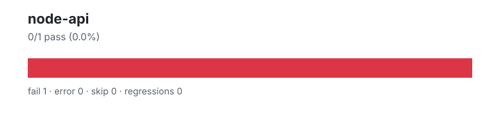

# node-api — `1.4.0+48fa1f4f6`

- Image digest: `6d808bff24077d50ea1a5981c4ba728406f5d61e23a90213b2c83d483ce24259`
- Suite version: `ed33ae74ad100a38df41edf56f6935c78821e779`
- Ran: 2026-07-03T00:16:42.658Z → 2026-07-03T00:16:44.287Z

## Summary

**Pass rate: 0/1 (0.00%)**

| pass | fail | error | skip | regressions | new passes |
|---:|---:|---:|---:|---:|---:|
| 0 | 1 | 0 | 0 | 0 | 0 |

## Observed cases (1)

- `test/parallel/test-eventtarget-memoryleakwarning.js` — fail — ╭─ Script Error ──────────────────────────────────────────────────────────────╮
│ReferenceError: setTimeout is not defined                                    │
│                                                                             │
│ In file test/parallel/test-eventtarget-memoryleakwarning.js:404:3:          │
│   ╭─                                                                        │
│─ Stack Trace ───────────────────────────────────────────────────────────────│
│                                                                             │
│ ╭─ [js] :anonymous                                  test/common/index.js:40 │
│ │                                                                           │
│ · elide run test/parallel/test-eventtarget-memoryle                         │
│                                                                             │
│─ Advice ────────────────────────────────────────────────────────────────────│
│                                                                             │
│ An error occurred while executing your code.                                │
│                                                                             │
╰─────────────────────────────────────────────────────────────────────────────╯
