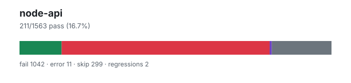

# node-api — `1.4.0+48fa1f4f6`

- Image digest: `f41b0353f4b59ad0caf60a15001ce87c0dd25e7d252efc6dc76b7bddb7def52c`
- Suite version: `ed33ae74ad100a38df41edf56f6935c78821e779`
- Ran: 2026-07-02T23:15:20.922Z → 2026-07-02T23:17:18.920Z

## Summary

**Pass rate: 211/1563 (16.69%)**

| pass | fail | error | skip | regressions | new passes |
|---:|---:|---:|---:|---:|---:|
| 211 | 1042 | 11 | 299 | 2 | 168 |

## Observed cases (1264)

- `test/parallel/test-assert-esm-cjs-message-verify.js` — fail — Uncaught (in promise) Error: node:child_process: spawn() is not implemented yet in Elide
- `test/parallel/test-assert-class-destructuring.js` — fail — TAP version 13
# Subtest: Assert class destructuring behavior - diff option
not ok 1 - Assert class destructuring behavior - diff option
  ---
  duration_ms: 1
  failureType: 'testCodeFailure'
  error: "Assert is not a constructor"
  code: 'ERR_TEST_FAILURE'
  ...
# Subtest: Assert class destructuring behavior - strict option
not ok 2 - Assert class destructuring behavior - strict option
  ---
  duration_ms: 0
  failureType: 'testCodeFailure'
  error: "Assert is not a constructor"
  code: 'ERR_TEST_FAILURE'
  ...
# Subtest: Assert class destructuring behavior - comprehensive methods
not ok 3 - Assert class destructuring behavior - comprehensive methods
  ---
  duration_ms: 0
  failureType: 'testCodeFailure'
  error: "Assert is not a constructor"
  code: 'ERR_TEST_FAILURE'
  ...
1..3
# tests 3
# suites 0
# pass 0
# fail 3
# cancelled 0
# skipped 0
# todo 0
# duration_ms 2
- `test/parallel/test-assert-if-error.js` — fail — TAP version 13
# Subtest: Test that assert.ifError has the correct stack trace of both stacks
not ok 1 - Test that assert.ifError has the correct stack trace of both stacks
  ---
  duration_ms: 1
  failureType: 'testCodeFailure'
  error: "undefined === null"
  code: 'ERR_ASSERTION'
  ...
# Subtest: General ifError tests
not ok 2 - General ifError tests
  ---
  duration_ms: 1
  failureType: 'testCodeFailure'
  error: "Got unwanted exception: ifError got unwanted exception: {stack: false}"
  code: 'ERR_ASSERTION'
  ...
# Subtest: Should not throw
ok 3 - Should not throw
# Subtest: https://github.com/nodejs/node-v0.x-archive/issues/2893
not ok 4 - https://github.com/nodejs/node-v0.x-archive/issues/2893
  ---
  duration_ms: 0
  failureType: 'testCodeFailure'
  error: "'Missing expected exception' === 'Missing expected exception.'"
  code: 'ERR_ASSERTION'
  ...
1..4
# tests 4
# suites 0
# pass 1
# fail 3
# cancelled 0
# skipped 0
# todo 0
# duration_ms 2
- `test/parallel/test-assert-class.js` — fail — TAP version 13
# Subtest: Assert constructor requires new
not ok 1 - Assert constructor requires new
  ---
  duration_ms: 0
  failureType: 'testCodeFailure'
  error: "Got unwanted exception: Assert is not a function"
  code: 'ERR_ASSERTION'
  ...
# Subtest: Assert class non strict
not ok 2 - Assert class non strict
  ---
  duration_ms: 0
  failureType: 'testCodeFailure'
  error: "Assert is not a constructor"
  code: 'ERR_TEST_FAILURE'
  ...
# Subtest: Assert class strict
not ok 3 - Assert class strict
  ---
  duration_ms: 0
  failureType: 'testCodeFailure'
  error: "Assert is not a constructor"
  code: 'ERR_TEST_FAILURE'
  ...
# Subtest: Assert class with invalid diff option
not ok 4 - Assert class with invalid diff option
  ---
  duration_ms: 1
  failureType: 'testCodeFailure'
  error: "Got unwanted exception: Assert is not a constructor"
  code: 'ERR_ASSERTION'
  ...
# Subtest: Assert class non strict with full diff
not ok 5 - Assert class non strict with full diff
  ---
  duration_ms: 0
  failureType: 'testCodeFailure'
  error: "Assert is not a constructor"
  code: 'ERR_TEST_FAILURE'
  ...
# Subtest: Assert class non strict with simple diff
not ok 6 - Assert class non strict with simple diff
  ---
  duration_ms: 0
  failureType: 'testCodeFailure'
  error: "Assert is not a constructor"
  code: 'ERR_TEST_FAILURE'
  ...
# Subtest: Assert class strict with skipPrototype
not ok 7 - Assert class strict with skipPrototype
  ---
  duration_ms: 0
  failureType: 'testCodeFailure'
  error: "Assert is not a constructor"
  code: 'ERR_TEST_FAILURE'
  ...
# Subtest: Assert class non strict with skipPrototype
not ok 8 - Assert class non strict with skipPrototype
  ---
  duration_ms: 0
  failureType: 'testCodeFailure'
  error: "Assert is not a constructor"
  code: 'ERR_TEST_FAILURE'
  ...
# Subtest: Assert class skipPrototype with complex objects
not ok 9 - Assert class skipPrototype with complex objects
  ---
  duration_ms: 0
  failureType: 'testCodeFailure'
  error: "Assert is not a constructor"
  code: 'ERR_TEST_FAILURE'
  ...
# Subtest: Assert class skipPrototype with arrays and special objects
not ok 10 - Assert class skipPrototype with arrays and special objects
  ---
  duration_ms: 0
  failureType: 'testCodeFailure'
  error: "Assert is not a constructor"
  code: 'ERR_TEST_FAILURE'
  ...
# Subtest: Assert class skipPrototype with notDeepStrictEqual
not ok 11 - Assert class skipPrototype with notDeepStrictEqual
  ---
  duration_ms: 1
  failureType: 'testCodeFailure'
  error: "Assert is not a constructor"
  code: 'ERR_TEST_FAILURE'
  ...
# Subtest: Assert class skipPrototype with mixed types
not ok 12 - Assert class skipPrototype with mixed types
  ---
  duration_ms: 0
  failureType: 'testCodeFailure'
  error: "Assert is not a constructor"
  code: 'ERR_TEST_FAILURE'
  ...
1..12
# tests 12
# suites 0
# pass 0
# fail 12
# cancelled 0
# skipped 0
# todo 0
# duration_ms 3
- `test/parallel/test-assert-fail.js` — fail — TAP version 13
# Subtest: No args
not ok 1 - No args
  ---
  duration_ms: 1
  failureType: 'testCodeFailure'
  error: "Got unwanted exception: Failed"
  code: 'ERR_ASSERTION'
  ...
# Subtest: One arg = message
not ok 2 - One arg = message
  ---
  duration_ms: 0
  failureType: 'testCodeFailure'
  error: "Got unwanted exception: custom message"
  code: 'ERR_ASSERTION'
  ...
# Subtest: One arg = Error
not ok 3 - One arg = Error
  ---
  duration_ms: 0
  failureType: 'testCodeFailure'
  error: "Got unwanted exception: Failed"
  code: 'ERR_ASSERTION'
  ...
# Subtest: Object prototype get
ok 4 - Object prototype get
1..4
# tests 4
# suites 0
# pass 1
# fail 3
# cancelled 0
# skipped 0
# todo 0
# duration_ms 3
- `test/parallel/test-assert-deep-with-error.js` — fail — TAP version 13
# Subtest: Handle error causes
not ok 1 - Handle error causes
  ---
  duration_ms: 1
  failureType: 'testCodeFailure'
  error: "Missing expected exception"
  code: 'ERR_ASSERTION'
  ...
# Subtest: Handle undefined causes
not ok 2 - Handle undefined causes
  ---
  duration_ms: 1
  failureType: 'testCodeFailure'
  error: "a notDeepStrictEqual a"
  code: 'ERR_ASSERTION'
  ...
1..2
# tests 2
# suites 0
# pass 0
# fail 2
# cancelled 0
# skipped 0
# todo 0
# duration_ms 3
- `test/parallel/test-assert-checktag.js` — fail — TAP version 13
# Subtest: [object Object]
not ok 1 - [object Object]
  ---
  duration_ms: 14
  failureType: 'testCodeFailure'
  error: "Date(2016-01-01T00:00:00.000Z) notDeepEqual {}"
  code: 'ERR_ASSERTION'
  ...
1..1
# tests 1
# suites 0
# pass 0
# fail 1
# cancelled 0
# skipped 0
# todo 0
# duration_ms 15
- `test/parallel/test-async-hooks-async-await.js` — fail — Uncaught (in promise) TypeError: Cannot read property '1' of undefined
Fatal error (com.oracle.truffle.polyglot.PolyglotContextImpl$ExitException): Exit was called with exit code 1.
com.oracle.truffle.polyglot.PolyglotContextImpl$ExitException: Exit was called with exit code 1.
	at org.graalvm.truffle/com.oracle.truffle.polyglot.PolyglotContextImpl.createExitException(PolyglotContextImpl.java:4007)
	at org.graalvm.truffle/com.oracle.truffle.polyglot.PolyglotContextImpl$CancellationThreadLocalAction.perform(PolyglotContextImpl.java:4101)
	at org.graalvm.truffle/com.oracle.truffle.api.LanguageAccessor$LanguageImpl.performTLAction(LanguageAccessor.java:568)
	at org.graalvm.truffle/com.oracle.truffle.polyglot.PolyglotThreadLocalActions$AsyncEvent.acceptImpl(PolyglotThreadLocalActions.java:783)
	at org.graalvm.truffle/com.oracle.truffle.polyglot.PolyglotThreadLocalActions$AbstractTLHandshake.accept(PolyglotThreadLocalActions.java:730)
	at org.graalvm.truffle/com.oracle.truffle.polyglot.PolyglotThreadLocalActions$AbstractTLHandshake.accept(PolyglotThreadLocalActions.java:627)
	at org.graalvm.truffle/com.oracle.truffle.api.impl.ThreadLocalHandshake$Handshake.perform(ThreadLocalHandshake.java:355)
	at org.graalvm.truffle/com.oracle.truffle.api.impl.ThreadLocalHandshake$TruffleSafepointImpl.processOrNotifyHandshakes(ThreadLocalHandshake.java:637)
	at org.graalvm.truffle/com.oracle.truffle.api.impl.ThreadLocalHandshake.processHandshake(ThreadLocalHandshake.java:174)
	at org.graalvm.truffle.runtime.svm/com.oracle.svm.truffle.api.SubstrateThreadLocalHandshake.invokeProcessHandshake(SubstrateThreadLocalHandshake.java:127)
	at org.graalvm.truffle.runtime.svm/com.oracle.svm.truffle.api.SubstrateThreadLocalHandshake.poll(SubstrateThreadLocalHandshake.java:86)
	at org.graalvm.truffle/com.oracle.truffle.api.TruffleSafepoint.pollHere(TruffleSafepoint.java:180)
	at org.graalvm.truffle/com.oracle.truffle.polyglot.PolyglotContextImpl.closeExited(PolyglotContextImpl.java:3326)
	at org.graalvm.truffle/com.oracle.truffle.polyglot.EngineAccessor$EngineImpl.exitContext(EngineAccessor.java:1986)
	at org.graalvm.truffle/com.oracle.truffle.api.TruffleContext.closeExited(TruffleContext.java:767)
	at dev.elide.lang.javascript.globals.ProcessGlobal$ExitNode.exit(ProcessGlobal.java:930)
	at dev.elide.lang.javascript.globals.ProcessGlobal$ExitNode.execute(ProcessGlobal.java:907)
	at com.oracle.truffle.js.nodes.function.FunctionRootNode.executeInRealm(FunctionRootNode.java:155)
	at com.oracle.truffle.js.runtime.JavaScriptRealmBoundaryRootNode.execute(JavaScriptRealmBoundaryRootNode.java:96)
	at org.graalvm.truffle.runtime/com.oracle.truffle.runtime.OptimizedCallTarget.executeRootNode(OptimizedCallTarget.java:808)
	at org.graalvm.truffle.runtime/com.oracle.truffle.runtime.OptimizedCallTarget.profiledPERoot(OptimizedCallTarget.java:722)
	at org.graalvm.truffle.runtime/com.oracle.truffle.runtime.OptimizedCallTarget.callBoundary(OptimizedCallTarget.java:641)
	at org.graalvm.truffle.runtime.svm/com.oracle.svm.truffle.api.SubstrateOptimizedCallTarget.invokeCallBoundary(SubstrateOptimizedCallTarget.java:124)
	at com.oracle.truffle.enterprise.svm/com.oracle.svm.enterprise.truffle.compiler.SubstrateEnterpriseOptimizedCallTarget.invokeFromInterpreter(SubstrateEnterpriseOptimizedCallTarget.java:289)
	at com.oracle.truffle.enterprise.svm/com.oracle.svm.enterprise.truffle.compiler.SubstrateEnterpriseOptimizedCallTarget.doInvoke(SubstrateEnterpriseOptimizedCallTarget.java:255)
	at org.graalvm.truffle.runtime/com.oracle.truffle.runtime.OptimizedCallTarget.callDirect(OptimizedCallTarget.java:573)
	at org.graalvm.truffle.runtime/com.oracle.truffle.runtime.OptimizedDirectCallNode.call(OptimizedDirectCallNode.java:94)
	at com.oracle.truffle.js.nodes.function.JSFunctionCallNode$DirectJSFunctionCacheNode.executeCall(JSFunctionCallNode.java:1330)
	at com.oracle.truffle.js.nodes.function.JSFunctionCallNode.executeAndSpecialize(JSFunctionCallNode.java:308)
	at com.oracle.truffle.js.nodes.function.JSFunctionCallNode.executeCall(JSFunctionCallNode.java:253)
	at com.oracle.truffle.js.nodes.function.JSFunctionCallNode$InvokeNode.execute(JSFunctionCallNode.java:723)
	at com.oracle.truffle.js.nodes.control.DiscardResultNode.execute(DiscardResultNode.java:80)
	at com.oracle.truffle.js.nodes.control.IfNode.doBoolean(IfNode.java:177)
	at com.oracle.truffle.js.nodes.control.IfNode.doObject(IfNode.java:195)
	at com.oracle.truffle.js.nodes.control.IfNodeGen.executeAndSpecialize(IfNodeGen.java:144)
	at com.oracle.truffle.js.nodes.control.IfNodeGen.execute_generic1(IfNodeGen.java:123)
	at com.oracle.truffle.js.nodes.control.IfNodeGen.execute(IfNodeGen.java:93)
	at com.oracle.truffle.js.nodes.control.IfNodeGen.executeVoid(IfNodeGen.java:129)
	at com.oracle.truffle.js.nodes.control.AbstractBlockNode.executeVoid(AbstractBlockNode.java:72)
	at com.oracle.truffle.js.nodes.control.VoidBlockNode.execute(VoidBlockNode.java:61)
	at com.oracle.truffle.js.nodes.control.ReturnTargetNode$FrameReturnTargetNode.execute(ReturnTargetNode.java:124)
	at com.oracle.truffle.js.nodes.control.AbstractBlockNode.execute(AbstractBlockNode.java:84)
	at com.oracle.truffle.js.nodes.function.FunctionBodyNode.execute(FunctionBodyNode.java:70)
	at com.oracle.truffle.js.nodes.function.FunctionRootNode.executeInRealm(FunctionRootNode.java:155)
	at com.oracle.truffle.js.runtime.JavaScriptRealmBoundaryRootNode.execute(JavaScriptRealmBoundaryRootNode.java:96)
	at org.graalvm.truffle.runtime/com.oracle.truffle.runtime.OptimizedCallTarget.executeRootNode(OptimizedCallTarget.java:808)
	at org.graalvm.truffle.runtime/com.oracle.truffle.runtime.OptimizedCallTarget.profiledPERoot(OptimizedCallTarget.java:722)
	at org.graalvm.truffle.runtime/com.oracle.truffle.runtime.OptimizedCallTarget.callBoundary(OptimizedCallTarget.java:641)
	at org.graalvm.truffle.runtime.svm/com.oracle.svm.truffle.api.SubstrateOptimizedCallTarget.invokeCallBoundary(SubstrateOptimizedCallTarget.java:124)
	at com.oracle.truffle.enterprise.svm/com.oracle.svm.enterprise.truffle.compiler.SubstrateEnterpriseOptimizedCallTarget.invokeFromInterpreter(SubstrateEnterpriseOptimizedCallTarget.java:289)
	at com.oracle.truffle.enterprise.svm/com.oracle.svm.enterprise.truffle.compiler.SubstrateEnterpriseOptimizedCallTarget.doInvoke(SubstrateEnterpriseOptimizedCallTarget.java:255)
	at org.graalvm.truffle.runtime/com.oracle.truffle.runtime.OptimizedCallTarget.callDirect(OptimizedCallTarget.java:573)
	at org.graalvm.truffle.runtime/com.oracle.truffle.runtime.OptimizedCallTarget.call(OptimizedCallTarget.java:519)
	at com.oracle.truffle.js.runtime.builtins.JSFunction.call(JSFunction.java:291)
	at com.oracle.truffle.js.runtime.JSRuntime.call(JSRuntime.java:2252)
	at dev.elide.lang.javascript.node.events.EventEmitterOps.emit(EventEmitterOps.java:194)
	at dev.elide.lang.javascript.globals.ProcessLifecycle.emit(ProcessLifecycle.java:145)
	at dev.elide.lang.javascript.globals.ProcessLifecycle.emitExitOnce(ProcessLifecycle.java:120)
	at dev.elide.cli.commands.RunCommand.evaluate(RunCommand.kt:376)
	at dev.elide.cli.commands.RunCommand.runGuest(RunCommand.kt:311)
	at dev.elide.cli.commands.RunCommand.run(RunCommand.kt:137)
	at dev.elide.cli.commands.Command$Companion.parseAndRun(Command.kt:69)
	at dev.elide.EntryKt.entry(Entry.kt:1336)
	Suppressed: Attached Guest Language Frames (2)

Crash report written to: /work/.harness/.local/state/elide/crashes/20260702T231522Z-kotlin-43-run.md
- `test/parallel/test-assert-async.js` — fail — Uncaught (in promise) AssertionError: Got rejection that did not match expected: AssertionError: Failed
Fatal error (com.oracle.truffle.polyglot.PolyglotContextImpl$ExitException): Exit was called with exit code 1.
com.oracle.truffle.polyglot.PolyglotContextImpl$ExitException: Exit was called with exit code 1.
	at org.graalvm.truffle/com.oracle.truffle.polyglot.PolyglotContextImpl.createExitException(PolyglotContextImpl.java:4007)
	at org.graalvm.truffle/com.oracle.truffle.polyglot.PolyglotContextImpl$CancellationThreadLocalAction.perform(PolyglotContextImpl.java:4101)
	at org.graalvm.truffle/com.oracle.truffle.api.LanguageAccessor$LanguageImpl.performTLAction(LanguageAccessor.java:568)
	at org.graalvm.truffle/com.oracle.truffle.polyglot.PolyglotThreadLocalActions$AsyncEvent.acceptImpl(PolyglotThreadLocalActions.java:783)
	at org.graalvm.truffle/com.oracle.truffle.polyglot.PolyglotThreadLocalActions$AbstractTLHandshake.accept(PolyglotThreadLocalActions.java:730)
	at org.graalvm.truffle/com.oracle.truffle.polyglot.PolyglotThreadLocalActions$AbstractTLHandshake.accept(PolyglotThreadLocalActions.java:627)
	at org.graalvm.truffle/com.oracle.truffle.api.impl.ThreadLocalHandshake$Handshake.perform(ThreadLocalHandshake.java:355)
	at org.graalvm.truffle/com.oracle.truffle.api.impl.ThreadLocalHandshake$TruffleSafepointImpl.processOrNotifyHandshakes(ThreadLocalHandshake.java:637)
	at org.graalvm.truffle/com.oracle.truffle.api.impl.ThreadLocalHandshake.processHandshake(ThreadLocalHandshake.java:174)
	at org.graalvm.truffle.runtime.svm/com.oracle.svm.truffle.api.SubstrateThreadLocalHandshake.invokeProcessHandshake(SubstrateThreadLocalHandshake.java:127)
	at org.graalvm.truffle.runtime.svm/com.oracle.svm.truffle.api.SubstrateThreadLocalHandshake.poll(SubstrateThreadLocalHandshake.java:86)
	at org.graalvm.truffle/com.oracle.truffle.api.TruffleSafepoint.pollHere(TruffleSafepoint.java:180)
	at org.graalvm.truffle/com.oracle.truffle.polyglot.PolyglotContextImpl.closeExited(PolyglotContextImpl.java:3326)
	at org.graalvm.truffle/com.oracle.truffle.polyglot.EngineAccessor$EngineImpl.exitContext(EngineAccessor.java:1986)
	at org.graalvm.truffle/com.oracle.truffle.api.TruffleContext.closeExited(TruffleContext.java:767)
	at dev.elide.lang.javascript.globals.ProcessGlobal$ExitNode.exit(ProcessGlobal.java:930)
	at dev.elide.lang.javascript.globals.ProcessGlobal$ExitNode.execute(ProcessGlobal.java:907)
	at com.oracle.truffle.js.nodes.function.FunctionRootNode.executeInRealm(FunctionRootNode.java:155)
	at com.oracle.truffle.js.runtime.JavaScriptRealmBoundaryRootNode.execute(JavaScriptRealmBoundaryRootNode.java:96)
	at org.graalvm.truffle.runtime/com.oracle.truffle.runtime.OptimizedCallTarget.executeRootNode(OptimizedCallTarget.java:808)
	at org.graalvm.truffle.runtime/com.oracle.truffle.runtime.OptimizedCallTarget.profiledPERoot(OptimizedCallTarget.java:722)
	at org.graalvm.truffle.runtime/com.oracle.truffle.runtime.OptimizedCallTarget.callBoundary(OptimizedCallTarget.java:641)
	at org.graalvm.truffle.runtime.svm/com.oracle.svm.truffle.api.SubstrateOptimizedCallTarget.invokeCallBoundary(SubstrateOptimizedCallTarget.java:124)
	at com.oracle.truffle.enterprise.svm/com.oracle.svm.enterprise.truffle.compiler.SubstrateEnterpriseOptimizedCallTarget.invokeFromInterpreter(SubstrateEnterpriseOptimizedCallTarget.java:289)
	at com.oracle.truffle.enterprise.svm/com.oracle.svm.enterprise.truffle.compiler.SubstrateEnterpriseOptimizedCallTarget.doInvoke(SubstrateEnterpriseOptimizedCallTarget.java:255)
	at org.graalvm.truffle.runtime/com.oracle.truffle.runtime.OptimizedCallTarget.callDirect(OptimizedCallTarget.java:573)
	at org.graalvm.truffle.runtime/com.oracle.truffle.runtime.OptimizedDirectCallNode.call(OptimizedDirectCallNode.java:94)
	at com.oracle.truffle.js.nodes.function.JSFunctionCallNode$DirectJSFunctionCacheNode.executeCall(JSFunctionCallNode.java:1330)
	at com.oracle.truffle.js.nodes.function.JSFunctionCallNode.executeAndSpecialize(JSFunctionCallNode.java:308)
	at com.oracle.truffle.js.nodes.function.JSFunctionCallNode.executeCall(JSFunctionCallNode.java:253)
	at com.oracle.truffle.js.nodes.function.JSFunctionCallNode$InvokeNode.execute(JSFunctionCallNode.java:723)
	at com.oracle.truffle.js.nodes.control.DiscardResultNode.execute(DiscardResultNode.java:80)
	at com.oracle.truffle.js.nodes.control.IfNode.doBoolean(IfNode.java:177)
	at com.oracle.truffle.js.nodes.control.IfNode.doObject(IfNode.java:195)
	at com.oracle.truffle.js.nodes.control.IfNodeGen.executeAndSpecialize(IfNodeGen.java:144)
	at com.oracle.truffle.js.nodes.control.IfNodeGen.execute_generic1(IfNodeGen.java:123)
	at com.oracle.truffle.js.nodes.control.IfNodeGen.execute(IfNodeGen.java:93)
	at com.oracle.truffle.js.nodes.control.IfNodeGen.executeVoid(IfNodeGen.java:129)
	at com.oracle.truffle.js.nodes.control.AbstractBlockNode.executeVoid(AbstractBlockNode.java:72)
	at com.oracle.truffle.js.nodes.control.VoidBlockNode.execute(VoidBlockNode.java:61)
	at com.oracle.truffle.js.nodes.control.ReturnTargetNode$FrameReturnTargetNode.execute(ReturnTargetNode.java:124)
	at com.oracle.truffle.js.nodes.control.AbstractBlockNode.execute(AbstractBlockNode.java:84)
	at com.oracle.truffle.js.nodes.function.FunctionBodyNode.execute(FunctionBodyNode.java:70)
	at com.oracle.truffle.js.nodes.function.FunctionRootNode.executeInRealm(FunctionRootNode.java:155)
	at com.oracle.truffle.js.runtime.JavaScriptRealmBoundaryRootNode.execute(JavaScriptRealmBoundaryRootNode.java:96)
	at org.graalvm.truffle.runtime/com.oracle.truffle.runtime.OptimizedCallTarget.executeRootNode(OptimizedCallTarget.java:808)
	at org.graalvm.truffle.runtime/com.oracle.truffle.runtime.OptimizedCallTarget.profiledPERoot(OptimizedCallTarget.java:722)
	at org.graalvm.truffle.runtime/com.oracle.truffle.runtime.OptimizedCallTarget.callBoundary(OptimizedCallTarget.java:641)
	at org.graalvm.truffle.runtime.svm/com.oracle.svm.truffle.api.SubstrateOptimizedCallTarget.invokeCallBoundary(SubstrateOptimizedCallTarget.java:124)
	at com.oracle.truffle.enterprise.svm/com.oracle.svm.enterprise.truffle.compiler.SubstrateEnterpriseOptimizedCallTarget.invokeFromInterpreter(SubstrateEnterpriseOptimizedCallTarget.java:289)
	at com.oracle.truffle.enterprise.svm/com.oracle.svm.enterprise.truffle.compiler.SubstrateEnterpriseOptimizedCallTarget.doInvoke(SubstrateEnterpriseOptimizedCallTarget.java:255)
	at org.graalvm.truffle.runtime/com.oracle.truffle.runtime.OptimizedCallTarget.callDirect(OptimizedCallTarget.java:573)
	at org.graalvm.truffle.runtime/com.oracle.truffle.runtime.OptimizedCallTarget.call(OptimizedCallTarget.java:519)
	at com.oracle.truffle.js.runtime.builtins.JSFunction.call(JSFunction.java:291)
	at com.oracle.truffle.js.runtime.JSRuntime.call(JSRuntime.java:2252)
	at dev.elide.lang.javascript.node.events.EventEmitterOps.emit(EventEmitterOps.java:194)
	at dev.elide.lang.javascript.globals.ProcessLifecycle.emit(ProcessLifecycle.java:145)
	at dev.elide.lang.javascript.globals.ProcessLifecycle.emitExitOnce(ProcessLifecycle.java:120)
	at dev.elide.cli.commands.RunCommand.evaluate(RunCommand.kt:376)
	at dev.elide.cli.commands.RunCommand.runGuest(RunCommand.kt:311)
	at dev.elide.cli.commands.RunCommand.run(RunCommand.kt:137)
	at dev.elide.cli.commands.Command$Companion.parseAndRun(Command.kt:69)
	at dev.elide.EntryKt.entry(Entry.kt:1336)
	Suppressed: Attached Guest Language Frames (2)

Crash report written to: /work/.harness/.local/state/elide/crashes/20260702T231522Z-kotlin-29-run.md
- `test/parallel/test-assert-first-line.js` — fail — TAP version 13
# Subtest: Verify that asserting in the very first line produces the expected result
not ok 1 - Verify that asserting in the very first line produces the expected result
  ---
  duration_ms: 1
  failureType: 'testCodeFailure'
  error: "Got unwanted exception: '' == true"
  code: 'ERR_ASSERTION'
  ...
1..1
# tests 1
# suites 0
# pass 0
# fail 1
# cancelled 0
# skipped 0
# todo 0
# duration_ms 3
- `test/parallel/test-async-hooks-close-during-destroy.js` — fail — Fatal error (com.oracle.truffle.polyglot.PolyglotContextImpl$ExitException): Exit was called with exit code 1.
com.oracle.truffle.polyglot.PolyglotContextImpl$ExitException: Exit was called with exit code 1.
	at org.graalvm.truffle/com.oracle.truffle.polyglot.PolyglotContextImpl.createExitException(PolyglotContextImpl.java:4007)
	at org.graalvm.truffle/com.oracle.truffle.polyglot.PolyglotContextImpl$CancellationThreadLocalAction.perform(PolyglotContextImpl.java:4101)
	at org.graalvm.truffle/com.oracle.truffle.api.LanguageAccessor$LanguageImpl.performTLAction(LanguageAccessor.java:568)
	at org.graalvm.truffle/com.oracle.truffle.polyglot.PolyglotThreadLocalActions$AsyncEvent.acceptImpl(PolyglotThreadLocalActions.java:783)
	at org.graalvm.truffle/com.oracle.truffle.polyglot.PolyglotThreadLocalActions$AbstractTLHandshake.accept(PolyglotThreadLocalActions.java:730)
	at org.graalvm.truffle/com.oracle.truffle.polyglot.PolyglotThreadLocalActions$AbstractTLHandshake.accept(PolyglotThreadLocalActions.java:627)
	at org.graalvm.truffle/com.oracle.truffle.api.impl.ThreadLocalHandshake$Handshake.perform(ThreadLocalHandshake.java:355)
	at org.graalvm.truffle/com.oracle.truffle.api.impl.ThreadLocalHandshake$TruffleSafepointImpl.processOrNotifyHandshakes(ThreadLocalHandshake.java:637)
	at org.graalvm.truffle/com.oracle.truffle.api.impl.ThreadLocalHandshake.processHandshake(ThreadLocalHandshake.java:174)
	at org.graalvm.truffle.runtime.svm/com.oracle.svm.truffle.api.SubstrateThreadLocalHandshake.invokeProcessHandshake(SubstrateThreadLocalHandshake.java:127)
	at org.graalvm.truffle.runtime.svm/com.oracle.svm.truffle.api.SubstrateThreadLocalHandshake.poll(SubstrateThreadLocalHandshake.java:86)
	at org.graalvm.truffle/com.oracle.truffle.api.TruffleSafepoint.pollHere(TruffleSafepoint.java:180)
	at org.graalvm.truffle/com.oracle.truffle.polyglot.PolyglotContextImpl.closeExited(PolyglotContextImpl.java:3326)
	at org.graalvm.truffle/com.oracle.truffle.polyglot.EngineAccessor$EngineImpl.exitContext(EngineAccessor.java:1986)
	at org.graalvm.truffle/com.oracle.truffle.api.TruffleContext.closeExited(TruffleContext.java:767)
	at dev.elide.lang.javascript.globals.ProcessGlobal$ExitNode.exit(ProcessGlobal.java:930)
	at dev.elide.lang.javascript.globals.ProcessGlobal$ExitNode.execute(ProcessGlobal.java:907)
	at com.oracle.truffle.js.nodes.function.FunctionRootNode.executeInRealm(FunctionRootNode.java:155)
	at com.oracle.truffle.js.runtime.JavaScriptRealmBoundaryRootNode.execute(JavaScriptRealmBoundaryRootNode.java:96)
	at org.graalvm.truffle.runtime/com.oracle.truffle.runtime.OptimizedCallTarget.executeRootNode(OptimizedCallTarget.java:808)
	at org.graalvm.truffle.runtime/com.oracle.truffle.runtime.OptimizedCallTarget.profiledPERoot(OptimizedCallTarget.java:722)
	at org.graalvm.truffle.runtime/com.oracle.truffle.runtime.OptimizedCallTarget.callBoundary(OptimizedCallTarget.java:641)
	at org.graalvm.truffle.runtime.svm/com.oracle.svm.truffle.api.SubstrateOptimizedCallTarget.invokeCallBoundary(SubstrateOptimizedCallTarget.java:124)
	at com.oracle.truffle.enterprise.svm/com.oracle.svm.enterprise.truffle.compiler.SubstrateEnterpriseOptimizedCallTarget.invokeFromInterpreter(SubstrateEnterpriseOptimizedCallTarget.java:289)
	at com.oracle.truffle.enterprise.svm/com.oracle.svm.enterprise.truffle.compiler.SubstrateEnterpriseOptimizedCallTarget.doInvoke(SubstrateEnterpriseOptimizedCallTarget.java:255)
	at org.graalvm.truffle.runtime/com.oracle.truffle.runtime.OptimizedCallTarget.callDirect(OptimizedCallTarget.java:573)
	at org.graalvm.truffle.runtime/com.oracle.truffle.runtime.OptimizedDirectCallNode.call(OptimizedDirectCallNode.java:94)
	at com.oracle.truffle.js.nodes.function.JSFunctionCallNode$DirectJSFunctionCacheNode.executeCall(JSFunctionCallNode.java:1330)
	at com.oracle.truffle.js.nodes.function.JSFunctionCallNode.executeAndSpecialize(JSFunctionCallNode.java:308)
	at com.oracle.truffle.js.nodes.function.JSFunctionCallNode.executeCall(JSFunctionCallNode.java:253)
	at com.oracle.truffle.js.nodes.function.JSFunctionCallNode$InvokeNode.execute(JSFunctionCallNode.java:723)
	at com.oracle.truffle.js.nodes.control.DiscardResultNode.execute(DiscardResultNode.java:80)
	at com.oracle.truffle.js.nodes.control.IfNode.doBoolean(IfNode.java:177)
	at com.oracle.truffle.js.nodes.control.IfNode.doObject(IfNode.java:195)
	at com.oracle.truffle.js.nodes.control.IfNodeGen.executeAndSpecialize(IfNodeGen.java:144)
	at com.oracle.truffle.js.nodes.control.IfNodeGen.execute_generic1(IfNodeGen.java:123)
	at com.oracle.truffle.js.nodes.control.IfNodeGen.execute(IfNodeGen.java:93)
	at com.oracle.truffle.js.nodes.control.IfNodeGen.executeVoid(IfNodeGen.java:129)
	at com.oracle.truffle.js.nodes.control.AbstractBlockNode.executeVoid(AbstractBlockNode.java:72)
	at com.oracle.truffle.js.nodes.control.VoidBlockNode.execute(VoidBlockNode.java:61)
	at com.oracle.truffle.js.nodes.control.ReturnTargetNode$FrameReturnTargetNode.execute(ReturnTargetNode.java:124)
	at com.oracle.truffle.js.nodes.control.AbstractBlockNode.execute(AbstractBlockNode.java:84)
	at com.oracle.truffle.js.nodes.function.FunctionBodyNode.execute(FunctionBodyNode.java:70)
	at com.oracle.truffle.js.nodes.function.FunctionRootNode.executeInRealm(FunctionRootNode.java:155)
	at com.oracle.truffle.js.runtime.JavaScriptRealmBoundaryRootNode.execute(JavaScriptRealmBoundaryRootNode.java:96)
	at org.graalvm.truffle.runtime/com.oracle.truffle.runtime.OptimizedCallTarget.executeRootNode(OptimizedCallTarget.java:808)
	at org.graalvm.truffle.runtime/com.oracle.truffle.runtime.OptimizedCallTarget.profiledPERoot(OptimizedCallTarget.java:722)
	at org.graalvm.truffle.runtime/com.oracle.truffle.runtime.OptimizedCallTarget.callBoundary(OptimizedCallTarget.java:641)
	at org.graalvm.truffle.runtime.svm/com.oracle.svm.truffle.api.SubstrateOptimizedCallTarget.invokeCallBoundary(SubstrateOptimizedCallTarget.java:124)
	at com.oracle.truffle.enterprise.svm/com.oracle.svm.enterprise.truffle.compiler.SubstrateEnterpriseOptimizedCallTarget.invokeFromInterpreter(SubstrateEnterpriseOptimizedCallTarget.java:289)
	at com.oracle.truffle.enterprise.svm/com.oracle.svm.enterprise.truffle.compiler.SubstrateEnterpriseOptimizedCallTarget.doInvoke(SubstrateEnterpriseOptimizedCallTarget.java:255)
	at org.graalvm.truffle.runtime/com.oracle.truffle.runtime.OptimizedCallTarget.callDirect(OptimizedCallTarget.java:573)
	at org.graalvm.truffle.runtime/com.oracle.truffle.runtime.OptimizedCallTarget.call(OptimizedCallTarget.java:519)
	at com.oracle.truffle.js.runtime.builtins.JSFunction.call(JSFunction.java:291)
	at com.oracle.truffle.js.runtime.JSRuntime.call(JSRuntime.java:2252)
	at dev.elide.lang.javascript.node.events.EventEmitterOps.emit(EventEmitterOps.java:194)
	at dev.elide.lang.javascript.globals.ProcessLifecycle.emit(ProcessLifecycle.java:145)
	at dev.elide.lang.javascript.globals.ProcessLifecycle.emitExitOnce(ProcessLifecycle.java:120)
	at dev.elide.cli.commands.RunCommand.evaluate(RunCommand.kt:376)
	at dev.elide.cli.commands.RunCommand.runGuest(RunCommand.kt:311)
	at dev.elide.cli.commands.RunCommand.run(RunCommand.kt:137)
	at dev.elide.cli.commands.Command$Companion.parseAndRun(Command.kt:69)
	at dev.elide.EntryKt.entry(Entry.kt:1336)
	Suppressed: Attached Guest Language Frames (2)

Crash report written to: /work/.harness/.local/state/elide/crashes/20260702T231522Z-kotlin-45-run.md
- `test/parallel/test-assert.js` — fail — TAP version 13
# Subtest: some basics
ok 1 - some basics
# Subtest: Throw message if the message is instanceof Error
ok 2 - Throw message if the message is instanceof Error
# Subtest: Errors created in different contexts are handled as any other custom error
not ok 3 - Errors created in different contexts are handled as any other custom error
  ---
  duration_ms: 0
  failureType: 'testCodeFailure'
  error: "Got unwanted exception: false == true"
  code: 'ERR_ASSERTION'
  ...
# Subtest: assert.throws()
not ok 4 - assert.throws()
  ---
  duration_ms: 1
  failureType: 'testCodeFailure'
  error: "Got unwanted exception: 2 !== 2"
  code: 'ERR_ASSERTION'
  ...
# Subtest: Check messages from assert.throws()
not ok 5 - Check messages from assert.throws()
  ---
  duration_ms: 0
  failureType: 'testCodeFailure'
  error: "Got unwanted exception: Missing expected exception"
  code: 'ERR_ASSERTION'
  ...
# Subtest: Test assertion messages
not ok 6 - Test assertion messages
  ---
  duration_ms: 0
  failureType: 'testCodeFailure'
  error: "Got unwanted exception: null === ''"
  code: 'ERR_ASSERTION'
  ...
# Subtest: Custom errors
not ok 7 - Custom errors
  ---
  duration_ms: 0
  failureType: 'testCodeFailure'
  error: "1 === 2 === my range"
  code: 'ERR_ASSERTION'
  ...
# Subtest: Verify that throws() and doesNotThrow() throw on non-functions
not ok 8 - Verify that throws() and doesNotThrow() throw on non-functions
  ---
  duration_ms: 1
  failureType: 'testCodeFailure'
  error: "Got unwanted exception: The 'fn' argument must be a function. Received string"
  code: 'ERR_ASSERTION'
  ...
# Subtest: https://github.com/nodejs/node/issues/3275
not ok 9 - https://github.com/nodejs/node/issues/3275
  ---
  duration_ms: 0
  failureType: 'testCodeFailure'
  error: "Got unwanted exception: undefined"
  code: 'ERR_ASSERTION'
  ...
# Subtest: Long values should be truncated for display
not ok 10 - Long values should be truncated for display
  ---
  duration_ms: 1
  failureType: 'testCodeFailure'
  error: "Got unwanted exception: 'AAAAAAAAAAAAAAAAAAAAAAAAAAAAAAAAAAAAAAAAAAAAAAAAAAAAAAAAAAAAAAAAAAAAAAAAAAAAAAAAAAAAAAAAAAAAAAAAAAAAAAAAAAAAAAAAAAAAAAAAAAAAAAAAAAAAAAAAAAAAAAAAAAAAAAAAAAAAAAAAAAAAAAAAAAAAAAAAAAAAAAAAAAAAAAAAAAAAAAAAAAAAAAAAAAAAAAAAAAAAAAAAAAAAAAAAAAAAAAAAAAAAAAAAAAAAAAAAAAAAAAAAAAAAAAAAAAAAAAAAAAAAAAAAAAAAAAAAAAAAAAAAAAAAAAAAAAAAAAAAAAAAAAAAAAAAAAAAAAAAAAAAAAAAAAAAAAAAAAAAAAAAAAAAAAAAAAAAAAAAAAAAAAAAAAAAAAAAAAAAAAAAAAAAAAAAAAAAAAAAAAAAAAAAAAAAAAAAAAAAAAAAAAAAAAAAAAAAAAAAAAAAAAAAAAAAAAAAAAAAAAAAAAAAAAAAAAAAAAAAAAAAAAAAAAAAAAAAAAAAAAAAAAAAAAAAAAAAAAAAAAAAAAAAAAAAAAAAAAAAAAAAAAAAAAAAAAAAAAAAAAAAAAAAAAAAAAAAAAAAAAAAAAAAAAAAAAAAAAAAAAAAAAAAAAAAAAAAAAAAAAAAAAAAAAAAAAAAAAAAAAAAAAAAAAAAAAAAAAAAAAAAAAAAAAAAAAAAAAAAAAAAAAAAAAAAAAAAAAAAAAAAAAAAAAAAAAAAAAAAAAAAAAAAAAAAAAAAAAAAAAAAAAAAAAAAAAAAAAAAAAAAAAAAAAAAAAAAAAAAAAAAAAAAAAAAAAAAAAAAAAAAAAAAAAAAAAAAAAAAAAAAAAAAAAAAAAAAAAAAAAAAAAAAAAAAAAAAAAAAAAAAAAAAAAAAAAAAAAAAAAAAAAAAAAAAAAAAAAAAAAAAAAAAAAAAAAAAAAAAAAAAAAAAAAAAAAAAAAAAAAAAAAAAAAAAAAAAAAAAAAAAAAAAAAAAAAAAAAAA' === ''"
  code: 'ERR_ASSERTION'
  ...
# Subtest: Output that extends beyond 10 lines should also be truncated for display
not ok 11 - Output that extends beyond 10 lines should also be truncated for display
  ---
  duration_ms: 0
  failureType: 'testCodeFailure'
  error: "Got unwanted exception: 'fhqwhgads\nfhqwhgads\nfhqwhgads\nfhqwhgads\nfhqwhgads\nfhqwhgads\nfhqwhgads\nfhqwhgads\nfhqwhgads\nfhqwhgads\nfhqwhgads\nfhqwhgads\nfhqwhgads\nfhqwhgads\nfhqwhgads\n' === ''"
  code: 'ERR_ASSERTION'
  ...
# Subtest: Bad args to AssertionError constructor should throw TypeError.
not ok 12 - Bad args to AssertionError constructor should throw TypeError.
  ---
  duration_ms: 1
  failureType: 'testCodeFailure'
  error: "Missing expected exception"
  code: 'ERR_ASSERTION'
  ...
# Subtest: NaN is handled correctly
not ok 13 - NaN is handled correctly
  ---
  duration_ms: 0
  failureType: 'testCodeFailure'
  error: "NaN == NaN"
  code: 'ERR_ASSERTION'
  ...
# Subtest: Test strict assert
not ok 14 - Test strict assert
  ---
  duration_ms: 0
  failureType: 'testCodeFailure'
  error: "Got unwanted exception: undefined == true"
  code: 'ERR_ASSERTION'
  ...
# Subtest: Additional asserts
not ok 15 - Additional asserts
  ---
  duration_ms: 1
  failureType: 'testCodeFailure'
  error: "Got unwanted exception: null == true"
  code: 'ERR_ASSERTION'
  ...
# Subtest: Throws accepts objects
not ok 16 - Throws accepts objects
  ---
  duration_ms: 0
  failureType: 'testCodeFailure'
  error: "Got unwanted exception: false == true"
  code: 'ERR_ASSERTION'
  ...
# Subtest: Additional assert
not ok 17 - Additional assert
  ---
  duration_ms: 0
  failureType: 'testCodeFailure'
  error: "Missing expected exception"
  code: 'ERR_ASSERTION'
  ...
# Subtest: assert/strict exists
not ok 18 - assert/strict exists
  ---
  duration_ms: 1
  failureType: 'testCodeFailure'
  error: "Cannot load module: 'assert/strict'"
  code: 'ERR_TEST_FAILURE'
  ...
# Subtest: Printf-like format strings as error message
not ok 19 - Printf-like format strings as error message
  ---
  duration_ms: 0
  failureType: 'testCodeFailure'
  error: "Got unwanted exception: The answer to all questions is %i"
  code: 'ERR_ASSERTION'
  ...
# Subtest: Functions as error message
not ok 20 - Functions as error message
  ---
  duration_ms: 0
  failureType: 'testCodeFailure'
  error: "Got unwanted exception: 1 == 2"
  code: 'ERR_ASSERTION'
  ...
# Subtest: Ambiguous error messages fail
not ok 21 - Ambiguous error messages fail
  ---
  duration_ms: 0
  failureType: 'testCodeFailure'
  error: "Got unwanted exception: The input was expected to not match the regular expression: /foo/"
  code: 'ERR_ASSERTION'
  ...
# Subtest: Faulty message functions
not ok 22 - Faulty message functions
  ---
  duration_ms: 0
  failureType: 'testCodeFailure'
  error: "Got unwanted exception: The input was expected to not match the regular expression: /foo/"
  code: 'ERR_ASSERTION'
  ...
# Subtest: Functions as error message
not ok 23 - Functions as error message
  ---
  duration_ms: 0
  failureType: 'testCodeFailure'
  error: "Got unwanted exception: 'foo' == 'bar'"
  code: 'ERR_ASSERTION'
  ...
1..23
# tests 23
# suites 0
# pass 2
# fail 21
# cancelled 0
# skipped 0
# todo 0
# duration_ms 10
- `test/parallel/test-async-hooks-destroy-on-gc.js` — fail — TypeError: (intermediate value).gc is not a function
    at test-async-hooks-destroy-on-gc.js:25:14
    at _return (/work/.harness/work/node-api/node-api-overlay/test/common/index.js:573:12)
- `test/parallel/test-async-hooks-disable-gc-tracking.js` — fail — TypeError: (intermediate value).gc is not a function
    at test-async-hooks-disable-gc-tracking.js:17:14
- `test/parallel/test-async-hooks-prevent-double-destroy.js` — fail — TypeError: (intermediate value).gc is not a function
    at test-async-hooks-prevent-double-destroy.js:20:14
- `test/parallel/test-async-hooks-correctly-switch-promise-hook.js` — pass
- `test/parallel/test-async-hooks-promise-enable-disable.js` — pass
- `test/parallel/test-async-hooks-disable-during-promise.js` — fail — Fatal error (com.oracle.truffle.polyglot.PolyglotContextImpl$ExitException): Exit was called with exit code 1.
com.oracle.truffle.polyglot.PolyglotContextImpl$ExitException: Exit was called with exit code 1.
	at org.graalvm.truffle/com.oracle.truffle.polyglot.PolyglotContextImpl.createExitException(PolyglotContextImpl.java:4007)
	at org.graalvm.truffle/com.oracle.truffle.polyglot.PolyglotContextImpl$CancellationThreadLocalAction.perform(PolyglotContextImpl.java:4101)
	at org.graalvm.truffle/com.oracle.truffle.api.LanguageAccessor$LanguageImpl.performTLAction(LanguageAccessor.java:568)
	at org.graalvm.truffle/com.oracle.truffle.polyglot.PolyglotThreadLocalActions$AsyncEvent.acceptImpl(PolyglotThreadLocalActions.java:783)
	at org.graalvm.truffle/com.oracle.truffle.polyglot.PolyglotThreadLocalActions$AbstractTLHandshake.accept(PolyglotThreadLocalActions.java:730)
	at org.graalvm.truffle/com.oracle.truffle.polyglot.PolyglotThreadLocalActions$AbstractTLHandshake.accept(PolyglotThreadLocalActions.java:627)
	at org.graalvm.truffle/com.oracle.truffle.api.impl.ThreadLocalHandshake$Handshake.perform(ThreadLocalHandshake.java:355)
	at org.graalvm.truffle/com.oracle.truffle.api.impl.ThreadLocalHandshake$TruffleSafepointImpl.processOrNotifyHandshakes(ThreadLocalHandshake.java:637)
	at org.graalvm.truffle/com.oracle.truffle.api.impl.ThreadLocalHandshake.processHandshake(ThreadLocalHandshake.java:174)
	at org.graalvm.truffle.runtime.svm/com.oracle.svm.truffle.api.SubstrateThreadLocalHandshake.invokeProcessHandshake(SubstrateThreadLocalHandshake.java:127)
	at org.graalvm.truffle.runtime.svm/com.oracle.svm.truffle.api.SubstrateThreadLocalHandshake.poll(SubstrateThreadLocalHandshake.java:86)
	at org.graalvm.truffle/com.oracle.truffle.api.TruffleSafepoint.pollHere(TruffleSafepoint.java:180)
	at org.graalvm.truffle/com.oracle.truffle.polyglot.PolyglotContextImpl.closeExited(PolyglotContextImpl.java:3326)
	at org.graalvm.truffle/com.oracle.truffle.polyglot.EngineAccessor$EngineImpl.exitContext(EngineAccessor.java:1986)
	at org.graalvm.truffle/com.oracle.truffle.api.TruffleContext.closeExited(TruffleContext.java:767)
	at dev.elide.lang.javascript.globals.ProcessGlobal$ExitNode.exit(ProcessGlobal.java:930)
	at dev.elide.lang.javascript.globals.ProcessGlobal$ExitNode.execute(ProcessGlobal.java:907)
	at com.oracle.truffle.js.nodes.function.FunctionRootNode.executeInRealm(FunctionRootNode.java:155)
	at com.oracle.truffle.js.runtime.JavaScriptRealmBoundaryRootNode.execute(JavaScriptRealmBoundaryRootNode.java:96)
	at org.graalvm.truffle.runtime/com.oracle.truffle.runtime.OptimizedCallTarget.executeRootNode(OptimizedCallTarget.java:808)
	at org.graalvm.truffle.runtime/com.oracle.truffle.runtime.OptimizedCallTarget.profiledPERoot(OptimizedCallTarget.java:722)
	at org.graalvm.truffle.runtime/com.oracle.truffle.runtime.OptimizedCallTarget.callBoundary(OptimizedCallTarget.java:641)
	at org.graalvm.truffle.runtime.svm/com.oracle.svm.truffle.api.SubstrateOptimizedCallTarget.invokeCallBoundary(SubstrateOptimizedCallTarget.java:124)
	at com.oracle.truffle.enterprise.svm/com.oracle.svm.enterprise.truffle.compiler.SubstrateEnterpriseOptimizedCallTarget.invokeFromInterpreter(SubstrateEnterpriseOptimizedCallTarget.java:289)
	at com.oracle.truffle.enterprise.svm/com.oracle.svm.enterprise.truffle.compiler.SubstrateEnterpriseOptimizedCallTarget.doInvoke(SubstrateEnterpriseOptimizedCallTarget.java:255)
	at org.graalvm.truffle.runtime/com.oracle.truffle.runtime.OptimizedCallTarget.callDirect(OptimizedCallTarget.java:573)
	at org.graalvm.truffle.runtime/com.oracle.truffle.runtime.OptimizedDirectCallNode.call(OptimizedDirectCallNode.java:94)
	at com.oracle.truffle.js.nodes.function.JSFunctionCallNode$DirectJSFunctionCacheNode.executeCall(JSFunctionCallNode.java:1330)
	at com.oracle.truffle.js.nodes.function.JSFunctionCallNode.executeAndSpecialize(JSFunctionCallNode.java:308)
	at com.oracle.truffle.js.nodes.function.JSFunctionCallNode.executeCall(JSFunctionCallNode.java:253)
	at com.oracle.truffle.js.nodes.function.JSFunctionCallNode$InvokeNode.execute(JSFunctionCallNode.java:723)
	at com.oracle.truffle.js.nodes.control.DiscardResultNode.execute(DiscardResultNode.java:80)
	at com.oracle.truffle.js.nodes.control.IfNode.doBoolean(IfNode.java:177)
	at com.oracle.truffle.js.nodes.control.IfNode.doObject(IfNode.java:195)
	at com.oracle.truffle.js.nodes.control.IfNodeGen.executeAndSpecialize(IfNodeGen.java:144)
	at com.oracle.truffle.js.nodes.control.IfNodeGen.execute_generic1(IfNodeGen.java:123)
	at com.oracle.truffle.js.nodes.control.IfNodeGen.execute(IfNodeGen.java:93)
	at com.oracle.truffle.js.nodes.control.IfNodeGen.executeVoid(IfNodeGen.java:129)
	at com.oracle.truffle.js.nodes.control.AbstractBlockNode.executeVoid(AbstractBlockNode.java:72)
	at com.oracle.truffle.js.nodes.control.VoidBlockNode.execute(VoidBlockNode.java:61)
	at com.oracle.truffle.js.nodes.control.ReturnTargetNode$FrameReturnTargetNode.execute(ReturnTargetNode.java:124)
	at com.oracle.truffle.js.nodes.control.AbstractBlockNode.execute(AbstractBlockNode.java:84)
	at com.oracle.truffle.js.nodes.function.FunctionBodyNode.execute(FunctionBodyNode.java:70)
	at com.oracle.truffle.js.nodes.function.FunctionRootNode.executeInRealm(FunctionRootNode.java:155)
	at com.oracle.truffle.js.runtime.JavaScriptRealmBoundaryRootNode.execute(JavaScriptRealmBoundaryRootNode.java:96)
	at org.graalvm.truffle.runtime/com.oracle.truffle.runtime.OptimizedCallTarget.executeRootNode(OptimizedCallTarget.java:808)
	at org.graalvm.truffle.runtime/com.oracle.truffle.runtime.OptimizedCallTarget.profiledPERoot(OptimizedCallTarget.java:722)
	at org.graalvm.truffle.runtime/com.oracle.truffle.runtime.OptimizedCallTarget.callBoundary(OptimizedCallTarget.java:641)
	at org.graalvm.truffle.runtime.svm/com.oracle.svm.truffle.api.SubstrateOptimizedCallTarget.invokeCallBoundary(SubstrateOptimizedCallTarget.java:124)
	at com.oracle.truffle.enterprise.svm/com.oracle.svm.enterprise.truffle.compiler.SubstrateEnterpriseOptimizedCallTarget.invokeFromInterpreter(SubstrateEnterpriseOptimizedCallTarget.java:289)
	at com.oracle.truffle.enterprise.svm/com.oracle.svm.enterprise.truffle.compiler.SubstrateEnterpriseOptimizedCallTarget.doInvoke(SubstrateEnterpriseOptimizedCallTarget.java:255)
	at org.graalvm.truffle.runtime/com.oracle.truffle.runtime.OptimizedCallTarget.callDirect(OptimizedCallTarget.java:573)
	at org.graalvm.truffle.runtime/com.oracle.truffle.runtime.OptimizedCallTarget.call(OptimizedCallTarget.java:519)
	at com.oracle.truffle.js.runtime.builtins.JSFunction.call(JSFunction.java:291)
	at com.oracle.truffle.js.runtime.JSRuntime.call(JSRuntime.java:2252)
	at dev.elide.lang.javascript.node.events.EventEmitterOps.emit(EventEmitterOps.java:194)
	at dev.elide.lang.javascript.globals.ProcessLifecycle.emit(ProcessLifecycle.java:145)
	at dev.elide.lang.javascript.globals.ProcessLifecycle.emitExitOnce(ProcessLifecycle.java:120)
	at dev.elide.cli.commands.RunCommand.evaluate(RunCommand.kt:376)
	at dev.elide.cli.commands.RunCommand.runGuest(RunCommand.kt:311)
	at dev.elide.cli.commands.RunCommand.run(RunCommand.kt:137)
	at dev.elide.cli.commands.Command$Companion.parseAndRun(Command.kt:69)
	at dev.elide.EntryKt.entry(Entry.kt:1336)
	Suppressed: Attached Guest Language Frames (2)

Crash report written to: /work/.harness/.local/state/elide/crashes/20260702T231522Z-kotlin-169-run.md
- `test/parallel/test-async-hooks-enable-during-promise.js` — fail — Fatal error (com.oracle.truffle.polyglot.PolyglotContextImpl$ExitException): Exit was called with exit code 1.
com.oracle.truffle.polyglot.PolyglotContextImpl$ExitException: Exit was called with exit code 1.
	at org.graalvm.truffle/com.oracle.truffle.polyglot.PolyglotContextImpl.createExitException(PolyglotContextImpl.java:4007)
	at org.graalvm.truffle/com.oracle.truffle.polyglot.PolyglotContextImpl$CancellationThreadLocalAction.perform(PolyglotContextImpl.java:4101)
	at org.graalvm.truffle/com.oracle.truffle.api.LanguageAccessor$LanguageImpl.performTLAction(LanguageAccessor.java:568)
	at org.graalvm.truffle/com.oracle.truffle.polyglot.PolyglotThreadLocalActions$AsyncEvent.acceptImpl(PolyglotThreadLocalActions.java:783)
	at org.graalvm.truffle/com.oracle.truffle.polyglot.PolyglotThreadLocalActions$AbstractTLHandshake.accept(PolyglotThreadLocalActions.java:730)
	at org.graalvm.truffle/com.oracle.truffle.polyglot.PolyglotThreadLocalActions$AbstractTLHandshake.accept(PolyglotThreadLocalActions.java:627)
	at org.graalvm.truffle/com.oracle.truffle.api.impl.ThreadLocalHandshake$Handshake.perform(ThreadLocalHandshake.java:355)
	at org.graalvm.truffle/com.oracle.truffle.api.impl.ThreadLocalHandshake$TruffleSafepointImpl.processOrNotifyHandshakes(ThreadLocalHandshake.java:637)
	at org.graalvm.truffle/com.oracle.truffle.api.impl.ThreadLocalHandshake.processHandshake(ThreadLocalHandshake.java:174)
	at org.graalvm.truffle.runtime.svm/com.oracle.svm.truffle.api.SubstrateThreadLocalHandshake.invokeProcessHandshake(SubstrateThreadLocalHandshake.java:127)
	at org.graalvm.truffle.runtime.svm/com.oracle.svm.truffle.api.SubstrateThreadLocalHandshake.poll(SubstrateThreadLocalHandshake.java:86)
	at org.graalvm.truffle/com.oracle.truffle.api.TruffleSafepoint.pollHere(TruffleSafepoint.java:180)
	at org.graalvm.truffle/com.oracle.truffle.polyglot.PolyglotContextImpl.closeExited(PolyglotContextImpl.java:3326)
	at org.graalvm.truffle/com.oracle.truffle.polyglot.EngineAccessor$EngineImpl.exitContext(EngineAccessor.java:1986)
	at org.graalvm.truffle/com.oracle.truffle.api.TruffleContext.closeExited(TruffleContext.java:767)
	at dev.elide.lang.javascript.globals.ProcessGlobal$ExitNode.exit(ProcessGlobal.java:930)
	at dev.elide.lang.javascript.globals.ProcessGlobal$ExitNode.execute(ProcessGlobal.java:907)
	at com.oracle.truffle.js.nodes.function.FunctionRootNode.executeInRealm(FunctionRootNode.java:155)
	at com.oracle.truffle.js.runtime.JavaScriptRealmBoundaryRootNode.execute(JavaScriptRealmBoundaryRootNode.java:96)
	at org.graalvm.truffle.runtime/com.oracle.truffle.runtime.OptimizedCallTarget.executeRootNode(OptimizedCallTarget.java:808)
	at org.graalvm.truffle.runtime/com.oracle.truffle.runtime.OptimizedCallTarget.profiledPERoot(OptimizedCallTarget.java:722)
	at org.graalvm.truffle.runtime/com.oracle.truffle.runtime.OptimizedCallTarget.callBoundary(OptimizedCallTarget.java:641)
	at org.graalvm.truffle.runtime.svm/com.oracle.svm.truffle.api.SubstrateOptimizedCallTarget.invokeCallBoundary(SubstrateOptimizedCallTarget.java:124)
	at com.oracle.truffle.enterprise.svm/com.oracle.svm.enterprise.truffle.compiler.SubstrateEnterpriseOptimizedCallTarget.invokeFromInterpreter(SubstrateEnterpriseOptimizedCallTarget.java:289)
	at com.oracle.truffle.enterprise.svm/com.oracle.svm.enterprise.truffle.compiler.SubstrateEnterpriseOptimizedCallTarget.doInvoke(SubstrateEnterpriseOptimizedCallTarget.java:255)
	at org.graalvm.truffle.runtime/com.oracle.truffle.runtime.OptimizedCallTarget.callDirect(OptimizedCallTarget.java:573)
	at org.graalvm.truffle.runtime/com.oracle.truffle.runtime.OptimizedDirectCallNode.call(OptimizedDirectCallNode.java:94)
	at com.oracle.truffle.js.nodes.function.JSFunctionCallNode$DirectJSFunctionCacheNode.executeCall(JSFunctionCallNode.java:1330)
	at com.oracle.truffle.js.nodes.function.JSFunctionCallNode.executeAndSpecialize(JSFunctionCallNode.java:308)
	at com.oracle.truffle.js.nodes.function.JSFunctionCallNode.executeCall(JSFunctionCallNode.java:253)
	at com.oracle.truffle.js.nodes.function.JSFunctionCallNode$InvokeNode.execute(JSFunctionCallNode.java:723)
	at com.oracle.truffle.js.nodes.control.DiscardResultNode.execute(DiscardResultNode.java:80)
	at com.oracle.truffle.js.nodes.control.IfNode.doBoolean(IfNode.java:177)
	at com.oracle.truffle.js.nodes.control.IfNode.doObject(IfNode.java:195)
	at com.oracle.truffle.js.nodes.control.IfNodeGen.executeAndSpecialize(IfNodeGen.java:144)
	at com.oracle.truffle.js.nodes.control.IfNodeGen.execute_generic1(IfNodeGen.java:123)
	at com.oracle.truffle.js.nodes.control.IfNodeGen.execute(IfNodeGen.java:93)
	at com.oracle.truffle.js.nodes.control.IfNodeGen.executeVoid(IfNodeGen.java:129)
	at com.oracle.truffle.js.nodes.control.AbstractBlockNode.executeVoid(AbstractBlockNode.java:72)
	at com.oracle.truffle.js.nodes.control.VoidBlockNode.execute(VoidBlockNode.java:61)
	at com.oracle.truffle.js.nodes.control.ReturnTargetNode$FrameReturnTargetNode.execute(ReturnTargetNode.java:124)
	at com.oracle.truffle.js.nodes.control.AbstractBlockNode.execute(AbstractBlockNode.java:84)
	at com.oracle.truffle.js.nodes.function.FunctionBodyNode.execute(FunctionBodyNode.java:70)
	at com.oracle.truffle.js.nodes.function.FunctionRootNode.executeInRealm(FunctionRootNode.java:155)
	at com.oracle.truffle.js.runtime.JavaScriptRealmBoundaryRootNode.execute(JavaScriptRealmBoundaryRootNode.java:96)
	at org.graalvm.truffle.runtime/com.oracle.truffle.runtime.OptimizedCallTarget.executeRootNode(OptimizedCallTarget.java:808)
	at org.graalvm.truffle.runtime/com.oracle.truffle.runtime.OptimizedCallTarget.profiledPERoot(OptimizedCallTarget.java:722)
	at org.graalvm.truffle.runtime/com.oracle.truffle.runtime.OptimizedCallTarget.callBoundary(OptimizedCallTarget.java:641)
	at org.graalvm.truffle.runtime.svm/com.oracle.svm.truffle.api.SubstrateOptimizedCallTarget.invokeCallBoundary(SubstrateOptimizedCallTarget.java:124)
	at com.oracle.truffle.enterprise.svm/com.oracle.svm.enterprise.truffle.compiler.SubstrateEnterpriseOptimizedCallTarget.invokeFromInterpreter(SubstrateEnterpriseOptimizedCallTarget.java:289)
	at com.oracle.truffle.enterprise.svm/com.oracle.svm.enterprise.truffle.compiler.SubstrateEnterpriseOptimizedCallTarget.doInvoke(SubstrateEnterpriseOptimizedCallTarget.java:255)
	at org.graalvm.truffle.runtime/com.oracle.truffle.runtime.OptimizedCallTarget.callDirect(OptimizedCallTarget.java:573)
	at org.graalvm.truffle.runtime/com.oracle.truffle.runtime.OptimizedCallTarget.call(OptimizedCallTarget.java:519)
	at com.oracle.truffle.js.runtime.builtins.JSFunction.call(JSFunction.java:291)
	at com.oracle.truffle.js.runtime.JSRuntime.call(JSRuntime.java:2252)
	at dev.elide.lang.javascript.node.events.EventEmitterOps.emit(EventEmitterOps.java:194)
	at dev.elide.lang.javascript.globals.ProcessLifecycle.emit(ProcessLifecycle.java:145)
	at dev.elide.lang.javascript.globals.ProcessLifecycle.emitExitOnce(ProcessLifecycle.java:120)
	at dev.elide.cli.commands.RunCommand.evaluate(RunCommand.kt:376)
	at dev.elide.cli.commands.RunCommand.runGuest(RunCommand.kt:311)
	at dev.elide.cli.commands.RunCommand.run(RunCommand.kt:137)
	at dev.elide.cli.commands.Command$Companion.parseAndRun(Command.kt:69)
	at dev.elide.EntryKt.entry(Entry.kt:1336)
	Suppressed: Attached Guest Language Frames (2)

Crash report written to: /work/.harness/.local/state/elide/crashes/20260702T231522Z-kotlin-174-run.md
- `test/parallel/test-async-hooks-promise-triggerid.js` — fail — Uncaught (in promise) AssertionError: 1 === undefined
Fatal error (com.oracle.truffle.polyglot.PolyglotContextImpl$ExitException): Exit was called with exit code 1.
com.oracle.truffle.polyglot.PolyglotContextImpl$ExitException: Exit was called with exit code 1.
	at org.graalvm.truffle/com.oracle.truffle.polyglot.PolyglotContextImpl.createExitException(PolyglotContextImpl.java:4007)
	at org.graalvm.truffle/com.oracle.truffle.polyglot.PolyglotContextImpl$CancellationThreadLocalAction.perform(PolyglotContextImpl.java:4101)
	at org.graalvm.truffle/com.oracle.truffle.api.LanguageAccessor$LanguageImpl.performTLAction(LanguageAccessor.java:568)
	at org.graalvm.truffle/com.oracle.truffle.polyglot.PolyglotThreadLocalActions$AsyncEvent.acceptImpl(PolyglotThreadLocalActions.java:783)
	at org.graalvm.truffle/com.oracle.truffle.polyglot.PolyglotThreadLocalActions$AbstractTLHandshake.accept(PolyglotThreadLocalActions.java:730)
	at org.graalvm.truffle/com.oracle.truffle.polyglot.PolyglotThreadLocalActions$AbstractTLHandshake.accept(PolyglotThreadLocalActions.java:627)
	at org.graalvm.truffle/com.oracle.truffle.api.impl.ThreadLocalHandshake$Handshake.perform(ThreadLocalHandshake.java:355)
	at org.graalvm.truffle/com.oracle.truffle.api.impl.ThreadLocalHandshake$TruffleSafepointImpl.processOrNotifyHandshakes(ThreadLocalHandshake.java:637)
	at org.graalvm.truffle/com.oracle.truffle.api.impl.ThreadLocalHandshake.processHandshake(ThreadLocalHandshake.java:174)
	at org.graalvm.truffle.runtime.svm/com.oracle.svm.truffle.api.SubstrateThreadLocalHandshake.invokeProcessHandshake(SubstrateThreadLocalHandshake.java:127)
	at org.graalvm.truffle.runtime.svm/com.oracle.svm.truffle.api.SubstrateThreadLocalHandshake.poll(SubstrateThreadLocalHandshake.java:86)
	at org.graalvm.truffle/com.oracle.truffle.api.TruffleSafepoint.pollHere(TruffleSafepoint.java:180)
	at org.graalvm.truffle/com.oracle.truffle.polyglot.PolyglotContextImpl.closeExited(PolyglotContextImpl.java:3326)
	at org.graalvm.truffle/com.oracle.truffle.polyglot.EngineAccessor$EngineImpl.exitContext(EngineAccessor.java:1986)
	at org.graalvm.truffle/com.oracle.truffle.api.TruffleContext.closeExited(TruffleContext.java:767)
	at dev.elide.lang.javascript.globals.ProcessGlobal$ExitNode.exit(ProcessGlobal.java:930)
	at dev.elide.lang.javascript.globals.ProcessGlobal$ExitNode.execute(ProcessGlobal.java:907)
	at com.oracle.truffle.js.nodes.function.FunctionRootNode.executeInRealm(FunctionRootNode.java:155)
	at com.oracle.truffle.js.runtime.JavaScriptRealmBoundaryRootNode.execute(JavaScriptRealmBoundaryRootNode.java:96)
	at org.graalvm.truffle.runtime/com.oracle.truffle.runtime.OptimizedCallTarget.executeRootNode(OptimizedCallTarget.java:808)
	at org.graalvm.truffle.runtime/com.oracle.truffle.runtime.OptimizedCallTarget.profiledPERoot(OptimizedCallTarget.java:722)
	at org.graalvm.truffle.runtime/com.oracle.truffle.runtime.OptimizedCallTarget.callBoundary(OptimizedCallTarget.java:641)
	at org.graalvm.truffle.runtime.svm/com.oracle.svm.truffle.api.SubstrateOptimizedCallTarget.invokeCallBoundary(SubstrateOptimizedCallTarget.java:124)
	at com.oracle.truffle.enterprise.svm/com.oracle.svm.enterprise.truffle.compiler.SubstrateEnterpriseOptimizedCallTarget.invokeFromInterpreter(SubstrateEnterpriseOptimizedCallTarget.java:289)
	at com.oracle.truffle.enterprise.svm/com.oracle.svm.enterprise.truffle.compiler.SubstrateEnterpriseOptimizedCallTarget.doInvoke(SubstrateEnterpriseOptimizedCallTarget.java:255)
	at org.graalvm.truffle.runtime/com.oracle.truffle.runtime.OptimizedCallTarget.callDirect(OptimizedCallTarget.java:573)
	at org.graalvm.truffle.runtime/com.oracle.truffle.runtime.OptimizedDirectCallNode.call(OptimizedDirectCallNode.java:94)
	at com.oracle.truffle.js.nodes.function.JSFunctionCallNode$DirectJSFunctionCacheNode.executeCall(JSFunctionCallNode.java:1330)
	at com.oracle.truffle.js.nodes.function.JSFunctionCallNode.executeAndSpecialize(JSFunctionCallNode.java:308)
	at com.oracle.truffle.js.nodes.function.JSFunctionCallNode.executeCall(JSFunctionCallNode.java:253)
	at com.oracle.truffle.js.nodes.function.JSFunctionCallNode$InvokeNode.execute(JSFunctionCallNode.java:723)
	at com.oracle.truffle.js.nodes.control.DiscardResultNode.execute(DiscardResultNode.java:80)
	at com.oracle.truffle.js.nodes.control.IfNode.doBoolean(IfNode.java:177)
	at com.oracle.truffle.js.nodes.control.IfNode.doObject(IfNode.java:195)
	at com.oracle.truffle.js.nodes.control.IfNodeGen.executeAndSpecialize(IfNodeGen.java:144)
	at com.oracle.truffle.js.nodes.control.IfNodeGen.execute_generic1(IfNodeGen.java:123)
	at com.oracle.truffle.js.nodes.control.IfNodeGen.execute(IfNodeGen.java:93)
	at com.oracle.truffle.js.nodes.control.IfNodeGen.executeVoid(IfNodeGen.java:129)
	at com.oracle.truffle.js.nodes.control.AbstractBlockNode.executeVoid(AbstractBlockNode.java:72)
	at com.oracle.truffle.js.nodes.control.VoidBlockNode.execute(VoidBlockNode.java:61)
	at com.oracle.truffle.js.nodes.control.ReturnTargetNode$FrameReturnTargetNode.execute(ReturnTargetNode.java:124)
	at com.oracle.truffle.js.nodes.control.AbstractBlockNode.execute(AbstractBlockNode.java:84)
	at com.oracle.truffle.js.nodes.function.FunctionBodyNode.execute(FunctionBodyNode.java:70)
	at com.oracle.truffle.js.nodes.function.FunctionRootNode.executeInRealm(FunctionRootNode.java:155)
	at com.oracle.truffle.js.runtime.JavaScriptRealmBoundaryRootNode.execute(JavaScriptRealmBoundaryRootNode.java:96)
	at org.graalvm.truffle.runtime/com.oracle.truffle.runtime.OptimizedCallTarget.executeRootNode(OptimizedCallTarget.java:808)
	at org.graalvm.truffle.runtime/com.oracle.truffle.runtime.OptimizedCallTarget.profiledPERoot(OptimizedCallTarget.java:722)
	at org.graalvm.truffle.runtime/com.oracle.truffle.runtime.OptimizedCallTarget.callBoundary(OptimizedCallTarget.java:641)
	at org.graalvm.truffle.runtime.svm/com.oracle.svm.truffle.api.SubstrateOptimizedCallTarget.invokeCallBoundary(SubstrateOptimizedCallTarget.java:124)
	at com.oracle.truffle.enterprise.svm/com.oracle.svm.enterprise.truffle.compiler.SubstrateEnterpriseOptimizedCallTarget.invokeFromInterpreter(SubstrateEnterpriseOptimizedCallTarget.java:289)
	at com.oracle.truffle.enterprise.svm/com.oracle.svm.enterprise.truffle.compiler.SubstrateEnterpriseOptimizedCallTarget.doInvoke(SubstrateEnterpriseOptimizedCallTarget.java:255)
	at org.graalvm.truffle.runtime/com.oracle.truffle.runtime.OptimizedCallTarget.callDirect(OptimizedCallTarget.java:573)
	at org.graalvm.truffle.runtime/com.oracle.truffle.runtime.OptimizedCallTarget.call(OptimizedCallTarget.java:519)
	at com.oracle.truffle.js.runtime.builtins.JSFunction.call(JSFunction.java:291)
	at com.oracle.truffle.js.runtime.JSRuntime.call(JSRuntime.java:2252)
	at dev.elide.lang.javascript.node.events.EventEmitterOps.emit(EventEmitterOps.java:194)
	at dev.elide.lang.javascript.globals.ProcessLifecycle.emit(ProcessLifecycle.java:145)
	at dev.elide.lang.javascript.globals.ProcessLifecycle.emitExitOnce(ProcessLifecycle.java:120)
	at dev.elide.cli.commands.RunCommand.evaluate(RunCommand.kt:376)
	at dev.elide.cli.commands.RunCommand.runGuest(RunCommand.kt:311)
	at dev.elide.cli.commands.RunCommand.run(RunCommand.kt:137)
	at dev.elide.cli.commands.Command$Companion.parseAndRun(Command.kt:69)
	at dev.elide.EntryKt.entry(Entry.kt:1336)
	Suppressed: Attached Guest Language Frames (2)

Crash report written to: /work/.harness/.local/state/elide/crashes/20260702T231522Z-kotlin-185-run.md
- `test/parallel/test-async-hooks-enable-before-promise-resolve.js` — fail — Uncaught (in promise) AssertionError: 1 !== 1
Fatal error (com.oracle.truffle.polyglot.PolyglotContextImpl$ExitException): Exit was called with exit code 1.
com.oracle.truffle.polyglot.PolyglotContextImpl$ExitException: Exit was called with exit code 1.
	at org.graalvm.truffle/com.oracle.truffle.polyglot.PolyglotContextImpl.createExitException(PolyglotContextImpl.java:4007)
	at org.graalvm.truffle/com.oracle.truffle.polyglot.PolyglotContextImpl$CancellationThreadLocalAction.perform(PolyglotContextImpl.java:4101)
	at org.graalvm.truffle/com.oracle.truffle.api.LanguageAccessor$LanguageImpl.performTLAction(LanguageAccessor.java:568)
	at org.graalvm.truffle/com.oracle.truffle.polyglot.PolyglotThreadLocalActions$AsyncEvent.acceptImpl(PolyglotThreadLocalActions.java:783)
	at org.graalvm.truffle/com.oracle.truffle.polyglot.PolyglotThreadLocalActions$AbstractTLHandshake.accept(PolyglotThreadLocalActions.java:730)
	at org.graalvm.truffle/com.oracle.truffle.polyglot.PolyglotThreadLocalActions$AbstractTLHandshake.accept(PolyglotThreadLocalActions.java:627)
	at org.graalvm.truffle/com.oracle.truffle.api.impl.ThreadLocalHandshake$Handshake.perform(ThreadLocalHandshake.java:355)
	at org.graalvm.truffle/com.oracle.truffle.api.impl.ThreadLocalHandshake$TruffleSafepointImpl.processOrNotifyHandshakes(ThreadLocalHandshake.java:637)
	at org.graalvm.truffle/com.oracle.truffle.api.impl.ThreadLocalHandshake.processHandshake(ThreadLocalHandshake.java:174)
	at org.graalvm.truffle.runtime.svm/com.oracle.svm.truffle.api.SubstrateThreadLocalHandshake.invokeProcessHandshake(SubstrateThreadLocalHandshake.java:127)
	at org.graalvm.truffle.runtime.svm/com.oracle.svm.truffle.api.SubstrateThreadLocalHandshake.poll(SubstrateThreadLocalHandshake.java:86)
	at org.graalvm.truffle/com.oracle.truffle.api.TruffleSafepoint.pollHere(TruffleSafepoint.java:180)
	at org.graalvm.truffle/com.oracle.truffle.polyglot.PolyglotContextImpl.closeExited(PolyglotContextImpl.java:3326)
	at org.graalvm.truffle/com.oracle.truffle.polyglot.EngineAccessor$EngineImpl.exitContext(EngineAccessor.java:1986)
	at org.graalvm.truffle/com.oracle.truffle.api.TruffleContext.closeExited(TruffleContext.java:767)
	at dev.elide.lang.javascript.globals.ProcessGlobal$ExitNode.exit(ProcessGlobal.java:930)
	at dev.elide.lang.javascript.globals.ProcessGlobal$ExitNode.execute(ProcessGlobal.java:907)
	at com.oracle.truffle.js.nodes.function.FunctionRootNode.executeInRealm(FunctionRootNode.java:155)
	at com.oracle.truffle.js.runtime.JavaScriptRealmBoundaryRootNode.execute(JavaScriptRealmBoundaryRootNode.java:96)
	at org.graalvm.truffle.runtime/com.oracle.truffle.runtime.OptimizedCallTarget.executeRootNode(OptimizedCallTarget.java:808)
	at org.graalvm.truffle.runtime/com.oracle.truffle.runtime.OptimizedCallTarget.profiledPERoot(OptimizedCallTarget.java:722)
	at org.graalvm.truffle.runtime/com.oracle.truffle.runtime.OptimizedCallTarget.callBoundary(OptimizedCallTarget.java:641)
	at org.graalvm.truffle.runtime.svm/com.oracle.svm.truffle.api.SubstrateOptimizedCallTarget.invokeCallBoundary(SubstrateOptimizedCallTarget.java:124)
	at com.oracle.truffle.enterprise.svm/com.oracle.svm.enterprise.truffle.compiler.SubstrateEnterpriseOptimizedCallTarget.invokeFromInterpreter(SubstrateEnterpriseOptimizedCallTarget.java:289)
	at com.oracle.truffle.enterprise.svm/com.oracle.svm.enterprise.truffle.compiler.SubstrateEnterpriseOptimizedCallTarget.doInvoke(SubstrateEnterpriseOptimizedCallTarget.java:255)
	at org.graalvm.truffle.runtime/com.oracle.truffle.runtime.OptimizedCallTarget.callDirect(OptimizedCallTarget.java:573)
	at org.graalvm.truffle.runtime/com.oracle.truffle.runtime.OptimizedDirectCallNode.call(OptimizedDirectCallNode.java:94)
	at com.oracle.truffle.js.nodes.function.JSFunctionCallNode$DirectJSFunctionCacheNode.executeCall(JSFunctionCallNode.java:1330)
	at com.oracle.truffle.js.nodes.function.JSFunctionCallNode.executeAndSpecialize(JSFunctionCallNode.java:308)
	at com.oracle.truffle.js.nodes.function.JSFunctionCallNode.executeCall(JSFunctionCallNode.java:253)
	at com.oracle.truffle.js.nodes.function.JSFunctionCallNode$InvokeNode.execute(JSFunctionCallNode.java:723)
	at com.oracle.truffle.js.nodes.control.DiscardResultNode.execute(DiscardResultNode.java:80)
	at com.oracle.truffle.js.nodes.control.IfNode.doBoolean(IfNode.java:177)
	at com.oracle.truffle.js.nodes.control.IfNode.doObject(IfNode.java:195)
	at com.oracle.truffle.js.nodes.control.IfNodeGen.executeAndSpecialize(IfNodeGen.java:144)
	at com.oracle.truffle.js.nodes.control.IfNodeGen.execute_generic1(IfNodeGen.java:123)
	at com.oracle.truffle.js.nodes.control.IfNodeGen.execute(IfNodeGen.java:93)
	at com.oracle.truffle.js.nodes.control.IfNodeGen.executeVoid(IfNodeGen.java:129)
	at com.oracle.truffle.js.nodes.control.AbstractBlockNode.executeVoid(AbstractBlockNode.java:72)
	at com.oracle.truffle.js.nodes.control.VoidBlockNode.execute(VoidBlockNode.java:61)
	at com.oracle.truffle.js.nodes.control.ReturnTargetNode$FrameReturnTargetNode.execute(ReturnTargetNode.java:124)
	at com.oracle.truffle.js.nodes.control.AbstractBlockNode.execute(AbstractBlockNode.java:84)
	at com.oracle.truffle.js.nodes.function.FunctionBodyNode.execute(FunctionBodyNode.java:70)
	at com.oracle.truffle.js.nodes.function.FunctionRootNode.executeInRealm(FunctionRootNode.java:155)
	at com.oracle.truffle.js.runtime.JavaScriptRealmBoundaryRootNode.execute(JavaScriptRealmBoundaryRootNode.java:96)
	at org.graalvm.truffle.runtime/com.oracle.truffle.runtime.OptimizedCallTarget.executeRootNode(OptimizedCallTarget.java:808)
	at org.graalvm.truffle.runtime/com.oracle.truffle.runtime.OptimizedCallTarget.profiledPERoot(OptimizedCallTarget.java:722)
	at org.graalvm.truffle.runtime/com.oracle.truffle.runtime.OptimizedCallTarget.callBoundary(OptimizedCallTarget.java:641)
	at org.graalvm.truffle.runtime.svm/com.oracle.svm.truffle.api.SubstrateOptimizedCallTarget.invokeCallBoundary(SubstrateOptimizedCallTarget.java:124)
	at com.oracle.truffle.enterprise.svm/com.oracle.svm.enterprise.truffle.compiler.SubstrateEnterpriseOptimizedCallTarget.invokeFromInterpreter(SubstrateEnterpriseOptimizedCallTarget.java:289)
	at com.oracle.truffle.enterprise.svm/com.oracle.svm.enterprise.truffle.compiler.SubstrateEnterpriseOptimizedCallTarget.doInvoke(SubstrateEnterpriseOptimizedCallTarget.java:255)
	at org.graalvm.truffle.runtime/com.oracle.truffle.runtime.OptimizedCallTarget.callDirect(OptimizedCallTarget.java:573)
	at org.graalvm.truffle.runtime/com.oracle.truffle.runtime.OptimizedCallTarget.call(OptimizedCallTarget.java:519)
	at com.oracle.truffle.js.runtime.builtins.JSFunction.call(JSFunction.java:291)
	at com.oracle.truffle.js.runtime.JSRuntime.call(JSRuntime.java:2252)
	at dev.elide.lang.javascript.node.events.EventEmitterOps.emit(EventEmitterOps.java:194)
	at dev.elide.lang.javascript.globals.ProcessLifecycle.emit(ProcessLifecycle.java:145)
	at dev.elide.lang.javascript.globals.ProcessLifecycle.emitExitOnce(ProcessLifecycle.java:120)
	at dev.elide.cli.commands.RunCommand.evaluate(RunCommand.kt:376)
	at dev.elide.cli.commands.RunCommand.runGuest(RunCommand.kt:311)
	at dev.elide.cli.commands.RunCommand.run(RunCommand.kt:137)
	at dev.elide.cli.commands.Command$Companion.parseAndRun(Command.kt:69)
	at dev.elide.EntryKt.entry(Entry.kt:1336)
	Suppressed: Attached Guest Language Frames (2)

Crash report written to: /work/.harness/.local/state/elide/crashes/20260702T231522Z-kotlin-171-run.md
- `test/parallel/test-async-hooks-enable-disable-enable.js` — fail — Uncaught (in promise) AssertionError: 1 !== 1
Fatal error (com.oracle.truffle.polyglot.PolyglotContextImpl$ExitException): Exit was called with exit code 1.
com.oracle.truffle.polyglot.PolyglotContextImpl$ExitException: Exit was called with exit code 1.
	at org.graalvm.truffle/com.oracle.truffle.polyglot.PolyglotContextImpl.createExitException(PolyglotContextImpl.java:4007)
	at org.graalvm.truffle/com.oracle.truffle.polyglot.PolyglotContextImpl$CancellationThreadLocalAction.perform(PolyglotContextImpl.java:4101)
	at org.graalvm.truffle/com.oracle.truffle.api.LanguageAccessor$LanguageImpl.performTLAction(LanguageAccessor.java:568)
	at org.graalvm.truffle/com.oracle.truffle.polyglot.PolyglotThreadLocalActions$AsyncEvent.acceptImpl(PolyglotThreadLocalActions.java:783)
	at org.graalvm.truffle/com.oracle.truffle.polyglot.PolyglotThreadLocalActions$AbstractTLHandshake.accept(PolyglotThreadLocalActions.java:730)
	at org.graalvm.truffle/com.oracle.truffle.polyglot.PolyglotThreadLocalActions$AbstractTLHandshake.accept(PolyglotThreadLocalActions.java:627)
	at org.graalvm.truffle/com.oracle.truffle.api.impl.ThreadLocalHandshake$Handshake.perform(ThreadLocalHandshake.java:355)
	at org.graalvm.truffle/com.oracle.truffle.api.impl.ThreadLocalHandshake$TruffleSafepointImpl.processOrNotifyHandshakes(ThreadLocalHandshake.java:637)
	at org.graalvm.truffle/com.oracle.truffle.api.impl.ThreadLocalHandshake.processHandshake(ThreadLocalHandshake.java:174)
	at org.graalvm.truffle.runtime.svm/com.oracle.svm.truffle.api.SubstrateThreadLocalHandshake.invokeProcessHandshake(SubstrateThreadLocalHandshake.java:127)
	at org.graalvm.truffle.runtime.svm/com.oracle.svm.truffle.api.SubstrateThreadLocalHandshake.poll(SubstrateThreadLocalHandshake.java:86)
	at org.graalvm.truffle/com.oracle.truffle.api.TruffleSafepoint.pollHere(TruffleSafepoint.java:180)
	at org.graalvm.truffle/com.oracle.truffle.polyglot.PolyglotContextImpl.closeExited(PolyglotContextImpl.java:3326)
	at org.graalvm.truffle/com.oracle.truffle.polyglot.EngineAccessor$EngineImpl.exitContext(EngineAccessor.java:1986)
	at org.graalvm.truffle/com.oracle.truffle.api.TruffleContext.closeExited(TruffleContext.java:767)
	at dev.elide.lang.javascript.globals.ProcessGlobal$ExitNode.exit(ProcessGlobal.java:930)
	at dev.elide.lang.javascript.globals.ProcessGlobal$ExitNode.execute(ProcessGlobal.java:907)
	at com.oracle.truffle.js.nodes.function.FunctionRootNode.executeInRealm(FunctionRootNode.java:155)
	at com.oracle.truffle.js.runtime.JavaScriptRealmBoundaryRootNode.execute(JavaScriptRealmBoundaryRootNode.java:96)
	at org.graalvm.truffle.runtime/com.oracle.truffle.runtime.OptimizedCallTarget.executeRootNode(OptimizedCallTarget.java:808)
	at org.graalvm.truffle.runtime/com.oracle.truffle.runtime.OptimizedCallTarget.profiledPERoot(OptimizedCallTarget.java:722)
	at org.graalvm.truffle.runtime/com.oracle.truffle.runtime.OptimizedCallTarget.callBoundary(OptimizedCallTarget.java:641)
	at org.graalvm.truffle.runtime.svm/com.oracle.svm.truffle.api.SubstrateOptimizedCallTarget.invokeCallBoundary(SubstrateOptimizedCallTarget.java:124)
	at com.oracle.truffle.enterprise.svm/com.oracle.svm.enterprise.truffle.compiler.SubstrateEnterpriseOptimizedCallTarget.invokeFromInterpreter(SubstrateEnterpriseOptimizedCallTarget.java:289)
	at com.oracle.truffle.enterprise.svm/com.oracle.svm.enterprise.truffle.compiler.SubstrateEnterpriseOptimizedCallTarget.doInvoke(SubstrateEnterpriseOptimizedCallTarget.java:255)
	at org.graalvm.truffle.runtime/com.oracle.truffle.runtime.OptimizedCallTarget.callDirect(OptimizedCallTarget.java:573)
	at org.graalvm.truffle.runtime/com.oracle.truffle.runtime.OptimizedDirectCallNode.call(OptimizedDirectCallNode.java:94)
	at com.oracle.truffle.js.nodes.function.JSFunctionCallNode$DirectJSFunctionCacheNode.executeCall(JSFunctionCallNode.java:1330)
	at com.oracle.truffle.js.nodes.function.JSFunctionCallNode.executeAndSpecialize(JSFunctionCallNode.java:308)
	at com.oracle.truffle.js.nodes.function.JSFunctionCallNode.executeCall(JSFunctionCallNode.java:253)
	at com.oracle.truffle.js.nodes.function.JSFunctionCallNode$InvokeNode.execute(JSFunctionCallNode.java:723)
	at com.oracle.truffle.js.nodes.control.DiscardResultNode.execute(DiscardResultNode.java:80)
	at com.oracle.truffle.js.nodes.control.IfNode.doBoolean(IfNode.java:177)
	at com.oracle.truffle.js.nodes.control.IfNode.doObject(IfNode.java:195)
	at com.oracle.truffle.js.nodes.control.IfNodeGen.executeAndSpecialize(IfNodeGen.java:144)
	at com.oracle.truffle.js.nodes.control.IfNodeGen.execute_generic1(IfNodeGen.java:123)
	at com.oracle.truffle.js.nodes.control.IfNodeGen.execute(IfNodeGen.java:93)
	at com.oracle.truffle.js.nodes.control.IfNodeGen.executeVoid(IfNodeGen.java:129)
	at com.oracle.truffle.js.nodes.control.AbstractBlockNode.executeVoid(AbstractBlockNode.java:72)
	at com.oracle.truffle.js.nodes.control.VoidBlockNode.execute(VoidBlockNode.java:61)
	at com.oracle.truffle.js.nodes.control.ReturnTargetNode$FrameReturnTargetNode.execute(ReturnTargetNode.java:124)
	at com.oracle.truffle.js.nodes.control.AbstractBlockNode.execute(AbstractBlockNode.java:84)
	at com.oracle.truffle.js.nodes.function.FunctionBodyNode.execute(FunctionBodyNode.java:70)
	at com.oracle.truffle.js.nodes.function.FunctionRootNode.executeInRealm(FunctionRootNode.java:155)
	at com.oracle.truffle.js.runtime.JavaScriptRealmBoundaryRootNode.execute(JavaScriptRealmBoundaryRootNode.java:96)
	at org.graalvm.truffle.runtime/com.oracle.truffle.runtime.OptimizedCallTarget.executeRootNode(OptimizedCallTarget.java:808)
	at org.graalvm.truffle.runtime/com.oracle.truffle.runtime.OptimizedCallTarget.profiledPERoot(OptimizedCallTarget.java:722)
	at org.graalvm.truffle.runtime/com.oracle.truffle.runtime.OptimizedCallTarget.callBoundary(OptimizedCallTarget.java:641)
	at org.graalvm.truffle.runtime.svm/com.oracle.svm.truffle.api.SubstrateOptimizedCallTarget.invokeCallBoundary(SubstrateOptimizedCallTarget.java:124)
	at com.oracle.truffle.enterprise.svm/com.oracle.svm.enterprise.truffle.compiler.SubstrateEnterpriseOptimizedCallTarget.invokeFromInterpreter(SubstrateEnterpriseOptimizedCallTarget.java:289)
	at com.oracle.truffle.enterprise.svm/com.oracle.svm.enterprise.truffle.compiler.SubstrateEnterpriseOptimizedCallTarget.doInvoke(SubstrateEnterpriseOptimizedCallTarget.java:255)
	at org.graalvm.truffle.runtime/com.oracle.truffle.runtime.OptimizedCallTarget.callDirect(OptimizedCallTarget.java:573)
	at org.graalvm.truffle.runtime/com.oracle.truffle.runtime.OptimizedCallTarget.call(OptimizedCallTarget.java:519)
	at com.oracle.truffle.js.runtime.builtins.JSFunction.call(JSFunction.java:291)
	at com.oracle.truffle.js.runtime.JSRuntime.call(JSRuntime.java:2252)
	at dev.elide.lang.javascript.node.events.EventEmitterOps.emit(EventEmitterOps.java:194)
	at dev.elide.lang.javascript.globals.ProcessLifecycle.emit(ProcessLifecycle.java:145)
	at dev.elide.lang.javascript.globals.ProcessLifecycle.emitExitOnce(ProcessLifecycle.java:120)
	at dev.elide.cli.commands.RunCommand.evaluate(RunCommand.kt:376)
	at dev.elide.cli.commands.RunCommand.runGuest(RunCommand.kt:311)
	at dev.elide.cli.commands.RunCommand.run(RunCommand.kt:137)
	at dev.elide.cli.commands.Command$Companion.parseAndRun(Command.kt:69)
	at dev.elide.EntryKt.entry(Entry.kt:1336)
	Suppressed: Attached Guest Language Frames (2)

Crash report written to: /work/.harness/.local/state/elide/crashes/20260702T231522Z-kotlin-172-run.md
- `test/parallel/test-async-hooks-enable-disable.js` — fail — Fatal error (com.oracle.truffle.polyglot.PolyglotContextImpl$ExitException): Exit was called with exit code 1.
com.oracle.truffle.polyglot.PolyglotContextImpl$ExitException: Exit was called with exit code 1.
	at org.graalvm.truffle/com.oracle.truffle.polyglot.PolyglotContextImpl.createExitException(PolyglotContextImpl.java:4007)
	at org.graalvm.truffle/com.oracle.truffle.polyglot.PolyglotContextImpl$CancellationThreadLocalAction.perform(PolyglotContextImpl.java:4101)
	at org.graalvm.truffle/com.oracle.truffle.api.LanguageAccessor$LanguageImpl.performTLAction(LanguageAccessor.java:568)
	at org.graalvm.truffle/com.oracle.truffle.polyglot.PolyglotThreadLocalActions$AsyncEvent.acceptImpl(PolyglotThreadLocalActions.java:783)
	at org.graalvm.truffle/com.oracle.truffle.polyglot.PolyglotThreadLocalActions$AbstractTLHandshake.accept(PolyglotThreadLocalActions.java:730)
	at org.graalvm.truffle/com.oracle.truffle.polyglot.PolyglotThreadLocalActions$AbstractTLHandshake.accept(PolyglotThreadLocalActions.java:627)
	at org.graalvm.truffle/com.oracle.truffle.api.impl.ThreadLocalHandshake$Handshake.perform(ThreadLocalHandshake.java:355)
	at org.graalvm.truffle/com.oracle.truffle.api.impl.ThreadLocalHandshake$TruffleSafepointImpl.processOrNotifyHandshakes(ThreadLocalHandshake.java:637)
	at org.graalvm.truffle/com.oracle.truffle.api.impl.ThreadLocalHandshake.processHandshake(ThreadLocalHandshake.java:174)
	at org.graalvm.truffle.runtime.svm/com.oracle.svm.truffle.api.SubstrateThreadLocalHandshake.invokeProcessHandshake(SubstrateThreadLocalHandshake.java:127)
	at org.graalvm.truffle.runtime.svm/com.oracle.svm.truffle.api.SubstrateThreadLocalHandshake.poll(SubstrateThreadLocalHandshake.java:86)
	at org.graalvm.truffle/com.oracle.truffle.api.TruffleSafepoint.pollHere(TruffleSafepoint.java:180)
	at org.graalvm.truffle/com.oracle.truffle.polyglot.PolyglotContextImpl.closeExited(PolyglotContextImpl.java:3326)
	at org.graalvm.truffle/com.oracle.truffle.polyglot.EngineAccessor$EngineImpl.exitContext(EngineAccessor.java:1986)
	at org.graalvm.truffle/com.oracle.truffle.api.TruffleContext.closeExited(TruffleContext.java:767)
	at dev.elide.lang.javascript.globals.ProcessGlobal$ExitNode.exit(ProcessGlobal.java:930)
	at dev.elide.lang.javascript.globals.ProcessGlobal$ExitNode.execute(ProcessGlobal.java:907)
	at com.oracle.truffle.js.nodes.function.FunctionRootNode.executeInRealm(FunctionRootNode.java:155)
	at com.oracle.truffle.js.runtime.JavaScriptRealmBoundaryRootNode.execute(JavaScriptRealmBoundaryRootNode.java:96)
	at org.graalvm.truffle.runtime/com.oracle.truffle.runtime.OptimizedCallTarget.executeRootNode(OptimizedCallTarget.java:808)
	at org.graalvm.truffle.runtime/com.oracle.truffle.runtime.OptimizedCallTarget.profiledPERoot(OptimizedCallTarget.java:722)
	at org.graalvm.truffle.runtime/com.oracle.truffle.runtime.OptimizedCallTarget.callBoundary(OptimizedCallTarget.java:641)
	at org.graalvm.truffle.runtime.svm/com.oracle.svm.truffle.api.SubstrateOptimizedCallTarget.invokeCallBoundary(SubstrateOptimizedCallTarget.java:124)
	at com.oracle.truffle.enterprise.svm/com.oracle.svm.enterprise.truffle.compiler.SubstrateEnterpriseOptimizedCallTarget.invokeFromInterpreter(SubstrateEnterpriseOptimizedCallTarget.java:289)
	at com.oracle.truffle.enterprise.svm/com.oracle.svm.enterprise.truffle.compiler.SubstrateEnterpriseOptimizedCallTarget.doInvoke(SubstrateEnterpriseOptimizedCallTarget.java:255)
	at org.graalvm.truffle.runtime/com.oracle.truffle.runtime.OptimizedCallTarget.callDirect(OptimizedCallTarget.java:573)
	at org.graalvm.truffle.runtime/com.oracle.truffle.runtime.OptimizedDirectCallNode.call(OptimizedDirectCallNode.java:94)
	at com.oracle.truffle.js.nodes.function.JSFunctionCallNode$DirectJSFunctionCacheNode.executeCall(JSFunctionCallNode.java:1330)
	at com.oracle.truffle.js.nodes.function.JSFunctionCallNode.executeAndSpecialize(JSFunctionCallNode.java:308)
	at com.oracle.truffle.js.nodes.function.JSFunctionCallNode.executeCall(JSFunctionCallNode.java:253)
	at com.oracle.truffle.js.nodes.function.JSFunctionCallNode$InvokeNode.execute(JSFunctionCallNode.java:723)
	at com.oracle.truffle.js.nodes.control.DiscardResultNode.execute(DiscardResultNode.java:80)
	at com.oracle.truffle.js.nodes.control.IfNode.doBoolean(IfNode.java:177)
	at com.oracle.truffle.js.nodes.control.IfNode.doObject(IfNode.java:195)
	at com.oracle.truffle.js.nodes.control.IfNodeGen.executeAndSpecialize(IfNodeGen.java:144)
	at com.oracle.truffle.js.nodes.control.IfNodeGen.execute_generic1(IfNodeGen.java:123)
	at com.oracle.truffle.js.nodes.control.IfNodeGen.execute(IfNodeGen.java:93)
	at com.oracle.truffle.js.nodes.control.IfNodeGen.executeVoid(IfNodeGen.java:129)
	at com.oracle.truffle.js.nodes.control.AbstractBlockNode.executeVoid(AbstractBlockNode.java:72)
	at com.oracle.truffle.js.nodes.control.VoidBlockNode.execute(VoidBlockNode.java:61)
	at com.oracle.truffle.js.nodes.control.ReturnTargetNode$FrameReturnTargetNode.execute(ReturnTargetNode.java:124)
	at com.oracle.truffle.js.nodes.control.AbstractBlockNode.execute(AbstractBlockNode.java:84)
	at com.oracle.truffle.js.nodes.function.FunctionBodyNode.execute(FunctionBodyNode.java:70)
	at com.oracle.truffle.js.nodes.function.FunctionRootNode.executeInRealm(FunctionRootNode.java:155)
	at com.oracle.truffle.js.runtime.JavaScriptRealmBoundaryRootNode.execute(JavaScriptRealmBoundaryRootNode.java:96)
	at org.graalvm.truffle.runtime/com.oracle.truffle.runtime.OptimizedCallTarget.executeRootNode(OptimizedCallTarget.java:808)
	at org.graalvm.truffle.runtime/com.oracle.truffle.runtime.OptimizedCallTarget.profiledPERoot(OptimizedCallTarget.java:722)
	at org.graalvm.truffle.runtime/com.oracle.truffle.runtime.OptimizedCallTarget.callBoundary(OptimizedCallTarget.java:641)
	at org.graalvm.truffle.runtime.svm/com.oracle.svm.truffle.api.SubstrateOptimizedCallTarget.invokeCallBoundary(SubstrateOptimizedCallTarget.java:124)
	at com.oracle.truffle.enterprise.svm/com.oracle.svm.enterprise.truffle.compiler.SubstrateEnterpriseOptimizedCallTarget.invokeFromInterpreter(SubstrateEnterpriseOptimizedCallTarget.java:289)
	at com.oracle.truffle.enterprise.svm/com.oracle.svm.enterprise.truffle.compiler.SubstrateEnterpriseOptimizedCallTarget.doInvoke(SubstrateEnterpriseOptimizedCallTarget.java:255)
	at org.graalvm.truffle.runtime/com.oracle.truffle.runtime.OptimizedCallTarget.callDirect(OptimizedCallTarget.java:573)
	at org.graalvm.truffle.runtime/com.oracle.truffle.runtime.OptimizedCallTarget.call(OptimizedCallTarget.java:519)
	at com.oracle.truffle.js.runtime.builtins.JSFunction.call(JSFunction.java:291)
	at com.oracle.truffle.js.runtime.JSRuntime.call(JSRuntime.java:2252)
	at dev.elide.lang.javascript.node.events.EventEmitterOps.emit(EventEmitterOps.java:194)
	at dev.elide.lang.javascript.globals.ProcessLifecycle.emit(ProcessLifecycle.java:145)
	at dev.elide.lang.javascript.globals.ProcessLifecycle.emitExitOnce(ProcessLifecycle.java:120)
	at dev.elide.cli.commands.RunCommand.evaluate(RunCommand.kt:376)
	at dev.elide.cli.commands.RunCommand.runGuest(RunCommand.kt:311)
	at dev.elide.cli.commands.RunCommand.run(RunCommand.kt:137)
	at dev.elide.cli.commands.Command$Companion.parseAndRun(Command.kt:69)
	at dev.elide.EntryKt.entry(Entry.kt:1336)
	Suppressed: Attached Guest Language Frames (2)

Crash report written to: /work/.harness/.local/state/elide/crashes/20260702T231522Z-kotlin-173-run.md
- `test/parallel/test-async-hooks-enable-recursive.js` — fail — Fatal error (com.oracle.truffle.polyglot.PolyglotContextImpl$ExitException): Exit was called with exit code 1.
com.oracle.truffle.polyglot.PolyglotContextImpl$ExitException: Exit was called with exit code 1.
	at org.graalvm.truffle/com.oracle.truffle.polyglot.PolyglotContextImpl.createExitException(PolyglotContextImpl.java:4007)
	at org.graalvm.truffle/com.oracle.truffle.polyglot.PolyglotContextImpl$CancellationThreadLocalAction.perform(PolyglotContextImpl.java:4101)
	at org.graalvm.truffle/com.oracle.truffle.api.LanguageAccessor$LanguageImpl.performTLAction(LanguageAccessor.java:568)
	at org.graalvm.truffle/com.oracle.truffle.polyglot.PolyglotThreadLocalActions$AsyncEvent.acceptImpl(PolyglotThreadLocalActions.java:783)
	at org.graalvm.truffle/com.oracle.truffle.polyglot.PolyglotThreadLocalActions$AbstractTLHandshake.accept(PolyglotThreadLocalActions.java:730)
	at org.graalvm.truffle/com.oracle.truffle.polyglot.PolyglotThreadLocalActions$AbstractTLHandshake.accept(PolyglotThreadLocalActions.java:627)
	at org.graalvm.truffle/com.oracle.truffle.api.impl.ThreadLocalHandshake$Handshake.perform(ThreadLocalHandshake.java:355)
	at org.graalvm.truffle/com.oracle.truffle.api.impl.ThreadLocalHandshake$TruffleSafepointImpl.processOrNotifyHandshakes(ThreadLocalHandshake.java:637)
	at org.graalvm.truffle/com.oracle.truffle.api.impl.ThreadLocalHandshake.processHandshake(ThreadLocalHandshake.java:174)
	at org.graalvm.truffle.runtime.svm/com.oracle.svm.truffle.api.SubstrateThreadLocalHandshake.invokeProcessHandshake(SubstrateThreadLocalHandshake.java:127)
	at org.graalvm.truffle.runtime.svm/com.oracle.svm.truffle.api.SubstrateThreadLocalHandshake.poll(SubstrateThreadLocalHandshake.java:86)
	at org.graalvm.truffle/com.oracle.truffle.api.TruffleSafepoint.pollHere(TruffleSafepoint.java:180)
	at org.graalvm.truffle/com.oracle.truffle.polyglot.PolyglotContextImpl.closeExited(PolyglotContextImpl.java:3326)
	at org.graalvm.truffle/com.oracle.truffle.polyglot.EngineAccessor$EngineImpl.exitContext(EngineAccessor.java:1986)
	at org.graalvm.truffle/com.oracle.truffle.api.TruffleContext.closeExited(TruffleContext.java:767)
	at dev.elide.lang.javascript.globals.ProcessGlobal$ExitNode.exit(ProcessGlobal.java:930)
	at dev.elide.lang.javascript.globals.ProcessGlobal$ExitNode.execute(ProcessGlobal.java:907)
	at com.oracle.truffle.js.nodes.function.FunctionRootNode.executeInRealm(FunctionRootNode.java:155)
	at com.oracle.truffle.js.runtime.JavaScriptRealmBoundaryRootNode.execute(JavaScriptRealmBoundaryRootNode.java:96)
	at org.graalvm.truffle.runtime/com.oracle.truffle.runtime.OptimizedCallTarget.executeRootNode(OptimizedCallTarget.java:808)
	at org.graalvm.truffle.runtime/com.oracle.truffle.runtime.OptimizedCallTarget.profiledPERoot(OptimizedCallTarget.java:722)
	at org.graalvm.truffle.runtime/com.oracle.truffle.runtime.OptimizedCallTarget.callBoundary(OptimizedCallTarget.java:641)
	at org.graalvm.truffle.runtime.svm/com.oracle.svm.truffle.api.SubstrateOptimizedCallTarget.invokeCallBoundary(SubstrateOptimizedCallTarget.java:124)
	at com.oracle.truffle.enterprise.svm/com.oracle.svm.enterprise.truffle.compiler.SubstrateEnterpriseOptimizedCallTarget.invokeFromInterpreter(SubstrateEnterpriseOptimizedCallTarget.java:289)
	at com.oracle.truffle.enterprise.svm/com.oracle.svm.enterprise.truffle.compiler.SubstrateEnterpriseOptimizedCallTarget.doInvoke(SubstrateEnterpriseOptimizedCallTarget.java:255)
	at org.graalvm.truffle.runtime/com.oracle.truffle.runtime.OptimizedCallTarget.callDirect(OptimizedCallTarget.java:573)
	at org.graalvm.truffle.runtime/com.oracle.truffle.runtime.OptimizedDirectCallNode.call(OptimizedDirectCallNode.java:94)
	at com.oracle.truffle.js.nodes.function.JSFunctionCallNode$DirectJSFunctionCacheNode.executeCall(JSFunctionCallNode.java:1330)
	at com.oracle.truffle.js.nodes.function.JSFunctionCallNode.executeAndSpecialize(JSFunctionCallNode.java:308)
	at com.oracle.truffle.js.nodes.function.JSFunctionCallNode.executeCall(JSFunctionCallNode.java:253)
	at com.oracle.truffle.js.nodes.function.JSFunctionCallNode$InvokeNode.execute(JSFunctionCallNode.java:723)
	at com.oracle.truffle.js.nodes.control.DiscardResultNode.execute(DiscardResultNode.java:80)
	at com.oracle.truffle.js.nodes.control.IfNode.doBoolean(IfNode.java:177)
	at com.oracle.truffle.js.nodes.control.IfNode.doObject(IfNode.java:195)
	at com.oracle.truffle.js.nodes.control.IfNodeGen.executeAndSpecialize(IfNodeGen.java:144)
	at com.oracle.truffle.js.nodes.control.IfNodeGen.execute_generic1(IfNodeGen.java:123)
	at com.oracle.truffle.js.nodes.control.IfNodeGen.execute(IfNodeGen.java:93)
	at com.oracle.truffle.js.nodes.control.IfNodeGen.executeVoid(IfNodeGen.java:129)
	at com.oracle.truffle.js.nodes.control.AbstractBlockNode.executeVoid(AbstractBlockNode.java:72)
	at com.oracle.truffle.js.nodes.control.VoidBlockNode.execute(VoidBlockNode.java:61)
	at com.oracle.truffle.js.nodes.control.ReturnTargetNode$FrameReturnTargetNode.execute(ReturnTargetNode.java:124)
	at com.oracle.truffle.js.nodes.control.AbstractBlockNode.execute(AbstractBlockNode.java:84)
	at com.oracle.truffle.js.nodes.function.FunctionBodyNode.execute(FunctionBodyNode.java:70)
	at com.oracle.truffle.js.nodes.function.FunctionRootNode.executeInRealm(FunctionRootNode.java:155)
	at com.oracle.truffle.js.runtime.JavaScriptRealmBoundaryRootNode.execute(JavaScriptRealmBoundaryRootNode.java:96)
	at org.graalvm.truffle.runtime/com.oracle.truffle.runtime.OptimizedCallTarget.executeRootNode(OptimizedCallTarget.java:808)
	at org.graalvm.truffle.runtime/com.oracle.truffle.runtime.OptimizedCallTarget.profiledPERoot(OptimizedCallTarget.java:722)
	at org.graalvm.truffle.runtime/com.oracle.truffle.runtime.OptimizedCallTarget.callBoundary(OptimizedCallTarget.java:641)
	at org.graalvm.truffle.runtime.svm/com.oracle.svm.truffle.api.SubstrateOptimizedCallTarget.invokeCallBoundary(SubstrateOptimizedCallTarget.java:124)
	at com.oracle.truffle.enterprise.svm/com.oracle.svm.enterprise.truffle.compiler.SubstrateEnterpriseOptimizedCallTarget.invokeFromInterpreter(SubstrateEnterpriseOptimizedCallTarget.java:289)
	at com.oracle.truffle.enterprise.svm/com.oracle.svm.enterprise.truffle.compiler.SubstrateEnterpriseOptimizedCallTarget.doInvoke(SubstrateEnterpriseOptimizedCallTarget.java:255)
	at org.graalvm.truffle.runtime/com.oracle.truffle.runtime.OptimizedCallTarget.callDirect(OptimizedCallTarget.java:573)
	at org.graalvm.truffle.runtime/com.oracle.truffle.runtime.OptimizedCallTarget.call(OptimizedCallTarget.java:519)
	at com.oracle.truffle.js.runtime.builtins.JSFunction.call(JSFunction.java:291)
	at com.oracle.truffle.js.runtime.JSRuntime.call(JSRuntime.java:2252)
	at dev.elide.lang.javascript.node.events.EventEmitterOps.emit(EventEmitterOps.java:194)
	at dev.elide.lang.javascript.globals.ProcessLifecycle.emit(ProcessLifecycle.java:145)
	at dev.elide.lang.javascript.globals.ProcessLifecycle.emitExitOnce(ProcessLifecycle.java:120)
	at dev.elide.cli.commands.RunCommand.evaluate(RunCommand.kt:376)
	at dev.elide.cli.commands.RunCommand.runGuest(RunCommand.kt:311)
	at dev.elide.cli.commands.RunCommand.run(RunCommand.kt:137)
	at dev.elide.cli.commands.Command$Companion.parseAndRun(Command.kt:69)
	at dev.elide.EntryKt.entry(Entry.kt:1336)
	Suppressed: Attached Guest Language Frames (2)

Crash report written to: /work/.harness/.local/state/elide/crashes/20260702T231522Z-kotlin-175-run.md
- `test/parallel/test-async-hooks-run-in-async-scope-caught-exception.js` — pass
- `test/parallel/test-async-local-storage-isolation.js` — pass
- `test/parallel/test-async-local-storage-deep-stack.js` — pass
- `test/parallel/test-async-local-storage-contexts.js` — pass
- `test/parallel/test-assert-deep.js` — fail — TAP version 13
# Subtest: deepEqual
not ok 1 - deepEqual
  ---
  duration_ms: 1
  failureType: 'testCodeFailure'
  error: "Got unwanted exception: [120, 121, 122, 10] deepStrictEqual {}"
  code: 'ERR_ASSERTION'
  ...
# Subtest: loose deepEqual
not ok 2 - loose deepEqual
  ---
  duration_ms: 1
  failureType: 'testCodeFailure'
  error: "Got unwanted exception: assert.partialDeepStrictEqual is not a function"
  code: 'ERR_ASSERTION'
  ...
# Subtest: date
not ok 3 - date
  ---
  duration_ms: 17
  failureType: 'testCodeFailure'
  error: "Missing expected exception"
  code: 'ERR_ASSERTION'
  ...
# Subtest: regexp
not ok 4 - regexp
  ---
  duration_ms: 1
  failureType: 'testCodeFailure'
  error: "Missing expected exception"
  code: 'ERR_ASSERTION'
  ...
# Subtest: deepEqual should pass for these weird cases
not ok 5 - deepEqual should pass for these weird cases
  ---
  duration_ms: 1
  failureType: 'testCodeFailure'
  error: "{0: 1} notDeepEqual {0: '1'}"
  code: 'ERR_ASSERTION'
  ...
# Subtest: es6 Maps and Sets
not ok 6 - es6 Maps and Sets
  ---
  duration_ms: 2
  failureType: 'testCodeFailure'
  error: "assert.partialDeepStrictEqual is not a function"
  code: 'ERR_TEST_FAILURE'
  ...
# Subtest: GH-6416. Make sure circular refs do not throw
not ok 7 - GH-6416. Make sure circular refs do not throw
  ---
  duration_ms: 0
  failureType: 'testCodeFailure'
  error: "assert.partialDeepStrictEqual is not a function"
  code: 'ERR_TEST_FAILURE'
  ...
# Subtest: GH-14441. Circular structures should be consistent
not ok 8 - GH-14441. Circular structures should be consistent
  ---
  duration_ms: 2
  failureType: 'testCodeFailure'
  error: "Missing expected exception"
  code: 'ERR_ASSERTION'
  ...
# Subtest: deepStrictEqual handles shared expected array elements after cycle detection
not ok 9 - deepStrictEqual handles shared expected array elements after cycle detection
  ---
  duration_ms: 1
  failureType: 'testCodeFailure'
  error: "assert.partialDeepStrictEqual is not a function"
  code: 'ERR_TEST_FAILURE'
  ...
# Subtest: deepStrictEqual handles cross-root aliases after cycle detection
not ok 10 - deepStrictEqual handles cross-root aliases after cycle detection
  ---
  duration_ms: 0
  failureType: 'testCodeFailure'
  error: "assert.partialDeepStrictEqual is not a function"
  code: 'ERR_TEST_FAILURE'
  ...
# Subtest: Ensure reflexivity of deepEqual with `arguments` objects.
not ok 11 - Ensure reflexivity of deepEqual with `arguments` objects.
  ---
  duration_ms: 1
  failureType: 'testCodeFailure'
  error: "Missing expected exception"
  code: 'ERR_ASSERTION'
  ...
# Subtest: More checking that arguments objects are handled correctly
not ok 12 - More checking that arguments objects are handled correctly
  ---
  duration_ms: 2
  failureType: 'testCodeFailure'
  error: "Missing expected exception"
  code: 'ERR_ASSERTION'
  ...
# Subtest: Handle sparse arrays
not ok 13 - Handle sparse arrays
  ---
  duration_ms: 0
  failureType: 'testCodeFailure'
  error: "assert.partialDeepStrictEqual is not a function"
  code: 'ERR_TEST_FAILURE'
  ...
# Subtest: Handle sets and maps with mixed keys
not ok 14 - Handle sets and maps with mixed keys
  ---
  duration_ms: 2
  failureType: 'testCodeFailure'
  error: "Got unwanted exception: {} deepEqual {}"
  code: 'ERR_ASSERTION'
  ...
# Subtest: Handle different error messages
not ok 15 - Handle different error messages
  ---
  duration_ms: 2
  failureType: 'testCodeFailure'
  error: "Got unwanted exception: assert.partialDeepStrictEqual is not a function"
  code: 'ERR_ASSERTION'
  ...
# Subtest: Handle NaN
not ok 16 - Handle NaN
  ---
  duration_ms: 0
  failureType: 'testCodeFailure'
  error: "NaN deepEqual NaN"
  code: 'ERR_ASSERTION'
  ...
# Subtest: Handle boxed primitives
not ok 17 - Handle boxed primitives
  ---
  duration_ms: 1
  failureType: 'testCodeFailure'
  error: "Missing expected exception"
  code: 'ERR_ASSERTION'
  ...
# Subtest: Minus zero
not ok 18 - Minus zero
  ---
  duration_ms: 0
  failureType: 'testCodeFailure'
  error: "Missing expected exception"
  code: 'ERR_ASSERTION'
  ...
# Subtest: Handle symbols (enumerable only)
not ok 19 - Handle symbols (enumerable only)
  ---
  duration_ms: 1
  failureType: 'testCodeFailure'
  error: "Missing expected exception"
  code: 'ERR_ASSERTION'
  ...
# Subtest: Additional tests
not ok 20 - Additional tests
  ---
  duration_ms: 1
  failureType: 'testCodeFailure'
  error: "Got unwanted exception: 1 notDeepEqual true"
  code: 'ERR_ASSERTION'
  ...
# Subtest: Having the same number of owned properties && the same set of keys
not ok 21 - Having the same number of owned properties && the same set of keys
  ---
  duration_ms: 1
  failureType: 'testCodeFailure'
  error: "['a'] notDeepEqual {0: 'a'}"
  code: 'ERR_ASSERTION'
  ...
# Subtest: Having an identical prototype property
ok 22 - Having an identical prototype property
# Subtest: Primitives
not ok 23 - Primitives
  ---
  duration_ms: 0
  failureType: 'testCodeFailure'
  error: "Got unwanted exception: null deepEqual {}"
  code: 'ERR_ASSERTION'
  ...
# Subtest: Additional tests
not ok 24 - Additional tests
  ---
  duration_ms: 1
  failureType: 'testCodeFailure'
  error: "Got unwanted exception: {a: 1} deepEqual {b: 1}"
  code: 'ERR_ASSERTION'
  ...
# Subtest: Having the same number of owned properties && the same set of keys
not ok 25 - Having the same number of owned properties && the same set of keys
  ---
  duration_ms: 0
  failureType: 'testCodeFailure'
  error: "Got unwanted exception: [4] deepStrictEqual ['4']"
  code: 'ERR_ASSERTION'
  ...
# Subtest: Prototype check
not ok 26 - Prototype check
  ---
  duration_ms: 1
  failureType: 'testCodeFailure'
  error: "Missing expected exception"
  code: 'ERR_ASSERTION'
  ...
# Subtest: Check extra properties on errors
not ok 27 - Check extra properties on errors
  ---
  duration_ms: 0
  failureType: 'testCodeFailure'
  error: "Got unwanted exception: Missing expected exception"
  code: 'ERR_ASSERTION'
  ...
# Subtest: Check proxies
not ok 28 - Check proxies
  ---
  duration_ms: 0
  failureType: 'testCodeFailure'
  error: "{0: 1, 1: 2} deepStrictEqual [1, 2]"
  code: 'ERR_ASSERTION'
  ...
# Subtest: Strict equal with identical objects that are not identical by reference and longer than 50 elements
not ok 29 - Strict equal with identical objects that are not identical by reference and longer than 50 elements
  ---
  duration_ms: 2
  failureType: 'testCodeFailure'
  error: "Got unwanted exception: {symbol0: Symbol(), symbol1: Symbol(), symbol2: Symbol(), symbol3: Symbol(), symbol4: Symbol(), …} deepStrictEqual {symbol0: Symbol(), symbol1: Symbol(), symbol2: Symbol(), symbol3: Symbol(), symbol4: Symbol(), …}"
  code: 'ERR_ASSERTION'
  ...
# Subtest: Basic valueOf check
not ok 30 - Basic valueOf check
  ---
  duration_ms: 1
  failureType: 'testCodeFailure'
  error: "Got unwanted exception: {0: '1', valueOf: undefined} deepEqual {0: '1'}"
  code: 'ERR_ASSERTION'
  ...
# Subtest: Basic array out of bounds check
not ok 31 - Basic array out of bounds check
  ---
  duration_ms: 1
  failureType: 'testCodeFailure'
  error: "Missing expected exception"
  code: 'ERR_ASSERTION'
  ...
# Subtest: Verify that manipulating the `getTime()` function has no impact on the time verification.
not ok 32 - Verify that manipulating the `getTime()` function has no impact on the time verification.
  ---
  duration_ms: 0
  failureType: 'testCodeFailure'
  error: "Date(2000-01-01T00:00:00.000Z) deepEqual Date(2000-01-01T00:00:00.000Z)"
  code: 'ERR_ASSERTION'
  ...
# Subtest: Verify that an array and the equivalent fake array object are correctly compared
not ok 33 - Verify that an array and the equivalent fake array object are correctly compared
  ---
  duration_ms: 1
  failureType: 'testCodeFailure'
  error: "Missing expected exception"
  code: 'ERR_ASSERTION'
  ...
# Subtest: Verify that extra keys will be tested for when using fake arrays
not ok 34 - Verify that extra keys will be tested for when using fake arrays
  ---
  duration_ms: 1
  failureType: 'testCodeFailure'
  error: "Got unwanted exception: {0: 1, 1: 1, 2: 'broken'} deepEqual [1, 1]"
  code: 'ERR_ASSERTION'
  ...
# Subtest: Verify that changed tags will still check for the error message
not ok 35 - Verify that changed tags will still check for the error message
  ---
  duration_ms: 1
  failureType: 'testCodeFailure'
  error: "Got unwanted exception: assert.partialDeepStrictEqual is not a function"
  code: 'ERR_ASSERTION'
  ...
# Subtest: Check for non-native errors
not ok 36 - Check for non-native errors
  ---
  duration_ms: 0
  failureType: 'testCodeFailure'
  error: "{} notDeepStrictEqual {}"
  code: 'ERR_ASSERTION'
  ...
# Subtest: Check for Errors with cause property
not ok 37 - Check for Errors with cause property
  ---
  duration_ms: 1
  failureType: 'testCodeFailure'
  error: "Missing expected exception"
  code: 'ERR_ASSERTION'
  ...
# Subtest: Check for AggregateError
not ok 38 - Check for AggregateError
  ---
  duration_ms: 2
  failureType: 'testCodeFailure'
  error: "Got unwanted exception: assert.partialDeepStrictEqual is not a function"
  code: 'ERR_ASSERTION'
  ...
# Subtest: Verify that `valueOf` is not called for boxed primitives
not ok 39 - Verify that `valueOf` is not called for boxed primitives
  ---
  duration_ms: 0
  failureType: 'testCodeFailure'
  error: "assert.partialDeepStrictEqual is not a function"
  code: 'ERR_TEST_FAILURE'
  ...
# Subtest: Check getters
not ok 40 - Check getters
  ---
  duration_ms: 1
  failureType: 'testCodeFailure'
  error: "Got unwanted exception: {a: 5} deepStrictEqual {a: 6}"
  code: 'ERR_ASSERTION'
  ...
# Subtest: Verify object types being identical on both sides
not ok 41 - Verify object types being identical on both sides
  ---
  duration_ms: 1
  failureType: 'testCodeFailure'
  error: "Missing expected exception"
  code: 'ERR_ASSERTION'
  ...
# Subtest: Verify commutativity
not ok 42 - Verify commutativity
  ---
  duration_ms: 0
  failureType: 'testCodeFailure'
  error: "Got unwanted exception: {x: 1} deepEqual {y: 1}"
  code: 'ERR_ASSERTION'
  ...
# Subtest: Crypto
ok 43 - Crypto # SKIP
# Subtest: Comparing two identical WeakMap instances
not ok 44 - Comparing two identical WeakMap instances
  ---
  duration_ms: 1
  failureType: 'testCodeFailure'
  error: "assert.partialDeepStrictEqual is not a function"
  code: 'ERR_TEST_FAILURE'
  ...
# Subtest: Comparing two different WeakMap instances
not ok 45 - Comparing two different WeakMap instances
  ---
  duration_ms: 0
  failureType: 'testCodeFailure'
  error: "Missing expected exception"
  code: 'ERR_ASSERTION'
  ...
# Subtest: Comparing two identical WeakSet instances
not ok 46 - Comparing two identical WeakSet instances
  ---
  duration_ms: 0
  failureType: 'testCodeFailure'
  error: "assert.partialDeepStrictEqual is not a function"
  code: 'ERR_TEST_FAILURE'
  ...
# Subtest: Comparing two different WeakSet instances
not ok 47 - Comparing two different WeakSet instances
  ---
  duration_ms: 1
  failureType: 'testCodeFailure'
  error: "Missing expected exception"
  code: 'ERR_ASSERTION'
  ...
# Subtest: Comparing two arrays nested inside object, with overlapping elements
not ok 48 - Comparing two arrays nested inside object, with overlapping elements
  ---
  duration_ms: 0
  failureType: 'testCodeFailure'
  error: "Got unwanted exception: {a: {b: [1, 2, 3]}} deepStrictEqual {a: {b: [3, 4, 5]}}"
  code: 'ERR_ASSERTION'
  ...
# Subtest: Comparing two arrays nested inside object, with overlapping elements, swapping keys
not ok 49 - Comparing two arrays nested inside object, with overlapping elements, swapping keys
  ---
  duration_ms: 0
  failureType: 'testCodeFailure'
  error: "Got unwanted exception: {a: {b: [1, 2, 3], c: 2}} deepStrictEqual {a: {b: 1, c: [3, 4, 5]}}"
  code: 'ERR_ASSERTION'
  ...
# Subtest: Detects differences in deeply nested arrays instead of seeing a new object
not ok 50 - Detects differences in deeply nested arrays instead of seeing a new object
  ---
  duration_ms: 1
  failureType: 'testCodeFailure'
  error: "Got unwanted exception: [{a: 1}, 2, 3, 4, {c: [1, 2, 3]}] deepStrictEqual [{a: 1}, 2, 3, 4, {c: [3, 4, 5]}]"
  code: 'ERR_ASSERTION'
  ...
# Subtest: URLs
not ok 51 - URLs
  ---
  duration_ms: 1
  failureType: 'testCodeFailure'
  error: "Missing expected exception"
  code: 'ERR_ASSERTION'
  ...
# Subtest: Own property constructor properties should check against the original prototype
not ok 52 - Own property constructor properties should check against the original prototype
  ---
  duration_ms: 0
  failureType: 'testCodeFailure'
  error: "assert.partialDeepStrictEqual is not a function"
  code: 'ERR_TEST_FAILURE'
  ...
# Subtest: Inherited null prototype without own constructor properties should check the correct prototype
not ok 53 - Inherited null prototype without own constructor properties should check the correct prototype
  ---
  duration_ms: 0
  failureType: 'testCodeFailure'
  error: "assert.partialDeepStrictEqual is not a function"
  code: 'ERR_TEST_FAILURE'
  ...
# Subtest: Promises should fail deepEqual
not ok 54 - Promises should fail deepEqual
  ---
  duration_ms: 0
  failureType: 'testCodeFailure'
  error: "assert.partialDeepStrictEqual is not a function"
  code: 'ERR_TEST_FAILURE'
  ...
1..54
# tests 54
# suites 0
# pass 1
# fail 52
# cancelled 0
# skipped 1
# todo 0
# duration_ms 59
- `test/parallel/test-async-local-storage-snapshot.js` — pass
- `test/parallel/test-async-local-storage-exit-does-not-leak.js` — pass
- `test/parallel/test-async-hooks-run-in-async-scope-this-arg.js` — pass
- `test/parallel/test-async-local-storage-enter-with.js` — fail — Uncaught (in promise) AssertionError: 'inside then' === undefined
Fatal error (com.oracle.truffle.polyglot.PolyglotContextImpl$ExitException): Exit was called with exit code 1.
com.oracle.truffle.polyglot.PolyglotContextImpl$ExitException: Exit was called with exit code 1.
	at org.graalvm.truffle/com.oracle.truffle.polyglot.PolyglotContextImpl.createExitException(PolyglotContextImpl.java:4007)
	at org.graalvm.truffle/com.oracle.truffle.polyglot.PolyglotContextImpl$CancellationThreadLocalAction.perform(PolyglotContextImpl.java:4101)
	at org.graalvm.truffle/com.oracle.truffle.api.LanguageAccessor$LanguageImpl.performTLAction(LanguageAccessor.java:568)
	at org.graalvm.truffle/com.oracle.truffle.polyglot.PolyglotThreadLocalActions$AsyncEvent.acceptImpl(PolyglotThreadLocalActions.java:783)
	at org.graalvm.truffle/com.oracle.truffle.polyglot.PolyglotThreadLocalActions$AbstractTLHandshake.accept(PolyglotThreadLocalActions.java:730)
	at org.graalvm.truffle/com.oracle.truffle.polyglot.PolyglotThreadLocalActions$AbstractTLHandshake.accept(PolyglotThreadLocalActions.java:627)
	at org.graalvm.truffle/com.oracle.truffle.api.impl.ThreadLocalHandshake$Handshake.perform(ThreadLocalHandshake.java:355)
	at org.graalvm.truffle/com.oracle.truffle.api.impl.ThreadLocalHandshake$TruffleSafepointImpl.processOrNotifyHandshakes(ThreadLocalHandshake.java:637)
	at org.graalvm.truffle/com.oracle.truffle.api.impl.ThreadLocalHandshake.processHandshake(ThreadLocalHandshake.java:174)
	at org.graalvm.truffle.runtime.svm/com.oracle.svm.truffle.api.SubstrateThreadLocalHandshake.invokeProcessHandshake(SubstrateThreadLocalHandshake.java:127)
	at org.graalvm.truffle.runtime.svm/com.oracle.svm.truffle.api.SubstrateThreadLocalHandshake.poll(SubstrateThreadLocalHandshake.java:86)
	at org.graalvm.truffle/com.oracle.truffle.api.TruffleSafepoint.pollHere(TruffleSafepoint.java:180)
	at org.graalvm.truffle/com.oracle.truffle.polyglot.PolyglotContextImpl.closeExited(PolyglotContextImpl.java:3326)
	at org.graalvm.truffle/com.oracle.truffle.polyglot.EngineAccessor$EngineImpl.exitContext(EngineAccessor.java:1986)
	at org.graalvm.truffle/com.oracle.truffle.api.TruffleContext.closeExited(TruffleContext.java:767)
	at dev.elide.lang.javascript.globals.ProcessGlobal$ExitNode.exit(ProcessGlobal.java:930)
	at dev.elide.lang.javascript.globals.ProcessGlobal$ExitNode.execute(ProcessGlobal.java:907)
	at com.oracle.truffle.js.nodes.function.FunctionRootNode.executeInRealm(FunctionRootNode.java:155)
	at com.oracle.truffle.js.runtime.JavaScriptRealmBoundaryRootNode.execute(JavaScriptRealmBoundaryRootNode.java:96)
	at org.graalvm.truffle.runtime/com.oracle.truffle.runtime.OptimizedCallTarget.executeRootNode(OptimizedCallTarget.java:808)
	at org.graalvm.truffle.runtime/com.oracle.truffle.runtime.OptimizedCallTarget.profiledPERoot(OptimizedCallTarget.java:722)
	at org.graalvm.truffle.runtime/com.oracle.truffle.runtime.OptimizedCallTarget.callBoundary(OptimizedCallTarget.java:641)
	at org.graalvm.truffle.runtime.svm/com.oracle.svm.truffle.api.SubstrateOptimizedCallTarget.invokeCallBoundary(SubstrateOptimizedCallTarget.java:124)
	at com.oracle.truffle.enterprise.svm/com.oracle.svm.enterprise.truffle.compiler.SubstrateEnterpriseOptimizedCallTarget.invokeFromInterpreter(SubstrateEnterpriseOptimizedCallTarget.java:289)
	at com.oracle.truffle.enterprise.svm/com.oracle.svm.enterprise.truffle.compiler.SubstrateEnterpriseOptimizedCallTarget.doInvoke(SubstrateEnterpriseOptimizedCallTarget.java:255)
	at org.graalvm.truffle.runtime/com.oracle.truffle.runtime.OptimizedCallTarget.callDirect(OptimizedCallTarget.java:573)
	at org.graalvm.truffle.runtime/com.oracle.truffle.runtime.OptimizedDirectCallNode.call(OptimizedDirectCallNode.java:94)
	at com.oracle.truffle.js.nodes.function.JSFunctionCallNode$DirectJSFunctionCacheNode.executeCall(JSFunctionCallNode.java:1330)
	at com.oracle.truffle.js.nodes.function.JSFunctionCallNode.executeAndSpecialize(JSFunctionCallNode.java:308)
	at com.oracle.truffle.js.nodes.function.JSFunctionCallNode.executeCall(JSFunctionCallNode.java:253)
	at com.oracle.truffle.js.nodes.function.JSFunctionCallNode$InvokeNode.execute(JSFunctionCallNode.java:723)
	at com.oracle.truffle.js.nodes.control.DiscardResultNode.execute(DiscardResultNode.java:80)
	at com.oracle.truffle.js.nodes.control.IfNode.doBoolean(IfNode.java:177)
	at com.oracle.truffle.js.nodes.control.IfNode.doObject(IfNode.java:195)
	at com.oracle.truffle.js.nodes.control.IfNodeGen.executeAndSpecialize(IfNodeGen.java:144)
	at com.oracle.truffle.js.nodes.control.IfNodeGen.execute_generic1(IfNodeGen.java:123)
	at com.oracle.truffle.js.nodes.control.IfNodeGen.execute(IfNodeGen.java:93)
	at com.oracle.truffle.js.nodes.control.IfNodeGen.executeVoid(IfNodeGen.java:129)
	at com.oracle.truffle.js.nodes.control.AbstractBlockNode.executeVoid(AbstractBlockNode.java:72)
	at com.oracle.truffle.js.nodes.control.VoidBlockNode.execute(VoidBlockNode.java:61)
	at com.oracle.truffle.js.nodes.control.ReturnTargetNode$FrameReturnTargetNode.execute(ReturnTargetNode.java:124)
	at com.oracle.truffle.js.nodes.control.AbstractBlockNode.execute(AbstractBlockNode.java:84)
	at com.oracle.truffle.js.nodes.function.FunctionBodyNode.execute(FunctionBodyNode.java:70)
	at com.oracle.truffle.js.nodes.function.FunctionRootNode.executeInRealm(FunctionRootNode.java:155)
	at com.oracle.truffle.js.runtime.JavaScriptRealmBoundaryRootNode.execute(JavaScriptRealmBoundaryRootNode.java:96)
	at org.graalvm.truffle.runtime/com.oracle.truffle.runtime.OptimizedCallTarget.executeRootNode(OptimizedCallTarget.java:808)
	at org.graalvm.truffle.runtime/com.oracle.truffle.runtime.OptimizedCallTarget.profiledPERoot(OptimizedCallTarget.java:722)
	at org.graalvm.truffle.runtime/com.oracle.truffle.runtime.OptimizedCallTarget.callBoundary(OptimizedCallTarget.java:641)
	at org.graalvm.truffle.runtime.svm/com.oracle.svm.truffle.api.SubstrateOptimizedCallTarget.invokeCallBoundary(SubstrateOptimizedCallTarget.java:124)
	at com.oracle.truffle.enterprise.svm/com.oracle.svm.enterprise.truffle.compiler.SubstrateEnterpriseOptimizedCallTarget.invokeFromInterpreter(SubstrateEnterpriseOptimizedCallTarget.java:289)
	at com.oracle.truffle.enterprise.svm/com.oracle.svm.enterprise.truffle.compiler.SubstrateEnterpriseOptimizedCallTarget.doInvoke(SubstrateEnterpriseOptimizedCallTarget.java:255)
	at org.graalvm.truffle.runtime/com.oracle.truffle.runtime.OptimizedCallTarget.callDirect(OptimizedCallTarget.java:573)
	at org.graalvm.truffle.runtime/com.oracle.truffle.runtime.OptimizedCallTarget.call(OptimizedCallTarget.java:519)
	at com.oracle.truffle.js.runtime.builtins.JSFunction.call(JSFunction.java:291)
	at com.oracle.truffle.js.runtime.JSRuntime.call(JSRuntime.java:2252)
	at dev.elide.lang.javascript.node.events.EventEmitterOps.emit(EventEmitterOps.java:194)
	at dev.elide.lang.javascript.globals.ProcessLifecycle.emit(ProcessLifecycle.java:145)
	at dev.elide.lang.javascript.globals.ProcessLifecycle.emitExitOnce(ProcessLifecycle.java:120)
	at dev.elide.cli.commands.RunCommand.evaluate(RunCommand.kt:376)
	at dev.elide.cli.commands.RunCommand.runGuest(RunCommand.kt:311)
	at dev.elide.cli.commands.RunCommand.run(RunCommand.kt:137)
	at dev.elide.cli.commands.Command$Companion.parseAndRun(Command.kt:69)
	at dev.elide.EntryKt.entry(Entry.kt:1336)
	Suppressed: Attached Guest Language Frames (2)

Crash report written to: /work/.harness/.local/state/elide/crashes/20260702T231522Z-kotlin-397-run.md
- `test/parallel/test-buffer-ascii.js` — pass
- `test/parallel/test-buffer-fakes.js` — pass
- `test/parallel/test-buffer-failed-alloc-typed-arrays.js` — pass
- `test/parallel/test-buffer-constructor-outside-node-modules.js` — fail — ╭─ Script Error ──────────────────────────────────────────────────────────────╮
│TypeError: Creating Buffer instances is not allowed                          │
│                                                                             │
│ In file test/parallel/test-buffer-constructor-outside-node-modules.js:1:1   │
│─ Stack Trace ───────────────────────────────────────────────────────────────│
│                                                                             │
│ ╭─ [js] :program                                              <eval>:1:1-14 │
│ │─ [js] anonymous                                            <function>:3:3 │
│ │                                                                           │
│ · elide run test/parallel/test-buffer-constructor-outside-no                │
│                                                                             │
│─ Advice ────────────────────────────────────────────────────────────────────│
│                                                                             │
│ An error occurred while executing your code.                                │
│                                                                             │
╰─────────────────────────────────────────────────────────────────────────────╯
- `test/parallel/test-buffer-isencoding.js` — pass
- `test/parallel/test-assert-typedarray-deepequal.js` — fail — TAP version 13
# Subtest: equalArrayPairs
    # Subtest: 
    not ok 1 - 
      ---
      duration_ms: 40
      failureType: 'testCodeFailure'
      error: "assert.partialDeepStrictEqual is not a function"
      code: 'ERR_TEST_FAILURE'
      ...
    # Subtest: 
    not ok 2 - 
      ---
      duration_ms: 45
      failureType: 'testCodeFailure'
      error: "assert.partialDeepStrictEqual is not a function"
      code: 'ERR_TEST_FAILURE'
      ...
    # Subtest: 
    not ok 3 - 
      ---
      duration_ms: 45
      failureType: 'testCodeFailure'
      error: "assert.partialDeepStrictEqual is not a function"
      code: 'ERR_TEST_FAILURE'
      ...
    # Subtest: 
    not ok 4 - 
      ---
      duration_ms: 49
      failureType: 'testCodeFailure'
      error: "assert.partialDeepStrictEqual is not a function"
      code: 'ERR_TEST_FAILURE'
      ...
    # Subtest: 
    not ok 5 - 
      ---
      duration_ms: 67
      failureType: 'testCodeFailure'
      error: "assert.partialDeepStrictEqual is not a function"
      code: 'ERR_TEST_FAILURE'
      ...
    # Subtest: 
    not ok 6 - 
      ---
      duration_ms: 66
      failureType: 'testCodeFailure'
      error: "assert.partialDeepStrictEqual is not a function"
      code: 'ERR_TEST_FAILURE'
      ...
    # Subtest: 
    not ok 7 - 
      ---
      duration_ms: 53
      failureType: 'testCodeFailure'
      error: "assert.partialDeepStrictEqual is not a function"
      code: 'ERR_TEST_FAILURE'
      ...
    # Subtest: 
    not ok 8 - 
      ---
      duration_ms: 130
      failureType: 'testCodeFailure'
      error: "assert.partialDeepStrictEqual is not a function"
      code: 'ERR_TEST_FAILURE'
      ...
    # Subtest: 
    not ok 9 - 
      ---
      duration_ms: 205
      failureType: 'testCodeFailure'
      error: "assert.partialDeepStrictEqual is not a function"
      code: 'ERR_TEST_FAILURE'
      ...
    # Subtest: 
    not ok 10 - 
      ---
      duration_ms: 129
      failureType: 'testCodeFailure'
      error: "assert.partialDeepStrictEqual is not a function"
      code: 'ERR_TEST_FAILURE'
      ...
    # Subtest: 
    not ok 11 - 
      ---
      duration_ms: 0
      failureType: 'testCodeFailure'
      error: "assert.partialDeepStrictEqual is not a function"
      code: 'ERR_TEST_FAILURE'
      ...
    # Subtest: 
    not ok 12 - 
      ---
      duration_ms: 0
      failureType: 'testCodeFailure'
      error: "assert.partialDeepStrictEqual is not a function"
      code: 'ERR_TEST_FAILURE'
      ...
    # Subtest: 
    not ok 13 - 
      ---
      duration_ms: 0
      failureType: 'testCodeFailure'
      error: "assert.partialDeepStrictEqual is not a function"
      code: 'ERR_TEST_FAILURE'
      ...
    # Subtest: 
    not ok 14 - 
      ---
      duration_ms: 1
      failureType: 'testCodeFailure'
      error: "assert.partialDeepStrictEqual is not a function"
      code: 'ERR_TEST_FAILURE'
      ...
    # Subtest: 
    not ok 15 - 
      ---
      duration_ms: 0
      failureType: 'testCodeFailure'
      error: "assert.partialDeepStrictEqual is not a function"
      code: 'ERR_TEST_FAILURE'
      ...
    # Subtest: 
    not ok 16 - 
      ---
      duration_ms: 0
      failureType: 'testCodeFailure'
      error: "assert.partialDeepStrictEqual is not a function"
      code: 'ERR_TEST_FAILURE'
      ...
    1..16
not ok 1 - equalArrayPairs
  ---
  duration_ms: 832
  failureType: 'subtestsFailed'
  error: "16 subtests failed"
  code: 'ERR_TEST_FAILURE'
  ...
# Subtest: looseEqualArrayPairs
    # Subtest: 
    not ok 1 - 
      ---
      duration_ms: 1
      failureType: 'testCodeFailure'
      error: "Missing expected exception"
      code: 'ERR_ASSERTION'
      ...
    # Subtest: 
    not ok 2 - 
      ---
      duration_ms: 0
      failureType: 'testCodeFailure'
      error: "Missing expected exception"
      code: 'ERR_ASSERTION'
      ...
    # Subtest: 
    not ok 3 - 
      ---
      duration_ms: 0
      failureType: 'testCodeFailure'
      error: "Missing expected exception"
      code: 'ERR_ASSERTION'
      ...
    1..3
not ok 2 - looseEqualArrayPairs
  ---
  duration_ms: 1
  failureType: 'subtestsFailed'
  error: "3 subtests failed"
  code: 'ERR_TEST_FAILURE'
  ...
# Subtest: notEqualArrayPairs
    # Subtest: 
    not ok 1 - 
      ---
      duration_ms: 1
      failureType: 'testCodeFailure'
      error: "Got unwanted exception: Cannot read property 'apply' of undefined"
      code: 'ERR_ASSERTION'
      ...
    # Subtest: 
    not ok 2 - 
      ---
      duration_ms: 0
      failureType: 'testCodeFailure'
      error: "Missing expected exception"
      code: 'ERR_ASSERTION'
      ...
    # Subtest: 
    not ok 3 - 
      ---
      duration_ms: 7
      failureType: 'testCodeFailure'
      error: "Missing expected exception"
      code: 'ERR_ASSERTION'
      ...
    # Subtest: 
    not ok 4 - 
      ---
      duration_ms: 0
      failureType: 'testCodeFailure'
      error: "Missing expected exception"
      code: 'ERR_ASSERTION'
      ...
    # Subtest: 
    not ok 5 - 
      ---
      duration_ms: 0
      failureType: 'testCodeFailure'
      error: "Got unwanted exception: Cannot read property 'apply' of undefined"
      code: 'ERR_ASSERTION'
      ...
    # Subtest: 
    not ok 6 - 
      ---
      duration_ms: 0
      failureType: 'testCodeFailure'
      error: "Got unwanted exception: Cannot read property 'apply' of undefined"
      code: 'ERR_ASSERTION'
      ...
    # Subtest: 
    not ok 7 - 
      ---
      duration_ms: 1
      failureType: 'testCodeFailure'
      error: "Got unwanted exception: Cannot read property 'apply' of undefined"
      code: 'ERR_ASSERTION'
      ...
    # Subtest: 
    not ok 8 - 
      ---
      duration_ms: 0
      failureType: 'testCodeFailure'
      error: "Got unwanted exception: Cannot read property 'apply' of undefined"
      code: 'ERR_ASSERTION'
      ...
    # Subtest: 
    not ok 9 - 
      ---
      duration_ms: 0
      failureType: 'testCodeFailure'
      error: "Got unwanted exception: Cannot read property 'apply' of undefined"
      code: 'ERR_ASSERTION'
      ...
    # Subtest: 
    not ok 10 - 
      ---
      duration_ms: 1
      failureType: 'testCodeFailure'
      error: "Got unwanted exception: Cannot read property 'apply' of undefined"
      code: 'ERR_ASSERTION'
      ...
    # Subtest: 
    not ok 11 - 
      ---
      duration_ms: 0
      failureType: 'testCodeFailure'
      error: "Got unwanted exception: Cannot read property 'apply' of undefined"
      code: 'ERR_ASSERTION'
      ...
    # Subtest: 
    not ok 12 - 
      ---
      duration_ms: 0
      failureType: 'testCodeFailure'
      error: "Got unwanted exception: Cannot read property 'apply' of undefined"
      code: 'ERR_ASSERTION'
      ...
    # Subtest: 
    not ok 13 - 
      ---
      duration_ms: 0
      failureType: 'testCodeFailure'
      error: "Got unwanted exception: Cannot read property 'apply' of undefined"
      code: 'ERR_ASSERTION'
      ...
    # Subtest: 
    not ok 14 - 
      ---
      duration_ms: 0
      failureType: 'testCodeFailure'
      error: "Got unwanted exception: Cannot read property 'apply' of undefined"
      code: 'ERR_ASSERTION'
      ...
    # Subtest: 
    not ok 15 - 
      ---
      duration_ms: 1
      failureType: 'testCodeFailure'
      error: "Got unwanted exception: Cannot read property 'apply' of undefined"
      code: 'ERR_ASSERTION'
      ...
    # Subtest: 
    not ok 16 - 
      ---
      duration_ms: 3
      failureType: 'testCodeFailure'
      error: "Got unwanted exception: Cannot read property 'apply' of undefined"
      code: 'ERR_ASSERTION'
      ...
    # Subtest: 
    not ok 17 - 
      ---
      duration_ms: 0
      failureType: 'testCodeFailure'
      error: "Got unwanted exception: Cannot read property 'apply' of undefined"
      code: 'ERR_ASSERTION'
      ...
    # Subtest: 
    not ok 18 - 
      ---
      duration_ms: 0
      failureType: 'testCodeFailure'
      error: "Got unwanted exception: Cannot read property 'apply' of undefined"
      code: 'ERR_ASSERTION'
      ...
    # Subtest: 
    not ok 19 - 
      ---
      duration_ms: 0
      failureType: 'testCodeFailure'
      error: "Missing expected exception"
      code: 'ERR_ASSERTION'
      ...
    # Subtest: 
    not ok 20 - 
      ---
      duration_ms: 1
      failureType: 'testCodeFailure'
      error: "Got unwanted exception: Cannot read property 'apply' of undefined"
      code: 'ERR_ASSERTION'
      ...
    # Subtest: 
    not ok 21 - 
      ---
      duration_ms: 0
      failureType: 'testCodeFailure'
      error: "Missing expected exception"
      code: 'ERR_ASSERTION'
      ...
    # Subtest: 
    not ok 22 - 
      ---
      duration_ms: 0
      failureType: 'testCodeFailure'
      error: "Got unwanted exception: Cannot read property 'apply' of undefined"
      code: 'ERR_ASSERTION'
      ...
    # Subtest: 
    not ok 23 - 
      ---
      duration_ms: 0
      failureType: 'testCodeFailure'
      error: "Got unwanted exception: Cannot read property 'apply' of undefined"
      code: 'ERR_ASSERTION'
      ...
    # Subtest: 
    not ok 24 - 
      ---
      duration_ms: 0
      failureType: 'testCodeFailure'
      error: "Got unwanted exception: Cannot read property 'apply' of undefined"
      code: 'ERR_ASSERTION'
      ...
    # Subtest: 
    not ok 25 - 
      ---
      duration_ms: 1
      failureType: 'testCodeFailure'
      error: "Got unwanted exception: Cannot read property 'apply' of undefined"
      code: 'ERR_ASSERTION'
      ...
    1..25
not ok 3 - notEqualArrayPairs
  ---
  duration_ms: 17
  failureType: 'subtestsFailed'
  error: "25 subtests failed"
  code: 'ERR_TEST_FAILURE'
  ...
1..3
# tests 44
# suites 3
# pass 0
# fail 44
# cancelled 0
# skipped 0
# todo 0
# duration_ms 853
- `test/parallel/test-buffer-prototype-inspect.js` — pass
- `test/parallel/test-async-hooks-recursive-stack-runInAsyncScope.js` — fail — ╭─ Script Error ──────────────────────────────────────────────────────────────╮
│AssertionError: 2 === 1                                                      │
│                                                                             │
│ In file test/parallel/test-async-hooks-recursive-stack-runInAsyncScope.js:11│
│    ╭─                                                                       │
│  10 │   a.runInAsyncScope(common.mustCall(() => {                           │
│→ 11 │     assert.strictEqual(a.asyncId(), async_hooks.executionAsyncId());  │
│  12 │     assert.strictEqual(a.triggerAsyncId(), async_hooks.triggerAsyncId(│
│  13 │     if (n >= 0)                                                       │
│  14 │       recurse(n - 1);                                                 │
│   · │                                                                       │
│─ Stack Trace ───────────────────────────────────────────────────────────────│
│                                                                             │
│ ╭─ [js] :=>                                test-async-hooks-recursive-stack │
│ │─ [js] _return                              test/common/index.js:573:12-36 │
│ │─ [js] recurse                            test-async-hooks-recursive-stack │
│ │                                                                           │
│ · elide run test/parallel/test-async-hooks                                  │
│                                                                             │
│─ Advice ────────────────────────────────────────────────────────────────────│
│                                                                             │
│ An error occurred while executing your code.                                │
│                                                                             │
╰─────────────────────────────────────────────────────────────────────────────╯
- `test/parallel/test-async-hooks-enabledhooksexits.js` — fail — ╭─ Script Error ──────────────────────────────────────────────────────────────╮
│TypeError: Cannot load module: 'internal/async_hooks'                        │
│                                                                             │
│ In file test/parallel/test-async-hooks-enabledhooksexits.js:7:31:           │
│    ╭─                                                                       │
│   6 │ const { createHook } = require('async_hooks');                        │
│→  7 │ const { enabledHooksExist } = require('internal/async_hooks');        │
│   8 │                                                                       │
│   9 │ assert.strictEqual(enabledHooksExist(), false);                       │
│  10 │                                                                       │
│   · │                                                                       │
│─ Stack Trace ───────────────────────────────────────────────────────────────│
│                                                                             │
│ ╭─ [js] :program                             test-async-hooks-enabledhookse │
│ │                                                                           │
│ · elide run test/parallel/test-async-hooks-e                                │
│                                                                             │
│─ Advice ────────────────────────────────────────────────────────────────────│
│                                                                             │
│ An error occurred while executing your code.                                │
│                                                                             │
╰─────────────────────────────────────────────────────────────────────────────╯
- `test/parallel/test-async-hooks-worker-asyncfn-terminate-1.js` — fail — ╭─────────────────────────────────────────────────────────────────────────────╮
│Error: node:worker_threads: new Worker() is not implemented yet in Elide     │
│                                                                             │
│ In file test/parallel/test-async-hooks-worker-asyncfn-terminate-1.js:5:11:  │
│    ╭─                                                                       │
│  4 │                                                                        │
│→ 5 │ const w = new Worker(`                                                 │
│  6 │ const { createHook } = require('async_hooks');                         │
│  7 │                                                                        │
│  8 │ setImmediate(async () => {                                             │
│  · │                                                                        │
│─ Stack Trace ───────────────────────────────────────────────────────────────│
│                                                                             │
│ ╭─ [js] :program                            test-async-hooks-worker-asyncfn │
│ │                                                                           │
│ · elide run test/parallel/test-async-hooks-                                 │
│                                                                             │
│─ Advice ────────────────────────────────────────────────────────────────────│
│                                                                             │
│ An error occurred while executing your code.                                │
│                                                                             │
╰─────────────────────────────────────────────────────────────────────────────╯
- `test/parallel/test-buffer-copy-immutable.js` — fail — ╭─ Script Error ──────────────────────────────────────────────────────────────╮
│AssertionError: 8 === 0                                                      │
│                                                                             │
│ In file test/parallel/test-buffer-copy-immutable.js:19:3:                   │
│    ╭─                                                                       │
│  18 │                                                                       │
│→ 19 │   assert.strictEqual(source.copy(target), 0);                         │
│  20 │   assert.deepStrictEqual([...target], [1, 2, 3, 4, 5, 6, 7, 8]);      │
│  21 │                                                                       │
│  22 │   // A partial / offset copy is also a no-op.                         │
│   · │                                                                       │
│─ Stack Trace ───────────────────────────────────────────────────────────────│
│                                                                             │
│ ╭─ [js] :program                              test-buffer-copy-immutable.js │
│ │                                                                           │
│ · elide run test/parallel/test-buffer-copy-im                               │
│                                                                             │
│─ Advice ────────────────────────────────────────────────────────────────────│
│                                                                             │
│ An error occurred while executing your code.                                │
│                                                                             │
╰─────────────────────────────────────────────────────────────────────────────╯
- `test/parallel/test-async-hooks-constructor.js` — fail — ╭─ Script Error ──────────────────────────────────────────────────────────────╮
│AssertionError: Missing expected exception                                   │
│                                                                             │
│ In file test/parallel/test-async-hooks-constructor.js:13:7:                 │
│    ╭─                                                                       │
│  12 │     nonFunctionArray.forEach((nonFunction) => {                       │
│→ 13 │       assert.throws(() => {                                           │
│  14 │         async_hooks.createHook({ [functionName]: nonFunction });      │
│  15 │       }, {                                                            │
│  16 │         code: 'ERR_ASYNC_CALLBACK',                                   │
│   · │                                                                       │
│─ Stack Trace ───────────────────────────────────────────────────────────────│
│                                                                             │
│ ╭─ [js] :=>                                   test-async-hooks-constructor. │
│ │─ [js] :=>                                   test-async-hooks-constructor. │
│ │                                                                           │
│ · elide run test/parallel/test-async-hooks-co                               │
│                                                                             │
│─ Advice ────────────────────────────────────────────────────────────────────│
│                                                                             │
│ An error occurred while executing your code.                                │
│                                                                             │
╰─────────────────────────────────────────────────────────────────────────────╯
- `test/parallel/test-buffer-iterator.js` — fail — ╭─ Script Error ──────────────────────────────────────────────────────────────╮
│TypeError: Object{} is not iterable                                          │
│                                                                             │
│ In file test/parallel/test-buffer-iterator.js:13:1:                         │
│    ╭─                                                                       │
│  12 │                                                                       │
│→ 13 │ for (b of buffer)                                                     │
│  14 │   arr.push(b);                                                        │
│  15 │                                                                       │
│  16 │ assert.deepStrictEqual(arr, [1, 2, 3, 4, 5]);                         │
│   · │                                                                       │
│─ Stack Trace ───────────────────────────────────────────────────────────────│
│                                                                             │
│ ╭─ [js] :program                               test-buffer-iterator.js:13:1 │
│ │                                                                           │
│ · elide run test/parallel/test-buffer-iterator                              │
│                                                                             │
│─ Advice ────────────────────────────────────────────────────────────────────│
│                                                                             │
│ An error occurred while executing your code.                                │
│                                                                             │
╰─────────────────────────────────────────────────────────────────────────────╯
- `test/parallel/test-async-hooks-worker-asyncfn-terminate-2.js` — fail — ╭─────────────────────────────────────────────────────────────────────────────╮
│Error: node:worker_threads: new Worker() is not implemented yet in Elide     │
│                                                                             │
│ In file test/parallel/test-async-hooks-worker-asyncfn-terminate-2.js:10:11: │
│    ╭─                                                                       │
│   9 │                                                                       │
│→ 10 │ const w = new Worker(`                                                │
│  11 │ const { createHook } = require('async_hooks');                        │
│  12 │                                                                       │
│  13 │ setImmediate(async () => {                                            │
│   · │                                                                       │
│─ Stack Trace ───────────────────────────────────────────────────────────────│
│                                                                             │
│ ╭─ [js] :program                           test-async-hooks-worker-asyncfn- │
│ │                                                                           │
│ · elide run test/parallel/test-async-hooks                                  │
│                                                                             │
│─ Advice ────────────────────────────────────────────────────────────────────│
│                                                                             │
│ An error occurred while executing your code.                                │
│                                                                             │
╰─────────────────────────────────────────────────────────────────────────────╯
- `test/parallel/test-async-hooks-fatal-error.js` — fail — ╭─────────────────────────────────────────────────────────────────────────────╮
│Error: node:child_process: spawnSync() is not implemented yet in Elide       │
│                                                                             │
│ In file test/parallel/test-async-hooks-fatal-error.js:42:18:                │
│    ╭─                                                                       │
│  41 │     for (const [valueType, expect] of valueTypes) {                   │
│→ 42 │       const cp = childProcess.spawnSync(                              │
│  43 │         process.execPath,                                             │
│  44 │         [ __filename, 'child', type, valueType ],                     │
│  45 │         {                                                             │
│   · │                                                                       │
│─ Stack Trace ───────────────────────────────────────────────────────────────│
│                                                                             │
│ ╭─ [js] main                                 test-async-hooks-fatal-error.j │
│ │                                                                           │
│ · elide run test/parallel/test-async-hooks-f                                │
│                                                                             │
│─ Advice ────────────────────────────────────────────────────────────────────│
│                                                                             │
│ An error occurred while executing your code.                                │
│                                                                             │
╰─────────────────────────────────────────────────────────────────────────────╯
- `test/parallel/test-async-hooks-http-agent-destroy.js` — fail — ╭─ Script Error ──────────────────────────────────────────────────────────────╮
│TypeError: Cannot load module: 'internal/async_hooks'                        │
│                                                                             │
│ In file test/parallel/test-async-hooks-http-agent-destroy.js:5:29:          │
│    ╭─                                                                       │
│  4 │ const assert = require('assert');                                      │
│→ 5 │ const { async_id_symbol } = require('internal/async_hooks').symbols;   │
│  6 │ const async_hooks = require('async_hooks');                            │
│  7 │ const http = require('http');                                          │
│  8 │                                                                        │
│  · │                                                                        │
│─ Stack Trace ───────────────────────────────────────────────────────────────│
│                                                                             │
│ ╭─ [js] :program                             test-async-hooks-http-agent-de │
│ │                                                                           │
│ · elide run test/parallel/test-async-hooks-h                                │
│                                                                             │
│─ Advice ────────────────────────────────────────────────────────────────────│
│                                                                             │
│ An error occurred while executing your code.                                │
│                                                                             │
╰─────────────────────────────────────────────────────────────────────────────╯
- `test/parallel/test-buffer-resizable.js` — fail — TAP version 13
# Subtest: Using resizable ArrayBuffer with Buffer...
    # Subtest: works as expected
    not ok 1 - works as expected
      ---
      duration_ms: 2
      failureType: 'testCodeFailure'
      error: "undefined === 9"
      code: 'ERR_ASSERTION'
      ...
    # Subtest: works with the deprecated constructor also
    not ok 2 - works with the deprecated constructor also
      ---
      duration_ms: 1
      failureType: 'testCodeFailure'
      error: "Creating Buffer instances is not allowed"
      code: 'ERR_TEST_FAILURE'
      ...
    1..2
not ok 1 - Using resizable ArrayBuffer with Buffer...
  ---
  duration_ms: 3
  failureType: 'subtestsFailed'
  error: "2 subtests failed"
  code: 'ERR_TEST_FAILURE'
  ...
1..1
# tests 2
# suites 1
# pass 0
# fail 2
# cancelled 0
# skipped 0
# todo 0
# duration_ms 6
- `test/parallel/test-assert-myers-diff.js` — fail — ╭─ Script Error ──────────────────────────────────────────────────────────────╮
│TypeError: Cannot load module: 'internal/assert/myers_diff'                  │
│                                                                             │
│ In file test/parallel/test-assert-myers-diff.js:7:23:                       │
│    ╭─                                                                       │
│   6 │                                                                       │
│→  7 │ const { myersDiff } = require('internal/assert/myers_diff');          │
│   8 │                                                                       │
│   9 │ {                                                                     │
│  10 │   const arr1 = { length: 2 ** 31 - 1 };                               │
│   · │                                                                       │
│─ Stack Trace ───────────────────────────────────────────────────────────────│
│                                                                             │
│ ╭─ [js] :program                              test-assert-myers-diff.js:7:2 │
│ │                                                                           │
│ · elide run test/parallel/test-assert-myers-d                               │
│                                                                             │
│─ Advice ────────────────────────────────────────────────────────────────────│
│                                                                             │
│ An error occurred while executing your code.                                │
│                                                                             │
╰─────────────────────────────────────────────────────────────────────────────╯
- `test/parallel/test-async-hooks-worker-asyncfn-terminate-4.js` — fail — ╭─────────────────────────────────────────────────────────────────────────────╮
│Error: node:worker_threads: new Worker() is not implemented yet in Elide     │
│                                                                             │
│ In file test/parallel/test-async-hooks-worker-asyncfn-terminate-4.js:13:11: │
│    ╭─                                                                       │
│  12 │ const workerData = new Int32Array(new SharedArrayBuffer(4));          │
│→ 13 │ const w = new Worker(`                                                │
│  14 │ const { createHook } = require('async_hooks');                        │
│  15 │ const { workerData } = require('worker_threads');                     │
│  16 │                                                                       │
│   · │                                                                       │
│─ Stack Trace ───────────────────────────────────────────────────────────────│
│                                                                             │
│ ╭─ [js] :program                           test-async-hooks-worker-asyncfn- │
│ │                                                                           │
│ · elide run test/parallel/test-async-hooks                                  │
│                                                                             │
│─ Advice ────────────────────────────────────────────────────────────────────│
│                                                                             │
│ An error occurred while executing your code.                                │
│                                                                             │
╰─────────────────────────────────────────────────────────────────────────────╯
- `test/parallel/test-buffer-new.js` — fail — ╭─ Script Error ──────────────────────────────────────────────────────────────╮
│AssertionError: Got unwanted exception: Creating Buffer instances is not     │
│allowed                                                                      │
│                                                                             │
│ In file test/parallel/test-buffer-new.js:6:1:                               │
│    ╭─                                                                       │
│  5 │                                                                        │
│→ 6 │ assert.throws(() => new Buffer(42, 'utf8'), {                          │
│  7 │   code: 'ERR_INVALID_ARG_TYPE',                                        │
│  8 │   name: 'TypeError',                                                   │
│  9 │   message: 'The "string" argument must be of type string. Received type│
│  · │                                                                        │
│─ Stack Trace ───────────────────────────────────────────────────────────────│
│                                                                             │
│ ╭─ [js] :program                             test-buffer-new.js:6:1-2       │
│ │                                                                           │
│ · elide run test/parallel/test-buffer-new.js                                │
│                                                                             │
│─ Advice ────────────────────────────────────────────────────────────────────│
│                                                                             │
│ An error occurred while executing your code.                                │
│                                                                             │
╰─────────────────────────────────────────────────────────────────────────────╯
- `test/parallel/test-async-hooks-http-parser-destroy.js` — fail — ╭─ Script Error ──────────────────────────────────────────────────────────────╮
│TypeError: Cannot load module: 'http'                                        │
│                                                                             │
│ In file test/parallel/test-async-hooks-http-parser-destroy.js:5:14:         │
│    ╭─                                                                       │
│  4 │ const async_hooks = require('async_hooks');                            │
│→ 5 │ const http = require('http');                                          │
│  6 │                                                                        │
│  7 │ // Regression test for https://github.com/nodejs/node/issues/19859.    │
│  8 │ // Checks that matching destroys are emitted when creating new/reusing │
│  · │                                                                        │
│─ Stack Trace ───────────────────────────────────────────────────────────────│
│                                                                             │
│ ╭─ [js] :program                            test-async-hooks-http-parser-de │
│ │                                                                           │
│ · elide run test/parallel/test-async-hooks-                                 │
│                                                                             │
│─ Advice ────────────────────────────────────────────────────────────────────│
│                                                                             │
│ An error occurred while executing your code.                                │
│                                                                             │
╰─────────────────────────────────────────────────────────────────────────────╯
- `test/parallel/test-buffer-no-negative-allocation.js` — fail — ╭─ Script Error ──────────────────────────────────────────────────────────────╮
│AssertionError: Got unwanted exception: Creating Buffer instances is not     │
│allowed                                                                      │
│                                                                             │
│ In file test/parallel/test-buffer-no-negative-allocation.js:13:1:           │
│    ╭─                                                                       │
│  12 │                                                                       │
│→ 13 │ assert.throws(() => Buffer(-Buffer.poolSize), msg);                   │
│  14 │ assert.throws(() => Buffer(-100), msg);                               │
│  15 │ assert.throws(() => Buffer(-1), msg);                                 │
│  16 │ assert.throws(() => Buffer(NaN), msg);                                │
│   · │                                                                       │
│─ Stack Trace ───────────────────────────────────────────────────────────────│
│                                                                             │
│ ╭─ [js] :program                             test-buffer-no-negative-alloca │
│ │                                                                           │
│ · elide run test/parallel/test-buffer-no-neg                                │
│                                                                             │
│─ Advice ────────────────────────────────────────────────────────────────────│
│                                                                             │
│ An error occurred while executing your code.                                │
│                                                                             │
╰─────────────────────────────────────────────────────────────────────────────╯
- `test/parallel/test-async-hooks-worker-asyncfn-terminate-3.js` — fail — ╭─────────────────────────────────────────────────────────────────────────────╮
│Error: node:worker_threads: new Worker() is not implemented yet in Elide     │
│                                                                             │
│ In file test/parallel/test-async-hooks-worker-asyncfn-terminate-3.js:9:11:  │
│    ╭─                                                                       │
│   8 │                                                                       │
│→  9 │ const w = new Worker(`                                                │
│  10 │ const { createHook } = require('async_hooks');                        │
│  11 │                                                                       │
│  12 │ setImmediate(async () => {                                            │
│   · │                                                                       │
│─ Stack Trace ───────────────────────────────────────────────────────────────│
│                                                                             │
│ ╭─ [js] :program                            test-async-hooks-worker-asyncfn │
│ │                                                                           │
│ · elide run test/parallel/test-async-hooks-                                 │
│                                                                             │
│─ Advice ────────────────────────────────────────────────────────────────────│
│                                                                             │
│ An error occurred while executing your code.                                │
│                                                                             │
╰─────────────────────────────────────────────────────────────────────────────╯
- `test/parallel/test-buffer-tostring-4gb.js` — pass
- `test/parallel/test-buffer-nopendingdep-map.js` — fail — ╭─ Script Error ──────────────────────────────────────────────────────────────╮
│TypeError: (intermediate value).from(...).map is not a function              │
│                                                                             │
│ In file test/parallel/test-buffer-nopendingdep-map.js:11:1:                 │
│    ╭─                                                                       │
│  10 │                                                                       │
│→ 11 │ Buffer.from('abc').map((i) => i);                                     │
│  12 │ Buffer.from('abc').filter((i) => i);                                  │
│  13 │ Buffer.from('abc').slice(1, 2);                                       │
│─ Stack Trace ───────────────────────────────────────────────────────────────│
│                                                                             │
│ ╭─ [js] :program                             test-buffer-nopendingdep-map.j │
│ │                                                                           │
│ · elide run test/parallel/test-buffer-nopend                                │
│                                                                             │
│─ Advice ────────────────────────────────────────────────────────────────────│
│                                                                             │
│ An error occurred while executing your code.                                │
│                                                                             │
╰─────────────────────────────────────────────────────────────────────────────╯
- `test/parallel/test-buffer-constructor-node-modules-paths.js` — fail — ╭─────────────────────────────────────────────────────────────────────────────╮
│Error: node:child_process: spawnSync() is not implemented yet in Elide       │
│                                                                             │
│ In file test/parallel/test-buffer-constructor-node-modules-paths.js:11:22:  │
│    ╭─                                                                       │
│  10 │ function test(main, callSite, expected) {                             │
│→ 11 │   const { stderr } = child_process.spawnSync(process.execPath, ['-p', │
│  12 │   process.mainModule = { filename: ${JSON.stringify(main)} };         │
│  13 │                                                                       │
│  14 │   vm.runInNewContext('new Buffer(10)', { Buffer }, {                  │
│   · │                                                                       │
│─ Stack Trace ───────────────────────────────────────────────────────────────│
│                                                                             │
│ ╭─ [js] test                                test-buffer-constructor-node-mo │
│ │                                                                           │
│ · elide run test/parallel/test-buffer-const                                 │
│                                                                             │
│─ Advice ────────────────────────────────────────────────────────────────────│
│                                                                             │
│ An error occurred while executing your code.                                │
│                                                                             │
╰─────────────────────────────────────────────────────────────────────────────╯
- `test/parallel/test-async-hooks-top-level-clearimmediate.js` — fail — AssertionError: function should not have been called at test-async-hooks-top-level-clearimmediate.js:30
    at Function.fail (native)
    at mustNotCall (/work/.harness/work/node-api/node-api-overlay/test/common/index.js:631:12)
- `test/parallel/test-buffer-constants.js` — fail — ╭─ Script Error ──────────────────────────────────────────────────────────────╮
│AssertionError: 'undefined' === 'number'                                     │
│                                                                             │
│ In file test/parallel/test-buffer-constants.js:8:1:                         │
│    ╭─                                                                       │
│   7 │                                                                       │
│→  8 │ assert.strictEqual(typeof MAX_LENGTH, 'number');                      │
│   9 │ assert.strictEqual(typeof MAX_STRING_LENGTH, 'number');               │
│  10 │ assert(MAX_STRING_LENGTH <= MAX_LENGTH);                              │
│  11 │ assert.throws(() => ' '.repeat(MAX_STRING_LENGTH + 1),                │
│   · │                                                                       │
│─ Stack Trace ───────────────────────────────────────────────────────────────│
│                                                                             │
│ ╭─ [js] :program                               test-buffer-constants.js:8:1 │
│ │                                                                           │
│ · elide run test/parallel/test-buffer-constant                              │
│                                                                             │
│─ Advice ────────────────────────────────────────────────────────────────────│
│                                                                             │
│ An error occurred while executing your code.                                │
│                                                                             │
╰─────────────────────────────────────────────────────────────────────────────╯
- `test/parallel/test-buffer-compare-offset.js` — fail — ╭─ Script Error ──────────────────────────────────────────────────────────────╮
│TypeError: a.compare is not a function                                       │
│                                                                             │
│ In file test/parallel/test-buffer-compare-offset.js:9:20:                   │
│    ╭─                                                                       │
│   8 │                                                                       │
│→  9 │ assert.strictEqual(a.compare(b), -1);                                 │
│  10 │                                                                       │
│  11 │ // Equivalent to a.compare(b).                                        │
│  12 │ assert.strictEqual(a.compare(b, 0), -1);                              │
│   · │                                                                       │
│─ Stack Trace ───────────────────────────────────────────────────────────────│
│                                                                             │
│ ╭─ [js] :program                              test-buffer-compare-offset.js │
│ │                                                                           │
│ · elide run test/parallel/test-buffer-compare                               │
│                                                                             │
│─ Advice ────────────────────────────────────────────────────────────────────│
│                                                                             │
│ An error occurred while executing your code.                                │
│                                                                             │
╰─────────────────────────────────────────────────────────────────────────────╯
- `test/parallel/test-async-local-storage-bind.js` — fail — ╭─ Script Error ──────────────────────────────────────────────────────────────╮
│AssertionError: Missing expected exception                                   │
│                                                                             │
│ In file test/parallel/test-async-local-storage-bind.js:8:3:                 │
│    ╭─                                                                       │
│   7 │ [1, false, '', {}, []].forEach((i) => {                               │
│→  8 │   assert.throws(() => AsyncLocalStorage.bind(i), {                    │
│   9 │     code: 'ERR_INVALID_ARG_TYPE'                                      │
│  10 │   });                                                                 │
│  11 │ });                                                                   │
│   · │                                                                       │
│─ Stack Trace ───────────────────────────────────────────────────────────────│
│                                                                             │
│ ╭─ [js] :=>                                   test-async-local-storage-bind │
│ │                                                                           │
│ · elide run test/parallel/test-async-local-st                               │
│                                                                             │
│─ Advice ────────────────────────────────────────────────────────────────────│
│                                                                             │
│ An error occurred while executing your code.                                │
│                                                                             │
╰─────────────────────────────────────────────────────────────────────────────╯
- `test/parallel/test-buffer-tostring-rangeerror.js` — fail — ╭─ Script Error ──────────────────────────────────────────────────────────────╮
│java.lang.UnsupportedOperationException: os.totalmem() is not yet implemented│
│                                                                             │
│ In file test/parallel/test-buffer-tostring-rangeerror.js:172:1              │
│─ Stack Trace ───────────────────────────────────────────────────────────────│
│                                                                             │
│ ╭─ [js] get enoughTestMem                                         <unknown> │
│ │─ [js] get                                       test/common/index.js:1181 │
│ │                                                                           │
│ · elide run test/parallel/test-buffer-tostring-ra                           │
│                                                                             │
│─ Advice ────────────────────────────────────────────────────────────────────│
│                                                                             │
│ An error occurred while executing your code.                                │
│                                                                             │
╰─────────────────────────────────────────────────────────────────────────────╯
- `test/parallel/test-async-hooks-stack-overflow-nested-async.js` — fail — ╭─────────────────────────────────────────────────────────────────────────────╮
│Error: node:child_process: spawnSync() is not implemented yet in Elide       │
│                                                                             │
│ In file test/parallel/test-async-hooks-stack-overflow-nested-async.js:67:18:│
│    ╭─                                                                       │
│  66 │   // Parent process - spawn the child and check exit code             │
│→ 67 │   const result = spawnSync(                                           │
│  68 │     process.execPath,                                                 │
│  69 │     [__filename, 'child'],                                            │
│  70 │     { encoding: 'utf8', timeout: 30000 }                              │
│   · │                                                                       │
│─ Stack Trace ───────────────────────────────────────────────────────────────│
│                                                                             │
│ ╭─ [js] :program                            test-async-hooks-stack-overflow │
│ │                                                                           │
│ · elide run test/parallel/test-async-hooks-                                 │
│                                                                             │
│─ Advice ────────────────────────────────────────────────────────────────────│
│                                                                             │
│ An error occurred while executing your code.                                │
│                                                                             │
╰─────────────────────────────────────────────────────────────────────────────╯
- `test/parallel/test-async-hooks-asyncresource-constructor.js` — fail — ╭─ Script Error ──────────────────────────────────────────────────────────────╮
│AssertionError: Missing expected exception                                   │
│                                                                             │
│ In file test/parallel/test-async-hooks-asyncresource-constructor.js:15:1:   │
│    ╭─                                                                       │
│  14 │                                                                       │
│→ 15 │ assert.throws(() => {                                                 │
│  16 │   return new AsyncResource();                                         │
│  17 │ }, {                                                                  │
│  18 │   code: 'ERR_INVALID_ARG_TYPE',                                       │
│   · │                                                                       │
│─ Stack Trace ───────────────────────────────────────────────────────────────│
│                                                                             │
│ ╭─ [js] :program                            test-async-hooks-asyncresource- │
│ │                                                                           │
│ · elide run test/parallel/test-async-hooks-                                 │
│                                                                             │
│─ Advice ────────────────────────────────────────────────────────────────────│
│                                                                             │
│ An error occurred while executing your code.                                │
│                                                                             │
╰─────────────────────────────────────────────────────────────────────────────╯
- `test/parallel/test-buffer-zero-fill-reset.js` — pass
- `test/parallel/test-buffer-parent-property.js` — fail — ╭─ Script Error ──────────────────────────────────────────────────────────────╮
│TypeError: Creating Buffer instances is not allowed                          │
│                                                                             │
│ In file test/parallel/test-buffer-parent-property.js:11:8:                  │
│    ╭─                                                                       │
│  10 │ // If the length of the buffer object is zero                         │
│→ 11 │ assert((new Buffer(0)).parent instanceof ArrayBuffer);                │
│  12 │                                                                       │
│  13 │ // If the length of the buffer object is equal to the underlying Array│
│  14 │ assert((new Buffer(Buffer.poolSize)).parent instanceof ArrayBuffer);  │
│   · │                                                                       │
│─ Stack Trace ───────────────────────────────────────────────────────────────│
│                                                                             │
│ ╭─ [js] :program                              test-buffer-parent-property.j │
│ │                                                                           │
│ · elide run test/parallel/test-buffer-parent-                               │
│                                                                             │
│─ Advice ────────────────────────────────────────────────────────────────────│
│                                                                             │
│ An error occurred while executing your code.                                │
│                                                                             │
╰─────────────────────────────────────────────────────────────────────────────╯
- `test/parallel/test-async-hooks-promise.js` — fail — ╭─ Script Error ──────────────────────────────────────────────────────────────╮
│TypeError: Cannot read property 'triggerId' of undefined                     │
│                                                                             │
│ In file test/parallel/test-async-hooks-promise.js:28:20:                    │
│    ╭─                                                                       │
│  27 │                                                                       │
│→ 28 │ assert.strictEqual(initCalls[0].triggerId, 1);                        │
│  29 │ assert.strictEqual(initCalls[1].triggerId, initCalls[0].id);          │
│─ Stack Trace ───────────────────────────────────────────────────────────────│
│                                                                             │
│ ╭─ [js] :program                              test-async-hooks-promise.js:2 │
│ │                                                                           │
│ · elide run test/parallel/test-async-hooks-pr                               │
│                                                                             │
│─ Advice ────────────────────────────────────────────────────────────────────│
│                                                                             │
│ An error occurred while executing your code.                                │
│                                                                             │
╰─────────────────────────────────────────────────────────────────────────────╯
- `test/parallel/test-console-assign-undefined.js` — pass
- `test/parallel/test-async-hooks-http-agent.js` — fail — ╭─ Script Error ──────────────────────────────────────────────────────────────╮
│TypeError: Cannot load module: 'internal/async_hooks'                        │
│                                                                             │
│ In file test/parallel/test-async-hooks-http-agent.js:5:29:                  │
│    ╭─                                                                       │
│  4 │ const assert = require('assert');                                      │
│→ 5 │ const { async_id_symbol } = require('internal/async_hooks').symbols;   │
│  6 │ const http = require('http');                                          │
│  7 │                                                                        │
│  8 │ // Regression test for https://github.com/nodejs/node/issues/13325     │
│  · │                                                                        │
│─ Stack Trace ───────────────────────────────────────────────────────────────│
│                                                                             │
│ ╭─ [js] :program                              test-async-hooks-http-agent.j │
│ │                                                                           │
│ · elide run test/parallel/test-async-hooks-ht                               │
│                                                                             │
│─ Advice ────────────────────────────────────────────────────────────────────│
│                                                                             │
│ An error occurred while executing your code.                                │
│                                                                             │
╰─────────────────────────────────────────────────────────────────────────────╯
- `test/parallel/test-async-local-storage-http-multiclients.js` — fail — ╭─ Script Error ──────────────────────────────────────────────────────────────╮
│TypeError: Cannot load module: 'http'                                        │
│                                                                             │
│ In file test/parallel/test-async-local-storage-http-multiclients.js:6:14:   │
│    ╭─                                                                       │
│  5 │ const { AsyncLocalStorage } = require('async_hooks');                  │
│→ 6 │ const http = require('http');                                          │
│  7 │ const cls = new AsyncLocalStorage();                                   │
│  8 │ const NUM_CLIENTS = 10;                                                │
│  9 │                                                                        │
│  · │                                                                        │
│─ Stack Trace ───────────────────────────────────────────────────────────────│
│                                                                             │
│ ╭─ [js] :program                            test-async-local-storage-http-m │
│ │                                                                           │
│ · elide run test/parallel/test-async-local-                                 │
│                                                                             │
│─ Advice ────────────────────────────────────────────────────────────────────│
│                                                                             │
│ An error occurred while executing your code.                                │
│                                                                             │
╰─────────────────────────────────────────────────────────────────────────────╯
- `test/parallel/test-async-hooks-execution-async-resource-await.js` — fail — ╭─ Script Error ──────────────────────────────────────────────────────────────╮
│TypeError: Cannot load module: 'http'                                        │
│                                                                             │
│ In file test/parallel/test-async-hooks-execution-async-resource-await.js:7:3│
│    ╭─                                                                       │
│   6 │ const { executionAsyncResource, createHook } = require('async_hooks');│
│→  7 │ const { createServer, get } = require('http');                        │
│   8 │ const sym = Symbol('cls');                                            │
│   9 │                                                                       │
│  10 │ // Tests continuation local storage with the currentResource API      │
│   · │                                                                       │
│─ Stack Trace ───────────────────────────────────────────────────────────────│
│                                                                             │
│ ╭─ [js] :program                           test-async-hooks-execution-async │
│ │                                                                           │
│ · elide run test/parallel/test-async-hooks                                  │
│                                                                             │
│─ Advice ────────────────────────────────────────────────────────────────────│
│                                                                             │
│ An error occurred while executing your code.                                │
│                                                                             │
╰─────────────────────────────────────────────────────────────────────────────╯
- `test/parallel/test-buffer-over-max-length.js` — fail — ╭─ Script Error ──────────────────────────────────────────────────────────────╮
│AssertionError: Got unwanted exception: Creating Buffer instances is not     │
│allowed                                                                      │
│                                                                             │
│ In file test/parallel/test-buffer-over-max-length.js:14:1:                  │
│    ╭─                                                                       │
│  13 │                                                                       │
│→ 14 │ assert.throws(() => Buffer(kMaxLength + 1), bufferMaxSizeMsg);        │
│  15 │ assert.throws(() => Buffer.alloc(kMaxLength + 1), bufferMaxSizeMsg);  │
│  16 │ assert.throws(() => Buffer.allocUnsafe(kMaxLength + 1), bufferMaxSizeM│
│  17 │ assert.throws(() => Buffer.allocUnsafeSlow(kMaxLength + 1), bufferMaxS│
│   · │                                                                       │
│─ Stack Trace ───────────────────────────────────────────────────────────────│
│                                                                             │
│ ╭─ [js] :program                              test-buffer-over-max-length.j │
│ │                                                                           │
│ · elide run test/parallel/test-buffer-over-ma                               │
│                                                                             │
│─ Advice ────────────────────────────────────────────────────────────────────│
│                                                                             │
│ An error occurred while executing your code.                                │
│                                                                             │
╰─────────────────────────────────────────────────────────────────────────────╯
- `test/parallel/test-buffer-pool-untransferable.js` — fail — ╭─ Script Error ──────────────────────────────────────────────────────────────╮
│AssertionError: [B@6045f39b === [B@48a5b713                                  │
│                                                                             │
│ In file test/parallel/test-buffer-pool-untransferable.js:12:1:              │
│    ╭─                                                                       │
│  11 │ const b = Buffer.from('hello world');                                 │
│→ 12 │ assert.strictEqual(a.buffer, b.buffer);                               │
│  13 │ const length = a.length;                                              │
│  14 │                                                                       │
│  15 │ const { port1 } = new MessageChannel();                               │
│   · │                                                                       │
│─ Stack Trace ───────────────────────────────────────────────────────────────│
│                                                                             │
│ ╭─ [js] :program                             test-buffer-pool-untransferabl │
│ │                                                                           │
│ · elide run test/parallel/test-buffer-pool-u                                │
│                                                                             │
│─ Advice ────────────────────────────────────────────────────────────────────│
│                                                                             │
│ An error occurred while executing your code.                                │
│                                                                             │
╰─────────────────────────────────────────────────────────────────────────────╯
- `test/parallel/test-console-diagnostics-channels.js` — fail — string {key: /value/} (3)[1, 2, 3]
string {key: /value/} (3)[1, 2, 3]
AssertionError: false == true
    at Function.ok (native)
    at test-console-diagnostics-channels.js:69:12
    at _return (/work/.harness/work/node-api/node-api-overlay/test/common/index.js:573:12)
    at Writable.write (/work/.harness/work/node-api/node-api-overlay/test/common/hijackstdio.js:12:7)
    at Object.log (native)
    at test-console-diagnostics-channels.js:75:18
AssertionError: false == true
    at Function.ok (native)
    at test-console-diagnostics-channels.js:69:12
    at _return (/work/.harness/work/node-api/node-api-overlay/test/common/index.js:573:12)
    at Writable.write (/work/.harness/work/node-api/node-api-overlay/test/common/hijackstdio.js:12:7)
    at Object.info (native)
    at test-console-diagnostics-channels.js:75:18
AssertionError: false == true
    at Function.ok (native)
    at test-console-diagnostics-channels.js:69:12
    at _return (/work/.harness/work/node-api/node-api-overlay/test/common/index.js:573:12)
    at Writable.write (/work/.harness/work/node-api/node-api-overlay/test/common/hijackstdio.js:12:7)
    at Object.debug (native)
    at test-console-diagnostics-channels.js:75:18
AssertionError: false == true
    at Function.ok (native)
    at test-console-diagnostics-channels.js:69:12
    at _return (/work/.harness/work/node-api/node-api-overlay/test/common/index.js:573:12)
    at Writable.write (/work/.harness/work/node-api/node-api-overlay/test/common/hijackstdio.js:12:7)
    at Object.warn (native)
    at test-console-diagnostics-channels.js:75:18
AssertionError: false == true
    at Function.ok (native)
    at test-console-diagnostics-channels.js:69:12
    at _return (/work/.harness/work/node-api/node-api-overlay/test/common/index.js:573:12)
    at Writable.write (/work/.harness/work/node-api/node-api-overlay/test/common/hijackstdio.js:12:7)
    at Object.error (native)
    at test-console-diagnostics-channels.js:75:18
- `test/parallel/test-async-local-storage-weak-asyncwrap-leak.js` — fail — ╭─ Script Error ──────────────────────────────────────────────────────────────╮
│TypeError: Cannot load module: 'node:zlib'                                   │
│                                                                             │
│ In file test/parallel/test-async-local-storage-weak-asyncwrap-leak.js:5:14: │
│    ╭─                                                                       │
│  4 │ const assert = require('node:assert');                                 │
│→ 5 │ const zlib = require('node:zlib');                                     │
│  6 │ const v8 = require('node:v8');                                         │
│  7 │ const { AsyncLocalStorage } = require('node:async_hooks');             │
│  8 │                                                                        │
│  · │                                                                        │
│─ Stack Trace ───────────────────────────────────────────────────────────────│
│                                                                             │
│ ╭─ [js] :program                            test-async-local-storage-weak-a │
│ │                                                                           │
│ · elide run test/parallel/test-async-local-                                 │
│                                                                             │
│─ Advice ────────────────────────────────────────────────────────────────────│
│                                                                             │
│ An error occurred while executing your code.                                │
│                                                                             │
╰─────────────────────────────────────────────────────────────────────────────╯
- `test/parallel/test-async-hooks-stack-overflow.js` — fail — ╭─────────────────────────────────────────────────────────────────────────────╮
│Error: node:child_process: spawnSync() is not implemented yet in Elide       │
│                                                                             │
│ In file test/parallel/test-async-hooks-stack-overflow.js:35:18:             │
│    ╭─                                                                       │
│  34 │   // Parent process - spawn the child and check exit code             │
│→ 35 │   const result = spawnSync(                                           │
│  36 │     process.execPath,                                                 │
│  37 │     [__filename, 'child'],                                            │
│  38 │     { encoding: 'utf8', timeout: 30000 }                              │
│   · │                                                                       │
│─ Stack Trace ───────────────────────────────────────────────────────────────│
│                                                                             │
│ ╭─ [js] :program                             test-async-hooks-stack-overflo │
│ │                                                                           │
│ · elide run test/parallel/test-async-hooks-s                                │
│                                                                             │
│─ Advice ────────────────────────────────────────────────────────────────────│
│                                                                             │
│ An error occurred while executing your code.                                │
│                                                                             │
╰─────────────────────────────────────────────────────────────────────────────╯
- `test/parallel/test-buffer-constructor-deprecation-error.js` — fail — ╭─ Script Error ──────────────────────────────────────────────────────────────╮
│TypeError: Creating Buffer instances is not allowed                          │
│                                                                             │
│ In file test/parallel/test-buffer-constructor-deprecation-error.js:15:43:   │
│    ╭─                                                                       │
│  14 │                                                                       │
│→ 15 │ Error.prepareStackTrace = (err, trace) => new Buffer(10);             │
│  16 │                                                                       │
│  17 │ new Error().stack; // eslint-disable-line no-unused-expressions       │
│─ Stack Trace ───────────────────────────────────────────────────────────────│
│                                                                             │
│ ╭─ [js] :=>                                 test-buffer-constructor-depreca │
│ │                                                                           │
│ · elide run test/parallel/test-buffer-const                                 │
│                                                                             │
│─ Advice ────────────────────────────────────────────────────────────────────│
│                                                                             │
│ An error occurred while executing your code.                                │
│                                                                             │
╰─────────────────────────────────────────────────────────────────────────────╯
- `test/parallel/test-buffer-of-no-deprecation.js` — fail — ╭─ Script Error ──────────────────────────────────────────────────────────────╮
│TypeError: (intermediate value).of is not a function                         │
│                                                                             │
│ In file test/parallel/test-buffer-of-no-deprecation.js:7:1:                 │
│    ╭─                                                                       │
│  6 │                                                                        │
│→ 7 │ Buffer.of(0, 1);                                                       │
│─ Stack Trace ───────────────────────────────────────────────────────────────│
│                                                                             │
│ ╭─ [js] :program                              test-buffer-of-no-deprecation │
│ │                                                                           │
│ · elide run test/parallel/test-buffer-of-no-d                               │
│                                                                             │
│─ Advice ────────────────────────────────────────────────────────────────────│
│                                                                             │
│ An error occurred while executing your code.                                │
│                                                                             │
╰─────────────────────────────────────────────────────────────────────────────╯
- `test/parallel/test-buffer-constructor-node-modules.js` — fail — ╭─────────────────────────────────────────────────────────────────────────────╮
│Error: node:child_process: spawnSync() is not implemented yet in Elide       │
│                                                                             │
│ In file test/parallel/test-buffer-constructor-node-modules.js:70:17:        │
│   ╭─                                                                        │
│─ Stack Trace ───────────────────────────────────────────────────────────────│
│                                                                             │
│ ╭─ [js] expectSyncExit                           test/common/child_process. │
│ │─ [js] spawnSyncAndAssert                       test/common/child_process. │
│ │                                                                           │
│ · elide run test/parallel/test-buffer-constructo                            │
│                                                                             │
│─ Advice ────────────────────────────────────────────────────────────────────│
│                                                                             │
│ An error occurred while executing your code.                                │
│                                                                             │
╰─────────────────────────────────────────────────────────────────────────────╯
- `test/parallel/test-buffer-equals.js` — fail — ╭─ Script Error ──────────────────────────────────────────────────────────────╮
│AssertionError: false == true                                                │
│                                                                             │
│ In file test/parallel/test-buffer-equals.js:15:1:                           │
│    ╭─                                                                       │
│  14 │ assert.ok(d.equals(d));                                               │
│→ 15 │ assert.ok(d.equals(new Uint8Array([0x61, 0x62, 0x63, 0x64, 0x65])));  │
│  16 │                                                                       │
│  17 │ assert.throws(                                                        │
│  18 │   () => Buffer.alloc(1).equals('abc'),                                │
│   · │                                                                       │
│─ Stack Trace ───────────────────────────────────────────────────────────────│
│                                                                             │
│ ╭─ [js] :program                               test-buffer-equals.js:15:1-6 │
│ │                                                                           │
│ · elide run test/parallel/test-buffer-equals.j                              │
│                                                                             │
│─ Advice ────────────────────────────────────────────────────────────────────│
│                                                                             │
│ An error occurred while executing your code.                                │
│                                                                             │
╰─────────────────────────────────────────────────────────────────────────────╯
- `test/parallel/test-buffer-inspect.js` — fail — ╭─ Script Error ──────────────────────────────────────────────────────────────╮
│AssertionError: '<Buffer 31 32 33 34>' === '<Buffer 31 32 ... 2 more bytes>' │
│                                                                             │
│ In file test/parallel/test-buffer-inspect.js:38:1:                          │
│    ╭─                                                                       │
│  37 │                                                                       │
│→ 38 │ assert.strictEqual(util.inspect(b), expected);                        │
│  39 │ assert.strictEqual(util.inspect(s), expected);                        │
│  40 │                                                                       │
│  41 │ b = Buffer.allocUnsafe(2);                                            │
│   · │                                                                       │
│─ Stack Trace ───────────────────────────────────────────────────────────────│
│                                                                             │
│ ╭─ [js] :program                               test-buffer-inspect.js:38:1- │
│ │                                                                           │
│ · elide run test/parallel/test-buffer-inspect.                              │
│                                                                             │
│─ Advice ────────────────────────────────────────────────────────────────────│
│                                                                             │
│ An error occurred while executing your code.                                │
│                                                                             │
╰─────────────────────────────────────────────────────────────────────────────╯
- `test/parallel/test-async-hooks-stack-overflow-try-catch.js` — fail — ╭─────────────────────────────────────────────────────────────────────────────╮
│Error: node:child_process: spawnSync() is not implemented yet in Elide       │
│                                                                             │
│ In file test/parallel/test-async-hooks-stack-overflow-try-catch.js:36:18:   │
│    ╭─                                                                       │
│  35 │   // Parent process - spawn the child and check exit code             │
│→ 36 │   const result = spawnSync(                                           │
│  37 │     process.execPath,                                                 │
│  38 │     [__filename, 'child'],                                            │
│  39 │     { encoding: 'utf8', timeout: 30000 }                              │
│   · │                                                                       │
│─ Stack Trace ───────────────────────────────────────────────────────────────│
│                                                                             │
│ ╭─ [js] :program                            test-async-hooks-stack-overflow │
│ │                                                                           │
│ · elide run test/parallel/test-async-hooks-                                 │
│                                                                             │
│─ Advice ────────────────────────────────────────────────────────────────────│
│                                                                             │
│ An error occurred while executing your code.                                │
│                                                                             │
╰─────────────────────────────────────────────────────────────────────────────╯
- `test/parallel/test-async-hooks-execution-async-resource.js` — fail — ╭─ Script Error ──────────────────────────────────────────────────────────────╮
│TypeError: Cannot load module: 'http'                                        │
│                                                                             │
│ In file test/parallel/test-async-hooks-execution-async-resource.js:6:31:    │
│    ╭─                                                                       │
│  5 │ const { executionAsyncResource, createHook } = require('async_hooks'); │
│→ 6 │ const { createServer, get } = require('http');                         │
│  7 │ const sym = Symbol('cls');                                             │
│  8 │                                                                        │
│  9 │ // Tests continuation local storage with the executionAsyncResource API│
│  · │                                                                        │
│─ Stack Trace ───────────────────────────────────────────────────────────────│
│                                                                             │
│ ╭─ [js] :program                            test-async-hooks-execution-asyn │
│ │                                                                           │
│ · elide run test/parallel/test-async-hooks-                                 │
│                                                                             │
│─ Advice ────────────────────────────────────────────────────────────────────│
│                                                                             │
│ An error occurred while executing your code.                                │
│                                                                             │
╰─────────────────────────────────────────────────────────────────────────────╯
- `test/parallel/test-async-hooks-vm-gc.js` — fail — ╭─ Script Error ──────────────────────────────────────────────────────────────╮
│TypeError: (intermediate value).gc is not a function                         │
│                                                                             │
│ In file test/parallel/test-async-hooks-vm-gc.js:14:1:                       │
│    ╭─                                                                       │
│  13 │ vm.createContext();                                                   │
│→ 14 │ globalThis.gc();                                                      │
│  15 │ hook.disable();                                                       │
│─ Stack Trace ───────────────────────────────────────────────────────────────│
│                                                                             │
│ ╭─ [js] :program                              test-async-hooks-vm-gc.js:14: │
│ │                                                                           │
│ · elide run test/parallel/test-async-hooks-vm                               │
│                                                                             │
│─ Advice ────────────────────────────────────────────────────────────────────│
│                                                                             │
│ An error occurred while executing your code.                                │
│                                                                             │
╰─────────────────────────────────────────────────────────────────────────────╯
- `test/parallel/test-async-local-storage-http-parser-leak.js` — fail — ╭─ Script Error ──────────────────────────────────────────────────────────────╮
│TypeError: Cannot load module: 'timers/promises'                             │
│                                                                             │
│ In file test/parallel/test-async-local-storage-http-parser-leak.js:3:14:    │
│    ╭─                                                                       │
│  2 │ 'use strict';                                                          │
│→ 3 │                                                                        │
│  4 │ const common = require('../common');                                   │
│  5 │ const { onGC } = require('../common/gc');                              │
│  6 │ const assert = require('node:assert');                                 │
│  · │                                                                        │
│─ Stack Trace ───────────────────────────────────────────────────────────────│
│                                                                             │
│ ╭─ [js] :anonymous                                      test/common/gc.js:3 │
│ │                                                                           │
│ · elide run test/parallel/test-async-local-storage-http                     │
│                                                                             │
│─ Advice ────────────────────────────────────────────────────────────────────│
│                                                                             │
│ An error occurred while executing your code.                                │
│                                                                             │
╰─────────────────────────────────────────────────────────────────────────────╯
- `test/parallel/test-buffer-compare.js` — fail — ╭─ Script Error ──────────────────────────────────────────────────────────────╮
│TypeError: b.compare is not a function                                       │
│                                                                             │
│ In file test/parallel/test-buffer-compare.js:11:20:                         │
│    ╭─                                                                       │
│  10 │                                                                       │
│→ 11 │ assert.strictEqual(b.compare(c), -1);                                 │
│  12 │ assert.strictEqual(c.compare(d), 1);                                  │
│  13 │ assert.strictEqual(d.compare(b), 1);                                  │
│  14 │ assert.strictEqual(d.compare(e), 0);                                  │
│   · │                                                                       │
│─ Stack Trace ───────────────────────────────────────────────────────────────│
│                                                                             │
│ ╭─ [js] :program                              test-buffer-compare.js:11:20- │
│ │                                                                           │
│ · elide run test/parallel/test-buffer-compare                               │
│                                                                             │
│─ Advice ────────────────────────────────────────────────────────────────────│
│                                                                             │
│ An error occurred while executing your code.                                │
│                                                                             │
╰─────────────────────────────────────────────────────────────────────────────╯
- `test/parallel/test-console-not-call-toString.js` — pass
- `test/parallel/test-console-self-assign.js` — pass
- `test/parallel/test-console-stdio-setters.js` — fail — fhqwhgads
Fatal error (com.oracle.truffle.polyglot.PolyglotContextImpl$ExitException): Exit was called with exit code 1.
com.oracle.truffle.polyglot.PolyglotContextImpl$ExitException: Exit was called with exit code 1.
	at org.graalvm.truffle/com.oracle.truffle.polyglot.PolyglotContextImpl.createExitException(PolyglotContextImpl.java:4007)
	at org.graalvm.truffle/com.oracle.truffle.polyglot.PolyglotContextImpl$CancellationThreadLocalAction.perform(PolyglotContextImpl.java:4101)
	at org.graalvm.truffle/com.oracle.truffle.api.LanguageAccessor$LanguageImpl.performTLAction(LanguageAccessor.java:568)
	at org.graalvm.truffle/com.oracle.truffle.polyglot.PolyglotThreadLocalActions$AsyncEvent.acceptImpl(PolyglotThreadLocalActions.java:783)
	at org.graalvm.truffle/com.oracle.truffle.polyglot.PolyglotThreadLocalActions$AbstractTLHandshake.accept(PolyglotThreadLocalActions.java:730)
	at org.graalvm.truffle/com.oracle.truffle.polyglot.PolyglotThreadLocalActions$AbstractTLHandshake.accept(PolyglotThreadLocalActions.java:627)
	at org.graalvm.truffle/com.oracle.truffle.api.impl.ThreadLocalHandshake$Handshake.perform(ThreadLocalHandshake.java:355)
	at org.graalvm.truffle/com.oracle.truffle.api.impl.ThreadLocalHandshake$TruffleSafepointImpl.processOrNotifyHandshakes(ThreadLocalHandshake.java:637)
	at org.graalvm.truffle/com.oracle.truffle.api.impl.ThreadLocalHandshake.processHandshake(ThreadLocalHandshake.java:174)
	at org.graalvm.truffle.runtime.svm/com.oracle.svm.truffle.api.SubstrateThreadLocalHandshake.invokeProcessHandshake(SubstrateThreadLocalHandshake.java:127)
	at org.graalvm.truffle.runtime.svm/com.oracle.svm.truffle.api.SubstrateThreadLocalHandshake.poll(SubstrateThreadLocalHandshake.java:86)
	at org.graalvm.truffle/com.oracle.truffle.api.TruffleSafepoint.pollHere(TruffleSafepoint.java:180)
	at org.graalvm.truffle/com.oracle.truffle.polyglot.PolyglotContextImpl.closeExited(PolyglotContextImpl.java:3326)
	at org.graalvm.truffle/com.oracle.truffle.polyglot.EngineAccessor$EngineImpl.exitContext(EngineAccessor.java:1986)
	at org.graalvm.truffle/com.oracle.truffle.api.TruffleContext.closeExited(TruffleContext.java:767)
	at dev.elide.lang.javascript.globals.ProcessGlobal$ExitNode.exit(ProcessGlobal.java:930)
	at dev.elide.lang.javascript.globals.ProcessGlobal$ExitNode.execute(ProcessGlobal.java:907)
	at com.oracle.truffle.js.nodes.function.FunctionRootNode.executeInRealm(FunctionRootNode.java:155)
	at com.oracle.truffle.js.runtime.JavaScriptRealmBoundaryRootNode.execute(JavaScriptRealmBoundaryRootNode.java:96)
	at org.graalvm.truffle.runtime/com.oracle.truffle.runtime.OptimizedCallTarget.executeRootNode(OptimizedCallTarget.java:808)
	at org.graalvm.truffle.runtime/com.oracle.truffle.runtime.OptimizedCallTarget.profiledPERoot(OptimizedCallTarget.java:722)
	at org.graalvm.truffle.runtime/com.oracle.truffle.runtime.OptimizedCallTarget.callBoundary(OptimizedCallTarget.java:641)
	at org.graalvm.truffle.runtime.svm/com.oracle.svm.truffle.api.SubstrateOptimizedCallTarget.invokeCallBoundary(SubstrateOptimizedCallTarget.java:124)
	at com.oracle.truffle.enterprise.svm/com.oracle.svm.enterprise.truffle.compiler.SubstrateEnterpriseOptimizedCallTarget.invokeFromInterpreter(SubstrateEnterpriseOptimizedCallTarget.java:289)
	at com.oracle.truffle.enterprise.svm/com.oracle.svm.enterprise.truffle.compiler.SubstrateEnterpriseOptimizedCallTarget.doInvoke(SubstrateEnterpriseOptimizedCallTarget.java:255)
	at org.graalvm.truffle.runtime/com.oracle.truffle.runtime.OptimizedCallTarget.callDirect(OptimizedCallTarget.java:573)
	at org.graalvm.truffle.runtime/com.oracle.truffle.runtime.OptimizedDirectCallNode.call(OptimizedDirectCallNode.java:94)
	at com.oracle.truffle.js.nodes.function.JSFunctionCallNode$DirectJSFunctionCacheNode.executeCall(JSFunctionCallNode.java:1330)
	at com.oracle.truffle.js.nodes.function.JSFunctionCallNode.executeAndSpecialize(JSFunctionCallNode.java:308)
	at com.oracle.truffle.js.nodes.function.JSFunctionCallNode.executeCall(JSFunctionCallNode.java:253)
	at com.oracle.truffle.js.nodes.function.JSFunctionCallNode$InvokeNode.execute(JSFunctionCallNode.java:723)
	at com.oracle.truffle.js.nodes.control.DiscardResultNode.execute(DiscardResultNode.java:80)
	at com.oracle.truffle.js.nodes.control.IfNode.doBoolean(IfNode.java:177)
	at com.oracle.truffle.js.nodes.control.IfNode.doObject(IfNode.java:195)
	at com.oracle.truffle.js.nodes.control.IfNodeGen.executeAndSpecialize(IfNodeGen.java:144)
	at com.oracle.truffle.js.nodes.control.IfNodeGen.execute_generic1(IfNodeGen.java:123)
	at com.oracle.truffle.js.nodes.control.IfNodeGen.execute(IfNodeGen.java:93)
	at com.oracle.truffle.js.nodes.control.IfNodeGen.executeVoid(IfNodeGen.java:129)
	at com.oracle.truffle.js.nodes.control.AbstractBlockNode.executeVoid(AbstractBlockNode.java:72)
	at com.oracle.truffle.js.nodes.control.VoidBlockNode.execute(VoidBlockNode.java:61)
	at com.oracle.truffle.js.nodes.control.ReturnTargetNode$FrameReturnTargetNode.execute(ReturnTargetNode.java:124)
	at com.oracle.truffle.js.nodes.control.AbstractBlockNode.execute(AbstractBlockNode.java:84)
	at com.oracle.truffle.js.nodes.function.FunctionBodyNode.execute(FunctionBodyNode.java:70)
	at com.oracle.truffle.js.nodes.function.FunctionRootNode.executeInRealm(FunctionRootNode.java:155)
	at com.oracle.truffle.js.runtime.JavaScriptRealmBoundaryRootNode.execute(JavaScriptRealmBoundaryRootNode.java:96)
	at org.graalvm.truffle.runtime/com.oracle.truffle.runtime.OptimizedCallTarget.executeRootNode(OptimizedCallTarget.java:808)
	at org.graalvm.truffle.runtime/com.oracle.truffle.runtime.OptimizedCallTarget.profiledPERoot(OptimizedCallTarget.java:722)
	at org.graalvm.truffle.runtime/com.oracle.truffle.runtime.OptimizedCallTarget.callBoundary(OptimizedCallTarget.java:641)
	at org.graalvm.truffle.runtime.svm/com.oracle.svm.truffle.api.SubstrateOptimizedCallTarget.invokeCallBoundary(SubstrateOptimizedCallTarget.java:124)
	at com.oracle.truffle.enterprise.svm/com.oracle.svm.enterprise.truffle.compiler.SubstrateEnterpriseOptimizedCallTarget.invokeFromInterpreter(SubstrateEnterpriseOptimizedCallTarget.java:289)
	at com.oracle.truffle.enterprise.svm/com.oracle.svm.enterprise.truffle.compiler.SubstrateEnterpriseOptimizedCallTarget.doInvoke(SubstrateEnterpriseOptimizedCallTarget.java:255)
	at org.graalvm.truffle.runtime/com.oracle.truffle.runtime.OptimizedCallTarget.callDirect(OptimizedCallTarget.java:573)
	at org.graalvm.truffle.runtime/com.oracle.truffle.runtime.OptimizedCallTarget.call(OptimizedCallTarget.java:519)
	at com.oracle.truffle.js.runtime.builtins.JSFunction.call(JSFunction.java:291)
	at com.oracle.truffle.js.runtime.JSRuntime.call(JSRuntime.java:2252)
	at dev.elide.lang.javascript.node.events.EventEmitterOps.emit(EventEmitterOps.java:194)
	at dev.elide.lang.javascript.globals.ProcessLifecycle.emit(ProcessLifecycle.java:145)
	at dev.elide.lang.javascript.globals.ProcessLifecycle.emitExitOnce(ProcessLifecycle.java:120)
	at dev.elide.cli.commands.RunCommand.evaluate(RunCommand.kt:376)
	at dev.elide.cli.commands.RunCommand.runGuest(RunCommand.kt:311)
	at dev.elide.cli.commands.RunCommand.run(RunCommand.kt:137)
	at dev.elide.cli.commands.Command$Companion.parseAndRun(Command.kt:69)
	at dev.elide.EntryKt.entry(Entry.kt:1336)
	Suppressed: Attached Guest Language Frames (2)

Crash report written to: /work/.harness/.local/state/elide/crashes/20260702T231527Z-kotlin-1628-run.md
- `test/parallel/test-console-with-frozen-intrinsics.js` — pass
- `test/parallel/test-buffer-pending-deprecation.js` — fail — ╭─ Script Error ──────────────────────────────────────────────────────────────╮
│TypeError: Creating Buffer instances is not allowed                          │
│                                                                             │
│ In file test/parallel/test-buffer-pending-deprecation.js:16:1:              │
│    ╭─                                                                       │
│  15 │                                                                       │
│→ 16 │ new Buffer(10);                                                       │
│  17 │                                                                       │
│  18 │ new Buffer(10);                                                       │
│─ Stack Trace ───────────────────────────────────────────────────────────────│
│                                                                             │
│ ╭─ [js] :program                             test-buffer-pending-deprecatio │
│ │                                                                           │
│ · elide run test/parallel/test-buffer-pendin                                │
│                                                                             │
│─ Advice ────────────────────────────────────────────────────────────────────│
│                                                                             │
│ An error occurred while executing your code.                                │
│                                                                             │
╰─────────────────────────────────────────────────────────────────────────────╯
- `test/parallel/test-buffer-badhex.js` — fail — ╭─ Script Error ──────────────────────────────────────────────────────────────╮
│AssertionError: 0 === 2                                                      │
│                                                                             │
│ In file test/parallel/test-buffer-badhex.js:10:3:                           │
│    ╭─                                                                       │
│   9 │   assert.deepStrictEqual(buf, Buffer.from([0, 0, 0, 0]));             │
│→ 10 │   assert.strictEqual(buf.write('abcdxx', 0, 'hex'), 2);               │
│  11 │   assert.deepStrictEqual(buf, Buffer.from([0xab, 0xcd, 0x00, 0x00])); │
│  12 │   assert.strictEqual(buf.toString('hex'), 'abcd0000');                │
│  13 │   assert.strictEqual(buf.write('abcdef01', 0, 'hex'), 4);             │
│   · │                                                                       │
│─ Stack Trace ───────────────────────────────────────────────────────────────│
│                                                                             │
│ ╭─ [js] :program                               test-buffer-badhex.js:10:3-5 │
│ │                                                                           │
│ · elide run test/parallel/test-buffer-badhex.j                              │
│                                                                             │
│─ Advice ────────────────────────────────────────────────────────────────────│
│                                                                             │
│ An error occurred while executing your code.                                │
│                                                                             │
╰─────────────────────────────────────────────────────────────────────────────╯
- `test/parallel/test-buffer-isascii.js` — fail — ╭─ Script Error ──────────────────────────────────────────────────────────────╮
│TypeError: argument must be a Buffer, ArrayBuffer, TypedArray, or string     │
│                                                                             │
│ In file test/parallel/test-buffer-isascii.js:10:20:                         │
│    ╭─                                                                       │
│   9 │                                                                       │
│→ 10 │ assert.strictEqual(isAscii(encoder.encode('hello')), true);           │
│  11 │ assert.strictEqual(isAscii(encoder.encode('ğ')), false);              │
│  12 │ assert.strictEqual(isAscii(Buffer.from([])), true);                   │
│  13 │                                                                       │
│   · │                                                                       │
│─ Stack Trace ───────────────────────────────────────────────────────────────│
│                                                                             │
│ ╭─ [js] :program                              test-buffer-isascii.js:10:20- │
│ │                                                                           │
│ · elide run test/parallel/test-buffer-isascii                               │
│                                                                             │
│─ Advice ────────────────────────────────────────────────────────────────────│
│                                                                             │
│ An error occurred while executing your code.                                │
│                                                                             │
╰─────────────────────────────────────────────────────────────────────────────╯
- `test/parallel/test-async-local-storage-http-agent.js` — fail — ╭─ Script Error ──────────────────────────────────────────────────────────────╮
│TypeError: Cannot load module: 'node:http'                                   │
│                                                                             │
│ In file test/parallel/test-async-local-storage-http-agent.js:5:14:          │
│    ╭─                                                                       │
│  4 │ const { AsyncLocalStorage } = require('node:async_hooks');             │
│→ 5 │ const http = require('node:http');                                     │
│  6 │                                                                        │
│  7 │ // Similar as test-async-hooks-http-agent added via                    │
│  8 │ // https://github.com/nodejs/node/issues/13325 but verifies            │
│  · │                                                                        │
│─ Stack Trace ───────────────────────────────────────────────────────────────│
│                                                                             │
│ ╭─ [js] :program                             test-async-local-storage-http- │
│ │                                                                           │
│ · elide run test/parallel/test-async-local-s                                │
│                                                                             │
│─ Advice ────────────────────────────────────────────────────────────────────│
│                                                                             │
│ An error occurred while executing your code.                                │
│                                                                             │
╰─────────────────────────────────────────────────────────────────────────────╯
- `test/parallel/test-buffer-bigint64.js` — fail — ╭─ Script Error ──────────────────────────────────────────────────────────────╮
│TypeError: buf[(("writeBigInt64" + (intermediate value)) + "")] is not a     │
│function                                                                     │
│                                                                             │
│ In file test/parallel/test-buffer-bigint64.js:10:3:                         │
│    ╭─                                                                       │
│   9 │   let val = 123456789n;                                               │
│→ 10 │   buf[`writeBigInt64${endianness}`](val, 0);                          │
│  11 │   let rtn = buf[`readBigInt64${endianness}`](0);                      │
│  12 │   assert.strictEqual(rtn, val);                                       │
│  13 │                                                                       │
│   · │                                                                       │
│─ Stack Trace ───────────────────────────────────────────────────────────────│
│                                                                             │
│ ╭─ [js] :anonymous                             test-buffer-bigint64.js:10:3 │
│ │                                                                           │
│ · elide run test/parallel/test-buffer-bigint64                              │
│                                                                             │
│─ Advice ────────────────────────────────────────────────────────────────────│
│                                                                             │
│ An error occurred while executing your code.                                │
│                                                                             │
╰─────────────────────────────────────────────────────────────────────────────╯
- `test/parallel/test-buffer-inheritance.js` — fail — ╭─ Script Error ──────────────────────────────────────────────────────────────╮
│TypeError: receiver is not a Buffer                                          │
│                                                                             │
│ In file test/parallel/test-buffer-inheritance.js:31:3:                      │
│    ╭─                                                                       │
│  30 │                                                                       │
│→ 31 │   t.fill(5);                                                          │
│  32 │   let cntr = 0;                                                       │
│  33 │   for (let i = 0; i < t.length; i++)                                  │
│  34 │     cntr += t[i];                                                     │
│   · │                                                                       │
│─ Stack Trace ───────────────────────────────────────────────────────────────│
│                                                                             │
│ ╭─ [js] :anonymous                            test-buffer-inheritance.js:31 │
│ │                                                                           │
│ · elide run test/parallel/test-buffer-inherit                               │
│                                                                             │
│─ Advice ────────────────────────────────────────────────────────────────────│
│                                                                             │
│ An error occurred while executing your code.                                │
│                                                                             │
╰─────────────────────────────────────────────────────────────────────────────╯
- `test/parallel/test-buffer-isutf8.js` — fail — ╭─ Script Error ──────────────────────────────────────────────────────────────╮
│TypeError: argument must be a Buffer, ArrayBuffer, TypedArray, or string     │
│                                                                             │
│ In file test/parallel/test-buffer-isutf8.js:10:20:                          │
│    ╭─                                                                       │
│   9 │                                                                       │
│→ 10 │ assert.strictEqual(isUtf8(encoder.encode('hello')), true);            │
│  11 │ assert.strictEqual(isUtf8(encoder.encode('ğ')), true);                │
│  12 │ assert.strictEqual(isUtf8(Buffer.from([])), true);                    │
│  13 │                                                                       │
│   · │                                                                       │
│─ Stack Trace ───────────────────────────────────────────────────────────────│
│                                                                             │
│ ╭─ [js] :program                               test-buffer-isutf8.js:10:20- │
│ │                                                                           │
│ · elide run test/parallel/test-buffer-isutf8.j                              │
│                                                                             │
│─ Advice ────────────────────────────────────────────────────────────────────│
│                                                                             │
│ An error occurred while executing your code.                                │
│                                                                             │
╰─────────────────────────────────────────────────────────────────────────────╯
- `test/parallel/test-buffer-concat.js` — fail — ╭─ Script Error ──────────────────────────────────────────────────────────────╮
│AssertionError: Got unwanted exception: Buffer.concat: list must be          │
│array-like                                                                   │
│                                                                             │
│ In file test/parallel/test-buffer-concat.js:49:3:                           │
│    ╭─                                                                       │
│  48 │ [undefined, null, Buffer.from('hello')].forEach((value) => {          │
│→ 49 │   assert.throws(() => {                                               │
│  50 │     Buffer.concat(value);                                             │
│  51 │   }, {                                                                │
│  52 │     code: 'ERR_INVALID_ARG_TYPE',                                     │
│   · │                                                                       │
│─ Stack Trace ───────────────────────────────────────────────────────────────│
│                                                                             │
│ ╭─ [js] :=>                                     test-buffer-concat.js:49:3- │
│ │                                                                           │
│ · elide run test/parallel/test-buffer-concat.js                             │
│                                                                             │
│─ Advice ────────────────────────────────────────────────────────────────────│
│                                                                             │
│ An error occurred while executing your code.                                │
│                                                                             │
╰─────────────────────────────────────────────────────────────────────────────╯
- `test/parallel/test-async-local-storage-run-scope.js` — fail — ╭─ Script Error ──────────────────────────────────────────────────────────────╮
│TypeError: storage.withScope is not a function                               │
│                                                                             │
│ In file test/parallel/test-async-local-storage-run-scope.js:14:19:          │
│    ╭─                                                                       │
│  13 │   {                                                                   │
│→ 14 │     using scope = storage.withScope('test');                          │
│  15 │     assert.strictEqual(storage.getStore(), 'test');                   │
│  16 │   }                                                                   │
│  17 │                                                                       │
│   · │                                                                       │
│─ Stack Trace ───────────────────────────────────────────────────────────────│
│                                                                             │
│ ╭─ [js] :program                            test-async-local-storage-run-sc │
│ │                                                                           │
│ · elide run test/parallel/test-async-local-                                 │
│                                                                             │
│─ Advice ────────────────────────────────────────────────────────────────────│
│                                                                             │
│ An error occurred while executing your code.                                │
│                                                                             │
╰─────────────────────────────────────────────────────────────────────────────╯
- `test/parallel/test-buffer-readdouble.js` — fail — ╭─ Script Error ──────────────────────────────────────────────────────────────╮
│AssertionError: 0.0 === 1.1945305291680097E103                               │
│                                                                             │
│ In file test/parallel/test-buffer-readdouble.js:17:1:                       │
│    ╭─                                                                       │
│  16 │ buffer[7] = 0x3f;                                                     │
│→ 17 │ assert.strictEqual(buffer.readDoubleBE(0), 1.1945305291680097e+103);  │
│  18 │ assert.strictEqual(buffer.readDoubleLE(0), 0.3333333333333333);       │
│  19 │                                                                       │
│  20 │ buffer[0] = 1;                                                        │
│   · │                                                                       │
│─ Stack Trace ───────────────────────────────────────────────────────────────│
│                                                                             │
│ ╭─ [js] :program                              test-buffer-readdouble.js:17: │
│ │                                                                           │
│ · elide run test/parallel/test-buffer-readdou                               │
│                                                                             │
│─ Advice ────────────────────────────────────────────────────────────────────│
│                                                                             │
│ An error occurred while executing your code.                                │
│                                                                             │
╰─────────────────────────────────────────────────────────────────────────────╯
- `test/parallel/test-buffer-includes.js` — fail — ╭─ Script Error ──────────────────────────────────────────────────────────────╮
│AssertionError: false == true                                                │
│                                                                             │
│ In file test/parallel/test-buffer-includes.js:14:1:                         │
│    ╭─                                                                       │
│  13 │ assert(!b.includes('a', 1));                                          │
│→ 14 │ assert(!b.includes('a', -1));                                         │
│  15 │ assert(!b.includes('a', -4));                                         │
│  16 │ assert(b.includes('a', -b.length));                                   │
│  17 │ assert(b.includes('a', NaN));                                         │
│   · │                                                                       │
│─ Stack Trace ───────────────────────────────────────────────────────────────│
│                                                                             │
│ ╭─ [js] :program                               test-buffer-includes.js:14:1 │
│ │                                                                           │
│ · elide run test/parallel/test-buffer-includes                              │
│                                                                             │
│─ Advice ────────────────────────────────────────────────────────────────────│
│                                                                             │
│ An error occurred while executing your code.                                │
│                                                                             │
╰─────────────────────────────────────────────────────────────────────────────╯
- `test/parallel/test-buffer-zero-fill.js` — fail — ╭─ Script Error ──────────────────────────────────────────────────────────────╮
│TypeError: Creating Buffer instances is not allowed                          │
│                                                                             │
│ In file test/parallel/test-buffer-zero-fill.js:7:14:                        │
│    ╭─                                                                       │
│   6 │ // Tests deprecated Buffer API on purpose                             │
│→  7 │ const buf1 = Buffer(100);                                             │
│   8 │ const buf2 = new Buffer(100);                                         │
│   9 │                                                                       │
│  10 │ for (let n = 0; n < buf1.length; n++)                                 │
│   · │                                                                       │
│─ Stack Trace ───────────────────────────────────────────────────────────────│
│                                                                             │
│ ╭─ [js] :program                               test-buffer-zero-fill.js:7:1 │
│ │                                                                           │
│ · elide run test/parallel/test-buffer-zero-fil                              │
│                                                                             │
│─ Advice ────────────────────────────────────────────────────────────────────│
│                                                                             │
│ An error occurred while executing your code.                                │
│                                                                             │
╰─────────────────────────────────────────────────────────────────────────────╯
- `test/parallel/test-buffer-readfloat.js` — fail — ╭─ Script Error ──────────────────────────────────────────────────────────────╮
│AssertionError: 0.0 === 4.600602988224807E-41                                │
│                                                                             │
│ In file test/parallel/test-buffer-readfloat.js:13:1:                        │
│    ╭─                                                                       │
│  12 │ buffer[3] = 0x3f;                                                     │
│→ 13 │ assert.strictEqual(buffer.readFloatBE(0), 4.600602988224807e-41);     │
│  14 │ assert.strictEqual(buffer.readFloatLE(0), 1);                         │
│  15 │                                                                       │
│  16 │ buffer[0] = 0;                                                        │
│   · │                                                                       │
│─ Stack Trace ───────────────────────────────────────────────────────────────│
│                                                                             │
│ ╭─ [js] :program                               test-buffer-readfloat.js:13: │
│ │                                                                           │
│ · elide run test/parallel/test-buffer-readfloa                              │
│                                                                             │
│─ Advice ────────────────────────────────────────────────────────────────────│
│                                                                             │
│ An error occurred while executing your code.                                │
│                                                                             │
╰─────────────────────────────────────────────────────────────────────────────╯
- `test/parallel/test-buffer-arraybuffer.js` — fail — ╭─ Script Error ──────────────────────────────────────────────────────────────╮
│AssertionError: undefined === [B@196aede                                     │
│                                                                             │
│ In file test/parallel/test-buffer-arraybuffer.js:15:1:                      │
│    ╭─                                                                       │
│  14 │ assert.ok(buf instanceof Buffer);                                     │
│→ 15 │ assert.strictEqual(buf.parent, buf.buffer);                           │
│  16 │ assert.strictEqual(buf.buffer, ab);                                   │
│  17 │ assert.strictEqual(buf.length, ab.byteLength);                        │
│  18 │                                                                       │
│   · │                                                                       │
│─ Stack Trace ───────────────────────────────────────────────────────────────│
│                                                                             │
│ ╭─ [js] :program                              test-buffer-arraybuffer.js:15 │
│ │                                                                           │
│ · elide run test/parallel/test-buffer-arraybu                               │
│                                                                             │
│─ Advice ────────────────────────────────────────────────────────────────────│
│                                                                             │
│ An error occurred while executing your code.                                │
│                                                                             │
╰─────────────────────────────────────────────────────────────────────────────╯
- `test/parallel/test-buffer-read.js` — fail — ╭─ Script Error ──────────────────────────────────────────────────────────────╮
│AssertionError: Got unwanted exception: Out of range: offset -1 + width 8    │
│exceeds length 9                                                             │
│                                                                             │
│ In file test/parallel/test-buffer-read.js:10:3:                             │
│    ╭─                                                                       │
│   9 │   assert.strictEqual(buff[funx](...args), expected);                  │
│→ 10 │   assert.throws(                                                      │
│  11 │     () => buff[funx](-1, args[1]),                                    │
│  12 │     { code: 'ERR_OUT_OF_RANGE' }                                      │
│  13 │   );                                                                  │
│   · │                                                                       │
│─ Stack Trace ───────────────────────────────────────────────────────────────│
│                                                                             │
│ ╭─ [js] read                                  test-buffer-read.js:10:3-3    │
│ │                                                                           │
│ · elide run test/parallel/test-buffer-read.js                               │
│                                                                             │
│─ Advice ────────────────────────────────────────────────────────────────────│
│                                                                             │
│ An error occurred while executing your code.                                │
│                                                                             │
╰─────────────────────────────────────────────────────────────────────────────╯
- `test/parallel/test-buffer-safe-unsafe.js` — fail — ╭─ Script Error ──────────────────────────────────────────────────────────────╮
│AssertionError: false == true                                                │
│                                                                             │
│ In file test/parallel/test-buffer-safe-unsafe.js:14:1:                      │
│    ╭─                                                                       │
│  13 │                                                                       │
│→ 14 │ assert(isZeroFilled(safe));                                           │
│  15 │                                                                       │
│  16 │ // Test that unsafe allocations doesn't affect subsequent safe allocat│
│  17 │ Buffer.allocUnsafe(10);                                               │
│   · │                                                                       │
│─ Stack Trace ───────────────────────────────────────────────────────────────│
│                                                                             │
│ ╭─ [js] :program                              test-buffer-safe-unsafe.js:14 │
│ │                                                                           │
│ · elide run test/parallel/test-buffer-safe-un                               │
│                                                                             │
│─ Advice ────────────────────────────────────────────────────────────────────│
│                                                                             │
│ An error occurred while executing your code.                                │
│                                                                             │
╰─────────────────────────────────────────────────────────────────────────────╯
- `test/parallel/test-buffer-writedouble.js` — fail — ╭─ Script Error ──────────────────────────────────────────────────────────────╮
│AssertionError: false == true                                                │
│                                                                             │
│ In file test/parallel/test-buffer-writedouble.js:12:1:                      │
│    ╭─                                                                       │
│  11 │ buffer.writeDoubleLE(2.225073858507201e-308, 8);                      │
│→ 12 │ assert.ok(buffer.equals(new Uint8Array([                              │
│  13 │   0x00, 0x0f, 0xff, 0xff, 0xff, 0xff, 0xff, 0xff,                     │
│  14 │   0xff, 0xff, 0xff, 0xff, 0xff, 0xff, 0x0f, 0x00,                     │
│  15 │ ])));                                                                 │
│   · │                                                                       │
│─ Stack Trace ───────────────────────────────────────────────────────────────│
│                                                                             │
│ ╭─ [js] :program                               test-buffer-writedouble.js:1 │
│ │                                                                           │
│ · elide run test/parallel/test-buffer-writedou                              │
│                                                                             │
│─ Advice ────────────────────────────────────────────────────────────────────│
│                                                                             │
│ An error occurred while executing your code.                                │
│                                                                             │
╰─────────────────────────────────────────────────────────────────────────────╯
- `test/parallel/test-console-log-throw-primitive.js` — fail — ╭─ Script Error ──────────────────────────────────────────────────────────────╮
│TypeError: Console is not a constructor                                      │
│                                                                             │
│ In file test/parallel/test-console-log-throw-primitive.js:12:17:            │
│    ╭─                                                                       │
│  11 │                                                                       │
│→ 12 │ const console = new Console({ stdout: stream });                      │
│  13 │                                                                       │
│  14 │ console.log('test'); // Should not throw                              │
│─ Stack Trace ───────────────────────────────────────────────────────────────│
│                                                                             │
│ ╭─ [js] :program                            test-console-log-throw-primitiv │
│ │                                                                           │
│ · elide run test/parallel/test-console-log-                                 │
│                                                                             │
│─ Advice ────────────────────────────────────────────────────────────────────│
│                                                                             │
│ An error occurred while executing your code.                                │
│                                                                             │
╰─────────────────────────────────────────────────────────────────────────────╯
- `test/parallel/test-buffer-sharedarraybuffer.js` — fail — ╭─ Script Error ──────────────────────────────────────────────────────────────╮
│TypeError: Buffer.from: unsupported input type                               │
│                                                                             │
│ In file test/parallel/test-buffer-sharedarraybuffer.js:27:1:                │
│    ╭─                                                                       │
│  26 │                                                                       │
│→ 27 │ Buffer.from({ buffer: sab }); // Should not throw.                    │
│─ Stack Trace ───────────────────────────────────────────────────────────────│
│                                                                             │
│ ╭─ [js] :program                             test-buffer-sharedarraybuffer. │
│ │                                                                           │
│ · elide run test/parallel/test-buffer-shared                                │
│                                                                             │
│─ Advice ────────────────────────────────────────────────────────────────────│
│                                                                             │
│ An error occurred while executing your code.                                │
│                                                                             │
╰─────────────────────────────────────────────────────────────────────────────╯
- `test/parallel/test-console-issue-43095.js` — fail — [object Object]
╭─ Script Error ──────────────────────────────────────────────────────────────╮
│TypeError: Cannot perform 'get' on a proxy that has been revoked             │
│                                                                             │
│ In file test/parallel/test-console-issue-43095.js:10:1:                     │
│    ╭─                                                                       │
│   9 │ console.dir(r);                                                       │
│→ 10 │ console.dir(r.proxy);                                                 │
│  11 │ console.log(r.proxy);                                                 │
│  12 │ console.log(inspect(r.proxy, { showProxy: true }));                   │
│─ Stack Trace ───────────────────────────────────────────────────────────────│
│                                                                             │
│ ╭─ [js] :program                              test-console-issue-43095.js:1 │
│ │                                                                           │
│ · elide run test/parallel/test-console-issue-                               │
│                                                                             │
│─ Advice ────────────────────────────────────────────────────────────────────│
│                                                                             │
│ An error occurred while executing your code.                                │
│                                                                             │
╰─────────────────────────────────────────────────────────────────────────────╯
- `test/parallel/test-buffer-copy.js` — fail — ╭─ Script Error ──────────────────────────────────────────────────────────────╮
│AssertionError: undefined === 20                                             │
│                                                                             │
│ In file test/parallel/test-buffer-copy.js:120:5:                            │
│    ╭─                                                                       │
│  119 │   for (let i = 0; i < b.length; i++) {                               │
│→ 120 │     assert.strictEqual(b[i], cntr);                                  │
│  121 │   }                                                                  │
│  122 │ }                                                                    │
│  123 │                                                                      │
│    · │                                                                      │
│─ Stack Trace ───────────────────────────────────────────────────────────────│
│                                                                             │
│ ╭─ [js] :program                              test-buffer-copy.js:120:5-34  │
│ │                                                                           │
│ · elide run test/parallel/test-buffer-copy.js                               │
│                                                                             │
│─ Advice ────────────────────────────────────────────────────────────────────│
│                                                                             │
│ An error occurred while executing your code.                                │
│                                                                             │
╰─────────────────────────────────────────────────────────────────────────────╯
- `test/parallel/test-buffer-from.js` — fail — ╭─ Script Error ──────────────────────────────────────────────────────────────╮
│TypeError: Buffer.from: unsupported input type                               │
│                                                                             │
│ In file test/parallel/test-buffer-from.js:29:24:                            │
│    ╭─                                                                       │
│  28 │                                                                       │
│→ 29 │ assert.deepStrictEqual(Buffer.from(new String(checkString)), check);  │
│  30 │ assert.deepStrictEqual(Buffer.from(new MyString()), check);           │
│  31 │ assert.deepStrictEqual(Buffer.from(new MyPrimitive()), check);        │
│  32 │ assert.deepStrictEqual(                                               │
│   · │                                                                       │
│─ Stack Trace ───────────────────────────────────────────────────────────────│
│                                                                             │
│ ╭─ [js] :program                              test-buffer-from.js:29:24-59  │
│ │                                                                           │
│ · elide run test/parallel/test-buffer-from.js                               │
│                                                                             │
│─ Advice ────────────────────────────────────────────────────────────────────│
│                                                                             │
│ An error occurred while executing your code.                                │
│                                                                             │
╰─────────────────────────────────────────────────────────────────────────────╯
- `test/parallel/test-buffer-slice.js` — fail — ╭─ Script Error ──────────────────────────────────────────────────────────────╮
│TypeError: Creating Buffer instances is not allowed                          │
│                                                                             │
│ In file test/parallel/test-buffer-slice.js:28:20:                           │
│    ╭─                                                                       │
│  27 │ assert.strictEqual(Buffer.from('hello', 'utf8').slice(0, 0).length, 0)│
│→ 28 │ assert.strictEqual(Buffer('hello', 'utf8').slice(0, 0).length, 0);    │
│  29 │                                                                       │
│  30 │ const buf = Buffer.from('0123456789', 'utf8');                        │
│  31 │ const expectedSameBufs = [                                            │
│   · │                                                                       │
│─ Stack Trace ───────────────────────────────────────────────────────────────│
│                                                                             │
│ ╭─ [js] :program                               test-buffer-slice.js:28:20-4 │
│ │                                                                           │
│ · elide run test/parallel/test-buffer-slice.js                              │
│                                                                             │
│─ Advice ────────────────────────────────────────────────────────────────────│
│                                                                             │
│ An error occurred while executing your code.                                │
│                                                                             │
╰─────────────────────────────────────────────────────────────────────────────╯
- `test/parallel/test-buffer-slow.js` — fail — ╭─ Script Error ──────────────────────────────────────────────────────────────╮
│TypeError: sb.entries is not a function                                      │
│                                                                             │
│ In file test/parallel/test-buffer-slow.js:14:28:                            │
│    ╭─                                                                       │
│  13 │ sb.fill(1);                                                           │
│→ 14 │ for (const [key, value] of sb.entries()) {                            │
│  15 │   assert.deepStrictEqual(value, ones[key]);                           │
│  16 │ }                                                                     │
│  17 │                                                                       │
│   · │                                                                       │
│─ Stack Trace ───────────────────────────────────────────────────────────────│
│                                                                             │
│ ╭─ [js] :program                              test-buffer-slow.js:14:28-39  │
│ │                                                                           │
│ · elide run test/parallel/test-buffer-slow.js                               │
│                                                                             │
│─ Advice ────────────────────────────────────────────────────────────────────│
│                                                                             │
│ An error occurred while executing your code.                                │
│                                                                             │
╰─────────────────────────────────────────────────────────────────────────────╯
- `test/parallel/test-console-formatTime.js` — fail — ╭─ Script Error ──────────────────────────────────────────────────────────────╮
│TypeError: Cannot load module: 'internal/util/debuglog'                      │
│                                                                             │
│ In file test/parallel/test-console-formatTime.js:4:24:                      │
│    ╭─                                                                       │
│  3 │ require('../common');                                                  │
│→ 4 │ const { formatTime } = require('internal/util/debuglog');              │
│  5 │ const assert = require('assert');                                      │
│  6 │                                                                        │
│  7 │ assert.strictEqual(formatTime(100.0096), '100.01ms');                  │
│  · │                                                                        │
│─ Stack Trace ───────────────────────────────────────────────────────────────│
│                                                                             │
│ ╭─ [js] :program                              test-console-formatTime.js:4: │
│ │                                                                           │
│ · elide run test/parallel/test-console-format                               │
│                                                                             │
│─ Advice ────────────────────────────────────────────────────────────────────│
│                                                                             │
│ An error occurred while executing your code.                                │
│                                                                             │
╰─────────────────────────────────────────────────────────────────────────────╯
- `test/parallel/test-buffer-tojson.js` — fail — ╭─ Script Error ──────────────────────────────────────────────────────────────╮
│TypeError: Buffer.from: unsupported input type                               │
│                                                                             │
│ In file test/parallel/test-buffer-tojson.js:18:16:                          │
│    ╭─                                                                       │
│  17 │   const obj = JSON.parse(json);                                       │
│→ 18 │   const copy = Buffer.from(obj);                                      │
│  19 │                                                                       │
│  20 │   assert.deepStrictEqual(buf, copy);                                  │
│  21 │ }                                                                     │
│   · │                                                                       │
│─ Stack Trace ───────────────────────────────────────────────────────────────│
│                                                                             │
│ ╭─ [js] :program                               test-buffer-tojson.js:18:16- │
│ │                                                                           │
│ · elide run test/parallel/test-buffer-tojson.j                              │
│                                                                             │
│─ Advice ────────────────────────────────────────────────────────────────────│
│                                                                             │
│ An error occurred while executing your code.                                │
│                                                                             │
╰─────────────────────────────────────────────────────────────────────────────╯
- `test/parallel/test-buffer-set-inspect-max-bytes.js` — fail — ╭─ Script Error ──────────────────────────────────────────────────────────────╮
│AssertionError: Missing expected exception                                   │
│                                                                             │
│ In file test/parallel/test-buffer-set-inspect-max-bytes.js:11:3:            │
│    ╭─                                                                       │
│  10 │ for (const obj of rangeErrorObjs) {                                   │
│→ 11 │   assert.throws(                                                      │
│  12 │     () => buffer.INSPECT_MAX_BYTES = obj,                             │
│  13 │     {                                                                 │
│  14 │       code: 'ERR_OUT_OF_RANGE',                                       │
│   · │                                                                       │
│─ Stack Trace ───────────────────────────────────────────────────────────────│
│                                                                             │
│ ╭─ [js] :program                             test-buffer-set-inspect-max-by │
│ │                                                                           │
│ · elide run test/parallel/test-buffer-set-in                                │
│                                                                             │
│─ Advice ────────────────────────────────────────────────────────────────────│
│                                                                             │
│ An error occurred while executing your code.                                │
│                                                                             │
╰─────────────────────────────────────────────────────────────────────────────╯
- `test/parallel/test-buffer-fill.js` — fail — ╭─ Script Error ──────────────────────────────────────────────────────────────╮
│TypeError: Cannot load module: 'internal/errors'                             │
│                                                                             │
│ In file test/parallel/test-buffer-fill.js:5:41:                             │
│    ╭─                                                                       │
│  4 │ const assert = require('assert');                                      │
│→ 5 │ const { codes: { ERR_OUT_OF_RANGE } } = require('internal/errors');    │
│  6 │ const { internalBinding } = require('internal/test/binding');          │
│  7 │ const SIZE = 28;                                                       │
│  8 │                                                                        │
│  · │                                                                        │
│─ Stack Trace ───────────────────────────────────────────────────────────────│
│                                                                             │
│ ╭─ [js] :program                              test-buffer-fill.js:5:41-66   │
│ │                                                                           │
│ · elide run test/parallel/test-buffer-fill.js                               │
│                                                                             │
│─ Advice ────────────────────────────────────────────────────────────────────│
│                                                                             │
│ An error occurred while executing your code.                                │
│                                                                             │
╰─────────────────────────────────────────────────────────────────────────────╯
- `test/parallel/test-buffer-bytelength.js` — fail — ╭─ Script Error ──────────────────────────────────────────────────────────────╮
│AssertionError: Missing expected exception                                   │
│                                                                             │
│ In file test/parallel/test-buffer-bytelength.js:14:3:                       │
│    ╭─                                                                       │
│  13 │ ].forEach((args) => {                                                 │
│→ 14 │   assert.throws(                                                      │
│  15 │     () => Buffer.byteLength(...args),                                 │
│  16 │     {                                                                 │
│  17 │       code: 'ERR_INVALID_ARG_TYPE',                                   │
│   · │                                                                       │
│─ Stack Trace ───────────────────────────────────────────────────────────────│
│                                                                             │
│ ╭─ [js] :=>                                    test-buffer-bytelength.js:14 │
│ │                                                                           │
│ · elide run test/parallel/test-buffer-byteleng                              │
│                                                                             │
│─ Advice ────────────────────────────────────────────────────────────────────│
│                                                                             │
│ An error occurred while executing your code.                                │
│                                                                             │
╰─────────────────────────────────────────────────────────────────────────────╯
- `test/parallel/test-buffer-tostring.js` — fail — ╭─ Script Error ──────────────────────────────────────────────────────────────╮
│AssertionError: Missing expected exception                                   │
│                                                                             │
│ In file test/parallel/test-buffer-tostring.js:32:3:                         │
│    ╭─                                                                       │
│  31 │   assert.ok(!Buffer.isEncoding(encoding));                            │
│→ 32 │   assert.throws(() => Buffer.from('foo').toString(encoding), error);  │
│  33 │ }                                                                     │
│─ Stack Trace ───────────────────────────────────────────────────────────────│
│                                                                             │
│ ╭─ [js] :program                               test-buffer-tostring.js:32:3 │
│ │                                                                           │
│ · elide run test/parallel/test-buffer-tostring                              │
│                                                                             │
│─ Advice ────────────────────────────────────────────────────────────────────│
│                                                                             │
│ An error occurred while executing your code.                                │
│                                                                             │
╰─────────────────────────────────────────────────────────────────────────────╯
- `test/parallel/test-buffer-zero-fill-cli.js` — fail — ╭─ Script Error ──────────────────────────────────────────────────────────────╮
│TypeError: Object{} is not iterable                                          │
│                                                                             │
│ In file test/parallel/test-buffer-zero-fill-cli.js:12:3:                    │
│    ╭─                                                                       │
│  11 │ function isZeroFilled(buf) {                                          │
│→ 12 │   for (const n of buf)                                                │
│  13 │     if (n > 0) return false;                                          │
│  14 │   return true;                                                        │
│  15 │ }                                                                     │
│   · │                                                                       │
│─ Stack Trace ───────────────────────────────────────────────────────────────│
│                                                                             │
│ ╭─ [js] isZeroFilled                          test-buffer-zero-fill-cli.js: │
│ │                                                                           │
│ · elide run test/parallel/test-buffer-zero-fi                               │
│                                                                             │
│─ Advice ────────────────────────────────────────────────────────────────────│
│                                                                             │
│ An error occurred while executing your code.                                │
│                                                                             │
╰─────────────────────────────────────────────────────────────────────────────╯
- `test/parallel/test-console-count.js` — fail — default: 1
╭─ Script Error ──────────────────────────────────────────────────────────────╮
│AssertionError: '' === 'default: 1 '                                         │
│                                                                             │
│ In file test/parallel/test-console-count.js:13:1:                           │
│    ╭─                                                                       │
│  12 │ console.count();                                                      │
│→ 13 │ assert.strictEqual(buf, 'default: 1\n');                              │
│  14 │                                                                       │
│  15 │ // 'default' and undefined are equivalent                             │
│  16 │ console.count('default');                                             │
│   · │                                                                       │
│─ Stack Trace ───────────────────────────────────────────────────────────────│
│                                                                             │
│ ╭─ [js] :program                               test-console-count.js:13:1-3 │
│ │                                                                           │
│ · elide run test/parallel/test-console-count.j                              │
│                                                                             │
│─ Advice ────────────────────────────────────────────────────────────────────│
│                                                                             │
│ An error occurred while executing your code.                                │
│                                                                             │
╰─────────────────────────────────────────────────────────────────────────────╯
- `test/parallel/test-buffer-writefloat.js` — fail — ╭─ Script Error ──────────────────────────────────────────────────────────────╮
│AssertionError: false == true                                                │
│                                                                             │
│ In file test/parallel/test-buffer-writefloat.js:12:1:                       │
│    ╭─                                                                       │
│  11 │ buffer.writeFloatLE(1, 4);                                            │
│→ 12 │ assert.ok(buffer.equals(                                              │
│  13 │   new Uint8Array([ 0x3f, 0x80, 0x00, 0x00, 0x00, 0x00, 0x80, 0x3f ])))│
│  14 │                                                                       │
│  15 │ buffer.writeFloatBE(1 / 3, 0);                                        │
│   · │                                                                       │
│─ Stack Trace ───────────────────────────────────────────────────────────────│
│                                                                             │
│ ╭─ [js] :program                              test-buffer-writefloat.js:12: │
│ │                                                                           │
│ · elide run test/parallel/test-buffer-writefl                               │
│                                                                             │
│─ Advice ────────────────────────────────────────────────────────────────────│
│                                                                             │
│ An error occurred while executing your code.                                │
│                                                                             │
╰─────────────────────────────────────────────────────────────────────────────╯
- `test/parallel/test-console-log-stdio-broken-dest.js` — fail — ╭─ Script Error ──────────────────────────────────────────────────────────────╮
│TypeError: Console is not a constructor                                      │
│                                                                             │
│ In file test/parallel/test-console-log-stdio-broken-dest.js:16:19:          │
│    ╭─                                                                       │
│  15 │ });                                                                   │
│→ 16 │ const myConsole = new Console(stream, stream);                        │
│  17 │                                                                       │
│  18 │ process.on('warning', common.mustNotCall());                          │
│  19 │                                                                       │
│   · │                                                                       │
│─ Stack Trace ───────────────────────────────────────────────────────────────│
│                                                                             │
│ ╭─ [js] :program                            test-console-log-stdio-broken-d │
│ │                                                                           │
│ · elide run test/parallel/test-console-log-                                 │
│                                                                             │
│─ Advice ────────────────────────────────────────────────────────────────────│
│                                                                             │
│ An error occurred while executing your code.                                │
│                                                                             │
╰─────────────────────────────────────────────────────────────────────────────╯
- `test/parallel/test-console-sync-write-error.js` — fail — ╭─ Script Error ──────────────────────────────────────────────────────────────╮
│TypeError: Console is not a constructor                                      │
│                                                                             │
│ In file test/parallel/test-console-sync-write-error.js:14:15:               │
│    ╭─                                                                       │
│  13 │                                                                       │
│→ 14 │     const c = new Console(out, out, true);                            │
│  15 │     c[method]('abc'); // Should not throw.                            │
│  16 │   }                                                                   │
│  17 │                                                                       │
│   · │                                                                       │
│─ Stack Trace ───────────────────────────────────────────────────────────────│
│                                                                             │
│ ╭─ [js] :program                             test-console-sync-write-error. │
│ │                                                                           │
│ · elide run test/parallel/test-console-sync-                                │
│                                                                             │
│─ Advice ────────────────────────────────────────────────────────────────────│
│                                                                             │
│ An error occurred while executing your code.                                │
│                                                                             │
╰─────────────────────────────────────────────────────────────────────────────╯
- `test/parallel/test-console-async-write-error.js` — fail — ╭─ Script Error ──────────────────────────────────────────────────────────────╮
│TypeError: Console is not a constructor                                      │
│                                                                             │
│ In file test/parallel/test-console-async-write-error.js:13:13:              │
│    ╭─                                                                       │
│  12 │                                                                       │
│→ 13 │   const c = new Console(out, out, true);                              │
│  14 │   c[method]('abc'); // Should not throw.                              │
│  15 │ }                                                                     │
│─ Stack Trace ───────────────────────────────────────────────────────────────│
│                                                                             │
│ ╭─ [js] :program                             test-console-async-write-error │
│ │                                                                           │
│ · elide run test/parallel/test-console-async                                │
│                                                                             │
│─ Advice ────────────────────────────────────────────────────────────────────│
│                                                                             │
│ An error occurred while executing your code.                                │
│                                                                             │
╰─────────────────────────────────────────────────────────────────────────────╯
- `test/parallel/test-buffer-readuint.js` — fail — ╭─ Script Error ──────────────────────────────────────────────────────────────╮
│AssertionError: Missing expected exception                                   │
│                                                                             │
│ In file test/parallel/test-buffer-readuint.js:17:7:                         │
│    ╭─                                                                       │
│  16 │     ['', '0', null, {}, [], () => {}, true, false].forEach((o) => {   │
│→ 17 │       assert.throws(                                                  │
│  18 │         () => buffer[`read${fn}`](o),                                 │
│  19 │         {                                                             │
│  20 │           code: 'ERR_INVALID_ARG_TYPE',                               │
│   · │                                                                       │
│─ Stack Trace ───────────────────────────────────────────────────────────────│
│                                                                             │
│ ╭─ [js] :=>                                    test-buffer-readuint.js:17:7 │
│ │─ [js] :=>                                    test-buffer-readuint.js:16:5 │
│ │                                                                           │
│ · elide run test/parallel/test-buffer-readuint                              │
│                                                                             │
│─ Advice ────────────────────────────────────────────────────────────────────│
│                                                                             │
│ An error occurred while executing your code.                                │
│                                                                             │
╰─────────────────────────────────────────────────────────────────────────────╯
- `test/parallel/test-buffer-swap-fast.js` — fail — ╭─ Script Error ──────────────────────────────────────────────────────────────╮
│SyntaxError: <eval>:1:0 Expected an operand but found %                      │
│%PrepareFunctionForOptimization(Buffer.prototype.swap16) ^                   │
│                                                                             │
│ In file test/parallel/test-buffer-swap-fast.js:34:1:                        │
│    ╭─                                                                       │
│  33 │                                                                       │
│→ 34 │ eval('%PrepareFunctionForOptimization(Buffer.prototype.swap16)');     │
│  35 │ testFastSwap16();                                                     │
│  36 │ eval('%OptimizeFunctionOnNextCall(Buffer.prototype.swap16)');         │
│  37 │ testFastSwap16();                                                     │
│   · │                                                                       │
│─ Stack Trace ───────────────────────────────────────────────────────────────│
│                                                                             │
│ ╭─ [js] :program                               test-buffer-swap-fast.js:34: │
│ │                                                                           │
│ · elide run test/parallel/test-buffer-swap-fas                              │
│                                                                             │
│─ Advice ────────────────────────────────────────────────────────────────────│
│                                                                             │
│ Somewhere, Elide failed to parse your code. Please check syntax.            │
│                                                                             │
╰─────────────────────────────────────────────────────────────────────────────╯
- `test/parallel/test-diagnostics-channel-gc-maintains-subcriptions.js` — fail — TypeError: (intermediate value).gc is not a function
    at test-diagnostics-channel-gc-maintains-subcriptions.js:16:12
    at _return (/work/.harness/work/node-api/node-api-overlay/test/common/index.js:573:12)
- `test/parallel/test-console-clear.js` — fail — ╭─ Script Error ──────────────────────────────────────────────────────────────╮
│AssertionError: '' === ''                                                    │
│                                                                             │
│ In file test/parallel/test-console-clear.js:17:3:                           │
│    ╭─                                                                       │
│  16 │   process.stdout.write = stdoutWrite;                                 │
│→ 17 │   assert.strictEqual(buf, check);                                     │
│  18 │ }                                                                     │
│  19 │                                                                       │
│  20 │ // Fake TTY                                                           │
│   · │                                                                       │
│─ Stack Trace ───────────────────────────────────────────────────────────────│
│                                                                             │
│ ╭─ [js] doTest                                 test-console-clear.js:17:3-3 │
│ │                                                                           │
│ · elide run test/parallel/test-console-clear.j                              │
│                                                                             │
│─ Advice ────────────────────────────────────────────────────────────────────│
│                                                                             │
│ An error occurred while executing your code.                                │
│                                                                             │
╰─────────────────────────────────────────────────────────────────────────────╯
- `test/parallel/test-console-tty-colors.js` — fail — ╭─ Script Error ──────────────────────────────────────────────────────────────╮
│TypeError: Console is not a constructor                                      │
│                                                                             │
│ In file test/parallel/test-console-tty-colors.js:32:23:                     │
│    ╭─                                                                       │
│  31 │   // from the `write()` call happen.                                  │
│→ 32 │   const testConsole = new Console({                                   │
│  33 │     stdout: stream,                                                   │
│  34 │     ignoreErrors: false,                                              │
│  35 │     colorMode,                                                        │
│   · │                                                                       │
│─ Stack Trace ───────────────────────────────────────────────────────────────│
│                                                                             │
│ ╭─ [js] check                                 test-console-tty-colors.js:32 │
│ │                                                                           │
│ · elide run test/parallel/test-console-tty-co                               │
│                                                                             │
│─ Advice ────────────────────────────────────────────────────────────────────│
│                                                                             │
│ An error occurred while executing your code.                                │
│                                                                             │
╰─────────────────────────────────────────────────────────────────────────────╯
- `test/parallel/test-diagnostics-channel-has-subscribers.js` — pass
- `test/parallel/test-diagnostics-channel-gc-race-condition.js` — fail — TypeError: (intermediate value).gc is not a function
    at test-diagnostics-channel-gc-race-condition.js:21:10
- `test/parallel/test-console-methods.js` — fail — ╭─ Script Error ──────────────────────────────────────────────────────────────╮
│TypeError: Console is not a constructor                                      │
│                                                                             │
│ In file test/parallel/test-console-methods.js:10:21:                        │
│    ╭─                                                                       │
│   9 │ const { Console } = console;                                          │
│→ 10 │ const newInstance = new Console(process.stdout);                      │
│  11 │ const err = TypeError;                                                │
│  12 │                                                                       │
│  13 │ const methods = [                                                     │
│   · │                                                                       │
│─ Stack Trace ───────────────────────────────────────────────────────────────│
│                                                                             │
│ ╭─ [js] :program                              test-console-methods.js:10:21 │
│ │                                                                           │
│ · elide run test/parallel/test-console-method                               │
│                                                                             │
│─ Advice ────────────────────────────────────────────────────────────────────│
│                                                                             │
│ An error occurred while executing your code.                                │
│                                                                             │
╰─────────────────────────────────────────────────────────────────────────────╯
- `test/parallel/test-buffer-tostring-range.js` — fail — ╭─ Script Error ──────────────────────────────────────────────────────────────╮
│AssertionError: 'abc' === ''                                                 │
│                                                                             │
│ In file test/parallel/test-buffer-tostring-range.js:10:1:                   │
│    ╭─                                                                       │
│   9 │ assert.strictEqual(rangeBuffer.toString('ascii', 3), '');             │
│→ 10 │ assert.strictEqual(rangeBuffer.toString('ascii', +Infinity), '');     │
│  11 │ assert.strictEqual(rangeBuffer.toString('ascii', 3.14, 3), '');       │
│  12 │ assert.strictEqual(rangeBuffer.toString('ascii', 'Infinity', 3), ''); │
│  13 │                                                                       │
│   · │                                                                       │
│─ Stack Trace ───────────────────────────────────────────────────────────────│
│                                                                             │
│ ╭─ [js] :program                              test-buffer-tostring-range.js │
│ │                                                                           │
│ · elide run test/parallel/test-buffer-tostrin                               │
│                                                                             │
│─ Advice ────────────────────────────────────────────────────────────────────│
│                                                                             │
│ An error occurred while executing your code.                                │
│                                                                             │
╰─────────────────────────────────────────────────────────────────────────────╯
- `test/parallel/test-diagnostics-channel-module-import.js` — fail — Uncaught (in promise) TypeError: Module not found: 'http'
Fatal error (com.oracle.truffle.polyglot.PolyglotContextImpl$ExitException): Exit was called with exit code 1.
com.oracle.truffle.polyglot.PolyglotContextImpl$ExitException: Exit was called with exit code 1.
	at org.graalvm.truffle/com.oracle.truffle.polyglot.PolyglotContextImpl.createExitException(PolyglotContextImpl.java:4007)
	at org.graalvm.truffle/com.oracle.truffle.polyglot.PolyglotContextImpl$CancellationThreadLocalAction.perform(PolyglotContextImpl.java:4101)
	at org.graalvm.truffle/com.oracle.truffle.api.LanguageAccessor$LanguageImpl.performTLAction(LanguageAccessor.java:568)
	at org.graalvm.truffle/com.oracle.truffle.polyglot.PolyglotThreadLocalActions$AsyncEvent.acceptImpl(PolyglotThreadLocalActions.java:783)
	at org.graalvm.truffle/com.oracle.truffle.polyglot.PolyglotThreadLocalActions$AbstractTLHandshake.accept(PolyglotThreadLocalActions.java:730)
	at org.graalvm.truffle/com.oracle.truffle.polyglot.PolyglotThreadLocalActions$AbstractTLHandshake.accept(PolyglotThreadLocalActions.java:627)
	at org.graalvm.truffle/com.oracle.truffle.api.impl.ThreadLocalHandshake$Handshake.perform(ThreadLocalHandshake.java:355)
	at org.graalvm.truffle/com.oracle.truffle.api.impl.ThreadLocalHandshake$TruffleSafepointImpl.processOrNotifyHandshakes(ThreadLocalHandshake.java:637)
	at org.graalvm.truffle/com.oracle.truffle.api.impl.ThreadLocalHandshake.processHandshake(ThreadLocalHandshake.java:174)
	at org.graalvm.truffle.runtime.svm/com.oracle.svm.truffle.api.SubstrateThreadLocalHandshake.invokeProcessHandshake(SubstrateThreadLocalHandshake.java:127)
	at org.graalvm.truffle.runtime.svm/com.oracle.svm.truffle.api.SubstrateThreadLocalHandshake.poll(SubstrateThreadLocalHandshake.java:86)
	at org.graalvm.truffle/com.oracle.truffle.api.TruffleSafepoint.pollHere(TruffleSafepoint.java:180)
	at org.graalvm.truffle/com.oracle.truffle.polyglot.PolyglotContextImpl.closeExited(PolyglotContextImpl.java:3326)
	at org.graalvm.truffle/com.oracle.truffle.polyglot.EngineAccessor$EngineImpl.exitContext(EngineAccessor.java:1986)
	at org.graalvm.truffle/com.oracle.truffle.api.TruffleContext.closeExited(TruffleContext.java:767)
	at dev.elide.lang.javascript.globals.ProcessGlobal$ExitNode.exit(ProcessGlobal.java:930)
	at dev.elide.lang.javascript.globals.ProcessGlobal$ExitNode.execute(ProcessGlobal.java:907)
	at com.oracle.truffle.js.nodes.function.FunctionRootNode.executeInRealm(FunctionRootNode.java:155)
	at com.oracle.truffle.js.runtime.JavaScriptRealmBoundaryRootNode.execute(JavaScriptRealmBoundaryRootNode.java:96)
	at org.graalvm.truffle.runtime/com.oracle.truffle.runtime.OptimizedCallTarget.executeRootNode(OptimizedCallTarget.java:808)
	at org.graalvm.truffle.runtime/com.oracle.truffle.runtime.OptimizedCallTarget.profiledPERoot(OptimizedCallTarget.java:722)
	at org.graalvm.truffle.runtime/com.oracle.truffle.runtime.OptimizedCallTarget.callBoundary(OptimizedCallTarget.java:641)
	at org.graalvm.truffle.runtime.svm/com.oracle.svm.truffle.api.SubstrateOptimizedCallTarget.invokeCallBoundary(SubstrateOptimizedCallTarget.java:124)
	at com.oracle.truffle.enterprise.svm/com.oracle.svm.enterprise.truffle.compiler.SubstrateEnterpriseOptimizedCallTarget.invokeFromInterpreter(SubstrateEnterpriseOptimizedCallTarget.java:289)
	at com.oracle.truffle.enterprise.svm/com.oracle.svm.enterprise.truffle.compiler.SubstrateEnterpriseOptimizedCallTarget.doInvoke(SubstrateEnterpriseOptimizedCallTarget.java:255)
	at org.graalvm.truffle.runtime/com.oracle.truffle.runtime.OptimizedCallTarget.callDirect(OptimizedCallTarget.java:573)
	at org.graalvm.truffle.runtime/com.oracle.truffle.runtime.OptimizedDirectCallNode.call(OptimizedDirectCallNode.java:94)
	at com.oracle.truffle.js.nodes.function.JSFunctionCallNode$DirectJSFunctionCacheNode.executeCall(JSFunctionCallNode.java:1330)
	at com.oracle.truffle.js.nodes.function.JSFunctionCallNode.executeAndSpecialize(JSFunctionCallNode.java:308)
	at com.oracle.truffle.js.nodes.function.JSFunctionCallNode.executeCall(JSFunctionCallNode.java:253)
	at com.oracle.truffle.js.nodes.function.JSFunctionCallNode$InvokeNode.execute(JSFunctionCallNode.java:723)
	at com.oracle.truffle.js.nodes.control.DiscardResultNode.execute(DiscardResultNode.java:80)
	at com.oracle.truffle.js.nodes.control.IfNode.doBoolean(IfNode.java:177)
	at com.oracle.truffle.js.nodes.control.IfNode.doObject(IfNode.java:195)
	at com.oracle.truffle.js.nodes.control.IfNodeGen.executeAndSpecialize(IfNodeGen.java:144)
	at com.oracle.truffle.js.nodes.control.IfNodeGen.execute_generic1(IfNodeGen.java:123)
	at com.oracle.truffle.js.nodes.control.IfNodeGen.execute(IfNodeGen.java:93)
	at com.oracle.truffle.js.nodes.control.IfNodeGen.executeVoid(IfNodeGen.java:129)
	at com.oracle.truffle.js.nodes.control.AbstractBlockNode.executeVoid(AbstractBlockNode.java:72)
	at com.oracle.truffle.js.nodes.control.VoidBlockNode.execute(VoidBlockNode.java:61)
	at com.oracle.truffle.js.nodes.control.ReturnTargetNode$FrameReturnTargetNode.execute(ReturnTargetNode.java:124)
	at com.oracle.truffle.js.nodes.control.AbstractBlockNode.execute(AbstractBlockNode.java:84)
	at com.oracle.truffle.js.nodes.function.FunctionBodyNode.execute(FunctionBodyNode.java:70)
	at com.oracle.truffle.js.nodes.function.FunctionRootNode.executeInRealm(FunctionRootNode.java:155)
	at com.oracle.truffle.js.runtime.JavaScriptRealmBoundaryRootNode.execute(JavaScriptRealmBoundaryRootNode.java:96)
	at org.graalvm.truffle.runtime/com.oracle.truffle.runtime.OptimizedCallTarget.executeRootNode(OptimizedCallTarget.java:808)
	at org.graalvm.truffle.runtime/com.oracle.truffle.runtime.OptimizedCallTarget.profiledPERoot(OptimizedCallTarget.java:722)
	at org.graalvm.truffle.runtime/com.oracle.truffle.runtime.OptimizedCallTarget.callBoundary(OptimizedCallTarget.java:641)
	at org.graalvm.truffle.runtime.svm/com.oracle.svm.truffle.api.SubstrateOptimizedCallTarget.invokeCallBoundary(SubstrateOptimizedCallTarget.java:124)
	at com.oracle.truffle.enterprise.svm/com.oracle.svm.enterprise.truffle.compiler.SubstrateEnterpriseOptimizedCallTarget.invokeFromInterpreter(SubstrateEnterpriseOptimizedCallTarget.java:289)
	at com.oracle.truffle.enterprise.svm/com.oracle.svm.enterprise.truffle.compiler.SubstrateEnterpriseOptimizedCallTarget.doInvoke(SubstrateEnterpriseOptimizedCallTarget.java:255)
	at org.graalvm.truffle.runtime/com.oracle.truffle.runtime.OptimizedCallTarget.callDirect(OptimizedCallTarget.java:573)
	at org.graalvm.truffle.runtime/com.oracle.truffle.runtime.OptimizedCallTarget.call(OptimizedCallTarget.java:519)
	at com.oracle.truffle.js.runtime.builtins.JSFunction.call(JSFunction.java:291)
	at com.oracle.truffle.js.runtime.JSRuntime.call(JSRuntime.java:2252)
	at dev.elide.lang.javascript.node.events.EventEmitterOps.emit(EventEmitterOps.java:194)
	at dev.elide.lang.javascript.globals.ProcessLifecycle.emit(ProcessLifecycle.java:145)
	at dev.elide.lang.javascript.globals.ProcessLifecycle.emitExitOnce(ProcessLifecycle.java:120)
	at dev.elide.cli.commands.RunCommand.evaluate(RunCommand.kt:376)
	at dev.elide.cli.commands.RunCommand.runGuest(RunCommand.kt:311)
	at dev.elide.cli.commands.RunCommand.run(RunCommand.kt:137)
	at dev.elide.cli.commands.Command$Companion.parseAndRun(Command.kt:69)
	at dev.elide.EntryKt.entry(Entry.kt:1336)
	Suppressed: Attached Guest Language Frames (2)

Crash report written to: /work/.harness/.local/state/elide/crashes/20260702T231530Z-kotlin-3360-run.md
- `test/parallel/test-diagnostics-channel-tracing-channel-callback-early-exit.js` — fail — AssertionError: function should not have been called at test-diagnostics-channel-tracing-channel-callback-early-exit.js:11
called with arguments: { result: undefined }, 'tracing:test:asyncStart'
    at Function.fail (native)
    at mustNotCall (/work/.harness/work/node-api/node-api-overlay/test/common/index.js:631:12)
AssertionError: function should not have been called at test-diagnostics-channel-tracing-channel-callback-early-exit.js:12
called with arguments: { result: undefined }, 'tracing:test:asyncEnd'
    at Function.fail (native)
    at mustNotCall (/work/.harness/work/node-api/node-api-overlay/test/common/index.js:631:12)
- `test/parallel/test-console-tty-colors-per-stream.js` — fail — ╭─ Script Error ──────────────────────────────────────────────────────────────╮
│TypeError: Console is not a constructor                                      │
│                                                                             │
│ In file test/parallel/test-console-tty-colors-per-stream.js:10:17:          │
│    ╭─                                                                       │
│   9 │                                                                       │
│→ 10 │ const console = new Console({                                         │
│  11 │   stdout,                                                             │
│  12 │   stderr,                                                             │
│  13 │   inspectOptions: new Map([                                           │
│   · │                                                                       │
│─ Stack Trace ───────────────────────────────────────────────────────────────│
│                                                                             │
│ ╭─ [js] :program                             test-console-tty-colors-per-st │
│ │                                                                           │
│ · elide run test/parallel/test-console-tty-c                                │
│                                                                             │
│─ Advice ────────────────────────────────────────────────────────────────────│
│                                                                             │
│ An error occurred while executing your code.                                │
│                                                                             │
╰─────────────────────────────────────────────────────────────────────────────╯
- `test/parallel/test-diagnostics-channel-module-import-error.js` — fail — Fatal error (com.oracle.truffle.polyglot.PolyglotContextImpl$ExitException): Exit was called with exit code 1.
com.oracle.truffle.polyglot.PolyglotContextImpl$ExitException: Exit was called with exit code 1.
	at org.graalvm.truffle/com.oracle.truffle.polyglot.PolyglotContextImpl.createExitException(PolyglotContextImpl.java:4007)
	at org.graalvm.truffle/com.oracle.truffle.polyglot.PolyglotContextImpl$CancellationThreadLocalAction.perform(PolyglotContextImpl.java:4101)
	at org.graalvm.truffle/com.oracle.truffle.api.LanguageAccessor$LanguageImpl.performTLAction(LanguageAccessor.java:568)
	at org.graalvm.truffle/com.oracle.truffle.polyglot.PolyglotThreadLocalActions$AsyncEvent.acceptImpl(PolyglotThreadLocalActions.java:783)
	at org.graalvm.truffle/com.oracle.truffle.polyglot.PolyglotThreadLocalActions$AbstractTLHandshake.accept(PolyglotThreadLocalActions.java:730)
	at org.graalvm.truffle/com.oracle.truffle.polyglot.PolyglotThreadLocalActions$AbstractTLHandshake.accept(PolyglotThreadLocalActions.java:627)
	at org.graalvm.truffle/com.oracle.truffle.api.impl.ThreadLocalHandshake$Handshake.perform(ThreadLocalHandshake.java:355)
	at org.graalvm.truffle/com.oracle.truffle.api.impl.ThreadLocalHandshake$TruffleSafepointImpl.processOrNotifyHandshakes(ThreadLocalHandshake.java:637)
	at org.graalvm.truffle/com.oracle.truffle.api.impl.ThreadLocalHandshake.processHandshake(ThreadLocalHandshake.java:174)
	at org.graalvm.truffle.runtime.svm/com.oracle.svm.truffle.api.SubstrateThreadLocalHandshake.invokeProcessHandshake(SubstrateThreadLocalHandshake.java:127)
	at org.graalvm.truffle.runtime.svm/com.oracle.svm.truffle.api.SubstrateThreadLocalHandshake.poll(SubstrateThreadLocalHandshake.java:86)
	at org.graalvm.truffle/com.oracle.truffle.api.TruffleSafepoint.pollHere(TruffleSafepoint.java:180)
	at org.graalvm.truffle/com.oracle.truffle.polyglot.PolyglotContextImpl.closeExited(PolyglotContextImpl.java:3326)
	at org.graalvm.truffle/com.oracle.truffle.polyglot.EngineAccessor$EngineImpl.exitContext(EngineAccessor.java:1986)
	at org.graalvm.truffle/com.oracle.truffle.api.TruffleContext.closeExited(TruffleContext.java:767)
	at dev.elide.lang.javascript.globals.ProcessGlobal$ExitNode.exit(ProcessGlobal.java:930)
	at dev.elide.lang.javascript.globals.ProcessGlobal$ExitNode.execute(ProcessGlobal.java:907)
	at com.oracle.truffle.js.nodes.function.FunctionRootNode.executeInRealm(FunctionRootNode.java:155)
	at com.oracle.truffle.js.runtime.JavaScriptRealmBoundaryRootNode.execute(JavaScriptRealmBoundaryRootNode.java:96)
	at org.graalvm.truffle.runtime/com.oracle.truffle.runtime.OptimizedCallTarget.executeRootNode(OptimizedCallTarget.java:808)
	at org.graalvm.truffle.runtime/com.oracle.truffle.runtime.OptimizedCallTarget.profiledPERoot(OptimizedCallTarget.java:722)
	at org.graalvm.truffle.runtime/com.oracle.truffle.runtime.OptimizedCallTarget.callBoundary(OptimizedCallTarget.java:641)
	at org.graalvm.truffle.runtime.svm/com.oracle.svm.truffle.api.SubstrateOptimizedCallTarget.invokeCallBoundary(SubstrateOptimizedCallTarget.java:124)
	at com.oracle.truffle.enterprise.svm/com.oracle.svm.enterprise.truffle.compiler.SubstrateEnterpriseOptimizedCallTarget.invokeFromInterpreter(SubstrateEnterpriseOptimizedCallTarget.java:289)
	at com.oracle.truffle.enterprise.svm/com.oracle.svm.enterprise.truffle.compiler.SubstrateEnterpriseOptimizedCallTarget.doInvoke(SubstrateEnterpriseOptimizedCallTarget.java:255)
	at org.graalvm.truffle.runtime/com.oracle.truffle.runtime.OptimizedCallTarget.callDirect(OptimizedCallTarget.java:573)
	at org.graalvm.truffle.runtime/com.oracle.truffle.runtime.OptimizedDirectCallNode.call(OptimizedDirectCallNode.java:94)
	at com.oracle.truffle.js.nodes.function.JSFunctionCallNode$DirectJSFunctionCacheNode.executeCall(JSFunctionCallNode.java:1330)
	at com.oracle.truffle.js.nodes.function.JSFunctionCallNode.executeAndSpecialize(JSFunctionCallNode.java:308)
	at com.oracle.truffle.js.nodes.function.JSFunctionCallNode.executeCall(JSFunctionCallNode.java:253)
	at com.oracle.truffle.js.nodes.function.JSFunctionCallNode$InvokeNode.execute(JSFunctionCallNode.java:723)
	at com.oracle.truffle.js.nodes.control.DiscardResultNode.execute(DiscardResultNode.java:80)
	at com.oracle.truffle.js.nodes.control.IfNode.doBoolean(IfNode.java:177)
	at com.oracle.truffle.js.nodes.control.IfNode.doObject(IfNode.java:195)
	at com.oracle.truffle.js.nodes.control.IfNodeGen.executeAndSpecialize(IfNodeGen.java:144)
	at com.oracle.truffle.js.nodes.control.IfNodeGen.execute_generic1(IfNodeGen.java:123)
	at com.oracle.truffle.js.nodes.control.IfNodeGen.execute(IfNodeGen.java:93)
	at com.oracle.truffle.js.nodes.control.IfNodeGen.executeVoid(IfNodeGen.java:129)
	at com.oracle.truffle.js.nodes.control.AbstractBlockNode.executeVoid(AbstractBlockNode.java:72)
	at com.oracle.truffle.js.nodes.control.VoidBlockNode.execute(VoidBlockNode.java:61)
	at com.oracle.truffle.js.nodes.control.ReturnTargetNode$FrameReturnTargetNode.execute(ReturnTargetNode.java:124)
	at com.oracle.truffle.js.nodes.control.AbstractBlockNode.execute(AbstractBlockNode.java:84)
	at com.oracle.truffle.js.nodes.function.FunctionBodyNode.execute(FunctionBodyNode.java:70)
	at com.oracle.truffle.js.nodes.function.FunctionRootNode.executeInRealm(FunctionRootNode.java:155)
	at com.oracle.truffle.js.runtime.JavaScriptRealmBoundaryRootNode.execute(JavaScriptRealmBoundaryRootNode.java:96)
	at org.graalvm.truffle.runtime/com.oracle.truffle.runtime.OptimizedCallTarget.executeRootNode(OptimizedCallTarget.java:808)
	at org.graalvm.truffle.runtime/com.oracle.truffle.runtime.OptimizedCallTarget.profiledPERoot(OptimizedCallTarget.java:722)
	at org.graalvm.truffle.runtime/com.oracle.truffle.runtime.OptimizedCallTarget.callBoundary(OptimizedCallTarget.java:641)
	at org.graalvm.truffle.runtime.svm/com.oracle.svm.truffle.api.SubstrateOptimizedCallTarget.invokeCallBoundary(SubstrateOptimizedCallTarget.java:124)
	at com.oracle.truffle.enterprise.svm/com.oracle.svm.enterprise.truffle.compiler.SubstrateEnterpriseOptimizedCallTarget.invokeFromInterpreter(SubstrateEnterpriseOptimizedCallTarget.java:289)
	at com.oracle.truffle.enterprise.svm/com.oracle.svm.enterprise.truffle.compiler.SubstrateEnterpriseOptimizedCallTarget.doInvoke(SubstrateEnterpriseOptimizedCallTarget.java:255)
	at org.graalvm.truffle.runtime/com.oracle.truffle.runtime.OptimizedCallTarget.callDirect(OptimizedCallTarget.java:573)
	at org.graalvm.truffle.runtime/com.oracle.truffle.runtime.OptimizedCallTarget.call(OptimizedCallTarget.java:519)
	at com.oracle.truffle.js.runtime.builtins.JSFunction.call(JSFunction.java:291)
	at com.oracle.truffle.js.runtime.JSRuntime.call(JSRuntime.java:2252)
	at dev.elide.lang.javascript.node.events.EventEmitterOps.emit(EventEmitterOps.java:194)
	at dev.elide.lang.javascript.globals.ProcessLifecycle.emit(ProcessLifecycle.java:145)
	at dev.elide.lang.javascript.globals.ProcessLifecycle.emitExitOnce(ProcessLifecycle.java:120)
	at dev.elide.cli.commands.RunCommand.evaluate(RunCommand.kt:376)
	at dev.elide.cli.commands.RunCommand.runGuest(RunCommand.kt:311)
	at dev.elide.cli.commands.RunCommand.run(RunCommand.kt:137)
	at dev.elide.cli.commands.Command$Companion.parseAndRun(Command.kt:69)
	at dev.elide.EntryKt.entry(Entry.kt:1336)
	Suppressed: Attached Guest Language Frames (2)

Crash report written to: /work/.harness/.local/state/elide/crashes/20260702T231530Z-kotlin-3358-run.md
- `test/parallel/test-diagnostics-channel-tracing-channel-callback-error.js` — pass
- `test/parallel/test-diagnostics-channel-sync-unsubscribe.js` — pass
- `test/parallel/test-diagnostics-channel-safe-subscriber-errors.js` — pass
- `test/parallel/test-diagnostics-channel-tracing-channel-promise-early-exit.js` — fail — AssertionError: function should not have been called at test-diagnostics-channel-tracing-channel-promise-early-exit.js:12
called with arguments: { result: [Function (anonymous)] }, 'tracing:test:asyncEnd'
    at Function.fail (native)
    at mustNotCall (/work/.harness/work/node-api/node-api-overlay/test/common/index.js:631:12)
- `test/parallel/test-diagnostics-channel-tracing-channel-promise-error.js` — fail — Fatal error (com.oracle.truffle.polyglot.PolyglotContextImpl$ExitException): Exit was called with exit code 1.
com.oracle.truffle.polyglot.PolyglotContextImpl$ExitException: Exit was called with exit code 1.
	at org.graalvm.truffle/com.oracle.truffle.polyglot.PolyglotContextImpl.createExitException(PolyglotContextImpl.java:4007)
	at org.graalvm.truffle/com.oracle.truffle.polyglot.PolyglotContextImpl$CancellationThreadLocalAction.perform(PolyglotContextImpl.java:4101)
	at org.graalvm.truffle/com.oracle.truffle.api.LanguageAccessor$LanguageImpl.performTLAction(LanguageAccessor.java:568)
	at org.graalvm.truffle/com.oracle.truffle.polyglot.PolyglotThreadLocalActions$AsyncEvent.acceptImpl(PolyglotThreadLocalActions.java:783)
	at org.graalvm.truffle/com.oracle.truffle.polyglot.PolyglotThreadLocalActions$AbstractTLHandshake.accept(PolyglotThreadLocalActions.java:730)
	at org.graalvm.truffle/com.oracle.truffle.polyglot.PolyglotThreadLocalActions$AbstractTLHandshake.accept(PolyglotThreadLocalActions.java:627)
	at org.graalvm.truffle/com.oracle.truffle.api.impl.ThreadLocalHandshake$Handshake.perform(ThreadLocalHandshake.java:355)
	at org.graalvm.truffle/com.oracle.truffle.api.impl.ThreadLocalHandshake$TruffleSafepointImpl.processOrNotifyHandshakes(ThreadLocalHandshake.java:637)
	at org.graalvm.truffle/com.oracle.truffle.api.impl.ThreadLocalHandshake.processHandshake(ThreadLocalHandshake.java:174)
	at org.graalvm.truffle.runtime.svm/com.oracle.svm.truffle.api.SubstrateThreadLocalHandshake.invokeProcessHandshake(SubstrateThreadLocalHandshake.java:127)
	at org.graalvm.truffle.runtime.svm/com.oracle.svm.truffle.api.SubstrateThreadLocalHandshake.poll(SubstrateThreadLocalHandshake.java:86)
	at org.graalvm.truffle/com.oracle.truffle.api.TruffleSafepoint.pollHere(TruffleSafepoint.java:180)
	at org.graalvm.truffle/com.oracle.truffle.polyglot.PolyglotContextImpl.closeExited(PolyglotContextImpl.java:3326)
	at org.graalvm.truffle/com.oracle.truffle.polyglot.EngineAccessor$EngineImpl.exitContext(EngineAccessor.java:1986)
	at org.graalvm.truffle/com.oracle.truffle.api.TruffleContext.closeExited(TruffleContext.java:767)
	at dev.elide.lang.javascript.globals.ProcessGlobal$ExitNode.exit(ProcessGlobal.java:930)
	at dev.elide.lang.javascript.globals.ProcessGlobal$ExitNode.execute(ProcessGlobal.java:907)
	at com.oracle.truffle.js.nodes.function.FunctionRootNode.executeInRealm(FunctionRootNode.java:155)
	at com.oracle.truffle.js.runtime.JavaScriptRealmBoundaryRootNode.execute(JavaScriptRealmBoundaryRootNode.java:96)
	at org.graalvm.truffle.runtime/com.oracle.truffle.runtime.OptimizedCallTarget.executeRootNode(OptimizedCallTarget.java:808)
	at org.graalvm.truffle.runtime/com.oracle.truffle.runtime.OptimizedCallTarget.profiledPERoot(OptimizedCallTarget.java:722)
	at org.graalvm.truffle.runtime/com.oracle.truffle.runtime.OptimizedCallTarget.callBoundary(OptimizedCallTarget.java:641)
	at org.graalvm.truffle.runtime.svm/com.oracle.svm.truffle.api.SubstrateOptimizedCallTarget.invokeCallBoundary(SubstrateOptimizedCallTarget.java:124)
	at com.oracle.truffle.enterprise.svm/com.oracle.svm.enterprise.truffle.compiler.SubstrateEnterpriseOptimizedCallTarget.invokeFromInterpreter(SubstrateEnterpriseOptimizedCallTarget.java:289)
	at com.oracle.truffle.enterprise.svm/com.oracle.svm.enterprise.truffle.compiler.SubstrateEnterpriseOptimizedCallTarget.doInvoke(SubstrateEnterpriseOptimizedCallTarget.java:255)
	at org.graalvm.truffle.runtime/com.oracle.truffle.runtime.OptimizedCallTarget.callDirect(OptimizedCallTarget.java:573)
	at org.graalvm.truffle.runtime/com.oracle.truffle.runtime.OptimizedDirectCallNode.call(OptimizedDirectCallNode.java:94)
	at com.oracle.truffle.js.nodes.function.JSFunctionCallNode$DirectJSFunctionCacheNode.executeCall(JSFunctionCallNode.java:1330)
	at com.oracle.truffle.js.nodes.function.JSFunctionCallNode.executeAndSpecialize(JSFunctionCallNode.java:308)
	at com.oracle.truffle.js.nodes.function.JSFunctionCallNode.executeCall(JSFunctionCallNode.java:253)
	at com.oracle.truffle.js.nodes.function.JSFunctionCallNode$InvokeNode.execute(JSFunctionCallNode.java:723)
	at com.oracle.truffle.js.nodes.control.DiscardResultNode.execute(DiscardResultNode.java:80)
	at com.oracle.truffle.js.nodes.control.IfNode.doBoolean(IfNode.java:177)
	at com.oracle.truffle.js.nodes.control.IfNode.doObject(IfNode.java:195)
	at com.oracle.truffle.js.nodes.control.IfNodeGen.executeAndSpecialize(IfNodeGen.java:144)
	at com.oracle.truffle.js.nodes.control.IfNodeGen.execute_generic1(IfNodeGen.java:123)
	at com.oracle.truffle.js.nodes.control.IfNodeGen.execute(IfNodeGen.java:93)
	at com.oracle.truffle.js.nodes.control.IfNodeGen.executeVoid(IfNodeGen.java:129)
	at com.oracle.truffle.js.nodes.control.AbstractBlockNode.executeVoid(AbstractBlockNode.java:72)
	at com.oracle.truffle.js.nodes.control.VoidBlockNode.execute(VoidBlockNode.java:61)
	at com.oracle.truffle.js.nodes.control.ReturnTargetNode$FrameReturnTargetNode.execute(ReturnTargetNode.java:124)
	at com.oracle.truffle.js.nodes.control.AbstractBlockNode.execute(AbstractBlockNode.java:84)
	at com.oracle.truffle.js.nodes.function.FunctionBodyNode.execute(FunctionBodyNode.java:70)
	at com.oracle.truffle.js.nodes.function.FunctionRootNode.executeInRealm(FunctionRootNode.java:155)
	at com.oracle.truffle.js.runtime.JavaScriptRealmBoundaryRootNode.execute(JavaScriptRealmBoundaryRootNode.java:96)
	at org.graalvm.truffle.runtime/com.oracle.truffle.runtime.OptimizedCallTarget.executeRootNode(OptimizedCallTarget.java:808)
	at org.graalvm.truffle.runtime/com.oracle.truffle.runtime.OptimizedCallTarget.profiledPERoot(OptimizedCallTarget.java:722)
	at org.graalvm.truffle.runtime/com.oracle.truffle.runtime.OptimizedCallTarget.callBoundary(OptimizedCallTarget.java:641)
	at org.graalvm.truffle.runtime.svm/com.oracle.svm.truffle.api.SubstrateOptimizedCallTarget.invokeCallBoundary(SubstrateOptimizedCallTarget.java:124)
	at com.oracle.truffle.enterprise.svm/com.oracle.svm.enterprise.truffle.compiler.SubstrateEnterpriseOptimizedCallTarget.invokeFromInterpreter(SubstrateEnterpriseOptimizedCallTarget.java:289)
	at com.oracle.truffle.enterprise.svm/com.oracle.svm.enterprise.truffle.compiler.SubstrateEnterpriseOptimizedCallTarget.doInvoke(SubstrateEnterpriseOptimizedCallTarget.java:255)
	at org.graalvm.truffle.runtime/com.oracle.truffle.runtime.OptimizedCallTarget.callDirect(OptimizedCallTarget.java:573)
	at org.graalvm.truffle.runtime/com.oracle.truffle.runtime.OptimizedCallTarget.call(OptimizedCallTarget.java:519)
	at com.oracle.truffle.js.runtime.builtins.JSFunction.call(JSFunction.java:291)
	at com.oracle.truffle.js.runtime.JSRuntime.call(JSRuntime.java:2252)
	at dev.elide.lang.javascript.node.events.EventEmitterOps.emit(EventEmitterOps.java:194)
	at dev.elide.lang.javascript.globals.ProcessLifecycle.emit(ProcessLifecycle.java:145)
	at dev.elide.lang.javascript.globals.ProcessLifecycle.emitExitOnce(ProcessLifecycle.java:120)
	at dev.elide.cli.commands.RunCommand.evaluate(RunCommand.kt:376)
	at dev.elide.cli.commands.RunCommand.runGuest(RunCommand.kt:311)
	at dev.elide.cli.commands.RunCommand.run(RunCommand.kt:137)
	at dev.elide.cli.commands.Command$Companion.parseAndRun(Command.kt:69)
	at dev.elide.EntryKt.entry(Entry.kt:1336)
	Suppressed: Attached Guest Language Frames (2)

Crash report written to: /work/.harness/.local/state/elide/crashes/20260702T231531Z-kotlin-3518-run.md
- `test/parallel/test-buffer-readint.js` — fail — ╭─ Script Error ──────────────────────────────────────────────────────────────╮
│AssertionError: Missing expected exception                                   │
│                                                                             │
│ In file test/parallel/test-buffer-readint.js:17:7:                          │
│    ╭─                                                                       │
│  16 │     ['', '0', null, {}, [], () => {}, true, false].forEach((o) => {   │
│→ 17 │       assert.throws(                                                  │
│  18 │         () => buffer[`read${fn}`](o),                                 │
│  19 │         {                                                             │
│  20 │           code: 'ERR_INVALID_ARG_TYPE',                               │
│   · │                                                                       │
│─ Stack Trace ───────────────────────────────────────────────────────────────│
│                                                                             │
│ ╭─ [js] :=>                                    test-buffer-readint.js:17:7- │
│ │─ [js] :=>                                    test-buffer-readint.js:16:5- │
│ │                                                                           │
│ · elide run test/parallel/test-buffer-readint.                              │
│                                                                             │
│─ Advice ────────────────────────────────────────────────────────────────────│
│                                                                             │
│ An error occurred while executing your code.                                │
│                                                                             │
╰─────────────────────────────────────────────────────────────────────────────╯
- `test/parallel/test-diagnostics-channel-tracing-channel-sync.js` — pass
- `test/parallel/test-diagnostics-channel-tracing-channel-sync-error.js` — pass
- `test/parallel/test-diagnostics-channel-tracing-channel-sync-early-exit.js` — fail — AssertionError: function should not have been called at test-diagnostics-channel-tracing-channel-sync-early-exit.js:10
called with arguments: { result: undefined }, 'tracing:test:end'
    at Function.fail (native)
    at mustNotCall (/work/.harness/work/node-api/node-api-overlay/test/common/index.js:631:12)
    at test-diagnostics-channel-tracing-channel-sync-early-exit.js:18:9
- `test/parallel/test-console-no-swallow-stack-overflow.js` — fail — ╭─ Script Error ──────────────────────────────────────────────────────────────╮
│AssertionError: Got unwanted exception: Console is not a constructor         │
│                                                                             │
│ In file test/parallel/test-console-no-swallow-stack-overflow.js:8:3:        │
│    ╭─                                                                       │
│   7 │ for (const method of ['dir', 'log', 'warn']) {                        │
│→  8 │   assert.throws(() => {                                               │
│   9 │     const out = new Writable({                                        │
│  10 │       write: common.mustCall(function write(...args) {                │
│  11 │         // Exceeds call stack.                                        │
│   · │                                                                       │
│─ Stack Trace ───────────────────────────────────────────────────────────────│
│                                                                             │
│ ╭─ [js] :program                             test-console-no-swallow-stack- │
│ │                                                                           │
│ · elide run test/parallel/test-console-no-sw                                │
│                                                                             │
│─ Advice ────────────────────────────────────────────────────────────────────│
│                                                                             │
│ An error occurred while executing your code.                                │
│                                                                             │
╰─────────────────────────────────────────────────────────────────────────────╯
- `test/parallel/test-diagnostics-channel-tracing-channel-has-subscribers.js` — pass
- `test/parallel/test-diagnostics-channel-tracing-channel-promise.js` — fail — AssertionError: undefined deepStrictEqual {foo: 'bar'}
    at Function.deepStrictEqual (native)
    at checkAsync (test-diagnostics-channel-tracing-channel-promise.js:20:10)
    at checkAsync (/work/.harness/work/node-api/node-api-overlay/test/common/index.js:573:12)
    at test-diagnostics-channel-tracing-channel-promise.js:33:9
- `test/parallel/test-buffer-swap.js` — fail — ╭─ Script Error ──────────────────────────────────────────────────────────────╮
│AssertionError: Got unwanted exception: swap16: length must be a multiple of │
│2                                                                            │
│                                                                             │
│ In file test/parallel/test-buffer-swap.js:42:3:                             │
│    ╭─                                                                       │
│  41 │                                                                       │
│→ 42 │   assert.throws(() => Buffer.from(buf).swap16(), re16);               │
│  43 │   assert.throws(() => Buffer.alloc(1025).swap16(), re16);             │
│  44 │   assert.throws(() => Buffer.from(buf).swap32(), re32);               │
│  45 │   assert.throws(() => buf.slice(1, 3).swap32(), re32);                │
│   · │                                                                       │
│─ Stack Trace ───────────────────────────────────────────────────────────────│
│                                                                             │
│ ╭─ [js] :program                              test-buffer-swap.js:42:3-54   │
│ │                                                                           │
│ · elide run test/parallel/test-buffer-swap.js                               │
│                                                                             │
│─ Advice ────────────────────────────────────────────────────────────────────│
│                                                                             │
│ An error occurred while executing your code.                                │
│                                                                             │
╰─────────────────────────────────────────────────────────────────────────────╯
- `test/parallel/test-diagnostics-channel-tracing-channel-promise-unhandled.js` — pass
- `test/parallel/test-diagnostics-channel-web-locks.js` — fail — Uncaught (in promise) TypeError: Cannot read property 'request' of undefined
- `test/parallel/test-buffer-writeint.js` — fail — ╭─ Script Error ──────────────────────────────────────────────────────────────╮
│AssertionError: false == true                                                │
│                                                                             │
│ In file test/parallel/test-buffer-writeint.js:20:3:                         │
│    ╭─                                                                       │
│  19 │   buffer.writeInt8(-5, 1);                                            │
│→ 20 │   assert.ok(buffer.equals(new Uint8Array([ 0x23, 0xfb ])));           │
│  21 │                                                                       │
│  22 │   /* Make sure we handle min/max correctly */                         │
│  23 │   buffer.writeInt8(0x7f, 0);                                          │
│   · │                                                                       │
│─ Stack Trace ───────────────────────────────────────────────────────────────│
│                                                                             │
│ ╭─ [js] :program                               test-buffer-writeint.js:20:3 │
│ │                                                                           │
│ · elide run test/parallel/test-buffer-writeint                              │
│                                                                             │
│─ Advice ────────────────────────────────────────────────────────────────────│
│                                                                             │
│ An error occurred while executing your code.                                │
│                                                                             │
╰─────────────────────────────────────────────────────────────────────────────╯
- `test/parallel/test-buffer-writeuint.js` — fail — ╭─ Script Error ──────────────────────────────────────────────────────────────╮
│AssertionError: Missing expected exception                                   │
│                                                                             │
│ In file test/parallel/test-buffer-writeuint.js:21:7:                        │
│    ╭─                                                                       │
│  20 │     ['', '0', null, {}, [], () => {}, true, false].forEach((o) => {   │
│→ 21 │       assert.throws(                                                  │
│  22 │         () => data[`write${fn}`](23, o),                              │
│  23 │         { code: 'ERR_INVALID_ARG_TYPE' });                            │
│  24 │     });                                                               │
│   · │                                                                       │
│─ Stack Trace ───────────────────────────────────────────────────────────────│
│                                                                             │
│ ╭─ [js] :=>                                    test-buffer-writeuint.js:21: │
│ │─ [js] :=>                                    test-buffer-writeuint.js:20: │
│ │                                                                           │
│ · elide run test/parallel/test-buffer-writeuin                              │
│                                                                             │
│─ Advice ────────────────────────────────────────────────────────────────────│
│                                                                             │
│ An error occurred while executing your code.                                │
│                                                                             │
╰─────────────────────────────────────────────────────────────────────────────╯
- `test/parallel/test-dns-lookupService-promises.js` — fail — ╭─ Script Error ──────────────────────────────────────────────────────────────╮
│A context-aware API was called but no context is active                      │
│                                                                             │
│ In file test/parallel/test-dns-lookupService-promises.js:348:1              │
│─ Stack Trace ───────────────────────────────────────────────────────────────│
│                                                                             │
│ ╭─ [js] :program                             test-dns-lookupService-promise │
│ │                                                                           │
│ · elide run test/parallel/test-dns-lookupSer                                │
│                                                                             │
│─ Advice ────────────────────────────────────────────────────────────────────│
│                                                                             │
│ An error occurred while executing your code.                                │
│                                                                             │
╰─────────────────────────────────────────────────────────────────────────────╯
- `test/parallel/test-dns-negative-zero.js` — fail — ╭─ Script Error ──────────────────────────────────────────────────────────────╮
│callback is required                                                         │
│                                                                             │
│ In file test/parallel/test-dns-negative-zero.js:89:1                        │
│─ Stack Trace ───────────────────────────────────────────────────────────────│
│                                                                             │
│ ╭─ [js] :program                               test-dns-negative-zero.js:7: │
│ │                                                                           │
│ · elide run test/parallel/test-dns-negative-ze                              │
│                                                                             │
│─ Advice ────────────────────────────────────────────────────────────────────│
│                                                                             │
│ An error occurred while executing your code.                                │
│                                                                             │
╰─────────────────────────────────────────────────────────────────────────────╯
- `test/parallel/test-dns-perf_hooks.js` — fail — ╭─ Script Error ──────────────────────────────────────────────────────────────╮
│callback is required                                                         │
│                                                                             │
│ In file test/parallel/test-dns-perf_hooks.js:89:1                           │
│─ Stack Trace ───────────────────────────────────────────────────────────────│
│                                                                             │
│ ╭─ [js] :program                               test-dns-perf_hooks.js:23:1- │
│ │                                                                           │
│ · elide run test/parallel/test-dns-perf_hooks.                              │
│                                                                             │
│─ Advice ────────────────────────────────────────────────────────────────────│
│                                                                             │
│ An error occurred while executing your code.                                │
│                                                                             │
╰─────────────────────────────────────────────────────────────────────────────╯
- `test/parallel/test-crypto-key-objects-messageport.js` — fail — ╭─ Script Error ──────────────────────────────────────────────────────────────╮
│SyntaxError: test-crypto-key-objects-messageport.js:36:2 Invalid return      │
│statement return parentPort.once('message', ({ key }) => { ^                 │
│test-crypto-key-objects-messageport.js:36:44 Expected ; but found ) return   │
│parentPort.once('message', ({ key }) => { ^                                  │
│test-crypto-key-objects-messageport.js:38:2 Expected eof but found } }); ^   │
│                                                                             │
│ In file test/parallel/test-crypto-key-objects-messageport.js:36:3:          │
│    ╭─                                                                       │
│  35 │ if (process.env.HAS_STARTED_WORKER) {                                 │
│→ 36 │   return parentPort.once('message', ({ key }) => {                    │
│  37 │     parentPort.postMessage(keyToString(key));                         │
│  38 │   });                                                                 │
│  39 │ }                                                                     │
│   · │                                                                       │
│─ Advice ────────────────────────────────────────────────────────────────────│
│                                                                             │
│ Somewhere, Elide failed to parse your code. Please check syntax.            │
│                                                                             │
╰─────────────────────────────────────────────────────────────────────────────╯
- `test/parallel/test-assert-partial-deep-equal.js` — fail — # node:test: process exited before tests completed
╭─ Script Error ──────────────────────────────────────────────────────────────╮
│TypeError: function runInNewContext() { [native code] } is not a constructor │
│                                                                             │
│ In file test/parallel/test-assert-partial-deep-equal.js:320:19:             │
│    ╭─                                                                       │
│  319 │             'throws when comparing two Set objects from different rea│
│→ 320 │           actual: new vm.runInNewContext('new Set(["value1", "value2"│
│  321 │           expected: new Set(['value1', 'value3']),                   │
│  322 │         },                                                           │
│  323 │         {                                                            │
│    · │                                                                      │
│─ Stack Trace ───────────────────────────────────────────────────────────────│
│                                                                             │
│ ╭─ [js] :=>                                 test-assert-partial-deep-equal. │
│ │─ [js] :=>                                 test-assert-partial-deep-equal. │
│ │─ [js] :=>                                 test-assert-partial-deep-equal. │
│ │                                                                           │
│ · elide run test/parallel/test-assert-parti                                 │
│                                                                             │
│─ Advice ────────────────────────────────────────────────────────────────────│
│                                                                             │
│ An error occurred while executing your code.                                │
│                                                                             │
╰─────────────────────────────────────────────────────────────────────────────╯
- `test/parallel/test-console-group.js` — fail — ╭─ Script Error ──────────────────────────────────────────────────────────────╮
│TypeError: Console is not a constructor                                      │
│                                                                             │
│ In file test/parallel/test-console-group.js:26:7:                           │
│    ╭─                                                                       │
│  25 │                                                                       │
│→ 26 │   c = new Console({ stdout: process.stdout,                           │
│  27 │                     stderr: process.stderr,                           │
│  28 │                     colorMode: false,                                 │
│  29 │                     groupIndentation: groupIndentation });            │
│   · │                                                                       │
│─ Stack Trace ───────────────────────────────────────────────────────────────│
│                                                                             │
│ ╭─ [js] setup                                  test-console-group.js:26:7-5 │
│ │                                                                           │
│ · elide run test/parallel/test-console-group.j                              │
│                                                                             │
│─ Advice ────────────────────────────────────────────────────────────────────│
│                                                                             │
│ An error occurred while executing your code.                                │
│                                                                             │
╰─────────────────────────────────────────────────────────────────────────────╯
- `test/parallel/test-buffer-write.js` — fail — ╭─ Script Error ──────────────────────────────────────────────────────────────╮
│AssertionError: Got unwanted exception: Out of range: offset -1 exceeds      │
│length 9                                                                     │
│                                                                             │
│ In file test/parallel/test-buffer-write.js:7:3:                             │
│    ╭─                                                                       │
│   6 │ [-1, 10].forEach((offset) => {                                        │
│→  7 │   assert.throws(                                                      │
│   8 │     () => Buffer.alloc(9).write('foo', offset),                       │
│   9 │     {                                                                 │
│  10 │       code: 'ERR_OUT_OF_RANGE',                                       │
│   · │                                                                       │
│─ Stack Trace ───────────────────────────────────────────────────────────────│
│                                                                             │
│ ╭─ [js] :=>                                    test-buffer-write.js:7:3-3   │
│ │                                                                           │
│ · elide run test/parallel/test-buffer-write.js                              │
│                                                                             │
│─ Advice ────────────────────────────────────────────────────────────────────│
│                                                                             │
│ An error occurred while executing your code.                                │
│                                                                             │
╰─────────────────────────────────────────────────────────────────────────────╯
- `test/parallel/test-dns-setlocaladdress.js` — fail — ╭─ Script Error ──────────────────────────────────────────────────────────────╮
│resolver.setLocalAddress is not implemented                                  │
│                                                                             │
│ In file test/parallel/test-dns-setlocaladdress.js:49:1                      │
│─ Stack Trace ───────────────────────────────────────────────────────────────│
│                                                                             │
│ ╭─ [js] :program                              test-dns-setlocaladdress.js:1 │
│ │                                                                           │
│ · elide run test/parallel/test-dns-setlocalad                               │
│                                                                             │
│─ Advice ────────────────────────────────────────────────────────────────────│
│                                                                             │
│ An error occurred while executing your code.                                │
│                                                                             │
╰─────────────────────────────────────────────────────────────────────────────╯
- `test/parallel/test-dns-setserver-when-querying.js` — fail — ╭─ Script Error ──────────────────────────────────────────────────────────────╮
│A context-aware API was called but no context is active                      │
│                                                                             │
│ In file test/parallel/test-dns-setserver-when-querying.js:348:1             │
│─ Stack Trace ───────────────────────────────────────────────────────────────│
│                                                                             │
│ ╭─ [js] :program                             test-dns-setserver-when-queryi │
│ │                                                                           │
│ · elide run test/parallel/test-dns-setserver                                │
│                                                                             │
│─ Advice ────────────────────────────────────────────────────────────────────│
│                                                                             │
│ An error occurred while executing your code.                                │
│                                                                             │
╰─────────────────────────────────────────────────────────────────────────────╯
- `test/parallel/test-console.js` — fail — foo
foo bar
%s %s foo bar hop
{slashes: "\\\\"}
{foo: "bar", Symbol(nodejs.util.inspect.custom): () => 'inspect'}
foo
foo bar
%s %s foo bar hop
{slashes: "\\\\"}
{foo: "bar", Symbol(nodejs.util.inspect.custom): () => 'inspect'}
Trace: This is a %j %d [object Object] 10 foo
- `test/parallel/test-console-table.js` — fail — ╭─ Script Error ──────────────────────────────────────────────────────────────╮
│TypeError: Console is not a constructor                                      │
│                                                                             │
│ In file test/parallel/test-console-table.js:10:17:                          │
│    ╭─                                                                       │
│   9 │                                                                       │
│→ 10 │ const console = new Console({ write: (x) => {                         │
│  11 │   queue.push(x);                                                      │
│  12 │ }, removeListener: () => {} }, process.stderr, false);                │
│  13 │                                                                       │
│   · │                                                                       │
│─ Stack Trace ───────────────────────────────────────────────────────────────│
│                                                                             │
│ ╭─ [js] :program                               test-console-table.js:10:17- │
│ │                                                                           │
│ · elide run test/parallel/test-console-table.j                              │
│                                                                             │
│─ Advice ────────────────────────────────────────────────────────────────────│
│                                                                             │
│ An error occurred while executing your code.                                │
│                                                                             │
╰─────────────────────────────────────────────────────────────────────────────╯
- `test/parallel/test-crypto-encap-decap.js` — fail — ╭─ Script Error ──────────────────────────────────────────────────────────────╮
│SyntaxError: test-crypto-encap-decap.js:16:2 Invalid return statement return;│
│^ test-crypto-encap-decap.js:17:0 Expected eof but found } } ^               │
│                                                                             │
│ In file test/parallel/test-crypto-encap-decap.js:16:3:                      │
│    ╭─                                                                       │
│  15 │   assert.throws(() => crypto.encapsulate(), { code: 'ERR_CRYPTO_KEM_NO│
│→ 16 │   return;                                                             │
│  17 │ }                                                                     │
│  18 │                                                                       │
│  19 │ assert.throws(() => crypto.encapsulate(), { code: 'ERR_INVALID_ARG_TYP│
│   · │                                                                       │
│─ Advice ────────────────────────────────────────────────────────────────────│
│                                                                             │
│ Somewhere, Elide failed to parse your code. Please check syntax.            │
│                                                                             │
╰─────────────────────────────────────────────────────────────────────────────╯
- `test/parallel/test-buffer-generic-methods.js` — fail — ╭─ Script Error ──────────────────────────────────────────────────────────────╮
│TypeError: receiver is not a Buffer                                          │
│                                                                             │
│ In file test/parallel/test-buffer-generic-methods.js:101:37:                │
│    ╭─                                                                       │
│  100 │                                                                      │
│→ 101 │ const isMethod = (method) => typeof Buffer.prototype[method] === 'fun│
│  102 │ const addUnique = (names, newName) => {                              │
│  103 │   const nameMatches = (name) => name.toLowerCase() === newName.toLowe│
│  104 │   if (!names.some(nameMatches)) names.push(newName);                 │
│    · │                                                                      │
│─ Stack Trace ───────────────────────────────────────────────────────────────│
│                                                                             │
│ ╭─ [js] isMethod                             test-buffer-generic-methods.js │
│ │                                                                           │
│ · elide run test/parallel/test-buffer-generi                                │
│                                                                             │
│─ Advice ────────────────────────────────────────────────────────────────────│
│                                                                             │
│ An error occurred while executing your code.                                │
│                                                                             │
╰─────────────────────────────────────────────────────────────────────────────╯
- `test/parallel/test-diagnostics-channel-bounded-channel-run-transform-error.js` — fail — ╭─ Script Error ──────────────────────────────────────────────────────────────╮
│TypeError: dc.boundedChannel is not a function                               │
│                                                                             │
│ In file test/parallel/test-diagnostics-channel-bounded-channel-run-transform│
│    ╭─                                                                       │
│   9 │                                                                       │
│→ 10 │ const boundedChannel = dc.boundedChannel('test-run-transform-error'); │
│  11 │ const store = new AsyncLocalStorage();                                │
│  12 │ const events = [];                                                    │
│  13 │                                                                       │
│   · │                                                                       │
│─ Stack Trace ───────────────────────────────────────────────────────────────│
│                                                                             │
│ ╭─ [js] :program                          test-diagnostics-channel-bounded- │
│ │                                                                           │
│ · elide run test/parallel/test-diagnostic                                   │
│                                                                             │
│─ Advice ────────────────────────────────────────────────────────────────────│
│                                                                             │
│ An error occurred while executing your code.                                │
│                                                                             │
╰─────────────────────────────────────────────────────────────────────────────╯
- `test/parallel/test-event-emitter-add-listeners.js` — pass
- `test/parallel/test-diagnostics-channel-worker-threads.js` — fail — ╭─────────────────────────────────────────────────────────────────────────────╮
│Error: node:worker_threads: new Worker() is not implemented yet in Elide     │
│                                                                             │
│ In file test/parallel/test-diagnostics-channel-worker-threads.js:11:1:      │
│    ╭─                                                                       │
│  10 │                                                                       │
│→ 11 │ new Worker('const a = 1;', { eval: true });                           │
│─ Stack Trace ───────────────────────────────────────────────────────────────│
│                                                                             │
│ ╭─ [js] :program                            test-diagnostics-channel-worker │
│ │                                                                           │
│ · elide run test/parallel/test-diagnostics-                                 │
│                                                                             │
│─ Advice ────────────────────────────────────────────────────────────────────│
│                                                                             │
│ An error occurred while executing your code.                                │
│                                                                             │
╰─────────────────────────────────────────────────────────────────────────────╯
- `test/parallel/test-webcrypto-cryptokey-workers.js` — fail — ╭─ Script Error ──────────────────────────────────────────────────────────────╮
│SyntaxError: test-webcrypto-cryptokey-workers.js:33:2 Invalid return         │
│statement return parentPort.once('message', common.mustCall((key) => { ^     │
│test-webcrypto-cryptokey-workers.js:36:2 Expected eof but found } })); ^     │
│                                                                             │
│ In file test/parallel/test-webcrypto-cryptokey-workers.js:33:3:             │
│    ╭─                                                                       │
│  32 │ if (process.env.HAS_STARTED_WORKER) {                                 │
│→ 33 │   return parentPort.once('message', common.mustCall((key) => {        │
│  34 │     assert.strictEqual(key.algorithm.name, 'HMAC');                   │
│  35 │     doSig(key).then(common.mustCall());                               │
│  36 │   }));                                                                │
│   · │                                                                       │
│─ Advice ────────────────────────────────────────────────────────────────────│
│                                                                             │
│ Somewhere, Elide failed to parse your code. Please check syntax.            │
│                                                                             │
╰─────────────────────────────────────────────────────────────────────────────╯
- `test/parallel/test-console-instance.js` — fail — ╭─ Script Error ──────────────────────────────────────────────────────────────╮
│TypeError: Stream is not a constructor                                       │
│                                                                             │
│ In file test/parallel/test-console-instance.js:29:13:                       │
│    ╭─                                                                       │
│  28 │                                                                       │
│→ 29 │ const out = new Stream();                                             │
│  30 │ const err = new Stream();                                             │
│  31 │                                                                       │
│  32 │ // Ensure the Console instance doesn't write to the                   │
│   · │                                                                       │
│─ Stack Trace ───────────────────────────────────────────────────────────────│
│                                                                             │
│ ╭─ [js] :program                              test-console-instance.js:29:1 │
│ │                                                                           │
│ · elide run test/parallel/test-console-instan                               │
│                                                                             │
│─ Advice ────────────────────────────────────────────────────────────────────│
│                                                                             │
│ An error occurred while executing your code.                                │
│                                                                             │
╰─────────────────────────────────────────────────────────────────────────────╯
- `test/parallel/test-crypto-secure-heap.js` — fail — ╭─ Script Error ──────────────────────────────────────────────────────────────╮
│SyntaxError: test-crypto-secure-heap.js:60:2 Invalid return statement return;│
│^ test-crypto-secure-heap.js:61:0 Expected eof but found } } ^               │
│                                                                             │
│ In file test/parallel/test-crypto-secure-heap.js:60:3:                      │
│    ╭─                                                                       │
│  59 │                                                                       │
│→ 60 │   return;                                                             │
│  61 │ }                                                                     │
│  62 │                                                                       │
│  63 │ const child = fork(                                                   │
│   · │                                                                       │
│─ Advice ────────────────────────────────────────────────────────────────────│
│                                                                             │
│ Somewhere, Elide failed to parse your code. Please check syntax.            │
│                                                                             │
╰─────────────────────────────────────────────────────────────────────────────╯
- `test/parallel/test-diagnostics-channel-bounded-channel-run.js` — fail — ╭─ Script Error ──────────────────────────────────────────────────────────────╮
│TypeError: dc.boundedChannel is not a function                               │
│                                                                             │
│ In file test/parallel/test-diagnostics-channel-bounded-channel-run.js:9:26: │
│    ╭─                                                                       │
│   8 │ {                                                                     │
│→  9 │   const boundedChannel = dc.boundedChannel('test-run-basic');         │
│  10 │   const events = [];                                                  │
│  11 │                                                                       │
│  12 │   boundedChannel.subscribe({                                          │
│   · │                                                                       │
│─ Stack Trace ───────────────────────────────────────────────────────────────│
│                                                                             │
│ ╭─ [js] :program                            test-diagnostics-channel-bounde │
│ │                                                                           │
│ · elide run test/parallel/test-diagnostics-                                 │
│                                                                             │
│─ Advice ────────────────────────────────────────────────────────────────────│
│                                                                             │
│ An error occurred while executing your code.                                │
│                                                                             │
╰─────────────────────────────────────────────────────────────────────────────╯
- `test/parallel/test-dns-get-server.js` — fail — ╭─ Script Error ──────────────────────────────────────────────────────────────╮
│AssertionError: false == true                                                │
│                                                                             │
│ In file test/parallel/test-dns-get-server.js:8:1:                           │
│    ╭─                                                                       │
│   7 │ const resolver = new Resolver();                                      │
│→  8 │ assert(resolver.getServers().length > 0);                             │
│   9 │ // return undefined                                                   │
│  10 │ resolver._handle.getServers = common.mustCall();                      │
│  11 │ assert.strictEqual(resolver.getServers().length, 0);                  │
│   · │                                                                       │
│─ Stack Trace ───────────────────────────────────────────────────────────────│
│                                                                             │
│ ╭─ [js] :program                                test-dns-get-server.js:8:1- │
│ │                                                                           │
│ · elide run test/parallel/test-dns-get-server.j                             │
│                                                                             │
│─ Advice ────────────────────────────────────────────────────────────────────│
│                                                                             │
│ An error occurred while executing your code.                                │
│                                                                             │
╰─────────────────────────────────────────────────────────────────────────────╯
- `test/parallel/test-diagnostics-channel-tracing-channel-promise-spoofed-constructor.js` — fail — AssertionError: undefined deepStrictEqual {foo: 'bar'}
    at Function.deepStrictEqual (native)
    at checkAsync (test-diagnostics-channel-tracing-channel-promise-spoofed-constructor.js:26:10)
    at checkAsync (/work/.harness/work/node-api/node-api-overlay/test/common/index.js:573:12)
    at test-diagnostics-channel-tracing-channel-promise-spoofed-constructor.js:41:24
- `test/parallel/test-diagnostics-channel-module-require.js` — fail — ╭─ Script Error ──────────────────────────────────────────────────────────────╮
│TypeError: Cannot load module: 'http'                                        │
│                                                                             │
│ In file test/parallel/test-diagnostics-channel-module-require.js:30:16:     │
│    ╭─                                                                       │
│  29 │                                                                       │
│→ 30 │ const result = require('http');                                       │
│  31 │                                                                       │
│  32 │ // Verify order and contents of each event                            │
│  33 │ assert.deepStrictEqual(events, [                                      │
│   · │                                                                       │
│─ Stack Trace ───────────────────────────────────────────────────────────────│
│                                                                             │
│ ╭─ [js] :program                            test-diagnostics-channel-module │
│ │                                                                           │
│ · elide run test/parallel/test-diagnostics-                                 │
│                                                                             │
│─ Advice ────────────────────────────────────────────────────────────────────│
│                                                                             │
│ An error occurred while executing your code.                                │
│                                                                             │
╰─────────────────────────────────────────────────────────────────────────────╯
- `test/parallel/test-diagnostics-channel-bounded-channel.js` — fail — ╭─ Script Error ──────────────────────────────────────────────────────────────╮
│AssertionError: 'undefined' === 'function'                                   │
│                                                                             │
│ In file test/parallel/test-diagnostics-channel-bounded-channel.js:8:3:      │
│    ╭─                                                                       │
│   7 │ {                                                                     │
│→  8 │   assert.strictEqual(typeof dc.boundedChannel, 'function');           │
│   9 │   assert.strictEqual(typeof dc.BoundedChannel, 'function');           │
│  10 │                                                                       │
│  11 │   const wc = dc.boundedChannel('test-export');                        │
│   · │                                                                       │
│─ Stack Trace ───────────────────────────────────────────────────────────────│
│                                                                             │
│ ╭─ [js] :program                            test-diagnostics-channel-bounde │
│ │                                                                           │
│ · elide run test/parallel/test-diagnostics-                                 │
│                                                                             │
│─ Advice ────────────────────────────────────────────────────────────────────│
│                                                                             │
│ An error occurred while executing your code.                                │
│                                                                             │
╰─────────────────────────────────────────────────────────────────────────────╯
- `test/parallel/test-diagnostics-channel-module-require-error.js` — fail — ╭─ Script Error ──────────────────────────────────────────────────────────────╮
│AssertionError: [] deepStrictEqual [{name: 'start', parentFilename:          │
│undefined, id: 'does-not-exist'}, {name: 'error', parentFilename: undefined, │
│id: 'does-not-exist', error: Cannot load module: 'does-not-exist'}, {name:   │
│'end', parentFilename: undefined, id: 'does-not-exist', error: Cannot load   │
│module: 'does-not-exist'}]                                                   │
│                                                                             │
│ In file test/parallel/test-diagnostics-channel-module-require-error.js:38:1:│
│    ╭─                                                                       │
│  37 │ // Verify order and contents of each event                            │
│→ 38 │ assert.deepStrictEqual(events, [                                      │
│  39 │   {                                                                   │
│  40 │     name: 'start',                                                    │
│  41 │     parentFilename: module.filename,                                  │
│   · │                                                                       │
│─ Stack Trace ───────────────────────────────────────────────────────────────│
│                                                                             │
│ ╭─ [js] :program                            test-diagnostics-channel-module │
│ │                                                                           │
│ · elide run test/parallel/test-diagnostics-                                 │
│                                                                             │
│─ Advice ────────────────────────────────────────────────────────────────────│
│                                                                             │
│ An error occurred while executing your code.                                │
│                                                                             │
╰─────────────────────────────────────────────────────────────────────────────╯
- `test/parallel/test-event-emitter-listener-count.js` — pass
- `test/parallel/test-event-emitter-max-listeners-warning-for-null.js` — fail — (node) MaxListenersExceededWarning: Possible EventEmitter memory leak detected. 2 null listeners added. Use emitter.setMaxListeners() to increase limit.
Fatal error (com.oracle.truffle.polyglot.PolyglotContextImpl$ExitException): Exit was called with exit code 1.
com.oracle.truffle.polyglot.PolyglotContextImpl$ExitException: Exit was called with exit code 1.
	at org.graalvm.truffle/com.oracle.truffle.polyglot.PolyglotContextImpl.createExitException(PolyglotContextImpl.java:4007)
	at org.graalvm.truffle/com.oracle.truffle.polyglot.PolyglotContextImpl$CancellationThreadLocalAction.perform(PolyglotContextImpl.java:4101)
	at org.graalvm.truffle/com.oracle.truffle.api.LanguageAccessor$LanguageImpl.performTLAction(LanguageAccessor.java:568)
	at org.graalvm.truffle/com.oracle.truffle.polyglot.PolyglotThreadLocalActions$AsyncEvent.acceptImpl(PolyglotThreadLocalActions.java:783)
	at org.graalvm.truffle/com.oracle.truffle.polyglot.PolyglotThreadLocalActions$AbstractTLHandshake.accept(PolyglotThreadLocalActions.java:730)
	at org.graalvm.truffle/com.oracle.truffle.polyglot.PolyglotThreadLocalActions$AbstractTLHandshake.accept(PolyglotThreadLocalActions.java:627)
	at org.graalvm.truffle/com.oracle.truffle.api.impl.ThreadLocalHandshake$Handshake.perform(ThreadLocalHandshake.java:355)
	at org.graalvm.truffle/com.oracle.truffle.api.impl.ThreadLocalHandshake$TruffleSafepointImpl.processOrNotifyHandshakes(ThreadLocalHandshake.java:637)
	at org.graalvm.truffle/com.oracle.truffle.api.impl.ThreadLocalHandshake.processHandshake(ThreadLocalHandshake.java:174)
	at org.graalvm.truffle.runtime.svm/com.oracle.svm.truffle.api.SubstrateThreadLocalHandshake.invokeProcessHandshake(SubstrateThreadLocalHandshake.java:127)
	at org.graalvm.truffle.runtime.svm/com.oracle.svm.truffle.api.SubstrateThreadLocalHandshake.poll(SubstrateThreadLocalHandshake.java:86)
	at org.graalvm.truffle/com.oracle.truffle.api.TruffleSafepoint.pollHere(TruffleSafepoint.java:180)
	at org.graalvm.truffle/com.oracle.truffle.polyglot.PolyglotContextImpl.closeExited(PolyglotContextImpl.java:3326)
	at org.graalvm.truffle/com.oracle.truffle.polyglot.EngineAccessor$EngineImpl.exitContext(EngineAccessor.java:1986)
	at org.graalvm.truffle/com.oracle.truffle.api.TruffleContext.closeExited(TruffleContext.java:767)
	at dev.elide.lang.javascript.globals.ProcessGlobal$ExitNode.exit(ProcessGlobal.java:930)
	at dev.elide.lang.javascript.globals.ProcessGlobal$ExitNode.execute(ProcessGlobal.java:907)
	at com.oracle.truffle.js.nodes.function.FunctionRootNode.executeInRealm(FunctionRootNode.java:155)
	at com.oracle.truffle.js.runtime.JavaScriptRealmBoundaryRootNode.execute(JavaScriptRealmBoundaryRootNode.java:96)
	at org.graalvm.truffle.runtime/com.oracle.truffle.runtime.OptimizedCallTarget.executeRootNode(OptimizedCallTarget.java:808)
	at org.graalvm.truffle.runtime/com.oracle.truffle.runtime.OptimizedCallTarget.profiledPERoot(OptimizedCallTarget.java:722)
	at org.graalvm.truffle.runtime/com.oracle.truffle.runtime.OptimizedCallTarget.callBoundary(OptimizedCallTarget.java:641)
	at org.graalvm.truffle.runtime.svm/com.oracle.svm.truffle.api.SubstrateOptimizedCallTarget.invokeCallBoundary(SubstrateOptimizedCallTarget.java:124)
	at com.oracle.truffle.enterprise.svm/com.oracle.svm.enterprise.truffle.compiler.SubstrateEnterpriseOptimizedCallTarget.invokeFromInterpreter(SubstrateEnterpriseOptimizedCallTarget.java:289)
	at com.oracle.truffle.enterprise.svm/com.oracle.svm.enterprise.truffle.compiler.SubstrateEnterpriseOptimizedCallTarget.doInvoke(SubstrateEnterpriseOptimizedCallTarget.java:255)
	at org.graalvm.truffle.runtime/com.oracle.truffle.runtime.OptimizedCallTarget.callDirect(OptimizedCallTarget.java:573)
	at org.graalvm.truffle.runtime/com.oracle.truffle.runtime.OptimizedDirectCallNode.call(OptimizedDirectCallNode.java:94)
	at com.oracle.truffle.js.nodes.function.JSFunctionCallNode$DirectJSFunctionCacheNode.executeCall(JSFunctionCallNode.java:1330)
	at com.oracle.truffle.js.nodes.function.JSFunctionCallNode.executeAndSpecialize(JSFunctionCallNode.java:308)
	at com.oracle.truffle.js.nodes.function.JSFunctionCallNode.executeCall(JSFunctionCallNode.java:253)
	at com.oracle.truffle.js.nodes.function.JSFunctionCallNode$InvokeNode.execute(JSFunctionCallNode.java:723)
	at com.oracle.truffle.js.nodes.control.DiscardResultNode.execute(DiscardResultNode.java:80)
	at com.oracle.truffle.js.nodes.control.IfNode.doBoolean(IfNode.java:177)
	at com.oracle.truffle.js.nodes.control.IfNode.doObject(IfNode.java:195)
	at com.oracle.truffle.js.nodes.control.IfNodeGen.executeAndSpecialize(IfNodeGen.java:144)
	at com.oracle.truffle.js.nodes.control.IfNodeGen.execute_generic1(IfNodeGen.java:123)
	at com.oracle.truffle.js.nodes.control.IfNodeGen.execute(IfNodeGen.java:93)
	at com.oracle.truffle.js.nodes.control.IfNodeGen.executeVoid(IfNodeGen.java:129)
	at com.oracle.truffle.js.nodes.control.AbstractBlockNode.executeVoid(AbstractBlockNode.java:72)
	at com.oracle.truffle.js.nodes.control.VoidBlockNode.execute(VoidBlockNode.java:61)
	at com.oracle.truffle.js.nodes.control.ReturnTargetNode$FrameReturnTargetNode.execute(ReturnTargetNode.java:124)
	at com.oracle.truffle.js.nodes.control.AbstractBlockNode.execute(AbstractBlockNode.java:84)
	at com.oracle.truffle.js.nodes.function.FunctionBodyNode.execute(FunctionBodyNode.java:70)
	at com.oracle.truffle.js.nodes.function.FunctionRootNode.executeInRealm(FunctionRootNode.java:155)
	at com.oracle.truffle.js.runtime.JavaScriptRealmBoundaryRootNode.execute(JavaScriptRealmBoundaryRootNode.java:96)
	at org.graalvm.truffle.runtime/com.oracle.truffle.runtime.OptimizedCallTarget.executeRootNode(OptimizedCallTarget.java:808)
	at org.graalvm.truffle.runtime/com.oracle.truffle.runtime.OptimizedCallTarget.profiledPERoot(OptimizedCallTarget.java:722)
	at org.graalvm.truffle.runtime/com.oracle.truffle.runtime.OptimizedCallTarget.callBoundary(OptimizedCallTarget.java:641)
	at org.graalvm.truffle.runtime.svm/com.oracle.svm.truffle.api.SubstrateOptimizedCallTarget.invokeCallBoundary(SubstrateOptimizedCallTarget.java:124)
	at com.oracle.truffle.enterprise.svm/com.oracle.svm.enterprise.truffle.compiler.SubstrateEnterpriseOptimizedCallTarget.invokeFromInterpreter(SubstrateEnterpriseOptimizedCallTarget.java:289)
	at com.oracle.truffle.enterprise.svm/com.oracle.svm.enterprise.truffle.compiler.SubstrateEnterpriseOptimizedCallTarget.doInvoke(SubstrateEnterpriseOptimizedCallTarget.java:255)
	at org.graalvm.truffle.runtime/com.oracle.truffle.runtime.OptimizedCallTarget.callDirect(OptimizedCallTarget.java:573)
	at org.graalvm.truffle.runtime/com.oracle.truffle.runtime.OptimizedCallTarget.call(OptimizedCallTarget.java:519)
	at com.oracle.truffle.js.runtime.builtins.JSFunction.call(JSFunction.java:291)
	at com.oracle.truffle.js.runtime.JSRuntime.call(JSRuntime.java:2252)
	at dev.elide.lang.javascript.node.events.EventEmitterOps.emit(EventEmitterOps.java:194)
	at dev.elide.lang.javascript.globals.ProcessLifecycle.emit(ProcessLifecycle.java:145)
	at dev.elide.lang.javascript.globals.ProcessLifecycle.emitExitOnce(ProcessLifecycle.java:120)
	at dev.elide.cli.commands.RunCommand.evaluate(RunCommand.kt:376)
	at dev.elide.cli.commands.RunCommand.runGuest(RunCommand.kt:311)
	at dev.elide.cli.commands.RunCommand.run(RunCommand.kt:137)
	at dev.elide.cli.commands.Command$Companion.parseAndRun(Command.kt:69)
	at dev.elide.EntryKt.entry(Entry.kt:1336)
	Suppressed: Attached Guest Language Frames (2)

Crash report written to: /work/.harness/.local/state/elide/crashes/20260702T231534Z-kotlin-4289-run.md
- `test/parallel/test-dns-memory-error.js` — fail — ╭─ Script Error ──────────────────────────────────────────────────────────────╮
│TypeError: Cannot load module: 'internal/errors'                             │
│                                                                             │
│ In file test/parallel/test-dns-memory-error.js:10:16:                       │
│    ╭─                                                                       │
│   9 │ const assert = require('assert');                                     │
│→ 10 │ const errors = require('internal/errors');                            │
│  11 │ const { internalBinding } = require('internal/test/binding');         │
│  12 │                                                                       │
│  13 │ const { UV_EAI_MEMORY } = internalBinding('uv');                      │
│   · │                                                                       │
│─ Stack Trace ───────────────────────────────────────────────────────────────│
│                                                                             │
│ ╭─ [js] :program                              test-dns-memory-error.js:10:1 │
│ │                                                                           │
│ · elide run test/parallel/test-dns-memory-err                               │
│                                                                             │
│─ Advice ────────────────────────────────────────────────────────────────────│
│                                                                             │
│ An error occurred while executing your code.                                │
│                                                                             │
╰─────────────────────────────────────────────────────────────────────────────╯
- `test/parallel/test-diagnostics-channel-http.js` — fail — ╭─ Script Error ──────────────────────────────────────────────────────────────╮
│TypeError: Cannot load module: 'http'                                        │
│                                                                             │
│ In file test/parallel/test-diagnostics-channel-http.js:5:14:                │
│    ╭─                                                                       │
│  4 │ const assert = require('assert');                                      │
│→ 5 │ const http = require('http');                                          │
│  6 │ const net = require('net');                                            │
│  7 │ const dc = require('diagnostics_channel');                             │
│  8 │                                                                        │
│  · │                                                                        │
│─ Stack Trace ───────────────────────────────────────────────────────────────│
│                                                                             │
│ ╭─ [js] :program                             test-diagnostics-channel-http. │
│ │                                                                           │
│ · elide run test/parallel/test-diagnostics-c                                │
│                                                                             │
│─ Advice ────────────────────────────────────────────────────────────────────│
│                                                                             │
│ An error occurred while executing your code.                                │
│                                                                             │
╰─────────────────────────────────────────────────────────────────────────────╯
- `test/parallel/test-dns-resolvens-typeerror.js` — fail — ╭─ Script Error ──────────────────────────────────────────────────────────────╮
│AssertionError: Got unwanted exception: undefined                            │
│                                                                             │
│ In file test/parallel/test-dns-resolvens-typeerror.js:33:1:                 │
│    ╭─                                                                       │
│  32 │                                                                       │
│→ 33 │ assert.throws(                                                        │
│  34 │   () => dnsPromises.resolveNs([]), // bad name                        │
│  35 │   {                                                                   │
│  36 │     code: 'ERR_INVALID_ARG_TYPE',                                     │
│   · │                                                                       │
│─ Stack Trace ───────────────────────────────────────────────────────────────│
│                                                                             │
│ ╭─ [js] :program                              test-dns-resolvens-typeerror. │
│ │                                                                           │
│ · elide run test/parallel/test-dns-resolvens-                               │
│                                                                             │
│─ Advice ────────────────────────────────────────────────────────────────────│
│                                                                             │
│ An error occurred while executing your code.                                │
│                                                                             │
╰─────────────────────────────────────────────────────────────────────────────╯
- `test/parallel/test-event-emitter-max-listeners-warning.js` — fail — (node) MaxListenersExceededWarning: Possible EventEmitter memory leak detected. 2 event-type listeners added. Use emitter.setMaxListeners() to increase limit.
(node) MaxListenersExceededWarning: Possible EventEmitter memory leak detected. 3 event-type listeners added. Use emitter.setMaxListeners() to increase limit.
Fatal error (com.oracle.truffle.polyglot.PolyglotContextImpl$ExitException): Exit was called with exit code 1.
com.oracle.truffle.polyglot.PolyglotContextImpl$ExitException: Exit was called with exit code 1.
	at org.graalvm.truffle/com.oracle.truffle.polyglot.PolyglotContextImpl.createExitException(PolyglotContextImpl.java:4007)
	at org.graalvm.truffle/com.oracle.truffle.polyglot.PolyglotContextImpl$CancellationThreadLocalAction.perform(PolyglotContextImpl.java:4101)
	at org.graalvm.truffle/com.oracle.truffle.api.LanguageAccessor$LanguageImpl.performTLAction(LanguageAccessor.java:568)
	at org.graalvm.truffle/com.oracle.truffle.polyglot.PolyglotThreadLocalActions$AsyncEvent.acceptImpl(PolyglotThreadLocalActions.java:783)
	at org.graalvm.truffle/com.oracle.truffle.polyglot.PolyglotThreadLocalActions$AbstractTLHandshake.accept(PolyglotThreadLocalActions.java:730)
	at org.graalvm.truffle/com.oracle.truffle.polyglot.PolyglotThreadLocalActions$AbstractTLHandshake.accept(PolyglotThreadLocalActions.java:627)
	at org.graalvm.truffle/com.oracle.truffle.api.impl.ThreadLocalHandshake$Handshake.perform(ThreadLocalHandshake.java:355)
	at org.graalvm.truffle/com.oracle.truffle.api.impl.ThreadLocalHandshake$TruffleSafepointImpl.processOrNotifyHandshakes(ThreadLocalHandshake.java:637)
	at org.graalvm.truffle/com.oracle.truffle.api.impl.ThreadLocalHandshake.processHandshake(ThreadLocalHandshake.java:174)
	at org.graalvm.truffle.runtime.svm/com.oracle.svm.truffle.api.SubstrateThreadLocalHandshake.invokeProcessHandshake(SubstrateThreadLocalHandshake.java:127)
	at org.graalvm.truffle.runtime.svm/com.oracle.svm.truffle.api.SubstrateThreadLocalHandshake.poll(SubstrateThreadLocalHandshake.java:86)
	at org.graalvm.truffle/com.oracle.truffle.api.TruffleSafepoint.pollHere(TruffleSafepoint.java:180)
	at org.graalvm.truffle/com.oracle.truffle.polyglot.PolyglotContextImpl.closeExited(PolyglotContextImpl.java:3326)
	at org.graalvm.truffle/com.oracle.truffle.polyglot.EngineAccessor$EngineImpl.exitContext(EngineAccessor.java:1986)
	at org.graalvm.truffle/com.oracle.truffle.api.TruffleContext.closeExited(TruffleContext.java:767)
	at dev.elide.lang.javascript.globals.ProcessGlobal$ExitNode.exit(ProcessGlobal.java:930)
	at dev.elide.lang.javascript.globals.ProcessGlobal$ExitNode.execute(ProcessGlobal.java:907)
	at com.oracle.truffle.js.nodes.function.FunctionRootNode.executeInRealm(FunctionRootNode.java:155)
	at com.oracle.truffle.js.runtime.JavaScriptRealmBoundaryRootNode.execute(JavaScriptRealmBoundaryRootNode.java:96)
	at org.graalvm.truffle.runtime/com.oracle.truffle.runtime.OptimizedCallTarget.executeRootNode(OptimizedCallTarget.java:808)
	at org.graalvm.truffle.runtime/com.oracle.truffle.runtime.OptimizedCallTarget.profiledPERoot(OptimizedCallTarget.java:722)
	at org.graalvm.truffle.runtime/com.oracle.truffle.runtime.OptimizedCallTarget.callBoundary(OptimizedCallTarget.java:641)
	at org.graalvm.truffle.runtime.svm/com.oracle.svm.truffle.api.SubstrateOptimizedCallTarget.invokeCallBoundary(SubstrateOptimizedCallTarget.java:124)
	at com.oracle.truffle.enterprise.svm/com.oracle.svm.enterprise.truffle.compiler.SubstrateEnterpriseOptimizedCallTarget.invokeFromInterpreter(SubstrateEnterpriseOptimizedCallTarget.java:289)
	at com.oracle.truffle.enterprise.svm/com.oracle.svm.enterprise.truffle.compiler.SubstrateEnterpriseOptimizedCallTarget.doInvoke(SubstrateEnterpriseOptimizedCallTarget.java:255)
	at org.graalvm.truffle.runtime/com.oracle.truffle.runtime.OptimizedCallTarget.callDirect(OptimizedCallTarget.java:573)
	at org.graalvm.truffle.runtime/com.oracle.truffle.runtime.OptimizedDirectCallNode.call(OptimizedDirectCallNode.java:94)
	at com.oracle.truffle.js.nodes.function.JSFunctionCallNode$DirectJSFunctionCacheNode.executeCall(JSFunctionCallNode.java:1330)
	at com.oracle.truffle.js.nodes.function.JSFunctionCallNode.executeAndSpecialize(JSFunctionCallNode.java:308)
	at com.oracle.truffle.js.nodes.function.JSFunctionCallNode.executeCall(JSFunctionCallNode.java:253)
	at com.oracle.truffle.js.nodes.function.JSFunctionCallNode$InvokeNode.execute(JSFunctionCallNode.java:723)
	at com.oracle.truffle.js.nodes.control.DiscardResultNode.execute(DiscardResultNode.java:80)
	at com.oracle.truffle.js.nodes.control.IfNode.doBoolean(IfNode.java:177)
	at com.oracle.truffle.js.nodes.control.IfNode.doObject(IfNode.java:195)
	at com.oracle.truffle.js.nodes.control.IfNodeGen.executeAndSpecialize(IfNodeGen.java:144)
	at com.oracle.truffle.js.nodes.control.IfNodeGen.execute_generic1(IfNodeGen.java:123)
	at com.oracle.truffle.js.nodes.control.IfNodeGen.execute(IfNodeGen.java:93)
	at com.oracle.truffle.js.nodes.control.IfNodeGen.executeVoid(IfNodeGen.java:129)
	at com.oracle.truffle.js.nodes.control.AbstractBlockNode.executeVoid(AbstractBlockNode.java:72)
	at com.oracle.truffle.js.nodes.control.VoidBlockNode.execute(VoidBlockNode.java:61)
	at com.oracle.truffle.js.nodes.control.ReturnTargetNode$FrameReturnTargetNode.execute(ReturnTargetNode.java:124)
	at com.oracle.truffle.js.nodes.control.AbstractBlockNode.execute(AbstractBlockNode.java:84)
	at com.oracle.truffle.js.nodes.function.FunctionBodyNode.execute(FunctionBodyNode.java:70)
	at com.oracle.truffle.js.nodes.function.FunctionRootNode.executeInRealm(FunctionRootNode.java:155)
	at com.oracle.truffle.js.runtime.JavaScriptRealmBoundaryRootNode.execute(JavaScriptRealmBoundaryRootNode.java:96)
	at org.graalvm.truffle.runtime/com.oracle.truffle.runtime.OptimizedCallTarget.executeRootNode(OptimizedCallTarget.java:808)
	at org.graalvm.truffle.runtime/com.oracle.truffle.runtime.OptimizedCallTarget.profiledPERoot(OptimizedCallTarget.java:722)
	at org.graalvm.truffle.runtime/com.oracle.truffle.runtime.OptimizedCallTarget.callBoundary(OptimizedCallTarget.java:641)
	at org.graalvm.truffle.runtime.svm/com.oracle.svm.truffle.api.SubstrateOptimizedCallTarget.invokeCallBoundary(SubstrateOptimizedCallTarget.java:124)
	at com.oracle.truffle.enterprise.svm/com.oracle.svm.enterprise.truffle.compiler.SubstrateEnterpriseOptimizedCallTarget.invokeFromInterpreter(SubstrateEnterpriseOptimizedCallTarget.java:289)
	at com.oracle.truffle.enterprise.svm/com.oracle.svm.enterprise.truffle.compiler.SubstrateEnterpriseOptimizedCallTarget.doInvoke(SubstrateEnterpriseOptimizedCallTarget.java:255)
	at org.graalvm.truffle.runtime/com.oracle.truffle.runtime.OptimizedCallTarget.callDirect(OptimizedCallTarget.java:573)
	at org.graalvm.truffle.runtime/com.oracle.truffle.runtime.OptimizedCallTarget.call(OptimizedCallTarget.java:519)
	at com.oracle.truffle.js.runtime.builtins.JSFunction.call(JSFunction.java:291)
	at com.oracle.truffle.js.runtime.JSRuntime.call(JSRuntime.java:2252)
	at dev.elide.lang.javascript.node.events.EventEmitterOps.emit(EventEmitterOps.java:194)
	at dev.elide.lang.javascript.globals.ProcessLifecycle.emit(ProcessLifecycle.java:145)
	at dev.elide.lang.javascript.globals.ProcessLifecycle.emitExitOnce(ProcessLifecycle.java:120)
	at dev.elide.cli.commands.RunCommand.evaluate(RunCommand.kt:376)
	at dev.elide.cli.commands.RunCommand.runGuest(RunCommand.kt:311)
	at dev.elide.cli.commands.RunCommand.run(RunCommand.kt:137)
	at dev.elide.cli.commands.Command$Companion.parseAndRun(Command.kt:69)
	at dev.elide.EntryKt.entry(Entry.kt:1336)
	Suppressed: Attached Guest Language Frames (2)

Crash report written to: /work/.harness/.local/state/elide/crashes/20260702T231534Z-kotlin-4314-run.md
- `test/parallel/test-event-emitter-modify-in-emit.js` — pass
- `test/parallel/test-diagnostics-channel-bounded-channel-scope-error.js` — fail — ╭─ Script Error ──────────────────────────────────────────────────────────────╮
│TypeError: dc.boundedChannel is not a function                               │
│                                                                             │
│ In file test/parallel/test-diagnostics-channel-bounded-channel-scope-error.j│
│    ╭─                                                                       │
│   9 │ {                                                                     │
│→ 10 │   const boundedChannel = dc.boundedChannel('test-scope-throw');       │
│  11 │   const events = [];                                                  │
│  12 │                                                                       │
│  13 │   boundedChannel.subscribe({                                          │
│   · │                                                                       │
│─ Stack Trace ───────────────────────────────────────────────────────────────│
│                                                                             │
│ ╭─ [js] :program                           test-diagnostics-channel-bounded │
│ │                                                                           │
│ · elide run test/parallel/test-diagnostics                                  │
│                                                                             │
│─ Advice ────────────────────────────────────────────────────────────────────│
│                                                                             │
│ An error occurred while executing your code.                                │
│                                                                             │
╰─────────────────────────────────────────────────────────────────────────────╯
- `test/parallel/test-dns-cancel-reverse-lookup.js` — fail — ╭─ Script Error ──────────────────────────────────────────────────────────────╮
│TypeError: Cannot load module: 'dgram'                                       │
│                                                                             │
│ In file test/parallel/test-dns-cancel-reverse-lookup.js:6:15:               │
│    ╭─                                                                       │
│  5 │ const assert = require('assert');                                      │
│→ 6 │ const dgram = require('dgram');                                        │
│  7 │                                                                        │
│  8 │ const server = dgram.createSocket('udp4');                             │
│  9 │ const resolver = new Resolver();                                       │
│  · │                                                                        │
│─ Stack Trace ───────────────────────────────────────────────────────────────│
│                                                                             │
│ ╭─ [js] :program                             test-dns-cancel-reverse-lookup │
│ │                                                                           │
│ · elide run test/parallel/test-dns-cancel-re                                │
│                                                                             │
│─ Advice ────────────────────────────────────────────────────────────────────│
│                                                                             │
│ An error occurred while executing your code.                                │
│                                                                             │
╰─────────────────────────────────────────────────────────────────────────────╯
- `test/parallel/test-diagnostics-channel-pub-sub.js` — fail — ╭─ Script Error ──────────────────────────────────────────────────────────────╮
│AssertionError: Missing expected exception                                   │
│                                                                             │
│ In file test/parallel/test-diagnostics-channel-pub-sub.js:42:1:             │
│    ╭─                                                                       │
│  41 │                                                                       │
│→ 42 │ assert.throws(() => {                                                 │
│  43 │   dc.subscribe(name, null);                                           │
│  44 │ }, { code: 'ERR_INVALID_ARG_TYPE' });                                 │
│  45 │                                                                       │
│   · │                                                                       │
│─ Stack Trace ───────────────────────────────────────────────────────────────│
│                                                                             │
│ ╭─ [js] :program                             test-diagnostics-channel-pub-s │
│ │                                                                           │
│ · elide run test/parallel/test-diagnostics-c                                │
│                                                                             │
│─ Advice ────────────────────────────────────────────────────────────────────│
│                                                                             │
│ An error occurred while executing your code.                                │
│                                                                             │
╰─────────────────────────────────────────────────────────────────────────────╯
- `test/parallel/test-diagnostics-channel-tracing-channel-args-types.js` — fail — ╭─ Script Error ──────────────────────────────────────────────────────────────╮
│AssertionError: Missing expected exception                                   │
│                                                                             │
│ In file test/parallel/test-diagnostics-channel-tracing-channel-args-types.js│
│    ╭─                                                                       │
│  22 │ // tracingChannel creating without nameOrChannels must throw TypeError│
│→ 23 │ assert.throws(() => (channel = dc.tracingChannel(0)), {               │
│  24 │   code: 'ERR_INVALID_ARG_TYPE',                                       │
│  25 │   name: 'TypeError',                                                  │
│  26 │   message:                                                            │
│   · │                                                                       │
│─ Stack Trace ───────────────────────────────────────────────────────────────│
│                                                                             │
│ ╭─ [js] :program                           test-diagnostics-channel-tracing │
│ │                                                                           │
│ · elide run test/parallel/test-diagnostics                                  │
│                                                                             │
│─ Advice ────────────────────────────────────────────────────────────────────│
│                                                                             │
│ An error occurred while executing your code.                                │
│                                                                             │
╰─────────────────────────────────────────────────────────────────────────────╯
- `test/parallel/test-diagnostics-channel-tracing-channel-callback-run-stores.js` — fail — ╭─ Script Error ──────────────────────────────────────────────────────────────╮
│AssertionError: undefined deepStrictEqual {foo: 'bar'}                       │
│                                                                             │
│ In file test/parallel/test-diagnostics-channel-tracing-channel-callback-run-│
│    ╭─                                                                       │
│  23 │ channel.traceCallback(common.mustCall((cb) => {                       │
│→ 24 │   assert.deepStrictEqual(store.getStore(), firstContext);             │
│  25 │   setImmediate(cb);                                                   │
│  26 │ }), 0, {}, null, common.mustCall(() => {                              │
│  27 │   assert.deepStrictEqual(store.getStore(), secondContext);            │
│   · │                                                                       │
│─ Stack Trace ───────────────────────────────────────────────────────────────│
│                                                                             │
│ ╭─ [js] :=>                                test-diagnostics-channel-tracing │
│ │─ [js] _return                              test/common/index.js:573:12-36 │
│ │                                                                           │
│ · elide run test/parallel/test-diagnostics                                  │
│                                                                             │
│─ Advice ────────────────────────────────────────────────────────────────────│
│                                                                             │
│ An error occurred while executing your code.                                │
│                                                                             │
╰─────────────────────────────────────────────────────────────────────────────╯
- `test/parallel/test-diagnostics-channel-udp.js` — fail — ╭─ Script Error ──────────────────────────────────────────────────────────────╮
│TypeError: Cannot load module: 'dgram'                                       │
│                                                                             │
│ In file test/parallel/test-diagnostics-channel-udp.js:4:15:                 │
│    ╭─                                                                       │
│  3 │ const assert = require('assert');                                      │
│→ 4 │ const dgram = require('dgram');                                        │
│  5 │ const dc = require('diagnostics_channel');                             │
│  6 │                                                                        │
│  7 │ const udpSocketChannel = dc.channel('udp.socket');                     │
│  · │                                                                        │
│─ Stack Trace ───────────────────────────────────────────────────────────────│
│                                                                             │
│ ╭─ [js] :program                             test-diagnostics-channel-udp.j │
│ │                                                                           │
│ · elide run test/parallel/test-diagnostics-c                                │
│                                                                             │
│─ Advice ────────────────────────────────────────────────────────────────────│
│                                                                             │
│ An error occurred while executing your code.                                │
│                                                                             │
╰─────────────────────────────────────────────────────────────────────────────╯
- `test/parallel/test-event-emitter-once.js` — fail — Fatal error (com.oracle.truffle.polyglot.PolyglotContextImpl$ExitException): Exit was called with exit code 1.
com.oracle.truffle.polyglot.PolyglotContextImpl$ExitException: Exit was called with exit code 1.
	at org.graalvm.truffle/com.oracle.truffle.polyglot.PolyglotContextImpl.createExitException(PolyglotContextImpl.java:4007)
	at org.graalvm.truffle/com.oracle.truffle.polyglot.PolyglotContextImpl$CancellationThreadLocalAction.perform(PolyglotContextImpl.java:4101)
	at org.graalvm.truffle/com.oracle.truffle.api.LanguageAccessor$LanguageImpl.performTLAction(LanguageAccessor.java:568)
	at org.graalvm.truffle/com.oracle.truffle.polyglot.PolyglotThreadLocalActions$AsyncEvent.acceptImpl(PolyglotThreadLocalActions.java:783)
	at org.graalvm.truffle/com.oracle.truffle.polyglot.PolyglotThreadLocalActions$AbstractTLHandshake.accept(PolyglotThreadLocalActions.java:730)
	at org.graalvm.truffle/com.oracle.truffle.polyglot.PolyglotThreadLocalActions$AbstractTLHandshake.accept(PolyglotThreadLocalActions.java:627)
	at org.graalvm.truffle/com.oracle.truffle.api.impl.ThreadLocalHandshake$Handshake.perform(ThreadLocalHandshake.java:355)
	at org.graalvm.truffle/com.oracle.truffle.api.impl.ThreadLocalHandshake$TruffleSafepointImpl.processOrNotifyHandshakes(ThreadLocalHandshake.java:637)
	at org.graalvm.truffle/com.oracle.truffle.api.impl.ThreadLocalHandshake.processHandshake(ThreadLocalHandshake.java:174)
	at org.graalvm.truffle.runtime.svm/com.oracle.svm.truffle.api.SubstrateThreadLocalHandshake.invokeProcessHandshake(SubstrateThreadLocalHandshake.java:127)
	at org.graalvm.truffle.runtime.svm/com.oracle.svm.truffle.api.SubstrateThreadLocalHandshake.poll(SubstrateThreadLocalHandshake.java:86)
	at org.graalvm.truffle/com.oracle.truffle.api.TruffleSafepoint.pollHere(TruffleSafepoint.java:180)
	at org.graalvm.truffle/com.oracle.truffle.polyglot.PolyglotContextImpl.closeExited(PolyglotContextImpl.java:3326)
	at org.graalvm.truffle/com.oracle.truffle.polyglot.EngineAccessor$EngineImpl.exitContext(EngineAccessor.java:1986)
	at org.graalvm.truffle/com.oracle.truffle.api.TruffleContext.closeExited(TruffleContext.java:767)
	at dev.elide.lang.javascript.globals.ProcessGlobal$ExitNode.exit(ProcessGlobal.java:930)
	at dev.elide.lang.javascript.globals.ProcessGlobal$ExitNode.execute(ProcessGlobal.java:907)
	at com.oracle.truffle.js.nodes.function.FunctionRootNode.executeInRealm(FunctionRootNode.java:155)
	at com.oracle.truffle.js.runtime.JavaScriptRealmBoundaryRootNode.execute(JavaScriptRealmBoundaryRootNode.java:96)
	at org.graalvm.truffle.runtime/com.oracle.truffle.runtime.OptimizedCallTarget.executeRootNode(OptimizedCallTarget.java:808)
	at org.graalvm.truffle.runtime/com.oracle.truffle.runtime.OptimizedCallTarget.profiledPERoot(OptimizedCallTarget.java:722)
	at org.graalvm.truffle.runtime/com.oracle.truffle.runtime.OptimizedCallTarget.callBoundary(OptimizedCallTarget.java:641)
	at org.graalvm.truffle.runtime.svm/com.oracle.svm.truffle.api.SubstrateOptimizedCallTarget.invokeCallBoundary(SubstrateOptimizedCallTarget.java:124)
	at com.oracle.truffle.enterprise.svm/com.oracle.svm.enterprise.truffle.compiler.SubstrateEnterpriseOptimizedCallTarget.invokeFromInterpreter(SubstrateEnterpriseOptimizedCallTarget.java:289)
	at com.oracle.truffle.enterprise.svm/com.oracle.svm.enterprise.truffle.compiler.SubstrateEnterpriseOptimizedCallTarget.doInvoke(SubstrateEnterpriseOptimizedCallTarget.java:255)
	at org.graalvm.truffle.runtime/com.oracle.truffle.runtime.OptimizedCallTarget.callDirect(OptimizedCallTarget.java:573)
	at org.graalvm.truffle.runtime/com.oracle.truffle.runtime.OptimizedDirectCallNode.call(OptimizedDirectCallNode.java:94)
	at com.oracle.truffle.js.nodes.function.JSFunctionCallNode$DirectJSFunctionCacheNode.executeCall(JSFunctionCallNode.java:1330)
	at com.oracle.truffle.js.nodes.function.JSFunctionCallNode.executeAndSpecialize(JSFunctionCallNode.java:308)
	at com.oracle.truffle.js.nodes.function.JSFunctionCallNode.executeCall(JSFunctionCallNode.java:253)
	at com.oracle.truffle.js.nodes.function.JSFunctionCallNode$InvokeNode.execute(JSFunctionCallNode.java:723)
	at com.oracle.truffle.js.nodes.control.DiscardResultNode.execute(DiscardResultNode.java:80)
	at com.oracle.truffle.js.nodes.control.IfNode.doBoolean(IfNode.java:177)
	at com.oracle.truffle.js.nodes.control.IfNode.doObject(IfNode.java:195)
	at com.oracle.truffle.js.nodes.control.IfNodeGen.executeAndSpecialize(IfNodeGen.java:144)
	at com.oracle.truffle.js.nodes.control.IfNodeGen.execute_generic1(IfNodeGen.java:123)
	at com.oracle.truffle.js.nodes.control.IfNodeGen.execute(IfNodeGen.java:93)
	at com.oracle.truffle.js.nodes.control.IfNodeGen.executeVoid(IfNodeGen.java:129)
	at com.oracle.truffle.js.nodes.control.AbstractBlockNode.executeVoid(AbstractBlockNode.java:72)
	at com.oracle.truffle.js.nodes.control.VoidBlockNode.execute(VoidBlockNode.java:61)
	at com.oracle.truffle.js.nodes.control.ReturnTargetNode$FrameReturnTargetNode.execute(ReturnTargetNode.java:124)
	at com.oracle.truffle.js.nodes.control.AbstractBlockNode.execute(AbstractBlockNode.java:84)
	at com.oracle.truffle.js.nodes.function.FunctionBodyNode.execute(FunctionBodyNode.java:70)
	at com.oracle.truffle.js.nodes.function.FunctionRootNode.executeInRealm(FunctionRootNode.java:155)
	at com.oracle.truffle.js.runtime.JavaScriptRealmBoundaryRootNode.execute(JavaScriptRealmBoundaryRootNode.java:96)
	at org.graalvm.truffle.runtime/com.oracle.truffle.runtime.OptimizedCallTarget.executeRootNode(OptimizedCallTarget.java:808)
	at org.graalvm.truffle.runtime/com.oracle.truffle.runtime.OptimizedCallTarget.profiledPERoot(OptimizedCallTarget.java:722)
	at org.graalvm.truffle.runtime/com.oracle.truffle.runtime.OptimizedCallTarget.callBoundary(OptimizedCallTarget.java:641)
	at org.graalvm.truffle.runtime.svm/com.oracle.svm.truffle.api.SubstrateOptimizedCallTarget.invokeCallBoundary(SubstrateOptimizedCallTarget.java:124)
	at com.oracle.truffle.enterprise.svm/com.oracle.svm.enterprise.truffle.compiler.SubstrateEnterpriseOptimizedCallTarget.invokeFromInterpreter(SubstrateEnterpriseOptimizedCallTarget.java:289)
	at com.oracle.truffle.enterprise.svm/com.oracle.svm.enterprise.truffle.compiler.SubstrateEnterpriseOptimizedCallTarget.doInvoke(SubstrateEnterpriseOptimizedCallTarget.java:255)
	at org.graalvm.truffle.runtime/com.oracle.truffle.runtime.OptimizedCallTarget.callDirect(OptimizedCallTarget.java:573)
	at org.graalvm.truffle.runtime/com.oracle.truffle.runtime.OptimizedCallTarget.call(OptimizedCallTarget.java:519)
	at com.oracle.truffle.js.runtime.builtins.JSFunction.call(JSFunction.java:291)
	at com.oracle.truffle.js.runtime.JSRuntime.call(JSRuntime.java:2252)
	at dev.elide.lang.javascript.node.events.EventEmitterOps.emit(EventEmitterOps.java:194)
	at dev.elide.lang.javascript.globals.ProcessLifecycle.emit(ProcessLifecycle.java:145)
	at dev.elide.lang.javascript.globals.ProcessLifecycle.emitExitOnce(ProcessLifecycle.java:120)
	at dev.elide.cli.commands.RunCommand.evaluate(RunCommand.kt:376)
	at dev.elide.cli.commands.RunCommand.runGuest(RunCommand.kt:311)
	at dev.elide.cli.commands.RunCommand.run(RunCommand.kt:137)
	at dev.elide.cli.commands.Command$Companion.parseAndRun(Command.kt:69)
	at dev.elide.EntryKt.entry(Entry.kt:1336)
	Suppressed: Attached Guest Language Frames (2)

Crash report written to: /work/.harness/.local/state/elide/crashes/20260702T231535Z-kotlin-4375-run.md
- `test/parallel/test-event-emitter-num-args.js` — pass
- `test/parallel/test-diagnostics-channel-memory-leak.js` — fail — ╭─ Script Error ──────────────────────────────────────────────────────────────╮
│TypeError: Cannot load module: 'timers/promises'                             │
│                                                                             │
│ In file test/parallel/test-diagnostics-channel-memory-leak.js:3:14:         │
│    ╭─                                                                       │
│  2 │ 'use strict';                                                          │
│→ 3 │                                                                        │
│  4 │ // This test ensures that diagnostic channel references aren't leaked. │
│  5 │                                                                        │
│  6 │ const common = require('../common');                                   │
│  · │                                                                        │
│─ Stack Trace ───────────────────────────────────────────────────────────────│
│                                                                             │
│ ╭─ [js] :anonymous                                     test/common/gc.js:3: │
│ │                                                                           │
│ · elide run test/parallel/test-diagnostics-channel-mem                      │
│                                                                             │
│─ Advice ────────────────────────────────────────────────────────────────────│
│                                                                             │
│ An error occurred while executing your code.                                │
│                                                                             │
╰─────────────────────────────────────────────────────────────────────────────╯
- `test/parallel/test-diagnostics-channel-tracing-channel-promise-non-thenable.js` — fail — AssertionError: undefined deepStrictEqual {foo: 'bar'}
    at Function.deepStrictEqual (native)
    at checkEnd (test-diagnostics-channel-tracing-channel-promise-non-thenable.js:20:10)
    at checkEnd (/work/.harness/work/node-api/node-api-overlay/test/common/index.js:573:12)
    at test-diagnostics-channel-tracing-channel-promise-non-thenable.js:41:11
AssertionError: function should not have been called at test-diagnostics-channel-tracing-channel-promise-non-thenable.js:26
called with arguments: { foo: 'bar' }, 'tracing:test:asyncStart'
    at Function.fail (native)
    at mustNotCall (/work/.harness/work/node-api/node-api-overlay/test/common/index.js:631:12)
    at test-diagnostics-channel-tracing-channel-promise-non-thenable.js:41:11
AssertionError: function should not have been called at test-diagnostics-channel-tracing-channel-promise-non-thenable.js:27
called with arguments: { foo: 'bar', result: { foo: 'bar' } }, 'tracing:test:asyncEnd'
    at Function.fail (native)
    at mustNotCall (/work/.harness/work/node-api/node-api-overlay/test/common/index.js:631:12)
- …and 1064 more

## ❌ Regressions (2)

- `test/parallel/test-buffer-copy-immutable.js` — ╭─ Script Error ──────────────────────────────────────────────────────────────╮
│AssertionError: 8 === 0                                                      │
│                                                                             │
│ In file test/parallel/test-buffer-copy-immutable.js:19:3:                   │
│    ╭─                                                                       │
│  18 │                                                                       │
│→ 19 │   assert.strictEqual(source.copy(target), 0);                         │
│  20 │   assert.deepStrictEqual([...target], [1, 2, 3, 4, 5, 6, 7, 8]);      │
│  21 │                                                                       │
│  22 │   // A partial / offset copy is also a no-op.                         │
│   · │                                                                       │
│─ Stack Trace ───────────────────────────────────────────────────────────────│
│                                                                             │
│ ╭─ [js] :program                              test-buffer-copy-immutable.js │
│ │                                                                           │
│ · elide run test/parallel/test-buffer-copy-im                               │
│                                                                             │
│─ Advice ────────────────────────────────────────────────────────────────────│
│                                                                             │
│ An error occurred while executing your code.                                │
│                                                                             │
╰─────────────────────────────────────────────────────────────────────────────╯
- `test/parallel/test-timers-immediate-unref-nested-once.js` — TypeError: (intermediate value)(...).unref is not a function
    at test-timers-immediate-unref-nested-once.js:8:38

## 🟢 New passes (168) — consider advancing the baseline

- `test/parallel/test-async-hooks-correctly-switch-promise-hook.js`
- `test/parallel/test-async-hooks-promise-enable-disable.js`
- `test/parallel/test-async-hooks-run-in-async-scope-caught-exception.js`
- `test/parallel/test-async-local-storage-isolation.js`
- `test/parallel/test-async-local-storage-deep-stack.js`
- `test/parallel/test-async-local-storage-contexts.js`
- `test/parallel/test-async-local-storage-snapshot.js`
- `test/parallel/test-async-local-storage-exit-does-not-leak.js`
- `test/parallel/test-async-hooks-run-in-async-scope-this-arg.js`
- `test/parallel/test-buffer-failed-alloc-typed-arrays.js`
- `test/parallel/test-buffer-prototype-inspect.js`
- `test/parallel/test-console-not-call-toString.js`
- `test/parallel/test-diagnostics-channel-has-subscribers.js`
- `test/parallel/test-diagnostics-channel-tracing-channel-callback-error.js`
- `test/parallel/test-diagnostics-channel-sync-unsubscribe.js`
- `test/parallel/test-diagnostics-channel-safe-subscriber-errors.js`
- `test/parallel/test-diagnostics-channel-tracing-channel-sync.js`
- `test/parallel/test-diagnostics-channel-tracing-channel-sync-error.js`
- `test/parallel/test-diagnostics-channel-tracing-channel-has-subscribers.js`
- `test/parallel/test-diagnostics-channel-tracing-channel-promise-unhandled.js`
- `test/parallel/test-event-emitter-add-listeners.js`
- `test/parallel/test-event-emitter-num-args.js`
- `test/parallel/test-eventtarget-custom-inspect-does-not-throw.js`
- `test/parallel/test-fs-chown-negative-one.js`
- `test/parallel/test-fs-cp-sync-dereference.js`
- `test/parallel/test-fs-empty-readStream.js`
- `test/parallel/test-fs-existssync-false.js`
- `test/parallel/test-fs-fchown-negative-one.js`
- `test/parallel/test-fs-lchown-negative-one.js`
- `test/parallel/test-fs-mkdir-rmdir.js`
- `test/parallel/test-fs-open-mode-mask.js`
- `test/parallel/test-fs-open-no-close.js`
- `test/parallel/test-fs-operations-with-surrogate-pairs.js`
- `test/parallel/test-fs-promises-file-handle-chmod.js`
- `test/parallel/test-fs-promises-file-handle-stat.js`
- `test/parallel/test-fs-promises-file-handle-truncate.js`
- `test/parallel/test-fs-promises-readfile-with-fd.js`
- `test/parallel/test-fs-promises-readfile-empty.js`
- `test/parallel/test-fs-promises-writefile-with-fd.js`
- `test/parallel/test-fs-read-stream-encoding.js`
- `test/parallel/test-fs-read-stream-autoClose.js`
- `test/parallel/test-fs-read-zero-length.js`
- `test/parallel/test-fs-read-stream-resume.js`
- `test/parallel/test-fs-readdir-ucs2.js`
- `test/parallel/test-fs-read-stream-pos.js`
- `test/parallel/test-fs-readfile-empty.js`
- `test/parallel/test-fs-readfile-flags.js`
- `test/parallel/test-fs-readfile-unlink.js`
- `test/parallel/test-fs-readfile-utf8-fast-path.js`
- `test/parallel/test-fs-readfile-fd.js`
- `test/parallel/test-fs-readv-promises.js`
- `test/parallel/test-fs-realpath.js`
- `test/parallel/test-fs-rmSync-special-char.js`
- `test/parallel/test-fs-sir-writes-alot.js`
- `test/parallel/test-fs-symlink-buffer-path.js`
- `test/parallel/test-fs-symlink-dir-junction-relative.js`
- `test/parallel/test-fs-symlink-dir-junction.js`
- `test/parallel/test-fs-symlink-longpath.js`
- `test/parallel/test-fs-truncate-sync.js`
- `test/parallel/test-fs-truncate-clear-file-zero.js`
- `test/parallel/test-fs-watch-close-when-destroyed.js`
- `test/parallel/test-fs-watch-file-enoent-after-deletion.js`
- `test/parallel/test-fs-watch-recursive-add-file-to-existing-subfolder.js`
- `test/parallel/test-fs-watch-recursive-add-file.js`
- `test/parallel/test-fs-watch-recursive-watch-file.js`
- `test/parallel/test-fs-watch-ref-unref.js`
- `test/parallel/test-fs-watch-recursive-sync-write.js`
- `test/parallel/test-fs-watch-recursive-update-file.js`
- `test/parallel/test-fs-watch-recursive-delete.js`
- `test/parallel/test-fs-write-negativeoffset.js`
- `test/parallel/test-fs-write-no-fd.js`
- `test/parallel/test-fs-write-file.js`
- `test/parallel/test-fs-write-stream-encoding.js`
- `test/parallel/test-fs-writefile-with-fd.js`
- `test/parallel/test-fs-writestream-open-write.js`
- `test/parallel/test-require-delete-array-iterator.js`
- `test/parallel/test-path-glob.js`
- `test/parallel/test-path-makelong.js`
- `test/parallel/test-path-isabsolute.js`
- `test/parallel/test-path-normalize.js`
- `test/parallel/test-path-join.js`
- `test/parallel/test-path-relative.js`
- `test/parallel/test-path-zero-length-strings.js`
- `test/parallel/test-path.js`
- `test/parallel/test-process-constants-noatime.js`
- `test/parallel/test-process-default.js`
- `test/parallel/test-process-exit-from-before-exit.js`
- `test/parallel/test-process-exit-recursive.js`
- `test/parallel/test-process-exit-handler.js`
- `test/parallel/test-process-getgroups.js`
- `test/parallel/test-process-next-tick.js`
- `test/parallel/test-process-load-env-file.js`
- `test/parallel/test-process-prototype.js`
- `test/parallel/test-stream-await-drain-writers-in-synchronously-recursion-write.js`
- `test/parallel/test-stream-big-packet.js`
- `test/parallel/test-stream-destroy-event-order.js`
- `test/parallel/test-stream-duplex-writable-finished.js`
- `test/parallel/test-stream-objectmode-undefined.js`
- `test/parallel/test-stream-pipe-cleanup-pause.js`
- `test/parallel/test-stream-pipe-deadlock.js`
- `test/parallel/test-stream-pipeline-duplex.js`
- `test/parallel/test-stream-push-order.js`
- `test/parallel/test-stream-push-strings.js`
- `test/parallel/test-stream-readable-constructor-set-methods.js`
- `test/parallel/test-stream-readable-data.js`
- `test/parallel/test-stream-readable-flow-recursion.js`
- `test/parallel/test-stream-readable-pause-and-resume.js`
- `test/parallel/test-stream-transform-objectmode-falsey-value.js`
- `test/parallel/test-stream-readable-unpipe-resume.js`
- `test/parallel/test-stream-write-final.js`
- `test/parallel/test-stream2-compatibility.js`
- `test/parallel/test-stream2-pipe-error-once-listener.js`
- `test/parallel/test-stream2-unpipe-leak.js`
- `test/parallel/test-stream2-unpipe-drain.js`
- `test/parallel/test-next-tick-doesnt-hang.js`
- `test/parallel/test-next-tick-errors.js`
- `test/parallel/test-next-tick-ordering.js`
- `test/parallel/test-next-tick-when-exiting.js`
- `test/parallel/test-next-tick-intentional-starvation.js`
- `test/parallel/test-next-tick-ordering2.js`
- `test/parallel/test-timers-clear-timeout-interval-equivalent.js`
- `test/parallel/test-timers-clearImmediate.js`
- `test/parallel/test-next-tick-fixed-queue-regression.js`
- `test/parallel/test-timers-immediate-queue.js`
- `test/parallel/test-timers-interval-throw.js`
- `test/parallel/test-timers-nan-duration-warning.js`
- `test/parallel/test-timers-negative-duration-warning.js`
- `test/parallel/test-timers-process-tampering.js`
- `test/parallel/test-timers-same-timeout-wrong-list-deleted.js`
- `test/parallel/test-timers-timeout-with-non-integer.js`
- `test/parallel/test-timers-uncaught-exception.js`
- `test/parallel/test-timers-user-call.js`
- `test/parallel/test-timers-zero-timeout.js`
- `test/parallel/test-url-domain-ascii-unicode.js`
- `test/parallel/test-url-format.js`
- `test/parallel/test-url-format-whatwg.js`
- `test/parallel/test-url-parse-format.js`
- `test/parallel/test-whatwg-url-custom-global.js`
- `test/parallel/test-whatwg-url-custom-searchparams-foreach.js`
- `test/parallel/test-whatwg-url-custom-searchparams-entries.js`
- `test/parallel/test-whatwg-url-custom-searchparams-keys.js`
- `test/parallel/test-whatwg-url-custom-searchparams-values.js`
- `test/parallel/test-whatwg-url-custom-searchparams-stringifier.js`
- `test/parallel/test-util-text-decoder.js`
- `test/parallel/test-vm-access-process-env.js`
- `test/parallel/test-vm-create-context-accessors.js`
- `test/parallel/test-vm-create-context-circular-reference.js`
- `test/parallel/test-vm-cross-context.js`
- `test/parallel/test-vm-data-property-writable.js`
- `test/parallel/test-vm-deleting-property.js`
- `test/parallel/test-vm-global-assignment.js`
- `test/parallel/test-vm-global-configurable-properties.js`
- `test/parallel/test-vm-global-get-own.js`
- `test/parallel/test-vm-global-non-writable-properties.js`
- `test/parallel/test-vm-inherited_properties.js`
- `test/parallel/test-vm-low-stack-space.js`
- `test/parallel/test-vm-new-script-this-context.js`
- `test/parallel/test-vm-parse-abort-on-uncaught-exception.js`
- `test/parallel/test-vm-proxy-failure-CP.js`
- `test/parallel/test-vm-proxy-sandbox-property-query.js`
- `test/parallel/test-vm-script-after-evaluate.js`
- `test/parallel/test-vm-set-proto-null-on-globalthis.js`
- `test/parallel/test-vm-script-throw-in-tostring.js`
- `test/parallel/test-vm-strict-mode.js`
- `test/parallel/test-vm-util-lazy-properties.js`
- `test/parallel/test-worker-messaging-errors-handler.js`
- `test/parallel/test-worker-messaging-errors-invalid.js`
- `test/parallel/test-worker-messaging-errors-timeout.js`
