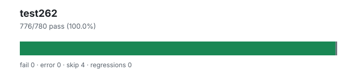

# test262 — `1.4.0+74fd89408`

- Image digest: `2d434594fa0042e854670dd911d9582adf33ae4ed078f322e395755b24e55fee`
- Suite version: `de8e621cdba4f40cff3cf244e6cfb8cb48746b4a`
- Ran: 2026-07-05T19:20:34.285Z → 2026-07-05T19:20:46.095Z

## Summary

**Pass rate: 776/780 (100.00%)**

| pass | fail | error | skip | regressions | new passes |
|---:|---:|---:|---:|---:|---:|
| 776 | 0 | 0 | 4 | 0 | 0 |
