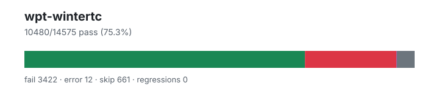

# wpt-wintertc — `1.4.0+e90472917`

- Image digest: `5bd510eb4c72a64e66021a081d9d74aea1bb5fd7ab9b3bbebde6e0ff6b58102b`
- Suite version: `1eb456f600fedad07c8cd6439796fb81db54faff`
- Ran: 2026-07-05T20:40:53.845Z → 2026-07-05T20:41:01.194Z

## Summary

**Pass rate: 10480/14575 (75.32%)**

| pass | fail | error | skip | regressions | new passes |
|---:|---:|---:|---:|---:|---:|
| 10480 | 3422 | 12 | 661 | 0 | 0 |

## Observed cases (13914)

- `encoding/streams/backpressure.any.js :: write() should not complete until read relieves backpressure for TextDecoderStream` — pass
- `encoding/streams/backpressure.any.js :: additional writes should wait for backpressure to be relieved for class TextDecoderStream` — pass
- `encoding/streams/backpressure.any.js :: write() should not complete until read relieves backpressure for TextEncoderStream` — pass
- `encoding/streams/backpressure.any.js :: additional writes should wait for backpressure to be relieved for class TextEncoderStream` — pass
- `encoding/streams/decode-attributes.any.js :: encoding attribute should have correct value for 'unicode-1-1-utf-8'` — pass
- `encoding/streams/decode-attributes.any.js :: encoding attribute should have correct value for 'iso-8859-2'` — pass
- `encoding/streams/decode-attributes.any.js :: encoding attribute should have correct value for 'ascii'` — pass
- `encoding/streams/decode-attributes.any.js :: encoding attribute should have correct value for 'utf-16'` — pass
- `encoding/streams/decode-attributes.any.js :: setting fatal to 'false' should set the attribute to false` — pass
- `encoding/streams/decode-attributes.any.js :: setting ignoreBOM to 'false' should set the attribute to false` — pass
- `encoding/streams/decode-attributes.any.js :: setting fatal to '0' should set the attribute to false` — pass
- `encoding/streams/decode-attributes.any.js :: setting ignoreBOM to '0' should set the attribute to false` — pass
- `encoding/streams/decode-attributes.any.js :: setting fatal to '' should set the attribute to false` — pass
- `encoding/streams/decode-attributes.any.js :: setting ignoreBOM to '' should set the attribute to false` — pass
- `encoding/streams/decode-attributes.any.js :: setting fatal to 'undefined' should set the attribute to false` — pass
- `encoding/streams/decode-attributes.any.js :: setting ignoreBOM to 'undefined' should set the attribute to false` — pass
- `encoding/streams/decode-attributes.any.js :: setting fatal to 'null' should set the attribute to false` — pass
- `encoding/streams/decode-attributes.any.js :: setting ignoreBOM to 'null' should set the attribute to false` — pass
- `encoding/streams/decode-attributes.any.js :: setting fatal to 'true' should set the attribute to true` — pass
- `encoding/streams/decode-attributes.any.js :: setting ignoreBOM to 'true' should set the attribute to true` — pass
- `encoding/streams/decode-attributes.any.js :: setting fatal to '1' should set the attribute to true` — pass
- `encoding/streams/decode-attributes.any.js :: setting ignoreBOM to '1' should set the attribute to true` — pass
- `encoding/streams/decode-attributes.any.js :: setting fatal to '[object Object]' should set the attribute to true` — pass
- `encoding/streams/decode-attributes.any.js :: setting ignoreBOM to '[object Object]' should set the attribute to true` — pass
- `encoding/streams/decode-attributes.any.js :: setting fatal to '' should set the attribute to true` — pass
- `encoding/streams/decode-attributes.any.js :: setting ignoreBOM to '' should set the attribute to true` — pass
- `encoding/streams/decode-attributes.any.js :: setting fatal to 'yes' should set the attribute to true` — pass
- `encoding/streams/decode-attributes.any.js :: setting ignoreBOM to 'yes' should set the attribute to true` — pass
- `encoding/streams/decode-attributes.any.js :: constructing with an invalid encoding should throw` — pass
- `encoding/streams/decode-attributes.any.js :: constructing with a non-stringifiable encoding should throw` — pass
- `encoding/streams/decode-attributes.any.js :: a throwing fatal member should cause the constructor to throw` — pass
- `encoding/streams/decode-attributes.any.js :: a throwing ignoreBOM member should cause the constructor to throw` — pass
- `encoding/api-surrogates-utf8.any.js :: Invalid surrogates encoded into UTF-8: Sanity check` — pass
- `encoding/api-surrogates-utf8.any.js :: Invalid surrogates encoded into UTF-8: Surrogate half (low)` — pass
- `encoding/api-surrogates-utf8.any.js :: Invalid surrogates encoded into UTF-8: Surrogate half (high)` — pass
- `encoding/api-surrogates-utf8.any.js :: Invalid surrogates encoded into UTF-8: Surrogate half (low), in a string` — pass
- `encoding/api-surrogates-utf8.any.js :: Invalid surrogates encoded into UTF-8: Surrogate half (high), in a string` — pass
- `encoding/api-surrogates-utf8.any.js :: Invalid surrogates encoded into UTF-8: Wrong order` — pass
- `encoding/api-basics.any.js :: Default encodings` — pass
- `encoding/api-basics.any.js :: Default inputs` — pass
- `encoding/api-basics.any.js :: Encode/decode round trip: utf-8` — pass
- `encoding/api-basics.any.js :: Decode sample: utf-16le` — pass
- `encoding/api-basics.any.js :: Decode sample: utf-16be` — pass
- `encoding/api-basics.any.js :: Decode sample: utf-16` — pass
- `encoding/api-replacement-encodings.any.js :: Label for "replacement" should be rejected by API: csiso2022kr` — pass
- `encoding/api-replacement-encodings.any.js :: Label for "replacement" should be rejected by API: hz-gb-2312` — pass
- `encoding/api-replacement-encodings.any.js :: Label for "replacement" should be rejected by API: iso-2022-cn` — pass
- `encoding/api-replacement-encodings.any.js :: Label for "replacement" should be rejected by API: iso-2022-cn-ext` — pass
- `encoding/api-replacement-encodings.any.js :: Label for "replacement" should be rejected by API: iso-2022-kr` — pass
- `encoding/api-replacement-encodings.any.js :: Label for "replacement" should be rejected by API: replacement` — pass
- `encoding/replacement-encodings.any.js :: csiso2022kr - non-empty input decodes to one replacement character.` — fail — promise_test: Unhandled rejection with value: object "ReferenceError: XMLHttpRequest is not defined"
- `encoding/replacement-encodings.any.js :: csiso2022kr - empty input decodes to empty output.` — fail — promise_test: Unhandled rejection with value: object "ReferenceError: XMLHttpRequest is not defined"
- `encoding/replacement-encodings.any.js :: hz-gb-2312 - non-empty input decodes to one replacement character.` — fail — promise_test: Unhandled rejection with value: object "ReferenceError: XMLHttpRequest is not defined"
- `encoding/replacement-encodings.any.js :: hz-gb-2312 - empty input decodes to empty output.` — fail — promise_test: Unhandled rejection with value: object "ReferenceError: XMLHttpRequest is not defined"
- `encoding/replacement-encodings.any.js :: iso-2022-cn - non-empty input decodes to one replacement character.` — fail — promise_test: Unhandled rejection with value: object "ReferenceError: XMLHttpRequest is not defined"
- `encoding/replacement-encodings.any.js :: iso-2022-cn - empty input decodes to empty output.` — fail — promise_test: Unhandled rejection with value: object "ReferenceError: XMLHttpRequest is not defined"
- `encoding/replacement-encodings.any.js :: iso-2022-cn-ext - non-empty input decodes to one replacement character.` — fail — promise_test: Unhandled rejection with value: object "ReferenceError: XMLHttpRequest is not defined"
- `encoding/replacement-encodings.any.js :: iso-2022-cn-ext - empty input decodes to empty output.` — fail — promise_test: Unhandled rejection with value: object "ReferenceError: XMLHttpRequest is not defined"
- `encoding/replacement-encodings.any.js :: iso-2022-kr - non-empty input decodes to one replacement character.` — fail — promise_test: Unhandled rejection with value: object "ReferenceError: XMLHttpRequest is not defined"
- `encoding/replacement-encodings.any.js :: iso-2022-kr - empty input decodes to empty output.` — fail — promise_test: Unhandled rejection with value: object "ReferenceError: XMLHttpRequest is not defined"
- `encoding/replacement-encodings.any.js :: replacement - non-empty input decodes to one replacement character.` — fail — promise_test: Unhandled rejection with value: object "ReferenceError: XMLHttpRequest is not defined"
- `encoding/replacement-encodings.any.js :: replacement - empty input decodes to empty output.` — fail — promise_test: Unhandled rejection with value: object "ReferenceError: XMLHttpRequest is not defined"
- `encoding/iso-2022-jp-decoder.any.js :: iso-2022-jp decoder: Error ESC` — fail — assert_equals: expected "\ufffd$" but got "\ufffd"
- `encoding/iso-2022-jp-decoder.any.js :: iso-2022-jp decoder: Error ESC, character` — fail — assert_equals: expected "\ufffd$P" but got "\ufffd"
- `encoding/iso-2022-jp-decoder.any.js :: iso-2022-jp decoder: ASCII ESC, character` — pass
- `encoding/iso-2022-jp-decoder.any.js :: iso-2022-jp decoder: Double ASCII ESC, character` — fail — assert_equals: expected "\ufffdP" but got "P"
- `encoding/iso-2022-jp-decoder.any.js :: iso-2022-jp decoder: character, ASCII ESC, character` — pass
- `encoding/iso-2022-jp-decoder.any.js :: iso-2022-jp decoder: characters` — pass
- `encoding/iso-2022-jp-decoder.any.js :: iso-2022-jp decoder: SO / SI` — fail — assert_equals: expected "\r\ufffd\ufffd\x10" but got "\r\x10"
- `encoding/iso-2022-jp-decoder.any.js :: iso-2022-jp decoder: Roman ESC, characters` — pass
- `encoding/iso-2022-jp-decoder.any.js :: iso-2022-jp decoder: Roman ESC, SO / SI` — fail — assert_equals: expected "\r\ufffd\ufffd\x10" but got "\r\x10"
- `encoding/iso-2022-jp-decoder.any.js :: iso-2022-jp decoder: Roman ESC, error ESC, Katakana ESC` — fail — assert_equals: expected "\ufffdﾐ" but got "\ufffd(IP"
- `encoding/iso-2022-jp-decoder.any.js :: iso-2022-jp decoder: Katakana ESC, character` — pass
- `encoding/iso-2022-jp-decoder.any.js :: iso-2022-jp decoder: Katakana ESC, multibyte ESC, character` — fail — assert_equals: expected "\ufffd佩" but got "佩"
- `encoding/iso-2022-jp-decoder.any.js :: iso-2022-jp decoder: Katakana ESC, error ESC, character` — fail — assert_equals: expected "\ufffdﾐ" but got "\ufffd"
- `encoding/iso-2022-jp-decoder.any.js :: iso-2022-jp decoder: Katakana ESC, error ESC #2, character` — fail — assert_equals: expected "\ufffd､ﾐ" but got "\ufffd"
- `encoding/iso-2022-jp-decoder.any.js :: iso-2022-jp decoder: Katakana ESC, character, Katakana ESC, character` — pass
- `encoding/iso-2022-jp-decoder.any.js :: iso-2022-jp decoder: Katakana ESC, SO / SI` — fail — assert_equals: expected "\ufffd\ufffd\ufffd\ufffd" but got "ｍｐ"
- `encoding/iso-2022-jp-decoder.any.js :: iso-2022-jp decoder: Multibyte ESC, character` — pass
- `encoding/iso-2022-jp-decoder.any.js :: iso-2022-jp decoder: Multibyte ESC #2, character` — pass
- `encoding/iso-2022-jp-decoder.any.js :: iso-2022-jp decoder: Multibyte ESC, error ESC, character` — fail — assert_equals: expected "\ufffd佩" but got "\ufffd\ufffd"
- `encoding/iso-2022-jp-decoder.any.js :: iso-2022-jp decoder: Double multibyte ESC` — fail — assert_equals: expected "\ufffd" but got ""
- `encoding/iso-2022-jp-decoder.any.js :: iso-2022-jp decoder: Double multibyte ESC, character` — fail — assert_equals: expected "\ufffd佩" but got "佩"
- `encoding/iso-2022-jp-decoder.any.js :: iso-2022-jp decoder: Double multibyte ESC #2, character` — fail — assert_equals: expected "\ufffd佩" but got "佩"
- `encoding/iso-2022-jp-decoder.any.js :: iso-2022-jp decoder: Multibyte ESC, error ESC #2, character` — fail — assert_equals: expected "\ufffdば\ufffd" but got "\ufffd\ufffd"
- `encoding/iso-2022-jp-decoder.any.js :: iso-2022-jp decoder: Multibyte ESC, single byte, multibyte ESC, character` — fail — assert_equals: expected "\ufffd佩" but got "\ufffdだ佩"
- `encoding/iso-2022-jp-decoder.any.js :: iso-2022-jp decoder: Multibyte ESC, lead error byte` — fail — assert_equals: expected "\ufffd\ufffd" but got "\ufffd"
- `encoding/iso-2022-jp-decoder.any.js :: iso-2022-jp decoder: Multibyte ESC, trail error byte` — pass
- `encoding/iso-2022-jp-decoder.any.js :: iso-2022-jp decoder: character, error ESC` — pass
- `encoding/iso-2022-jp-decoder.any.js :: iso-2022-jp decoder: character, error ESC #2` — fail — assert_equals: expected "P\ufffd$" but got "P\ufffd"
- `encoding/iso-2022-jp-decoder.any.js :: iso-2022-jp decoder: character, error ESC #3` — fail — assert_equals: expected "P\ufffdP" but got "P\ufffd"
- `encoding/iso-2022-jp-decoder.any.js :: iso-2022-jp decoder: character, ASCII ESC` — pass
- `encoding/iso-2022-jp-decoder.any.js :: iso-2022-jp decoder: character, Roman ESC` — pass
- `encoding/iso-2022-jp-decoder.any.js :: iso-2022-jp decoder: character, Katakana ESC` — pass
- `encoding/iso-2022-jp-decoder.any.js :: iso-2022-jp decoder: character, Multibyte ESC` — pass
- `encoding/iso-2022-jp-decoder.any.js :: iso-2022-jp decoder: character, Multibyte ESC #2` — pass
- `encoding/idlharness.any.js :: idl_test setup` — fail — promise_test: Unhandled rejection with value: object "TypeError: Failed to parse URL: /interfaces/encoding.idl"
- `encoding/single-byte-decoder.window.js :: IBM866: 866 (XMLHttpRequest)` — fail — XMLHttpRequest is not defined
- `encoding/single-byte-decoder.window.js :: IBM866: 866 (TextDecoder)` — pass
- `encoding/single-byte-decoder.window.js :: IBM866: 866 (document.characterSet and document.inputEncoding)` — fail — Cannot read property 'appendChild' of undefined
- `encoding/encodeInto.any.js :: encodeInto() into ArrayBuffer with Hi and destination length 0, offset 0, filler 0` — pass
- `encoding/encodeInto.any.js :: encodeInto() into SharedArrayBuffer with Hi and destination length 0, offset 0, filler 0` — fail — sabConstructor is not a constructor
- `encoding/encodeInto.any.js :: encodeInto() into ArrayBuffer with Hi and destination length 0, offset 4, filler 0` — pass
- `encoding/encodeInto.any.js :: encodeInto() into SharedArrayBuffer with Hi and destination length 0, offset 4, filler 0` — fail — sabConstructor is not a constructor
- `encoding/encodeInto.any.js :: encodeInto() into ArrayBuffer with Hi and destination length 0, offset 0, filler 128` — pass
- `encoding/encodeInto.any.js :: encodeInto() into SharedArrayBuffer with Hi and destination length 0, offset 0, filler 128` — fail — sabConstructor is not a constructor
- `encoding/encodeInto.any.js :: encodeInto() into ArrayBuffer with Hi and destination length 0, offset 4, filler 128` — pass
- `encoding/encodeInto.any.js :: encodeInto() into SharedArrayBuffer with Hi and destination length 0, offset 4, filler 128` — fail — sabConstructor is not a constructor
- `encoding/encodeInto.any.js :: encodeInto() into ArrayBuffer with Hi and destination length 0, offset 0, filler random` — pass
- `encoding/encodeInto.any.js :: encodeInto() into SharedArrayBuffer with Hi and destination length 0, offset 0, filler random` — fail — sabConstructor is not a constructor
- `encoding/encodeInto.any.js :: encodeInto() into ArrayBuffer with Hi and destination length 0, offset 4, filler random` — pass
- `encoding/encodeInto.any.js :: encodeInto() into SharedArrayBuffer with Hi and destination length 0, offset 4, filler random` — fail — sabConstructor is not a constructor
- `encoding/encodeInto.any.js :: encodeInto() into ArrayBuffer with A and destination length 10, offset 0, filler 0` — pass
- `encoding/encodeInto.any.js :: encodeInto() into SharedArrayBuffer with A and destination length 10, offset 0, filler 0` — fail — sabConstructor is not a constructor
- `encoding/encodeInto.any.js :: encodeInto() into ArrayBuffer with A and destination length 10, offset 4, filler 0` — pass
- `encoding/encodeInto.any.js :: encodeInto() into SharedArrayBuffer with A and destination length 10, offset 4, filler 0` — fail — sabConstructor is not a constructor
- `encoding/encodeInto.any.js :: encodeInto() into ArrayBuffer with A and destination length 10, offset 0, filler 128` — pass
- `encoding/encodeInto.any.js :: encodeInto() into SharedArrayBuffer with A and destination length 10, offset 0, filler 128` — fail — sabConstructor is not a constructor
- `encoding/encodeInto.any.js :: encodeInto() into ArrayBuffer with A and destination length 10, offset 4, filler 128` — pass
- `encoding/encodeInto.any.js :: encodeInto() into SharedArrayBuffer with A and destination length 10, offset 4, filler 128` — fail — sabConstructor is not a constructor
- `encoding/encodeInto.any.js :: encodeInto() into ArrayBuffer with A and destination length 10, offset 0, filler random` — pass
- `encoding/encodeInto.any.js :: encodeInto() into SharedArrayBuffer with A and destination length 10, offset 0, filler random` — fail — sabConstructor is not a constructor
- `encoding/encodeInto.any.js :: encodeInto() into ArrayBuffer with A and destination length 10, offset 4, filler random` — pass
- `encoding/encodeInto.any.js :: encodeInto() into SharedArrayBuffer with A and destination length 10, offset 4, filler random` — fail — sabConstructor is not a constructor
- `encoding/encodeInto.any.js :: encodeInto() into ArrayBuffer with 𝌆 and destination length 4, offset 0, filler 0` — pass
- `encoding/encodeInto.any.js :: encodeInto() into SharedArrayBuffer with 𝌆 and destination length 4, offset 0, filler 0` — fail — sabConstructor is not a constructor
- `encoding/encodeInto.any.js :: encodeInto() into ArrayBuffer with 𝌆 and destination length 4, offset 4, filler 0` — pass
- `encoding/encodeInto.any.js :: encodeInto() into SharedArrayBuffer with 𝌆 and destination length 4, offset 4, filler 0` — fail — sabConstructor is not a constructor
- `encoding/encodeInto.any.js :: encodeInto() into ArrayBuffer with 𝌆 and destination length 4, offset 0, filler 128` — pass
- `encoding/encodeInto.any.js :: encodeInto() into SharedArrayBuffer with 𝌆 and destination length 4, offset 0, filler 128` — fail — sabConstructor is not a constructor
- `encoding/encodeInto.any.js :: encodeInto() into ArrayBuffer with 𝌆 and destination length 4, offset 4, filler 128` — pass
- `encoding/encodeInto.any.js :: encodeInto() into SharedArrayBuffer with 𝌆 and destination length 4, offset 4, filler 128` — fail — sabConstructor is not a constructor
- `encoding/encodeInto.any.js :: encodeInto() into ArrayBuffer with 𝌆 and destination length 4, offset 0, filler random` — pass
- `encoding/encodeInto.any.js :: encodeInto() into SharedArrayBuffer with 𝌆 and destination length 4, offset 0, filler random` — fail — sabConstructor is not a constructor
- `encoding/encodeInto.any.js :: encodeInto() into ArrayBuffer with 𝌆 and destination length 4, offset 4, filler random` — pass
- `encoding/encodeInto.any.js :: encodeInto() into SharedArrayBuffer with 𝌆 and destination length 4, offset 4, filler random` — fail — sabConstructor is not a constructor
- `encoding/encodeInto.any.js :: encodeInto() into ArrayBuffer with 𝌆A and destination length 3, offset 0, filler 0` — pass
- `encoding/encodeInto.any.js :: encodeInto() into SharedArrayBuffer with 𝌆A and destination length 3, offset 0, filler 0` — fail — sabConstructor is not a constructor
- `encoding/encodeInto.any.js :: encodeInto() into ArrayBuffer with 𝌆A and destination length 3, offset 4, filler 0` — pass
- `encoding/encodeInto.any.js :: encodeInto() into SharedArrayBuffer with 𝌆A and destination length 3, offset 4, filler 0` — fail — sabConstructor is not a constructor
- `encoding/encodeInto.any.js :: encodeInto() into ArrayBuffer with 𝌆A and destination length 3, offset 0, filler 128` — pass
- `encoding/encodeInto.any.js :: encodeInto() into SharedArrayBuffer with 𝌆A and destination length 3, offset 0, filler 128` — fail — sabConstructor is not a constructor
- `encoding/encodeInto.any.js :: encodeInto() into ArrayBuffer with 𝌆A and destination length 3, offset 4, filler 128` — pass
- `encoding/encodeInto.any.js :: encodeInto() into SharedArrayBuffer with 𝌆A and destination length 3, offset 4, filler 128` — fail — sabConstructor is not a constructor
- `encoding/encodeInto.any.js :: encodeInto() into ArrayBuffer with 𝌆A and destination length 3, offset 0, filler random` — pass
- `encoding/encodeInto.any.js :: encodeInto() into SharedArrayBuffer with 𝌆A and destination length 3, offset 0, filler random` — fail — sabConstructor is not a constructor
- `encoding/encodeInto.any.js :: encodeInto() into ArrayBuffer with 𝌆A and destination length 3, offset 4, filler random` — pass
- `encoding/encodeInto.any.js :: encodeInto() into SharedArrayBuffer with 𝌆A and destination length 3, offset 4, filler random` — fail — sabConstructor is not a constructor
- `encoding/encodeInto.any.js :: encodeInto() into ArrayBuffer with U+d834AU+df06A¥Hi and destination length 10, offset 0, filler 0` — pass
- `encoding/encodeInto.any.js :: encodeInto() into SharedArrayBuffer with U+d834AU+df06A¥Hi and destination length 10, offset 0, filler 0` — fail — sabConstructor is not a constructor
- `encoding/encodeInto.any.js :: encodeInto() into ArrayBuffer with U+d834AU+df06A¥Hi and destination length 10, offset 4, filler 0` — pass
- `encoding/encodeInto.any.js :: encodeInto() into SharedArrayBuffer with U+d834AU+df06A¥Hi and destination length 10, offset 4, filler 0` — fail — sabConstructor is not a constructor
- `encoding/encodeInto.any.js :: encodeInto() into ArrayBuffer with U+d834AU+df06A¥Hi and destination length 10, offset 0, filler 128` — pass
- `encoding/encodeInto.any.js :: encodeInto() into SharedArrayBuffer with U+d834AU+df06A¥Hi and destination length 10, offset 0, filler 128` — fail — sabConstructor is not a constructor
- `encoding/encodeInto.any.js :: encodeInto() into ArrayBuffer with U+d834AU+df06A¥Hi and destination length 10, offset 4, filler 128` — pass
- `encoding/encodeInto.any.js :: encodeInto() into SharedArrayBuffer with U+d834AU+df06A¥Hi and destination length 10, offset 4, filler 128` — fail — sabConstructor is not a constructor
- `encoding/encodeInto.any.js :: encodeInto() into ArrayBuffer with U+d834AU+df06A¥Hi and destination length 10, offset 0, filler random` — pass
- `encoding/encodeInto.any.js :: encodeInto() into SharedArrayBuffer with U+d834AU+df06A¥Hi and destination length 10, offset 0, filler random` — fail — sabConstructor is not a constructor
- `encoding/encodeInto.any.js :: encodeInto() into ArrayBuffer with U+d834AU+df06A¥Hi and destination length 10, offset 4, filler random` — pass
- `encoding/encodeInto.any.js :: encodeInto() into SharedArrayBuffer with U+d834AU+df06A¥Hi and destination length 10, offset 4, filler random` — fail — sabConstructor is not a constructor
- `encoding/encodeInto.any.js :: encodeInto() into ArrayBuffer with AU+df06 and destination length 4, offset 0, filler 0` — pass
- `encoding/encodeInto.any.js :: encodeInto() into SharedArrayBuffer with AU+df06 and destination length 4, offset 0, filler 0` — fail — sabConstructor is not a constructor
- `encoding/encodeInto.any.js :: encodeInto() into ArrayBuffer with AU+df06 and destination length 4, offset 4, filler 0` — pass
- `encoding/encodeInto.any.js :: encodeInto() into SharedArrayBuffer with AU+df06 and destination length 4, offset 4, filler 0` — fail — sabConstructor is not a constructor
- `encoding/encodeInto.any.js :: encodeInto() into ArrayBuffer with AU+df06 and destination length 4, offset 0, filler 128` — pass
- `encoding/encodeInto.any.js :: encodeInto() into SharedArrayBuffer with AU+df06 and destination length 4, offset 0, filler 128` — fail — sabConstructor is not a constructor
- `encoding/encodeInto.any.js :: encodeInto() into ArrayBuffer with AU+df06 and destination length 4, offset 4, filler 128` — pass
- `encoding/encodeInto.any.js :: encodeInto() into SharedArrayBuffer with AU+df06 and destination length 4, offset 4, filler 128` — fail — sabConstructor is not a constructor
- `encoding/encodeInto.any.js :: encodeInto() into ArrayBuffer with AU+df06 and destination length 4, offset 0, filler random` — pass
- `encoding/encodeInto.any.js :: encodeInto() into SharedArrayBuffer with AU+df06 and destination length 4, offset 0, filler random` — fail — sabConstructor is not a constructor
- `encoding/encodeInto.any.js :: encodeInto() into ArrayBuffer with AU+df06 and destination length 4, offset 4, filler random` — pass
- `encoding/encodeInto.any.js :: encodeInto() into SharedArrayBuffer with AU+df06 and destination length 4, offset 4, filler random` — fail — sabConstructor is not a constructor
- `encoding/encodeInto.any.js :: encodeInto() into ArrayBuffer with ¥¥ and destination length 4, offset 0, filler 0` — pass
- `encoding/encodeInto.any.js :: encodeInto() into SharedArrayBuffer with ¥¥ and destination length 4, offset 0, filler 0` — fail — sabConstructor is not a constructor
- `encoding/encodeInto.any.js :: encodeInto() into ArrayBuffer with ¥¥ and destination length 4, offset 4, filler 0` — pass
- `encoding/encodeInto.any.js :: encodeInto() into SharedArrayBuffer with ¥¥ and destination length 4, offset 4, filler 0` — fail — sabConstructor is not a constructor
- `encoding/encodeInto.any.js :: encodeInto() into ArrayBuffer with ¥¥ and destination length 4, offset 0, filler 128` — pass
- `encoding/encodeInto.any.js :: encodeInto() into SharedArrayBuffer with ¥¥ and destination length 4, offset 0, filler 128` — fail — sabConstructor is not a constructor
- `encoding/encodeInto.any.js :: encodeInto() into ArrayBuffer with ¥¥ and destination length 4, offset 4, filler 128` — pass
- `encoding/encodeInto.any.js :: encodeInto() into SharedArrayBuffer with ¥¥ and destination length 4, offset 4, filler 128` — fail — sabConstructor is not a constructor
- `encoding/encodeInto.any.js :: encodeInto() into ArrayBuffer with ¥¥ and destination length 4, offset 0, filler random` — pass
- `encoding/encodeInto.any.js :: encodeInto() into SharedArrayBuffer with ¥¥ and destination length 4, offset 0, filler random` — fail — sabConstructor is not a constructor
- `encoding/encodeInto.any.js :: encodeInto() into ArrayBuffer with ¥¥ and destination length 4, offset 4, filler random` — pass
- `encoding/encodeInto.any.js :: encodeInto() into SharedArrayBuffer with ¥¥ and destination length 4, offset 4, filler random` — fail — sabConstructor is not a constructor
- `encoding/encodeInto.any.js :: Invalid encodeInto() destination: DataView, backed by: ArrayBuffer` — pass
- `encoding/encodeInto.any.js :: Invalid encodeInto() destination: DataView, backed by: SharedArrayBuffer` — fail — sabConstructor is not a constructor
- `encoding/encodeInto.any.js :: Invalid encodeInto() destination: Int8Array, backed by: ArrayBuffer` — fail — assert_throws_js: function "() => new TextEncoder().encodeInto("", viewInstance)" did not throw
- `encoding/encodeInto.any.js :: Invalid encodeInto() destination: Int8Array, backed by: SharedArrayBuffer` — fail — sabConstructor is not a constructor
- `encoding/encodeInto.any.js :: Invalid encodeInto() destination: Int16Array, backed by: ArrayBuffer` — fail — assert_throws_js: function "() => new TextEncoder().encodeInto("", viewInstance)" did not throw
- `encoding/encodeInto.any.js :: Invalid encodeInto() destination: Int16Array, backed by: SharedArrayBuffer` — fail — sabConstructor is not a constructor
- `encoding/encodeInto.any.js :: Invalid encodeInto() destination: Int32Array, backed by: ArrayBuffer` — fail — assert_throws_js: function "() => new TextEncoder().encodeInto("", viewInstance)" did not throw
- `encoding/encodeInto.any.js :: Invalid encodeInto() destination: Int32Array, backed by: SharedArrayBuffer` — fail — sabConstructor is not a constructor
- `encoding/encodeInto.any.js :: Invalid encodeInto() destination: Uint16Array, backed by: ArrayBuffer` — fail — assert_throws_js: function "() => new TextEncoder().encodeInto("", viewInstance)" did not throw
- `encoding/encodeInto.any.js :: Invalid encodeInto() destination: Uint16Array, backed by: SharedArrayBuffer` — fail — sabConstructor is not a constructor
- `encoding/encodeInto.any.js :: Invalid encodeInto() destination: Uint32Array, backed by: ArrayBuffer` — fail — assert_throws_js: function "() => new TextEncoder().encodeInto("", viewInstance)" did not throw
- `encoding/encodeInto.any.js :: Invalid encodeInto() destination: Uint32Array, backed by: SharedArrayBuffer` — fail — sabConstructor is not a constructor
- `encoding/encodeInto.any.js :: Invalid encodeInto() destination: Uint8ClampedArray, backed by: ArrayBuffer` — fail — assert_throws_js: function "() => new TextEncoder().encodeInto("", viewInstance)" did not throw
- `encoding/encodeInto.any.js :: Invalid encodeInto() destination: Uint8ClampedArray, backed by: SharedArrayBuffer` — fail — sabConstructor is not a constructor
- `encoding/encodeInto.any.js :: Invalid encodeInto() destination: BigInt64Array, backed by: ArrayBuffer` — fail — assert_throws_js: function "() => new TextEncoder().encodeInto("", viewInstance)" did not throw
- `encoding/encodeInto.any.js :: Invalid encodeInto() destination: BigInt64Array, backed by: SharedArrayBuffer` — fail — sabConstructor is not a constructor
- …and 13714 more
