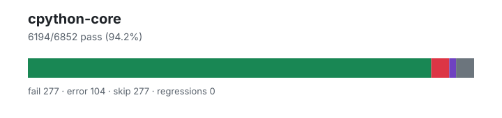

# cpython-core — `1.4.0+eaef25c61`

- Image digest: `ecf9c74d8466eed7610ab2b839d0753c598b34526899a95f188c86a1db4118cd`
- Suite version: `7c999be49dee7f12703e4b2e07e990544fabd40e`
- Ran: 2026-07-03T16:07:09.250Z → 2026-07-03T16:09:46.910Z

## Summary

**Pass rate: 6194/6852 (94.21%)**

| pass | fail | error | skip | regressions | new passes |
|---:|---:|---:|---:|---:|---:|
| 6194 | 277 | 104 | 277 | 0 | 0 |

## Observed cases (6575)

- `test_class.ClassTests.testBadTypeReturned` — pass
- `test_class.ClassTests.testBinaryOps` — pass
- `test_class.ClassTests.testClassWithExtCall` — pass
- `test_class.ClassTests.testConstructorErrorMessages` — pass
- `test_slice.SliceTest.test_cmp` — pass
- `test_slice.SliceTest.test_constructor` — pass
- `test_slice.SliceTest.test_copy` — pass
- `test_class.ClassTests.testDel` — fail — Traceback (most recent call last):
  File "/work/suites/cpython/Lib/test/test_class.py", line 472, in testDel
    self.assertEqual(["crab people, crab people"], x)
AssertionError: Lists differ: ['crab people, crab people'] != []

First list contains 1 additional elements.
First extra element 0:
'crab people, crab people'

- ['crab people, crab people']
+ []

- `test_class.ClassTests.testForExceptionsRaisedInInstanceGetattr2` — pass
- `test_class.ClassTests.testGetSetAndDel` — pass
- `test_class.ClassTests.testHasAttrString` — pass
- `test_class.ClassTests.testHashComparisonOfMethods` — pass
- `test_tuple.TupleTest.test_addmul` — pass
- `test_tuple.TupleTest.test_bigrepeat` — pass
- `test_tuple.TupleTest.test_constructors` — pass
- `test_tuple.TupleTest.test_contains` — pass
- `test_tuple.TupleTest.test_contains_fake` — pass
- `test_tuple.TupleTest.test_contains_order` — pass
- `test_tuple.TupleTest.test_count` — pass
- `test_list.ListTest.test_addmul` — pass
- `test_list.ListTest.test_append` — pass
- `test_class.ClassTests.testHashStuff` — pass
- `test_class.ClassTests.testInit` — pass
- `test_class.ClassTests.testListAndDictOps` — pass
- `test_class.ClassTests.testMisc` — pass
- `test_class.ClassTests.testObjectAttributeAccessErrorMessages` — fail — AttributeError: A has no attribute 'x'

During handling of the above exception, another exception occurred:

Traceback (most recent call last):
  File "/work/suites/cpython/Lib/test/test_class.py", line 698, in testObjectAttributeAccessErrorMessages
    with self.assertRaisesRegex(AttributeError, error_msg):
         ^^^^^^^^^^^^^^^^^^^^^^^^^^^^^^^^^^^^^^^^^^^^^^^^^
AssertionError: "'A' object has no attribute 'x'" does not match "A has no attribute 'x'"

- `test_class.ClassTests.testPredefinedAttrs` — pass
- `test_class.ClassTests.testSFBug532646` — pass
- `test_class.ClassTests.testSetattrNonStringName` — pass
- `test_class.ClassTests.testSetattrWrapperNameIntern` — pass
- `test_class.ClassTests.testTypeAttributeAccessErrorMessages` — fail — AttributeError: type has no attribute 'x'

During handling of the above exception, another exception occurred:

Traceback (most recent call last):
  File "/work/suites/cpython/Lib/test/test_class.py", line 685, in testTypeAttributeAccessErrorMessages
    with self.assertRaisesRegex(AttributeError, error_msg):
         ^^^^^^^^^^^^^^^^^^^^^^^^^^^^^^^^^^^^^^^^^^^^^^^^^
AssertionError: "type object 'A' has no attribute 'x'" does not match "type has no attribute 'x'"

- `test_class.ClassTests.testUnaryOps` — pass
- `test_range.RangeTest.test_attributes` — pass
- `test_range.RangeTest.test_comparison` — pass
- `test_range.RangeTest.test_contains` — pass
- `test_range.RangeTest.test_count` — pass
- `test_range.RangeTest.test_empty` — pass
- `test_bool.BoolTest.test_blocked` — pass
- `test_bool.BoolTest.test_bool_called_at_least_once` — pass
- `test_bool.BoolTest.test_bool_new` — pass
- `test_bool.BoolTest.test_boolean` — pass
- `test_bool.BoolTest.test_callable` — pass
- `test_bool.BoolTest.test_complex` — pass
- `test_bool.BoolTest.test_contains` — pass
- `test_bool.BoolTest.test_convert` — pass
- `test_bool.BoolTest.test_convert_to_bool` — pass
- `test_bool.BoolTest.test_fileclosed` — pass
- `test_bool.BoolTest.test_float` — pass
- `test_bool.BoolTest.test_format` — pass
- `test_bool.BoolTest.test_from_bytes` — pass
- `test_bool.BoolTest.test_hasattr` — pass
- `test_bool.BoolTest.test_int` — pass
- `test_bool.BoolTest.test_interpreter_convert_to_bool_raises` — pass
- `test_bool.BoolTest.test_isinstance` — pass
- `test_bool.BoolTest.test_issubclass` — pass
- `test_range.RangeTest.test_exhausted_iterator_pickling` — pass
- `test_range.RangeTest.test_index` — pass
- `test_bool.BoolTest.test_keyword_args` — pass
- `test_bool.BoolTest.test_marshal` — pass
- `test_range.RangeTest.test_invalid_invocation` — pass
- `test_bool.BoolTest.test_math` — pass
- `test_bool.BoolTest.test_operator` — pass
- `test_bool.BoolTest.test_pickle` — pass
- `test_bool.BoolTest.test_picklevalues` — pass
- `test_bool.BoolTest.test_real_and_imag` — pass
- `test_bool.BoolTest.test_repr` — pass
- `test_bool.BoolTest.test_sane_len` — pass
- `test_bool.BoolTest.test_str` — pass
- `test_bool.BoolTest.test_string` — pass
- `test_bool.BoolTest.test_subclass` — pass
- `test_bool.BoolTest.test_types` — pass
- `test_range.RangeTest.test_issue11845` — pass
- `test_range.RangeTest.test_iterator_pickling` — pass
- `test_range.RangeTest.test_iterator_pickling_overflowing_index` — pass
- `test_range.RangeTest.test_iterator_setstate` — pass
- `test_range.RangeTest.test_iterator_unpickle_compat` — pass
- `test_range.RangeTest.test_large_exhausted_iterator_pickling` — pass
- `test_range.RangeTest.test_large_operands` — pass
- `test_range.RangeTest.test_large_range` — pass
- `test_range.RangeTest.test_odd_bug` — pass
- `test_range.RangeTest.test_pickling` — pass
- `test_range.RangeTest.test_range` — pass
- `test_range.RangeTest.test_range_constructor_error_messages` — fail — TypeError: range() missing 1 required positional argument: 'a'

During handling of the above exception, another exception occurred:

Traceback (most recent call last):
  File "/work/suites/cpython/Lib/test/test_range.py", line 95, in test_range_constructor_error_messages
    with self.assertRaisesRegex(
         ^^^^^^^^^^^^^^^^^^^^^^^
AssertionError: "range expected at least 1 argument, got 0" does not match "range() missing 1 required positional argument: 'a'"

- `test_slice.SliceTest.test_cycle` — pass
- `test_slice.SliceTest.test_deepcopy` — pass
- `test_slice.SliceTest.test_hash` — pass
- `test_dict.DictTest.test_bad_key` — pass
- `test_dict.DictTest.test_bool` — pass
- `test_dict.DictTest.test_clear` — pass
- `test_dict.DictTest.test_constructor` — pass
- `test_set.TestBasicOpsBytes.test_copy` — pass
- `test_set.TestBasicOpsBytes.test_empty_difference` — pass
- `test_set.TestBasicOpsBytes.test_empty_difference_rev` — pass
- `test_set.TestBasicOpsBytes.test_empty_intersection` — pass
- `test_set.TestBasicOpsBytes.test_empty_isdisjoint` — pass
- `test_set.TestBasicOpsBytes.test_empty_symmetric_difference` — pass
- `test_set.TestBasicOpsBytes.test_empty_union` — pass
- `test_set.TestBasicOpsBytes.test_equivalent_equality` — pass
- `test_set.TestBasicOpsBytes.test_intersection_empty` — pass
- `test_set.TestBasicOpsBytes.test_isdisjoint_empty` — pass
- `test_set.TestBasicOpsBytes.test_issue_37219` — pass
- `test_set.TestBasicOpsBytes.test_iteration` — pass
- `test_set.TestBasicOpsBytes.test_length` — pass
- `test_set.TestBasicOpsBytes.test_pickling` — pass
- `test_set.TestBasicOpsBytes.test_repr` — pass
- `test_set.TestBasicOpsBytes.test_self_difference` — pass
- `test_set.TestBasicOpsBytes.test_self_equality` — pass
- `test_set.TestBasicOpsBytes.test_self_intersection` — pass
- `test_set.TestBasicOpsBytes.test_self_isdisjoint` — pass
- `test_set.TestBasicOpsBytes.test_self_symmetric_difference` — pass
- `test_set.TestBasicOpsBytes.test_self_union` — pass
- `test_set.TestBasicOpsBytes.test_union_empty` — pass
- `test_set.TestBasicOpsEmpty.test_copy` — pass
- `test_set.TestBasicOpsEmpty.test_empty_difference` — pass
- `test_set.TestBasicOpsEmpty.test_empty_difference_rev` — pass
- `test_set.TestBasicOpsEmpty.test_empty_intersection` — pass
- `test_set.TestBasicOpsEmpty.test_empty_isdisjoint` — pass
- `test_set.TestBasicOpsEmpty.test_empty_symmetric_difference` — pass
- `test_set.TestBasicOpsEmpty.test_empty_union` — pass
- `test_set.TestBasicOpsEmpty.test_equivalent_equality` — pass
- `test_set.TestBasicOpsEmpty.test_intersection_empty` — pass
- `test_set.TestBasicOpsEmpty.test_isdisjoint_empty` — pass
- `test_set.TestBasicOpsEmpty.test_issue_37219` — pass
- `test_set.TestBasicOpsEmpty.test_iteration` — pass
- `test_set.TestBasicOpsEmpty.test_length` — pass
- `test_set.TestBasicOpsEmpty.test_pickling` — pass
- `test_set.TestBasicOpsEmpty.test_repr` — pass
- `test_set.TestBasicOpsEmpty.test_self_difference` — pass
- `test_set.TestBasicOpsEmpty.test_self_equality` — pass
- `test_set.TestBasicOpsEmpty.test_self_intersection` — pass
- `test_set.TestBasicOpsEmpty.test_self_isdisjoint` — pass
- `test_set.TestBasicOpsEmpty.test_self_symmetric_difference` — pass
- `test_set.TestBasicOpsEmpty.test_self_union` — pass
- `test_set.TestBasicOpsEmpty.test_union_empty` — pass
- `test_set.TestBasicOpsMixedStringBytes.test_copy` — pass
- `test_set.TestBasicOpsMixedStringBytes.test_empty_difference` — pass
- `test_set.TestBasicOpsMixedStringBytes.test_empty_difference_rev` — pass
- `test_set.TestBasicOpsMixedStringBytes.test_empty_intersection` — pass
- `test_set.TestBasicOpsMixedStringBytes.test_empty_isdisjoint` — pass
- `test_set.TestBasicOpsMixedStringBytes.test_empty_symmetric_difference` — pass
- `test_set.TestBasicOpsMixedStringBytes.test_empty_union` — pass
- `test_set.TestBasicOpsMixedStringBytes.test_equivalent_equality` — pass
- `test_set.TestBasicOpsMixedStringBytes.test_intersection_empty` — pass
- `test_set.TestBasicOpsMixedStringBytes.test_isdisjoint_empty` — pass
- `test_set.TestBasicOpsMixedStringBytes.test_issue_37219` — pass
- `test_set.TestBasicOpsMixedStringBytes.test_iteration` — pass
- `test_set.TestBasicOpsMixedStringBytes.test_length` — pass
- `test_set.TestBasicOpsMixedStringBytes.test_pickling` — pass
- `test_set.TestBasicOpsMixedStringBytes.test_repr` — pass
- `test_set.TestBasicOpsMixedStringBytes.test_self_difference` — pass
- `test_set.TestBasicOpsMixedStringBytes.test_self_equality` — pass
- `test_set.TestBasicOpsMixedStringBytes.test_self_intersection` — pass
- `test_set.TestBasicOpsMixedStringBytes.test_self_isdisjoint` — pass
- `test_set.TestBasicOpsMixedStringBytes.test_self_symmetric_difference` — pass
- `test_set.TestBasicOpsMixedStringBytes.test_self_union` — pass
- `test_set.TestBasicOpsMixedStringBytes.test_union_empty` — pass
- `test_set.TestBasicOpsSingleton.test_copy` — pass
- `test_set.TestBasicOpsSingleton.test_empty_difference` — pass
- `test_set.TestBasicOpsSingleton.test_empty_difference_rev` — pass
- `test_set.TestBasicOpsSingleton.test_empty_intersection` — pass
- `test_set.TestBasicOpsSingleton.test_empty_isdisjoint` — pass
- `test_set.TestBasicOpsSingleton.test_empty_symmetric_difference` — pass
- `test_set.TestBasicOpsSingleton.test_empty_union` — pass
- `test_set.TestBasicOpsSingleton.test_equivalent_equality` — pass
- `test_set.TestBasicOpsSingleton.test_in` — pass
- `test_set.TestBasicOpsSingleton.test_intersection_empty` — pass
- `test_set.TestBasicOpsSingleton.test_isdisjoint_empty` — pass
- `test_set.TestBasicOpsSingleton.test_issue_37219` — pass
- `test_set.TestBasicOpsSingleton.test_iteration` — pass
- `test_set.TestBasicOpsSingleton.test_length` — pass
- `test_set.TestBasicOpsSingleton.test_not_in` — pass
- `test_set.TestBasicOpsSingleton.test_pickling` — pass
- `test_set.TestBasicOpsSingleton.test_repr` — pass
- `test_set.TestBasicOpsSingleton.test_self_difference` — pass
- `test_set.TestBasicOpsSingleton.test_self_equality` — pass
- `test_set.TestBasicOpsSingleton.test_self_intersection` — pass
- `test_set.TestBasicOpsSingleton.test_self_isdisjoint` — pass
- `test_set.TestBasicOpsSingleton.test_self_symmetric_difference` — pass
- `test_set.TestBasicOpsSingleton.test_self_union` — pass
- `test_set.TestBasicOpsSingleton.test_union_empty` — pass
- `test_set.TestBasicOpsString.test_copy` — pass
- `test_set.TestBasicOpsString.test_empty_difference` — pass
- `test_set.TestBasicOpsString.test_empty_difference_rev` — pass
- `test_set.TestBasicOpsString.test_empty_intersection` — pass
- `test_set.TestBasicOpsString.test_empty_isdisjoint` — pass
- `test_set.TestBasicOpsString.test_empty_symmetric_difference` — pass
- `test_set.TestBasicOpsString.test_empty_union` — pass
- `test_set.TestBasicOpsString.test_equivalent_equality` — pass
- `test_set.TestBasicOpsString.test_intersection_empty` — pass
- `test_set.TestBasicOpsString.test_isdisjoint_empty` — pass
- `test_set.TestBasicOpsString.test_issue_37219` — pass
- `test_set.TestBasicOpsString.test_iteration` — pass
- `test_set.TestBasicOpsString.test_length` — pass
- `test_set.TestBasicOpsString.test_pickling` — pass
- `test_set.TestBasicOpsString.test_repr` — pass
- `test_set.TestBasicOpsString.test_self_difference` — pass
- `test_set.TestBasicOpsString.test_self_equality` — pass
- `test_set.TestBasicOpsString.test_self_intersection` — pass
- `test_set.TestBasicOpsString.test_self_isdisjoint` — pass
- `test_set.TestBasicOpsString.test_self_symmetric_difference` — pass
- …and 6375 more
