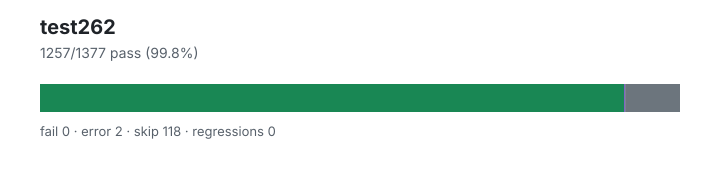

# test262 — `1.4.0+eaef25c61`

- Image digest: `ecf9c74d8466eed7610ab2b839d0753c598b34526899a95f188c86a1db4118cd`
- Suite version: `de8e621cdba4f40cff3cf244e6cfb8cb48746b4a`
- Ran: 2026-07-03T17:00:48.082Z → 2026-07-03T17:00:54.733Z

## Summary

**Pass rate: 1257/1377 (99.84%)**

| pass | fail | error | skip | regressions | new passes |
|---:|---:|---:|---:|---:|---:|
| 1257 | 0 | 2 | 118 | 0 | 0 |
