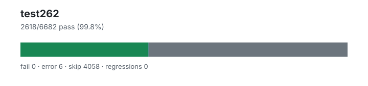

# test262 — `1.4.0+edea5ebd9`

- Image digest: `d0a092aa83f7f1588c9e5053a564166d8fed8a3e389e30c30b25b593ddbdad14`
- Suite version: `de8e621cdba4f40cff3cf244e6cfb8cb48746b4a`
- Ran: 2026-07-05T18:19:59.907Z → 2026-07-05T18:21:14.923Z

## Summary

**Pass rate: 2618/6682 (99.77%)**

| pass | fail | error | skip | regressions | new passes |
|---:|---:|---:|---:|---:|---:|
| 2618 | 0 | 6 | 4058 | 0 | 0 |
