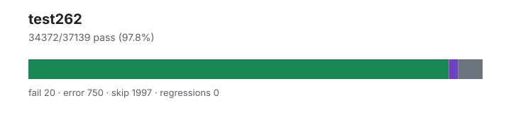

# test262 — `1.4.0+f3e1d901f`

- Image digest: `cdd2b244210c8564aafd50f0fa5ad500f5d39eaefed14ede264e15dffe4bdb10`
- Suite version: `de8e621cdba4f40cff3cf244e6cfb8cb48746b4a`
- Ran: 2026-07-03T04:27:15.477Z → 2026-07-03T04:33:53.156Z

## Summary

**Pass rate: 34372/37139 (97.81%)**

| pass | fail | error | skip | regressions | new passes |
|---:|---:|---:|---:|---:|---:|
| 34372 | 20 | 750 | 1997 | 0 | 0 |
