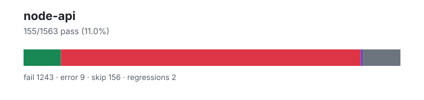

# node-api — `1.4.0+f97795e57`

- Image digest: `12389379467df266df1f7856e6f954b7189b1537fe06e82aebbd4fd0cbc42208`
- Suite version: `ed33ae74ad100a38df41edf56f6935c78821e779`
- Ran: 2026-07-02T22:20:41.566Z → 2026-07-02T22:22:39.536Z

## Summary

**Pass rate: 155/1563 (11.02%)**

| pass | fail | error | skip | regressions | new passes |
|---:|---:|---:|---:|---:|---:|
| 155 | 1243 | 9 | 156 | 2 | 112 |

## Observed cases (1407)

- `test/parallel/test-assert-first-line.js` — fail — TAP version 13
# Subtest: Verify that asserting in the very first line produces the expected result
not ok 1 - Verify that asserting in the very first line produces the expected result
  ---
  duration_ms: 1
  failureType: 'testCodeFailure'
  error: "Got unwanted exception: {actual: '', expected: true, operator: '=='}"
  code: 'ERR_ASSERTION'
  ...
1..1
# tests 1
# suites 0
# pass 0
# fail 1
# cancelled 0
# skipped 0
# todo 0
# duration_ms 2
- `test/parallel/test-assert-fail.js` — fail — TAP version 13
# Subtest: No args
not ok 1 - No args
  ---
  duration_ms: 1
  failureType: 'testCodeFailure'
  error: "Got unwanted exception: {actual: undefined, expected: undefined, operator: 'fail'}"
  code: 'ERR_ASSERTION'
  ...
# Subtest: One arg = message
not ok 2 - One arg = message
  ---
  duration_ms: 0
  failureType: 'testCodeFailure'
  error: "Got unwanted exception: {actual: undefined, expected: undefined, operator: 'fail'}"
  code: 'ERR_ASSERTION'
  ...
# Subtest: One arg = Error
not ok 3 - One arg = Error
  ---
  duration_ms: 0
  failureType: 'testCodeFailure'
  error: "Got unwanted exception: {actual: undefined, expected: undefined, operator: 'fail'}"
  code: 'ERR_ASSERTION'
  ...
# Subtest: Object prototype get
ok 4 - Object prototype get
1..4
# tests 4
# suites 0
# pass 1
# fail 3
# cancelled 0
# skipped 0
# todo 0
# duration_ms 2
- `test/parallel/test-assert-deep-with-error.js` — fail — TAP version 13
# Subtest: Handle error causes
not ok 1 - Handle error causes
  ---
  duration_ms: 1
  failureType: 'testCodeFailure'
  error: "Missing expected exception"
  code: 'ERR_ASSERTION'
  ...
# Subtest: Handle undefined causes
not ok 2 - Handle undefined causes
  ---
  duration_ms: 0
  failureType: 'testCodeFailure'
  error: "{} notDeepStrictEqual {}"
  code: 'ERR_ASSERTION'
  ...
1..2
# tests 2
# suites 0
# pass 0
# fail 2
# cancelled 0
# skipped 0
# todo 0
# duration_ms 2
- `test/parallel/test-assert-class-destructuring.js` — fail — TAP version 13
# Subtest: Assert class destructuring behavior - diff option
not ok 1 - Assert class destructuring behavior - diff option
  ---
  duration_ms: 1
  failureType: 'testCodeFailure'
  error: "Assert is not a constructor"
  code: 'ERR_TEST_FAILURE'
  ...
# Subtest: Assert class destructuring behavior - strict option
not ok 2 - Assert class destructuring behavior - strict option
  ---
  duration_ms: 0
  failureType: 'testCodeFailure'
  error: "Assert is not a constructor"
  code: 'ERR_TEST_FAILURE'
  ...
# Subtest: Assert class destructuring behavior - comprehensive methods
not ok 3 - Assert class destructuring behavior - comprehensive methods
  ---
  duration_ms: 1
  failureType: 'testCodeFailure'
  error: "Assert is not a constructor"
  code: 'ERR_TEST_FAILURE'
  ...
1..3
# tests 3
# suites 0
# pass 0
# fail 3
# cancelled 0
# skipped 0
# todo 0
# duration_ms 2
- `test/parallel/test-assert-if-error.js` — fail — TAP version 13
# Subtest: Test that assert.ifError has the correct stack trace of both stacks
not ok 1 - Test that assert.ifError has the correct stack trace of both stacks
  ---
  duration_ms: 1
  failureType: 'testCodeFailure'
  error: "'ifError got unwanted exception: {}' === 'ifError got unwanted exception: test error'"
  code: 'ERR_ASSERTION'
  ...
# Subtest: General ifError tests
not ok 2 - General ifError tests
  ---
  duration_ms: 1
  failureType: 'testCodeFailure'
  error: "Got unwanted exception: {actual: {}, expected: undefined, operator: 'ifError'}"
  code: 'ERR_ASSERTION'
  ...
# Subtest: Should not throw
ok 3 - Should not throw
# Subtest: https://github.com/nodejs/node-v0.x-archive/issues/2893
not ok 4 - https://github.com/nodejs/node-v0.x-archive/issues/2893
  ---
  duration_ms: 0
  failureType: 'testCodeFailure'
  error: "'Missing expected exception' === 'Missing expected exception.'"
  code: 'ERR_ASSERTION'
  ...
1..4
# tests 4
# suites 0
# pass 1
# fail 3
# cancelled 0
# skipped 0
# todo 0
# duration_ms 3
- `test/parallel/test-assert-class.js` — fail — TAP version 13
# Subtest: Assert constructor requires new
not ok 1 - Assert constructor requires new
  ---
  duration_ms: 1
  failureType: 'testCodeFailure'
  error: "Got unwanted exception: {}"
  code: 'ERR_ASSERTION'
  ...
# Subtest: Assert class non strict
not ok 2 - Assert class non strict
  ---
  duration_ms: 0
  failureType: 'testCodeFailure'
  error: "Assert is not a constructor"
  code: 'ERR_TEST_FAILURE'
  ...
# Subtest: Assert class strict
not ok 3 - Assert class strict
  ---
  duration_ms: 0
  failureType: 'testCodeFailure'
  error: "Assert is not a constructor"
  code: 'ERR_TEST_FAILURE'
  ...
# Subtest: Assert class with invalid diff option
not ok 4 - Assert class with invalid diff option
  ---
  duration_ms: 1
  failureType: 'testCodeFailure'
  error: "Got unwanted exception: {}"
  code: 'ERR_ASSERTION'
  ...
# Subtest: Assert class non strict with full diff
not ok 5 - Assert class non strict with full diff
  ---
  duration_ms: 0
  failureType: 'testCodeFailure'
  error: "Assert is not a constructor"
  code: 'ERR_TEST_FAILURE'
  ...
# Subtest: Assert class non strict with simple diff
not ok 6 - Assert class non strict with simple diff
  ---
  duration_ms: 0
  failureType: 'testCodeFailure'
  error: "Assert is not a constructor"
  code: 'ERR_TEST_FAILURE'
  ...
# Subtest: Assert class strict with skipPrototype
not ok 7 - Assert class strict with skipPrototype
  ---
  duration_ms: 0
  failureType: 'testCodeFailure'
  error: "Assert is not a constructor"
  code: 'ERR_TEST_FAILURE'
  ...
# Subtest: Assert class non strict with skipPrototype
not ok 8 - Assert class non strict with skipPrototype
  ---
  duration_ms: 0
  failureType: 'testCodeFailure'
  error: "Assert is not a constructor"
  code: 'ERR_TEST_FAILURE'
  ...
# Subtest: Assert class skipPrototype with complex objects
not ok 9 - Assert class skipPrototype with complex objects
  ---
  duration_ms: 0
  failureType: 'testCodeFailure'
  error: "Assert is not a constructor"
  code: 'ERR_TEST_FAILURE'
  ...
# Subtest: Assert class skipPrototype with arrays and special objects
not ok 10 - Assert class skipPrototype with arrays and special objects
  ---
  duration_ms: 0
  failureType: 'testCodeFailure'
  error: "Assert is not a constructor"
  code: 'ERR_TEST_FAILURE'
  ...
# Subtest: Assert class skipPrototype with notDeepStrictEqual
not ok 11 - Assert class skipPrototype with notDeepStrictEqual
  ---
  duration_ms: 0
  failureType: 'testCodeFailure'
  error: "Assert is not a constructor"
  code: 'ERR_TEST_FAILURE'
  ...
# Subtest: Assert class skipPrototype with mixed types
not ok 12 - Assert class skipPrototype with mixed types
  ---
  duration_ms: 1
  failureType: 'testCodeFailure'
  error: "Assert is not a constructor"
  code: 'ERR_TEST_FAILURE'
  ...
1..12
# tests 12
# suites 0
# pass 0
# fail 12
# cancelled 0
# skipped 0
# todo 0
# duration_ms 4
- `test/parallel/test-assert-esm-cjs-message-verify.js` — fail — Uncaught (in promise) TypeError: Cannot load module: 'child_process'
- `test/parallel/test-assert-checktag.js` — fail — TAP version 13
# Subtest: [object Object]
not ok 1 - [object Object]
  ---
  duration_ms: 15
  failureType: 'testCodeFailure'
  error: "Date(2016-01-01T00:00:00.000Z) notDeepEqual {}"
  code: 'ERR_ASSERTION'
  ...
1..1
# tests 1
# suites 0
# pass 0
# fail 1
# cancelled 0
# skipped 0
# todo 0
# duration_ms 15
- `test/parallel/test-assert-async.js` — fail — Uncaught (in promise) AssertionError: Got rejection that did not match expected: AssertionError: Failed
Fatal error (java.lang.UnsupportedOperationException): process.exit() is not yet implemented
java.lang.UnsupportedOperationException: process.exit() is not yet implemented
	at dev.elide.lang.javascript.globals.ProcessGlobal.notImplemented(ProcessGlobal.java:596)
	at dev.elide.lang.javascript.globals.ProcessGlobal.exitNode(ProcessGlobal.java:882)
	at dev.elide.proto.webidl.node.JSProcessClassBase$1.createNode(JSProcessClassBase.java:82)
	at dev.elide.proto.webidl.node.JSProcessClassBase$1.createNode(JSProcessClassBase.java:56)
	at com.oracle.truffle.js.builtins.JSBuiltinsContainer$SwitchEnum$1FactoryImpl.createObject(JSBuiltinsContainer.java:195)
	at com.oracle.truffle.js.nodes.function.BuiltinNodeFactory.createNode(BuiltinNodeFactory.java:50)
	at com.oracle.truffle.js.nodes.function.JSBuiltin.createNodeImpl(JSBuiltin.java:252)
	at com.oracle.truffle.js.nodes.function.JSBuiltin.createNode(JSBuiltin.java:240)
	at com.oracle.truffle.js.nodes.function.JSBuiltinNode.createBuiltin(JSBuiltinNode.java:140)
	at com.oracle.truffle.js.nodes.function.JSBuiltin.initializeFunctionData(JSBuiltin.java:262)
	at com.oracle.truffle.js.nodes.function.JSBuiltin.initializeRoot(JSBuiltin.java:300)
	at com.oracle.truffle.js.runtime.builtins.JSFunctionData.ensureInitialized(JSFunctionData.java:376)
	at com.oracle.truffle.js.runtime.builtins.JSFunctionData.getCallTarget(JSFunctionData.java:166)
	at com.oracle.truffle.js.nodes.function.JSFunctionCallNode.getCallTarget(JSFunctionCallNode.java:986)
	at com.oracle.truffle.js.nodes.function.JSFunctionCallNode.createCallableNode(JSFunctionCallNode.java:940)
	at com.oracle.truffle.js.nodes.function.JSFunctionCallNode.specializeDirectCallInstance(JSFunctionCallNode.java:371)
	at com.oracle.truffle.js.nodes.function.JSFunctionCallNode.specializeDirectCall(JSFunctionCallNode.java:349)
	at com.oracle.truffle.js.nodes.function.JSFunctionCallNode.executeAndSpecialize(JSFunctionCallNode.java:285)
	at com.oracle.truffle.js.nodes.function.JSFunctionCallNode.executeCall(JSFunctionCallNode.java:253)
	at com.oracle.truffle.js.nodes.function.JSFunctionCallNode$InvokeNode.execute(JSFunctionCallNode.java:723)
	at com.oracle.truffle.js.nodes.control.DiscardResultNode.execute(DiscardResultNode.java:80)
	at com.oracle.truffle.js.nodes.control.IfNode.doBoolean(IfNode.java:177)
	at com.oracle.truffle.js.nodes.control.IfNode.doObject(IfNode.java:195)
	at com.oracle.truffle.js.nodes.control.IfNodeGen.executeAndSpecialize(IfNodeGen.java:144)
	at com.oracle.truffle.js.nodes.control.IfNodeGen.execute_generic1(IfNodeGen.java:123)
	at com.oracle.truffle.js.nodes.control.IfNodeGen.execute(IfNodeGen.java:93)
	at com.oracle.truffle.js.nodes.control.IfNodeGen.executeVoid(IfNodeGen.java:129)
	at com.oracle.truffle.js.nodes.control.AbstractBlockNode.executeVoid(AbstractBlockNode.java:72)
	at com.oracle.truffle.js.nodes.control.VoidBlockNode.execute(VoidBlockNode.java:61)
	at com.oracle.truffle.js.nodes.control.ReturnTargetNode$FrameReturnTargetNode.execute(ReturnTargetNode.java:124)
	at com.oracle.truffle.js.nodes.control.AbstractBlockNode.execute(AbstractBlockNode.java:84)
	at com.oracle.truffle.js.nodes.function.FunctionBodyNode.execute(FunctionBodyNode.java:70)
	at com.oracle.truffle.js.nodes.function.FunctionRootNode.executeInRealm(FunctionRootNode.java:155)
	at com.oracle.truffle.js.runtime.JavaScriptRealmBoundaryRootNode.execute(JavaScriptRealmBoundaryRootNode.java:96)
	at org.graalvm.truffle.runtime/com.oracle.truffle.runtime.OptimizedCallTarget.executeRootNode(OptimizedCallTarget.java:808)
	at org.graalvm.truffle.runtime/com.oracle.truffle.runtime.OptimizedCallTarget.profiledPERoot(OptimizedCallTarget.java:722)
	at org.graalvm.truffle.runtime/com.oracle.truffle.runtime.OptimizedCallTarget.callBoundary(OptimizedCallTarget.java:641)
	at org.graalvm.truffle.runtime.svm/com.oracle.svm.truffle.api.SubstrateOptimizedCallTarget.invokeCallBoundary(SubstrateOptimizedCallTarget.java:124)
	at com.oracle.truffle.enterprise.svm/com.oracle.svm.enterprise.truffle.compiler.SubstrateEnterpriseOptimizedCallTarget.invokeFromInterpreter(SubstrateEnterpriseOptimizedCallTarget.java:289)
	at com.oracle.truffle.enterprise.svm/com.oracle.svm.enterprise.truffle.compiler.SubstrateEnterpriseOptimizedCallTarget.doInvoke(SubstrateEnterpriseOptimizedCallTarget.java:255)
	at org.graalvm.truffle.runtime/com.oracle.truffle.runtime.OptimizedCallTarget.callDirect(OptimizedCallTarget.java:573)
	at org.graalvm.truffle.runtime/com.oracle.truffle.runtime.OptimizedCallTarget.call(OptimizedCallTarget.java:519)
	at com.oracle.truffle.js.runtime.builtins.JSFunction.call(JSFunction.java:291)
	at com.oracle.truffle.js.runtime.JSRuntime.call(JSRuntime.java:2252)
	at dev.elide.lang.javascript.node.events.EventEmitterOps.emit(EventEmitterOps.java:194)
	at dev.elide.lang.javascript.globals.ProcessLifecycle.emit(ProcessLifecycle.java:115)
	at dev.elide.cli.commands.RunCommand.evaluate(RunCommand.kt:360)
	at dev.elide.cli.commands.RunCommand.runGuest(RunCommand.kt:309)
	at dev.elide.cli.commands.RunCommand.run(RunCommand.kt:135)
	at dev.elide.cli.commands.Command$Companion.parseAndRun(Command.kt:69)
	at dev.elide.EntryKt.entry(Entry.kt:1336)
	Suppressed: Attached Guest Language Frames (1)

Crash report written to: /work/.harness/.local/state/elide/crashes/20260702T222043Z-kotlin-27-run.md
- `test/parallel/test-assert-deep.js` — fail — TAP version 13
# Subtest: deepEqual
not ok 1 - deepEqual
  ---
  duration_ms: 0
  failureType: 'testCodeFailure'
  error: "Got unwanted exception: {actual: [120, 121, 122, 10], expected: {}, operator: 'deepStrictEqual'}"
  code: 'ERR_ASSERTION'
  ...
# Subtest: loose deepEqual
not ok 2 - loose deepEqual
  ---
  duration_ms: 2
  failureType: 'testCodeFailure'
  error: "Got unwanted exception: {}"
  code: 'ERR_ASSERTION'
  ...
# Subtest: date
not ok 3 - date
  ---
  duration_ms: 14
  failureType: 'testCodeFailure'
  error: "Missing expected exception"
  code: 'ERR_ASSERTION'
  ...
# Subtest: regexp
not ok 4 - regexp
  ---
  duration_ms: 1
  failureType: 'testCodeFailure'
  error: "Missing expected exception"
  code: 'ERR_ASSERTION'
  ...
# Subtest: deepEqual should pass for these weird cases
not ok 5 - deepEqual should pass for these weird cases
  ---
  duration_ms: 0
  failureType: 'testCodeFailure'
  error: "{0: 1} notDeepEqual {0: '1'}"
  code: 'ERR_ASSERTION'
  ...
# Subtest: es6 Maps and Sets
not ok 6 - es6 Maps and Sets
  ---
  duration_ms: 1
  failureType: 'testCodeFailure'
  error: "assert.partialDeepStrictEqual is not a function"
  code: 'ERR_TEST_FAILURE'
  ...
# Subtest: GH-6416. Make sure circular refs do not throw
not ok 7 - GH-6416. Make sure circular refs do not throw
  ---
  duration_ms: 0
  failureType: 'testCodeFailure'
  error: "assert.partialDeepStrictEqual is not a function"
  code: 'ERR_TEST_FAILURE'
  ...
# Subtest: GH-14441. Circular structures should be consistent
not ok 8 - GH-14441. Circular structures should be consistent
  ---
  duration_ms: 1
  failureType: 'testCodeFailure'
  error: "Missing expected exception"
  code: 'ERR_ASSERTION'
  ...
# Subtest: deepStrictEqual handles shared expected array elements after cycle detection
not ok 9 - deepStrictEqual handles shared expected array elements after cycle detection
  ---
  duration_ms: 0
  failureType: 'testCodeFailure'
  error: "assert.partialDeepStrictEqual is not a function"
  code: 'ERR_TEST_FAILURE'
  ...
# Subtest: deepStrictEqual handles cross-root aliases after cycle detection
not ok 10 - deepStrictEqual handles cross-root aliases after cycle detection
  ---
  duration_ms: 0
  failureType: 'testCodeFailure'
  error: "assert.partialDeepStrictEqual is not a function"
  code: 'ERR_TEST_FAILURE'
  ...
# Subtest: Ensure reflexivity of deepEqual with `arguments` objects.
not ok 11 - Ensure reflexivity of deepEqual with `arguments` objects.
  ---
  duration_ms: 1
  failureType: 'testCodeFailure'
  error: "Missing expected exception"
  code: 'ERR_ASSERTION'
  ...
# Subtest: More checking that arguments objects are handled correctly
not ok 12 - More checking that arguments objects are handled correctly
  ---
  duration_ms: 0
  failureType: 'testCodeFailure'
  error: "Missing expected exception"
  code: 'ERR_ASSERTION'
  ...
# Subtest: Handle sparse arrays
not ok 13 - Handle sparse arrays
  ---
  duration_ms: 0
  failureType: 'testCodeFailure'
  error: "assert.partialDeepStrictEqual is not a function"
  code: 'ERR_TEST_FAILURE'
  ...
# Subtest: Handle sets and maps with mixed keys
not ok 14 - Handle sets and maps with mixed keys
  ---
  duration_ms: 1
  failureType: 'testCodeFailure'
  error: "Got unwanted exception: {actual: {}, expected: {}, operator: 'deepEqual'}"
  code: 'ERR_ASSERTION'
  ...
# Subtest: Handle different error messages
not ok 15 - Handle different error messages
  ---
  duration_ms: 0
  failureType: 'testCodeFailure'
  error: "Got unwanted exception: {}"
  code: 'ERR_ASSERTION'
  ...
# Subtest: Handle NaN
not ok 16 - Handle NaN
  ---
  duration_ms: 0
  failureType: 'testCodeFailure'
  error: "NaN deepEqual NaN"
  code: 'ERR_ASSERTION'
  ...
# Subtest: Handle boxed primitives
not ok 17 - Handle boxed primitives
  ---
  duration_ms: 0
  failureType: 'testCodeFailure'
  error: "Missing expected exception"
  code: 'ERR_ASSERTION'
  ...
# Subtest: Minus zero
not ok 18 - Minus zero
  ---
  duration_ms: 0
  failureType: 'testCodeFailure'
  error: "Missing expected exception"
  code: 'ERR_ASSERTION'
  ...
# Subtest: Handle symbols (enumerable only)
not ok 19 - Handle symbols (enumerable only)
  ---
  duration_ms: 0
  failureType: 'testCodeFailure'
  error: "Missing expected exception"
  code: 'ERR_ASSERTION'
  ...
# Subtest: Additional tests
not ok 20 - Additional tests
  ---
  duration_ms: 0
  failureType: 'testCodeFailure'
  error: "Got unwanted exception: {actual: 1, expected: true, operator: 'notDeepEqual'}"
  code: 'ERR_ASSERTION'
  ...
# Subtest: Having the same number of owned properties && the same set of keys
not ok 21 - Having the same number of owned properties && the same set of keys
  ---
  duration_ms: 1
  failureType: 'testCodeFailure'
  error: "['a'] notDeepEqual {0: 'a'}"
  code: 'ERR_ASSERTION'
  ...
# Subtest: Having an identical prototype property
ok 22 - Having an identical prototype property
# Subtest: Primitives
not ok 23 - Primitives
  ---
  duration_ms: 0
  failureType: 'testCodeFailure'
  error: "Got unwanted exception: {actual: null, expected: {}, operator: 'deepEqual'}"
  code: 'ERR_ASSERTION'
  ...
# Subtest: Additional tests
not ok 24 - Additional tests
  ---
  duration_ms: 1
  failureType: 'testCodeFailure'
  error: "Got unwanted exception: {actual: {a: 1}, expected: {b: 1}, operator: 'deepEqual'}"
  code: 'ERR_ASSERTION'
  ...
# Subtest: Having the same number of owned properties && the same set of keys
not ok 25 - Having the same number of owned properties && the same set of keys
  ---
  duration_ms: 0
  failureType: 'testCodeFailure'
  error: "Got unwanted exception: {actual: [4], expected: ['4'], operator: 'deepStrictEqual'}"
  code: 'ERR_ASSERTION'
  ...
# Subtest: Prototype check
not ok 26 - Prototype check
  ---
  duration_ms: 0
  failureType: 'testCodeFailure'
  error: "Missing expected exception"
  code: 'ERR_ASSERTION'
  ...
# Subtest: Check extra properties on errors
not ok 27 - Check extra properties on errors
  ---
  duration_ms: 0
  failureType: 'testCodeFailure'
  error: "Got unwanted exception: {actual: undefined, expected: {operator: 'throws', message: ''}, operator: 'throws'}"
  code: 'ERR_ASSERTION'
  ...
# Subtest: Check proxies
not ok 28 - Check proxies
  ---
  duration_ms: 1
  failureType: 'testCodeFailure'
  error: "{0: 1, 1: 2} deepStrictEqual [1, 2]"
  code: 'ERR_ASSERTION'
  ...
# Subtest: Strict equal with identical objects that are not identical by reference and longer than 50 elements
not ok 29 - Strict equal with identical objects that are not identical by reference and longer than 50 elements
  ---
  duration_ms: 0
  failureType: 'testCodeFailure'
  error: "Got unwanted exception: {actual: {symbol0: Symbol(), symbol1: Symbol(), symbol2: Symbol(), symbol3: Symbol(), symbol4: Symbol(), …}, expected: {symbol0: Symbol(), symbol1: Symbol(), symbol2: Symbol(), symbol3: Symbol(), symbol4: Symbol(), …}, operator: 'deepStrictEqual'}"
  code: 'ERR_ASSERTION'
  ...
# Subtest: Basic valueOf check
not ok 30 - Basic valueOf check
  ---
  duration_ms: 0
  failureType: 'testCodeFailure'
  error: "Got unwanted exception: {actual: {0: '1', valueOf: undefined}, expected: {0: '1'}, operator: 'deepEqual'}"
  code: 'ERR_ASSERTION'
  ...
# Subtest: Basic array out of bounds check
not ok 31 - Basic array out of bounds check
  ---
  duration_ms: 1
  failureType: 'testCodeFailure'
  error: "Missing expected exception"
  code: 'ERR_ASSERTION'
  ...
# Subtest: Verify that manipulating the `getTime()` function has no impact on the time verification.
not ok 32 - Verify that manipulating the `getTime()` function has no impact on the time verification.
  ---
  duration_ms: 0
  failureType: 'testCodeFailure'
  error: "Date(2000-01-01T00:00:00.000Z) deepEqual Date(2000-01-01T00:00:00.000Z)"
  code: 'ERR_ASSERTION'
  ...
# Subtest: Verify that an array and the equivalent fake array object are correctly compared
not ok 33 - Verify that an array and the equivalent fake array object are correctly compared
  ---
  duration_ms: 0
  failureType: 'testCodeFailure'
  error: "Missing expected exception"
  code: 'ERR_ASSERTION'
  ...
# Subtest: Verify that extra keys will be tested for when using fake arrays
not ok 34 - Verify that extra keys will be tested for when using fake arrays
  ---
  duration_ms: 0
  failureType: 'testCodeFailure'
  error: "Got unwanted exception: {actual: {0: 1, 1: 1, 2: 'broken'}, expected: [1, 1], operator: 'deepEqual'}"
  code: 'ERR_ASSERTION'
  ...
# Subtest: Verify that changed tags will still check for the error message
not ok 35 - Verify that changed tags will still check for the error message
  ---
  duration_ms: 0
  failureType: 'testCodeFailure'
  error: "Got unwanted exception: {}"
  code: 'ERR_ASSERTION'
  ...
# Subtest: Check for non-native errors
not ok 36 - Check for non-native errors
  ---
  duration_ms: 0
  failureType: 'testCodeFailure'
  error: "{} notDeepStrictEqual {}"
  code: 'ERR_ASSERTION'
  ...
# Subtest: Check for Errors with cause property
not ok 37 - Check for Errors with cause property
  ---
  duration_ms: 0
  failureType: 'testCodeFailure'
  error: "Missing expected exception"
  code: 'ERR_ASSERTION'
  ...
# Subtest: Check for AggregateError
not ok 38 - Check for AggregateError
  ---
  duration_ms: 1
  failureType: 'testCodeFailure'
  error: "Got unwanted exception: {}"
  code: 'ERR_ASSERTION'
  ...
# Subtest: Verify that `valueOf` is not called for boxed primitives
not ok 39 - Verify that `valueOf` is not called for boxed primitives
  ---
  duration_ms: 0
  failureType: 'testCodeFailure'
  error: "assert.partialDeepStrictEqual is not a function"
  code: 'ERR_TEST_FAILURE'
  ...
# Subtest: Check getters
not ok 40 - Check getters
  ---
  duration_ms: 0
  failureType: 'testCodeFailure'
  error: "Got unwanted exception: {actual: {a: 5}, expected: {a: 6}, operator: 'deepStrictEqual'}"
  code: 'ERR_ASSERTION'
  ...
# Subtest: Verify object types being identical on both sides
not ok 41 - Verify object types being identical on both sides
  ---
  duration_ms: 1
  failureType: 'testCodeFailure'
  error: "Missing expected exception"
  code: 'ERR_ASSERTION'
  ...
# Subtest: Verify commutativity
not ok 42 - Verify commutativity
  ---
  duration_ms: 0
  failureType: 'testCodeFailure'
  error: "Got unwanted exception: {actual: {x: 1}, expected: {y: 1}, operator: 'deepEqual'}"
  code: 'ERR_ASSERTION'
  ...
# Subtest: Crypto
ok 43 - Crypto # SKIP
# Subtest: Comparing two identical WeakMap instances
not ok 44 - Comparing two identical WeakMap instances
  ---
  duration_ms: 0
  failureType: 'testCodeFailure'
  error: "assert.partialDeepStrictEqual is not a function"
  code: 'ERR_TEST_FAILURE'
  ...
# Subtest: Comparing two different WeakMap instances
not ok 45 - Comparing two different WeakMap instances
  ---
  duration_ms: 0
  failureType: 'testCodeFailure'
  error: "Missing expected exception"
  code: 'ERR_ASSERTION'
  ...
# Subtest: Comparing two identical WeakSet instances
not ok 46 - Comparing two identical WeakSet instances
  ---
  duration_ms: 0
  failureType: 'testCodeFailure'
  error: "assert.partialDeepStrictEqual is not a function"
  code: 'ERR_TEST_FAILURE'
  ...
# Subtest: Comparing two different WeakSet instances
not ok 47 - Comparing two different WeakSet instances
  ---
  duration_ms: 1
  failureType: 'testCodeFailure'
  error: "Missing expected exception"
  code: 'ERR_ASSERTION'
  ...
# Subtest: Comparing two arrays nested inside object, with overlapping elements
not ok 48 - Comparing two arrays nested inside object, with overlapping elements
  ---
  duration_ms: 0
  failureType: 'testCodeFailure'
  error: "Got unwanted exception: {actual: {a: {b: [1, 2, 3]}}, expected: {a: {b: [3, 4, 5]}}, operator: 'deepStrictEqual'}"
  code: 'ERR_ASSERTION'
  ...
# Subtest: Comparing two arrays nested inside object, with overlapping elements, swapping keys
not ok 49 - Comparing two arrays nested inside object, with overlapping elements, swapping keys
  ---
  duration_ms: 0
  failureType: 'testCodeFailure'
  error: "Got unwanted exception: {actual: {a: {b: [1, 2, 3], c: 2}}, expected: {a: {b: 1, c: [3, 4, 5]}}, operator: 'deepStrictEqual'}"
  code: 'ERR_ASSERTION'
  ...
# Subtest: Detects differences in deeply nested arrays instead of seeing a new object
not ok 50 - Detects differences in deeply nested arrays instead of seeing a new object
  ---
  duration_ms: 0
  failureType: 'testCodeFailure'
  error: "Got unwanted exception: {actual: [{a: 1}, 2, 3, 4, {c: [1, 2, 3]}], expected: [{a: 1}, 2, 3, 4, {c: [3, 4, 5]}], operator: 'deepStrictEqual'}"
  code: 'ERR_ASSERTION'
  ...
# Subtest: URLs
not ok 51 - URLs
  ---
  duration_ms: 1
  failureType: 'testCodeFailure'
  error: "Missing expected exception"
  code: 'ERR_ASSERTION'
  ...
# Subtest: Own property constructor properties should check against the original prototype
not ok 52 - Own property constructor properties should check against the original prototype
  ---
  duration_ms: 0
  failureType: 'testCodeFailure'
  error: "assert.partialDeepStrictEqual is not a function"
  code: 'ERR_TEST_FAILURE'
  ...
# Subtest: Inherited null prototype without own constructor properties should check the correct prototype
not ok 53 - Inherited null prototype without own constructor properties should check the correct prototype
  ---
  duration_ms: 0
  failureType: 'testCodeFailure'
  error: "assert.partialDeepStrictEqual is not a function"
  code: 'ERR_TEST_FAILURE'
  ...
# Subtest: Promises should fail deepEqual
not ok 54 - Promises should fail deepEqual
  ---
  duration_ms: 0
  failureType: 'testCodeFailure'
  error: "assert.partialDeepStrictEqual is not a function"
  code: 'ERR_TEST_FAILURE'
  ...
1..54
# tests 54
# suites 0
# pass 1
# fail 52
# cancelled 0
# skipped 1
# todo 0
# duration_ms 34
- `test/parallel/test-assert-typedarray-deepequal.js` — fail — TAP version 13
# Subtest: equalArrayPairs
    # Subtest: 
    not ok 1 - 
      ---
      duration_ms: 24
      failureType: 'testCodeFailure'
      error: "assert.partialDeepStrictEqual is not a function"
      code: 'ERR_TEST_FAILURE'
      ...
    # Subtest: 
    not ok 2 - 
      ---
      duration_ms: 36
      failureType: 'testCodeFailure'
      error: "assert.partialDeepStrictEqual is not a function"
      code: 'ERR_TEST_FAILURE'
      ...
    # Subtest: 
    not ok 3 - 
      ---
      duration_ms: 34
      failureType: 'testCodeFailure'
      error: "assert.partialDeepStrictEqual is not a function"
      code: 'ERR_TEST_FAILURE'
      ...
    # Subtest: 
    not ok 4 - 
      ---
      duration_ms: 45
      failureType: 'testCodeFailure'
      error: "assert.partialDeepStrictEqual is not a function"
      code: 'ERR_TEST_FAILURE'
      ...
    # Subtest: 
    not ok 5 - 
      ---
      duration_ms: 45
      failureType: 'testCodeFailure'
      error: "assert.partialDeepStrictEqual is not a function"
      code: 'ERR_TEST_FAILURE'
      ...
    # Subtest: 
    not ok 6 - 
      ---
      duration_ms: 46
      failureType: 'testCodeFailure'
      error: "assert.partialDeepStrictEqual is not a function"
      code: 'ERR_TEST_FAILURE'
      ...
    # Subtest: 
    not ok 7 - 
      ---
      duration_ms: 44
      failureType: 'testCodeFailure'
      error: "assert.partialDeepStrictEqual is not a function"
      code: 'ERR_TEST_FAILURE'
      ...
    # Subtest: 
    not ok 8 - 
      ---
      duration_ms: 73
      failureType: 'testCodeFailure'
      error: "assert.partialDeepStrictEqual is not a function"
      code: 'ERR_TEST_FAILURE'
      ...
    # Subtest: 
    not ok 9 - 
      ---
      duration_ms: 100
      failureType: 'testCodeFailure'
      error: "assert.partialDeepStrictEqual is not a function"
      code: 'ERR_TEST_FAILURE'
      ...
    # Subtest: 
    not ok 10 - 
      ---
      duration_ms: 90
      failureType: 'testCodeFailure'
      error: "assert.partialDeepStrictEqual is not a function"
      code: 'ERR_TEST_FAILURE'
      ...
    # Subtest: 
    not ok 11 - 
      ---
      duration_ms: 1
      failureType: 'testCodeFailure'
      error: "assert.partialDeepStrictEqual is not a function"
      code: 'ERR_TEST_FAILURE'
      ...
    # Subtest: 
    not ok 12 - 
      ---
      duration_ms: 0
      failureType: 'testCodeFailure'
      error: "assert.partialDeepStrictEqual is not a function"
      code: 'ERR_TEST_FAILURE'
      ...
    # Subtest: 
    not ok 13 - 
      ---
      duration_ms: 0
      failureType: 'testCodeFailure'
      error: "assert.partialDeepStrictEqual is not a function"
      code: 'ERR_TEST_FAILURE'
      ...
    # Subtest: 
    not ok 14 - 
      ---
      duration_ms: 0
      failureType: 'testCodeFailure'
      error: "assert.partialDeepStrictEqual is not a function"
      code: 'ERR_TEST_FAILURE'
      ...
    # Subtest: 
    not ok 15 - 
      ---
      duration_ms: 1
      failureType: 'testCodeFailure'
      error: "assert.partialDeepStrictEqual is not a function"
      code: 'ERR_TEST_FAILURE'
      ...
    # Subtest: 
    not ok 16 - 
      ---
      duration_ms: 0
      failureType: 'testCodeFailure'
      error: "assert.partialDeepStrictEqual is not a function"
      code: 'ERR_TEST_FAILURE'
      ...
    1..16
not ok 1 - equalArrayPairs
  ---
  duration_ms: 553
  failureType: 'subtestsFailed'
  error: "16 subtests failed"
  code: 'ERR_TEST_FAILURE'
  ...
# Subtest: looseEqualArrayPairs
    # Subtest: 
    not ok 1 - 
      ---
      duration_ms: 0
      failureType: 'testCodeFailure'
      error: "Missing expected exception"
      code: 'ERR_ASSERTION'
      ...
    # Subtest: 
    not ok 2 - 
      ---
      duration_ms: 0
      failureType: 'testCodeFailure'
      error: "Missing expected exception"
      code: 'ERR_ASSERTION'
      ...
    # Subtest: 
    not ok 3 - 
      ---
      duration_ms: 0
      failureType: 'testCodeFailure'
      error: "Missing expected exception"
      code: 'ERR_ASSERTION'
      ...
    1..3
not ok 2 - looseEqualArrayPairs
  ---
  duration_ms: 1
  failureType: 'subtestsFailed'
  error: "3 subtests failed"
  code: 'ERR_TEST_FAILURE'
  ...
# Subtest: notEqualArrayPairs
    # Subtest: 
    not ok 1 - 
      ---
      duration_ms: 0
      failureType: 'testCodeFailure'
      error: "Got unwanted exception: {}"
      code: 'ERR_ASSERTION'
      ...
    # Subtest: 
    not ok 2 - 
      ---
      duration_ms: 1
      failureType: 'testCodeFailure'
      error: "Missing expected exception"
      code: 'ERR_ASSERTION'
      ...
    # Subtest: 
    not ok 3 - 
      ---
      duration_ms: 0
      failureType: 'testCodeFailure'
      error: "Missing expected exception"
      code: 'ERR_ASSERTION'
      ...
    # Subtest: 
    not ok 4 - 
      ---
      duration_ms: 0
      failureType: 'testCodeFailure'
      error: "Missing expected exception"
      code: 'ERR_ASSERTION'
      ...
    # Subtest: 
    not ok 5 - 
      ---
      duration_ms: 0
      failureType: 'testCodeFailure'
      error: "Got unwanted exception: {}"
      code: 'ERR_ASSERTION'
      ...
    # Subtest: 
    not ok 6 - 
      ---
      duration_ms: 0
      failureType: 'testCodeFailure'
      error: "Got unwanted exception: {}"
      code: 'ERR_ASSERTION'
      ...
    # Subtest: 
    not ok 7 - 
      ---
      duration_ms: 1
      failureType: 'testCodeFailure'
      error: "Got unwanted exception: {}"
      code: 'ERR_ASSERTION'
      ...
    # Subtest: 
    not ok 8 - 
      ---
      duration_ms: 0
      failureType: 'testCodeFailure'
      error: "Got unwanted exception: {}"
      code: 'ERR_ASSERTION'
      ...
    # Subtest: 
    not ok 9 - 
      ---
      duration_ms: 0
      failureType: 'testCodeFailure'
      error: "Got unwanted exception: {}"
      code: 'ERR_ASSERTION'
      ...
    # Subtest: 
    not ok 10 - 
      ---
      duration_ms: 0
      failureType: 'testCodeFailure'
      error: "Got unwanted exception: {}"
      code: 'ERR_ASSERTION'
      ...
    # Subtest: 
    not ok 11 - 
      ---
      duration_ms: 0
      failureType: 'testCodeFailure'
      error: "Got unwanted exception: {}"
      code: 'ERR_ASSERTION'
      ...
    # Subtest: 
    not ok 12 - 
      ---
      duration_ms: 0
      failureType: 'testCodeFailure'
      error: "Got unwanted exception: {}"
      code: 'ERR_ASSERTION'
      ...
    # Subtest: 
    not ok 13 - 
      ---
      duration_ms: 0
      failureType: 'testCodeFailure'
      error: "Got unwanted exception: {}"
      code: 'ERR_ASSERTION'
      ...
    # Subtest: 
    not ok 14 - 
      ---
      duration_ms: 1
      failureType: 'testCodeFailure'
      error: "Got unwanted exception: {}"
      code: 'ERR_ASSERTION'
      ...
    # Subtest: 
    not ok 15 - 
      ---
      duration_ms: 0
      failureType: 'testCodeFailure'
      error: "Got unwanted exception: {}"
      code: 'ERR_ASSERTION'
      ...
    # Subtest: 
    not ok 16 - 
      ---
      duration_ms: 0
      failureType: 'testCodeFailure'
      error: "Got unwanted exception: {}"
      code: 'ERR_ASSERTION'
      ...
    # Subtest: 
    not ok 17 - 
      ---
      duration_ms: 0
      failureType: 'testCodeFailure'
      error: "Got unwanted exception: {}"
      code: 'ERR_ASSERTION'
      ...
    # Subtest: 
    not ok 18 - 
      ---
      duration_ms: 1
      failureType: 'testCodeFailure'
      error: "Got unwanted exception: {}"
      code: 'ERR_ASSERTION'
      ...
    # Subtest: 
    not ok 19 - 
      ---
      duration_ms: 0
      failureType: 'testCodeFailure'
      error: "Missing expected exception"
      code: 'ERR_ASSERTION'
      ...
    # Subtest: 
    not ok 20 - 
      ---
      duration_ms: 0
      failureType: 'testCodeFailure'
      error: "Got unwanted exception: {}"
      code: 'ERR_ASSERTION'
      ...
    # Subtest: 
    not ok 21 - 
      ---
      duration_ms: 0
      failureType: 'testCodeFailure'
      error: "Missing expected exception"
      code: 'ERR_ASSERTION'
      ...
    # Subtest: 
    not ok 22 - 
      ---
      duration_ms: 0
      failureType: 'testCodeFailure'
      error: "Got unwanted exception: {}"
      code: 'ERR_ASSERTION'
      ...
    # Subtest: 
    not ok 23 - 
      ---
      duration_ms: 1
      failureType: 'testCodeFailure'
      error: "Got unwanted exception: {}"
      code: 'ERR_ASSERTION'
      ...
    # Subtest: 
    not ok 24 - 
      ---
      duration_ms: 0
      failureType: 'testCodeFailure'
      error: "Got unwanted exception: {}"
      code: 'ERR_ASSERTION'
      ...
    # Subtest: 
    not ok 25 - 
      ---
      duration_ms: 0
      failureType: 'testCodeFailure'
      error: "Got unwanted exception: {}"
      code: 'ERR_ASSERTION'
      ...
    1..25
not ok 3 - notEqualArrayPairs
  ---
  duration_ms: 6
  failureType: 'subtestsFailed'
  error: "25 subtests failed"
  code: 'ERR_TEST_FAILURE'
  ...
1..3
# tests 44
# suites 3
# pass 0
# fail 44
# cancelled 0
# skipped 0
# todo 0
# duration_ms 564
- `test/parallel/test-buffer-ascii.js` — pass
- `test/parallel/test-async-hooks-constructor.js` — fail — ╭─ Script Error ──────────────────────────────────────────────────────────────╮
│TypeError: Cannot load module: 'async_hooks'                                 │
│                                                                             │
│ In file test/parallel/test-async-hooks-constructor.js:7:21:                 │
│    ╭─                                                                       │
│   6 │ const assert = require('assert');                                     │
│→  7 │ const async_hooks = require('async_hooks');                           │
│   8 │ const nonFunctionArray = [null, -1, 1, {}, []];                       │
│   9 │                                                                       │
│  10 │ ['init', 'before', 'after', 'destroy', 'promiseResolve'].forEach(     │
│   · │                                                                       │
│─ Stack Trace ───────────────────────────────────────────────────────────────│
│                                                                             │
│ ╭─ [js] :program                             test-async-hooks-constructor.j │
│ │                                                                           │
│ · elide run test/parallel/test-async-hooks-c                                │
│                                                                             │
│─ Advice ────────────────────────────────────────────────────────────────────│
│                                                                             │
│ An error occurred while executing your code.                                │
│                                                                             │
╰─────────────────────────────────────────────────────────────────────────────╯
- `test/parallel/test-async-local-storage-contexts.js` — fail — ╭─ Script Error ──────────────────────────────────────────────────────────────╮
│TypeError: Cannot load module: 'vm'                                          │
│                                                                             │
│ In file test/parallel/test-async-local-storage-contexts.js:5:12:            │
│    ╭─                                                                       │
│  4 │ const assert = require('assert');                                      │
│→ 5 │ const vm = require('vm');                                              │
│  6 │ const { AsyncLocalStorage } = require('async_hooks');                  │
│  7 │                                                                        │
│  8 │ // Regression test for https://github.com/nodejs/node/issues/38781     │
│  · │                                                                        │
│─ Stack Trace ───────────────────────────────────────────────────────────────│
│                                                                             │
│ ╭─ [js] :program                             test-async-local-storage-conte │
│ │                                                                           │
│ · elide run test/parallel/test-async-local-s                                │
│                                                                             │
│─ Advice ────────────────────────────────────────────────────────────────────│
│                                                                             │
│ An error occurred while executing your code.                                │
│                                                                             │
╰─────────────────────────────────────────────────────────────────────────────╯
- `test/parallel/test-async-hooks-enable-recursive.js` — fail — ╭─ Script Error ──────────────────────────────────────────────────────────────╮
│TypeError: Cannot load module: 'async_hooks'                                 │
│                                                                             │
│ In file test/parallel/test-async-hooks-enable-recursive.js:4:21:            │
│    ╭─                                                                       │
│  3 │ const common = require('../common');                                   │
│→ 4 │ const async_hooks = require('async_hooks');                            │
│  5 │ const fs = require('fs');                                              │
│  6 │                                                                        │
│  7 │ const nestedHook = async_hooks.createHook({                            │
│  · │                                                                        │
│─ Stack Trace ───────────────────────────────────────────────────────────────│
│                                                                             │
│ ╭─ [js] :program                             test-async-hooks-enable-recurs │
│ │                                                                           │
│ · elide run test/parallel/test-async-hooks-e                                │
│                                                                             │
│─ Advice ────────────────────────────────────────────────────────────────────│
│                                                                             │
│ An error occurred while executing your code.                                │
│                                                                             │
╰─────────────────────────────────────────────────────────────────────────────╯
- `test/parallel/test-async-hooks-enable-during-promise.js` — fail — ╭─ Script Error ──────────────────────────────────────────────────────────────╮
│TypeError: Cannot load module: 'async_hooks'                                 │
│                                                                             │
│ In file test/parallel/test-async-hooks-enable-during-promise.js:3:21:       │
│    ╭─                                                                       │
│  2 │ const common = require('../common');                                   │
│→ 3 │ const async_hooks = require('async_hooks');                            │
│  4 │                                                                        │
│  5 │ Promise.resolve(1).then(common.mustCall(() => {                        │
│  6 │   async_hooks.createHook({                                             │
│  · │                                                                        │
│─ Stack Trace ───────────────────────────────────────────────────────────────│
│                                                                             │
│ ╭─ [js] :program                            test-async-hooks-enable-during- │
│ │                                                                           │
│ · elide run test/parallel/test-async-hooks-                                 │
│                                                                             │
│─ Advice ────────────────────────────────────────────────────────────────────│
│                                                                             │
│ An error occurred while executing your code.                                │
│                                                                             │
╰─────────────────────────────────────────────────────────────────────────────╯
- `test/parallel/test-assert-myers-diff.js` — fail — ╭─ Script Error ──────────────────────────────────────────────────────────────╮
│TypeError: Cannot load module: 'internal/assert/myers_diff'                  │
│                                                                             │
│ In file test/parallel/test-assert-myers-diff.js:7:23:                       │
│    ╭─                                                                       │
│   6 │                                                                       │
│→  7 │ const { myersDiff } = require('internal/assert/myers_diff');          │
│   8 │                                                                       │
│   9 │ {                                                                     │
│  10 │   const arr1 = { length: 2 ** 31 - 1 };                               │
│   · │                                                                       │
│─ Stack Trace ───────────────────────────────────────────────────────────────│
│                                                                             │
│ ╭─ [js] :program                              test-assert-myers-diff.js:7:2 │
│ │                                                                           │
│ · elide run test/parallel/test-assert-myers-d                               │
│                                                                             │
│─ Advice ────────────────────────────────────────────────────────────────────│
│                                                                             │
│ An error occurred while executing your code.                                │
│                                                                             │
╰─────────────────────────────────────────────────────────────────────────────╯
- `test/parallel/test-async-hooks-enable-disable-enable.js` — fail — ╭─ Script Error ──────────────────────────────────────────────────────────────╮
│TypeError: Cannot load module: 'async_hooks'                                 │
│                                                                             │
│ In file test/parallel/test-async-hooks-enable-disable-enable.js:4:21:       │
│    ╭─                                                                       │
│  3 │ const assert = require('assert');                                      │
│→ 4 │ const async_hooks = require('async_hooks');                            │
│  5 │                                                                        │
│  6 │ // Regression test for https://github.com/nodejs/node/issues/27585.    │
│  7 │                                                                        │
│  · │                                                                        │
│─ Stack Trace ───────────────────────────────────────────────────────────────│
│                                                                             │
│ ╭─ [js] :program                            test-async-hooks-enable-disable │
│ │                                                                           │
│ · elide run test/parallel/test-async-hooks-                                 │
│                                                                             │
│─ Advice ────────────────────────────────────────────────────────────────────│
│                                                                             │
│ An error occurred while executing your code.                                │
│                                                                             │
╰─────────────────────────────────────────────────────────────────────────────╯
- `test/parallel/test-async-hooks-async-await.js` — fail — ╭─ Script Error ──────────────────────────────────────────────────────────────╮
│TypeError: Cannot load module: 'async_hooks'                                 │
│                                                                             │
│ In file test/parallel/test-async-hooks-async-await.js:6:21:                 │
│    ╭─                                                                       │
│  5 │ const common = require('../common');                                   │
│→ 6 │ const async_hooks = require('async_hooks');                            │
│  7 │ const assert = require('assert');                                      │
│  8 │                                                                        │
│  9 │ const asyncIds = [];                                                   │
│  · │                                                                        │
│─ Stack Trace ───────────────────────────────────────────────────────────────│
│                                                                             │
│ ╭─ [js] :program                             test-async-hooks-async-await.j │
│ │                                                                           │
│ · elide run test/parallel/test-async-hooks-a                                │
│                                                                             │
│─ Advice ────────────────────────────────────────────────────────────────────│
│                                                                             │
│ An error occurred while executing your code.                                │
│                                                                             │
╰─────────────────────────────────────────────────────────────────────────────╯
- `test/parallel/test-async-hooks-disable-gc-tracking.js` — fail — ╭─ Script Error ──────────────────────────────────────────────────────────────╮
│TypeError: Cannot load module: 'async_hooks'                                 │
│                                                                             │
│ In file test/parallel/test-async-hooks-disable-gc-tracking.js:8:21:         │
│    ╭─                                                                       │
│   7 │ const common = require('../common');                                  │
│→  8 │ const async_hooks = require('async_hooks');                           │
│   9 │                                                                       │
│  10 │ const hook = async_hooks.createHook({                                 │
│  11 │   destroy: common.mustCallAtLeast(1) // only 1 immediate is destroyed │
│   · │                                                                       │
│─ Stack Trace ───────────────────────────────────────────────────────────────│
│                                                                             │
│ ╭─ [js] :program                            test-async-hooks-disable-gc-tra │
│ │                                                                           │
│ · elide run test/parallel/test-async-hooks-                                 │
│                                                                             │
│─ Advice ────────────────────────────────────────────────────────────────────│
│                                                                             │
│ An error occurred while executing your code.                                │
│                                                                             │
╰─────────────────────────────────────────────────────────────────────────────╯
- `test/parallel/test-async-hooks-run-in-async-scope-caught-exception.js` — fail — ╭─ Script Error ──────────────────────────────────────────────────────────────╮
│TypeError: Cannot load module: 'async_hooks'                                 │
│                                                                             │
│ In file test/parallel/test-async-hooks-run-in-async-scope-caught-exception.j│
│    ╭─                                                                       │
│  3 │ require('../common');                                                  │
│→ 4 │ const { AsyncResource } = require('async_hooks');                      │
│  5 │                                                                        │
│  6 │ try {                                                                  │
│  7 │   new AsyncResource('foo').runInAsyncScope(() => { throw new Error('bar│
│  · │                                                                        │
│─ Stack Trace ───────────────────────────────────────────────────────────────│
│                                                                             │
│ ╭─ [js] :program                           test-async-hooks-run-in-async-sc │
│ │                                                                           │
│ · elide run test/parallel/test-async-hooks                                  │
│                                                                             │
│─ Advice ────────────────────────────────────────────────────────────────────│
│                                                                             │
│ An error occurred while executing your code.                                │
│                                                                             │
╰─────────────────────────────────────────────────────────────────────────────╯
- `test/parallel/test-buffer-fakes.js` — pass
- `test/parallel/test-async-hooks-prevent-double-destroy.js` — fail — ╭─ Script Error ──────────────────────────────────────────────────────────────╮
│TypeError: Cannot load module: 'async_hooks'                                 │
│                                                                             │
│ In file test/parallel/test-async-hooks-prevent-double-destroy.js:8:21:      │
│    ╭─                                                                       │
│   7 │ const common = require('../common');                                  │
│→  8 │ const async_hooks = require('async_hooks');                           │
│   9 │                                                                       │
│  10 │ const hook = async_hooks.createHook({                                 │
│  11 │   destroy: common.mustCallAtLeast(2) // 1 immediate + manual destroy  │
│   · │                                                                       │
│─ Stack Trace ───────────────────────────────────────────────────────────────│
│                                                                             │
│ ╭─ [js] :program                            test-async-hooks-prevent-double │
│ │                                                                           │
│ · elide run test/parallel/test-async-hooks-                                 │
│                                                                             │
│─ Advice ────────────────────────────────────────────────────────────────────│
│                                                                             │
│ An error occurred while executing your code.                                │
│                                                                             │
╰─────────────────────────────────────────────────────────────────────────────╯
- `test/parallel/test-buffer-constructor-node-modules.js` — fail — ╭─ Script Error ──────────────────────────────────────────────────────────────╮
│TypeError: Cannot load module: 'child_process'                               │
│                                                                             │
│ In file test/parallel/test-buffer-constructor-node-modules.js:4:37:         │
│    ╭─                                                                       │
│  3 │ const common = require('../common');                                   │
│→ 4 │ const fixtures = require('../common/fixtures');                        │
│  5 │ const { spawnSyncAndAssert } = require('../common/child_process');     │
│  6 │                                                                        │
│  7 │ if (process.env.NODE_PENDING_DEPRECATION)                              │
│  · │                                                                        │
│─ Stack Trace ───────────────────────────────────────────────────────────────│
│                                                                             │
│ ╭─ [js] :anonymous                               test/common/child_process. │
│ │                                                                           │
│ · elide run test/parallel/test-buffer-constructo                            │
│                                                                             │
│─ Advice ────────────────────────────────────────────────────────────────────│
│                                                                             │
│ An error occurred while executing your code.                                │
│                                                                             │
╰─────────────────────────────────────────────────────────────────────────────╯
- `test/parallel/test-async-hooks-stack-overflow-nested-async.js` — fail — ╭─ Script Error ──────────────────────────────────────────────────────────────╮
│TypeError: Cannot load module: 'child_process'                               │
│                                                                             │
│ In file test/parallel/test-async-hooks-stack-overflow-nested-async.js:10:23:│
│    ╭─                                                                       │
│   9 │ const assert = require('assert');                                     │
│→ 10 │ const { spawnSync } = require('child_process');                       │
│  11 │                                                                       │
│  12 │ if (process.argv[2] === 'child') {                                    │
│  13 │   const { createHook } = require('async_hooks');                      │
│   · │                                                                       │
│─ Stack Trace ───────────────────────────────────────────────────────────────│
│                                                                             │
│ ╭─ [js] :program                           test-async-hooks-stack-overflow- │
│ │                                                                           │
│ · elide run test/parallel/test-async-hooks                                  │
│                                                                             │
│─ Advice ────────────────────────────────────────────────────────────────────│
│                                                                             │
│ An error occurred while executing your code.                                │
│                                                                             │
╰─────────────────────────────────────────────────────────────────────────────╯
- `test/parallel/test-async-hooks-disable-during-promise.js` — fail — ╭─ Script Error ──────────────────────────────────────────────────────────────╮
│TypeError: Cannot load module: 'async_hooks'                                 │
│                                                                             │
│ In file test/parallel/test-async-hooks-disable-during-promise.js:3:21:      │
│    ╭─                                                                       │
│  2 │ const common = require('../common');                                   │
│→ 3 │ const async_hooks = require('async_hooks');                            │
│  4 │ const { isMainThread } = require('worker_threads');                    │
│  5 │                                                                        │
│  6 │ if (!isMainThread) {                                                   │
│  · │                                                                        │
│─ Stack Trace ───────────────────────────────────────────────────────────────│
│                                                                             │
│ ╭─ [js] :program                            test-async-hooks-disable-during │
│ │                                                                           │
│ · elide run test/parallel/test-async-hooks-                                 │
│                                                                             │
│─ Advice ────────────────────────────────────────────────────────────────────│
│                                                                             │
│ An error occurred while executing your code.                                │
│                                                                             │
╰─────────────────────────────────────────────────────────────────────────────╯
- `test/parallel/test-async-hooks-close-during-destroy.js` — fail — ╭─ Script Error ──────────────────────────────────────────────────────────────╮
│TypeError: Cannot load module: 'async_hooks'                                 │
│                                                                             │
│ In file test/parallel/test-async-hooks-close-during-destroy.js:7:21:        │
│    ╭─                                                                       │
│   6 │ const assert = require('assert');                                     │
│→  7 │ const async_hooks = require('async_hooks');                           │
│   8 │                                                                       │
│   9 │ const initCalls = new Set();                                          │
│  10 │ let destroyResCallCount = 0;                                          │
│   · │                                                                       │
│─ Stack Trace ───────────────────────────────────────────────────────────────│
│                                                                             │
│ ╭─ [js] :program                            test-async-hooks-close-during-d │
│ │                                                                           │
│ · elide run test/parallel/test-async-hooks-                                 │
│                                                                             │
│─ Advice ────────────────────────────────────────────────────────────────────│
│                                                                             │
│ An error occurred while executing your code.                                │
│                                                                             │
╰─────────────────────────────────────────────────────────────────────────────╯
- `test/parallel/test-async-hooks-fatal-error.js` — fail — ╭─ Script Error ──────────────────────────────────────────────────────────────╮
│TypeError: Cannot load module: 'child_process'                               │
│                                                                             │
│ In file test/parallel/test-async-hooks-fatal-error.js:4:22:                 │
│    ╭─                                                                       │
│  3 │ const assert = require('assert');                                      │
│→ 4 │ const childProcess = require('child_process');                         │
│  5 │ const os = require('os');                                              │
│  6 │                                                                        │
│  7 │ if (process.argv[2] === 'child') {                                     │
│  · │                                                                        │
│─ Stack Trace ───────────────────────────────────────────────────────────────│
│                                                                             │
│ ╭─ [js] :program                             test-async-hooks-fatal-error.j │
│ │                                                                           │
│ · elide run test/parallel/test-async-hooks-f                                │
│                                                                             │
│─ Advice ────────────────────────────────────────────────────────────────────│
│                                                                             │
│ An error occurred while executing your code.                                │
│                                                                             │
╰─────────────────────────────────────────────────────────────────────────────╯
- `test/parallel/test-async-hooks-enable-disable.js` — fail — ╭─ Script Error ──────────────────────────────────────────────────────────────╮
│TypeError: Cannot load module: 'async_hooks'                                 │
│                                                                             │
│ In file test/parallel/test-async-hooks-enable-disable.js:4:21:              │
│    ╭─                                                                       │
│  3 │ const assert = require('assert');                                      │
│→ 4 │ const async_hooks = require('async_hooks');                            │
│  5 │                                                                        │
│  6 │ const hook = async_hooks.createHook({                                  │
│  7 │   init: common.mustCall(1),                                            │
│  · │                                                                        │
│─ Stack Trace ───────────────────────────────────────────────────────────────│
│                                                                             │
│ ╭─ [js] :program                             test-async-hooks-enable-disabl │
│ │                                                                           │
│ · elide run test/parallel/test-async-hooks-e                                │
│                                                                             │
│─ Advice ────────────────────────────────────────────────────────────────────│
│                                                                             │
│ An error occurred while executing your code.                                │
│                                                                             │
╰─────────────────────────────────────────────────────────────────────────────╯
- `test/parallel/test-async-hooks-promise-enable-disable.js` — fail — ╭─ Script Error ──────────────────────────────────────────────────────────────╮
│TypeError: Cannot load module: 'async_hooks'                                 │
│                                                                             │
│ In file test/parallel/test-async-hooks-promise-enable-disable.js:5:21:      │
│    ╭─                                                                       │
│  4 │ const assert = require('assert');                                      │
│→ 5 │ const async_hooks = require('async_hooks');                            │
│  6 │ const EXPECTED_INITS = 2;                                              │
│  7 │ let p_er = null;                                                       │
│  8 │ let p_inits = 0;                                                       │
│  · │                                                                        │
│─ Stack Trace ───────────────────────────────────────────────────────────────│
│                                                                             │
│ ╭─ [js] :program                            test-async-hooks-promise-enable │
│ │                                                                           │
│ · elide run test/parallel/test-async-hooks-                                 │
│                                                                             │
│─ Advice ────────────────────────────────────────────────────────────────────│
│                                                                             │
│ An error occurred while executing your code.                                │
│                                                                             │
╰─────────────────────────────────────────────────────────────────────────────╯
- `test/parallel/test-async-hooks-worker-asyncfn-terminate-4.js` — fail — ╭─ Script Error ──────────────────────────────────────────────────────────────╮
│TypeError: Cannot load module: 'worker_threads'                              │
│                                                                             │
│ In file test/parallel/test-async-hooks-worker-asyncfn-terminate-4.js:4:20:  │
│    ╭─                                                                       │
│  3 │ const assert = require('assert');                                      │
│→ 4 │ const { Worker } = require('worker_threads');                          │
│  5 │                                                                        │
│  6 │ // Like test-async-hooks-worker-promise.js but doing a trivial counter │
│  7 │ // after process.exit(). This should not make a difference, but apparen│
│  · │                                                                        │
│─ Stack Trace ───────────────────────────────────────────────────────────────│
│                                                                             │
│ ╭─ [js] :program                            test-async-hooks-worker-asyncfn │
│ │                                                                           │
│ · elide run test/parallel/test-async-hooks-                                 │
│                                                                             │
│─ Advice ────────────────────────────────────────────────────────────────────│
│                                                                             │
│ An error occurred while executing your code.                                │
│                                                                             │
╰─────────────────────────────────────────────────────────────────────────────╯
- `test/parallel/test-async-hooks-enable-before-promise-resolve.js` — fail — ╭─ Script Error ──────────────────────────────────────────────────────────────╮
│TypeError: Cannot load module: 'async_hooks'                                 │
│                                                                             │
│ In file test/parallel/test-async-hooks-enable-before-promise-resolve.js:4:21│
│    ╭─                                                                       │
│  3 │ const assert = require('assert');                                      │
│→ 4 │ const async_hooks = require('async_hooks');                            │
│  5 │                                                                        │
│  6 │ // This test ensures that fast-path PromiseHook assigns async ids      │
│  7 │ // to already created promises when the native hook function is        │
│  · │                                                                        │
│─ Stack Trace ───────────────────────────────────────────────────────────────│
│                                                                             │
│ ╭─ [js] :program                            test-async-hooks-enable-before- │
│ │                                                                           │
│ · elide run test/parallel/test-async-hooks-                                 │
│                                                                             │
│─ Advice ────────────────────────────────────────────────────────────────────│
│                                                                             │
│ An error occurred while executing your code.                                │
│                                                                             │
╰─────────────────────────────────────────────────────────────────────────────╯
- `test/parallel/test-buffer-backing-arraybuffer.js` — fail — ╭─ Script Error ──────────────────────────────────────────────────────────────╮
│TypeError: Cannot load module: 'internal/test/binding'                       │
│                                                                             │
│ In file test/parallel/test-buffer-backing-arraybuffer.js:5:29:              │
│    ╭─                                                                       │
│  4 │ const assert = require('assert');                                      │
│→ 5 │ const { internalBinding } = require('internal/test/binding');          │
│  6 │ const { arrayBufferViewHasBuffer } = internalBinding('util');          │
│  7 │                                                                        │
│  8 │ const tests = [                                                        │
│  · │                                                                        │
│─ Stack Trace ───────────────────────────────────────────────────────────────│
│                                                                             │
│ ╭─ [js] :program                             test-buffer-backing-arraybuffe │
│ │                                                                           │
│ · elide run test/parallel/test-buffer-backin                                │
│                                                                             │
│─ Advice ────────────────────────────────────────────────────────────────────│
│                                                                             │
│ An error occurred while executing your code.                                │
│                                                                             │
╰─────────────────────────────────────────────────────────────────────────────╯
- `test/parallel/test-async-hooks-recursive-stack-runInAsyncScope.js` — fail — ╭─ Script Error ──────────────────────────────────────────────────────────────╮
│TypeError: Cannot load module: 'async_hooks'                                 │
│                                                                             │
│ In file test/parallel/test-async-hooks-recursive-stack-runInAsyncScope.js:4:│
│    ╭─                                                                       │
│  3 │ const assert = require('assert');                                      │
│→ 4 │ const async_hooks = require('async_hooks');                            │
│  5 │                                                                        │
│  6 │ // This test verifies that the async ID stack can grow indefinitely.   │
│  7 │                                                                        │
│  · │                                                                        │
│─ Stack Trace ───────────────────────────────────────────────────────────────│
│                                                                             │
│ ╭─ [js] :program                           test-async-hooks-recursive-stack │
│ │                                                                           │
│ · elide run test/parallel/test-async-hooks                                  │
│                                                                             │
│─ Advice ────────────────────────────────────────────────────────────────────│
│                                                                             │
│ An error occurred while executing your code.                                │
│                                                                             │
╰─────────────────────────────────────────────────────────────────────────────╯
- `test/parallel/test-async-hooks-execution-async-resource.js` — fail — ╭─ Script Error ──────────────────────────────────────────────────────────────╮
│TypeError: Cannot load module: 'async_hooks'                                 │
│                                                                             │
│ In file test/parallel/test-async-hooks-execution-async-resource.js:5:48:    │
│    ╭─                                                                       │
│  4 │ const assert = require('assert');                                      │
│→ 5 │ const { executionAsyncResource, createHook } = require('async_hooks'); │
│  6 │ const { createServer, get } = require('http');                         │
│  7 │ const sym = Symbol('cls');                                             │
│  8 │                                                                        │
│  · │                                                                        │
│─ Stack Trace ───────────────────────────────────────────────────────────────│
│                                                                             │
│ ╭─ [js] :program                            test-async-hooks-execution-asyn │
│ │                                                                           │
│ · elide run test/parallel/test-async-hooks-                                 │
│                                                                             │
│─ Advice ────────────────────────────────────────────────────────────────────│
│                                                                             │
│ An error occurred while executing your code.                                │
│                                                                             │
╰─────────────────────────────────────────────────────────────────────────────╯
- `test/parallel/test-async-hooks-enabledhooksexits.js` — fail — ╭─ Script Error ──────────────────────────────────────────────────────────────╮
│TypeError: Cannot load module: 'async_hooks'                                 │
│                                                                             │
│ In file test/parallel/test-async-hooks-enabledhooksexits.js:6:24:           │
│    ╭─                                                                       │
│  5 │ const assert = require('assert');                                      │
│→ 6 │ const { createHook } = require('async_hooks');                         │
│  7 │ const { enabledHooksExist } = require('internal/async_hooks');         │
│  8 │                                                                        │
│  9 │ assert.strictEqual(enabledHooksExist(), false);                        │
│  · │                                                                        │
│─ Stack Trace ───────────────────────────────────────────────────────────────│
│                                                                             │
│ ╭─ [js] :program                             test-async-hooks-enabledhookse │
│ │                                                                           │
│ · elide run test/parallel/test-async-hooks-e                                │
│                                                                             │
│─ Advice ────────────────────────────────────────────────────────────────────│
│                                                                             │
│ An error occurred while executing your code.                                │
│                                                                             │
╰─────────────────────────────────────────────────────────────────────────────╯
- `test/parallel/test-async-hooks-asyncresource-constructor.js` — fail — ╭─ Script Error ──────────────────────────────────────────────────────────────╮
│TypeError: Cannot load module: 'async_hooks'                                 │
│                                                                             │
│ In file test/parallel/test-async-hooks-asyncresource-constructor.js:7:21:   │
│    ╭─                                                                       │
│   6 │ const assert = require('assert');                                     │
│→  7 │ const async_hooks = require('async_hooks');                           │
│   8 │ const { AsyncResource } = async_hooks;                                │
│   9 │                                                                       │
│  10 │ // Setup init hook such parameters are validated                      │
│   · │                                                                       │
│─ Stack Trace ───────────────────────────────────────────────────────────────│
│                                                                             │
│ ╭─ [js] :program                            test-async-hooks-asyncresource- │
│ │                                                                           │
│ · elide run test/parallel/test-async-hooks-                                 │
│                                                                             │
│─ Advice ────────────────────────────────────────────────────────────────────│
│                                                                             │
│ An error occurred while executing your code.                                │
│                                                                             │
╰─────────────────────────────────────────────────────────────────────────────╯
- `test/parallel/test-buffer-isencoding.js` — pass
- `test/parallel/test-async-hooks-top-level-clearimmediate.js` — fail — ╭─ Script Error ──────────────────────────────────────────────────────────────╮
│TypeError: Cannot load module: 'async_hooks'                                 │
│                                                                             │
│ In file test/parallel/test-async-hooks-top-level-clearimmediate.js:7:21:    │
│    ╭─                                                                       │
│   6 │ const assert = require('assert');                                     │
│→  7 │ const async_hooks = require('async_hooks');                           │
│   8 │ const { isMainThread } = require('worker_threads');                   │
│   9 │                                                                       │
│  10 │ if (!isMainThread) {                                                  │
│   · │                                                                       │
│─ Stack Trace ───────────────────────────────────────────────────────────────│
│                                                                             │
│ ╭─ [js] :program                            test-async-hooks-top-level-clea │
│ │                                                                           │
│ · elide run test/parallel/test-async-hooks-                                 │
│                                                                             │
│─ Advice ────────────────────────────────────────────────────────────────────│
│                                                                             │
│ An error occurred while executing your code.                                │
│                                                                             │
╰─────────────────────────────────────────────────────────────────────────────╯
- `test/parallel/test-async-local-storage-snapshot.js` — fail — ╭─ Script Error ──────────────────────────────────────────────────────────────╮
│TypeError: Cannot load module: 'async_hooks'                                 │
│                                                                             │
│ In file test/parallel/test-async-local-storage-snapshot.js:5:31:            │
│    ╭─                                                                       │
│  4 │ const assert = require('assert');                                      │
│→ 5 │ const { AsyncLocalStorage } = require('async_hooks');                  │
│  6 │                                                                        │
│  7 │ const asyncLocalStorage = new AsyncLocalStorage();                     │
│  8 │ const runInAsyncScope =                                                │
│  · │                                                                        │
│─ Stack Trace ───────────────────────────────────────────────────────────────│
│                                                                             │
│ ╭─ [js] :program                             test-async-local-storage-snaps │
│ │                                                                           │
│ · elide run test/parallel/test-async-local-s                                │
│                                                                             │
│─ Advice ────────────────────────────────────────────────────────────────────│
│                                                                             │
│ An error occurred while executing your code.                                │
│                                                                             │
╰─────────────────────────────────────────────────────────────────────────────╯
- `test/parallel/test-buffer-compare-offset.js` — fail — ╭─ Script Error ──────────────────────────────────────────────────────────────╮
│TypeError: a.compare is not a function                                       │
│                                                                             │
│ In file test/parallel/test-buffer-compare-offset.js:9:20:                   │
│    ╭─                                                                       │
│   8 │                                                                       │
│→  9 │ assert.strictEqual(a.compare(b), -1);                                 │
│  10 │                                                                       │
│  11 │ // Equivalent to a.compare(b).                                        │
│  12 │ assert.strictEqual(a.compare(b, 0), -1);                              │
│   · │                                                                       │
│─ Stack Trace ───────────────────────────────────────────────────────────────│
│                                                                             │
│ ╭─ [js] :program                              test-buffer-compare-offset.js │
│ │                                                                           │
│ · elide run test/parallel/test-buffer-compare                               │
│                                                                             │
│─ Advice ────────────────────────────────────────────────────────────────────│
│                                                                             │
│ An error occurred while executing your code.                                │
│                                                                             │
╰─────────────────────────────────────────────────────────────────────────────╯
- `test/parallel/test-async-hooks-correctly-switch-promise-hook.js` — fail — ╭─ Script Error ──────────────────────────────────────────────────────────────╮
│TypeError: Cannot load module: 'async_hooks'                                 │
│                                                                             │
│ In file test/parallel/test-async-hooks-correctly-switch-promise-hook.js:4:21│
│    ╭─                                                                       │
│  3 │ const assert = require('assert');                                      │
│→ 4 │ const async_hooks = require('async_hooks');                            │
│  5 │                                                                        │
│  6 │ // Regression test for:                                                │
│  7 │ // - https://github.com/nodejs/node/issues/38814                       │
│  · │                                                                        │
│─ Stack Trace ───────────────────────────────────────────────────────────────│
│                                                                             │
│ ╭─ [js] :program                            test-async-hooks-correctly-swit │
│ │                                                                           │
│ · elide run test/parallel/test-async-hooks-                                 │
│                                                                             │
│─ Advice ────────────────────────────────────────────────────────────────────│
│                                                                             │
│ An error occurred while executing your code.                                │
│                                                                             │
╰─────────────────────────────────────────────────────────────────────────────╯
- `test/parallel/test-async-hooks-run-in-async-scope-this-arg.js` — fail — ╭─ Script Error ──────────────────────────────────────────────────────────────╮
│TypeError: Cannot load module: 'async_hooks'                                 │
│                                                                             │
│ In file test/parallel/test-async-hooks-run-in-async-scope-this-arg.js:7:27: │
│    ╭─                                                                       │
│   6 │ const assert = require('assert');                                     │
│→  7 │ const { AsyncResource } = require('async_hooks');                     │
│   8 │                                                                       │
│   9 │ const thisArg = {};                                                   │
│  10 │                                                                       │
│   · │                                                                       │
│─ Stack Trace ───────────────────────────────────────────────────────────────│
│                                                                             │
│ ╭─ [js] :program                            test-async-hooks-run-in-async-s │
│ │                                                                           │
│ · elide run test/parallel/test-async-hooks-                                 │
│                                                                             │
│─ Advice ────────────────────────────────────────────────────────────────────│
│                                                                             │
│ An error occurred while executing your code.                                │
│                                                                             │
╰─────────────────────────────────────────────────────────────────────────────╯
- `test/parallel/test-async-local-storage-http-parser-leak.js` — fail — ╭─ Script Error ──────────────────────────────────────────────────────────────╮
│TypeError: Cannot load module: 'timers/promises'                             │
│                                                                             │
│ In file test/parallel/test-async-local-storage-http-parser-leak.js:3:14:    │
│    ╭─                                                                       │
│  2 │ 'use strict';                                                          │
│→ 3 │                                                                        │
│  4 │ const common = require('../common');                                   │
│  5 │ const { onGC } = require('../common/gc');                              │
│  6 │ const assert = require('node:assert');                                 │
│  · │                                                                        │
│─ Stack Trace ───────────────────────────────────────────────────────────────│
│                                                                             │
│ ╭─ [js] :anonymous                                      test/common/gc.js:3 │
│ │                                                                           │
│ · elide run test/parallel/test-async-local-storage-http                     │
│                                                                             │
│─ Advice ────────────────────────────────────────────────────────────────────│
│                                                                             │
│ An error occurred while executing your code.                                │
│                                                                             │
╰─────────────────────────────────────────────────────────────────────────────╯
- `test/parallel/test-async-hooks-worker-asyncfn-terminate-2.js` — fail — ╭─ Script Error ──────────────────────────────────────────────────────────────╮
│TypeError: Cannot load module: 'worker_threads'                              │
│                                                                             │
│ In file test/parallel/test-async-hooks-worker-asyncfn-terminate-2.js:3:20:  │
│    ╭─                                                                       │
│  2 │ const common = require('../common');                                   │
│→ 3 │ const { Worker } = require('worker_threads');                          │
│  4 │                                                                        │
│  5 │ // Like test-async-hooks-worker-promise.js but with the `await` and `cr│
│  6 │ // lines switched, because that resulted in different assertion failure│
│  · │                                                                        │
│─ Stack Trace ───────────────────────────────────────────────────────────────│
│                                                                             │
│ ╭─ [js] :program                            test-async-hooks-worker-asyncfn │
│ │                                                                           │
│ · elide run test/parallel/test-async-hooks-                                 │
│                                                                             │
│─ Advice ────────────────────────────────────────────────────────────────────│
│                                                                             │
│ An error occurred while executing your code.                                │
│                                                                             │
╰─────────────────────────────────────────────────────────────────────────────╯
- `test/parallel/test-buffer-prototype-inspect.js` — pass
- `test/parallel/test-async-hooks-worker-asyncfn-terminate-1.js` — fail — ╭─ Script Error ──────────────────────────────────────────────────────────────╮
│TypeError: Cannot load module: 'worker_threads'                              │
│                                                                             │
│ In file test/parallel/test-async-hooks-worker-asyncfn-terminate-1.js:3:20:  │
│    ╭─                                                                       │
│  2 │ const common = require('../common');                                   │
│→ 3 │ const { Worker } = require('worker_threads');                          │
│  4 │                                                                        │
│  5 │ const w = new Worker(`                                                 │
│  6 │ const { createHook } = require('async_hooks');                         │
│  · │                                                                        │
│─ Stack Trace ───────────────────────────────────────────────────────────────│
│                                                                             │
│ ╭─ [js] :program                            test-async-hooks-worker-asyncfn │
│ │                                                                           │
│ · elide run test/parallel/test-async-hooks-                                 │
│                                                                             │
│─ Advice ────────────────────────────────────────────────────────────────────│
│                                                                             │
│ An error occurred while executing your code.                                │
│                                                                             │
╰─────────────────────────────────────────────────────────────────────────────╯
- `test/parallel/test-buffer-bigint64.js` — fail — ╭─ Script Error ──────────────────────────────────────────────────────────────╮
│TypeError: buf[(("writeBigInt64" + (intermediate value)) + "")] is not a     │
│function                                                                     │
│                                                                             │
│ In file test/parallel/test-buffer-bigint64.js:10:3:                         │
│    ╭─                                                                       │
│   9 │   let val = 123456789n;                                               │
│→ 10 │   buf[`writeBigInt64${endianness}`](val, 0);                          │
│  11 │   let rtn = buf[`readBigInt64${endianness}`](0);                      │
│  12 │   assert.strictEqual(rtn, val);                                       │
│  13 │                                                                       │
│   · │                                                                       │
│─ Stack Trace ───────────────────────────────────────────────────────────────│
│                                                                             │
│ ╭─ [js] :anonymous                             test-buffer-bigint64.js:10:3 │
│ │                                                                           │
│ · elide run test/parallel/test-buffer-bigint64                              │
│                                                                             │
│─ Advice ────────────────────────────────────────────────────────────────────│
│                                                                             │
│ An error occurred while executing your code.                                │
│                                                                             │
╰─────────────────────────────────────────────────────────────────────────────╯
- `test/parallel/test-async-hooks-http-parser-destroy.js` — fail — ╭─ Script Error ──────────────────────────────────────────────────────────────╮
│TypeError: Cannot load module: 'async_hooks'                                 │
│                                                                             │
│ In file test/parallel/test-async-hooks-http-parser-destroy.js:4:21:         │
│    ╭─                                                                       │
│  3 │ const assert = require('assert');                                      │
│→ 4 │ const async_hooks = require('async_hooks');                            │
│  5 │ const http = require('http');                                          │
│  6 │                                                                        │
│  7 │ // Regression test for https://github.com/nodejs/node/issues/19859.    │
│  · │                                                                        │
│─ Stack Trace ───────────────────────────────────────────────────────────────│
│                                                                             │
│ ╭─ [js] :program                            test-async-hooks-http-parser-de │
│ │                                                                           │
│ · elide run test/parallel/test-async-hooks-                                 │
│                                                                             │
│─ Advice ────────────────────────────────────────────────────────────────────│
│                                                                             │
│ An error occurred while executing your code.                                │
│                                                                             │
╰─────────────────────────────────────────────────────────────────────────────╯
- `test/parallel/test-async-local-storage-http-multiclients.js` — fail — ╭─ Script Error ──────────────────────────────────────────────────────────────╮
│TypeError: Cannot load module: 'async_hooks'                                 │
│                                                                             │
│ In file test/parallel/test-async-local-storage-http-multiclients.js:5:31:   │
│    ╭─                                                                       │
│  4 │ const assert = require('assert');                                      │
│→ 5 │ const { AsyncLocalStorage } = require('async_hooks');                  │
│  6 │ const http = require('http');                                          │
│  7 │ const cls = new AsyncLocalStorage();                                   │
│  8 │ const NUM_CLIENTS = 10;                                                │
│  · │                                                                        │
│─ Stack Trace ───────────────────────────────────────────────────────────────│
│                                                                             │
│ ╭─ [js] :program                            test-async-local-storage-http-m │
│ │                                                                           │
│ · elide run test/parallel/test-async-local-                                 │
│                                                                             │
│─ Advice ────────────────────────────────────────────────────────────────────│
│                                                                             │
│ An error occurred while executing your code.                                │
│                                                                             │
╰─────────────────────────────────────────────────────────────────────────────╯
- `test/parallel/test-async-local-storage-bind.js` — fail — ╭─ Script Error ──────────────────────────────────────────────────────────────╮
│TypeError: Cannot load module: 'async_hooks'                                 │
│                                                                             │
│ In file test/parallel/test-async-local-storage-bind.js:5:31:                │
│    ╭─                                                                       │
│  4 │ const assert = require('assert');                                      │
│→ 5 │ const { AsyncLocalStorage } = require('async_hooks');                  │
│  6 │                                                                        │
│  7 │ [1, false, '', {}, []].forEach((i) => {                                │
│  8 │   assert.throws(() => AsyncLocalStorage.bind(i), {                     │
│  · │                                                                        │
│─ Stack Trace ───────────────────────────────────────────────────────────────│
│                                                                             │
│ ╭─ [js] :program                             test-async-local-storage-bind. │
│ │                                                                           │
│ · elide run test/parallel/test-async-local-s                                │
│                                                                             │
│─ Advice ────────────────────────────────────────────────────────────────────│
│                                                                             │
│ An error occurred while executing your code.                                │
│                                                                             │
╰─────────────────────────────────────────────────────────────────────────────╯
- `test/parallel/test-async-hooks-destroy-on-gc.js` — fail — ╭─ Script Error ──────────────────────────────────────────────────────────────╮
│TypeError: Cannot load module: 'async_hooks'                                 │
│                                                                             │
│ In file test/parallel/test-async-hooks-destroy-on-gc.js:9:21:               │
│    ╭─                                                                       │
│   8 │ const assert = require('assert');                                     │
│→  9 │ const async_hooks = require('async_hooks');                           │
│  10 │                                                                       │
│  11 │ const destroyedIds = new Set();                                       │
│  12 │ async_hooks.createHook({                                              │
│   · │                                                                       │
│─ Stack Trace ───────────────────────────────────────────────────────────────│
│                                                                             │
│ ╭─ [js] :program                             test-async-hooks-destroy-on-gc │
│ │                                                                           │
│ · elide run test/parallel/test-async-hooks-d                                │
│                                                                             │
│─ Advice ────────────────────────────────────────────────────────────────────│
│                                                                             │
│ An error occurred while executing your code.                                │
│                                                                             │
╰─────────────────────────────────────────────────────────────────────────────╯
- `test/parallel/test-async-hooks-worker-asyncfn-terminate-3.js` — fail — ╭─ Script Error ──────────────────────────────────────────────────────────────╮
│TypeError: Cannot load module: 'worker_threads'                              │
│                                                                             │
│ In file test/parallel/test-async-hooks-worker-asyncfn-terminate-3.js:3:20:  │
│    ╭─                                                                       │
│  2 │ const common = require('../common');                                   │
│→ 3 │ const { Worker } = require('worker_threads');                          │
│  4 │                                                                        │
│  5 │ // Like test-async-hooks-worker-promise.js but with an additional state│
│  6 │ // after the `process.exit()` call, that shouldn’t really make a differ│
│  · │                                                                        │
│─ Stack Trace ───────────────────────────────────────────────────────────────│
│                                                                             │
│ ╭─ [js] :program                            test-async-hooks-worker-asyncfn │
│ │                                                                           │
│ · elide run test/parallel/test-async-hooks-                                 │
│                                                                             │
│─ Advice ────────────────────────────────────────────────────────────────────│
│                                                                             │
│ An error occurred while executing your code.                                │
│                                                                             │
╰─────────────────────────────────────────────────────────────────────────────╯
- `test/parallel/test-async-local-storage-exit-does-not-leak.js` — fail — ╭─ Script Error ──────────────────────────────────────────────────────────────╮
│TypeError: Cannot load module: 'async_hooks'                                 │
│                                                                             │
│ In file test/parallel/test-async-local-storage-exit-does-not-leak.js:4:31:  │
│    ╭─                                                                       │
│  3 │ const assert = require('assert');                                      │
│→ 4 │ const { AsyncLocalStorage } = require('async_hooks');                  │
│  5 │                                                                        │
│  6 │ const als = new AsyncLocalStorage();                                   │
│  7 │                                                                        │
│  · │                                                                        │
│─ Stack Trace ───────────────────────────────────────────────────────────────│
│                                                                             │
│ ╭─ [js] :program                            test-async-local-storage-exit-d │
│ │                                                                           │
│ · elide run test/parallel/test-async-local-                                 │
│                                                                             │
│─ Advice ────────────────────────────────────────────────────────────────────│
│                                                                             │
│ An error occurred while executing your code.                                │
│                                                                             │
╰─────────────────────────────────────────────────────────────────────────────╯
- `test/parallel/test-buffer-constructor-node-modules-paths.js` — fail — ╭─ Script Error ──────────────────────────────────────────────────────────────╮
│TypeError: Cannot load module: 'child_process'                               │
│                                                                             │
│ In file test/parallel/test-buffer-constructor-node-modules-paths.js:4:23:   │
│    ╭─                                                                       │
│  3 │ const common = require('../common');                                   │
│→ 4 │ const child_process = require('child_process');                        │
│  5 │ const assert = require('assert');                                      │
│  6 │                                                                        │
│  7 │ if (process.env.NODE_PENDING_DEPRECATION)                              │
│  · │                                                                        │
│─ Stack Trace ───────────────────────────────────────────────────────────────│
│                                                                             │
│ ╭─ [js] :program                            test-buffer-constructor-node-mo │
│ │                                                                           │
│ · elide run test/parallel/test-buffer-const                                 │
│                                                                             │
│─ Advice ────────────────────────────────────────────────────────────────────│
│                                                                             │
│ An error occurred while executing your code.                                │
│                                                                             │
╰─────────────────────────────────────────────────────────────────────────────╯
- `test/parallel/test-buffer-constructor-deprecation-error.js` — fail — ╭─ Script Error ──────────────────────────────────────────────────────────────╮
│TypeError: Creating Buffer instances is not allowed                          │
│                                                                             │
│ In file test/parallel/test-buffer-constructor-deprecation-error.js:15:43:   │
│    ╭─                                                                       │
│  14 │                                                                       │
│→ 15 │ Error.prepareStackTrace = (err, trace) => new Buffer(10);             │
│  16 │                                                                       │
│  17 │ new Error().stack; // eslint-disable-line no-unused-expressions       │
│─ Stack Trace ───────────────────────────────────────────────────────────────│
│                                                                             │
│ ╭─ [js] :=>                                 test-buffer-constructor-depreca │
│ │                                                                           │
│ · elide run test/parallel/test-buffer-const                                 │
│                                                                             │
│─ Advice ────────────────────────────────────────────────────────────────────│
│                                                                             │
│ An error occurred while executing your code.                                │
│                                                                             │
╰─────────────────────────────────────────────────────────────────────────────╯
- `test/parallel/test-async-local-storage-deep-stack.js` — fail — ╭─ Script Error ──────────────────────────────────────────────────────────────╮
│TypeError: Cannot load module: 'async_hooks'                                 │
│                                                                             │
│ In file test/parallel/test-async-local-storage-deep-stack.js:3:31:          │
│    ╭─                                                                       │
│  2 │ const common = require('../common');                                   │
│→ 3 │ const { AsyncLocalStorage } = require('async_hooks');                  │
│  4 │                                                                        │
│  5 │ // Regression test for: https://github.com/nodejs/node/issues/34556    │
│  6 │                                                                        │
│  · │                                                                        │
│─ Stack Trace ───────────────────────────────────────────────────────────────│
│                                                                             │
│ ╭─ [js] :program                             test-async-local-storage-deep- │
│ │                                                                           │
│ · elide run test/parallel/test-async-local-s                                │
│                                                                             │
│─ Advice ────────────────────────────────────────────────────────────────────│
│                                                                             │
│ An error occurred while executing your code.                                │
│                                                                             │
╰─────────────────────────────────────────────────────────────────────────────╯
- `test/parallel/test-async-local-storage-enter-with.js` — fail — ╭─ Script Error ──────────────────────────────────────────────────────────────╮
│TypeError: Cannot load module: 'async_hooks'                                 │
│                                                                             │
│ In file test/parallel/test-async-local-storage-enter-with.js:4:31:          │
│    ╭─                                                                       │
│  3 │ const assert = require('assert');                                      │
│→ 4 │ const { AsyncLocalStorage } = require('async_hooks');                  │
│  5 │                                                                        │
│  6 │ // Verify that `enterWith()` does not leak the store to the parent cont│
│  7 │                                                                        │
│  · │                                                                        │
│─ Stack Trace ───────────────────────────────────────────────────────────────│
│                                                                             │
│ ╭─ [js] :program                             test-async-local-storage-enter │
│ │                                                                           │
│ · elide run test/parallel/test-async-local-s                                │
│                                                                             │
│─ Advice ────────────────────────────────────────────────────────────────────│
│                                                                             │
│ An error occurred while executing your code.                                │
│                                                                             │
╰─────────────────────────────────────────────────────────────────────────────╯
- `test/parallel/test-buffer-badhex.js` — fail — ╭─ Script Error ──────────────────────────────────────────────────────────────╮
│AssertionError: 0 === 2                                                      │
│                                                                             │
│ In file test/parallel/test-buffer-badhex.js:10:3:                           │
│    ╭─                                                                       │
│   9 │   assert.deepStrictEqual(buf, Buffer.from([0, 0, 0, 0]));             │
│→ 10 │   assert.strictEqual(buf.write('abcdxx', 0, 'hex'), 2);               │
│  11 │   assert.deepStrictEqual(buf, Buffer.from([0xab, 0xcd, 0x00, 0x00])); │
│  12 │   assert.strictEqual(buf.toString('hex'), 'abcd0000');                │
│  13 │   assert.strictEqual(buf.write('abcdef01', 0, 'hex'), 4);             │
│   · │                                                                       │
│─ Stack Trace ───────────────────────────────────────────────────────────────│
│                                                                             │
│ ╭─ [js] :program                               test-buffer-badhex.js:10:3-5 │
│ │                                                                           │
│ · elide run test/parallel/test-buffer-badhex.j                              │
│                                                                             │
│─ Advice ────────────────────────────────────────────────────────────────────│
│                                                                             │
│ An error occurred while executing your code.                                │
│                                                                             │
╰─────────────────────────────────────────────────────────────────────────────╯
- `test/parallel/test-async-hooks-execution-async-resource-await.js` — fail — ╭─ Script Error ──────────────────────────────────────────────────────────────╮
│TypeError: Cannot load module: 'async_hooks'                                 │
│                                                                             │
│ In file test/parallel/test-async-hooks-execution-async-resource-await.js:6:4│
│    ╭─                                                                       │
│  5 │ const assert = require('assert');                                      │
│→ 6 │ const { executionAsyncResource, createHook } = require('async_hooks'); │
│  7 │ const { createServer, get } = require('http');                         │
│  8 │ const sym = Symbol('cls');                                             │
│  9 │                                                                        │
│  · │                                                                        │
│─ Stack Trace ───────────────────────────────────────────────────────────────│
│                                                                             │
│ ╭─ [js] :program                           test-async-hooks-execution-async │
│ │                                                                           │
│ · elide run test/parallel/test-async-hooks                                  │
│                                                                             │
│─ Advice ────────────────────────────────────────────────────────────────────│
│                                                                             │
│ An error occurred while executing your code.                                │
│                                                                             │
╰─────────────────────────────────────────────────────────────────────────────╯
- `test/parallel/test-async-hooks-vm-gc.js` — fail — ╭─ Script Error ──────────────────────────────────────────────────────────────╮
│TypeError: Cannot load module: 'async_hooks'                                 │
│                                                                             │
│ In file test/parallel/test-async-hooks-vm-gc.js:5:20:                       │
│    ╭─                                                                       │
│  4 │ require('../common');                                                  │
│→ 5 │ const asyncHooks = require('async_hooks');                             │
│  6 │ const vm = require('vm');                                              │
│  7 │                                                                        │
│  8 │ // This is a regression test for https://github.com/nodejs/node/issues/│
│  · │                                                                        │
│─ Stack Trace ───────────────────────────────────────────────────────────────│
│                                                                             │
│ ╭─ [js] :program                              test-async-hooks-vm-gc.js:5:2 │
│ │                                                                           │
│ · elide run test/parallel/test-async-hooks-vm                               │
│                                                                             │
│─ Advice ────────────────────────────────────────────────────────────────────│
│                                                                             │
│ An error occurred while executing your code.                                │
│                                                                             │
╰─────────────────────────────────────────────────────────────────────────────╯
- `test/parallel/test-async-hooks-promise-triggerid.js` — fail — ╭─ Script Error ──────────────────────────────────────────────────────────────╮
│TypeError: Cannot load module: 'async_hooks'                                 │
│                                                                             │
│ In file test/parallel/test-async-hooks-promise-triggerid.js:4:21:           │
│    ╭─                                                                       │
│  3 │ const assert = require('assert');                                      │
│→ 4 │ const async_hooks = require('async_hooks');                            │
│  5 │ const { isMainThread } = require('worker_threads');                    │
│  6 │                                                                        │
│  7 │ if (!isMainThread) {                                                   │
│  · │                                                                        │
│─ Stack Trace ───────────────────────────────────────────────────────────────│
│                                                                             │
│ ╭─ [js] :program                             test-async-hooks-promise-trigg │
│ │                                                                           │
│ · elide run test/parallel/test-async-hooks-p                                │
│                                                                             │
│─ Advice ────────────────────────────────────────────────────────────────────│
│                                                                             │
│ An error occurred while executing your code.                                │
│                                                                             │
╰─────────────────────────────────────────────────────────────────────────────╯
- `test/parallel/test-async-local-storage-isolation.js` — fail — ╭─ Script Error ──────────────────────────────────────────────────────────────╮
│TypeError: Cannot load module: 'node:async_hooks'                            │
│                                                                             │
│ In file test/parallel/test-async-local-storage-isolation.js:3:31:           │
│    ╭─                                                                       │
│  2 │ const common = require('../common');                                   │
│→ 3 │ const { AsyncLocalStorage } = require('node:async_hooks');             │
│  4 │ const assert = require('node:assert');                                 │
│  5 │                                                                        │
│  6 │ // Verify that ALS instances are independent of each other.            │
│  · │                                                                        │
│─ Stack Trace ───────────────────────────────────────────────────────────────│
│                                                                             │
│ ╭─ [js] :program                             test-async-local-storage-isola │
│ │                                                                           │
│ · elide run test/parallel/test-async-local-s                                │
│                                                                             │
│─ Advice ────────────────────────────────────────────────────────────────────│
│                                                                             │
│ An error occurred while executing your code.                                │
│                                                                             │
╰─────────────────────────────────────────────────────────────────────────────╯
- `test/parallel/test-buffer-tostring-4gb.js` — pass
- `test/parallel/test-async-hooks-http-agent.js` — fail — ╭─ Script Error ──────────────────────────────────────────────────────────────╮
│TypeError: Cannot load module: 'internal/async_hooks'                        │
│                                                                             │
│ In file test/parallel/test-async-hooks-http-agent.js:5:29:                  │
│    ╭─                                                                       │
│  4 │ const assert = require('assert');                                      │
│→ 5 │ const { async_id_symbol } = require('internal/async_hooks').symbols;   │
│  6 │ const http = require('http');                                          │
│  7 │                                                                        │
│  8 │ // Regression test for https://github.com/nodejs/node/issues/13325     │
│  · │                                                                        │
│─ Stack Trace ───────────────────────────────────────────────────────────────│
│                                                                             │
│ ╭─ [js] :program                              test-async-hooks-http-agent.j │
│ │                                                                           │
│ · elide run test/parallel/test-async-hooks-ht                               │
│                                                                             │
│─ Advice ────────────────────────────────────────────────────────────────────│
│                                                                             │
│ An error occurred while executing your code.                                │
│                                                                             │
╰─────────────────────────────────────────────────────────────────────────────╯
- `test/parallel/test-async-hooks-promise.js` — fail — ╭─ Script Error ──────────────────────────────────────────────────────────────╮
│TypeError: Cannot load module: 'async_hooks'                                 │
│                                                                             │
│ In file test/parallel/test-async-hooks-promise.js:4:21:                     │
│    ╭─                                                                       │
│  3 │ const assert = require('assert');                                      │
│→ 4 │ const async_hooks = require('async_hooks');                            │
│  5 │ const { isMainThread } = require('worker_threads');                    │
│  6 │                                                                        │
│  7 │ if (!isMainThread) {                                                   │
│  · │                                                                        │
│─ Stack Trace ───────────────────────────────────────────────────────────────│
│                                                                             │
│ ╭─ [js] :program                              test-async-hooks-promise.js:4 │
│ │                                                                           │
│ · elide run test/parallel/test-async-hooks-pr                               │
│                                                                             │
│─ Advice ────────────────────────────────────────────────────────────────────│
│                                                                             │
│ An error occurred while executing your code.                                │
│                                                                             │
╰─────────────────────────────────────────────────────────────────────────────╯
- `test/parallel/test-async-local-storage-weak-asyncwrap-leak.js` — fail — ╭─ Script Error ──────────────────────────────────────────────────────────────╮
│TypeError: Cannot load module: 'node:zlib'                                   │
│                                                                             │
│ In file test/parallel/test-async-local-storage-weak-asyncwrap-leak.js:5:14: │
│    ╭─                                                                       │
│  4 │ const assert = require('node:assert');                                 │
│→ 5 │ const zlib = require('node:zlib');                                     │
│  6 │ const v8 = require('node:v8');                                         │
│  7 │ const { AsyncLocalStorage } = require('node:async_hooks');             │
│  8 │                                                                        │
│  · │                                                                        │
│─ Stack Trace ───────────────────────────────────────────────────────────────│
│                                                                             │
│ ╭─ [js] :program                            test-async-local-storage-weak-a │
│ │                                                                           │
│ · elide run test/parallel/test-async-local-                                 │
│                                                                             │
│─ Advice ────────────────────────────────────────────────────────────────────│
│                                                                             │
│ An error occurred while executing your code.                                │
│                                                                             │
╰─────────────────────────────────────────────────────────────────────────────╯
- `test/parallel/test-buffer-zero-fill-reset.js` — pass
- `test/parallel/test-console-assign-undefined.js` — pass
- `test/parallel/test-async-hooks-http-agent-destroy.js` — fail — ╭─ Script Error ──────────────────────────────────────────────────────────────╮
│TypeError: Cannot load module: 'internal/async_hooks'                        │
│                                                                             │
│ In file test/parallel/test-async-hooks-http-agent-destroy.js:5:29:          │
│    ╭─                                                                       │
│  4 │ const assert = require('assert');                                      │
│→ 5 │ const { async_id_symbol } = require('internal/async_hooks').symbols;   │
│  6 │ const async_hooks = require('async_hooks');                            │
│  7 │ const http = require('http');                                          │
│  8 │                                                                        │
│  · │                                                                        │
│─ Stack Trace ───────────────────────────────────────────────────────────────│
│                                                                             │
│ ╭─ [js] :program                             test-async-hooks-http-agent-de │
│ │                                                                           │
│ · elide run test/parallel/test-async-hooks-h                                │
│                                                                             │
│─ Advice ────────────────────────────────────────────────────────────────────│
│                                                                             │
│ An error occurred while executing your code.                                │
│                                                                             │
╰─────────────────────────────────────────────────────────────────────────────╯
- `test/parallel/test-async-hooks-stack-overflow.js` — fail — ╭─ Script Error ──────────────────────────────────────────────────────────────╮
│TypeError: Cannot load module: 'child_process'                               │
│                                                                             │
│ In file test/parallel/test-async-hooks-stack-overflow.js:9:23:              │
│    ╭─                                                                       │
│   8 │ const assert = require('assert');                                     │
│→  9 │ const { spawnSync } = require('child_process');                       │
│  10 │                                                                       │
│  11 │ if (process.argv[2] === 'child') {                                    │
│  12 │   const { createHook } = require('async_hooks');                      │
│   · │                                                                       │
│─ Stack Trace ───────────────────────────────────────────────────────────────│
│                                                                             │
│ ╭─ [js] :program                             test-async-hooks-stack-overflo │
│ │                                                                           │
│ · elide run test/parallel/test-async-hooks-s                                │
│                                                                             │
│─ Advice ────────────────────────────────────────────────────────────────────│
│                                                                             │
│ An error occurred while executing your code.                                │
│                                                                             │
╰─────────────────────────────────────────────────────────────────────────────╯
- `test/parallel/test-buffer-constants.js` — fail — ╭─ Script Error ──────────────────────────────────────────────────────────────╮
│AssertionError: 'undefined' === 'number'                                     │
│                                                                             │
│ In file test/parallel/test-buffer-constants.js:8:1:                         │
│    ╭─                                                                       │
│   7 │                                                                       │
│→  8 │ assert.strictEqual(typeof MAX_LENGTH, 'number');                      │
│   9 │ assert.strictEqual(typeof MAX_STRING_LENGTH, 'number');               │
│  10 │ assert(MAX_STRING_LENGTH <= MAX_LENGTH);                              │
│  11 │ assert.throws(() => ' '.repeat(MAX_STRING_LENGTH + 1),                │
│   · │                                                                       │
│─ Stack Trace ───────────────────────────────────────────────────────────────│
│                                                                             │
│ ╭─ [js] :program                               test-buffer-constants.js:8:1 │
│ │                                                                           │
│ · elide run test/parallel/test-buffer-constant                              │
│                                                                             │
│─ Advice ────────────────────────────────────────────────────────────────────│
│                                                                             │
│ An error occurred while executing your code.                                │
│                                                                             │
╰─────────────────────────────────────────────────────────────────────────────╯
- `test/parallel/test-async-local-storage-run-scope.js` — fail — ╭─ Script Error ──────────────────────────────────────────────────────────────╮
│TypeError: Cannot load module: 'node:async_hooks'                            │
│                                                                             │
│ In file test/parallel/test-async-local-storage-run-scope.js:5:31:           │
│    ╭─                                                                       │
│  4 │ const assert = require('node:assert');                                 │
│→ 5 │ const { AsyncLocalStorage } = require('node:async_hooks');             │
│  6 │                                                                        │
│  7 │ // Test basic RunScope with using                                      │
│  8 │ {                                                                      │
│  · │                                                                        │
│─ Stack Trace ───────────────────────────────────────────────────────────────│
│                                                                             │
│ ╭─ [js] :program                             test-async-local-storage-run-s │
│ │                                                                           │
│ · elide run test/parallel/test-async-local-s                                │
│                                                                             │
│─ Advice ────────────────────────────────────────────────────────────────────│
│                                                                             │
│ An error occurred while executing your code.                                │
│                                                                             │
╰─────────────────────────────────────────────────────────────────────────────╯
- `test/parallel/test-buffer-concat.js` — fail — ╭─ Script Error ──────────────────────────────────────────────────────────────╮
│AssertionError: Got unwanted exception: {}                                   │
│                                                                             │
│ In file test/parallel/test-buffer-concat.js:49:3:                           │
│    ╭─                                                                       │
│  48 │ [undefined, null, Buffer.from('hello')].forEach((value) => {          │
│→ 49 │   assert.throws(() => {                                               │
│  50 │     Buffer.concat(value);                                             │
│  51 │   }, {                                                                │
│  52 │     code: 'ERR_INVALID_ARG_TYPE',                                     │
│   · │                                                                       │
│─ Stack Trace ───────────────────────────────────────────────────────────────│
│                                                                             │
│ ╭─ [js] :=>                                     test-buffer-concat.js:49:3- │
│ │                                                                           │
│ · elide run test/parallel/test-buffer-concat.js                             │
│                                                                             │
│─ Advice ────────────────────────────────────────────────────────────────────│
│                                                                             │
│ An error occurred while executing your code.                                │
│                                                                             │
╰─────────────────────────────────────────────────────────────────────────────╯
- `test/parallel/test-async-hooks-stack-overflow-try-catch.js` — fail — ╭─ Script Error ──────────────────────────────────────────────────────────────╮
│TypeError: Cannot load module: 'child_process'                               │
│                                                                             │
│ In file test/parallel/test-async-hooks-stack-overflow-try-catch.js:8:23:    │
│    ╭─                                                                       │
│   7 │ const assert = require('assert');                                     │
│→  8 │ const { spawnSync } = require('child_process');                       │
│   9 │                                                                       │
│  10 │ if (process.argv[2] === 'child') {                                    │
│  11 │   const { createHook } = require('async_hooks');                      │
│   · │                                                                       │
│─ Stack Trace ───────────────────────────────────────────────────────────────│
│                                                                             │
│ ╭─ [js] :program                            test-async-hooks-stack-overflow │
│ │                                                                           │
│ · elide run test/parallel/test-async-hooks-                                 │
│                                                                             │
│─ Advice ────────────────────────────────────────────────────────────────────│
│                                                                             │
│ An error occurred while executing your code.                                │
│                                                                             │
╰─────────────────────────────────────────────────────────────────────────────╯
- `test/parallel/test-buffer-arraybuffer.js` — fail — ╭─ Script Error ──────────────────────────────────────────────────────────────╮
│AssertionError: undefined === [B@3f3684ab                                    │
│                                                                             │
│ In file test/parallel/test-buffer-arraybuffer.js:15:1:                      │
│    ╭─                                                                       │
│  14 │ assert.ok(buf instanceof Buffer);                                     │
│→ 15 │ assert.strictEqual(buf.parent, buf.buffer);                           │
│  16 │ assert.strictEqual(buf.buffer, ab);                                   │
│  17 │ assert.strictEqual(buf.length, ab.byteLength);                        │
│  18 │                                                                       │
│   · │                                                                       │
│─ Stack Trace ───────────────────────────────────────────────────────────────│
│                                                                             │
│ ╭─ [js] :program                              test-buffer-arraybuffer.js:15 │
│ │                                                                           │
│ · elide run test/parallel/test-buffer-arraybu                               │
│                                                                             │
│─ Advice ────────────────────────────────────────────────────────────────────│
│                                                                             │
│ An error occurred while executing your code.                                │
│                                                                             │
╰─────────────────────────────────────────────────────────────────────────────╯
- `test/parallel/test-buffer-compare.js` — fail — ╭─ Script Error ──────────────────────────────────────────────────────────────╮
│TypeError: b.compare is not a function                                       │
│                                                                             │
│ In file test/parallel/test-buffer-compare.js:11:20:                         │
│    ╭─                                                                       │
│  10 │                                                                       │
│→ 11 │ assert.strictEqual(b.compare(c), -1);                                 │
│  12 │ assert.strictEqual(c.compare(d), 1);                                  │
│  13 │ assert.strictEqual(d.compare(b), 1);                                  │
│  14 │ assert.strictEqual(d.compare(e), 0);                                  │
│   · │                                                                       │
│─ Stack Trace ───────────────────────────────────────────────────────────────│
│                                                                             │
│ ╭─ [js] :program                              test-buffer-compare.js:11:20- │
│ │                                                                           │
│ · elide run test/parallel/test-buffer-compare                               │
│                                                                             │
│─ Advice ────────────────────────────────────────────────────────────────────│
│                                                                             │
│ An error occurred while executing your code.                                │
│                                                                             │
╰─────────────────────────────────────────────────────────────────────────────╯
- `test/parallel/test-async-local-storage-http-agent.js` — fail — ╭─ Script Error ──────────────────────────────────────────────────────────────╮
│TypeError: Cannot load module: 'node:async_hooks'                            │
│                                                                             │
│ In file test/parallel/test-async-local-storage-http-agent.js:4:31:          │
│    ╭─                                                                       │
│  3 │ const assert = require('node:assert');                                 │
│→ 4 │ const { AsyncLocalStorage } = require('node:async_hooks');             │
│  5 │ const http = require('node:http');                                     │
│  6 │                                                                        │
│  7 │ // Similar as test-async-hooks-http-agent added via                    │
│  · │                                                                        │
│─ Stack Trace ───────────────────────────────────────────────────────────────│
│                                                                             │
│ ╭─ [js] :program                             test-async-local-storage-http- │
│ │                                                                           │
│ · elide run test/parallel/test-async-local-s                                │
│                                                                             │
│─ Advice ────────────────────────────────────────────────────────────────────│
│                                                                             │
│ An error occurred while executing your code.                                │
│                                                                             │
╰─────────────────────────────────────────────────────────────────────────────╯
- `test/parallel/test-buffer-failed-alloc-typed-arrays.js` — fail — ╭─ Script Error ──────────────────────────────────────────────────────────────╮
│SyntaxError: Variable "Buffer" has already been declared                     │
│                                                                             │
│ In file test/parallel/test-buffer-failed-alloc-typed-arrays.js:1:1:         │
│    ╭─                                                                       │
│→ 1 │ 'use strict';                                                          │
│  2 │                                                                        │
│  3 │ require('../common');                                                  │
│  4 │ const assert = require('assert');                                      │
│  5 │ const { Buffer } = require('buffer');                                  │
│  · │                                                                        │
│─ Stack Trace ───────────────────────────────────────────────────────────────│
│                                                                             │
│ ╭─ [js] :program                             test-buffer-failed-alloc-typed │
│ │                                                                           │
│ · elide run test/parallel/test-buffer-failed                                │
│                                                                             │
│─ Advice ────────────────────────────────────────────────────────────────────│
│                                                                             │
│ Somewhere, Elide failed to parse your code. Please check syntax.            │
│                                                                             │
╰─────────────────────────────────────────────────────────────────────────────╯
- `test/parallel/test-buffer-copy-immutable.js` — fail — ╭─ Script Error ──────────────────────────────────────────────────────────────╮
│AssertionError: 8 === 0                                                      │
│                                                                             │
│ In file test/parallel/test-buffer-copy-immutable.js:19:3:                   │
│    ╭─                                                                       │
│  18 │                                                                       │
│→ 19 │   assert.strictEqual(source.copy(target), 0);                         │
│  20 │   assert.deepStrictEqual([...target], [1, 2, 3, 4, 5, 6, 7, 8]);      │
│  21 │                                                                       │
│  22 │   // A partial / offset copy is also a no-op.                         │
│   · │                                                                       │
│─ Stack Trace ───────────────────────────────────────────────────────────────│
│                                                                             │
│ ╭─ [js] :program                              test-buffer-copy-immutable.js │
│ │                                                                           │
│ · elide run test/parallel/test-buffer-copy-im                               │
│                                                                             │
│─ Advice ────────────────────────────────────────────────────────────────────│
│                                                                             │
│ An error occurred while executing your code.                                │
│                                                                             │
╰─────────────────────────────────────────────────────────────────────────────╯
- `test/parallel/test-console-not-call-toString.js` — pass
- `test/parallel/test-buffer-equals.js` — fail — ╭─ Script Error ──────────────────────────────────────────────────────────────╮
│AssertionError: false == true                                                │
│                                                                             │
│ In file test/parallel/test-buffer-equals.js:15:1:                           │
│    ╭─                                                                       │
│  14 │ assert.ok(d.equals(d));                                               │
│→ 15 │ assert.ok(d.equals(new Uint8Array([0x61, 0x62, 0x63, 0x64, 0x65])));  │
│  16 │                                                                       │
│  17 │ assert.throws(                                                        │
│  18 │   () => Buffer.alloc(1).equals('abc'),                                │
│   · │                                                                       │
│─ Stack Trace ───────────────────────────────────────────────────────────────│
│                                                                             │
│ ╭─ [js] :program                               test-buffer-equals.js:15:1-6 │
│ │                                                                           │
│ · elide run test/parallel/test-buffer-equals.j                              │
│                                                                             │
│─ Advice ────────────────────────────────────────────────────────────────────│
│                                                                             │
│ An error occurred while executing your code.                                │
│                                                                             │
╰─────────────────────────────────────────────────────────────────────────────╯
- `test/parallel/test-buffer-iterator.js` — fail — ╭─ Script Error ──────────────────────────────────────────────────────────────╮
│TypeError: Object{} is not iterable                                          │
│                                                                             │
│ In file test/parallel/test-buffer-iterator.js:13:1:                         │
│    ╭─                                                                       │
│  12 │                                                                       │
│→ 13 │ for (b of buffer)                                                     │
│  14 │   arr.push(b);                                                        │
│  15 │                                                                       │
│  16 │ assert.deepStrictEqual(arr, [1, 2, 3, 4, 5]);                         │
│   · │                                                                       │
│─ Stack Trace ───────────────────────────────────────────────────────────────│
│                                                                             │
│ ╭─ [js] :program                               test-buffer-iterator.js:13:1 │
│ │                                                                           │
│ · elide run test/parallel/test-buffer-iterator                              │
│                                                                             │
│─ Advice ────────────────────────────────────────────────────────────────────│
│                                                                             │
│ An error occurred while executing your code.                                │
│                                                                             │
╰─────────────────────────────────────────────────────────────────────────────╯
- `test/parallel/test-buffer-new.js` — fail — ╭─ Script Error ──────────────────────────────────────────────────────────────╮
│AssertionError: Got unwanted exception: {}                                   │
│                                                                             │
│ In file test/parallel/test-buffer-new.js:6:1:                               │
│    ╭─                                                                       │
│  5 │                                                                        │
│→ 6 │ assert.throws(() => new Buffer(42, 'utf8'), {                          │
│  7 │   code: 'ERR_INVALID_ARG_TYPE',                                        │
│  8 │   name: 'TypeError',                                                   │
│  9 │   message: 'The "string" argument must be of type string. Received type│
│  · │                                                                        │
│─ Stack Trace ───────────────────────────────────────────────────────────────│
│                                                                             │
│ ╭─ [js] :program                             test-buffer-new.js:6:1-2       │
│ │                                                                           │
│ · elide run test/parallel/test-buffer-new.js                                │
│                                                                             │
│─ Advice ────────────────────────────────────────────────────────────────────│
│                                                                             │
│ An error occurred while executing your code.                                │
│                                                                             │
╰─────────────────────────────────────────────────────────────────────────────╯
- `test/parallel/test-buffer-pending-deprecation.js` — fail — ╭─ Script Error ──────────────────────────────────────────────────────────────╮
│TypeError: Creating Buffer instances is not allowed                          │
│                                                                             │
│ In file test/parallel/test-buffer-pending-deprecation.js:16:1:              │
│    ╭─                                                                       │
│  15 │                                                                       │
│→ 16 │ new Buffer(10);                                                       │
│  17 │                                                                       │
│  18 │ new Buffer(10);                                                       │
│─ Stack Trace ───────────────────────────────────────────────────────────────│
│                                                                             │
│ ╭─ [js] :program                             test-buffer-pending-deprecatio │
│ │                                                                           │
│ · elide run test/parallel/test-buffer-pendin                                │
│                                                                             │
│─ Advice ────────────────────────────────────────────────────────────────────│
│                                                                             │
│ An error occurred while executing your code.                                │
│                                                                             │
╰─────────────────────────────────────────────────────────────────────────────╯
- `test/parallel/test-console-self-assign.js` — pass
- `test/parallel/test-console-stdio-setters.js` — fail — fhqwhgads
Fatal error (java.lang.UnsupportedOperationException): process.exit() is not yet implemented
java.lang.UnsupportedOperationException: process.exit() is not yet implemented
	at dev.elide.lang.javascript.globals.ProcessGlobal.notImplemented(ProcessGlobal.java:596)
	at dev.elide.lang.javascript.globals.ProcessGlobal.exitNode(ProcessGlobal.java:882)
	at dev.elide.proto.webidl.node.JSProcessClassBase$1.createNode(JSProcessClassBase.java:82)
	at dev.elide.proto.webidl.node.JSProcessClassBase$1.createNode(JSProcessClassBase.java:56)
	at com.oracle.truffle.js.builtins.JSBuiltinsContainer$SwitchEnum$1FactoryImpl.createObject(JSBuiltinsContainer.java:195)
	at com.oracle.truffle.js.nodes.function.BuiltinNodeFactory.createNode(BuiltinNodeFactory.java:50)
	at com.oracle.truffle.js.nodes.function.JSBuiltin.createNodeImpl(JSBuiltin.java:252)
	at com.oracle.truffle.js.nodes.function.JSBuiltin.createNode(JSBuiltin.java:240)
	at com.oracle.truffle.js.nodes.function.JSBuiltinNode.createBuiltin(JSBuiltinNode.java:140)
	at com.oracle.truffle.js.nodes.function.JSBuiltin.initializeFunctionData(JSBuiltin.java:262)
	at com.oracle.truffle.js.nodes.function.JSBuiltin.initializeRoot(JSBuiltin.java:300)
	at com.oracle.truffle.js.runtime.builtins.JSFunctionData.ensureInitialized(JSFunctionData.java:376)
	at com.oracle.truffle.js.runtime.builtins.JSFunctionData.getCallTarget(JSFunctionData.java:166)
	at com.oracle.truffle.js.nodes.function.JSFunctionCallNode.getCallTarget(JSFunctionCallNode.java:986)
	at com.oracle.truffle.js.nodes.function.JSFunctionCallNode.createCallableNode(JSFunctionCallNode.java:940)
	at com.oracle.truffle.js.nodes.function.JSFunctionCallNode.specializeDirectCallInstance(JSFunctionCallNode.java:371)
	at com.oracle.truffle.js.nodes.function.JSFunctionCallNode.specializeDirectCall(JSFunctionCallNode.java:349)
	at com.oracle.truffle.js.nodes.function.JSFunctionCallNode.executeAndSpecialize(JSFunctionCallNode.java:285)
	at com.oracle.truffle.js.nodes.function.JSFunctionCallNode.executeCall(JSFunctionCallNode.java:253)
	at com.oracle.truffle.js.nodes.function.JSFunctionCallNode$InvokeNode.execute(JSFunctionCallNode.java:723)
	at com.oracle.truffle.js.nodes.control.DiscardResultNode.execute(DiscardResultNode.java:80)
	at com.oracle.truffle.js.nodes.control.IfNode.doBoolean(IfNode.java:177)
	at com.oracle.truffle.js.nodes.control.IfNode.doObject(IfNode.java:195)
	at com.oracle.truffle.js.nodes.control.IfNodeGen.executeAndSpecialize(IfNodeGen.java:144)
	at com.oracle.truffle.js.nodes.control.IfNodeGen.execute_generic1(IfNodeGen.java:123)
	at com.oracle.truffle.js.nodes.control.IfNodeGen.execute(IfNodeGen.java:93)
	at com.oracle.truffle.js.nodes.control.IfNodeGen.executeVoid(IfNodeGen.java:129)
	at com.oracle.truffle.js.nodes.control.AbstractBlockNode.executeVoid(AbstractBlockNode.java:72)
	at com.oracle.truffle.js.nodes.control.VoidBlockNode.execute(VoidBlockNode.java:61)
	at com.oracle.truffle.js.nodes.control.ReturnTargetNode$FrameReturnTargetNode.execute(ReturnTargetNode.java:124)
	at com.oracle.truffle.js.nodes.control.AbstractBlockNode.execute(AbstractBlockNode.java:84)
	at com.oracle.truffle.js.nodes.function.FunctionBodyNode.execute(FunctionBodyNode.java:70)
	at com.oracle.truffle.js.nodes.function.FunctionRootNode.executeInRealm(FunctionRootNode.java:155)
	at com.oracle.truffle.js.runtime.JavaScriptRealmBoundaryRootNode.execute(JavaScriptRealmBoundaryRootNode.java:96)
	at org.graalvm.truffle.runtime/com.oracle.truffle.runtime.OptimizedCallTarget.executeRootNode(OptimizedCallTarget.java:808)
	at org.graalvm.truffle.runtime/com.oracle.truffle.runtime.OptimizedCallTarget.profiledPERoot(OptimizedCallTarget.java:722)
	at org.graalvm.truffle.runtime/com.oracle.truffle.runtime.OptimizedCallTarget.callBoundary(OptimizedCallTarget.java:641)
	at org.graalvm.truffle.runtime.svm/com.oracle.svm.truffle.api.SubstrateOptimizedCallTarget.invokeCallBoundary(SubstrateOptimizedCallTarget.java:124)
	at com.oracle.truffle.enterprise.svm/com.oracle.svm.enterprise.truffle.compiler.SubstrateEnterpriseOptimizedCallTarget.invokeFromInterpreter(SubstrateEnterpriseOptimizedCallTarget.java:289)
	at com.oracle.truffle.enterprise.svm/com.oracle.svm.enterprise.truffle.compiler.SubstrateEnterpriseOptimizedCallTarget.doInvoke(SubstrateEnterpriseOptimizedCallTarget.java:255)
	at org.graalvm.truffle.runtime/com.oracle.truffle.runtime.OptimizedCallTarget.callDirect(OptimizedCallTarget.java:573)
	at org.graalvm.truffle.runtime/com.oracle.truffle.runtime.OptimizedCallTarget.call(OptimizedCallTarget.java:519)
	at com.oracle.truffle.js.runtime.builtins.JSFunction.call(JSFunction.java:291)
	at com.oracle.truffle.js.runtime.JSRuntime.call(JSRuntime.java:2252)
	at dev.elide.lang.javascript.node.events.EventEmitterOps.emit(EventEmitterOps.java:194)
	at dev.elide.lang.javascript.globals.ProcessLifecycle.emit(ProcessLifecycle.java:115)
	at dev.elide.cli.commands.RunCommand.evaluate(RunCommand.kt:360)
	at dev.elide.cli.commands.RunCommand.runGuest(RunCommand.kt:309)
	at dev.elide.cli.commands.RunCommand.run(RunCommand.kt:135)
	at dev.elide.cli.commands.Command$Companion.parseAndRun(Command.kt:69)
	at dev.elide.EntryKt.entry(Entry.kt:1336)
	Suppressed: Attached Guest Language Frames (1)

Crash report written to: /work/.harness/.local/state/elide/crashes/20260702T222049Z-kotlin-1862-run.md
- `test/parallel/test-buffer-of-no-deprecation.js` — fail — ╭─ Script Error ──────────────────────────────────────────────────────────────╮
│TypeError: (intermediate value).of is not a function                         │
│                                                                             │
│ In file test/parallel/test-buffer-of-no-deprecation.js:7:1:                 │
│    ╭─                                                                       │
│  6 │                                                                        │
│→ 7 │ Buffer.of(0, 1);                                                       │
│─ Stack Trace ───────────────────────────────────────────────────────────────│
│                                                                             │
│ ╭─ [js] :program                              test-buffer-of-no-deprecation │
│ │                                                                           │
│ · elide run test/parallel/test-buffer-of-no-d                               │
│                                                                             │
│─ Advice ────────────────────────────────────────────────────────────────────│
│                                                                             │
│ An error occurred while executing your code.                                │
│                                                                             │
╰─────────────────────────────────────────────────────────────────────────────╯
- `test/parallel/test-buffer-inheritance.js` — fail — ╭─ Script Error ──────────────────────────────────────────────────────────────╮
│TypeError: receiver is not a Buffer                                          │
│                                                                             │
│ In file test/parallel/test-buffer-inheritance.js:31:3:                      │
│    ╭─                                                                       │
│  30 │                                                                       │
│→ 31 │   t.fill(5);                                                          │
│  32 │   let cntr = 0;                                                       │
│  33 │   for (let i = 0; i < t.length; i++)                                  │
│  34 │     cntr += t[i];                                                     │
│   · │                                                                       │
│─ Stack Trace ───────────────────────────────────────────────────────────────│
│                                                                             │
│ ╭─ [js] :anonymous                            test-buffer-inheritance.js:31 │
│ │                                                                           │
│ · elide run test/parallel/test-buffer-inherit                               │
│                                                                             │
│─ Advice ────────────────────────────────────────────────────────────────────│
│                                                                             │
│ An error occurred while executing your code.                                │
│                                                                             │
╰─────────────────────────────────────────────────────────────────────────────╯
- `test/parallel/test-buffer-pool-untransferable.js` — fail — ╭─ Script Error ──────────────────────────────────────────────────────────────╮
│SyntaxError: Variable "MessageChannel" has already been declared             │
│                                                                             │
│ In file test/parallel/test-buffer-pool-untransferable.js:1:1:               │
│    ╭─                                                                       │
│→ 1 │ 'use strict';                                                          │
│  2 │ require('../common');                                                  │
│  3 │ const assert = require('assert');                                      │
│  4 │ const { MessageChannel } = require('worker_threads');                  │
│  5 │                                                                        │
│  · │                                                                        │
│─ Stack Trace ───────────────────────────────────────────────────────────────│
│                                                                             │
│ ╭─ [js] :program                             test-buffer-pool-untransferabl │
│ │                                                                           │
│ · elide run test/parallel/test-buffer-pool-u                                │
│                                                                             │
│─ Advice ────────────────────────────────────────────────────────────────────│
│                                                                             │
│ Somewhere, Elide failed to parse your code. Please check syntax.            │
│                                                                             │
╰─────────────────────────────────────────────────────────────────────────────╯
- `test/parallel/test-buffer-bytelength.js` — fail — ╭─ Script Error ──────────────────────────────────────────────────────────────╮
│SyntaxError: Variable "Buffer" has already been declared                     │
│                                                                             │
│ In file test/parallel/test-buffer-bytelength.js:1:1:                        │
│    ╭─                                                                       │
│→ 1 │ 'use strict';                                                          │
│  2 │                                                                        │
│  3 │ const common = require('../common');                                   │
│  4 │ const assert = require('assert');                                      │
│  5 │ const { Buffer } = require('buffer');                                  │
│  · │                                                                        │
│─ Stack Trace ───────────────────────────────────────────────────────────────│
│                                                                             │
│ ╭─ [js] :program                                test-buffer-bytelength.js:1 │
│ │                                                                           │
│ · elide run test/parallel/test-buffer-bytelengt                             │
│                                                                             │
│─ Advice ────────────────────────────────────────────────────────────────────│
│                                                                             │
│ Somewhere, Elide failed to parse your code. Please check syntax.            │
│                                                                             │
╰─────────────────────────────────────────────────────────────────────────────╯
- `test/parallel/test-buffer-constructor-outside-node-modules.js` — fail — ╭─ Script Error ──────────────────────────────────────────────────────────────╮
│TypeError: Cannot load module: 'vm'                                          │
│                                                                             │
│ In file test/parallel/test-buffer-constructor-outside-node-modules.js:5:12: │
│    ╭─                                                                       │
│  4 │ const common = require('../common');                                   │
│→ 5 │ const vm = require('vm');                                              │
│  6 │ const assert = require('assert');                                      │
│  7 │                                                                        │
│  8 │ if (new Error().stack.includes('node_modules'))                        │
│  · │                                                                        │
│─ Stack Trace ───────────────────────────────────────────────────────────────│
│                                                                             │
│ ╭─ [js] :program                            test-buffer-constructor-outside │
│ │                                                                           │
│ · elide run test/parallel/test-buffer-const                                 │
│                                                                             │
│─ Advice ────────────────────────────────────────────────────────────────────│
│                                                                             │
│ An error occurred while executing your code.                                │
│                                                                             │
╰─────────────────────────────────────────────────────────────────────────────╯
- `test/parallel/test-console-with-frozen-intrinsics.js` — pass
- `test/parallel/test-buffer-inspect.js` — fail — ╭─ Script Error ──────────────────────────────────────────────────────────────╮
│AssertionError: '<Buffer 31 32 33 34>' === '<Buffer 31 32 ... 2 more bytes>' │
│                                                                             │
│ In file test/parallel/test-buffer-inspect.js:38:1:                          │
│    ╭─                                                                       │
│  37 │                                                                       │
│→ 38 │ assert.strictEqual(util.inspect(b), expected);                        │
│  39 │ assert.strictEqual(util.inspect(s), expected);                        │
│  40 │                                                                       │
│  41 │ b = Buffer.allocUnsafe(2);                                            │
│   · │                                                                       │
│─ Stack Trace ───────────────────────────────────────────────────────────────│
│                                                                             │
│ ╭─ [js] :program                               test-buffer-inspect.js:38:1- │
│ │                                                                           │
│ · elide run test/parallel/test-buffer-inspect.                              │
│                                                                             │
│─ Advice ────────────────────────────────────────────────────────────────────│
│                                                                             │
│ An error occurred while executing your code.                                │
│                                                                             │
╰─────────────────────────────────────────────────────────────────────────────╯
- `test/parallel/test-buffer-parent-property.js` — fail — ╭─ Script Error ──────────────────────────────────────────────────────────────╮
│TypeError: Creating Buffer instances is not allowed                          │
│                                                                             │
│ In file test/parallel/test-buffer-parent-property.js:11:8:                  │
│    ╭─                                                                       │
│  10 │ // If the length of the buffer object is zero                         │
│→ 11 │ assert((new Buffer(0)).parent instanceof ArrayBuffer);                │
│  12 │                                                                       │
│  13 │ // If the length of the buffer object is equal to the underlying Array│
│  14 │ assert((new Buffer(Buffer.poolSize)).parent instanceof ArrayBuffer);  │
│   · │                                                                       │
│─ Stack Trace ───────────────────────────────────────────────────────────────│
│                                                                             │
│ ╭─ [js] :program                              test-buffer-parent-property.j │
│ │                                                                           │
│ · elide run test/parallel/test-buffer-parent-                               │
│                                                                             │
│─ Advice ────────────────────────────────────────────────────────────────────│
│                                                                             │
│ An error occurred while executing your code.                                │
│                                                                             │
╰─────────────────────────────────────────────────────────────────────────────╯
- `test/parallel/test-buffer-isascii.js` — fail — ╭─ Script Error ──────────────────────────────────────────────────────────────╮
│SyntaxError: Variable "Buffer" has already been declared                     │
│                                                                             │
│ In file test/parallel/test-buffer-isascii.js:1:1:                           │
│    ╭─                                                                       │
│→ 1 │ 'use strict';                                                          │
│  2 │                                                                        │
│  3 │ require('../common');                                                  │
│  4 │ const assert = require('assert');                                      │
│  5 │ const { isAscii, Buffer } = require('buffer');                         │
│  · │                                                                        │
│─ Stack Trace ───────────────────────────────────────────────────────────────│
│                                                                             │
│ ╭─ [js] :program                                test-buffer-isascii.js:1:1- │
│ │                                                                           │
│ · elide run test/parallel/test-buffer-isascii.j                             │
│                                                                             │
│─ Advice ────────────────────────────────────────────────────────────────────│
│                                                                             │
│ Somewhere, Elide failed to parse your code. Please check syntax.            │
│                                                                             │
╰─────────────────────────────────────────────────────────────────────────────╯
- `test/parallel/test-buffer-sharedarraybuffer.js` — fail — ╭─ Script Error ──────────────────────────────────────────────────────────────╮
│TypeError: Buffer.from: unsupported input type                               │
│                                                                             │
│ In file test/parallel/test-buffer-sharedarraybuffer.js:27:1:                │
│    ╭─                                                                       │
│  26 │                                                                       │
│→ 27 │ Buffer.from({ buffer: sab }); // Should not throw.                    │
│─ Stack Trace ───────────────────────────────────────────────────────────────│
│                                                                             │
│ ╭─ [js] :program                             test-buffer-sharedarraybuffer. │
│ │                                                                           │
│ · elide run test/parallel/test-buffer-shared                                │
│                                                                             │
│─ Advice ────────────────────────────────────────────────────────────────────│
│                                                                             │
│ An error occurred while executing your code.                                │
│                                                                             │
╰─────────────────────────────────────────────────────────────────────────────╯
- `test/parallel/test-buffer-over-max-length.js` — fail — ╭─ Script Error ──────────────────────────────────────────────────────────────╮
│AssertionError: Got unwanted exception: {}                                   │
│                                                                             │
│ In file test/parallel/test-buffer-over-max-length.js:14:1:                  │
│    ╭─                                                                       │
│  13 │                                                                       │
│→ 14 │ assert.throws(() => Buffer(kMaxLength + 1), bufferMaxSizeMsg);        │
│  15 │ assert.throws(() => Buffer.alloc(kMaxLength + 1), bufferMaxSizeMsg);  │
│  16 │ assert.throws(() => Buffer.allocUnsafe(kMaxLength + 1), bufferMaxSizeM│
│  17 │ assert.throws(() => Buffer.allocUnsafeSlow(kMaxLength + 1), bufferMaxS│
│   · │                                                                       │
│─ Stack Trace ───────────────────────────────────────────────────────────────│
│                                                                             │
│ ╭─ [js] :program                              test-buffer-over-max-length.j │
│ │                                                                           │
│ · elide run test/parallel/test-buffer-over-ma                               │
│                                                                             │
│─ Advice ────────────────────────────────────────────────────────────────────│
│                                                                             │
│ An error occurred while executing your code.                                │
│                                                                             │
╰─────────────────────────────────────────────────────────────────────────────╯
- `test/parallel/test-buffer-nopendingdep-map.js` — fail — ╭─ Script Error ──────────────────────────────────────────────────────────────╮
│TypeError: (intermediate value).from(...).map is not a function              │
│                                                                             │
│ In file test/parallel/test-buffer-nopendingdep-map.js:11:1:                 │
│    ╭─                                                                       │
│  10 │                                                                       │
│→ 11 │ Buffer.from('abc').map((i) => i);                                     │
│  12 │ Buffer.from('abc').filter((i) => i);                                  │
│  13 │ Buffer.from('abc').slice(1, 2);                                       │
│─ Stack Trace ───────────────────────────────────────────────────────────────│
│                                                                             │
│ ╭─ [js] :program                             test-buffer-nopendingdep-map.j │
│ │                                                                           │
│ · elide run test/parallel/test-buffer-nopend                                │
│                                                                             │
│─ Advice ────────────────────────────────────────────────────────────────────│
│                                                                             │
│ An error occurred while executing your code.                                │
│                                                                             │
╰─────────────────────────────────────────────────────────────────────────────╯
- `test/parallel/test-buffer-safe-unsafe.js` — fail — ╭─ Script Error ──────────────────────────────────────────────────────────────╮
│AssertionError: false == true                                                │
│                                                                             │
│ In file test/parallel/test-buffer-safe-unsafe.js:14:1:                      │
│    ╭─                                                                       │
│  13 │                                                                       │
│→ 14 │ assert(isZeroFilled(safe));                                           │
│  15 │                                                                       │
│  16 │ // Test that unsafe allocations doesn't affect subsequent safe allocat│
│  17 │ Buffer.allocUnsafe(10);                                               │
│   · │                                                                       │
│─ Stack Trace ───────────────────────────────────────────────────────────────│
│                                                                             │
│ ╭─ [js] :program                              test-buffer-safe-unsafe.js:14 │
│ │                                                                           │
│ · elide run test/parallel/test-buffer-safe-un                               │
│                                                                             │
│─ Advice ────────────────────────────────────────────────────────────────────│
│                                                                             │
│ An error occurred while executing your code.                                │
│                                                                             │
╰─────────────────────────────────────────────────────────────────────────────╯
- `test/parallel/test-buffer-tojson.js` — fail — ╭─ Script Error ──────────────────────────────────────────────────────────────╮
│TypeError: Buffer.from: unsupported input type                               │
│                                                                             │
│ In file test/parallel/test-buffer-tojson.js:18:16:                          │
│    ╭─                                                                       │
│  17 │   const obj = JSON.parse(json);                                       │
│→ 18 │   const copy = Buffer.from(obj);                                      │
│  19 │                                                                       │
│  20 │   assert.deepStrictEqual(buf, copy);                                  │
│  21 │ }                                                                     │
│   · │                                                                       │
│─ Stack Trace ───────────────────────────────────────────────────────────────│
│                                                                             │
│ ╭─ [js] :program                               test-buffer-tojson.js:18:16- │
│ │                                                                           │
│ · elide run test/parallel/test-buffer-tojson.j                              │
│                                                                             │
│─ Advice ────────────────────────────────────────────────────────────────────│
│                                                                             │
│ An error occurred while executing your code.                                │
│                                                                             │
╰─────────────────────────────────────────────────────────────────────────────╯
- `test/parallel/test-buffer-read.js` — fail — ╭─ Script Error ──────────────────────────────────────────────────────────────╮
│AssertionError: Got unwanted exception: {}                                   │
│                                                                             │
│ In file test/parallel/test-buffer-read.js:10:3:                             │
│    ╭─                                                                       │
│   9 │   assert.strictEqual(buff[funx](...args), expected);                  │
│→ 10 │   assert.throws(                                                      │
│  11 │     () => buff[funx](-1, args[1]),                                    │
│  12 │     { code: 'ERR_OUT_OF_RANGE' }                                      │
│  13 │   );                                                                  │
│   · │                                                                       │
│─ Stack Trace ───────────────────────────────────────────────────────────────│
│                                                                             │
│ ╭─ [js] read                                  test-buffer-read.js:10:3-3    │
│ │                                                                           │
│ · elide run test/parallel/test-buffer-read.js                               │
│                                                                             │
│─ Advice ────────────────────────────────────────────────────────────────────│
│                                                                             │
│ An error occurred while executing your code.                                │
│                                                                             │
╰─────────────────────────────────────────────────────────────────────────────╯
- `test/parallel/test-buffer-tostring.js` — fail — ╭─ Script Error ──────────────────────────────────────────────────────────────╮
│AssertionError: Missing expected exception                                   │
│                                                                             │
│ In file test/parallel/test-buffer-tostring.js:32:3:                         │
│    ╭─                                                                       │
│  31 │   assert.ok(!Buffer.isEncoding(encoding));                            │
│→ 32 │   assert.throws(() => Buffer.from('foo').toString(encoding), error);  │
│  33 │ }                                                                     │
│─ Stack Trace ───────────────────────────────────────────────────────────────│
│                                                                             │
│ ╭─ [js] :program                               test-buffer-tostring.js:32:3 │
│ │                                                                           │
│ · elide run test/parallel/test-buffer-tostring                              │
│                                                                             │
│─ Advice ────────────────────────────────────────────────────────────────────│
│                                                                             │
│ An error occurred while executing your code.                                │
│                                                                             │
╰─────────────────────────────────────────────────────────────────────────────╯
- `test/parallel/test-buffer-copy.js` — fail — ╭─ Script Error ──────────────────────────────────────────────────────────────╮
│AssertionError: undefined === 20                                             │
│                                                                             │
│ In file test/parallel/test-buffer-copy.js:120:5:                            │
│    ╭─                                                                       │
│  119 │   for (let i = 0; i < b.length; i++) {                               │
│→ 120 │     assert.strictEqual(b[i], cntr);                                  │
│  121 │   }                                                                  │
│  122 │ }                                                                    │
│  123 │                                                                      │
│    · │                                                                      │
│─ Stack Trace ───────────────────────────────────────────────────────────────│
│                                                                             │
│ ╭─ [js] :program                              test-buffer-copy.js:120:5-34  │
│ │                                                                           │
│ · elide run test/parallel/test-buffer-copy.js                               │
│                                                                             │
│─ Advice ────────────────────────────────────────────────────────────────────│
│                                                                             │
│ An error occurred while executing your code.                                │
│                                                                             │
╰─────────────────────────────────────────────────────────────────────────────╯
- `test/parallel/test-console-async-write-error.js` — fail — ╭─ Script Error ──────────────────────────────────────────────────────────────╮
│TypeError: Console is not a constructor                                      │
│                                                                             │
│ In file test/parallel/test-console-async-write-error.js:13:13:              │
│    ╭─                                                                       │
│  12 │                                                                       │
│→ 13 │   const c = new Console(out, out, true);                              │
│  14 │   c[method]('abc'); // Should not throw.                              │
│  15 │ }                                                                     │
│─ Stack Trace ───────────────────────────────────────────────────────────────│
│                                                                             │
│ ╭─ [js] :program                             test-console-async-write-error │
│ │                                                                           │
│ · elide run test/parallel/test-console-async                                │
│                                                                             │
│─ Advice ────────────────────────────────────────────────────────────────────│
│                                                                             │
│ An error occurred while executing your code.                                │
│                                                                             │
╰─────────────────────────────────────────────────────────────────────────────╯
- `test/parallel/test-buffer-no-negative-allocation.js` — fail — ╭─ Script Error ──────────────────────────────────────────────────────────────╮
│AssertionError: Got unwanted exception: {}                                   │
│                                                                             │
│ In file test/parallel/test-buffer-no-negative-allocation.js:13:1:           │
│    ╭─                                                                       │
│  12 │                                                                       │
│→ 13 │ assert.throws(() => Buffer(-Buffer.poolSize), msg);                   │
│  14 │ assert.throws(() => Buffer(-100), msg);                               │
│  15 │ assert.throws(() => Buffer(-1), msg);                                 │
│  16 │ assert.throws(() => Buffer(NaN), msg);                                │
│   · │                                                                       │
│─ Stack Trace ───────────────────────────────────────────────────────────────│
│                                                                             │
│ ╭─ [js] :program                             test-buffer-no-negative-alloca │
│ │                                                                           │
│ · elide run test/parallel/test-buffer-no-neg                                │
│                                                                             │
│─ Advice ────────────────────────────────────────────────────────────────────│
│                                                                             │
│ An error occurred while executing your code.                                │
│                                                                             │
╰─────────────────────────────────────────────────────────────────────────────╯
- `test/parallel/test-buffer-set-inspect-max-bytes.js` — fail — ╭─ Script Error ──────────────────────────────────────────────────────────────╮
│AssertionError: Missing expected exception                                   │
│                                                                             │
│ In file test/parallel/test-buffer-set-inspect-max-bytes.js:11:3:            │
│    ╭─                                                                       │
│  10 │ for (const obj of rangeErrorObjs) {                                   │
│→ 11 │   assert.throws(                                                      │
│  12 │     () => buffer.INSPECT_MAX_BYTES = obj,                             │
│  13 │     {                                                                 │
│  14 │       code: 'ERR_OUT_OF_RANGE',                                       │
│   · │                                                                       │
│─ Stack Trace ───────────────────────────────────────────────────────────────│
│                                                                             │
│ ╭─ [js] :program                             test-buffer-set-inspect-max-by │
│ │                                                                           │
│ · elide run test/parallel/test-buffer-set-in                                │
│                                                                             │
│─ Advice ────────────────────────────────────────────────────────────────────│
│                                                                             │
│ An error occurred while executing your code.                                │
│                                                                             │
╰─────────────────────────────────────────────────────────────────────────────╯
- `test/parallel/test-buffer-isutf8.js` — fail — ╭─ Script Error ──────────────────────────────────────────────────────────────╮
│SyntaxError: Variable "Buffer" has already been declared                     │
│                                                                             │
│ In file test/parallel/test-buffer-isutf8.js:1:1:                            │
│    ╭─                                                                       │
│→ 1 │ 'use strict';                                                          │
│  2 │                                                                        │
│  3 │ require('../common');                                                  │
│  4 │ const assert = require('assert');                                      │
│  5 │ const { isUtf8, Buffer } = require('buffer');                          │
│  · │                                                                        │
│─ Stack Trace ───────────────────────────────────────────────────────────────│
│                                                                             │
│ ╭─ [js] :program                                test-buffer-isutf8.js:1:1-2 │
│ │                                                                           │
│ · elide run test/parallel/test-buffer-isutf8.js                             │
│                                                                             │
│─ Advice ────────────────────────────────────────────────────────────────────│
│                                                                             │
│ Somewhere, Elide failed to parse your code. Please check syntax.            │
│                                                                             │
╰─────────────────────────────────────────────────────────────────────────────╯
- `test/parallel/test-buffer-slow.js` — fail — ╭─ Script Error ──────────────────────────────────────────────────────────────╮
│SyntaxError: Variable "Buffer" has already been declared                     │
│                                                                             │
│ In file test/parallel/test-buffer-slow.js:1:1:                              │
│    ╭─                                                                       │
│→ 1 │ 'use strict';                                                          │
│  2 │                                                                        │
│  3 │ require('../common');                                                  │
│  4 │ const assert = require('assert');                                      │
│  5 │ const { Buffer, kMaxLength } = require('buffer');                      │
│  · │                                                                        │
│─ Stack Trace ───────────────────────────────────────────────────────────────│
│                                                                             │
│ ╭─ [js] :program                              test-buffer-slow.js:1:1-79    │
│ │                                                                           │
│ · elide run test/parallel/test-buffer-slow.js                               │
│                                                                             │
│─ Advice ────────────────────────────────────────────────────────────────────│
│                                                                             │
│ Somewhere, Elide failed to parse your code. Please check syntax.            │
│                                                                             │
╰─────────────────────────────────────────────────────────────────────────────╯
- `test/parallel/test-console-clear.js` — fail — ╭─ Script Error ──────────────────────────────────────────────────────────────╮
│AssertionError: '' === ''                                                    │
│                                                                             │
│ In file test/parallel/test-console-clear.js:17:3:                           │
│    ╭─                                                                       │
│  16 │   process.stdout.write = stdoutWrite;                                 │
│→ 17 │   assert.strictEqual(buf, check);                                     │
│  18 │ }                                                                     │
│  19 │                                                                       │
│  20 │ // Fake TTY                                                           │
│   · │                                                                       │
│─ Stack Trace ───────────────────────────────────────────────────────────────│
│                                                                             │
│ ╭─ [js] doTest                                 test-console-clear.js:17:3-3 │
│ │                                                                           │
│ · elide run test/parallel/test-console-clear.j                              │
│                                                                             │
│─ Advice ────────────────────────────────────────────────────────────────────│
│                                                                             │
│ An error occurred while executing your code.                                │
│                                                                             │
╰─────────────────────────────────────────────────────────────────────────────╯
- `test/parallel/test-buffer-zero-fill.js` — fail — ╭─ Script Error ──────────────────────────────────────────────────────────────╮
│TypeError: Creating Buffer instances is not allowed                          │
│                                                                             │
│ In file test/parallel/test-buffer-zero-fill.js:7:14:                        │
│    ╭─                                                                       │
│   6 │ // Tests deprecated Buffer API on purpose                             │
│→  7 │ const buf1 = Buffer(100);                                             │
│   8 │ const buf2 = new Buffer(100);                                         │
│   9 │                                                                       │
│  10 │ for (let n = 0; n < buf1.length; n++)                                 │
│   · │                                                                       │
│─ Stack Trace ───────────────────────────────────────────────────────────────│
│                                                                             │
│ ╭─ [js] :program                               test-buffer-zero-fill.js:7:1 │
│ │                                                                           │
│ · elide run test/parallel/test-buffer-zero-fil                              │
│                                                                             │
│─ Advice ────────────────────────────────────────────────────────────────────│
│                                                                             │
│ An error occurred while executing your code.                                │
│                                                                             │
╰─────────────────────────────────────────────────────────────────────────────╯
- `test/parallel/test-console-formatTime.js` — fail — ╭─ Script Error ──────────────────────────────────────────────────────────────╮
│TypeError: Cannot load module: 'internal/util/debuglog'                      │
│                                                                             │
│ In file test/parallel/test-console-formatTime.js:4:24:                      │
│    ╭─                                                                       │
│  3 │ require('../common');                                                  │
│→ 4 │ const { formatTime } = require('internal/util/debuglog');              │
│  5 │ const assert = require('assert');                                      │
│  6 │                                                                        │
│  7 │ assert.strictEqual(formatTime(100.0096), '100.01ms');                  │
│  · │                                                                        │
│─ Stack Trace ───────────────────────────────────────────────────────────────│
│                                                                             │
│ ╭─ [js] :program                              test-console-formatTime.js:4: │
│ │                                                                           │
│ · elide run test/parallel/test-console-format                               │
│                                                                             │
│─ Advice ────────────────────────────────────────────────────────────────────│
│                                                                             │
│ An error occurred while executing your code.                                │
│                                                                             │
╰─────────────────────────────────────────────────────────────────────────────╯
- `test/parallel/test-buffer-zero-fill-cli.js` — fail — ╭─ Script Error ──────────────────────────────────────────────────────────────╮
│SyntaxError: Variable "Buffer" has already been declared                     │
│                                                                             │
│ In file test/parallel/test-buffer-zero-fill-cli.js:1:1:                     │
│    ╭─                                                                       │
│→ 1 │ 'use strict';                                                          │
│  2 │ // Flags: --zero-fill-buffers                                          │
│  3 │                                                                        │
│  4 │ // when using --zero-fill-buffers, every Buffer                        │
│  5 │ // instance must be zero filled upon creation                          │
│  · │                                                                        │
│─ Stack Trace ───────────────────────────────────────────────────────────────│
│                                                                             │
│ ╭─ [js] :program                               test-buffer-zero-fill-cli.js │
│ │                                                                           │
│ · elide run test/parallel/test-buffer-zero-fil                              │
│                                                                             │
│─ Advice ────────────────────────────────────────────────────────────────────│
│                                                                             │
│ Somewhere, Elide failed to parse your code. Please check syntax.            │
│                                                                             │
╰─────────────────────────────────────────────────────────────────────────────╯
- `test/parallel/test-buffer-resizable.js` — fail — ╭─ Script Error ──────────────────────────────────────────────────────────────╮
│SyntaxError: Variable "Buffer" has already been declared                     │
│                                                                             │
│ In file test/parallel/test-buffer-resizable.js:1:1:                         │
│    ╭─                                                                       │
│→ 1 │ // Flags: --no-warnings                                                │
│  2 │ 'use strict';                                                          │
│  3 │                                                                        │
│  4 │ require('../common');                                                  │
│  5 │ const { Buffer } = require('node:buffer');                             │
│  · │                                                                        │
│─ Stack Trace ───────────────────────────────────────────────────────────────│
│                                                                             │
│ ╭─ [js] :program                                test-buffer-resizable.js:1: │
│ │                                                                           │
│ · elide run test/parallel/test-buffer-resizable                             │
│                                                                             │
│─ Advice ────────────────────────────────────────────────────────────────────│
│                                                                             │
│ Somewhere, Elide failed to parse your code. Please check syntax.            │
│                                                                             │
╰─────────────────────────────────────────────────────────────────────────────╯
- `test/parallel/test-buffer-readfloat.js` — fail — ╭─ Script Error ──────────────────────────────────────────────────────────────╮
│AssertionError: 0.0 === 4.600602988224807E-41                                │
│                                                                             │
│ In file test/parallel/test-buffer-readfloat.js:13:1:                        │
│    ╭─                                                                       │
│  12 │ buffer[3] = 0x3f;                                                     │
│→ 13 │ assert.strictEqual(buffer.readFloatBE(0), 4.600602988224807e-41);     │
│  14 │ assert.strictEqual(buffer.readFloatLE(0), 1);                         │
│  15 │                                                                       │
│  16 │ buffer[0] = 0;                                                        │
│   · │                                                                       │
│─ Stack Trace ───────────────────────────────────────────────────────────────│
│                                                                             │
│ ╭─ [js] :program                               test-buffer-readfloat.js:13: │
│ │                                                                           │
│ · elide run test/parallel/test-buffer-readfloa                              │
│                                                                             │
│─ Advice ────────────────────────────────────────────────────────────────────│
│                                                                             │
│ An error occurred while executing your code.                                │
│                                                                             │
╰─────────────────────────────────────────────────────────────────────────────╯
- `test/parallel/test-buffer-swap-fast.js` — fail — ╭─ Script Error ──────────────────────────────────────────────────────────────╮
│SyntaxError: <eval>:1:0 Expected an operand but found %                      │
│%PrepareFunctionForOptimization(Buffer.prototype.swap16) ^                   │
│                                                                             │
│ In file test/parallel/test-buffer-swap-fast.js:34:1:                        │
│    ╭─                                                                       │
│  33 │                                                                       │
│→ 34 │ eval('%PrepareFunctionForOptimization(Buffer.prototype.swap16)');     │
│  35 │ testFastSwap16();                                                     │
│  36 │ eval('%OptimizeFunctionOnNextCall(Buffer.prototype.swap16)');         │
│  37 │ testFastSwap16();                                                     │
│   · │                                                                       │
│─ Stack Trace ───────────────────────────────────────────────────────────────│
│                                                                             │
│ ╭─ [js] :program                               test-buffer-swap-fast.js:34: │
│ │                                                                           │
│ · elide run test/parallel/test-buffer-swap-fas                              │
│                                                                             │
│─ Advice ────────────────────────────────────────────────────────────────────│
│                                                                             │
│ Somewhere, Elide failed to parse your code. Please check syntax.            │
│                                                                             │
╰─────────────────────────────────────────────────────────────────────────────╯
- `test/parallel/test-buffer-writeint.js` — fail — ╭─ Script Error ──────────────────────────────────────────────────────────────╮
│AssertionError: false == true                                                │
│                                                                             │
│ In file test/parallel/test-buffer-writeint.js:20:3:                         │
│    ╭─                                                                       │
│  19 │   buffer.writeInt8(-5, 1);                                            │
│→ 20 │   assert.ok(buffer.equals(new Uint8Array([ 0x23, 0xfb ])));           │
│  21 │                                                                       │
│  22 │   /* Make sure we handle min/max correctly */                         │
│  23 │   buffer.writeInt8(0x7f, 0);                                          │
│   · │                                                                       │
│─ Stack Trace ───────────────────────────────────────────────────────────────│
│                                                                             │
│ ╭─ [js] :program                               test-buffer-writeint.js:20:3 │
│ │                                                                           │
│ · elide run test/parallel/test-buffer-writeint                              │
│                                                                             │
│─ Advice ────────────────────────────────────────────────────────────────────│
│                                                                             │
│ An error occurred while executing your code.                                │
│                                                                             │
╰─────────────────────────────────────────────────────────────────────────────╯
- `test/parallel/test-buffer-readdouble.js` — fail — ╭─ Script Error ──────────────────────────────────────────────────────────────╮
│AssertionError: 0.0 === 1.1945305291680097E103                               │
│                                                                             │
│ In file test/parallel/test-buffer-readdouble.js:17:1:                       │
│    ╭─                                                                       │
│  16 │ buffer[7] = 0x3f;                                                     │
│→ 17 │ assert.strictEqual(buffer.readDoubleBE(0), 1.1945305291680097e+103);  │
│  18 │ assert.strictEqual(buffer.readDoubleLE(0), 0.3333333333333333);       │
│  19 │                                                                       │
│  20 │ buffer[0] = 1;                                                        │
│   · │                                                                       │
│─ Stack Trace ───────────────────────────────────────────────────────────────│
│                                                                             │
│ ╭─ [js] :program                              test-buffer-readdouble.js:17: │
│ │                                                                           │
│ · elide run test/parallel/test-buffer-readdou                               │
│                                                                             │
│─ Advice ────────────────────────────────────────────────────────────────────│
│                                                                             │
│ An error occurred while executing your code.                                │
│                                                                             │
╰─────────────────────────────────────────────────────────────────────────────╯
- `test/parallel/test-buffer-readuint.js` — fail — ╭─ Script Error ──────────────────────────────────────────────────────────────╮
│AssertionError: Missing expected exception                                   │
│                                                                             │
│ In file test/parallel/test-buffer-readuint.js:17:7:                         │
│    ╭─                                                                       │
│  16 │     ['', '0', null, {}, [], () => {}, true, false].forEach((o) => {   │
│→ 17 │       assert.throws(                                                  │
│  18 │         () => buffer[`read${fn}`](o),                                 │
│  19 │         {                                                             │
│  20 │           code: 'ERR_INVALID_ARG_TYPE',                               │
│   · │                                                                       │
│─ Stack Trace ───────────────────────────────────────────────────────────────│
│                                                                             │
│ ╭─ [js] :=>                                    test-buffer-readuint.js:17:7 │
│ │─ [js] :=>                                    test-buffer-readuint.js:16:5 │
│ │                                                                           │
│ · elide run test/parallel/test-buffer-readuint                              │
│                                                                             │
│─ Advice ────────────────────────────────────────────────────────────────────│
│                                                                             │
│ An error occurred while executing your code.                                │
│                                                                             │
╰─────────────────────────────────────────────────────────────────────────────╯
- `test/parallel/test-buffer-tostring-rangeerror.js` — fail — ╭─ Script Error ──────────────────────────────────────────────────────────────╮
│SyntaxError: Variable "Buffer" has already been declared                     │
│                                                                             │
│ In file test/parallel/test-buffer-tostring-rangeerror.js:1:1:               │
│    ╭─                                                                       │
│→ 1 │ 'use strict';                                                          │
│  2 │                                                                        │
│  3 │ const common = require('../common');                                   │
│  4 │                                                                        │
│  5 │ // This test ensures that Node.js throws an Error when trying to conver│
│  · │                                                                        │
│─ Stack Trace ───────────────────────────────────────────────────────────────│
│                                                                             │
│ ╭─ [js] :program                             test-buffer-tostring-rangeerro │
│ │                                                                           │
│ · elide run test/parallel/test-buffer-tostri                                │
│                                                                             │
│─ Advice ────────────────────────────────────────────────────────────────────│
│                                                                             │
│ Somewhere, Elide failed to parse your code. Please check syntax.            │
│                                                                             │
╰─────────────────────────────────────────────────────────────────────────────╯
- `test/parallel/test-buffer-from.js` — fail — ╭─ Script Error ──────────────────────────────────────────────────────────────╮
│TypeError: Cannot load module: 'vm'                                          │
│                                                                             │
│ In file test/parallel/test-buffer-from.js:5:29:                             │
│    ╭─                                                                       │
│  4 │ const assert = require('assert');                                      │
│→ 5 │ const { runInNewContext } = require('vm');                             │
│  6 │                                                                        │
│  7 │ const checkString = 'test';                                            │
│  8 │                                                                        │
│  · │                                                                        │
│─ Stack Trace ───────────────────────────────────────────────────────────────│
│                                                                             │
│ ╭─ [js] :program                              test-buffer-from.js:5:29-41   │
│ │                                                                           │
│ · elide run test/parallel/test-buffer-from.js                               │
│                                                                             │
│─ Advice ────────────────────────────────────────────────────────────────────│
│                                                                             │
│ An error occurred while executing your code.                                │
│                                                                             │
╰─────────────────────────────────────────────────────────────────────────────╯
- `test/parallel/test-buffer-write-fast.js` — fail — ╭─ Script Error ──────────────────────────────────────────────────────────────╮
│TypeError: Cannot load module: 'internal/test/binding'                       │
│                                                                             │
│ In file test/parallel/test-buffer-write-fast.js:7:29:                       │
│    ╭─                                                                       │
│   6 │                                                                       │
│→  7 │ const { internalBinding } = require('internal/test/binding');         │
│   8 │                                                                       │
│   9 │ // eslint-disable-next-line no-unused-vars                            │
│  10 │ const { utf8Write } = require('internal/buffer');                     │
│   · │                                                                       │
│─ Stack Trace ───────────────────────────────────────────────────────────────│
│                                                                             │
│ ╭─ [js] :program                              test-buffer-write-fast.js:7:2 │
│ │                                                                           │
│ · elide run test/parallel/test-buffer-write-f                               │
│                                                                             │
│─ Advice ────────────────────────────────────────────────────────────────────│
│                                                                             │
│ An error occurred while executing your code.                                │
│                                                                             │
╰─────────────────────────────────────────────────────────────────────────────╯
- `test/parallel/test-console-diagnostics-channels.js` — fail — ╭─ Script Error ──────────────────────────────────────────────────────────────╮
│TypeError: Cannot load module: 'diagnostics_channel'                         │
│                                                                             │
│ In file test/parallel/test-console-diagnostics-channels.js:6:21:            │
│    ╭─                                                                       │
│  5 │                                                                        │
│→ 6 │ const { channel } = require('diagnostics_channel');                    │
│  7 │                                                                        │
│  8 │ const {                                                                │
│  9 │   hijackStdout,                                                        │
│  · │                                                                        │
│─ Stack Trace ───────────────────────────────────────────────────────────────│
│                                                                             │
│ ╭─ [js] :program                             test-console-diagnostics-chann │
│ │                                                                           │
│ · elide run test/parallel/test-console-diagn                                │
│                                                                             │
│─ Advice ────────────────────────────────────────────────────────────────────│
│                                                                             │
│ An error occurred while executing your code.                                │
│                                                                             │
╰─────────────────────────────────────────────────────────────────────────────╯
- `test/parallel/test-buffer-write.js` — fail — ╭─ Script Error ──────────────────────────────────────────────────────────────╮
│AssertionError: Got unwanted exception: {}                                   │
│                                                                             │
│ In file test/parallel/test-buffer-write.js:7:3:                             │
│    ╭─                                                                       │
│   6 │ [-1, 10].forEach((offset) => {                                        │
│→  7 │   assert.throws(                                                      │
│   8 │     () => Buffer.alloc(9).write('foo', offset),                       │
│   9 │     {                                                                 │
│  10 │       code: 'ERR_OUT_OF_RANGE',                                       │
│   · │                                                                       │
│─ Stack Trace ───────────────────────────────────────────────────────────────│
│                                                                             │
│ ╭─ [js] :=>                                    test-buffer-write.js:7:3-3   │
│ │                                                                           │
│ · elide run test/parallel/test-buffer-write.js                              │
│                                                                             │
│─ Advice ────────────────────────────────────────────────────────────────────│
│                                                                             │
│ An error occurred while executing your code.                                │
│                                                                             │
╰─────────────────────────────────────────────────────────────────────────────╯
- `test/parallel/test-console-tty-colors-per-stream.js` — fail — ╭─ Script Error ──────────────────────────────────────────────────────────────╮
│TypeError: Console is not a constructor                                      │
│                                                                             │
│ In file test/parallel/test-console-tty-colors-per-stream.js:10:17:          │
│    ╭─                                                                       │
│   9 │                                                                       │
│→ 10 │ const console = new Console({                                         │
│  11 │   stdout,                                                             │
│  12 │   stderr,                                                             │
│  13 │   inspectOptions: new Map([                                           │
│   · │                                                                       │
│─ Stack Trace ───────────────────────────────────────────────────────────────│
│                                                                             │
│ ╭─ [js] :program                             test-console-tty-colors-per-st │
│ │                                                                           │
│ · elide run test/parallel/test-console-tty-c                                │
│                                                                             │
│─ Advice ────────────────────────────────────────────────────────────────────│
│                                                                             │
│ An error occurred while executing your code.                                │
│                                                                             │
╰─────────────────────────────────────────────────────────────────────────────╯
- `test/parallel/test-console-log-throw-primitive.js` — fail — ╭─ Script Error ──────────────────────────────────────────────────────────────╮
│TypeError: Console is not a constructor                                      │
│                                                                             │
│ In file test/parallel/test-console-log-throw-primitive.js:12:17:            │
│    ╭─                                                                       │
│  11 │                                                                       │
│→ 12 │ const console = new Console({ stdout: stream });                      │
│  13 │                                                                       │
│  14 │ console.log('test'); // Should not throw                              │
│─ Stack Trace ───────────────────────────────────────────────────────────────│
│                                                                             │
│ ╭─ [js] :program                            test-console-log-throw-primitiv │
│ │                                                                           │
│ · elide run test/parallel/test-console-log-                                 │
│                                                                             │
│─ Advice ────────────────────────────────────────────────────────────────────│
│                                                                             │
│ An error occurred while executing your code.                                │
│                                                                             │
╰─────────────────────────────────────────────────────────────────────────────╯
- `test/parallel/test-buffer-swap.js` — fail — ╭─ Script Error ──────────────────────────────────────────────────────────────╮
│AssertionError: Got unwanted exception: {}                                   │
│                                                                             │
│ In file test/parallel/test-buffer-swap.js:42:3:                             │
│    ╭─                                                                       │
│  41 │                                                                       │
│→ 42 │   assert.throws(() => Buffer.from(buf).swap16(), re16);               │
│  43 │   assert.throws(() => Buffer.alloc(1025).swap16(), re16);             │
│  44 │   assert.throws(() => Buffer.from(buf).swap32(), re32);               │
│  45 │   assert.throws(() => buf.slice(1, 3).swap32(), re32);                │
│   · │                                                                       │
│─ Stack Trace ───────────────────────────────────────────────────────────────│
│                                                                             │
│ ╭─ [js] :program                              test-buffer-swap.js:42:3-54   │
│ │                                                                           │
│ · elide run test/parallel/test-buffer-swap.js                               │
│                                                                             │
│─ Advice ────────────────────────────────────────────────────────────────────│
│                                                                             │
│ An error occurred while executing your code.                                │
│                                                                             │
╰─────────────────────────────────────────────────────────────────────────────╯
- `test/parallel/test-crypto-aes-wrap.js` — fail — ╭─ Script Error ──────────────────────────────────────────────────────────────╮
│SyntaxError: Variable "crypto" has already been declared                     │
│                                                                             │
│ In file test/parallel/test-crypto-aes-wrap.js:1:1:                          │
│    ╭─                                                                       │
│→ 1 │ 'use strict';                                                          │
│  2 │ const common = require('../common');                                   │
│  3 │ if (!common.hasCrypto) {                                               │
│  4 │   common.skip('missing crypto');                                       │
│  5 │ }                                                                      │
│  · │                                                                        │
│─ Stack Trace ───────────────────────────────────────────────────────────────│
│                                                                             │
│ ╭─ [js] :program                                test-crypto-aes-wrap.js:1:1 │
│ │                                                                           │
│ · elide run test/parallel/test-crypto-aes-wrap.                             │
│                                                                             │
│─ Advice ────────────────────────────────────────────────────────────────────│
│                                                                             │
│ Somewhere, Elide failed to parse your code. Please check syntax.            │
│                                                                             │
╰─────────────────────────────────────────────────────────────────────────────╯
- `test/parallel/test-crypto-classes.js` — fail — ╭─ Script Error ──────────────────────────────────────────────────────────────╮
│SyntaxError: Variable "crypto" has already been declared                     │
│                                                                             │
│ In file test/parallel/test-crypto-classes.js:1:1:                           │
│    ╭─                                                                       │
│→ 1 │ 'use strict';                                                          │
│  2 │ const common = require('../common');                                   │
│  3 │ const assert = require('assert');                                      │
│  4 │                                                                        │
│  5 │ if (!common.hasCrypto) {                                               │
│  · │                                                                        │
│─ Stack Trace ───────────────────────────────────────────────────────────────│
│                                                                             │
│ ╭─ [js] :program                                test-crypto-classes.js:1:1- │
│ │                                                                           │
│ · elide run test/parallel/test-crypto-classes.j                             │
│                                                                             │
│─ Advice ────────────────────────────────────────────────────────────────────│
│                                                                             │
│ Somewhere, Elide failed to parse your code. Please check syntax.            │
│                                                                             │
╰─────────────────────────────────────────────────────────────────────────────╯
- `test/parallel/test-console-count.js` — fail — default: 1
╭─ Script Error ──────────────────────────────────────────────────────────────╮
│AssertionError: '' === 'default: 1 '                                         │
│                                                                             │
│ In file test/parallel/test-console-count.js:13:1:                           │
│    ╭─                                                                       │
│  12 │ console.count();                                                      │
│→ 13 │ assert.strictEqual(buf, 'default: 1\n');                              │
│  14 │                                                                       │
│  15 │ // 'default' and undefined are equivalent                             │
│  16 │ console.count('default');                                             │
│   · │                                                                       │
│─ Stack Trace ───────────────────────────────────────────────────────────────│
│                                                                             │
│ ╭─ [js] :program                               test-console-count.js:13:1-3 │
│ │                                                                           │
│ · elide run test/parallel/test-console-count.j                              │
│                                                                             │
│─ Advice ────────────────────────────────────────────────────────────────────│
│                                                                             │
│ An error occurred while executing your code.                                │
│                                                                             │
╰─────────────────────────────────────────────────────────────────────────────╯
- `test/parallel/test-console-table.js` — fail — ╭─ Script Error ──────────────────────────────────────────────────────────────╮
│TypeError: Console is not a constructor                                      │
│                                                                             │
│ In file test/parallel/test-console-table.js:10:17:                          │
│    ╭─                                                                       │
│   9 │                                                                       │
│→ 10 │ const console = new Console({ write: (x) => {                         │
│  11 │   queue.push(x);                                                      │
│  12 │ }, removeListener: () => {} }, process.stderr, false);                │
│  13 │                                                                       │
│   · │                                                                       │
│─ Stack Trace ───────────────────────────────────────────────────────────────│
│                                                                             │
│ ╭─ [js] :program                               test-console-table.js:10:17- │
│ │                                                                           │
│ · elide run test/parallel/test-console-table.j                              │
│                                                                             │
│─ Advice ────────────────────────────────────────────────────────────────────│
│                                                                             │
│ An error occurred while executing your code.                                │
│                                                                             │
╰─────────────────────────────────────────────────────────────────────────────╯
- `test/parallel/test-buffer-slice.js` — fail — ╭─ Script Error ──────────────────────────────────────────────────────────────╮
│TypeError: Creating Buffer instances is not allowed                          │
│                                                                             │
│ In file test/parallel/test-buffer-slice.js:28:20:                           │
│    ╭─                                                                       │
│  27 │ assert.strictEqual(Buffer.from('hello', 'utf8').slice(0, 0).length, 0)│
│→ 28 │ assert.strictEqual(Buffer('hello', 'utf8').slice(0, 0).length, 0);    │
│  29 │                                                                       │
│  30 │ const buf = Buffer.from('0123456789', 'utf8');                        │
│  31 │ const expectedSameBufs = [                                            │
│   · │                                                                       │
│─ Stack Trace ───────────────────────────────────────────────────────────────│
│                                                                             │
│ ╭─ [js] :program                               test-buffer-slice.js:28:20-4 │
│ │                                                                           │
│ · elide run test/parallel/test-buffer-slice.js                              │
│                                                                             │
│─ Advice ────────────────────────────────────────────────────────────────────│
│                                                                             │
│ An error occurred while executing your code.                                │
│                                                                             │
╰─────────────────────────────────────────────────────────────────────────────╯
- `test/parallel/test-crypto-argon2-unsupported.js` — fail — ╭─ Script Error ──────────────────────────────────────────────────────────────╮
│SyntaxError: Variable "crypto" has already been declared                     │
│                                                                             │
│ In file test/parallel/test-crypto-argon2-unsupported.js:1:1:                │
│    ╭─                                                                       │
│→ 1 │ 'use strict';                                                          │
│  2 │ const common = require('../common');                                   │
│  3 │ if (!common.hasCrypto)                                                 │
│  4 │   common.skip('missing crypto');                                       │
│  5 │                                                                        │
│  · │                                                                        │
│─ Stack Trace ───────────────────────────────────────────────────────────────│
│                                                                             │
│ ╭─ [js] :program                              test-crypto-argon2-unsupporte │
│ │                                                                           │
│ · elide run test/parallel/test-crypto-argon2-                               │
│                                                                             │
│─ Advice ────────────────────────────────────────────────────────────────────│
│                                                                             │
│ Somewhere, Elide failed to parse your code. Please check syntax.            │
│                                                                             │
╰─────────────────────────────────────────────────────────────────────────────╯
- `test/parallel/test-console-sync-write-error.js` — fail — ╭─ Script Error ──────────────────────────────────────────────────────────────╮
│TypeError: Console is not a constructor                                      │
│                                                                             │
│ In file test/parallel/test-console-sync-write-error.js:14:15:               │
│    ╭─                                                                       │
│  13 │                                                                       │
│→ 14 │     const c = new Console(out, out, true);                            │
│  15 │     c[method]('abc'); // Should not throw.                            │
│  16 │   }                                                                   │
│  17 │                                                                       │
│   · │                                                                       │
│─ Stack Trace ───────────────────────────────────────────────────────────────│
│                                                                             │
│ ╭─ [js] :program                             test-console-sync-write-error. │
│ │                                                                           │
│ · elide run test/parallel/test-console-sync-                                │
│                                                                             │
│─ Advice ────────────────────────────────────────────────────────────────────│
│                                                                             │
│ An error occurred while executing your code.                                │
│                                                                             │
╰─────────────────────────────────────────────────────────────────────────────╯
- `test/parallel/test-console-methods.js` — fail — ╭─ Script Error ──────────────────────────────────────────────────────────────╮
│TypeError: Console is not a constructor                                      │
│                                                                             │
│ In file test/parallel/test-console-methods.js:10:21:                        │
│    ╭─                                                                       │
│   9 │ const { Console } = console;                                          │
│→ 10 │ const newInstance = new Console(process.stdout);                      │
│  11 │ const err = TypeError;                                                │
│  12 │                                                                       │
│  13 │ const methods = [                                                     │
│   · │                                                                       │
│─ Stack Trace ───────────────────────────────────────────────────────────────│
│                                                                             │
│ ╭─ [js] :program                              test-console-methods.js:10:21 │
│ │                                                                           │
│ · elide run test/parallel/test-console-method                               │
│                                                                             │
│─ Advice ────────────────────────────────────────────────────────────────────│
│                                                                             │
│ An error occurred while executing your code.                                │
│                                                                             │
╰─────────────────────────────────────────────────────────────────────────────╯
- `test/parallel/test-console-log-stdio-broken-dest.js` — fail — ╭─ Script Error ──────────────────────────────────────────────────────────────╮
│TypeError: Console is not a constructor                                      │
│                                                                             │
│ In file test/parallel/test-console-log-stdio-broken-dest.js:16:19:          │
│    ╭─                                                                       │
│  15 │ });                                                                   │
│→ 16 │ const myConsole = new Console(stream, stream);                        │
│  17 │                                                                       │
│  18 │ process.on('warning', common.mustNotCall());                          │
│  19 │                                                                       │
│   · │                                                                       │
│─ Stack Trace ───────────────────────────────────────────────────────────────│
│                                                                             │
│ ╭─ [js] :program                            test-console-log-stdio-broken-d │
│ │                                                                           │
│ · elide run test/parallel/test-console-log-                                 │
│                                                                             │
│─ Advice ────────────────────────────────────────────────────────────────────│
│                                                                             │
│ An error occurred while executing your code.                                │
│                                                                             │
╰─────────────────────────────────────────────────────────────────────────────╯
- `test/parallel/test-console-issue-43095.js` — fail — [object Object]
╭─ Script Error ──────────────────────────────────────────────────────────────╮
│TypeError: Cannot perform 'get' on a proxy that has been revoked             │
│                                                                             │
│ In file test/parallel/test-console-issue-43095.js:10:1:                     │
│    ╭─                                                                       │
│   9 │ console.dir(r);                                                       │
│→ 10 │ console.dir(r.proxy);                                                 │
│  11 │ console.log(r.proxy);                                                 │
│  12 │ console.log(inspect(r.proxy, { showProxy: true }));                   │
│─ Stack Trace ───────────────────────────────────────────────────────────────│
│                                                                             │
│ ╭─ [js] :program                              test-console-issue-43095.js:1 │
│ │                                                                           │
│ · elide run test/parallel/test-console-issue-                               │
│                                                                             │
│─ Advice ────────────────────────────────────────────────────────────────────│
│                                                                             │
│ An error occurred while executing your code.                                │
│                                                                             │
╰─────────────────────────────────────────────────────────────────────────────╯
- `test/parallel/test-console-group.js` — fail — ╭─ Script Error ──────────────────────────────────────────────────────────────╮
│TypeError: Console is not a constructor                                      │
│                                                                             │
│ In file test/parallel/test-console-group.js:26:7:                           │
│    ╭─                                                                       │
│  25 │                                                                       │
│→ 26 │   c = new Console({ stdout: process.stdout,                           │
│  27 │                     stderr: process.stderr,                           │
│  28 │                     colorMode: false,                                 │
│  29 │                     groupIndentation: groupIndentation });            │
│   · │                                                                       │
│─ Stack Trace ───────────────────────────────────────────────────────────────│
│                                                                             │
│ ╭─ [js] setup                                  test-console-group.js:26:7-5 │
│ │                                                                           │
│ · elide run test/parallel/test-console-group.j                              │
│                                                                             │
│─ Advice ────────────────────────────────────────────────────────────────────│
│                                                                             │
│ An error occurred while executing your code.                                │
│                                                                             │
╰─────────────────────────────────────────────────────────────────────────────╯
- `test/parallel/test-crypto-dep0181.js` — fail — ╭─ Script Error ──────────────────────────────────────────────────────────────╮
│SyntaxError: Variable "crypto" has already been declared                     │
│                                                                             │
│ In file test/parallel/test-crypto-dep0181.js:1:1:                           │
│    ╭─                                                                       │
│→ 1 │ 'use strict';                                                          │
│  2 │                                                                        │
│  3 │ const common = require('../common');                                   │
│  4 │ if (!common.hasCrypto)                                                 │
│  5 │   common.skip('missing crypto');                                       │
│  · │                                                                        │
│─ Stack Trace ───────────────────────────────────────────────────────────────│
│                                                                             │
│ ╭─ [js] :program                                test-crypto-dep0181.js:1:1- │
│ │                                                                           │
│ · elide run test/parallel/test-crypto-dep0181.j                             │
│                                                                             │
│─ Advice ────────────────────────────────────────────────────────────────────│
│                                                                             │
│ Somewhere, Elide failed to parse your code. Please check syntax.            │
│                                                                             │
╰─────────────────────────────────────────────────────────────────────────────╯
- `test/parallel/test-buffer-writefloat.js` — fail — ╭─ Script Error ──────────────────────────────────────────────────────────────╮
│AssertionError: false == true                                                │
│                                                                             │
│ In file test/parallel/test-buffer-writefloat.js:12:1:                       │
│    ╭─                                                                       │
│  11 │ buffer.writeFloatLE(1, 4);                                            │
│→ 12 │ assert.ok(buffer.equals(                                              │
│  13 │   new Uint8Array([ 0x3f, 0x80, 0x00, 0x00, 0x00, 0x00, 0x80, 0x3f ])))│
│  14 │                                                                       │
│  15 │ buffer.writeFloatBE(1 / 3, 0);                                        │
│   · │                                                                       │
│─ Stack Trace ───────────────────────────────────────────────────────────────│
│                                                                             │
│ ╭─ [js] :program                              test-buffer-writefloat.js:12: │
│ │                                                                           │
│ · elide run test/parallel/test-buffer-writefl                               │
│                                                                             │
│─ Advice ────────────────────────────────────────────────────────────────────│
│                                                                             │
│ An error occurred while executing your code.                                │
│                                                                             │
╰─────────────────────────────────────────────────────────────────────────────╯
- `test/parallel/test-buffer-readint.js` — fail — ╭─ Script Error ──────────────────────────────────────────────────────────────╮
│AssertionError: Missing expected exception                                   │
│                                                                             │
│ In file test/parallel/test-buffer-readint.js:17:7:                          │
│    ╭─                                                                       │
│  16 │     ['', '0', null, {}, [], () => {}, true, false].forEach((o) => {   │
│→ 17 │       assert.throws(                                                  │
│  18 │         () => buffer[`read${fn}`](o),                                 │
│  19 │         {                                                             │
│  20 │           code: 'ERR_INVALID_ARG_TYPE',                               │
│   · │                                                                       │
│─ Stack Trace ───────────────────────────────────────────────────────────────│
│                                                                             │
│ ╭─ [js] :=>                                    test-buffer-readint.js:17:7- │
│ │─ [js] :=>                                    test-buffer-readint.js:16:5- │
│ │                                                                           │
│ · elide run test/parallel/test-buffer-readint.                              │
│                                                                             │
│─ Advice ────────────────────────────────────────────────────────────────────│
│                                                                             │
│ An error occurred while executing your code.                                │
│                                                                             │
╰─────────────────────────────────────────────────────────────────────────────╯
- `test/parallel/test-buffer-tostring-range.js` — fail — ╭─ Script Error ──────────────────────────────────────────────────────────────╮
│AssertionError: 'abc' === ''                                                 │
│                                                                             │
│ In file test/parallel/test-buffer-tostring-range.js:10:1:                   │
│    ╭─                                                                       │
│   9 │ assert.strictEqual(rangeBuffer.toString('ascii', 3), '');             │
│→ 10 │ assert.strictEqual(rangeBuffer.toString('ascii', +Infinity), '');     │
│  11 │ assert.strictEqual(rangeBuffer.toString('ascii', 3.14, 3), '');       │
│  12 │ assert.strictEqual(rangeBuffer.toString('ascii', 'Infinity', 3), ''); │
│  13 │                                                                       │
│   · │                                                                       │
│─ Stack Trace ───────────────────────────────────────────────────────────────│
│                                                                             │
│ ╭─ [js] :program                              test-buffer-tostring-range.js │
│ │                                                                           │
│ · elide run test/parallel/test-buffer-tostrin                               │
│                                                                             │
│─ Advice ────────────────────────────────────────────────────────────────────│
│                                                                             │
│ An error occurred while executing your code.                                │
│                                                                             │
╰─────────────────────────────────────────────────────────────────────────────╯
- `test/parallel/test-assert-partial-deep-equal.js` — fail — ╭─ Script Error ──────────────────────────────────────────────────────────────╮
│TypeError: Cannot load module: 'node:vm'                                     │
│                                                                             │
│ In file test/parallel/test-assert-partial-deep-equal.js:4:12:               │
│    ╭─                                                                       │
│  3 │ const common = require('../common');                                   │
│→ 4 │ const vm = require('node:vm');                                         │
│  5 │ const assert = require('node:assert');                                 │
│  6 │ const { describe, it } = require('node:test');                         │
│  7 │                                                                        │
│  · │                                                                        │
│─ Stack Trace ───────────────────────────────────────────────────────────────│
│                                                                             │
│ ╭─ [js] :program                             test-assert-partial-deep-equal │
│ │                                                                           │
│ · elide run test/parallel/test-assert-partia                                │
│                                                                             │
│─ Advice ────────────────────────────────────────────────────────────────────│
│                                                                             │
│ An error occurred while executing your code.                                │
│                                                                             │
╰─────────────────────────────────────────────────────────────────────────────╯
- `test/parallel/test-console-no-swallow-stack-overflow.js` — fail — ╭─ Script Error ──────────────────────────────────────────────────────────────╮
│AssertionError: Got unwanted exception: {}                                   │
│                                                                             │
│ In file test/parallel/test-console-no-swallow-stack-overflow.js:8:3:        │
│    ╭─                                                                       │
│   7 │ for (const method of ['dir', 'log', 'warn']) {                        │
│→  8 │   assert.throws(() => {                                               │
│   9 │     const out = new Writable({                                        │
│  10 │       write: common.mustCall(function write(...args) {                │
│  11 │         // Exceeds call stack.                                        │
│   · │                                                                       │
│─ Stack Trace ───────────────────────────────────────────────────────────────│
│                                                                             │
│ ╭─ [js] :program                             test-console-no-swallow-stack- │
│ │                                                                           │
│ · elide run test/parallel/test-console-no-sw                                │
│                                                                             │
│─ Advice ────────────────────────────────────────────────────────────────────│
│                                                                             │
│ An error occurred while executing your code.                                │
│                                                                             │
╰─────────────────────────────────────────────────────────────────────────────╯
- `test/parallel/test-buffer-includes.js` — fail — ╭─ Script Error ──────────────────────────────────────────────────────────────╮
│AssertionError: false == true                                                │
│                                                                             │
│ In file test/parallel/test-buffer-includes.js:14:1:                         │
│    ╭─                                                                       │
│  13 │ assert(!b.includes('a', 1));                                          │
│→ 14 │ assert(!b.includes('a', -1));                                         │
│  15 │ assert(!b.includes('a', -4));                                         │
│  16 │ assert(b.includes('a', -b.length));                                   │
│  17 │ assert(b.includes('a', NaN));                                         │
│   · │                                                                       │
│─ Stack Trace ───────────────────────────────────────────────────────────────│
│                                                                             │
│ ╭─ [js] :program                               test-buffer-includes.js:14:1 │
│ │                                                                           │
│ · elide run test/parallel/test-buffer-includes                              │
│                                                                             │
│─ Advice ────────────────────────────────────────────────────────────────────│
│                                                                             │
│ An error occurred while executing your code.                                │
│                                                                             │
╰─────────────────────────────────────────────────────────────────────────────╯
- `test/parallel/test-buffer-writedouble.js` — fail — ╭─ Script Error ──────────────────────────────────────────────────────────────╮
│AssertionError: false == true                                                │
│                                                                             │
│ In file test/parallel/test-buffer-writedouble.js:12:1:                      │
│    ╭─                                                                       │
│  11 │ buffer.writeDoubleLE(2.225073858507201e-308, 8);                      │
│→ 12 │ assert.ok(buffer.equals(new Uint8Array([                              │
│  13 │   0x00, 0x0f, 0xff, 0xff, 0xff, 0xff, 0xff, 0xff,                     │
│  14 │   0xff, 0xff, 0xff, 0xff, 0xff, 0xff, 0x0f, 0x00,                     │
│  15 │ ])));                                                                 │
│   · │                                                                       │
│─ Stack Trace ───────────────────────────────────────────────────────────────│
│                                                                             │
│ ╭─ [js] :program                               test-buffer-writedouble.js:1 │
│ │                                                                           │
│ · elide run test/parallel/test-buffer-writedou                              │
│                                                                             │
│─ Advice ────────────────────────────────────────────────────────────────────│
│                                                                             │
│ An error occurred while executing your code.                                │
│                                                                             │
╰─────────────────────────────────────────────────────────────────────────────╯
- `test/parallel/test-crypto-dh-group-setters.js` — fail — ╭─ Script Error ──────────────────────────────────────────────────────────────╮
│SyntaxError: Variable "crypto" has already been declared                     │
│                                                                             │
│ In file test/parallel/test-crypto-dh-group-setters.js:1:1:                  │
│    ╭─                                                                       │
│→ 1 │ 'use strict';                                                          │
│  2 │ const common = require('../common');                                   │
│  3 │ if (!common.hasCrypto)                                                 │
│  4 │   common.skip('missing crypto');                                       │
│  5 │                                                                        │
│  · │                                                                        │
│─ Stack Trace ───────────────────────────────────────────────────────────────│
│                                                                             │
│ ╭─ [js] :program                              test-crypto-dh-group-setters. │
│ │                                                                           │
│ · elide run test/parallel/test-crypto-dh-grou                               │
│                                                                             │
│─ Advice ────────────────────────────────────────────────────────────────────│
│                                                                             │
│ Somewhere, Elide failed to parse your code. Please check syntax.            │
│                                                                             │
╰─────────────────────────────────────────────────────────────────────────────╯
- `test/parallel/test-crypto-domain.js` — fail — ╭─ Script Error ──────────────────────────────────────────────────────────────╮
│SyntaxError: Variable "crypto" has already been declared                     │
│                                                                             │
│ In file test/parallel/test-crypto-domain.js:1:1:                            │
│    ╭─                                                                       │
│→ 1 │ // Copyright Joyent, Inc. and other Node contributors.                 │
│  2 │ //                                                                     │
│  3 │ // Permission is hereby granted, free of charge, to any person obtainin│
│  4 │ // copy of this software and associated documentation files (the       │
│  5 │ // "Software"), to deal in the Software without restriction, including │
│  · │                                                                        │
│─ Stack Trace ───────────────────────────────────────────────────────────────│
│                                                                             │
│ ╭─ [js] :program                                test-crypto-domain.js:1:1-4 │
│ │                                                                           │
│ · elide run test/parallel/test-crypto-domain.js                             │
│                                                                             │
│─ Advice ────────────────────────────────────────────────────────────────────│
│                                                                             │
│ Somewhere, Elide failed to parse your code. Please check syntax.            │
│                                                                             │
╰─────────────────────────────────────────────────────────────────────────────╯
- `test/parallel/test-crypto-ecdh-setpublickey-deprecation.js` — fail — ╭─ Script Error ──────────────────────────────────────────────────────────────╮
│SyntaxError: Variable "crypto" has already been declared                     │
│                                                                             │
│ In file test/parallel/test-crypto-ecdh-setpublickey-deprecation.js:1:1:     │
│    ╭─                                                                       │
│→ 1 │ // Flags: --no-warnings                                                │
│  2 │ 'use strict';                                                          │
│  3 │                                                                        │
│  4 │ const common = require('../common');                                   │
│  5 │                                                                        │
│  · │                                                                        │
│─ Stack Trace ───────────────────────────────────────────────────────────────│
│                                                                             │
│ ╭─ [js] :program                             test-crypto-ecdh-setpublickey- │
│ │                                                                           │
│ · elide run test/parallel/test-crypto-ecdh-s                                │
│                                                                             │
│─ Advice ────────────────────────────────────────────────────────────────────│
│                                                                             │
│ Somewhere, Elide failed to parse your code. Please check syntax.            │
│                                                                             │
╰─────────────────────────────────────────────────────────────────────────────╯
- `test/parallel/test-console-instance.js` — fail — ╭─ Script Error ──────────────────────────────────────────────────────────────╮
│TypeError: Stream is not a constructor                                       │
│                                                                             │
│ In file test/parallel/test-console-instance.js:29:13:                       │
│    ╭─                                                                       │
│  28 │                                                                       │
│→ 29 │ const out = new Stream();                                             │
│  30 │ const err = new Stream();                                             │
│  31 │                                                                       │
│  32 │ // Ensure the Console instance doesn't write to the                   │
│   · │                                                                       │
│─ Stack Trace ───────────────────────────────────────────────────────────────│
│                                                                             │
│ ╭─ [js] :program                              test-console-instance.js:29:1 │
│ │                                                                           │
│ · elide run test/parallel/test-console-instan                               │
│                                                                             │
│─ Advice ────────────────────────────────────────────────────────────────────│
│                                                                             │
│ An error occurred while executing your code.                                │
│                                                                             │
╰─────────────────────────────────────────────────────────────────────────────╯
- `test/parallel/test-crypto-argon2.js` — fail — ╭─ Script Error ──────────────────────────────────────────────────────────────╮
│SyntaxError: Variable "crypto" has already been declared                     │
│                                                                             │
│ In file test/parallel/test-crypto-argon2.js:1:1:                            │
│    ╭─                                                                       │
│→ 1 │ 'use strict';                                                          │
│  2 │ const common = require('../common');                                   │
│  3 │ if (!common.hasCrypto)                                                 │
│  4 │   common.skip('missing crypto');                                       │
│  5 │                                                                        │
│  · │                                                                        │
│─ Stack Trace ───────────────────────────────────────────────────────────────│
│                                                                             │
│ ╭─ [js] :program                                test-crypto-argon2.js:1:1-2 │
│ │                                                                           │
│ · elide run test/parallel/test-crypto-argon2.js                             │
│                                                                             │
│─ Advice ────────────────────────────────────────────────────────────────────│
│                                                                             │
│ Somewhere, Elide failed to parse your code. Please check syntax.            │
│                                                                             │
╰─────────────────────────────────────────────────────────────────────────────╯
- `test/parallel/test-buffer-writeuint.js` — fail — ╭─ Script Error ──────────────────────────────────────────────────────────────╮
│AssertionError: Missing expected exception                                   │
│                                                                             │
│ In file test/parallel/test-buffer-writeuint.js:21:7:                        │
│    ╭─                                                                       │
│  20 │     ['', '0', null, {}, [], () => {}, true, false].forEach((o) => {   │
│→ 21 │       assert.throws(                                                  │
│  22 │         () => data[`write${fn}`](23, o),                              │
│  23 │         { code: 'ERR_INVALID_ARG_TYPE' });                            │
│  24 │     });                                                               │
│   · │                                                                       │
│─ Stack Trace ───────────────────────────────────────────────────────────────│
│                                                                             │
│ ╭─ [js] :=>                                    test-buffer-writeuint.js:21: │
│ │─ [js] :=>                                    test-buffer-writeuint.js:20: │
│ │                                                                           │
│ · elide run test/parallel/test-buffer-writeuin                              │
│                                                                             │
│─ Advice ────────────────────────────────────────────────────────────────────│
│                                                                             │
│ An error occurred while executing your code.                                │
│                                                                             │
╰─────────────────────────────────────────────────────────────────────────────╯
- `test/parallel/test-crypto-dep0183.js` — fail — ╭─ Script Error ──────────────────────────────────────────────────────────────╮
│SyntaxError: Variable "crypto" has already been declared                     │
│                                                                             │
│ In file test/parallel/test-crypto-dep0183.js:1:1:                           │
│    ╭─                                                                       │
│→ 1 │ 'use strict';                                                          │
│  2 │                                                                        │
│  3 │ const common = require('../common');                                   │
│  4 │ if (!common.hasCrypto)                                                 │
│  5 │   common.skip('missing crypto');                                       │
│  · │                                                                        │
│─ Stack Trace ───────────────────────────────────────────────────────────────│
│                                                                             │
│ ╭─ [js] :program                                test-crypto-dep0183.js:1:1- │
│ │                                                                           │
│ · elide run test/parallel/test-crypto-dep0183.j                             │
│                                                                             │
│─ Advice ────────────────────────────────────────────────────────────────────│
│                                                                             │
│ Somewhere, Elide failed to parse your code. Please check syntax.            │
│                                                                             │
╰─────────────────────────────────────────────────────────────────────────────╯
- `test/parallel/test-console-tty-colors.js` — fail — ╭─ Script Error ──────────────────────────────────────────────────────────────╮
│TypeError: Console is not a constructor                                      │
│                                                                             │
│ In file test/parallel/test-console-tty-colors.js:32:23:                     │
│    ╭─                                                                       │
│  31 │   // from the `write()` call happen.                                  │
│→ 32 │   const testConsole = new Console({                                   │
│  33 │     stdout: stream,                                                   │
│  34 │     ignoreErrors: false,                                              │
│  35 │     colorMode,                                                        │
│   · │                                                                       │
│─ Stack Trace ───────────────────────────────────────────────────────────────│
│                                                                             │
│ ╭─ [js] check                                 test-console-tty-colors.js:32 │
│ │                                                                           │
│ · elide run test/parallel/test-console-tty-co                               │
│                                                                             │
│─ Advice ────────────────────────────────────────────────────────────────────│
│                                                                             │
│ An error occurred while executing your code.                                │
│                                                                             │
╰─────────────────────────────────────────────────────────────────────────────╯
- `test/parallel/test-crypto-dh-padding.js` — fail — ╭─ Script Error ──────────────────────────────────────────────────────────────╮
│SyntaxError: Variable "crypto" has already been declared                     │
│                                                                             │
│ In file test/parallel/test-crypto-dh-padding.js:1:1:                        │
│    ╭─                                                                       │
│→ 1 │ // Copyright Joyent, Inc. and other Node contributors.                 │
│  2 │ //                                                                     │
│  3 │ // Permission is hereby granted, free of charge, to any person obtainin│
│  4 │ // copy of this software and associated documentation files (the       │
│  5 │ // "Software"), to deal in the Software without restriction, including │
│  · │                                                                        │
│─ Stack Trace ───────────────────────────────────────────────────────────────│
│                                                                             │
│ ╭─ [js] :program                                test-crypto-dh-padding.js:1 │
│ │                                                                           │
│ · elide run test/parallel/test-crypto-dh-paddin                             │
│                                                                             │
│─ Advice ────────────────────────────────────────────────────────────────────│
│                                                                             │
│ Somewhere, Elide failed to parse your code. Please check syntax.            │
│                                                                             │
╰─────────────────────────────────────────────────────────────────────────────╯
- `test/parallel/test-buffer-fill.js` — fail — ╭─ Script Error ──────────────────────────────────────────────────────────────╮
│TypeError: Cannot load module: 'internal/errors'                             │
│                                                                             │
│ In file test/parallel/test-buffer-fill.js:5:41:                             │
│    ╭─                                                                       │
│  4 │ const assert = require('assert');                                      │
│→ 5 │ const { codes: { ERR_OUT_OF_RANGE } } = require('internal/errors');    │
│  6 │ const { internalBinding } = require('internal/test/binding');          │
│  7 │ const SIZE = 28;                                                       │
│  8 │                                                                        │
│  · │                                                                        │
│─ Stack Trace ───────────────────────────────────────────────────────────────│
│                                                                             │
│ ╭─ [js] :program                              test-buffer-fill.js:5:41-66   │
│ │                                                                           │
│ · elide run test/parallel/test-buffer-fill.js                               │
│                                                                             │
│─ Advice ────────────────────────────────────────────────────────────────────│
│                                                                             │
│ An error occurred while executing your code.                                │
│                                                                             │
╰─────────────────────────────────────────────────────────────────────────────╯
- `test/parallel/test-crypto-dh-constructor.js` — fail — ╭─ Script Error ──────────────────────────────────────────────────────────────╮
│SyntaxError: Variable "crypto" has already been declared                     │
│                                                                             │
│ In file test/parallel/test-crypto-dh-constructor.js:1:1:                    │
│    ╭─                                                                       │
│→ 1 │ 'use strict';                                                          │
│  2 │ const common = require('../common');                                   │
│  3 │ if (!common.hasCrypto)                                                 │
│  4 │   common.skip('missing crypto');                                       │
│  5 │                                                                        │
│  · │                                                                        │
│─ Stack Trace ───────────────────────────────────────────────────────────────│
│                                                                             │
│ ╭─ [js] :program                               test-crypto-dh-constructor.j │
│ │                                                                           │
│ · elide run test/parallel/test-crypto-dh-const                              │
│                                                                             │
│─ Advice ────────────────────────────────────────────────────────────────────│
│                                                                             │
│ Somewhere, Elide failed to parse your code. Please check syntax.            │
│                                                                             │
╰─────────────────────────────────────────────────────────────────────────────╯
- `test/parallel/test-crypto-dh-shared.js` — fail — ╭─ Script Error ──────────────────────────────────────────────────────────────╮
│SyntaxError: Variable "crypto" has already been declared                     │
│                                                                             │
│ In file test/parallel/test-crypto-dh-shared.js:1:1:                         │
│    ╭─                                                                       │
│→ 1 │ 'use strict';                                                          │
│  2 │ const common = require('../common');                                   │
│  3 │ if (!common.hasCrypto)                                                 │
│  4 │   common.skip('missing crypto');                                       │
│  5 │                                                                        │
│  · │                                                                        │
│─ Stack Trace ───────────────────────────────────────────────────────────────│
│                                                                             │
│ ╭─ [js] :program                               test-crypto-dh-shared.js:1:1 │
│ │                                                                           │
│ · elide run test/parallel/test-crypto-dh-share                              │
│                                                                             │
│─ Advice ────────────────────────────────────────────────────────────────────│
│                                                                             │
│ Somewhere, Elide failed to parse your code. Please check syntax.            │
│                                                                             │
╰─────────────────────────────────────────────────────────────────────────────╯
- `test/parallel/test-crypto-dep0203.js` — fail — ╭─ Script Error ──────────────────────────────────────────────────────────────╮
│SyntaxError: Variable "crypto" has already been declared                     │
│                                                                             │
│ In file test/parallel/test-crypto-dep0203.js:1:1:                           │
│    ╭─                                                                       │
│→ 1 │ 'use strict';                                                          │
│  2 │                                                                        │
│  3 │ const common = require('../common');                                   │
│  4 │ if (!common.hasCrypto)                                                 │
│  5 │   common.skip('missing crypto');                                       │
│  · │                                                                        │
│─ Stack Trace ───────────────────────────────────────────────────────────────│
│                                                                             │
│ ╭─ [js] :program                                test-crypto-dep0203.js:1:1- │
│ │                                                                           │
│ · elide run test/parallel/test-crypto-dep0203.j                             │
│                                                                             │
│─ Advice ────────────────────────────────────────────────────────────────────│
│                                                                             │
│ Somewhere, Elide failed to parse your code. Please check syntax.            │
│                                                                             │
╰─────────────────────────────────────────────────────────────────────────────╯
- `test/parallel/test-crypto-dh-odd-key.js` — fail — ╭─ Script Error ──────────────────────────────────────────────────────────────╮
│SyntaxError: Variable "crypto" has already been declared                     │
│                                                                             │
│ In file test/parallel/test-crypto-dh-odd-key.js:1:1:                        │
│    ╭─                                                                       │
│→ 1 │ // Copyright Joyent, Inc. and other Node contributors.                 │
│  2 │ //                                                                     │
│  3 │ // Permission is hereby granted, free of charge, to any person obtainin│
│  4 │ // copy of this software and associated documentation files (the       │
│  5 │ // "Software"), to deal in the Software without restriction, including │
│  · │                                                                        │
│─ Stack Trace ───────────────────────────────────────────────────────────────│
│                                                                             │
│ ╭─ [js] :program                                test-crypto-dh-odd-key.js:1 │
│ │                                                                           │
│ · elide run test/parallel/test-crypto-dh-odd-ke                             │
│                                                                             │
│─ Advice ────────────────────────────────────────────────────────────────────│
│                                                                             │
│ Somewhere, Elide failed to parse your code. Please check syntax.            │
│                                                                             │
╰─────────────────────────────────────────────────────────────────────────────╯
- `test/parallel/test-crypto-certificate.js` — fail — ╭─ Script Error ──────────────────────────────────────────────────────────────╮
│SyntaxError: Variable "crypto" has already been declared                     │
│                                                                             │
│ In file test/parallel/test-crypto-certificate.js:1:1:                       │
│    ╭─                                                                       │
│→ 1 │ // Copyright Joyent, Inc. and other Node contributors.                 │
│  2 │ //                                                                     │
│  3 │ // Permission is hereby granted, free of charge, to any person obtainin│
│  4 │ // copy of this software and associated documentation files (the       │
│  5 │ // "Software"), to deal in the Software without restriction, including │
│  · │                                                                        │
│─ Stack Trace ───────────────────────────────────────────────────────────────│
│                                                                             │
│ ╭─ [js] :program                               test-crypto-certificate.js:1 │
│ │                                                                           │
│ · elide run test/parallel/test-crypto-certific                              │
│                                                                             │
│─ Advice ────────────────────────────────────────────────────────────────────│
│                                                                             │
│ Somewhere, Elide failed to parse your code. Please check syntax.            │
│                                                                             │
╰─────────────────────────────────────────────────────────────────────────────╯
- `test/parallel/test-crypto-dh-errors.js` — fail — ╭─ Script Error ──────────────────────────────────────────────────────────────╮
│SyntaxError: Variable "crypto" has already been declared                     │
│                                                                             │
│ In file test/parallel/test-crypto-dh-errors.js:1:1:                         │
│    ╭─                                                                       │
│→ 1 │ 'use strict';                                                          │
│  2 │ const common = require('../common');                                   │
│  3 │ if (!common.hasCrypto)                                                 │
│  4 │   common.skip('missing crypto');                                       │
│  5 │                                                                        │
│  · │                                                                        │
│─ Stack Trace ───────────────────────────────────────────────────────────────│
│                                                                             │
│ ╭─ [js] :program                                test-crypto-dh-errors.js:1: │
│ │                                                                           │
│ · elide run test/parallel/test-crypto-dh-errors                             │
│                                                                             │
│─ Advice ────────────────────────────────────────────────────────────────────│
│                                                                             │
│ Somewhere, Elide failed to parse your code. Please check syntax.            │
│                                                                             │
╰─────────────────────────────────────────────────────────────────────────────╯
- `test/parallel/test-crypto-from-binary.js` — fail — ╭─ Script Error ──────────────────────────────────────────────────────────────╮
│SyntaxError: Variable "crypto" has already been declared                     │
│                                                                             │
│ In file test/parallel/test-crypto-from-binary.js:1:1:                       │
│    ╭─                                                                       │
│→ 1 │ // Copyright Joyent, Inc. and other Node contributors.                 │
│  2 │ //                                                                     │
│  3 │ // Permission is hereby granted, free of charge, to any person obtainin│
│  4 │ // copy of this software and associated documentation files (the       │
│  5 │ // "Software"), to deal in the Software without restriction, including │
│  · │                                                                        │
│─ Stack Trace ───────────────────────────────────────────────────────────────│
│                                                                             │
│ ╭─ [js] :program                               test-crypto-from-binary.js:1 │
│ │                                                                           │
│ · elide run test/parallel/test-crypto-from-bin                              │
│                                                                             │
│─ Advice ────────────────────────────────────────────────────────────────────│
│                                                                             │
│ Somewhere, Elide failed to parse your code. Please check syntax.            │
│                                                                             │
╰─────────────────────────────────────────────────────────────────────────────╯
- `test/parallel/test-crypto-des3-wrap.js` — fail — ╭─ Script Error ──────────────────────────────────────────────────────────────╮
│SyntaxError: Variable "crypto" has already been declared                     │
│                                                                             │
│ In file test/parallel/test-crypto-des3-wrap.js:1:1:                         │
│    ╭─                                                                       │
│→ 1 │ 'use strict';                                                          │
│  2 │ const common = require('../common');                                   │
│  3 │ if (!common.hasCrypto)                                                 │
│  4 │   common.skip('missing crypto');                                       │
│  5 │                                                                        │
│  · │                                                                        │
│─ Stack Trace ───────────────────────────────────────────────────────────────│
│                                                                             │
│ ╭─ [js] :program                               test-crypto-des3-wrap.js:1:1 │
│ │                                                                           │
│ · elide run test/parallel/test-crypto-des3-wra                              │
│                                                                             │
│─ Advice ────────────────────────────────────────────────────────────────────│
│                                                                             │
│ Somewhere, Elide failed to parse your code. Please check syntax.            │
│                                                                             │
╰─────────────────────────────────────────────────────────────────────────────╯
- `test/parallel/test-crypto-dh-modp2-views.js` — fail — ╭─ Script Error ──────────────────────────────────────────────────────────────╮
│SyntaxError: Variable "crypto" has already been declared                     │
│                                                                             │
│ In file test/parallel/test-crypto-dh-modp2-views.js:1:1:                    │
│    ╭─                                                                       │
│→ 1 │ 'use strict';                                                          │
│  2 │ const common = require('../common');                                   │
│  3 │ if (!common.hasCrypto)                                                 │
│  4 │   common.skip('missing crypto');                                       │
│  5 │                                                                        │
│  · │                                                                        │
│─ Stack Trace ───────────────────────────────────────────────────────────────│
│                                                                             │
│ ╭─ [js] :program                               test-crypto-dh-modp2-views.j │
│ │                                                                           │
│ · elide run test/parallel/test-crypto-dh-modp2                              │
│                                                                             │
│─ Advice ────────────────────────────────────────────────────────────────────│
│                                                                             │
│ Somewhere, Elide failed to parse your code. Please check syntax.            │
│                                                                             │
╰─────────────────────────────────────────────────────────────────────────────╯
- `test/parallel/test-crypto-dh-leak.js` — fail — ╭─ Script Error ──────────────────────────────────────────────────────────────╮
│SyntaxError: Variable "crypto" has already been declared                     │
│                                                                             │
│ In file test/parallel/test-crypto-dh-leak.js:1:1:                           │
│    ╭─                                                                       │
│→ 1 │ // Flags: --expose-gc --noconcurrent_recompilation                     │
│  2 │ 'use strict';                                                          │
│  3 │                                                                        │
│  4 │ const common = require('../common');                                   │
│  5 │ if (!common.hasCrypto)                                                 │
│  · │                                                                        │
│─ Stack Trace ───────────────────────────────────────────────────────────────│
│                                                                             │
│ ╭─ [js] :program                                test-crypto-dh-leak.js:1:1- │
│ │                                                                           │
│ · elide run test/parallel/test-crypto-dh-leak.j                             │
│                                                                             │
│─ Advice ────────────────────────────────────────────────────────────────────│
│                                                                             │
│ Somewhere, Elide failed to parse your code. Please check syntax.            │
│                                                                             │
╰─────────────────────────────────────────────────────────────────────────────╯
- `test/parallel/test-crypto-hash-stream-pipe.js` — fail — ╭─ Script Error ──────────────────────────────────────────────────────────────╮
│SyntaxError: Variable "crypto" has already been declared                     │
│                                                                             │
│ In file test/parallel/test-crypto-hash-stream-pipe.js:1:1:                  │
│    ╭─                                                                       │
│→ 1 │ // Copyright Joyent, Inc. and other Node contributors.                 │
│  2 │ //                                                                     │
│  3 │ // Permission is hereby granted, free of charge, to any person obtainin│
│  4 │ // copy of this software and associated documentation files (the       │
│  5 │ // "Software"), to deal in the Software without restriction, including │
│  · │                                                                        │
│─ Stack Trace ───────────────────────────────────────────────────────────────│
│                                                                             │
│ ╭─ [js] :program                              test-crypto-hash-stream-pipe. │
│ │                                                                           │
│ · elide run test/parallel/test-crypto-hash-st                               │
│                                                                             │
│─ Advice ────────────────────────────────────────────────────────────────────│
│                                                                             │
│ Somewhere, Elide failed to parse your code. Please check syntax.            │
│                                                                             │
╰─────────────────────────────────────────────────────────────────────────────╯
- `test/parallel/test-crypto-dep0206.js` — fail — ╭─ Script Error ──────────────────────────────────────────────────────────────╮
│SyntaxError: Variable "crypto" has already been declared                     │
│                                                                             │
│ In file test/parallel/test-crypto-dep0206.js:1:1:                           │
│    ╭─                                                                       │
│→ 1 │ 'use strict';                                                          │
│  2 │                                                                        │
│  3 │ const common = require('../common');                                   │
│  4 │ if (!common.hasCrypto)                                                 │
│  5 │   common.skip('missing crypto');                                       │
│  · │                                                                        │
│─ Stack Trace ───────────────────────────────────────────────────────────────│
│                                                                             │
│ ╭─ [js] :program                                test-crypto-dep0206.js:1:1- │
│ │                                                                           │
│ · elide run test/parallel/test-crypto-dep0206.j                             │
│                                                                             │
│─ Advice ────────────────────────────────────────────────────────────────────│
│                                                                             │
│ Somewhere, Elide failed to parse your code. Please check syntax.            │
│                                                                             │
╰─────────────────────────────────────────────────────────────────────────────╯
- `test/parallel/test-crypto-dh-curves.js` — fail — ╭─ Script Error ──────────────────────────────────────────────────────────────╮
│SyntaxError: Variable "crypto" has already been declared                     │
│                                                                             │
│ In file test/parallel/test-crypto-dh-curves.js:1:1:                         │
│    ╭─                                                                       │
│→ 1 │ 'use strict';                                                          │
│  2 │ const common = require('../common');                                   │
│  3 │ if (!common.hasCrypto)                                                 │
│  4 │   common.skip('missing crypto');                                       │
│  5 │                                                                        │
│  · │                                                                        │
│─ Stack Trace ───────────────────────────────────────────────────────────────│
│                                                                             │
│ ╭─ [js] :program                                test-crypto-dh-curves.js:1: │
│ │                                                                           │
│ · elide run test/parallel/test-crypto-dh-curves                             │
│                                                                             │
│─ Advice ────────────────────────────────────────────────────────────────────│
│                                                                             │
│ Somewhere, Elide failed to parse your code. Please check syntax.            │
│                                                                             │
╰─────────────────────────────────────────────────────────────────────────────╯
- `test/parallel/test-crypto-domains.js` — fail — ╭─ Script Error ──────────────────────────────────────────────────────────────╮
│SyntaxError: Variable "crypto" has already been declared                     │
│                                                                             │
│ In file test/parallel/test-crypto-domains.js:1:1:                           │
│    ╭─                                                                       │
│→ 1 │ // Copyright Joyent, Inc. and other Node contributors.                 │
│  2 │ //                                                                     │
│  3 │ // Permission is hereby granted, free of charge, to any person obtainin│
│  4 │ // copy of this software and associated documentation files (the       │
│  5 │ // "Software"), to deal in the Software without restriction, including │
│  · │                                                                        │
│─ Stack Trace ───────────────────────────────────────────────────────────────│
│                                                                             │
│ ╭─ [js] :program                                test-crypto-domains.js:1:1- │
│ │                                                                           │
│ · elide run test/parallel/test-crypto-domains.j                             │
│                                                                             │
│─ Advice ────────────────────────────────────────────────────────────────────│
│                                                                             │
│ Somewhere, Elide failed to parse your code. Please check syntax.            │
│                                                                             │
╰─────────────────────────────────────────────────────────────────────────────╯
- `test/parallel/test-crypto-ecb.js` — fail — ╭─ Script Error ──────────────────────────────────────────────────────────────╮
│SyntaxError: Variable "crypto" has already been declared                     │
│                                                                             │
│ In file test/parallel/test-crypto-ecb.js:1:1:                               │
│    ╭─                                                                       │
│→ 1 │ // Copyright Joyent, Inc. and other Node contributors.                 │
│  2 │ //                                                                     │
│  3 │ // Permission is hereby granted, free of charge, to any person obtainin│
│  4 │ // copy of this software and associated documentation files (the       │
│  5 │ // "Software"), to deal in the Software without restriction, including │
│  · │                                                                        │
│─ Stack Trace ───────────────────────────────────────────────────────────────│
│                                                                             │
│ ╭─ [js] :program                             test-crypto-ecb.js:1:1-2       │
│ │                                                                           │
│ · elide run test/parallel/test-crypto-ecb.js                                │
│                                                                             │
│─ Advice ────────────────────────────────────────────────────────────────────│
│                                                                             │
│ Somewhere, Elide failed to parse your code. Please check syntax.            │
│                                                                             │
╰─────────────────────────────────────────────────────────────────────────────╯
- `test/parallel/test-crypto-authenticated-stream.js` — fail — ╭─ Script Error ──────────────────────────────────────────────────────────────╮
│SyntaxError: Variable "crypto" has already been declared                     │
│                                                                             │
│ In file test/parallel/test-crypto-authenticated-stream.js:1:1:              │
│    ╭─                                                                       │
│→ 1 │ 'use strict';                                                          │
│  2 │ // Refs: https://github.com/nodejs/node/issues/31733                   │
│  3 │ const common = require('../common');                                   │
│  4 │ if (!common.hasCrypto)                                                 │
│  5 │   common.skip('missing crypto');                                       │
│  · │                                                                        │
│─ Stack Trace ───────────────────────────────────────────────────────────────│
│                                                                             │
│ ╭─ [js] :program                              test-crypto-authenticated-str │
│ │                                                                           │
│ · elide run test/parallel/test-crypto-authent                               │
│                                                                             │
│─ Advice ────────────────────────────────────────────────────────────────────│
│                                                                             │
│ Somewhere, Elide failed to parse your code. Please check syntax.            │
│                                                                             │
╰─────────────────────────────────────────────────────────────────────────────╯
- `test/parallel/test-crypto-async-sign-verify.js` — fail — ╭─ Script Error ──────────────────────────────────────────────────────────────╮
│SyntaxError: Variable "crypto" has already been declared                     │
│                                                                             │
│ In file test/parallel/test-crypto-async-sign-verify.js:1:1:                 │
│    ╭─                                                                       │
│→ 1 │ 'use strict';                                                          │
│  2 │ const common = require('../common');                                   │
│  3 │ if (!common.hasCrypto)                                                 │
│  4 │   common.skip('missing crypto');                                       │
│  5 │                                                                        │
│  · │                                                                        │
│─ Stack Trace ───────────────────────────────────────────────────────────────│
│                                                                             │
│ ╭─ [js] :program                              test-crypto-async-sign-verify │
│ │                                                                           │
│ · elide run test/parallel/test-crypto-async-s                               │
│                                                                             │
│─ Advice ────────────────────────────────────────────────────────────────────│
│                                                                             │
│ Somewhere, Elide failed to parse your code. Please check syntax.            │
│                                                                             │
╰─────────────────────────────────────────────────────────────────────────────╯
- `test/parallel/test-crypto-dh-modp2.js` — fail — ╭─ Script Error ──────────────────────────────────────────────────────────────╮
│SyntaxError: Variable "crypto" has already been declared                     │
│                                                                             │
│ In file test/parallel/test-crypto-dh-modp2.js:1:1:                          │
│    ╭─                                                                       │
│→ 1 │ 'use strict';                                                          │
│  2 │ const common = require('../common');                                   │
│  3 │ if (!common.hasCrypto)                                                 │
│  4 │   common.skip('missing crypto');                                       │
│  5 │                                                                        │
│  · │                                                                        │
│─ Stack Trace ───────────────────────────────────────────────────────────────│
│                                                                             │
│ ╭─ [js] :program                                test-crypto-dh-modp2.js:1:1 │
│ │                                                                           │
│ · elide run test/parallel/test-crypto-dh-modp2.                             │
│                                                                             │
│─ Advice ────────────────────────────────────────────────────────────────────│
│                                                                             │
│ Somewhere, Elide failed to parse your code. Please check syntax.            │
│                                                                             │
╰─────────────────────────────────────────────────────────────────────────────╯
- `test/parallel/test-crypto-dh.js` — fail — ╭─ Script Error ──────────────────────────────────────────────────────────────╮
│SyntaxError: Variable "crypto" has already been declared                     │
│                                                                             │
│ In file test/parallel/test-crypto-dh.js:1:1:                                │
│    ╭─                                                                       │
│→ 1 │ 'use strict';                                                          │
│  2 │ const common = require('../common');                                   │
│  3 │ if (!common.hasCrypto) {                                               │
│  4 │   common.skip('missing crypto');                                       │
│  5 │ }                                                                      │
│  · │                                                                        │
│─ Stack Trace ───────────────────────────────────────────────────────────────│
│                                                                             │
│ ╭─ [js] :program                            test-crypto-dh.js:1:1-2         │
│ │                                                                           │
│ · elide run test/parallel/test-crypto-dh.js                                 │
│                                                                             │
│─ Advice ────────────────────────────────────────────────────────────────────│
│                                                                             │
│ Somewhere, Elide failed to parse your code. Please check syntax.            │
│                                                                             │
╰─────────────────────────────────────────────────────────────────────────────╯
- `test/parallel/test-crypto-dh-generate-keys.js` — fail — ╭─ Script Error ──────────────────────────────────────────────────────────────╮
│SyntaxError: Variable "crypto" has already been declared                     │
│                                                                             │
│ In file test/parallel/test-crypto-dh-generate-keys.js:1:1:                  │
│    ╭─                                                                       │
│→ 1 │ 'use strict';                                                          │
│  2 │                                                                        │
│  3 │ const common = require('../common');                                   │
│  4 │ if (!common.hasCrypto)                                                 │
│  5 │   common.skip('missing crypto');                                       │
│  · │                                                                        │
│─ Stack Trace ───────────────────────────────────────────────────────────────│
│                                                                             │
│ ╭─ [js] :program                              test-crypto-dh-generate-keys. │
│ │                                                                           │
│ · elide run test/parallel/test-crypto-dh-gene                               │
│                                                                             │
│─ Advice ────────────────────────────────────────────────────────────────────│
│                                                                             │
│ Somewhere, Elide failed to parse your code. Please check syntax.            │
│                                                                             │
╰─────────────────────────────────────────────────────────────────────────────╯
- `test/parallel/test-crypto-cipheriv-decipheriv.js` — fail — ╭─ Script Error ──────────────────────────────────────────────────────────────╮
│SyntaxError: Variable "crypto" has already been declared                     │
│                                                                             │
│ In file test/parallel/test-crypto-cipheriv-decipheriv.js:1:1:               │
│    ╭─                                                                       │
│→ 1 │ 'use strict';                                                          │
│  2 │ const common = require('../common');                                   │
│  3 │ if (!common.hasCrypto)                                                 │
│  4 │   common.skip('missing crypto');                                       │
│  5 │                                                                        │
│  · │                                                                        │
│─ Stack Trace ───────────────────────────────────────────────────────────────│
│                                                                             │
│ ╭─ [js] :program                              test-crypto-cipheriv-decipher │
│ │                                                                           │
│ · elide run test/parallel/test-crypto-cipheri                               │
│                                                                             │
│─ Advice ────────────────────────────────────────────────────────────────────│
│                                                                             │
│ Somewhere, Elide failed to parse your code. Please check syntax.            │
│                                                                             │
╰─────────────────────────────────────────────────────────────────────────────╯
- `test/parallel/test-crypto-padding-aes256.js` — fail — ╭─ Script Error ──────────────────────────────────────────────────────────────╮
│SyntaxError: Variable "crypto" has already been declared                     │
│                                                                             │
│ In file test/parallel/test-crypto-padding-aes256.js:1:1:                    │
│    ╭─                                                                       │
│→ 1 │ // Copyright Joyent, Inc. and other Node contributors.                 │
│  2 │ //                                                                     │
│  3 │ // Permission is hereby granted, free of charge, to any person obtainin│
│  4 │ // copy of this software and associated documentation files (the       │
│  5 │ // "Software"), to deal in the Software without restriction, including │
│  · │                                                                        │
│─ Stack Trace ───────────────────────────────────────────────────────────────│
│                                                                             │
│ ╭─ [js] :program                              test-crypto-padding-aes256.js │
│ │                                                                           │
│ · elide run test/parallel/test-crypto-padding                               │
│                                                                             │
│─ Advice ────────────────────────────────────────────────────────────────────│
│                                                                             │
│ Somewhere, Elide failed to parse your code. Please check syntax.            │
│                                                                             │
╰─────────────────────────────────────────────────────────────────────────────╯
- `test/parallel/test-crypto-hash-stream-error.js` — fail — ╭─ Script Error ──────────────────────────────────────────────────────────────╮
│SyntaxError: Variable "crypto" has already been declared                     │
│                                                                             │
│ In file test/parallel/test-crypto-hash-stream-error.js:1:1:                 │
│    ╭─                                                                       │
│→ 1 │ 'use strict';                                                          │
│  2 │                                                                        │
│  3 │ // Flags: --expose-internals                                           │
│  4 │                                                                        │
│  5 │ const common = require('../common');                                   │
│  · │                                                                        │
│─ Stack Trace ───────────────────────────────────────────────────────────────│
│                                                                             │
│ ╭─ [js] :program                              test-crypto-hash-stream-error │
│ │                                                                           │
│ · elide run test/parallel/test-crypto-hash-st                               │
│                                                                             │
│─ Advice ────────────────────────────────────────────────────────────────────│
│                                                                             │
│ Somewhere, Elide failed to parse your code. Please check syntax.            │
│                                                                             │
╰─────────────────────────────────────────────────────────────────────────────╯
- `test/parallel/test-console.js` — fail — ╭─ Script Error ──────────────────────────────────────────────────────────────╮
│TypeError: Cannot load module: 'worker_threads'                              │
│                                                                             │
│ In file test/parallel/test-console.js:34:26:                                │
│    ╭─                                                                       │
│  33 │                                                                       │
│→ 34 │ const { isMainThread } = require('worker_threads');                   │
│  35 │                                                                       │
│  36 │ assert.ok(process.stdout.writable);                                   │
│  37 │ assert.ok(process.stderr.writable);                                   │
│   · │                                                                       │
│─ Stack Trace ───────────────────────────────────────────────────────────────│
│                                                                             │
│ ╭─ [js] :program                          test-console.js:34:26-50          │
│ │                                                                           │
│ · elide run test/parallel/test-console.js                                   │
│                                                                             │
│─ Advice ────────────────────────────────────────────────────────────────────│
│                                                                             │
│ An error occurred while executing your code.                                │
│                                                                             │
╰─────────────────────────────────────────────────────────────────────────────╯
- `test/parallel/test-crypto-psychic-signatures.js` — fail — ╭─ Script Error ──────────────────────────────────────────────────────────────╮
│SyntaxError: Variable "crypto" has already been declared                     │
│                                                                             │
│ In file test/parallel/test-crypto-psychic-signatures.js:1:1:                │
│    ╭─                                                                       │
│→ 1 │ 'use strict';                                                          │
│  2 │ const common = require('../common');                                   │
│  3 │ if (!common.hasCrypto)                                                 │
│  4 │   common.skip('missing crypto');                                       │
│  5 │                                                                        │
│  · │                                                                        │
│─ Stack Trace ───────────────────────────────────────────────────────────────│
│                                                                             │
│ ╭─ [js] :program                              test-crypto-psychic-signature │
│ │                                                                           │
│ · elide run test/parallel/test-crypto-psychic                               │
│                                                                             │
│─ Advice ────────────────────────────────────────────────────────────────────│
│                                                                             │
│ Somewhere, Elide failed to parse your code. Please check syntax.            │
│                                                                             │
╰─────────────────────────────────────────────────────────────────────────────╯
- `test/parallel/test-crypto-publicDecrypt-fails-first-time.js` — fail — ╭─ Script Error ──────────────────────────────────────────────────────────────╮
│SyntaxError: Variable "crypto" has already been declared                     │
│                                                                             │
│ In file test/parallel/test-crypto-publicDecrypt-fails-first-time.js:1:1:    │
│    ╭─                                                                       │
│→ 1 │ 'use strict';                                                          │
│  2 │ const common = require('../common');                                   │
│  3 │                                                                        │
│  4 │ // Test for https://github.com/nodejs/node/issues/40814                │
│  5 │                                                                        │
│  · │                                                                        │
│─ Stack Trace ───────────────────────────────────────────────────────────────│
│                                                                             │
│ ╭─ [js] :program                            test-crypto-publicDecrypt-fails │
│ │                                                                           │
│ · elide run test/parallel/test-crypto-publi                                 │
│                                                                             │
│─ Advice ────────────────────────────────────────────────────────────────────│
│                                                                             │
│ Somewhere, Elide failed to parse your code. Please check syntax.            │
│                                                                             │
╰─────────────────────────────────────────────────────────────────────────────╯
- `test/parallel/test-crypto-verify-failure.js` — fail — ╭─ Script Error ──────────────────────────────────────────────────────────────╮
│SyntaxError: Variable "crypto" has already been declared                     │
│                                                                             │
│ In file test/parallel/test-crypto-verify-failure.js:1:1:                    │
│    ╭─                                                                       │
│→ 1 │ // Copyright Joyent, Inc. and other Node contributors.                 │
│  2 │ //                                                                     │
│  3 │ // Permission is hereby granted, free of charge, to any person obtainin│
│  4 │ // copy of this software and associated documentation files (the       │
│  5 │ // "Software"), to deal in the Software without restriction, including │
│  · │                                                                        │
│─ Stack Trace ───────────────────────────────────────────────────────────────│
│                                                                             │
│ ╭─ [js] :program                              test-crypto-verify-failure.js │
│ │                                                                           │
│ · elide run test/parallel/test-crypto-verify-                               │
│                                                                             │
│─ Advice ────────────────────────────────────────────────────────────────────│
│                                                                             │
│ Somewhere, Elide failed to parse your code. Please check syntax.            │
│                                                                             │
╰─────────────────────────────────────────────────────────────────────────────╯
- `test/parallel/test-crypto-secure-heap.js` — fail — ╭─ Script Error ──────────────────────────────────────────────────────────────╮
│SyntaxError: test-crypto-secure-heap.js:60:2 Invalid return statement return;│
│^ test-crypto-secure-heap.js:61:0 Expected eof but found } } ^               │
│                                                                             │
│ In file test/parallel/test-crypto-secure-heap.js:60:3:                      │
│    ╭─                                                                       │
│  59 │                                                                       │
│→ 60 │   return;                                                             │
│  61 │ }                                                                     │
│  62 │                                                                       │
│  63 │ const child = fork(                                                   │
│   · │                                                                       │
│─ Advice ────────────────────────────────────────────────────────────────────│
│                                                                             │
│ Somewhere, Elide failed to parse your code. Please check syntax.            │
│                                                                             │
╰─────────────────────────────────────────────────────────────────────────────╯
- `test/parallel/test-crypto-key-objects-messageport.js` — fail — ╭─ Script Error ──────────────────────────────────────────────────────────────╮
│SyntaxError: test-crypto-key-objects-messageport.js:36:2 Invalid return      │
│statement return parentPort.once('message', ({ key }) => { ^                 │
│test-crypto-key-objects-messageport.js:36:44 Expected ; but found ) return   │
│parentPort.once('message', ({ key }) => { ^                                  │
│test-crypto-key-objects-messageport.js:38:2 Expected eof but found } }); ^   │
│                                                                             │
│ In file test/parallel/test-crypto-key-objects-messageport.js:36:3:          │
│    ╭─                                                                       │
│  35 │ if (process.env.HAS_STARTED_WORKER) {                                 │
│→ 36 │   return parentPort.once('message', ({ key }) => {                    │
│  37 │     parentPort.postMessage(keyToString(key));                         │
│  38 │   });                                                                 │
│  39 │ }                                                                     │
│   · │                                                                       │
│─ Advice ────────────────────────────────────────────────────────────────────│
│                                                                             │
│ Somewhere, Elide failed to parse your code. Please check syntax.            │
│                                                                             │
╰─────────────────────────────────────────────────────────────────────────────╯
- `test/parallel/test-crypto-lazy-transform-writable.js` — fail — ╭─ Script Error ──────────────────────────────────────────────────────────────╮
│SyntaxError: Variable "crypto" has already been declared                     │
│                                                                             │
│ In file test/parallel/test-crypto-lazy-transform-writable.js:1:1:           │
│    ╭─                                                                       │
│→ 1 │ 'use strict';                                                          │
│  2 │                                                                        │
│  3 │ const common = require('../common');                                   │
│  4 │ if (!common.hasCrypto)                                                 │
│  5 │   common.skip('missing crypto');                                       │
│  · │                                                                        │
│─ Stack Trace ───────────────────────────────────────────────────────────────│
│                                                                             │
│ ╭─ [js] :program                             test-crypto-lazy-transform-wri │
│ │                                                                           │
│ · elide run test/parallel/test-crypto-lazy-t                                │
│                                                                             │
│─ Advice ────────────────────────────────────────────────────────────────────│
│                                                                             │
│ Somewhere, Elide failed to parse your code. Please check syntax.            │
│                                                                             │
╰─────────────────────────────────────────────────────────────────────────────╯
- `test/parallel/test-crypto-rsa-pss-default-salt-length.js` — fail — ╭─ Script Error ──────────────────────────────────────────────────────────────╮
│SyntaxError: Variable "crypto" has already been declared                     │
│                                                                             │
│ In file test/parallel/test-crypto-rsa-pss-default-salt-length.js:1:1:       │
│    ╭─                                                                       │
│→ 1 │ 'use strict';                                                          │
│  2 │ const common = require('../common');                                   │
│  3 │ if (!common.hasCrypto)                                                 │
│  4 │   common.skip('missing crypto');                                       │
│  5 │                                                                        │
│  · │                                                                        │
│─ Stack Trace ───────────────────────────────────────────────────────────────│
│                                                                             │
│ ╭─ [js] :program                             test-crypto-rsa-pss-default-sa │
│ │                                                                           │
│ · elide run test/parallel/test-crypto-rsa-ps                                │
│                                                                             │
│─ Advice ────────────────────────────────────────────────────────────────────│
│                                                                             │
│ Somewhere, Elide failed to parse your code. Please check syntax.            │
│                                                                             │
╰─────────────────────────────────────────────────────────────────────────────╯
- `test/parallel/test-crypto-no-algorithm.js` — fail — ╭─ Script Error ──────────────────────────────────────────────────────────────╮
│SyntaxError: Variable "crypto" has already been declared                     │
│                                                                             │
│ In file test/parallel/test-crypto-no-algorithm.js:1:1:                      │
│    ╭─                                                                       │
│→ 1 │ 'use strict';                                                          │
│  2 │                                                                        │
│  3 │ const common = require('../common');                                   │
│  4 │ if (!common.hasCrypto)                                                 │
│  5 │   common.skip('missing crypto');                                       │
│  · │                                                                        │
│─ Stack Trace ───────────────────────────────────────────────────────────────│
│                                                                             │
│ ╭─ [js] :program                               test-crypto-no-algorithm.js: │
│ │                                                                           │
│ · elide run test/parallel/test-crypto-no-algor                              │
│                                                                             │
│─ Advice ────────────────────────────────────────────────────────────────────│
│                                                                             │
│ Somewhere, Elide failed to parse your code. Please check syntax.            │
│                                                                             │
╰─────────────────────────────────────────────────────────────────────────────╯
- `test/parallel/test-crypto-oaep-zero-length.js` — fail — ╭─ Script Error ──────────────────────────────────────────────────────────────╮
│SyntaxError: Variable "crypto" has already been declared                     │
│                                                                             │
│ In file test/parallel/test-crypto-oaep-zero-length.js:1:1:                  │
│    ╭─                                                                       │
│→ 1 │ 'use strict';                                                          │
│  2 │ const common = require('../common');                                   │
│  3 │                                                                        │
│  4 │ if (!common.hasCrypto)                                                 │
│  5 │   common.skip('missing crypto');                                       │
│  · │                                                                        │
│─ Stack Trace ───────────────────────────────────────────────────────────────│
│                                                                             │
│ ╭─ [js] :program                              test-crypto-oaep-zero-length. │
│ │                                                                           │
│ · elide run test/parallel/test-crypto-oaep-ze                               │
│                                                                             │
│─ Advice ────────────────────────────────────────────────────────────────────│
│                                                                             │
│ Somewhere, Elide failed to parse your code. Please check syntax.            │
│                                                                             │
╰─────────────────────────────────────────────────────────────────────────────╯
- `test/parallel/test-crypto-stream.js` — fail — ╭─ Script Error ──────────────────────────────────────────────────────────────╮
│SyntaxError: Variable "crypto" has already been declared                     │
│                                                                             │
│ In file test/parallel/test-crypto-stream.js:1:1:                            │
│    ╭─                                                                       │
│→ 1 │ // Copyright Joyent, Inc. and other Node contributors.                 │
│  2 │ //                                                                     │
│  3 │ // Permission is hereby granted, free of charge, to any person obtainin│
│  4 │ // copy of this software and associated documentation files (the       │
│  5 │ // "Software"), to deal in the Software without restriction, including │
│  · │                                                                        │
│─ Stack Trace ───────────────────────────────────────────────────────────────│
│                                                                             │
│ ╭─ [js] :program                                test-crypto-stream.js:1:1-6 │
│ │                                                                           │
│ · elide run test/parallel/test-crypto-stream.js                             │
│                                                                             │
│─ Advice ────────────────────────────────────────────────────────────────────│
│                                                                             │
│ Somewhere, Elide failed to parse your code. Please check syntax.            │
│                                                                             │
╰─────────────────────────────────────────────────────────────────────────────╯
- `test/parallel/test-buffer-generic-methods.js` — fail — ╭─ Script Error ──────────────────────────────────────────────────────────────╮
│TypeError: receiver is not a Buffer                                          │
│                                                                             │
│ In file test/parallel/test-buffer-generic-methods.js:101:37:                │
│    ╭─                                                                       │
│  100 │                                                                      │
│→ 101 │ const isMethod = (method) => typeof Buffer.prototype[method] === 'fun│
│  102 │ const addUnique = (names, newName) => {                              │
│  103 │   const nameMatches = (name) => name.toLowerCase() === newName.toLowe│
│  104 │   if (!names.some(nameMatches)) names.push(newName);                 │
│    · │                                                                      │
│─ Stack Trace ───────────────────────────────────────────────────────────────│
│                                                                             │
│ ╭─ [js] isMethod                             test-buffer-generic-methods.js │
│ │                                                                           │
│ · elide run test/parallel/test-buffer-generi                                │
│                                                                             │
│─ Advice ────────────────────────────────────────────────────────────────────│
│                                                                             │
│ An error occurred while executing your code.                                │
│                                                                             │
╰─────────────────────────────────────────────────────────────────────────────╯
- `test/parallel/test-crypto-update-encoding.js` — fail — ╭─ Script Error ──────────────────────────────────────────────────────────────╮
│SyntaxError: Variable "crypto" has already been declared                     │
│                                                                             │
│ In file test/parallel/test-crypto-update-encoding.js:1:1:                   │
│    ╭─                                                                       │
│→ 1 │ 'use strict';                                                          │
│  2 │ const common = require('../common');                                   │
│  3 │                                                                        │
│  4 │ if (!common.hasCrypto)                                                 │
│  5 │   common.skip('missing crypto');                                       │
│  · │                                                                        │
│─ Stack Trace ───────────────────────────────────────────────────────────────│
│                                                                             │
│ ╭─ [js] :program                              test-crypto-update-encoding.j │
│ │                                                                           │
│ · elide run test/parallel/test-crypto-update-                               │
│                                                                             │
│─ Advice ────────────────────────────────────────────────────────────────────│
│                                                                             │
│ Somewhere, Elide failed to parse your code. Please check syntax.            │
│                                                                             │
╰─────────────────────────────────────────────────────────────────────────────╯
- `test/parallel/test-crypto-oneshot-hash.js` — fail — ╭─ Script Error ──────────────────────────────────────────────────────────────╮
│SyntaxError: Variable "crypto" has already been declared                     │
│                                                                             │
│ In file test/parallel/test-crypto-oneshot-hash.js:1:1:                      │
│    ╭─                                                                       │
│→ 1 │ 'use strict';                                                          │
│  2 │ // This tests crypto.hash() works.                                     │
│  3 │ const common = require('../common');                                   │
│  4 │                                                                        │
│  5 │ if (!common.hasCrypto)                                                 │
│  · │                                                                        │
│─ Stack Trace ───────────────────────────────────────────────────────────────│
│                                                                             │
│ ╭─ [js] :program                               test-crypto-oneshot-hash.js: │
│ │                                                                           │
│ · elide run test/parallel/test-crypto-oneshot-                              │
│                                                                             │
│─ Advice ────────────────────────────────────────────────────────────────────│
│                                                                             │
│ Somewhere, Elide failed to parse your code. Please check syntax.            │
│                                                                             │
╰─────────────────────────────────────────────────────────────────────────────╯
- `test/parallel/test-diagnostics-channel-http-server-start.js` — fail — ╭─ Script Error ──────────────────────────────────────────────────────────────╮
│TypeError: Cannot load module: 'async_hooks'                                 │
│                                                                             │
│ In file test/parallel/test-diagnostics-channel-http-server-start.js:4:31:   │
│    ╭─                                                                       │
│  3 │ const common = require('../common');                                   │
│→ 4 │ const { AsyncLocalStorage } = require('async_hooks');                  │
│  5 │ const dc = require('diagnostics_channel');                             │
│  6 │ const assert = require('assert');                                      │
│  7 │ const http = require('http');                                          │
│  · │                                                                        │
│─ Stack Trace ───────────────────────────────────────────────────────────────│
│                                                                             │
│ ╭─ [js] :program                            test-diagnostics-channel-http-s │
│ │                                                                           │
│ · elide run test/parallel/test-diagnostics-                                 │
│                                                                             │
│─ Advice ────────────────────────────────────────────────────────────────────│
│                                                                             │
│ An error occurred while executing your code.                                │
│                                                                             │
╰─────────────────────────────────────────────────────────────────────────────╯
- `test/parallel/test-webcrypto-cryptokey-workers.js` — fail — ╭─ Script Error ──────────────────────────────────────────────────────────────╮
│SyntaxError: test-webcrypto-cryptokey-workers.js:33:2 Invalid return         │
│statement return parentPort.once('message', common.mustCall((key) => { ^     │
│test-webcrypto-cryptokey-workers.js:36:2 Expected eof but found } })); ^     │
│                                                                             │
│ In file test/parallel/test-webcrypto-cryptokey-workers.js:33:3:             │
│    ╭─                                                                       │
│  32 │ if (process.env.HAS_STARTED_WORKER) {                                 │
│→ 33 │   return parentPort.once('message', common.mustCall((key) => {        │
│  34 │     assert.strictEqual(key.algorithm.name, 'HMAC');                   │
│  35 │     doSig(key).then(common.mustCall());                               │
│  36 │   }));                                                                │
│   · │                                                                       │
│─ Advice ────────────────────────────────────────────────────────────────────│
│                                                                             │
│ Somewhere, Elide failed to parse your code. Please check syntax.            │
│                                                                             │
╰─────────────────────────────────────────────────────────────────────────────╯
- `test/parallel/test-webcrypto-random.js` — fail — ╭─ Script Error ──────────────────────────────────────────────────────────────╮
│SyntaxError: Variable "Buffer" has already been declared                     │
│                                                                             │
│ In file test/parallel/test-webcrypto-random.js:1:1:                         │
│    ╭─                                                                       │
│→ 1 │ 'use strict';                                                          │
│  2 │                                                                        │
│  3 │ const common = require('../common');                                   │
│  4 │                                                                        │
│  5 │ if (!common.hasCrypto)                                                 │
│  · │                                                                        │
│─ Stack Trace ───────────────────────────────────────────────────────────────│
│                                                                             │
│ ╭─ [js] :program                                test-webcrypto-random.js:1: │
│ │                                                                           │
│ · elide run test/parallel/test-webcrypto-random                             │
│                                                                             │
│─ Advice ────────────────────────────────────────────────────────────────────│
│                                                                             │
│ Somewhere, Elide failed to parse your code. Please check syntax.            │
│                                                                             │
╰─────────────────────────────────────────────────────────────────────────────╯
- `test/parallel/test-diagnostics-channel-gc-race-condition.js` — fail — ╭─ Script Error ──────────────────────────────────────────────────────────────╮
│TypeError: Cannot load module: 'diagnostics_channel'                         │
│                                                                             │
│ In file test/parallel/test-diagnostics-channel-gc-race-condition.js:6:21:   │
│    ╭─                                                                       │
│  5 │ const assert = require('assert');                                      │
│→ 6 │ const { channel } = require('diagnostics_channel');                    │
│  7 │                                                                        │
│  8 │ function test() {                                                      │
│  9 │   const testChannel = channel('test-gc');                              │
│  · │                                                                        │
│─ Stack Trace ───────────────────────────────────────────────────────────────│
│                                                                             │
│ ╭─ [js] :program                            test-diagnostics-channel-gc-rac │
│ │                                                                           │
│ · elide run test/parallel/test-diagnostics-                                 │
│                                                                             │
│─ Advice ────────────────────────────────────────────────────────────────────│
│                                                                             │
│ An error occurred while executing your code.                                │
│                                                                             │
╰─────────────────────────────────────────────────────────────────────────────╯
- `test/parallel/test-crypto-keyobject-clone-transfer.js` — fail — ╭─ Script Error ──────────────────────────────────────────────────────────────╮
│SyntaxError: Variable "MessageChannel" has already been declared             │
│                                                                             │
│ In file test/parallel/test-crypto-keyobject-clone-transfer.js:1:1:          │
│    ╭─                                                                       │
│→ 1 │ 'use strict';                                                          │
│  2 │                                                                        │
│  3 │ // KeyObject instances must survive structured cloning with their      │
│  4 │ // native backing data and hidden JS slot semantics preserved.         │
│  5 │                                                                        │
│  · │                                                                        │
│─ Stack Trace ───────────────────────────────────────────────────────────────│
│                                                                             │
│ ╭─ [js] :program                             test-crypto-keyobject-clone-tr │
│ │                                                                           │
│ · elide run test/parallel/test-crypto-keyobj                                │
│                                                                             │
│─ Advice ────────────────────────────────────────────────────────────────────│
│                                                                             │
│ Somewhere, Elide failed to parse your code. Please check syntax.            │
│                                                                             │
╰─────────────────────────────────────────────────────────────────────────────╯
- `test/parallel/test-crypto-oneshot-hash-xof.js` — fail — ╭─ Script Error ──────────────────────────────────────────────────────────────╮
│SyntaxError: Variable "crypto" has already been declared                     │
│                                                                             │
│ In file test/parallel/test-crypto-oneshot-hash-xof.js:1:1:                  │
│    ╭─                                                                       │
│→ 1 │ 'use strict';                                                          │
│  2 │ // This tests crypto.hash() works.                                     │
│  3 │ const common = require('../common');                                   │
│  4 │                                                                        │
│  5 │ if (!common.hasCrypto) common.skip('missing crypto');                  │
│  · │                                                                        │
│─ Stack Trace ───────────────────────────────────────────────────────────────│
│                                                                             │
│ ╭─ [js] :program                              test-crypto-oneshot-hash-xof. │
│ │                                                                           │
│ · elide run test/parallel/test-crypto-oneshot                               │
│                                                                             │
│─ Advice ────────────────────────────────────────────────────────────────────│
│                                                                             │
│ Somewhere, Elide failed to parse your code. Please check syntax.            │
│                                                                             │
╰─────────────────────────────────────────────────────────────────────────────╯
- `test/parallel/test-diagnostics-channel-http.js` — fail — ╭─ Script Error ──────────────────────────────────────────────────────────────╮
│TypeError: Cannot load module: 'http'                                        │
│                                                                             │
│ In file test/parallel/test-diagnostics-channel-http.js:5:14:                │
│    ╭─                                                                       │
│  4 │ const assert = require('assert');                                      │
│→ 5 │ const http = require('http');                                          │
│  6 │ const net = require('net');                                            │
│  7 │ const dc = require('diagnostics_channel');                             │
│  8 │                                                                        │
│  · │                                                                        │
│─ Stack Trace ───────────────────────────────────────────────────────────────│
│                                                                             │
│ ╭─ [js] :program                             test-diagnostics-channel-http. │
│ │                                                                           │
│ · elide run test/parallel/test-diagnostics-c                                │
│                                                                             │
│─ Advice ────────────────────────────────────────────────────────────────────│
│                                                                             │
│ An error occurred while executing your code.                                │
│                                                                             │
╰─────────────────────────────────────────────────────────────────────────────╯
- …and 1207 more

## ❌ Regressions (2)

- `test/parallel/test-buffer-copy-immutable.js` — ╭─ Script Error ──────────────────────────────────────────────────────────────╮
│AssertionError: 8 === 0                                                      │
│                                                                             │
│ In file test/parallel/test-buffer-copy-immutable.js:19:3:                   │
│    ╭─                                                                       │
│  18 │                                                                       │
│→ 19 │   assert.strictEqual(source.copy(target), 0);                         │
│  20 │   assert.deepStrictEqual([...target], [1, 2, 3, 4, 5, 6, 7, 8]);      │
│  21 │                                                                       │
│  22 │   // A partial / offset copy is also a no-op.                         │
│   · │                                                                       │
│─ Stack Trace ───────────────────────────────────────────────────────────────│
│                                                                             │
│ ╭─ [js] :program                              test-buffer-copy-immutable.js │
│ │                                                                           │
│ · elide run test/parallel/test-buffer-copy-im                               │
│                                                                             │
│─ Advice ────────────────────────────────────────────────────────────────────│
│                                                                             │
│ An error occurred while executing your code.                                │
│                                                                             │
╰─────────────────────────────────────────────────────────────────────────────╯
- `test/parallel/test-timers-immediate-unref-nested-once.js` — TypeError: (intermediate value)(...).unref is not a function
    at test-timers-immediate-unref-nested-once.js:8:38

## 🟢 New passes (112) — consider advancing the baseline

- `test/parallel/test-buffer-prototype-inspect.js`
- `test/parallel/test-console-not-call-toString.js`
- `test/parallel/test-event-emitter-add-listeners.js`
- `test/parallel/test-event-emitter-num-args.js`
- `test/parallel/test-eventtarget-custom-inspect-does-not-throw.js`
- `test/parallel/test-fs-chown-negative-one.js`
- `test/parallel/test-fs-cp-sync-dereference.js`
- `test/parallel/test-fs-empty-readStream.js`
- `test/parallel/test-fs-existssync-false.js`
- `test/parallel/test-fs-fchown-negative-one.js`
- `test/parallel/test-fs-lchown-negative-one.js`
- `test/parallel/test-fs-mkdir-rmdir.js`
- `test/parallel/test-fs-open-no-close.js`
- `test/parallel/test-fs-open-mode-mask.js`
- `test/parallel/test-fs-operations-with-surrogate-pairs.js`
- `test/parallel/test-fs-promises-file-handle-chmod.js`
- `test/parallel/test-fs-promises-file-handle-stat.js`
- `test/parallel/test-fs-promises-file-handle-truncate.js`
- `test/parallel/test-fs-promises-readfile-empty.js`
- `test/parallel/test-fs-promises-readfile-with-fd.js`
- `test/parallel/test-fs-promises-writefile-with-fd.js`
- `test/parallel/test-fs-read-stream-autoClose.js`
- `test/parallel/test-fs-read-stream-encoding.js`
- `test/parallel/test-fs-read-zero-length.js`
- `test/parallel/test-fs-read-stream-resume.js`
- `test/parallel/test-fs-readdir-ucs2.js`
- `test/parallel/test-fs-readfile-empty.js`
- `test/parallel/test-fs-readfile-fd.js`
- `test/parallel/test-fs-readfile-flags.js`
- `test/parallel/test-fs-readfile-unlink.js`
- `test/parallel/test-fs-readfile-utf8-fast-path.js`
- `test/parallel/test-fs-readv-promises.js`
- `test/parallel/test-fs-rmSync-special-char.js`
- `test/parallel/test-fs-sir-writes-alot.js`
- `test/parallel/test-fs-read-stream-pos.js`
- `test/parallel/test-fs-symlink-dir-junction-relative.js`
- `test/parallel/test-fs-symlink-buffer-path.js`
- `test/parallel/test-fs-symlink-longpath.js`
- `test/parallel/test-fs-symlink-dir-junction.js`
- `test/parallel/test-fs-truncate-sync.js`
- `test/parallel/test-fs-truncate-clear-file-zero.js`
- `test/parallel/test-fs-watch-close-when-destroyed.js`
- `test/parallel/test-fs-watch-file-enoent-after-deletion.js`
- `test/parallel/test-fs-watch-recursive-add-file-to-existing-subfolder.js`
- `test/parallel/test-fs-watch-recursive-add-file.js`
- `test/parallel/test-fs-watch-recursive-watch-file.js`
- `test/parallel/test-fs-watch-recursive-sync-write.js`
- `test/parallel/test-fs-watch-recursive-update-file.js`
- `test/parallel/test-fs-watch-ref-unref.js`
- `test/parallel/test-fs-watch-recursive-delete.js`
- `test/parallel/test-fs-write-no-fd.js`
- `test/parallel/test-fs-write-negativeoffset.js`
- `test/parallel/test-fs-write-file.js`
- `test/parallel/test-fs-write-stream-encoding.js`
- `test/parallel/test-fs-writefile-with-fd.js`
- `test/parallel/test-fs-writestream-open-write.js`
- `test/parallel/test-require-delete-array-iterator.js`
- `test/parallel/test-path-glob.js`
- `test/parallel/test-path-isabsolute.js`
- `test/parallel/test-path-join.js`
- `test/parallel/test-path-makelong.js`
- `test/parallel/test-path-normalize.js`
- `test/parallel/test-path-relative.js`
- `test/parallel/test-path-zero-length-strings.js`
- `test/parallel/test-path.js`
- `test/parallel/test-process-constants-noatime.js`
- `test/parallel/test-process-default.js`
- `test/parallel/test-process-exit-from-before-exit.js`
- `test/parallel/test-process-next-tick.js`
- `test/parallel/test-process-prototype.js`
- `test/parallel/test-stream-await-drain-writers-in-synchronously-recursion-write.js`
- `test/parallel/test-stream-big-packet.js`
- `test/parallel/test-stream-destroy-event-order.js`
- `test/parallel/test-stream-duplex-writable-finished.js`
- `test/parallel/test-stream-objectmode-undefined.js`
- `test/parallel/test-stream-pipe-cleanup-pause.js`
- `test/parallel/test-stream-pipe-deadlock.js`
- `test/parallel/test-stream-pipeline-duplex.js`
- `test/parallel/test-stream-push-order.js`
- `test/parallel/test-stream-push-strings.js`
- `test/parallel/test-stream-readable-constructor-set-methods.js`
- `test/parallel/test-stream-readable-data.js`
- `test/parallel/test-stream-readable-flow-recursion.js`
- `test/parallel/test-stream-readable-pause-and-resume.js`
- `test/parallel/test-stream-transform-objectmode-falsey-value.js`
- `test/parallel/test-stream-readable-unpipe-resume.js`
- `test/parallel/test-stream-write-final.js`
- `test/parallel/test-stream2-compatibility.js`
- `test/parallel/test-stream2-pipe-error-once-listener.js`
- `test/parallel/test-stream2-unpipe-leak.js`
- `test/parallel/test-stream2-unpipe-drain.js`
- `test/parallel/test-next-tick-doesnt-hang.js`
- `test/parallel/test-next-tick-errors.js`
- `test/parallel/test-next-tick-ordering2.js`
- `test/parallel/test-next-tick-intentional-starvation.js`
- `test/parallel/test-next-tick-ordering.js`
- `test/parallel/test-timers-clear-timeout-interval-equivalent.js`
- `test/parallel/test-next-tick-fixed-queue-regression.js`
- `test/parallel/test-timers-clearImmediate.js`
- `test/parallel/test-timers-immediate-queue.js`
- `test/parallel/test-timers-interval-throw.js`
- `test/parallel/test-timers-process-tampering.js`
- `test/parallel/test-timers-same-timeout-wrong-list-deleted.js`
- `test/parallel/test-timers-timeout-with-non-integer.js`
- `test/parallel/test-timers-uncaught-exception.js`
- `test/parallel/test-timers-user-call.js`
- `test/parallel/test-timers-zero-timeout.js`
- `test/parallel/test-url-domain-ascii-unicode.js`
- `test/parallel/test-url-format.js`
- `test/parallel/test-url-format-whatwg.js`
- `test/parallel/test-url-parse-format.js`
- `test/parallel/test-util-text-decoder.js`
