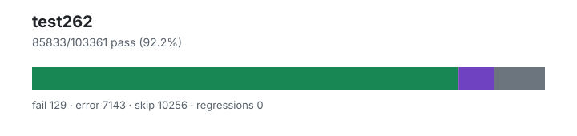

# test262 — `1.4.0+ff263a815`

- Image digest: `f35eaed61d0963346bde39f3f37cf41a7f51268a1e875dc3e5cdee7123d9ee3d`
- Suite version: `de8e621cdba4f40cff3cf244e6cfb8cb48746b4a`
- Ran: 2026-07-01T21:46:43.298Z → 2026-07-01T21:59:43.089Z

## Summary

**Pass rate: 85833/103361 (92.19%)**

| pass | fail | error | skip | regressions | new passes |
|---:|---:|---:|---:|---:|---:|
| 85833 | 129 | 7143 | 10256 | 0 | 0 |
