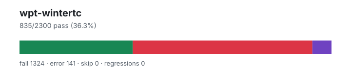

# wpt-wintertc — `1.4.0+ff263a815`

- Image digest: `f35eaed61d0963346bde39f3f37cf41a7f51268a1e875dc3e5cdee7123d9ee3d`
- Suite version: `1eb456f600fedad07c8cd6439796fb81db54faff`
- Ran: 2026-07-01T21:46:43.001Z → 2026-07-01T21:46:50.075Z

## Summary

**Pass rate: 835/2300 (36.30%)**

| pass | fail | error | skip | regressions | new passes |
|---:|---:|---:|---:|---:|---:|
| 835 | 1324 | 141 | 0 | 0 | 0 |

## Observed cases (2300)

- `encoding/api-surrogates-utf8.any.js :: Invalid surrogates encoded into UTF-8: Sanity check` — pass
- `encoding/api-surrogates-utf8.any.js :: Invalid surrogates encoded into UTF-8: Surrogate half (low)` — pass
- `encoding/api-surrogates-utf8.any.js :: Invalid surrogates encoded into UTF-8: Surrogate half (high)` — pass
- `encoding/api-surrogates-utf8.any.js :: Invalid surrogates encoded into UTF-8: Surrogate half (low), in a string` — pass
- `encoding/api-surrogates-utf8.any.js :: Invalid surrogates encoded into UTF-8: Surrogate half (high), in a string` — pass
- `encoding/api-surrogates-utf8.any.js :: Invalid surrogates encoded into UTF-8: Wrong order` — pass
- `encoding/api-basics.any.js :: Default encodings` — pass
- `encoding/api-basics.any.js :: Default inputs` — pass
- `encoding/api-basics.any.js :: Encode/decode round trip: utf-8` — pass
- `encoding/api-basics.any.js :: Decode sample: utf-16le` — pass
- `encoding/api-basics.any.js :: Decode sample: utf-16be` — pass
- `encoding/api-basics.any.js :: Decode sample: utf-16` — pass
- `encoding/replacement-encodings.any.js :: <file>` — error — ╭─ Script Error ──────────────────────────────────────────────────────────────╮
│ReferenceError: encodings_table is not defined                               │
│                                                                             │
│ In file ../tmp/wpt-elide-PzL5y2/case.js:5244:1:                             │
│   (source excerpt suppressed)                                               │
│─ Stack Trace ───────────────────────────────────────────────────────────────│
│                                                                             │
│ ╭─ [js] :program                          case.js:5244:1-15                 │
│ │                                                                           │
│ · elide run /tmp/wpt-elide-PzL5y2/case.js                                   │
│                                                                             │
│─ Advice ────────────────────────────────────────────────────────────────────│
│                                                                             │
│ An error occurred while executing your code.                                │
│                                                                             │
╰─────────────────────────────────────────────────────────────────────────────╯

- `encoding/idlharness.any.js :: <file>` — error — ╭─ Script Error ──────────────────────────────────────────────────────────────╮
│ReferenceError: idl_test is not defined                                      │
│                                                                             │
│ In file ../tmp/wpt-elide-6oMJrb/case.js:5243:1:                             │
│   (source excerpt suppressed)                                               │
│─ Stack Trace ───────────────────────────────────────────────────────────────│
│                                                                             │
│ ╭─ [js] :program                          case.js:5243:1-8                  │
│ │                                                                           │
│ · elide run /tmp/wpt-elide-6oMJrb/case.js                                   │
│                                                                             │
│─ Advice ────────────────────────────────────────────────────────────────────│
│                                                                             │
│ An error occurred while executing your code.                                │
│                                                                             │
╰─────────────────────────────────────────────────────────────────────────────╯

- `encoding/api-replacement-encodings.any.js :: <file>` — error — ╭─ Script Error ──────────────────────────────────────────────────────────────╮
│ReferenceError: encodings_table is not defined                               │
│                                                                             │
│ In file ../tmp/wpt-elide-fB43g4/case.js:5242:1:                             │
│   (source excerpt suppressed)                                               │
│─ Stack Trace ───────────────────────────────────────────────────────────────│
│                                                                             │
│ ╭─ [js] :program                          case.js:5242:1-15                 │
│ │                                                                           │
│ · elide run /tmp/wpt-elide-fB43g4/case.js                                   │
│                                                                             │
│─ Advice ────────────────────────────────────────────────────────────────────│
│                                                                             │
│ An error occurred while executing your code.                                │
│                                                                             │
╰─────────────────────────────────────────────────────────────────────────────╯

- `encoding/api-invalid-label.any.js :: <file>` — error — ╭─ Script Error ──────────────────────────────────────────────────────────────╮
│ReferenceError: subsetTest is not defined                                    │
│                                                                             │
│ In file ../tmp/wpt-elide-EydfFb/case.js:5264:3:                             │
│   (source excerpt suppressed)                                               │
│─ Stack Trace ───────────────────────────────────────────────────────────────│
│                                                                             │
│ ╭─ [js] :anonymous                        case.js:5264:3-12                 │
│ │                                                                           │
│ · elide run /tmp/wpt-elide-EydfFb/case.js                                   │
│                                                                             │
│─ Advice ────────────────────────────────────────────────────────────────────│
│                                                                             │
│ An error occurred while executing your code.                                │
│                                                                             │
╰─────────────────────────────────────────────────────────────────────────────╯

- `encoding/streams/backpressure.any.js :: write() should not complete until read relieves backpressure for TextDecoderStream` — fail — promise_test: Unhandled rejection with value: object "TypeError: (intermediate value)[streamClass.name] is not a constructor"
- `encoding/streams/backpressure.any.js :: additional writes should wait for backpressure to be relieved for class TextDecoderStream` — fail — promise_test: Unhandled rejection with value: object "TypeError: (intermediate value)[streamClass.name] is not a constructor"
- `encoding/streams/backpressure.any.js :: write() should not complete until read relieves backpressure for TextEncoderStream` — fail — promise_test: Unhandled rejection with value: object "TypeError: (intermediate value)[streamClass.name] is not a constructor"
- `encoding/streams/backpressure.any.js :: additional writes should wait for backpressure to be relieved for class TextEncoderStream` — fail — promise_test: Unhandled rejection with value: object "TypeError: (intermediate value)[streamClass.name] is not a constructor"
- `encoding/single-byte-decoder.window.js :: <file>` — error — ╭─ Script Error ──────────────────────────────────────────────────────────────╮
│ReferenceError: encodings_table is not defined                               │
│                                                                             │
│ In file ../tmp/wpt-elide-n0Td23/case.js:5245:27:                            │
│   (source excerpt suppressed)                                               │
│─ Stack Trace ───────────────────────────────────────────────────────────────│
│                                                                             │
│ ╭─ [js] :program                          case.js:5245:27-41                │
│ │                                                                           │
│ · elide run /tmp/wpt-elide-n0Td23/case.js                                   │
│                                                                             │
│─ Advice ────────────────────────────────────────────────────────────────────│
│                                                                             │
│ An error occurred while executing your code.                                │
│                                                                             │
╰─────────────────────────────────────────────────────────────────────────────╯

- `encoding/iso-2022-jp-decoder.any.js :: iso-2022-jp decoder: Error ESC` — fail — assert_equals: expected "\ufffd$" but got "\ufffd"
- `encoding/iso-2022-jp-decoder.any.js :: iso-2022-jp decoder: Error ESC, character` — fail — assert_equals: expected "\ufffd$P" but got "\ufffd"
- `encoding/iso-2022-jp-decoder.any.js :: iso-2022-jp decoder: ASCII ESC, character` — pass
- `encoding/iso-2022-jp-decoder.any.js :: iso-2022-jp decoder: Double ASCII ESC, character` — fail — assert_equals: expected "\ufffdP" but got "P"
- `encoding/iso-2022-jp-decoder.any.js :: iso-2022-jp decoder: character, ASCII ESC, character` — pass
- `encoding/iso-2022-jp-decoder.any.js :: iso-2022-jp decoder: characters` — pass
- `encoding/iso-2022-jp-decoder.any.js :: iso-2022-jp decoder: SO / SI` — fail — assert_equals: expected "\r\ufffd\ufffd\x10" but got "\r\x10"
- `encoding/iso-2022-jp-decoder.any.js :: iso-2022-jp decoder: Roman ESC, characters` — pass
- `encoding/iso-2022-jp-decoder.any.js :: iso-2022-jp decoder: Roman ESC, SO / SI` — fail — assert_equals: expected "\r\ufffd\ufffd\x10" but got "\r\x10"
- `encoding/iso-2022-jp-decoder.any.js :: iso-2022-jp decoder: Roman ESC, error ESC, Katakana ESC` — fail — assert_equals: expected "\ufffdﾐ" but got "\ufffd(IP"
- `encoding/iso-2022-jp-decoder.any.js :: iso-2022-jp decoder: Katakana ESC, character` — pass
- `encoding/iso-2022-jp-decoder.any.js :: iso-2022-jp decoder: Katakana ESC, multibyte ESC, character` — fail — assert_equals: expected "\ufffd佩" but got "佩"
- `encoding/iso-2022-jp-decoder.any.js :: iso-2022-jp decoder: Katakana ESC, error ESC, character` — fail — assert_equals: expected "\ufffdﾐ" but got "\ufffd"
- `encoding/iso-2022-jp-decoder.any.js :: iso-2022-jp decoder: Katakana ESC, error ESC #2, character` — fail — assert_equals: expected "\ufffd､ﾐ" but got "\ufffd"
- `encoding/iso-2022-jp-decoder.any.js :: iso-2022-jp decoder: Katakana ESC, character, Katakana ESC, character` — pass
- `encoding/iso-2022-jp-decoder.any.js :: iso-2022-jp decoder: Katakana ESC, SO / SI` — fail — assert_equals: expected "\ufffd\ufffd\ufffd\ufffd" but got "ｍｐ"
- `encoding/iso-2022-jp-decoder.any.js :: iso-2022-jp decoder: Multibyte ESC, character` — pass
- `encoding/iso-2022-jp-decoder.any.js :: iso-2022-jp decoder: Multibyte ESC #2, character` — pass
- `encoding/iso-2022-jp-decoder.any.js :: iso-2022-jp decoder: Multibyte ESC, error ESC, character` — fail — assert_equals: expected "\ufffd佩" but got "\ufffd\ufffd"
- `encoding/iso-2022-jp-decoder.any.js :: iso-2022-jp decoder: Double multibyte ESC` — fail — assert_equals: expected "\ufffd" but got ""
- `encoding/iso-2022-jp-decoder.any.js :: iso-2022-jp decoder: Double multibyte ESC, character` — fail — assert_equals: expected "\ufffd佩" but got "佩"
- `encoding/iso-2022-jp-decoder.any.js :: iso-2022-jp decoder: Double multibyte ESC #2, character` — fail — assert_equals: expected "\ufffd佩" but got "佩"
- `encoding/iso-2022-jp-decoder.any.js :: iso-2022-jp decoder: Multibyte ESC, error ESC #2, character` — fail — assert_equals: expected "\ufffdば\ufffd" but got "\ufffd\ufffd"
- `encoding/iso-2022-jp-decoder.any.js :: iso-2022-jp decoder: Multibyte ESC, single byte, multibyte ESC, character` — fail — assert_equals: expected "\ufffd佩" but got "\ufffdだ佩"
- `encoding/iso-2022-jp-decoder.any.js :: iso-2022-jp decoder: Multibyte ESC, lead error byte` — fail — assert_equals: expected "\ufffd\ufffd" but got "\ufffd"
- `encoding/iso-2022-jp-decoder.any.js :: iso-2022-jp decoder: Multibyte ESC, trail error byte` — pass
- `encoding/iso-2022-jp-decoder.any.js :: iso-2022-jp decoder: character, error ESC` — pass
- `encoding/iso-2022-jp-decoder.any.js :: iso-2022-jp decoder: character, error ESC #2` — fail — assert_equals: expected "P\ufffd$" but got "P\ufffd"
- `encoding/iso-2022-jp-decoder.any.js :: iso-2022-jp decoder: character, error ESC #3` — fail — assert_equals: expected "P\ufffdP" but got "P\ufffd"
- `encoding/iso-2022-jp-decoder.any.js :: iso-2022-jp decoder: character, ASCII ESC` — pass
- `encoding/iso-2022-jp-decoder.any.js :: iso-2022-jp decoder: character, Roman ESC` — pass
- `encoding/iso-2022-jp-decoder.any.js :: iso-2022-jp decoder: character, Katakana ESC` — pass
- `encoding/iso-2022-jp-decoder.any.js :: iso-2022-jp decoder: character, Multibyte ESC` — pass
- `encoding/iso-2022-jp-decoder.any.js :: iso-2022-jp decoder: character, Multibyte ESC #2` — pass
- `encoding/streams/decode-attributes.any.js :: encoding attribute should have correct value for 'unicode-1-1-utf-8'` — fail — TextDecoderStream is not defined
- `encoding/streams/decode-attributes.any.js :: encoding attribute should have correct value for 'iso-8859-2'` — fail — TextDecoderStream is not defined
- `encoding/streams/decode-attributes.any.js :: encoding attribute should have correct value for 'ascii'` — fail — TextDecoderStream is not defined
- `encoding/streams/decode-attributes.any.js :: encoding attribute should have correct value for 'utf-16'` — fail — TextDecoderStream is not defined
- `encoding/streams/decode-attributes.any.js :: setting fatal to 'false' should set the attribute to false` — fail — TextDecoderStream is not defined
- `encoding/streams/decode-attributes.any.js :: setting ignoreBOM to 'false' should set the attribute to false` — fail — TextDecoderStream is not defined
- `encoding/streams/decode-attributes.any.js :: setting fatal to '0' should set the attribute to false` — fail — TextDecoderStream is not defined
- `encoding/streams/decode-attributes.any.js :: setting ignoreBOM to '0' should set the attribute to false` — fail — TextDecoderStream is not defined
- `encoding/streams/decode-attributes.any.js :: setting fatal to '' should set the attribute to false` — fail — TextDecoderStream is not defined
- `encoding/streams/decode-attributes.any.js :: setting ignoreBOM to '' should set the attribute to false` — fail — TextDecoderStream is not defined
- `encoding/streams/decode-attributes.any.js :: setting fatal to 'undefined' should set the attribute to false` — fail — TextDecoderStream is not defined
- `encoding/streams/decode-attributes.any.js :: setting ignoreBOM to 'undefined' should set the attribute to false` — fail — TextDecoderStream is not defined
- `encoding/streams/decode-attributes.any.js :: setting fatal to 'null' should set the attribute to false` — fail — TextDecoderStream is not defined
- `encoding/streams/decode-attributes.any.js :: setting ignoreBOM to 'null' should set the attribute to false` — fail — TextDecoderStream is not defined
- `encoding/streams/decode-attributes.any.js :: setting fatal to 'true' should set the attribute to true` — fail — TextDecoderStream is not defined
- `encoding/streams/decode-attributes.any.js :: setting ignoreBOM to 'true' should set the attribute to true` — fail — TextDecoderStream is not defined
- `encoding/streams/decode-attributes.any.js :: setting fatal to '1' should set the attribute to true` — fail — TextDecoderStream is not defined
- `encoding/streams/decode-attributes.any.js :: setting ignoreBOM to '1' should set the attribute to true` — fail — TextDecoderStream is not defined
- `encoding/streams/decode-attributes.any.js :: setting fatal to '[object Object]' should set the attribute to true` — fail — TextDecoderStream is not defined
- `encoding/streams/decode-attributes.any.js :: setting ignoreBOM to '[object Object]' should set the attribute to true` — fail — TextDecoderStream is not defined
- `encoding/streams/decode-attributes.any.js :: setting fatal to '' should set the attribute to true` — fail — TextDecoderStream is not defined
- `encoding/streams/decode-attributes.any.js :: setting ignoreBOM to '' should set the attribute to true` — fail — TextDecoderStream is not defined
- `encoding/streams/decode-attributes.any.js :: setting fatal to 'yes' should set the attribute to true` — fail — TextDecoderStream is not defined
- `encoding/streams/decode-attributes.any.js :: setting ignoreBOM to 'yes' should set the attribute to true` — fail — TextDecoderStream is not defined
- `encoding/streams/decode-attributes.any.js :: constructing with an invalid encoding should throw` — fail — assert_throws_js: the constructor should throw function "() => new TextDecoderStream('')" threw object "ReferenceError: TextDecoderStream is not defined" ("ReferenceError") expected instance of function "function RangeError() { [native code] }" ("RangeError")
- `encoding/streams/decode-attributes.any.js :: constructing with a non-stringifiable encoding should throw` — fail — assert_throws_js: the constructor should throw function "() => new TextDecoderStream({
    toString() { return {}; }
  })" threw object "ReferenceError: TextDecoderStream is not defined" ("ReferenceError") expected instance of function "function TypeError() { [native code] }" ("TypeError")
- `encoding/streams/decode-attributes.any.js :: a throwing fatal member should cause the constructor to throw` — fail — assert_throws_js: the constructor should throw function "() => new TextDecoderStream('utf-8', {
                     get fatal() { throw new Error(); }
                   })" threw object "ReferenceError: TextDecoderStream is not defined" ("ReferenceError") expected instance of function "function Error() { [native code] }" ("Error")
- `encoding/streams/decode-attributes.any.js :: a throwing ignoreBOM member should cause the constructor to throw` — fail — assert_throws_js: the constructor should throw function "() => new TextDecoderStream('utf-8', {
                     get ignoreBOM() { throw new Error(); }
                   })" threw object "ReferenceError: TextDecoderStream is not defined" ("ReferenceError") expected instance of function "function Error() { [native code] }" ("Error")
- `encoding/encodeInto.any.js :: encodeInto() into ArrayBuffer with Hi and destination length 0, offset 0, filler 0` — fail — createBuffer is not defined
- `encoding/encodeInto.any.js :: encodeInto() into SharedArrayBuffer with Hi and destination length 0, offset 0, filler 0` — fail — createBuffer is not defined
- `encoding/encodeInto.any.js :: encodeInto() into ArrayBuffer with Hi and destination length 0, offset 4, filler 0` — fail — createBuffer is not defined
- `encoding/encodeInto.any.js :: encodeInto() into SharedArrayBuffer with Hi and destination length 0, offset 4, filler 0` — fail — createBuffer is not defined
- `encoding/encodeInto.any.js :: encodeInto() into ArrayBuffer with Hi and destination length 0, offset 0, filler 128` — fail — createBuffer is not defined
- `encoding/encodeInto.any.js :: encodeInto() into SharedArrayBuffer with Hi and destination length 0, offset 0, filler 128` — fail — createBuffer is not defined
- `encoding/encodeInto.any.js :: encodeInto() into ArrayBuffer with Hi and destination length 0, offset 4, filler 128` — fail — createBuffer is not defined
- `encoding/encodeInto.any.js :: encodeInto() into SharedArrayBuffer with Hi and destination length 0, offset 4, filler 128` — fail — createBuffer is not defined
- `encoding/encodeInto.any.js :: encodeInto() into ArrayBuffer with Hi and destination length 0, offset 0, filler random` — fail — createBuffer is not defined
- `encoding/encodeInto.any.js :: encodeInto() into SharedArrayBuffer with Hi and destination length 0, offset 0, filler random` — fail — createBuffer is not defined
- `encoding/encodeInto.any.js :: encodeInto() into ArrayBuffer with Hi and destination length 0, offset 4, filler random` — fail — createBuffer is not defined
- `encoding/encodeInto.any.js :: encodeInto() into SharedArrayBuffer with Hi and destination length 0, offset 4, filler random` — fail — createBuffer is not defined
- `encoding/encodeInto.any.js :: encodeInto() into ArrayBuffer with A and destination length 10, offset 0, filler 0` — fail — createBuffer is not defined
- `encoding/encodeInto.any.js :: encodeInto() into SharedArrayBuffer with A and destination length 10, offset 0, filler 0` — fail — createBuffer is not defined
- `encoding/encodeInto.any.js :: encodeInto() into ArrayBuffer with A and destination length 10, offset 4, filler 0` — fail — createBuffer is not defined
- `encoding/encodeInto.any.js :: encodeInto() into SharedArrayBuffer with A and destination length 10, offset 4, filler 0` — fail — createBuffer is not defined
- `encoding/encodeInto.any.js :: encodeInto() into ArrayBuffer with A and destination length 10, offset 0, filler 128` — fail — createBuffer is not defined
- `encoding/encodeInto.any.js :: encodeInto() into SharedArrayBuffer with A and destination length 10, offset 0, filler 128` — fail — createBuffer is not defined
- `encoding/encodeInto.any.js :: encodeInto() into ArrayBuffer with A and destination length 10, offset 4, filler 128` — fail — createBuffer is not defined
- `encoding/encodeInto.any.js :: encodeInto() into SharedArrayBuffer with A and destination length 10, offset 4, filler 128` — fail — createBuffer is not defined
- `encoding/encodeInto.any.js :: encodeInto() into ArrayBuffer with A and destination length 10, offset 0, filler random` — fail — createBuffer is not defined
- `encoding/encodeInto.any.js :: encodeInto() into SharedArrayBuffer with A and destination length 10, offset 0, filler random` — fail — createBuffer is not defined
- `encoding/encodeInto.any.js :: encodeInto() into ArrayBuffer with A and destination length 10, offset 4, filler random` — fail — createBuffer is not defined
- `encoding/encodeInto.any.js :: encodeInto() into SharedArrayBuffer with A and destination length 10, offset 4, filler random` — fail — createBuffer is not defined
- `encoding/encodeInto.any.js :: encodeInto() into ArrayBuffer with 𝌆 and destination length 4, offset 0, filler 0` — fail — createBuffer is not defined
- `encoding/encodeInto.any.js :: encodeInto() into SharedArrayBuffer with 𝌆 and destination length 4, offset 0, filler 0` — fail — createBuffer is not defined
- `encoding/encodeInto.any.js :: encodeInto() into ArrayBuffer with 𝌆 and destination length 4, offset 4, filler 0` — fail — createBuffer is not defined
- `encoding/encodeInto.any.js :: encodeInto() into SharedArrayBuffer with 𝌆 and destination length 4, offset 4, filler 0` — fail — createBuffer is not defined
- `encoding/encodeInto.any.js :: encodeInto() into ArrayBuffer with 𝌆 and destination length 4, offset 0, filler 128` — fail — createBuffer is not defined
- `encoding/encodeInto.any.js :: encodeInto() into SharedArrayBuffer with 𝌆 and destination length 4, offset 0, filler 128` — fail — createBuffer is not defined
- `encoding/encodeInto.any.js :: encodeInto() into ArrayBuffer with 𝌆 and destination length 4, offset 4, filler 128` — fail — createBuffer is not defined
- `encoding/encodeInto.any.js :: encodeInto() into SharedArrayBuffer with 𝌆 and destination length 4, offset 4, filler 128` — fail — createBuffer is not defined
- `encoding/encodeInto.any.js :: encodeInto() into ArrayBuffer with 𝌆 and destination length 4, offset 0, filler random` — fail — createBuffer is not defined
- `encoding/encodeInto.any.js :: encodeInto() into SharedArrayBuffer with 𝌆 and destination length 4, offset 0, filler random` — fail — createBuffer is not defined
- `encoding/encodeInto.any.js :: encodeInto() into ArrayBuffer with 𝌆 and destination length 4, offset 4, filler random` — fail — createBuffer is not defined
- `encoding/encodeInto.any.js :: encodeInto() into SharedArrayBuffer with 𝌆 and destination length 4, offset 4, filler random` — fail — createBuffer is not defined
- `encoding/encodeInto.any.js :: encodeInto() into ArrayBuffer with 𝌆A and destination length 3, offset 0, filler 0` — fail — createBuffer is not defined
- `encoding/encodeInto.any.js :: encodeInto() into SharedArrayBuffer with 𝌆A and destination length 3, offset 0, filler 0` — fail — createBuffer is not defined
- `encoding/encodeInto.any.js :: encodeInto() into ArrayBuffer with 𝌆A and destination length 3, offset 4, filler 0` — fail — createBuffer is not defined
- `encoding/encodeInto.any.js :: encodeInto() into SharedArrayBuffer with 𝌆A and destination length 3, offset 4, filler 0` — fail — createBuffer is not defined
- `encoding/encodeInto.any.js :: encodeInto() into ArrayBuffer with 𝌆A and destination length 3, offset 0, filler 128` — fail — createBuffer is not defined
- `encoding/encodeInto.any.js :: encodeInto() into SharedArrayBuffer with 𝌆A and destination length 3, offset 0, filler 128` — fail — createBuffer is not defined
- `encoding/encodeInto.any.js :: encodeInto() into ArrayBuffer with 𝌆A and destination length 3, offset 4, filler 128` — fail — createBuffer is not defined
- `encoding/encodeInto.any.js :: encodeInto() into SharedArrayBuffer with 𝌆A and destination length 3, offset 4, filler 128` — fail — createBuffer is not defined
- `encoding/encodeInto.any.js :: encodeInto() into ArrayBuffer with 𝌆A and destination length 3, offset 0, filler random` — fail — createBuffer is not defined
- `encoding/encodeInto.any.js :: encodeInto() into SharedArrayBuffer with 𝌆A and destination length 3, offset 0, filler random` — fail — createBuffer is not defined
- `encoding/encodeInto.any.js :: encodeInto() into ArrayBuffer with 𝌆A and destination length 3, offset 4, filler random` — fail — createBuffer is not defined
- `encoding/encodeInto.any.js :: encodeInto() into SharedArrayBuffer with 𝌆A and destination length 3, offset 4, filler random` — fail — createBuffer is not defined
- `encoding/encodeInto.any.js :: encodeInto() into ArrayBuffer with U+d834AU+df06A¥Hi and destination length 10, offset 0, filler 0` — fail — createBuffer is not defined
- `encoding/encodeInto.any.js :: encodeInto() into SharedArrayBuffer with U+d834AU+df06A¥Hi and destination length 10, offset 0, filler 0` — fail — createBuffer is not defined
- `encoding/encodeInto.any.js :: encodeInto() into ArrayBuffer with U+d834AU+df06A¥Hi and destination length 10, offset 4, filler 0` — fail — createBuffer is not defined
- `encoding/encodeInto.any.js :: encodeInto() into SharedArrayBuffer with U+d834AU+df06A¥Hi and destination length 10, offset 4, filler 0` — fail — createBuffer is not defined
- `encoding/encodeInto.any.js :: encodeInto() into ArrayBuffer with U+d834AU+df06A¥Hi and destination length 10, offset 0, filler 128` — fail — createBuffer is not defined
- `encoding/encodeInto.any.js :: encodeInto() into SharedArrayBuffer with U+d834AU+df06A¥Hi and destination length 10, offset 0, filler 128` — fail — createBuffer is not defined
- `encoding/encodeInto.any.js :: encodeInto() into ArrayBuffer with U+d834AU+df06A¥Hi and destination length 10, offset 4, filler 128` — fail — createBuffer is not defined
- `encoding/encodeInto.any.js :: encodeInto() into SharedArrayBuffer with U+d834AU+df06A¥Hi and destination length 10, offset 4, filler 128` — fail — createBuffer is not defined
- `encoding/encodeInto.any.js :: encodeInto() into ArrayBuffer with U+d834AU+df06A¥Hi and destination length 10, offset 0, filler random` — fail — createBuffer is not defined
- `encoding/encodeInto.any.js :: encodeInto() into SharedArrayBuffer with U+d834AU+df06A¥Hi and destination length 10, offset 0, filler random` — fail — createBuffer is not defined
- `encoding/encodeInto.any.js :: encodeInto() into ArrayBuffer with U+d834AU+df06A¥Hi and destination length 10, offset 4, filler random` — fail — createBuffer is not defined
- `encoding/encodeInto.any.js :: encodeInto() into SharedArrayBuffer with U+d834AU+df06A¥Hi and destination length 10, offset 4, filler random` — fail — createBuffer is not defined
- `encoding/encodeInto.any.js :: encodeInto() into ArrayBuffer with AU+df06 and destination length 4, offset 0, filler 0` — fail — createBuffer is not defined
- `encoding/encodeInto.any.js :: encodeInto() into SharedArrayBuffer with AU+df06 and destination length 4, offset 0, filler 0` — fail — createBuffer is not defined
- `encoding/encodeInto.any.js :: encodeInto() into ArrayBuffer with AU+df06 and destination length 4, offset 4, filler 0` — fail — createBuffer is not defined
- `encoding/encodeInto.any.js :: encodeInto() into SharedArrayBuffer with AU+df06 and destination length 4, offset 4, filler 0` — fail — createBuffer is not defined
- `encoding/encodeInto.any.js :: encodeInto() into ArrayBuffer with AU+df06 and destination length 4, offset 0, filler 128` — fail — createBuffer is not defined
- `encoding/encodeInto.any.js :: encodeInto() into SharedArrayBuffer with AU+df06 and destination length 4, offset 0, filler 128` — fail — createBuffer is not defined
- `encoding/encodeInto.any.js :: encodeInto() into ArrayBuffer with AU+df06 and destination length 4, offset 4, filler 128` — fail — createBuffer is not defined
- `encoding/encodeInto.any.js :: encodeInto() into SharedArrayBuffer with AU+df06 and destination length 4, offset 4, filler 128` — fail — createBuffer is not defined
- `encoding/encodeInto.any.js :: encodeInto() into ArrayBuffer with AU+df06 and destination length 4, offset 0, filler random` — fail — createBuffer is not defined
- `encoding/encodeInto.any.js :: encodeInto() into SharedArrayBuffer with AU+df06 and destination length 4, offset 0, filler random` — fail — createBuffer is not defined
- `encoding/encodeInto.any.js :: encodeInto() into ArrayBuffer with AU+df06 and destination length 4, offset 4, filler random` — fail — createBuffer is not defined
- `encoding/encodeInto.any.js :: encodeInto() into SharedArrayBuffer with AU+df06 and destination length 4, offset 4, filler random` — fail — createBuffer is not defined
- `encoding/encodeInto.any.js :: encodeInto() into ArrayBuffer with ¥¥ and destination length 4, offset 0, filler 0` — fail — createBuffer is not defined
- `encoding/encodeInto.any.js :: encodeInto() into SharedArrayBuffer with ¥¥ and destination length 4, offset 0, filler 0` — fail — createBuffer is not defined
- `encoding/encodeInto.any.js :: encodeInto() into ArrayBuffer with ¥¥ and destination length 4, offset 4, filler 0` — fail — createBuffer is not defined
- `encoding/encodeInto.any.js :: encodeInto() into SharedArrayBuffer with ¥¥ and destination length 4, offset 4, filler 0` — fail — createBuffer is not defined
- `encoding/encodeInto.any.js :: encodeInto() into ArrayBuffer with ¥¥ and destination length 4, offset 0, filler 128` — fail — createBuffer is not defined
- `encoding/encodeInto.any.js :: encodeInto() into SharedArrayBuffer with ¥¥ and destination length 4, offset 0, filler 128` — fail — createBuffer is not defined
- `encoding/encodeInto.any.js :: encodeInto() into ArrayBuffer with ¥¥ and destination length 4, offset 4, filler 128` — fail — createBuffer is not defined
- `encoding/encodeInto.any.js :: encodeInto() into SharedArrayBuffer with ¥¥ and destination length 4, offset 4, filler 128` — fail — createBuffer is not defined
- `encoding/encodeInto.any.js :: encodeInto() into ArrayBuffer with ¥¥ and destination length 4, offset 0, filler random` — fail — createBuffer is not defined
- `encoding/encodeInto.any.js :: encodeInto() into SharedArrayBuffer with ¥¥ and destination length 4, offset 0, filler random` — fail — createBuffer is not defined
- `encoding/encodeInto.any.js :: encodeInto() into ArrayBuffer with ¥¥ and destination length 4, offset 4, filler random` — fail — createBuffer is not defined
- `encoding/encodeInto.any.js :: encodeInto() into SharedArrayBuffer with ¥¥ and destination length 4, offset 4, filler random` — fail — createBuffer is not defined
- `encoding/encodeInto.any.js :: Invalid encodeInto() destination: DataView, backed by: ArrayBuffer` — fail — createBuffer is not defined
- `encoding/encodeInto.any.js :: Invalid encodeInto() destination: DataView, backed by: SharedArrayBuffer` — fail — createBuffer is not defined
- `encoding/encodeInto.any.js :: Invalid encodeInto() destination: Int8Array, backed by: ArrayBuffer` — fail — createBuffer is not defined
- `encoding/encodeInto.any.js :: Invalid encodeInto() destination: Int8Array, backed by: SharedArrayBuffer` — fail — createBuffer is not defined
- `encoding/encodeInto.any.js :: Invalid encodeInto() destination: Int16Array, backed by: ArrayBuffer` — fail — createBuffer is not defined
- `encoding/encodeInto.any.js :: Invalid encodeInto() destination: Int16Array, backed by: SharedArrayBuffer` — fail — createBuffer is not defined
- `encoding/encodeInto.any.js :: Invalid encodeInto() destination: Int32Array, backed by: ArrayBuffer` — fail — createBuffer is not defined
- `encoding/encodeInto.any.js :: Invalid encodeInto() destination: Int32Array, backed by: SharedArrayBuffer` — fail — createBuffer is not defined
- `encoding/encodeInto.any.js :: Invalid encodeInto() destination: Uint16Array, backed by: ArrayBuffer` — fail — createBuffer is not defined
- `encoding/encodeInto.any.js :: Invalid encodeInto() destination: Uint16Array, backed by: SharedArrayBuffer` — fail — createBuffer is not defined
- `encoding/encodeInto.any.js :: Invalid encodeInto() destination: Uint32Array, backed by: ArrayBuffer` — fail — createBuffer is not defined
- `encoding/encodeInto.any.js :: Invalid encodeInto() destination: Uint32Array, backed by: SharedArrayBuffer` — fail — createBuffer is not defined
- `encoding/encodeInto.any.js :: Invalid encodeInto() destination: Uint8ClampedArray, backed by: ArrayBuffer` — fail — createBuffer is not defined
- `encoding/encodeInto.any.js :: Invalid encodeInto() destination: Uint8ClampedArray, backed by: SharedArrayBuffer` — fail — createBuffer is not defined
- `encoding/encodeInto.any.js :: Invalid encodeInto() destination: BigInt64Array, backed by: ArrayBuffer` — fail — createBuffer is not defined
- `encoding/encodeInto.any.js :: Invalid encodeInto() destination: BigInt64Array, backed by: SharedArrayBuffer` — fail — createBuffer is not defined
- `encoding/encodeInto.any.js :: Invalid encodeInto() destination: BigUint64Array, backed by: ArrayBuffer` — fail — createBuffer is not defined
- `encoding/encodeInto.any.js :: Invalid encodeInto() destination: BigUint64Array, backed by: SharedArrayBuffer` — fail — createBuffer is not defined
- `encoding/encodeInto.any.js :: Invalid encodeInto() destination: Float16Array, backed by: ArrayBuffer` — fail — createBuffer is not defined
- `encoding/encodeInto.any.js :: Invalid encodeInto() destination: Float16Array, backed by: SharedArrayBuffer` — fail — createBuffer is not defined
- `encoding/encodeInto.any.js :: Invalid encodeInto() destination: Float32Array, backed by: ArrayBuffer` — fail — createBuffer is not defined
- `encoding/encodeInto.any.js :: Invalid encodeInto() destination: Float32Array, backed by: SharedArrayBuffer` — fail — createBuffer is not defined
- `encoding/encodeInto.any.js :: Invalid encodeInto() destination: Float64Array, backed by: ArrayBuffer` — fail — createBuffer is not defined
- `encoding/encodeInto.any.js :: Invalid encodeInto() destination: Float64Array, backed by: SharedArrayBuffer` — fail — createBuffer is not defined
- `encoding/encodeInto.any.js :: Invalid encodeInto() destination: ArrayBuffer` — fail — assert_throws_js: function "() => new TextEncoder().encodeInto("", createBuffer(arrayBufferOrSharedArrayBuffer, 10))" threw object "ReferenceError: createBuffer is not defined" ("ReferenceError") expected instance of function "function TypeError() { [native code] }" ("TypeError")
- `encoding/encodeInto.any.js :: Invalid encodeInto() destination: SharedArrayBuffer` — fail — assert_throws_js: function "() => new TextEncoder().encodeInto("", createBuffer(arrayBufferOrSharedArrayBuffer, 10))" threw object "ReferenceError: createBuffer is not defined" ("ReferenceError") expected instance of function "function TypeError() { [native code] }" ("TypeError")
- `encoding/encodeInto.any.js :: encodeInto() and a detached output buffer` — fail — value of type Direct is not yet supported by structured clone
- `encoding/legacy-mb-schinese/gbk/gbk-decoder.any.js :: gbk pointer: 6432` — pass
- `encoding/legacy-mb-schinese/gbk/gbk-decoder.any.js :: gbk pointer: 7533` — fail — assert_equals: expected 7743 but got 59335
- `encoding/legacy-mb-schinese/gbk/gbk-decoder.any.js :: gbk pointer: 7536` — fail — assert_equals: expected 505 but got 59336
- `encoding/legacy-mb-schinese/gbk/gbk-decoder.any.js :: gbk pointer: 7672` — fail — assert_equals: expected 12350 but got 59367
- `encoding/legacy-mb-schinese/gbk/gbk-decoder.any.js :: gbk pointer: 7673` — fail — assert_equals: expected 12272 but got 59368
- `encoding/legacy-mb-schinese/gbk/gbk-decoder.any.js :: gbk pointer: 7674` — fail — assert_equals: expected 12273 but got 59369
- …and 2100 more
