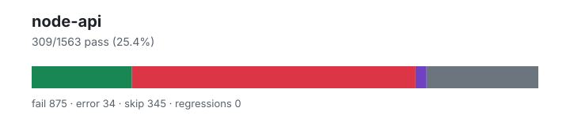

# node-api — `1.4.1+20260716.b8b6531`

- Image digest: `3d3ea83ed6403be11d119eb0234efa699809d81a801986659790996c18306a06`
- Suite version: `ed33ae74ad100a38df41edf56f6935c78821e779`
- Ran: 2026-07-17T20:46:27.850Z → 2026-07-17T20:52:51.868Z

## Summary

**Pass rate: 309/1563 (25.37%)**

| pass | fail | error | skip | regressions | new passes |
|---:|---:|---:|---:|---:|---:|
| 309 | 875 | 34 | 345 | 0 | 0 |

## Observed cases (1218)

- `test/parallel/test-assert-class.js` — fail — TAP version 13
# Subtest: Assert constructor requires new
not ok 1 - Assert constructor requires new
  ---
  duration_ms: 1
  failureType: 'testCodeFailure'
  error: "Got unwanted exception: Assert is not a function"
  code: 'ERR_ASSERTION'
  ...
# Subtest: Assert class non strict
not ok 2 - Assert class non strict
  ---
  duration_ms: 1
  failureType: 'testCodeFailure'
  error: "Assert is not a constructor"
  code: 'ERR_TEST_FAILURE'
  ...
# Subtest: Assert class strict
not ok 3 - Assert class strict
  ---
  duration_ms: 0
  failureType: 'testCodeFailure'
  error: "Assert is not a constructor"
  code: 'ERR_TEST_FAILURE'
  ...
# Subtest: Assert class with invalid diff option
not ok 4 - Assert class with invalid diff option
  ---
  duration_ms: 0
  failureType: 'testCodeFailure'
  error: "Got unwanted exception: Assert is not a constructor"
  code: 'ERR_ASSERTION'
  ...
# Subtest: Assert class non strict with full diff
not ok 5 - Assert class non strict with full diff
  ---
  duration_ms: 0
  failureType: 'testCodeFailure'
  error: "Assert is not a constructor"
  code: 'ERR_TEST_FAILURE'
  ...
# Subtest: Assert class non strict with simple diff
not ok 6 - Assert class non strict with simple diff
  ---
  duration_ms: 0
  failureType: 'testCodeFailure'
  error: "Assert is not a constructor"
  code: 'ERR_TEST_FAILURE'
  ...
# Subtest: Assert class strict with skipPrototype
not ok 7 - Assert class strict with skipPrototype
  ---
  duration_ms: 0
  failureType: 'testCodeFailure'
  error: "Assert is not a constructor"
  code: 'ERR_TEST_FAILURE'
  ...
# Subtest: Assert class non strict with skipPrototype
not ok 8 - Assert class non strict with skipPrototype
  ---
  duration_ms: 0
  failureType: 'testCodeFailure'
  error: "Assert is not a constructor"
  code: 'ERR_TEST_FAILURE'
  ...
# Subtest: Assert class skipPrototype with complex objects
not ok 9 - Assert class skipPrototype with complex objects
  ---
  duration_ms: 0
  failureType: 'testCodeFailure'
  error: "Assert is not a constructor"
  code: 'ERR_TEST_FAILURE'
  ...
# Subtest: Assert class skipPrototype with arrays and special objects
not ok 10 - Assert class skipPrototype with arrays and special objects
  ---
  duration_ms: 0
  failureType: 'testCodeFailure'
  error: "Assert is not a constructor"
  code: 'ERR_TEST_FAILURE'
  ...
# Subtest: Assert class skipPrototype with notDeepStrictEqual
not ok 11 - Assert class skipPrototype with notDeepStrictEqual
  ---
  duration_ms: 1
  failureType: 'testCodeFailure'
  error: "Assert is not a constructor"
  code: 'ERR_TEST_FAILURE'
  ...
# Subtest: Assert class skipPrototype with mixed types
not ok 12 - Assert class skipPrototype with mixed types
  ---
  duration_ms: 0
  failureType: 'testCodeFailure'
  error: "Assert is not a constructor"
  code: 'ERR_TEST_FAILURE'
  ...
1..12
# tests 12
# suites 0
# pass 0
# fail 12
# cancelled 0
# skipped 0
# todo 0
# duration_ms 5
- `test/parallel/test-assert-fail.js` — fail — TAP version 13
# Subtest: No args
not ok 1 - No args
  ---
  duration_ms: 2
  failureType: 'testCodeFailure'
  error: "Got unwanted exception: Failed"
  code: 'ERR_ASSERTION'
  ...
# Subtest: One arg = message
not ok 2 - One arg = message
  ---
  duration_ms: 1
  failureType: 'testCodeFailure'
  error: "Got unwanted exception: custom message"
  code: 'ERR_ASSERTION'
  ...
# Subtest: One arg = Error
not ok 3 - One arg = Error
  ---
  duration_ms: 0
  failureType: 'testCodeFailure'
  error: "Got unwanted exception: Failed"
  code: 'ERR_ASSERTION'
  ...
# Subtest: Object prototype get
ok 4 - Object prototype get
1..4
# tests 4
# suites 0
# pass 1
# fail 3
# cancelled 0
# skipped 0
# todo 0
# duration_ms 5
- `test/parallel/test-assert-esm-cjs-message-verify.js` — fail — Uncaught (in promise) Error: node:child_process: spawn() is not implemented yet in Elide
- `test/parallel/test-assert-class-destructuring.js` — fail — TAP version 13
# Subtest: Assert class destructuring behavior - diff option
not ok 1 - Assert class destructuring behavior - diff option
  ---
  duration_ms: 1
  failureType: 'testCodeFailure'
  error: "Assert is not a constructor"
  code: 'ERR_TEST_FAILURE'
  ...
# Subtest: Assert class destructuring behavior - strict option
not ok 2 - Assert class destructuring behavior - strict option
  ---
  duration_ms: 1
  failureType: 'testCodeFailure'
  error: "Assert is not a constructor"
  code: 'ERR_TEST_FAILURE'
  ...
# Subtest: Assert class destructuring behavior - comprehensive methods
not ok 3 - Assert class destructuring behavior - comprehensive methods
  ---
  duration_ms: 0
  failureType: 'testCodeFailure'
  error: "Assert is not a constructor"
  code: 'ERR_TEST_FAILURE'
  ...
1..3
# tests 3
# suites 0
# pass 0
# fail 3
# cancelled 0
# skipped 0
# todo 0
# duration_ms 3
- `test/parallel/test-assert-checktag.js` — fail — TAP version 13
# Subtest: [object Object]
not ok 1 - [object Object]
  ---
  duration_ms: 20
  failureType: 'testCodeFailure'
  error: "Date(2016-01-01T00:00:00.000Z) notDeepEqual {}"
  code: 'ERR_ASSERTION'
  ...
1..1
# tests 1
# suites 0
# pass 0
# fail 1
# cancelled 0
# skipped 0
# todo 0
# duration_ms 22
- `test/parallel/test-assert-deep-with-error.js` — fail — TAP version 13
# Subtest: Handle error causes
not ok 1 - Handle error causes
  ---
  duration_ms: 4
  failureType: 'testCodeFailure'
  error: "Missing expected exception"
  code: 'ERR_ASSERTION'
  ...
# Subtest: Handle undefined causes
not ok 2 - Handle undefined causes
  ---
  duration_ms: 0
  failureType: 'testCodeFailure'
  error: "a notDeepStrictEqual a"
  code: 'ERR_ASSERTION'
  ...
1..2
# tests 2
# suites 0
# pass 0
# fail 2
# cancelled 0
# skipped 0
# todo 0
# duration_ms 19
- `test/parallel/test-assert-async.js` — fail — Uncaught (in promise) AssertionError: Got rejection that did not match expected: AssertionError: Failed
- `test/parallel/test-assert-deep.js` — fail — TAP version 13
# Subtest: deepEqual
not ok 1 - deepEqual
  ---
  duration_ms: 1
  failureType: 'testCodeFailure'
  error: "Got unwanted exception: [120, 121, 122, 10] deepStrictEqual {}"
  code: 'ERR_ASSERTION'
  ...
# Subtest: loose deepEqual
not ok 2 - loose deepEqual
  ---
  duration_ms: 2
  failureType: 'testCodeFailure'
  error: "Got unwanted exception: assert.partialDeepStrictEqual is not a function"
  code: 'ERR_ASSERTION'
  ...
# Subtest: date
not ok 3 - date
  ---
  duration_ms: 13
  failureType: 'testCodeFailure'
  error: "Missing expected exception"
  code: 'ERR_ASSERTION'
  ...
# Subtest: regexp
not ok 4 - regexp
  ---
  duration_ms: 0
  failureType: 'testCodeFailure'
  error: "Missing expected exception"
  code: 'ERR_ASSERTION'
  ...
# Subtest: deepEqual should pass for these weird cases
not ok 5 - deepEqual should pass for these weird cases
  ---
  duration_ms: 1
  failureType: 'testCodeFailure'
  error: "{0: 1} notDeepEqual {0: '1'}"
  code: 'ERR_ASSERTION'
  ...
# Subtest: es6 Maps and Sets
not ok 6 - es6 Maps and Sets
  ---
  duration_ms: 0
  failureType: 'testCodeFailure'
  error: "assert.partialDeepStrictEqual is not a function"
  code: 'ERR_TEST_FAILURE'
  ...
# Subtest: GH-6416. Make sure circular refs do not throw
not ok 7 - GH-6416. Make sure circular refs do not throw
  ---
  duration_ms: 0
  failureType: 'testCodeFailure'
  error: "assert.partialDeepStrictEqual is not a function"
  code: 'ERR_TEST_FAILURE'
  ...
# Subtest: GH-14441. Circular structures should be consistent
not ok 8 - GH-14441. Circular structures should be consistent
  ---
  duration_ms: 1
  failureType: 'testCodeFailure'
  error: "Missing expected exception"
  code: 'ERR_ASSERTION'
  ...
# Subtest: deepStrictEqual handles shared expected array elements after cycle detection
not ok 9 - deepStrictEqual handles shared expected array elements after cycle detection
  ---
  duration_ms: 0
  failureType: 'testCodeFailure'
  error: "assert.partialDeepStrictEqual is not a function"
  code: 'ERR_TEST_FAILURE'
  ...
# Subtest: deepStrictEqual handles cross-root aliases after cycle detection
not ok 10 - deepStrictEqual handles cross-root aliases after cycle detection
  ---
  duration_ms: 0
  failureType: 'testCodeFailure'
  error: "assert.partialDeepStrictEqual is not a function"
  code: 'ERR_TEST_FAILURE'
  ...
# Subtest: Ensure reflexivity of deepEqual with `arguments` objects.
not ok 11 - Ensure reflexivity of deepEqual with `arguments` objects.
  ---
  duration_ms: 0
  failureType: 'testCodeFailure'
  error: "Missing expected exception"
  code: 'ERR_ASSERTION'
  ...
# Subtest: More checking that arguments objects are handled correctly
not ok 12 - More checking that arguments objects are handled correctly
  ---
  duration_ms: 1
  failureType: 'testCodeFailure'
  error: "Missing expected exception"
  code: 'ERR_ASSERTION'
  ...
# Subtest: Handle sparse arrays
not ok 13 - Handle sparse arrays
  ---
  duration_ms: 0
  failureType: 'testCodeFailure'
  error: "assert.partialDeepStrictEqual is not a function"
  code: 'ERR_TEST_FAILURE'
  ...
# Subtest: Handle sets and maps with mixed keys
not ok 14 - Handle sets and maps with mixed keys
  ---
  duration_ms: 0
  failureType: 'testCodeFailure'
  error: "Got unwanted exception: {} deepEqual {}"
  code: 'ERR_ASSERTION'
  ...
# Subtest: Handle different error messages
not ok 15 - Handle different error messages
  ---
  duration_ms: 1
  failureType: 'testCodeFailure'
  error: "Got unwanted exception: assert.partialDeepStrictEqual is not a function"
  code: 'ERR_ASSERTION'
  ...
# Subtest: Handle NaN
not ok 16 - Handle NaN
  ---
  duration_ms: 0
  failureType: 'testCodeFailure'
  error: "NaN deepEqual NaN"
  code: 'ERR_ASSERTION'
  ...
# Subtest: Handle boxed primitives
not ok 17 - Handle boxed primitives
  ---
  duration_ms: 1
  failureType: 'testCodeFailure'
  error: "Missing expected exception"
  code: 'ERR_ASSERTION'
  ...
# Subtest: Minus zero
not ok 18 - Minus zero
  ---
  duration_ms: 0
  failureType: 'testCodeFailure'
  error: "Missing expected exception"
  code: 'ERR_ASSERTION'
  ...
# Subtest: Handle symbols (enumerable only)
not ok 19 - Handle symbols (enumerable only)
  ---
  duration_ms: 0
  failureType: 'testCodeFailure'
  error: "Missing expected exception"
  code: 'ERR_ASSERTION'
  ...
# Subtest: Additional tests
not ok 20 - Additional tests
  ---
  duration_ms: 0
  failureType: 'testCodeFailure'
  error: "Got unwanted exception: 1 notDeepEqual true"
  code: 'ERR_ASSERTION'
  ...
# Subtest: Having the same number of owned properties && the same set of keys
not ok 21 - Having the same number of owned properties && the same set of keys
  ---
  duration_ms: 2
  failureType: 'testCodeFailure'
  error: "['a'] notDeepEqual {0: 'a'}"
  code: 'ERR_ASSERTION'
  ...
# Subtest: Having an identical prototype property
ok 22 - Having an identical prototype property
# Subtest: Primitives
not ok 23 - Primitives
  ---
  duration_ms: 1
  failureType: 'testCodeFailure'
  error: "Got unwanted exception: null deepEqual {}"
  code: 'ERR_ASSERTION'
  ...
# Subtest: Additional tests
not ok 24 - Additional tests
  ---
  duration_ms: 0
  failureType: 'testCodeFailure'
  error: "Got unwanted exception: {a: 1} deepEqual {b: 1}"
  code: 'ERR_ASSERTION'
  ...
# Subtest: Having the same number of owned properties && the same set of keys
not ok 25 - Having the same number of owned properties && the same set of keys
  ---
  duration_ms: 0
  failureType: 'testCodeFailure'
  error: "Got unwanted exception: [4] deepStrictEqual ['4']"
  code: 'ERR_ASSERTION'
  ...
# Subtest: Prototype check
not ok 26 - Prototype check
  ---
  duration_ms: 0
  failureType: 'testCodeFailure'
  error: "Missing expected exception"
  code: 'ERR_ASSERTION'
  ...
# Subtest: Check extra properties on errors
not ok 27 - Check extra properties on errors
  ---
  duration_ms: 0
  failureType: 'testCodeFailure'
  error: "Got unwanted exception: Missing expected exception"
  code: 'ERR_ASSERTION'
  ...
# Subtest: Check proxies
not ok 28 - Check proxies
  ---
  duration_ms: 0
  failureType: 'testCodeFailure'
  error: "{0: 1, 1: 2} deepStrictEqual [1, 2]"
  code: 'ERR_ASSERTION'
  ...
# Subtest: Strict equal with identical objects that are not identical by reference and longer than 50 elements
not ok 29 - Strict equal with identical objects that are not identical by reference and longer than 50 elements
  ---
  duration_ms: 1
  failureType: 'testCodeFailure'
  error: "Got unwanted exception: {symbol0: Symbol(), symbol1: Symbol(), symbol2: Symbol(), symbol3: Symbol(), symbol4: Symbol(), …} deepStrictEqual {symbol0: Symbol(), symbol1: Symbol(), symbol2: Symbol(), symbol3: Symbol(), symbol4: Symbol(), …}"
  code: 'ERR_ASSERTION'
  ...
# Subtest: Basic valueOf check
not ok 30 - Basic valueOf check
  ---
  duration_ms: 0
  failureType: 'testCodeFailure'
  error: "Got unwanted exception: {0: '1', valueOf: undefined} deepEqual {0: '1'}"
  code: 'ERR_ASSERTION'
  ...
# Subtest: Basic array out of bounds check
not ok 31 - Basic array out of bounds check
  ---
  duration_ms: 1
  failureType: 'testCodeFailure'
  error: "Missing expected exception"
  code: 'ERR_ASSERTION'
  ...
# Subtest: Verify that manipulating the `getTime()` function has no impact on the time verification.
not ok 32 - Verify that manipulating the `getTime()` function has no impact on the time verification.
  ---
  duration_ms: 1
  failureType: 'testCodeFailure'
  error: "Date(2000-01-01T00:00:00.000Z) deepEqual Date(2000-01-01T00:00:00.000Z)"
  code: 'ERR_ASSERTION'
  ...
# Subtest: Verify that an array and the equivalent fake array object are correctly compared
not ok 33 - Verify that an array and the equivalent fake array object are correctly compared
  ---
  duration_ms: 0
  failureType: 'testCodeFailure'
  error: "Missing expected exception"
  code: 'ERR_ASSERTION'
  ...
# Subtest: Verify that extra keys will be tested for when using fake arrays
not ok 34 - Verify that extra keys will be tested for when using fake arrays
  ---
  duration_ms: 1
  failureType: 'testCodeFailure'
  error: "Got unwanted exception: {0: 1, 1: 1, 2: 'broken'} deepEqual [1, 1]"
  code: 'ERR_ASSERTION'
  ...
# Subtest: Verify that changed tags will still check for the error message
not ok 35 - Verify that changed tags will still check for the error message
  ---
  duration_ms: 0
  failureType: 'testCodeFailure'
  error: "Got unwanted exception: assert.partialDeepStrictEqual is not a function"
  code: 'ERR_ASSERTION'
  ...
# Subtest: Check for non-native errors
not ok 36 - Check for non-native errors
  ---
  duration_ms: 0
  failureType: 'testCodeFailure'
  error: "{} notDeepStrictEqual {}"
  code: 'ERR_ASSERTION'
  ...
# Subtest: Check for Errors with cause property
not ok 37 - Check for Errors with cause property
  ---
  duration_ms: 1
  failureType: 'testCodeFailure'
  error: "Missing expected exception"
  code: 'ERR_ASSERTION'
  ...
# Subtest: Check for AggregateError
not ok 38 - Check for AggregateError
  ---
  duration_ms: 3
  failureType: 'testCodeFailure'
  error: "Got unwanted exception: assert.partialDeepStrictEqual is not a function"
  code: 'ERR_ASSERTION'
  ...
# Subtest: Verify that `valueOf` is not called for boxed primitives
not ok 39 - Verify that `valueOf` is not called for boxed primitives
  ---
  duration_ms: 0
  failureType: 'testCodeFailure'
  error: "assert.partialDeepStrictEqual is not a function"
  code: 'ERR_TEST_FAILURE'
  ...
# Subtest: Check getters
not ok 40 - Check getters
  ---
  duration_ms: 0
  failureType: 'testCodeFailure'
  error: "Got unwanted exception: {a: 5} deepStrictEqual {a: 6}"
  code: 'ERR_ASSERTION'
  ...
# Subtest: Verify object types being identical on both sides
not ok 41 - Verify object types being identical on both sides
  ---
  duration_ms: 1
  failureType: 'testCodeFailure'
  error: "Missing expected exception"
  code: 'ERR_ASSERTION'
  ...
# Subtest: Verify commutativity
not ok 42 - Verify commutativity
  ---
  duration_ms: 0
  failureType: 'testCodeFailure'
  error: "Got unwanted exception: {x: 1} deepEqual {y: 1}"
  code: 'ERR_ASSERTION'
  ...
# Subtest: Crypto
ok 43 - Crypto # SKIP
# Subtest: Comparing two identical WeakMap instances
not ok 44 - Comparing two identical WeakMap instances
  ---
  duration_ms: 0
  failureType: 'testCodeFailure'
  error: "assert.partialDeepStrictEqual is not a function"
  code: 'ERR_TEST_FAILURE'
  ...
# Subtest: Comparing two different WeakMap instances
not ok 45 - Comparing two different WeakMap instances
  ---
  duration_ms: 3
  failureType: 'testCodeFailure'
  error: "Missing expected exception"
  code: 'ERR_ASSERTION'
  ...
# Subtest: Comparing two identical WeakSet instances
not ok 46 - Comparing two identical WeakSet instances
  ---
  duration_ms: 0
  failureType: 'testCodeFailure'
  error: "assert.partialDeepStrictEqual is not a function"
  code: 'ERR_TEST_FAILURE'
  ...
# Subtest: Comparing two different WeakSet instances
not ok 47 - Comparing two different WeakSet instances
  ---
  duration_ms: 1
  failureType: 'testCodeFailure'
  error: "Missing expected exception"
  code: 'ERR_ASSERTION'
  ...
# Subtest: Comparing two arrays nested inside object, with overlapping elements
not ok 48 - Comparing two arrays nested inside object, with overlapping elements
  ---
  duration_ms: 0
  failureType: 'testCodeFailure'
  error: "Got unwanted exception: {a: {b: [1, 2, 3]}} deepStrictEqual {a: {b: [3, 4, 5]}}"
  code: 'ERR_ASSERTION'
  ...
# Subtest: Comparing two arrays nested inside object, with overlapping elements, swapping keys
not ok 49 - Comparing two arrays nested inside object, with overlapping elements, swapping keys
  ---
  duration_ms: 0
  failureType: 'testCodeFailure'
  error: "Got unwanted exception: {a: {b: [1, 2, 3], c: 2}} deepStrictEqual {a: {b: 1, c: [3, 4, 5]}}"
  code: 'ERR_ASSERTION'
  ...
# Subtest: Detects differences in deeply nested arrays instead of seeing a new object
not ok 50 - Detects differences in deeply nested arrays instead of seeing a new object
  ---
  duration_ms: 0
  failureType: 'testCodeFailure'
  error: "Got unwanted exception: [{a: 1}, 2, 3, 4, {c: [1, 2, 3]}] deepStrictEqual [{a: 1}, 2, 3, 4, {c: [3, 4, 5]}]"
  code: 'ERR_ASSERTION'
  ...
# Subtest: URLs
not ok 51 - URLs
  ---
  duration_ms: 1
  failureType: 'testCodeFailure'
  error: "Missing expected exception"
  code: 'ERR_ASSERTION'
  ...
# Subtest: Own property constructor properties should check against the original prototype
not ok 52 - Own property constructor properties should check against the original prototype
  ---
  duration_ms: 0
  failureType: 'testCodeFailure'
  error: "assert.partialDeepStrictEqual is not a function"
  code: 'ERR_TEST_FAILURE'
  ...
# Subtest: Inherited null prototype without own constructor properties should check the correct prototype
not ok 53 - Inherited null prototype without own constructor properties should check the correct prototype
  ---
  duration_ms: 0
  failureType: 'testCodeFailure'
  error: "assert.partialDeepStrictEqual is not a function"
  code: 'ERR_TEST_FAILURE'
  ...
# Subtest: Promises should fail deepEqual
not ok 54 - Promises should fail deepEqual
  ---
  duration_ms: 1
  failureType: 'testCodeFailure'
  error: "assert.partialDeepStrictEqual is not a function"
  code: 'ERR_TEST_FAILURE'
  ...
1..54
# tests 54
# suites 0
# pass 1
# fail 52
# cancelled 0
# skipped 1
# todo 0
# duration_ms 60
- `test/parallel/test-assert-first-line.js` — fail — TAP version 13
# Subtest: Verify that asserting in the very first line produces the expected result
not ok 1 - Verify that asserting in the very first line produces the expected result
  ---
  duration_ms: 5
  failureType: 'testCodeFailure'
  error: "Got unwanted exception: '' == true"
  code: 'ERR_ASSERTION'
  ...
1..1
# tests 1
# suites 0
# pass 0
# fail 1
# cancelled 0
# skipped 0
# todo 0
# duration_ms 14
- `test/parallel/test-async-hooks-async-await.js` — fail — Uncaught (in promise) TypeError: Cannot read property '1' of undefined
- `test/parallel/test-assert-partial-deep-equal.js` — fail — TypeError: function runInNewContext() { [native code] } is not a constructor
    at :=> (test-assert-partial-deep-equal.js:320:19)
    at :=> (test-assert-partial-deep-equal.js:42:5)
    at :=> (test-assert-partial-deep-equal.js:41:3)
    at :anonymous (test-assert-partial-deep-equal.js:40:1)
    at :program (test-assert-partial-deep-equal.js:1:1)
- `test/parallel/test-assert.js` — fail — TAP version 13
# Subtest: some basics
ok 1 - some basics
# Subtest: Throw message if the message is instanceof Error
ok 2 - Throw message if the message is instanceof Error
# Subtest: Errors created in different contexts are handled as any other custom error
not ok 3 - Errors created in different contexts are handled as any other custom error
  ---
  duration_ms: 1
  failureType: 'testCodeFailure'
  error: "Got unwanted exception: false == true"
  code: 'ERR_ASSERTION'
  ...
# Subtest: assert.throws()
not ok 4 - assert.throws()
  ---
  duration_ms: 0
  failureType: 'testCodeFailure'
  error: "Got unwanted exception: 2 !== 2"
  code: 'ERR_ASSERTION'
  ...
# Subtest: Check messages from assert.throws()
not ok 5 - Check messages from assert.throws()
  ---
  duration_ms: 0
  failureType: 'testCodeFailure'
  error: "Got unwanted exception: Missing expected exception"
  code: 'ERR_ASSERTION'
  ...
# Subtest: Test assertion messages
not ok 6 - Test assertion messages
  ---
  duration_ms: 0
  failureType: 'testCodeFailure'
  error: "Got unwanted exception: null === ''"
  code: 'ERR_ASSERTION'
  ...
# Subtest: Custom errors
not ok 7 - Custom errors
  ---
  duration_ms: 1
  failureType: 'testCodeFailure'
  error: "1 === 2 === my range"
  code: 'ERR_ASSERTION'
  ...
# Subtest: Verify that throws() and doesNotThrow() throw on non-functions
not ok 8 - Verify that throws() and doesNotThrow() throw on non-functions
  ---
  duration_ms: 0
  failureType: 'testCodeFailure'
  error: "Got unwanted exception: The 'fn' argument must be a function. Received string"
  code: 'ERR_ASSERTION'
  ...
# Subtest: https://github.com/nodejs/node/issues/3275
not ok 9 - https://github.com/nodejs/node/issues/3275
  ---
  duration_ms: 0
  failureType: 'testCodeFailure'
  error: "Got unwanted exception: undefined"
  code: 'ERR_ASSERTION'
  ...
# Subtest: Long values should be truncated for display
not ok 10 - Long values should be truncated for display
  ---
  duration_ms: 5
  failureType: 'testCodeFailure'
  error: "Got unwanted exception: 'AAAAAAAAAAAAAAAAAAAAAAAAAAAAAAAAAAAAAAAAAAAAAAAAAAAAAAAAAAAAAAAAAAAAAAAAAAAAAAAAAAAAAAAAAAAAAAAAAAAAAAAAAAAAAAAAAAAAAAAAAAAAAAAAAAAAAAAAAAAAAAAAAAAAAAAAAAAAAAAAAAAAAAAAAAAAAAAAAAAAAAAAAAAAAAAAAAAAAAAAAAAAAAAAAAAAAAAAAAAAAAAAAAAAAAAAAAAAAAAAAAAAAAAAAAAAAAAAAAAAAAAAAAAAAAAAAAAAAAAAAAAAAAAAAAAAAAAAAAAAAAAAAAAAAAAAAAAAAAAAAAAAAAAAAAAAAAAAAAAAAAAAAAAAAAAAAAAAAAAAAAAAAAAAAAAAAAAAAAAAAAAAAAAAAAAAAAAAAAAAAAAAAAAAAAAAAAAAAAAAAAAAAAAAAAAAAAAAAAAAAAAAAAAAAAAAAAAAAAAAAAAAAAAAAAAAAAAAAAAAAAAAAAAAAAAAAAAAAAAAAAAAAAAAAAAAAAAAAAAAAAAAAAAAAAAAAAAAAAAAAAAAAAAAAAAAAAAAAAAAAAAAAAAAAAAAAAAAAAAAAAAAAAAAAAAAAAAAAAAAAAAAAAAAAAAAAAAAAAAAAAAAAAAAAAAAAAAAAAAAAAAAAAAAAAAAAAAAAAAAAAAAAAAAAAAAAAAAAAAAAAAAAAAAAAAAAAAAAAAAAAAAAAAAAAAAAAAAAAAAAAAAAAAAAAAAAAAAAAAAAAAAAAAAAAAAAAAAAAAAAAAAAAAAAAAAAAAAAAAAAAAAAAAAAAAAAAAAAAAAAAAAAAAAAAAAAAAAAAAAAAAAAAAAAAAAAAAAAAAAAAAAAAAAAAAAAAAAAAAAAAAAAAAAAAAAAAAAAAAAAAAAAAAAAAAAAAAAAAAAAAAAAAAAAAAAAAAAAAAAAAAAAAAAAAAAAAAAAAAAAAAAAAAAAAAAAAAAAAAAAAAAAAAAAAAAAAAAAAAAAAAAAAAAAAAAAAAAAAAA' === ''"
  code: 'ERR_ASSERTION'
  ...
# Subtest: Output that extends beyond 10 lines should also be truncated for display
not ok 11 - Output that extends beyond 10 lines should also be truncated for display
  ---
  duration_ms: 0
  failureType: 'testCodeFailure'
  error: "Got unwanted exception: 'fhqwhgads\nfhqwhgads\nfhqwhgads\nfhqwhgads\nfhqwhgads\nfhqwhgads\nfhqwhgads\nfhqwhgads\nfhqwhgads\nfhqwhgads\nfhqwhgads\nfhqwhgads\nfhqwhgads\nfhqwhgads\nfhqwhgads\n' === ''"
  code: 'ERR_ASSERTION'
  ...
# Subtest: Bad args to AssertionError constructor should throw TypeError.
not ok 12 - Bad args to AssertionError constructor should throw TypeError.
  ---
  duration_ms: 1
  failureType: 'testCodeFailure'
  error: "Missing expected exception"
  code: 'ERR_ASSERTION'
  ...
# Subtest: NaN is handled correctly
not ok 13 - NaN is handled correctly
  ---
  duration_ms: 0
  failureType: 'testCodeFailure'
  error: "NaN == NaN"
  code: 'ERR_ASSERTION'
  ...
# Subtest: Test strict assert
not ok 14 - Test strict assert
  ---
  duration_ms: 0
  failureType: 'testCodeFailure'
  error: "Got unwanted exception: undefined == true"
  code: 'ERR_ASSERTION'
  ...
# Subtest: Additional asserts
not ok 15 - Additional asserts
  ---
  duration_ms: 1
  failureType: 'testCodeFailure'
  error: "Got unwanted exception: null == true"
  code: 'ERR_ASSERTION'
  ...
# Subtest: Throws accepts objects
not ok 16 - Throws accepts objects
  ---
  duration_ms: 0
  failureType: 'testCodeFailure'
  error: "Got unwanted exception: false == true"
  code: 'ERR_ASSERTION'
  ...
# Subtest: Additional assert
not ok 17 - Additional assert
  ---
  duration_ms: 0
  failureType: 'testCodeFailure'
  error: "Missing expected exception"
  code: 'ERR_ASSERTION'
  ...
# Subtest: assert/strict exists
not ok 18 - assert/strict exists
  ---
  duration_ms: 30
  failureType: 'testCodeFailure'
  error: "Cannot load module: 'assert/strict'"
  code: 'ERR_TEST_FAILURE'
  ...
# Subtest: Printf-like format strings as error message
not ok 19 - Printf-like format strings as error message
  ---
  duration_ms: 0
  failureType: 'testCodeFailure'
  error: "Got unwanted exception: The answer to all questions is %i"
  code: 'ERR_ASSERTION'
  ...
# Subtest: Functions as error message
not ok 20 - Functions as error message
  ---
  duration_ms: 0
  failureType: 'testCodeFailure'
  error: "Got unwanted exception: 1 == 2"
  code: 'ERR_ASSERTION'
  ...
# Subtest: Ambiguous error messages fail
not ok 21 - Ambiguous error messages fail
  ---
  duration_ms: 1
  failureType: 'testCodeFailure'
  error: "Got unwanted exception: The input was expected to not match the regular expression: /foo/"
  code: 'ERR_ASSERTION'
  ...
# Subtest: Faulty message functions
not ok 22 - Faulty message functions
  ---
  duration_ms: 0
  failureType: 'testCodeFailure'
  error: "Got unwanted exception: The input was expected to not match the regular expression: /foo/"
  code: 'ERR_ASSERTION'
  ...
# Subtest: Functions as error message
not ok 23 - Functions as error message
  ---
  duration_ms: 0
  failureType: 'testCodeFailure'
  error: "Got unwanted exception: 'foo' == 'bar'"
  code: 'ERR_ASSERTION'
  ...
1..23
# tests 23
# suites 0
# pass 2
# fail 21
# cancelled 0
# skipped 0
# todo 0
# duration_ms 44
- `test/parallel/test-assert-if-error.js` — fail — TAP version 13
# Subtest: Test that assert.ifError has the correct stack trace of both stacks
not ok 1 - Test that assert.ifError has the correct stack trace of both stacks
  ---
  duration_ms: 1
  failureType: 'testCodeFailure'
  error: "undefined === null"
  code: 'ERR_ASSERTION'
  ...
# Subtest: General ifError tests
not ok 2 - General ifError tests
  ---
  duration_ms: 1
  failureType: 'testCodeFailure'
  error: "Got unwanted exception: ifError got unwanted exception: {stack: false}"
  code: 'ERR_ASSERTION'
  ...
# Subtest: Should not throw
ok 3 - Should not throw
# Subtest: https://github.com/nodejs/node-v0.x-archive/issues/2893
not ok 4 - https://github.com/nodejs/node-v0.x-archive/issues/2893
  ---
  duration_ms: 0
  failureType: 'testCodeFailure'
  error: "'Missing expected exception' === 'Missing expected exception.'"
  code: 'ERR_ASSERTION'
  ...
1..4
# tests 4
# suites 0
# pass 1
# fail 3
# cancelled 0
# skipped 0
# todo 0
# duration_ms 16
- `test/parallel/test-async-hooks-asyncresource-constructor.js` — fail — AssertionError: Missing expected exception
    at :anonymous (test-async-hooks-asyncresource-constructor.js:15:1)
    at :program (test-async-hooks-asyncresource-constructor.js:1:1)
- `test/parallel/test-async-hooks-close-during-destroy.js` — fail — Mismatched <anonymous> function calls. Expected at least 2, actual 0.
    at Proxy.mustCallAtLeast (/work/.harness/work/node-api/node-api-overlay/test/common/index.js:543:10)
    at test-async-hooks-close-during-destroy.js:14:16
    at test-async-hooks-close-during-destroy.js:1:1
Mismatched <anonymous> function calls. Expected at least 2, actual 0.
    at Proxy.mustCallAtLeast (/work/.harness/work/node-api/node-api-overlay/test/common/index.js:543:10)
    at test-async-hooks-close-during-destroy.js:18:19
    at test-async-hooks-close-during-destroy.js:1:1
- `test/parallel/test-async-hooks-correctly-switch-promise-hook.js` — pass
- `test/parallel/test-async-hooks-constructor.js` — fail — AssertionError: Missing expected exception
    at :=> (test-async-hooks-constructor.js:13:7)
    at :=> (test-async-hooks-constructor.js:12:5)
    at :anonymous (test-async-hooks-constructor.js:10:1)
    at :program (test-async-hooks-constructor.js:1:1)
- `test/parallel/test-async-hooks-destroy-on-gc.js` — fail — TypeError: (intermediate value).gc is not a function
    at test-async-hooks-destroy-on-gc.js:25:14
    at _return (/work/.harness/work/node-api/node-api-overlay/test/common/index.js:573:12)
- `test/parallel/test-async-hooks-disable-during-promise.js` — fail — Mismatched noop function calls. Expected exactly 2, actual 0.
    at Proxy.mustCall (/work/.harness/work/node-api/node-api-overlay/test/common/index.js:531:10)
    at test-async-hooks-disable-during-promise.js:11:16
    at test-async-hooks-disable-during-promise.js:1:1
Mismatched noop function calls. Expected exactly 1, actual 0.
    at Proxy.mustCall (/work/.harness/work/node-api/node-api-overlay/test/common/index.js:531:10)
    at test-async-hooks-disable-during-promise.js:12:18
    at test-async-hooks-disable-during-promise.js:1:1
- `test/parallel/test-async-hooks-enable-before-promise-resolve.js` — fail — Uncaught (in promise) AssertionError: 1 !== 1
- `test/parallel/test-async-hooks-enable-during-promise.js` — fail — Mismatched noop function calls. Expected exactly 1, actual 0.
    at Proxy.mustCall (/work/.harness/work/node-api/node-api-overlay/test/common/index.js:531:10)
    at test-async-hooks-enable-during-promise.js:7:18
    at _return (/work/.harness/work/node-api/node-api-overlay/test/common/index.js:573:12)
Mismatched noop function calls. Expected at least 1, actual 0.
    at Proxy.mustCallAtLeast (/work/.harness/work/node-api/node-api-overlay/test/common/index.js:543:10)
    at test-async-hooks-enable-during-promise.js:8:20
    at _return (/work/.harness/work/node-api/node-api-overlay/test/common/index.js:573:12)
Mismatched noop function calls. Expected at least 2, actual 0.
    at Proxy.mustCallAtLeast (/work/.harness/work/node-api/node-api-overlay/test/common/index.js:543:10)
    at test-async-hooks-enable-during-promise.js:9:19
    at _return (/work/.harness/work/node-api/node-api-overlay/test/common/index.js:573:12)
- `test/parallel/test-async-hooks-disable-gc-tracking.js` — fail — TypeError: (intermediate value).gc is not a function
    at test-async-hooks-disable-gc-tracking.js:17:14
- `test/parallel/test-async-hooks-enable-disable.js` — fail — Mismatched noop function calls. Expected exactly 1, actual 0.
    at Proxy.mustCall (/work/.harness/work/node-api/node-api-overlay/test/common/index.js:531:10)
    at test-async-hooks-enable-disable.js:7:16
    at test-async-hooks-enable-disable.js:1:1
- `test/parallel/test-async-hooks-enable-disable-enable.js` — fail — Uncaught (in promise) AssertionError: 1 !== 1
- `test/parallel/test-async-hooks-enable-recursive.js` — fail — Mismatched noop function calls. Expected exactly 1, actual 0.
    at Proxy.mustCall (/work/.harness/work/node-api/node-api-overlay/test/common/index.js:531:10)
    at test-async-hooks-enable-recursive.js:8:16
    at test-async-hooks-enable-recursive.js:1:1
Mismatched <anonymous> function calls. Expected exactly 2, actual 0.
    at Proxy.mustCall (/work/.harness/work/node-api/node-api-overlay/test/common/index.js:531:10)
    at test-async-hooks-enable-recursive.js:12:16
    at test-async-hooks-enable-recursive.js:1:1
- `test/parallel/test-async-hooks-fatal-error.js` — fail — Error: node:child_process: spawnSync() is not implemented yet in Elide
    at main (test-async-hooks-fatal-error.js:42:18)
    at :anonymous (test-async-hooks-fatal-error.js:10:3)
    at :program (test-async-hooks-fatal-error.js:1:1)
- `test/parallel/test-async-hooks-execution-async-resource-await.js` — fail — TypeError: Cannot load module: 'http'
    at :anonymous (test-async-hooks-execution-async-resource-await.js:7:31)
    at :program (test-async-hooks-execution-async-resource-await.js:1:1)
- `test/parallel/test-async-hooks-execution-async-resource.js` — fail — TypeError: Cannot load module: 'http'
    at :anonymous (test-async-hooks-execution-async-resource.js:6:31)
    at :program (test-async-hooks-execution-async-resource.js:1:1)
- `test/parallel/test-assert-typedarray-deepequal.js` — fail — TAP version 13
# Subtest: equalArrayPairs
    # Subtest: 
    not ok 1 - 
      ---
      duration_ms: 39
      failureType: 'testCodeFailure'
      error: "assert.partialDeepStrictEqual is not a function"
      code: 'ERR_TEST_FAILURE'
      ...
    # Subtest: 
    not ok 2 - 
      ---
      duration_ms: 34
      failureType: 'testCodeFailure'
      error: "assert.partialDeepStrictEqual is not a function"
      code: 'ERR_TEST_FAILURE'
      ...
    # Subtest: 
    not ok 3 - 
      ---
      duration_ms: 34
      failureType: 'testCodeFailure'
      error: "assert.partialDeepStrictEqual is not a function"
      code: 'ERR_TEST_FAILURE'
      ...
    # Subtest: 
    not ok 4 - 
      ---
      duration_ms: 33
      failureType: 'testCodeFailure'
      error: "assert.partialDeepStrictEqual is not a function"
      code: 'ERR_TEST_FAILURE'
      ...
    # Subtest: 
    not ok 5 - 
      ---
      duration_ms: 33
      failureType: 'testCodeFailure'
      error: "assert.partialDeepStrictEqual is not a function"
      code: 'ERR_TEST_FAILURE'
      ...
    # Subtest: 
    not ok 6 - 
      ---
      duration_ms: 55
      failureType: 'testCodeFailure'
      error: "assert.partialDeepStrictEqual is not a function"
      code: 'ERR_TEST_FAILURE'
      ...
    # Subtest: 
    not ok 7 - 
      ---
      duration_ms: 57
      failureType: 'testCodeFailure'
      error: "assert.partialDeepStrictEqual is not a function"
      code: 'ERR_TEST_FAILURE'
      ...
    # Subtest: 
    not ok 8 - 
      ---
      duration_ms: 50
      failureType: 'testCodeFailure'
      error: "assert.partialDeepStrictEqual is not a function"
      code: 'ERR_TEST_FAILURE'
      ...
    # Subtest: 
    not ok 9 - 
      ---
      duration_ms: 64
      failureType: 'testCodeFailure'
      error: "assert.partialDeepStrictEqual is not a function"
      code: 'ERR_TEST_FAILURE'
      ...
    # Subtest: 
    not ok 10 - 
      ---
      duration_ms: 45
      failureType: 'testCodeFailure'
      error: "assert.partialDeepStrictEqual is not a function"
      code: 'ERR_TEST_FAILURE'
      ...
    # Subtest: 
    not ok 11 - 
      ---
      duration_ms: 1
      failureType: 'testCodeFailure'
      error: "assert.partialDeepStrictEqual is not a function"
      code: 'ERR_TEST_FAILURE'
      ...
    # Subtest: 
    not ok 12 - 
      ---
      duration_ms: 0
      failureType: 'testCodeFailure'
      error: "assert.partialDeepStrictEqual is not a function"
      code: 'ERR_TEST_FAILURE'
      ...
    # Subtest: 
    not ok 13 - 
      ---
      duration_ms: 0
      failureType: 'testCodeFailure'
      error: "assert.partialDeepStrictEqual is not a function"
      code: 'ERR_TEST_FAILURE'
      ...
    # Subtest: 
    not ok 14 - 
      ---
      duration_ms: 0
      failureType: 'testCodeFailure'
      error: "assert.partialDeepStrictEqual is not a function"
      code: 'ERR_TEST_FAILURE'
      ...
    # Subtest: 
    not ok 15 - 
      ---
      duration_ms: 0
      failureType: 'testCodeFailure'
      error: "assert.partialDeepStrictEqual is not a function"
      code: 'ERR_TEST_FAILURE'
      ...
    # Subtest: 
    not ok 16 - 
      ---
      duration_ms: 0
      failureType: 'testCodeFailure'
      error: "assert.partialDeepStrictEqual is not a function"
      code: 'ERR_TEST_FAILURE'
      ...
    1..16
not ok 1 - equalArrayPairs
  ---
  duration_ms: 454
  failureType: 'subtestsFailed'
  error: "16 subtests failed"
  code: 'ERR_TEST_FAILURE'
  ...
# Subtest: looseEqualArrayPairs
    # Subtest: 
    not ok 1 - 
      ---
      duration_ms: 0
      failureType: 'testCodeFailure'
      error: "Missing expected exception"
      code: 'ERR_ASSERTION'
      ...
    # Subtest: 
    not ok 2 - 
      ---
      duration_ms: 0
      failureType: 'testCodeFailure'
      error: "Missing expected exception"
      code: 'ERR_ASSERTION'
      ...
    # Subtest: 
    not ok 3 - 
      ---
      duration_ms: 0
      failureType: 'testCodeFailure'
      error: "Missing expected exception"
      code: 'ERR_ASSERTION'
      ...
    1..3
not ok 2 - looseEqualArrayPairs
  ---
  duration_ms: 1
  failureType: 'subtestsFailed'
  error: "3 subtests failed"
  code: 'ERR_TEST_FAILURE'
  ...
# Subtest: notEqualArrayPairs
    # Subtest: 
    not ok 1 - 
      ---
      duration_ms: 0
      failureType: 'testCodeFailure'
      error: "Got unwanted exception: Cannot read property 'apply' of undefined"
      code: 'ERR_ASSERTION'
      ...
    # Subtest: 
    not ok 2 - 
      ---
      duration_ms: 0
      failureType: 'testCodeFailure'
      error: "Missing expected exception"
      code: 'ERR_ASSERTION'
      ...
    # Subtest: 
    not ok 3 - 
      ---
      duration_ms: 0
      failureType: 'testCodeFailure'
      error: "Missing expected exception"
      code: 'ERR_ASSERTION'
      ...
    # Subtest: 
    not ok 4 - 
      ---
      duration_ms: 0
      failureType: 'testCodeFailure'
      error: "Missing expected exception"
      code: 'ERR_ASSERTION'
      ...
    # Subtest: 
    not ok 5 - 
      ---
      duration_ms: 0
      failureType: 'testCodeFailure'
      error: "Got unwanted exception: Cannot read property 'apply' of undefined"
      code: 'ERR_ASSERTION'
      ...
    # Subtest: 
    not ok 6 - 
      ---
      duration_ms: 0
      failureType: 'testCodeFailure'
      error: "Got unwanted exception: Cannot read property 'apply' of undefined"
      code: 'ERR_ASSERTION'
      ...
    # Subtest: 
    not ok 7 - 
      ---
      duration_ms: 0
      failureType: 'testCodeFailure'
      error: "Got unwanted exception: Cannot read property 'apply' of undefined"
      code: 'ERR_ASSERTION'
      ...
    # Subtest: 
    not ok 8 - 
      ---
      duration_ms: 0
      failureType: 'testCodeFailure'
      error: "Got unwanted exception: Cannot read property 'apply' of undefined"
      code: 'ERR_ASSERTION'
      ...
    # Subtest: 
    not ok 9 - 
      ---
      duration_ms: 0
      failureType: 'testCodeFailure'
      error: "Got unwanted exception: Cannot read property 'apply' of undefined"
      code: 'ERR_ASSERTION'
      ...
    # Subtest: 
    not ok 10 - 
      ---
      duration_ms: 0
      failureType: 'testCodeFailure'
      error: "Got unwanted exception: Cannot read property 'apply' of undefined"
      code: 'ERR_ASSERTION'
      ...
    # Subtest: 
    not ok 11 - 
      ---
      duration_ms: 1
      failureType: 'testCodeFailure'
      error: "Got unwanted exception: Cannot read property 'apply' of undefined"
      code: 'ERR_ASSERTION'
      ...
    # Subtest: 
    not ok 12 - 
      ---
      duration_ms: 0
      failureType: 'testCodeFailure'
      error: "Got unwanted exception: Cannot read property 'apply' of undefined"
      code: 'ERR_ASSERTION'
      ...
    # Subtest: 
    not ok 13 - 
      ---
      duration_ms: 0
      failureType: 'testCodeFailure'
      error: "Got unwanted exception: Cannot read property 'apply' of undefined"
      code: 'ERR_ASSERTION'
      ...
    # Subtest: 
    not ok 14 - 
      ---
      duration_ms: 0
      failureType: 'testCodeFailure'
      error: "Got unwanted exception: Cannot read property 'apply' of undefined"
      code: 'ERR_ASSERTION'
      ...
    # Subtest: 
    not ok 15 - 
      ---
      duration_ms: 0
      failureType: 'testCodeFailure'
      error: "Got unwanted exception: Cannot read property 'apply' of undefined"
      code: 'ERR_ASSERTION'
      ...
    # Subtest: 
    not ok 16 - 
      ---
      duration_ms: 0
      failureType: 'testCodeFailure'
      error: "Got unwanted exception: Cannot read property 'apply' of undefined"
      code: 'ERR_ASSERTION'
      ...
    # Subtest: 
    not ok 17 - 
      ---
      duration_ms: 1
      failureType: 'testCodeFailure'
      error: "Got unwanted exception: Cannot read property 'apply' of undefined"
      code: 'ERR_ASSERTION'
      ...
    # Subtest: 
    not ok 18 - 
      ---
      duration_ms: 0
      failureType: 'testCodeFailure'
      error: "Got unwanted exception: Cannot read property 'apply' of undefined"
      code: 'ERR_ASSERTION'
      ...
    # Subtest: 
    not ok 19 - 
      ---
      duration_ms: 0
      failureType: 'testCodeFailure'
      error: "Missing expected exception"
      code: 'ERR_ASSERTION'
      ...
    # Subtest: 
    not ok 20 - 
      ---
      duration_ms: 0
      failureType: 'testCodeFailure'
      error: "Got unwanted exception: Cannot read property 'apply' of undefined"
      code: 'ERR_ASSERTION'
      ...
    # Subtest: 
    not ok 21 - 
      ---
      duration_ms: 2
      failureType: 'testCodeFailure'
      error: "Missing expected exception"
      code: 'ERR_ASSERTION'
      ...
    # Subtest: 
    not ok 22 - 
      ---
      duration_ms: 1
      failureType: 'testCodeFailure'
      error: "Got unwanted exception: Cannot read property 'apply' of undefined"
      code: 'ERR_ASSERTION'
      ...
    # Subtest: 
    not ok 23 - 
      ---
      duration_ms: 0
      failureType: 'testCodeFailure'
      error: "Got unwanted exception: Cannot read property 'apply' of undefined"
      code: 'ERR_ASSERTION'
      ...
    # Subtest: 
    not ok 24 - 
      ---
      duration_ms: 0
      failureType: 'testCodeFailure'
      error: "Got unwanted exception: Cannot read property 'apply' of undefined"
      code: 'ERR_ASSERTION'
      ...
    # Subtest: 
    not ok 25 - 
      ---
      duration_ms: 0
      failureType: 'testCodeFailure'
      error: "Got unwanted exception: Cannot read property 'apply' of undefined"
      code: 'ERR_ASSERTION'
      ...
    1..25
not ok 3 - notEqualArrayPairs
  ---
  duration_ms: 12
  failureType: 'subtestsFailed'
  error: "25 subtests failed"
  code: 'ERR_TEST_FAILURE'
  ...
1..3
# tests 44
# suites 3
# pass 0
# fail 44
# cancelled 0
# skipped 0
# todo 0
# duration_ms 471
- `test/parallel/test-async-hooks-http-parser-destroy.js` — fail — TypeError: Cannot load module: 'http'
    at :anonymous (test-async-hooks-http-parser-destroy.js:5:14)
    at :program (test-async-hooks-http-parser-destroy.js:1:1)
- `test/parallel/test-async-hooks-promise-enable-disable.js` — pass
- `test/parallel/test-async-hooks-prevent-double-destroy.js` — fail — TypeError: (intermediate value).gc is not a function
    at test-async-hooks-prevent-double-destroy.js:20:14
- `test/parallel/test-async-hooks-recursive-stack-runInAsyncScope.js` — fail — AssertionError: 2 === 1
    at :=> (test-async-hooks-recursive-stack-runInAsyncScope.js:11:5)
    at _return (index.js:573:12)
    at recurse (test-async-hooks-recursive-stack-runInAsyncScope.js:10:3)
    at :anonymous (test-async-hooks-recursive-stack-runInAsyncScope.js:20:1)
    at :program (test-async-hooks-recursive-stack-runInAsyncScope.js:1:1)
- `test/parallel/test-async-hooks-run-in-async-scope-caught-exception.js` — pass
- `test/parallel/test-async-hooks-promise.js` — fail — TypeError: Cannot read property 'triggerId' of undefined
    at :anonymous (test-async-hooks-promise.js:28:20)
    at :program (test-async-hooks-promise.js:1:1)
- `test/parallel/test-async-hooks-stack-overflow-nested-async.js` — fail — Error: node:child_process: spawnSync() is not implemented yet in Elide
    at :anonymous (test-async-hooks-stack-overflow-nested-async.js:67:18)
    at :program (test-async-hooks-stack-overflow-nested-async.js:1:1)
- `test/parallel/test-async-hooks-run-in-async-scope-this-arg.js` — pass
- `test/parallel/test-async-hooks-stack-overflow-try-catch.js` — fail — Error: node:child_process: spawnSync() is not implemented yet in Elide
    at :anonymous (test-async-hooks-stack-overflow-try-catch.js:36:18)
    at :program (test-async-hooks-stack-overflow-try-catch.js:1:1)
- `test/parallel/test-async-hooks-promise-triggerid.js` — fail — Uncaught (in promise) AssertionError: 1 === undefined
- `test/parallel/test-async-hooks-stack-overflow.js` — fail — Error: node:child_process: spawnSync() is not implemented yet in Elide
    at :anonymous (test-async-hooks-stack-overflow.js:35:18)
    at :program (test-async-hooks-stack-overflow.js:1:1)
- `test/parallel/test-async-hooks-top-level-clearimmediate.js` — fail — AssertionError: function should not have been called at test-async-hooks-top-level-clearimmediate.js:30
    at Function.fail (native)
    at mustNotCall (/work/.harness/work/node-api/node-api-overlay/test/common/index.js:631:12)
AssertionError: 1.0 === undefined
    at :anonymous (test-async-hooks-top-level-clearimmediate.js:31:1)
    at :program (test-async-hooks-top-level-clearimmediate.js:1:1)
- `test/parallel/test-async-hooks-vm-gc.js` — pass
- `test/parallel/test-async-hooks-worker-asyncfn-terminate-1.js` — pass
- `test/parallel/test-async-hooks-worker-asyncfn-terminate-2.js` — pass
- `test/parallel/test-async-local-storage-deep-stack.js` — pass
- `test/parallel/test-async-hooks-worker-asyncfn-terminate-3.js` — pass
- `test/parallel/test-async-hooks-worker-asyncfn-terminate-4.js` — pass
- `test/parallel/test-async-local-storage-contexts.js` — pass
- `test/parallel/test-async-local-storage-enter-with.js` — fail — Uncaught (in promise) AssertionError: 'inside then' === undefined
- `test/parallel/test-async-local-storage-bind.js` — fail — AssertionError: Missing expected exception
    at :=> (test-async-local-storage-bind.js:8:3)
    at :anonymous (test-async-local-storage-bind.js:7:1)
    at :program (test-async-local-storage-bind.js:1:1)
- `test/parallel/test-async-local-storage-http-agent.js` — fail — TypeError: Cannot load module: 'node:http'
    at :anonymous (test-async-local-storage-http-agent.js:5:14)
    at :program (test-async-local-storage-http-agent.js:1:1)
- `test/parallel/test-async-local-storage-exit-does-not-leak.js` — pass
- `test/parallel/test-async-local-storage-http-parser-leak.js` — fail — TypeError: Cannot load module: '_http_common'
    at :anonymous (test-async-local-storage-http-parser-leak.js:8:45)
    at :program (test-async-local-storage-http-parser-leak.js:1:1)
- `test/parallel/test-async-local-storage-run-scope.js` — fail — TypeError: storage.withScope is not a function
    at :anonymous (test-async-local-storage-run-scope.js:14:19)
    at :program (test-async-local-storage-run-scope.js:1:1)
- `test/parallel/test-async-local-storage-http-multiclients.js` — fail — TypeError: Cannot load module: 'http'
    at :anonymous (test-async-local-storage-http-multiclients.js:6:14)
    at :program (test-async-local-storage-http-multiclients.js:1:1)
- `test/parallel/test-async-local-storage-isolation.js` — pass
- `test/parallel/test-async-local-storage-snapshot.js` — pass
- `test/parallel/test-async-local-storage-weak-asyncwrap-leak.js` — fail — TypeError: Cannot load module: 'node:zlib'
    at :anonymous (test-async-local-storage-weak-asyncwrap-leak.js:5:14)
    at :program (test-async-local-storage-weak-asyncwrap-leak.js:1:1)
- `test/parallel/test-buffer-alloc.js` — fail — AssertionError: -1 === 255
    at :anonymous (test-buffer-alloc.js:23:1)
    at :program (test-buffer-alloc.js:1:1)
- `test/parallel/test-buffer-arraybuffer.js` — fail — AssertionError: undefined === [B@53fb546e
    at :anonymous (test-buffer-arraybuffer.js:15:1)
    at :program (test-buffer-arraybuffer.js:1:1)
- `test/parallel/test-buffer-bigint64.js` — fail — TypeError: buf[(("writeBigInt64" + (intermediate value)) + "")] is not a function
    at :anonymous (test-buffer-bigint64.js:10:3)
    at :anonymous (test-buffer-bigint64.js:7:1)
    at :program (test-buffer-bigint64.js:1:1)
- `test/parallel/test-buffer-ascii.js` — pass
- `test/parallel/test-buffer-compare-offset.js` — fail — TypeError: a.compare is not a function
    at :anonymous (test-buffer-compare-offset.js:9:20)
    at :program (test-buffer-compare-offset.js:1:1)
- `test/parallel/test-buffer-compare.js` — fail — TypeError: b.compare is not a function
    at :anonymous (test-buffer-compare.js:11:20)
    at :program (test-buffer-compare.js:1:1)
- `test/parallel/test-buffer-bytelength.js` — fail — AssertionError: Missing expected exception
    at :=> (test-buffer-bytelength.js:14:3)
    at :anonymous (test-buffer-bytelength.js:8:1)
    at :program (test-buffer-bytelength.js:1:1)
- `test/parallel/test-buffer-badhex.js` — fail — AssertionError: 0 === 2
    at :anonymous (test-buffer-badhex.js:10:3)
    at :program (test-buffer-badhex.js:1:1)
- `test/parallel/test-buffer-concat.js` — fail — AssertionError: Got unwanted exception: Buffer.concat: list must be array-like
    at :=> (test-buffer-concat.js:49:3)
    at :anonymous (test-buffer-concat.js:48:1)
    at :program (test-buffer-concat.js:1:1)
- `test/parallel/test-buffer-constants.js` — fail — AssertionError: 'undefined' === 'number'
    at :anonymous (test-buffer-constants.js:8:1)
    at :program (test-buffer-constants.js:1:1)
- `test/parallel/test-buffer-copy-immutable.js` — fail — AssertionError: 8 === 0
    at :anonymous (test-buffer-copy-immutable.js:19:3)
    at :program (test-buffer-copy-immutable.js:1:1)
- `test/parallel/test-buffer-constructor-outside-node-modules.js` — fail — Mismatched <anonymous> function calls. Expected exactly 1, actual 0.
    at Proxy.mustCall (/work/.harness/work/node-api/node-api-overlay/test/common/index.js:531:10)
    at test-buffer-constructor-outside-node-modules.js:17:39
    at test-buffer-constructor-outside-node-modules.js:1:1
Mismatched <anonymous> function calls. Expected exactly 1, actual 0.
    at mustCall (/work/.harness/work/node-api/node-api-overlay/test/common/index.js:531:10)
    at _expectWarning (/work/.harness/work/node-api/node-api-overlay/test/common/index.js:750:10)
    at Proxy.expectWarning (/work/.harness/work/node-api/node-api-overlay/test/common/index.js:786:31)
    at test-buffer-constructor-outside-node-modules.js:25:8
    at test-buffer-constructor-outside-node-modules.js:1:1
- `test/parallel/test-buffer-constructor-node-modules-paths.js` — fail — Error: node:child_process: spawnSync() is not implemented yet in Elide
    at test (test-buffer-constructor-node-modules-paths.js:11:22)
    at :anonymous (test-buffer-constructor-node-modules-paths.js:23:1)
    at :program (test-buffer-constructor-node-modules-paths.js:1:1)
- `test/parallel/test-buffer-constructor-deprecation-error.js` — fail — Mismatched <anonymous> function calls. Expected exactly 1, actual 0.
    at mustCall (/work/.harness/work/node-api/node-api-overlay/test/common/index.js:531:10)
    at _expectWarning (/work/.harness/work/node-api/node-api-overlay/test/common/index.js:750:10)
    at Proxy.expectWarning (/work/.harness/work/node-api/node-api-overlay/test/common/index.js:786:31)
    at test-buffer-constructor-deprecation-error.js:9:8
    at test-buffer-constructor-deprecation-error.js:1:1
Mismatched noop function calls. Expected exactly 1, actual 0.
    at Proxy.mustCall (/work/.harness/work/node-api/node-api-overlay/test/common/index.js:531:10)
    at test-buffer-constructor-deprecation-error.js:13:30
    at test-buffer-constructor-deprecation-error.js:1:1
- `test/parallel/test-buffer-equals.js` — fail — AssertionError: false == true
    at :anonymous (test-buffer-equals.js:15:1)
    at :program (test-buffer-equals.js:1:1)
- `test/parallel/test-buffer-copy.js` — fail — AssertionError: undefined === 20
    at :anonymous (test-buffer-copy.js:120:5)
    at :program (test-buffer-copy.js:1:1)
- `test/parallel/test-buffer-constructor-node-modules.js` — fail — Error: node:child_process: spawnSync() is not implemented yet in Elide
    at expectSyncExit (child_process.js:70:17)
    at spawnSyncAndAssert (child_process.js:155:10)
    at :anonymous (test-buffer-constructor-node-modules.js:10:1)
    at :program (test-buffer-constructor-node-modules.js:1:1)
- `test/parallel/test-buffer-generic-methods.js` — fail — TypeError: receiver is not a Buffer
    at isMethod (test-buffer-generic-methods.js:101:37)
    at :anonymous (test-buffer-generic-methods.js:109:6)
    at :program (test-buffer-generic-methods.js:1:1)
- `test/parallel/test-buffer-fakes.js` — pass
- `test/parallel/test-buffer-failed-alloc-typed-arrays.js` — pass
- `test/parallel/test-buffer-from.js` — fail — TypeError: Buffer.from: unsupported input type
    at :anonymous (test-buffer-from.js:29:24)
    at :program (test-buffer-from.js:1:1)
- `test/parallel/test-buffer-includes.js` — fail — AssertionError: false == true
    at :anonymous (test-buffer-includes.js:14:1)
    at :program (test-buffer-includes.js:1:1)
- `test/parallel/test-buffer-indexof.js` — fail — AssertionError: 0 === -1
    at :anonymous (test-buffer-indexof.js:16:1)
    at :program (test-buffer-indexof.js:1:1)
- `test/parallel/test-buffer-inheritance.js` — fail — TypeError: receiver is not a Buffer
    at :anonymous (test-buffer-inheritance.js:31:3)
    at :anonymous (test-buffer-inheritance.js:25:1)
    at :program (test-buffer-inheritance.js:1:1)
- `test/parallel/test-buffer-inspect.js` — fail — AssertionError: '<Buffer 31 32 33 34>' === '<Buffer 31 32 ... 2 more bytes>'
    at :anonymous (test-buffer-inspect.js:38:1)
    at :program (test-buffer-inspect.js:1:1)
- `test/parallel/test-buffer-isutf8.js` — fail — TypeError: argument must be a Buffer, ArrayBuffer, TypedArray, or string
    at :anonymous (test-buffer-isutf8.js:10:20)
    at :program (test-buffer-isutf8.js:1:1)
- `test/parallel/test-buffer-isascii.js` — fail — TypeError: argument must be a Buffer, ArrayBuffer, TypedArray, or string
    at :anonymous (test-buffer-isascii.js:10:20)
    at :program (test-buffer-isascii.js:1:1)
- `test/parallel/test-buffer-new.js` — fail — AssertionError: Missing expected exception
    at :anonymous (test-buffer-new.js:6:1)
    at :program (test-buffer-new.js:1:1)
- `test/parallel/test-buffer-iterator.js` — fail — TypeError: Object{} is not iterable
    at :anonymous (test-buffer-iterator.js:1:61)
    at :program (test-buffer-iterator.js:1:1)
- `test/parallel/test-buffer-isencoding.js` — pass
- `test/parallel/test-buffer-of-no-deprecation.js` — fail — TypeError: (intermediate value).of is not a function
    at :anonymous (test-buffer-of-no-deprecation.js:7:1)
    at :program (test-buffer-of-no-deprecation.js:1:1)
- `test/parallel/test-buffer-nopendingdep-map.js` — fail — TypeError: (intermediate value).from(...).map is not a function
    at :anonymous (test-buffer-nopendingdep-map.js:11:1)
    at :program (test-buffer-nopendingdep-map.js:1:1)
- `test/parallel/test-buffer-no-negative-allocation.js` — fail — AssertionError: Missing expected exception
    at :anonymous (test-buffer-no-negative-allocation.js:13:1)
    at :program (test-buffer-no-negative-allocation.js:1:1)
- `test/parallel/test-buffer-over-max-length.js` — fail — AssertionError: Got unwanted exception: Buffer.alloc: size must be non-negative
    at :anonymous (test-buffer-over-max-length.js:14:1)
    at :program (test-buffer-over-max-length.js:1:1)
- `test/parallel/test-buffer-parent-property.js` — fail — AssertionError: false == true
    at :anonymous (test-buffer-parent-property.js:11:1)
    at :program (test-buffer-parent-property.js:1:1)
- `test/parallel/test-buffer-pool-untransferable.js` — fail — AssertionError: [B@559c8aaa === [B@7a32816e
    at :anonymous (test-buffer-pool-untransferable.js:12:1)
    at :program (test-buffer-pool-untransferable.js:1:1)
- `test/parallel/test-buffer-pending-deprecation.js` — fail — Mismatched <anonymous> function calls. Expected exactly 1, actual 0.
    at mustCall (/work/.harness/work/node-api/node-api-overlay/test/common/index.js:531:10)
    at _expectWarning (/work/.harness/work/node-api/node-api-overlay/test/common/index.js:750:10)
    at Proxy.expectWarning (/work/.harness/work/node-api/node-api-overlay/test/common/index.js:786:31)
    at test-buffer-pending-deprecation.js:10:8
    at test-buffer-pending-deprecation.js:1:1
Mismatched noop function calls. Expected exactly 1, actual 0.
    at Proxy.mustCall (/work/.harness/work/node-api/node-api-overlay/test/common/index.js:531:10)
    at test-buffer-pending-deprecation.js:14:30
    at test-buffer-pending-deprecation.js:1:1
- `test/parallel/test-buffer-prototype-inspect.js` — pass
- `test/parallel/test-buffer-read.js` — fail — AssertionError: Got unwanted exception: Out of range: offset -1 + width 8 exceeds length 9
    at read (test-buffer-read.js:10:3)
    at :anonymous (test-buffer-read.js:17:1)
    at :program (test-buffer-read.js:1:1)
- `test/parallel/test-buffer-readfloat.js` — fail — AssertionError: 0.0 === 4.600602988224807E-41
    at :anonymous (test-buffer-readfloat.js:13:1)
    at :program (test-buffer-readfloat.js:1:1)
- `test/parallel/test-buffer-safe-unsafe.js` — fail — AssertionError: false == true
    at :anonymous (test-buffer-safe-unsafe.js:14:1)
    at :program (test-buffer-safe-unsafe.js:1:1)
- `test/parallel/test-buffer-readdouble.js` — fail — AssertionError: 0.0 === 1.1945305291680097E103
    at :anonymous (test-buffer-readdouble.js:17:1)
    at :program (test-buffer-readdouble.js:1:1)
- `test/parallel/test-buffer-set-inspect-max-bytes.js` — fail — AssertionError: Missing expected exception
    at :anonymous (test-buffer-set-inspect-max-bytes.js:11:3)
    at :program (test-buffer-set-inspect-max-bytes.js:1:1)
- `test/parallel/test-buffer-readuint.js` — fail — AssertionError: Missing expected exception
    at :=> (test-buffer-readuint.js:17:7)
    at :=> (test-buffer-readuint.js:16:5)
    at :anonymous (test-buffer-readuint.js:10:3)
    at :program (test-buffer-readuint.js:1:1)
- `test/parallel/test-buffer-readint.js` — fail — AssertionError: Missing expected exception
    at :=> (test-buffer-readint.js:17:7)
    at :=> (test-buffer-readint.js:16:5)
    at :anonymous (test-buffer-readint.js:10:3)
    at :program (test-buffer-readint.js:1:1)
- `test/parallel/test-buffer-sharedarraybuffer.js` — fail — TypeError: Buffer.from: unsupported input type
    at :anonymous (test-buffer-sharedarraybuffer.js:27:1)
    at :program (test-buffer-sharedarraybuffer.js:1:1)
- `test/parallel/test-buffer-slice.js` — pass
- `test/parallel/test-buffer-resizable.js` — fail — TAP version 13
# Subtest: Using resizable ArrayBuffer with Buffer...
    # Subtest: works as expected
    not ok 1 - works as expected
      ---
      duration_ms: 0
      failureType: 'testCodeFailure'
      error: "undefined === 9"
      code: 'ERR_ASSERTION'
      ...
    # Subtest: works with the deprecated constructor also
    not ok 2 - works with the deprecated constructor also
      ---
      duration_ms: 0
      failureType: 'testCodeFailure'
      error: "undefined === 9"
      code: 'ERR_ASSERTION'
      ...
    1..2
not ok 1 - Using resizable ArrayBuffer with Buffer...
  ---
  duration_ms: 1
  failureType: 'subtestsFailed'
  error: "2 subtests failed"
  code: 'ERR_TEST_FAILURE'
  ...
1..1
# tests 2
# suites 1
# pass 0
# fail 2
# cancelled 0
# skipped 0
# todo 0
# duration_ms 7
- `test/parallel/test-buffer-slow.js` — fail — TypeError: sb.entries is not a function
    at :anonymous (test-buffer-slow.js:14:28)
    at :program (test-buffer-slow.js:1:1)
- `test/parallel/test-buffer-tostring-4gb.js` — pass
- `test/parallel/test-buffer-swap.js` — fail — AssertionError: Got unwanted exception: swap16: length must be a multiple of 2
    at :anonymous (test-buffer-swap.js:42:3)
    at :program (test-buffer-swap.js:1:1)
- `test/parallel/test-buffer-swap-fast.js` — fail — SyntaxError: <eval>:1:0 Expected an operand but found % %PrepareFunctionForOptimization(Buffer.prototype.swap16) ^
    at :anonymous (test-buffer-swap-fast.js:34:1)
    at :program (test-buffer-swap-fast.js:1:1)
- `test/parallel/test-buffer-tojson.js` — fail — TypeError: Buffer.from: unsupported input type
    at :anonymous (test-buffer-tojson.js:18:16)
    at :program (test-buffer-tojson.js:1:1)
- `test/parallel/test-buffer-tostring-range.js` — fail — AssertionError: 'abc' === ''
    at :anonymous (test-buffer-tostring-range.js:10:1)
    at :program (test-buffer-tostring-range.js:1:1)
- `test/parallel/test-buffer-tostring-rangeerror.js` — fail — java.lang.UnsupportedOperationException: os.totalmem() is not yet implemented
    at get enoughTestMem (native)
    at get (index.js:1181:12)
    at :anonymous (test-buffer-tostring-rangeerror.js:9:6)
    at :program (test-buffer-tostring-rangeerror.js:1:1)
- `test/parallel/test-buffer-tostring.js` — fail — AssertionError: Missing expected exception
    at :anonymous (test-buffer-tostring.js:32:3)
    at :program (test-buffer-tostring.js:1:1)
- `test/parallel/test-buffer-writefloat.js` — fail — AssertionError: false == true
    at :anonymous (test-buffer-writefloat.js:12:1)
    at :program (test-buffer-writefloat.js:1:1)
- `test/parallel/test-buffer-writedouble.js` — fail — AssertionError: false == true
    at :anonymous (test-buffer-writedouble.js:12:1)
    at :program (test-buffer-writedouble.js:1:1)
- `test/parallel/test-buffer-write.js` — fail — AssertionError: Got unwanted exception: Out of range: offset -1 exceeds length 9
    at :=> (test-buffer-write.js:7:3)
    at :anonymous (test-buffer-write.js:6:1)
    at :program (test-buffer-write.js:1:1)
- `test/parallel/test-buffer-zero-fill-cli.js` — fail — TypeError: Object{} is not iterable
    at isZeroFilled (test-buffer-zero-fill-cli.js:12:3)
    at :anonymous (test-buffer-zero-fill-cli.js:21:10)
    at :program (test-buffer-zero-fill-cli.js:1:1)
- `test/parallel/test-buffer-writeint.js` — fail — AssertionError: false == true
    at :anonymous (test-buffer-writeint.js:20:3)
    at :program (test-buffer-writeint.js:1:1)
- `test/parallel/test-buffer-writeuint.js` — fail — AssertionError: Missing expected exception
    at :=> (test-buffer-writeuint.js:21:7)
    at :=> (test-buffer-writeuint.js:20:5)
    at :anonymous (test-buffer-writeuint.js:14:3)
    at :program (test-buffer-writeuint.js:1:1)
- `test/parallel/test-buffer-zero-fill-reset.js` — pass
- `test/parallel/test-buffer-zero-fill.js` — fail — AssertionError: undefined === 0
    at :anonymous (test-buffer-zero-fill.js:11:3)
    at :program (test-buffer-zero-fill.js:1:1)
- `test/parallel/test-console-assign-undefined.js` — pass
- `test/parallel/test-console-async-write-error.js` — fail — Error: foobar
Error: foobar
Error: foobar
- `test/parallel/test-console-clear.js` — fail — AssertionError: '' === ''
    at doTest (test-console-clear.js:17:3)
    at :anonymous (test-console-clear.js:22:3)
    at :program (test-console-clear.js:1:1)
- `test/parallel/test-console-count.js` — fail — AssertionError: '' === 'default: 1 '
    at :anonymous (test-console-count.js:13:1)
    at :program (test-console-count.js:1:1)
- `test/parallel/test-console-diagnostics-channels.js` — fail — string {key: /value/} (3)[1, 2, 3]
string {key: /value/} (3)[1, 2, 3]
AssertionError: false == true
    at Function.ok (native)
    at test-console-diagnostics-channels.js:69:12
    at _return (/work/.harness/work/node-api/node-api-overlay/test/common/index.js:573:12)
    at Writable.write (/work/.harness/work/node-api/node-api-overlay/test/common/hijackstdio.js:12:7)
    at Object.log (native)
    at test-console-diagnostics-channels.js:75:18
    at test-console-diagnostics-channels.js:1:1
AssertionError: false == true
    at Function.ok (native)
    at test-console-diagnostics-channels.js:69:12
    at _return (/work/.harness/work/node-api/node-api-overlay/test/common/index.js:573:12)
    at Writable.write (/work/.harness/work/node-api/node-api-overlay/test/common/hijackstdio.js:12:7)
    at Object.info (native)
    at test-console-diagnostics-channels.js:75:18
    at test-console-diagnostics-channels.js:1:1
AssertionError: false == true
    at Function.ok (native)
    at test-console-diagnostics-channels.js:69:12
    at _return (/work/.harness/work/node-api/node-api-overlay/test/common/index.js:573:12)
    at Writable.write (/work/.harness/work/node-api/node-api-overlay/test/common/hijackstdio.js:12:7)
    at Object.debug (native)
    at test-console-diagnostics-channels.js:75:18
    at test-console-diagnostics-channels.js:1:1
AssertionError: false == true
    at Function.ok (native)
    at test-console-diagnostics-channels.js:69:12
    at _return (/work/.harness/work/node-api/node-api-overlay/test/common/index.js:573:12)
    at Writable.write (/work/.harness/work/node-api/node-api-overlay/test/common/hijackstdio.js:12:7)
    at Object.warn (native)
    at test-console-diagnostics-channels.js:75:18
    at test-console-diagnostics-channels.js:1:1
AssertionError: false == true
    at Function.ok (native)
    at test-console-diagnostics-channels.js:69:12
    at _return (/work/.harness/work/node-api/node-api-overlay/test/common/index.js:573:12)
    at Writable.write (/work/.harness/work/node-api/node-api-overlay/test/common/hijackstdio.js:12:7)
    at Object.error (native)
    at test-console-diagnostics-channels.js:75:18
    at test-console-diagnostics-channels.js:1:1
- `test/parallel/test-console-group.js` — fail — More of level 3
AssertionError: 'This is the outer level  Level 2  Level 3 Back to level 2 Back to the outer level Still at the outer level ' === 'This is the outer level   Level 2     Level 3   Back to level 2 Back to the outer level Still at the outer level '
    at :anonymous (test-console-group.js:63:3)
    at :program (test-console-group.js:1:1)
- `test/parallel/test-console-log-stdio-broken-dest.js` — pass
- `test/parallel/test-console-issue-43095.js` — fail — TypeError: Cannot perform 'get' on a proxy that has been revoked
    at :anonymous (test-console-issue-43095.js:10:1)
    at :program (test-console-issue-43095.js:1:1)
- `test/parallel/test-console-instance.js` — fail — TypeError: Stream is not a constructor
    at :anonymous (test-console-instance.js:29:13)
    at :program (test-console-instance.js:1:1)
- `test/parallel/test-console-log-throw-primitive.js` — fail — null
    at write (test-console-log-throw-primitive.js:8:5)
    at :anonymous (test-console-log-throw-primitive.js:14:1)
    at :program (test-console-log-throw-primitive.js:1:1)
- `test/parallel/test-console-methods.js` — fail — AssertionError: '' === undefined
    at assertEqualName (test-console-methods.js:47:5)
    at :anonymous (test-console-methods.js:57:3)
    at :program (test-console-methods.js:1:1)
- `test/parallel/test-console-not-call-toString.js` — pass
- `test/parallel/test-console-self-assign.js` — pass
- `test/parallel/test-console-stdio-setters.js` — fail — fhqwhgads
- `test/parallel/test-console-sync-write-error.js` — fail — Error: foobar
- `test/parallel/test-console-tty-colors-per-stream.js` — fail — AssertionError: 'Hello 42 ' === 'Hello 42 '
    at :anonymous (test-console-tty-colors-per-stream.js:22:1)
    at :program (test-console-tty-colors-per-stream.js:1:1)
- `test/parallel/test-console-table.js` — fail — AssertionError: Missing expected exception
    at :anonymous (test-console-table.js:26:1)
    at :program (test-console-table.js:1:1)
- `test/parallel/test-console-no-swallow-stack-overflow.js` — pass
- `test/parallel/test-console-with-frozen-intrinsics.js` — pass
- `test/parallel/test-console-tty-colors.js` — fail — AssertionError: '{"a":2}' === '{ a: 2 }'
    at :=> (test-console-tty-colors.js:19:7)
    at _return (index.js:573:12)
- `test/parallel/test-console.js` — fail — foo
foo bar
foo bar hop
{slashes: "\\\\"}
{foo: "bar", Symbol(nodejs.util.inspect.custom): () => 'inspect'}
foo
foo bar
foo bar hop
{slashes: "\\\\"}
{foo: "bar", Symbol(nodejs.util.inspect.custom): () => 'inspect'}
Trace: This is a %j %d [object Object] 10 foo
    at test-console.js:1:1
TypeError: Cannot read property 'get' of undefined
    at :anonymous (test-console.js:181:14)
    at :program (test-console.js:1:1)
- `test/parallel/test-diagnostics-channel-bounded-channel-run-transform-error.js` — fail — TypeError: boundedChannel.run is not a function
    at :anonymous (test-diagnostics-channel-bounded-channel-run-transform-error.js:39:16)
    at :program (test-diagnostics-channel-bounded-channel-run-transform-error.js:1:1)
- `test/parallel/test-diagnostics-channel-bounded-channel.js` — fail — AssertionError: 'undefined' === 'function'
    at :anonymous (test-diagnostics-channel-bounded-channel.js:9:3)
    at :program (test-diagnostics-channel-bounded-channel.js:1:1)
- `test/parallel/test-diagnostics-channel-bind-store.js` — fail — AssertionError: false === true
    at Function.strictEqual (native)
    at Process.<anonymous> (test-diagnostics-channel-bind-store.js:103:10)
    at Process._return (/work/.harness/work/node-api/node-api-overlay/test/common/index.js:573:12)
AssertionError: {baz: 'buz'} deepStrictEqual {foo: 'bar'}
    at Function.deepStrictEqual (native)
    at test-diagnostics-channel-bind-store.js:32:12
    at _return (/work/.harness/work/node-api/node-api-overlay/test/common/index.js:573:12)
    at Date.<anonymous> (test-diagnostics-channel-bind-store.js:56:11)
    at Date._return (/work/.harness/work/node-api/node-api-overlay/test/common/index.js:573:12)
    at test-diagnostics-channel-bind-store.js:42:9
    at test-diagnostics-channel-bind-store.js:1:1
AssertionError: {data: {baz: 'buz'}} deepStrictEqual undefined
    at Function.deepStrictEqual (native)
    at test-diagnostics-channel-bind-store.js:34:10
    at _return (/work/.harness/work/node-api/node-api-overlay/test/common/index.js:573:12)
    at test-diagnostics-channel-bind-store.js:87:9
    at test-diagnostics-channel-bind-store.js:1:1
AssertionError: {data: {baz: 'buz'}} deepStrictEqual undefined
    at Function.deepStrictEqual (native)
    at test-diagnostics-channel-bind-store.js:34:10
    at _return (/work/.harness/work/node-api/node-api-overlay/test/common/index.js:573:12)
    at test-diagnostics-channel-bind-store.js:107:9
    at test-diagnostics-channel-bind-store.js:1:1
Error: fail
    at :anonymous (test-diagnostics-channel-bind-store.js:96:14)
    at :program (test-diagnostics-channel-bind-store.js:1:1)
- `test/parallel/test-diagnostics-channel-bounded-channel-run.js` — fail — TypeError: boundedChannel.run is not a function
    at :anonymous (test-diagnostics-channel-bounded-channel-run.js:22:18)
    at :program (test-diagnostics-channel-bounded-channel-run.js:1:1)
- `test/parallel/test-diagnostics-channel-bounded-channel-scope-nested.js` — fail — AssertionError: ['outer', 'inner', undefined, undefined] deepStrictEqual ['outer', 'inner', 'outer', undefined]
    at :anonymous (test-diagnostics-channel-bounded-channel-scope-nested.js:75:3)
    at :program (test-diagnostics-channel-bounded-channel-scope-nested.js:1:1)
- `test/parallel/test-diagnostics-channel-bounded-channel-scope-transform-error.js` — fail — Error: transform failed
    at :anonymous (test-diagnostics-channel-bounded-channel-scope-transform-error.js:14:24)
    at :program (test-diagnostics-channel-bounded-channel-scope-transform-error.js:1:1)
- `test/parallel/test-diagnostics-channel-bounded-channel-scope-error.js` — fail — AssertionError: undefined === 'before'
    at :anonymous (test-diagnostics-channel-bounded-channel-scope-error.js:65:3)
    at :program (test-diagnostics-channel-bounded-channel-scope-error.js:1:1)
- `test/parallel/test-diagnostics-channel-bounded-channel-scope.js` — fail — AssertionError: undefined deepStrictEqual {traceId: 'xyz789'}
    at :anonymous (test-diagnostics-channel-bounded-channel-scope.js:135:3)
    at :program (test-diagnostics-channel-bounded-channel-scope.js:1:1)
- `test/parallel/test-diagnostics-channel-gc-maintains-subcriptions.js` — pass
- `test/parallel/test-diagnostics-channel-child-process.js` — fail — Error: node:child_process: spawn() is not implemented yet in Elide
    at :=> (test-diagnostics-channel-child-process.js:37:21)
    at _return (index.js:573:12)
    at testDiagnosticChannel (test-diagnostics-channel-child-process.js:15:3)
    at :=> (test-diagnostics-channel-child-process.js:24:3)
    at _return (index.js:573:12)
    at :anonymous (test-diagnostics-channel-child-process.js:94:1)
    at :program (test-diagnostics-channel-child-process.js:1:1)
- `test/parallel/test-diagnostics-channel-gc-race-condition.js` — pass
- `test/parallel/test-diagnostics-channel-has-subscribers.js` — pass
- `test/parallel/test-diagnostics-channel-http.js` — fail — TypeError: Cannot load module: 'http'
    at :anonymous (test-diagnostics-channel-http.js:5:14)
    at :program (test-diagnostics-channel-http.js:1:1)
- `test/parallel/test-diagnostics-channel-http-server-start.js` — fail — TypeError: Cannot load module: 'http'
    at :anonymous (test-diagnostics-channel-http-server-start.js:7:14)
    at :program (test-diagnostics-channel-http-server-start.js:1:1)
- `test/parallel/test-diagnostics-channel-module-require.js` — fail — TypeError: Cannot load module: 'http'
    at :anonymous (test-diagnostics-channel-module-require.js:30:16)
    at :program (test-diagnostics-channel-module-require.js:1:1)
- `test/parallel/test-diagnostics-channel-memory-leak.js` — fail — Uncaught (in promise) TypeError: queryObjects is not a function
- `test/parallel/test-diagnostics-channel-net.js` — fail — TypeError: Cannot load module: 'net'
    at :anonymous (test-diagnostics-channel-net.js:5:13)
    at :program (test-diagnostics-channel-net.js:1:1)
- `test/parallel/test-diagnostics-channel-module-import-error.js` — fail — Mismatched <anonymous> function calls. Expected exactly 1, actual 0.
    at Proxy.mustCall (/work/.harness/work/node-api/node-api-overlay/test/common/index.js:531:10)
    at track (test-diagnostics-channel-module-import-error.js:12:17)
    at test-diagnostics-channel-module-import-error.js:24:26
    at test-diagnostics-channel-module-import-error.js:1:1
Mismatched <anonymous> function calls. Expected exactly 1, actual 0.
    at Proxy.mustCall (/work/.harness/work/node-api/node-api-overlay/test/common/index.js:531:10)
    at test-diagnostics-channel-module-import-error.js:24:17
    at test-diagnostics-channel-module-import-error.js:1:1
Mismatched <anonymous> function calls. Expected exactly 1, actual 0.
    at Proxy.mustCall (/work/.harness/work/node-api/node-api-overlay/test/common/index.js:531:10)
    at track (test-diagnostics-channel-module-import-error.js:12:17)
    at test-diagnostics-channel-module-import-error.js:25:24
    at test-diagnostics-channel-module-import-error.js:1:1
Mismatched <anonymous> function calls. Expected exactly 1, actual 0.
    at Proxy.mustCall (/work/.harness/work/node-api/node-api-overlay/test/common/index.js:531:10)
    at test-diagnostics-channel-module-import-error.js:25:15
    at test-diagnostics-channel-module-import-error.js:1:1
Mismatched <anonymous> function calls. Expected exactly 1, actual 0.
    at Proxy.mustCall (/work/.harness/work/node-api/node-api-overlay/test/common/index.js:531:10)
    at track (test-diagnostics-channel-module-import-error.js:12:17)
    at test-diagnostics-channel-module-import-error.js:26:31
    at test-diagnostics-channel-module-import-error.js:1:1
Mismatched <anonymous> function calls. Expected exactly 1, actual 0.
    at Proxy.mustCall (/work/.harness/work/node-api/node-api-overlay/test/common/index.js:531:10)
    at test-diagnostics-channel-module-import-error.js:26:22
    at test-diagnostics-channel-module-import-error.js:1:1
Mismatched <anonymous> function calls. Expected exactly 1, actual 0.
    at Proxy.mustCall (/work/.harness/work/node-api/node-api-overlay/test/common/index.js:531:10)
    at track (test-diagnostics-channel-module-import-error.js:12:17)
    at test-diagnostics-channel-module-import-error.js:27:29
    at test-diagnostics-channel-module-import-error.js:1:1
Mismatched <anonymous> function calls. Expected exactly 1, actual 0.
    at Proxy.mustCall (/work/.harness/work/node-api/node-api-overlay/test/common/index.js:531:10)
    at test-diagnostics-channel-module-import-error.js:27:20
    at test-diagnostics-channel-module-import-error.js:1:1
Mismatched <anonymous> function calls. Expected exactly 1, actual 0.
    at Proxy.mustCall (/work/.harness/work/node-api/node-api-overlay/test/common/index.js:531:10)
    at track (test-diagnostics-channel-module-import-error.js:12:17)
    at test-diagnostics-channel-module-import-error.js:28:26
    at test-diagnostics-channel-module-import-error.js:1:1
Mismatched <anonymous> function calls. Expected exactly 1, actual 0.
    at Proxy.mustCall (/work/.harness/work/node-api/node-api-overlay/test/common/index.js:531:10)
    at test-diagnostics-channel-module-import-error.js:28:17
    at test-diagnostics-channel-module-import-error.js:1:1
Mismatched noop function calls. Expected exactly 1, actual 0.
    at Proxy.mustCall (/work/.harness/work/node-api/node-api-overlay/test/common/index.js:531:10)
    at test-diagnostics-channel-module-import-error.js:65:16
    at test-diagnostics-channel-module-import-error.js:1:1
- `test/parallel/test-diagnostics-channel-object-channel-pub-sub.js` — fail — AssertionError: Missing expected exception
    at :anonymous (test-diagnostics-channel-object-channel-pub-sub.js:44:1)
    at :program (test-diagnostics-channel-object-channel-pub-sub.js:1:1)
- `test/parallel/test-diagnostics-channel-module-require-error.js` — fail — AssertionError: [] deepStrictEqual [{name: 'start', parentFilename: undefined, id: 'does-not-exist'}, {name: 'error', parentFilename: undefined, id: 'does-not-exist', error: Cannot load module: 'does-not-exist'}, {name: 'end', parentFilename: undefined, id: 'does-not-exist', error: Cannot load module: 'does-not-exist'}]
    at :anonymous (test-diagnostics-channel-module-require-error.js:38:1)
    at :program (test-diagnostics-channel-module-require-error.js:1:1)
- `test/parallel/test-diagnostics-channel-module-import.js` — fail — Uncaught (in promise) TypeError: Module not found: 'http'
- `test/parallel/test-diagnostics-channel-pub-sub.js` — fail — AssertionError: Missing expected exception
    at :anonymous (test-diagnostics-channel-pub-sub.js:42:1)
    at :program (test-diagnostics-channel-pub-sub.js:1:1)
- `test/parallel/test-diagnostics-channel-safe-subscriber-errors.js` — pass
- `test/parallel/test-diagnostics-channel-run-stores-scope.js` — fail — TypeError: channel.withStoreScope is not a function
    at :anonymous (test-diagnostics-channel-run-stores-scope.js:25:19)
    at :program (test-diagnostics-channel-run-stores-scope.js:1:1)
- `test/parallel/test-diagnostics-channel-run-stores-scope-transform-error.js` — fail — TypeError: channel.withStoreScope is not a function
    at :anonymous (test-diagnostics-channel-run-stores-scope-transform-error.js:36:17)
    at :program (test-diagnostics-channel-run-stores-scope-transform-error.js:1:1)
- `test/parallel/test-diagnostics-channel-sync-unsubscribe.js` — pass
- `test/parallel/test-diagnostics-channel-tracing-channel-args-types.js` — fail — AssertionError: Missing expected exception
    at :anonymous (test-diagnostics-channel-tracing-channel-args-types.js:23:1)
    at :program (test-diagnostics-channel-tracing-channel-args-types.js:1:1)
- `test/parallel/test-diagnostics-channel-symbol-named.js` — fail — AssertionError: Missing expected exception
    at :anonymous (test-diagnostics-channel-symbol-named.js:25:3)
    at :program (test-diagnostics-channel-symbol-named.js:1:1)
- `test/parallel/test-diagnostics-channel-process.js` — fail — TypeError: Cannot load module: 'cluster'
    at :anonymous (test-diagnostics-channel-process.js:4:17)
    at :program (test-diagnostics-channel-process.js:1:1)
- `test/parallel/test-diagnostics-channel-tracing-channel-callback.js` — fail — AssertionError: function should not have been called at test-diagnostics-channel-tracing-channel-callback.js:28
called with arguments: {
  foo: 'bar',
  error: AssertionError: function should not have been called at test-diagnostics-channel-tracing-channel-callback.js:42
called with arguments: 1, 2, 3
    at Function.fail (native)
    at Object.mustNotCall (/work/.harness/work/node-api/node-api-overlay/test/common/index.js:631:12)
    at test-diagnostics-channel-tracing-channel-callback.js:42:11
    at Function.throws (native)
    at test-diagnostics-channel-tracing-channel-callback.js:41:8
    at test-diagnostics-channel-tracing-channel-callback.js:1:1 {
    actual: undefined,
    expected: undefined,
    operator: 'fail'
  }
}, 'tracing:test:error'
    at Function.fail (native)
    at mustNotCall (/work/.harness/work/node-api/node-api-overlay/test/common/index.js:631:12)
    at test-diagnostics-channel-tracing-channel-callback.js:42:11
    at Function.throws (native)
    at test-diagnostics-channel-tracing-channel-callback.js:41:8
    at test-diagnostics-channel-tracing-channel-callback.js:1:1
AssertionError: Got unwanted exception: function should not have been called at test-diagnostics-channel-tracing-channel-callback.js:42 called with arguments: 1, 2, 3
    at :anonymous (test-diagnostics-channel-tracing-channel-callback.js:41:1)
    at :program (test-diagnostics-channel-tracing-channel-callback.js:1:1)
- `test/parallel/test-diagnostics-channel-tracing-channel-callback-early-exit.js` — fail — AssertionError: function should not have been called at test-diagnostics-channel-tracing-channel-callback-early-exit.js:11
called with arguments: { result: undefined }, 'tracing:test:asyncStart'
    at Function.fail (native)
    at mustNotCall (/work/.harness/work/node-api/node-api-overlay/test/common/index.js:631:12)
AssertionError: function should not have been called at test-diagnostics-channel-tracing-channel-callback-early-exit.js:12
called with arguments: { result: undefined }, 'tracing:test:asyncEnd'
    at Function.fail (native)
    at mustNotCall (/work/.harness/work/node-api/node-api-overlay/test/common/index.js:631:12)
- `test/parallel/test-diagnostics-channel-tracing-channel-callback-error.js` — pass
- `test/parallel/test-diagnostics-channel-tracing-channel-callback-run-stores.js` — fail — AssertionError: undefined deepStrictEqual {foo: 'bar'}
    at :=> (test-diagnostics-channel-tracing-channel-callback-run-stores.js:24:3)
    at _return (index.js:573:12)
    at :anonymous (test-diagnostics-channel-tracing-channel-callback-run-stores.js:23:1)
    at :program (test-diagnostics-channel-tracing-channel-callback-run-stores.js:1:1)
- `test/parallel/test-diagnostics-channel-tracing-channel-has-subscribers.js` — pass
- `test/parallel/test-diagnostics-channel-tracing-channel-promise-early-exit.js` — fail — AssertionError: function should not have been called at test-diagnostics-channel-tracing-channel-promise-early-exit.js:12
called with arguments: { result: [Function (anonymous)] }, 'tracing:test:asyncEnd'
    at Function.fail (native)
    at mustNotCall (/work/.harness/work/node-api/node-api-overlay/test/common/index.js:631:12)
- `test/parallel/test-diagnostics-channel-tracing-channel-promise-error.js` — fail — Mismatched noop function calls. Expected exactly 1, actual 0.
    at Proxy.mustCall (/work/.harness/work/node-api/node-api-overlay/test/common/index.js:531:10)
    at test-diagnostics-channel-tracing-channel-promise-error.js:36:15
    at test-diagnostics-channel-tracing-channel-promise-error.js:1:1
- `test/parallel/test-diagnostics-channel-tracing-channel-promise-non-thenable.js` — fail — AssertionError: undefined deepStrictEqual {foo: 'bar'}
    at Function.deepStrictEqual (native)
    at checkEnd (test-diagnostics-channel-tracing-channel-promise-non-thenable.js:20:10)
    at checkEnd (/work/.harness/work/node-api/node-api-overlay/test/common/index.js:573:12)
    at test-diagnostics-channel-tracing-channel-promise-non-thenable.js:41:11
    at test-diagnostics-channel-tracing-channel-promise-non-thenable.js:1:1
AssertionError: function should not have been called at test-diagnostics-channel-tracing-channel-promise-non-thenable.js:26
called with arguments: { foo: 'bar' }, 'tracing:test:asyncStart'
    at Function.fail (native)
    at mustNotCall (/work/.harness/work/node-api/node-api-overlay/test/common/index.js:631:12)
    at test-diagnostics-channel-tracing-channel-promise-non-thenable.js:41:11
    at test-diagnostics-channel-tracing-channel-promise-non-thenable.js:1:1
AssertionError: function should not have been called at test-diagnostics-channel-tracing-channel-promise-non-thenable.js:27
called with arguments: { foo: 'bar', result: { foo: 'bar' } }, 'tracing:test:asyncEnd'
    at Function.fail (native)
    at mustNotCall (/work/.harness/work/node-api/node-api-overlay/test/common/index.js:631:12)
AssertionError: {} === {foo: 'bar'}
    at :anonymous (test-diagnostics-channel-tracing-channel-promise-non-thenable.js:40:1)
    at :program (test-diagnostics-channel-tracing-channel-promise-non-thenable.js:1:1)
- `test/parallel/test-diagnostics-channel-tracing-channel-promise-thenable.js` — fail — AssertionError: undefined deepStrictEqual {foo: 'bar'}
    at Function.deepStrictEqual (native)
    at checkAsync (test-diagnostics-channel-tracing-channel-promise-thenable.js:33:10)
    at checkAsync (/work/.harness/work/node-api/node-api-overlay/test/common/index.js:573:12)
    at test-diagnostics-channel-tracing-channel-promise-thenable.js:48:24
    at test-diagnostics-channel-tracing-channel-promise-thenable.js:1:1
AssertionError: false == true
    at :anonymous (test-diagnostics-channel-tracing-channel-promise-thenable.js:54:1)
    at :program (test-diagnostics-channel-tracing-channel-promise-thenable.js:1:1)
- `test/parallel/test-diagnostics-channel-tracing-channel-promise-unhandled.js` — pass
- `test/parallel/test-diagnostics-channel-tracing-channel-promise-run-stores.js` — fail — Uncaught (in promise) AssertionError: undefined deepStrictEqual {foo: 'bar'}
- `test/parallel/test-diagnostics-channel-tracing-channel-promise.js` — fail — AssertionError: undefined deepStrictEqual {foo: 'bar'}
    at Function.deepStrictEqual (native)
    at checkAsync (test-diagnostics-channel-tracing-channel-promise.js:20:10)
    at checkAsync (/work/.harness/work/node-api/node-api-overlay/test/common/index.js:573:12)
    at test-diagnostics-channel-tracing-channel-promise.js:33:9
    at test-diagnostics-channel-tracing-channel-promise.js:1:1
- `test/parallel/test-diagnostics-channel-tracing-channel-sync-early-exit.js` — fail — AssertionError: function should not have been called at test-diagnostics-channel-tracing-channel-sync-early-exit.js:10
called with arguments: { result: undefined }, 'tracing:test:end'
    at Function.fail (native)
    at mustNotCall (/work/.harness/work/node-api/node-api-overlay/test/common/index.js:631:12)
    at test-diagnostics-channel-tracing-channel-sync-early-exit.js:18:9
    at test-diagnostics-channel-tracing-channel-sync-early-exit.js:1:1
- `test/parallel/test-diagnostics-channel-tracing-channel-sync-error.js` — pass
- `test/parallel/test-diagnostics-channel-tracing-channel-promise-spoofed-constructor.js` — fail — AssertionError: undefined deepStrictEqual {foo: 'bar'}
    at Function.deepStrictEqual (native)
    at checkAsync (test-diagnostics-channel-tracing-channel-promise-spoofed-constructor.js:26:10)
    at checkAsync (/work/.harness/work/node-api/node-api-overlay/test/common/index.js:573:12)
    at test-diagnostics-channel-tracing-channel-promise-spoofed-constructor.js:41:24
    at test-diagnostics-channel-tracing-channel-promise-spoofed-constructor.js:1:1
AssertionError: false == true
    at :anonymous (test-diagnostics-channel-tracing-channel-promise-spoofed-constructor.js:50:1)
    at :program (test-diagnostics-channel-tracing-channel-promise-spoofed-constructor.js:1:1)
- `test/parallel/test-diagnostics-channel-tracing-channel-sync-run-stores.js` — fail — AssertionError: undefined deepStrictEqual {foo: 'bar'}
    at :=> (test-diagnostics-channel-tracing-channel-sync-run-stores.js:19:3)
    at _return (index.js:573:12)
    at :anonymous (test-diagnostics-channel-tracing-channel-sync-run-stores.js:18:1)
    at :program (test-diagnostics-channel-tracing-channel-sync-run-stores.js:1:1)
- `test/parallel/test-diagnostics-channel-tracing-channel-sync.js` — pass
- `test/parallel/test-diagnostics-channel-udp.js` — fail — TypeError: Cannot load module: 'dgram'
    at :anonymous (test-diagnostics-channel-udp.js:4:15)
    at :program (test-diagnostics-channel-udp.js:1:1)
- `test/parallel/test-diagnostics-channel-web-locks.js` — fail — Uncaught (in promise) TypeError: Cannot read property 'request' of undefined
- `test/parallel/test-diagnostics-channel-worker-threads.js` — fail — Mismatched <anonymous> function calls. Expected exactly 1, actual 0.
    at Proxy.mustCall (/work/.harness/work/node-api/node-api-overlay/test/common/index.js:531:10)
    at test-diagnostics-channel-worker-threads.js:7:39
    at test-diagnostics-channel-worker-threads.js:1:1
- `test/parallel/test-dns-cancel-reverse-lookup.js` — fail — TypeError: Cannot load module: 'dgram'
    at :anonymous (test-dns-cancel-reverse-lookup.js:6:15)
    at :program (test-dns-cancel-reverse-lookup.js:1:1)
- `test/parallel/test-dns-channel-timeout.js` — fail — TypeError: Cannot load module: 'dgram'
    at :anonymous (test-dns-channel-timeout.js:4:15)
    at :program (test-dns-channel-timeout.js:1:1)
- `test/parallel/test-dns-channel-cancel.js` — fail — TypeError: Cannot load module: 'dgram'
    at :anonymous (test-dns-channel-cancel.js:5:15)
    at :program (test-dns-channel-cancel.js:1:1)
- `test/parallel/test-dns-channel-cancel-promise.js` — fail — TypeError: Cannot load module: 'dgram'
    at :anonymous (test-dns-channel-cancel-promise.js:5:15)
    at :program (test-dns-channel-cancel-promise.js:1:1)
- `test/parallel/test-dns-get-server.js` — fail — AssertionError: false == true
    at :anonymous (test-dns-get-server.js:8:1)
    at :program (test-dns-get-server.js:1:1)
- `test/parallel/test-dns-lookupService-promises.js` — fail — A context-aware API was called but no context is active
    at :anonymous (test-dns-lookupService-promises.js:8:1)
    at :program (test-dns-lookupService-promises.js:1:1)
- `test/parallel/test-dns-multi-channel.js` — fail — TypeError: Cannot load module: 'dgram'
    at :anonymous (test-dns-multi-channel.js:6:15)
    at :program (test-dns-multi-channel.js:1:1)
- `test/parallel/test-dns-negative-zero.js` — fail — callback is required
    at :anonymous (test-dns-negative-zero.js:7:1)
    at :program (test-dns-negative-zero.js:1:1)
- …and 1018 more
