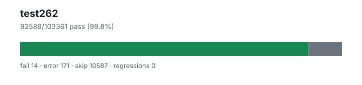

# test262 — `1.4.1+20260716.b8b6531`

- Image digest: `3d3ea83ed6403be11d119eb0234efa699809d81a801986659790996c18306a06`
- Suite version: `de8e621cdba4f40cff3cf244e6cfb8cb48746b4a`
- Ran: 2026-07-17T20:46:27.847Z → 2026-07-17T21:06:56.786Z

## Summary

**Pass rate: 92589/103361 (99.80%)**

| pass | fail | error | skip | regressions | new passes |
|---:|---:|---:|---:|---:|---:|
| 92589 | 14 | 171 | 10587 | 0 | 0 |
