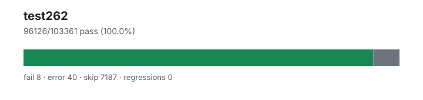

# test262 — `1.4.2+20260802.a0d5a22`

- Image digest: `unknown`
- Suite version: `de8e621cdba4f40cff3cf244e6cfb8cb48746b4a`
- Ran: 2026-08-02T08:50:47.122Z → 2026-08-02T09:13:20.337Z

## Summary

**Pass rate: 96126/103361 (99.95%)**

| pass | fail | error | skip | regressions | new passes |
|---:|---:|---:|---:|---:|---:|
| 96126 | 8 | 40 | 7187 | 0 | 0 |
