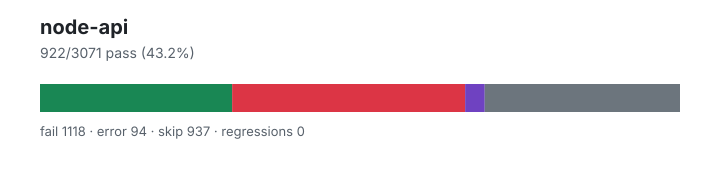

# node-api — `1.4.2+7b76e7355`

- Image digest: `435f8c409bd430f936a3dcf635f6db1b0c70e834ac22a7fdfe58ec62b7734ee6`
- Suite version: `ed33ae74ad100a38df41edf56f6935c78821e779`
- Ran: 2026-08-08T12:56:56.950Z → 2026-08-08T13:01:45.049Z

## Summary

**Pass rate: 922/3071 (43.21%)**

| pass | fail | error | skip | regressions | new passes |
|---:|---:|---:|---:|---:|---:|
| 922 | 1118 | 94 | 937 | 0 | 44 |

## Observed cases (2134)

- `test/parallel/test-assert-fail.js` — fail — TAP version 13
# Subtest: No args
ok 1 - No args
# Subtest: One arg = message
ok 2 - One arg = message
# Subtest: One arg = Error
not ok 3 - One arg = Error
  ---
  duration_ms: 1
  failureType: 'testCodeFailure'
  error: "Got unwanted exception: undefined"
  code: 'ERR_ASSERTION'
  ...
# Subtest: Object prototype get
ok 4 - Object prototype get
1..4
# tests 4
# suites 0
# pass 3
# fail 1
# cancelled 0
# skipped 0
# todo 0
# duration_ms 11
- `test/parallel/test-assert-checktag.js` — fail — TAP version 13
# Subtest: [object Object]
not ok 1 - [object Object]
  ---
  duration_ms: 39
  failureType: 'testCodeFailure'
  error: "Date(2016-01-01T00:00:00.000Z) notDeepEqual {}"
  code: 'ERR_ASSERTION'
  ...
1..1
# tests 1
# suites 0
# pass 0
# fail 1
# cancelled 0
# skipped 0
# todo 0
# duration_ms 42
- `test/parallel/test-assert-deep-with-error.js` — fail — TAP version 13
# Subtest: Handle error causes
not ok 1 - Handle error causes
  ---
  duration_ms: 4
  failureType: 'testCodeFailure'
  error: "Missing expected exception."
  code: 'ERR_ASSERTION'
  ...
# Subtest: Handle undefined causes
not ok 2 - Handle undefined causes
  ---
  duration_ms: 0
  failureType: 'testCodeFailure'
  error: "a notDeepStrictEqual a"
  code: 'ERR_ASSERTION'
  ...
1..2
# tests 2
# suites 0
# pass 0
# fail 2
# cancelled 0
# skipped 0
# todo 0
# duration_ms 8
- `test/parallel/test-async-hooks-async-await.js` — fail — Uncaught (in promise) TypeError: Cannot read property '1' of undefined
- `test/parallel/test-async-hooks-enable-during-promise.js` — fail — Mismatched noop function calls. Expected exactly 1, actual 0.
    at Proxy.mustCall (/work/.harness/work/node-api/node-api-overlay/test/common/index.js:531:10)
    at test-async-hooks-enable-during-promise.js:7:18
    at _return (/work/.harness/work/node-api/node-api-overlay/test/common/index.js:573:12)
Mismatched noop function calls. Expected at least 1, actual 0.
    at Proxy.mustCallAtLeast (/work/.harness/work/node-api/node-api-overlay/test/common/index.js:543:10)
    at test-async-hooks-enable-during-promise.js:8:20
    at _return (/work/.harness/work/node-api/node-api-overlay/test/common/index.js:573:12)
Mismatched noop function calls. Expected at least 2, actual 0.
    at Proxy.mustCallAtLeast (/work/.harness/work/node-api/node-api-overlay/test/common/index.js:543:10)
    at test-async-hooks-enable-during-promise.js:9:19
    at _return (/work/.harness/work/node-api/node-api-overlay/test/common/index.js:573:12)
- `test/parallel/test-assert-class-destructuring.js` — fail — TAP version 13
# Subtest: Assert class destructuring behavior - diff option
not ok 1 - Assert class destructuring behavior - diff option
  ---
  duration_ms: 1
  failureType: 'testCodeFailure'
  error: "Assert is not a constructor"
  code: 'ERR_TEST_FAILURE'
  ...
# Subtest: Assert class destructuring behavior - strict option
not ok 2 - Assert class destructuring behavior - strict option
  ---
  duration_ms: 1
  failureType: 'testCodeFailure'
  error: "Assert is not a constructor"
  code: 'ERR_TEST_FAILURE'
  ...
# Subtest: Assert class destructuring behavior - comprehensive methods
not ok 3 - Assert class destructuring behavior - comprehensive methods
  ---
  duration_ms: 0
  failureType: 'testCodeFailure'
  error: "Assert is not a constructor"
  code: 'ERR_TEST_FAILURE'
  ...
1..3
# tests 3
# suites 0
# pass 0
# fail 3
# cancelled 0
# skipped 0
# todo 0
# duration_ms 3
- `test/parallel/test-assert-if-error.js` — fail — TAP version 13
# Subtest: Test that assert.ifError has the correct stack trace of both stacks
ok 1 - Test that assert.ifError has the correct stack trace of both stacks
# Subtest: General ifError tests
not ok 2 - General ifError tests
  ---
  duration_ms: 9
  failureType: 'testCodeFailure'
  error: "Got unwanted exception: ifError got unwanted exception: { constructor: null, message: '' }"
  code: 'ERR_ASSERTION'
  ...
# Subtest: Should not throw
ok 3 - Should not throw
# Subtest: https://github.com/nodejs/node-v0.x-archive/issues/2893
not ok 4 - https://github.com/nodejs/node-v0.x-archive/issues/2893
  ---
  duration_ms: 1
  failureType: 'testCodeFailure'
  error: "false == true"
  code: 'ERR_ASSERTION'
  ...
1..4
# tests 4
# suites 0
# pass 2
# fail 2
# cancelled 0
# skipped 0
# todo 0
# duration_ms 19
- `test/parallel/test-async-hooks-enable-recursive.js` — fail — Mismatched noop function calls. Expected exactly 1, actual 0.
    at Proxy.mustCall (/work/.harness/work/node-api/node-api-overlay/test/common/index.js:531:10)
    at test-async-hooks-enable-recursive.js:8:16
    at test-async-hooks-enable-recursive.js:1:1
Mismatched <anonymous> function calls. Expected exactly 2, actual 0.
    at Proxy.mustCall (/work/.harness/work/node-api/node-api-overlay/test/common/index.js:531:10)
    at test-async-hooks-enable-recursive.js:12:16
    at test-async-hooks-enable-recursive.js:1:1
- `test/parallel/test-async-hooks-disable-gc-tracking.js` — fail — TypeError: (intermediate value).gc is not a function
    at Immediate.<anonymous> (test-async-hooks-disable-gc-tracking.js:17:14)
    at TypeError.get stack (native)
- `test/parallel/test-assert-first-line.js` — fail — TAP version 13
# Subtest: Verify that asserting in the very first line produces the expected result
not ok 1 - Verify that asserting in the very first line produces the expected result
  ---
  duration_ms: 5
  failureType: 'testCodeFailure'
  error: "Got unwanted exception: '' == true"
  code: 'ERR_ASSERTION'
  ...
1..1
# tests 1
# suites 0
# pass 0
# fail 1
# cancelled 0
# skipped 0
# todo 0
# duration_ms 11
- `test/parallel/test-assert-async.js` — fail — Uncaught (in promise) AssertionError: Got rejection that did not match expected: AssertionError: Failed
- `test/parallel/test-async-hooks-close-during-destroy.js` — fail — Mismatched <anonymous> function calls. Expected at least 2, actual 0.
    at Proxy.mustCallAtLeast (/work/.harness/work/node-api/node-api-overlay/test/common/index.js:543:10)
    at test-async-hooks-close-during-destroy.js:14:16
    at test-async-hooks-close-during-destroy.js:1:1
Mismatched <anonymous> function calls. Expected at least 2, actual 0.
    at Proxy.mustCallAtLeast (/work/.harness/work/node-api/node-api-overlay/test/common/index.js:543:10)
    at test-async-hooks-close-during-destroy.js:18:19
    at test-async-hooks-close-during-destroy.js:1:1
- `test/parallel/test-async-hooks-disable-during-promise.js` — fail — Mismatched noop function calls. Expected exactly 2, actual 0.
    at Proxy.mustCall (/work/.harness/work/node-api/node-api-overlay/test/common/index.js:531:10)
    at test-async-hooks-disable-during-promise.js:11:16
    at test-async-hooks-disable-during-promise.js:1:1
Mismatched noop function calls. Expected exactly 1, actual 0.
    at Proxy.mustCall (/work/.harness/work/node-api/node-api-overlay/test/common/index.js:531:10)
    at test-async-hooks-disable-during-promise.js:12:18
    at test-async-hooks-disable-during-promise.js:1:1
- `test/parallel/test-async-hooks-enable-before-promise-resolve.js` — fail — Uncaught (in promise) AssertionError: 1 !== 1
- `test/parallel/test-async-hooks-destroy-on-gc.js` — fail — TypeError: (intermediate value).gc is not a function
    at Immediate.<anonymous> (test-async-hooks-destroy-on-gc.js:25:14)
    at Immediate._return (/work/.harness/work/node-api/node-api-overlay/test/common/index.js:573:12)
    at TypeError.get stack (native)
- `test/parallel/test-assert-esm-cjs-message-verify.js` — fail — TAP version 13
# Subtest: ensure the assert.ok throwing similar error messages for esm and cjs files
    # Subtest: should return code 1 for each command
    not ok 1 - should return code 1 for each command
      ---
      duration_ms: 83
      failureType: 'testCodeFailure'
      error: "2 === 1"
      code: 'ERR_ASSERTION'
      ...
    1..1
not ok 1 - ensure the assert.ok throwing similar error messages for esm and cjs files
  ---
  duration_ms: 84
  failureType: 'subtestsFailed'
  error: "1 subtest failed"
  code: 'ERR_TEST_FAILURE'
  ...
1..1
# tests 1
# suites 1
# pass 0
# fail 1
# cancelled 0
# skipped 0
# todo 0
# duration_ms 90
- `test/parallel/test-assert-class.js` — fail — TAP version 13
# Subtest: Assert constructor requires new
not ok 1 - Assert constructor requires new
  ---
  duration_ms: 2
  failureType: 'testCodeFailure'
  error: "Got unwanted exception: Assert is not a function"
  code: 'ERR_ASSERTION'
  ...
# Subtest: Assert class non strict
not ok 2 - Assert class non strict
  ---
  duration_ms: 1
  failureType: 'testCodeFailure'
  error: "Assert is not a constructor"
  code: 'ERR_TEST_FAILURE'
  ...
# Subtest: Assert class strict
not ok 3 - Assert class strict
  ---
  duration_ms: 0
  failureType: 'testCodeFailure'
  error: "Assert is not a constructor"
  code: 'ERR_TEST_FAILURE'
  ...
# Subtest: Assert class with invalid diff option
not ok 4 - Assert class with invalid diff option
  ---
  duration_ms: 0
  failureType: 'testCodeFailure'
  error: "Got unwanted exception: Assert is not a constructor"
  code: 'ERR_ASSERTION'
  ...
# Subtest: Assert class non strict with full diff
not ok 5 - Assert class non strict with full diff
  ---
  duration_ms: 1
  failureType: 'testCodeFailure'
  error: "Assert is not a constructor"
  code: 'ERR_TEST_FAILURE'
  ...
# Subtest: Assert class non strict with simple diff
not ok 6 - Assert class non strict with simple diff
  ---
  duration_ms: 6
  failureType: 'testCodeFailure'
  error: "Assert is not a constructor"
  code: 'ERR_TEST_FAILURE'
  ...
# Subtest: Assert class strict with skipPrototype
not ok 7 - Assert class strict with skipPrototype
  ---
  duration_ms: 1
  failureType: 'testCodeFailure'
  error: "Assert is not a constructor"
  code: 'ERR_TEST_FAILURE'
  ...
# Subtest: Assert class non strict with skipPrototype
not ok 8 - Assert class non strict with skipPrototype
  ---
  duration_ms: 0
  failureType: 'testCodeFailure'
  error: "Assert is not a constructor"
  code: 'ERR_TEST_FAILURE'
  ...
# Subtest: Assert class skipPrototype with complex objects
not ok 9 - Assert class skipPrototype with complex objects
  ---
  duration_ms: 0
  failureType: 'testCodeFailure'
  error: "Assert is not a constructor"
  code: 'ERR_TEST_FAILURE'
  ...
# Subtest: Assert class skipPrototype with arrays and special objects
not ok 10 - Assert class skipPrototype with arrays and special objects
  ---
  duration_ms: 0
  failureType: 'testCodeFailure'
  error: "Assert is not a constructor"
  code: 'ERR_TEST_FAILURE'
  ...
# Subtest: Assert class skipPrototype with notDeepStrictEqual
not ok 11 - Assert class skipPrototype with notDeepStrictEqual
  ---
  duration_ms: 0
  failureType: 'testCodeFailure'
  error: "Assert is not a constructor"
  code: 'ERR_TEST_FAILURE'
  ...
# Subtest: Assert class skipPrototype with mixed types
not ok 12 - Assert class skipPrototype with mixed types
  ---
  duration_ms: 0
  failureType: 'testCodeFailure'
  error: "Assert is not a constructor"
  code: 'ERR_TEST_FAILURE'
  ...
1..12
# tests 12
# suites 0
# pass 0
# fail 12
# cancelled 0
# skipped 0
# todo 0
# duration_ms 19
- `test/parallel/test-assert-partial-deep-equal.js` — fail — TypeError: function runInNewContext() { [native code] } is not a constructor
    at :=> (test-assert-partial-deep-equal.js:320:19)
    at :=> (test-assert-partial-deep-equal.js:42:5)
    at :=> (test-assert-partial-deep-equal.js:41:3)
    at :anonymous (test-assert-partial-deep-equal.js:40:1)
    at :program (test-assert-partial-deep-equal.js:1:1)
- `test/parallel/test-async-hooks-constructor.js` — pass
- `test/parallel/test-async-hooks-correctly-switch-promise-hook.js` — pass
- `test/parallel/test-async-hooks-asyncresource-constructor.js` — pass
- `test/parallel/test-async-hooks-enable-disable-enable.js` — fail — Uncaught (in promise) AssertionError: 1 !== 1
- `test/parallel/test-async-hooks-enable-disable.js` — fail — Mismatched noop function calls. Expected exactly 1, actual 0.
    at Proxy.mustCall (/work/.harness/work/node-api/node-api-overlay/test/common/index.js:531:10)
    at test-async-hooks-enable-disable.js:7:16
    at test-async-hooks-enable-disable.js:1:1
- `test/parallel/test-assert.js` — fail — TAP version 13
# Subtest: some basics
ok 1 - some basics
# Subtest: Throw message if the message is instanceof Error
ok 2 - Throw message if the message is instanceof Error
# Subtest: Errors created in different contexts are handled as any other custom error
not ok 3 - Errors created in different contexts are handled as any other custom error
  ---
  duration_ms: 1
  failureType: 'testCodeFailure'
  error: "Got unwanted exception: false == true"
  code: 'ERR_ASSERTION'
  ...
# Subtest: assert.throws()
not ok 4 - assert.throws()
  ---
  duration_ms: 1
  failureType: 'testCodeFailure'
  error: "Got unwanted exception: 2 !== 2"
  code: 'ERR_ASSERTION'
  ...
# Subtest: Check messages from assert.throws()
not ok 5 - Check messages from assert.throws()
  ---
  duration_ms: 1
  failureType: 'testCodeFailure'
  error: "Got unwanted exception: Missing expected exception."
  code: 'ERR_ASSERTION'
  ...
# Subtest: Test assertion messages
not ok 6 - Test assertion messages
  ---
  duration_ms: 1
  failureType: 'testCodeFailure'
  error: "Got unwanted exception: null === ''"
  code: 'ERR_ASSERTION'
  ...
# Subtest: Custom errors
not ok 7 - Custom errors
  ---
  duration_ms: 0
  failureType: 'testCodeFailure'
  error: "1 === 2 === my range"
  code: 'ERR_ASSERTION'
  ...
# Subtest: Verify that throws() and doesNotThrow() throw on non-functions
not ok 8 - Verify that throws() and doesNotThrow() throw on non-functions
  ---
  duration_ms: 1
  failureType: 'testCodeFailure'
  error: "Got unwanted exception: The 'fn' argument must be a function. Received string"
  code: 'ERR_ASSERTION'
  ...
# Subtest: https://github.com/nodejs/node/issues/3275
not ok 9 - https://github.com/nodejs/node/issues/3275
  ---
  duration_ms: 0
  failureType: 'testCodeFailure'
  error: "Got unwanted exception: undefined"
  code: 'ERR_ASSERTION'
  ...
# Subtest: Long values should be truncated for display
not ok 10 - Long values should be truncated for display
  ---
  duration_ms: 2
  failureType: 'testCodeFailure'
  error: "Got unwanted exception: 'AAAAAAAAAAAAAAAAAAAAAAAAAAAAAAAAAAAAAAAAAAAAAAAAAAAAAAAAAAAAAAAAAAAAAAAAAAAAAAAAAAAAAAAAAAAAAAAAAAAAAAAAAAAAAAAAAAAAAAAAAAAAAAAAAAAAAAAAAAAAAAAAAAAAAAAAAAAAAAAAAAAAAAAAAAAAAAAAAAAAAAAAAAAAAAAAAAAAAAAAAAAAAAAAAAAAAAAAAAAAAAAAAAAAAAAAAAAAAAAAAAAAAAAAAAAAAAAAAAAAAAAAAAAAAAAAAAAAAAAAAAAAAAAAAAAAAAAAAAAAAAAAAAAAAAAAAAAAAAAAAAAAAAAAAAAAAAAAAAAAAAAAAAAAAAAAAAAAAAAAAAAAAAAAAAAAAAAAAAAAAAAAAAAAAAAAAAAAAAAAAAAAAAAAAAAAAAAAAAAAAAAAAAAAAAAAAAAAAAAAAAAAAAAAAAAAAAAAAAAAAAAAAAAAAAAAAAAAAAAAAAAAAAAAAAAAAAAAAAAAAAAAAAAAAAAAAAAAAAAAAAAAAAAAAAAAAAAAAAAAAAAAAAAAAAAAAAAAAAAAAAAAAAAAAAAAAAAAAAAAAAAAAAAAAAAAAAAAAAAAAAAAAAAAAAAAAAAAAAAAAAAAAAAAAAAAAAAAAAAAAAAAAAAAAAAAAAAAAAAAAAAAAAAAAAAAAAAAAAAAAAAAAAAAAAAAAAAAAAAAAAAAAAAAAAAAAAAAAAAAAAAAAAAAAAAAAAAAAAAAAAAAAAAAAAAAAAAAAAAAAAAAAAAAAAAAAAAAAAAAAAAAAAAAAAAAAAAAAAAAAAAAAAAAAAAAAAAAAAAAAAAAAAAAAAAAAAAAAAAAAAAAAAAAAAAAAAAAAAAAAAAAAAAAAAAAAAAAAAAAAAAAAAAAAAAAAAAAAAAAAAAAAAAAAAAAAAAAAAAAAAAAAAAAAAAAAAAAAAAAAAAAAAAAAAAAAAAAAAAAAAAAAAAAAAAAAAAAAAAAAAAAAAAAAAAAAAAAAAAA' === ''"
  code: 'ERR_ASSERTION'
  ...
# Subtest: Output that extends beyond 10 lines should also be truncated for display
not ok 11 - Output that extends beyond 10 lines should also be truncated for display
  ---
  duration_ms: 1
  failureType: 'testCodeFailure'
  error: "Got unwanted exception: 'fhqwhgads\nfhqwhgads\nfhqwhgads\nfhqwhgads\nfhqwhgads\nfhqwhgads\nfhqwhgads\nfhqwhgads\nfhqwhgads\nfhqwhgads\nfhqwhgads\nfhqwhgads\nfhqwhgads\nfhqwhgads\nfhqwhgads\n' === ''"
  code: 'ERR_ASSERTION'
  ...
# Subtest: Bad args to AssertionError constructor should throw TypeError.
not ok 12 - Bad args to AssertionError constructor should throw TypeError.
  ---
  duration_ms: 1
  failureType: 'testCodeFailure'
  error: "Missing expected exception."
  code: 'ERR_ASSERTION'
  ...
# Subtest: NaN is handled correctly
not ok 13 - NaN is handled correctly
  ---
  duration_ms: 0
  failureType: 'testCodeFailure'
  error: "NaN == NaN"
  code: 'ERR_ASSERTION'
  ...
# Subtest: Test strict assert
not ok 14 - Test strict assert
  ---
  duration_ms: 1
  failureType: 'testCodeFailure'
  error: "Got unwanted exception: undefined == true"
  code: 'ERR_ASSERTION'
  ...
# Subtest: Additional asserts
not ok 15 - Additional asserts
  ---
  duration_ms: 1
  failureType: 'testCodeFailure'
  error: "Got unwanted exception: null == true"
  code: 'ERR_ASSERTION'
  ...
# Subtest: Throws accepts objects
not ok 16 - Throws accepts objects
  ---
  duration_ms: 0
  failureType: 'testCodeFailure'
  error: "Got unwanted exception: false == true"
  code: 'ERR_ASSERTION'
  ...
# Subtest: Additional assert
not ok 17 - Additional assert
  ---
  duration_ms: 1
  failureType: 'testCodeFailure'
  error: "Missing expected exception."
  code: 'ERR_ASSERTION'
  ...
# Subtest: assert/strict exists
ok 18 - assert/strict exists
# Subtest: Printf-like format strings as error message
not ok 19 - Printf-like format strings as error message
  ---
  duration_ms: 0
  failureType: 'testCodeFailure'
  error: "Got unwanted exception: The answer to all questions is %i"
  code: 'ERR_ASSERTION'
  ...
# Subtest: Functions as error message
not ok 20 - Functions as error message
  ---
  duration_ms: 0
  failureType: 'testCodeFailure'
  error: "Got unwanted exception: 1 == 2"
  code: 'ERR_ASSERTION'
  ...
# Subtest: Ambiguous error messages fail
not ok 21 - Ambiguous error messages fail
  ---
  duration_ms: 0
  failureType: 'testCodeFailure'
  error: "Got unwanted exception: The input was expected to not match the regular expression: /foo/"
  code: 'ERR_ASSERTION'
  ...
# Subtest: Faulty message functions
not ok 22 - Faulty message functions
  ---
  duration_ms: 0
  failureType: 'testCodeFailure'
  error: "Got unwanted exception: The input was expected to not match the regular expression: /foo/"
  code: 'ERR_ASSERTION'
  ...
# Subtest: Functions as error message
not ok 23 - Functions as error message
  ---
  duration_ms: 0
  failureType: 'testCodeFailure'
  error: "Got unwanted exception: 'foo' == 'bar'"
  code: 'ERR_ASSERTION'
  ...
1..23
# tests 23
# suites 0
# pass 3
# fail 20
# cancelled 0
# skipped 0
# todo 0
# duration_ms 25
- `test/parallel/test-assert-deep.js` — fail — TAP version 13
# Subtest: deepEqual
not ok 1 - deepEqual
  ---
  duration_ms: 1
  failureType: 'testCodeFailure'
  error: "Missing expected exception."
  code: 'ERR_ASSERTION'
  ...
# Subtest: loose deepEqual
not ok 2 - loose deepEqual
  ---
  duration_ms: 2
  failureType: 'testCodeFailure'
  error: "Got unwanted exception: assert.partialDeepStrictEqual is not a function"
  code: 'ERR_ASSERTION'
  ...
# Subtest: date
not ok 3 - date
  ---
  duration_ms: 33
  failureType: 'testCodeFailure'
  error: "Missing expected exception."
  code: 'ERR_ASSERTION'
  ...
# Subtest: regexp
not ok 4 - regexp
  ---
  duration_ms: 1
  failureType: 'testCodeFailure'
  error: "Missing expected exception."
  code: 'ERR_ASSERTION'
  ...
# Subtest: deepEqual should pass for these weird cases
not ok 5 - deepEqual should pass for these weird cases
  ---
  duration_ms: 14
  failureType: 'testCodeFailure'
  error: "{ 0: 1 } notDeepEqual { 0: '1' }"
  code: 'ERR_ASSERTION'
  ...
# Subtest: es6 Maps and Sets
not ok 6 - es6 Maps and Sets
  ---
  duration_ms: 5
  failureType: 'testCodeFailure'
  error: "assert.partialDeepStrictEqual is not a function"
  code: 'ERR_TEST_FAILURE'
  ...
# Subtest: GH-6416. Make sure circular refs do not throw
not ok 7 - GH-6416. Make sure circular refs do not throw
  ---
  duration_ms: 1
  failureType: 'testCodeFailure'
  error: "assert.partialDeepStrictEqual is not a function"
  code: 'ERR_TEST_FAILURE'
  ...
# Subtest: GH-14441. Circular structures should be consistent
not ok 8 - GH-14441. Circular structures should be consistent
  ---
  duration_ms: 1
  failureType: 'testCodeFailure'
  error: "Missing expected exception."
  code: 'ERR_ASSERTION'
  ...
# Subtest: deepStrictEqual handles shared expected array elements after cycle detection
not ok 9 - deepStrictEqual handles shared expected array elements after cycle detection
  ---
  duration_ms: 1
  failureType: 'testCodeFailure'
  error: "assert.partialDeepStrictEqual is not a function"
  code: 'ERR_TEST_FAILURE'
  ...
# Subtest: deepStrictEqual handles cross-root aliases after cycle detection
not ok 10 - deepStrictEqual handles cross-root aliases after cycle detection
  ---
  duration_ms: 0
  failureType: 'testCodeFailure'
  error: "assert.partialDeepStrictEqual is not a function"
  code: 'ERR_TEST_FAILURE'
  ...
# Subtest: Ensure reflexivity of deepEqual with `arguments` objects.
not ok 11 - Ensure reflexivity of deepEqual with `arguments` objects.
  ---
  duration_ms: 1
  failureType: 'testCodeFailure'
  error: "Missing expected exception."
  code: 'ERR_ASSERTION'
  ...
# Subtest: More checking that arguments objects are handled correctly
not ok 12 - More checking that arguments objects are handled correctly
  ---
  duration_ms: 1
  failureType: 'testCodeFailure'
  error: "Missing expected exception."
  code: 'ERR_ASSERTION'
  ...
# Subtest: Handle sparse arrays
not ok 13 - Handle sparse arrays
  ---
  duration_ms: 1
  failureType: 'testCodeFailure'
  error: "assert.partialDeepStrictEqual is not a function"
  code: 'ERR_TEST_FAILURE'
  ...
# Subtest: Handle sets and maps with mixed keys
not ok 14 - Handle sets and maps with mixed keys
  ---
  duration_ms: 2
  failureType: 'testCodeFailure'
  error: "Got unwanted exception: {} deepEqual {}"
  code: 'ERR_ASSERTION'
  ...
# Subtest: Handle different error messages
not ok 15 - Handle different error messages
  ---
  duration_ms: 2
  failureType: 'testCodeFailure'
  error: "Got unwanted exception: assert.partialDeepStrictEqual is not a function"
  code: 'ERR_ASSERTION'
  ...
# Subtest: Handle NaN
not ok 16 - Handle NaN
  ---
  duration_ms: 1
  failureType: 'testCodeFailure'
  error: "NaN deepEqual NaN"
  code: 'ERR_ASSERTION'
  ...
# Subtest: Handle boxed primitives
not ok 17 - Handle boxed primitives
  ---
  duration_ms: 0
  failureType: 'testCodeFailure'
  error: "Missing expected exception."
  code: 'ERR_ASSERTION'
  ...
# Subtest: Minus zero
not ok 18 - Minus zero
  ---
  duration_ms: 1
  failureType: 'testCodeFailure'
  error: "Missing expected exception."
  code: 'ERR_ASSERTION'
  ...
# Subtest: Handle symbols (enumerable only)
not ok 19 - Handle symbols (enumerable only)
  ---
  duration_ms: 1
  failureType: 'testCodeFailure'
  error: "Missing expected exception."
  code: 'ERR_ASSERTION'
  ...
# Subtest: Additional tests
not ok 20 - Additional tests
  ---
  duration_ms: 0
  failureType: 'testCodeFailure'
  error: "Got unwanted exception: 1 notDeepEqual true"
  code: 'ERR_ASSERTION'
  ...
# Subtest: Having the same number of owned properties && the same set of keys
not ok 21 - Having the same number of owned properties && the same set of keys
  ---
  duration_ms: 0
  failureType: 'testCodeFailure'
  error: "['a'] notDeepEqual { 0: 'a' }"
  code: 'ERR_ASSERTION'
  ...
# Subtest: Having an identical prototype property
ok 22 - Having an identical prototype property
# Subtest: Primitives
not ok 23 - Primitives
  ---
  duration_ms: 1
  failureType: 'testCodeFailure'
  error: "Got unwanted exception: null deepEqual {}"
  code: 'ERR_ASSERTION'
  ...
# Subtest: Additional tests
not ok 24 - Additional tests
  ---
  duration_ms: 1
  failureType: 'testCodeFailure'
  error: "Got unwanted exception: { a: 1 } deepEqual { b: 1 }"
  code: 'ERR_ASSERTION'
  ...
# Subtest: Having the same number of owned properties && the same set of keys
not ok 25 - Having the same number of owned properties && the same set of keys
  ---
  duration_ms: 1
  failureType: 'testCodeFailure'
  error: "Got unwanted exception: [4] deepStrictEqual ['4']"
  code: 'ERR_ASSERTION'
  ...
# Subtest: Prototype check
not ok 26 - Prototype check
  ---
  duration_ms: 0
  failureType: 'testCodeFailure'
  error: "Missing expected exception."
  code: 'ERR_ASSERTION'
  ...
# Subtest: Check extra properties on errors
not ok 27 - Check extra properties on errors
  ---
  duration_ms: 1
  failureType: 'testCodeFailure'
  error: "Got unwanted exception: Missing expected exception."
  code: 'ERR_ASSERTION'
  ...
# Subtest: Check proxies
not ok 28 - Check proxies
  ---
  duration_ms: 0
  failureType: 'testCodeFailure'
  error: "{ 0: 1, 1: 2 } deepStrictEqual [1, 2]"
  code: 'ERR_ASSERTION'
  ...
# Subtest: Strict equal with identical objects that are not identical by reference and longer than 50 elements
not ok 29 - Strict equal with identical objects that are not identical by reference and longer than 50 elements
  ---
  duration_ms: 1
  failureType: 'testCodeFailure'
  error: "Got unwanted exception: { symbol0: Symbol(), symbol1: Symbol(), symbol2: Symbol(), symbol3: Symbol(), symbol4: Symbol(), … } deepStrictEqual { symbol0: Symbol(), symbol1: Symbol(), symbol2: Symbol(), symbol3: Symbol(), symbol4: Symbol(), … }"
  code: 'ERR_ASSERTION'
  ...
# Subtest: Basic valueOf check
not ok 30 - Basic valueOf check
  ---
  duration_ms: 0
  failureType: 'testCodeFailure'
  error: "Got unwanted exception: { 0: '1', valueOf: undefined } deepEqual { 0: '1' }"
  code: 'ERR_ASSERTION'
  ...
# Subtest: Basic array out of bounds check
not ok 31 - Basic array out of bounds check
  ---
  duration_ms: 0
  failureType: 'testCodeFailure'
  error: "Missing expected exception."
  code: 'ERR_ASSERTION'
  ...
# Subtest: Verify that manipulating the `getTime()` function has no impact on the time verification.
not ok 32 - Verify that manipulating the `getTime()` function has no impact on the time verification.
  ---
  duration_ms: 0
  failureType: 'testCodeFailure'
  error: "Date(2000-01-01T00:00:00.000Z) deepEqual Date(2000-01-01T00:00:00.000Z)"
  code: 'ERR_ASSERTION'
  ...
# Subtest: Verify that an array and the equivalent fake array object are correctly compared
not ok 33 - Verify that an array and the equivalent fake array object are correctly compared
  ---
  duration_ms: 2
  failureType: 'testCodeFailure'
  error: "Missing expected exception."
  code: 'ERR_ASSERTION'
  ...
# Subtest: Verify that extra keys will be tested for when using fake arrays
not ok 34 - Verify that extra keys will be tested for when using fake arrays
  ---
  duration_ms: 8
  failureType: 'testCodeFailure'
  error: "Got unwanted exception: { 0: 1, 1: 1, 2: 'broken' } deepEqual [1, 1]"
  code: 'ERR_ASSERTION'
  ...
# Subtest: Verify that changed tags will still check for the error message
not ok 35 - Verify that changed tags will still check for the error message
  ---
  duration_ms: 1
  failureType: 'testCodeFailure'
  error: "Got unwanted exception: assert.partialDeepStrictEqual is not a function"
  code: 'ERR_ASSERTION'
  ...
# Subtest: Check for non-native errors
not ok 36 - Check for non-native errors
  ---
  duration_ms: 4
  failureType: 'testCodeFailure'
  error: "{} notDeepStrictEqual {}"
  code: 'ERR_ASSERTION'
  ...
# Subtest: Check for Errors with cause property
not ok 37 - Check for Errors with cause property
  ---
  duration_ms: 1
  failureType: 'testCodeFailure'
  error: "Missing expected exception."
  code: 'ERR_ASSERTION'
  ...
# Subtest: Check for AggregateError
not ok 38 - Check for AggregateError
  ---
  duration_ms: 9
  failureType: 'testCodeFailure'
  error: "Got unwanted exception: assert.partialDeepStrictEqual is not a function"
  code: 'ERR_ASSERTION'
  ...
# Subtest: Verify that `valueOf` is not called for boxed primitives
not ok 39 - Verify that `valueOf` is not called for boxed primitives
  ---
  duration_ms: 1
  failureType: 'testCodeFailure'
  error: "assert.partialDeepStrictEqual is not a function"
  code: 'ERR_TEST_FAILURE'
  ...
# Subtest: Check getters
not ok 40 - Check getters
  ---
  duration_ms: 0
  failureType: 'testCodeFailure'
  error: "Got unwanted exception: { a: 5 } deepStrictEqual { a: 6 }"
  code: 'ERR_ASSERTION'
  ...
# Subtest: Verify object types being identical on both sides
not ok 41 - Verify object types being identical on both sides
  ---
  duration_ms: 1
  failureType: 'testCodeFailure'
  error: "Missing expected exception."
  code: 'ERR_ASSERTION'
  ...
# Subtest: Verify commutativity
not ok 42 - Verify commutativity
  ---
  duration_ms: 6
  failureType: 'testCodeFailure'
  error: "Got unwanted exception: { x: 1 } deepEqual { y: 1 }"
  code: 'ERR_ASSERTION'
  ...
# Subtest: Crypto
ok 43 - Crypto # SKIP
# Subtest: Comparing two identical WeakMap instances
not ok 44 - Comparing two identical WeakMap instances
  ---
  duration_ms: 0
  failureType: 'testCodeFailure'
  error: "assert.partialDeepStrictEqual is not a function"
  code: 'ERR_TEST_FAILURE'
  ...
# Subtest: Comparing two different WeakMap instances
not ok 45 - Comparing two different WeakMap instances
  ---
  duration_ms: 0
  failureType: 'testCodeFailure'
  error: "Missing expected exception."
  code: 'ERR_ASSERTION'
  ...
# Subtest: Comparing two identical WeakSet instances
not ok 46 - Comparing two identical WeakSet instances
  ---
  duration_ms: 4
  failureType: 'testCodeFailure'
  error: "assert.partialDeepStrictEqual is not a function"
  code: 'ERR_TEST_FAILURE'
  ...
# Subtest: Comparing two different WeakSet instances
not ok 47 - Comparing two different WeakSet instances
  ---
  duration_ms: 1
  failureType: 'testCodeFailure'
  error: "Missing expected exception."
  code: 'ERR_ASSERTION'
  ...
# Subtest: Comparing two arrays nested inside object, with overlapping elements
not ok 48 - Comparing two arrays nested inside object, with overlapping elements
  ---
  duration_ms: 0
  failureType: 'testCodeFailure'
  error: "Got unwanted exception: { a: { b: [1, 2, 3] } } deepStrictEqual { a: { b: [3, 4, 5] } }"
  code: 'ERR_ASSERTION'
  ...
# Subtest: Comparing two arrays nested inside object, with overlapping elements, swapping keys
not ok 49 - Comparing two arrays nested inside object, with overlapping elements, swapping keys
  ---
  duration_ms: 0
  failureType: 'testCodeFailure'
  error: "Got unwanted exception: { a: { b: [1, 2, 3], c: 2 } } deepStrictEqual { a: { b: 1, c: [3, 4, 5] } }"
  code: 'ERR_ASSERTION'
  ...
# Subtest: Detects differences in deeply nested arrays instead of seeing a new object
not ok 50 - Detects differences in deeply nested arrays instead of seeing a new object
  ---
  duration_ms: 0
  failureType: 'testCodeFailure'
  error: "Got unwanted exception: [{ a: 1 }, 2, 3, 4, { c: [1, 2, 3] }] deepStrictEqual [{ a: 1 }, 2, 3, 4, { c: [3, 4, 5] }]"
  code: 'ERR_ASSERTION'
  ...
# Subtest: URLs
not ok 51 - URLs
  ---
  duration_ms: 5
  failureType: 'testCodeFailure'
  error: "Missing expected exception."
  code: 'ERR_ASSERTION'
  ...
# Subtest: Own property constructor properties should check against the original prototype
not ok 52 - Own property constructor properties should check against the original prototype
  ---
  duration_ms: 1
  failureType: 'testCodeFailure'
  error: "assert.partialDeepStrictEqual is not a function"
  code: 'ERR_TEST_FAILURE'
  ...
# Subtest: Inherited null prototype without own constructor properties should check the correct prototype
not ok 53 - Inherited null prototype without own constructor properties should check the correct prototype
  ---
  duration_ms: 0
  failureType: 'testCodeFailure'
  error: "assert.partialDeepStrictEqual is not a function"
  code: 'ERR_TEST_FAILURE'
  ...
# Subtest: Promises should fail deepEqual
not ok 54 - Promises should fail deepEqual
  ---
  duration_ms: 1
  failureType: 'testCodeFailure'
  error: "assert.partialDeepStrictEqual is not a function"
  code: 'ERR_TEST_FAILURE'
  ...
1..54
# tests 54
# suites 0
# pass 1
# fail 52
# cancelled 0
# skipped 1
# todo 0
# duration_ms 141
- `test/parallel/test-async-hooks-run-in-async-scope-this-arg.js` — pass
- `test/parallel/test-async-hooks-prevent-double-destroy.js` — fail — TypeError: (intermediate value).gc is not a function
    at Immediate.<anonymous> (test-async-hooks-prevent-double-destroy.js:20:14)
    at TypeError.get stack (native)
- `test/parallel/test-async-hooks-recursive-stack-runInAsyncScope.js` — fail — AssertionError: 2 === 1
    at :=> (test-async-hooks-recursive-stack-runInAsyncScope.js:11:5)
    at _return (index.js:573:12)
    at recurse (test-async-hooks-recursive-stack-runInAsyncScope.js:10:3)
    at :anonymous (test-async-hooks-recursive-stack-runInAsyncScope.js:20:1)
    at :program (test-async-hooks-recursive-stack-runInAsyncScope.js:1:1)
- `test/parallel/test-async-hooks-execution-async-resource.js` — fail — AssertionError: { state: '/9' } deepStrictEqual { state: '/0' }
    at Function.deepStrictEqual (native)
    at Readable.<anonymous> (test-async-hooks-execution-async-resource.js:39:14)
    at Readable._return (/work/.harness/work/node-api/node-api-overlay/test/common/index.js:573:12)
    at AssertionError.get stack (native)
AssertionError: { state: '/9' } deepStrictEqual { state: '/1' }
    at Function.deepStrictEqual (native)
    at Readable.<anonymous> (test-async-hooks-execution-async-resource.js:39:14)
    at Readable._return (/work/.harness/work/node-api/node-api-overlay/test/common/index.js:573:12)
    at AssertionError.get stack (native)
AssertionError: { state: '/9' } deepStrictEqual { state: '/3' }
    at Function.deepStrictEqual (native)
    at Readable.<anonymous> (test-async-hooks-execution-async-resource.js:39:14)
    at Readable._return (/work/.harness/work/node-api/node-api-overlay/test/common/index.js:573:12)
    at AssertionError.get stack (native)
AssertionError: { state: '/9' } deepStrictEqual { state: '/2' }
    at Function.deepStrictEqual (native)
    at Readable.<anonymous> (test-async-hooks-execution-async-resource.js:39:14)
    at Readable._return (/work/.harness/work/node-api/node-api-overlay/test/common/index.js:573:12)
    at AssertionError.get stack (native)
AssertionError: { state: '/9' } deepStrictEqual { state: '/4' }
    at Function.deepStrictEqual (native)
    at Readable.<anonymous> (test-async-hooks-execution-async-resource.js:39:14)
    at Readable._return (/work/.harness/work/node-api/node-api-overlay/test/common/index.js:573:12)
    at AssertionError.get stack (native)
AssertionError: { state: '/9' } deepStrictEqual { state: '/6' }
    at Function.deepStrictEqual (native)
    at Readable.<anonymous> (test-async-hooks-execution-async-resource.js:39:14)
    at Readable._return (/work/.harness/work/node-api/node-api-overlay/test/common/index.js:573:12)
    at AssertionError.get stack (native)
AssertionError: { state: '/9' } deepStrictEqual { state: '/5' }
    at Function.deepStrictEqual (native)
    at Readable.<anonymous> (test-async-hooks-execution-async-resource.js:39:14)
    at Readable._return (/work/.harness/work/node-api/node-api-overlay/test/common/index.js:573:12)
    at AssertionError.get stack (native)
AssertionError: { state: '/9' } deepStrictEqual { state: '/8' }
    at Function.deepStrictEqual (native)
    at Readable.<anonymous> (test-async-hooks-execution-async-resource.js:39:14)
    at Readable._return (/work/.harness/work/node-api/node-api-overlay/test/common/index.js:573:12)
    at AssertionError.get stack (native)
AssertionError: { state: '/9' } deepStrictEqual { state: '/7' }
    at Function.deepStrictEqual (native)
    at Readable.<anonymous> (test-async-hooks-execution-async-resource.js:39:14)
    at Readable._return (/work/.harness/work/node-api/node-api-overlay/test/common/index.js:573:12)
    at AssertionError.get stack (native)
- `test/parallel/test-async-hooks-worker-asyncfn-terminate-3.js` — pass
- `test/parallel/test-async-hooks-promise-triggerid.js` — fail — Uncaught (in promise) AssertionError: 1 === undefined
- `test/parallel/test-async-hooks-run-in-async-scope-caught-exception.js` — pass
- `test/parallel/test-async-hooks-top-level-clearimmediate.js` — fail — AssertionError: function should not have been called at test-async-hooks-top-level-clearimmediate.js:30
    at Function.fail (native)
    at Immediate.mustNotCall (/work/.harness/work/node-api/node-api-overlay/test/common/index.js:631:12)
    at AssertionError.get stack (native)
AssertionError: { _idleNext: null, _idlePrev: null, _onImmediate: {}, _argv: [], _destroyed: false } === undefined
    at :anonymous (test-async-hooks-top-level-clearimmediate.js:31:1)
    at :program (test-async-hooks-top-level-clearimmediate.js:1:1)
- `test/parallel/test-async-local-storage-bind.js` — fail — AssertionError: Missing expected exception.
    at :=> (test-async-local-storage-bind.js:8:3)
    at :anonymous (test-async-local-storage-bind.js:7:1)
    at :program (test-async-local-storage-bind.js:1:1)
- `test/parallel/test-async-hooks-vm-gc.js` — pass
- `test/parallel/test-async-local-storage-enter-with.js` — fail — Uncaught (in promise) AssertionError: 'inside then' === undefined
- `test/parallel/test-async-hooks-promise-enable-disable.js` — pass
- `test/parallel/test-async-local-storage-snapshot.js` — pass
- `test/parallel/test-async-hooks-promise.js` — fail — TypeError: Cannot read property 'triggerId' of undefined
    at :anonymous (test-async-hooks-promise.js:28:20)
    at :program (test-async-hooks-promise.js:1:1)
- `test/parallel/test-async-local-storage-deep-stack.js` — pass
- `test/parallel/test-async-local-storage-exit-does-not-leak.js` — pass
- `test/parallel/test-async-hooks-fatal-error.js` — fail — AssertionError: init
    at main (test-async-hooks-fatal-error.js:48:7)
    at :anonymous (test-async-hooks-fatal-error.js:10:3)
    at :program (test-async-hooks-fatal-error.js:1:1)
- `test/parallel/test-async-hooks-worker-asyncfn-terminate-4.js` — pass
- `test/parallel/test-async-local-storage-isolation.js` — pass
- `test/parallel/test-async-hooks-worker-asyncfn-terminate-2.js` — pass
- `test/parallel/test-async-local-storage-contexts.js` — pass
- `test/parallel/test-async-hooks-worker-asyncfn-terminate-1.js` — pass
- `test/parallel/test-async-local-storage-http-agent.js` — fail — AssertionError: undefined === 'first'
    at Function.strictEqual (native)
    at Writable.<anonymous> (test-async-local-storage-http-agent.js:39:14)
    at Writable._return (/work/.harness/work/node-api/node-api-overlay/test/common/index.js:573:12)
    at Writable.emit (native)
    at Duplex.push (native)
- `test/parallel/test-async-wrap-promise-after-enabled.js` — fail — AssertionError: ['then'] deepStrictEqual ['before', 'then', 'after']
    at Function.deepStrictEqual (native)
    at Immediate.<anonymous> (test-async-wrap-promise-after-enabled.js:36:10)
    at Immediate._return (/work/.harness/work/node-api/node-api-overlay/test/common/index.js:573:12)
    at AssertionError.get stack (native)
- `test/parallel/test-async-local-storage-run-scope.js` — fail — TypeError: storage.withScope is not a function
    at :anonymous (test-async-local-storage-run-scope.js:14:19)
    at :program (test-async-local-storage-run-scope.js:1:1)
- `test/parallel/test-async-wrap-constructor.js` — pass
- `test/parallel/test-buffer-ascii.js` — pass
- `test/parallel/test-buffer-alloc.js` — fail — (node:761) [DEP0005] DeprecationWarning: Buffer() is deprecated due to security and usability issues. Please use the Buffer.alloc(), Buffer.allocUnsafe(), or Buffer.from() methods instead.
AssertionError: 5 === 4
    at :=> (test-buffer-alloc.js:293:5)
    at :anonymous (test-buffer-alloc.js:273:1)
    at :program (test-buffer-alloc.js:1:1)
- `test/parallel/test-async-hooks-stack-overflow.js` — pass
- `test/parallel/test-buffer-arraybuffer.js` — fail — AssertionError: {} === {}
    at :anonymous (test-buffer-arraybuffer.js:16:1)
    at :program (test-buffer-arraybuffer.js:1:1)
- `test/parallel/test-buffer-bigint64.js` — pass
- `test/parallel/test-buffer-compare-offset.js` — fail — RangeError: The value of "targetStart" is out of range. It must be >= 0 and <= 10. Received 255
    at :anonymous (test-buffer-compare-offset.js:70:20)
    at :program (test-buffer-compare-offset.js:1:1)
- `test/parallel/test-buffer-constructor-deprecation-error.js` — pass
- `test/parallel/test-async-wrap-pop-id-during-load.js` — fail — AssertionError: EXIT CODE: 2, STDERR: error: unexpected argument '--unhandled-rejections' found    tip: to pass '--unhandled-rejections' as a value, use '-- --unhandled-rejections'  Usage: elide [OPTIONS] [FILE] [-- <SCRIPT_ARGS>...] [COMMAND]  For more information, try '--help'.
    at :anonymous (test-async-wrap-pop-id-during-load.js:21:1)
    at :program (test-async-wrap-pop-id-during-load.js:1:1)
- `test/parallel/test-buffer-badhex.js` — pass
- `test/parallel/test-async-wrap-trigger-id.js` — fail — AssertionError: 0 !== 0
    at Function.notStrictEqual (native)
    at test-async-wrap-trigger-id.js:16:12
    at AssertionError.get stack (native)
- `test/parallel/test-buffer-concat.js` — fail — AssertionError: Got unwanted exception: The "list[0]" argument must be an instance of Buffer or Uint8Array. Received type number (104)
    at :=> (test-buffer-concat.js:49:3)
    at :anonymous (test-buffer-concat.js:48:1)
    at :program (test-buffer-concat.js:1:1)
- `test/parallel/test-buffer-bytelength.js` — fail — (node:873) [DEP0005] DeprecationWarning: Buffer() is deprecated due to security and usability issues. Please use the Buffer.alloc(), Buffer.allocUnsafe(), or Buffer.from() methods instead.
AssertionError: 2 === 3
    at :anonymous (test-buffer-bytelength.js:101:1)
    at :program (test-buffer-bytelength.js:1:1)
- `test/parallel/test-async-hooks-stack-overflow-try-catch.js` — pass
- `test/parallel/test-buffer-constructor-node-modules-paths.js` — fail — AssertionError: 'Error: Usage: 'elide <script>' or 'elide run <script>'; see --help' === ''
    at test (test-buffer-constructor-node-modules-paths.js:20:5)
    at :anonymous (test-buffer-constructor-node-modules-paths.js:23:1)
    at :program (test-buffer-constructor-node-modules-paths.js:1:1)
- `test/parallel/test-buffer-compare.js` — fail — AssertionError: Got unwanted exception: The "b" argument must be an instance of Buffer or Uint8Array. Received type string ('abc')
    at :anonymous (test-buffer-compare.js:31:1)
    at :program (test-buffer-compare.js:1:1)
- `test/parallel/test-buffer-copy-immutable.js` — fail — AssertionError: 8 === 0
    at :anonymous (test-buffer-copy-immutable.js:19:3)
    at :program (test-buffer-copy-immutable.js:1:1)
- `test/parallel/test-async-hooks-stack-overflow-nested-async.js` — pass
- `test/parallel/test-buffer-constructor-outside-node-modules.js` — fail — (node:1098) [DEP0005] DeprecationWarning: Buffer() is deprecated due to security and usability issues. Please use the Buffer.alloc(), Buffer.allocUnsafe(), or Buffer.from() methods instead.
AssertionError: DeprecationWarning: Buffer() is deprecated due to security and usability issues. Please use the Buffer.alloc(), Buffer.allocUnsafe(), or Buffer.from() methods instead.
    at Error.get stack (native)
    at Process.<anonymous> (test-buffer-constructor-outside-node-modules.js:18:10)
    at Process._return (/work/.harness/work/node-api/node-api-overlay/test/common/index.js:573:12)
    at ok (native)
    at Process.<anonymous> (test-buffer-constructor-outside-node-modules.js:18:3)
    at Process._return (/work/.harness/work/node-api/node-api-overlay/test/common/index.js:573:12)
    at AssertionError.get stack (native)
- `test/parallel/test-buffer-fakes.js` — pass
- `test/parallel/test-buffer-failed-alloc-typed-arrays.js` — pass
- `test/parallel/test-buffer-equals.js` — pass
- `test/parallel/test-buffer-constructor-node-modules.js` — fail — [process 1256]: --- stderr ---
(node:1256) [DEP0005] DeprecationWarning: Buffer() is deprecated due to security and usability issues. Please use the Buffer.alloc(), Buffer.allocUnsafe(), or Buffer.from() methods instead.

[process 1256]: --- stdout ---

[process 1256]: status = 0, signal = null
Error: - stderr did not match ''
    at logAndThrow (child_process.js:111:5)
    at expectSyncExit (child_process.js:135:5)
    at spawnSyncAndAssert (child_process.js:155:10)
    at :anonymous (test-buffer-constructor-node-modules.js:10:1)
    at :program (test-buffer-constructor-node-modules.js:1:1)
- `test/parallel/test-buffer-copy.js` — fail — AssertionError: Got unwanted exception: receiver is not a Buffer
    at :anonymous (test-buffer-copy.js:133:1)
    at :program (test-buffer-copy.js:1:1)
- `test/parallel/test-buffer-from.js` — fail — AssertionError: Got unwanted exception: The first argument must be of type string or an instance of Buffer, ArrayBuffer, or Array or an Array-like Object. Received an instance of Object
    at :=> (test-buffer-from.js:59:3)
    at :anonymous (test-buffer-from.js:37:1)
    at :program (test-buffer-from.js:1:1)
- `test/parallel/test-buffer-isascii.js` — fail — AssertionError: Got unwanted exception: argument must be a Buffer, ArrayBuffer, TypedArray, or string
    at :=> (test-buffer-isascii.js:24:3)
    at :anonymous (test-buffer-isascii.js:14:1)
    at :program (test-buffer-isascii.js:1:1)
- `test/parallel/test-buffer-includes.js` — fail — AssertionError: false == true
    at :anonymous (test-buffer-includes.js:32:1)
    at :program (test-buffer-includes.js:1:1)
- `test/parallel/test-buffer-generic-methods.js` — fail — TypeError: receiver is not a Buffer
    at isMethod (test-buffer-generic-methods.js:101:37)
    at :anonymous (test-buffer-generic-methods.js:109:6)
    at :program (test-buffer-generic-methods.js:1:1)
- `test/parallel/test-buffer-inspect.js` — fail — AssertionError: '<Buffer 31 32 33 34>' === '<Buffer 31 32 ... 2 more bytes>'
    at :anonymous (test-buffer-inspect.js:38:1)
    at :program (test-buffer-inspect.js:1:1)
- `test/parallel/test-buffer-isencoding.js` — pass
- `test/parallel/test-buffer-indexof.js` — fail — AssertionError: -1 === 6
    at :anonymous (test-buffer-indexof.js:34:1)
    at :program (test-buffer-indexof.js:1:1)
- `test/parallel/test-buffer-pending-deprecation.js` — pass
- `test/parallel/test-assert-typedarray-deepequal.js` — fail — TAP version 13
# Subtest: equalArrayPairs
    # Subtest: 
    not ok 1 - 
      ---
      duration_ms: 101
      failureType: 'testCodeFailure'
      error: "assert.partialDeepStrictEqual is not a function"
      code: 'ERR_TEST_FAILURE'
      ...
    # Subtest: 
    not ok 2 - 
      ---
      duration_ms: 98
      failureType: 'testCodeFailure'
      error: "assert.partialDeepStrictEqual is not a function"
      code: 'ERR_TEST_FAILURE'
      ...
    # Subtest: 
    not ok 3 - 
      ---
      duration_ms: 107
      failureType: 'testCodeFailure'
      error: "assert.partialDeepStrictEqual is not a function"
      code: 'ERR_TEST_FAILURE'
      ...
    # Subtest: 
    not ok 4 - 
      ---
      duration_ms: 99
      failureType: 'testCodeFailure'
      error: "assert.partialDeepStrictEqual is not a function"
      code: 'ERR_TEST_FAILURE'
      ...
    # Subtest: 
    not ok 5 - 
      ---
      duration_ms: 72
      failureType: 'testCodeFailure'
      error: "assert.partialDeepStrictEqual is not a function"
      code: 'ERR_TEST_FAILURE'
      ...
    # Subtest: 
    not ok 6 - 
      ---
      duration_ms: 67
      failureType: 'testCodeFailure'
      error: "assert.partialDeepStrictEqual is not a function"
      code: 'ERR_TEST_FAILURE'
      ...
    # Subtest: 
    not ok 7 - 
      ---
      duration_ms: 87
      failureType: 'testCodeFailure'
      error: "assert.partialDeepStrictEqual is not a function"
      code: 'ERR_TEST_FAILURE'
      ...
    # Subtest: 
    not ok 8 - 
      ---
      duration_ms: 171
      failureType: 'testCodeFailure'
      error: "assert.partialDeepStrictEqual is not a function"
      code: 'ERR_TEST_FAILURE'
      ...
    # Subtest: 
    not ok 9 - 
      ---
      duration_ms: 237
      failureType: 'testCodeFailure'
      error: "assert.partialDeepStrictEqual is not a function"
      code: 'ERR_TEST_FAILURE'
      ...
    # Subtest: 
    not ok 10 - 
      ---
      duration_ms: 99
      failureType: 'testCodeFailure'
      error: "assert.partialDeepStrictEqual is not a function"
      code: 'ERR_TEST_FAILURE'
      ...
    # Subtest: 
    not ok 11 - 
      ---
      duration_ms: 1
      failureType: 'testCodeFailure'
      error: "assert.partialDeepStrictEqual is not a function"
      code: 'ERR_TEST_FAILURE'
      ...
    # Subtest: 
    not ok 12 - 
      ---
      duration_ms: 0
      failureType: 'testCodeFailure'
      error: "assert.partialDeepStrictEqual is not a function"
      code: 'ERR_TEST_FAILURE'
      ...
    # Subtest: 
    not ok 13 - 
      ---
      duration_ms: 0
      failureType: 'testCodeFailure'
      error: "assert.partialDeepStrictEqual is not a function"
      code: 'ERR_TEST_FAILURE'
      ...
    # Subtest: 
    not ok 14 - 
      ---
      duration_ms: 0
      failureType: 'testCodeFailure'
      error: "assert.partialDeepStrictEqual is not a function"
      code: 'ERR_TEST_FAILURE'
      ...
    # Subtest: 
    not ok 15 - 
      ---
      duration_ms: 1
      failureType: 'testCodeFailure'
      error: "assert.partialDeepStrictEqual is not a function"
      code: 'ERR_TEST_FAILURE'
      ...
    # Subtest: 
    not ok 16 - 
      ---
      duration_ms: 0
      failureType: 'testCodeFailure'
      error: "assert.partialDeepStrictEqual is not a function"
      code: 'ERR_TEST_FAILURE'
      ...
    1..16
not ok 1 - equalArrayPairs
  ---
  duration_ms: 1142
  failureType: 'subtestsFailed'
  error: "16 subtests failed"
  code: 'ERR_TEST_FAILURE'
  ...
# Subtest: looseEqualArrayPairs
    # Subtest: 
    not ok 1 - 
      ---
      duration_ms: 1
      failureType: 'testCodeFailure'
      error: "Missing expected exception."
      code: 'ERR_ASSERTION'
      ...
    # Subtest: 
    not ok 2 - 
      ---
      duration_ms: 1
      failureType: 'testCodeFailure'
      error: "Missing expected exception."
      code: 'ERR_ASSERTION'
      ...
    # Subtest: 
    not ok 3 - 
      ---
      duration_ms: 0
      failureType: 'testCodeFailure'
      error: "Missing expected exception."
      code: 'ERR_ASSERTION'
      ...
    1..3
not ok 2 - looseEqualArrayPairs
  ---
  duration_ms: 6
  failureType: 'subtestsFailed'
  error: "3 subtests failed"
  code: 'ERR_TEST_FAILURE'
  ...
# Subtest: notEqualArrayPairs
    # Subtest: 
    not ok 1 - 
      ---
      duration_ms: 1
      failureType: 'testCodeFailure'
      error: "Got unwanted exception: Cannot read property 'apply' of undefined"
      code: 'ERR_ASSERTION'
      ...
    # Subtest: 
    not ok 2 - 
      ---
      duration_ms: 0
      failureType: 'testCodeFailure'
      error: "Missing expected exception."
      code: 'ERR_ASSERTION'
      ...
    # Subtest: 
    not ok 3 - 
      ---
      duration_ms: 0
      failureType: 'testCodeFailure'
      error: "Missing expected exception."
      code: 'ERR_ASSERTION'
      ...
    # Subtest: 
    not ok 4 - 
      ---
      duration_ms: 0
      failureType: 'testCodeFailure'
      error: "Missing expected exception."
      code: 'ERR_ASSERTION'
      ...
    # Subtest: 
    not ok 5 - 
      ---
      duration_ms: 0
      failureType: 'testCodeFailure'
      error: "Got unwanted exception: Cannot read property 'apply' of undefined"
      code: 'ERR_ASSERTION'
      ...
    # Subtest: 
    not ok 6 - 
      ---
      duration_ms: 0
      failureType: 'testCodeFailure'
      error: "Got unwanted exception: Cannot read property 'apply' of undefined"
      code: 'ERR_ASSERTION'
      ...
    # Subtest: 
    not ok 7 - 
      ---
      duration_ms: 0
      failureType: 'testCodeFailure'
      error: "Got unwanted exception: Cannot read property 'apply' of undefined"
      code: 'ERR_ASSERTION'
      ...
    # Subtest: 
    not ok 8 - 
      ---
      duration_ms: 1
      failureType: 'testCodeFailure'
      error: "Got unwanted exception: Cannot read property 'apply' of undefined"
      code: 'ERR_ASSERTION'
      ...
    # Subtest: 
    not ok 9 - 
      ---
      duration_ms: 0
      failureType: 'testCodeFailure'
      error: "Got unwanted exception: Cannot read property 'apply' of undefined"
      code: 'ERR_ASSERTION'
      ...
    # Subtest: 
    not ok 10 - 
      ---
      duration_ms: 0
      failureType: 'testCodeFailure'
      error: "Got unwanted exception: Cannot read property 'apply' of undefined"
      code: 'ERR_ASSERTION'
      ...
    # Subtest: 
    not ok 11 - 
      ---
      duration_ms: 1
      failureType: 'testCodeFailure'
      error: "Got unwanted exception: Cannot read property 'apply' of undefined"
      code: 'ERR_ASSERTION'
      ...
    # Subtest: 
    not ok 12 - 
      ---
      duration_ms: 0
      failureType: 'testCodeFailure'
      error: "Got unwanted exception: Cannot read property 'apply' of undefined"
      code: 'ERR_ASSERTION'
      ...
    # Subtest: 
    not ok 13 - 
      ---
      duration_ms: 0
      failureType: 'testCodeFailure'
      error: "Got unwanted exception: Cannot read property 'apply' of undefined"
      code: 'ERR_ASSERTION'
      ...
    # Subtest: 
    not ok 14 - 
      ---
      duration_ms: 1
      failureType: 'testCodeFailure'
      error: "Got unwanted exception: Cannot read property 'apply' of undefined"
      code: 'ERR_ASSERTION'
      ...
    # Subtest: 
    not ok 15 - 
      ---
      duration_ms: 0
      failureType: 'testCodeFailure'
      error: "Got unwanted exception: Cannot read property 'apply' of undefined"
      code: 'ERR_ASSERTION'
      ...
    # Subtest: 
    not ok 16 - 
      ---
      duration_ms: 0
      failureType: 'testCodeFailure'
      error: "Got unwanted exception: Cannot read property 'apply' of undefined"
      code: 'ERR_ASSERTION'
      ...
    # Subtest: 
    not ok 17 - 
      ---
      duration_ms: 1
      failureType: 'testCodeFailure'
      error: "Got unwanted exception: Cannot read property 'apply' of undefined"
      code: 'ERR_ASSERTION'
      ...
    # Subtest: 
    not ok 18 - 
      ---
      duration_ms: 0
      failureType: 'testCodeFailure'
      error: "Got unwanted exception: Cannot read property 'apply' of undefined"
      code: 'ERR_ASSERTION'
      ...
    # Subtest: 
    not ok 19 - 
      ---
      duration_ms: 0
      failureType: 'testCodeFailure'
      error: "Missing expected exception."
      code: 'ERR_ASSERTION'
      ...
    # Subtest: 
    not ok 20 - 
      ---
      duration_ms: 0
      failureType: 'testCodeFailure'
      error: "Got unwanted exception: Cannot read property 'apply' of undefined"
      code: 'ERR_ASSERTION'
      ...
    # Subtest: 
    not ok 21 - 
      ---
      duration_ms: 0
      failureType: 'testCodeFailure'
      error: "Missing expected exception."
      code: 'ERR_ASSERTION'
      ...
    # Subtest: 
    not ok 22 - 
      ---
      duration_ms: 0
      failureType: 'testCodeFailure'
      error: "Got unwanted exception: Cannot read property 'apply' of undefined"
      code: 'ERR_ASSERTION'
      ...
    # Subtest: 
    not ok 23 - 
      ---
      duration_ms: 0
      failureType: 'testCodeFailure'
      error: "Got unwanted exception: Cannot read property 'apply' of undefined"
      code: 'ERR_ASSERTION'
      ...
    # Subtest: 
    not ok 24 - 
      ---
      duration_ms: 1
      failureType: 'testCodeFailure'
      error: "Got unwanted exception: Cannot read property 'apply' of undefined"
      code: 'ERR_ASSERTION'
      ...
    # Subtest: 
    not ok 25 - 
      ---
      duration_ms: 0
      failureType: 'testCodeFailure'
      error: "Got unwanted exception: Cannot read property 'apply' of undefined"
      code: 'ERR_ASSERTION'
      ...
    1..25
not ok 3 - notEqualArrayPairs
  ---
  duration_ms: 8
  failureType: 'subtestsFailed'
  error: "25 subtests failed"
  code: 'ERR_TEST_FAILURE'
  ...
1..3
# tests 44
# suites 3
# pass 0
# fail 44
# cancelled 0
# skipped 0
# todo 0
# duration_ms 1184
- `test/parallel/test-buffer-nopendingdep-map.js` — pass
- `test/parallel/test-buffer-inheritance.js` — pass
- `test/parallel/test-buffer-iterator.js` — pass
- `test/parallel/test-buffer-no-negative-allocation.js` — pass
- `test/parallel/test-buffer-of-no-deprecation.js` — fail — TypeError: (intermediate value).of is not a function
    at :anonymous (test-buffer-of-no-deprecation.js:7:1)
    at :program (test-buffer-of-no-deprecation.js:1:1)
- `test/parallel/test-buffer-readuint.js` — pass
- `test/parallel/test-buffer-new.js` — fail — (node:1314) [DEP0005] DeprecationWarning: Buffer() is deprecated due to security and usability issues. Please use the Buffer.alloc(), Buffer.allocUnsafe(), or Buffer.from() methods instead.
AssertionError: Missing expected exception.
    at :anonymous (test-buffer-new.js:6:1)
    at :program (test-buffer-new.js:1:1)
- `test/parallel/test-buffer-prototype-inspect.js` — pass
- `test/parallel/test-buffer-readfloat.js` — pass
- `test/parallel/test-buffer-isutf8.js` — fail — AssertionError: Got unwanted exception: argument must be a Buffer, ArrayBuffer, TypedArray, or string
    at :=> (test-buffer-isutf8.js:68:3)
    at :anonymous (test-buffer-isutf8.js:61:1)
    at :program (test-buffer-isutf8.js:1:1)
- `test/parallel/test-buffer-read.js` — pass
- `test/parallel/test-buffer-pool-untransferable.js` — fail — AssertionError: {} === {}
    at :anonymous (test-buffer-pool-untransferable.js:12:1)
    at :program (test-buffer-pool-untransferable.js:1:1)
- `test/parallel/test-buffer-readdouble.js` — pass
- `test/parallel/test-async-local-storage-http-multiclients.js` — fail — TypeError: Cannot read property 'set' of undefined
    at Writable.<anonymous> (test-async-local-storage-http-multiclients.js:36:9)
    at Writable._return (/work/.harness/work/node-api/node-api-overlay/test/common/index.js:573:12)
    at Writable.emit (native)
    at Duplex.push (native)
TypeError: Cannot read property 'set' of undefined
    at Writable.<anonymous> (test-async-local-storage-http-multiclients.js:36:9)
    at Writable._return (/work/.harness/work/node-api/node-api-overlay/test/common/index.js:573:12)
    at Writable.emit (native)
    at Duplex.push (native)
TypeError: Cannot read property 'set' of undefined
    at Writable.<anonymous> (test-async-local-storage-http-multiclients.js:36:9)
    at Writable._return (/work/.harness/work/node-api/node-api-overlay/test/common/index.js:573:12)
    at Writable.emit (native)
    at Duplex.push (native)
TypeError: Cannot read property 'set' of undefined
    at Writable.<anonymous> (test-async-local-storage-http-multiclients.js:36:9)
    at Writable._return (/work/.harness/work/node-api/node-api-overlay/test/common/index.js:573:12)
    at Writable.emit (native)
    at Duplex.push (native)
TypeError: Cannot read property 'set' of undefined
    at Writable.<anonymous> (test-async-local-storage-http-multiclients.js:36:9)
    at Writable._return (/work/.harness/work/node-api/node-api-overlay/test/common/index.js:573:12)
    at Writable.emit (native)
    at Duplex.push (native)
TypeError: Cannot read property 'set' of undefined
    at Writable.<anonymous> (test-async-local-storage-http-multiclients.js:36:9)
    at Writable._return (/work/.harness/work/node-api/node-api-overlay/test/common/index.js:573:12)
    at Writable.emit (native)
    at Duplex.push (native)
TypeError: Cannot read property 'set' of undefined
    at Writable.<anonymous> (test-async-local-storage-http-multiclients.js:36:9)
    at Writable._return (/work/.harness/work/node-api/node-api-overlay/test/common/index.js:573:12)
    at Writable.emit (native)
    at Duplex.push (native)
TypeError: Cannot read property 'set' of undefined
    at Writable.<anonymous> (test-async-local-storage-http-multiclients.js:36:9)
    at Writable._return (/work/.harness/work/node-api/node-api-overlay/test/common/index.js:573:12)
    at Writable.emit (native)
    at Duplex.push (native)
TypeError: Cannot read property 'set' of undefined
    at Writable.<anonymous> (test-async-local-storage-http-multiclients.js:36:9)
    at Writable._return (/work/.harness/work/node-api/node-api-overlay/test/common/index.js:573:12)
    at Writable.emit (native)
    at Duplex.push (native)
TypeError: Cannot read property 'set' of undefined
    at Writable.<anonymous> (test-async-local-storage-http-multiclients.js:36:9)
    at Writable._return (/work/.harness/work/node-api/node-api-overlay/test/common/index.js:573:12)
    at Writable.emit (native)
    at Duplex.push (native)
- `test/parallel/test-buffer-parent-property.js` — fail — (node:1363) [DEP0005] DeprecationWarning: Buffer() is deprecated due to security and usability issues. Please use the Buffer.alloc(), Buffer.allocUnsafe(), or Buffer.from() methods instead.
TypeError: The first argument must be of type string or an instance of Buffer, ArrayBuffer, or Array or an Array-like Object. Received undefined
    at :anonymous (test-buffer-parent-property.js:14:8)
    at :program (test-buffer-parent-property.js:1:1)
- `test/parallel/test-buffer-resizable.js` — fail — (node:1482) [DEP0005] DeprecationWarning: Buffer() is deprecated due to security and usability issues. Please use the Buffer.alloc(), Buffer.allocUnsafe(), or Buffer.from() methods instead.
- `test/parallel/test-buffer-over-max-length.js` — fail — (node:1345) [DEP0005] DeprecationWarning: Buffer() is deprecated due to security and usability issues. Please use the Buffer.alloc(), Buffer.allocUnsafe(), or Buffer.from() methods instead.
AssertionError: Got unwanted exception: Array buffer allocation failed
    at :anonymous (test-buffer-over-max-length.js:14:1)
    at :program (test-buffer-over-max-length.js:1:1)
- `test/parallel/test-buffer-safe-unsafe.js` — pass
- `test/parallel/test-buffer-sharedarraybuffer.js` — fail — TypeError: The first argument must be of type string or an instance of Buffer, ArrayBuffer, or Array or an Array-like Object. Received an instance of Object
    at :anonymous (test-buffer-sharedarraybuffer.js:27:1)
    at :program (test-buffer-sharedarraybuffer.js:1:1)
- `test/parallel/test-buffer-readint.js` — pass
- `test/parallel/test-buffer-slow.js` — fail — AssertionError: Got unwanted exception: Array buffer allocation failed
    at :anonymous (test-buffer-slow.js:52:1)
    at :program (test-buffer-slow.js:1:1)
- `test/parallel/test-buffer-set-inspect-max-bytes.js` — fail — AssertionError: Missing expected exception.
    at :anonymous (test-buffer-set-inspect-max-bytes.js:11:3)
    at :program (test-buffer-set-inspect-max-bytes.js:1:1)
- `test/parallel/test-buffer-tostring-range.js` — fail — AssertionError: 'abc' === ''
    at :anonymous (test-buffer-tostring-range.js:10:1)
    at :program (test-buffer-tostring-range.js:1:1)
- `test/parallel/test-buffer-tojson.js` — pass
- `test/parallel/test-buffer-swap-fast.js` — fail — SyntaxError: <eval>:1:0 Expected an operand but found % %PrepareFunctionForOptimization(Buffer.prototype.swap16) ^
    at :anonymous (test-buffer-swap-fast.js:34:1)
    at :program (test-buffer-swap-fast.js:1:1)
- `test/parallel/test-buffer-tostring.js` — fail — AssertionError: Got unwanted exception: Unknown encoding: 1
    at :anonymous (test-buffer-tostring.js:32:3)
    at :program (test-buffer-tostring.js:1:1)
- `test/parallel/test-buffer-slice.js` — pass
- `test/parallel/test-buffer-swap.js` — fail — AssertionError: Got unwanted exception: swap16: length must be a multiple of 2
    at :anonymous (test-buffer-swap.js:42:3)
    at :program (test-buffer-swap.js:1:1)
- `test/parallel/test-buffer-write.js` — fail — AssertionError: Got unwanted exception: The value of "offset" is out of range. It must be >= 0 and <= 9. Received -1
    at :=> (test-buffer-write.js:7:3)
    at :anonymous (test-buffer-write.js:6:1)
    at :program (test-buffer-write.js:1:1)
- `test/parallel/test-buffer-writedouble.js` — pass
- `test/parallel/test-buffer-writefloat.js` — pass
- `test/parallel/test-buffer-writeuint.js` — fail — AssertionError: {} === undefined
    at :anonymous (test-buffer-writeuint.js:228:3)
    at :program (test-buffer-writeuint.js:1:1)
- `test/parallel/test-buffer-zero-fill-cli.js` — pass
- `test/parallel/test-buffer-writeint.js` — pass
- `test/parallel/test-buffer-zero-fill.js` — pass
- `test/parallel/test-child-process-constructor.js` — fail — AssertionError: Got unwanted exception: The "options" argument must be of type object. Received Received undefined
    at :=> (test-child-process-constructor.js:13:5)
    at :anonymous (test-child-process-constructor.js:12:3)
    at :program (test-child-process-constructor.js:1:1)
- `test/parallel/test-child-process-destroy.js` — fail — Mismatched noop function calls. Expected exactly 1, actual 0.
    at Proxy.mustCall (/work/.harness/work/node-api/node-api-overlay/test/common/index.js:531:10)
    at test-child-process-destroy.js:7:29
    at test-child-process-destroy.js:1:1
- `test/parallel/test-child-process-advanced-serialization.js` — fail — AssertionError: Missing expected exception.
    at :anonymous (test-child-process-advanced-serialization.js:10:5)
    at :program (test-child-process-advanced-serialization.js:1:1)
- `test/parallel/test-child-process-cwd.js` — fail — AssertionError: 'ENOTDIR' === 'ENOENT'
    at Function.strictEqual (native)
    at EventEmitter.<anonymous> (test-child-process-cwd.js:73:14)
    at EventEmitter._return (/work/.harness/work/node-api/node-api-overlay/test/common/index.js:573:12)
    at EventEmitter.emit (native)
    at AssertionError.get stack (native)
Error: ENOTDIR, spawn 'pwd'
AssertionError: Got unwanted exception: 'undefined' === 'number'
    at :anonymous (test-child-process-cwd.js:78:3)
    at :program (test-child-process-cwd.js:1:1)
- `test/parallel/test-buffer-zero-fill-reset.js` — pass
- `test/parallel/test-child-process-can-write-to-stdout.js` — pass
- `test/parallel/test-child-process-double-pipe.js` — pass
- `test/parallel/test-child-process-default-options.js` — pass
- `test/parallel/test-child-process-detached.js` — pass
- `test/parallel/test-child-process-exec-cwd.js` — pass
- `test/parallel/test-child-process-exec-error.js` — fail — TypeError: Cannot read property 'includes' of undefined
    at child (test-child-process-exec-error.js:30:12)
    at _return (/work/.harness/work/node-api/node-api-overlay/test/common/index.js:573:12)
    at EventEmitter.emit (native)
    at TypeError.get stack (native)
TypeError: Cannot read property 'includes' of undefined
    at child (test-child-process-exec-error.js:30:12)
    at _return (/work/.harness/work/node-api/node-api-overlay/test/common/index.js:573:12)
    at EventEmitter.emit (native)
    at TypeError.get stack (native)
- `test/parallel/test-child-process-env.js` — pass
- `test/parallel/test-child-process-exec-stdout-stderr-data-string.js` — fail — AssertionError: 'object' === 'string'
    at Function.strictEqual (native)
    at Readable.<anonymous> (test-child-process-exec-stdout-stderr-data-string.js:12:10)
    at Readable._return (/work/.harness/work/node-api/node-api-overlay/test/common/index.js:573:12)
    at Readable.push (native)
    at AssertionError.get stack (native)
- `test/parallel/test-child-process-exec-env.js` — pass
- `test/parallel/test-child-process-dgram-reuseport.js` — pass
- `test/parallel/test-child-process-disconnect.js` — fail — AssertionError: Missing expected exception.
    at Function.throws (native)
    at Duplex.<anonymous> (test-child-process-disconnect.js:96:18)
    at Duplex._return (/work/.harness/work/node-api/node-api-overlay/test/common/index.js:573:12)
    at Duplex.push (native)
    at AssertionError.get stack (native)
- `test/parallel/test-child-process-advanced-serialization-splitted-length-field.js` — pass
- `test/parallel/test-child-process-execfile.js` — fail — AssertionError: 'Command failed' === 'Command failed: /opt/elide/bin/elide /work/.harness/work/node-api/node-api-overlay/test/fixtures/exit.js 42'
    at Function.strictEqual (native)
    at test-child-process-execfile.js:27:14
    at _return (/work/.harness/work/node-api/node-api-overlay/test/common/index.js:573:12)
    at EventEmitter.emit (native)
    at AssertionError.get stack (native)
AssertionError: 'Error: Command failed' === 'Error: Command failed: /opt/elide/bin/elide'
    at :=> (test-child-process-execfile.js:39:5)
    at _return (index.js:573:12)
    at :anonymous (test-child-process-execfile.js:50:3)
    at :program (test-child-process-execfile.js:1:1)
- `test/parallel/test-child-process-execFile-promisified-abortController.js` — fail — Uncaught (in promise) Error: Command failed
AssertionError: Missing expected exception.
    at :anonymous (test-child-process-execFile-promisified-abortController.js:44:3)
    at :program (test-child-process-execFile-promisified-abortController.js:1:1)
- `test/parallel/test-child-process-flush-stdio.js` — pass
- `test/parallel/test-child-process-exec-timeout-not-expired.js` — pass
- `test/parallel/test-child-process-exec-std-encoding.js` — pass
- `test/parallel/test-child-process-execfile-maxbuf.js` — pass
- `test/parallel/test-child-process-exec-maxbuf.js` — pass
- `test/parallel/test-child-process-execfilesync-maxbuf.js` — pass
- `test/parallel/test-child-process-exit-code.js` — pass
- `test/parallel/test-child-process-fork-close.js` — pass
- `test/parallel/test-child-process-exec-encoding.js` — pass
- `test/parallel/test-child-process-fork-dgram.js` — fail — TypeError: This handle type cannot be sent
    at EventEmitter.<anonymous> (test-child-process-fork-dgram.js:68:11)
    at EventEmitter.emit (native)
AssertionError: false == true
    at ok (native)
    at Process.<anonymous> (test-child-process-fork-dgram.js:104:5)
    at AssertionError.get stack (native)
- `test/parallel/test-child-process-fork-args.js` — pass
- `test/parallel/test-child-process-fork-detached.js` — pass
- `test/parallel/test-child-process-fork-exec-path.js` — fail — Error: EACCES, spawn '/work/.harness/work/node-api/node-test/.tmp.183/node-copy.exe'
- `test/parallel/test-child-process-fork-getconnections.js` — fail — TypeError: This handle type cannot be sent
    at EventEmitter.<anonymous> (test-child-process-fork-getconnections.js:71:11)
    at EventEmitter._return (/work/.harness/work/node-api/node-api-overlay/test/common/index.js:573:12)
    at EventEmitter.emit (native)
TypeError: This handle type cannot be sent
    at EventEmitter.<anonymous> (test-child-process-fork-getconnections.js:71:11)
    at EventEmitter._return (/work/.harness/work/node-api/node-api-overlay/test/common/index.js:573:12)
    at EventEmitter.emit (native)
TypeError: This handle type cannot be sent
    at EventEmitter.<anonymous> (test-child-process-fork-getconnections.js:71:11)
    at EventEmitter._return (/work/.harness/work/node-api/node-api-overlay/test/common/index.js:573:12)
    at EventEmitter.emit (native)
TypeError: This handle type cannot be sent
    at EventEmitter.<anonymous> (test-child-process-fork-getconnections.js:71:11)
    at EventEmitter._return (/work/.harness/work/node-api/node-api-overlay/test/common/index.js:573:12)
    at EventEmitter.emit (native)
TypeError: This handle type cannot be sent
    at EventEmitter.<anonymous> (test-child-process-fork-getconnections.js:71:11)
    at EventEmitter._return (/work/.harness/work/node-api/node-api-overlay/test/common/index.js:573:12)
    at EventEmitter.emit (native)
TypeError: This handle type cannot be sent
    at EventEmitter.<anonymous> (test-child-process-fork-getconnections.js:71:11)
    at EventEmitter._return (/work/.harness/work/node-api/node-api-overlay/test/common/index.js:573:12)
    at EventEmitter.emit (native)
TypeError: This handle type cannot be sent
    at EventEmitter.<anonymous> (test-child-process-fork-getconnections.js:71:11)
    at EventEmitter._return (/work/.harness/work/node-api/node-api-overlay/test/common/index.js:573:12)
    at EventEmitter.emit (native)
TypeError: This handle type cannot be sent
    at EventEmitter.<anonymous> (test-child-process-fork-getconnections.js:71:11)
    at EventEmitter._return (/work/.harness/work/node-api/node-api-overlay/test/common/index.js:573:12)
    at EventEmitter.emit (native)
TypeError: This handle type cannot be sent
    at EventEmitter.<anonymous> (test-child-process-fork-getconnections.js:71:11)
    at EventEmitter._return (/work/.harness/work/node-api/node-api-overlay/test/common/index.js:573:12)
    at EventEmitter.emit (native)
TypeError: This handle type cannot be sent
    at EventEmitter.<anonymous> (test-child-process-fork-getconnections.js:71:11)
    at EventEmitter._return (/work/.harness/work/node-api/node-api-overlay/test/common/index.js:573:12)
    at EventEmitter.emit (native)
TypeError: This handle type cannot be sent
    at EventEmitter.<anonymous> (test-child-process-fork-getconnections.js:71:11)
    at EventEmitter._return (/work/.harness/work/node-api/node-api-overlay/test/common/index.js:573:12)
    at EventEmitter.emit (native)
TypeError: This handle type cannot be sent
    at EventEmitter.<anonymous> (test-child-process-fork-getconnections.js:71:11)
    at EventEmitter._return (/work/.harness/work/node-api/node-api-overlay/test/common/index.js:573:12)
    at EventEmitter.emit (native)
- `test/parallel/test-child-process-fork-exec-argv.js` — fail — SyntaxError: Unexpected end of JSON input
    at JSON.parse (native)
    at EventEmitter.<anonymous> (test-child-process-fork-exec-argv.js:47:33)
    at EventEmitter._return (/work/.harness/work/node-api/node-api-overlay/test/common/index.js:573:12)
    at EventEmitter.emit (native)
    at SyntaxError.get stack (native)
- `test/parallel/test-child-process-fork-closed-channel-segfault.js` — fail — TypeError: This handle type cannot be sent
    at Duplex.s (test-child-process-fork-closed-channel-segfault.js:46:16)
    at Duplex.emit (native)
- `test/parallel/test-child-process-fork-no-shell.js` — pass
- `test/parallel/test-child-process-fork-advanced-header-serialization.js` — pass
- `test/parallel/test-child-process-fork-stdio-string-variant.js` — fail — AssertionError: Missing expected exception.
    at :anonymous (test-child-process-fork-stdio-string-variant.js:16:1)
    at :program (test-child-process-fork-stdio-string-variant.js:1:1)
- `test/parallel/test-child-process-fork-net-server.js` — fail — TypeError: This handle type cannot be sent
    at EventEmitter.<anonymous> (test-child-process-fork-net-server.js:116:13)
    at EventEmitter._return (/work/.harness/work/node-api/node-api-overlay/test/common/index.js:573:12)
    at EventEmitter.emit (native)
- `test/parallel/test-child-process-execsync-maxbuf.js` — pass
- `test/parallel/test-child-process-fork-net.js` — fail — TypeError: This handle type cannot be sent
    at EventEmitter.<anonymous> (test-child-process-fork-net.js:103:16)
    at EventEmitter.emit (native)
TypeError: This handle type cannot be sent
    at EventEmitter.<anonymous> (test-child-process-fork-net.js:103:16)
    at EventEmitter.emit (native)
TypeError: This handle type cannot be sent
    at EventEmitter.<anonymous> (test-child-process-fork-net.js:103:16)
    at EventEmitter.emit (native)
TypeError: This handle type cannot be sent
    at EventEmitter.<anonymous> (test-child-process-fork-net.js:103:16)
    at EventEmitter.emit (native)
TypeError: This handle type cannot be sent
    at EventEmitter.<anonymous> (test-child-process-fork-net.js:103:16)
    at EventEmitter.emit (native)
TypeError: This handle type cannot be sent
    at EventEmitter.<anonymous> (test-child-process-fork-net.js:103:16)
    at EventEmitter.emit (native)
TypeError: This handle type cannot be sent
    at EventEmitter.<anonymous> (test-child-process-fork-net.js:103:16)
    at EventEmitter.emit (native)
TypeError: This handle type cannot be sent
    at EventEmitter.<anonymous> (test-child-process-fork-net.js:103:16)
    at EventEmitter.emit (native)
TypeError: This handle type cannot be sent
    at EventEmitter.<anonymous> (test-child-process-fork-net.js:103:16)
    at EventEmitter.emit (native)
TypeError: This handle type cannot be sent
    at EventEmitter.<anonymous> (test-child-process-fork-net.js:103:16)
    at EventEmitter.emit (native)
TypeError: This handle type cannot be sent
    at EventEmitter.<anonymous> (test-child-process-fork-net.js:103:16)
    at EventEmitter.emit (native)
TypeError: This handle type cannot be sent
    at EventEmitter.<anonymous> (test-child-process-fork-net.js:103:16)
    at EventEmitter.emit (native)
TypeError: Cannot read property 'length' of undefined
    at Process.<anonymous> (test-child-process-fork-net.js:184:24)
    at TypeError.get stack (native)
- `test/parallel/test-child-process-fork.js` — pass
- `test/parallel/test-child-process-fork-net-socket.js` — fail — TypeError: This handle type cannot be sent
    at EventEmitter.<anonymous> (test-child-process-fork-net-socket.js:65:13)
    at EventEmitter._return (/work/.harness/work/node-api/node-api-overlay/test/common/index.js:573:12)
    at EventEmitter.emit (native)
- `test/parallel/test-child-process-fork3.js` — pass
- `test/parallel/test-child-process-fork-ref.js` — pass
- `test/parallel/test-child-process-kill.js` — fail — AssertionError: null === 0
    at Function.strictEqual (native)
    at EventEmitter.<anonymous> (test-child-process-kill.js:71:10)
    at EventEmitter._return (/work/.harness/work/node-api/node-api-overlay/test/common/index.js:573:12)
    at EventEmitter.emit (native)
    at AssertionError.get stack (native)
- `test/parallel/test-child-process-ipc.js` — fail — AssertionError: function should not have been called at test-child-process-ipc.js:38
called with arguments: <Buffer 54 79 70 65 45 72 72 6f 72 3a 20 28 69 6e 74 65 72 6d 65 64 69 61 74 65 20 76 61 6c 75 65 29 2e 6f 70 65 6e 53 74 64 69 6e 20 69 73 20 6e 6f 74 20 61 ... 10 more bytes>
    at Function.fail (native)
    at Readable.mustNotCall (/work/.harness/work/node-api/node-api-overlay/test/common/index.js:631:12)
    at Readable.push (native)
    at AssertionError.get stack (native)
AssertionError: function should not have been called at test-child-process-ipc.js:38
called with arguments: <Buffer 20 20 20 20 61 74 20 3a 61 6e 6f 6e 79 6d 6f 75 73 20 28 65 63 68 6f 2e 6a 73 3a 32 37 3a 31 33 29 0a>
    at Function.fail (native)
    at Readable.mustNotCall (/work/.harness/work/node-api/node-api-overlay/test/common/index.js:631:12)
    at Readable.push (native)
    at AssertionError.get stack (native)
AssertionError: function should not have been called at test-child-process-ipc.js:38
called with arguments: <Buffer 20 20 20 20 61 74 20 3a 70 72 6f 67 72 61 6d 20 28 65 63 68 6f 2e 6a 73 3a 31 3a 31 29 0a>
    at Function.fail (native)
    at Readable.mustNotCall (/work/.harness/work/node-api/node-api-overlay/test/common/index.js:631:12)
    at Readable.push (native)
    at AssertionError.get stack (native)
- `test/parallel/test-child-process-internal.js` — fail — Mismatched <anonymous> function calls. Expected exactly 1, actual 0.
    at Proxy.mustCall (/work/.harness/work/node-api/node-api-overlay/test/common/index.js:531:10)
    at test-child-process-internal.js:46:40
    at test-child-process-internal.js:1:1
- `test/parallel/test-child-process-ipc-next-tick.js` — pass
- `test/parallel/test-child-process-reject-null-bytes.js` — fail — AssertionError: function should not have been called at test-child-process-reject-null-bytes.js:110
called with arguments: Error: Command failed
    at EventEmitter.emit (native) {
  code: 1,
  signal: null
}, '', "Error: Usage: 'elide <script>' or 'elide run <script>'; see --help\n"
    at Function.fail (native)
    at mustNotCall (/work/.harness/work/node-api/node-api-overlay/test/common/index.js:631:12)
    at EventEmitter.emit (native)
    at AssertionError.get stack (native)
AssertionError: Missing expected exception.
    at :anonymous (test-child-process-reject-null-bytes.js:110:1)
    at :program (test-child-process-reject-null-bytes.js:1:1)
- `test/parallel/test-child-process-no-deprecation.js` — fail — AssertionError: function should not have been called at test-child-process-no-deprecation.js:14
called with arguments: <Buffer 28 6e 6f 64 65 3a>
    at Function.fail (native)
    at Readable.mustNotCall (/work/.harness/work/node-api/node-api-overlay/test/common/index.js:631:12)
    at Readable.push (native)
    at AssertionError.get stack (native)
AssertionError: function should not have been called at test-child-process-no-deprecation.js:14
called with arguments: <Buffer 33 34 32 31>
    at Function.fail (native)
    at Readable.mustNotCall (/work/.harness/work/node-api/node-api-overlay/test/common/index.js:631:12)
    at Readable.push (native)
    at AssertionError.get stack (native)
AssertionError: function should not have been called at test-child-process-no-deprecation.js:14
called with arguments: <Buffer 29 20>
    at Function.fail (native)
    at Readable.mustNotCall (/work/.harness/work/node-api/node-api-overlay/test/common/index.js:631:12)
    at Readable.push (native)
    at AssertionError.get stack (native)
AssertionError: function should not have been called at test-child-process-no-deprecation.js:14
called with arguments: <Buffer 44 65 70 72 65 63 61 74 69 6f 6e 57 61 72 6e 69 6e 67>
    at Function.fail (native)
    at Readable.mustNotCall (/work/.harness/work/node-api/node-api-overlay/test/common/index.js:631:12)
    at Readable.push (native)
    at AssertionError.get stack (native)
AssertionError: function should not have been called at test-child-process-no-deprecation.js:14
called with arguments: <Buffer 3a 20>
    at Function.fail (native)
    at Readable.mustNotCall (/work/.harness/work/node-api/node-api-overlay/test/common/index.js:631:12)
    at Readable.push (native)
    at AssertionError.get stack (native)
AssertionError: function should not have been called at test-child-process-no-deprecation.js:14
called with arguments: <Buffer 53 6f 6d 65 74 68 69 6e 67 20 65 6c 73 65 20 69 73 20 64 65 70 72 65 63 61 74 65 64 2e>
    at Function.fail (native)
    at Readable.mustNotCall (/work/.harness/work/node-api/node-api-overlay/test/common/index.js:631:12)
    at Readable.push (native)
    at AssertionError.get stack (native)
AssertionError: function should not have been called at test-child-process-no-deprecation.js:14
called with arguments: <Buffer 0a>
    at Function.fail (native)
    at Readable.mustNotCall (/work/.harness/work/node-api/node-api-overlay/test/common/index.js:631:12)
    at Readable.push (native)
    at AssertionError.get stack (native)
- `test/parallel/test-child-process-promisified.js` — fail — Uncaught (in promise) Error: Command failed
AssertionError: false == true
    at :anonymous (test-child-process-promisified.js:13:3)
    at :program (test-child-process-promisified.js:1:1)
- `test/parallel/test-child-process-fork-and-spawn.js` — pass
- `test/parallel/test-child-process-recv-handle.js` — fail — error: unexpected argument '--expose-internals' found

  tip: to pass '--expose-internals' as a value, use '-- --expose-internals'

Usage: elide [OPTIONS] [FILE] [-- <SCRIPT_ARGS>...] [COMMAND]

For more information, try '--help'.
TypeError: Cannot read property 'close' of null
    at EventEmitter.<anonymous> (test-child-process-recv-handle.js:46:5)
    at EventEmitter.emit (native)
    at TypeError.get stack (native)
- `test/parallel/test-child-process-send-after-close.js` — pass
- `test/parallel/test-child-process-send-returns-boolean.js` — fail — TypeError: This handle type cannot be sent
    at EventEmitter.<anonymous> (test-child-process-send-returns-boolean.js:36:19)
    at EventEmitter._return (/work/.harness/work/node-api/node-api-overlay/test/common/index.js:573:12)
    at EventEmitter.emit (native)
- `test/parallel/test-child-process-set-blocking.js` — pass
- `test/parallel/test-child-process-spawn-error.js` — fail — Error: ENOENT, spawn 'foo123'
AssertionError: null === { _read: {} }
    at :anonymous (test-child-process-spawn-error.js:41:1)
    at :program (test-child-process-spawn-error.js:1:1)
- `test/parallel/test-child-process-send-cb.js` — pass
- `test/parallel/test-child-process-spawnsync-args.js` — fail — TypeError: The "args" argument must be an Array
    at :=> (test-child-process-spawnsync-args.js:36:37)
    at _return (index.js:573:12)
    at :anonymous (test-child-process-spawnsync-args.js:35:17)
    at :program (test-child-process-spawnsync-args.js:1:1)
- `test/parallel/test-child-process-fork-ref2.js` — pass
- `test/parallel/test-child-process-send-keep-open.js` — fail — TypeError: This handle type cannot be sent
    at EventEmitter.<anonymous> (test-child-process-send-keep-open.js:35:11)
    at EventEmitter._return (/work/.harness/work/node-api/node-api-overlay/test/common/index.js:573:12)
    at EventEmitter.emit (native)
AssertionError: '' === 'childparent'
    at Function.strictEqual (native)
    at Process.<anonymous> (test-child-process-send-keep-open.js:15:12)
    at AssertionError.get stack (native)
- `test/parallel/test-child-process-spawn-typeerror.js` — fail — Error: ENOENT, spawn ''
AssertionError: Missing expected exception.
    at :anonymous (test-child-process-spawn-typeerror.js:55:1)
    at :program (test-child-process-spawn-typeerror.js:1:1)
- `test/parallel/test-child-process-spawn-event.js` — pass
- `test/parallel/test-child-process-send-utf8.js` — pass
- `test/parallel/test-child-process-spawn-shell.js` — fail — AssertionError: '' === 'buzz'
    at Function.strictEqual (native)
    at EventEmitter.<anonymous> (test-child-process-spawn-shell.js:69:10)
    at EventEmitter._return (/work/.harness/work/node-api/node-api-overlay/test/common/index.js:573:12)
    at EventEmitter.emit (native)
    at AssertionError.get stack (native)
- `test/parallel/test-child-process-spawn-controller.js` — fail — Uncaught JSException in event listener: TypeError: Cannot read property 'name' of undefined
Uncaught JSException in event listener: AssertionError: undefined === 'boom'
TypeError: Cannot read property 'name' of undefined
    at EventEmitter.<anonymous> (test-child-process-spawn-controller.js:103:24)
    at EventEmitter._return (/work/.harness/work/node-api/node-api-overlay/test/common/index.js:573:12)
    at EventEmitter.emit (native)
    at TypeError.get stack (native)
AssertionError: undefined === 'boom'
    at Function.strictEqual (native)
    at EventEmitter.<anonymous> (test-child-process-spawn-controller.js:120:12)
    at EventEmitter._return (/work/.harness/work/node-api/node-api-overlay/test/common/index.js:573:12)
    at EventEmitter.emit (native)
    at AssertionError.get stack (native)
- `test/parallel/test-child-process-send-type-error.js` — pass
- `test/parallel/test-child-process-spawnsync-env.js` — pass
- `test/parallel/test-child-process-spawnsync-maxbuf.js` — fail — AssertionError: maxBuffer should error
    at :anonymous (test-child-process-spawnsync-maxbuf.js:22:3)
    at :program (test-child-process-spawnsync-maxbuf.js:1:1)
- `test/parallel/test-child-process-spawnsync-non-string-args.js` — pass
- `test/parallel/test-child-process-spawnsync.js` — fail — TypeError: The "err" argument must be of type number. Received undefined
    at :anonymous (test-child-process-spawnsync.js:40:20)
    at :program (test-child-process-spawnsync.js:1:1)
- `test/parallel/test-buffer-tostring-rangeerror.js` — fail — (node:1543) [DEP0005] DeprecationWarning: Buffer() is deprecated due to security and usability issues. Please use the Buffer.alloc(), Buffer.allocUnsafe(), or Buffer.from() methods instead.
AssertionError: Missing expected exception.
    at test (test-buffer-tostring-rangeerror.js:37:3)
    at :anonymous (test-buffer-tostring-rangeerror.js:40:1)
    at :program (test-buffer-tostring-rangeerror.js:1:1)
- `test/parallel/test-child-process-spawnsync-input.js` — fail — AssertionError: [] deepStrictEqual [116, 104, 105, 115, 32, …]
    at verifyBufOutput (test-child-process-spawnsync-input.js:51:3)
    at :anonymous (test-child-process-spawnsync-input.js:71:1)
    at :program (test-child-process-spawnsync-input.js:1:1)
- `test/parallel/test-child-process-spawnsync-timeout.js` — fail — TypeError: The "err" argument must be of type number. Received undefined
    at :anonymous (test-child-process-spawnsync-timeout.js:52:24)
    at :program (test-child-process-spawnsync-timeout.js:1:1)
- `test/parallel/test-child-process-silent.js` — pass
- `test/parallel/test-child-process-spawn-argv0.js` — fail — AssertionError: '/opt/elide/bin/elide' === 'withArgv0'
    at :anonymous (test-child-process-spawn-argv0.js:18:1)
    at :program (test-child-process-spawn-argv0.js:1:1)
- `test/parallel/test-child-process-stdin-ipc.js` — pass
- `test/parallel/test-child-process-stdio-big-write-end.js` — pass
- `test/parallel/test-child-process-stdio.js` — fail — AssertionError: Missing expected exception.
    at :anonymous (test-child-process-stdio.js:69:1)
    at :program (test-child-process-stdio.js:1:1)
- `test/parallel/test-child-process-uid-gid.js` — fail — Error: EIO, spawn 'echo'
AssertionError: Missing expected exception.
    at :anonymous (test-child-process-uid-gid.js:11:3)
    at :program (test-child-process-uid-gid.js:1:1)
- `test/parallel/test-child-process-stdio-inherit.js` — pass
- …and 1934 more

## 🟢 New passes (44) — consider advancing the baseline

- `test/parallel/test-child-process-double-pipe.js`
- `test/parallel/test-child-process-default-options.js`
- `test/parallel/test-child-process-env.js`
- `test/parallel/test-child-process-exec-env.js`
- `test/parallel/test-child-process-fork.js`
- `test/parallel/test-child-process-fork-ref2.js`
- `test/parallel/test-child-process-stdio-big-write-end.js`
- `test/parallel/test-child-process-spawnsync-validation-errors.js`
- `test/parallel/test-domain-load-after-set-uncaught-exception-capture.js`
- `test/parallel/test-domain-set-uncaught-exception-capture-after-load.js`
- `test/parallel/test-fs-mkdir-recursive-eaccess.js`
- `test/parallel/test-fs-write-file-buffer.js`
- `test/parallel/test-http-outgoing-message-write-callback.js`
- `test/parallel/test-http-outgoing-settimeout.js`
- `test/parallel/test-http-zero-length-write.js`
- `test/parallel/test-perf-hooks-timerify-error.js`
- `test/parallel/test-performance-function-async.js`
- `test/parallel/test-memory-usage-emfile.js`
- `test/parallel/test-process-uptime.js`
- `test/parallel/test-stream-duplexpair.js`
- `test/parallel/test-stream-pipe-without-listenerCount.js`
- `test/parallel/test-stream-pipeline-async-iterator.js`
- `test/parallel/test-stream-readable-from-web-termination.js`
- `test/parallel/test-stream-readable-strategy-option.js`
- `test/parallel/test-stream-readable-to-web-termination.js`
- `test/parallel/test-timers-immediate-unref-nested-once.js`
- `test/parallel/test-timers-refresh-in-callback.js`
- `test/parallel/test-timers-unref-throw-then-ref.js`
- `test/parallel/test-timers-unrefed-in-beforeexit.js`
- `test/parallel/test-timers-unref.js`
- `test/parallel/test-timers-unrefed-in-callback.js`
- `test/parallel/test-v8-serialize-leak.js`
- `test/parallel/test-broadcastchannel-custom-inspect.js`
- `test/parallel/test-worker-broadcastchannel-wpt.js`
- `test/parallel/test-worker-arraybuffer-zerofill.js`
- `test/parallel/test-worker-memory.js`
- `test/parallel/test-zlib-close-after-write.js`
- `test/parallel/test-zlib-negative-zero.js`
- `test/parallel/test-zlib-params.js`
- `test/parallel/test-zlib-reset-before-write.js`
- `test/parallel/test-zlib-zstd-dictionary.js`
- `test/parallel/test-zlib-zstd-from-string.js`
- `test/parallel/test-zlib-zstd-from-zstd.js`
- `test/parallel/test-zlib-close-in-ondata.js`
