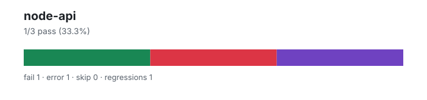

# node-api — `1.4.2+d195510bf`

- Image digest: `954047cf20d5a347e196f389b4c8353f86fa1b714f42c11faa111ce9c77f1873`
- Suite version: `ed33ae74ad100a38df41edf56f6935c78821e779`
- Ran: 2026-08-10T05:22:39.308Z → 2026-08-10T05:23:42.550Z

## Summary

**Pass rate: 1/3 (33.33%)**

| pass | fail | error | skip | regressions | new passes |
|---:|---:|---:|---:|---:|---:|
| 1 | 1 | 1 | 0 | 1 | 0 |

## Observed cases (3)

- `test/parallel/test-fs-read-stream-pos.js` — pass
- `test/parallel/test-http-keep-alive-pipeline-max-requests.js` — fail — Error: write EPIPE
- `test/parallel/test-zlib-params.js` — error — Node API test timed out

## ❌ Regressions (1)

- `test/parallel/test-http-keep-alive-pipeline-max-requests.js` — Error: write EPIPE
