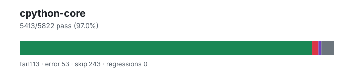

# cpython-core — `1.4.99+8b374d579`

- Image digest: `4094eb2fb1ff122e2707260d4bea151c43278a01e4d16e2ac400c66de8cdff77`
- Suite version: `7c999be49dee7f12703e4b2e07e990544fabd40e`
- Ran: 2026-08-31T23:33:38.068Z → 2026-08-31T23:35:33.674Z

## Summary

**Pass rate: 5413/5822 (97.02%)**

| pass | fail | error | skip | regressions | new passes |
|---:|---:|---:|---:|---:|---:|
| 5413 | 113 | 53 | 243 | 0 | 0 |

## Observed cases (5579)

- `test_range.RangeTest.test_attributes` — pass
- `test_range.RangeTest.test_comparison` — pass
- `test_range.RangeTest.test_contains` — pass
- `test_range.RangeTest.test_count` — pass
- `test_range.RangeTest.test_empty` — pass
- `test_range.RangeTest.test_exhausted_iterator_pickling` — pass
- `test_range.RangeTest.test_index` — pass
- `test_range.RangeTest.test_invalid_invocation` — pass
- `test_range.RangeTest.test_issue11845` — pass
- `test_class.ClassTests.testBadTypeReturned` — pass
- `test_class.ClassTests.testBinaryOps` — pass
- `test_class.ClassTests.testClassWithExtCall` — pass
- `test_class.ClassTests.testConstructorErrorMessages` — pass
- `test_class.ClassTests.testForExceptionsRaisedInInstanceGetattr2` — pass
- `test_class.ClassTests.testGetSetAndDel` — pass
- `test_range.RangeTest.test_iterator_pickling` — pass
- `test_range.RangeTest.test_iterator_pickling_overflowing_index` — pass
- `test_range.RangeTest.test_iterator_setstate` — pass
- `test_range.RangeTest.test_iterator_unpickle_compat` — pass
- `test_range.RangeTest.test_large_exhausted_iterator_pickling` — pass
- `test_range.RangeTest.test_large_operands` — pass
- `test_range.RangeTest.test_large_range` — pass
- `test_range.RangeTest.test_odd_bug` — pass
- `test_range.RangeTest.test_pickling` — pass
- `test_range.RangeTest.test_range` — pass
- `test_range.RangeTest.test_range_constructor_error_messages` — fail — TypeError: range() missing 1 required positional argument: 'a'

During handling of the above exception, another exception occurred:

Traceback (most recent call last):
  File "/work/suites/cpython/Lib/test/test_range.py", line 95, in test_range_constructor_error_messages
    with self.assertRaisesRegex(
         ^^^^^^^^^^^^^^^^^^^^^^^
AssertionError: "range expected at least 1 argument, got 0" does not match "range() missing 1 required positional argument: 'a'"

- `test_bool.BoolTest.test_blocked` — pass
- `test_bool.BoolTest.test_bool_called_at_least_once` — pass
- `test_bool.BoolTest.test_bool_new` — pass
- `test_bool.BoolTest.test_boolean` — pass
- `test_bool.BoolTest.test_callable` — pass
- `test_bool.BoolTest.test_complex` — pass
- `test_bool.BoolTest.test_contains` — pass
- `test_bool.BoolTest.test_convert` — pass
- `test_bool.BoolTest.test_convert_to_bool` — pass
- `test_bool.BoolTest.test_fileclosed` — pass
- `test_bool.BoolTest.test_float` — pass
- `test_bool.BoolTest.test_format` — pass
- `test_bool.BoolTest.test_from_bytes` — pass
- `test_bool.BoolTest.test_hasattr` — pass
- `test_bool.BoolTest.test_int` — pass
- `test_bool.BoolTest.test_interpreter_convert_to_bool_raises` — pass
- `test_bool.BoolTest.test_isinstance` — pass
- `test_bool.BoolTest.test_issubclass` — pass
- `test_bool.BoolTest.test_keyword_args` — pass
- `test_bool.BoolTest.test_marshal` — pass
- `test_bool.BoolTest.test_math` — pass
- `test_bool.BoolTest.test_operator` — pass
- `test_bool.BoolTest.test_pickle` — pass
- `test_bool.BoolTest.test_picklevalues` — pass
- `test_bool.BoolTest.test_real_and_imag` — pass
- `test_bool.BoolTest.test_repr` — pass
- `test_bool.BoolTest.test_sane_len` — pass
- `test_bool.BoolTest.test_str` — pass
- `test_bool.BoolTest.test_string` — pass
- `test_bool.BoolTest.test_subclass` — pass
- `test_bool.BoolTest.test_types` — pass
- `test_dict.DictTest.test_bad_key` — pass
- `test_dict.DictTest.test_bool` — pass
- `test_dict.DictTest.test_clear` — pass
- `test_dict.DictTest.test_constructor` — pass
- `test_tuple.TupleTest.test_addmul` — pass
- `test_slice.SliceTest.test_cmp` — pass
- `test_tuple.TupleTest.test_bigrepeat` — pass
- `test_tuple.TupleTest.test_constructors` — pass
- `test_tuple.TupleTest.test_contains` — pass
- `test_tuple.TupleTest.test_contains_fake` — pass
- `test_slice.SliceTest.test_constructor` — pass
- `test_slice.SliceTest.test_copy` — pass
- `test_tuple.TupleTest.test_contains_order` — pass
- `test_tuple.TupleTest.test_count` — pass
- `test_tuple.TupleTest.test_getitem` — pass
- `test_tuple.TupleTest.test_getitem_error` — pass
- `test_tuple.TupleTest.test_getitemoverwriteiter` — pass
- `test_tuple.TupleTest.test_getslice` — pass
- `test_tuple.TupleTest.test_hash_optional` — pass
- `test_tuple.TupleTest.test_iadd` — pass
- `test_tuple.TupleTest.test_imul` — pass
- `test_tuple.TupleTest.test_index` — pass
- `test_tuple.TupleTest.test_iterator_pickle` — pass
- `test_tuple.TupleTest.test_keyword_args` — pass
- `test_tuple.TupleTest.test_keywords_in_subclass` — error — Traceback (most recent call last):
  File "/work/suites/cpython/Lib/test/test_tuple.py", line 57, in test_keywords_in_subclass
    u = subclass_with_init([1, 2], newarg=3)
        ^^^^^^^^^^^^^^^^^^^^^^^^^^^^^^^^^^^^
TypeError: tuple() got an unexpected keyword argument 'newarg'

- `test_tuple.TupleTest.test_len` — pass
- `test_tuple.TupleTest.test_lexicographic_ordering` — pass
- `test_tuple.TupleTest.test_minmax` — pass
- `test_tuple.TupleTest.test_no_comdat_folding` — pass
- `test_tuple.TupleTest.test_pickle` — pass
- `test_tuple.TupleTest.test_repeat` — pass
- `test_tuple.TupleTest.test_repr` — pass
- `test_class.ClassTests.testHashComparisonOfMethods` — pass
- `test_class.ClassTests.testHashStuff` — pass
- `test_class.ClassTests.testInit` — pass
- `test_class.ClassTests.testListAndDictOps` — pass
- `test_class.ClassTests.testMisc` — pass
- `test_class.ClassTests.testPredefinedAttrs` — pass
- `test_class.ClassTests.testSFBug532646` — pass
- `test_class.ClassTests.testSetattrNonStringName` — pass
- `test_class.ClassTests.testSetattrWrapperNameIntern` — pass
- `test_class.ClassTests.testUnaryOps` — pass
- `test_list.ListTest.test_addmul` — pass
- `test_list.ListTest.test_append` — pass
- `test_list.ListTest.test_bigrepeat` — pass
- `test_list.ListTest.test_clear` — pass
- `test_list.ListTest.test_constructor_exception_handling` — pass
- `test_list.ListTest.test_constructors` — pass
- `test_list.ListTest.test_contains` — pass
- `test_list.ListTest.test_contains_fake` — pass
- `test_list.ListTest.test_contains_order` — pass
- `test_list.ListTest.test_copy` — pass
- `test_list.ListTest.test_count` — pass
- `test_list.ListTest.test_count_index_remove_crashes` — pass
- `test_list.ListTest.test_delitem` — pass
- `test_list.ListTest.test_delslice` — pass
- `test_list.ListTest.test_equal_operator_modifying_operand` — pass
- `test_list.ListTest.test_exhausted_iterator` — pass
- `test_list.ListTest.test_extend` — pass
- `test_list.ListTest.test_extendedslicing` — pass
- `test_list.ListTest.test_getitem` — pass
- `test_list.ListTest.test_getitem_error` — pass
- `test_list.ListTest.test_getitemoverwriteiter` — pass
- `test_list.ListTest.test_getslice` — pass
- `test_list.ListTest.test_iadd` — pass
- `test_list.ListTest.test_identity` — pass
- `test_list.ListTest.test_imul` — pass
- `test_list.ListTest.test_index` — pass
- `test_list.ListTest.test_init` — pass
- `test_tuple.TupleTest.test_repr_large` — pass
- `test_tuple.TupleTest.test_reversed_pickle` — pass
- `test_tuple.TupleTest.test_subscript` — pass
- `test_tuple.TupleTest.test_truth` — pass
- `test_tuple.TupleTest.test_tupleresizebug` — pass
- `test_list.ListTest.test_insert` — pass
- `test_list.ListTest.test_iterator_pickle` — pass
- `test_list.ListTest.test_keyword_args` — pass
- `test_list.ListTest.test_keywords_in_subclass` — error — Traceback (most recent call last):
  File "/work/suites/cpython/Lib/test/test_list.py", line 72, in test_keywords_in_subclass
    u = subclass_with_new([1, 2], newarg=3)
        ^^^^^^^^^^^^^^^^^^^^^^^^^^^^^^^^^^^
TypeError: list() got an unexpected keyword argument 'newarg'

- `test_list.ListTest.test_len` — pass
- `test_list.ListTest.test_list_index_modifing_operand` — fail — Traceback (most recent call last):
  File "/work/suites/cpython/Lib/test/test_list.py", line 254, in test_list_index_modifing_operand
    with self.assertRaises(ValueError):
         ^^^^^^^^^^^^^^^^^^^^^^^^^^^^^
AssertionError: ValueError not raised

- `test_generators.ExceptionTest.test_except_gen_except` — pass
- `test_generators.ExceptionTest.test_except_next` — pass
- `test_generators.ExceptionTest.test_except_throw` — pass
- `test_generators.ExceptionTest.test_except_throw_bad_exception` — pass
- `test_generators.ExceptionTest.test_except_throw_exception_context` — pass
- `test_generators.ExceptionTest.test_gen_3_arg_deprecation_warning` — pass
- `test_generators.ExceptionTest.test_nested_gen_except_loop` — pass
- `test_generators.ExceptionTest.test_return_stopiteration` — pass
- `test_generators.ExceptionTest.test_return_tuple` — pass
- `test_generators.ExceptionTest.test_stopiteration_error` — pass
- `test_generators.ExceptionTest.test_tutorial_stopiteration` — pass
- `test_dict.DictTest.test_container_iterator` — pass
- `test_dict.DictTest.test_contains` — pass
- `test_dict.DictTest.test_copy` — pass
- `test_dict.DictTest.test_copy_fuzz` — pass
- `test_dict.DictTest.test_copy_maintains_tracking` — pass
- `test_dict.DictTest.test_copy_noncompact` — pass
- `test_dict.DictTest.test_dict_contain_use_after_free` — pass
- `test_dict.DictTest.test_dict_copy_order` — pass
- `test_dict.DictTest.test_dictitems_contains_use_after_free` — pass
- `test_dict.DictTest.test_dictview_mixed_set_operations` — pass
- `test_dict.DictTest.test_dictview_set_operations_on_items` — pass
- `test_dict.DictTest.test_dictview_set_operations_on_keys` — pass
- `test_dict.DictTest.test_empty_presized_dict_in_freelist` — pass
- `test_dict.DictTest.test_eq` — pass
- `test_dict.DictTest.test_equal_operator_modifying_operand` — pass
- `test_dict.DictTest.test_errors_in_view_containment_check` — pass
- `test_dict.DictTest.test_fromkeys` — pass
- `test_dict.DictTest.test_fromkeys_operator_modifying_dict_operand` — pass
- `test_dict.DictTest.test_fromkeys_operator_modifying_set_operand` — pass
- `test_dict.DictTest.test_get` — pass
- `test_set.TestBasicOpsBytes.test_copy` — pass
- `test_set.TestBasicOpsBytes.test_empty_difference` — pass
- `test_set.TestBasicOpsBytes.test_empty_difference_rev` — pass
- `test_set.TestBasicOpsBytes.test_empty_intersection` — pass
- `test_set.TestBasicOpsBytes.test_empty_isdisjoint` — pass
- `test_set.TestBasicOpsBytes.test_empty_symmetric_difference` — pass
- `test_set.TestBasicOpsBytes.test_empty_union` — pass
- `test_set.TestBasicOpsBytes.test_equivalent_equality` — pass
- `test_set.TestBasicOpsBytes.test_intersection_empty` — pass
- `test_set.TestBasicOpsBytes.test_isdisjoint_empty` — pass
- `test_set.TestBasicOpsBytes.test_issue_37219` — pass
- `test_set.TestBasicOpsBytes.test_iteration` — pass
- `test_dict.DictTest.test_getitem` — pass
- `test_dict.DictTest.test_init_use_after_free` — pass
- `test_dict.DictTest.test_instance_dict_getattr_str_subclass` — pass
- `test_dict.DictTest.test_invalid_keyword_arguments` — pass
- `test_set.TestBasicOpsBytes.test_length` — pass
- `test_set.TestBasicOpsBytes.test_pickling` — pass
- `test_dict.DictTest.test_itemiterator_pickling` — pass
- `test_dict.DictTest.test_items` — pass
- `test_set.TestBasicOpsBytes.test_repr` — pass
- `test_set.TestBasicOpsBytes.test_self_difference` — pass
- `test_set.TestBasicOpsBytes.test_self_equality` — pass
- `test_set.TestBasicOpsBytes.test_self_intersection` — pass
- `test_set.TestBasicOpsBytes.test_self_isdisjoint` — pass
- `test_set.TestBasicOpsBytes.test_self_symmetric_difference` — pass
- `test_set.TestBasicOpsBytes.test_self_union` — pass
- `test_set.TestBasicOpsBytes.test_union_empty` — pass
- `test_set.TestBasicOpsEmpty.test_copy` — pass
- `test_set.TestBasicOpsEmpty.test_empty_difference` — pass
- `test_set.TestBasicOpsEmpty.test_empty_difference_rev` — pass
- `test_set.TestBasicOpsEmpty.test_empty_intersection` — pass
- …and 5379 more
