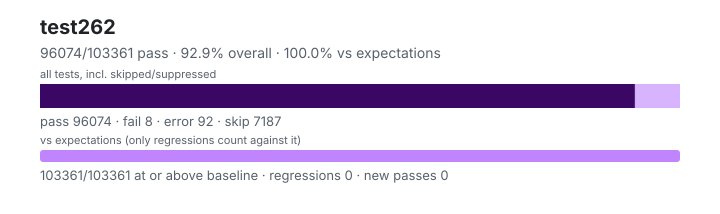

# test262 — `1.4.99+8b374d579`

- Image digest: `4094eb2fb1ff122e2707260d4bea151c43278a01e4d16e2ac400c66de8cdff77`
- Suite version: `de8e621cdba4f40cff3cf244e6cfb8cb48746b4a`
- Ran: 2026-08-31T23:33:37.826Z → 2026-08-31T23:46:11.051Z

## Summary

**Pass rate: 96074/103361 (99.90%)**

| pass | fail | error | skip | regressions | new passes |
|---:|---:|---:|---:|---:|---:|
| 96074 | 8 | 92 | 7187 | 0 | 0 |
