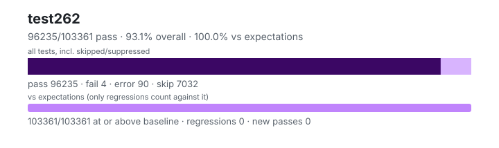

# test262 — `1.6.0+6e718933f`

- Image digest: `4cbcae6c33a8b98c3c3ba5241fc17c8e61a74ab2b92e83320d78cd0bc5181738`
- Suite version: `de8e621cdba4f40cff3cf244e6cfb8cb48746b4a`
- Ran: 2026-10-09T08:26:34.050Z → 2026-10-09T08:39:51.063Z

## Summary

**Pass rate: 96235/103361 (93.11%)** — overall, over all tests including skipped/suppressed

**vs expectations: 103361/103361 (100.00%)** — tests at or above the baseline (only regressions count against it)

| pass | fail | error | skip | regressions | new passes |
|---:|---:|---:|---:|---:|---:|
| 96235 | 4 | 90 | 7032 | 0 | 0 |
