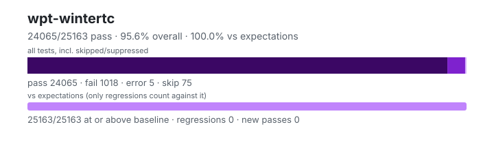

# wpt-wintertc — `1.6.0+6e718933f`

- Image digest: `4cbcae6c33a8b98c3c3ba5241fc17c8e61a74ab2b92e83320d78cd0bc5181738`
- Suite version: `1eb456f600fedad07c8cd6439796fb81db54faff`
- Ran: 2026-10-09T08:26:33.832Z → 2026-10-09T08:27:54.285Z

## Summary

**Pass rate: 24065/25163 (95.64%)** — overall, over all tests including skipped/suppressed

**vs expectations: 25163/25163 (100.00%)** — tests at or above the baseline (only regressions count against it)

| pass | fail | error | skip | regressions | new passes |
|---:|---:|---:|---:|---:|---:|
| 24065 | 1018 | 5 | 75 | 0 | 0 |

## Observed cases (25088)

- `encoding/api-surrogates-utf8.any.js :: Invalid surrogates encoded into UTF-8: Sanity check` — pass
- `encoding/api-surrogates-utf8.any.js :: Invalid surrogates encoded into UTF-8: Surrogate half (low)` — pass
- `encoding/api-surrogates-utf8.any.js :: Invalid surrogates encoded into UTF-8: Surrogate half (high)` — pass
- `encoding/api-surrogates-utf8.any.js :: Invalid surrogates encoded into UTF-8: Surrogate half (low), in a string` — pass
- `encoding/api-surrogates-utf8.any.js :: Invalid surrogates encoded into UTF-8: Surrogate half (high), in a string` — pass
- `encoding/api-surrogates-utf8.any.js :: Invalid surrogates encoded into UTF-8: Wrong order` — pass
- `encoding/iso-2022-jp-decoder.any.js :: iso-2022-jp decoder: Error ESC` — pass
- `encoding/iso-2022-jp-decoder.any.js :: iso-2022-jp decoder: Error ESC, character` — pass
- `encoding/iso-2022-jp-decoder.any.js :: iso-2022-jp decoder: ASCII ESC, character` — pass
- `encoding/iso-2022-jp-decoder.any.js :: iso-2022-jp decoder: Double ASCII ESC, character` — pass
- `encoding/iso-2022-jp-decoder.any.js :: iso-2022-jp decoder: character, ASCII ESC, character` — pass
- `encoding/iso-2022-jp-decoder.any.js :: iso-2022-jp decoder: characters` — pass
- `encoding/iso-2022-jp-decoder.any.js :: iso-2022-jp decoder: SO / SI` — pass
- `encoding/iso-2022-jp-decoder.any.js :: iso-2022-jp decoder: Roman ESC, characters` — pass
- `encoding/iso-2022-jp-decoder.any.js :: iso-2022-jp decoder: Roman ESC, SO / SI` — pass
- `encoding/iso-2022-jp-decoder.any.js :: iso-2022-jp decoder: Roman ESC, error ESC, Katakana ESC` — pass
- `encoding/iso-2022-jp-decoder.any.js :: iso-2022-jp decoder: Katakana ESC, character` — pass
- `encoding/iso-2022-jp-decoder.any.js :: iso-2022-jp decoder: Katakana ESC, multibyte ESC, character` — pass
- `encoding/iso-2022-jp-decoder.any.js :: iso-2022-jp decoder: Katakana ESC, error ESC, character` — pass
- `encoding/iso-2022-jp-decoder.any.js :: iso-2022-jp decoder: Katakana ESC, error ESC #2, character` — pass
- `encoding/iso-2022-jp-decoder.any.js :: iso-2022-jp decoder: Katakana ESC, character, Katakana ESC, character` — pass
- `encoding/iso-2022-jp-decoder.any.js :: iso-2022-jp decoder: Katakana ESC, SO / SI` — pass
- `encoding/iso-2022-jp-decoder.any.js :: iso-2022-jp decoder: Multibyte ESC, character` — pass
- `encoding/iso-2022-jp-decoder.any.js :: iso-2022-jp decoder: Multibyte ESC #2, character` — pass
- `encoding/iso-2022-jp-decoder.any.js :: iso-2022-jp decoder: Multibyte ESC, error ESC, character` — pass
- `encoding/iso-2022-jp-decoder.any.js :: iso-2022-jp decoder: Double multibyte ESC` — pass
- `encoding/iso-2022-jp-decoder.any.js :: iso-2022-jp decoder: Double multibyte ESC, character` — pass
- `encoding/iso-2022-jp-decoder.any.js :: iso-2022-jp decoder: Double multibyte ESC #2, character` — pass
- `encoding/iso-2022-jp-decoder.any.js :: iso-2022-jp decoder: Multibyte ESC, error ESC #2, character` — pass
- `encoding/iso-2022-jp-decoder.any.js :: iso-2022-jp decoder: Multibyte ESC, single byte, multibyte ESC, character` — pass
- `encoding/iso-2022-jp-decoder.any.js :: iso-2022-jp decoder: Multibyte ESC, lead error byte` — pass
- `encoding/iso-2022-jp-decoder.any.js :: iso-2022-jp decoder: Multibyte ESC, trail error byte` — pass
- `encoding/iso-2022-jp-decoder.any.js :: iso-2022-jp decoder: character, error ESC` — pass
- `encoding/iso-2022-jp-decoder.any.js :: iso-2022-jp decoder: character, error ESC #2` — pass
- `encoding/iso-2022-jp-decoder.any.js :: iso-2022-jp decoder: character, error ESC #3` — pass
- `encoding/iso-2022-jp-decoder.any.js :: iso-2022-jp decoder: character, ASCII ESC` — pass
- `encoding/iso-2022-jp-decoder.any.js :: iso-2022-jp decoder: character, Roman ESC` — pass
- `encoding/iso-2022-jp-decoder.any.js :: iso-2022-jp decoder: character, Katakana ESC` — pass
- `encoding/iso-2022-jp-decoder.any.js :: iso-2022-jp decoder: character, Multibyte ESC` — pass
- `encoding/iso-2022-jp-decoder.any.js :: iso-2022-jp decoder: character, Multibyte ESC #2` — pass
- `encoding/api-replacement-encodings.any.js :: Label for "replacement" should be rejected by API: csiso2022kr` — pass
- `encoding/api-replacement-encodings.any.js :: Label for "replacement" should be rejected by API: hz-gb-2312` — pass
- `encoding/api-replacement-encodings.any.js :: Label for "replacement" should be rejected by API: iso-2022-cn` — pass
- `encoding/api-replacement-encodings.any.js :: Label for "replacement" should be rejected by API: iso-2022-cn-ext` — pass
- `encoding/api-replacement-encodings.any.js :: Label for "replacement" should be rejected by API: iso-2022-kr` — pass
- `encoding/api-replacement-encodings.any.js :: Label for "replacement" should be rejected by API: replacement` — pass
- `encoding/replacement-encodings.any.js :: csiso2022kr - non-empty input decodes to one replacement character.` — pass
- `encoding/replacement-encodings.any.js :: csiso2022kr - empty input decodes to empty output.` — pass
- `encoding/replacement-encodings.any.js :: hz-gb-2312 - non-empty input decodes to one replacement character.` — pass
- `encoding/replacement-encodings.any.js :: hz-gb-2312 - empty input decodes to empty output.` — pass
- `encoding/replacement-encodings.any.js :: iso-2022-cn - non-empty input decodes to one replacement character.` — pass
- `encoding/replacement-encodings.any.js :: iso-2022-cn - empty input decodes to empty output.` — pass
- `encoding/replacement-encodings.any.js :: iso-2022-cn-ext - non-empty input decodes to one replacement character.` — pass
- `encoding/replacement-encodings.any.js :: iso-2022-cn-ext - empty input decodes to empty output.` — pass
- `encoding/replacement-encodings.any.js :: iso-2022-kr - non-empty input decodes to one replacement character.` — pass
- `encoding/replacement-encodings.any.js :: iso-2022-kr - empty input decodes to empty output.` — pass
- `encoding/replacement-encodings.any.js :: replacement - non-empty input decodes to one replacement character.` — pass
- `encoding/replacement-encodings.any.js :: replacement - empty input decodes to empty output.` — pass
- `encoding/legacy-mb-schinese/gbk/gbk-decoder.any.js :: gbk pointer: 6432` — pass
- `encoding/legacy-mb-schinese/gbk/gbk-decoder.any.js :: gbk pointer: 7533` — pass
- `encoding/legacy-mb-schinese/gbk/gbk-decoder.any.js :: gbk pointer: 7536` — pass
- `encoding/legacy-mb-schinese/gbk/gbk-decoder.any.js :: gbk pointer: 7672` — pass
- `encoding/legacy-mb-schinese/gbk/gbk-decoder.any.js :: gbk pointer: 7673` — pass
- `encoding/legacy-mb-schinese/gbk/gbk-decoder.any.js :: gbk pointer: 7674` — pass
- `encoding/legacy-mb-schinese/gbk/gbk-decoder.any.js :: gbk pointer: 7675` — pass
- `encoding/legacy-mb-schinese/gbk/gbk-decoder.any.js :: gbk pointer: 7676` — pass
- `encoding/legacy-mb-schinese/gbk/gbk-decoder.any.js :: gbk pointer: 7677` — pass
- `encoding/legacy-mb-schinese/gbk/gbk-decoder.any.js :: gbk pointer: 7678` — pass
- `encoding/legacy-mb-schinese/gbk/gbk-decoder.any.js :: gbk pointer: 7679` — pass
- `encoding/legacy-mb-schinese/gbk/gbk-decoder.any.js :: gbk pointer: 7680` — pass
- `encoding/legacy-mb-schinese/gbk/gbk-decoder.any.js :: gbk pointer: 7681` — pass
- `encoding/legacy-mb-schinese/gbk/gbk-decoder.any.js :: gbk pointer: 7682` — pass
- `encoding/legacy-mb-schinese/gbk/gbk-decoder.any.js :: gbk pointer: 7683` — pass
- `encoding/legacy-mb-schinese/gbk/gbk-decoder.any.js :: gbk pointer: 7684` — pass
- `encoding/legacy-mb-schinese/gbk/gbk-decoder.any.js :: gbk pointer: 23766` — pass
- `encoding/legacy-mb-schinese/gbk/gbk-decoder.any.js :: gbk pointer: 23770` — pass
- `encoding/legacy-mb-schinese/gbk/gbk-decoder.any.js :: gbk pointer: 23771` — pass
- `encoding/legacy-mb-schinese/gbk/gbk-decoder.any.js :: gbk pointer: 23772` — pass
- `encoding/legacy-mb-schinese/gbk/gbk-decoder.any.js :: gbk pointer: 23773` — pass
- `encoding/legacy-mb-schinese/gbk/gbk-decoder.any.js :: gbk pointer: 23774` — pass
- `encoding/legacy-mb-schinese/gbk/gbk-decoder.any.js :: gbk pointer: 23776` — pass
- `encoding/legacy-mb-schinese/gbk/gbk-decoder.any.js :: gbk pointer: 23777` — pass
- `encoding/legacy-mb-schinese/gbk/gbk-decoder.any.js :: gbk pointer: 23778` — pass
- `encoding/legacy-mb-schinese/gbk/gbk-decoder.any.js :: gbk pointer: 23779` — pass
- `encoding/legacy-mb-schinese/gbk/gbk-decoder.any.js :: gbk pointer: 23780` — pass
- `encoding/legacy-mb-schinese/gbk/gbk-decoder.any.js :: gbk pointer: 23781` — pass
- `encoding/legacy-mb-schinese/gbk/gbk-decoder.any.js :: gbk pointer: 23782` — pass
- `encoding/legacy-mb-schinese/gbk/gbk-decoder.any.js :: gbk pointer: 23784` — pass
- `encoding/legacy-mb-schinese/gbk/gbk-decoder.any.js :: gbk pointer: 23785` — pass
- `encoding/legacy-mb-schinese/gbk/gbk-decoder.any.js :: gbk pointer: 23786` — pass
- `encoding/legacy-mb-schinese/gbk/gbk-decoder.any.js :: gbk pointer: 23787` — pass
- `encoding/legacy-mb-schinese/gbk/gbk-decoder.any.js :: gbk pointer: 23790` — pass
- `encoding/legacy-mb-schinese/gbk/gbk-decoder.any.js :: gbk pointer: 23791` — pass
- `encoding/legacy-mb-schinese/gbk/gbk-decoder.any.js :: gbk pointer: 23792` — pass
- `encoding/legacy-mb-schinese/gbk/gbk-decoder.any.js :: gbk pointer: 23793` — pass
- `encoding/legacy-mb-schinese/gbk/gbk-decoder.any.js :: gbk pointer: 23796` — pass
- `encoding/legacy-mb-schinese/gbk/gbk-decoder.any.js :: gbk pointer: 23797` — pass
- `encoding/legacy-mb-schinese/gbk/gbk-decoder.any.js :: gbk pointer: 23798` — pass
- `encoding/legacy-mb-schinese/gbk/gbk-decoder.any.js :: gbk pointer: 23799` — pass
- `encoding/legacy-mb-schinese/gbk/gbk-decoder.any.js :: gbk pointer: 23800` — pass
- `encoding/legacy-mb-schinese/gbk/gbk-decoder.any.js :: gbk pointer: 23801` — pass
- `encoding/legacy-mb-schinese/gbk/gbk-decoder.any.js :: gbk pointer: 23802` — pass
- `encoding/legacy-mb-schinese/gbk/gbk-decoder.any.js :: gbk pointer: 23803` — pass
- `encoding/legacy-mb-schinese/gbk/gbk-decoder.any.js :: gbk pointer: 23805` — pass
- `encoding/legacy-mb-schinese/gbk/gbk-decoder.any.js :: gbk pointer: 23806` — pass
- `encoding/legacy-mb-schinese/gbk/gbk-decoder.any.js :: gbk pointer: 23807` — pass
- `encoding/legacy-mb-schinese/gbk/gbk-decoder.any.js :: gbk pointer: 23808` — pass
- `encoding/legacy-mb-schinese/gbk/gbk-decoder.any.js :: gbk pointer: 23809` — pass
- `encoding/legacy-mb-schinese/gbk/gbk-decoder.any.js :: gbk pointer: 23810` — pass
- `encoding/legacy-mb-schinese/gbk/gbk-decoder.any.js :: gbk pointer: 23811` — pass
- `encoding/legacy-mb-schinese/gbk/gbk-decoder.any.js :: gbk pointer: 23813` — pass
- `encoding/legacy-mb-schinese/gbk/gbk-decoder.any.js :: gbk pointer: 23814` — pass
- `encoding/legacy-mb-schinese/gbk/gbk-decoder.any.js :: gbk pointer: 23815` — pass
- `encoding/legacy-mb-schinese/gbk/gbk-decoder.any.js :: gbk pointer: 23816` — pass
- `encoding/legacy-mb-schinese/gbk/gbk-decoder.any.js :: gbk pointer: 23817` — pass
- `encoding/legacy-mb-schinese/gbk/gbk-decoder.any.js :: gbk pointer: 23818` — pass
- `encoding/legacy-mb-schinese/gbk/gbk-decoder.any.js :: gbk pointer: 23819` — pass
- `encoding/legacy-mb-schinese/gbk/gbk-decoder.any.js :: gbk pointer: 23820` — pass
- `encoding/legacy-mb-schinese/gbk/gbk-decoder.any.js :: gbk pointer: 23821` — pass
- `encoding/legacy-mb-schinese/gbk/gbk-decoder.any.js :: gbk pointer: 23822` — pass
- `encoding/legacy-mb-schinese/gbk/gbk-decoder.any.js :: gbk pointer: 23823` — pass
- `encoding/legacy-mb-schinese/gbk/gbk-decoder.any.js :: gbk pointer: 23824` — pass
- `encoding/legacy-mb-schinese/gbk/gbk-decoder.any.js :: gbk pointer: 23825` — pass
- `encoding/legacy-mb-schinese/gbk/gbk-decoder.any.js :: gbk pointer: 23826` — pass
- `encoding/legacy-mb-schinese/gbk/gbk-decoder.any.js :: gbk pointer: 23827` — pass
- `encoding/legacy-mb-schinese/gbk/gbk-decoder.any.js :: gbk pointer: 23828` — pass
- `encoding/legacy-mb-schinese/gbk/gbk-decoder.any.js :: gbk pointer: 23831` — pass
- `encoding/legacy-mb-schinese/gbk/gbk-decoder.any.js :: gbk pointer: 23832` — pass
- `encoding/legacy-mb-schinese/gbk/gbk-decoder.any.js :: gbk pointer: 23833` — pass
- `encoding/legacy-mb-schinese/gbk/gbk-decoder.any.js :: gbk pointer: 23834` — pass
- `encoding/legacy-mb-schinese/gbk/gbk-decoder.any.js :: gbk pointer: 23835` — pass
- `encoding/legacy-mb-schinese/gbk/gbk-decoder.any.js :: gbk pointer: 23836` — pass
- `encoding/legacy-mb-schinese/gbk/gbk-decoder.any.js :: gbk pointer: 23837` — pass
- `encoding/legacy-mb-schinese/gbk/gbk-decoder.any.js :: gbk pointer: 23838` — pass
- `encoding/legacy-mb-schinese/gbk/gbk-decoder.any.js :: gbk pointer: 23839` — pass
- `encoding/legacy-mb-schinese/gbk/gbk-decoder.any.js :: gbk pointer: 23840` — pass
- `encoding/legacy-mb-schinese/gbk/gbk-decoder.any.js :: gbk pointer: 23841` — pass
- `encoding/legacy-mb-schinese/gbk/gbk-decoder.any.js :: gbk pointer: 23842` — pass
- `encoding/legacy-mb-schinese/gbk/gbk-decoder.any.js :: gbk pointer: 23843` — pass
- `encoding/legacy-mb-schinese/gbk/gbk-decoder.any.js :: gbk pointer: 23844` — pass
- `encoding/api-basics.any.js :: Default encodings` — pass
- `encoding/api-basics.any.js :: Default inputs` — pass
- `encoding/api-basics.any.js :: Encode/decode round trip: utf-8` — pass
- `encoding/api-basics.any.js :: Decode sample: utf-16le` — pass
- `encoding/api-basics.any.js :: Decode sample: utf-16be` — pass
- `encoding/api-basics.any.js :: Decode sample: utf-16` — pass
- `encoding/streams/backpressure.any.js :: write() should not complete until read relieves backpressure for TextDecoderStream` — pass
- `encoding/streams/backpressure.any.js :: additional writes should wait for backpressure to be relieved for class TextDecoderStream` — pass
- `encoding/streams/backpressure.any.js :: write() should not complete until read relieves backpressure for TextEncoderStream` — pass
- `encoding/streams/backpressure.any.js :: additional writes should wait for backpressure to be relieved for class TextEncoderStream` — pass
- `encoding/legacy-mb-schinese/gb18030/gb18030-decoder.any.js :: gb18030 decoder: ASCII` — pass
- `encoding/legacy-mb-schinese/gb18030/gb18030-decoder.any.js :: gb18030 decoder: euro` — pass
- `encoding/legacy-mb-schinese/gb18030/gb18030-decoder.any.js :: gb18030 decoder: initial byte out of accepted ranges` — pass
- `encoding/legacy-mb-schinese/gb18030/gb18030-decoder.any.js :: gb18030 decoder: end of queue, gb18030 first not 0` — pass
- `encoding/legacy-mb-schinese/gb18030/gb18030-decoder.any.js :: gb18030 decoder: two bytes 0x81 0x28` — pass
- `encoding/legacy-mb-schinese/gb18030/gb18030-decoder.any.js :: gb18030 decoder: two bytes 0x81 0x40` — pass
- `encoding/legacy-mb-schinese/gb18030/gb18030-decoder.any.js :: gb18030 decoder: two bytes 0x81 0x7e` — pass
- `encoding/legacy-mb-schinese/gb18030/gb18030-decoder.any.js :: gb18030 decoder: two bytes 0x81 0x7f` — pass
- `encoding/legacy-mb-schinese/gb18030/gb18030-decoder.any.js :: gb18030 decoder: two bytes 0x81 0x80` — pass
- `encoding/legacy-mb-schinese/gb18030/gb18030-decoder.any.js :: gb18030 decoder: two bytes 0x81 0xFE` — pass
- `encoding/legacy-mb-schinese/gb18030/gb18030-decoder.any.js :: gb18030 decoder: two bytes 0x81 0xFF` — pass
- `encoding/legacy-mb-schinese/gb18030/gb18030-decoder.any.js :: gb18030 decoder: two bytes 0xFE 0x40` — pass
- `encoding/legacy-mb-schinese/gb18030/gb18030-decoder.any.js :: gb18030 decoder: two bytes 0xFE 0xFE` — pass
- `encoding/legacy-mb-schinese/gb18030/gb18030-decoder.any.js :: gb18030 decoder: two bytes 0xFE 0xFF` — pass
- `encoding/legacy-mb-schinese/gb18030/gb18030-decoder.any.js :: gb18030 decoder: two bytes 0x81 0x30` — pass
- `encoding/legacy-mb-schinese/gb18030/gb18030-decoder.any.js :: gb18030 decoder: three bytes 0x81 0x30 0xFE` — pass
- `encoding/legacy-mb-schinese/gb18030/gb18030-decoder.any.js :: gb18030 decoder: three bytes 0x81 0x30 0xFF` — pass
- `encoding/legacy-mb-schinese/gb18030/gb18030-decoder.any.js :: gb18030 decoder: four bytes 0x81 0x30 0xFE 0x29` — pass
- `encoding/legacy-mb-schinese/gb18030/gb18030-decoder.any.js :: gb18030 decoder: four bytes 0xFE 0x39 0xFE 0x39` — pass
- `encoding/legacy-mb-schinese/gb18030/gb18030-decoder.any.js :: gb18030 decoder: pointer 7458` — pass
- `encoding/legacy-mb-schinese/gb18030/gb18030-decoder.any.js :: gb18030 decoder: pointer 7457` — pass
- `encoding/legacy-mb-schinese/gb18030/gb18030-decoder.any.js :: gb18030 decoder: pointer 7459` — pass
- `encoding/legacy-mb-schinese/gb18030/gb18030-decoder.any.js :: gb18030 decoder: pointer 39419` — pass
- `encoding/legacy-mb-schinese/gb18030/gb18030-decoder.any.js :: gb18030 decoder: pointer 39420` — pass
- `encoding/legacy-mb-schinese/gb18030/gb18030-decoder.any.js :: gb18030 decoder: pointer 189999` — pass
- `encoding/legacy-mb-schinese/gb18030/gb18030-decoder.any.js :: gb18030 decoder: pointer 189000` — pass
- `encoding/legacy-mb-schinese/gb18030/gb18030-decoder.any.js :: gb18030 decoder: pointer 1237575` — pass
- `encoding/legacy-mb-schinese/gb18030/gb18030-decoder.any.js :: gb18030 decoder: pointer 1237576` — pass
- `encoding/legacy-mb-schinese/gb18030/gb18030-decoder.any.js :: gb18030 decoder: legacy ICU special case 1` — pass
- `encoding/legacy-mb-schinese/gb18030/gb18030-decoder.any.js :: gb18030 decoder: legacy ICU special case 2` — pass
- `encoding/legacy-mb-schinese/gb18030/gb18030-decoder.any.js :: gb18030 decoder: legacy ICU special case 3` — pass
- `encoding/legacy-mb-schinese/gb18030/gb18030-decoder.any.js :: gb18030 decoder: undefined` — pass
- `encoding/legacy-mb-schinese/gb18030/gb18030-decoder.any.js :: gb18030 decoder: GB18030-2022 1` — pass
- `encoding/legacy-mb-schinese/gb18030/gb18030-decoder.any.js :: gb18030 decoder: GB18030-2022 2` — pass
- `encoding/legacy-mb-schinese/gb18030/gb18030-decoder.any.js :: gb18030 decoder: GB18030-2022 3` — pass
- `encoding/legacy-mb-schinese/gb18030/gb18030-decoder.any.js :: gb18030 decoder: GB18030-2022 4` — pass
- `encoding/legacy-mb-schinese/gb18030/gb18030-decoder.any.js :: gb18030 decoder: GB18030-2022 5` — pass
- `encoding/legacy-mb-schinese/gb18030/gb18030-decoder.any.js :: gb18030 decoder: GB18030-2022 6` — pass
- `encoding/legacy-mb-schinese/gb18030/gb18030-decoder.any.js :: gb18030 decoder: GB18030-2022 7` — pass
- `encoding/legacy-mb-schinese/gb18030/gb18030-decoder.any.js :: gb18030 decoder: GB18030-2022 8` — pass
- `encoding/legacy-mb-schinese/gb18030/gb18030-decoder.any.js :: gb18030 decoder: GB18030-2022 9` — pass
- `encoding/legacy-mb-schinese/gb18030/gb18030-decoder.any.js :: gb18030 decoder: GB18030-2022 10` — pass
- `encoding/legacy-mb-schinese/gb18030/gb18030-decoder.any.js :: gb18030 decoder: GB18030-2022 11` — pass
- `encoding/legacy-mb-schinese/gb18030/gb18030-decoder.any.js :: gb18030 decoder: GB18030-2022 12` — pass
- `encoding/legacy-mb-schinese/gb18030/gb18030-decoder.any.js :: gb18030 decoder: GB18030-2022 13` — pass
- `encoding/legacy-mb-schinese/gb18030/gb18030-decoder.any.js :: gb18030 decoder: GB18030-2022 14` — pass
- `encoding/legacy-mb-schinese/gb18030/gb18030-decoder.any.js :: gb18030 decoder: GB18030-2022 15` — pass
- `encoding/legacy-mb-schinese/gb18030/gb18030-decoder.any.js :: gb18030 decoder: GB18030-2022 16` — pass
- `encoding/legacy-mb-schinese/gb18030/gb18030-decoder.any.js :: gb18030 decoder: GB18030-2022 17` — pass
- `encoding/legacy-mb-schinese/gb18030/gb18030-decoder.any.js :: gb18030 decoder: GB18030-2022 18` — pass
- …and 24888 more

## Excluded (3640) — unsupported, out of scope or not applicable; in no rate

| tests | reason |
|---:|---|
| 2748 | unsupported: browser-only — needs a DOM (document, iframe, navigation or media elements) |
| 522 | unsupported: browser-only — tests <a>/<area> element URL parsing |
| 168 | unsupported: browser-only — XMLHttpRequest / document encoding variants |
| 151 | unsupported: CORS preflight (browser security model; not enforced by server runtimes) |
| 39 | unsupported: CORS enforcement (browser security model; not enforced by server runtimes) |
| 12 | unsupported: Cross-Origin-Resource-Policy enforcement (browser security model; not enforced by server runtimes) |
