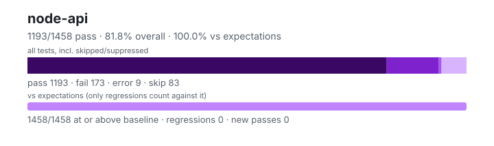

# node-api — `1.6.0+834e9f50f`

- Image digest: `3cd8cc55c96309aa76fd663b85e0834ae98b962d107fcaf9b606d07603fd1669`
- Suite version: `ed33ae74ad100a38df41edf56f6935c78821e779`
- Ran: 2026-09-27T18:49:57.717Z → 2026-09-27T18:52:29.852Z

## Summary

**Pass rate: 1193/1458 (81.82%)** — overall, over all tests including skipped/suppressed

**vs expectations: 1458/1458 (100.00%)** — tests at or above the baseline (only regressions count against it)

| pass | fail | error | skip | regressions | new passes |
|---:|---:|---:|---:|---:|---:|
| 1193 | 173 | 9 | 83 | 0 | 0 |

## Observed cases (1375)

- `test/parallel/test-assert-async.js` — fail — Uncaught (in promise) AssertionError: The "bound " validation function is expected to return "true". Received false

Caught error:

AssertionError: Expected values to be strictly deep-equal:
+ actual - expected

+ null
- {
-   code: 'FOO'
- }
- `test/parallel/test-assert-fail.js` — pass
- `test/parallel/test-assert-class.js` — fail — TAP version 13
# start 1: Assert constructor requires new
not ok 1 - Assert constructor requires new
  ---
  message: "Expected values to be strictly deep-equal:\n+ actual - expected\n\n  Comparison {\n-   code: 'ERR_CONSTRUCT_CALL_REQUIRED',\n    name: 'TypeError'\n  }\n"
  severity: "ERR_ASSERTION"
  detail: |
    	AssertionError: Expected values to be strictly deep-equal:
    	+ actual - expected
    	Comparison {
    	-   code: 'ERR_CONSTRUCT_CALL_REQUIRED',
    	name: 'TypeError'
    	}
    		at Object.<anonymous> (/work/.harness/work/node-api/node-api-overlay/test/parallel/test-assert-class.js:18:10)
    	{
    	  code: 'ERR_ASSERTION',
    	  actual: {},
    	  expected: {"code":"ERR_CONSTRUCT_CALL_REQUIRED","name":"TypeError"},
    	  operator: 'throws'
    	}
  ...
# start 2: Assert class non strict
not ok 2 - Assert class non strict
  ---
  message: "Assert is not a constructor"
  detail: |
    	TypeError: Assert is not a constructor
    		at Object.<anonymous> (/work/.harness/work/node-api/node-api-overlay/test/parallel/test-assert-class.js:25:26)
  ...
# start 3: Assert class strict
not ok 3 - Assert class strict
  ---
  message: "Assert is not a constructor"
  detail: |
    	TypeError: Assert is not a constructor
    		at Object.<anonymous> (/work/.harness/work/node-api/node-api-overlay/test/parallel/test-assert-class.js:139:26)
  ...
# start 4: Assert class with invalid diff option
not ok 4 - Assert class with invalid diff option
  ---
  message: "Expected values to be strictly deep-equal:\n+ actual - expected\n\n  Comparison {\n+   message: 'Assert is not a constructor',\n-   code: 'ERR_INVALID_ARG_VALUE',\n-   message: \"The property 'options.diff' must be one of: 'simple', 'full'. Received 'invalid'\",\n    name: 'TypeError'\n  }\n"
  severity: "ERR_ASSERTION"
  detail: |
    	AssertionError: Expected values to be strictly deep-equal:
    	+ actual - expected
    	Comparison {
    	+   message: 'Assert is not a constructor',
    	-   code: 'ERR_INVALID_ARG_VALUE',
    	-   message: "The property 'options.diff' must be one of: 'simple', 'full'. Received 'invalid'",
    	name: 'TypeError'
    	}
    		at Object.<anonymous> (/work/.harness/work/node-api/node-api-overlay/test/parallel/test-assert-class.js:154:10)
    	{
    	  code: 'ERR_ASSERTION',
    	  actual: {},
    	  expected: {"code":"ERR_INVALID_ARG_VALUE","name":"TypeError","message":"The property 'options.diff' must be one of: 'simple', 'full'. Received 'invalid'"},
    	  operator: 'throws'
    	}
  ...
# start 5: Assert class non strict with full diff
not ok 5 - Assert class non strict with full diff
  ---
  message: "Assert is not a constructor"
  detail: |
    	TypeError: Assert is not a constructor
    		at Object.<anonymous> (/work/.harness/work/node-api/node-api-overlay/test/parallel/test-assert-class.js:172:26)
  ...
# start 6: Assert class non strict with simple diff
not ok 6 - Assert class non strict with simple diff
  ---
  message: "Assert is not a constructor"
  detail: |
    	TypeError: Assert is not a constructor
    		at Object.<anonymous> (/work/.harness/work/node-api/node-api-overlay/test/parallel/test-assert-class.js:326:26)
  ...
# start 7: Assert class strict with skipPrototype
not ok 7 - Assert class strict with skipPrototype
  ---
  message: "Assert is not a constructor"
  detail: |
    	TypeError: Assert is not a constructor
    		at Object.<anonymous> (/work/.harness/work/node-api/node-api-overlay/test/parallel/test-assert-class.js:512:28)
  ...
# start 8: Assert class non strict with skipPrototype
not ok 8 - Assert class non strict with skipPrototype
  ---
  message: "Assert is not a constructor"
  detail: |
    	TypeError: Assert is not a constructor
    		at Object.<anonymous> (/work/.harness/work/node-api/node-api-overlay/test/parallel/test-assert-class.js:540:28)
  ...
# start 9: Assert class skipPrototype with complex objects
not ok 9 - Assert class skipPrototype with complex objects
  ---
  message: "Assert is not a constructor"
  detail: |
    	TypeError: Assert is not a constructor
    		at Object.<anonymous> (/work/.harness/work/node-api/node-api-overlay/test/parallel/test-assert-class.js:552:28)
  ...
# start 10: Assert class skipPrototype with arrays and special objects
not ok 10 - Assert class skipPrototype with arrays and special objects
  ---
  message: "Assert is not a constructor"
  detail: |
    	TypeError: Assert is not a constructor
    		at Object.<anonymous> (/work/.harness/work/node-api/node-api-overlay/test/parallel/test-assert-class.js:587:28)
  ...
# start 11: Assert class skipPrototype with notDeepStrictEqual
not ok 11 - Assert class skipPrototype with notDeepStrictEqual
  ---
  message: "Assert is not a constructor"
  detail: |
    	TypeError: Assert is not a constructor
    		at Object.<anonymous> (/work/.harness/work/node-api/node-api-overlay/test/parallel/test-assert-class.js:609:28)
  ...
# start 12: Assert class skipPrototype with mixed types
not ok 12 - Assert class skipPrototype with mixed types
  ---
  message: "Assert is not a constructor"
  detail: |
    	TypeError: Assert is not a constructor
    		at Object.<anonymous> (/work/.harness/work/node-api/node-api-overlay/test/parallel/test-assert-class.js:624:28)
  ...
1..12
- `test/parallel/test-assert-deep-with-error.js` — pass
- `test/parallel/test-assert-class-destructuring.js` — fail — TAP version 13
# start 1: Assert class destructuring behavior - diff option
not ok 1 - Assert class destructuring behavior - diff option
  ---
  message: "Assert is not a constructor"
  detail: |
    	TypeError: Assert is not a constructor
    		at Object.<anonymous> (/work/.harness/work/node-api/node-api-overlay/test/parallel/test-assert-class-destructuring.js:17:30)
  ...
# start 2: Assert class destructuring behavior - strict option
not ok 2 - Assert class destructuring behavior - strict option
  ---
  message: "Assert is not a constructor"
  detail: |
    	TypeError: Assert is not a constructor
    		at Object.<anonymous> (/work/.harness/work/node-api/node-api-overlay/test/parallel/test-assert-class-destructuring.js:69:35)
  ...
# start 3: Assert class destructuring behavior - comprehensive methods
not ok 3 - Assert class destructuring behavior - comprehensive methods
  ---
  message: "Assert is not a constructor"
  detail: |
    	TypeError: Assert is not a constructor
    		at Object.<anonymous> (/work/.harness/work/node-api/node-api-overlay/test/parallel/test-assert-class-destructuring.js:90:20)
  ...
1..3
- `test/parallel/test-assert-checktag.js` — pass
- `test/parallel/test-assert-if-error.js` — pass
- `test/parallel/test-assert-first-line.js` — pass
- `test/parallel/test-assert-esm-cjs-message-verify.js` — fail — TAP version 13
# start 1: ensure the assert.ok throwing similar error messages for esm and cjs files > should return code 1 for each command
not ok 1 - ensure the assert.ok throwing similar error messages for esm and cjs files > should return code 1 for each command
  ---
  message: "Expected values to be strictly equal:\n\n2 !== 1\n"
  severity: "ERR_ASSERTION"
  detail: |
    	AssertionError: Expected values to be strictly equal:
    	2 !== 1
    		at Object.<anonymous> (/work/.harness/work/node-api/node-api-overlay/test/parallel/test-assert-esm-cjs-message-verify.js:22:14)
    	{
    	  code: 'ERR_ASSERTION',
    	  actual: 2,
    	  expected: 1,
    	  operator: 'strictEqual'
    	}
  ...
1..1
- `test/parallel/test-async-hooks-close-during-destroy.js` — pass
- `test/parallel/test-async-hooks-async-await.js` — pass
- `test/parallel/test-async-hooks-asyncresource-constructor.js` — pass
- `test/parallel/test-async-hooks-constructor.js` — pass
- `test/parallel/test-assert-partial-deep-equal.js` — pass
- `test/parallel/test-assert.js` — fail — TAP version 13
# start 1: some basics
ok 1 - some basics
# start 2: Throw message if the message is instanceof Error
ok 2 - Throw message if the message is instanceof Error
# start 3: Errors created in different contexts are handled as any other custom error
ok 3 - Errors created in different contexts are handled as any other custom error
# start 4: assert.throws()
ok 4 - assert.throws()
# start 5: Check messages from assert.throws()
ok 5 - Check messages from assert.throws()
# start 6: Test assertion messages
ok 6 - Test assertion messages
# start 7: Custom errors
ok 7 - Custom errors
# start 8: Verify that throws() and doesNotThrow() throw on non-functions
ok 8 - Verify that throws() and doesNotThrow() throw on non-functions
# start 9: https://github.com/nodejs/node/issues/3275
ok 9 - https://github.com/nodejs/node/issues/3275
# start 10: Long values should be truncated for display
ok 10 - Long values should be truncated for display
# start 11: Output that extends beyond 10 lines should also be truncated for display
ok 11 - Output that extends beyond 10 lines should also be truncated for display
# start 12: Bad args to AssertionError constructor should throw TypeError.
ok 12 - Bad args to AssertionError constructor should throw TypeError.
# start 13: NaN is handled correctly
ok 13 - NaN is handled correctly
# start 14: Test strict assert
not ok 14 - Test strict assert
  ---
  message: "Expected values to be strictly deep-equal:\n+ actual - expected\n\n  Comparison {\n    generatedMessage: true,\n+   message: 'The expression evaluated to a falsy value:\\n\\n  strict(...[])\\n',\n-   message: 'No value argument passed to `assert.ok()`',\n    name: 'AssertionError'\n  }\n"
  severity: "ERR_ASSERTION"
  detail: |
    	AssertionError: Expected values to be strictly deep-equal:
    	+ actual - expected
    	Comparison {
    	generatedMessage: true,
    	+   message: 'The expression evaluated to a falsy value:\n\n  strict(...[])\n',
    	-   message: 'No value argument passed to `assert.ok()`',
    	name: 'AssertionError'
    	}
    		at Object.<anonymous> (/work/.harness/work/node-api/node-api-overlay/test/parallel/test-assert.js:599:10)
    	{
    	  code: 'ERR_ASSERTION',
    	  actual: {"expected":true,"operator":"==","generatedMessage":true},
    	  expected: {"message":"No value argument passed to `assert.ok()`","name":"AssertionError","generatedMessage":true},
    	  operator: 'throws'
    	}
  ...
# start 15: Additional asserts
not ok 15 - Additional asserts
  ---
  message: "Expected values to be strictly deep-equal:\n+ actual - expected\n\n+ AssertionError {\n+   code: 'ERR_ASSERTION',\n+   constructor: [Function: AssertionError],\n+   message: 'Symbol(foo)'\n- TypeError {\n-   code: 'ERR_INVALID_ARG_TYPE',\n-   constructor: [Function: TypeError],\n-   message: /\"message\" argument.+Symbol\\(foo\\)/\n  }\n"
  severity: "ERR_ASSERTION"
  detail: |
    	AssertionError: Expected values to be strictly deep-equal:
    	+ actual - expected
    	+ AssertionError {
    	+   code: 'ERR_ASSERTION',
    	+   constructor: [Function: AssertionError],
    	+   message: 'Symbol(foo)'
    	- TypeError {
    	-   code: 'ERR_INVALID_ARG_TYPE',
    	-   constructor: [Function: TypeError],
    	-   message: /"message" argument.+Symbol\(foo\)/
    	}
    		at Object.<anonymous> (/work/.harness/work/node-api/node-api-overlay/test/parallel/test-assert.js:905:10)
    	{
    	  code: 'ERR_ASSERTION',
    	  actual: {"actual":false,"expected":true,"operator":"==","generatedMessage":false},
    	  expected: {"code":"ERR_INVALID_ARG_TYPE","message":{}},
    	  operator: 'throws'
    	}
  ...
# start 16: Throws accepts objects
not ok 16 - Throws accepts objects
  ---
  message: "Expected values to be strictly deep-equal:\n+ actual - expected\n\n  Comparison {\n+   message: '',\n+   name: 'Error'\n-   code: 'ERR_INVALID_ARG_TYPE',\n-   message: 'The \"expected\" argument must be of type function or an instance of RegExp. Received an instance of Object',\n-   name: 'TypeError'\n  }\n"
  severity: "ERR_ASSERTION"
  detail: |
    	AssertionError: Expected values to be strictly deep-equal:
    	+ actual - expected
    	Comparison {
    	+   message: '',
    	+   name: 'Error'
    	-   code: 'ERR_INVALID_ARG_TYPE',
    	-   message: 'The "expected" argument must be of type function or an instance of RegExp. Received an instance of Object',
    	-   name: 'TypeError'
    	}
    		at Object.<anonymous> (/work/.harness/work/node-api/node-api-overlay/test/parallel/test-assert.js:1130:10)
    	{
    	  code: 'ERR_ASSERTION',
    	  actual: {},
    	  expected: {"name":"TypeError","code":"ERR_INVALID_ARG_TYPE","message":"The \"expected\" argument must be of type function or an instance of RegExp. Received an instance of Object"},
    	  operator: 'throws'
    	}
  ...
# start 17: Additional assert
not ok 17 - Additional assert
  ---
  message: "Expected values to be strictly deep-equal:\n+ actual - expected\n\n  Comparison {\n    actual: 'foobar',\n    generatedMessage: false,\n+   message: 'message',\n-   message: \"message\\n+ actual - expected\\n\\n+ 'foobar'\\n- {\\n-   message: 'foobar'\\n- }\\n\",\n    operator: 'throws'\n  }\n"
  severity: "ERR_ASSERTION"
  detail: |
    	AssertionError: Expected values to be strictly deep-equal:
    	+ actual - expected
    	Comparison {
    	actual: 'foobar',
    	generatedMessage: false,
    	+   message: 'message',
    	-   message: "message\n+ actual - expected\n\n+ 'foobar'\n- {\n-   message: 'foobar'\n- }\n",
    	operator: 'throws'
    	}
    		at Object.<anonymous> (/work/.harness/work/node-api/node-api-overlay/test/parallel/test-assert.js:1287:12)
    	{
    	  code: 'ERR_ASSERTION',
    	  actual: {"actual":"foobar","expected":{"message":"foobar"},"operator":"throws","generatedMessage":false},
    	  expected: {"actual":"foobar","message":"message\n+ actual - expected\n\n+ 'foobar'\n- {\n-   message: 'foobar'\n- }\n","operator":"throws","generatedMessage":false},
    	  operator: 'throws'
    	}
  ...
# start 18: assert/strict exists
ok 18 - assert/strict exists
# start 19: Printf-like format strings as error message
not ok 19 - Printf-like format strings as error message
  ---
  message: "The input did not match the regular expression /The answer to all questions is 42/. Input:\n\n'AssertionError: The answer to all questions is %i'\n"
  severity: "ERR_ASSERTION"
  detail: |
    	AssertionError: The input did not match the regular expression /The answer to all questions is 42/. Input:
    	'AssertionError: The answer to all questions is %i'
    		at Object.<anonymous> (/work/.harness/work/node-api/node-api-overlay/test/parallel/test-assert.js:1600:10)
    	{
    	  code: 'ERR_ASSERTION',
    	  actual: {"actual":1,"expected":2,"operator":"==","generatedMessage":false},
    	  expected: {},
    	  operator: 'throws'
    	}
  ...
# start 20: Functions as error message
not ok 20 - Functions as error message
  ---
  message: "Expected values to be strictly deep-equal:\n+ actual - expected\n\n  Comparison {\n+   message: 'function errorMessage(actual, expected) {\\n' +\n+     '    return `Nice message including ${actual} and ${expected}`;\\n' +\n+     '  }'\n-   message: 'Nice message including 1 and 2'\n  }\n"
  severity: "ERR_ASSERTION"
  detail: |
    	AssertionError: Expected values to be strictly deep-equal:
    	+ actual - expected
    	Comparison {
    	+   message: 'function errorMessage(actual, expected) {\n' +
    	+     '    return `Nice message including ${actual} and ${expected}`;\n' +
    	+     '  }'
    	-   message: 'Nice message including 1 and 2'
    	}
    		at Object.<anonymous> (/work/.harness/work/node-api/node-api-overlay/test/parallel/test-assert.js:1660:10)
    	{
    	  code: 'ERR_ASSERTION',
    	  actual: {"actual":1,"expected":2,"operator":"==","generatedMessage":false},
    	  expected: {"message":"Nice message including 1 and 2"},
    	  operator: 'throws'
    	}
  ...
# start 21: Ambiguous error messages fail
not ok 21 - Ambiguous error messages fail
  ---
  message: "Expected values to be strictly deep-equal:\n+ actual - expected\n\n  Comparison {\n+   code: 'ERR_ASSERTION',\n-   code: 'ERR_AMBIGUOUS_ARGUMENT',\n    message: 'function errorMessage(actual, expected) {\\n' +\n      '    return `Nice message including ${actual} and ${expected}`;\\n' +\n      '  }'\n  }\n"
  severity: "ERR_ASSERTION"
  detail: |
    	AssertionError: Expected values to be strictly deep-equal:
    	+ actual - expected
    	Comparison {
    	+   code: 'ERR_ASSERTION',
    	-   code: 'ERR_AMBIGUOUS_ARGUMENT',
    	message: 'function errorMessage(actual, expected) {\n' +
    	'    return `Nice message including ${actual} and ${expected}`;\n' +
    	'  }'
    	}
    		at Object.<anonymous> (/work/.harness/work/node-api/node-api-overlay/test/parallel/test-assert.js:1725:10)
    	{
    	  code: 'ERR_ASSERTION',
    	  actual: {"actual":"foo","expected":{},"operator":"doesNotMatch","generatedMessage":false},
    	  expected: {"code":"ERR_AMBIGUOUS_ARGUMENT","message":{}},
    	  operator: 'throws'
    	}
  ...
# start 22: Faulty message functions
not ok 22 - Faulty message functions
  ---
  message: "Expected values to be strictly deep-equal:\n+ actual - expected\n\n  Comparison {\n    code: 'ERR_ASSERTION',\n+   message: '(a, b) => 123'\n-   message: \"'foo' doesNotMatch /foo/\"\n  }\n"
  severity: "ERR_ASSERTION"
  detail: |
    	AssertionError: Expected values to be strictly deep-equal:
    	+ actual - expected
    	Comparison {
    	code: 'ERR_ASSERTION',
    	+   message: '(a, b) => 123'
    	-   message: "'foo' doesNotMatch /foo/"
    	}
    		at Object.<anonymous> (/work/.harness/work/node-api/node-api-overlay/test/parallel/test-assert.js:1743:10)
    	{
    	  code: 'ERR_ASSERTION',
    	  actual: {"actual":"foo","expected":{},"operator":"doesNotMatch","generatedMessage":false},
    	  expected: {"code":"ERR_ASSERTION","message":"'foo' doesNotMatch /foo/"},
    	  operator: 'throws'
    	}
  ...
# start 23: Functions as error message
not ok 23 - Functions as error message
  ---
  message: "Expected values to be strictly deep-equal:\n+ actual - expected\n\n  Comparison {\n    code: 'ERR_ASSERTION',\n+   message: 'function errorMessage(actual, expected) {\\n' +\n+     '    return `Nice message including ${actual} and ${expected}`;\\n' +\n+     '  }'\n-   message: /Nice message including foo and bar/\n  }\n"
  severity: "ERR_ASSERTION"
  detail: |
    	AssertionError: Expected values to be strictly deep-equal:
    	+ actual - expected
    	Comparison {
    	code: 'ERR_ASSERTION',
    	+   message: 'function errorMessage(actual, expected) {\n' +
    	+     '    return `Nice message including ${actual} and ${expected}`;\n' +
    	+     '  }'
    	-   message: /Nice message including foo and bar/
    	}
    		at Object.<anonymous> (/work/.harness/work/node-api/node-api-overlay/test/parallel/test-assert.js:1765:10)
    	{
    	  code: 'ERR_ASSERTION',
    	  actual: {"actual":"foo","expected":"bar","operator":"==","generatedMessage":false},
    	  expected: {"code":"ERR_ASSERTION","message":{}},
    	  operator: 'throws'
    	}
  ...
1..23
- `test/parallel/test-async-hooks-correctly-switch-promise-hook.js` — pass
- `test/parallel/test-async-hooks-enable-before-promise-resolve.js` — pass
- `test/parallel/test-async-hooks-enable-disable-enable.js` — pass
- `test/parallel/test-async-hooks-enable-during-promise.js` — pass
- `test/parallel/test-assert-deep.js` — fail — TAP version 13
# start 1: deepEqual
ok 1 - deepEqual
# start 2: loose deepEqual
not ok 2 - loose deepEqual
  ---
  message: "Expected values to be loosely deep-equal:\n\n[\n  null,\n  undefined,\n  undefined\n]\n\nshould loosely deep-equal\n\n[\n  null,\n  undefined,\n  null\n]"
  severity: "ERR_ASSERTION"
  detail: |
    	AssertionError: Expected values to be loosely deep-equal:
    	[
    	null,
    	undefined,
    	undefined
    	]
    	should loosely deep-equal
    	[
    	null,
    	undefined,
    	null
    	]
    		at assertOnlyDeepEqual (/work/.harness/work/node-api/node-api-overlay/test/parallel/test-assert-deep.js:243:10)
    		at Object.<anonymous> (/work/.harness/work/node-api/node-api-overlay/test/parallel/test-assert-deep.js:130:3)
    	{
    	  code: 'ERR_ASSERTION',
    	  actual: [null,null,null],
    	  expected: [null,null,null],
    	  operator: 'deepEqual'
    	}
  ...
# start 3: date
ok 3 - date
# start 4: regexp
ok 4 - regexp
# start 5: deepEqual should pass for these weird cases
ok 5 - deepEqual should pass for these weird cases
# start 6: es6 Maps and Sets
ok 6 - es6 Maps and Sets
# start 7: GH-6416. Make sure circular refs do not throw
ok 7 - GH-6416. Make sure circular refs do not throw
# start 8: GH-14441. Circular structures should be consistent
ok 8 - GH-14441. Circular structures should be consistent
# start 9: deepStrictEqual handles shared expected array elements after cycle detection
ok 9 - deepStrictEqual handles shared expected array elements after cycle detection
# start 10: deepStrictEqual handles cross-root aliases after cycle detection
ok 10 - deepStrictEqual handles cross-root aliases after cycle detection
# start 11: Ensure reflexivity of deepEqual with `arguments` objects.
ok 11 - Ensure reflexivity of deepEqual with `arguments` objects.
# start 12: More checking that arguments objects are handled correctly
ok 12 - More checking that arguments objects are handled correctly
# start 13: Handle sparse arrays
ok 13 - Handle sparse arrays
# start 14: Handle sets and maps with mixed keys
ok 14 - Handle sets and maps with mixed keys
# start 15: Handle different error messages
ok 15 - Handle different error messages
# start 16: Handle NaN
ok 16 - Handle NaN
# start 17: Handle boxed primitives
ok 17 - Handle boxed primitives
# start 18: Minus zero
ok 18 - Minus zero
# start 19: Handle symbols (enumerable only)
ok 19 - Handle symbols (enumerable only)
# start 20: Additional tests
ok 20 - Additional tests
# start 21: Having the same number of owned properties && the same set of keys
ok 21 - Having the same number of owned properties && the same set of keys
# start 22: Having an identical prototype property
ok 22 - Having an identical prototype property
# start 23: Primitives
ok 23 - Primitives
# start 24: Additional tests
ok 24 - Additional tests
# start 25: Having the same number of owned properties && the same set of keys
ok 25 - Having the same number of owned properties && the same set of keys
# start 26: Prototype check
ok 26 - Prototype check
# start 27: Check extra properties on errors
ok 27 - Check extra properties on errors
# start 28: Check proxies
not ok 28 - Check proxies
  ---
  message: "Expected values to be strictly deep-equal:\n+ actual - expected\n\n  Comparison {\n    message: 'Expected values to be strictly deep-equal:\\n' +\n      '+ actual - expected\\n' +\n      '\\n' +\n+     '  [\\n' +\n-     '+ Proxy([\\n' +\n-     '- [\\n' +\n      '    1,\\n' +\n      '    2,\\n' +\n-     '+ ])\\n' +\n      '-   3\\n' +\n+     '  ]\\n'\n-     '- ]\\n'\n  }\n"
  severity: "ERR_ASSERTION"
  detail: |
    	AssertionError: Expected values to be strictly deep-equal:
    	+ actual - expected
    	Comparison {
    	message: 'Expected values to be strictly deep-equal:\n' +
    	'+ actual - expected\n' +
    	'\n' +
    	+     '  [\n' +
    	-     '+ Proxy([\n' +
    	-     '- [\n' +
    	'    1,\n' +
    	'    2,\n' +
    	-     '+ ])\n' +
    	'-   3\n' +
    	+     '  ]\n'
    	-     '- ]\n'
    	}
    		at Object.<anonymous> (/work/.harness/work/node-api/node-api-overlay/test/parallel/test-assert-deep.js:1144:10)
    	{
    	  code: 'ERR_ASSERTION',
    	  actual: {"actual":[1,2],"expected":[1,2,3],"operator":"deepStrictEqual","generatedMessage":true},
    	  expected: {"message":"Expected values to be strictly deep-equal:\n+ actual - expected\n\n+ Proxy([\n- [\n    1,\n    2,\n+ ])\n-   3\n- ]\n"},
    	  operator: 'throws'
    	}
  ...
# start 29: Strict equal with identical objects that are not identical by reference and longer than 50 elements
ok 29 - Strict equal with identical objects that are not identical by reference and longer than 50 elements
# start 30: Basic valueOf check
ok 30 - Basic valueOf check
# start 31: Basic array out of bounds check
ok 31 - Basic array out of bounds check
# start 32: Verify that manipulating the `getTime()` function has no impact on the time verification.
ok 32 - Verify that manipulating the `getTime()` function has no impact on the time verification.
# start 33: Verify that an array and the equivalent fake array object are correctly compared
ok 33 - Verify that an array and the equivalent fake array object are correctly compared
# start 34: Verify that extra keys will be tested for when using fake arrays
ok 34 - Verify that extra keys will be tested for when using fake arrays
# start 35: Verify that changed tags will still check for the error message
ok 35 - Verify that changed tags will still check for the error message
# start 36: Check for non-native errors
ok 36 - Check for non-native errors
# start 37: Check for Errors with cause property
ok 37 - Check for Errors with cause property
# start 38: Check for AggregateError
ok 38 - Check for AggregateError
# start 39: Verify that `valueOf` is not called for boxed primitives
ok 39 - Verify that `valueOf` is not called for boxed primitives
# start 40: Check getters
ok 40 - Check getters
# start 41: Verify object types being identical on both sides
ok 41 - Verify object types being identical on both sides
# start 42: Verify commutativity
ok 42 - Verify commutativity
# start 43: Crypto
ok 43 - Crypto
# start 44: Comparing two identical WeakMap instances
ok 44 - Comparing two identical WeakMap instances
# start 45: Comparing two different WeakMap instances
ok 45 - Comparing two different WeakMap instances
# start 46: Comparing two identical WeakSet instances
ok 46 - Comparing two identical WeakSet instances
# start 47: Comparing two different WeakSet instances
ok 47 - Comparing two different WeakSet instances
# start 48: Comparing two arrays nested inside object, with overlapping elements
ok 48 - Comparing two arrays nested inside object, with overlapping elements
# start 49: Comparing two arrays nested inside object, with overlapping elements, swapping keys
ok 49 - Comparing two arrays nested inside object, with overlapping elements, swapping keys
# start 50: Detects differences in deeply nested arrays instead of seeing a new object
ok 50 - Detects differences in deeply nested arrays instead of seeing a new object
# start 51: URLs
ok 51 - URLs
# start 52: Own property constructor properties should check against the original prototype
ok 52 - Own property constructor properties should check against the original prototype
# start 53: Inherited null prototype without own constructor properties should check the correct prototype
ok 53 - Inherited null prototype without own constructor properties should check the correct prototype
# start 54: Promises should fail deepEqual
ok 54 - Promises should fail deepEqual
1..54
- `test/parallel/test-async-hooks-disable-during-promise.js` — pass
- `test/parallel/test-async-hooks-enable-disable.js` — pass
- `test/parallel/test-async-hooks-destroy-on-gc.js` — fail — AssertionError: The expression evaluated to a falsy value:

  assert.ok(destroyedIds.has(asyncId))

    at Immediate.<anonymous> (test-async-hooks-destroy-on-gc.js:26:45)
    at Immediate._return (/work/.harness/work/node-api/node-api-overlay/test/common/index.js:575:12)
- `test/parallel/test-async-hooks-promise-triggerid.js` — pass
- `test/parallel/test-async-hooks-enable-recursive.js` — fail — Mismatched noop function calls. Expected exactly 1, actual 0.
    at Proxy.mustCall (/work/.harness/work/node-api/node-api-overlay/test/common/index.js:533:10)
    at Object.<anonymous> (test-async-hooks-enable-recursive.js:8:16)
    at test-async-hooks-enable-recursive.js:21:4
Mismatched <anonymous> function calls. Expected exactly 2, actual 4.
    at Proxy.mustCall (/work/.harness/work/node-api/node-api-overlay/test/common/index.js:533:10)
    at Object.<anonymous> (test-async-hooks-enable-recursive.js:12:16)
    at test-async-hooks-enable-recursive.js:21:4
- `test/parallel/test-async-hooks-promise-enable-disable.js` — pass
- `test/parallel/test-async-hooks-promise.js` — pass
- `test/parallel/test-async-hooks-prevent-double-destroy.js` — pass
- `test/parallel/test-async-hooks-disable-gc-tracking.js` — pass
- `test/parallel/test-async-hooks-run-in-async-scope-caught-exception.js` — pass
- `test/parallel/test-async-hooks-fatal-error.js` — fail — AssertionError: init  0 !== 1
    at main (test-async-hooks-fatal-error.js:48:7)
    at :anonymous (test-async-hooks-fatal-error.js:10:3)
    at :program (test-async-hooks-fatal-error.js:1:1)
- `test/parallel/test-async-hooks-top-level-clearimmediate.js` — fail — AssertionError: Expected "actual" to be reference-equal to "expected": + actual - expected  + Immediate { +   _argv: undefined, +   _destroyed: false, +   _idleNext: null, +   _idlePrev: null, +   _onImmediate: [Function: mustNotCall] - { -   type: 'Immediate'   }
    at :anonymous (test-async-hooks-top-level-clearimmediate.js:31:1)
    at :program (test-async-hooks-top-level-clearimmediate.js:1:1)
- `test/parallel/test-async-hooks-run-in-async-scope-this-arg.js` — pass
- `test/parallel/test-async-hooks-worker-asyncfn-terminate-1.js` — pass
- `test/parallel/test-async-hooks-worker-asyncfn-terminate-2.js` — pass
- `test/parallel/test-async-hooks-stack-overflow-nested-async.js` — pass
- `test/parallel/test-async-hooks-recursive-stack-runInAsyncScope.js` — pass
- `test/parallel/test-async-hooks-worker-asyncfn-terminate-3.js` — pass
- `test/parallel/test-async-local-storage-bind.js` — pass
- `test/parallel/test-async-hooks-execution-async-resource.js` — pass
- `test/parallel/test-async-hooks-stack-overflow-try-catch.js` — pass
- `test/parallel/test-async-hooks-vm-gc.js` — pass
- `test/parallel/test-async-hooks-execution-async-resource-await.js` — pass
- `test/parallel/test-async-hooks-worker-asyncfn-terminate-4.js` — pass
- `test/parallel/test-async-hooks-stack-overflow.js` — pass
- `test/parallel/test-async-local-storage-contexts.js` — pass
- `test/parallel/test-async-local-storage-run-scope.js` — pass
- `test/parallel/test-async-local-storage-deep-stack.js` — pass
- `test/parallel/test-async-local-storage-isolation.js` — pass
- `test/parallel/test-async-local-storage-enter-with.js` — fail — Uncaught (in promise) AssertionError: Expected values to be strictly equal:
+ actual - expected

+ 'inside then'
- undefined
- `test/parallel/test-async-local-storage-exit-does-not-leak.js` — pass
- `test/parallel/test-buffer-arraybuffer.js` — pass
- `test/parallel/test-async-local-storage-http-parser-leak.js` — fail — TypeError: parsers.alloc is not a function
    at :=> (test-async-local-storage-http-parser-leak.js:19:14)
    at _return (index.js:575:12)
    at test (test-async-local-storage-http-parser-leak.js:18:3)
    at :anonymous (test-async-local-storage-http-parser-leak.js:25:1)
    at :program (test-async-local-storage-http-parser-leak.js:1:1)
- `test/parallel/test-async-local-storage-snapshot.js` — pass
- `test/parallel/test-buffer-alloc.js` — fail — AssertionError: Expected values to be strictly deep-equal: + actual - expected    Comparison { +   message: 'index is too large' -   message: 'Invalid typed array length: 9007199254740992'   }
    at :anonymous (test-buffer-alloc.js:14:1)
    at :program (test-buffer-alloc.js:1:1)
- `test/parallel/test-buffer-ascii.js` — pass
- `test/parallel/test-async-local-storage-http-agent.js` — fail — AssertionError: Expected values to be strictly equal:
+ actual - expected

+ undefined
- 'first'

    at Writable.<anonymous> (test-async-local-storage-http-agent.js:39:14)
    at Writable._return (/work/.harness/work/node-api/node-api-overlay/test/common/index.js:575:12)
    at Writable.emit (native)
    at Duplex.push (native)
- `test/parallel/test-buffer-compare-offset.js` — pass
- `test/parallel/test-buffer-compare.js` — pass
- `test/parallel/test-buffer-bytelength.js` — pass
- `test/parallel/test-buffer-badhex.js` — pass
- `test/parallel/test-buffer-bigint64.js` — pass
- `test/parallel/test-buffer-concat.js` — pass
- `test/parallel/test-buffer-constructor-deprecation-error.js` — pass
- `test/parallel/test-async-local-storage-http-multiclients.js` — fail — TypeError: Cannot read property 'set' of undefined
    at Writable.<anonymous> (test-async-local-storage-http-multiclients.js:36:9)
    at Writable._return (/work/.harness/work/node-api/node-api-overlay/test/common/index.js:575:12)
    at Writable.emit (native)
    at Duplex.push (native)
- `test/parallel/test-buffer-constructor-outside-node-modules.js` — fail — (node:1655) [DEP0005] DeprecationWarning: Buffer() is deprecated due to security and usability issues. Please use the Buffer.alloc(), Buffer.allocUnsafe(), or Buffer.from() methods instead.
AssertionError: DeprecationWarning: Buffer() is deprecated due to security and usability issues. Please use the Buffer.alloc(), Buffer.allocUnsafe(), or Buffer.from() methods instead.
    at Object.<anonymous> (/a/node_modules/b:1:1)
    at Object.<anonymous> (test-buffer-constructor-outside-node-modules.js:21:4)
    at test-buffer-constructor-outside-node-modules.js:31:4
    at AssertionError.get stack (native)
    at ok (native)
    at process.<anonymous> (test-buffer-constructor-outside-node-modules.js:18:3)
    at process._return (/work/.harness/work/node-api/node-api-overlay/test/common/index.js:575:12)
- `test/parallel/test-buffer-equals.js` — pass
- `test/parallel/test-buffer-copy-immutable.js` — pass
- `test/parallel/test-async-local-storage-weak-asyncwrap-leak.js` — fail — TypeError: v8.queryObjects is not a function
    at test-async-local-storage-weak-asyncwrap-leak.js:41:25
    at _return (/work/.harness/work/node-api/node-api-overlay/test/common/index.js:575:12)
    at Timeout.<anonymous> (test-async-local-storage-weak-asyncwrap-leak.js:47:5)
    at TypeError.get stack (native)
- `test/parallel/test-buffer-constructor-node-modules.js` — fail — [process 1769]: --- stderr ---
(node:1769) [DEP0005] DeprecationWarning: Buffer() is deprecated due to security and usability issues. Please use the Buffer.alloc(), Buffer.allocUnsafe(), or Buffer.from() methods instead.

[process 1769]: --- stdout ---

[process 1769]: status = 0, signal = null
Error: - stderr did not match ''
    at logAndThrow (child_process.js:111:5)
    at expectSyncExit (child_process.js:135:5)
    at spawnSyncAndAssert (child_process.js:155:10)
    at :anonymous (test-buffer-constructor-node-modules.js:10:1)
    at :program (test-buffer-constructor-node-modules.js:1:1)
- `test/parallel/test-buffer-copy.js` — pass
- `test/parallel/test-buffer-constructor-node-modules-paths.js` — fail — AssertionError: Expected values to be strictly equal: + actual - expected  + "Error: Usage: 'elide <script>' or 'elide run <script>'; see --help" - ''
    at test (test-buffer-constructor-node-modules-paths.js:20:5)
    at :anonymous (test-buffer-constructor-node-modules-paths.js:23:1)
    at :program (test-buffer-constructor-node-modules-paths.js:1:1)
- `test/parallel/test-buffer-failed-alloc-typed-arrays.js` — pass
- `test/parallel/test-buffer-from.js` — pass
- `test/parallel/test-buffer-fakes.js` — pass
- `test/parallel/test-buffer-inspect.js` — pass
- `test/parallel/test-buffer-inheritance.js` — pass
- `test/parallel/test-buffer-generic-methods.js` — pass
- `test/parallel/test-buffer-isencoding.js` — pass
- `test/parallel/test-buffer-includes.js` — pass
- `test/parallel/test-buffer-isascii.js` — pass
- `test/parallel/test-buffer-isutf8.js` — pass
- `test/parallel/test-buffer-iterator.js` — pass
- `test/parallel/test-buffer-nopendingdep-map.js` — pass
- `test/parallel/test-buffer-of-no-deprecation.js` — pass
- `test/parallel/test-buffer-no-negative-allocation.js` — pass
- `test/parallel/test-buffer-over-max-length.js` — pass
- `test/parallel/test-buffer-new.js` — pass
- `test/parallel/test-buffer-parent-property.js` — pass
- `test/parallel/test-buffer-pending-deprecation.js` — pass
- `test/parallel/test-buffer-read.js` — pass
- `test/parallel/test-buffer-pool-untransferable.js` — fail — AssertionError: Values have same structure but are not reference-equal:  ArrayBuffer {   [Uint8Contents]: <68 65 6c 6c 6f 20 77 6f 72 6c 64>,   [byteLength]: 11 }
    at :anonymous (test-buffer-pool-untransferable.js:12:1)
    at :program (test-buffer-pool-untransferable.js:1:1)
- `test/parallel/test-buffer-readfloat.js` — pass
- `test/parallel/test-buffer-prototype-inspect.js` — pass
- `test/parallel/test-buffer-safe-unsafe.js` — pass
- `test/parallel/test-buffer-readdouble.js` — pass
- `test/parallel/test-buffer-readuint.js` — pass
- `test/parallel/test-buffer-set-inspect-max-bytes.js` — pass
- `test/parallel/test-buffer-readint.js` — pass
- `test/parallel/test-buffer-indexof.js` — fail — AssertionError: Expected values to be strictly deep-equal: + actual - expected    Comparison { +   message: 'function lastIndexOf() { [native code] } is not a constructor', -   code: 'ERR_INVALID_ARG_TYPE', -   message: 'The "buffer" argument must be an instance of Buffer, TypedArray, or DataView. Received an instance of lastIndexOf',     name: 'TypeError'   }
    at :anonymous (test-buffer-indexof.js:625:3)
    at :program (test-buffer-indexof.js:1:1)
- `test/parallel/test-buffer-slice.js` — pass
- `test/parallel/test-buffer-slow.js` — pass
- `test/parallel/test-buffer-resizable.js` — pass
- `test/parallel/test-buffer-sharedarraybuffer.js` — pass
- `test/parallel/test-buffer-tostring-range.js` — pass
- `test/parallel/test-buffer-tojson.js` — pass
- `test/parallel/test-buffer-swap.js` — pass
- `test/parallel/test-buffer-writedouble.js` — pass
- `test/parallel/test-buffer-writeint.js` — pass
- `test/parallel/test-buffer-zero-fill-cli.js` — pass
- `test/parallel/test-buffer-zero-fill.js` — pass
- `test/parallel/test-buffer-zero-fill-reset.js` — pass
- `test/parallel/test-buffer-writeuint.js` — pass
- `test/parallel/test-buffer-writefloat.js` — pass
- `test/parallel/test-buffer-tostring.js` — pass
- `test/parallel/test-buffer-write.js` — pass
- `test/parallel/test-console-assign-undefined.js` — pass
- `test/parallel/test-assert-typedarray-deepequal.js` — pass
- `test/parallel/test-console-async-write-error.js` — pass
- `test/parallel/test-console-clear.js` — pass
- `test/parallel/test-console-count.js` — pass
- `test/parallel/test-console-group.js` — pass
- `test/parallel/test-console-diagnostics-channels.js` — pass
- `test/parallel/test-console-issue-43095.js` — fail — TypeError: proxy has been revoked
    at :anonymous (test-console-issue-43095.js:9:1)
    at :program (test-console-issue-43095.js:1:1)
- `test/parallel/test-console-instance.js` — pass
- `test/parallel/test-console-not-call-toString.js` — pass
- `test/parallel/test-console-log-stdio-broken-dest.js` — pass
- `test/parallel/test-console-methods.js` — pass
- `test/parallel/test-console-log-throw-primitive.js` — pass
- `test/parallel/test-console-self-assign.js` — pass
- `test/parallel/test-console-stdio-setters.js` — pass
- `test/parallel/test-console-table.js` — pass
- `test/parallel/test-console-sync-write-error.js` — pass
- `test/parallel/test-console-with-frozen-intrinsics.js` — pass
- `test/parallel/test-console-no-swallow-stack-overflow.js` — pass
- `test/parallel/test-console.js` — pass
- `test/parallel/test-console-tty-colors.js` — pass
- `test/parallel/test-console-tty-colors-per-stream.js` — pass
- `test/parallel/test-crypto-argon2-unsupported.js` — pass
- `test/parallel/test-crypto-boringssl-evp-list.js` — pass
- `test/parallel/test-crypto-certificate.js` — fail — TypeError: Certificate is not a constructor
    at :anonymous (test-crypto-certificate.js:98:16)
    at :program (test-crypto-certificate.js:1:1)
- `test/parallel/test-crypto-default-shake-lengths.js` — pass
- `test/parallel/test-crypto-dep0183.js` — pass
- `test/parallel/test-buffer-tostring-rangeerror.js` — pass
- `test/parallel/test-crypto-default-shake-lengths-oneshot.js` — pass
- `test/parallel/test-crypto-authenticated-stream.js` — pass
- `test/parallel/test-crypto-dep0203.js` — pass
- `test/parallel/test-crypto-dep0204.js` — pass
- `test/parallel/test-crypto-dep0181.js` — pass
- `test/parallel/test-crypto-dep0206.js` — pass
- `test/parallel/test-crypto-classes.js` — pass
- `test/parallel/test-crypto-dh-curves.js` — pass
- `test/parallel/test-crypto-dh-odd-key.js` — pass
- `test/parallel/test-crypto-dh-constructor.js` — pass
- `test/parallel/test-crypto-domain.js` — pass
- `test/parallel/test-crypto-domains.js` — pass
- `test/parallel/test-crypto-dh.js` — pass
- `test/parallel/test-crypto-dh-shared.js` — pass
- `test/parallel/test-crypto-ecdh-setpublickey-deprecation.js` — pass
- `test/parallel/test-crypto-ecdh-convert-key.js` — pass
- `test/parallel/test-crypto-eddsa-variants.js` — pass
- `test/parallel/test-crypto-encoding-validation-error.js` — pass
- `test/parallel/test-crypto-encap-decap.js` — fail — AssertionError: Expected values to be strictly deep-equal: + actual - expected    Comparison { +   message: 'crypto.encapsulate is not a function' -   code: 'ERR_INVALID_ARG_TYPE', -   message: /The "key" argument must be of type/   }
    at :anonymous (test-crypto-encap-decap.js:19:1)
    at :program (test-crypto-encap-decap.js:1:1)
- `test/parallel/test-crypto-dh-generate-keys.js` — pass
- `test/parallel/test-crypto-gcm-explicit-short-tag.js` — pass
- `test/parallel/test-buffer-constants.js` — pass
- `test/parallel/test-crypto-gcm-implicit-short-tag.js` — pass
- `test/parallel/test-crypto-hash-stream-pipe.js` — pass
- `test/parallel/test-crypto-hkdf.js` — pass
- `test/parallel/test-crypto-dh-padding.js` — pass
- `test/parallel/test-crypto-hmac.js` — pass
- `test/parallel/test-crypto-dh-leak.js` — fail — AssertionError: before=220610560 after=283459584
    at :anonymous (test-crypto-dh-leak.js:30:1)
    at :program (test-crypto-dh-leak.js:1:1)
- `test/parallel/test-crypto-from-binary.js` — pass
- `test/parallel/test-crypto-keygen-async-encrypted-private-key-der.js` — pass
- `test/parallel/test-crypto-keygen-async-encrypted-private-key.js` — pass
- `test/parallel/test-crypto-keygen-async-elliptic-curve-jwk-rsa.js` — pass
- `test/parallel/test-crypto-job-error-parity.js` — pass
- `test/parallel/test-crypto-key-objects-messageport.js` — fail — Uncaught (in promise) Error: node:worker_threads: moveMessagePortToContext is not implemented yet in Elide
- `test/parallel/test-crypto-keygen-async-named-elliptic-curve-encrypted.js` — pass
- `test/parallel/test-crypto-keygen-empty-passphrase-no-error.js` — pass
- `test/parallel/test-crypto-keygen-async-rsa.js` — pass
- `test/parallel/test-crypto-keygen-async-named-elliptic-curve-encrypted-p256.js` — pass
- `test/parallel/test-crypto-keygen-async-named-elliptic-curve.js` — pass
- `test/parallel/test-crypto-dh-errors.js` — pass
- `test/parallel/test-crypto-keygen-empty-passphrase-no-prompt.js` — pass
- `test/parallel/test-crypto-keygen-invalid-parameter-encoding-ec.js` — pass
- `test/parallel/test-crypto-keygen-non-standard-public-exponent.js` — pass
- `test/parallel/test-crypto-keygen-missing-oid.js` — pass
- `test/parallel/test-crypto-keygen-key-objects.js` — pass
- `test/parallel/test-crypto-keygen-key-object-without-encoding.js` — pass
- `test/parallel/test-crypto-keygen-promisify.js` — pass
- `test/parallel/test-crypto-keyobject-no-own-symbols.js` — pass
- `test/parallel/test-crypto-keyobject-brand-check.js` — pass
- `test/parallel/test-crypto-keygen-sync.js` — pass
- `test/parallel/test-crypto-lazy-transform-writable.js` — pass
- `test/parallel/test-crypto-keyobject-hidden-slots.js` — fail — TypeError: X509Certificate is not a constructor
    at :anonymous (test-crypto-keyobject-hidden-slots.js:183:18)
    at :program (test-crypto-keyobject-hidden-slots.js:1:1)
- `test/parallel/test-crypto-oaep-zero-length.js` — pass
- `test/parallel/test-crypto-padding.js` — pass
- `test/parallel/test-crypto-padding-aes256.js` — pass
- `test/parallel/test-crypto-op-during-process-exit.js` — pass
- …and 1175 more

## Excluded (105) — unsupported, out of scope or not applicable; in no rate

| tests | reason |
|---:|---|
| 105 | unsupported: Node internals — needs --expose-internals |
