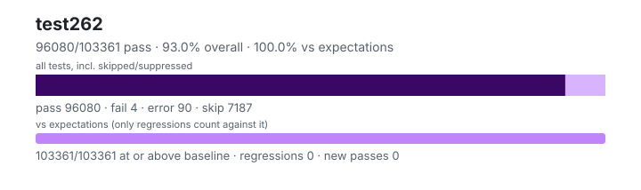

# test262 — `1.6.0+834e9f50f`

- Image digest: `3cd8cc55c96309aa76fd663b85e0834ae98b962d107fcaf9b606d07603fd1669`
- Suite version: `de8e621cdba4f40cff3cf244e6cfb8cb48746b4a`
- Ran: 2026-09-27T18:49:57.851Z → 2026-09-27T19:09:51.101Z

## Summary

**Pass rate: 96080/103361 (92.96%)** — overall, over all tests including skipped/suppressed

**vs expectations: 103361/103361 (100.00%)** — tests at or above the baseline (only regressions count against it)

| pass | fail | error | skip | regressions | new passes |
|---:|---:|---:|---:|---:|---:|
| 96080 | 4 | 90 | 7187 | 0 | 0 |
