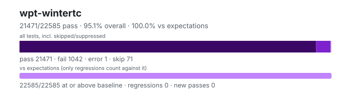

# wpt-wintertc — `1.6.0+834e9f50f`

- Image digest: `3cd8cc55c96309aa76fd663b85e0834ae98b962d107fcaf9b606d07603fd1669`
- Suite version: `1eb456f600fedad07c8cd6439796fb81db54faff`
- Ran: 2026-09-27T18:49:58.143Z → 2026-09-27T18:50:45.292Z

## Summary

**Pass rate: 21471/22585 (95.07%)** — overall, over all tests including skipped/suppressed

**vs expectations: 22585/22585 (100.00%)** — tests at or above the baseline (only regressions count against it)

| pass | fail | error | skip | regressions | new passes |
|---:|---:|---:|---:|---:|---:|
| 21471 | 1042 | 1 | 71 | 0 | 0 |

## Observed cases (22514)

- `encoding/api-surrogates-utf8.any.js :: Invalid surrogates encoded into UTF-8: Sanity check` — pass
- `encoding/api-surrogates-utf8.any.js :: Invalid surrogates encoded into UTF-8: Surrogate half (low)` — pass
- `encoding/api-surrogates-utf8.any.js :: Invalid surrogates encoded into UTF-8: Surrogate half (high)` — pass
- `encoding/api-surrogates-utf8.any.js :: Invalid surrogates encoded into UTF-8: Surrogate half (low), in a string` — pass
- `encoding/api-surrogates-utf8.any.js :: Invalid surrogates encoded into UTF-8: Surrogate half (high), in a string` — pass
- `encoding/api-surrogates-utf8.any.js :: Invalid surrogates encoded into UTF-8: Wrong order` — pass
- `encoding/api-replacement-encodings.any.js :: Label for "replacement" should be rejected by API: csiso2022kr` — pass
- `encoding/api-replacement-encodings.any.js :: Label for "replacement" should be rejected by API: hz-gb-2312` — pass
- `encoding/api-replacement-encodings.any.js :: Label for "replacement" should be rejected by API: iso-2022-cn` — pass
- `encoding/api-replacement-encodings.any.js :: Label for "replacement" should be rejected by API: iso-2022-cn-ext` — pass
- `encoding/api-replacement-encodings.any.js :: Label for "replacement" should be rejected by API: iso-2022-kr` — pass
- `encoding/api-replacement-encodings.any.js :: Label for "replacement" should be rejected by API: replacement` — pass
- `encoding/legacy-mb-schinese/gb18030/gb18030-decoder.any.js :: gb18030 decoder: ASCII` — pass
- `encoding/legacy-mb-schinese/gb18030/gb18030-decoder.any.js :: gb18030 decoder: euro` — pass
- `encoding/legacy-mb-schinese/gb18030/gb18030-decoder.any.js :: gb18030 decoder: initial byte out of accepted ranges` — pass
- `encoding/legacy-mb-schinese/gb18030/gb18030-decoder.any.js :: gb18030 decoder: end of queue, gb18030 first not 0` — pass
- `encoding/legacy-mb-schinese/gb18030/gb18030-decoder.any.js :: gb18030 decoder: two bytes 0x81 0x28` — pass
- `encoding/legacy-mb-schinese/gb18030/gb18030-decoder.any.js :: gb18030 decoder: two bytes 0x81 0x40` — pass
- `encoding/legacy-mb-schinese/gb18030/gb18030-decoder.any.js :: gb18030 decoder: two bytes 0x81 0x7e` — pass
- `encoding/legacy-mb-schinese/gb18030/gb18030-decoder.any.js :: gb18030 decoder: two bytes 0x81 0x7f` — pass
- `encoding/legacy-mb-schinese/gb18030/gb18030-decoder.any.js :: gb18030 decoder: two bytes 0x81 0x80` — pass
- `encoding/legacy-mb-schinese/gb18030/gb18030-decoder.any.js :: gb18030 decoder: two bytes 0x81 0xFE` — pass
- `encoding/legacy-mb-schinese/gb18030/gb18030-decoder.any.js :: gb18030 decoder: two bytes 0x81 0xFF` — pass
- `encoding/legacy-mb-schinese/gb18030/gb18030-decoder.any.js :: gb18030 decoder: two bytes 0xFE 0x40` — pass
- `encoding/legacy-mb-schinese/gb18030/gb18030-decoder.any.js :: gb18030 decoder: two bytes 0xFE 0xFE` — pass
- `encoding/legacy-mb-schinese/gb18030/gb18030-decoder.any.js :: gb18030 decoder: two bytes 0xFE 0xFF` — pass
- `encoding/legacy-mb-schinese/gb18030/gb18030-decoder.any.js :: gb18030 decoder: two bytes 0x81 0x30` — pass
- `encoding/legacy-mb-schinese/gb18030/gb18030-decoder.any.js :: gb18030 decoder: three bytes 0x81 0x30 0xFE` — pass
- `encoding/legacy-mb-schinese/gb18030/gb18030-decoder.any.js :: gb18030 decoder: three bytes 0x81 0x30 0xFF` — pass
- `encoding/legacy-mb-schinese/gb18030/gb18030-decoder.any.js :: gb18030 decoder: four bytes 0x81 0x30 0xFE 0x29` — pass
- `encoding/legacy-mb-schinese/gb18030/gb18030-decoder.any.js :: gb18030 decoder: four bytes 0xFE 0x39 0xFE 0x39` — pass
- `encoding/legacy-mb-schinese/gb18030/gb18030-decoder.any.js :: gb18030 decoder: pointer 7458` — pass
- `encoding/legacy-mb-schinese/gb18030/gb18030-decoder.any.js :: gb18030 decoder: pointer 7457` — pass
- `encoding/legacy-mb-schinese/gb18030/gb18030-decoder.any.js :: gb18030 decoder: pointer 7459` — pass
- `encoding/legacy-mb-schinese/gb18030/gb18030-decoder.any.js :: gb18030 decoder: pointer 39419` — pass
- `encoding/legacy-mb-schinese/gb18030/gb18030-decoder.any.js :: gb18030 decoder: pointer 39420` — pass
- `encoding/legacy-mb-schinese/gb18030/gb18030-decoder.any.js :: gb18030 decoder: pointer 189999` — pass
- `encoding/legacy-mb-schinese/gb18030/gb18030-decoder.any.js :: gb18030 decoder: pointer 189000` — pass
- `encoding/legacy-mb-schinese/gb18030/gb18030-decoder.any.js :: gb18030 decoder: pointer 1237575` — pass
- `encoding/legacy-mb-schinese/gb18030/gb18030-decoder.any.js :: gb18030 decoder: pointer 1237576` — pass
- `encoding/legacy-mb-schinese/gb18030/gb18030-decoder.any.js :: gb18030 decoder: legacy ICU special case 1` — pass
- `encoding/legacy-mb-schinese/gb18030/gb18030-decoder.any.js :: gb18030 decoder: legacy ICU special case 2` — pass
- `encoding/legacy-mb-schinese/gb18030/gb18030-decoder.any.js :: gb18030 decoder: legacy ICU special case 3` — pass
- `encoding/legacy-mb-schinese/gb18030/gb18030-decoder.any.js :: gb18030 decoder: undefined` — pass
- `encoding/legacy-mb-schinese/gb18030/gb18030-decoder.any.js :: gb18030 decoder: GB18030-2022 1` — pass
- `encoding/legacy-mb-schinese/gb18030/gb18030-decoder.any.js :: gb18030 decoder: GB18030-2022 2` — pass
- `encoding/legacy-mb-schinese/gb18030/gb18030-decoder.any.js :: gb18030 decoder: GB18030-2022 3` — pass
- `encoding/legacy-mb-schinese/gb18030/gb18030-decoder.any.js :: gb18030 decoder: GB18030-2022 4` — pass
- `encoding/legacy-mb-schinese/gb18030/gb18030-decoder.any.js :: gb18030 decoder: GB18030-2022 5` — pass
- `encoding/legacy-mb-schinese/gb18030/gb18030-decoder.any.js :: gb18030 decoder: GB18030-2022 6` — pass
- `encoding/legacy-mb-schinese/gb18030/gb18030-decoder.any.js :: gb18030 decoder: GB18030-2022 7` — pass
- `encoding/legacy-mb-schinese/gb18030/gb18030-decoder.any.js :: gb18030 decoder: GB18030-2022 8` — pass
- `encoding/legacy-mb-schinese/gb18030/gb18030-decoder.any.js :: gb18030 decoder: GB18030-2022 9` — pass
- `encoding/legacy-mb-schinese/gb18030/gb18030-decoder.any.js :: gb18030 decoder: GB18030-2022 10` — pass
- `encoding/legacy-mb-schinese/gb18030/gb18030-decoder.any.js :: gb18030 decoder: GB18030-2022 11` — pass
- `encoding/legacy-mb-schinese/gb18030/gb18030-decoder.any.js :: gb18030 decoder: GB18030-2022 12` — pass
- `encoding/legacy-mb-schinese/gb18030/gb18030-decoder.any.js :: gb18030 decoder: GB18030-2022 13` — pass
- `encoding/legacy-mb-schinese/gb18030/gb18030-decoder.any.js :: gb18030 decoder: GB18030-2022 14` — pass
- `encoding/legacy-mb-schinese/gb18030/gb18030-decoder.any.js :: gb18030 decoder: GB18030-2022 15` — pass
- `encoding/legacy-mb-schinese/gb18030/gb18030-decoder.any.js :: gb18030 decoder: GB18030-2022 16` — pass
- `encoding/legacy-mb-schinese/gb18030/gb18030-decoder.any.js :: gb18030 decoder: GB18030-2022 17` — pass
- `encoding/legacy-mb-schinese/gb18030/gb18030-decoder.any.js :: gb18030 decoder: GB18030-2022 18` — pass
- `encoding/legacy-mb-schinese/gb18030/gb18030-decoder.any.js :: gb18030 decoder: GB18030-2022 19` — pass
- `encoding/legacy-mb-schinese/gb18030/gb18030-decoder.any.js :: gb18030 decoder: GB18030-2022 20` — pass
- `encoding/legacy-mb-schinese/gb18030/gb18030-decoder.any.js :: gb18030 decoder: GB18030-2022 21` — pass
- `encoding/legacy-mb-schinese/gb18030/gb18030-decoder.any.js :: gb18030 decoder: GB18030-2022 22` — pass
- `encoding/legacy-mb-schinese/gb18030/gb18030-decoder.any.js :: gb18030 decoder: GB18030-2022 23` — pass
- `encoding/legacy-mb-schinese/gb18030/gb18030-decoder.any.js :: gb18030 decoder: GB18030-2022 24` — pass
- `encoding/legacy-mb-schinese/gb18030/gb18030-decoder.any.js :: gb18030 decoder: GB18030-2022 25` — pass
- `encoding/legacy-mb-schinese/gb18030/gb18030-decoder.any.js :: gb18030 decoder: GB18030-2022 26` — pass
- `encoding/legacy-mb-schinese/gb18030/gb18030-decoder.any.js :: gb18030 decoder: GB18030-2022 27` — pass
- `encoding/legacy-mb-schinese/gb18030/gb18030-decoder.any.js :: gb18030 decoder: GB18030-2022 28` — pass
- `encoding/legacy-mb-schinese/gb18030/gb18030-decoder.any.js :: gb18030 decoder: GB18030-2022 29` — pass
- `encoding/legacy-mb-schinese/gb18030/gb18030-decoder.any.js :: gb18030 decoder: GB18030-2022 30` — pass
- `encoding/legacy-mb-schinese/gb18030/gb18030-decoder.any.js :: gb18030 decoder: GB18030-2022 31` — pass
- `encoding/legacy-mb-schinese/gb18030/gb18030-decoder.any.js :: gb18030 decoder: GB18030-2022 32` — pass
- `encoding/legacy-mb-schinese/gb18030/gb18030-decoder.any.js :: gb18030 decoder: GB18030-2022 33` — pass
- `encoding/legacy-mb-schinese/gb18030/gb18030-decoder.any.js :: gb18030 decoder: GB18030-2022 34` — pass
- `encoding/legacy-mb-schinese/gb18030/gb18030-decoder.any.js :: gb18030 decoder: GB18030-2022 35` — pass
- `encoding/legacy-mb-schinese/gb18030/gb18030-decoder.any.js :: gb18030 decoder: GB18030-2022 36` — pass
- `encoding/legacy-mb-schinese/gb18030/gb18030-decoder.any.js :: gb18030 decoder: range 0` — pass
- `encoding/legacy-mb-schinese/gb18030/gb18030-decoder.any.js :: gb18030 decoder: range 1` — pass
- `encoding/legacy-mb-schinese/gb18030/gb18030-decoder.any.js :: gb18030 decoder: range 2` — pass
- `encoding/legacy-mb-schinese/gb18030/gb18030-decoder.any.js :: gb18030 decoder: range 3` — pass
- `encoding/legacy-mb-schinese/gb18030/gb18030-decoder.any.js :: gb18030 decoder: range 4` — pass
- `encoding/legacy-mb-schinese/gb18030/gb18030-decoder.any.js :: gb18030 decoder: range 5` — pass
- `encoding/legacy-mb-schinese/gb18030/gb18030-decoder.any.js :: gb18030 decoder: range 6` — pass
- `encoding/legacy-mb-schinese/gb18030/gb18030-decoder.any.js :: gb18030 decoder: range 7` — pass
- `encoding/legacy-mb-schinese/gb18030/gb18030-decoder.any.js :: gb18030 decoder: range 8` — pass
- `encoding/legacy-mb-schinese/gb18030/gb18030-decoder.any.js :: gb18030 decoder: range 9` — pass
- `encoding/legacy-mb-schinese/gb18030/gb18030-decoder.any.js :: gb18030 decoder: range 10` — pass
- `encoding/legacy-mb-schinese/gb18030/gb18030-decoder.any.js :: gb18030 decoder: range 11` — pass
- `encoding/legacy-mb-schinese/gb18030/gb18030-decoder.any.js :: gb18030 decoder: range 12` — pass
- `encoding/legacy-mb-schinese/gb18030/gb18030-decoder.any.js :: gb18030 decoder: range 13` — pass
- `encoding/legacy-mb-schinese/gb18030/gb18030-decoder.any.js :: gb18030 decoder: range 14` — pass
- `encoding/legacy-mb-schinese/gb18030/gb18030-decoder.any.js :: gb18030 decoder: range 15` — pass
- `encoding/legacy-mb-schinese/gb18030/gb18030-decoder.any.js :: gb18030 decoder: range 16` — pass
- `encoding/legacy-mb-schinese/gb18030/gb18030-decoder.any.js :: gb18030 decoder: range 17` — pass
- `encoding/legacy-mb-schinese/gb18030/gb18030-decoder.any.js :: gb18030 decoder: range 18` — pass
- `encoding/legacy-mb-schinese/gb18030/gb18030-decoder.any.js :: gb18030 decoder: range 19` — pass
- `encoding/legacy-mb-schinese/gb18030/gb18030-decoder.any.js :: gb18030 decoder: range 20` — pass
- `encoding/legacy-mb-schinese/gb18030/gb18030-decoder.any.js :: gb18030 decoder: range 21` — pass
- `encoding/legacy-mb-schinese/gb18030/gb18030-decoder.any.js :: gb18030 decoder: range 22` — pass
- `encoding/legacy-mb-schinese/gb18030/gb18030-decoder.any.js :: gb18030 decoder: range 23` — pass
- `encoding/legacy-mb-schinese/gb18030/gb18030-decoder.any.js :: gb18030 decoder: range 24` — pass
- `encoding/legacy-mb-schinese/gb18030/gb18030-decoder.any.js :: gb18030 decoder: range 25` — pass
- `encoding/legacy-mb-schinese/gb18030/gb18030-decoder.any.js :: gb18030 decoder: range 26` — pass
- `encoding/legacy-mb-schinese/gb18030/gb18030-decoder.any.js :: gb18030 decoder: range 27` — pass
- `encoding/legacy-mb-schinese/gb18030/gb18030-decoder.any.js :: gb18030 decoder: range 28` — pass
- `encoding/legacy-mb-schinese/gb18030/gb18030-decoder.any.js :: gb18030 decoder: range 29` — pass
- `encoding/legacy-mb-schinese/gb18030/gb18030-decoder.any.js :: gb18030 decoder: range 30` — pass
- `encoding/legacy-mb-schinese/gb18030/gb18030-decoder.any.js :: gb18030 decoder: range 31` — pass
- `encoding/legacy-mb-schinese/gb18030/gb18030-decoder.any.js :: gb18030 decoder: range 32` — pass
- `encoding/legacy-mb-schinese/gb18030/gb18030-decoder.any.js :: gb18030 decoder: range 33` — pass
- `encoding/legacy-mb-schinese/gb18030/gb18030-decoder.any.js :: gb18030 decoder: range 34` — pass
- `encoding/legacy-mb-schinese/gb18030/gb18030-decoder.any.js :: gb18030 decoder: range 35` — pass
- `encoding/legacy-mb-schinese/gb18030/gb18030-decoder.any.js :: gb18030 decoder: range 36` — pass
- `encoding/legacy-mb-schinese/gb18030/gb18030-decoder.any.js :: gb18030 decoder: range 37` — pass
- `encoding/legacy-mb-schinese/gb18030/gb18030-decoder.any.js :: gb18030 decoder: range 38` — pass
- `encoding/legacy-mb-schinese/gb18030/gb18030-decoder.any.js :: gb18030 decoder: range 39` — pass
- `encoding/legacy-mb-schinese/gb18030/gb18030-decoder.any.js :: gb18030 decoder: range 40` — pass
- `encoding/legacy-mb-schinese/gb18030/gb18030-decoder.any.js :: gb18030 decoder: range 41` — pass
- `encoding/legacy-mb-schinese/gb18030/gb18030-decoder.any.js :: gb18030 decoder: range 42` — pass
- `encoding/legacy-mb-schinese/gb18030/gb18030-decoder.any.js :: gb18030 decoder: range 43` — pass
- `encoding/legacy-mb-schinese/gb18030/gb18030-decoder.any.js :: gb18030 decoder: range 44` — pass
- `encoding/legacy-mb-schinese/gb18030/gb18030-decoder.any.js :: gb18030 decoder: range 45` — pass
- `encoding/legacy-mb-schinese/gb18030/gb18030-decoder.any.js :: gb18030 decoder: range 46` — pass
- `encoding/legacy-mb-schinese/gb18030/gb18030-decoder.any.js :: gb18030 decoder: range 47` — pass
- `encoding/legacy-mb-schinese/gb18030/gb18030-decoder.any.js :: gb18030 decoder: range 48` — pass
- `encoding/legacy-mb-schinese/gb18030/gb18030-decoder.any.js :: gb18030 decoder: range 49` — pass
- `encoding/legacy-mb-schinese/gb18030/gb18030-decoder.any.js :: gb18030 decoder: range 50` — pass
- `encoding/legacy-mb-schinese/gb18030/gb18030-decoder.any.js :: gb18030 decoder: range 51` — pass
- `encoding/legacy-mb-schinese/gb18030/gb18030-decoder.any.js :: gb18030 decoder: range 52` — pass
- `encoding/legacy-mb-schinese/gb18030/gb18030-decoder.any.js :: gb18030 decoder: range 53` — pass
- `encoding/legacy-mb-schinese/gb18030/gb18030-decoder.any.js :: gb18030 decoder: range 54` — pass
- `encoding/legacy-mb-schinese/gb18030/gb18030-decoder.any.js :: gb18030 decoder: range 55` — pass
- `encoding/legacy-mb-schinese/gb18030/gb18030-decoder.any.js :: gb18030 decoder: range 56` — pass
- `encoding/legacy-mb-schinese/gb18030/gb18030-decoder.any.js :: gb18030 decoder: range 57` — pass
- `encoding/legacy-mb-schinese/gb18030/gb18030-decoder.any.js :: gb18030 decoder: range 58` — pass
- `encoding/legacy-mb-schinese/gb18030/gb18030-decoder.any.js :: gb18030 decoder: range 59` — pass
- `encoding/legacy-mb-schinese/gb18030/gb18030-decoder.any.js :: gb18030 decoder: range 60` — pass
- `encoding/legacy-mb-schinese/gb18030/gb18030-decoder.any.js :: gb18030 decoder: range 61` — pass
- `encoding/legacy-mb-schinese/gb18030/gb18030-decoder.any.js :: gb18030 decoder: range 62` — pass
- `encoding/legacy-mb-schinese/gb18030/gb18030-decoder.any.js :: gb18030 decoder: range 63` — pass
- `encoding/legacy-mb-schinese/gb18030/gb18030-decoder.any.js :: gb18030 decoder: range 64` — pass
- `encoding/legacy-mb-schinese/gb18030/gb18030-decoder.any.js :: gb18030 decoder: range 65` — pass
- `encoding/legacy-mb-schinese/gb18030/gb18030-decoder.any.js :: gb18030 decoder: range 66` — pass
- `encoding/legacy-mb-schinese/gb18030/gb18030-decoder.any.js :: gb18030 decoder: range 67` — pass
- `encoding/legacy-mb-schinese/gb18030/gb18030-decoder.any.js :: gb18030 decoder: range 68` — pass
- `encoding/legacy-mb-schinese/gb18030/gb18030-decoder.any.js :: gb18030 decoder: range 69` — pass
- `encoding/legacy-mb-schinese/gb18030/gb18030-decoder.any.js :: gb18030 decoder: range 70` — pass
- `encoding/legacy-mb-schinese/gb18030/gb18030-decoder.any.js :: gb18030 decoder: range 71` — pass
- `encoding/legacy-mb-schinese/gb18030/gb18030-decoder.any.js :: gb18030 decoder: range 72` — pass
- `encoding/legacy-mb-schinese/gb18030/gb18030-decoder.any.js :: gb18030 decoder: range 73` — pass
- `encoding/legacy-mb-schinese/gb18030/gb18030-decoder.any.js :: gb18030 decoder: range 74` — pass
- `encoding/legacy-mb-schinese/gb18030/gb18030-decoder.any.js :: gb18030 decoder: range 75` — pass
- `encoding/legacy-mb-schinese/gb18030/gb18030-decoder.any.js :: gb18030 decoder: range 76` — pass
- `encoding/legacy-mb-schinese/gb18030/gb18030-decoder.any.js :: gb18030 decoder: range 77` — pass
- `encoding/legacy-mb-schinese/gb18030/gb18030-decoder.any.js :: gb18030 decoder: range 78` — pass
- `encoding/legacy-mb-schinese/gb18030/gb18030-decoder.any.js :: gb18030 decoder: range 79` — pass
- `encoding/legacy-mb-schinese/gb18030/gb18030-decoder.any.js :: gb18030 decoder: range 80` — pass
- `encoding/legacy-mb-schinese/gb18030/gb18030-decoder.any.js :: gb18030 decoder: range 81` — pass
- `encoding/legacy-mb-schinese/gb18030/gb18030-decoder.any.js :: gb18030 decoder: range 82` — pass
- `encoding/legacy-mb-schinese/gb18030/gb18030-decoder.any.js :: gb18030 decoder: range 83` — pass
- `encoding/legacy-mb-schinese/gb18030/gb18030-decoder.any.js :: gb18030 decoder: range 84` — pass
- `encoding/legacy-mb-schinese/gb18030/gb18030-decoder.any.js :: gb18030 decoder: range 85` — pass
- `encoding/legacy-mb-schinese/gb18030/gb18030-decoder.any.js :: gb18030 decoder: range 86` — pass
- `encoding/legacy-mb-schinese/gb18030/gb18030-decoder.any.js :: gb18030 decoder: range 87` — pass
- `encoding/legacy-mb-schinese/gb18030/gb18030-decoder.any.js :: gb18030 decoder: range 88` — pass
- `encoding/legacy-mb-schinese/gb18030/gb18030-decoder.any.js :: gb18030 decoder: range 89` — pass
- `encoding/legacy-mb-schinese/gb18030/gb18030-decoder.any.js :: gb18030 decoder: range 90` — pass
- `encoding/legacy-mb-schinese/gb18030/gb18030-decoder.any.js :: gb18030 decoder: range 91` — pass
- `encoding/legacy-mb-schinese/gb18030/gb18030-decoder.any.js :: gb18030 decoder: range 92` — pass
- `encoding/legacy-mb-schinese/gb18030/gb18030-decoder.any.js :: gb18030 decoder: range 93` — pass
- `encoding/legacy-mb-schinese/gb18030/gb18030-decoder.any.js :: gb18030 decoder: range 94` — pass
- `encoding/legacy-mb-schinese/gb18030/gb18030-decoder.any.js :: gb18030 decoder: range 95` — pass
- `encoding/legacy-mb-schinese/gb18030/gb18030-decoder.any.js :: gb18030 decoder: range 96` — pass
- `encoding/legacy-mb-schinese/gb18030/gb18030-decoder.any.js :: gb18030 decoder: range 97` — pass
- `encoding/legacy-mb-schinese/gb18030/gb18030-decoder.any.js :: gb18030 decoder: range 98` — pass
- `encoding/legacy-mb-schinese/gb18030/gb18030-decoder.any.js :: gb18030 decoder: range 99` — pass
- `encoding/legacy-mb-schinese/gb18030/gb18030-decoder.any.js :: gb18030 decoder: range 100` — pass
- `encoding/legacy-mb-schinese/gb18030/gb18030-decoder.any.js :: gb18030 decoder: range 101` — pass
- `encoding/legacy-mb-schinese/gb18030/gb18030-decoder.any.js :: gb18030 decoder: range 102` — pass
- `encoding/legacy-mb-schinese/gb18030/gb18030-decoder.any.js :: gb18030 decoder: range 103` — pass
- `encoding/legacy-mb-schinese/gb18030/gb18030-decoder.any.js :: gb18030 decoder: range 104` — pass
- `encoding/legacy-mb-schinese/gb18030/gb18030-decoder.any.js :: gb18030 decoder: range 105` — pass
- `encoding/legacy-mb-schinese/gb18030/gb18030-decoder.any.js :: gb18030 decoder: range 106` — pass
- `encoding/legacy-mb-schinese/gb18030/gb18030-decoder.any.js :: gb18030 decoder: range 107` — pass
- `encoding/legacy-mb-schinese/gb18030/gb18030-decoder.any.js :: gb18030 decoder: range 108` — pass
- `encoding/legacy-mb-schinese/gb18030/gb18030-decoder.any.js :: gb18030 decoder: range 109` — pass
- `encoding/legacy-mb-schinese/gb18030/gb18030-decoder.any.js :: gb18030 decoder: range 110` — pass
- `encoding/legacy-mb-schinese/gb18030/gb18030-decoder.any.js :: gb18030 decoder: range 111` — pass
- `encoding/legacy-mb-schinese/gb18030/gb18030-decoder.any.js :: gb18030 decoder: range 112` — pass
- `encoding/legacy-mb-schinese/gb18030/gb18030-decoder.any.js :: gb18030 decoder: range 113` — pass
- `encoding/legacy-mb-schinese/gb18030/gb18030-decoder.any.js :: gb18030 decoder: range 114` — pass
- `encoding/legacy-mb-schinese/gb18030/gb18030-decoder.any.js :: gb18030 decoder: range 115` — pass
- `encoding/legacy-mb-schinese/gb18030/gb18030-decoder.any.js :: gb18030 decoder: range 116` — pass
- `encoding/legacy-mb-schinese/gb18030/gb18030-decoder.any.js :: gb18030 decoder: range 117` — pass
- `encoding/legacy-mb-schinese/gb18030/gb18030-decoder.any.js :: gb18030 decoder: range 118` — pass
- `encoding/legacy-mb-schinese/gb18030/gb18030-decoder.any.js :: gb18030 decoder: range 119` — pass
- …and 22314 more

## Excluded (3090) — unsupported, out of scope or not applicable; in no rate

| tests | reason |
|---:|---|
| 2197 | unsupported: browser-only — needs a DOM (document, iframe, navigation or media elements) |
| 522 | unsupported: browser-only — tests <a>/<area> element URL parsing |
| 168 | unsupported: browser-only — XMLHttpRequest / document encoding variants |
| 151 | unsupported: CORS preflight (browser security model; not enforced by server runtimes) |
| 40 | unsupported: CORS enforcement (browser security model; not enforced by server runtimes) |
| 12 | unsupported: Cross-Origin-Resource-Policy enforcement (browser security model; not enforced by server runtimes) |
