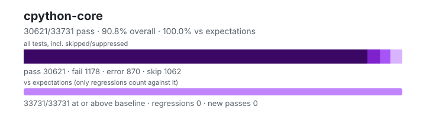

# cpython-core — `1.6.0+b8edacc63`

- Image digest: `7aa30129531a1dc5e6197a4ee68996eefe03c4b338406f80a7cdf57542684d83`
- Suite version: `fd17997c3866d61e0e7bd8201b1d8f35b40a40bd`
- Ran: 2026-09-30T17:09:49.123Z → 2026-09-30T17:25:44.943Z

## Summary

**Pass rate: 30621/33731 (90.78%)** — overall, over all tests including skipped/suppressed

**vs expectations: 33731/33731 (100.00%)** — tests at or above the baseline (only regressions count against it)

| pass | fail | error | skip | regressions | new passes |
|---:|---:|---:|---:|---:|---:|
| 30621 | 1178 | 870 | 1062 | 0 | 0 |

## Observed cases (32669)

- `test_range.RangeTest.test_attributes` — pass
- `test_range.RangeTest.test_comparison` — pass
- `test_range.RangeTest.test_contains` — pass
- `test_range.RangeTest.test_count` — pass
- `test_range.RangeTest.test_empty` — pass
- `test_range.RangeTest.test_exhausted_iterator_pickling` — pass
- `test_range.RangeTest.test_index` — pass
- `test_range.RangeTest.test_invalid_invocation` — pass
- `test_range.RangeTest.test_issue11845` — pass
- `test_range.RangeTest.test_iterator_invalid_setstate` — pass
- `test_range.RangeTest.test_iterator_pickling` — pass
- `test_range.RangeTest.test_iterator_pickling_overflowing_index` — pass
- `test_range.RangeTest.test_iterator_setstate` — pass
- `test_range.RangeTest.test_iterator_unpickle_compat` — pass
- `test_range.RangeTest.test_large_exhausted_iterator_pickling` — pass
- `test_range.RangeTest.test_large_operands` — pass
- `test_range.RangeTest.test_large_range` — pass
- `test_range.RangeTest.test_odd_bug` — pass
- `test_range.RangeTest.test_pickling` — pass
- `test_range.RangeTest.test_range` — pass
- `test_range.RangeTest.test_range_constructor_error_messages` — fail — TypeError: range() missing 1 required positional argument: 'a'

During handling of the above exception, another exception occurred:

Traceback (most recent call last):
  File "/work/.harness/work/cpython-core/cpython-root/Lib/test/test_range.py", line 95, in test_range_constructor_error_messages
    with self.assertRaisesRegex(
         ~~~~~~~~~~~~~~~~~~~~~~^
            TypeError,
            ^^^^^^^^^^
            "range expected at least 1 argument, got 0"
            ^^^^^^^^^^^^^^^^^^^^^^^^^^^^^^^^^^^^^^^^^^^
    ):
    ^
AssertionError: "range expected at least 1 argument, got 0" does not match "range() missing 1 required positional argument: 'a'"

- `test_bool.BoolTest.test_blocked` — pass
- `test_bool.BoolTest.test_bool_called_at_least_once` — pass
- `test_bool.BoolTest.test_bool_new` — pass
- `test_bool.BoolTest.test_boolean` — pass
- `test_bool.BoolTest.test_callable` — pass
- `test_bool.BoolTest.test_complex` — pass
- `test_bool.BoolTest.test_contains` — pass
- `test_bool.BoolTest.test_convert` — pass
- `test_bool.BoolTest.test_convert_to_bool` — pass
- `test_bool.BoolTest.test_fileclosed` — pass
- `test_bool.BoolTest.test_float` — pass
- `test_bool.BoolTest.test_format` — pass
- `test_bool.BoolTest.test_from_bytes` — pass
- `test_bool.BoolTest.test_hasattr` — pass
- `test_bool.BoolTest.test_int` — pass
- `test_bool.BoolTest.test_interpreter_convert_to_bool_raises` — pass
- `test_bool.BoolTest.test_isinstance` — pass
- `test_bool.BoolTest.test_issubclass` — pass
- `test_bool.BoolTest.test_keyword_args` — pass
- `test_bool.BoolTest.test_marshal` — pass
- `test_bool.BoolTest.test_math` — pass
- `test_bool.BoolTest.test_operator` — pass
- `test_bool.BoolTest.test_pickle` — pass
- `test_bool.BoolTest.test_picklevalues` — pass
- `test_bool.BoolTest.test_real_and_imag` — pass
- `test_bool.BoolTest.test_repr` — pass
- `test_bool.BoolTest.test_sane_len` — pass
- `test_bool.BoolTest.test_str` — pass
- `test_bool.BoolTest.test_string` — pass
- `test_bool.BoolTest.test_subclass` — pass
- `test_bool.BoolTest.test_types` — pass
- `test_re.ExternalTests.test_re_benchmarks` — pass
- `test_tuple.TupleTest.test_add` — pass
- `test_tuple.TupleTest.test_bigrepeat` — pass
- `test_tuple.TupleTest.test_cmp` — pass
- `test_tuple.TupleTest.test_constructors` — pass
- `test_tuple.TupleTest.test_contains` — pass
- `test_tuple.TupleTest.test_contains_fake` — pass
- `test_tuple.TupleTest.test_contains_order` — pass
- `test_tuple.TupleTest.test_count` — pass
- `test_tuple.TupleTest.test_getitem` — pass
- `test_tuple.TupleTest.test_getitem_error` — pass
- `test_tuple.TupleTest.test_getitemoverwriteiter` — pass
- `test_tuple.TupleTest.test_getslice` — pass
- `test_tuple.TupleTest.test_hash_optional` — pass
- `test_tuple.TupleTest.test_iadd` — pass
- `test_tuple.TupleTest.test_imul` — pass
- `test_tuple.TupleTest.test_index` — pass
- `test_tuple.TupleTest.test_iterator_pickle` — pass
- `test_tuple.TupleTest.test_keyword_args` — pass
- `test_tuple.TupleTest.test_keywords_in_subclass` — error — Traceback (most recent call last):
  File "/work/.harness/work/cpython-core/cpython-root/Lib/test/test_tuple.py", line 57, in test_keywords_in_subclass
    u = subclass_with_init([1, 2], newarg=3)
TypeError: tuple() got an unexpected keyword argument 'newarg'

- `test_tuple.TupleTest.test_len` — pass
- `test_tuple.TupleTest.test_lexicographic_ordering` — pass
- `test_tuple.TupleTest.test_minmax` — pass
- `test_tuple.TupleTest.test_mul` — pass
- `test_tuple.TupleTest.test_no_comdat_folding` — pass
- `test_tuple.TupleTest.test_pickle` — pass
- `test_tuple.TupleTest.test_repeat` — pass
- `test_tuple.TupleTest.test_repr` — pass
- `test_slice.SliceTest.test_cmp` — pass
- `test_dict.DictTest.test_bad_key` — pass
- `test_dict.DictTest.test_bool` — pass
- `test_dict.DictTest.test_clear` — pass
- `test_dict.DictTest.test_clear_at_lookup` — pass
- `test_dict.DictTest.test_clear_reentrant_cycle` — pass
- `test_dict.DictTest.test_clear_reentrant_delete` — pass
- `test_dict.DictTest.test_clear_reentrant_embedded` — pass
- `test_dict.DictTest.test_clear_reentrant_force_combined` — pass
- `test_dict.DictTest.test_constructor` — pass
- `test_tuple.TupleTest.test_repr_large` — pass
- `test_tuple.TupleTest.test_reversed_pickle` — pass
- `test_tuple.TupleTest.test_subscript` — pass
- `test_tuple.TupleTest.test_truth` — pass
- `test_tuple.TupleTest.test_tupleresizebug` — pass
- `test_yield_from.TestInterestingEdgeCases.test_close_and_throw_raise_base_exception` — pass
- `test_yield_from.TestInterestingEdgeCases.test_close_and_throw_raise_exception` — pass
- `test_yield_from.TestInterestingEdgeCases.test_close_and_throw_raise_generator_exit` — pass
- `test_yield_from.TestInterestingEdgeCases.test_close_and_throw_raise_stop_iteration` — pass
- `test_yield_from.TestInterestingEdgeCases.test_close_and_throw_return` — pass
- `test_list.ListTest.test_add` — pass
- `test_list.ListTest.test_append` — pass
- `test_list.ListTest.test_bigrepeat` — pass
- `test_list.ListTest.test_clear` — pass
- `test_list.ListTest.test_cmp` — pass
- `test_list.ListTest.test_constructor_exception_handling` — pass
- `test_yield_from.TestInterestingEdgeCases.test_close_and_throw_work` — pass
- `test_yield_from.TestInterestingEdgeCases.test_close_and_throw_yield` — pass
- `test_yield_from.TestPEP380Operation.test_attempted_yield_from_loop` — pass
- `test_yield_from.TestPEP380Operation.test_attempting_to_send_to_non_generator` — pass
- `test_yield_from.TestPEP380Operation.test_broken_getattr_handling` — pass
- `test_yield_from.TestPEP380Operation.test_catching_exception_from_subgen_and_returning` — pass
- `test_exceptions.AttributeErrorTests.test_attributes` — pass
- `test_exceptions.AttributeErrorTests.test_getattr_has_name_and_obj` — pass
- `test_exceptions.AttributeErrorTests.test_getattr_has_name_and_obj_for_method` — pass
- `test_list.ListTest.test_constructors` — pass
- `test_list.ListTest.test_contains` — pass
- `test_list.ListTest.test_contains_fake` — pass
- `test_list.ListTest.test_contains_order` — pass
- `test_list.ListTest.test_copy` — pass
- `test_list.ListTest.test_count` — pass
- `test_list.ListTest.test_count_index_remove_crashes` — pass
- `test_list.ListTest.test_delitem` — pass
- `test_exceptions.ExceptionTests.testAttributes` — pass
- `test_exceptions.ExceptionTests.testChainingAttrs` — pass
- `test_exceptions.ExceptionTests.testChainingDescriptors` — pass
- `test_list.ListTest.test_delslice` — pass
- `test_re.ExternalTests.test_re_tests` — pass
- `test_bytes.AssortedBytesTest.test_bytearray_repr` — fail — Traceback (most recent call last):
  File "/work/.harness/work/cpython-core/cpython-root/Lib/test/test_bytes.py", line 2001, in test_bytearray_repr
    self.assertEqual(f(bytearray(b"'")), r'''bytearray(b"\'")''') # "\'"
    ~~~~~~~~~~~~~~~~^^^^^^^^^^^^^^^^^^^^^^^^^^^^^^^^^^^^^^^^^^^^^
AssertionError: 'bytearray(b"\'")' != 'bytearray(b"\\\'")'
- bytearray(b"'")
+ bytearray(b"\'")
?             +

- `test_bytes.AssortedBytesTest.test_bytearray_str` — fail — Traceback (most recent call last):
  File "/work/.harness/work/cpython-core/cpython-root/Lib/test/test_bytes.py", line 2015, in test_bytearray_str
    self.test_bytearray_repr(str)
    ~~~~~~~~~~~~~~~~~~~~~~~~^^^^^
  File "/work/.harness/work/cpython-core/cpython-root/Lib/test/test_bytes.py", line 2001, in test_bytearray_repr
    self.assertEqual(f(bytearray(b"'")), r'''bytearray(b"\'")''') # "\'"
    ~~~~~~~~~~~~~~~~^^^^^^^^^^^^^^^^^^^^^^^^^^^^^^^^^^^^^^^^^^^^^
AssertionError: 'bytearray(b"\'")' != 'bytearray(b"\\\'")'
- bytearray(b"'")
+ bytearray(b"\'")
?             +

- `test_list.ListTest.test_deopt_from_append_list` — pass
- `test_list.ListTest.test_empty_slice` — pass
- `test_list.ListTest.test_equal_operator_modifying_operand` — pass
- `test_list.ListTest.test_exhausted_iterator` — pass
- `test_list.ListTest.test_extend` — pass
- `test_list.ListTest.test_extendedslicing` — pass
- `test_list.ListTest.test_getitem` — pass
- `test_bytes.AssortedBytesTest.test_bytes_repr` — pass
- `test_bytes.AssortedBytesTest.test_bytes_str` — pass
- `test_bytes.AssortedBytesTest.test_compare_bytes_to_bytearray` — pass
- `test_bytes.AssortedBytesTest.test_doc` — pass
- `test_bytes.AssortedBytesTest.test_format` — pass
- `test_bytes.AssortedBytesTest.test_from_bytearray` — pass
- `test_ast.test_ast.ASTConstructorTests.test_FunctionDef` — pass
- `test_re.ImplementationTest.test_deprecated_modules` — pass
- `test_re.ImplementationTest.test_overlap_table` — pass
- `test_re.ImplementationTest.test_signedness` — pass
- `test_bytes.AssortedBytesTest.test_literal` — pass
- `test_bytes.AssortedBytesTest.test_return_self` — pass
- `test_bytes.AssortedBytesTest.test_rsplit_bytearray` — pass
- `test_bytes.AssortedBytesTest.test_split_bytearray` — pass
- `test_re.PatternReprTests.test_bytes` — pass
- `test_bytes.ByteArrayAsStringTest.test_add` — pass
- `test_ast.test_ast.ASTConstructorTests.test_complete_field_types` — pass
- `test_ast.test_ast.ASTConstructorTests.test_custom_attributes` — pass
- `test_ast.test_ast.ASTConstructorTests.test_custom_subclass_with_no_fields` — pass
- `test_re.PatternReprTests.test_flags_repr` — pass
- `test_re.PatternReprTests.test_inline_flags` — pass
- `test_re.PatternReprTests.test_locale` — pass
- `test_ast.test_ast.ASTConstructorTests.test_expr_context` — pass
- `test_ast.test_ast.ASTConstructorTests.test_fields_and_types` — pass
- `test_ast.test_ast.ASTConstructorTests.test_fields_and_types_no_default` — pass
- `test_ast.test_ast.ASTConstructorTests.test_fields_but_no_field_types` — pass
- `test_ast.test_ast.ASTConstructorTests.test_incomplete_field_types` — pass
- `test_bytes.ByteArrayAsStringTest.test_additional_rsplit` — pass
- `test_bytes.ByteArrayAsStringTest.test_additional_split` — pass
- `test_re.PatternReprTests.test_long_pattern` — pass
- `test_re.PatternReprTests.test_multiple_flags` — pass
- `test_re.PatternReprTests.test_quotes` — pass
- `test_re.PatternReprTests.test_single_flag` — pass
- `test_re.PatternReprTests.test_unicode_flag` — pass
- `test_re.PatternReprTests.test_unknown_flags` — pass
- `test_re.PatternReprTests.test_without_flags` — pass
- `test_re.ReTests.test_ASSERT_NOT_mark_bug` — pass
- `test_re.ReTests.test_MARK_PUSH_macro_bug` — pass
- `test_ast.test_ast.ASTConstructorTests.test_malformed_fields_with_bytes` — pass
- `test_bytes.ByteArrayAsStringTest.test_capitalize` — pass
- `test_bytes.ByteArrayAsStringTest.test_center` — pass
- `test_bytes.ByteArrayAsStringTest.test_cmp` — pass
- `test_re.ReTests.test_MIN_REPEAT_ONE_mark_bug` — pass
- `test_re.ReTests.test_MIN_UNTIL_mark_bug` — pass
- `test_re.ReTests.test_REPEAT_ONE_mark_bug` — pass
- `test_re.ReTests.test_anyall` — pass
- `test_list.ListTest.test_getitem_error` — pass
- `test_list.ListTest.test_getitemoverwriteiter` — pass
- `test_list.ListTest.test_getslice` — pass
- `test_list.ListTest.test_iadd` — pass
- `test_list.ListTest.test_identity` — pass
- `test_list.ListTest.test_imul` — pass
- `test_list.ListTest.test_index` — pass
- `test_list.ListTest.test_init` — pass
- `test_ast.test_ast.ASTConstructorTests.test_non_str_kwarg` — fail — TypeError: keywords must be strings

During handling of the above exception, another exception occurred:

Traceback (most recent call last):
  File "/work/.harness/work/cpython-core/cpython-root/Lib/test/test_ast/test_ast.py", line 3162, in test_non_str_kwarg
    with self.assertRaisesRegex(TypeError, "got multiple values for argument"):
         ~~~~~~~~~~~~~~~~~~~~~~^^^^^^^^^^^^^^^^^^^^^^^^^^^^^^^^^^^^^^^^^^^^^^^
AssertionError: "got multiple values for argument" does not match "keywords must be strings"

- `test_ast.test_ast.ASTHelpers_Test.test_bad_integer` — pass
- `test_ast.test_ast.ASTHelpers_Test.test_copy_location` — pass
- `test_ast.test_ast.ASTHelpers_Test.test_dump` — pass
- `test_ast.test_ast.ASTHelpers_Test.test_dump_incomplete` — pass
- `test_ast.test_ast.ASTHelpers_Test.test_dump_indent` — pass
- `test_ast.test_ast.ASTHelpers_Test.test_dump_show_empty` — pass
- `test_ast.test_ast.ASTHelpers_Test.test_elif_stmt_start_position` — pass
- `test_ast.test_ast.ASTHelpers_Test.test_elif_stmt_start_position_with_else` — pass
- …and 32469 more

## Excluded (3051) — unsupported, out of scope or not applicable; in no rate

| tests | reason |
|---:|---|
| 664 | unsupported: CPython implementation detail — the test marks itself CPython-only |
| 648 | not applicable: other platform — Windows-only |
| 551 | out of scope: CPython C API — CPython C-API test suite |
| 237 | out of scope: CPython C accelerator — tests a CPython C accelerator module |
| 221 | out of scope: CPython C API — CPython C-API test module |
| 191 | out of scope: CPython C accelerator — tests the C accelerator of a module that also ships a Python version |
| 131 | unsupported: CPython implementation detail — CPython bytecode (dis); an implementation detail per the docs |
| 65 | unsupported: CPython implementation detail — CPython bytecode peephole optimizer |
| 42 | not applicable: other platform — BSD/Solaris-only selector |
| 40 | not applicable: other platform — macOS-only |
| 31 | unsupported: CPython refcounting/GC — asserts deallocation at refcount zero (CPython refcounting) |
| 29 | not applicable: not provided by the harness — bigmem test; regrtest runs these only with -M |
| 28 | not applicable: not provided by the harness — needs the PyPI tzdata package |
| 23 | out of scope: CPython C accelerator — tests CPython's _bisect C accelerator; the runtime ships the Python bisect |
| 22 | unsupported: CPython implementation detail — PEP 509 dict versions (CPython-only, via _testcapi) |
| 22 | out of scope: CPython C accelerator — CPython C-accelerator detail |
| 21 | out of scope: CPython C API — CPython datetime C API (datetime_CAPI capsule, via _testcapi) |
| 18 | not applicable: not provided by the harness — needs the third-party hypothesis package |
| 13 | not applicable: other platform — 32-bit platforms only |
| 12 | out of scope: CPython C API — CPython vectorcall C API (via _testcapi) |
| 8 | not applicable: other platform — case-insensitive filesystems only |
| 6 | out of scope: CPython subinterpreters — needs subinterpreters |
| 6 | not applicable: not provided by the harness — needs Tk |
| 5 | unsupported: CPython implementation detail — needs a CPython debug build |
| 3 | not applicable: not provided by the harness — needs the third-party numpy package |
| 1 | unsupported: CPython refcounting/GC — weakref/refcount: exception-local object not deterministically freed under JVM GC |
| 1 | unsupported: CPython refcounting/GC — JVM finalization: object __del__ not run at refcount 0, sys.exception() sentinel never cleared |
| 1 | unsupported: CPython implementation detail — exact tuple hash values |
| 1 | unsupported: CPython implementation detail — hash(str)==hash(bytes) is CPython's siphash |
| 1 | unsupported: CPython implementation detail — inspects CPython bytecode via dis |
| 1 | unsupported: CPython refcounting/GC — needs gc.get_objects |
| 1 | unsupported: CPython refcounting/GC — __del__ finalization timing; not run synchronously after del+gc.collect on GraalPy |
| 1 | unsupported: CPython refcounting/GC — instance __del__ counting depends on refcount/GC finalization timing |
| 1 | unsupported: CPython refcounting/GC — finalize/weakref timing: del+gc.collect does not free object under JVM GC |
| 1 | unsupported: CPython refcounting/GC — finalize timing: del does not run finalizer under JVM GC |
| 1 | unsupported: CPython refcounting/GC — finalizer ordering/timing at JVM GC differs from CPython refcount-0 ordering |
| 1 | unsupported: CPython implementation detail — CPython's C startup path calculation (via _testinternalcapi) |
| 1 | unsupported: CPython implementation detail — CPython opcode tables |
| 1 | unsupported: CPython implementation detail — CPython type-attribute cache internals (via _testinternalcapi) |
