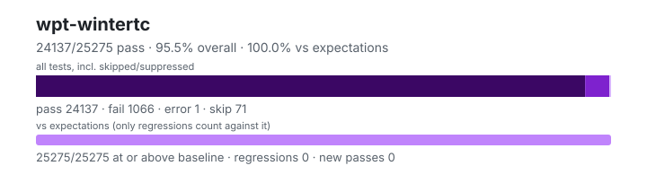

# wpt-wintertc — `1.6.0+b8edacc63`

- Image digest: `7aa30129531a1dc5e6197a4ee68996eefe03c4b338406f80a7cdf57542684d83`
- Suite version: `1eb456f600fedad07c8cd6439796fb81db54faff`
- Ran: 2026-09-30T17:09:49.088Z → 2026-09-30T17:11:01.609Z

## Summary

**Pass rate: 24137/25275 (95.50%)** — overall, over all tests including skipped/suppressed

**vs expectations: 25275/25275 (100.00%)** — tests at or above the baseline (only regressions count against it)

| pass | fail | error | skip | regressions | new passes |
|---:|---:|---:|---:|---:|---:|
| 24137 | 1066 | 1 | 71 | 0 | 0 |

## Observed cases (25204)

- `encoding/api-replacement-encodings.any.js :: Label for "replacement" should be rejected by API: csiso2022kr` — pass
- `encoding/api-replacement-encodings.any.js :: Label for "replacement" should be rejected by API: hz-gb-2312` — pass
- `encoding/api-replacement-encodings.any.js :: Label for "replacement" should be rejected by API: iso-2022-cn` — pass
- `encoding/api-replacement-encodings.any.js :: Label for "replacement" should be rejected by API: iso-2022-cn-ext` — pass
- `encoding/api-replacement-encodings.any.js :: Label for "replacement" should be rejected by API: iso-2022-kr` — pass
- `encoding/api-replacement-encodings.any.js :: Label for "replacement" should be rejected by API: replacement` — pass
- `encoding/api-basics.any.js :: Default encodings` — pass
- `encoding/api-basics.any.js :: Default inputs` — pass
- `encoding/api-basics.any.js :: Encode/decode round trip: utf-8` — pass
- `encoding/api-basics.any.js :: Decode sample: utf-16le` — pass
- `encoding/api-basics.any.js :: Decode sample: utf-16be` — pass
- `encoding/api-basics.any.js :: Decode sample: utf-16` — pass
- `encoding/iso-2022-jp-decoder.any.js :: iso-2022-jp decoder: Error ESC` — pass
- `encoding/iso-2022-jp-decoder.any.js :: iso-2022-jp decoder: Error ESC, character` — pass
- `encoding/iso-2022-jp-decoder.any.js :: iso-2022-jp decoder: ASCII ESC, character` — pass
- `encoding/iso-2022-jp-decoder.any.js :: iso-2022-jp decoder: Double ASCII ESC, character` — pass
- `encoding/iso-2022-jp-decoder.any.js :: iso-2022-jp decoder: character, ASCII ESC, character` — pass
- `encoding/iso-2022-jp-decoder.any.js :: iso-2022-jp decoder: characters` — pass
- `encoding/iso-2022-jp-decoder.any.js :: iso-2022-jp decoder: SO / SI` — pass
- `encoding/iso-2022-jp-decoder.any.js :: iso-2022-jp decoder: Roman ESC, characters` — pass
- `encoding/iso-2022-jp-decoder.any.js :: iso-2022-jp decoder: Roman ESC, SO / SI` — pass
- `encoding/iso-2022-jp-decoder.any.js :: iso-2022-jp decoder: Roman ESC, error ESC, Katakana ESC` — pass
- `encoding/iso-2022-jp-decoder.any.js :: iso-2022-jp decoder: Katakana ESC, character` — pass
- `encoding/iso-2022-jp-decoder.any.js :: iso-2022-jp decoder: Katakana ESC, multibyte ESC, character` — pass
- `encoding/iso-2022-jp-decoder.any.js :: iso-2022-jp decoder: Katakana ESC, error ESC, character` — pass
- `encoding/iso-2022-jp-decoder.any.js :: iso-2022-jp decoder: Katakana ESC, error ESC #2, character` — pass
- `encoding/iso-2022-jp-decoder.any.js :: iso-2022-jp decoder: Katakana ESC, character, Katakana ESC, character` — pass
- `encoding/iso-2022-jp-decoder.any.js :: iso-2022-jp decoder: Katakana ESC, SO / SI` — pass
- `encoding/iso-2022-jp-decoder.any.js :: iso-2022-jp decoder: Multibyte ESC, character` — pass
- `encoding/iso-2022-jp-decoder.any.js :: iso-2022-jp decoder: Multibyte ESC #2, character` — pass
- `encoding/iso-2022-jp-decoder.any.js :: iso-2022-jp decoder: Multibyte ESC, error ESC, character` — pass
- `encoding/iso-2022-jp-decoder.any.js :: iso-2022-jp decoder: Double multibyte ESC` — pass
- `encoding/iso-2022-jp-decoder.any.js :: iso-2022-jp decoder: Double multibyte ESC, character` — pass
- `encoding/iso-2022-jp-decoder.any.js :: iso-2022-jp decoder: Double multibyte ESC #2, character` — pass
- `encoding/iso-2022-jp-decoder.any.js :: iso-2022-jp decoder: Multibyte ESC, error ESC #2, character` — pass
- `encoding/iso-2022-jp-decoder.any.js :: iso-2022-jp decoder: Multibyte ESC, single byte, multibyte ESC, character` — pass
- `encoding/iso-2022-jp-decoder.any.js :: iso-2022-jp decoder: Multibyte ESC, lead error byte` — pass
- `encoding/iso-2022-jp-decoder.any.js :: iso-2022-jp decoder: Multibyte ESC, trail error byte` — pass
- `encoding/iso-2022-jp-decoder.any.js :: iso-2022-jp decoder: character, error ESC` — pass
- `encoding/iso-2022-jp-decoder.any.js :: iso-2022-jp decoder: character, error ESC #2` — pass
- `encoding/iso-2022-jp-decoder.any.js :: iso-2022-jp decoder: character, error ESC #3` — pass
- `encoding/iso-2022-jp-decoder.any.js :: iso-2022-jp decoder: character, ASCII ESC` — pass
- `encoding/iso-2022-jp-decoder.any.js :: iso-2022-jp decoder: character, Roman ESC` — pass
- `encoding/iso-2022-jp-decoder.any.js :: iso-2022-jp decoder: character, Katakana ESC` — pass
- `encoding/iso-2022-jp-decoder.any.js :: iso-2022-jp decoder: character, Multibyte ESC` — pass
- `encoding/iso-2022-jp-decoder.any.js :: iso-2022-jp decoder: character, Multibyte ESC #2` — pass
- `encoding/api-surrogates-utf8.any.js :: Invalid surrogates encoded into UTF-8: Sanity check` — pass
- `encoding/api-surrogates-utf8.any.js :: Invalid surrogates encoded into UTF-8: Surrogate half (low)` — pass
- `encoding/api-surrogates-utf8.any.js :: Invalid surrogates encoded into UTF-8: Surrogate half (high)` — pass
- `encoding/api-surrogates-utf8.any.js :: Invalid surrogates encoded into UTF-8: Surrogate half (low), in a string` — pass
- `encoding/api-surrogates-utf8.any.js :: Invalid surrogates encoded into UTF-8: Surrogate half (high), in a string` — pass
- `encoding/api-surrogates-utf8.any.js :: Invalid surrogates encoded into UTF-8: Wrong order` — pass
- `encoding/legacy-mb-schinese/gbk/gbk-decoder.any.js :: gbk pointer: 6432` — pass
- `encoding/legacy-mb-schinese/gbk/gbk-decoder.any.js :: gbk pointer: 7533` — pass
- `encoding/legacy-mb-schinese/gbk/gbk-decoder.any.js :: gbk pointer: 7536` — pass
- `encoding/legacy-mb-schinese/gbk/gbk-decoder.any.js :: gbk pointer: 7672` — pass
- `encoding/legacy-mb-schinese/gbk/gbk-decoder.any.js :: gbk pointer: 7673` — pass
- `encoding/legacy-mb-schinese/gbk/gbk-decoder.any.js :: gbk pointer: 7674` — pass
- `encoding/legacy-mb-schinese/gbk/gbk-decoder.any.js :: gbk pointer: 7675` — pass
- `encoding/legacy-mb-schinese/gbk/gbk-decoder.any.js :: gbk pointer: 7676` — pass
- `encoding/legacy-mb-schinese/gbk/gbk-decoder.any.js :: gbk pointer: 7677` — pass
- `encoding/legacy-mb-schinese/gbk/gbk-decoder.any.js :: gbk pointer: 7678` — pass
- `encoding/legacy-mb-schinese/gbk/gbk-decoder.any.js :: gbk pointer: 7679` — pass
- `encoding/legacy-mb-schinese/gbk/gbk-decoder.any.js :: gbk pointer: 7680` — pass
- `encoding/legacy-mb-schinese/gbk/gbk-decoder.any.js :: gbk pointer: 7681` — pass
- `encoding/legacy-mb-schinese/gbk/gbk-decoder.any.js :: gbk pointer: 7682` — pass
- `encoding/legacy-mb-schinese/gbk/gbk-decoder.any.js :: gbk pointer: 7683` — pass
- `encoding/legacy-mb-schinese/gbk/gbk-decoder.any.js :: gbk pointer: 7684` — pass
- `encoding/legacy-mb-schinese/gbk/gbk-decoder.any.js :: gbk pointer: 23766` — pass
- `encoding/legacy-mb-schinese/gbk/gbk-decoder.any.js :: gbk pointer: 23770` — pass
- `encoding/legacy-mb-schinese/gbk/gbk-decoder.any.js :: gbk pointer: 23771` — pass
- `encoding/legacy-mb-schinese/gbk/gbk-decoder.any.js :: gbk pointer: 23772` — pass
- `encoding/legacy-mb-schinese/gbk/gbk-decoder.any.js :: gbk pointer: 23773` — pass
- `encoding/legacy-mb-schinese/gbk/gbk-decoder.any.js :: gbk pointer: 23774` — pass
- `encoding/legacy-mb-schinese/gbk/gbk-decoder.any.js :: gbk pointer: 23776` — pass
- `encoding/legacy-mb-schinese/gbk/gbk-decoder.any.js :: gbk pointer: 23777` — pass
- `encoding/legacy-mb-schinese/gbk/gbk-decoder.any.js :: gbk pointer: 23778` — pass
- `encoding/legacy-mb-schinese/gbk/gbk-decoder.any.js :: gbk pointer: 23779` — pass
- `encoding/legacy-mb-schinese/gbk/gbk-decoder.any.js :: gbk pointer: 23780` — pass
- `encoding/legacy-mb-schinese/gbk/gbk-decoder.any.js :: gbk pointer: 23781` — pass
- `encoding/legacy-mb-schinese/gbk/gbk-decoder.any.js :: gbk pointer: 23782` — pass
- `encoding/legacy-mb-schinese/gbk/gbk-decoder.any.js :: gbk pointer: 23784` — pass
- `encoding/legacy-mb-schinese/gbk/gbk-decoder.any.js :: gbk pointer: 23785` — pass
- `encoding/legacy-mb-schinese/gbk/gbk-decoder.any.js :: gbk pointer: 23786` — pass
- `encoding/legacy-mb-schinese/gbk/gbk-decoder.any.js :: gbk pointer: 23787` — pass
- `encoding/legacy-mb-schinese/gbk/gbk-decoder.any.js :: gbk pointer: 23790` — pass
- `encoding/legacy-mb-schinese/gbk/gbk-decoder.any.js :: gbk pointer: 23791` — pass
- `encoding/legacy-mb-schinese/gbk/gbk-decoder.any.js :: gbk pointer: 23792` — pass
- `encoding/legacy-mb-schinese/gbk/gbk-decoder.any.js :: gbk pointer: 23793` — pass
- `encoding/legacy-mb-schinese/gbk/gbk-decoder.any.js :: gbk pointer: 23796` — pass
- `encoding/legacy-mb-schinese/gbk/gbk-decoder.any.js :: gbk pointer: 23797` — pass
- `encoding/legacy-mb-schinese/gbk/gbk-decoder.any.js :: gbk pointer: 23798` — pass
- `encoding/legacy-mb-schinese/gbk/gbk-decoder.any.js :: gbk pointer: 23799` — pass
- `encoding/legacy-mb-schinese/gbk/gbk-decoder.any.js :: gbk pointer: 23800` — pass
- `encoding/legacy-mb-schinese/gbk/gbk-decoder.any.js :: gbk pointer: 23801` — pass
- `encoding/legacy-mb-schinese/gbk/gbk-decoder.any.js :: gbk pointer: 23802` — pass
- `encoding/legacy-mb-schinese/gbk/gbk-decoder.any.js :: gbk pointer: 23803` — pass
- `encoding/legacy-mb-schinese/gbk/gbk-decoder.any.js :: gbk pointer: 23805` — pass
- `encoding/legacy-mb-schinese/gbk/gbk-decoder.any.js :: gbk pointer: 23806` — pass
- `encoding/legacy-mb-schinese/gbk/gbk-decoder.any.js :: gbk pointer: 23807` — pass
- `encoding/legacy-mb-schinese/gbk/gbk-decoder.any.js :: gbk pointer: 23808` — pass
- `encoding/legacy-mb-schinese/gbk/gbk-decoder.any.js :: gbk pointer: 23809` — pass
- `encoding/legacy-mb-schinese/gbk/gbk-decoder.any.js :: gbk pointer: 23810` — pass
- `encoding/legacy-mb-schinese/gbk/gbk-decoder.any.js :: gbk pointer: 23811` — pass
- `encoding/legacy-mb-schinese/gbk/gbk-decoder.any.js :: gbk pointer: 23813` — pass
- `encoding/legacy-mb-schinese/gbk/gbk-decoder.any.js :: gbk pointer: 23814` — pass
- `encoding/legacy-mb-schinese/gbk/gbk-decoder.any.js :: gbk pointer: 23815` — pass
- `encoding/legacy-mb-schinese/gbk/gbk-decoder.any.js :: gbk pointer: 23816` — pass
- `encoding/legacy-mb-schinese/gbk/gbk-decoder.any.js :: gbk pointer: 23817` — pass
- `encoding/legacy-mb-schinese/gbk/gbk-decoder.any.js :: gbk pointer: 23818` — pass
- `encoding/legacy-mb-schinese/gbk/gbk-decoder.any.js :: gbk pointer: 23819` — pass
- `encoding/legacy-mb-schinese/gbk/gbk-decoder.any.js :: gbk pointer: 23820` — pass
- `encoding/legacy-mb-schinese/gbk/gbk-decoder.any.js :: gbk pointer: 23821` — pass
- `encoding/legacy-mb-schinese/gbk/gbk-decoder.any.js :: gbk pointer: 23822` — pass
- `encoding/legacy-mb-schinese/gbk/gbk-decoder.any.js :: gbk pointer: 23823` — pass
- `encoding/legacy-mb-schinese/gbk/gbk-decoder.any.js :: gbk pointer: 23824` — pass
- `encoding/legacy-mb-schinese/gbk/gbk-decoder.any.js :: gbk pointer: 23825` — pass
- `encoding/legacy-mb-schinese/gbk/gbk-decoder.any.js :: gbk pointer: 23826` — pass
- `encoding/legacy-mb-schinese/gbk/gbk-decoder.any.js :: gbk pointer: 23827` — pass
- `encoding/legacy-mb-schinese/gbk/gbk-decoder.any.js :: gbk pointer: 23828` — pass
- `encoding/legacy-mb-schinese/gbk/gbk-decoder.any.js :: gbk pointer: 23831` — pass
- `encoding/legacy-mb-schinese/gbk/gbk-decoder.any.js :: gbk pointer: 23832` — pass
- `encoding/legacy-mb-schinese/gbk/gbk-decoder.any.js :: gbk pointer: 23833` — pass
- `encoding/legacy-mb-schinese/gbk/gbk-decoder.any.js :: gbk pointer: 23834` — pass
- `encoding/legacy-mb-schinese/gbk/gbk-decoder.any.js :: gbk pointer: 23835` — pass
- `encoding/legacy-mb-schinese/gbk/gbk-decoder.any.js :: gbk pointer: 23836` — pass
- `encoding/legacy-mb-schinese/gbk/gbk-decoder.any.js :: gbk pointer: 23837` — pass
- `encoding/legacy-mb-schinese/gbk/gbk-decoder.any.js :: gbk pointer: 23838` — pass
- `encoding/legacy-mb-schinese/gbk/gbk-decoder.any.js :: gbk pointer: 23839` — pass
- `encoding/legacy-mb-schinese/gbk/gbk-decoder.any.js :: gbk pointer: 23840` — pass
- `encoding/legacy-mb-schinese/gbk/gbk-decoder.any.js :: gbk pointer: 23841` — pass
- `encoding/legacy-mb-schinese/gbk/gbk-decoder.any.js :: gbk pointer: 23842` — pass
- `encoding/legacy-mb-schinese/gbk/gbk-decoder.any.js :: gbk pointer: 23843` — pass
- `encoding/legacy-mb-schinese/gbk/gbk-decoder.any.js :: gbk pointer: 23844` — pass
- `encoding/encodeInto.any.js :: encodeInto() into ArrayBuffer with Hi and destination length 0, offset 0, filler 0` — pass
- `encoding/encodeInto.any.js :: encodeInto() into SharedArrayBuffer with Hi and destination length 0, offset 0, filler 0` — fail — sabConstructor is not a constructor
- `encoding/encodeInto.any.js :: encodeInto() into ArrayBuffer with Hi and destination length 0, offset 4, filler 0` — pass
- `encoding/encodeInto.any.js :: encodeInto() into SharedArrayBuffer with Hi and destination length 0, offset 4, filler 0` — fail — sabConstructor is not a constructor
- `encoding/encodeInto.any.js :: encodeInto() into ArrayBuffer with Hi and destination length 0, offset 0, filler 128` — pass
- `encoding/encodeInto.any.js :: encodeInto() into SharedArrayBuffer with Hi and destination length 0, offset 0, filler 128` — fail — sabConstructor is not a constructor
- `encoding/encodeInto.any.js :: encodeInto() into ArrayBuffer with Hi and destination length 0, offset 4, filler 128` — pass
- `encoding/encodeInto.any.js :: encodeInto() into SharedArrayBuffer with Hi and destination length 0, offset 4, filler 128` — fail — sabConstructor is not a constructor
- `encoding/encodeInto.any.js :: encodeInto() into ArrayBuffer with Hi and destination length 0, offset 0, filler random` — pass
- `encoding/encodeInto.any.js :: encodeInto() into SharedArrayBuffer with Hi and destination length 0, offset 0, filler random` — fail — sabConstructor is not a constructor
- `encoding/encodeInto.any.js :: encodeInto() into ArrayBuffer with Hi and destination length 0, offset 4, filler random` — pass
- `encoding/encodeInto.any.js :: encodeInto() into SharedArrayBuffer with Hi and destination length 0, offset 4, filler random` — fail — sabConstructor is not a constructor
- `encoding/encodeInto.any.js :: encodeInto() into ArrayBuffer with A and destination length 10, offset 0, filler 0` — pass
- `encoding/encodeInto.any.js :: encodeInto() into SharedArrayBuffer with A and destination length 10, offset 0, filler 0` — fail — sabConstructor is not a constructor
- `encoding/encodeInto.any.js :: encodeInto() into ArrayBuffer with A and destination length 10, offset 4, filler 0` — pass
- `encoding/encodeInto.any.js :: encodeInto() into SharedArrayBuffer with A and destination length 10, offset 4, filler 0` — fail — sabConstructor is not a constructor
- `encoding/encodeInto.any.js :: encodeInto() into ArrayBuffer with A and destination length 10, offset 0, filler 128` — pass
- `encoding/encodeInto.any.js :: encodeInto() into SharedArrayBuffer with A and destination length 10, offset 0, filler 128` — fail — sabConstructor is not a constructor
- `encoding/encodeInto.any.js :: encodeInto() into ArrayBuffer with A and destination length 10, offset 4, filler 128` — pass
- `encoding/encodeInto.any.js :: encodeInto() into SharedArrayBuffer with A and destination length 10, offset 4, filler 128` — fail — sabConstructor is not a constructor
- `encoding/encodeInto.any.js :: encodeInto() into ArrayBuffer with A and destination length 10, offset 0, filler random` — pass
- `encoding/encodeInto.any.js :: encodeInto() into SharedArrayBuffer with A and destination length 10, offset 0, filler random` — fail — sabConstructor is not a constructor
- `encoding/encodeInto.any.js :: encodeInto() into ArrayBuffer with A and destination length 10, offset 4, filler random` — pass
- `encoding/encodeInto.any.js :: encodeInto() into SharedArrayBuffer with A and destination length 10, offset 4, filler random` — fail — sabConstructor is not a constructor
- `encoding/encodeInto.any.js :: encodeInto() into ArrayBuffer with 𝌆 and destination length 4, offset 0, filler 0` — pass
- `encoding/encodeInto.any.js :: encodeInto() into SharedArrayBuffer with 𝌆 and destination length 4, offset 0, filler 0` — fail — sabConstructor is not a constructor
- `encoding/encodeInto.any.js :: encodeInto() into ArrayBuffer with 𝌆 and destination length 4, offset 4, filler 0` — pass
- `encoding/encodeInto.any.js :: encodeInto() into SharedArrayBuffer with 𝌆 and destination length 4, offset 4, filler 0` — fail — sabConstructor is not a constructor
- `encoding/encodeInto.any.js :: encodeInto() into ArrayBuffer with 𝌆 and destination length 4, offset 0, filler 128` — pass
- `encoding/encodeInto.any.js :: encodeInto() into SharedArrayBuffer with 𝌆 and destination length 4, offset 0, filler 128` — fail — sabConstructor is not a constructor
- `encoding/encodeInto.any.js :: encodeInto() into ArrayBuffer with 𝌆 and destination length 4, offset 4, filler 128` — pass
- `encoding/encodeInto.any.js :: encodeInto() into SharedArrayBuffer with 𝌆 and destination length 4, offset 4, filler 128` — fail — sabConstructor is not a constructor
- `encoding/encodeInto.any.js :: encodeInto() into ArrayBuffer with 𝌆 and destination length 4, offset 0, filler random` — pass
- `encoding/encodeInto.any.js :: encodeInto() into SharedArrayBuffer with 𝌆 and destination length 4, offset 0, filler random` — fail — sabConstructor is not a constructor
- `encoding/encodeInto.any.js :: encodeInto() into ArrayBuffer with 𝌆 and destination length 4, offset 4, filler random` — pass
- `encoding/encodeInto.any.js :: encodeInto() into SharedArrayBuffer with 𝌆 and destination length 4, offset 4, filler random` — fail — sabConstructor is not a constructor
- `encoding/encodeInto.any.js :: encodeInto() into ArrayBuffer with 𝌆A and destination length 3, offset 0, filler 0` — pass
- `encoding/encodeInto.any.js :: encodeInto() into SharedArrayBuffer with 𝌆A and destination length 3, offset 0, filler 0` — fail — sabConstructor is not a constructor
- `encoding/encodeInto.any.js :: encodeInto() into ArrayBuffer with 𝌆A and destination length 3, offset 4, filler 0` — pass
- `encoding/encodeInto.any.js :: encodeInto() into SharedArrayBuffer with 𝌆A and destination length 3, offset 4, filler 0` — fail — sabConstructor is not a constructor
- `encoding/encodeInto.any.js :: encodeInto() into ArrayBuffer with 𝌆A and destination length 3, offset 0, filler 128` — pass
- `encoding/encodeInto.any.js :: encodeInto() into SharedArrayBuffer with 𝌆A and destination length 3, offset 0, filler 128` — fail — sabConstructor is not a constructor
- `encoding/encodeInto.any.js :: encodeInto() into ArrayBuffer with 𝌆A and destination length 3, offset 4, filler 128` — pass
- `encoding/encodeInto.any.js :: encodeInto() into SharedArrayBuffer with 𝌆A and destination length 3, offset 4, filler 128` — fail — sabConstructor is not a constructor
- `encoding/encodeInto.any.js :: encodeInto() into ArrayBuffer with 𝌆A and destination length 3, offset 0, filler random` — pass
- `encoding/encodeInto.any.js :: encodeInto() into SharedArrayBuffer with 𝌆A and destination length 3, offset 0, filler random` — fail — sabConstructor is not a constructor
- `encoding/encodeInto.any.js :: encodeInto() into ArrayBuffer with 𝌆A and destination length 3, offset 4, filler random` — pass
- `encoding/encodeInto.any.js :: encodeInto() into SharedArrayBuffer with 𝌆A and destination length 3, offset 4, filler random` — fail — sabConstructor is not a constructor
- `encoding/encodeInto.any.js :: encodeInto() into ArrayBuffer with U+d834AU+df06A¥Hi and destination length 10, offset 0, filler 0` — pass
- `encoding/encodeInto.any.js :: encodeInto() into SharedArrayBuffer with U+d834AU+df06A¥Hi and destination length 10, offset 0, filler 0` — fail — sabConstructor is not a constructor
- `encoding/encodeInto.any.js :: encodeInto() into ArrayBuffer with U+d834AU+df06A¥Hi and destination length 10, offset 4, filler 0` — pass
- `encoding/encodeInto.any.js :: encodeInto() into SharedArrayBuffer with U+d834AU+df06A¥Hi and destination length 10, offset 4, filler 0` — fail — sabConstructor is not a constructor
- `encoding/encodeInto.any.js :: encodeInto() into ArrayBuffer with U+d834AU+df06A¥Hi and destination length 10, offset 0, filler 128` — pass
- `encoding/encodeInto.any.js :: encodeInto() into SharedArrayBuffer with U+d834AU+df06A¥Hi and destination length 10, offset 0, filler 128` — fail — sabConstructor is not a constructor
- `encoding/encodeInto.any.js :: encodeInto() into ArrayBuffer with U+d834AU+df06A¥Hi and destination length 10, offset 4, filler 128` — pass
- `encoding/encodeInto.any.js :: encodeInto() into SharedArrayBuffer with U+d834AU+df06A¥Hi and destination length 10, offset 4, filler 128` — fail — sabConstructor is not a constructor
- `encoding/encodeInto.any.js :: encodeInto() into ArrayBuffer with U+d834AU+df06A¥Hi and destination length 10, offset 0, filler random` — pass
- `encoding/encodeInto.any.js :: encodeInto() into SharedArrayBuffer with U+d834AU+df06A¥Hi and destination length 10, offset 0, filler random` — fail — sabConstructor is not a constructor
- `encoding/encodeInto.any.js :: encodeInto() into ArrayBuffer with U+d834AU+df06A¥Hi and destination length 10, offset 4, filler random` — pass
- `encoding/encodeInto.any.js :: encodeInto() into SharedArrayBuffer with U+d834AU+df06A¥Hi and destination length 10, offset 4, filler random` — fail — sabConstructor is not a constructor
- `encoding/encodeInto.any.js :: encodeInto() into ArrayBuffer with AU+df06 and destination length 4, offset 0, filler 0` — pass
- `encoding/encodeInto.any.js :: encodeInto() into SharedArrayBuffer with AU+df06 and destination length 4, offset 0, filler 0` — fail — sabConstructor is not a constructor
- `encoding/encodeInto.any.js :: encodeInto() into ArrayBuffer with AU+df06 and destination length 4, offset 4, filler 0` — pass
- `encoding/encodeInto.any.js :: encodeInto() into SharedArrayBuffer with AU+df06 and destination length 4, offset 4, filler 0` — fail — sabConstructor is not a constructor
- `encoding/encodeInto.any.js :: encodeInto() into ArrayBuffer with AU+df06 and destination length 4, offset 0, filler 128` — pass
- `encoding/encodeInto.any.js :: encodeInto() into SharedArrayBuffer with AU+df06 and destination length 4, offset 0, filler 128` — fail — sabConstructor is not a constructor
- …and 25004 more

## Excluded (3638) — unsupported, out of scope or not applicable; in no rate

| tests | reason |
|---:|---|
| 2756 | unsupported: browser-only — needs a DOM (document, iframe, navigation or media elements) |
| 522 | unsupported: browser-only — tests <a>/<area> element URL parsing |
| 168 | unsupported: browser-only — XMLHttpRequest / document encoding variants |
| 140 | unsupported: CORS preflight (browser security model; not enforced by server runtimes) |
| 40 | unsupported: CORS enforcement (browser security model; not enforced by server runtimes) |
| 12 | unsupported: Cross-Origin-Resource-Policy enforcement (browser security model; not enforced by server runtimes) |
