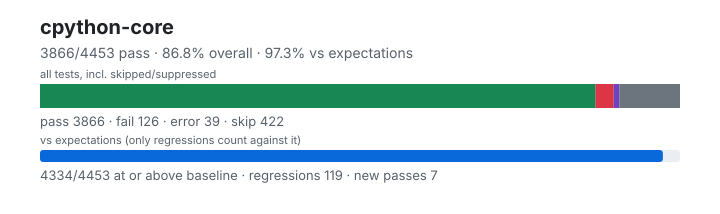

# cpython-core — `1.6.0+dd7116a51`

- Image digest: `2cccc16871e167acc63a9ed16dea7832c0b60ad31a2604564619df92b18da30e`
- Suite version: `fd17997c3866d61e0e7bd8201b1d8f35b40a40bd`
- Ran: 2026-09-25T18:24:53.516Z → 2026-09-25T18:26:43.853Z

## Summary

**Pass rate: 3866/4453 (95.91%)**

| pass | fail | error | skip | regressions | new passes |
|---:|---:|---:|---:|---:|---:|
| 3866 | 126 | 39 | 422 | 119 | 7 |

## Observed cases (4031)

- `test_slice.SliceTest.test_cmp` — pass
- `test_slice.SliceTest.test_constructor` — pass
- `test_slice.SliceTest.test_copy` — pass
- `test_range.RangeTest.test_attributes` — pass
- `test_range.RangeTest.test_comparison` — pass
- `test_range.RangeTest.test_contains` — pass
- `test_range.RangeTest.test_count` — pass
- `test_range.RangeTest.test_empty` — pass
- `test_range.RangeTest.test_exhausted_iterator_pickling` — pass
- `test_range.RangeTest.test_index` — pass
- `test_range.RangeTest.test_invalid_invocation` — pass
- `test_range.RangeTest.test_issue11845` — pass
- `test_range.RangeTest.test_iterator_invalid_setstate` — pass
- `test_list.ListTest.test_add` — pass
- `test_list.ListTest.test_append` — pass
- `test_list.ListTest.test_bigrepeat` — pass
- `test_list.ListTest.test_clear` — pass
- `test_list.ListTest.test_cmp` — pass
- `test_list.ListTest.test_constructor_exception_handling` — pass
- `test_list.ListTest.test_constructors` — pass
- `test_list.ListTest.test_contains` — pass
- `test_list.ListTest.test_contains_fake` — pass
- `test_list.ListTest.test_contains_order` — pass
- `test_list.ListTest.test_copy` — pass
- `test_list.ListTest.test_count` — pass
- `test_list.ListTest.test_count_index_remove_crashes` — pass
- `test_list.ListTest.test_delitem` — pass
- `test_list.ListTest.test_delslice` — pass
- `test_range.RangeTest.test_iterator_pickling` — pass
- `test_range.RangeTest.test_iterator_pickling_overflowing_index` — pass
- `test_range.RangeTest.test_iterator_setstate` — pass
- `test_range.RangeTest.test_iterator_unpickle_compat` — pass
- `test_range.RangeTest.test_large_exhausted_iterator_pickling` — pass
- `test_range.RangeTest.test_large_operands` — pass
- `test_range.RangeTest.test_large_range` — pass
- `test_range.RangeTest.test_odd_bug` — pass
- `test_range.RangeTest.test_pickling` — pass
- `test_range.RangeTest.test_range` — pass
- `test_range.RangeTest.test_range_constructor_error_messages` — fail — TypeError: range() missing 1 required positional argument: 'a'

During handling of the above exception, another exception occurred:

Traceback (most recent call last):
  File "/work/suites/cpython/Lib/test/test_range.py", line 95, in test_range_constructor_error_messages
    with self.assertRaisesRegex(
         ~~~~~~~~~~~~~~~~~~~~~~^
            TypeError,
            ^^^^^^^^^^
            "range expected at least 1 argument, got 0"
            ^^^^^^^^^^^^^^^^^^^^^^^^^^^^^^^^^^^^^^^^^^^
    ):
    ^
AssertionError: "range expected at least 1 argument, got 0" does not match "range() missing 1 required positional argument: 'a'"

- `test_list.ListTest.test_deopt_from_append_list` — pass
- `test_list.ListTest.test_empty_slice` — pass
- `test_list.ListTest.test_equal_operator_modifying_operand` — pass
- `test_list.ListTest.test_exhausted_iterator` — pass
- `test_list.ListTest.test_extend` — pass
- `test_list.ListTest.test_extendedslicing` — pass
- `test_list.ListTest.test_getitem` — pass
- `test_list.ListTest.test_getitem_error` — pass
- `test_list.ListTest.test_getitemoverwriteiter` — pass
- `test_list.ListTest.test_getslice` — pass
- `test_list.ListTest.test_iadd` — pass
- `test_list.ListTest.test_identity` — pass
- `test_list.ListTest.test_imul` — pass
- `test_list.ListTest.test_index` — pass
- `test_list.ListTest.test_init` — pass
- `test_list.ListTest.test_insert` — pass
- `test_list.ListTest.test_iterator_pickle` — pass
- `test_list.ListTest.test_keyword_args` — pass
- `test_list.ListTest.test_keywords_in_subclass` — error — Traceback (most recent call last):
  File "/work/suites/cpython/Lib/test/test_list.py", line 74, in test_keywords_in_subclass
    u = subclass_with_new([1, 2], newarg=3)
TypeError: list() got an unexpected keyword argument 'newarg'

- `test_list.ListTest.test_len` — pass
- `test_list.ListTest.test_list_index_modifing_operand` — fail — Traceback (most recent call last):
  File "/work/suites/cpython/Lib/test/test_list.py", line 274, in test_list_index_modifing_operand
    with self.assertRaises(ValueError):
         ~~~~~~~~~~~~~~~~~^^^^^^^^^^^^
AssertionError: ValueError not raised

- `test_list.ListTest.test_list_resize_overflow` — pass
- `test_list.ListTest.test_lt_operator_modifying_operand` — pass
- `test_list.ListTest.test_minmax` — pass
- `test_list.ListTest.test_mul` — pass
- `test_list.ListTest.test_no_comdat_folding` — pass
- `test_list.ListTest.test_overflow` — pass
- `test_list.ListTest.test_pickle` — pass
- `test_list.ListTest.test_pop` — pass
- `test_list.ListTest.test_remove` — pass
- `test_list.ListTest.test_repeat` — pass
- `test_list.ListTest.test_repr` — pass
- `test_bool.BoolTest.test_blocked` — pass
- `test_bool.BoolTest.test_bool_called_at_least_once` — pass
- `test_bool.BoolTest.test_bool_new` — pass
- `test_bool.BoolTest.test_boolean` — pass
- `test_bool.BoolTest.test_callable` — pass
- `test_bool.BoolTest.test_complex` — pass
- `test_bool.BoolTest.test_contains` — pass
- `test_bool.BoolTest.test_convert` — pass
- `test_bool.BoolTest.test_convert_to_bool` — pass
- `test_bool.BoolTest.test_fileclosed` — pass
- `test_bool.BoolTest.test_float` — pass
- `test_bool.BoolTest.test_format` — pass
- `test_list.ListTest.test_repr_deep` — pass
- `test_bool.BoolTest.test_from_bytes` — pass
- `test_bool.BoolTest.test_hasattr` — pass
- `test_bool.BoolTest.test_int` — pass
- `test_bool.BoolTest.test_interpreter_convert_to_bool_raises` — pass
- `test_bool.BoolTest.test_isinstance` — pass
- `test_bool.BoolTest.test_issubclass` — pass
- `test_bool.BoolTest.test_keyword_args` — pass
- `test_bool.BoolTest.test_marshal` — pass
- `test_bool.BoolTest.test_math` — pass
- `test_bool.BoolTest.test_operator` — pass
- `test_bool.BoolTest.test_pickle` — pass
- `test_bool.BoolTest.test_picklevalues` — pass
- `test_bool.BoolTest.test_real_and_imag` — pass
- `test_bool.BoolTest.test_repr` — pass
- `test_bool.BoolTest.test_sane_len` — pass
- `test_bool.BoolTest.test_str` — pass
- `test_bool.BoolTest.test_string` — pass
- `test_bool.BoolTest.test_subclass` — pass
- `test_bool.BoolTest.test_types` — pass
- `test_tuple.TupleTest.test_add` — pass
- `test_tuple.TupleTest.test_bigrepeat` — pass
- `test_tuple.TupleTest.test_cmp` — pass
- `test_tuple.TupleTest.test_constructors` — pass
- `test_tuple.TupleTest.test_contains` — pass
- `test_tuple.TupleTest.test_contains_fake` — pass
- `test_tuple.TupleTest.test_contains_order` — pass
- `test_tuple.TupleTest.test_count` — pass
- `test_tuple.TupleTest.test_getitem` — pass
- `test_tuple.TupleTest.test_getitem_error` — pass
- `test_tuple.TupleTest.test_getitemoverwriteiter` — pass
- `test_tuple.TupleTest.test_getslice` — pass
- `test_tuple.TupleTest.test_hash_optional` — pass
- `test_tuple.TupleTest.test_iadd` — pass
- `test_tuple.TupleTest.test_imul` — pass
- `test_tuple.TupleTest.test_index` — pass
- `test_tuple.TupleTest.test_iterator_pickle` — pass
- `test_tuple.TupleTest.test_keyword_args` — pass
- `test_tuple.TupleTest.test_keywords_in_subclass` — error — Traceback (most recent call last):
  File "/work/suites/cpython/Lib/test/test_tuple.py", line 57, in test_keywords_in_subclass
    u = subclass_with_init([1, 2], newarg=3)
TypeError: tuple() got an unexpected keyword argument 'newarg'

- `test_tuple.TupleTest.test_len` — pass
- `test_tuple.TupleTest.test_lexicographic_ordering` — pass
- `test_tuple.TupleTest.test_minmax` — pass
- `test_tuple.TupleTest.test_mul` — pass
- `test_tuple.TupleTest.test_no_comdat_folding` — pass
- `test_tuple.TupleTest.test_pickle` — pass
- `test_tuple.TupleTest.test_repeat` — pass
- `test_tuple.TupleTest.test_repr` — pass
- `test_dict.DictTest.test_bad_key` — pass
- `test_dict.DictTest.test_bool` — pass
- `test_dict.DictTest.test_clear` — pass
- `test_dict.DictTest.test_clear_at_lookup` — pass
- `test_dict.DictTest.test_clear_reentrant_cycle` — pass
- `test_dict.DictTest.test_clear_reentrant_delete` — pass
- `test_dict.DictTest.test_clear_reentrant_embedded` — pass
- `test_dict.DictTest.test_clear_reentrant_force_combined` — pass
- `test_dict.DictTest.test_constructor` — pass
- `test_slice.SliceTest.test_cycle` — pass
- `test_slice.SliceTest.test_deepcopy` — pass
- `test_slice.SliceTest.test_hash` — pass
- `test_re.ExternalTests.test_re_benchmarks` — pass
- `test_tuple.TupleTest.test_repr_large` — pass
- `test_tuple.TupleTest.test_reversed_pickle` — pass
- `test_tuple.TupleTest.test_subscript` — pass
- `test_tuple.TupleTest.test_truth` — pass
- `test_tuple.TupleTest.test_tupleresizebug` — pass
- `test_set.TestBasicOpsBytes.test_copy` — pass
- `test_set.TestBasicOpsBytes.test_empty_difference` — pass
- `test_set.TestBasicOpsBytes.test_empty_difference_rev` — pass
- `test_set.TestBasicOpsBytes.test_empty_intersection` — pass
- `test_set.TestBasicOpsBytes.test_empty_isdisjoint` — pass
- `test_set.TestBasicOpsBytes.test_empty_symmetric_difference` — pass
- `test_set.TestBasicOpsBytes.test_empty_union` — pass
- `test_set.TestBasicOpsBytes.test_equivalent_equality` — pass
- `test_set.TestBasicOpsBytes.test_intersection_empty` — pass
- `test_set.TestBasicOpsBytes.test_isdisjoint_empty` — pass
- `test_list.ListTest.test_repr_large` — pass
- `test_set.TestBasicOpsBytes.test_issue_37219` — pass
- `test_set.TestBasicOpsBytes.test_iteration` — pass
- `test_set.TestBasicOpsBytes.test_length` — pass
- `test_set.TestBasicOpsBytes.test_pickling` — pass
- `test_set.TestBasicOpsBytes.test_repr` — pass
- `test_set.TestBasicOpsBytes.test_self_difference` — pass
- `test_set.TestBasicOpsBytes.test_self_equality` — pass
- `test_set.TestBasicOpsBytes.test_self_intersection` — pass
- `test_set.TestBasicOpsBytes.test_self_isdisjoint` — pass
- `test_set.TestBasicOpsBytes.test_self_symmetric_difference` — pass
- `test_set.TestBasicOpsBytes.test_self_union` — pass
- `test_set.TestBasicOpsBytes.test_union_empty` — pass
- `test_set.TestBasicOpsEmpty.test_copy` — pass
- `test_set.TestBasicOpsEmpty.test_empty_difference` — pass
- `test_set.TestBasicOpsEmpty.test_empty_difference_rev` — pass
- `test_set.TestBasicOpsEmpty.test_empty_intersection` — pass
- `test_set.TestBasicOpsEmpty.test_empty_isdisjoint` — pass
- `test_set.TestBasicOpsEmpty.test_empty_symmetric_difference` — pass
- `test_set.TestBasicOpsEmpty.test_empty_union` — pass
- `test_set.TestBasicOpsEmpty.test_equivalent_equality` — pass
- `test_set.TestBasicOpsEmpty.test_intersection_empty` — pass
- `test_set.TestBasicOpsEmpty.test_isdisjoint_empty` — pass
- `test_set.TestBasicOpsEmpty.test_issue_37219` — pass
- `test_set.TestBasicOpsEmpty.test_iteration` — pass
- `test_set.TestBasicOpsEmpty.test_length` — pass
- `test_set.TestBasicOpsEmpty.test_pickling` — pass
- `test_set.TestBasicOpsEmpty.test_repr` — pass
- `test_set.TestBasicOpsEmpty.test_self_difference` — pass
- `test_set.TestBasicOpsEmpty.test_self_equality` — pass
- `test_set.TestBasicOpsEmpty.test_self_intersection` — pass
- `test_set.TestBasicOpsEmpty.test_self_isdisjoint` — pass
- `test_set.TestBasicOpsEmpty.test_self_symmetric_difference` — pass
- `test_set.TestBasicOpsEmpty.test_self_union` — pass
- `test_set.TestBasicOpsEmpty.test_union_empty` — pass
- `test_list.ListTest.test_repr_mutate` — error — Traceback (most recent call last):
  File "/work/suites/cpython/Lib/test/test_list.py", line 130, in test_repr_mutate
    self.assertEqual(repr(mylist), '[obj, obj, obj]')
                     ~~~~^^^^^^^^
IndexError: index out of range

- `test_list.ListTest.test_reverse` — pass
- `test_list.ListTest.test_reversed` — pass
- `test_yield_from.TestInterestingEdgeCases.test_close_and_throw_raise_base_exception` — pass
- `test_yield_from.TestInterestingEdgeCases.test_close_and_throw_raise_exception` — pass
- `test_set.TestBasicOpsMixedStringBytes.test_copy` — pass
- `test_set.TestBasicOpsMixedStringBytes.test_empty_difference` — pass
- …and 3831 more

## ❌ Regressions (119)

- `test_list.ListTest.test_repr_mutate` — Traceback (most recent call last):
  File "/work/suites/cpython/Lib/test/test_list.py", line 130, in test_repr_mutate
    self.assertEqual(repr(mylist), '[obj, obj, obj]')
                     ~~~~^^^^^^^^
IndexError: index out of range

- `test_bytes.AssortedBytesTest.test_bytearray_repr` — Traceback (most recent call last):
  File "/work/suites/cpython/Lib/test/test_bytes.py", line 2001, in test_bytearray_repr
    self.assertEqual(f(bytearray(b"'")), r'''bytearray(b"\'")''') # "\'"
    ~~~~~~~~~~~~~~~~^^^^^^^^^^^^^^^^^^^^^^^^^^^^^^^^^^^^^^^^^^^^^
AssertionError: 'bytearray(b"\'")' != 'bytearray(b"\\\'")'
- bytearray(b"'")
+ bytearray(b"\'")
?             +

- `test_bytes.AssortedBytesTest.test_bytearray_str` — Traceback (most recent call last):
  File "/work/suites/cpython/Lib/test/test_bytes.py", line 2015, in test_bytearray_str
    self.test_bytearray_repr(str)
    ~~~~~~~~~~~~~~~~~~~~~~~~^^^^^
  File "/work/suites/cpython/Lib/test/test_bytes.py", line 2001, in test_bytearray_repr
    self.assertEqual(f(bytearray(b"'")), r'''bytearray(b"\'")''') # "\'"
    ~~~~~~~~~~~~~~~~^^^^^^^^^^^^^^^^^^^^^^^^^^^^^^^^^^^^^^^^^^^^^
AssertionError: 'bytearray(b"\'")' != 'bytearray(b"\\\'")'
- bytearray(b"'")
+ bytearray(b"\'")
?             +

- `test_ast.test_ast.ASTConstructorTests.test_non_str_kwarg` — TypeError: keywords must be strings

During handling of the above exception, another exception occurred:

Traceback (most recent call last):
  File "/work/suites/cpython/Lib/test/test_ast/test_ast.py", line 3162, in test_non_str_kwarg
    with self.assertRaisesRegex(TypeError, "got multiple values for argument"):
         ~~~~~~~~~~~~~~~~~~~~~~^^^^^^^^^^^^^^^^^^^^^^^^^^^^^^^^^^^^^^^^^^^^^^^
AssertionError: "got multiple values for argument" does not match "keywords must be strings"

- `test_fstring.TestCase.test_fstring_without_formatting_bytecode` — Traceback (most recent call last):
  File "/work/suites/cpython/Lib/test/test_fstring.py", line 1780, in test_fstring_without_formatting_bytecode
    self.assertEqual(get_code(f"'{s}'"), get_code(f"f'{s}'"))
                     ~~~~~~~~^^^^^^^^^^
  File "/work/suites/cpython/Lib/test/test_fstring.py", line 1777, in get_code
    return [(i.opname, i.oparg) for i in dis.get_instructions(s)]
                                         ~~~~~~~~~~~~~~~~~~~~^^^
  File "/opt/elide/lib/resources/python/python-home/lib/python3.13/dis.py", line 604, in get_instructions
    raise NotImplementedError("dis module is not supported on GraalPy")
NotImplementedError: dis module is not supported on GraalPy

- `test_call.TestCallingConventions.test_fastcall_error_kw` — TypeError: meth_fastcall() got an unexpected keyword argument 'k'

During handling of the above exception, another exception occurred:

Traceback (most recent call last):
  File "/work/suites/cpython/Lib/test/test_call.py", line 375, in test_fastcall_error_kw
    self.assertRaisesRegex(
    ~~~~~~~~~~~~~~~~~~~~~~^
        TypeError, msg, lambda: self.obj.meth_fastcall(k=1),
        ^^^^^^^^^^^^^^^^^^^^^^^^^^^^^^^^^^^^^^^^^^^^^^^^^^^^
    )
    ^
AssertionError: "meth_fastcall\(\) takes no keyword arguments" does not match "meth_fastcall() got an unexpected keyword argument 'k'"

- `test_call.TestCallingConventions.test_noargs_error_arg` — TypeError: meth_noargs() takes 0 positional arguments but 1 was given

During handling of the above exception, another exception occurred:

Traceback (most recent call last):
  File "/work/suites/cpython/Lib/test/test_call.py", line 339, in test_noargs_error_arg
    self.assertRaisesRegex(
    ~~~~~~~~~~~~~~~~~~~~~~^
        TypeError, msg, lambda: self.obj.meth_noargs(1),
        ^^^^^^^^^^^^^^^^^^^^^^^^^^^^^^^^^^^^^^^^^^^^^^^^
    )
    ^
AssertionError: "meth_noargs\(\) takes no arguments \(1 given\)" does not match "meth_noargs() takes 0 positional arguments but 1 was given"

- `test_call.TestCallingConventions.test_noargs_error_arg2` — TypeError: meth_noargs() takes 0 positional arguments but 2 were given

During handling of the above exception, another exception occurred:

Traceback (most recent call last):
  File "/work/suites/cpython/Lib/test/test_call.py", line 345, in test_noargs_error_arg2
    self.assertRaisesRegex(
    ~~~~~~~~~~~~~~~~~~~~~~^
        TypeError, msg, lambda: self.obj.meth_noargs(1, 2),
        ^^^^^^^^^^^^^^^^^^^^^^^^^^^^^^^^^^^^^^^^^^^^^^^^^^^
    )
    ^
AssertionError: "meth_noargs\(\) takes no arguments \(2 given\)" does not match "meth_noargs() takes 0 positional arguments but 2 were given"

- `test_call.TestCallingConventions.test_noargs_error_ext` — TypeError: meth_noargs() takes 0 positional arguments but 3 were given

During handling of the above exception, another exception occurred:

Traceback (most recent call last):
  File "/work/suites/cpython/Lib/test/test_call.py", line 351, in test_noargs_error_ext
    self.assertRaisesRegex(
    ~~~~~~~~~~~~~~~~~~~~~~^
        TypeError, msg, lambda: self.obj.meth_noargs(*(1, 2, 3)),
        ^^^^^^^^^^^^^^^^^^^^^^^^^^^^^^^^^^^^^^^^^^^^^^^^^^^^^^^^^
    )
    ^
AssertionError: "meth_noargs\(\) takes no arguments \(3 given\)" does not match "meth_noargs() takes 0 positional arguments but 3 were given"

- `test_call.TestCallingConventions.test_noargs_error_kw` — TypeError: meth_noargs() got an unexpected keyword argument 'k'

During handling of the above exception, another exception occurred:

Traceback (most recent call last):
  File "/work/suites/cpython/Lib/test/test_call.py", line 357, in test_noargs_error_kw
    self.assertRaisesRegex(
    ~~~~~~~~~~~~~~~~~~~~~~^
        TypeError, msg, lambda: self.obj.meth_noargs(k=1),
        ^^^^^^^^^^^^^^^^^^^^^^^^^^^^^^^^^^^^^^^^^^^^^^^^^^
    )
    ^
AssertionError: "meth_noargs\(\) takes no keyword arguments" does not match "meth_noargs() got an unexpected keyword argument 'k'"

- `test_call.TestCallingConventions.test_o_error_arg_kw` — TypeError: meth_o() got an unexpected keyword argument 'k'

During handling of the above exception, another exception occurred:

Traceback (most recent call last):
  File "/work/suites/cpython/Lib/test/test_call.py", line 327, in test_o_error_arg_kw
    self.assertRaisesRegex(
    ~~~~~~~~~~~~~~~~~~~~~~^
        TypeError, msg, lambda: self.obj.meth_o(k=1),
        ^^^^^^^^^^^^^^^^^^^^^^^^^^^^^^^^^^^^^^^^^^^^^
    )
    ^
AssertionError: "meth_o\(\) takes no keyword arguments" does not match "meth_o() got an unexpected keyword argument 'k'"

- `test_call.TestCallingConventions.test_o_error_ext` — TypeError: meth_o() takes 1 positional argument but 3 were given

During handling of the above exception, another exception occurred:

Traceback (most recent call last):
  File "/work/suites/cpython/Lib/test/test_call.py", line 315, in test_o_error_ext
    self.assertRaisesRegex(
    ~~~~~~~~~~~~~~~~~~~~~~^
        TypeError, msg, lambda: self.obj.meth_o(*(1, 2, 3)),
        ^^^^^^^^^^^^^^^^^^^^^^^^^^^^^^^^^^^^^^^^^^^^^^^^^^^^
    )
    ^
AssertionError: "meth_o\(\) takes exactly one argument \(3 given\)" does not match "meth_o() takes 1 positional argument but 3 were given"

- `test_call.TestCallingConventions.test_o_error_kw` — TypeError: meth_o() got an unexpected keyword argument 'k'

During handling of the above exception, another exception occurred:

Traceback (most recent call last):
  File "/work/suites/cpython/Lib/test/test_call.py", line 321, in test_o_error_kw
    self.assertRaisesRegex(
    ~~~~~~~~~~~~~~~~~~~~~~^
        TypeError, msg, lambda: self.obj.meth_o(k=1),
        ^^^^^^^^^^^^^^^^^^^^^^^^^^^^^^^^^^^^^^^^^^^^^
    )
    ^
AssertionError: "meth_o\(\) takes no keyword arguments" does not match "meth_o() got an unexpected keyword argument 'k'"

- `test_call.TestCallingConventions.test_o_error_no_arg` — TypeError: meth_o() missing 1 required positional argument: 'arg'

During handling of the above exception, another exception occurred:

Traceback (most recent call last):
  File "/work/suites/cpython/Lib/test/test_call.py", line 305, in test_o_error_no_arg
    self.assertRaisesRegex(TypeError, msg, self.obj.meth_o)
    ~~~~~~~~~~~~~~~~~~~~~~^^^^^^^^^^^^^^^^^^^^^^^^^^^^^^^^^
AssertionError: "meth_o\(\) takes exactly one argument \(0 given\)" does not match "meth_o() missing 1 required positional argument: 'arg'"

- `test_call.TestCallingConventions.test_o_error_two_args` — TypeError: meth_o() takes 1 positional argument but 2 were given

During handling of the above exception, another exception occurred:

Traceback (most recent call last):
  File "/work/suites/cpython/Lib/test/test_call.py", line 309, in test_o_error_two_args
    self.assertRaisesRegex(
    ~~~~~~~~~~~~~~~~~~~~~~^
        TypeError, msg, lambda: self.obj.meth_o(1, 2),
        ^^^^^^^^^^^^^^^^^^^^^^^^^^^^^^^^^^^^^^^^^^^^^^
    )
    ^
AssertionError: "meth_o\(\) takes exactly one argument \(2 given\)" does not match "meth_o() takes 1 positional argument but 2 were given"

- `test_call.TestCallingConventions.test_varargs_error_kw` — TypeError: meth_varargs() got an unexpected keyword argument 'k'

During handling of the above exception, another exception occurred:

Traceback (most recent call last):
  File "/work/suites/cpython/Lib/test/test_call.py", line 281, in test_varargs_error_kw
    self.assertRaisesRegex(
    ~~~~~~~~~~~~~~~~~~~~~~^
        TypeError, msg, lambda: self.obj.meth_varargs(k=1),
        ^^^^^^^^^^^^^^^^^^^^^^^^^^^^^^^^^^^^^^^^^^^^^^^^^^^
    )
    ^
AssertionError: "meth_varargs\(\) takes no keyword arguments" does not match "meth_varargs() got an unexpected keyword argument 'k'"

- `test_call.TestCallingConventionsClass.test_fastcall_error_kw` — TypeError: MethClass.meth_fastcall() got an unexpected keyword argument 'k'

During handling of the above exception, another exception occurred:

Traceback (most recent call last):
  File "/work/suites/cpython/Lib/test/test_call.py", line 375, in test_fastcall_error_kw
    self.assertRaisesRegex(
    ~~~~~~~~~~~~~~~~~~~~~~^
        TypeError, msg, lambda: self.obj.meth_fastcall(k=1),
        ^^^^^^^^^^^^^^^^^^^^^^^^^^^^^^^^^^^^^^^^^^^^^^^^^^^^
    )
    ^
AssertionError: "meth_fastcall\(\) takes no keyword arguments" does not match "MethClass.meth_fastcall() got an unexpected keyword argument 'k'"

- `test_call.TestCallingConventionsClass.test_noargs_error_arg` — TypeError: MethClass.meth_noargs() takes 1 positional argument but 2 were given

During handling of the above exception, another exception occurred:

Traceback (most recent call last):
  File "/work/suites/cpython/Lib/test/test_call.py", line 339, in test_noargs_error_arg
    self.assertRaisesRegex(
    ~~~~~~~~~~~~~~~~~~~~~~^
        TypeError, msg, lambda: self.obj.meth_noargs(1),
        ^^^^^^^^^^^^^^^^^^^^^^^^^^^^^^^^^^^^^^^^^^^^^^^^
    )
    ^
AssertionError: "meth_noargs\(\) takes no arguments \(1 given\)" does not match "MethClass.meth_noargs() takes 1 positional argument but 2 were given"

- `test_call.TestCallingConventionsClass.test_noargs_error_arg2` — TypeError: MethClass.meth_noargs() takes 1 positional argument but 3 were given

During handling of the above exception, another exception occurred:

Traceback (most recent call last):
  File "/work/suites/cpython/Lib/test/test_call.py", line 345, in test_noargs_error_arg2
    self.assertRaisesRegex(
    ~~~~~~~~~~~~~~~~~~~~~~^
        TypeError, msg, lambda: self.obj.meth_noargs(1, 2),
        ^^^^^^^^^^^^^^^^^^^^^^^^^^^^^^^^^^^^^^^^^^^^^^^^^^^
    )
    ^
AssertionError: "meth_noargs\(\) takes no arguments \(2 given\)" does not match "MethClass.meth_noargs() takes 1 positional argument but 3 were given"

- `test_call.TestCallingConventionsClass.test_noargs_error_ext` — TypeError: MethClass.meth_noargs() takes 1 positional argument but 4 were given

During handling of the above exception, another exception occurred:

Traceback (most recent call last):
  File "/work/suites/cpython/Lib/test/test_call.py", line 351, in test_noargs_error_ext
    self.assertRaisesRegex(
    ~~~~~~~~~~~~~~~~~~~~~~^
        TypeError, msg, lambda: self.obj.meth_noargs(*(1, 2, 3)),
        ^^^^^^^^^^^^^^^^^^^^^^^^^^^^^^^^^^^^^^^^^^^^^^^^^^^^^^^^^
    )
    ^
AssertionError: "meth_noargs\(\) takes no arguments \(3 given\)" does not match "MethClass.meth_noargs() takes 1 positional argument but 4 were given"

- `test_call.TestCallingConventionsClass.test_noargs_error_kw` — TypeError: MethClass.meth_noargs() got an unexpected keyword argument 'k'

During handling of the above exception, another exception occurred:

Traceback (most recent call last):
  File "/work/suites/cpython/Lib/test/test_call.py", line 357, in test_noargs_error_kw
    self.assertRaisesRegex(
    ~~~~~~~~~~~~~~~~~~~~~~^
        TypeError, msg, lambda: self.obj.meth_noargs(k=1),
        ^^^^^^^^^^^^^^^^^^^^^^^^^^^^^^^^^^^^^^^^^^^^^^^^^^
    )
    ^
AssertionError: "meth_noargs\(\) takes no keyword arguments" does not match "MethClass.meth_noargs() got an unexpected keyword argument 'k'"

- `test_call.TestCallingConventionsClass.test_o_error_arg_kw` — TypeError: MethClass.meth_o() got an unexpected keyword argument 'k'

During handling of the above exception, another exception occurred:

Traceback (most recent call last):
  File "/work/suites/cpython/Lib/test/test_call.py", line 327, in test_o_error_arg_kw
    self.assertRaisesRegex(
    ~~~~~~~~~~~~~~~~~~~~~~^
        TypeError, msg, lambda: self.obj.meth_o(k=1),
        ^^^^^^^^^^^^^^^^^^^^^^^^^^^^^^^^^^^^^^^^^^^^^
    )
    ^
AssertionError: "meth_o\(\) takes no keyword arguments" does not match "MethClass.meth_o() got an unexpected keyword argument 'k'"

- `test_call.TestCallingConventionsClass.test_o_error_ext` — TypeError: MethClass.meth_o() takes 2 positional arguments but 4 were given

During handling of the above exception, another exception occurred:

Traceback (most recent call last):
  File "/work/suites/cpython/Lib/test/test_call.py", line 315, in test_o_error_ext
    self.assertRaisesRegex(
    ~~~~~~~~~~~~~~~~~~~~~~^
        TypeError, msg, lambda: self.obj.meth_o(*(1, 2, 3)),
        ^^^^^^^^^^^^^^^^^^^^^^^^^^^^^^^^^^^^^^^^^^^^^^^^^^^^
    )
    ^
AssertionError: "meth_o\(\) takes exactly one argument \(3 given\)" does not match "MethClass.meth_o() takes 2 positional arguments but 4 were given"

- `test_call.TestCallingConventionsClass.test_o_error_kw` — TypeError: MethClass.meth_o() got an unexpected keyword argument 'k'

During handling of the above exception, another exception occurred:

Traceback (most recent call last):
  File "/work/suites/cpython/Lib/test/test_call.py", line 321, in test_o_error_kw
    self.assertRaisesRegex(
    ~~~~~~~~~~~~~~~~~~~~~~^
        TypeError, msg, lambda: self.obj.meth_o(k=1),
        ^^^^^^^^^^^^^^^^^^^^^^^^^^^^^^^^^^^^^^^^^^^^^
    )
    ^
AssertionError: "meth_o\(\) takes no keyword arguments" does not match "MethClass.meth_o() got an unexpected keyword argument 'k'"

- `test_call.TestCallingConventionsClass.test_o_error_no_arg` — TypeError: MethClass.meth_o() missing 1 required positional argument: 'arg'

During handling of the above exception, another exception occurred:

Traceback (most recent call last):
  File "/work/suites/cpython/Lib/test/test_call.py", line 305, in test_o_error_no_arg
    self.assertRaisesRegex(TypeError, msg, self.obj.meth_o)
    ~~~~~~~~~~~~~~~~~~~~~~^^^^^^^^^^^^^^^^^^^^^^^^^^^^^^^^^
AssertionError: "meth_o\(\) takes exactly one argument \(0 given\)" does not match "MethClass.meth_o() missing 1 required positional argument: 'arg'"

- `test_call.TestCallingConventionsClass.test_o_error_two_args` — TypeError: MethClass.meth_o() takes 2 positional arguments but 3 were given

During handling of the above exception, another exception occurred:

Traceback (most recent call last):
  File "/work/suites/cpython/Lib/test/test_call.py", line 309, in test_o_error_two_args
    self.assertRaisesRegex(
    ~~~~~~~~~~~~~~~~~~~~~~^
        TypeError, msg, lambda: self.obj.meth_o(1, 2),
        ^^^^^^^^^^^^^^^^^^^^^^^^^^^^^^^^^^^^^^^^^^^^^^
    )
    ^
AssertionError: "meth_o\(\) takes exactly one argument \(2 given\)" does not match "MethClass.meth_o() takes 2 positional arguments but 3 were given"

- `test_call.TestCallingConventionsClass.test_varargs_error_kw` — TypeError: MethClass.meth_varargs() got an unexpected keyword argument 'k'

During handling of the above exception, another exception occurred:

Traceback (most recent call last):
  File "/work/suites/cpython/Lib/test/test_call.py", line 281, in test_varargs_error_kw
    self.assertRaisesRegex(
    ~~~~~~~~~~~~~~~~~~~~~~^
        TypeError, msg, lambda: self.obj.meth_varargs(k=1),
        ^^^^^^^^^^^^^^^^^^^^^^^^^^^^^^^^^^^^^^^^^^^^^^^^^^^
    )
    ^
AssertionError: "meth_varargs\(\) takes no keyword arguments" does not match "MethClass.meth_varargs() got an unexpected keyword argument 'k'"

- `test_call.TestCallingConventionsClassInstance.test_fastcall_error_kw` — TypeError: MethClass.meth_fastcall() got an unexpected keyword argument 'k'

During handling of the above exception, another exception occurred:

Traceback (most recent call last):
  File "/work/suites/cpython/Lib/test/test_call.py", line 375, in test_fastcall_error_kw
    self.assertRaisesRegex(
    ~~~~~~~~~~~~~~~~~~~~~~^
        TypeError, msg, lambda: self.obj.meth_fastcall(k=1),
        ^^^^^^^^^^^^^^^^^^^^^^^^^^^^^^^^^^^^^^^^^^^^^^^^^^^^
    )
    ^
AssertionError: "meth_fastcall\(\) takes no keyword arguments" does not match "MethClass.meth_fastcall() got an unexpected keyword argument 'k'"

- `test_call.TestCallingConventionsClassInstance.test_noargs_error_arg` — TypeError: MethClass.meth_noargs() takes 1 positional argument but 2 were given

During handling of the above exception, another exception occurred:

Traceback (most recent call last):
  File "/work/suites/cpython/Lib/test/test_call.py", line 339, in test_noargs_error_arg
    self.assertRaisesRegex(
    ~~~~~~~~~~~~~~~~~~~~~~^
        TypeError, msg, lambda: self.obj.meth_noargs(1),
        ^^^^^^^^^^^^^^^^^^^^^^^^^^^^^^^^^^^^^^^^^^^^^^^^
    )
    ^
AssertionError: "meth_noargs\(\) takes no arguments \(1 given\)" does not match "MethClass.meth_noargs() takes 1 positional argument but 2 were given"

- `test_call.TestCallingConventionsClassInstance.test_noargs_error_arg2` — TypeError: MethClass.meth_noargs() takes 1 positional argument but 3 were given

During handling of the above exception, another exception occurred:

Traceback (most recent call last):
  File "/work/suites/cpython/Lib/test/test_call.py", line 345, in test_noargs_error_arg2
    self.assertRaisesRegex(
    ~~~~~~~~~~~~~~~~~~~~~~^
        TypeError, msg, lambda: self.obj.meth_noargs(1, 2),
        ^^^^^^^^^^^^^^^^^^^^^^^^^^^^^^^^^^^^^^^^^^^^^^^^^^^
    )
    ^
AssertionError: "meth_noargs\(\) takes no arguments \(2 given\)" does not match "MethClass.meth_noargs() takes 1 positional argument but 3 were given"

- `test_call.TestCallingConventionsClassInstance.test_noargs_error_ext` — TypeError: MethClass.meth_noargs() takes 1 positional argument but 4 were given

During handling of the above exception, another exception occurred:

Traceback (most recent call last):
  File "/work/suites/cpython/Lib/test/test_call.py", line 351, in test_noargs_error_ext
    self.assertRaisesRegex(
    ~~~~~~~~~~~~~~~~~~~~~~^
        TypeError, msg, lambda: self.obj.meth_noargs(*(1, 2, 3)),
        ^^^^^^^^^^^^^^^^^^^^^^^^^^^^^^^^^^^^^^^^^^^^^^^^^^^^^^^^^
    )
    ^
AssertionError: "meth_noargs\(\) takes no arguments \(3 given\)" does not match "MethClass.meth_noargs() takes 1 positional argument but 4 were given"

- `test_call.TestCallingConventionsClassInstance.test_noargs_error_kw` — TypeError: MethClass.meth_noargs() got an unexpected keyword argument 'k'

During handling of the above exception, another exception occurred:

Traceback (most recent call last):
  File "/work/suites/cpython/Lib/test/test_call.py", line 357, in test_noargs_error_kw
    self.assertRaisesRegex(
    ~~~~~~~~~~~~~~~~~~~~~~^
        TypeError, msg, lambda: self.obj.meth_noargs(k=1),
        ^^^^^^^^^^^^^^^^^^^^^^^^^^^^^^^^^^^^^^^^^^^^^^^^^^
    )
    ^
AssertionError: "meth_noargs\(\) takes no keyword arguments" does not match "MethClass.meth_noargs() got an unexpected keyword argument 'k'"

- `test_call.TestCallingConventionsClassInstance.test_o_error_arg_kw` — TypeError: MethClass.meth_o() got an unexpected keyword argument 'k'

During handling of the above exception, another exception occurred:

Traceback (most recent call last):
  File "/work/suites/cpython/Lib/test/test_call.py", line 327, in test_o_error_arg_kw
    self.assertRaisesRegex(
    ~~~~~~~~~~~~~~~~~~~~~~^
        TypeError, msg, lambda: self.obj.meth_o(k=1),
        ^^^^^^^^^^^^^^^^^^^^^^^^^^^^^^^^^^^^^^^^^^^^^
    )
    ^
AssertionError: "meth_o\(\) takes no keyword arguments" does not match "MethClass.meth_o() got an unexpected keyword argument 'k'"

- `test_call.TestCallingConventionsClassInstance.test_o_error_ext` — TypeError: MethClass.meth_o() takes 2 positional arguments but 4 were given

During handling of the above exception, another exception occurred:

Traceback (most recent call last):
  File "/work/suites/cpython/Lib/test/test_call.py", line 315, in test_o_error_ext
    self.assertRaisesRegex(
    ~~~~~~~~~~~~~~~~~~~~~~^
        TypeError, msg, lambda: self.obj.meth_o(*(1, 2, 3)),
        ^^^^^^^^^^^^^^^^^^^^^^^^^^^^^^^^^^^^^^^^^^^^^^^^^^^^
    )
    ^
AssertionError: "meth_o\(\) takes exactly one argument \(3 given\)" does not match "MethClass.meth_o() takes 2 positional arguments but 4 were given"

- `test_call.TestCallingConventionsClassInstance.test_o_error_kw` — TypeError: MethClass.meth_o() got an unexpected keyword argument 'k'

During handling of the above exception, another exception occurred:

Traceback (most recent call last):
  File "/work/suites/cpython/Lib/test/test_call.py", line 321, in test_o_error_kw
    self.assertRaisesRegex(
    ~~~~~~~~~~~~~~~~~~~~~~^
        TypeError, msg, lambda: self.obj.meth_o(k=1),
        ^^^^^^^^^^^^^^^^^^^^^^^^^^^^^^^^^^^^^^^^^^^^^
    )
    ^
AssertionError: "meth_o\(\) takes no keyword arguments" does not match "MethClass.meth_o() got an unexpected keyword argument 'k'"

- `test_call.TestCallingConventionsClassInstance.test_o_error_no_arg` — TypeError: MethClass.meth_o() missing 1 required positional argument: 'arg'

During handling of the above exception, another exception occurred:

Traceback (most recent call last):
  File "/work/suites/cpython/Lib/test/test_call.py", line 305, in test_o_error_no_arg
    self.assertRaisesRegex(TypeError, msg, self.obj.meth_o)
    ~~~~~~~~~~~~~~~~~~~~~~^^^^^^^^^^^^^^^^^^^^^^^^^^^^^^^^^
AssertionError: "meth_o\(\) takes exactly one argument \(0 given\)" does not match "MethClass.meth_o() missing 1 required positional argument: 'arg'"

- `test_call.TestCallingConventionsClassInstance.test_o_error_two_args` — TypeError: MethClass.meth_o() takes 2 positional arguments but 3 were given

During handling of the above exception, another exception occurred:

Traceback (most recent call last):
  File "/work/suites/cpython/Lib/test/test_call.py", line 309, in test_o_error_two_args
    self.assertRaisesRegex(
    ~~~~~~~~~~~~~~~~~~~~~~^
        TypeError, msg, lambda: self.obj.meth_o(1, 2),
        ^^^^^^^^^^^^^^^^^^^^^^^^^^^^^^^^^^^^^^^^^^^^^^
    )
    ^
AssertionError: "meth_o\(\) takes exactly one argument \(2 given\)" does not match "MethClass.meth_o() takes 2 positional arguments but 3 were given"

- `test_call.TestCallingConventionsClassInstance.test_varargs_error_kw` — TypeError: MethClass.meth_varargs() got an unexpected keyword argument 'k'

During handling of the above exception, another exception occurred:

Traceback (most recent call last):
  File "/work/suites/cpython/Lib/test/test_call.py", line 281, in test_varargs_error_kw
    self.assertRaisesRegex(
    ~~~~~~~~~~~~~~~~~~~~~~^
        TypeError, msg, lambda: self.obj.meth_varargs(k=1),
        ^^^^^^^^^^^^^^^^^^^^^^^^^^^^^^^^^^^^^^^^^^^^^^^^^^^
    )
    ^
AssertionError: "meth_varargs\(\) takes no keyword arguments" does not match "MethClass.meth_varargs() got an unexpected keyword argument 'k'"

- `test_call.TestCallingConventionsInstance.test_fastcall_error_kw` — TypeError: MethInstance.meth_fastcall() got an unexpected keyword argument 'k'

During handling of the above exception, another exception occurred:

Traceback (most recent call last):
  File "/work/suites/cpython/Lib/test/test_call.py", line 375, in test_fastcall_error_kw
    self.assertRaisesRegex(
    ~~~~~~~~~~~~~~~~~~~~~~^
        TypeError, msg, lambda: self.obj.meth_fastcall(k=1),
        ^^^^^^^^^^^^^^^^^^^^^^^^^^^^^^^^^^^^^^^^^^^^^^^^^^^^
    )
    ^
AssertionError: "meth_fastcall\(\) takes no keyword arguments" does not match "MethInstance.meth_fastcall() got an unexpected keyword argument 'k'"

- `test_call.TestCallingConventionsInstance.test_noargs_error_arg` — TypeError: MethInstance.meth_noargs() takes 1 positional argument but 2 were given

During handling of the above exception, another exception occurred:

Traceback (most recent call last):
  File "/work/suites/cpython/Lib/test/test_call.py", line 339, in test_noargs_error_arg
    self.assertRaisesRegex(
    ~~~~~~~~~~~~~~~~~~~~~~^
        TypeError, msg, lambda: self.obj.meth_noargs(1),
        ^^^^^^^^^^^^^^^^^^^^^^^^^^^^^^^^^^^^^^^^^^^^^^^^
    )
    ^
AssertionError: "meth_noargs\(\) takes no arguments \(1 given\)" does not match "MethInstance.meth_noargs() takes 1 positional argument but 2 were given"

- `test_call.TestCallingConventionsInstance.test_noargs_error_arg2` — TypeError: MethInstance.meth_noargs() takes 1 positional argument but 3 were given

During handling of the above exception, another exception occurred:

Traceback (most recent call last):
  File "/work/suites/cpython/Lib/test/test_call.py", line 345, in test_noargs_error_arg2
    self.assertRaisesRegex(
    ~~~~~~~~~~~~~~~~~~~~~~^
        TypeError, msg, lambda: self.obj.meth_noargs(1, 2),
        ^^^^^^^^^^^^^^^^^^^^^^^^^^^^^^^^^^^^^^^^^^^^^^^^^^^
    )
    ^
AssertionError: "meth_noargs\(\) takes no arguments \(2 given\)" does not match "MethInstance.meth_noargs() takes 1 positional argument but 3 were given"

- `test_call.TestCallingConventionsInstance.test_noargs_error_ext` — TypeError: MethInstance.meth_noargs() takes 1 positional argument but 4 were given

During handling of the above exception, another exception occurred:

Traceback (most recent call last):
  File "/work/suites/cpython/Lib/test/test_call.py", line 351, in test_noargs_error_ext
    self.assertRaisesRegex(
    ~~~~~~~~~~~~~~~~~~~~~~^
        TypeError, msg, lambda: self.obj.meth_noargs(*(1, 2, 3)),
        ^^^^^^^^^^^^^^^^^^^^^^^^^^^^^^^^^^^^^^^^^^^^^^^^^^^^^^^^^
    )
    ^
AssertionError: "meth_noargs\(\) takes no arguments \(3 given\)" does not match "MethInstance.meth_noargs() takes 1 positional argument but 4 were given"

- `test_compile` — ModuleNotFoundError("No module named '_testinternalcapi'")
- `test_call.TestCallingConventionsInstance.test_noargs_error_kw` — TypeError: MethInstance.meth_noargs() got an unexpected keyword argument 'k'

During handling of the above exception, another exception occurred:

Traceback (most recent call last):
  File "/work/suites/cpython/Lib/test/test_call.py", line 357, in test_noargs_error_kw
    self.assertRaisesRegex(
    ~~~~~~~~~~~~~~~~~~~~~~^
        TypeError, msg, lambda: self.obj.meth_noargs(k=1),
        ^^^^^^^^^^^^^^^^^^^^^^^^^^^^^^^^^^^^^^^^^^^^^^^^^^
    )
    ^
AssertionError: "meth_noargs\(\) takes no keyword arguments" does not match "MethInstance.meth_noargs() got an unexpected keyword argument 'k'"

- `test_call.TestCallingConventionsInstance.test_o_error_arg_kw` — TypeError: MethInstance.meth_o() got an unexpected keyword argument 'k'

During handling of the above exception, another exception occurred:

Traceback (most recent call last):
  File "/work/suites/cpython/Lib/test/test_call.py", line 327, in test_o_error_arg_kw
    self.assertRaisesRegex(
    ~~~~~~~~~~~~~~~~~~~~~~^
        TypeError, msg, lambda: self.obj.meth_o(k=1),
        ^^^^^^^^^^^^^^^^^^^^^^^^^^^^^^^^^^^^^^^^^^^^^
    )
    ^
AssertionError: "meth_o\(\) takes no keyword arguments" does not match "MethInstance.meth_o() got an unexpected keyword argument 'k'"

- `test_call.TestCallingConventionsInstance.test_o_error_ext` — TypeError: MethInstance.meth_o() takes 2 positional arguments but 4 were given

During handling of the above exception, another exception occurred:

Traceback (most recent call last):
  File "/work/suites/cpython/Lib/test/test_call.py", line 315, in test_o_error_ext
    self.assertRaisesRegex(
    ~~~~~~~~~~~~~~~~~~~~~~^
        TypeError, msg, lambda: self.obj.meth_o(*(1, 2, 3)),
        ^^^^^^^^^^^^^^^^^^^^^^^^^^^^^^^^^^^^^^^^^^^^^^^^^^^^
    )
    ^
AssertionError: "meth_o\(\) takes exactly one argument \(3 given\)" does not match "MethInstance.meth_o() takes 2 positional arguments but 4 were given"

- `test_call.TestCallingConventionsInstance.test_o_error_kw` — TypeError: MethInstance.meth_o() got an unexpected keyword argument 'k'

During handling of the above exception, another exception occurred:

Traceback (most recent call last):
  File "/work/suites/cpython/Lib/test/test_call.py", line 321, in test_o_error_kw
    self.assertRaisesRegex(
    ~~~~~~~~~~~~~~~~~~~~~~^
        TypeError, msg, lambda: self.obj.meth_o(k=1),
        ^^^^^^^^^^^^^^^^^^^^^^^^^^^^^^^^^^^^^^^^^^^^^
    )
    ^
AssertionError: "meth_o\(\) takes no keyword arguments" does not match "MethInstance.meth_o() got an unexpected keyword argument 'k'"

- `test_call.TestCallingConventionsInstance.test_o_error_no_arg` — TypeError: MethInstance.meth_o() missing 1 required positional argument: 'arg'

During handling of the above exception, another exception occurred:

Traceback (most recent call last):
  File "/work/suites/cpython/Lib/test/test_call.py", line 305, in test_o_error_no_arg
    self.assertRaisesRegex(TypeError, msg, self.obj.meth_o)
    ~~~~~~~~~~~~~~~~~~~~~~^^^^^^^^^^^^^^^^^^^^^^^^^^^^^^^^^
AssertionError: "meth_o\(\) takes exactly one argument \(0 given\)" does not match "MethInstance.meth_o() missing 1 required positional argument: 'arg'"

- `test_call.TestCallingConventionsInstance.test_o_error_two_args` — TypeError: MethInstance.meth_o() takes 2 positional arguments but 3 were given

During handling of the above exception, another exception occurred:

Traceback (most recent call last):
  File "/work/suites/cpython/Lib/test/test_call.py", line 309, in test_o_error_two_args
    self.assertRaisesRegex(
    ~~~~~~~~~~~~~~~~~~~~~~^
        TypeError, msg, lambda: self.obj.meth_o(1, 2),
        ^^^^^^^^^^^^^^^^^^^^^^^^^^^^^^^^^^^^^^^^^^^^^^
    )
    ^
AssertionError: "meth_o\(\) takes exactly one argument \(2 given\)" does not match "MethInstance.meth_o() takes 2 positional arguments but 3 were given"

- `test_call.TestCallingConventionsInstance.test_varargs_error_kw` — TypeError: MethInstance.meth_varargs() got an unexpected keyword argument 'k'

During handling of the above exception, another exception occurred:

Traceback (most recent call last):
  File "/work/suites/cpython/Lib/test/test_call.py", line 281, in test_varargs_error_kw
    self.assertRaisesRegex(
    ~~~~~~~~~~~~~~~~~~~~~~^
        TypeError, msg, lambda: self.obj.meth_varargs(k=1),
        ^^^^^^^^^^^^^^^^^^^^^^^^^^^^^^^^^^^^^^^^^^^^^^^^^^^
    )
    ^
AssertionError: "meth_varargs\(\) takes no keyword arguments" does not match "MethInstance.meth_varargs() got an unexpected keyword argument 'k'"

- `test_call.TestCallingConventionsStatic.test_fastcall_error_kw` — TypeError: MethStatic.meth_fastcall() got an unexpected keyword argument 'k'

During handling of the above exception, another exception occurred:

Traceback (most recent call last):
  File "/work/suites/cpython/Lib/test/test_call.py", line 375, in test_fastcall_error_kw
    self.assertRaisesRegex(
    ~~~~~~~~~~~~~~~~~~~~~~^
        TypeError, msg, lambda: self.obj.meth_fastcall(k=1),
        ^^^^^^^^^^^^^^^^^^^^^^^^^^^^^^^^^^^^^^^^^^^^^^^^^^^^
    )
    ^
AssertionError: "meth_fastcall\(\) takes no keyword arguments" does not match "MethStatic.meth_fastcall() got an unexpected keyword argument 'k'"

- `test_call.TestCallingConventionsStatic.test_noargs_error_arg` — TypeError: MethStatic.meth_noargs() takes 1 positional argument but 2 were given

During handling of the above exception, another exception occurred:

Traceback (most recent call last):
  File "/work/suites/cpython/Lib/test/test_call.py", line 339, in test_noargs_error_arg
    self.assertRaisesRegex(
    ~~~~~~~~~~~~~~~~~~~~~~^
        TypeError, msg, lambda: self.obj.meth_noargs(1),
        ^^^^^^^^^^^^^^^^^^^^^^^^^^^^^^^^^^^^^^^^^^^^^^^^
    )
    ^
AssertionError: "meth_noargs\(\) takes no arguments \(1 given\)" does not match "MethStatic.meth_noargs() takes 1 positional argument but 2 were given"

- `test_call.TestCallingConventionsStatic.test_noargs_error_arg2` — TypeError: MethStatic.meth_noargs() takes 1 positional argument but 3 were given

During handling of the above exception, another exception occurred:

Traceback (most recent call last):
  File "/work/suites/cpython/Lib/test/test_call.py", line 345, in test_noargs_error_arg2
    self.assertRaisesRegex(
    ~~~~~~~~~~~~~~~~~~~~~~^
        TypeError, msg, lambda: self.obj.meth_noargs(1, 2),
        ^^^^^^^^^^^^^^^^^^^^^^^^^^^^^^^^^^^^^^^^^^^^^^^^^^^
    )
    ^
AssertionError: "meth_noargs\(\) takes no arguments \(2 given\)" does not match "MethStatic.meth_noargs() takes 1 positional argument but 3 were given"

- `test_call.TestCallingConventionsStatic.test_noargs_error_ext` — TypeError: MethStatic.meth_noargs() takes 1 positional argument but 4 were given

During handling of the above exception, another exception occurred:

Traceback (most recent call last):
  File "/work/suites/cpython/Lib/test/test_call.py", line 351, in test_noargs_error_ext
    self.assertRaisesRegex(
    ~~~~~~~~~~~~~~~~~~~~~~^
        TypeError, msg, lambda: self.obj.meth_noargs(*(1, 2, 3)),
        ^^^^^^^^^^^^^^^^^^^^^^^^^^^^^^^^^^^^^^^^^^^^^^^^^^^^^^^^^
    )
    ^
AssertionError: "meth_noargs\(\) takes no arguments \(3 given\)" does not match "MethStatic.meth_noargs() takes 1 positional argument but 4 were given"

- `test_call.TestCallingConventionsStatic.test_noargs_error_kw` — TypeError: MethStatic.meth_noargs() got an unexpected keyword argument 'k'

During handling of the above exception, another exception occurred:

Traceback (most recent call last):
  File "/work/suites/cpython/Lib/test/test_call.py", line 357, in test_noargs_error_kw
    self.assertRaisesRegex(
    ~~~~~~~~~~~~~~~~~~~~~~^
        TypeError, msg, lambda: self.obj.meth_noargs(k=1),
        ^^^^^^^^^^^^^^^^^^^^^^^^^^^^^^^^^^^^^^^^^^^^^^^^^^
    )
    ^
AssertionError: "meth_noargs\(\) takes no keyword arguments" does not match "MethStatic.meth_noargs() got an unexpected keyword argument 'k'"

- `test_call.TestCallingConventionsStatic.test_o_error_arg_kw` — TypeError: MethStatic.meth_o() got an unexpected keyword argument 'k'

During handling of the above exception, another exception occurred:

Traceback (most recent call last):
  File "/work/suites/cpython/Lib/test/test_call.py", line 327, in test_o_error_arg_kw
    self.assertRaisesRegex(
    ~~~~~~~~~~~~~~~~~~~~~~^
        TypeError, msg, lambda: self.obj.meth_o(k=1),
        ^^^^^^^^^^^^^^^^^^^^^^^^^^^^^^^^^^^^^^^^^^^^^
    )
    ^
AssertionError: "meth_o\(\) takes no keyword arguments" does not match "MethStatic.meth_o() got an unexpected keyword argument 'k'"

- `test_call.TestCallingConventionsStatic.test_o_error_ext` — TypeError: MethStatic.meth_o() takes 2 positional arguments but 4 were given

During handling of the above exception, another exception occurred:

Traceback (most recent call last):
  File "/work/suites/cpython/Lib/test/test_call.py", line 315, in test_o_error_ext
    self.assertRaisesRegex(
    ~~~~~~~~~~~~~~~~~~~~~~^
        TypeError, msg, lambda: self.obj.meth_o(*(1, 2, 3)),
        ^^^^^^^^^^^^^^^^^^^^^^^^^^^^^^^^^^^^^^^^^^^^^^^^^^^^
    )
    ^
AssertionError: "meth_o\(\) takes exactly one argument \(3 given\)" does not match "MethStatic.meth_o() takes 2 positional arguments but 4 were given"

- `test_call.TestCallingConventionsStatic.test_o_error_kw` — TypeError: MethStatic.meth_o() got an unexpected keyword argument 'k'

During handling of the above exception, another exception occurred:

Traceback (most recent call last):
  File "/work/suites/cpython/Lib/test/test_call.py", line 321, in test_o_error_kw
    self.assertRaisesRegex(
    ~~~~~~~~~~~~~~~~~~~~~~^
        TypeError, msg, lambda: self.obj.meth_o(k=1),
        ^^^^^^^^^^^^^^^^^^^^^^^^^^^^^^^^^^^^^^^^^^^^^
    )
    ^
AssertionError: "meth_o\(\) takes no keyword arguments" does not match "MethStatic.meth_o() got an unexpected keyword argument 'k'"

- `test_call.TestCallingConventionsStatic.test_o_error_no_arg` — TypeError: MethStatic.meth_o() missing 1 required positional argument: 'arg'

During handling of the above exception, another exception occurred:

Traceback (most recent call last):
  File "/work/suites/cpython/Lib/test/test_call.py", line 305, in test_o_error_no_arg
    self.assertRaisesRegex(TypeError, msg, self.obj.meth_o)
    ~~~~~~~~~~~~~~~~~~~~~~^^^^^^^^^^^^^^^^^^^^^^^^^^^^^^^^^
AssertionError: "meth_o\(\) takes exactly one argument \(0 given\)" does not match "MethStatic.meth_o() missing 1 required positional argument: 'arg'"

- `test_call.TestCallingConventionsStatic.test_o_error_two_args` — TypeError: MethStatic.meth_o() takes 2 positional arguments but 3 were given

During handling of the above exception, another exception occurred:

Traceback (most recent call last):
  File "/work/suites/cpython/Lib/test/test_call.py", line 309, in test_o_error_two_args
    self.assertRaisesRegex(
    ~~~~~~~~~~~~~~~~~~~~~~^
        TypeError, msg, lambda: self.obj.meth_o(1, 2),
        ^^^^^^^^^^^^^^^^^^^^^^^^^^^^^^^^^^^^^^^^^^^^^^
    )
    ^
AssertionError: "meth_o\(\) takes exactly one argument \(2 given\)" does not match "MethStatic.meth_o() takes 2 positional arguments but 3 were given"

- `test_call.TestCallingConventionsStatic.test_varargs_error_kw` — TypeError: MethStatic.meth_varargs() got an unexpected keyword argument 'k'

During handling of the above exception, another exception occurred:

Traceback (most recent call last):
  File "/work/suites/cpython/Lib/test/test_call.py", line 281, in test_varargs_error_kw
    self.assertRaisesRegex(
    ~~~~~~~~~~~~~~~~~~~~~~^
        TypeError, msg, lambda: self.obj.meth_varargs(k=1),
        ^^^^^^^^^^^^^^^^^^^^^^^^^^^^^^^^^^^^^^^^^^^^^^^^^^^
    )
    ^
AssertionError: "meth_varargs\(\) takes no keyword arguments" does not match "MethStatic.meth_varargs() got an unexpected keyword argument 'k'"

- `test_call.TestPEP590.test_method_descriptor_flag` — Traceback (most recent call last):
  File "/work/suites/cpython/Lib/test/test_call.py", line 636, in test_method_descriptor_flag
    self.assertTrue(_testcapi.MethodDescriptorBase.__flags__ & Py_TPFLAGS_METHOD_DESCRIPTOR)
                    ^^^^^^^^^^^^^^^^^^^^^^^^^^^^^^
AttributeError: module '_testcapi' has no attribute 'MethodDescriptorBase'

- `test_call.TestPEP590.test_setvectorcall` — Traceback (most recent call last):
  File "/work/suites/cpython/Lib/test/test_call.py", line 805, in test_setvectorcall
    from _testcapi import function_setvectorcall
ImportError: cannot import name 'function_setvectorcall' from '_testcapi' (/opt/elide/lib/resources/python/python-home/lib/graalpy25.4/modules/_testcapi.graalpy253-313-native-x86_64-linux.so)

- `test_call.TestPEP590.test_setvectorcall_load_attr_specialization_deopt` — Traceback (most recent call last):
  File "/work/suites/cpython/Lib/test/test_call.py", line 832, in test_setvectorcall_load_attr_specialization_deopt
    from _testcapi import function_setvectorcall
ImportError: cannot import name 'function_setvectorcall' from '_testcapi' (/opt/elide/lib/resources/python/python-home/lib/graalpy25.4/modules/_testcapi.graalpy253-313-native-x86_64-linux.so)

- `test_call.TestPEP590.test_setvectorcall_load_attr_specialization_skip` — Traceback (most recent call last):
  File "/work/suites/cpython/Lib/test/test_call.py", line 816, in test_setvectorcall_load_attr_specialization_skip
    from _testcapi import function_setvectorcall
ImportError: cannot import name 'function_setvectorcall' from '_testcapi' (/opt/elide/lib/resources/python/python-home/lib/graalpy25.4/modules/_testcapi.graalpy253-313-native-x86_64-linux.so)

- `test_call.TestPEP590.test_vectorcall` — Traceback (most recent call last):
  File "/work/suites/cpython/Lib/test/test_call.py", line 744, in test_vectorcall
    (_testcapi.MethodDescriptorBase(), (0,), {}, True),
     ~~~~~~~~~~~~~~~~~~~~~~~~~~~~~~^^
AttributeError: module '_testcapi' has no attribute 'MethodDescriptorBase'

- `test_call.TestPEP590.test_vectorcall_flag` — Traceback (most recent call last):
  File "/work/suites/cpython/Lib/test/test_call.py", line 646, in test_vectorcall_flag
    self.assertTrue(_testcapi.MethodDescriptorBase.__flags__ & Py_TPFLAGS_HAVE_VECTORCALL)
                    ^^^^^^^^^^^^^^^^^^^^^^^^^^^^^^
AttributeError: module '_testcapi' has no attribute 'MethodDescriptorBase'

- `test_call.TestPEP590.test_vectorcall_limited_incoming` — Traceback (most recent call last):
  File "/work/suites/cpython/Lib/test/test_call.py", line 854, in test_vectorcall_limited_incoming
    from _testcapi import pyobject_vectorcall
ImportError: cannot import name 'pyobject_vectorcall' from '_testcapi' (/opt/elide/lib/resources/python/python-home/lib/graalpy25.4/modules/_testcapi.graalpy253-313-native-x86_64-linux.so)

- `test_call.TestPEP590.test_vectorcall_override` — Traceback (most recent call last):
  File "/work/suites/cpython/Lib/test/test_call.py", line 673, in test_vectorcall_override
    f = _testcapi.MethodDescriptorNopGet()
AttributeError: module '_testcapi' has no attribute 'MethodDescriptorNopGet'

- `test_call.TestPEP590.test_vectorcall_override_on_mutable_class` — Traceback (most recent call last):
  File "/work/suites/cpython/Lib/test/test_call.py", line 678, in test_vectorcall_override_on_mutable_class
    TestType = _testcapi.make_vectorcall_class()
AttributeError: module '_testcapi' has no attribute 'make_vectorcall_class'

- `test_call.TestPEP590.test_vectorcall_override_with_subclass` — Traceback (most recent call last):
  File "/work/suites/cpython/Lib/test/test_call.py", line 688, in test_vectorcall_override_with_subclass
    SuperType = _testcapi.make_vectorcall_class()
AttributeError: module '_testcapi' has no attribute 'make_vectorcall_class'

- `test_re.ReTests.test_regression_gh94675` — Traceback (most recent call last):
  File "/work/suites/cpython/Lib/test/test_re.py", line 2665, in test_regression_gh94675
    p.start()
    ~~~~~~~^^
  File "/opt/elide/lib/resources/python/python-home/lib/python3.13/multiprocessing/process.py", line 121, in start
    self._popen = self._Popen(self)
                  ~~~~~~~~~~~^^^^^^
  File "/opt/elide/lib/resources/python/python-home/lib/python3.13/multiprocessing/context.py", line 230, in _Popen
    return _default_context.get_context().Process._Popen(process_obj)
           ~~~~~~~~~~~~~~~~~~~~~~~~~~~~~~~~~~~~~~~~~~~~~^^^^^^^^^^^^^
  File "/opt/elide/lib/resources/python/python-home/lib/python3.13/multiprocessing/context.py", line 290, in _Popen
    raise ValueError("multiprocessing not supported with the java POSIX backend")
ValueError: multiprocessing not supported with the java POSIX backend

- `test_re.ReTests.test_repeat_minmax_overflow` — Traceback (most recent call last):
  File "/work/suites/cpython/Lib/test/test_re.py", line 2052, in test_repeat_minmax_overflow
    self.assertRaises(OverflowError, re.compile, r".{%d}" % 2**128)
    ~~~~~~~~~~~~~~~~~^^^^^^^^^^^^^^^^^^^^^^^^^^^^^^^^^^^^^^^^^^^^^^
AssertionError: OverflowError not raised by compile

- `test_fstring.TestCase.test_raw_fstring_format_spec` — Traceback (most recent call last):
  File "/work/suites/cpython/Lib/test/test_fstring.py", line 1836, in test_raw_fstring_format_spec
    self.assertEqual(rf"{UnchangedFormat():\xFF}", '\\xFF')
    ~~~~~~~~~~~~~~~~^^^^^^^^^^^^^^^^^^^^^^^^^^^^^^^^^^^^^^^
AssertionError: 'ÿ' != '\\xFF'
- ÿ
+ \xFF

- `test_re.ReTests.test_symbolic_groups_errors` — Traceback (most recent call last):
  File "/work/suites/cpython/Lib/test/test_re.py", line 325, in test_symbolic_groups_errors
    self.checkPatternError(b'(?P<\xc2\xb5>x)',
    ~~~~~~~~~~~~~~~~~~~~~~^^^^^^^^^^^^^^^^^^^^
                           r"bad character in group name '\xc2\xb5'", 4)
                           ^^^^^^^^^^^^^^^^^^^^^^^^^^^^^^^^^^^^^^^^^^^^^
  File "/work/suites/cpython/Lib/test/test_re.py", line 50, in checkPatternError
    with self.assertRaises(re.PatternError) as cm:
         ^^^^^^^^^^^^^^^^^^^^^^^^^^^^^^^^^^^^^^^^
AssertionError: PatternError not raised

- `test_builtin.PtyTests.test_input_no_stdout_fileno` — Traceback (most recent call last):
  File "/work/suites/cpython/Lib/test/test_builtin.py", line 2495, in test_input_no_stdout_fileno
    lines = self.run_child(child, b"quux\r")
  File "/work/suites/cpython/Lib/test/test_builtin.py", line 2335, in run_child
    old_sighup = signal.signal(signal.SIGHUP, self.handle_sighup)
  File "/opt/elide/lib/resources/python/python-home/lib/python3.13/signal.py", line 58, in signal
    handler = _signal.signal(_enum_to_int(signalnum), _enum_to_int(handler))
PermissionError: [Errno 1] Operation not permitted

- `test_class` — ModuleNotFoundError("No module named '_testinternalcapi'")
- `test_fractions.FractionTest.test_limit_int` — Traceback (most recent call last):
  File "/work/suites/cpython/Lib/test/test_fractions.py", line 481, in test_limit_int
    self.assertRaisesRegex(ValueError, msg, F, '1.1e' + '0' * (maxdigits+1))
    ~~~~~~~~~~~~~~~~~~~~~~^^^^^^^^^^^^^^^^^^^^^^^^^^^^^^^^^^^^^^^^^^^^^^^^^^
AssertionError: ValueError not raised by Fraction

- `test_funcattrs.FunctionPropertiesTest.test_invalid___code___assignment` — Traceback (most recent call last):
  File "/work/suites/cpython/Lib/test/test_funcattrs.py", line 89, in test_invalid___code___assignment
    with self.assertWarnsRegex(DeprecationWarning, 'code object of non-matching type'):
         ~~~~~~~~~~~~~~~~~~~~~^^^^^^^^^^^^^^^^^^^^^^^^^^^^^^^^^^^^^^^^^^^^^^^^^^^^^^^^
AssertionError: DeprecationWarning not triggered

- `test_marshal.BugsTestCase.test_invalid_longs` — Traceback (most recent call last):
  File "/work/suites/cpython/Lib/test/test_marshal.py", line 429, in test_invalid_longs
    self.assertRaises(ValueError, marshal.loads, invalid_string)
    ~~~~~~~~~~~~~~~~~^^^^^^^^^^^^^^^^^^^^^^^^^^^^^^^^^^^^^^^^^^^
AssertionError: ValueError not raised by loads

- `test_marshal.BugsTestCase.test_recursion_limit` — Traceback (most recent call last):
  File "/work/suites/cpython/Lib/test/test_marshal.py", line 303, in test_recursion_limit
    data = marshal.dumps(head)
ValueError: Maximum marshal stack depth

- `test_marshal.BugsTestCase.test_reference_loop_code` — Traceback (most recent call last):
  File "/work/suites/cpython/Lib/test/test_marshal.py", line 358, in test_reference_loop_code
    self.assertRaises(ValueError, marshal.dumps, code, v)
    ~~~~~~~~~~~~~~~~~^^^^^^^^^^^^^^^^^^^^^^^^^^^^^^^^^^^^
AssertionError: ValueError not raised by dumps

- `test_marshal.InstancingTestCase.testFloat` — Traceback (most recent call last):
  File "/work/suites/cpython/Lib/test/test_marshal.py", line 619, in testFloat
    self.helper3(floatobj)
    ~~~~~~~~~~~~^^^^^^^^^^
  File "/work/suites/cpython/Lib/test/test_marshal.py", line 603, in helper3
    self.assertGreater(n2, n0)
    ~~~~~~~~~~~~~~~~~~^^^^^^^^
AssertionError: 2 not greater than 2

- `test_marshal.InstancingTestCase.testInt` — Traceback (most recent call last):
  File "/work/suites/cpython/Lib/test/test_marshal.py", line 614, in testInt
    self.helper3(intobj, simple=True)
    ~~~~~~~~~~~~^^^^^^^^^^^^^^^^^^^^^
  File "/work/suites/cpython/Lib/test/test_marshal.py", line 603, in helper3
    self.assertGreater(n2, n0)
    ~~~~~~~~~~~~~~~~~~^^^^^^^^
AssertionError: 2 not greater than 2

- `test_marshal.InstancingTestCase.testStr` — Traceback (most recent call last):
  File "/work/suites/cpython/Lib/test/test_marshal.py", line 624, in testStr
    self.helper3(strobj)
    ~~~~~~~~~~~~^^^^^^^^
  File "/work/suites/cpython/Lib/test/test_marshal.py", line 603, in helper3
    self.assertGreater(n2, n0)
    ~~~~~~~~~~~~~~~~~~^^^^^^^^
AssertionError: 2 not greater than 2

- `test_marshal.InterningTestCase.testNoIntern` — Traceback (most recent call last):
  File "/work/suites/cpython/Lib/test/test_marshal.py", line 713, in testNoIntern
    self.assertNotEqual(id(s), id(self.strobj))
    ~~~~~~~~~~~~~~~~~~~^^^^^^^^^^^^^^^^^^^^^^^^
AssertionError: 4827 == 4827

- `test_zipimport.CompressedZipImportTestCase.testEmptyPy` — Traceback (most recent call last):
  File "/work/suites/cpython/Lib/test/test_zipimport.py", line 255, in testEmptyPy
    self.doTest(None, files, TESTMOD)
    ~~~~~~~~~~~^^^^^^^^^^^^^^^^^^^^^^
  File "/work/suites/cpython/Lib/test/test_zipimport.py", line 161, in doTest
    self.doTestWithPreBuiltZip(expected_ext, *modules, **kw)
    ~~~~~~~~~~~~~~~~~~~~~~~~~~^^^^^^^^^^^^^^^^^^^^^^^^^^^^^^
  File "/work/suites/cpython/Lib/test/test_zipimport.py", line 168, in doTestWithPreBuiltZip
    mod = importlib.import_module(".".join(modules))
  File "/opt/elide/lib/resources/python/python-home/lib/python3.13/importlib/__init__.py", line 88, in import_module
    return _bootstrap._gcd_import(name[level:], package, level)
           ~~~~~~~~~~~~~~~~~~~~~~^^^^^^^^^^^^^^^^^^^^^^^^^^^^^^
zlib.error: Error -5 while decompressing data: incomplete or truncated stream

- `test_future_stmt.test_future.FutureTest.test_future_dotted_import` — Traceback (most recent call last):
  File "/work/suites/cpython/Lib/test/test_future_stmt/test_future.py", line 188, in test_future_dotted_import
    exec("from .__future__ import spam")
    ~~~~^^^^^^^^^^^^^^^^^^^^^^^^^^^^^^^^
  File "<string>", line 1
    from .__future__ import spam
    ^^^^^^^^^^^^^^^^^^^^^^^^^^^^
SyntaxError: future feature spam is not defined

- `test_unpack_ex.__test__.doctests` — Traceback (most recent call last):
  File "/opt/elide/lib/resources/python/python-home/lib/python3.13/doctest.py", line 2331, in runTest
    raise self.failureException(self.format_failure(new.getvalue()))
AssertionError: Failed doctest test for test.test_unpack_ex.__test__.doctests
  File "/work/suites/cpython/Lib/test/test_unpack_ex.py", line unknown line number, in doctests

----------------------------------------------------------------------
File "/work/suites/cpython/Lib/test/test_unpack_ex.py", line ?, in test.test_unpack_ex.__test__.doctests
Failed example:
    {1, *1, 0, 4}
Expected:
    Traceback (most recent call last):
      ...
    TypeError: 'int' object is not iterable
Got:
    Traceback (most recent call last):
      File "/opt/elide/lib/resources/python/python-home/lib/python3.13/doctest.py", line 1398, in __run
        exec(compile(example.source, filename, "single",
        ~~~~^^^^^^^^^^^^^^^^^^^^^^^^^^^^^^^^^^^^^^^^^^^^
                     compileflags, True), test.globs)
                     ^^^^^^^^^^^^^^^^^^^^^^^^^^^^^^^^
      File "<doctest test.test_unpack_ex.__test__.doctests[30]>", line 1, in <module>
        {1, *1, 0, 4}
    TypeError: cannot unpack non-iterable int object
----------------------------------------------------------------------
File "/work/suites/cpython/Lib/test/test_unpack_ex.py", line ?, in test.test_unpack_ex.__test__.doctests
Failed example:
    {**1}
Expected:
    Traceback (most recent call last):
    ...
    TypeError: 'int' object is not a mapping
Got:
    Traceback (most recent call last):
      File "/opt/elide/lib/resources/python/python-home/lib/python3.13/doctest.py", line 1398, in __run
        exec(compile(example.source, filename, "single",
        ~~~~^^^^^^^^^^^^^^^^^^^^^^^^^^^^^^^^^^^^^^^^^^^^
                     compileflags, True), test.globs)
                     ^^^^^^^^^^^^^^^^^^^^^^^^^^^^^^^^
      File "<doctest test.test_unpack_ex.__test__.doctests[40]>", line 1, in <module>
        {**1}
    TypeError: 'int' object is not iterable
----------------------------------------------------------------------
File "/work/suites/cpython/Lib/test/test_unpack_ex.py", line ?, in test.test_unpack_ex.__test__.doctests
Failed example:
    {**[]}
Expected:
    Traceback (most recent call last):
    ...
    TypeError: 'list' object is not a mapping
Got:
    {}
----------------------------------------------------------------------
File "/work/suites/cpython/Lib/test/test_unpack_ex.py", line ?, in test.test_unpack_ex.__test__.doctests
Failed example:
    f(**{1: 3}, **{1: 5})
Expected:
    Traceback (most recent call last):
      ...
    TypeError: test.test_unpack_ex.f() got multiple values for keyword argument '1'
Got:
    Traceback (most recent call last):
      File "/opt/elide/lib/resources/python/python-home/lib/python3.13/doctest.py", line 1398, in __run
        exec(compile(example.source, filename, "single",
        ~~~~^^^^^^^^^^^^^^^^^^^^^^^^^^^^^^^^^^^^^^^^^^^^
                     compileflags, True), test.globs)
                     ^^^^^^^^^^^^^^^^^^^^^^^^^^^^^^^^
      File "<doctest test.test_unpack_ex.__test__.doctests[70]>", line 1, in <module>
        f(**{1: 3}, **{1: 5})
        ~^^^^^^^^^^^^^^^^^^^^
    TypeError: keywords must be strings
----------------------------------------------------------------------
File "/work/suites/cpython/Lib/test/test_unpack_ex.py", line ?, in test.test_unpack_ex.__test__.doctests
Failed example:
    a, *b, c, *d, e = range(10) # doctest:+ELLIPSIS
Expected:
    Traceback (most recent call last):
      ...
    SyntaxError: multiple starred expressions in assignment
Got nothing
----------------------------------------------------------------------
File "/work/suites/cpython/Lib/test/test_unpack_ex.py", line ?, in test.test_unpack_ex.__test__.doctests
Failed example:
    [*b, *c] = range(10) # doctest:+ELLIPSIS
Expected:
    Traceback (most recent call last):
      ...
    SyntaxError: multiple starred expressions in assignment
Got nothing
----------------------------------------------------------------------
File "/work/suites/cpython/Lib/test/test_unpack_ex.py", line ?, in test.test_unpack_ex.__test__.doctests
Failed example:
    a,*b,*c,*d = range(4) # doctest:+ELLIPSIS
Expected:
    Traceback (most recent call last):
      ...
    SyntaxError: multiple starred expressions in assignment
Got nothing
----------------------------------------------------------------------
File "/work/suites/cpython/Lib/test/test_unpack_ex.py", line ?, in test.test_unpack_ex.__test__.doctests
Failed example:
    compile(s, 'test', 'exec') # doctest:+ELLIPSIS
Expected:
    Traceback (most recent call last):
     ...
    SyntaxError: too many expressions in star-unpacking assignment
Got:
    <code object <module>, file "test", line 1>
----------------------------------------------------------------------
File "/work/suites/cpython/Lib/test/test_unpack_ex.py", line ?, in test.test_unpack_ex.__test__.doctests
Failed example:
    compile(s, 'test', 'exec') # doctest:+ELLIPSIS
Expected:
    Traceback (most recent call last):
     ...
    SyntaxError: too many expressions in star-unpacking assignment
Got:
    <code object <module>, file "test", line 1>

- `test_bytes.ByteArrayTest.test_check_encoding_errors` — Traceback (most recent call last):
  File "/work/suites/cpython/Lib/test/test_bytes.py", line 381, in test_check_encoding_errors
    self.assertEqual(proc.rc, 10, proc)
    ~~~~~~~~~~~~~~~~^^^^^^^^^^^^^^^^^^^
AssertionError: 22 != 10 : _PythonRunResult(rc=22, out=b'', err=b'')

- `test_bytes.ByteArrayTest.test_free_after_iterating` — Traceback (most recent call last):
  File "/work/suites/cpython/Lib/test/test_bytes.py", line 1009, in test_free_after_iterating
    test.support.check_free_after_iterating(self, iter, self.type2test)
    ~~~~~~~~~~~~~~~~~~~~~~~~~~~~~~~~~~~~~~~^^^^^^^^^^^^^^^^^^^^^^^^^^^^
  File "/work/suites/cpython/Lib/test/support/__init__.py", line 1953, in check_free_after_iterating
    test.assertTrue(done)
    ~~~~~~~~~~~~~~~^^^^^^
AssertionError: False is not true

- `test_bytes.ByteArrayTest.test_hex_use_after_free` — Traceback (most recent call last):
  File "/work/suites/cpython/Lib/test/test_bytes.py", line 1971, in test_hex_use_after_free
    self.assertRaises(BufferError, ba.hex, S(b':'))
    ~~~~~~~~~~~~~~~~~^^^^^^^^^^^^^^^^^^^^^^^^^^^^^^
AssertionError: BufferError not raised by hex

- `test_bytes.ByteArrayTest.test_memory_leak_gh_140939` — Traceback (most recent call last):
  File "/work/suites/cpython/Lib/test/test_bytes.py", line 788, in test_memory_leak_gh_140939
    b % (_testcapi.PY_SSIZE_T_MAX, b'abc')
    ~~^~~~~~~~~~~~~~~~~~~~~~~~~~~~~~~~~~~~
OverflowError: Python int too large to convert to size

- `test_bytes.ByteArrayTest.test_mod_concurrent_mutation` — Traceback (most recent call last):
  File "/work/suites/cpython/Lib/test/test_bytes.py", line 1362, in test_mod_concurrent_mutation
    self.assertRaises(BufferError, fmt.__mod__, S())
    ~~~~~~~~~~~~~~~~~^^^^^^^^^^^^^^^^^^^^^^^^^^^^^^^
AssertionError: BufferError not raised by __mod__

- `test_bytes.ByteArrayTest.test_resize_forbidden` — Traceback (most recent call last):
  File "/work/suites/cpython/Lib/test/test_bytes.py", line 1776, in test_resize_forbidden
    self.assertRaises(BufferError, resize, 11)
    ~~~~~~~~~~~~~~~~~^^^^^^^^^^^^^^^^^^^^^^^^^
AssertionError: BufferError not raised by resize

- `test_bytes.ByteArrayTest.test_search_methods_reentrancy_raises_buffererror` — Traceback (most recent call last):
  File "/work/suites/cpython/Lib/test/test_bytes.py", line 1937, in test_search_methods_reentrancy_raises_buffererror
    with self.assertRaises(BufferError):
         ~~~~~~~~~~~~~~~~~^^^^^^^^^^^^^
AssertionError: BufferError not raised

- `test_pickle.CIdPersPicklerTests.test_pickler_instance_attribute` — Traceback (most recent call last):
  File "/work/suites/cpython/Lib/test/test_pickle.py", line 262, in test_pickler_instance_attribute
    old_persistent_id = pickler.persistent_id
                        ^^^^^^^^^^^^^^^^^^^^^
AttributeError: persistent_id

- `test_pickle.CIdPersPicklerTests.test_pickler_super` — Traceback (most recent call last):
  File "/work/suites/cpython/Lib/test/test_pickle.py", line 235, in test_pickler_super
    pickler.dump('abc')
    ~~~~~~~~~~~~^^^^^^^
  File "/work/suites/cpython/Lib/test/test_pickle.py", line 228, in persistent_id
    self.assertIsNone(super().persistent_id(obj))
                      ~~~~~~~~~~~~~~~~~~~~~^^^^^
  File "/work/suites/cpython/Lib/test/test_pickle.py", line 228, in persistent_id
    self.assertIsNone(super().persistent_id(obj))
                      ~~~~~~~~~~~~~~~~~~~~~^^^^^
  File "/work/suites/cpython/Lib/test/test_pickle.py", line 228, in persistent_id
    self.assertIsNone(super().persistent_id(obj))
                      ~~~~~~~~~~~~~~~~~~~~~^^^^^
  [Previous line repeated 6874 more times]
RecursionError: maximum recursion depth exceeded

- `test_pickle.CIdPersPicklerTests.test_pickler_super_instance_attribute` — Traceback (most recent call last):
  File "/work/suites/cpython/Lib/test/test_pickle.py", line 303, in test_pickler_super_instance_attribute
    pickler.dump('abc')
    ~~~~~~~~~~~~^^^^^^^
  File "/work/suites/cpython/Lib/test/test_pickle.py", line 290, in persistent_id
    raise AssertionError('should never be called')
AssertionError: should never be called

- `test_pickle.CIdPersPicklerTests.test_unpickler_instance_attribute` — Traceback (most recent call last):
  File "/work/suites/cpython/Lib/test/test_pickle.py", line 279, in test_unpickler_instance_attribute
    old_persistent_load = unpickler.persistent_load
                          ^^^^^^^^^^^^^^^^^^^^^^^^^
AttributeError: persistent_load

- `test_bytes.BytesTest.test_check_encoding_errors` — Traceback (most recent call last):
  File "/work/suites/cpython/Lib/test/test_bytes.py", line 381, in test_check_encoding_errors
    self.assertEqual(proc.rc, 10, proc)
    ~~~~~~~~~~~~~~~~^^^^^^^^^^^^^^^^^^^
AssertionError: 22 != 10 : _PythonRunResult(rc=22, out=b'', err=b'')

- `test_bytes.BytesTest.test_free_after_iterating` — Traceback (most recent call last):
  File "/work/suites/cpython/Lib/test/test_bytes.py", line 1009, in test_free_after_iterating
    test.support.check_free_after_iterating(self, iter, self.type2test)
    ~~~~~~~~~~~~~~~~~~~~~~~~~~~~~~~~~~~~~~~^^^^^^^^^^^^^^^^^^^^^^^^^^^^
  File "/work/suites/cpython/Lib/test/support/__init__.py", line 1953, in check_free_after_iterating
    test.assertTrue(done)
    ~~~~~~~~~~~~~~~^^^^^^
AssertionError: False is not true

- `test_bytes.BytesTest.test_from_format` — Traceback (most recent call last):
  File "/work/suites/cpython/Lib/test/test_bytes.py", line 1164, in test_from_format
    self.assertEqual(PyBytes_FromFormat(b'c=%c', c_int(255)),
    ~~~~~~~~~~~~~~~~^^^^^^^^^^^^^^^^^^^^^^^^^^^^^^^^^^^^^^^^^
                     b'c=\xff')
                     ^^^^^^^^^^
AssertionError: b'c=\xc3\xbf' != b'c=\xff'

- `test_bytes.BytesTest.test_memory_leak_gh_140939` — Traceback (most recent call last):
  File "/work/suites/cpython/Lib/test/test_bytes.py", line 788, in test_memory_leak_gh_140939
    b % (_testcapi.PY_SSIZE_T_MAX, b'abc')
    ~~^~~~~~~~~~~~~~~~~~~~~~~~~~~~~~~~~~~~
OverflowError: Python int too large to convert to size

- `test_bytes.BytesTest.test_repeat_id_preserving` — Traceback (most recent call last):
  File "/work/suites/cpython/Lib/test/test_bytes.py", line 1290, in test_repeat_id_preserving
    self.assertEqual(id(a), id(a * 1))
    ~~~~~~~~~~~~~~~~^^^^^^^^^^^^^^^^^^
AssertionError: 1675 != 1683

- `test_generators.GeneratorCloseTest.test_close_closed` — Traceback (most recent call last):
  File "/work/suites/cpython/Lib/test/test_generators.py", line 635, in test_close_closed
    self.assertEqual(gen.close(), 0)
    ~~~~~~~~~~~~~~~~^^^^^^^^^^^^^^^^
AssertionError: None != 0

- `test_generators.GeneratorCloseTest.test_close_releases_frame_locals` — Traceback (most recent call last):
  File "/work/suites/cpython/Lib/test/test_generators.py", line 669, in test_close_releases_frame_locals
    self.assertIsNone(f_wr())
    ~~~~~~~~~~~~~~~~~^^^^^^^^
AssertionError: <test.test_generators.GeneratorCloseTest.test_close_releases_frame_locals.<locals>.Foo object at 0x3c8fd971> is not None

- `test_generators.GeneratorCloseTest.test_close_return_value` — Traceback (most recent call last):
  File "/work/suites/cpython/Lib/test/test_generators.py", line 590, in test_close_return_value
    self.assertEqual(gen.close(), 0)
    ~~~~~~~~~~~~~~~~^^^^^^^^^^^^^^^^
AssertionError: None != 0

- `test_generators.GeneratorTest.test_close_clears_frame` — Traceback (most recent call last):
  File "/work/suites/cpython/Lib/test/test_generators.py", line 276, in test_close_clears_frame
    self.assertTrue(DetectDelete.deleted)
    ~~~~~~~~~~~~~~~^^^^^^^^^^^^^^^^^^^^^^
AssertionError: False is not true

- `test_ordered_dict.CPythonBuiltinDictTests.test_highly_nested_subclass` — Traceback (most recent call last):
  File "/work/suites/cpython/Lib/test/test_ordered_dict.py", line 519, in test_highly_nested_subclass
    self.assertEqual(deleted, list(reversed(range(100))))
    ~~~~~~~~~~~~~~~~^^^^^^^^^^^^^^^^^^^^^^^^^^^^^^^^^^^^^
AssertionError: Lists differ: [] != [99, 98, 97, 96, 95, 94, 93, 92, 91, 90, 8[343 chars]1, 0]

Second list contains 100 additional elements.
First extra element 0:
99

Diff is 695 characters long. Set self.maxDiff to None to see it.

- `test_ordered_dict.CPythonOrderedDictSubclassTests.test_dict_clear` — Traceback (most recent call last):
  File "/work/suites/cpython/Lib/test/test_ordered_dict.py", line 640, in test_dict_clear
    self.assertNotIn('NULL', repr(od))
                             ~~~~^^^^
KeyError: 'spam'

- `test_ordered_dict.CPythonOrderedDictSubclassTests.test_free_after_iterating` — Traceback (most recent call last):
  File "/work/suites/cpython/Lib/test/test_ordered_dict.py", line 685, in test_free_after_iterating
    support.check_free_after_iterating(self, iter, self.OrderedDict)
    ~~~~~~~~~~~~~~~~~~~~~~~~~~~~~~~~~~^^^^^^^^^^^^^^^^^^^^^^^^^^^^^^
  File "/work/suites/cpython/Lib/test/support/__init__.py", line 1953, in check_free_after_iterating
    test.assertTrue(done)
    ~~~~~~~~~~~~~~~^^^^^^
AssertionError: False is not true

- `test_ordered_dict.CPythonOrderedDictSubclassTests.test_highly_nested_subclass` — Traceback (most recent call last):
  File "/work/suites/cpython/Lib/test/test_ordered_dict.py", line 519, in test_highly_nested_subclass
    self.assertEqual(deleted, list(reversed(range(100))))
    ~~~~~~~~~~~~~~~~^^^^^^^^^^^^^^^^^^^^^^^^^^^^^^^^^^^^^
AssertionError: Lists differ: [] != [99, 98, 97, 96, 95, 94, 93, 92, 91, 90, 8[343 chars]1, 0]

Second list contains 100 additional elements.
First extra element 0:
99

Diff is 695 characters long. Set self.maxDiff to None to see it.

- `test_ordered_dict.CPythonOrderedDictSubclassTests.test_issue119004_change_linked_list_by_clear` — Traceback (most recent call last):
  File "/work/suites/cpython/Lib/test/test_ordered_dict.py", line 842, in test_issue119004_change_linked_list_by_clear
    self.check_runtime_error_issue119004(dict1, dict2)
    ~~~~~~~~~~~~~~~~~~~~~~~~~~~~~~~~~~~~^^^^^^^^^^^^^^
  File "/work/suites/cpython/Lib/test/test_ordered_dict.py", line 807, in check_runtime_error_issue119004
    self.assertRaisesRegex(RuntimeError, msg, operator.eq, dict1, dict2)
    ~~~~~~~~~~~~~~~~~~~~~~^^^^^^^^^^^^^^^^^^^^^^^^^^^^^^^^^^^^^^^^^^^^^^
AssertionError: RuntimeError not raised by eq

- `test_ordered_dict.CPythonOrderedDictSubclassTests.test_issue119004_change_linked_list_by_delete_key` — Traceback (most recent call last):
  File "/work/suites/cpython/Lib/test/test_ordered_dict.py", line 856, in test_issue119004_change_linked_list_by_delete_key
    self.check_runtime_error_issue119004(dict1, dict2)
    ~~~~~~~~~~~~~~~~~~~~~~~~~~~~~~~~~~~~^^^^^^^^^^^^^^
  File "/work/suites/cpython/Lib/test/test_ordered_dict.py", line 807, in check_runtime_error_issue119004
    self.assertRaisesRegex(RuntimeError, msg, operator.eq, dict1, dict2)
    ~~~~~~~~~~~~~~~~~~~~~~^^^^^^^^^^^^^^^^^^^^^^^^^^^^^^^^^^^^^^^^^^^^^^
AssertionError: RuntimeError not raised by eq

- `test_ordered_dict.CPythonOrderedDictSubclassTests.test_issue119004_change_size_by_clear` — Traceback (most recent call last):
  File "/work/suites/cpython/Lib/test/test_ordered_dict.py", line 816, in test_issue119004_change_size_by_clear
    self.check_runtime_error_issue119004(dict1, dict2)
    ~~~~~~~~~~~~~~~~~~~~~~~~~~~~~~~~~~~~^^^^^^^^^^^^^^
  File "/work/suites/cpython/Lib/test/test_ordered_dict.py", line 807, in check_runtime_error_issue119004
    self.assertRaisesRegex(RuntimeError, msg, operator.eq, dict1, dict2)
    ~~~~~~~~~~~~~~~~~~~~~~^^^^^^^^^^^^^^^^^^^^^^^^^^^^^^^^^^^^^^^^^^^^^^
AssertionError: RuntimeError not raised by eq

- `test_ordered_dict.CPythonOrderedDictSubclassTests.test_issue119004_change_size_by_delete_key` — Traceback (most recent call last):
  File "/work/suites/cpython/Lib/test/test_ordered_dict.py", line 829, in test_issue119004_change_size_by_delete_key
    self.check_runtime_error_issue119004(dict1, dict2)
    ~~~~~~~~~~~~~~~~~~~~~~~~~~~~~~~~~~~~^^^^^^^^^^^^^^
  File "/work/suites/cpython/Lib/test/test_ordered_dict.py", line 807, in check_runtime_error_issue119004
    self.assertRaisesRegex(RuntimeError, msg, operator.eq, dict1, dict2)
    ~~~~~~~~~~~~~~~~~~~~~~^^^^^^^^^^^^^^^^^^^^^^^^^^^^^^^^^^^^^^^^^^^^^^
AssertionError: RuntimeError not raised by eq

- `test_json.test_recursion.TestPyRecursion.test_highly_nested_objects_encoding` — CPython driver timed out after 60000ms while test_json.test_recursion.TestPyRecursion.test_highly_nested_objects_encoding
- `test_pickle.CIdPersPicklerTests.test_unpickler_super` — CPython driver timed out after 60000ms while test_pickle.CIdPersPicklerTests.test_unpickler_super

## 🟢 New passes (7) — consider advancing the baseline

- `test_list.ListTest.test_list_resize_overflow`
- `test_fstring.TestCase.test_debug_expressions_are_raw_strings`
- `test_builtin.BuiltinTest.test_compile`
- `test_itertools.TestBasicOps.test_batched`
- `test_urlparse.UrlParseTestCase.test_invalid_bracketed_hosts`
- `test_urlparse.UrlParseTestCase.test_urlsplit_normalization`
- `test_difflib.TestSFpatches.test_html_diff`
