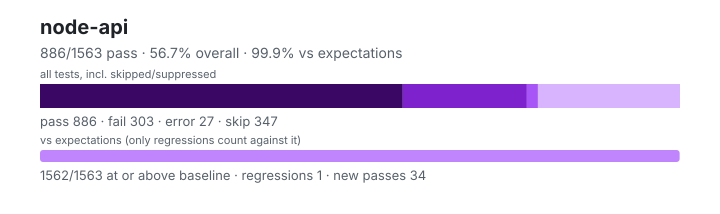

# node-api — `1.6.0+dd7116a51`

- Image digest: `85762dd3efe4426821f8741049b219e38ec43d75312dea10b3f5f3b3b794fce6`
- Suite version: `ed33ae74ad100a38df41edf56f6935c78821e779`
- Ran: 2026-09-25T19:12:54.763Z → 2026-09-25T19:16:08.798Z

## Summary

**Pass rate: 886/1563 (56.69%)** — overall, over all tests including skipped/suppressed

**vs expectations: 1562/1563 (99.94%)** — tests at or above the baseline (only regressions count against it)

| pass | fail | error | skip | regressions | new passes |
|---:|---:|---:|---:|---:|---:|
| 886 | 303 | 27 | 347 | 1 | 34 |

## Observed cases (1216)

- `test/parallel/test-assert-class.js` — fail — TAP version 13
# start 1: Assert constructor requires new
not ok 1 - Assert constructor requires new
  ---
  message: "Expected values to be strictly deep-equal:\n+ actual - expected\n\n  Comparison {\n-   code: 'ERR_CONSTRUCT_CALL_REQUIRED',\n    name: 'TypeError'\n  }\n"
  severity: "ERR_ASSERTION"
  detail: |
    	AssertionError: Expected values to be strictly deep-equal:
    	+ actual - expected
    	Comparison {
    	-   code: 'ERR_CONSTRUCT_CALL_REQUIRED',
    	name: 'TypeError'
    	}
    		at TestNode.<anonymous> (/work/.harness/work/node-api/node-api-overlay/test/parallel/test-assert-class.js:18:10)
    	{
    	  code: 'ERR_ASSERTION',
    	  actual: {},
    	  expected: {"code":"ERR_CONSTRUCT_CALL_REQUIRED","name":"TypeError"},
    	  operator: 'throws'
    	}
  ...
# start 2: Assert class non strict
not ok 2 - Assert class non strict
  ---
  message: "Assert is not a constructor"
  detail: |
    	TypeError: Assert is not a constructor
    		at TestNode.<anonymous> (/work/.harness/work/node-api/node-api-overlay/test/parallel/test-assert-class.js:25:26)
  ...
# start 3: Assert class strict
not ok 3 - Assert class strict
  ---
  message: "Assert is not a constructor"
  detail: |
    	TypeError: Assert is not a constructor
    		at TestNode.<anonymous> (/work/.harness/work/node-api/node-api-overlay/test/parallel/test-assert-class.js:139:26)
  ...
# start 4: Assert class with invalid diff option
not ok 4 - Assert class with invalid diff option
  ---
  message: "Expected values to be strictly deep-equal:\n+ actual - expected\n\n  Comparison {\n+   message: 'Assert is not a constructor',\n-   code: 'ERR_INVALID_ARG_VALUE',\n-   message: \"The property 'options.diff' must be one of: 'simple', 'full'. Received 'invalid'\",\n    name: 'TypeError'\n  }\n"
  severity: "ERR_ASSERTION"
  detail: |
    	AssertionError: Expected values to be strictly deep-equal:
    	+ actual - expected
    	Comparison {
    	+   message: 'Assert is not a constructor',
    	-   code: 'ERR_INVALID_ARG_VALUE',
    	-   message: "The property 'options.diff' must be one of: 'simple', 'full'. Received 'invalid'",
    	name: 'TypeError'
    	}
    		at TestNode.<anonymous> (/work/.harness/work/node-api/node-api-overlay/test/parallel/test-assert-class.js:154:10)
    	{
    	  code: 'ERR_ASSERTION',
    	  actual: {},
    	  expected: {"code":"ERR_INVALID_ARG_VALUE","name":"TypeError","message":"The property 'options.diff' must be one of: 'simple', 'full'. Received 'invalid'"},
    	  operator: 'throws'
    	}
  ...
# start 5: Assert class non strict with full diff
not ok 5 - Assert class non strict with full diff
  ---
  message: "Assert is not a constructor"
  detail: |
    	TypeError: Assert is not a constructor
    		at TestNode.<anonymous> (/work/.harness/work/node-api/node-api-overlay/test/parallel/test-assert-class.js:172:26)
  ...
# start 6: Assert class non strict with simple diff
not ok 6 - Assert class non strict with simple diff
  ---
  message: "Assert is not a constructor"
  detail: |
    	TypeError: Assert is not a constructor
    		at TestNode.<anonymous> (/work/.harness/work/node-api/node-api-overlay/test/parallel/test-assert-class.js:326:26)
  ...
# start 7: Assert class strict with skipPrototype
not ok 7 - Assert class strict with skipPrototype
  ---
  message: "Assert is not a constructor"
  detail: |
    	TypeError: Assert is not a constructor
    		at TestNode.<anonymous> (/work/.harness/work/node-api/node-api-overlay/test/parallel/test-assert-class.js:512:28)
  ...
# start 8: Assert class non strict with skipPrototype
not ok 8 - Assert class non strict with skipPrototype
  ---
  message: "Assert is not a constructor"
  detail: |
    	TypeError: Assert is not a constructor
    		at TestNode.<anonymous> (/work/.harness/work/node-api/node-api-overlay/test/parallel/test-assert-class.js:540:28)
  ...
# start 9: Assert class skipPrototype with complex objects
not ok 9 - Assert class skipPrototype with complex objects
  ---
  message: "Assert is not a constructor"
  detail: |
    	TypeError: Assert is not a constructor
    		at TestNode.<anonymous> (/work/.harness/work/node-api/node-api-overlay/test/parallel/test-assert-class.js:552:28)
  ...
# start 10: Assert class skipPrototype with arrays and special objects
not ok 10 - Assert class skipPrototype with arrays and special objects
  ---
  message: "Assert is not a constructor"
  detail: |
    	TypeError: Assert is not a constructor
    		at TestNode.<anonymous> (/work/.harness/work/node-api/node-api-overlay/test/parallel/test-assert-class.js:587:28)
  ...
# start 11: Assert class skipPrototype with notDeepStrictEqual
not ok 11 - Assert class skipPrototype with notDeepStrictEqual
  ---
  message: "Assert is not a constructor"
  detail: |
    	TypeError: Assert is not a constructor
    		at TestNode.<anonymous> (/work/.harness/work/node-api/node-api-overlay/test/parallel/test-assert-class.js:609:28)
  ...
# start 12: Assert class skipPrototype with mixed types
not ok 12 - Assert class skipPrototype with mixed types
  ---
  message: "Assert is not a constructor"
  detail: |
    	TypeError: Assert is not a constructor
    		at TestNode.<anonymous> (/work/.harness/work/node-api/node-api-overlay/test/parallel/test-assert-class.js:624:28)
  ...
1..12
- `test/parallel/test-assert-first-line.js` — pass
- `test/parallel/test-assert-async.js` — fail — Uncaught (in promise) AssertionError: The "bound " validation function is expected to return "true". Received false

Caught error:

AssertionError: Expected values to be strictly deep-equal:
+ actual - expected

+ null
- {
-   code: 'FOO'
- }
- `test/parallel/test-assert-if-error.js` — pass
- `test/parallel/test-assert-fail.js` — pass
- `test/parallel/test-assert-deep-with-error.js` — pass
- `test/parallel/test-assert-esm-cjs-message-verify.js` — fail — TAP version 13
# start 1: ensure the assert.ok throwing similar error messages for esm and cjs files > should return code 1 for each command
not ok 1 - ensure the assert.ok throwing similar error messages for esm and cjs files > should return code 1 for each command
  ---
  message: "Expected values to be strictly equal:\n\n2 !== 1\n"
  severity: "ERR_ASSERTION"
  detail: |
    	AssertionError: Expected values to be strictly equal:
    	2 !== 1
    		at TestNode.<anonymous> (/work/.harness/work/node-api/node-api-overlay/test/parallel/test-assert-esm-cjs-message-verify.js:22:14)
    	{
    	  code: 'ERR_ASSERTION',
    	  actual: 2,
    	  expected: 1,
    	  operator: 'strictEqual'
    	}
  ...
1..1
- `test/parallel/test-async-hooks-async-await.js` — pass
- `test/parallel/test-assert-class-destructuring.js` — fail — TAP version 13
# start 1: Assert class destructuring behavior - diff option
not ok 1 - Assert class destructuring behavior - diff option
  ---
  message: "Assert is not a constructor"
  detail: |
    	TypeError: Assert is not a constructor
    		at TestNode.<anonymous> (/work/.harness/work/node-api/node-api-overlay/test/parallel/test-assert-class-destructuring.js:17:30)
  ...
# start 2: Assert class destructuring behavior - strict option
not ok 2 - Assert class destructuring behavior - strict option
  ---
  message: "Assert is not a constructor"
  detail: |
    	TypeError: Assert is not a constructor
    		at TestNode.<anonymous> (/work/.harness/work/node-api/node-api-overlay/test/parallel/test-assert-class-destructuring.js:69:35)
  ...
# start 3: Assert class destructuring behavior - comprehensive methods
not ok 3 - Assert class destructuring behavior - comprehensive methods
  ---
  message: "Assert is not a constructor"
  detail: |
    	TypeError: Assert is not a constructor
    		at TestNode.<anonymous> (/work/.harness/work/node-api/node-api-overlay/test/parallel/test-assert-class-destructuring.js:90:20)
  ...
1..3
- `test/parallel/test-assert-checktag.js` — pass
- `test/parallel/test-async-hooks-constructor.js` — pass
- `test/parallel/test-assert-partial-deep-equal.js` — pass
- `test/parallel/test-async-hooks-close-during-destroy.js` — pass
- `test/parallel/test-async-hooks-correctly-switch-promise-hook.js` — pass
- `test/parallel/test-async-hooks-destroy-on-gc.js` — fail — TypeError: (intermediate value).gc is not a function
    at Immediate.<anonymous> (test-async-hooks-destroy-on-gc.js:25:14)
    at Immediate._return (/work/.harness/work/node-api/node-api-overlay/test/common/index.js:573:12)
    at TypeError.get stack (native)
- `test/parallel/test-async-hooks-disable-gc-tracking.js` — fail — TypeError: (intermediate value).gc is not a function
    at Immediate.<anonymous> (test-async-hooks-disable-gc-tracking.js:17:14)
    at TypeError.get stack (native)
- `test/parallel/test-async-hooks-disable-during-promise.js` — pass
- `test/parallel/test-async-hooks-enable-disable.js` — pass
- `test/parallel/test-async-hooks-enable-recursive.js` — fail — Mismatched noop function calls. Expected exactly 1, actual 0.
    at Proxy.mustCall (/work/.harness/work/node-api/node-api-overlay/test/common/index.js:531:10)
    at test-async-hooks-enable-recursive.js:8:16
    at test-async-hooks-enable-recursive.js:1:1
Mismatched <anonymous> function calls. Expected exactly 2, actual 4.
    at Proxy.mustCall (/work/.harness/work/node-api/node-api-overlay/test/common/index.js:531:10)
    at test-async-hooks-enable-recursive.js:12:16
    at test-async-hooks-enable-recursive.js:1:1
- `test/parallel/test-async-hooks-enable-disable-enable.js` — pass
- `test/parallel/test-async-hooks-enable-during-promise.js` — fail — Mismatched noop function calls. Expected at least 2, actual 1.
    at Proxy.mustCallAtLeast (/work/.harness/work/node-api/node-api-overlay/test/common/index.js:543:10)
    at test-async-hooks-enable-during-promise.js:9:19
    at _return (/work/.harness/work/node-api/node-api-overlay/test/common/index.js:573:12)
- `test/parallel/test-async-hooks-enable-before-promise-resolve.js` — fail — Uncaught (in promise) AssertionError: Expected "actual" to be strictly unequal to: 1
- `test/parallel/test-async-hooks-asyncresource-constructor.js` — pass
- `test/parallel/test-assert.js` — fail — TAP version 13
# start 1: some basics
ok 1 - some basics
# start 2: Throw message if the message is instanceof Error
ok 2 - Throw message if the message is instanceof Error
# start 3: Errors created in different contexts are handled as any other custom error
ok 3 - Errors created in different contexts are handled as any other custom error
# start 4: assert.throws()
ok 4 - assert.throws()
# start 5: Check messages from assert.throws()
ok 5 - Check messages from assert.throws()
# start 6: Test assertion messages
ok 6 - Test assertion messages
# start 7: Custom errors
ok 7 - Custom errors
# start 8: Verify that throws() and doesNotThrow() throw on non-functions
ok 8 - Verify that throws() and doesNotThrow() throw on non-functions
# start 9: https://github.com/nodejs/node/issues/3275
ok 9 - https://github.com/nodejs/node/issues/3275
# start 10: Long values should be truncated for display
ok 10 - Long values should be truncated for display
# start 11: Output that extends beyond 10 lines should also be truncated for display
ok 11 - Output that extends beyond 10 lines should also be truncated for display
# start 12: Bad args to AssertionError constructor should throw TypeError.
ok 12 - Bad args to AssertionError constructor should throw TypeError.
# start 13: NaN is handled correctly
ok 13 - NaN is handled correctly
# start 14: Test strict assert
not ok 14 - Test strict assert
  ---
  message: "Expected values to be strictly deep-equal:\n+ actual - expected\n\n  Comparison {\n    generatedMessage: true,\n+   message: 'The expression evaluated to a falsy value:\\n\\n  strict(...[])\\n',\n-   message: 'No value argument passed to `assert.ok()`',\n    name: 'AssertionError'\n  }\n"
  severity: "ERR_ASSERTION"
  detail: |
    	AssertionError: Expected values to be strictly deep-equal:
    	+ actual - expected
    	Comparison {
    	generatedMessage: true,
    	+   message: 'The expression evaluated to a falsy value:\n\n  strict(...[])\n',
    	-   message: 'No value argument passed to `assert.ok()`',
    	name: 'AssertionError'
    	}
    		at TestNode.<anonymous> (/work/.harness/work/node-api/node-api-overlay/test/parallel/test-assert.js:599:10)
    	{
    	  code: 'ERR_ASSERTION',
    	  actual: {"expected":true,"operator":"==","generatedMessage":true},
    	  expected: {"message":"No value argument passed to `assert.ok()`","name":"AssertionError","generatedMessage":true},
    	  operator: 'throws'
    	}
  ...
# start 15: Additional asserts
not ok 15 - Additional asserts
  ---
  message: "Expected values to be strictly deep-equal:\n+ actual - expected\n\n+ AssertionError {\n+   code: 'ERR_ASSERTION',\n+   constructor: [Function: AssertionError],\n+   message: 'Symbol(foo)'\n- TypeError {\n-   code: 'ERR_INVALID_ARG_TYPE',\n-   constructor: [Function: TypeError],\n-   message: /\"message\" argument.+Symbol\\(foo\\)/\n  }\n"
  severity: "ERR_ASSERTION"
  detail: |
    	AssertionError: Expected values to be strictly deep-equal:
    	+ actual - expected
    	+ AssertionError {
    	+   code: 'ERR_ASSERTION',
    	+   constructor: [Function: AssertionError],
    	+   message: 'Symbol(foo)'
    	- TypeError {
    	-   code: 'ERR_INVALID_ARG_TYPE',
    	-   constructor: [Function: TypeError],
    	-   message: /"message" argument.+Symbol\(foo\)/
    	}
    		at TestNode.<anonymous> (/work/.harness/work/node-api/node-api-overlay/test/parallel/test-assert.js:905:10)
    	{
    	  code: 'ERR_ASSERTION',
    	  actual: {"actual":false,"expected":true,"operator":"==","generatedMessage":false},
    	  expected: {"code":"ERR_INVALID_ARG_TYPE","message":{}},
    	  operator: 'throws'
    	}
  ...
# start 16: Throws accepts objects
not ok 16 - Throws accepts objects
  ---
  message: "Expected values to be strictly deep-equal:\n+ actual - expected\n\n  Comparison {\n+   message: '',\n+   name: 'Error'\n-   code: 'ERR_INVALID_ARG_TYPE',\n-   message: 'The \"expected\" argument must be of type function or an instance of RegExp. Received an instance of Object',\n-   name: 'TypeError'\n  }\n"
  severity: "ERR_ASSERTION"
  detail: |
    	AssertionError: Expected values to be strictly deep-equal:
    	+ actual - expected
    	Comparison {
    	+   message: '',
    	+   name: 'Error'
    	-   code: 'ERR_INVALID_ARG_TYPE',
    	-   message: 'The "expected" argument must be of type function or an instance of RegExp. Received an instance of Object',
    	-   name: 'TypeError'
    	}
    		at TestNode.<anonymous> (/work/.harness/work/node-api/node-api-overlay/test/parallel/test-assert.js:1130:10)
    	{
    	  code: 'ERR_ASSERTION',
    	  actual: {},
    	  expected: {"name":"TypeError","code":"ERR_INVALID_ARG_TYPE","message":"The \"expected\" argument must be of type function or an instance of RegExp. Received an instance of Object"},
    	  operator: 'throws'
    	}
  ...
# start 17: Additional assert
not ok 17 - Additional assert
  ---
  message: "Expected values to be strictly deep-equal:\n+ actual - expected\n\n  Comparison {\n    actual: 'foobar',\n    generatedMessage: false,\n+   message: 'message',\n-   message: \"message\\n+ actual - expected\\n\\n+ 'foobar'\\n- {\\n-   message: 'foobar'\\n- }\\n\",\n    operator: 'throws'\n  }\n"
  severity: "ERR_ASSERTION"
  detail: |
    	AssertionError: Expected values to be strictly deep-equal:
    	+ actual - expected
    	Comparison {
    	actual: 'foobar',
    	generatedMessage: false,
    	+   message: 'message',
    	-   message: "message\n+ actual - expected\n\n+ 'foobar'\n- {\n-   message: 'foobar'\n- }\n",
    	operator: 'throws'
    	}
    		at TestNode.<anonymous> (/work/.harness/work/node-api/node-api-overlay/test/parallel/test-assert.js:1287:12)
    	{
    	  code: 'ERR_ASSERTION',
    	  actual: {"actual":"foobar","expected":{"message":"foobar"},"operator":"throws","generatedMessage":false},
    	  expected: {"actual":"foobar","message":"message\n+ actual - expected\n\n+ 'foobar'\n- {\n-   message: 'foobar'\n- }\n","operator":"throws","generatedMessage":false},
    	  operator: 'throws'
    	}
  ...
# start 18: assert/strict exists
ok 18 - assert/strict exists
# start 19: Printf-like format strings as error message
not ok 19 - Printf-like format strings as error message
  ---
  message: "The input did not match the regular expression /The answer to all questions is 42/. Input:\n\n'AssertionError: The answer to all questions is %i'\n"
  severity: "ERR_ASSERTION"
  detail: |
    	AssertionError: The input did not match the regular expression /The answer to all questions is 42/. Input:
    	'AssertionError: The answer to all questions is %i'
    		at TestNode.<anonymous> (/work/.harness/work/node-api/node-api-overlay/test/parallel/test-assert.js:1600:10)
    	{
    	  code: 'ERR_ASSERTION',
    	  actual: {"actual":1,"expected":2,"operator":"==","generatedMessage":false},
    	  expected: {},
    	  operator: 'throws'
    	}
  ...
# start 20: Functions as error message
not ok 20 - Functions as error message
  ---
  message: "Expected values to be strictly deep-equal:\n+ actual - expected\n\n  Comparison {\n+   message: 'function errorMessage(actual, expected) {\\n' +\n+     '    return `Nice message including ${actual} and ${expected}`;\\n' +\n+     '  }'\n-   message: 'Nice message including 1 and 2'\n  }\n"
  severity: "ERR_ASSERTION"
  detail: |
    	AssertionError: Expected values to be strictly deep-equal:
    	+ actual - expected
    	Comparison {
    	+   message: 'function errorMessage(actual, expected) {\n' +
    	+     '    return `Nice message including ${actual} and ${expected}`;\n' +
    	+     '  }'
    	-   message: 'Nice message including 1 and 2'
    	}
    		at TestNode.<anonymous> (/work/.harness/work/node-api/node-api-overlay/test/parallel/test-assert.js:1660:10)
    	{
    	  code: 'ERR_ASSERTION',
    	  actual: {"actual":1,"expected":2,"operator":"==","generatedMessage":false},
    	  expected: {"message":"Nice message including 1 and 2"},
    	  operator: 'throws'
    	}
  ...
# start 21: Ambiguous error messages fail
not ok 21 - Ambiguous error messages fail
  ---
  message: "Expected values to be strictly deep-equal:\n+ actual - expected\n\n  Comparison {\n+   code: 'ERR_ASSERTION',\n-   code: 'ERR_AMBIGUOUS_ARGUMENT',\n    message: 'function errorMessage(actual, expected) {\\n' +\n      '    return `Nice message including ${actual} and ${expected}`;\\n' +\n      '  }'\n  }\n"
  severity: "ERR_ASSERTION"
  detail: |
    	AssertionError: Expected values to be strictly deep-equal:
    	+ actual - expected
    	Comparison {
    	+   code: 'ERR_ASSERTION',
    	-   code: 'ERR_AMBIGUOUS_ARGUMENT',
    	message: 'function errorMessage(actual, expected) {\n' +
    	'    return `Nice message including ${actual} and ${expected}`;\n' +
    	'  }'
    	}
    		at TestNode.<anonymous> (/work/.harness/work/node-api/node-api-overlay/test/parallel/test-assert.js:1725:10)
    	{
    	  code: 'ERR_ASSERTION',
    	  actual: {"actual":"foo","expected":{},"operator":"doesNotMatch","generatedMessage":false},
    	  expected: {"code":"ERR_AMBIGUOUS_ARGUMENT","message":{}},
    	  operator: 'throws'
    	}
  ...
# start 22: Faulty message functions
not ok 22 - Faulty message functions
  ---
  message: "Expected values to be strictly deep-equal:\n+ actual - expected\n\n  Comparison {\n    code: 'ERR_ASSERTION',\n+   message: '(a, b) => 123'\n-   message: \"'foo' doesNotMatch /foo/\"\n  }\n"
  severity: "ERR_ASSERTION"
  detail: |
    	AssertionError: Expected values to be strictly deep-equal:
    	+ actual - expected
    	Comparison {
    	code: 'ERR_ASSERTION',
    	+   message: '(a, b) => 123'
    	-   message: "'foo' doesNotMatch /foo/"
    	}
    		at TestNode.<anonymous> (/work/.harness/work/node-api/node-api-overlay/test/parallel/test-assert.js:1743:10)
    	{
    	  code: 'ERR_ASSERTION',
    	  actual: {"actual":"foo","expected":{},"operator":"doesNotMatch","generatedMessage":false},
    	  expected: {"code":"ERR_ASSERTION","message":"'foo' doesNotMatch /foo/"},
    	  operator: 'throws'
    	}
  ...
# start 23: Functions as error message
not ok 23 - Functions as error message
  ---
  message: "Expected values to be strictly deep-equal:\n+ actual - expected\n\n  Comparison {\n    code: 'ERR_ASSERTION',\n+   message: 'function errorMessage(actual, expected) {\\n' +\n+     '    return `Nice message including ${actual} and ${expected}`;\\n' +\n+     '  }'\n-   message: /Nice message including foo and bar/\n  }\n"
  severity: "ERR_ASSERTION"
  detail: |
    	AssertionError: Expected values to be strictly deep-equal:
    	+ actual - expected
    	Comparison {
    	code: 'ERR_ASSERTION',
    	+   message: 'function errorMessage(actual, expected) {\n' +
    	+     '    return `Nice message including ${actual} and ${expected}`;\n' +
    	+     '  }'
    	-   message: /Nice message including foo and bar/
    	}
    		at TestNode.<anonymous> (/work/.harness/work/node-api/node-api-overlay/test/parallel/test-assert.js:1765:10)
    	{
    	  code: 'ERR_ASSERTION',
    	  actual: {"actual":"foo","expected":"bar","operator":"==","generatedMessage":false},
    	  expected: {"code":"ERR_ASSERTION","message":{}},
    	  operator: 'throws'
    	}
  ...
1..23
- `test/parallel/test-async-hooks-promise-enable-disable.js` — pass
- `test/parallel/test-async-hooks-run-in-async-scope-caught-exception.js` — pass
- `test/parallel/test-assert-deep.js` — fail — TAP version 13
# start 1: deepEqual
ok 1 - deepEqual
# start 2: loose deepEqual
not ok 2 - loose deepEqual
  ---
  message: "Expected values to be loosely deep-equal:\n\n[\n  null,\n  undefined,\n  undefined\n]\n\nshould loosely deep-equal\n\n[\n  null,\n  undefined,\n  null\n]"
  severity: "ERR_ASSERTION"
  detail: |
    	AssertionError: Expected values to be loosely deep-equal:
    	[
    	null,
    	undefined,
    	undefined
    	]
    	should loosely deep-equal
    	[
    	null,
    	undefined,
    	null
    	]
    		at assertOnlyDeepEqual (/work/.harness/work/node-api/node-api-overlay/test/parallel/test-assert-deep.js:243:10)
    		at TestNode.<anonymous> (/work/.harness/work/node-api/node-api-overlay/test/parallel/test-assert-deep.js:130:3)
    	{
    	  code: 'ERR_ASSERTION',
    	  actual: [null,null,null],
    	  expected: [null,null,null],
    	  operator: 'deepEqual'
    	}
  ...
# start 3: date
ok 3 - date
# start 4: regexp
ok 4 - regexp
# start 5: deepEqual should pass for these weird cases
ok 5 - deepEqual should pass for these weird cases
# start 6: es6 Maps and Sets
ok 6 - es6 Maps and Sets
# start 7: GH-6416. Make sure circular refs do not throw
ok 7 - GH-6416. Make sure circular refs do not throw
# start 8: GH-14441. Circular structures should be consistent
ok 8 - GH-14441. Circular structures should be consistent
# start 9: deepStrictEqual handles shared expected array elements after cycle detection
ok 9 - deepStrictEqual handles shared expected array elements after cycle detection
# start 10: deepStrictEqual handles cross-root aliases after cycle detection
ok 10 - deepStrictEqual handles cross-root aliases after cycle detection
# start 11: Ensure reflexivity of deepEqual with `arguments` objects.
ok 11 - Ensure reflexivity of deepEqual with `arguments` objects.
# start 12: More checking that arguments objects are handled correctly
ok 12 - More checking that arguments objects are handled correctly
# start 13: Handle sparse arrays
ok 13 - Handle sparse arrays
# start 14: Handle sets and maps with mixed keys
ok 14 - Handle sets and maps with mixed keys
# start 15: Handle different error messages
ok 15 - Handle different error messages
# start 16: Handle NaN
ok 16 - Handle NaN
# start 17: Handle boxed primitives
ok 17 - Handle boxed primitives
# start 18: Minus zero
ok 18 - Minus zero
# start 19: Handle symbols (enumerable only)
ok 19 - Handle symbols (enumerable only)
# start 20: Additional tests
ok 20 - Additional tests
# start 21: Having the same number of owned properties && the same set of keys
ok 21 - Having the same number of owned properties && the same set of keys
# start 22: Having an identical prototype property
ok 22 - Having an identical prototype property
# start 23: Primitives
ok 23 - Primitives
# start 24: Additional tests
ok 24 - Additional tests
# start 25: Having the same number of owned properties && the same set of keys
ok 25 - Having the same number of owned properties && the same set of keys
# start 26: Prototype check
ok 26 - Prototype check
# start 27: Check extra properties on errors
ok 27 - Check extra properties on errors
# start 28: Check proxies
not ok 28 - Check proxies
  ---
  message: "Expected values to be strictly deep-equal:\n+ actual - expected\n\n  Comparison {\n    message: 'Expected values to be strictly deep-equal:\\n' +\n      '+ actual - expected\\n' +\n      '\\n' +\n+     '  [\\n' +\n-     '+ Proxy([\\n' +\n-     '- [\\n' +\n      '    1,\\n' +\n      '    2,\\n' +\n-     '+ ])\\n' +\n      '-   3\\n' +\n+     '  ]\\n'\n-     '- ]\\n'\n  }\n"
  severity: "ERR_ASSERTION"
  detail: |
    	AssertionError: Expected values to be strictly deep-equal:
    	+ actual - expected
    	Comparison {
    	message: 'Expected values to be strictly deep-equal:\n' +
    	'+ actual - expected\n' +
    	'\n' +
    	+     '  [\n' +
    	-     '+ Proxy([\n' +
    	-     '- [\n' +
    	'    1,\n' +
    	'    2,\n' +
    	-     '+ ])\n' +
    	'-   3\n' +
    	+     '  ]\n'
    	-     '- ]\n'
    	}
    		at TestNode.<anonymous> (/work/.harness/work/node-api/node-api-overlay/test/parallel/test-assert-deep.js:1144:10)
    	{
    	  code: 'ERR_ASSERTION',
    	  actual: {"actual":[1,2],"expected":[1,2,3],"operator":"deepStrictEqual","generatedMessage":true},
    	  expected: {"message":"Expected values to be strictly deep-equal:\n+ actual - expected\n\n+ Proxy([\n- [\n    1,\n    2,\n+ ])\n-   3\n- ]\n"},
    	  operator: 'throws'
    	}
  ...
# start 29: Strict equal with identical objects that are not identical by reference and longer than 50 elements
ok 29 - Strict equal with identical objects that are not identical by reference and longer than 50 elements
# start 30: Basic valueOf check
ok 30 - Basic valueOf check
# start 31: Basic array out of bounds check
ok 31 - Basic array out of bounds check
# start 32: Verify that manipulating the `getTime()` function has no impact on the time verification.
ok 32 - Verify that manipulating the `getTime()` function has no impact on the time verification.
# start 33: Verify that an array and the equivalent fake array object are correctly compared
ok 33 - Verify that an array and the equivalent fake array object are correctly compared
# start 34: Verify that extra keys will be tested for when using fake arrays
ok 34 - Verify that extra keys will be tested for when using fake arrays
# start 35: Verify that changed tags will still check for the error message
ok 35 - Verify that changed tags will still check for the error message
# start 36: Check for non-native errors
ok 36 - Check for non-native errors
# start 37: Check for Errors with cause property
ok 37 - Check for Errors with cause property
# start 38: Check for AggregateError
ok 38 - Check for AggregateError
# start 39: Verify that `valueOf` is not called for boxed primitives
ok 39 - Verify that `valueOf` is not called for boxed primitives
# start 40: Check getters
ok 40 - Check getters
# start 41: Verify object types being identical on both sides
ok 41 - Verify object types being identical on both sides
# start 42: Verify commutativity
ok 42 - Verify commutativity
# start 43: Crypto
ok 43 - Crypto # SKIP
# start 44: Comparing two identical WeakMap instances
ok 44 - Comparing two identical WeakMap instances
# start 45: Comparing two different WeakMap instances
ok 45 - Comparing two different WeakMap instances
# start 46: Comparing two identical WeakSet instances
ok 46 - Comparing two identical WeakSet instances
# start 47: Comparing two different WeakSet instances
ok 47 - Comparing two different WeakSet instances
# start 48: Comparing two arrays nested inside object, with overlapping elements
ok 48 - Comparing two arrays nested inside object, with overlapping elements
# start 49: Comparing two arrays nested inside object, with overlapping elements, swapping keys
ok 49 - Comparing two arrays nested inside object, with overlapping elements, swapping keys
# start 50: Detects differences in deeply nested arrays instead of seeing a new object
ok 50 - Detects differences in deeply nested arrays instead of seeing a new object
# start 51: URLs
ok 51 - URLs
# start 52: Own property constructor properties should check against the original prototype
ok 52 - Own property constructor properties should check against the original prototype
# start 53: Inherited null prototype without own constructor properties should check the correct prototype
ok 53 - Inherited null prototype without own constructor properties should check the correct prototype
# start 54: Promises should fail deepEqual
ok 54 - Promises should fail deepEqual
1..54
- `test/parallel/test-async-hooks-prevent-double-destroy.js` — fail — TypeError: (intermediate value).gc is not a function
    at Immediate.<anonymous> (test-async-hooks-prevent-double-destroy.js:20:14)
    at TypeError.get stack (native)
- `test/parallel/test-async-hooks-promise.js` — pass
- `test/parallel/test-async-hooks-promise-triggerid.js` — fail — Uncaught (in promise) AssertionError: Expected values to be strictly equal:

1 !== 2
- `test/parallel/test-async-hooks-run-in-async-scope-this-arg.js` — pass
- `test/parallel/test-async-hooks-top-level-clearimmediate.js` — fail — AssertionError: Expected "actual" to be reference-equal to "expected": + actual - expected  + Immediate { +   _argv: undefined, +   _destroyed: false, +   _idleNext: null, +   _idlePrev: null, +   _onImmediate: [Function: mustNotCall] - { -   type: 'Immediate'   }
    at :anonymous (test-async-hooks-top-level-clearimmediate.js:31:1)
    at :program (test-async-hooks-top-level-clearimmediate.js:1:1)
- `test/parallel/test-async-hooks-fatal-error.js` — fail — AssertionError: init  0 !== 1
    at main (test-async-hooks-fatal-error.js:48:7)
    at :anonymous (test-async-hooks-fatal-error.js:10:3)
    at :program (test-async-hooks-fatal-error.js:1:1)
- `test/parallel/test-async-hooks-worker-asyncfn-terminate-1.js` — pass
- `test/parallel/test-async-hooks-vm-gc.js` — pass
- `test/parallel/test-async-hooks-worker-asyncfn-terminate-3.js` — pass
- `test/parallel/test-async-hooks-worker-asyncfn-terminate-2.js` — pass
- `test/parallel/test-async-local-storage-bind.js` — pass
- `test/parallel/test-async-hooks-worker-asyncfn-terminate-4.js` — pass
- `test/parallel/test-async-local-storage-deep-stack.js` — pass
- `test/parallel/test-async-hooks-stack-overflow-nested-async.js` — pass
- `test/parallel/test-async-local-storage-contexts.js` — pass
- `test/parallel/test-async-hooks-recursive-stack-runInAsyncScope.js` — pass
- `test/parallel/test-async-hooks-stack-overflow.js` — pass
- `test/parallel/test-async-local-storage-enter-with.js` — fail — Uncaught (in promise) AssertionError: Expected values to be strictly equal:
+ actual - expected

+ 'inside then'
- undefined
- `test/parallel/test-async-local-storage-exit-does-not-leak.js` — pass
- `test/parallel/test-async-hooks-stack-overflow-try-catch.js` — pass
- `test/parallel/test-async-local-storage-isolation.js` — pass
- `test/parallel/test-async-local-storage-run-scope.js` — pass
- `test/parallel/test-async-local-storage-snapshot.js` — pass
- `test/parallel/test-async-local-storage-http-parser-leak.js` — fail — TypeError: parsers.alloc is not a function
    at :=> (test-async-local-storage-http-parser-leak.js:19:14)
    at _return (index.js:573:12)
    at test (test-async-local-storage-http-parser-leak.js:18:3)
    at :anonymous (test-async-local-storage-http-parser-leak.js:25:1)
    at :program (test-async-local-storage-http-parser-leak.js:1:1)
- `test/parallel/test-async-local-storage-http-agent.js` — fail — AssertionError: Expected values to be strictly equal:
+ actual - expected

+ undefined
- 'first'

    at Writable.<anonymous> (test-async-local-storage-http-agent.js:39:14)
    at Writable._return (/work/.harness/work/node-api/node-api-overlay/test/common/index.js:573:12)
    at Writable.emit (native)
    at Duplex.push (native)
- `test/parallel/test-buffer-alloc.js` — fail — AssertionError: Expected values to be strictly deep-equal: + actual - expected    Comparison { +   message: 'index is too large' -   message: 'Invalid typed array length: 9007199254740992'   }
    at :anonymous (test-buffer-alloc.js:14:1)
    at :program (test-buffer-alloc.js:1:1)
- `test/parallel/test-buffer-arraybuffer.js` — pass
- `test/parallel/test-async-hooks-execution-async-resource.js` — pass
- `test/parallel/test-buffer-ascii.js` — pass
- `test/parallel/test-async-local-storage-weak-asyncwrap-leak.js` — fail — TypeError: v8.queryObjects is not a function
    at test-async-local-storage-weak-asyncwrap-leak.js:41:25
    at _return (/work/.harness/work/node-api/node-api-overlay/test/common/index.js:573:12)
    at Timeout.<anonymous> (test-async-local-storage-weak-asyncwrap-leak.js:47:5)
    at TypeError.get stack (native)
- `test/parallel/test-buffer-badhex.js` — pass
- `test/parallel/test-buffer-bigint64.js` — pass
- `test/parallel/test-buffer-compare-offset.js` — pass
- `test/parallel/test-buffer-bytelength.js` — pass
- `test/parallel/test-buffer-compare.js` — pass
- `test/parallel/test-async-local-storage-http-multiclients.js` — fail — TypeError: Cannot read property 'set' of undefined
    at Writable.<anonymous> (test-async-local-storage-http-multiclients.js:36:9)
    at Writable._return (/work/.harness/work/node-api/node-api-overlay/test/common/index.js:573:12)
    at Writable.emit (native)
    at Duplex.push (native)
- `test/parallel/test-buffer-concat.js` — pass
- `test/parallel/test-buffer-constructor-deprecation-error.js` — pass
- `test/parallel/test-buffer-constructor-outside-node-modules.js` — fail — (node:1682) [DEP0005] DeprecationWarning: Buffer() is deprecated due to security and usability issues. Please use the Buffer.alloc(), Buffer.allocUnsafe(), or Buffer.from() methods instead.
AssertionError: DeprecationWarning: Buffer() is deprecated due to security and usability issues. Please use the Buffer.alloc(), Buffer.allocUnsafe(), or Buffer.from() methods instead.
    at process.<anonymous> (test-buffer-constructor-outside-node-modules.js:18:10)
    at process._return (/work/.harness/work/node-api/node-api-overlay/test/common/index.js:573:12)
    at AssertionError.get stack (native)
    at ok (native)
    at process.<anonymous> (test-buffer-constructor-outside-node-modules.js:18:3)
    at process._return (/work/.harness/work/node-api/node-api-overlay/test/common/index.js:573:12)
- `test/parallel/test-buffer-copy-immutable.js` — fail — AssertionError: Expected values to be strictly equal:  8 !== 0
    at :anonymous (test-buffer-copy-immutable.js:19:3)
    at :program (test-buffer-copy-immutable.js:1:1)
- `test/parallel/test-buffer-copy.js` — pass
- `test/parallel/test-buffer-constructor-node-modules-paths.js` — fail — AssertionError: Expected values to be strictly equal: + actual - expected  + "Error: Usage: 'elide <script>' or 'elide run <script>'; see --help" - ''
    at test (test-buffer-constructor-node-modules-paths.js:20:5)
    at :anonymous (test-buffer-constructor-node-modules-paths.js:23:1)
    at :program (test-buffer-constructor-node-modules-paths.js:1:1)
- `test/parallel/test-buffer-equals.js` — pass
- `test/parallel/test-buffer-failed-alloc-typed-arrays.js` — pass
- `test/parallel/test-buffer-fakes.js` — pass
- `test/parallel/test-buffer-from.js` — fail — AssertionError: Expected values to be strictly deep-equal: + actual - expected    Comparison {     code: 'ERR_INVALID_ARG_TYPE', +   message: 'The first argument must be of type string or an instance of Buffer, ArrayBuffer, or Array or an Array-like Object. Received type function ([Function (anonymous)])', -   message: 'The first argument must be of type string or an instance of Buffer, ArrayBuffer, or Array or an Array-like Object. Received function ',     name: 'TypeError'   }
    at :=> (test-buffer-from.js:59:3)
    at :anonymous (test-buffer-from.js:37:1)
    at :program (test-buffer-from.js:1:1)
- `test/parallel/test-buffer-constructor-node-modules.js` — fail — [process 1798]: --- stderr ---
(node:1798) [DEP0005] DeprecationWarning: Buffer() is deprecated due to security and usability issues. Please use the Buffer.alloc(), Buffer.allocUnsafe(), or Buffer.from() methods instead.

[process 1798]: --- stdout ---

[process 1798]: status = 0, signal = null
Error: - stderr did not match ''
    at logAndThrow (child_process.js:111:5)
    at expectSyncExit (child_process.js:135:5)
    at spawnSyncAndAssert (child_process.js:155:10)
    at :anonymous (test-buffer-constructor-node-modules.js:10:1)
    at :program (test-buffer-constructor-node-modules.js:1:1)
- `test/parallel/test-buffer-inheritance.js` — pass
- `test/parallel/test-buffer-isencoding.js` — pass
- `test/parallel/test-buffer-inspect.js` — pass
- `test/parallel/test-buffer-generic-methods.js` — pass
- `test/parallel/test-buffer-isascii.js` — pass
- `test/parallel/test-buffer-isutf8.js` — pass
- `test/parallel/test-buffer-includes.js` — fail — AssertionError: Expected values to be strictly deep-equal: + actual - expected    Comparison {     code: 'ERR_INVALID_ARG_TYPE', +   message: 'The "value" argument must be one of type number or string or an instance of Buffer or Uint8Array. Received type function ([Function (anonymous)])', -   message: 'The "value" argument must be one of type number or string or an instance of Buffer or Uint8Array. Received function ',     name: 'TypeError'   }
    at :=> (test-buffer-includes.js:277:3)
    at :anonymous (test-buffer-includes.js:272:1)
    at :program (test-buffer-includes.js:1:1)
- `test/parallel/test-buffer-iterator.js` — pass
- `test/parallel/test-buffer-indexof.js` — fail — AssertionError: Expected values to be strictly deep-equal: + actual - expected    Comparison {     code: 'ERR_INVALID_ARG_TYPE', +   message: 'The "value" argument must be one of type number or string or an instance of Buffer or Uint8Array. Received type function ([Function (anonymous)])', -   message: 'The "value" argument must be one of type number or string or an instance of Buffer or Uint8Array. Received function ',     name: 'TypeError'   }
    at :=> (test-buffer-indexof.js:367:3)
    at :anonymous (test-buffer-indexof.js:362:1)
    at :program (test-buffer-indexof.js:1:1)
- `test/parallel/test-buffer-nopendingdep-map.js` — pass
- `test/parallel/test-buffer-new.js` — pass
- `test/parallel/test-buffer-no-negative-allocation.js` — pass
- `test/parallel/test-buffer-of-no-deprecation.js` — pass
- `test/parallel/test-buffer-over-max-length.js` — pass
- `test/parallel/test-buffer-parent-property.js` — pass
- `test/parallel/test-buffer-pending-deprecation.js` — pass
- `test/parallel/test-buffer-pool-untransferable.js` — fail — AssertionError: Values have same structure but are not reference-equal:  ArrayBuffer {   [Uint8Contents]: <68 65 6c 6c 6f 20 77 6f 72 6c 64>,   [byteLength]: 11 }
    at :anonymous (test-buffer-pool-untransferable.js:12:1)
    at :program (test-buffer-pool-untransferable.js:1:1)
- `test/parallel/test-buffer-prototype-inspect.js` — pass
- `test/parallel/test-buffer-readdouble.js` — pass
- `test/parallel/test-buffer-readint.js` — pass
- `test/parallel/test-buffer-readfloat.js` — pass
- `test/parallel/test-buffer-read.js` — pass
- `test/parallel/test-buffer-set-inspect-max-bytes.js` — pass
- `test/parallel/test-buffer-readuint.js` — pass
- `test/parallel/test-buffer-safe-unsafe.js` — pass
- `test/parallel/test-buffer-sharedarraybuffer.js` — pass
- `test/parallel/test-buffer-resizable.js` — fail — TAP version 13
# start 1: Using resizable ArrayBuffer with Buffer... > works as expected
not ok 1 - Using resizable ArrayBuffer with Buffer... > works as expected
  ---
  message: "Expected values to be strictly equal:\n\n19 !== 9\n"
  severity: "ERR_ASSERTION"
  detail: |
    	AssertionError: Expected values to be strictly equal:
    	19 !== 9
    		at TestNode.<anonymous> (/work/.harness/work/node-api/node-api-overlay/test/parallel/test-buffer-resizable.js:13:12)
    	{
    	  code: 'ERR_ASSERTION',
    	  actual: 19,
    	  expected: 9,
    	  operator: 'strictEqual'
    	}
  ...
# start 2: Using resizable ArrayBuffer with Buffer... > works with the deprecated constructor also
not ok 2 - Using resizable ArrayBuffer with Buffer... > works with the deprecated constructor also
  ---
  message: "Expected values to be strictly equal:\n\n19 !== 9\n"
  severity: "ERR_ASSERTION"
  detail: |
    	AssertionError: Expected values to be strictly equal:
    	19 !== 9
    		at TestNode.<anonymous> (/work/.harness/work/node-api/node-api-overlay/test/parallel/test-buffer-resizable.js:23:12)
    	{
    	  code: 'ERR_ASSERTION',
    	  actual: 19,
    	  expected: 9,
    	  operator: 'strictEqual'
    	}
  ...
1..2
- `test/parallel/test-buffer-slow.js` — pass
- `test/parallel/test-buffer-slice.js` — pass
- `test/parallel/test-buffer-swap-fast.js` — fail — SyntaxError: <eval>:1:0 Expected an operand but found % %PrepareFunctionForOptimization(Buffer.prototype.swap16) ^
    at :anonymous (test-buffer-swap-fast.js:34:1)
    at :program (test-buffer-swap-fast.js:1:1)
- `test/parallel/test-buffer-tojson.js` — pass
- `test/parallel/test-buffer-swap.js` — pass
- `test/parallel/test-buffer-tostring-range.js` — pass
- `test/parallel/test-buffer-tostring.js` — pass
- `test/parallel/test-buffer-write.js` — pass
- `test/parallel/test-buffer-writedouble.js` — pass
- `test/parallel/test-buffer-writefloat.js` — pass
- `test/parallel/test-buffer-writeint.js` — pass
- `test/parallel/test-buffer-writeuint.js` — pass
- `test/parallel/test-buffer-zero-fill-reset.js` — pass
- `test/parallel/test-buffer-zero-fill-cli.js` — pass
- `test/parallel/test-console-assign-undefined.js` — pass
- `test/parallel/test-buffer-zero-fill.js` — pass
- `test/parallel/test-buffer-tostring-rangeerror.js` — fail — AssertionError: Expected values to be strictly deep-equal: + actual - expected    Comparison {     code: 'ERR_STRING_TOO_LONG', +   name: 'RangeError' -   name: 'Error'   }
    at test (test-buffer-tostring-rangeerror.js:37:3)
    at :anonymous (test-buffer-tostring-rangeerror.js:40:1)
    at :program (test-buffer-tostring-rangeerror.js:1:1)
- `test/parallel/test-console-async-write-error.js` — pass
- `test/parallel/test-console-clear.js` — pass
- `test/parallel/test-console-count.js` — pass
- `test/parallel/test-console-group.js` — pass
- `test/parallel/test-console-diagnostics-channels.js` — pass
- `test/parallel/test-console-issue-43095.js` — fail — TypeError: proxy has been revoked
    at :anonymous (test-console-issue-43095.js:9:1)
    at :program (test-console-issue-43095.js:1:1)
- `test/parallel/test-console-methods.js` — pass
- `test/parallel/test-console-log-throw-primitive.js` — pass
- `test/parallel/test-console-instance.js` — pass
- `test/parallel/test-console-log-stdio-broken-dest.js` — pass
- `test/parallel/test-console-not-call-toString.js` — pass
- `test/parallel/test-console-self-assign.js` — pass
- `test/parallel/test-console-stdio-setters.js` — fail — fhqwhgads
- `test/parallel/test-console-tty-colors-per-stream.js` — pass
- `test/parallel/test-console-sync-write-error.js` — pass
- `test/parallel/test-console-table.js` — pass
- `test/parallel/test-console-tty-colors.js` — pass
- `test/parallel/test-assert-typedarray-deepequal.js` — pass
- `test/parallel/test-console-with-frozen-intrinsics.js` — pass
- `test/parallel/test-console-no-swallow-stack-overflow.js` — pass
- `test/parallel/test-console.js` — fail — foo
foo bar
foo bar hop
{ slashes: '\\\\' }
inspect
foo
foo bar
foo bar hop
{ slashes: '\\\\' }
inspect
Trace: This is a {"formatted":"trace"} 10 foo
    at test-console.js:148:9
    at test-console.js:1:1
Assertion failed: console.assert should not throw
Assertion failed
AssertionError: Expected values to be strictly equal: + actual - expected    '{\n' +     "  foo: 'bar',\n" + +   '  [Symbol(nodejs.util.inspect.custom)]: [Function: [nodejs.util.inspect.custom]]\n' + -   '  Symbol(nodejs.util.inspect.custom): [Function: [nodejs.util.inspect.custom]]\n' +     '}\n'
    at :anonymous (test-console.js:238:1)
    at :program (test-console.js:1:1)
- `test/parallel/test-diagnostics-channel-bounded-channel-run.js` — pass
- `test/parallel/test-diagnostics-channel-bounded-channel-scope-error.js` — pass
- `test/parallel/test-diagnostics-channel-bounded-channel-run-transform-error.js` — pass
- `test/parallel/test-diagnostics-channel-bind-store.js` — pass
- `test/parallel/test-diagnostics-channel-bounded-channel-scope-transform-error.js` — pass
- `test/parallel/test-diagnostics-channel-bounded-channel-scope-nested.js` — pass
- `test/parallel/test-diagnostics-channel-bounded-channel.js` — pass
- `test/parallel/test-diagnostics-channel-bounded-channel-scope.js` — pass
- `test/parallel/test-diagnostics-channel-has-subscribers.js` — pass
- `test/parallel/test-buffer-constants.js` — pass
- `test/parallel/test-diagnostics-channel-gc-maintains-subcriptions.js` — pass
- `test/parallel/test-diagnostics-channel-child-process.js` — pass
- `test/parallel/test-diagnostics-channel-gc-race-condition.js` — pass
- `test/parallel/test-diagnostics-channel-http-server-start.js` — pass
- `test/parallel/test-diagnostics-channel-memory-leak.js` — fail — Uncaught (in promise) TypeError: queryObjects is not a function
- `test/parallel/test-diagnostics-channel-module-require-error.js` — fail — AssertionError: Expected values to be strictly deep-equal: + actual - expected  + [] - [ -   { -     id: 'does-not-exist', -     name: 'start', -     parentFilename: '/work/.harness/work/node-api/node-api-overlay/test/parallel/test-diagnostics-channel-module-require-error.js' -   }, -   { -     error: TypeError: Cannot load module: 'does-not-exist' -         at require (native) -         at test-diagnostics-channel-module-require-error.js:32:3 -         at test-diagnostics-channel-module-require-error.js:1:1, -     id: 'does-not-exist', -     name: 'error', -     parentFilename: '/work/.harness/work/node-api/node-api-overlay/test/parallel/test-diagnostics-channel-module-require-error.js' -   }, -   { -     error: TypeError: Cannot load module: 'does-not-exist' -         at require (native) -         at test-diagnostics-channel-module-require-error.js:32:3 -         at test-diagnostics-channel-module-require-error.js:1:1, -     id: 'does-not-exist', -     name: 'end', -     parentFilename: '/work/.harness/work/node-api/node-api-overlay/test/parallel/test-diagnostics-channel-module-require-error.js' -   } - ]
    at :anonymous (test-diagnostics-channel-module-require-error.js:38:1)
    at :program (test-diagnostics-channel-module-require-error.js:1:1)
- `test/parallel/test-diagnostics-channel-module-import-error.js` — fail — Uncaught (in promise) AssertionError: The validation function is expected to return "true". Received false

Caught error:

TypeError: Module not found: 'does-not-exist'
- `test/parallel/test-diagnostics-channel-module-require.js` — fail — AssertionError: Expected values to be strictly deep-equal: + actual - expected  + [] - [ -   { -     id: 'http', -     name: 'start', -     parentFilename: '/work/.harness/work/node-api/node-api-overlay/test/parallel/test-diagnostics-channel-module-require.js' -   }, -   { -     id: 'http', -     name: 'end', -     parentFilename: '/work/.harness/work/node-api/node-api-overlay/test/parallel/test-diagnostics-channel-module-require.js', -     result: { -       Agent: [Function: Agent], -       ClientRequest: [Function: ClientRequest], -       IncomingMessage: [Function: IncomingMessage], -       METHODS: [ -         'ACL', -         'BIND', -         'CHECKOUT', -         'CONNECT', -         'COPY', -         'DELETE', -         'GET', -         'HEAD', -         'LINK', -         'LOCK', -         'M-SEARCH', -         'MERGE', -         'MKACTIVITY', -         'MKCALENDAR', -         'MKCOL', -         'MOVE', -         'NOTIFY', -         'OPTIONS', -         'PATCH', -         'POST', -         'PROPFIND', -         'PROPPATCH', -         'PURGE', -         'PUT', -         'QUERY', -         'REBIND', -         'REPORT', -         'SEARCH', -         'SOURCE', -         'SUBSCRIBE', -         'TRACE', -         'UNBIND', -         'UNLINK', -         'UNLOCK', -         'UNSUBSCRIBE' -       ], -       OutgoingMessage: [Function: OutgoingMessage], -       STATUS_CODES: { -         '100': 'Continue', -         '101': 'Switching Protocols', -         '102': 'Processing', -         '103': 'Early Hints', -         '200': 'OK', -         '201': 'Created', -         '202': 'Accepted', -         '203': 'Non-Authoritative Information', -         '204': 'No Content', -         '205': 'Reset Content', -         '206': 'Partial Content', -         '207': 'Multi-Status', -         '208': 'Already Reported', -         '226': 'IM Used', -         '300': 'Multiple Choices', -         '301': 'Moved Permanently', -         '302': 'Found', -         '303': 'See Other', -         '304': 'Not Modified', -         '305': 'Use Proxy', -         '307': 'Temporary Redirect', -         '308': 'Permanent Redirect', -         '400': 'Bad Request', -         '401': 'Unauthorized', -         '402': 'Payment Required', -         '403': 'Forbidden', -         '404': 'Not Found', -         '405': 'Method Not Allowed', -         '406': 'Not Acceptable', -         '407': 'Proxy Authentication Required', -         '408': 'Request Timeout', -         '409': 'Conflict', -         '410': 'Gone', -         '411': 'Length Required', -         '412': 'Precondition Failed', -         '413': 'Payload Too Large', -         '414': 'URI Too Long', -         '415': 'Unsupported Media Type', -         '416': 'Range Not Satisfiable', -         '417': 'Expectation Failed', -         '418': "I'm a Teapot", -         '421': 'Misdirected Request', -         '422': 'Unprocessable Entity', -         '423': 'Locked', -         '424': 'Failed Dependency', -         '425': 'Too Early', -         '426': 'Upgrade Required', -         '428': 'Precondition Required', -         '429': 'Too Many Requests', -         '431': 'Request Header Fields Too Large', -         '451': 'Unavailable For Legal Reasons', -         '500': 'Internal Server Error', -         '501': 'Not Implemented', -         '502': 'Bad Gateway', -         '503': 'Service Unavailable', -         '504': 'Gateway Timeout', -         '505': 'HTTP Version Not Supported', -         '506': 'Variant Also Negotiates', -         '507': 'Insufficient Storage', -         '508': 'Loop Detected', -         '509': 'Bandwidth Limit Exceeded', -         '510': 'Not Extended', -         '511': 'Network Authentication Required' -       }, -       Server: [Function: Server], -       ServerResponse: [Function: ServerResponse], -       _checkInvalidHeaderChar: [Function: _checkInvalidHeaderChar], -       _checkIsHttpToken: [Function: _checkIsHttpToken], -       createServer: [Function: createServer], -       get: [Function: get], -       globalAgent: Agent [EventEmitter] { -         agentKeepAliveTimeoutBuffer: 1000, -         defaultPort: 80, -         freeSockets: [Object: null prototype] {}, -         keepAlive: true, -         keepAliveMsecs: 1000, -         maxFreeSockets: 256, -         maxSockets: Infinity, -         maxTotalSockets: Infinity, -         options: { -           keepAlive: true, -           noDelay: true, -           scheduling: 'lifo' -         }, -         protocol: 'http:', -         requests: [Object: null prototype] {}, -         scheduling: 'lifo', -         sockets: [Object: null prototype] {} -       }, -       kConnectionsCheckingInterval: Symbol(nodejs.http.connectionsCheckingInterval), -       kHighWaterMark: Symbol(nodejs.http.highWaterMark), -       kOutHeaders: Symbol(nodejs.http.outHeaders), -       kServerResponse: Symbol(http.ServerResponse), -       maxHeaderSize: 16384, -       parsers: { -         max: 1000 -       }, -       request: [Function: request], -       setMaxIdleHTTPParsers: [Function: setMaxIdleHTTPParsers], -       validateHeaderName: [Function: validateHeaderName], -       validateHeaderValue: [Function: validateHeaderValue] -     } -   } - ]
    at :anonymous (test-diagnostics-channel-module-require.js:33:1)
    at :program (test-diagnostics-channel-module-require.js:1:1)
- `test/parallel/test-diagnostics-channel-pub-sub.js` — pass
- `test/parallel/test-diagnostics-channel-process.js` — fail — TypeError: Cannot load module: 'cluster'
    at :anonymous (test-diagnostics-channel-process.js:4:17)
    at :program (test-diagnostics-channel-process.js:1:1)
- `test/parallel/test-diagnostics-channel-object-channel-pub-sub.js` — pass
- `test/parallel/test-diagnostics-channel-run-stores-scope.js` — pass
- `test/parallel/test-diagnostics-channel-run-stores-scope-transform-error.js` — pass
- `test/parallel/test-diagnostics-channel-net.js` — fail — Mismatched <anonymous> function calls. Expected exactly 1, actual 0.
    at Proxy.mustCall (/work/.harness/work/node-api/node-api-overlay/test/common/index.js:531:10)
    at EventEmitter.<anonymous> (test-diagnostics-channel-net.js:77:28)
    at EventEmitter._return (/work/.harness/work/node-api/node-api-overlay/test/common/index.js:573:12)
    at EventEmitter.emit (native)
Mismatched <anonymous> function calls. Expected exactly 1, actual 0.
    at Proxy.mustCall (/work/.harness/work/node-api/node-api-overlay/test/common/index.js:531:10)
    at EventEmitter.<anonymous> (test-diagnostics-channel-net.js:83:23)
    at EventEmitter._return (/work/.harness/work/node-api/node-api-overlay/test/common/index.js:573:12)
    at EventEmitter.emit (native)
- `test/parallel/test-diagnostics-channel-safe-subscriber-errors.js` — pass
- `test/parallel/test-diagnostics-channel-symbol-named.js` — pass
- `test/parallel/test-diagnostics-channel-sync-unsubscribe.js` — pass
- `test/parallel/test-diagnostics-channel-tracing-channel-args-types.js` — pass
- `test/parallel/test-diagnostics-channel-tracing-channel-callback-early-exit.js` — pass
- `test/parallel/test-diagnostics-channel-tracing-channel-callback-run-stores.js` — pass
- `test/parallel/test-diagnostics-channel-tracing-channel-callback-error.js` — pass
- `test/parallel/test-diagnostics-channel-tracing-channel-callback.js` — pass
- `test/parallel/test-diagnostics-channel-module-import.js` — fail — Uncaught (in promise) AssertionError: Expected values to be strictly deep-equal:
+ actual - expected

+ []
- [
-   {
-     name: 'start',
-     parentURL: 'file:///work/.harness/work/node-api/node-api-overlay/test/parallel/test-diagnostics-channel-module-import.js',
-     url: 'http'
-   },
-   {
-     name: 'end',
-     parentURL: 'file:///work/.harness/work/node-api/node-api-overlay/test/parallel/test-diagnostics-channel-module-import.js',
-     url: 'http'
-   },
-   {
-     name: 'asyncStart',
-     parentURL: 'file:///work/.harness/work/node-api/node-api-overlay/test/parallel/test-diagnostics-channel-module-import.js',
-     result: [Object: null prototype] {
-       Agent: [Function: Agent],
-       ClientRequest: [Function: ClientRequest],
-       IncomingMessage: [Function: IncomingMessage],
-       METHODS: [
-         'ACL',
-         'BIND',
-         'CHECKOUT',
-         'CONNECT',
-         'COPY',
-         'DELETE',
-         'GET',
-         'HEAD',
-         'LINK',
-         'LOCK',
-         'M-SEARCH',
-         'MERGE',
-         'MKACTIVITY',
-         'MKCALENDAR',
-         'MKCOL',
-         'MOVE',
-         'NOTIFY',
-         'OPTIONS',
-         'PATCH',
-         'POST',
-         'PROPFIND',
-         'PROPPATCH',
-         'PURGE',
-         'PUT',
-         'QUERY',
-         'REBIND',
-         'REPORT',
-         'SEARCH',
-         'SOURCE',
-         'SUBSCRIBE',
-         'TRACE',
-         'UNBIND',
-         'UNLINK',
-         'UNLOCK',
-         'UNSUBSCRIBE'
-       ],
-       OutgoingMessage: [Function: OutgoingMessage],
-       STATUS_CODES: {
-         '100': 'Continue',
-         '101': 'Switching Protocols',
-         '102': 'Processing',
-         '103': 'Early Hints',
-         '200': 'OK',
-         '201': 'Created',
-         '202': 'Accepted',
-         '203': 'Non-Authoritative Information',
-         '204': 'No Content',
-         '205': 'Reset Content',
-         '206': 'Partial Content',
-         '207': 'Multi-Status',
-         '208': 'Already Reported',
-         '226': 'IM Used',
-         '300': 'Multiple Choices',
-         '301': 'Moved Permanently',
-         '302': 'Found',
-         '303': 'See Other',
-         '304': 'Not Modified',
-         '305': 'Use Proxy',
-         '307': 'Temporary Redirect',
-         '308': 'Permanent Redirect',
-         '400': 'Bad Request',
-         '401': 'Unauthorized',
-         '402': 'Payment Required',
-         '403': 'Forbidden',
-         '404': 'Not Found',
-         '405': 'Method Not Allowed',
-         '406': 'Not Acceptable',
-         '407': 'Proxy Authentication Required',
-         '408': 'Request Timeout',
-         '409': 'Conflict',
-         '410': 'Gone',
-         '411': 'Length Required',
-         '412': 'Precondition Failed',
-         '413': 'Payload Too Large',
-         '414': 'URI Too Long',
-         '415': 'Unsupported Media Type',
-         '416': 'Range Not Satisfiable',
-         '417': 'Expectation Failed',
-         '418': "I'm a Teapot",
-         '421': 'Misdirected Request',
-         '422': 'Unprocessable Entity',
-         '423': 'Locked',
-         '424': 'Failed Dependency',
-         '425': 'Too Early',
-         '426': 'Upgrade Required',
-         '428': 'Precondition Required',
-         '429': 'Too Many Requests',
-         '431': 'Request Header Fields Too Large',
-         '451': 'Unavailable For Legal Reasons',
-         '500': 'Internal Server Error',
-         '501': 'Not Implemented',
-         '502': 'Bad Gateway',
-         '503': 'Service Unavailable',
-         '504': 'Gateway Timeout',
-         '505': 'HTTP Version Not Supported',
-         '506': 'Variant Also Negotiates',
-         '507': 'Insufficient Storage',
-         '508': 'Loop Detected',
-         '509': 'Bandwidth Limit Exceeded',
-         '510': 'Not Extended',
-         '511': 'Network Authentication Required'
-       },
-       Server: [Function: Server],
-       ServerResponse: [Function: ServerResponse],
-       _checkInvalidHeaderChar: [Function: _checkInvalidHeaderChar],
-       _checkIsHttpToken: [Function: _checkIsHttpToken],
-       _createEngine: [Function: createEngine],
-       createServer: [Function: createServer],
-       default: {
-         Agent: [Function: Agent],
-         ClientRequest: [Function: ClientRequest],
-         IncomingMessage: [Function: IncomingMessage],
-         METHODS: [
-           'ACL',
-           'BIND',
-           'CHECKOUT',
-           'CONNECT',
-           'COPY',
-           'DELETE',
-           'GET',
-           'HEAD',
-           'LINK',
-           'LOCK',
-           'M-SEARCH',
-           'MERGE',
-           'MKACTIVITY',
-           'MKCALENDAR',
-           'MKCOL',
-           'MOVE',
-           'NOTIFY',
-           'OPTIONS',
-           'PATCH',
-           'POST',
-           'PROPFIND',
-           'PROPPATCH',
-           'PURGE',
-           'PUT',
-           'QUERY',
-           'REBIND',
-           'REPORT',
-           'SEARCH',
-           'SOURCE',
-           'SUBSCRIBE',
-           'TRACE',
-           'UNBIND',
-           'UNLINK',
-           'UNLOCK',
-           'UNSUBSCRIBE'
-         ],
-         OutgoingMessage: [Function: OutgoingMessage],
-         STATUS_CODES: {
-           '100': 'Continue',
-           '101': 'Switching Protocols',
-           '102': 'Processing',
-           '103': 'Early Hints',
-           '200': 'OK',
-           '201': 'Created',
-           '202': 'Accepted',
-           '203': 'Non-Authoritative Information',
-           '204': 'No Content',
-           '205': 'Reset Content',
-           '206': 'Partial Content',
-           '207': 'Multi-Status',
-           '208': 'Already Reported',
-           '226': 'IM Used',
-           '300': 'Multiple Choices',
-           '301': 'Moved Permanently',
-           '302': 'Found',
-           '303': 'See Other',
-           '304': 'Not Modified',
-           '305': 'Use Proxy',
-           '307': 'Temporary Redirect',
-           '308': 'Permanent Redirect',
-           '400': 'Bad Request',
-           '401': 'Unauthorized',
-           '402': 'Payment Required',
-           '403': 'Forbidden',
-           '404': 'Not Found',
-           '405': 'Method Not Allowed',
-           '406': 'Not Acceptable',
-           '407': 'Proxy Authentication Required',
-           '408': 'Request Timeout',
-           '409': 'Conflict',
-           '410': 'Gone',
-           '411': 'Length Required',
-           '412': 'Precondition Failed',
-           '413': 'Payload Too Large',
-           '414': 'URI Too Long',
-           '415': 'Unsupported Media Type',
-           '416': 'Range Not Satisfiable',
-           '417': 'Expectation Failed',
-           '418': "I'm a Teapot",
-           '421': 'Misdirected Request',
-           '422': 'Unprocessable Entity',
-           '423': 'Locked',
-           '424': 'Failed Dependency',
-           '425': 'Too Early',
-           '426': 'Upgrade Required',
-           '428': 'Precondition Required',
-           '429': 'Too Many Requests',
-           '431': 'Request Header Fields Too Large',
-           '451': 'Unavailable For Legal Reasons',
-           '500': 'Internal Server Error',
-           '501': 'Not Implemented',
-           '502': 'Bad Gateway',
-           '503': 'Service Unavailable',
-           '504': 'Gateway Timeout',
-           '505': 'HTTP Version Not Supported',
-           '506': 'Variant Also Negotiates',
-           '507': 'Insufficient Storage',
-           '508': 'Loop Detected',
-           '509': 'Bandwidth Limit Exceeded',
-           '510': 'Not Extended',
-           '511': 'Network Authentication Required'
-         },
-         Server: [Function: Server],
-         ServerResponse: [Function: ServerResponse],
-         _checkInvalidHeaderChar: [Function: _checkInvalidHeaderChar],
-         _checkIsHttpToken: [Function: _checkIsHttpToken],
-         createServer: [Function: createServer],
-         get: [Function: get],
-         globalAgent: Agent [EventEmitter] {
-           agentKeepAliveTimeoutBuffer: 1000,
-           defaultPort: 80,
-           freeSockets: [Object: null prototype] {},
-           keepAlive: true,
-           keepAliveMsecs: 1000,
-           maxFreeSockets: 256,
-           maxSockets: Infinity,
-           maxTotalSockets: Infinity,
-           options: {
-             keepAlive: true,
-             noDelay: true,
-             scheduling: 'lifo'
-           },
-           protocol: 'http:',
-           requests: [Object: null prototype] {},
-           scheduling: 'lifo',
-           sockets: [Object: null prototype] {}
-         },
-         kConnectionsCheckingInterval: Symbol(nodejs.http.connectionsCheckingInterval),
-         kHighWaterMark: Symbol(nodejs.http.highWaterMark),
-         kOutHeaders: Symbol(nodejs.http.outHeaders),
-         kServerResponse: Symbol(http.ServerResponse),
-         maxHeaderSize: 16384,
-         parsers: {
-           max: 1000
-         },
-         request: [Function: request],
-         setMaxIdleHTTPParsers: [Function: setMaxIdleHTTPParsers],
-         validateHeaderName: [Function: validateHeaderName],
-         validateHeaderValue: [Function: validateHeaderValue]
-       },
-       get: [Function: get],
-       globalAgent: Agent [EventEmitter] {
-         agentKeepAliveTimeoutBuffer: 1000,
-         defaultPort: 80,
-         freeSockets: [Object: null prototype] {},
-         keepAlive: true,
-         keepAliveMsecs: 1000,
-         maxFreeSockets: 256,
-         maxSockets: Infinity,
-         maxTotalSockets: Infinity,
-         options: {
-           keepAlive: true,
-           noDelay: true,
-           scheduling: 'lifo'
-         },
-         protocol: 'http:',
-         requests: [Object: null prototype] {},
-         scheduling: 'lifo',
-         sockets: [Object: null prototype] {}
-       },
-       kConnectionsCheckingInterval: Symbol(nodejs.http.connectionsCheckingInterval),
-       kHighWaterMark: Symbol(nodejs.http.highWaterMark),
-       kOutHeaders: Symbol(nodejs.http.outHeaders),
-       kServerResponse: Symbol(http.ServerResponse),
-       maxHeaderSize: 16384,
-       parsers: {
-         max: 1000
-       },
-       request: [Function: request],
-       setMaxIdleHTTPParsers: [Function: setMaxIdleHTTPParsers],
-       validateHeaderName: [Function: validateHeaderName],
-       validateHeaderValue: [Function: validateHeaderValue]
-     },
-     url: 'http'
-   },
-   {
-     name: 'asyncEnd',
-     parentURL: 'file:///work/.harness/work/node-api/node-api-overlay/test/parallel/test-diagnostics-channel-module-import.js',
-     result: [Object: null prototype] {
-       Agent: [Function: Agent],
-       ClientRequest: [Function: ClientRequest],
-       IncomingMessage: [Function: IncomingMessage],
-       METHODS: [
-         'ACL',
-         'BIND',
-         'CHECKOUT',
-         'CONNECT',
-         'COPY',
-         'DELETE',
-         'GET',
-         'HEAD',
-         'LINK',
-         'LOCK',
-         'M-SEARCH',
-         'MERGE',
-         'MKACTIVITY',
-         'MKCALENDAR',
-         'MKCOL',
-         'MOVE',
-         'NOTIFY',
-         'OPTIONS',
-         'PATCH',
-         'POST',
-         'PROPFIND',
-         'PROPPATCH',
-         'PURGE',
-         'PUT',
-         'QUERY',
-         'REBIND',
-         'REPORT',
-         'SEARCH',
-         'SOURCE',
-         'SUBSCRIBE',
-         'TRACE',
-         'UNBIND',
-         'UNLINK',
-         'UNLOCK',
-         'UNSUBSCRIBE'
-       ],
-       OutgoingMessage: [Function: OutgoingMessage],
-       STATUS_CODES: {
-         '100': 'Continue',
-         '101': 'Switching Protocols',
-         '102': 'Processing',
-         '103': 'Early Hints',
-         '200': 'OK',
-         '201': 'Created',
-         '202': 'Accepted',
-         '203': 'Non-Authoritative Information',
-         '204': 'No Content',
-         '205': 'Reset Content',
-         '206': 'Partial Content',
-         '207': 'Multi-Status',
-         '208': 'Already Reported',
-         '226': 'IM Used',
-         '300': 'Multiple Choices',
-         '301': 'Moved Permanently',
-         '302': 'Found',
-         '303': 'See Other',
-         '304': 'Not Modified',
-         '305': 'Use Proxy',
-         '307': 'Temporary Redirect',
-         '308': 'Permanent Redirect',
-         '400': 'Bad Request',
-         '401': 'Unauthorized',
-         '402': 'Payment Required',
-         '403': 'Forbidden',
-         '404': 'Not Found',
-         '405': 'Method Not Allowed',
-         '406': 'Not Acceptable',
-         '407': 'Proxy Authentication Required',
-         '408': 'Request Timeout',
-         '409': 'Conflict',
-         '410': 'Gone',
-         '411': 'Length Required',
-         '412': 'Precondition Failed',
-         '413': 'Payload Too Large',
-         '414': 'URI Too Long',
-         '415': 'Unsupported Media Type',
-         '416': 'Range Not Satisfiable',
-         '417': 'Expectation Failed',
-         '418': "I'm a Teapot",
-         '421': 'Misdirected Request',
-         '422': 'Unprocessable Entity',
-         '423': 'Locked',
-         '424': 'Failed Dependency',
-         '425': 'Too Early',
-         '426': 'Upgrade Required',
-         '428': 'Precondition Required',
-         '429': 'Too Many Requests',
-         '431': 'Request Header Fields Too Large',
-         '451': 'Unavailable For Legal Reasons',
-         '500': 'Internal Server Error',
-         '501': 'Not Implemented',
-         '502': 'Bad Gateway',
-         '503': 'Service Unavailable',
-         '504': 'Gateway Timeout',
-         '505': 'HTTP Version Not Supported',
-         '506': 'Variant Also Negotiates',
-         '507': 'Insufficient Storage',
-         '508': 'Loop Detected',
-         '509': 'Bandwidth Limit Exceeded',
-         '510': 'Not Extended',
-         '511': 'Network Authentication Required'
-       },
-       Server: [Function: Server],
-       ServerResponse: [Function: ServerResponse],
-       _checkInvalidHeaderChar: [Function: _checkInvalidHeaderChar],
-       _checkIsHttpToken: [Function: _checkIsHttpToken],
-       _createEngine: [Function: createEngine],
-       createServer: [Function: createServer],
-       default: {
-         Agent: [Function: Agent],
-         ClientRequest: [Function: ClientRequest],
-         IncomingMessage: [Function: IncomingMessage],
-         METHODS: [
-           'ACL',
-           'BIND',
-           'CHECKOUT',
-           'CONNECT',
-           'COPY',
-           'DELETE',
-           'GET',
-           'HEAD',
-           'LINK',
-           'LOCK',
-           'M-SEARCH',
-           'MERGE',
-           'MKACTIVITY',
-           'MKCALENDAR',
-           'MKCOL',
-           'MOVE',
-           'NOTIFY',
-           'OPTIONS',
-           'PATCH',
-           'POST',
-           'PROPFIND',
-           'PROPPATCH',
-           'PURGE',
-           'PUT',
-           'QUERY',
-           'REBIND',
-           'REPORT',
-           'SEARCH',
-           'SOURCE',
-           'SUBSCRIBE',
-           'TRACE',
-           'UNBIND',
-           'UNLINK',
-           'UNLOCK',
-           'UNSUBSCRIBE'
-         ],
-         OutgoingMessage: [Function: OutgoingMessage],
-         STATUS_CODES: {
-           '100': 'Continue',
-           '101': 'Switching Protocols',
-           '102': 'Processing',
-           '103': 'Early Hints',
-           '200': 'OK',
-           '201': 'Created',
-           '202': 'Accepted',
-           '203': 'Non-Authoritative Information',
-           '204': 'No Content',
-           '205': 'Reset Content',
-           '206': 'Partial Content',
-           '207': 'Multi-Status',
-           '208': 'Already Reported',
-           '226': 'IM Used',
-           '300': 'Multiple Choices',
-           '301': 'Moved Permanently',
-           '302': 'Found',
-           '303': 'See Other',
-           '304': 'Not Modified',
-           '305': 'Use Proxy',
-           '307': 'Temporary Redirect',
-           '308': 'Permanent Redirect',
-           '400': 'Bad Request',
-           '401': 'Unauthorized',
-           '402': 'Payment Required',
-           '403': 'Forbidden',
-           '404': 'Not Found',
-           '405': 'Method Not Allowed',
-           '406': 'Not Acceptable',
-           '407': 'Proxy Authentication Required',
-           '408': 'Request Timeout',
-           '409': 'Conflict',
-           '410': 'Gone',
-           '411': 'Length Required',
-           '412': 'Precondition Failed',
-           '413': 'Payload Too Large',
-           '414': 'URI Too Long',
-           '415': 'Unsupported Media Type',
-           '416': 'Range Not Satisfiable',
-           '417': 'Expectation Failed',
-           '418': "I'm a Teapot",
-           '421': 'Misdirected Request',
-           '422': 'Unprocessable Entity',
-           '423': 'Locked',
-           '424': 'Failed Dependency',
-           '425': 'Too Early',
-           '426': 'Upgrade Required',
-           '428': 'Precondition Required',
-           '429': 'Too Many Requests',
-           '431': 'Request Header Fields Too Large',
-           '451': 'Unavailable For Legal Reasons',
-           '500': 'Internal Server Error',
-           '501': 'Not Implemented',
-           '502': 'Bad Gateway',
-           '503': 'Service Unavailable',
-           '504': 'Gateway Timeout',
-           '505': 'HTTP Version Not Supported',
-           '506': 'Variant Also Negotiates',
-           '507': 'Insufficient Storage',
-           '508': 'Loop Detected',
-           '509': 'Bandwidth Limit Exceeded',
-           '510': 'Not Extended',
-           '511': 'Network Authentication Required'
-         },
-         Server: [Function: Server],
-         ServerResponse: [Function: ServerResponse],
-         _checkInvalidHeaderChar: [Function: _checkInvalidHeaderChar],
-         _checkIsHttpToken: [Function: _checkIsHttpToken],
-         createServer: [Function: createServer],
-         get: [Function: get],
-         globalAgent: Agent [EventEmitter] {
-           agentKeepAliveTimeoutBuffer: 1000,
-           defaultPort: 80,
-           freeSockets: [Object: null prototype] {},
-           keepAlive: true,
-           keepAliveMsecs: 1000,
-           maxFreeSockets: 256,
-           maxSockets: Infinity,
-           maxTotalSockets: Infinity,
-           options: {
-             keepAlive: true,
-             noDelay: true,
-             scheduling: 'lifo'
-           },
-           protocol: 'http:',
-           requests: [Object: null prototype] {},
-           scheduling: 'lifo',
-           sockets: [Object: null prototype] {}
-         },
-         kConnectionsCheckingInterval: Symbol(nodejs.http.connectionsCheckingInterval),
-         kHighWaterMark: Symbol(nodejs.http.highWaterMark),
-         kOutHeaders: Symbol(nodejs.http.outHeaders),
-         kServerResponse: Symbol(http.ServerResponse),
-         maxHeaderSize: 16384,
-         parsers: {
-           max: 1000
-         },
-         request: [Function: request],
-         setMaxIdleHTTPParsers: [Function: setMaxIdleHTTPParsers],
-         validateHeaderName: [Function: validateHeaderName],
-         validateHeaderValue: [Function: validateHeaderValue]
-       },
-       get: [Function: get],
-       globalAgent: Agent [EventEmitter] {
-         agentKeepAliveTimeoutBuffer: 1000,
-         defaultPort: 80,
-         freeSockets: [Object: null prototype] {},
-         keepAlive: true,
-         keepAliveMsecs: 1000,
-         maxFreeSockets: 256,
-         maxSockets: Infinity,
-         maxTotalSockets: Infinity,
-         options: {
-           keepAlive: true,
-           noDelay: true,
-           scheduling: 'lifo'
-         },
-         protocol: 'http:',
-         requests: [Object: null prototype] {},
-         scheduling: 'lifo',
-         sockets: [Object: null prototype] {}
-       },
-       kConnectionsCheckingInterval: Symbol(nodejs.http.connectionsCheckingInterval),
-       kHighWaterMark: Symbol(nodejs.http.highWaterMark),
-       kOutHeaders: Symbol(nodejs.http.outHeaders),
-       kServerResponse: Symbol(http.ServerResponse),
-       maxHeaderSize: 16384,
-       parsers: {
-         max: 1000
-       },
-       request: [Function: request],
-       setMaxIdleHTTPParsers: [Function: setMaxIdleHTTPParsers],
-       validateHeaderName: [Function: validateHeaderName],
-       validateHeaderValue: [Function: validateHeaderValue]
-     },
-     url: 'http'
-   }
- ]
- `test/parallel/test-diagnostics-channel-tracing-channel-has-subscribers.js` — pass
- `test/parallel/test-diagnostics-channel-tracing-channel-promise-early-exit.js` — pass
- `test/parallel/test-diagnostics-channel-tracing-channel-promise-error.js` — pass
- `test/parallel/test-diagnostics-channel-tracing-channel-promise-non-thenable.js` — pass
- `test/parallel/test-diagnostics-channel-tracing-channel-promise-spoofed-constructor.js` — pass
- `test/parallel/test-diagnostics-channel-tracing-channel-promise-run-stores.js` — fail — Uncaught (in promise) AssertionError: Expected values to be strictly deep-equal:
+ actual - expected

+ undefined
- {
-   foo: 'bar'
- }
- `test/parallel/test-diagnostics-channel-tracing-channel-promise-thenable.js` — pass
- `test/parallel/test-diagnostics-channel-tracing-channel-promise-unhandled.js` — pass
- `test/parallel/test-diagnostics-channel-tracing-channel-promise.js` — pass
- `test/parallel/test-diagnostics-channel-tracing-channel-sync-early-exit.js` — pass
- `test/parallel/test-diagnostics-channel-tracing-channel-sync-error.js` — pass
- `test/parallel/test-diagnostics-channel-tracing-channel-sync-run-stores.js` — pass
- `test/parallel/test-diagnostics-channel-tracing-channel-sync.js` — pass
- `test/parallel/test-diagnostics-channel-udp.js` — pass
- `test/parallel/test-diagnostics-channel-web-locks.js` — fail — TAP version 13
# start 1: Web Locks diagnostics channel > emits start, grant, and end on success
not ok 1 - Web Locks diagnostics channel > emits start, grant, and end on success
  ---
  message: "Cannot read property 'request' of undefined"
  detail: |
    	TypeError: Cannot read property 'request' of undefined
    		at TestNode.<anonymous> (/work/.harness/work/node-api/node-api-overlay/test/parallel/test-diagnostics-channel-web-locks.js:33:28)
  ...
# start 2: Web Locks diagnostics channel > emits start, miss, and end when lock is unavailable
not ok 2 - Web Locks diagnostics channel > emits start, miss, and end when lock is unavailable
  ---
  message: "Cannot read property 'request' of undefined"
  detail: |
    	TypeError: Cannot read property 'request' of undefined
    		at TestNode.<anonymous> (/work/.harness/work/node-api/node-api-overlay/test/parallel/test-diagnostics-channel-web-locks.js:43:11)
  ...
# start 3: Web Locks diagnostics channel > queued lock request emits start, grant, and end without miss
not ok 3 - Web Locks diagnostics channel > queued lock request emits start, grant, and end without miss
  ---
  message: "Cannot read property 'request' of undefined"
  detail: |
    	TypeError: Cannot read property 'request' of undefined
    		at TestNode.<anonymous> (/work/.harness/work/node-api/node-api-overlay/test/parallel/test-diagnostics-channel-web-locks.js:81:33)
  ...
# start 4: Web Locks diagnostics channel > reports callback error in end event
not ok 4 - Web Locks diagnostics channel > reports callback error in end event
  ---
  message: "Cannot read property 'request' of undefined"
  detail: |
    	TypeError: Cannot read property 'request' of undefined
    		at TestNode.<anonymous> (/work/.harness/work/node-api/node-api-overlay/test/parallel/test-diagnostics-channel-web-locks.js:118:9)
  ...
# start 5: Web Locks diagnostics channel > stolen lock ends original request with AbortError
not ok 5 - Web Locks diagnostics channel > stolen lock ends original request with AbortError
  ---
  message: "Cannot read property 'request' of undefined"
  detail: |
    	TypeError: Cannot read property 'request' of undefined
    		at TestNode.<anonymous> (/work/.harness/work/node-api/node-api-overlay/test/parallel/test-diagnostics-channel-web-locks.js:144:9)
  ...
# out: Mismatched <anonymous> function calls. Expected exactly 1, actual 0.
# out:     at Proxy.mustCall (/work/.harness/work/node-api/node-api-overlay/test/common/index.js:531:10)
# out:     at TestNode.<anonymous> (/work/.harness/work/node-api/node-api-overlay/test/parallel/test-diagnostics-channel-web-locks.js:26:21)
# out: Mismatched noop function calls. Expected exactly 1, actual 0.
# out:     at Proxy.mustCall (/work/.harness/work/node-api/node-api-overlay/test/common/index.js:531:10)
# out:     at TestNode.<anonymous> (/work/.harness/work/node-api/node-api-overlay/test/parallel/test-diagnostics-channel-web-locks.js:27:21)
# out: Mismatched noop function calls. Expected exactly 1, actual 0.
# out:     at Proxy.mustCall (/work/.harness/work/node-api/node-api-overlay/test/common/index.js:531:10)
# out:     at TestNode.<anonymous> (/work/.harness/work/node-api/node-api-overlay/test/parallel/test-diagnostics-channel-web-locks.js:29:19)
# out: Mismatched <anonymous> function calls. Expected exactly 2, actual 0.
# out:     at Proxy.mustCall (/work/.harness/work/node-api/node-api-overlay/test/common/index.js:531:10)
# out:     at TestNode.<anonymous> (/work/.harness/work/node-api/node-api-overlay/test/parallel/test-diagnostics-channel-web-locks.js:72:21)
# out: Mismatched noop function calls. Expected exactly 2, actual 0.
# out:     at Proxy.mustCall (/work/.harness/work/node-api/node-api-overlay/test/common/index.js:531:10)
# out:     at TestNode.<anonymous> (/work/.harness/work/node-api/node-api-overlay/test/parallel/test-diagnostics-channel-web-locks.js:73:21)
# out: Mismatched noop function calls. Expected exactly 2, actual 0.
# out:     at Proxy.mustCall (/work/.harness/work/node-api/node-api-overlay/test/common/index.js:531:10)
# out:     at TestNode.<anonymous> (/work/.harness/work/node-api/node-api-overlay/test/parallel/test-diagnostics-channel-web-locks.js:75:19)
# out: Mismatched noop function calls. Expected exactly 1, actual 0.
# out:     at Proxy.mustCall (/work/.harness/work/node-api/node-api-overlay/test/common/index.js:531:10)
# out:     at TestNode.<anonymous> (/work/.harness/work/node-api/node-api-overlay/test/parallel/test-diagnostics-channel-web-locks.js:110:21)
# out: Mismatched noop function calls. Expected exactly 1, actual 0.
# out:     at Proxy.mustCall (/work/.harness/work/node-api/node-api-overlay/test/common/index.js:531:10)
# out:     at TestNode.<anonymous> (/work/.harness/work/node-api/node-api-overlay/test/parallel/test-diagnostics-channel-web-locks.js:111:21)
# out: Mismatched <anonymous> function calls. Expected exactly 1, actual 0.
# out:     at Proxy.mustCall (/work/.harness/work/node-api/node-api-overlay/test/common/index.js:531:10)
# out:     at TestNode.<anonymous> (/work/.harness/work/node-api/node-api-overlay/test/parallel/test-diagnostics-channel-web-locks.js:113:19)
# out: Mismatched noop function calls. Expected exactly 2, actual 0.
# out:     at Proxy.mustCall (/work/.harness/work/node-api/node-api-overlay/test/common/index.js:531:10)
# out:     at TestNode.<anonymous> (/work/.harness/work/node-api/node-api-overlay/test/parallel/test-diagnostics-channel-web-locks.js:133:21)
# out: Mismatched noop function calls. Expected exactly 2, actual 0.
# out:     at Proxy.mustCall (/work/.harness/work/node-api/node-api-overlay/test/common/index.js:531:10)
# out:     at TestNode.<anonymous> (/work/.harness/work/node-api/node-api-overlay/test/parallel/test-diagnostics-channel-web-locks.js:134:21)
# out: Mismatched <anonymous> function calls. Expected exactly 2, actual 0.
# out:     at Proxy.mustCall (/work/.harness/work/node-api/node-api-overlay/test/common/index.js:531:10)
# out:     at TestNode.<anonymous> (/work/.harness/work/node-api/node-api-overlay/test/parallel/test-diagnostics-channel-web-locks.js:136:19)
not ok 6 - __elide_node_test__test__parallel__test-diagnostics-channel-web-locks.js
  ---
  message: "Exit was called with exit code 1."
  detail: |
    	Exit was called with exit code 1.
    		at <js> runCallChecks(test/common/index.js:527:17102-17116)
    		at <js> :=>(__elide_node_test__test__parallel__test-diagnostics-channel-web-locks.js:4:166-208)
    		at org.graalvm.polyglot.Value.execute(Value.java:1098)
    		at dev.elide.tooling.testing.js.NodeTestHarness$Installed.signalIdle-impl(SourceFile:66)
    		at dev.elide.tooling.testing.js.TestJsTask.runFile(SourceFile:249)
    		at dev.elide.tooling.testing.js.TestJsTask.execute$lambda$2$0(SourceFile:117)
    		at dev.elide.tooling.testing.js.TestJsTask.schedule(SourceFile:164)
    		at dev.elide.tooling.testing.js.TestJsTask.execute(SourceFile:116)
    		at dev.elide.tooling.build.DefaultBuildDriver.maybeExecuteTask(SourceFile:589)
    		at dev.elide.tooling.build.DefaultBuildDriver.access$maybeExecuteTask(SourceFile:56)
    		at dev.elide.tooling.build.DefaultBuildDriver$build$buildJob$1$1$1.invokeSuspend(SourceFile:469)
    		at dev.elide.tooling.build.DefaultBuildDriver$build$buildJob$1$1$1.invoke(Unknown)
    		at dev.elide.tooling.build.DefaultBuildDriver$build$buildJob$1$1$1.invoke(Unknown)
    		at dev.elide.tooling.build.tasks.DefaultTaskGraph$DefaultExecutableTaskGraph$execute$launchTask$1.invokeSuspend(SourceFile:53)
    		at kotlin.coroutines.jvm.internal.BaseContinuationImpl.resumeWith(ContinuationImpl.kt:34)
    		at kotlinx.coroutines.DispatchedTask.run(DispatchedTask.kt:100)
    		at kotlinx.coroutines.scheduling.CoroutineScheduler.runSafely(CoroutineScheduler.kt:586)
    		at kotlinx.coroutines.scheduling.CoroutineScheduler$Worker.executeTask(CoroutineScheduler.kt:798)
    		at kotlinx.coroutines.scheduling.CoroutineScheduler$Worker.runWorker(CoroutineScheduler.kt:717)
    		at kotlinx.coroutines.scheduling.CoroutineScheduler$Worker.run(CoroutineScheduler.kt:704)
  ...
1..6
- `test/parallel/test-diagnostics-channel-worker-threads.js` — fail — Mismatched <anonymous> function calls. Expected exactly 1, actual 0.
    at Proxy.mustCall (/work/.harness/work/node-api/node-api-overlay/test/common/index.js:531:10)
    at test-diagnostics-channel-worker-threads.js:7:39
    at test-diagnostics-channel-worker-threads.js:1:1
- `test/parallel/test-dns-get-server.js` — fail — TypeError: Cannot set property 'getServers' of undefined
    at :anonymous (test-dns-get-server.js:10:1)
    at :program (test-dns-get-server.js:1:1)
- `test/parallel/test-dns-channel-cancel-promise.js` — pass
- `test/parallel/test-dns-promises-exists.js` — fail — AssertionError: Expected values to be strictly equal: + actual - expected  + undefined - 'ENODATA'
    at :anonymous (test-dns-promises-exists.js:10:1)
    at :program (test-dns-promises-exists.js:1:1)
- `test/parallel/test-dns-lookupService-promises.js` — pass
- `test/parallel/test-dns-resolvens-typeerror.js` — pass
- `test/parallel/test-dns-negative-zero.js` — pass
- `test/parallel/test-dns-resolveany-bad-ancount.js` — fail — Mismatched <anonymous> function calls. Expected exactly 1, actual 0.
    at mustCall (/work/.harness/work/node-api/node-api-overlay/test/common/index.js:531:10)
    at Proxy.expectsError (/work/.harness/work/node-api/node-api-overlay/test/common/index.js:796:10)
    at EventEmitter.<anonymous> (test-dns-resolveany-bad-ancount.js:38:19)
    at EventEmitter._return (/work/.harness/work/node-api/node-api-overlay/test/common/index.js:573:12)
    at EventEmitter.emit (native)
- `test/parallel/test-dns-perf_hooks.js` — pass
- `test/parallel/test-dns-channel-timeout.js` — pass
- `test/parallel/test-dns-setlocaladdress.js` — fail — resolver.setLocalAddress is not implemented
    at :anonymous (test-dns-setlocaladdress.js:11:3)
    at :program (test-dns-setlocaladdress.js:1:1)
- `test/parallel/test-dns-setserver-when-querying.js` — fail — AssertionError: Missing expected exception.
    at :anonymous (test-dns-setserver-when-querying.js:17:5)
    at :program (test-dns-setserver-when-querying.js:1:1)
- `test/parallel/test-dns-setservers-type-check.js` — pass
- …and 1016 more

## ❌ Regressions (1)

- `test/parallel/test-module-strip-types.js` — TAP version 13
# out: 1..0 # Skipped: Requires Amaro
not ok 1 - __elide_node_test__test__parallel__test-module-strip-types.js
  ---
  message: "Exit was called with exit code 0."
  detail: |
    	Exit was called with exit code 0.
    		at <js> skip(test/common/index.js:690:21992-22091)
    		at <js> :anonymous(test/parallel/test-module-strip-types.js:4:98-126)
    		at <js> :program(__elide_node_test__test__parallel__test-module-strip-types.js:6:204-256)
    		at org.graalvm.polyglot.Context.eval(Context.java:423)
    		at dev.elide.tooling.testing.js.TestJsTask.runFile(SourceFile:240)
    		at dev.elide.tooling.testing.js.TestJsTask.execute$lambda$2$0(SourceFile:117)
    		at dev.elide.tooling.testing.js.TestJsTask.schedule(SourceFile:164)
    		at dev.elide.tooling.testing.js.TestJsTask.execute(SourceFile:116)
    		at dev.elide.tooling.build.DefaultBuildDriver.maybeExecuteTask(SourceFile:589)
    		at dev.elide.tooling.build.DefaultBuildDriver.access$maybeExecuteTask(SourceFile:56)
    		at dev.elide.tooling.build.DefaultBuildDriver$build$buildJob$1$1$1.invokeSuspend(SourceFile:469)
    		at dev.elide.tooling.build.DefaultBuildDriver$build$buildJob$1$1$1.invoke(Unknown)
    		at dev.elide.tooling.build.DefaultBuildDriver$build$buildJob$1$1$1.invoke(Unknown)
    		at dev.elide.tooling.build.tasks.DefaultTaskGraph$DefaultExecutableTaskGraph$execute$launchTask$1.invokeSuspend(SourceFile:53)
    		at kotlin.coroutines.jvm.internal.BaseContinuationImpl.resumeWith(ContinuationImpl.kt:34)
    		at kotlinx.coroutines.DispatchedTask.run(DispatchedTask.kt:100)
    		at kotlinx.coroutines.scheduling.CoroutineScheduler.runSafely(CoroutineScheduler.kt:586)
    		at kotlinx.coroutines.scheduling.CoroutineScheduler$Worker.executeTask(CoroutineScheduler.kt:798)
    		at kotlinx.coroutines.scheduling.CoroutineScheduler$Worker.runWorker(CoroutineScheduler.kt:717)
    		at kotlinx.coroutines.scheduling.CoroutineScheduler$Worker.run(CoroutineScheduler.kt:704)
  ...
1..1

## 🟢 New passes (34) — consider advancing the baseline

- `test/parallel/test-diagnostics-channel-symbol-named.js`
- `test/parallel/test-dns-lookupService-promises.js`
- `test/parallel/test-dns-resolver-max-timeout.js`
- `test/parallel/test-module-cache.js`
- `test/parallel/test-module-symlinked-peer-modules.js`
- `test/parallel/test-require-unicode.js`
- `test/parallel/test-stream-drop-take.js`
- `test/parallel/test-stream-filter.js`
- `test/parallel/test-stream-forEach.js`
- `test/parallel/test-stream-flatMap.js`
- `test/parallel/test-stream-map.js`
- `test/parallel/test-stream-reduce.js`
- `test/parallel/test-stream-toArray.js`
- `test/parallel/test-timers-timeout-promisified.js`
- `test/parallel/test-vm-module-evaluate-source-text-module.js`
- `test/parallel/test-vm-module-evaluate-synthethic-module-rejection.js`
- `test/parallel/test-vm-module-evaluate-while-evaluating.js`
- `test/parallel/test-vm-module-evaluate-synthethic-module.js`
- `test/parallel/test-vm-module-hasasyncgraph.js`
- `test/parallel/test-vm-module-hastoplevelawait.js`
- `test/parallel/test-vm-module-link-shared-deps.js`
- `test/parallel/test-vm-module-link.js`
- `test/parallel/test-vm-module-linkmodulerequests-deep.js`
- `test/parallel/test-vm-module-linkmodulerequests-circular.js`
- `test/parallel/test-vm-module-linkmodulerequests.js`
- `test/parallel/test-vm-module-reevaluate.js`
- `test/parallel/test-vm-module-synthetic.js`
- `test/parallel/test-worker-message-port-close-while-receiving.js`
- `test/parallel/test-worker-message-port-receive-message.js`
- `test/parallel/test-worker-message-port-transfer-closed.js`
- `test/parallel/test-worker-message-port-message-before-close.js`
- `test/parallel/test-worker-onmessage-not-a-function.js`
- `test/parallel/test-worker-parent-port-ref.js`
- `test/parallel/test-worker-ref.js`
