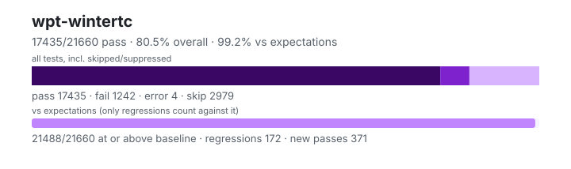

# wpt-wintertc — `1.6.0+dd7116a51`

- Image digest: `85762dd3efe4426821f8741049b219e38ec43d75312dea10b3f5f3b3b794fce6`
- Suite version: `1eb456f600fedad07c8cd6439796fb81db54faff`
- Ran: 2026-09-25T19:12:54.635Z → 2026-09-25T19:13:29.665Z

## Summary

**Pass rate: 17435/21660 (80.49%)** — overall, over all tests including skipped/suppressed

**vs expectations: 21488/21660 (99.21%)** — tests at or above the baseline (only regressions count against it)

| pass | fail | error | skip | regressions | new passes |
|---:|---:|---:|---:|---:|---:|
| 17435 | 1242 | 4 | 2979 | 172 | 371 |

## Observed cases (18681)

- `encoding/replacement-encodings.any.js :: csiso2022kr - non-empty input decodes to one replacement character.` — pass
- `encoding/replacement-encodings.any.js :: csiso2022kr - empty input decodes to empty output.` — pass
- `encoding/replacement-encodings.any.js :: hz-gb-2312 - non-empty input decodes to one replacement character.` — pass
- `encoding/replacement-encodings.any.js :: hz-gb-2312 - empty input decodes to empty output.` — pass
- `encoding/replacement-encodings.any.js :: iso-2022-cn - non-empty input decodes to one replacement character.` — pass
- `encoding/replacement-encodings.any.js :: iso-2022-cn - empty input decodes to empty output.` — pass
- `encoding/replacement-encodings.any.js :: iso-2022-cn-ext - non-empty input decodes to one replacement character.` — pass
- `encoding/replacement-encodings.any.js :: iso-2022-cn-ext - empty input decodes to empty output.` — pass
- `encoding/replacement-encodings.any.js :: iso-2022-kr - non-empty input decodes to one replacement character.` — pass
- `encoding/replacement-encodings.any.js :: iso-2022-kr - empty input decodes to empty output.` — pass
- `encoding/replacement-encodings.any.js :: replacement - non-empty input decodes to one replacement character.` — pass
- `encoding/replacement-encodings.any.js :: replacement - empty input decodes to empty output.` — pass
- `encoding/api-replacement-encodings.any.js :: Label for "replacement" should be rejected by API: csiso2022kr` — pass
- `encoding/api-replacement-encodings.any.js :: Label for "replacement" should be rejected by API: hz-gb-2312` — pass
- `encoding/api-replacement-encodings.any.js :: Label for "replacement" should be rejected by API: iso-2022-cn` — pass
- `encoding/api-replacement-encodings.any.js :: Label for "replacement" should be rejected by API: iso-2022-cn-ext` — pass
- `encoding/api-replacement-encodings.any.js :: Label for "replacement" should be rejected by API: iso-2022-kr` — pass
- `encoding/api-replacement-encodings.any.js :: Label for "replacement" should be rejected by API: replacement` — pass
- `encoding/iso-2022-jp-decoder.any.js :: iso-2022-jp decoder: Error ESC` — pass
- `encoding/iso-2022-jp-decoder.any.js :: iso-2022-jp decoder: Error ESC, character` — pass
- `encoding/iso-2022-jp-decoder.any.js :: iso-2022-jp decoder: ASCII ESC, character` — pass
- `encoding/iso-2022-jp-decoder.any.js :: iso-2022-jp decoder: Double ASCII ESC, character` — pass
- `encoding/iso-2022-jp-decoder.any.js :: iso-2022-jp decoder: character, ASCII ESC, character` — pass
- `encoding/iso-2022-jp-decoder.any.js :: iso-2022-jp decoder: characters` — pass
- `encoding/iso-2022-jp-decoder.any.js :: iso-2022-jp decoder: SO / SI` — pass
- `encoding/iso-2022-jp-decoder.any.js :: iso-2022-jp decoder: Roman ESC, characters` — pass
- `encoding/iso-2022-jp-decoder.any.js :: iso-2022-jp decoder: Roman ESC, SO / SI` — pass
- `encoding/iso-2022-jp-decoder.any.js :: iso-2022-jp decoder: Roman ESC, error ESC, Katakana ESC` — pass
- `encoding/iso-2022-jp-decoder.any.js :: iso-2022-jp decoder: Katakana ESC, character` — pass
- `encoding/iso-2022-jp-decoder.any.js :: iso-2022-jp decoder: Katakana ESC, multibyte ESC, character` — pass
- `encoding/iso-2022-jp-decoder.any.js :: iso-2022-jp decoder: Katakana ESC, error ESC, character` — pass
- `encoding/iso-2022-jp-decoder.any.js :: iso-2022-jp decoder: Katakana ESC, error ESC #2, character` — pass
- `encoding/iso-2022-jp-decoder.any.js :: iso-2022-jp decoder: Katakana ESC, character, Katakana ESC, character` — pass
- `encoding/iso-2022-jp-decoder.any.js :: iso-2022-jp decoder: Katakana ESC, SO / SI` — pass
- `encoding/iso-2022-jp-decoder.any.js :: iso-2022-jp decoder: Multibyte ESC, character` — pass
- `encoding/iso-2022-jp-decoder.any.js :: iso-2022-jp decoder: Multibyte ESC #2, character` — pass
- `encoding/iso-2022-jp-decoder.any.js :: iso-2022-jp decoder: Multibyte ESC, error ESC, character` — pass
- `encoding/iso-2022-jp-decoder.any.js :: iso-2022-jp decoder: Double multibyte ESC` — pass
- `encoding/iso-2022-jp-decoder.any.js :: iso-2022-jp decoder: Double multibyte ESC, character` — pass
- `encoding/iso-2022-jp-decoder.any.js :: iso-2022-jp decoder: Double multibyte ESC #2, character` — pass
- `encoding/iso-2022-jp-decoder.any.js :: iso-2022-jp decoder: Multibyte ESC, error ESC #2, character` — pass
- `encoding/iso-2022-jp-decoder.any.js :: iso-2022-jp decoder: Multibyte ESC, single byte, multibyte ESC, character` — pass
- `encoding/iso-2022-jp-decoder.any.js :: iso-2022-jp decoder: Multibyte ESC, lead error byte` — pass
- `encoding/iso-2022-jp-decoder.any.js :: iso-2022-jp decoder: Multibyte ESC, trail error byte` — pass
- `encoding/iso-2022-jp-decoder.any.js :: iso-2022-jp decoder: character, error ESC` — pass
- `encoding/iso-2022-jp-decoder.any.js :: iso-2022-jp decoder: character, error ESC #2` — pass
- `encoding/iso-2022-jp-decoder.any.js :: iso-2022-jp decoder: character, error ESC #3` — pass
- `encoding/iso-2022-jp-decoder.any.js :: iso-2022-jp decoder: character, ASCII ESC` — pass
- `encoding/iso-2022-jp-decoder.any.js :: iso-2022-jp decoder: character, Roman ESC` — pass
- `encoding/iso-2022-jp-decoder.any.js :: iso-2022-jp decoder: character, Katakana ESC` — pass
- `encoding/iso-2022-jp-decoder.any.js :: iso-2022-jp decoder: character, Multibyte ESC` — pass
- `encoding/iso-2022-jp-decoder.any.js :: iso-2022-jp decoder: character, Multibyte ESC #2` — pass
- `encoding/streams/backpressure.any.js :: write() should not complete until read relieves backpressure for TextDecoderStream` — pass
- `encoding/streams/backpressure.any.js :: additional writes should wait for backpressure to be relieved for class TextDecoderStream` — pass
- `encoding/streams/backpressure.any.js :: write() should not complete until read relieves backpressure for TextEncoderStream` — pass
- `encoding/streams/backpressure.any.js :: additional writes should wait for backpressure to be relieved for class TextEncoderStream` — pass
- `encoding/api-surrogates-utf8.any.js :: Invalid surrogates encoded into UTF-8: Sanity check` — pass
- `encoding/api-surrogates-utf8.any.js :: Invalid surrogates encoded into UTF-8: Surrogate half (low)` — pass
- `encoding/api-surrogates-utf8.any.js :: Invalid surrogates encoded into UTF-8: Surrogate half (high)` — pass
- `encoding/api-surrogates-utf8.any.js :: Invalid surrogates encoded into UTF-8: Surrogate half (low), in a string` — pass
- `encoding/api-surrogates-utf8.any.js :: Invalid surrogates encoded into UTF-8: Surrogate half (high), in a string` — pass
- `encoding/api-surrogates-utf8.any.js :: Invalid surrogates encoded into UTF-8: Wrong order` — pass
- `encoding/legacy-mb-schinese/gbk/gbk-decoder.any.js :: gbk pointer: 6432` — pass
- `encoding/legacy-mb-schinese/gbk/gbk-decoder.any.js :: gbk pointer: 7533` — pass
- `encoding/legacy-mb-schinese/gbk/gbk-decoder.any.js :: gbk pointer: 7536` — pass
- `encoding/legacy-mb-schinese/gbk/gbk-decoder.any.js :: gbk pointer: 7672` — pass
- `encoding/legacy-mb-schinese/gbk/gbk-decoder.any.js :: gbk pointer: 7673` — pass
- `encoding/legacy-mb-schinese/gbk/gbk-decoder.any.js :: gbk pointer: 7674` — pass
- `encoding/legacy-mb-schinese/gbk/gbk-decoder.any.js :: gbk pointer: 7675` — pass
- `encoding/legacy-mb-schinese/gbk/gbk-decoder.any.js :: gbk pointer: 7676` — pass
- `encoding/legacy-mb-schinese/gbk/gbk-decoder.any.js :: gbk pointer: 7677` — pass
- `encoding/legacy-mb-schinese/gbk/gbk-decoder.any.js :: gbk pointer: 7678` — pass
- `encoding/legacy-mb-schinese/gbk/gbk-decoder.any.js :: gbk pointer: 7679` — pass
- `encoding/legacy-mb-schinese/gbk/gbk-decoder.any.js :: gbk pointer: 7680` — pass
- `encoding/legacy-mb-schinese/gbk/gbk-decoder.any.js :: gbk pointer: 7681` — pass
- `encoding/legacy-mb-schinese/gbk/gbk-decoder.any.js :: gbk pointer: 7682` — pass
- `encoding/legacy-mb-schinese/gbk/gbk-decoder.any.js :: gbk pointer: 7683` — pass
- `encoding/legacy-mb-schinese/gbk/gbk-decoder.any.js :: gbk pointer: 7684` — pass
- `encoding/legacy-mb-schinese/gbk/gbk-decoder.any.js :: gbk pointer: 23766` — pass
- `encoding/legacy-mb-schinese/gbk/gbk-decoder.any.js :: gbk pointer: 23770` — pass
- `encoding/legacy-mb-schinese/gbk/gbk-decoder.any.js :: gbk pointer: 23771` — pass
- `encoding/legacy-mb-schinese/gbk/gbk-decoder.any.js :: gbk pointer: 23772` — pass
- `encoding/legacy-mb-schinese/gbk/gbk-decoder.any.js :: gbk pointer: 23773` — pass
- `encoding/legacy-mb-schinese/gbk/gbk-decoder.any.js :: gbk pointer: 23774` — pass
- `encoding/legacy-mb-schinese/gbk/gbk-decoder.any.js :: gbk pointer: 23776` — pass
- `encoding/legacy-mb-schinese/gbk/gbk-decoder.any.js :: gbk pointer: 23777` — pass
- `encoding/legacy-mb-schinese/gbk/gbk-decoder.any.js :: gbk pointer: 23778` — pass
- `encoding/legacy-mb-schinese/gbk/gbk-decoder.any.js :: gbk pointer: 23779` — pass
- `encoding/legacy-mb-schinese/gbk/gbk-decoder.any.js :: gbk pointer: 23780` — pass
- `encoding/legacy-mb-schinese/gbk/gbk-decoder.any.js :: gbk pointer: 23781` — pass
- `encoding/legacy-mb-schinese/gbk/gbk-decoder.any.js :: gbk pointer: 23782` — pass
- `encoding/legacy-mb-schinese/gbk/gbk-decoder.any.js :: gbk pointer: 23784` — pass
- `encoding/legacy-mb-schinese/gbk/gbk-decoder.any.js :: gbk pointer: 23785` — pass
- `encoding/legacy-mb-schinese/gbk/gbk-decoder.any.js :: gbk pointer: 23786` — pass
- `encoding/legacy-mb-schinese/gbk/gbk-decoder.any.js :: gbk pointer: 23787` — pass
- `encoding/legacy-mb-schinese/gbk/gbk-decoder.any.js :: gbk pointer: 23790` — pass
- `encoding/legacy-mb-schinese/gbk/gbk-decoder.any.js :: gbk pointer: 23791` — pass
- `encoding/legacy-mb-schinese/gbk/gbk-decoder.any.js :: gbk pointer: 23792` — pass
- `encoding/legacy-mb-schinese/gbk/gbk-decoder.any.js :: gbk pointer: 23793` — pass
- `encoding/legacy-mb-schinese/gbk/gbk-decoder.any.js :: gbk pointer: 23796` — pass
- `encoding/legacy-mb-schinese/gbk/gbk-decoder.any.js :: gbk pointer: 23797` — pass
- `encoding/legacy-mb-schinese/gbk/gbk-decoder.any.js :: gbk pointer: 23798` — pass
- `encoding/legacy-mb-schinese/gbk/gbk-decoder.any.js :: gbk pointer: 23799` — pass
- `encoding/legacy-mb-schinese/gbk/gbk-decoder.any.js :: gbk pointer: 23800` — pass
- `encoding/legacy-mb-schinese/gbk/gbk-decoder.any.js :: gbk pointer: 23801` — pass
- `encoding/legacy-mb-schinese/gbk/gbk-decoder.any.js :: gbk pointer: 23802` — pass
- `encoding/legacy-mb-schinese/gbk/gbk-decoder.any.js :: gbk pointer: 23803` — pass
- `encoding/legacy-mb-schinese/gbk/gbk-decoder.any.js :: gbk pointer: 23805` — pass
- `encoding/legacy-mb-schinese/gbk/gbk-decoder.any.js :: gbk pointer: 23806` — pass
- `encoding/legacy-mb-schinese/gbk/gbk-decoder.any.js :: gbk pointer: 23807` — pass
- `encoding/legacy-mb-schinese/gbk/gbk-decoder.any.js :: gbk pointer: 23808` — pass
- `encoding/legacy-mb-schinese/gbk/gbk-decoder.any.js :: gbk pointer: 23809` — pass
- `encoding/legacy-mb-schinese/gbk/gbk-decoder.any.js :: gbk pointer: 23810` — pass
- `encoding/legacy-mb-schinese/gbk/gbk-decoder.any.js :: gbk pointer: 23811` — pass
- `encoding/legacy-mb-schinese/gbk/gbk-decoder.any.js :: gbk pointer: 23813` — pass
- `encoding/legacy-mb-schinese/gbk/gbk-decoder.any.js :: gbk pointer: 23814` — pass
- `encoding/legacy-mb-schinese/gbk/gbk-decoder.any.js :: gbk pointer: 23815` — pass
- `encoding/legacy-mb-schinese/gbk/gbk-decoder.any.js :: gbk pointer: 23816` — pass
- `encoding/legacy-mb-schinese/gbk/gbk-decoder.any.js :: gbk pointer: 23817` — pass
- `encoding/legacy-mb-schinese/gbk/gbk-decoder.any.js :: gbk pointer: 23818` — pass
- `encoding/legacy-mb-schinese/gbk/gbk-decoder.any.js :: gbk pointer: 23819` — pass
- `encoding/legacy-mb-schinese/gbk/gbk-decoder.any.js :: gbk pointer: 23820` — pass
- `encoding/legacy-mb-schinese/gbk/gbk-decoder.any.js :: gbk pointer: 23821` — pass
- `encoding/legacy-mb-schinese/gbk/gbk-decoder.any.js :: gbk pointer: 23822` — pass
- `encoding/legacy-mb-schinese/gbk/gbk-decoder.any.js :: gbk pointer: 23823` — pass
- `encoding/legacy-mb-schinese/gbk/gbk-decoder.any.js :: gbk pointer: 23824` — pass
- `encoding/legacy-mb-schinese/gbk/gbk-decoder.any.js :: gbk pointer: 23825` — pass
- `encoding/legacy-mb-schinese/gbk/gbk-decoder.any.js :: gbk pointer: 23826` — pass
- `encoding/legacy-mb-schinese/gbk/gbk-decoder.any.js :: gbk pointer: 23827` — pass
- `encoding/legacy-mb-schinese/gbk/gbk-decoder.any.js :: gbk pointer: 23828` — pass
- `encoding/legacy-mb-schinese/gbk/gbk-decoder.any.js :: gbk pointer: 23831` — pass
- `encoding/legacy-mb-schinese/gbk/gbk-decoder.any.js :: gbk pointer: 23832` — pass
- `encoding/legacy-mb-schinese/gbk/gbk-decoder.any.js :: gbk pointer: 23833` — pass
- `encoding/legacy-mb-schinese/gbk/gbk-decoder.any.js :: gbk pointer: 23834` — pass
- `encoding/legacy-mb-schinese/gbk/gbk-decoder.any.js :: gbk pointer: 23835` — pass
- `encoding/legacy-mb-schinese/gbk/gbk-decoder.any.js :: gbk pointer: 23836` — pass
- `encoding/legacy-mb-schinese/gbk/gbk-decoder.any.js :: gbk pointer: 23837` — pass
- `encoding/legacy-mb-schinese/gbk/gbk-decoder.any.js :: gbk pointer: 23838` — pass
- `encoding/legacy-mb-schinese/gbk/gbk-decoder.any.js :: gbk pointer: 23839` — pass
- `encoding/legacy-mb-schinese/gbk/gbk-decoder.any.js :: gbk pointer: 23840` — pass
- `encoding/legacy-mb-schinese/gbk/gbk-decoder.any.js :: gbk pointer: 23841` — pass
- `encoding/legacy-mb-schinese/gbk/gbk-decoder.any.js :: gbk pointer: 23842` — pass
- `encoding/legacy-mb-schinese/gbk/gbk-decoder.any.js :: gbk pointer: 23843` — pass
- `encoding/legacy-mb-schinese/gbk/gbk-decoder.any.js :: gbk pointer: 23844` — pass
- `encoding/encodeInto.any.js :: encodeInto() into ArrayBuffer with Hi and destination length 0, offset 0, filler 0` — pass
- `encoding/encodeInto.any.js :: encodeInto() into SharedArrayBuffer with Hi and destination length 0, offset 0, filler 0` — fail — sabConstructor is not a constructor
- `encoding/encodeInto.any.js :: encodeInto() into ArrayBuffer with Hi and destination length 0, offset 4, filler 0` — pass
- `encoding/encodeInto.any.js :: encodeInto() into SharedArrayBuffer with Hi and destination length 0, offset 4, filler 0` — fail — sabConstructor is not a constructor
- `encoding/encodeInto.any.js :: encodeInto() into ArrayBuffer with Hi and destination length 0, offset 0, filler 128` — pass
- `encoding/encodeInto.any.js :: encodeInto() into SharedArrayBuffer with Hi and destination length 0, offset 0, filler 128` — fail — sabConstructor is not a constructor
- `encoding/encodeInto.any.js :: encodeInto() into ArrayBuffer with Hi and destination length 0, offset 4, filler 128` — pass
- `encoding/encodeInto.any.js :: encodeInto() into SharedArrayBuffer with Hi and destination length 0, offset 4, filler 128` — fail — sabConstructor is not a constructor
- `encoding/encodeInto.any.js :: encodeInto() into ArrayBuffer with Hi and destination length 0, offset 0, filler random` — pass
- `encoding/encodeInto.any.js :: encodeInto() into SharedArrayBuffer with Hi and destination length 0, offset 0, filler random` — fail — sabConstructor is not a constructor
- `encoding/encodeInto.any.js :: encodeInto() into ArrayBuffer with Hi and destination length 0, offset 4, filler random` — pass
- `encoding/encodeInto.any.js :: encodeInto() into SharedArrayBuffer with Hi and destination length 0, offset 4, filler random` — fail — sabConstructor is not a constructor
- `encoding/encodeInto.any.js :: encodeInto() into ArrayBuffer with A and destination length 10, offset 0, filler 0` — pass
- `encoding/encodeInto.any.js :: encodeInto() into SharedArrayBuffer with A and destination length 10, offset 0, filler 0` — fail — sabConstructor is not a constructor
- `encoding/encodeInto.any.js :: encodeInto() into ArrayBuffer with A and destination length 10, offset 4, filler 0` — pass
- `encoding/encodeInto.any.js :: encodeInto() into SharedArrayBuffer with A and destination length 10, offset 4, filler 0` — fail — sabConstructor is not a constructor
- `encoding/encodeInto.any.js :: encodeInto() into ArrayBuffer with A and destination length 10, offset 0, filler 128` — pass
- `encoding/encodeInto.any.js :: encodeInto() into SharedArrayBuffer with A and destination length 10, offset 0, filler 128` — fail — sabConstructor is not a constructor
- `encoding/encodeInto.any.js :: encodeInto() into ArrayBuffer with A and destination length 10, offset 4, filler 128` — pass
- `encoding/encodeInto.any.js :: encodeInto() into SharedArrayBuffer with A and destination length 10, offset 4, filler 128` — fail — sabConstructor is not a constructor
- `encoding/encodeInto.any.js :: encodeInto() into ArrayBuffer with A and destination length 10, offset 0, filler random` — pass
- `encoding/encodeInto.any.js :: encodeInto() into SharedArrayBuffer with A and destination length 10, offset 0, filler random` — fail — sabConstructor is not a constructor
- `encoding/encodeInto.any.js :: encodeInto() into ArrayBuffer with A and destination length 10, offset 4, filler random` — pass
- `encoding/encodeInto.any.js :: encodeInto() into SharedArrayBuffer with A and destination length 10, offset 4, filler random` — fail — sabConstructor is not a constructor
- `encoding/encodeInto.any.js :: encodeInto() into ArrayBuffer with 𝌆 and destination length 4, offset 0, filler 0` — pass
- `encoding/encodeInto.any.js :: encodeInto() into SharedArrayBuffer with 𝌆 and destination length 4, offset 0, filler 0` — fail — sabConstructor is not a constructor
- `encoding/encodeInto.any.js :: encodeInto() into ArrayBuffer with 𝌆 and destination length 4, offset 4, filler 0` — pass
- `encoding/encodeInto.any.js :: encodeInto() into SharedArrayBuffer with 𝌆 and destination length 4, offset 4, filler 0` — fail — sabConstructor is not a constructor
- `encoding/encodeInto.any.js :: encodeInto() into ArrayBuffer with 𝌆 and destination length 4, offset 0, filler 128` — pass
- `encoding/encodeInto.any.js :: encodeInto() into SharedArrayBuffer with 𝌆 and destination length 4, offset 0, filler 128` — fail — sabConstructor is not a constructor
- `encoding/encodeInto.any.js :: encodeInto() into ArrayBuffer with 𝌆 and destination length 4, offset 4, filler 128` — pass
- `encoding/encodeInto.any.js :: encodeInto() into SharedArrayBuffer with 𝌆 and destination length 4, offset 4, filler 128` — fail — sabConstructor is not a constructor
- `encoding/encodeInto.any.js :: encodeInto() into ArrayBuffer with 𝌆 and destination length 4, offset 0, filler random` — pass
- `encoding/encodeInto.any.js :: encodeInto() into SharedArrayBuffer with 𝌆 and destination length 4, offset 0, filler random` — fail — sabConstructor is not a constructor
- `encoding/encodeInto.any.js :: encodeInto() into ArrayBuffer with 𝌆 and destination length 4, offset 4, filler random` — pass
- `encoding/encodeInto.any.js :: encodeInto() into SharedArrayBuffer with 𝌆 and destination length 4, offset 4, filler random` — fail — sabConstructor is not a constructor
- `encoding/encodeInto.any.js :: encodeInto() into ArrayBuffer with 𝌆A and destination length 3, offset 0, filler 0` — pass
- `encoding/encodeInto.any.js :: encodeInto() into SharedArrayBuffer with 𝌆A and destination length 3, offset 0, filler 0` — fail — sabConstructor is not a constructor
- `encoding/encodeInto.any.js :: encodeInto() into ArrayBuffer with 𝌆A and destination length 3, offset 4, filler 0` — pass
- `encoding/encodeInto.any.js :: encodeInto() into SharedArrayBuffer with 𝌆A and destination length 3, offset 4, filler 0` — fail — sabConstructor is not a constructor
- `encoding/encodeInto.any.js :: encodeInto() into ArrayBuffer with 𝌆A and destination length 3, offset 0, filler 128` — pass
- `encoding/encodeInto.any.js :: encodeInto() into SharedArrayBuffer with 𝌆A and destination length 3, offset 0, filler 128` — fail — sabConstructor is not a constructor
- `encoding/encodeInto.any.js :: encodeInto() into ArrayBuffer with 𝌆A and destination length 3, offset 4, filler 128` — pass
- `encoding/encodeInto.any.js :: encodeInto() into SharedArrayBuffer with 𝌆A and destination length 3, offset 4, filler 128` — fail — sabConstructor is not a constructor
- `encoding/encodeInto.any.js :: encodeInto() into ArrayBuffer with 𝌆A and destination length 3, offset 0, filler random` — pass
- `encoding/encodeInto.any.js :: encodeInto() into SharedArrayBuffer with 𝌆A and destination length 3, offset 0, filler random` — fail — sabConstructor is not a constructor
- `encoding/encodeInto.any.js :: encodeInto() into ArrayBuffer with 𝌆A and destination length 3, offset 4, filler random` — pass
- `encoding/encodeInto.any.js :: encodeInto() into SharedArrayBuffer with 𝌆A and destination length 3, offset 4, filler random` — fail — sabConstructor is not a constructor
- `encoding/encodeInto.any.js :: encodeInto() into ArrayBuffer with U+d834AU+df06A¥Hi and destination length 10, offset 0, filler 0` — pass
- `encoding/encodeInto.any.js :: encodeInto() into SharedArrayBuffer with U+d834AU+df06A¥Hi and destination length 10, offset 0, filler 0` — fail — sabConstructor is not a constructor
- `encoding/encodeInto.any.js :: encodeInto() into ArrayBuffer with U+d834AU+df06A¥Hi and destination length 10, offset 4, filler 0` — pass
- `encoding/encodeInto.any.js :: encodeInto() into SharedArrayBuffer with U+d834AU+df06A¥Hi and destination length 10, offset 4, filler 0` — fail — sabConstructor is not a constructor
- `encoding/encodeInto.any.js :: encodeInto() into ArrayBuffer with U+d834AU+df06A¥Hi and destination length 10, offset 0, filler 128` — pass
- `encoding/encodeInto.any.js :: encodeInto() into SharedArrayBuffer with U+d834AU+df06A¥Hi and destination length 10, offset 0, filler 128` — fail — sabConstructor is not a constructor
- `encoding/encodeInto.any.js :: encodeInto() into ArrayBuffer with U+d834AU+df06A¥Hi and destination length 10, offset 4, filler 128` — pass
- `encoding/encodeInto.any.js :: encodeInto() into SharedArrayBuffer with U+d834AU+df06A¥Hi and destination length 10, offset 4, filler 128` — fail — sabConstructor is not a constructor
- …and 18481 more

## ❌ Regressions (172)

- `fetch/api/redirect/redirect-mode.any.js :: cross-origin redirect 301 in manual redirect and no-cors mode` — assert_unreached: Should have rejected: undefined Reached unreachable code
- `fetch/api/redirect/redirect-mode.any.js :: cross-origin redirect 302 in manual redirect and no-cors mode` — assert_unreached: Should have rejected: undefined Reached unreachable code
- `fetch/api/redirect/redirect-mode.any.js :: cross-origin redirect 303 in manual redirect and no-cors mode` — assert_unreached: Should have rejected: undefined Reached unreachable code
- `fetch/api/redirect/redirect-mode.any.js :: cross-origin redirect 307 in manual redirect and no-cors mode` — assert_unreached: Should have rejected: undefined Reached unreachable code
- `fetch/api/redirect/redirect-mode.any.js :: cross-origin redirect 308 in manual redirect and no-cors mode` — assert_unreached: Should have rejected: undefined Reached unreachable code
- `fetch/data-urls/base64.any.js :: data: URL base64 handling: ""` — promise_test: Unhandled rejection with value: object "TypeError: fetch: unsupported URL scheme 'data'"
- `fetch/data-urls/base64.any.js :: data: URL base64 handling: "abcd"` — promise_test: Unhandled rejection with value: object "TypeError: fetch: unsupported URL scheme 'data'"
- `fetch/data-urls/base64.any.js :: data: URL base64 handling: " abcd"` — promise_test: Unhandled rejection with value: object "TypeError: fetch: unsupported URL scheme 'data'"
- `fetch/data-urls/base64.any.js :: data: URL base64 handling: "abcd "` — promise_test: Unhandled rejection with value: object "TypeError: fetch: unsupported URL scheme 'data'"
- `fetch/data-urls/base64.any.js :: data: URL base64 handling: "ab"` — promise_test: Unhandled rejection with value: object "TypeError: fetch: unsupported URL scheme 'data'"
- `fetch/data-urls/base64.any.js :: data: URL base64 handling: "abc"` — promise_test: Unhandled rejection with value: object "TypeError: fetch: unsupported URL scheme 'data'"
- `fetch/data-urls/base64.any.js :: data: URL base64 handling: "ab=="` — promise_test: Unhandled rejection with value: object "TypeError: fetch: unsupported URL scheme 'data'"
- `fetch/data-urls/base64.any.js :: data: URL base64 handling: "abc="` — promise_test: Unhandled rejection with value: object "TypeError: fetch: unsupported URL scheme 'data'"
- `fetch/data-urls/base64.any.js :: data: URL base64 handling: "ab\tcd"` — promise_test: Unhandled rejection with value: object "TypeError: fetch: unsupported URL scheme 'data'"
- `fetch/data-urls/base64.any.js :: data: URL base64 handling: "ab\ncd"` — promise_test: Unhandled rejection with value: object "TypeError: fetch: unsupported URL scheme 'data'"
- `fetch/data-urls/base64.any.js :: data: URL base64 handling: "ab\fcd"` — promise_test: Unhandled rejection with value: object "TypeError: fetch: unsupported URL scheme 'data'"
- `fetch/data-urls/base64.any.js :: data: URL base64 handling: "ab\rcd"` — promise_test: Unhandled rejection with value: object "TypeError: fetch: unsupported URL scheme 'data'"
- `fetch/data-urls/base64.any.js :: data: URL base64 handling: "ab cd"` — promise_test: Unhandled rejection with value: object "TypeError: fetch: unsupported URL scheme 'data'"
- `fetch/data-urls/base64.any.js :: data: URL base64 handling: "ab\t\n\f\r cd"` — promise_test: Unhandled rejection with value: object "TypeError: fetch: unsupported URL scheme 'data'"
- `fetch/data-urls/base64.any.js :: data: URL base64 handling: " \t\n\f\r ab\t\n\f\r cd\t\n\f\r "` — promise_test: Unhandled rejection with value: object "TypeError: fetch: unsupported URL scheme 'data'"
- `fetch/data-urls/base64.any.js :: data: URL base64 handling: "ab\t\n\f\r =\t\n\f\r =\t\n\f\r "` — promise_test: Unhandled rejection with value: object "TypeError: fetch: unsupported URL scheme 'data'"
- `fetch/data-urls/base64.any.js :: data: URL base64 handling: "/A"` — promise_test: Unhandled rejection with value: object "TypeError: fetch: unsupported URL scheme 'data'"
- `fetch/data-urls/base64.any.js :: data: URL base64 handling: "//A"` — promise_test: Unhandled rejection with value: object "TypeError: fetch: unsupported URL scheme 'data'"
- `fetch/data-urls/base64.any.js :: data: URL base64 handling: "///A"` — promise_test: Unhandled rejection with value: object "TypeError: fetch: unsupported URL scheme 'data'"
- `fetch/data-urls/base64.any.js :: data: URL base64 handling: "A/"` — promise_test: Unhandled rejection with value: object "TypeError: fetch: unsupported URL scheme 'data'"
- `fetch/data-urls/base64.any.js :: data: URL base64 handling: "AA/"` — promise_test: Unhandled rejection with value: object "TypeError: fetch: unsupported URL scheme 'data'"
- `fetch/data-urls/base64.any.js :: data: URL base64 handling: "AAA/"` — promise_test: Unhandled rejection with value: object "TypeError: fetch: unsupported URL scheme 'data'"
- `fetch/data-urls/base64.any.js :: data: URL base64 handling: "YQ"` — promise_test: Unhandled rejection with value: object "TypeError: fetch: unsupported URL scheme 'data'"
- `fetch/data-urls/base64.any.js :: data: URL base64 handling: "YR"` — promise_test: Unhandled rejection with value: object "TypeError: fetch: unsupported URL scheme 'data'"
- `fetch/data-urls/processing.any.js :: "data://test/,X"` — promise_test: Unhandled rejection with value: object "TypeError: fetch: unsupported URL scheme 'data'"
- `fetch/data-urls/processing.any.js :: "data:,X"` — promise_test: Unhandled rejection with value: object "TypeError: fetch: unsupported URL scheme 'data'"
- `fetch/data-urls/processing.any.js :: "data:,"` — promise_test: Unhandled rejection with value: object "TypeError: fetch: unsupported URL scheme 'data'"
- `fetch/data-urls/processing.any.js :: "data:,X#X"` — promise_test: Unhandled rejection with value: object "TypeError: fetch: unsupported URL scheme 'data'"
- `fetch/data-urls/processing.any.js :: "data:,%FF"` — promise_test: Unhandled rejection with value: object "TypeError: fetch: unsupported URL scheme 'data'"
- `fetch/data-urls/processing.any.js :: "data:text/plain,X"` — promise_test: Unhandled rejection with value: object "TypeError: fetch: unsupported URL scheme 'data'"
- `fetch/data-urls/processing.any.js :: "data:text/plain ,X"` — promise_test: Unhandled rejection with value: object "TypeError: fetch: unsupported URL scheme 'data'"
- `fetch/data-urls/processing.any.js :: "data:text/plain%20,X"` — promise_test: Unhandled rejection with value: object "TypeError: fetch: unsupported URL scheme 'data'"
- `fetch/data-urls/processing.any.js :: "data:text/plain\f,X"` — promise_test: Unhandled rejection with value: object "TypeError: fetch: unsupported URL scheme 'data'"
- `fetch/data-urls/processing.any.js :: "data:text/plain%0C,X"` — promise_test: Unhandled rejection with value: object "TypeError: fetch: unsupported URL scheme 'data'"
- `fetch/data-urls/processing.any.js :: "data:text/plain;,X"` — promise_test: Unhandled rejection with value: object "TypeError: fetch: unsupported URL scheme 'data'"
- `fetch/data-urls/processing.any.js :: "data:;x=x;charset=x,X"` — promise_test: Unhandled rejection with value: object "TypeError: fetch: unsupported URL scheme 'data'"
- `fetch/data-urls/processing.any.js :: "data:;x=x,X"` — promise_test: Unhandled rejection with value: object "TypeError: fetch: unsupported URL scheme 'data'"
- `fetch/data-urls/processing.any.js :: "data:text/plain;charset=windows-1252,%C2%B1"` — promise_test: Unhandled rejection with value: object "TypeError: fetch: unsupported URL scheme 'data'"
- `fetch/data-urls/processing.any.js :: "data:text/plain;Charset=UTF-8,%C2%B1"` — promise_test: Unhandled rejection with value: object "TypeError: fetch: unsupported URL scheme 'data'"
- `fetch/data-urls/processing.any.js :: "data:text/plain;charset=windows-1252,áñçə💩"` — promise_test: Unhandled rejection with value: object "TypeError: fetch: unsupported URL scheme 'data'"
- `fetch/data-urls/processing.any.js :: "data:text/plain;charset=UTF-8,áñçə💩"` — promise_test: Unhandled rejection with value: object "TypeError: fetch: unsupported URL scheme 'data'"
- `fetch/data-urls/processing.any.js :: "data:image/gif,%C2%B1"` — promise_test: Unhandled rejection with value: object "TypeError: fetch: unsupported URL scheme 'data'"
- `fetch/data-urls/processing.any.js :: "data:IMAGE/gif,%C2%B1"` — promise_test: Unhandled rejection with value: object "TypeError: fetch: unsupported URL scheme 'data'"
- `fetch/data-urls/processing.any.js :: "data:IMAGE/gif;hi=x,%C2%B1"` — promise_test: Unhandled rejection with value: object "TypeError: fetch: unsupported URL scheme 'data'"
- `fetch/data-urls/processing.any.js :: "data:IMAGE/gif;CHARSET=x,%C2%B1"` — promise_test: Unhandled rejection with value: object "TypeError: fetch: unsupported URL scheme 'data'"
- `fetch/data-urls/processing.any.js :: "data: ,%FF"` — promise_test: Unhandled rejection with value: object "TypeError: fetch: unsupported URL scheme 'data'"
- `fetch/data-urls/processing.any.js :: "data:%20,%FF"` — promise_test: Unhandled rejection with value: object "TypeError: fetch: unsupported URL scheme 'data'"
- `fetch/data-urls/processing.any.js :: "data:\f,%FF"` — promise_test: Unhandled rejection with value: object "TypeError: fetch: unsupported URL scheme 'data'"
- `fetch/data-urls/processing.any.js :: "data:%1F,%FF"` — promise_test: Unhandled rejection with value: object "TypeError: fetch: unsupported URL scheme 'data'"
- `fetch/data-urls/processing.any.js :: "data:\0,%FF"` — promise_test: Unhandled rejection with value: object "TypeError: fetch: unsupported URL scheme 'data'"
- `fetch/data-urls/processing.any.js :: "data:%00,%FF"` — promise_test: Unhandled rejection with value: object "TypeError: fetch: unsupported URL scheme 'data'"
- `fetch/data-urls/processing.any.js :: "data:text/html  ,X"` — promise_test: Unhandled rejection with value: object "TypeError: fetch: unsupported URL scheme 'data'"
- `fetch/data-urls/processing.any.js :: "data:text / html,X"` — promise_test: Unhandled rejection with value: object "TypeError: fetch: unsupported URL scheme 'data'"
- `fetch/data-urls/processing.any.js :: "data:†,X"` — promise_test: Unhandled rejection with value: object "TypeError: fetch: unsupported URL scheme 'data'"
- `fetch/data-urls/processing.any.js :: "data:†/†,X"` — promise_test: Unhandled rejection with value: object "TypeError: fetch: unsupported URL scheme 'data'"
- `fetch/data-urls/processing.any.js :: "data:X,X"` — promise_test: Unhandled rejection with value: object "TypeError: fetch: unsupported URL scheme 'data'"
- `fetch/data-urls/processing.any.js :: "data:image/png,X X"` — promise_test: Unhandled rejection with value: object "TypeError: fetch: unsupported URL scheme 'data'"
- `fetch/data-urls/processing.any.js :: "data:application/javascript,X X"` — promise_test: Unhandled rejection with value: object "TypeError: fetch: unsupported URL scheme 'data'"
- `fetch/data-urls/processing.any.js :: "data:application/xml,X X"` — promise_test: Unhandled rejection with value: object "TypeError: fetch: unsupported URL scheme 'data'"
- `fetch/data-urls/processing.any.js :: "data:text/javascript,X X"` — promise_test: Unhandled rejection with value: object "TypeError: fetch: unsupported URL scheme 'data'"
- `fetch/data-urls/processing.any.js :: "data:text/plain,X X"` — promise_test: Unhandled rejection with value: object "TypeError: fetch: unsupported URL scheme 'data'"
- `fetch/data-urls/processing.any.js :: "data:unknown/unknown,X X"` — promise_test: Unhandled rejection with value: object "TypeError: fetch: unsupported URL scheme 'data'"
- `fetch/data-urls/processing.any.js :: "data:text/plain;a=\",\",X"` — promise_test: Unhandled rejection with value: object "TypeError: fetch: unsupported URL scheme 'data'"
- `fetch/data-urls/processing.any.js :: "data:text/plain;a=%2C,X"` — promise_test: Unhandled rejection with value: object "TypeError: fetch: unsupported URL scheme 'data'"
- `fetch/data-urls/processing.any.js :: "data:;base64;base64,WA"` — promise_test: Unhandled rejection with value: object "TypeError: fetch: unsupported URL scheme 'data'"
- `fetch/data-urls/processing.any.js :: "data:x/x;base64;base64,WA"` — promise_test: Unhandled rejection with value: object "TypeError: fetch: unsupported URL scheme 'data'"
- `fetch/data-urls/processing.any.js :: "data:x/x;base64;charset=x,WA"` — promise_test: Unhandled rejection with value: object "TypeError: fetch: unsupported URL scheme 'data'"
- `fetch/data-urls/processing.any.js :: "data:x/x;base64;charset=x;base64,WA"` — promise_test: Unhandled rejection with value: object "TypeError: fetch: unsupported URL scheme 'data'"
- `fetch/data-urls/processing.any.js :: "data:x/x;base64;base64x,WA"` — promise_test: Unhandled rejection with value: object "TypeError: fetch: unsupported URL scheme 'data'"
- `fetch/data-urls/processing.any.js :: "data:;base64,W%20A"` — promise_test: Unhandled rejection with value: object "TypeError: fetch: unsupported URL scheme 'data'"
- `fetch/data-urls/processing.any.js :: "data:;base64,W%0CA"` — promise_test: Unhandled rejection with value: object "TypeError: fetch: unsupported URL scheme 'data'"
- `fetch/data-urls/processing.any.js :: "data:x;base64x,WA"` — promise_test: Unhandled rejection with value: object "TypeError: fetch: unsupported URL scheme 'data'"
- `fetch/data-urls/processing.any.js :: "data:x;base64;x,WA"` — promise_test: Unhandled rejection with value: object "TypeError: fetch: unsupported URL scheme 'data'"
- `fetch/data-urls/processing.any.js :: "data:x;base64=x,WA"` — promise_test: Unhandled rejection with value: object "TypeError: fetch: unsupported URL scheme 'data'"
- `fetch/data-urls/processing.any.js :: "data:; base64,WA"` — promise_test: Unhandled rejection with value: object "TypeError: fetch: unsupported URL scheme 'data'"
- `fetch/data-urls/processing.any.js :: "data:;  base64,WA"` — promise_test: Unhandled rejection with value: object "TypeError: fetch: unsupported URL scheme 'data'"
- `fetch/data-urls/processing.any.js :: "data:  ;charset=x   ;  base64,WA"` — promise_test: Unhandled rejection with value: object "TypeError: fetch: unsupported URL scheme 'data'"
- `fetch/data-urls/processing.any.js :: "data:;base64;,WA"` — promise_test: Unhandled rejection with value: object "TypeError: fetch: unsupported URL scheme 'data'"
- `fetch/data-urls/processing.any.js :: "data:;base64 ,WA"` — promise_test: Unhandled rejection with value: object "TypeError: fetch: unsupported URL scheme 'data'"
- `fetch/data-urls/processing.any.js :: "data:;base64   ,WA"` — promise_test: Unhandled rejection with value: object "TypeError: fetch: unsupported URL scheme 'data'"
- `fetch/data-urls/processing.any.js :: "data:;base 64,WA"` — promise_test: Unhandled rejection with value: object "TypeError: fetch: unsupported URL scheme 'data'"
- `fetch/data-urls/processing.any.js :: "data:;BASe64,WA"` — promise_test: Unhandled rejection with value: object "TypeError: fetch: unsupported URL scheme 'data'"
- `fetch/data-urls/processing.any.js :: "data:;%62ase64,WA"` — promise_test: Unhandled rejection with value: object "TypeError: fetch: unsupported URL scheme 'data'"
- `fetch/data-urls/processing.any.js :: "data:%3Bbase64,WA"` — promise_test: Unhandled rejection with value: object "TypeError: fetch: unsupported URL scheme 'data'"
- `fetch/data-urls/processing.any.js :: "data:;charset=x,X"` — promise_test: Unhandled rejection with value: object "TypeError: fetch: unsupported URL scheme 'data'"
- `fetch/data-urls/processing.any.js :: "data:; charset=x,X"` — promise_test: Unhandled rejection with value: object "TypeError: fetch: unsupported URL scheme 'data'"
- `fetch/data-urls/processing.any.js :: "data:;charset =x,X"` — promise_test: Unhandled rejection with value: object "TypeError: fetch: unsupported URL scheme 'data'"
- `fetch/data-urls/processing.any.js :: "data:;charset= x,X"` — promise_test: Unhandled rejection with value: object "TypeError: fetch: unsupported URL scheme 'data'"
- `fetch/data-urls/processing.any.js :: "data:;charset=,X"` — promise_test: Unhandled rejection with value: object "TypeError: fetch: unsupported URL scheme 'data'"
- `fetch/data-urls/processing.any.js :: "data:;charset,X"` — promise_test: Unhandled rejection with value: object "TypeError: fetch: unsupported URL scheme 'data'"
- `fetch/data-urls/processing.any.js :: "data:;charset=\"x\",X"` — promise_test: Unhandled rejection with value: object "TypeError: fetch: unsupported URL scheme 'data'"
- `fetch/data-urls/processing.any.js :: "data:;CHARSET=\"X\",X"` — promise_test: Unhandled rejection with value: object "TypeError: fetch: unsupported URL scheme 'data'"
- `url/IdnaTestV2.any.js :: ToASCII("a्‌b")` — Invalid URL
- `url/IdnaTestV2.any.js :: ToASCII("A्‌B")` — Invalid URL
- `url/IdnaTestV2.any.js :: ToASCII("A्‌b")` — Invalid URL
- `url/IdnaTestV2.any.js :: ToASCII("xn--a-Ä.pt") P4` — assert_throws_js: function "() => new URL(`https://${idnaTest.input}/x`)" did not throw
- `url/IdnaTestV2.any.js :: ToASCII("xn--a-Ä.pt") P4` — assert_throws_js: function "() => new URL(`https://${idnaTest.input}/x`)" did not throw
- `url/IdnaTestV2.any.js :: ToASCII("xn--a-ä.pt") P4` — assert_throws_js: function "() => new URL(`https://${idnaTest.input}/x`)" did not throw
- `url/IdnaTestV2.any.js :: ToASCII("xn--a-ä.pt") P4` — assert_throws_js: function "() => new URL(`https://${idnaTest.input}/x`)" did not throw
- `url/IdnaTestV2.any.js :: ToASCII("XN--A-Ä.PT") P4` — assert_throws_js: function "() => new URL(`https://${idnaTest.input}/x`)" did not throw
- `url/IdnaTestV2.any.js :: ToASCII("XN--A-Ä.PT") P4` — assert_throws_js: function "() => new URL(`https://${idnaTest.input}/x`)" did not throw
- `url/IdnaTestV2.any.js :: ToASCII("Xn--A-Ä.pt") P4` — assert_throws_js: function "() => new URL(`https://${idnaTest.input}/x`)" did not throw
- `url/IdnaTestV2.any.js :: ToASCII("Xn--A-Ä.pt") P4` — assert_throws_js: function "() => new URL(`https://${idnaTest.input}/x`)" did not throw
- `url/IdnaTestV2.any.js :: ToASCII("ஹ்‌")` — Invalid URL
- `url/IdnaTestV2.any.js :: ToASCII("ۯ‌ۯ") C1` — assert_throws_js: function "() => new URL(`https://${idnaTest.input}/x`)" did not throw
- `url/IdnaTestV2.any.js :: ToASCII("aU+d900z") V7; A3` — assert_throws_js: function "() => new URL(`https://${idnaTest.input}/x`)" did not throw
- `url/IdnaTestV2.any.js :: ToASCII("AU+d900Z") V7; A3` — assert_throws_js: function "() => new URL(`https://${idnaTest.input}/x`)" did not throw
- `url/IdnaTestV2.any.js :: ToASCII("≠ᢙ≯.솣-ᡴႠ")` — Invalid URL
- `url/IdnaTestV2.any.js :: ToASCII("᭄．᮪-≮≠") V6` — assert_throws_js: function "() => new URL(`https://${idnaTest.input}/x`)" did not throw
- `url/IdnaTestV2.any.js :: ToASCII("᭄.᮪-≮≠") V6` — assert_throws_js: function "() => new URL(`https://${idnaTest.input}/x`)" did not throw
- `url/IdnaTestV2.any.js :: ToASCII("᭄.᮪-≮≠") V6` — assert_throws_js: function "() => new URL(`https://${idnaTest.input}/x`)" did not throw
- `url/IdnaTestV2.any.js :: ToASCII("ς｡꧀ۧ") V6` — assert_throws_js: function "() => new URL(`https://${idnaTest.input}/x`)" did not throw
- `url/IdnaTestV2.any.js :: ToASCII("ς。꧀ۧ") V6` — assert_throws_js: function "() => new URL(`https://${idnaTest.input}/x`)" did not throw
- `url/IdnaTestV2.any.js :: ToASCII("Σ。꧀ۧ") V6` — assert_throws_js: function "() => new URL(`https://${idnaTest.input}/x`)" did not throw
- `url/IdnaTestV2.any.js :: ToASCII("σ。꧀ۧ") V6` — assert_throws_js: function "() => new URL(`https://${idnaTest.input}/x`)" did not throw
- `url/IdnaTestV2.any.js :: ToASCII("Σ｡꧀ۧ") V6` — assert_throws_js: function "() => new URL(`https://${idnaTest.input}/x`)" did not throw
- `url/IdnaTestV2.any.js :: ToASCII("σ｡꧀ۧ") V6` — assert_throws_js: function "() => new URL(`https://${idnaTest.input}/x`)" did not throw
- `url/IdnaTestV2.any.js :: ToASCII("≯1.。ß") A4_2 (ignored)` — Invalid URL
- `url/IdnaTestV2.any.js :: ToASCII("≯1.。SS") A4_2 (ignored)` — Invalid URL
- `url/IdnaTestV2.any.js :: ToASCII("≯1.。ss") A4_2 (ignored)` — Invalid URL
- `url/IdnaTestV2.any.js :: ToASCII("≯1.。Ss") A4_2 (ignored)` — Invalid URL
- `url/IdnaTestV2.any.js :: ToASCII("𑇀▍.⁞ᠰ") V6` — assert_throws_js: function "() => new URL(`https://${idnaTest.input}/x`)" did not throw
- `url/IdnaTestV2.any.js :: ToASCII("᜴-ೢ．󠄩Ⴄ") V6` — assert_throws_js: function "() => new URL(`https://${idnaTest.input}/x`)" did not throw
- `url/IdnaTestV2.any.js :: ToASCII("᜴-ೢ.󠄩Ⴄ") V6` — assert_throws_js: function "() => new URL(`https://${idnaTest.input}/x`)" did not throw
- `url/IdnaTestV2.any.js :: ToASCII("᜴-ೢ.󠄩ⴄ") V6` — assert_throws_js: function "() => new URL(`https://${idnaTest.input}/x`)" did not throw
- `url/IdnaTestV2.any.js :: ToASCII("᜴-ೢ．󠄩ⴄ") V6` — assert_throws_js: function "() => new URL(`https://${idnaTest.input}/x`)" did not throw
- `url/IdnaTestV2.any.js :: ToASCII("。。Ⴃ≯") A4_2 (ignored)` — Invalid URL
- `url/IdnaTestV2.any.js :: ToASCII("。。ⴃ≯") A4_2 (ignored)` — Invalid URL
- `url/IdnaTestV2.any.js :: ToASCII("。。᭄ᡉ") V6; A4_2 (ignored)` — assert_throws_js: function "() => new URL(`https://${idnaTest.input}/x`)" did not throw
- `url/IdnaTestV2.any.js :: ToASCII("⾆．ꡈ５≯ß")` — Invalid URL
- `url/IdnaTestV2.any.js :: ToASCII("舌.ꡈ5≯SS")` — Invalid URL
- `url/IdnaTestV2.any.js :: ToASCII("舌.ꡈ5≯Ss")` — Invalid URL
- `url/IdnaTestV2.any.js :: ToASCII("⾆．ꡈ５≯SS")` — Invalid URL
- `url/IdnaTestV2.any.js :: ToASCII("⾆．ꡈ５≯ss")` — Invalid URL
- `url/IdnaTestV2.any.js :: ToASCII("⾆．ꡈ５≯Ss")` — Invalid URL
- `url/IdnaTestV2.any.js :: ToASCII("Ⴁ畝.≮")` — Invalid URL
- `url/IdnaTestV2.any.js :: ToASCII("Ⴕ。۰≮ß݅")` — Invalid URL
- `url/IdnaTestV2.any.js :: ToASCII("ⴕ。۰≮ß݅")` — Invalid URL
- `url/IdnaTestV2.any.js :: ToASCII("Ⴕ。۰≮SS݅")` — Invalid URL
- `url/IdnaTestV2.any.js :: ToASCII("ⴕ。۰≮ss݅")` — Invalid URL
- `url/IdnaTestV2.any.js :: ToASCII("Ⴕ。۰≮Ss݅")` — Invalid URL
- `url/IdnaTestV2.any.js :: ToASCII("Ⴕ.۰≮SS݅")` — Invalid URL
- `url/IdnaTestV2.any.js :: ToASCII("Ⴕ.۰≮Ss݅")` — Invalid URL
- `url/IdnaTestV2.any.js :: ToASCII("𑈵廊.𐠍") V6` — assert_throws_js: function "() => new URL(`https://${idnaTest.input}/x`)" did not throw
- `url/IdnaTestV2.any.js :: ToASCII("ς．꧀꣄") V6` — assert_throws_js: function "() => new URL(`https://${idnaTest.input}/x`)" did not throw
- `url/IdnaTestV2.any.js :: ToASCII("ς.꧀꣄") V6` — assert_throws_js: function "() => new URL(`https://${idnaTest.input}/x`)" did not throw
- `url/IdnaTestV2.any.js :: ToASCII("Σ.꧀꣄") V6` — assert_throws_js: function "() => new URL(`https://${idnaTest.input}/x`)" did not throw
- `url/IdnaTestV2.any.js :: ToASCII("σ.꧀꣄") V6` — assert_throws_js: function "() => new URL(`https://${idnaTest.input}/x`)" did not throw
- `url/IdnaTestV2.any.js :: ToASCII("Σ．꧀꣄") V6` — assert_throws_js: function "() => new URL(`https://${idnaTest.input}/x`)" did not throw
- `url/IdnaTestV2.any.js :: ToASCII("σ．꧀꣄") V6` — assert_throws_js: function "() => new URL(`https://${idnaTest.input}/x`)" did not throw
- `url/IdnaTestV2.any.js :: ToASCII("羚｡≯")` — Invalid URL
- `url/IdnaTestV2.any.js :: ToASCII("羚。≯")` — Invalid URL
- `url/IdnaTestV2.any.js :: ToASCII("🂴Ⴋ.≮")` — Invalid URL
- `url/IdnaTestV2.any.js :: ToASCII("≮𝟕．謖ß≯")` — Invalid URL
- `url/IdnaTestV2.any.js :: ToASCII("≮7.謖SS≯")` — Invalid URL
- `url/IdnaTestV2.any.js :: ToASCII("≮7.謖Ss≯")` — Invalid URL
- `url/IdnaTestV2.any.js :: ToASCII("≮𝟕．謖SS≯")` — Invalid URL
- `url/IdnaTestV2.any.js :: ToASCII("≮𝟕．謖ss≯")` — Invalid URL
- `url/IdnaTestV2.any.js :: ToASCII("≮𝟕．謖Ss≯")` — Invalid URL
- `url/url-constructor.any.js :: Parsing: < http://example.com/ 
 > without base` — Invalid URL
- `url/url-constructor.any.js :: Parsing: <sc://ab/> without base` — assert_throws_js: function "function() {
          new URL(expected.input, base);
        }" did not throw
- `url/url-constructor.any.js :: Parsing: <??a=b&c=d> against <http://example.org/foo/bar>` — assert_equals: searchParams expected "%3Fa=b&c=d" but got "a=b&c=d"
- `url/url-constructor.any.js :: Parsing: <http://example.com/U+d800𐟾U+dfff﷐﷏﷯ﷰ￾￿?U+d800𐟾U+dfff﷐﷏﷯ﷰ￾￿> without base` — assert_equals: href expected "http://example.com/%EF%BF%BD%F0%90%9F%BE%EF%BF%BD%EF%B7%90%EF%B7%8F%EF%B7%AF%EF%B7%B0%EF%BF%BE%EF%BF%BF?%EF%BF%BD%F0%90%9F%BE%EF%BF%BD%EF%B7%90%EF%B7%8F%EF%B7%AF%EF%B7%B0%EF%BF%BE%EF%BF%BF" but got "http://example.com/?%F0%90%9F%BE?%EF%B7%90%EF%B7%8F%EF%B7%AF%EF%B7%B0%EF%BF%BE%EF%BF%BF??%F0%90%9F%BE?%EF%B7%90%EF%B7%8F%EF%B7%AF%EF%B7%B0%EF%BF%BE%EF%BF%BF"
- `url/url-origin.any.js :: Origin parsing: < http://example.com/ 
 > without base` — Invalid URL
- `url/url-setters.any.js :: URL: Setting <file://y/>.host = 'x:123'` — assert_equals: expected "file://y/" but got "file://x/"
- `url/url-setters.any.js :: URL: Setting <https://domain.com:3000>.port = '

		'` — assert_equals: expected "3000" but got ""
- `url/url-setters.any.js :: URL: Setting <foo:/some/path>.pathname = '' Path-only URLs cannot have their paths erased` — assert_equals: expected "foo:/" but got "foo:"

## 🟢 New passes (371) — consider advancing the baseline

- `fetch/api/basic/gc.any.js :: GC/CC should not abruptly close the stream while being consumed by Response`
- `fetch/api/basic/response-null-body.any.js :: Response.body is null for responses with status=204 (method=GET)`
- `fetch/api/basic/response-null-body.any.js :: Response.body is null for responses with status=204 (method=POST)`
- `fetch/api/basic/response-null-body.any.js :: Response.body is null for responses with status=204 (method=OPTIONS)`
- `fetch/api/basic/response-null-body.any.js :: Response.body is null for responses with status=205 (method=GET)`
- `fetch/api/basic/response-null-body.any.js :: Response.body is null for responses with status=205 (method=POST)`
- `fetch/api/basic/response-null-body.any.js :: Response.body is null for responses with status=205 (method=OPTIONS)`
- `fetch/api/basic/response-null-body.any.js :: Response.body is null for responses with method=HEAD`
- `fetch/api/cors/cors-basic.any.js :: Cross domain different protocol [server forbid CORS]`
- `fetch/api/basic/text-utf8.any.js :: UTF-16 without BOM decoded as UTF-8 with fetched data (UTF-8 charset)`
- `fetch/api/basic/text-utf8.any.js :: UTF-16 without BOM decoded as UTF-8 with fetched data (UTF-16 charset)`
- `fetch/api/abort/general.any.js :: Underlying connection is closed when aborting after receiving response`
- `fetch/api/abort/general.any.js :: Underlying connection is closed when aborting after receiving response - no-cors`
- `fetch/api/abort/general.any.js :: Fetch aborted & connection closed when aborted after calling response.arrayBuffer()`
- `fetch/api/abort/general.any.js :: Fetch aborted & connection closed when aborted after calling response.blob()`
- `fetch/api/abort/general.any.js :: Fetch aborted & connection closed when aborted after calling response.bytes()`
- `fetch/api/abort/general.any.js :: Fetch aborted & connection closed when aborted after calling response.json()`
- `fetch/api/abort/general.any.js :: Fetch aborted & connection closed when aborted after calling response.text()`
- `fetch/api/abort/general.any.js :: Stream errors once aborted. Underlying connection closed.`
- `fetch/api/abort/general.any.js :: Stream errors once aborted, after reading. Underlying connection closed.`
- `fetch/api/abort/general.any.js :: Stream will not error if body is empty. It's closed with an empty queue before it errors.`
- `fetch/api/cors/cors-preflight-redirect.any.js :: Redirection 301 on preflight failed`
- `fetch/api/cors/cors-preflight-redirect.any.js :: Redirection 301 after preflight failed`
- `fetch/api/cors/cors-preflight-redirect.any.js :: Redirection 302 on preflight failed`
- `fetch/api/cors/cors-preflight-redirect.any.js :: Redirection 302 after preflight failed`
- `fetch/api/cors/cors-preflight-redirect.any.js :: Redirection 303 on preflight failed`
- `fetch/api/cors/cors-preflight-redirect.any.js :: Redirection 303 after preflight failed`
- `fetch/api/cors/cors-preflight-redirect.any.js :: Redirection 307 on preflight failed`
- `fetch/api/cors/cors-preflight-redirect.any.js :: Redirection 307 after preflight failed`
- `fetch/api/cors/cors-preflight-redirect.any.js :: Redirection 308 on preflight failed`
- `fetch/api/cors/cors-preflight-redirect.any.js :: Redirection 308 after preflight failed`
- `fetch/api/cors/cors-preflight-not-cors-safelisted.any.js :: Loading data…`
- `fetch/api/basic/stream-response.any.js :: Stream response's body when content-type is present`
- `fetch/api/basic/stream-response.any.js :: Stream response's body when content-type is not present`
- `fetch/api/cors/cors-origin.any.js :: Cross domain different subdomain [origin KO]`
- `fetch/api/cors/cors-origin.any.js :: Same domain different port [origin KO]`
- `fetch/api/cors/cors-origin.any.js :: Cross domain different port [origin KO]`
- `fetch/api/cors/cors-origin.any.js :: Cross domain different protocol [origin KO]`
- `fetch/api/cors/cors-origin.any.js :: Same domain different protocol different port [origin KO]`
- `fetch/api/cors/cors-origin.any.js :: Cross domain [POST] [origin KO]`
- `fetch/api/cors/cors-origin.any.js :: Cross domain [HEAD] [origin KO]`
- `fetch/api/cors/cors-origin.any.js :: CORS preflight [PUT] [origin KO]`
- `fetch/api/cors/cors-origin.any.js :: Allowed origin: "" [origin KO]`
- `fetch/api/credentials/authentication-redirection.any.js :: getAuthorizationHeaderValue - no redirection`
- `fetch/api/headers/headers-no-cors.any.js :: Loading data…`
- `fetch/api/cors/cors-preflight-status.any.js :: Preflight answered with status 300`
- `fetch/api/cors/cors-preflight-status.any.js :: Preflight answered with status 301`
- `fetch/api/cors/cors-preflight-status.any.js :: Preflight answered with status 302`
- `fetch/api/cors/cors-preflight-status.any.js :: Preflight answered with status 303`
- `fetch/api/cors/cors-preflight-status.any.js :: Preflight answered with status 304`
- `fetch/api/cors/cors-preflight-status.any.js :: Preflight answered with status 305`
- `fetch/api/cors/cors-preflight-status.any.js :: Preflight answered with status 306`
- `fetch/api/cors/cors-preflight-status.any.js :: Preflight answered with status 307`
- `fetch/api/cors/cors-preflight-status.any.js :: Preflight answered with status 308`
- `fetch/api/cors/cors-preflight-status.any.js :: Preflight answered with status 400`
- `fetch/api/cors/cors-preflight-status.any.js :: Preflight answered with status 401`
- `fetch/api/cors/cors-preflight-status.any.js :: Preflight answered with status 402`
- `fetch/api/cors/cors-preflight-status.any.js :: Preflight answered with status 403`
- `fetch/api/cors/cors-preflight-status.any.js :: Preflight answered with status 404`
- `fetch/api/cors/cors-preflight-status.any.js :: Preflight answered with status 405`
- `fetch/api/cors/cors-preflight-status.any.js :: Preflight answered with status 501`
- `fetch/api/cors/cors-preflight-status.any.js :: Preflight answered with status 502`
- `fetch/api/cors/cors-preflight-status.any.js :: Preflight answered with status 503`
- `fetch/api/cors/cors-preflight-status.any.js :: Preflight answered with status 504`
- `fetch/api/cors/cors-preflight-status.any.js :: Preflight answered with status 505`
- `fetch/api/redirect/redirect-location-escape.tentative.any.js :: Redirect to escaped UTF-8`
- `fetch/api/cors/cors-preflight.any.js :: CORS [DELETE], server refuses`
- `fetch/api/cors/cors-preflight.any.js :: CORS [PUT], server refuses`
- `fetch/api/cors/cors-preflight.any.js :: CORS [PATCH], server refuses`
- `fetch/api/cors/cors-preflight.any.js :: CORS [patcH], server refuses`
- `fetch/api/cors/cors-preflight.any.js :: CORS [NEW], server refuses`
- `fetch/api/cors/cors-preflight.any.js :: CORS [chicken], server refuses`
- `fetch/api/cors/cors-preflight.any.js :: CORS [GET] [x-test-header: refused], server refuses`
- `fetch/api/cors/cors-preflight.any.js :: CORS [GET] [several headers], server refuses`
- `fetch/api/cors/cors-preflight.any.js :: CORS [PUT] [several headers], server refuses`
- `fetch/api/crashtests/huge-fetch.any.js :: fetching a huge cacheable file but not reading it should not crash`
- `fetch/api/cors/cors-redirect-preflight.any.js :: Redirect 301: same origin to cors (preflight after redirection failure case)`
- `fetch/api/cors/cors-redirect-preflight.any.js :: Redirect 301: cors to same origin (preflight after redirection failure case)`
- `fetch/api/cors/cors-redirect-preflight.any.js :: Redirect 301: cors to another cors (preflight after redirection failure case)`
- `fetch/api/cors/cors-redirect-preflight.any.js :: Redirect 302: same origin to cors (preflight after redirection failure case)`
- `fetch/api/cors/cors-redirect-preflight.any.js :: Redirect 302: cors to same origin (preflight after redirection failure case)`
- `fetch/api/cors/cors-redirect-preflight.any.js :: Redirect 302: cors to another cors (preflight after redirection failure case)`
- `fetch/api/cors/cors-redirect-preflight.any.js :: Redirect 303: same origin to cors (preflight after redirection failure case)`
- `fetch/api/cors/cors-redirect-preflight.any.js :: Redirect 303: cors to same origin (preflight after redirection failure case)`
- `fetch/api/cors/cors-redirect-preflight.any.js :: Redirect 303: cors to another cors (preflight after redirection failure case)`
- `fetch/api/cors/cors-redirect-preflight.any.js :: Redirect 307: same origin to cors (preflight after redirection failure case)`
- `fetch/api/cors/cors-redirect-preflight.any.js :: Redirect 307: cors to same origin (preflight after redirection failure case)`
- `fetch/api/cors/cors-redirect-preflight.any.js :: Redirect 307: cors to another cors (preflight after redirection failure case)`
- `fetch/api/cors/cors-redirect-preflight.any.js :: Redirect 308: same origin to cors (preflight after redirection failure case)`
- `fetch/api/cors/cors-redirect-preflight.any.js :: Redirect 308: cors to same origin (preflight after redirection failure case)`
- `fetch/api/cors/cors-redirect-preflight.any.js :: Redirect 308: cors to another cors (preflight after redirection failure case)`
- `fetch/api/redirect/redirect-method.any.js :: Response.redirected should be false on not-redirected responses`
- `fetch/api/request/request-cache-no-cache.any.js :: RequestCache "no-cache" mode revalidates stale responses found in the cache with Etag and stale response`
- `fetch/api/request/request-cache-no-cache.any.js :: RequestCache "no-cache" mode revalidates stale responses found in the cache with Last-Modified and stale response`
- `fetch/api/request/request-cache-no-cache.any.js :: RequestCache "no-cache" mode revalidates fresh responses found in the cache with Etag and fresh response`
- `fetch/api/request/request-cache-no-cache.any.js :: RequestCache "no-cache" mode revalidates fresh responses found in the cache with Last-Modified and fresh response`
- `fetch/api/redirect/redirect-mode.any.js :: same-origin redirect 301 in follow redirect and cors mode`
- `fetch/api/redirect/redirect-mode.any.js :: same-origin redirect 301 in follow redirect and no-cors mode`
- `fetch/api/redirect/redirect-mode.any.js :: same-origin redirect 302 in follow redirect and cors mode`
- `fetch/api/redirect/redirect-mode.any.js :: same-origin redirect 302 in follow redirect and no-cors mode`
- `fetch/api/redirect/redirect-mode.any.js :: same-origin redirect 303 in follow redirect and cors mode`
- `fetch/api/redirect/redirect-mode.any.js :: same-origin redirect 303 in follow redirect and no-cors mode`
- `fetch/api/redirect/redirect-mode.any.js :: same-origin redirect 307 in follow redirect and cors mode`
- `fetch/api/redirect/redirect-mode.any.js :: same-origin redirect 307 in follow redirect and no-cors mode`
- `fetch/api/redirect/redirect-mode.any.js :: same-origin redirect 308 in follow redirect and cors mode`
- `fetch/api/redirect/redirect-mode.any.js :: same-origin redirect 308 in follow redirect and no-cors mode`
- `fetch/api/redirect/redirect-mode.any.js :: cross-origin redirect 301 in follow redirect and cors mode`
- `fetch/api/redirect/redirect-mode.any.js :: cross-origin redirect 302 in follow redirect and cors mode`
- `fetch/api/redirect/redirect-mode.any.js :: cross-origin redirect 303 in follow redirect and cors mode`
- `fetch/api/redirect/redirect-mode.any.js :: cross-origin redirect 307 in follow redirect and cors mode`
- `fetch/api/redirect/redirect-mode.any.js :: cross-origin redirect 308 in follow redirect and cors mode`
- `fetch/api/redirect/redirect-location.any.js :: Redirect 301 in "follow" mode without location`
- `fetch/api/redirect/redirect-location.any.js :: Redirect 301 in "follow" mode with valid location`
- `fetch/api/redirect/redirect-location.any.js :: Redirect 302 in "follow" mode without location`
- `fetch/api/redirect/redirect-location.any.js :: Redirect 302 in "follow" mode with valid location`
- `fetch/api/redirect/redirect-location.any.js :: Redirect 303 in "follow" mode without location`
- `fetch/api/redirect/redirect-location.any.js :: Redirect 303 in "follow" mode with valid location`
- `fetch/api/redirect/redirect-location.any.js :: Redirect 307 in "follow" mode without location`
- `fetch/api/redirect/redirect-location.any.js :: Redirect 307 in "follow" mode with valid location`
- `fetch/api/redirect/redirect-location.any.js :: Redirect 308 in "follow" mode without location`
- `fetch/api/redirect/redirect-location.any.js :: Redirect 308 in "follow" mode with valid location`
- `fetch/api/request/request-clone-readable-stream-body.any.js :: new Request(clone) preserves a ReadableStream body that came from clone()`
- `fetch/api/request/request-cache-default.any.js :: RequestCache "default" mode checks the cache for previously cached content and goes to the network for stale responses with Etag and stale response`
- `fetch/api/request/request-cache-default.any.js :: RequestCache "default" mode checks the cache for previously cached content and goes to the network for stale responses with Last-Modified and stale response`
- `fetch/api/request/request-cache-default.any.js :: Responses with the "Cache-Control: no-store" header are not stored in the cache with Etag and stale response`
- `fetch/api/request/request-cache-default.any.js :: Responses with the "Cache-Control: no-store" header are not stored in the cache with Last-Modified and stale response`
- `fetch/api/request/request-cache-default.any.js :: Responses with the "Cache-Control: no-store" header are not stored in the cache with Etag and fresh response`
- `fetch/api/request/request-cache-default.any.js :: Responses with the "Cache-Control: no-store" header are not stored in the cache with Last-Modified and fresh response`
- `fetch/api/request/request-disturbed.any.js :: Input request used for creating new request became disturbed`
- `fetch/api/redirect/redirect-referrer.any.js :: Same origin redirection, empty init, no-referrer redirect header `
- `fetch/api/redirect/redirect-referrer.any.js :: Same origin redirection, empty redirect header, no-referrer init `
- `fetch/api/request/request-init-stream.any.js :: It is OK to omit duplex when init.body is not given and input.body is given.`
- `fetch/api/request/request-cache-no-store.any.js :: RequestCache "no-store" mode does not check the cache for previously cached content and goes to the network regardless with Etag and stale response`
- `fetch/api/request/request-cache-no-store.any.js :: RequestCache "no-store" mode does not check the cache for previously cached content and goes to the network regardless with Last-Modified and stale response`
- `fetch/api/request/request-cache-no-store.any.js :: RequestCache "no-store" mode does not check the cache for previously cached content and goes to the network regardless with Etag and fresh response`
- `fetch/api/request/request-cache-no-store.any.js :: RequestCache "no-store" mode does not check the cache for previously cached content and goes to the network regardless with Last-Modified and fresh response`
- `fetch/api/request/request-cache-no-store.any.js :: RequestCache "no-store" mode does not store the response in the cache with Etag and stale response`
- `fetch/api/request/request-cache-no-store.any.js :: RequestCache "no-store" mode does not store the response in the cache with Last-Modified and stale response`
- `fetch/api/request/request-cache-no-store.any.js :: RequestCache "no-store" mode does not store the response in the cache with Etag and fresh response`
- `fetch/api/request/request-cache-no-store.any.js :: RequestCache "no-store" mode does not store the response in the cache with Last-Modified and fresh response`
- `fetch/api/request/request-init-priority.any.js :: new Request() throws a TypeError if any of RequestInit's members' values are invalid`
- `fetch/api/request/request-init-priority.any.js :: fetch() with a 'high' priority completes successfully`
- `fetch/api/request/request-init-priority.any.js :: fetch() with a 'low' priority completes successfully`
- `fetch/api/request/request-init-priority.any.js :: fetch() with a 'auto' priority completes successfully`
- `fetch/api/response/response-cancel-stream.any.js :: Cancelling a starting Response stream`
- `fetch/api/response/response-cancel-stream.any.js :: Cancelling a loading Response stream`
- `fetch/api/response/response-cancel-stream.any.js :: Cancelling a closed Response stream`
- `fetch/api/response/response-cancel-stream.any.js :: Accessing .body after canceling it`
- `fetch/api/response/response-stream-disturbed-1.any.js :: Getting blob after getting the Response body - not disturbed, not locked (body source: fetch)`
- `fetch/api/response/response-stream-disturbed-1.any.js :: Getting text after getting the Response body - not disturbed, not locked (body source: fetch)`
- `fetch/api/response/response-stream-disturbed-1.any.js :: Getting json after getting the Response body - not disturbed, not locked (body source: fetch)`
- `fetch/api/response/response-stream-disturbed-1.any.js :: Getting arrayBuffer after getting the Response body - not disturbed, not locked (body source: fetch)`
- `fetch/api/response/response-stream-disturbed-2.any.js :: Getting blob after getting a locked Response body (body source: fetch)`
- `fetch/api/response/response-stream-disturbed-2.any.js :: Getting text after getting a locked Response body (body source: fetch)`
- `fetch/api/response/response-stream-disturbed-2.any.js :: Getting json after getting a locked Response body (body source: fetch)`
- `fetch/api/response/response-stream-disturbed-2.any.js :: Getting arrayBuffer after getting a locked Response body (body source: fetch)`
- `fetch/api/response/response-stream-disturbed-3.any.js :: Getting blob after reading the Response body (body source: fetch)`
- `fetch/api/response/response-stream-disturbed-3.any.js :: Getting text after reading the Response body (body source: fetch)`
- `fetch/api/response/response-stream-disturbed-3.any.js :: Getting json after reading the Response body (body source: fetch)`
- `fetch/api/response/response-stream-disturbed-3.any.js :: Getting arrayBuffer after reading the Response body (body source: fetch)`
- `fetch/api/request/request-cache-force-cache.any.js :: RequestCache "force-cache" mode checks the cache for previously cached content and goes to the network if a cached response is not found with Etag and stale response`
- `fetch/api/request/request-cache-force-cache.any.js :: RequestCache "force-cache" mode checks the cache for previously cached content and goes to the network if a cached response is not found with Last-Modified and stale response`
- `fetch/api/request/request-cache-force-cache.any.js :: RequestCache "force-cache" mode checks the cache for previously cached content and goes to the network if a cached response is not found with Etag and fresh response`
- `fetch/api/request/request-cache-force-cache.any.js :: RequestCache "force-cache" mode checks the cache for previously cached content and goes to the network if a cached response is not found with Last-Modified and fresh response`
- `fetch/api/request/request-cache-force-cache.any.js :: RequestCache "force-cache" mode checks the cache for previously cached content and goes to the network if a cached response would vary with Etag and stale response`
- `fetch/api/request/request-cache-force-cache.any.js :: RequestCache "force-cache" mode checks the cache for previously cached content and goes to the network if a cached response would vary with Last-Modified and stale response`
- `fetch/api/request/request-cache-force-cache.any.js :: RequestCache "force-cache" mode checks the cache for previously cached content and goes to the network if a cached response would vary with Etag and fresh response`
- `fetch/api/request/request-cache-force-cache.any.js :: RequestCache "force-cache" mode checks the cache for previously cached content and goes to the network if a cached response would vary with Last-Modified and fresh response`
- `fetch/api/request/request-cache-force-cache.any.js :: RequestCache "force-cache" stores the response in the cache if it goes to the network with Etag and stale response`
- `fetch/api/request/request-cache-force-cache.any.js :: RequestCache "force-cache" stores the response in the cache if it goes to the network with Last-Modified and stale response`
- `fetch/api/response/response-stream-disturbed-4.any.js :: Getting blob after cancelling the Response body (body source: fetch)`
- `fetch/api/response/response-stream-disturbed-4.any.js :: Getting text after cancelling the Response body (body source: fetch)`
- `fetch/api/response/response-stream-disturbed-4.any.js :: Getting json after cancelling the Response body (body source: fetch)`
- `fetch/api/response/response-stream-disturbed-4.any.js :: Getting arrayBuffer after cancelling the Response body (body source: fetch)`
- `fetch/api/response/response-stream-disturbed-5.any.js :: Getting a body reader after consuming as blob (body source: fetch)`
- `fetch/api/response/response-stream-disturbed-5.any.js :: Getting a body reader after consuming as text (body source: fetch)`
- `fetch/api/response/response-stream-disturbed-5.any.js :: Getting a body reader after consuming as json (body source: fetch)`
- `fetch/api/response/response-stream-disturbed-5.any.js :: Getting a body reader after consuming as arrayBuffer (body source: fetch)`
- `fetch/api/redirect/redirect-origin.any.js :: [GET] Redirect 301 Same origin to same origin`
- `fetch/api/redirect/redirect-origin.any.js :: [POST] Redirect 301 Same origin to same origin`
- `fetch/api/redirect/redirect-origin.any.js :: [GET] Redirect 302 Same origin to same origin`
- `fetch/api/redirect/redirect-origin.any.js :: [POST] Redirect 302 Same origin to same origin`
- `fetch/api/redirect/redirect-origin.any.js :: [GET] Redirect 303 Same origin to same origin`
- `fetch/api/redirect/redirect-origin.any.js :: [POST] Redirect 303 Same origin to same origin`
- `fetch/api/redirect/redirect-origin.any.js :: [GET] Redirect 307 Same origin to same origin`
- `fetch/api/redirect/redirect-origin.any.js :: [POST] Redirect 307 Same origin to same origin`
- `fetch/api/redirect/redirect-origin.any.js :: [GET] Redirect 308 Same origin to same origin`
- `fetch/api/redirect/redirect-origin.any.js :: [POST] Redirect 308 Same origin to same origin`
- `fetch/content-encoding/gzip/gzip-body.any.js :: fetched gzip data with content type text should be decompressed.`
- `fetch/content-encoding/gzip/gzip-body.any.js :: fetched gzip data with content type octetstream should be decompressed.`
- `fetch/content-encoding/gzip/bad-gzip-body.any.js :: Fetching a resource with bad gzip content should still resolve`
- `fetch/content-encoding/gzip/bad-gzip-body.any.js :: Consuming the body of a resource with bad gzip content with arrayBuffer() should reject`
- `fetch/content-encoding/gzip/bad-gzip-body.any.js :: Consuming the body of a resource with bad gzip content with blob() should reject`
- `fetch/content-encoding/gzip/bad-gzip-body.any.js :: Consuming the body of a resource with bad gzip content with bytes() should reject`
- `fetch/content-encoding/gzip/bad-gzip-body.any.js :: Consuming the body of a resource with bad gzip content with formData() should reject`
- `fetch/content-encoding/gzip/bad-gzip-body.any.js :: Consuming the body of a resource with bad gzip content with json() should reject`
- `fetch/content-encoding/gzip/bad-gzip-body.any.js :: Consuming the body of a resource with bad gzip content with text() should reject`
- `fetch/data-urls/base64.any.js :: Setup.`
- `fetch/cross-origin-resource-policy/fetch.any.js :: Same-origin fetch with a 'Cross-Origin-Resource-Policy: same-origin' response header.`
- `fetch/cross-origin-resource-policy/fetch.any.js :: Same-origin fetch with a 'Cross-Origin-Resource-Policy: same-site' response header.`
- …and 171 more
