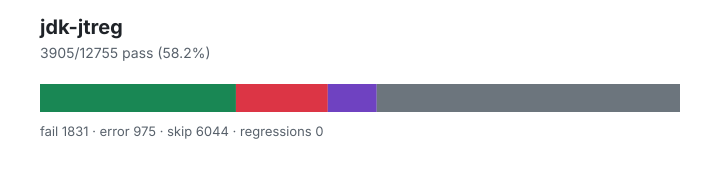

# jdk-jtreg — `0.6.0`

- Image digest: `6590c3ba50c03ef180625219bdee46003c59af8a795b7531f4d20b89af1dbd3b`
- Suite version: `unknown`
- Ran: 2026-09-20T17:25:50.021Z → 2026-09-21T00:25:45.274Z

## Summary

**Pass rate: 3905/12755 (58.19%)**

| pass | fail | error | skip | regressions | new passes |
|---:|---:|---:|---:|---:|---:|
| 3905 | 1831 | 975 | 6044 | 0 | 0 |

## Observed cases (6711)

- `build/releaseFile/CheckReleaseFile.java` — fail — Failed. Execution failed\: `main' threw exception\: java.lang.RuntimeException\: JAVA_RUNTIME_VERSION line was not found\!
- `com/sun/crypto/provider/AlgorithmParameters/EC/CurveGetParameterSpec.java` — pass
- `com/sun/crypto/provider/AlgorithmParameters/OAEPOrder.java` — pass
- `com/sun/crypto/provider/CICO/CICOChainingTest.java` — pass
- `com/sun/crypto/provider/CICO/CICODESFuncTest.java` — pass
- `com/sun/crypto/provider/CICO/CICOSkipTest.java` — pass
- `com/sun/crypto/provider/CICO/PBEFunc/CICOPBEFuncTest.java` — pass
- `com/sun/crypto/provider/CICO/PBEFunc/CipherNCFuncTest.java` — pass
- `com/sun/crypto/provider/Cipher/AEAD/AEADBufferTest.java` — pass
- `com/sun/crypto/provider/Cipher/AEAD/Encrypt.java` — pass
- `com/sun/crypto/provider/Cipher/AEAD/GCMLargeDataKAT.java` — pass
- `com/sun/crypto/provider/Cipher/AEAD/GCMParameterSpecTest.java` — pass
- `com/sun/crypto/provider/Cipher/AEAD/GCMShortBuffer.java` — pass
- `com/sun/crypto/provider/Cipher/AEAD/GCMShortInput.java` — pass
- `com/sun/crypto/provider/Cipher/AEAD/KeyWrapper.java` — pass
- `com/sun/crypto/provider/Cipher/AEAD/OverlapByteBuffer.java` — pass
- `com/sun/crypto/provider/Cipher/AEAD/ReadWriteSkip.java` — pass
- `com/sun/crypto/provider/Cipher/AEAD/SameBuffer.java` — pass
- `com/sun/crypto/provider/Cipher/AEAD/SealedObjectTest.java` — pass
- `com/sun/crypto/provider/Cipher/AEAD/WrongAAD.java` — pass
- `com/sun/crypto/provider/Cipher/AES/CICO.java` — pass
- `com/sun/crypto/provider/Cipher/AES/CTR.java` — pass
- `com/sun/crypto/provider/Cipher/AES/Padding.java` — pass
- `com/sun/crypto/provider/Cipher/AES/Test4511676.java` — pass
- `com/sun/crypto/provider/Cipher/AES/Test4512524.java` — pass
- `com/sun/crypto/provider/Cipher/AES/Test4512704.java` — pass
- `com/sun/crypto/provider/Cipher/AES/Test4513830.java` — pass
- `com/sun/crypto/provider/Cipher/AES/Test4517355.java` — pass
- `com/sun/crypto/provider/Cipher/AES/Test4626070.java` — pass
- `com/sun/crypto/provider/Cipher/AES/TestAESCipher.java` — pass
- `com/sun/crypto/provider/Cipher/AES/TestAESCiphers/TestAESWithDefaultProvider.java` — pass
- `com/sun/crypto/provider/Cipher/AES/TestAESCiphers/TestAESWithProviderChange.java` — fail — Failed. Execution failed\: `main' threw exception\: java.lang.Exception\: Test Failed
- `com/sun/crypto/provider/Cipher/AES/TestAESCiphers/TestAESWithRemoveAddProvider.java` — pass
- `com/sun/crypto/provider/Cipher/AES/TestCICOWithGCM.java` — pass
- `com/sun/crypto/provider/Cipher/AES/TestCICOWithGCMAndAAD.java` — pass
- `com/sun/crypto/provider/Cipher/AES/TestCopySafe.java` — pass
- `com/sun/crypto/provider/Cipher/AES/TestGCMKeyAndIvCheck.java` — pass
- `com/sun/crypto/provider/Cipher/AES/TestGHASH.java` — pass
- `com/sun/crypto/provider/Cipher/AES/TestISO10126Padding.java` — pass
- `com/sun/crypto/provider/Cipher/AES/TestKATForECB_IV.java` — pass
- `com/sun/crypto/provider/Cipher/AES/TestKATForECB_VK.java` — pass
- `com/sun/crypto/provider/Cipher/AES/TestKATForECB_VT.java` — pass
- `com/sun/crypto/provider/Cipher/AES/TestKATForGCM.java` — pass
- `com/sun/crypto/provider/Cipher/AES/TestNoPaddingModes.java` — pass
- `com/sun/crypto/provider/Cipher/AES/TestNonexpanding.java` — pass
- `com/sun/crypto/provider/Cipher/AES/TestSameBuffer.java` — pass
- `com/sun/crypto/provider/Cipher/AES/TestShortBuffer.java` — pass
- `com/sun/crypto/provider/Cipher/Blowfish/BlowfishTestVector.java` — pass
- `com/sun/crypto/provider/Cipher/Blowfish/TestCipherBlowfish.java` — pass
- `com/sun/crypto/provider/Cipher/CTR/CounterMode.java` — pass
- `com/sun/crypto/provider/Cipher/CTS/CTSMode.java` — pass
- `com/sun/crypto/provider/Cipher/ChaCha20/ChaCha20KAT.java` — pass
- `com/sun/crypto/provider/Cipher/ChaCha20/ChaCha20KeyGeneratorTest.java` — pass
- `com/sun/crypto/provider/Cipher/ChaCha20/ChaCha20NoReuse.java` — pass
- `com/sun/crypto/provider/Cipher/ChaCha20/ChaCha20Poly1305ParamTest.java` — pass
- `com/sun/crypto/provider/Cipher/ChaCha20/OutputSizeTest.java` — pass
- `com/sun/crypto/provider/Cipher/ChaCha20/unittest/ChaCha20CipherUnitTest.java` — pass
- `com/sun/crypto/provider/Cipher/ChaCha20/unittest/ChaCha20Poly1305ParametersUnitTest.java` — pass
- `com/sun/crypto/provider/Cipher/ChaCha20/unittest/Poly1305UnitTestDriver.java` — fail — #id0: Failed. Unexpected exit from test [exit code\: 1]
- `com/sun/crypto/provider/Cipher/DES/DESKeyCleanupTest.java` — pass
- `com/sun/crypto/provider/Cipher/DES/DESSecretKeySpec.java` — pass
- `com/sun/crypto/provider/Cipher/DES/DesAPITest.java` — pass
- `com/sun/crypto/provider/Cipher/DES/DoFinalReturnLen.java` — pass
- `com/sun/crypto/provider/Cipher/DES/FlushBug.java` — pass
- `com/sun/crypto/provider/Cipher/DES/KeyWrapping.java` — pass
- `com/sun/crypto/provider/Cipher/DES/PaddingTest.java` — pass
- `com/sun/crypto/provider/Cipher/DES/PerformanceTest.java` — pass
- `com/sun/crypto/provider/Cipher/DES/Sealtest.java` — pass
- `com/sun/crypto/provider/Cipher/DES/TestCipherDES.java` — pass
- `com/sun/crypto/provider/Cipher/DES/TestCipherDESede.java` — pass
- `com/sun/crypto/provider/Cipher/DES/TextPKCS5PaddingTest.java` — pass
- `com/sun/crypto/provider/Cipher/JCE/Bugs/4686632/Empty.java` — pass
- `com/sun/crypto/provider/Cipher/KeyWrap/NISTWrapKAT.java` — pass
- `com/sun/crypto/provider/Cipher/KeyWrap/TestCipherKeyWrapperTest.java` — pass
- `com/sun/crypto/provider/Cipher/KeyWrap/TestGeneral.java` — pass
- `com/sun/crypto/provider/Cipher/KeyWrap/TestKeySizeCheck.java` — pass
- `com/sun/crypto/provider/Cipher/KeyWrap/XMLEncKAT.java` — pass
- `com/sun/crypto/provider/Cipher/PBE/CheckPBEKeySize.java` — pass
- `com/sun/crypto/provider/Cipher/PBE/DecryptWithoutParameters.java` — pass
- `com/sun/crypto/provider/Cipher/PBE/NegativeLength.java` — pass
- `com/sun/crypto/provider/Cipher/PBE/PBEInvalidParamsTest.java` — pass
- `com/sun/crypto/provider/Cipher/PBE/PBEKeyCleanupTest.java` — error — Error. Program `/opt/bali/bin/java' timed out (timeout set to 240000ms, elapsed time including timeout handling was 240010ms).
- `com/sun/crypto/provider/Cipher/PBE/PBEKeyTest.java` — pass
- `com/sun/crypto/provider/Cipher/PBE/PBEKeysAlgorithmNames.java` — pass
- `com/sun/crypto/provider/Cipher/PBE/PBEParametersTest.java` — pass
- `com/sun/crypto/provider/Cipher/PBE/PBES2Test.java` — pass
- `com/sun/crypto/provider/Cipher/PBE/PBESameBuffer/PBESameBuffer.java` — pass
- `com/sun/crypto/provider/Cipher/PBE/PBESealedObject.java` — pass
- `com/sun/crypto/provider/Cipher/PBE/PBKDF2Translate.java` — pass
- `com/sun/crypto/provider/Cipher/PBE/PBMacBuffer.java` — pass
- `com/sun/crypto/provider/Cipher/PBE/PBMacDoFinalVsUpdate.java` — pass
- `com/sun/crypto/provider/Cipher/PBE/PKCS12Cipher.java` — pass
- `com/sun/crypto/provider/Cipher/PBE/PKCS12CipherKAT.java` — pass
- `com/sun/crypto/provider/Cipher/PBE/PKCS12Oid.java` — pass
- `com/sun/crypto/provider/Cipher/PBE/TestCipherKeyWrapperPBEKey.java` — pass
- `com/sun/crypto/provider/Cipher/PBE/TestCipherPBE.java` — pass
- `com/sun/crypto/provider/Cipher/PBE/TestCipherPBECons.java` — pass
- `com/sun/crypto/provider/Cipher/RC2ArcFour/CipherKAT.java` — pass
- `com/sun/crypto/provider/Cipher/RSA/TestOAEP.java` — pass
- `com/sun/crypto/provider/Cipher/RSA/TestOAEPPadding.java` — pass
- `com/sun/crypto/provider/Cipher/RSA/TestOAEPParameterSpec.java` — pass
- `com/sun/crypto/provider/Cipher/RSA/TestOAEPWithParams.java` — pass
- `com/sun/crypto/provider/Cipher/RSA/TestOAEP_KAT.java` — pass
- `com/sun/crypto/provider/Cipher/RSA/TestRSA.java` — pass
- `com/sun/crypto/provider/Cipher/Test4958071.java` — pass
- `com/sun/crypto/provider/Cipher/TextLength/SameBufferOverwrite.java` — pass
- `com/sun/crypto/provider/Cipher/TextLength/TestCipherTextLength.java` — pass
- `com/sun/crypto/provider/Cipher/UTIL/StrongOrUnlimited.java` — pass
- `com/sun/crypto/provider/Cipher/UTIL/SunJCEGetInstance.java` — pass
- `com/sun/crypto/provider/DHKEM/Compliance.java` — fail — Failed. Unexpected exit from test [exit code\: 1]
- `com/sun/crypto/provider/DHKEM/NameSensitiveness.java` — pass
- `com/sun/crypto/provider/KDF/HKDFBasicFunctionsTest.java` — pass
- `com/sun/crypto/provider/KDF/HKDFDelayedPRK.java` — fail — Failed. Unexpected exit from test [exit code\: 1]
- `com/sun/crypto/provider/KDF/HKDFExhaustiveTest.java` — pass
- `com/sun/crypto/provider/KDF/HKDFKnownAnswerTests.java` — pass
- `com/sun/crypto/provider/KDF/HKDFSaltIKMTest.java` — pass
- `com/sun/crypto/provider/KeyAgreement/DHGenSharedSecret.java` — pass
- `com/sun/crypto/provider/KeyAgreement/DHKeyAgreement2.java` — fail — Failed. Execution failed\: `main' threw exception\: java.security.NoSuchAlgorithmException\: Unsupported secret key algorithm\: DES
- `com/sun/crypto/provider/KeyAgreement/DHKeyAgreement3.java` — pass
- `com/sun/crypto/provider/KeyAgreement/DHKeyAgreementPadding.java` — pass
- `com/sun/crypto/provider/KeyAgreement/DHKeyFactory.java` — pass
- `com/sun/crypto/provider/KeyAgreement/DHKeyGenSpeed.java` — pass
- `com/sun/crypto/provider/KeyAgreement/ECKeyCheck.java` — pass
- `com/sun/crypto/provider/KeyAgreement/SameDHKeyStressTest.java` — fail — Failed. Execution failed\: `main' threw exception\: java.lang.RuntimeException\: SameDHKeyStressTest Failed
- `com/sun/crypto/provider/KeyAgreement/SupportedDHKeys.java` — pass
- `com/sun/crypto/provider/KeyAgreement/SupportedDHParamGens.java` — pass
- `com/sun/crypto/provider/KeyAgreement/SupportedDHParamGensLongKey.java` — pass
- `com/sun/crypto/provider/KeyAgreement/TestExponentSize.java` — pass
- `com/sun/crypto/provider/KeyAgreement/UnsupportedDHKeys.java` — pass
- `com/sun/crypto/provider/KeyFactory/PBEKeyDestroyTest.java` — pass
- `com/sun/crypto/provider/KeyFactory/PBKDF2HmacSHA1FactoryTest.java` — pass
- `com/sun/crypto/provider/KeyFactory/TestProviderLeak.java` — pass
- `com/sun/crypto/provider/KeyGenerator/Test4628062.java` — pass
- `com/sun/crypto/provider/KeyGenerator/Test6227536.java` — pass
- `com/sun/crypto/provider/KeyGenerator/TestExplicitKeyLength.java` — pass
- `com/sun/crypto/provider/KeyProtector/IterationCount.java` — fail — Failed. Execution failed\: `main' threw exception\: java.lang.RuntimeException\: Expected to get exit value of [0], exit value is\: [1]
- `com/sun/crypto/provider/Mac/DigestCloneabilityTest.java` — pass
- `com/sun/crypto/provider/Mac/EmptyByteBufferTest.java` — pass
- `com/sun/crypto/provider/Mac/HmacMD5.java` — pass
- `com/sun/crypto/provider/Mac/HmacPBESHA1.java` — pass
- `com/sun/crypto/provider/Mac/HmacSHA512.java` — pass
- `com/sun/crypto/provider/Mac/HmacSaltLengths.java` — pass
- `com/sun/crypto/provider/Mac/LargeByteBufferTest.java` — pass
- `com/sun/crypto/provider/Mac/MacClone.java` — pass
- `com/sun/crypto/provider/Mac/MacKAT.java` — pass
- `com/sun/crypto/provider/Mac/MacSameTest.java` — pass
- `com/sun/crypto/provider/Mac/NullByteBufferTest.java` — pass
- `com/sun/crypto/provider/Mac/Test6205692.java` — pass
- `com/sun/crypto/provider/NSASuiteB/TestAESOids.java` — pass
- `com/sun/crypto/provider/NSASuiteB/TestAESWrapOids.java` — pass
- `com/sun/crypto/provider/NSASuiteB/TestHmacSHAOids.java` — pass
- `com/sun/crypto/provider/TLS/TestKeyMaterial.java` — pass
- `com/sun/crypto/provider/TLS/TestLeadingZeroes.java` — pass
- `com/sun/crypto/provider/TLS/TestMasterSecret.java` — pass
- `com/sun/crypto/provider/TLS/TestPRF.java` — pass
- `com/sun/crypto/provider/TLS/TestPRF12.java` — pass
- `com/sun/crypto/provider/TLS/TestPremaster.java` — pass
- `com/sun/jmx/mbeanserver/introspector/SimpleIntrospectorTest.java` — pass
- `com/sun/jmx/remote/CCAdminReconnectTest.java` — pass
- `com/sun/jmx/remote/NotificationMarshalVersions/TestSerializationMismatch.java` — fail — Failed. Unexpected exit from test [exit code\: 134]
- `com/sun/jndi/dns/AttributeTests/GetAny.java` — pass
- `com/sun/jndi/dns/AttributeTests/GetAttrs.java` — pass
- `com/sun/jndi/dns/AttributeTests/GetAttrsEmptyAttrIds.java` — pass
- `com/sun/jndi/dns/AttributeTests/GetAttrsNonExistentAttrIds.java` — pass
- `com/sun/jndi/dns/AttributeTests/GetAttrsNotFound.java` — pass
- `com/sun/jndi/dns/AttributeTests/GetAttrsNullAttrIds.java` — pass
- `com/sun/jndi/dns/AttributeTests/GetAttrsSomeAttrIds.java` — pass
- `com/sun/jndi/dns/AttributeTests/GetNonstandard.java` — pass
- `com/sun/jndi/dns/AttributeTests/GetNumericIRRs.java` — pass
- `com/sun/jndi/dns/AttributeTests/GetNumericRRs.java` — pass
- `com/sun/jndi/dns/AttributeTests/GetRRs.java` — pass
- `com/sun/jndi/dns/CheckAccess.java` — pass
- `com/sun/jndi/dns/ConfigTests/AuthTest.java` — fail — Failed. Execution failed\: `main' threw exception\: javax.naming.NoInitialContextException\: Need to specify class name in environment or system property, or in an application resource file\: java.naming.factory.initial
- `com/sun/jndi/dns/ConfigTests/PortUnreachable.java` — pass
- `com/sun/jndi/dns/ConfigTests/RecursiveTest.java` — fail — Failed. Execution failed\: `main' threw exception\: javax.naming.NoInitialContextException\: Need to specify class name in environment or system property, or in an application resource file\: java.naming.factory.initial
- `com/sun/jndi/dns/ConfigTests/TcpTimeout.java` — pass
- `com/sun/jndi/dns/ConfigTests/Timeout.java` — pass
- `com/sun/jndi/dns/ConfigTests/TimeoutWithEmptyDatagrams.java` — pass
- `com/sun/jndi/dns/EnvTests/AddInherited.java` — pass
- `com/sun/jndi/dns/EnvTests/AddOps.java` — error — Failed. Execution failed\: `main' threw exception\: javax.naming.CommunicationException\: DNS error [Root exception is java.net.SocketTimeoutException]; remaining name 'dns\://localhost\:45955/host1.domain1.com.'
- `com/sun/jndi/dns/EnvTests/GetEnv.java` — pass
- `com/sun/jndi/dns/EnvTests/ProviderUrlGen.java` — fail — Failed. Execution failed\: `main' threw exception\: org.graalvm.nativeimage.MissingReflectionRegistrationError\: Cannot reflectively invoke method 'public static boolean com.sun.jndi.dns.DnsContextFactory.platformServersAvailable()'. To allow this operation, add the following to the 'reflection' section of 'reachability-metadata.json' and rebuild the native image\: { "type"\: "com.sun.jndi.dns.DnsContextFactory", "methods"\: [ { "name"\: "platformServersAvailable", "parameterTypes"\: [] } ] } The 'reachability-metadata.json' file should be located in 'META-INF/native-image/<group-id>/<artifact-id>/' of your project. For further help, see https\://www.graalvm.org/latest/reference-manual/native-image/metadata/\#reflection
- `com/sun/jndi/dns/EnvTests/RemoveInherited.java` — pass
- `com/sun/jndi/dns/EnvTests/RemoveOps.java` — error — Failed. Execution failed\: `main' threw exception\: javax.naming.CommunicationException\: DNS error [Root exception is java.net.SocketTimeoutException]; remaining name 'dns\://localhost\:40119/host1.domain1.com.'
- `com/sun/jndi/dns/EnvTests/SubcontextAdd.java` — pass
- `com/sun/jndi/dns/EnvTests/SubcontextRemove.java` — pass
- `com/sun/jndi/dns/FactoryTests/GetAttrsWithFactory.java` — pass
- `com/sun/jndi/dns/FactoryTests/LookupWithAnyAttrProp.java` — pass
- `com/sun/jndi/dns/FactoryTests/LookupWithAttrProp.java` — pass
- `com/sun/jndi/dns/FactoryTests/LookupWithDirFactory.java` — pass
- `com/sun/jndi/dns/FactoryTests/LookupWithFactory.java` — pass
- `com/sun/jndi/dns/FedTests/CannotProceed.java` — pass
- `com/sun/jndi/dns/FedTests/GetAttrsNns.java` — pass
- `com/sun/jndi/dns/FedTests/GetAttrsSubInterior.java` — pass
- `com/sun/jndi/dns/FedTests/GetAttrsSubLeaf.java` — pass
- `com/sun/jndi/dns/FedTests/ListNns.java` — pass
- `com/sun/jndi/dns/FedTests/ListSubInterior.java` — pass
- `com/sun/jndi/dns/FedTests/ListSubLeaf.java` — pass
- `com/sun/jndi/dns/FedTests/LookupNns.java` — pass
- `com/sun/jndi/dns/FedTests/LookupSubInterior.java` — pass
- …and 6511 more
