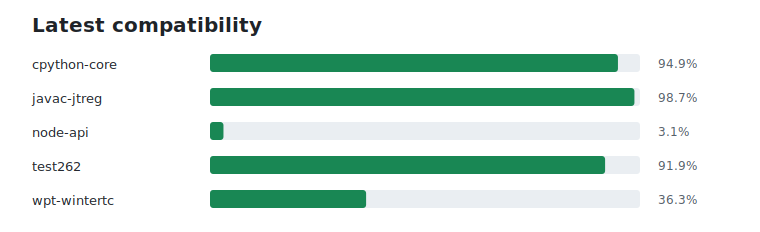

# Elide compliance reports

| Suite | Version | Digest | Pass rate | Status |
|---|---|---|---:|:--:|
| cpython-core | `1.3.5+20260628.3b80cf3` | `c8be44d98f1f` | 83.3% | ✅ |
| javac-jtreg | `1.3.5+20260626.bfb28f6` | `c8be44d98f1f` | 98.8% | ✅ |
| test262 | `1.3.5+20260626.bfb28f6` | `c8be44d98f1f` | 91.8% | ✅ |
| wpt-wintertc | `1.3.5+20260626.bfb28f6` | `c8be44d98f1f` | 82.8% | ✅ |
