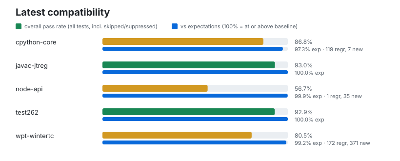

# Elide compliance reports

| Suite | Version | Digest | Pass rate | Status |
|---|---|---|---:|:--:|
| cpython-core | `1.4.1+20260716.b8b6531` | `3d3ea83ed640` | 95.9% | ✅ |
| javac-jtreg | `1.4.1+20260716.b8b6531` | `3d3ea83ed640` | 98.7% | ✅ |
| test262 | `1.4.1+20260716.b8b6531` | `3d3ea83ed640` | 99.8% | ✅ |
