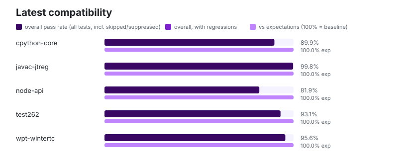

# Elide compliance reports

| Suite | Version | Digest | Pass rate | vs expectations | Status |
|---|---|---|---:|---:|:--:|
| cpython-core | `1.6.0+6e718933f` | `4cbcae6c33a8` | 89.9% | 100.0% | ✅ |
| javac-jtreg | `1.6.0+6e718933f` | `4cbcae6c33a8` | 99.8% | 100.0% | ✅ |
| node-api | `1.6.0+6e718933f` | `4cbcae6c33a8` | 81.9% | 100.0% | ✅ |
| test262 | `1.6.0+6e718933f` | `4cbcae6c33a8` | 93.1% | 100.0% | ✅ |
| wpt-wintertc | `1.6.0+6e718933f` | `4cbcae6c33a8` | 95.6% | 100.0% | ✅ |

_Pass rate_ is over every test in the selection, including skipped/suppressed ones.
_vs expectations_ is the share of tests at or above the checked-in baseline (only regressions count against it).
⬆️ marks a run with regressions **and** new passes: the floor advanced; run with --ratchet to update the baseline.
